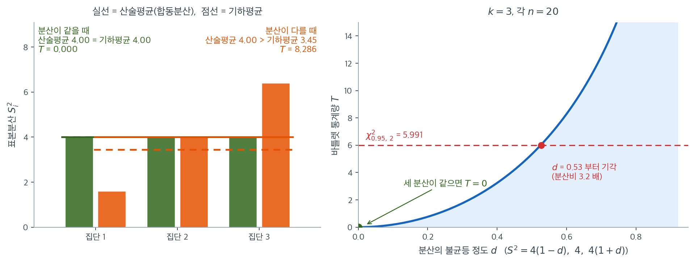

# 분산의 동일성에 대한 Bartlett 검정


Bartlett 검정은 여러 집단에 걸친 분산의 동일성을 평가한다. 정규성 이탈에 매우 민감하므로 자료가 정규분포를 따를 때 가장 적절하다. 정규성 가정 아래에서는 강력하지만 자료가 비정규이면 잘못된 결론으로 이어질 수 있다.

---

## 1. 가설

**귀무가설 ($H_0$):** 모든 집단의 분산이 같다.

$$
H_0: \sigma_1^2 = \sigma_2^2 = \dots = \sigma_k^2
$$

**대립가설 ($H_1$):** 적어도 한 집단의 분산이 다른 집단과 다르다.

$$
H_1: \sigma_i^2 \neq \sigma_j^2 \quad \text{(적어도 한 쌍의)} \quad i \neq j
$$

---

## 2. 가정

1. **정규성:** Bartlett 검정은 각 집단의 자료가 정규분포를 따른다고 가정한다. 검정이 정규성 이탈에 매우 민감하므로 결정적이다.
2. **독립성:** 관측값이 집단 안에서도 집단 사이에서도 독립이어야 한다.
3. **확률표집:** 자료가 확률표본에서 나와야 한다.

---

## 3. 검정통계량

Bartlett 검정의 검정통계량은 합동분산과 개별 표본분산의 비에서 유도된다.

$$
T = \frac{(N - k) \ln(S_p^2) - \sum_{i=1}^k (n_i - 1) \ln(S_i^2)}{1 + \frac{1}{3(k - 1)} \left( \sum_{i=1}^k \frac{1}{n_i - 1} - \frac{1}{N - k} \right)} \sim \chi^2_{k-1}
$$

여기서

- $N$은 전체 관측값의 수,
- $k$는 집단의 수,
- $S_p^2$은 합동분산이다.

$$
S_p^2 = \frac{\sum_{i=1}^k (n_i - 1) S_i^2}{N - k}
$$

- $S_i^2$은 집단 $i$의 표본분산이다.

검정통계량 $T$는 자유도 $k - 1$인 카이제곱분포를 따른다.

분자는 항상 음이 아니라는 점에 주목하라. 산술평균-기하평균 부등식에 의해 합동분산(가중 산술평균)이 개별 분산의 가중 기하평균보다 크거나 같기 때문이다. 등호는 모든 $S_i^2$이 같을 때만 성립하며, 그때 $T = 0$이다.



왼쪽에서 초록은 세 표본분산이 모두 $4$인 경우다. 산술평균도 $4$, 기하평균도 $4$여서 실선과 점선이 포개지고 $T = 0$이 된다. 주황은 $1.6,\ 4.0,\ 6.4$로 흩어진 경우인데, **산술평균은 여전히 $4.00$인데 기하평균은 $3.45$로 내려앉는다.** 평균이 같은데도 두 선이 벌어진 것이다.

이 벌어진 간격이 바로 통계량이다. $T$의 분자 $(N-k)\ln S_p^2 - \sum \nu_i \ln S_i^2$은 정확히 $\ln(\text{산술평균}) - \ln(\text{기하평균})$에 자유도를 곱한 것이고, 로그는 단조함수이므로 두 평균의 비가 1에서 멀어질수록 커진다. 주황의 $T = 8.286$이 임계값 $5.991$을 넘으므로 기각한다.

**기하평균이 흩어짐에 민감하다는 점이 이 검정의 엔진이다.** 산술평균은 큰 값이 작은 값을 상쇄해 주지만, 기하평균은 작은 값 하나에 강하게 끌려 내려간다. 그래서 값들이 흩어질수록 두 평균의 간격이 벌어지고, 그 간격이 "분산이 같지 않다"는 증거가 된다.

오른쪽은 흩어짐의 정도를 연속적으로 바꿔 본 것이다. $d = 0$에서 $T = 0$으로 출발해 $d$가 커질수록 가속하며 올라간다. $k = 3$, 각 $n = 20$에서 $\chi^2_{0.95,2} = 5.991$을 넘는 것은 $d = 0.53$부터, 곧 **최대분산과 최소분산의 비가 약 3.2배는 되어야** 5% 수준에서 기각한다는 뜻이다. 분산 검정이 둔하다는 이 장의 주제가 바틀렛에서도 그대로 나타난다.

---

## 4. 판정규칙

$$
T > \chi^2_{\text{critical}} \quad \Rightarrow \quad H_0 \text{ 기각}
$$

$k = 3$이고 $\alpha = 0.05$이면 $\chi^2_{0.95, 2} = 5.991$이다.

---

## 5. 한계

Bartlett 검정은 정규성 가정의 위반에 로버스트하지 않다. 자료가 정규분포를 따르지 않으면 Levene 검정이나 Brown-Forsythe 검정 같은 대안을 고려해야 한다. 얼마나 심각한지는 15.4절의 [비정규성 아래의 한계](limitations.md)에서 수치로 다룬다.

### SciPy 이용

<div class="exbox" markdown>

**보기 1.** <span class="diff easy" title="쉬움"></span> Bartlett 검정. 평균은 크게 다르지만 퍼짐은 비슷한 세 집단에 `scipy.stats.bartlett` 을 한 줄로 적용한다. 세 집단은 각 $n = 8$이다.

**(1)** 세 표본분산을 손으로 구하고, 그중 **둘이 정확히 같은 까닭**을 자료에서 찾아 밝히시오. 또 $k = 3$일 때 $p$값이 $e^{-T/2}$라는 닫힌 꼴로 적힘을 보이시오.

**(2)** `scipy` 로 확인하고, 집단마다 아무 상수를 더하거나 전체에 상수를 곱해도 $T$가 바뀌지 않음을 수치로 확인하시오. 분산비가 $2.1$배나 되는데도 기각하지 못하는 까닭은 무엇인가.

</div>

??? success "풀이"

    **(1) 표본분산 셋.** 첫째 집단은 합이 $101$이므로 $\bar y_1 = 101/8 = 12.625$이고, 편차의 제곱합은

    $$
    \sum_j (y_{1j} - \bar y_1)^2 = 19.875
    \quad\Longrightarrow\quad
    S_1^2 = \frac{19.875}{7} = 2.839286
    $$

    이다. 둘째 집단은 합이 $172$이므로 $\bar y_2 = 21.5$이고, 편차가 $\pm 0.5, \pm 1.5, \pm 2.5, \pm 3.5$로 딱 떨어져 제곱합이 $2(0.25 + 2.25 + 6.25 + 12.25) = 42$다. 따라서

    $$
    S_2^2 = \frac{42}{7} = 6
    $$

    으로 **정확히 6**이다.

    **셋째 집단은 계산할 필요가 없다.** 자료를 들여다보면

    $$
    (32, 35, 34, 30, 33, 34, 32, 31) = (12, 15, 14, 10, 13, 14, 12, 11) + 20
    $$

    으로 **첫째 집단을 20 만큼 옮긴 것**이다. 표본분산은 위치이동에 불변이다. 모든 관측값에 $c$를 더하면 평균도 $c$만큼 커지므로 편차 $y_j - \bar y$가 그대로이고

    $$
    S^2(y + c) = \frac{1}{n-1}\sum_j \bigl((y_j + c) - (\bar y + c)\bigr)^2 = S^2(y)
    $$

    이다. 그러므로 $S_3^2 = S_1^2 = 2.839286$이 **어림이 아니라 정확히** 성립한다.

    표본크기가 모두 같으므로 합동분산은 그냥 산술평균이다.

    $$
    S_p^2 = \frac{7(S_1^2 + S_2^2 + S_3^2)}{21} = \frac{2.839286 + 6 + 2.839286}{3} = 3.892857
    $$

    최대·최소 분산비는 $6/2.839286 = 2.1132$다.

    **검정통계량이 평균을 아예 보지 않는다.** $T$의 식에 자료가 들어가는 통로는 $S_1^2, \ldots, S_k^2$ 뿐이고, 방금 본 대로 각 $S_i^2$이 그 집단의 위치이동에 불변이다. 그래서 세 집단의 평균이 $12.6$, $21.5$, $32.6$으로 한참 떨어져 있어도 $T$는 꿈쩍하지 않는다. 척도에 대해서도 비슷한 일이 벌어진다. 모든 자료에 $a$를 곱하면 $S_i^2 \mapsto a^2 S_i^2$이 되는데, $T$의 분자가 가중 산술평균과 가중 기하평균의 **로그비**라서

    $$
    \ln \frac{a^2 \cdot \mathrm{AM}}{a^2 \cdot \mathrm{GM}} = \ln \frac{\mathrm{AM}}{\mathrm{GM}}
    $$

    로 $a^2$이 약분된다. **결국 $T$는 분산들의 비에만 의존한다.**

    **$k = 3$이면 $p$값이 닫힌 꼴이다.** 자유도 $k - 1 = 2$인 카이제곱분포의 밀도는 지수분포 그 자체다.

    $$
    f_{\chi^2_2}(x) = \frac{1}{2}e^{-x/2}, \quad x > 0
    \quad\Longrightarrow\quad
    P(\chi^2_2 > t) = \int_t^\infty \frac{1}{2}e^{-x/2}\,dx = e^{-t/2}
    $$

    그러므로

    $$
    p = e^{-T/2}
    $$

    이다. 세 집단을 비교할 때는 통계량만 보고 $p$값을 머릿속에서 환산할 수 있다는 뜻이다. ($T = 5.991$을 넣으면 $e^{-2.9957} = 0.050$으로 임계값도 되돌아온다.)

    **(2) 수치적으로.**

    ```python
    import numpy as np
    from scipy.stats import bartlett
    from scipy.optimize import brentq
    from scipy.stats import chi2

    # 평균은 크게 다르지만 퍼짐은 비슷한 세 집단이다.
    group1 = [12, 15, 14, 10, 13, 14, 12, 11]
    group2 = [22, 25, 20, 18, 24, 23, 19, 21]
    group3 = [32, 35, 34, 30, 33, 34, 32, 31]

    # 셋째 집단은 첫째 집단을 20 만큼 옮긴 것일 뿐이다.
    print("group3 - group1 =", np.array(group3) - np.array(group1))
    print("평균      :", [float(np.mean(g)) for g in (group1, group2, group3)])
    print("표본분산  :", [round(float(np.var(g, ddof=1)), 6) for g in (group1, group2, group3)])
    S = [float(np.var(g, ddof=1)) for g in (group1, group2, group3)]
    print(f"합동분산  : {np.mean(S):.6f}      최대/최소 비 = {max(S) / min(S):.4f}")

    # Bartlett 검정은 가능도비 검정에서 나온 것이라 정규모집단에서 검정력이
    # 가장 높다. 대신 정규성이 깨지면 오류율이 크게 부풀어 오른다.
    statistic, p_value = bartlett(group1, group2, group3)

    # 결과 출력
    print(f"\nBartlett's test statistic: {statistic:.4f}")
    print(f"P-value: {p_value:.4f}")

    # 결과 해석
    alpha = 0.05
    if p_value < alpha:
        print("Reject H0: variances are significantly different.")
    else:
        print("Fail to reject H0: no significant difference in variances.")

    # k=3 이면 자유도가 2 이므로 p 값이 닫힌 꼴 exp(-T/2) 이다.
    print(f"\nexp(-T/2)     = {np.exp(-statistic / 2):.12f}")
    print(f"chi2.sf(T, 2) = {p_value:.12f}")

    # 위치불변성과 척도불변성: 집단마다 아무 상수를 더하고 전체에 상수를 곱해도
    # 통계량이 바뀌지 않는다.
    moved = bartlett(np.array(group1) + 1000.0,
                     np.array(group2) - 37.5,
                     np.array(group3) + 0.25)
    scaled = bartlett(np.array(group1) * 7.0,
                      np.array(group2) * 7.0,
                      np.array(group3) * 7.0)
    print(f"\n집단마다 옮긴 뒤 : T = {moved.statistic:.12f}  (차 {abs(moved.statistic - statistic):.1e})")
    print(f"전체를 7배한 뒤  : T = {scaled.statistic:.12f}  (차 {abs(scaled.statistic - statistic):.1e})")

    # n=8, k=3, 분산이 (1, 1, r) 꼴일 때 5% 수준에서 기각하려면 r 이 얼마여야 하는가.
    def T_of(r, n, k=3):
        v = np.array([1.0] * (k - 1) + [r])
        C = 1 + (k + 1) / (3 * k * (n - 1))
        return k * (n - 1) / C * np.log(v.mean() / np.exp(np.mean(np.log(v))))

    crit = chi2.ppf(0.95, 2)
    print(f"\nchi2_(0.95, 2) = {crit:.4f}")
    for n in (8, 20, 50):
        r_need = brentq(lambda r: T_of(r, n) - crit, 1.0001, 1e4)
        print(f"  n={n:3d}:  기각에 필요한 분산비 r = {r_need:.3f}"
              f"   (관측된 r={max(S) / min(S):.3f} 에서는 T = {T_of(max(S) / min(S), n):.4f})")
    ```

    출력:

    ```text
    group3 - group1 = [20 20 20 20 20 20 20 20]
    평균      : [12.625, 21.5, 32.625]
    표본분산  : [2.839286, 6.0, 2.839286]
    합동분산  : 3.892857      최대/최소 비 = 2.1132

    Bartlett's test statistic: 1.3070
    P-value: 0.5202
    Fail to reject H0: no significant difference in variances.

    exp(-T/2)     = 0.520227866042
    chi2.sf(T, 2) = 0.520227866042

    집단마다 옮긴 뒤 : T = 1.306976718925  (차 0.0e+00)
    전체를 7배한 뒤  : T = 1.306976718925  (차 6.7e-15)

    chi2_(0.95, 2) = 5.9915
      n=  8:  기각에 필요한 분산비 r = 4.903   (관측된 r=2.113 에서는 T = 1.3070)
      n= 20:  기각에 필요한 분산비 r = 2.585   (관측된 r=2.113 에서는 T = 3.6865)
      n= 50:  기각에 필요한 분산비 r = 1.809   (관측된 r=2.113 에서는 T = 9.6423)
    ```

    **(1)의 세 주장이 모두 맞는다.** `group3 - group1` 이 $20$ 으로 가득 찬 배열이라 셋째 집단이 첫째 집단의 평행이동임이 눈으로 확인되고, 표본분산이 $2.839286$, $6.0$, $2.839286$으로 첫째와 셋째가 소수점 여섯째 자리까지 같다. 합동분산도 손으로 구한 $3.892857$과 맞는다. 그리고 $e^{-T/2}$와 `chi2.sf(T, 2)` 가 소수점 열두째 자리까지 $0.520227866042$로 같다.

    **불변성도 확인된다.** 세 집단을 각각 $+1000$, $-37.5$, $+0.25$만큼 옮겨도 $T$가 **비트 단위로 같다**(차가 정확히 $0$). 전체에 $7$을 곱한 경우는 차가 $6.7\times10^{-15}$인데, 수학적으로는 정확히 같고 부동소수점 반올림만 남은 것이다. 평균이 $12.6$에서 $1012.6$으로 바뀌어도 분산 검정은 아무것도 느끼지 못한다.

    **분산비 $2.1$배로는 모자란다.** 마지막 표가 그 이유를 말해 준다. $k = 3$이고 분산이 $(1, 1, r)$ 꼴일 때 $n = 8$에서 $5\%$ 수준에 닿으려면 $r = 4.90$이어야 한다. 관측된 $r = 2.113$은 그 절반에도 못 미치므로 $T = 1.3070$에 머문다. (이 자료의 분산 벡터가 $2.839286 \times (1,\, 2.1132,\, 1)$ 꼴이고 $T$가 척도에 불변이므로, 표의 $T$가 실제 통계량과 정확히 같게 나온다. 좋은 검산이다.)

    같은 $r = 2.113$이 $n = 20$에서는 $T = 3.69$, $n = 50$에서는 $T = 9.64$가 되어 $n = 50$이면 기각한다. 필요한 분산비도 $4.90 \to 2.59 \to 1.81$로 내려간다. **집단당 8개는 분산을 비교하기에 턱없이 적다.** 이 장이 되풀이하는 이야기 그대로다. 분산 차이를 보려면 평균 차이를 볼 때보다 훨씬 큰 표본이 필요하다.

    끝으로 덧붙일 것. $p = 0.52$는 "분산이 같다"는 증거가 **아니다.** 집단당 8개로는 분산이 다섯 배 차이 나도 못 잡으므로, 이 결과가 배제하는 것은 사실상 아무것도 없다.

### 직접 계산

<div class="exbox" markdown>

**보기 2.** <span class="diff easy" title="쉬움"></span> 통계량을 정의대로 구하기. 보기 1 의 한 줄짜리 호출을 식 그대로 풀어 쓴다.

**(1)** 표본크기가 모두 같을 때($n_i = n$) 통계량이

$$
T = \frac{k(n-1)}{C}\,\ln\frac{\mathrm{AM}}{\mathrm{GM}},
\qquad
C = 1 + \frac{k+1}{3k(n-1)}
$$

로 줄어듦을 보이고(여기서 AM·GM 은 표본분산들의 산술·기하평균), 이 자료의 수를 넣어 $T$와 $p$를 손으로 구하시오.

**(2)** 정의대로 풀어 쓴 코드가 `scipy` 와 몇 자리까지 맞는지 확인하시오. 또 보정인자를 빼먹으면 $H_0$ 아래에서 실제 크기가 얼마가 되는지 모의실험으로 재시오.

</div>

??? success "풀이"

    **(1) 등표본에서는 가중치가 사라진다.** $\nu_i = n - 1$이 모두 같으므로 $N - k = k(n-1)$이고 정규화된 가중치가 $w_i = \nu_i/(N-k) = 1/k$로 고르다. 그러면 합동분산이 그냥 산술평균이고

    $$
    S_p^2 = \frac{1}{k}\sum_{i=1}^k S_i^2 = \mathrm{AM},
    \qquad
    \frac{1}{k}\sum_{i=1}^k \ln S_i^2 = \ln\Bigl(\prod_i (S_i^2)^{1/k}\Bigr) = \ln \mathrm{GM}
    $$

    이다. 분자를 $k(n-1)$로 묶어 내면

    $$
    (N-k)\ln S_p^2 - \sum_i \nu_i \ln S_i^2
    = k(n-1)\left[\ln \mathrm{AM} - \ln \mathrm{GM}\right]
    = k(n-1)\ln\frac{\mathrm{AM}}{\mathrm{GM}}
    $$

    이 된다. 연습문제 4 이 이 값이 음이 아님을, 연습문제 1 가 등표본에서 $C = 1 + \dfrac{k+1}{3k(n-1)}$임을 보였으므로 둘을 합치면 곧 위의 닫힌 꼴이다.

    **이 자료에 넣는다.** $k = 3$, $n = 8$이므로 $k(n-1) = 21$이고

    $$
    C = 1 + \frac{4}{3\cdot 3\cdot 7} = 1 + \frac{4}{63} = 1.063492,
    \qquad
    \frac{21}{C} = 19.7463
    $$

    이다. 보기 1 에서 구한 $S_1^2 = S_3^2 = 2.839286$, $S_2^2 = 6$을 넣으면

    $$
    \mathrm{AM} = 3.892857,
    \qquad
    \mathrm{GM} = \bigl(2.839286^2 \times 6\bigr)^{1/3} = 3.643537
    $$

    이고

    $$
    \frac{\mathrm{AM}}{\mathrm{GM}} = 1.068428,
    \qquad
    \ln\frac{\mathrm{AM}}{\mathrm{GM}} = 0.066189
    $$

    이다. 따라서

    $$
    T = 19.7463 \times 0.066189 = 1.306977,
    \qquad
    p = e^{-T/2} = e^{-0.653488} = 0.520228
    $$

    이다. **두 평균의 비가 $1$에서 $6.8\%$ 벗어난 것이 통계량 $1.31$의 전부다.**

    **(2) 수치적으로.** 먼저 식을 단계마다 풀어 쓴 코드를 돌리고 세 가지 길(정의대로·닫힌 꼴·`scipy`)을 맞추어 본다.

    ```python
    import numpy as np
    from scipy import stats

    # 예시 자료
    group1 = np.array([12, 15, 14, 10, 13, 14, 12, 11])
    group2 = np.array([22, 25, 20, 18, 24, 23, 19, 21])
    group3 = np.array([32, 35, 34, 30, 33, 34, 32, 31])

    # 아래는 위 한 줄을 정의대로 풀어 쓴 것이다. 통계량이 어떻게 만들어지는지
    # 보이려는 것이지, 실제로 이렇게 쓰라는 뜻은 아니다.
    variance_group1 = group1.var(ddof=1)
    variance_group2 = group2.var(ddof=1)
    variance_group3 = group3.var(ddof=1)

    # 2단계: 표본크기
    sample_size1 = group1.size
    sample_size2 = group2.size
    sample_size3 = group3.size

    # 귀무가설 아래에서의 공통 분산. 자유도로 가중한 평균이다.
    total_sample_size = sample_size1 + sample_size2 + sample_size3
    number_of_groups = 3
    degrees_of_freedom_pooled = total_sample_size - number_of_groups

    pooled_variance = (
        ((sample_size1 - 1) * variance_group1) +
        ((sample_size2 - 1) * variance_group2) +
        ((sample_size3 - 1) * variance_group3)
    ) / degrees_of_freedom_pooled

    # 분자는 "합동분산의 로그"와 "각 분산 로그의 가중평균"의 차이다.
    # 산술평균과 기하평균의 차이인 셈이라, 분산이 고르면 0 에 가깝고
    # 들쭉날쭉하면 커진다.
    numerator = (
        (total_sample_size - number_of_groups) * np.log(pooled_variance) -
        ((sample_size1 - 1) * np.log(variance_group1) +
         (sample_size2 - 1) * np.log(variance_group2) +
         (sample_size3 - 1) * np.log(variance_group3))
    )

    # 분모는 작은 표본에서 카이제곱 근사를 바로잡는 보정항이다.
    correction_term = (
        (1 / (sample_size1 - 1)) +
        (1 / (sample_size2 - 1)) +
        (1 / (sample_size3 - 1)) -
        (1 / degrees_of_freedom_pooled)
    )
    denominator = 1 + correction_term / (3 * (number_of_groups - 1))

    # 6단계: Bartlett 검정통계량
    bartlett_statistic = numerator / denominator

    # 7단계: 카이제곱 분포로 p-값을 구한다
    degrees_of_freedom = number_of_groups - 1
    p_value = stats.chi2.sf(bartlett_statistic, degrees_of_freedom)

    # 결과 출력
    print(f"Pooled variance: {pooled_variance:.4f}")
    print(f"Numerator: {numerator:.4f}, Correction denominator: {denominator:.4f}")
    print(f"Bartlett's Test Statistic (T): {bartlett_statistic:.4f}")
    print(f"P-value: {p_value:.4f}")
    # (1) 의 닫힌 꼴과 맞추어 본다. n 이 모두 같으므로
    #     T = k(n-1)/C * ln(AM/GM),  C = 1 + (k+1)/(3k(n-1)).
    S = np.array([variance_group1, variance_group2, variance_group3])
    k, n = 3, 8
    AM = S.mean()
    GM = np.exp(np.log(S).mean())
    C = 1 + (k + 1) / (3 * k * (n - 1))
    T_closed = k * (n - 1) / C * np.log(AM / GM)
    print(f"\nAM = {AM:.6f},  GM = {GM:.6f},  AM/GM = {AM / GM:.6f}")
    print(f"ln(AM/GM) = {np.log(AM / GM):.6f},  C = 1 + 4/63 = {C:.6f}")
    print(f"닫힌 꼴 T = 21/C * ln(AM/GM) = {T_closed:.10f}")

    # scipy 와 몇 자리까지 맞는가.
    sp = stats.bartlett(group1, group2, group3)
    print(f"\n{'':20}{'T':>18}{'p':>18}")
    print(f"{'정의대로':20}{bartlett_statistic:>18.12f}{p_value:>18.12f}")
    print(f"{'닫힌 꼴':20}{T_closed:>18.12f}{np.exp(-T_closed / 2):>18.12f}")
    print(f"{'scipy.stats':20}{sp.statistic:>18.12f}{sp.pvalue:>18.12f}")
    print(f"정의대로 vs scipy 상대오차 = {abs(bartlett_statistic - sp.statistic) / sp.statistic:.1e}")

    # 보정인자를 빼먹으면?
    print(f"\n보정 안 한 통계량 = {numerator:.4f}  ->  p = {stats.chi2.sf(numerator, 2):.4f}")
    print(f"보정 한   통계량 = {bartlett_statistic:.4f}  ->  p = {p_value:.4f}")
    ```

    출력:

    ```text
    Pooled variance: 3.8929
    Numerator: 1.3900, Correction denominator: 1.0635
    Bartlett's Test Statistic (T): 1.3070
    P-value: 0.5202

    AM = 3.892857,  GM = 3.643537,  AM/GM = 1.068428
    ln(AM/GM) = 0.066189,  C = 1 + 4/63 = 1.063492
    닫힌 꼴 T = 21/C * ln(AM/GM) = 1.3069767189

                                         T                 p
    정의대로                    1.306976718925    0.520227866042
    닫힌 꼴                    1.306976718925    0.520227866042
    scipy.stats             1.306976718925    0.520227866042
    정의대로 vs scipy 상대오차 = 0.0e+00

    보정 안 한 통계량 = 1.3900  ->  p = 0.4991
    보정 한   통계량 = 1.3070  ->  p = 0.5202
    ```

    **세 길이 모두 같은 수에 닿는다.** 정의대로 단계마다 쌓아 올린 값, (1)의 닫힌 꼴, `scipy.stats.bartlett` 이 소수점 열두째 자리까지 $1.306976718925$로 같고 상대오차가 **정확히 $0$**이다. `scipy` 가 하는 일이 바로 이 식이라는 뜻이다. (1)에서 손으로 구한 중간값들도 그대로 나온다. $\mathrm{AM} = 3.892857$, $\mathrm{GM} = 3.643537$, $C = 1.063492$.

    **보정인자가 통계량을 $6.0\%$ 줄인다.** 분자 $1.3900$이 $1.3070$으로 내려가고 $p$값이 $0.4991$에서 $0.5202$로 올라간다. 여기서는 어느 쪽이든 기각하지 않으니 결론이 같지만, $\alpha$ 근처에서는 이 차이가 판정을 뒤집을 수 있다.

    **보정이 실제로 무슨 일을 하는지 재어 본다.** $H_0$이 참인 정규 자료에서 보정한 통계량과 보정하지 않은 통계량의 평균과 기각률을 나란히 놓는다.

    ```python
    import numpy as np
    from scipy import stats

    # 보정이 실제로 무슨 일을 하는가. H0 이 참인 정규 자료로 재어 본다.
    rng = np.random.default_rng(15)
    k, M = 3, 200_000
    crit = stats.chi2.ppf(0.95, k - 1)

    print(f"{'n':>4}{'C':>9}{'E[보정 T]':>12}{'E[무보정]':>12}"
          f"{'크기(보정)':>12}{'크기(무보정)':>14}")
    for n in (8, 20, 50):
        C = 1 + (k + 1) / (3 * k * (n - 1))
        Y = rng.normal(size=(M, k, n))           # 세 집단 모두 N(0,1) -> H0 이 참
        S = Y.var(axis=2, ddof=1)
        raw = k * (n - 1) * np.log(S.mean(axis=1) / np.exp(np.log(S).mean(axis=1)))
        T = raw / C
        print(f"{n:>4}{C:>9.4f}{T.mean():>12.4f}{raw.mean():>12.4f}"
              f"{np.mean(T > crit):>12.4f}{np.mean(raw > crit):>14.4f}")
    print(f"\n참값: E[chi2_{k - 1}] = {k - 1},  명목 크기 = 0.05")
    print(f"몬테카를로 표준오차: 평균 {2 / np.sqrt(M):.4f},  크기 {np.sqrt(0.05 * 0.95 / M):.4f}")
    ```

    출력:

    ```text
       n        C     E[보정 T]      E[무보정]      크기(보정)       크기(무보정)
       8   1.0635      1.9947      2.1214      0.0493        0.0592
      20   1.0234      1.9951      2.0417      0.0494        0.0530
      50   1.0091      2.0006      2.0188      0.0503        0.0517

    참값: E[chi2_2] = 2,  명목 크기 = 0.05
    몬테카를로 표준오차: 평균 0.0045,  크기 0.0005
    ```

    **보정의 목적이 평균을 $k-1$에 맞추는 것임이 보인다.** 보정한 통계량의 평균이 $n = 8$에서 $1.9947$, $n = 20$에서 $1.9951$, $n = 50$에서 $2.0006$으로 세 경우 모두 참값 $2$와 맞는다. 몬테카를로 표준오차가 $0.0045$이므로 $1.9947$은 참값에서 $1.2$ 표준오차 안이다. 보정하지 않으면 평균이 $2.1214$로 $2$보다 뚜렷하게 크고, 그 초과분이 바로 $C$다. 실제로 $2.1214/1.9947 = 1.0635$로 $C$와 소수점 넷째 자리까지 같다.

    **그 대가가 과다기각이다.** $n = 8$에서 보정하지 않은 검정의 실제 크기가 $0.0592$로 명목 $0.05$보다 $18\%$ 높다. 보정하면 $0.0493$으로 명목값에 맞는다. $n$이 커지면 $C \to 1$이라 두 길이 모이는데, $n = 50$에서는 $0.0503$ 대 $0.0517$로 차이가 거의 사라진다. **보정은 작은 표본에서만 중요하다.** 다만 이 장이 다루는 실제 자료가 대개 작은 표본이라는 점에서, 바틀렛이 보정을 기본으로 품고 있는 것은 옳은 선택이다.

    **이 표는 정규 자료에서만 참이라는 점을 잊지 말 것.** 여기서 크기가 명목값에 맞는 것은 세 집단이 모두 $N(0,1)$이기 때문이다. 정규성이 깨지면 보정과 무관하게 크기가 무너진다. 그 이야기는 15.4절 [비정규성 아래의 한계](limitations.md)와 [정규성 민감도](bartlett_sensitivity.md)에서 수치로 다룬다.

---

## 연습문제

<div class="drillbox" markdown>

**연습문제 1.** <span class="diff med" title="중간"></span>
보정인자 $C$가 항상 1보다 큼을 보이고, 집단 크기가 커질수록 1에 가까워짐을 확인하라. 이 보정이 필요한 이유를 설명하라.

</div>

??? success "풀이"
    보정인자는

    $$
    C = 1 + \frac{1}{3(k-1)}\left(\sum_{i=1}^k \frac{1}{n_i-1} - \frac{1}{N-k}\right).
    $$

    **$C > 1$의 증명.** $N - k = \sum_i (n_i - 1)$이므로, $m_i = n_i - 1$이라 쓰면 괄호 안은

    $$
    \sum_i \frac{1}{m_i} - \frac{1}{\sum_i m_i}.
    $$

    $k \geq 2$이면 $\sum_i m_i > m_j$가 모든 $j$에 대해 성립하므로 $\frac{1}{\sum_i m_i} < \frac{1}{m_1} \leq \sum_i \frac{1}{m_i}$이다. 따라서 괄호 안이 양수이고 $C > 1$이다.

    **극한.** 모든 $n_i = n$이면

    $$
    C = 1 + \frac{1}{3(k-1)}\left(\frac{k}{n-1} - \frac{1}{k(n-1)}\right) = 1 + \frac{k^2-1}{3k(k-1)(n-1)} = 1 + \frac{k+1}{3k(n-1)}.
    $$

    $k = 3$일 때 $C = 1 + \frac{4}{9(n-1)}$이다.

    | $n$ | 8 | 20 | 50 | 200 |
    |---|---|---|---|---|
    | $C$ | 1.0635 | 1.0234 | 1.0091 | 1.0022 |

    본문 보기는 $k = 3$, $n = 8$이므로 $C = 1 + \frac{4}{9 \times 7} = 1.0635$이며, 직접 계산 결과와 일치한다.

    **왜 필요한가.** 보정하지 않은 통계량 $-2\ln\Lambda$는 **점근적으로만** $\chi^2_{k-1}$을 따른다. 유한표본에서는 그 평균이 $k-1$보다 크다. Bartlett은 평균이 정확히 $k-1$이 되도록 $C$로 나누는 보정을 찾아냈다.

    $C > 1$이므로 보정은 항상 통계량을 **줄인다**. 곧 보정하지 않으면 검정이 지나치게 자주 기각한다. $n = 8$에서 6% 과다기각을 바로잡는 것이다.

    이 아이디어는 "Bartlett 보정"이라는 이름으로 가능도비 검정 일반에 확장되었으며, 유한표본 근사를 개선하는 표준 기법이 되었다. $\square$

---

<div class="drillbox" markdown>

**연습문제 2.** <span class="diff med" title="중간"></span>
본문 보기의 자료에 Bartlett, Levene, Brown-Forsythe, Fligner-Killeen 검정을 모두 적용하고 결과를 비교하라.

</div>

??? success "풀이"

    ```python
    import numpy as np
    from scipy import stats

    g1 = np.array([12, 15, 14, 10, 13, 14, 12, 11])
    g2 = np.array([22, 25, 20, 18, 24, 23, 19, 21])
    g3 = np.array([32, 35, 34, 30, 33, 34, 32, 31])

    print("variances:", [round(g.var(ddof=1), 4) for g in (g1, g2, g3)])
    print(f"Bartlett:        stat = {stats.bartlett(g1, g2, g3)[0]:.4f}, "
          f"p = {stats.bartlett(g1, g2, g3)[1]:.4f}")
    lev = stats.levene(g1, g2, g3, center='mean')
    bf = stats.levene(g1, g2, g3, center='median')
    fk = stats.fligner(g1, g2, g3)
    print(f"Levene (mean):   stat = {lev[0]:.4f}, p = {lev[1]:.4f}")
    print(f"Brown-Forsythe:  stat = {bf[0]:.4f}, p = {bf[1]:.4f}")
    print(f"Fligner-Killeen: stat = {fk[0]:.4f}, p = {fk[1]:.4f}")
    ```

    출력:

    ```text
    variances: [2.8393, 6.0, 2.8393]
    Bartlett:        stat = 1.3070, p = 0.5202
    Levene (mean):   stat = 1.1218, p = 0.3444
    Brown-Forsythe:  stat = 1.1076, p = 0.3489
    Fligner-Killeen: stat = 2.5507, p = 0.2793
    ```

    네 검정 모두 기각하지 않는다. 결론이 일치한다.

    다만 검정통계량이 서로 다른 분포를 참조한다는 점에 유의하라. Bartlett과 Fligner-Killeen은 $\chi^2_2$를, Levene과 Brown-Forsythe는 $F_{2,21}$을 쓴다. 그래서 통계량 값을 직접 비교하는 것은 의미가 없고 $p$값만 비교해야 한다.

    $p$값이 $0.28$에서 $0.52$까지 흩어져 있지만 모두 0.05보다 훨씬 크므로 실무적으로는 같은 결론이다. **검정들의 결론이 갈릴 때만 어느 것을 신뢰할지 고민하면 된다.** 그때는 자료의 정규성 여부가 판단 기준이 된다. $\square$

---

<div class="drillbox" markdown>

**연습문제 3.** <span class="diff med" title="중간"></span>
정규 자료에서 Bartlett 검정이 로버스트 검정들보다 검정력이 높은지 모의실험으로 확인하라. 세 집단, 각 $n = 20$, 표준편차 조합을 바꿔가며 비교하라.

</div>

??? success "풀이"

    ```python
    import numpy as np
    from scipy import stats

    rng = np.random.default_rng(5)
    R, alpha, n = 5000, 0.05, 20

    print(f"{'sds':>16} {'Bartlett':>9} {'Levene':>8} {'BF':>8} {'FK':>8}")
    for sds in [(1, 1, 1), (1, 1, 1.5), (1, 1, 2), (1, 1.5, 2)]:
        cb = cl = cbf = cf = 0
        for _ in range(R):
            g = [rng.normal(0, s, n) for s in sds]
            cb += stats.bartlett(*g)[1] < alpha
            cl += stats.levene(*g, center='mean')[1] < alpha
            cbf += stats.levene(*g, center='median')[1] < alpha
            cf += stats.fligner(*g)[1] < alpha
        print(f"{str(sds):>16} {cb/R:>9.3f} {cl/R:>8.3f} "
              f"{cbf/R:>8.3f} {cf/R:>8.3f}")
    ```

    출력:

    ```text
                 sds  Bartlett   Levene       BF       FK
           (1, 1, 1)     0.046    0.056    0.037    0.033
         (1, 1, 1.5)     0.435    0.388    0.326    0.293
           (1, 1, 2)     0.875    0.816    0.766    0.700
         (1, 1.5, 2)     0.759    0.661    0.581    0.537
    ```

    **첫 줄(크기).** 모두 0.05 근처이다. 정규 자료에서는 네 검정 모두 크기가 올바르다. Brown-Forsythe(0.037)와 Fligner-Killeen(0.033)이 다소 보수적이다.

    **나머지 줄(검정력).** 정규 자료에서 **Bartlett이 언제나 가장 강력하다**. 순서는 항상 Bartlett > Levene > Brown-Forsythe > Fligner-Killeen이다.

    | 설정 | Bartlett | BF | 검정력 손실 |
    |---|---|---|---|
    | $(1,1,1.5)$ | 0.435 | 0.326 | $-25\%$ |
    | $(1,1,2)$ | 0.875 | 0.766 | $-12\%$ |
    | $(1,1.5,2)$ | 0.759 | 0.581 | $-23\%$ |

    Brown-Forsythe를 쓰면 정규 자료에서 검정력의 12~25%를 잃는다. 적지 않은 대가이다.

    **그러나 이것이 Bartlett을 권하는 근거가 되지는 않는다.** 15.1절에서 보았듯 대수정규 자료에서 Bartlett의 크기는 0.62이다. 정규성이 확실할 때 얻는 20%의 검정력 이득과, 정규성이 깨졌을 때 겪는 12배의 크기 팽창을 견주면 후자가 압도적으로 크다.

    **Bartlett 검정이 정당한 경우는 정규성이 이론적으로 보장되는 상황(예: 측정오차가 정규임이 확립된 계측 자료)뿐이다.** 그 외에는 로버스트 검정의 검정력 손실을 보험료로 받아들이는 편이 낫다. $\square$

---

<div class="drillbox" markdown>

**연습문제 4.** <span class="diff hard" title="어려움"></span>
Bartlett 통계량의 분자가 항상 음이 아님을 산술평균-기하평균 부등식으로 증명하라. 등호 조건은 무엇인가?

</div>

??? success "풀이"
    분자를 $w_i = (n_i-1)/(N-k)$로 정규화된 가중치로 다시 쓰자. $\sum_i w_i = 1$이고

    $$
    \text{분자} = (N-k)\left[\ln S_p^2 - \sum_i w_i \ln S_i^2\right].
    $$

    한편 합동분산은 가중 **산술**평균이다.

    $$
    S_p^2 = \sum_i w_i S_i^2.
    $$

    그리고 $\sum_i w_i \ln S_i^2 = \ln \prod_i (S_i^2)^{w_i}$는 가중 **기하**평균의 로그이다.

    가중 산술평균-기하평균 부등식에 의해

    $$
    \sum_i w_i S_i^2 \geq \prod_i (S_i^2)^{w_i},
    $$

    양변에 로그를 취하면(로그가 증가함수이므로)

    $$
    \ln S_p^2 \geq \sum_i w_i \ln S_i^2 \implies \text{분자} \geq 0.
    $$

    **등호 조건.** 가중 산술평균-기하평균 부등식의 등호는 모든 항이 같을 때, 곧 $S_1^2 = S_2^2 = \cdots = S_k^2$일 때만 성립한다. 이때 $T = 0$이다.

    **개념적 의미.** Bartlett 통계량은 표본분산들의 **산술평균과 기하평균의 로그 차이**를 잰다. 두 평균의 차이는 자료의 산포가 클수록 커지므로, 이 통계량이 분산들의 "흩어짐"에 대한 자연스러운 척도가 된다. 값이 클수록 분산이 서로 다르다는 증거이다. $\square$

---

## 정리하며

바틀렛 검정은 **$k$ 개 집단**의 등분산을 한 번에 검정한다.

- **$F$ 검정의 다집단 확장이다.** $k=2$ 면 $F$ 검정과 비슷한 역할을 한다.
- **정규성 아래에서 가장 강력하다.** 가능도비에서 유도되며, 자료가 정말 정규라면 이 장의 어떤 검정보다 예민하다.
- **그 대가가 취약성이다.** **$F$ 검정보다도 비정규성에 민감하며**, 이 장에서 가장 취약한 검정이다.
- **합동분산과 각 집단 분산의 로그 차이**를 재는 구조이며, 다음 절에서 유도한다.
- **표본크기가 다르면 가중이 들어간다.** 각 집단의 자유도로 가중하므로 큰 집단의 분산이 더 큰 영향을 준다.

다음 절 **유도**로 넘어간다.
