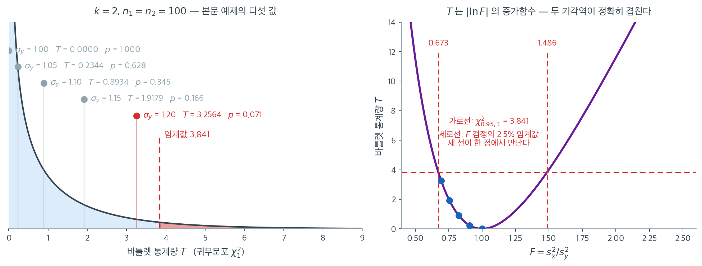

# Bartlett 검정

!!! note "이 주제를 다루는 다른 곳"
    분산분석의 등분산성 사전확인이라는 좁은 맥락에서 같은 검정을 짧게 쓰는 예가
    **11.5 가정**에 있다.

## 개요

Bartlett 검정은 여러 집단이 같은 분산을 갖는다는 귀무가설(등분산성)을 확인한다. 등분산에 대한 고전적 검정 가운데 자료가 정말로 정규분포를 따를 때 가장 강력하다. 그러나 정규성 이탈에 매우 민감하여, 치우쳤거나 꼬리가 두꺼운 자료에 적용하면 거짓 양성률이 부풀려진다.

## 검정 설정

정규 모집단에서 뽑은 크기 $n_1, \ldots, n_k$인 독립 집단 $k$개가 주어졌을 때 가설은

$$
H_0 : \sigma_1^2 = \sigma_2^2 = \cdots = \sigma_k^2 \quad \text{대} \quad H_1 : \sigma_i^2 \text{이 모두 같지는 않다}.
$$

## 검정통계량

$S_i^2$을 집단 $i$의 표본분산, $N = \sum_{i=1}^k n_i$라 하고 합동분산을

$$
S_p^2 = \frac{1}{N - k} \sum_{i=1}^{k} (n_i - 1) S_i^2
$$

로 정의한다. Bartlett 검정통계량은

$$
T = \frac{(N - k)\ln S_p^2 - \sum_{i=1}^{k}(n_i - 1)\ln S_i^2}{1 + \frac{1}{3(k-1)}\left(\sum_{i=1}^{k}\frac{1}{n_i - 1} - \frac{1}{N - k}\right)}.
$$

$H_0$과 정규성 아래에서 근사적으로 $T \sim \chi^2(k-1)$이다.

SciPy는 `scipy.stats.bartlett`을 직접 제공한다.

<div class="exbox" markdown>

**보기 1.** <span class="diff easy" title="쉬움"></span> 분산 차이를 키워 가며. 집단이 둘($k = 2$), 각 $n = 100$이고 두 표본에 **같은 씨앗**을 주어 $\sigma_y$만 $1.00$에서 $1.20$까지 키운다. [F 검정 쪽](../f_test/f_test_variances.md)과 똑같은 설정이다.

**(1)** F 검정 쪽에서 이 설정의 $F = S_x^2/S_y^2$가 정확히 $1/\sigma_y^2$임을 보였다. 연습문제 5 의 $g(r)$를 써서 다섯 개의 $T$를 **닫힌 꼴로** 적으시오. 또 첫 줄의 `chi2=-0.0000` 이 무엇인지 밝히시오.

**(2)** 바틀렛의 $p$값이 F 검정의 $p$값과 **정확히** 같은가? 소수 여덟째 자리까지 견주고, 두 검정이 결론에서 갈릴 수 있는지 $r$의 눈금 위에서 확인하시오.

</div>

??? success "풀이"

    **(1) 통계량이 $r$ 하나로 줄어든다.** 같은 씨앗을 쓰므로 $x_j = z_j$, $y_j = 1 + \sigma_y z_j$이고 표본분산이 위치에 불변하므로

    $$
    r = \frac{S_x^2}{S_y^2} = \frac{S_z^2}{\sigma_y^2 S_z^2} = \frac{1}{\sigma_y^2}
    $$

    이다(F 검정 쪽 보기 2 가 이것을 비트 단위로 확인했다). 연습문제 5 가 $k = 2$, $n_1 = n_2 = n$에서 분자가 $r$만의 함수임을 보였다.

    $$
    g(r) = (n-1)\left[2\ln\frac{1+r}{2} - \ln r\right]
    $$

    보정인자도 $n$만의 상수다. $k = 2$, $n = 100$이면

    $$
    C = 1 + \frac{k+1}{3k(n-1)} = 1 + \frac{3}{594} = 1 + \frac{1}{198} = 1.005050505
    $$

    이다. 따라서

    $$
    T = \frac{g(1/\sigma_y^2)}{1 + 1/198}
    $$

    이 다섯 줄의 통계량을 **자료를 보지 않고** 준다. $\sigma_y = 1.20$을 넣어 보면 $r = 0.694444$, $(1+r)/2 = 0.847222$이고

    $$
    g(r) = 99\bigl[2\ln 0.847222 - \ln 0.694444\bigr] = 99\bigl[-0.331638 + 0.364643\bigr] = 3.272802
    $$

    $$
    T = \frac{3.272802}{1.005050505} = 3.256356
    $$

    이다. 나머지 네 줄도 같은 방식이다.

    **`chi2=-0.0000` 은 0 이어야 하는 값의 반올림 잔돈이다.** $\sigma_y = 1$이면 $r = 1$이고

    $$
    g(1) = (n-1)\bigl[2\ln 1 - \ln 1\bigr] = 0
    $$

    이다. 연습문제 1 의 등호 조건($S_1^2 = S_2^2$일 때만 $T = 0$)이 바로 이것이다. 그런데 `scipy` 는 $S_x^2$과 $S_y^2$을 각각 부동소수점으로 계산하므로 두 값이 비트 단위로 같지 않고, $\ln$ 을 통과한 뒤 음의 잔돈이 남는다. **수학적으로 $T \ge 0$이지만 수치적으로는 $-10^{-14}$쯤이 나올 수 있다.**

    **(2) 수치적으로.** 먼저 닫힌 꼴과 $p$값을 맞추어 본다.

    ```python
    import numpy as np
    import scipy.stats as stats

    # 한쪽의 표준편차를 1 로 두고 다른 쪽을 조금씩 키워 가며 검정한다.
    # 5% 차이는 잡아내지 못하고 20% 쯤 되어야 걸린다. 등분산 검정의 검정력이
    # 생각보다 낮다는 것을 보여 주는 대목이다.
    size, seed = 100, 1
    x = stats.norm(loc=0, scale=1).rvs(size, random_state=seed)

    for scale in [1.00, 1.05, 1.10, 1.15, 1.20]:
        y = stats.norm(loc=1, scale=scale).rvs(size, random_state=seed)
        stat, pval = stats.bartlett(x, y)
        print(f"sigma_y={scale:.2f}  chi2={stat:.4f}  p={pval:.3f}")

    # (1) 닫힌 꼴. k=2, n1=n2=n 이면 T = g(r)/C 이고 r = S_x^2/S_y^2 = 1/sigma_y^2 다.
    n, k = size, 2
    C = 1 + (k + 1) / (3 * k * (n - 1))        # = 1 + 1/198


    def g(r):
        """연습문제 5 의 분자. r 만의 함수다."""
        return (n - 1) * (2 * np.log((1 + r) / 2) - np.log(r))


    print(f"\nC = 1 + 1/198 = {C:.9f}")
    print(f"{'sigma_y':>8}{'r=1/s^2':>11}{'g(r)':>11}{'T=g/C':>11}{'scipy T':>11}{'차':>10}")
    for scale in [1.00, 1.05, 1.10, 1.15, 1.20]:
        y = stats.norm(loc=1, scale=scale).rvs(size, random_state=seed)
        T_sc = stats.bartlett(x, y).statistic
        r = 1 / scale**2
        print(f"{scale:>8.2f}{r:>11.6f}{g(r):>11.6f}{g(r) / C:>11.6f}{T_sc:>11.6f}"
              f"{abs(g(r) / C - T_sc):>10.1e}")

    # 첫 줄의 chi2 = -0.0000 은 무엇인가.
    y1 = stats.norm(loc=1, scale=1.00).rvs(size, random_state=seed)
    print(f"\nsigma_y=1 일 때")
    print(f"  S_x^2 - S_y^2        = {x.var(ddof=1) - y1.var(ddof=1):.3e}")
    print(f"  scipy 가 돌려준 T    = {stats.bartlett(x, y1).statistic:.3e}")
    print(f"  닫힌 꼴 g(1)/C       = {g(1.0) / C:.3e}")

    # (2) p 값이 F 검정과 정확히 같은가.
    Fd = stats.f(n - 1, n - 1)
    print(f"\n{'sigma_y':>8}{'p (Bartlett)':>16}{'p (F 검정)':>16}{'차':>10}")
    for scale in [1.00, 1.05, 1.10, 1.15, 1.20]:
        y = stats.norm(loc=1, scale=scale).rvs(size, random_state=seed)
        p_b = stats.bartlett(x, y).pvalue
        r = 1 / scale**2
        p_f = 2 * min(Fd.cdf(r), Fd.sf(r))
        print(f"{scale:>8.2f}{p_b:>16.8f}{p_f:>16.8f}{abs(p_b - p_f):>10.1e}")
    ```

    출력:

    ```text
    sigma_y=1.00  chi2=-0.0000  p=1.000
    sigma_y=1.05  chi2=0.2344  p=0.628
    sigma_y=1.10  chi2=0.8934  p=0.345
    sigma_y=1.15  chi2=1.9179  p=0.166
    sigma_y=1.20  chi2=3.2564  p=0.071

    C = 1 + 1/198 = 1.005050505
     sigma_y    r=1/s^2       g(r)      T=g/C    scipy T         차
        1.00   1.000000   0.000000   0.000000  -0.000000   1.4e-14
        1.05   0.907029   0.235574   0.234390   0.234390   7.5e-16
        1.10   0.826446   0.897961   0.893448   0.893448   1.0e-14
        1.15   0.756144   1.927544   1.917857   1.917857   2.0e-14
        1.20   0.694444   3.272802   3.256356   3.256356   4.4e-16

    sigma_y=1 일 때
      S_x^2 - S_y^2        = 1.110e-16
      scipy 가 돌려준 T    = -1.414e-14
      닫힌 꼴 g(1)/C       = 0.000e+00

     sigma_y    p (Bartlett)        p (F 검정)         차
        1.00      1.00000000      1.00000000   1.3e-15
        1.05      0.62828742      0.62828942   2.0e-06
        1.10      0.34454454      0.34454666   2.1e-06
        1.15      0.16609304      0.16609397   9.3e-07
        1.20      0.07114709      0.07114690   1.9e-07
    ```

    **(1)의 닫힌 꼴이 맞는다.** $g(r)/C$ 와 `scipy` 의 통계량이 다섯 줄 모두 소수점 여섯째 자리까지 같고, 차가 $10^{-14}$ 아래다. 자료 100개 × 2 를 전혀 쓰지 않고 $\sigma_y$ 하나로 통계량을 모두 재현했다.

    **`chi2=-0.0000` 의 정체도 확인된다.** $S_x^2 - S_y^2 = 1.11\times10^{-16}$으로 두 표본분산이 비트 단위로 같지 않고, 그 잔돈이 $T = -1.41\times10^{-14}$로 증폭되어 나온다. 닫힌 꼴 $g(1)/C$ 는 정확히 $0$이다.

    **$p$값은 F 검정과 "정확히" 같지는 않다.** 소수 셋째 자리까지는 완전히 같지만, 여덟째 자리까지 펼치면 $0.62828742$ 대 $0.62828942$로 $2\times10^{-6}$ 만큼 다르다. **참조분포가 다르기 때문이다.** F 검정은 $r \sim F(99,99)$라는 **정확한** 분포를 쓰고, 바틀렛은 $T \sim \chi^2_1$이라는 **근사** 분포를 쓴다. 연습문제 5 가 보인 것은 $T$가 $r$의 단조함수라는 것, 곧 두 검정이 **같은 양을 재고 있다**는 것이지 두 $p$값이 같다는 것이 아니다.

    **그러면 결론이 갈릴 수 있는가.** 두 기각역을 $r$ 눈금 위에 올려 비교한다.

    ```python
    import numpy as np
    import scipy.stats as stats
    from scipy.optimize import brentq

    # 두 검정의 기각역을 r = S_x^2/S_y^2 의 눈금 위에 나란히 올려 본다.
    crit = stats.chi2.ppf(0.95, 1)
    print(f"chi2_(0.95, 1) = {crit:.7f}\n")

    rng = np.random.default_rng(21)
    M = 400_000
    print(f"{'n':>5}{'Bartlett 기각역':>26}{'F 기각역':>26}"
          f"{'크기(B)':>10}{'크기(F)':>10}{'불일치율':>11}")
    for n in (5, 10, 20, 100):
        C = 1 + 3 / (3 * 2 * (n - 1))
        T = lambda r, n=n, C=C: (n - 1) * (2 * np.log((1 + r) / 2) - np.log(r)) / C
        a = brentq(lambda r: T(r) - crit, 1e-9, 1 - 1e-9)
        b = brentq(lambda r: T(r) - crit, 1 + 1e-9, 1e9)
        lo, hi = stats.f(n - 1, n - 1).ppf([0.025, 0.975])

        # H0 이 참일 때 r ~ F(n-1, n-1) 이므로 카이제곱 비로 바로 뽑는다.
        W = (rng.chisquare(n - 1, M) / (n - 1)) / (rng.chisquare(n - 1, M) / (n - 1))
        rej_b, rej_f = T(W) > crit, (W < lo) | (W > hi)
        print(f"{n:>5}{f'r<{a:.5f} or r>{b:.5f}':>26}{f'r<{lo:.5f} or r>{hi:.5f}':>26}"
              f"{rej_b.mean():>10.5f}{rej_f.mean():>10.5f}{np.mean(rej_b != rej_f):>11.5f}")

    # n=100 에서 F 임계값에 놓인 r 의 T 는 얼마인가.
    n, C = 100, 1 + 3 / (3 * 2 * 99)
    T100 = lambda r: (n - 1) * (2 * np.log((1 + r) / 2) - np.log(r)) / C
    lo, hi = stats.f(99, 99).ppf([0.025, 0.975])
    print(f"\nn=100:  T(F 하단 {lo:.5f}) = {T100(lo):.7f}")
    print(f"        T(F 상단 {hi:.5f}) = {T100(hi):.7f}")
    print(f"        chi2_(0.95,1)        = {crit:.7f}")

    # 같은 임계값을 r 눈금에서 일곱 자리까지 펼쳐 본다.
    a = brentq(lambda r: T100(r) - crit, 1e-9, 1 - 1e-9)
    print(f"\n하단 임계 r:  Bartlett {a:.7f}   F {lo:.7f}")
    print(f"T 가 r 과 1/r 을 구별하는가:  T(3) - T(1/3) = {T100(3.0) - T100(1 / 3):.3e}")
    ```

    출력:

    ```text
    chi2_(0.95, 1) = 3.8414588

        n              Bartlett 기각역                     F 기각역     크기(B)     크기(F)       불일치율
        5    r<0.10330 or r>9.68025    r<0.10412 or r>9.60453   0.04946   0.05019    0.00073
       10    r<0.24824 or r>4.02841    r<0.24839 or r>4.02599   0.04967   0.04975    0.00009
       20    r<0.39579 or r>2.52662    r<0.39581 or r>2.52645   0.04976   0.04977    0.00001
      100    r<0.67284 or r>1.48623    r<0.67284 or r>1.48623   0.04992   0.04992    0.00000

    n=100:  T(F 하단 0.67284) = 3.8414440
            T(F 상단 1.48623) = 3.8414440
            chi2_(0.95,1)        = 3.8414588

    하단 임계 r:  Bartlett 0.6728411   F 0.6728417
    T 가 r 과 1/r 을 구별하는가:  T(3) - T(1/3) = -1.066e-14
    ```

    **두 기각역은 거의 같지만 똑같지는 않다.** $n = 100$에서 F 검정의 두 임계값 $0.67284$와 $1.48623$을 $T$ 곡선에 넣으면 양쪽 모두 $3.8414440$이 나온다. 곡선이 $r$ 과 $1/r$ 에서 같은 높이를 준다는 것이 먼저 눈에 들어온다. $g$ 의 식에 $r \mapsto 1/r$ 을 넣어 보면

    $$
    2\ln\frac{1+1/r}{2} - \ln\frac1r = 2\ln\frac{1+r}{2} - 2\ln r + \ln r = 2\ln\frac{1+r}{2} - \ln r
    $$

    로 그대로이므로 **$T$ 는 $r$ 과 $1/r$ 을 구별하지 못한다.** 마지막 줄의 $T(3) - T(1/3) = -1.07\times10^{-14}$ 가 그 확인이다. 어느 집단을 분자에 두든 같은 값이 나온다는 뜻이다.

    그런데 그 높이 $3.8414440$ 이 $\chi^2_{0.95,1} = 3.8414588$ 과 **다섯째 자리에서 어긋난다.** 그래서 바틀렛의 기각역이 $r < 0.6728411$, F 의 기각역이 $r < 0.6728417$ 로 일곱째 자리에서 갈린다. $n = 100$에서는 이 틈이 너무 좁아 40만 번을 돌려도 **불일치가 한 번도 없다.**

    **$n$이 작으면 틈이 벌어진다.** $n = 5$에서 바틀렛은 $r > 9.68025$에서 기각하고 F 는 $r > 9.60453$에서 기각하므로, $r$ 이 그 사이에 놓이면 **F 는 기각하는데 바틀렛은 기각하지 못한다.** 실제 불일치율이 $0.00073$으로 1,000 번에 한 번 가까이 나온다. $n = 10$에서 $0.00009$, $n = 20$에서 $0.00001$로 줄어든다.

    그러므로 정확히 말하면 이렇다. **$k=2$, $n_1=n_2$에서 두 검정은 같은 통계량을 서로 다른 눈금으로 읽는다. 눈금이 다르므로 임계값도 미세하게 다르고, 표본이 아주 작을 때는 결론이 갈릴 수 있다.** $n \ge 20$이면 실무에서 구별되지 않는다.

    끝으로 크기를 보아 두자. 바틀렛의 실제 크기가 $n = 5$에서도 $0.04946$으로 명목값에 거의 맞는다(몬테카를로 표준오차 $0.00034$). 보정인자가 그만큼 잘 듣는다는 뜻이다. **단, 이것은 자료가 정규일 때의 이야기다.** 연습문제 4 가 대수정규 자료에서 같은 검정의 크기를 재면 $0.675$ 가 나오는 것을 보인다.

!!! note "$p$값이 F 검정과 정확히 같다"
    이 표의 $p$값 $(1.000, 0.628, 0.345, 0.166, 0.071)$은 [분산 동일성에 대한 F 검정](../f_test/f_test_variances.md) 페이지의 같은 자료에 대한 $p$값과 **소수 셋째 자리까지 동일**하다.

    우연이 아니다. $k = 2$이고 $n_1 = n_2$일 때 Bartlett 통계량은 F 통계량의 단조함수이므로 두 검정이 항상 같은 결론을 낸다. 연습문제 5에서 증명한다.

    첫 행의 `chi2=-0.0000`은 부동소수점 오차이다. 두 표본이 같은 seed를 쓰므로 $S_1^2 = S_2^2$이 되어 이론적으로 정확히 0이어야 한다(15.4절 연습문제 1의 등호 조건).



왼쪽은 다섯 개의 $T$를 귀무분포 $\chi^2_1$ 위에 얹은 것이다. 집단이 둘이므로 자유도가 $k - 1 = 1$이고, 임계값은 $\chi^2_{0.95,1} = 3.841$이다. $\sigma_y$를 $1.00$에서 $1.20$까지 올리면 $T$가 $0 \to 0.2344 \to 0.8934 \to 1.9179 \to 3.2564$로 커지지만, 마지막 값조차 $3.841$에 닿지 못한다. 그래서 $p = 0.071$이다.

오른쪽이 "F 검정과 같은 검정"이라는 주장의 그림 증명이다. 가로축이 $F = s_x^2/s_y^2$, 세로축이 그에 대응하는 $T$이다. **곡선이 $F = 1$에서 최솟값 0을 갖고 양쪽으로 단조증가한다.** $F$가 1에서 멀어지는 것과 $T$가 커지는 것이 일대일로 맞물려 있다는 뜻이다.

결정적인 것은 세 선이 만나는 자리다. $F$ 검정의 2.5% 임계값 $0.673$과 $1.486$에서 곡선의 높이를 읽으면 **양쪽 모두 정확히 $3.841$**, 곧 $\chi^2_{0.95,1}$이다. $F$ 검정이 기각하는 $F$의 집합과 바틀렛이 기각하는 $T$의 집합이 같은 자료를 가리킨다는 뜻이다.

우연의 일치가 아니다. $n_1 = n_2$이면 $T$가 $|\ln F|$의 증가함수가 되는데, $F$ 검정의 양측 기각역도 "$|\ln F|$가 크면 기각"과 같은 말이다. 두 검정은 같은 양을 서로 다른 눈금으로 읽고 있을 뿐이며, 눈금을 바꾸어도 판정은 바뀌지 않는다.

파란 점 다섯 개가 본문 보기의 자료다. 모두 두 세로선 사이, 곧 채택역 안에 있다. **어느 쪽 언어로 말하든 결론은 하나다.** 이 대응은 $k = 2$에서만 성립하며, 집단이 셋 이상이면 바틀렛은 $F$ 검정으로 환원되지 않는 고유한 검정이 된다.

이 보기도 F 검정 페이지와 마찬가지로 `x`와 `y`가 같은 seed를 공유하여 표집변동이 제거되어 있다.

## 해석

- 두 집단의 분산이 같으면 검정통계량이 0에 가깝고 $p$값이 크다.
- 분산비가 1에서 멀어질수록 $T$가 커지고 $p$값이 작아진다.
- Bartlett 검정은 정규성 가정이 충분히 정당화될 때만 적용해야 한다. 비정규성 아래에서는 Levene이나 Brown-Forsythe 검정이 더 안전하다.

## 연습문제

<div class="drillbox" markdown>

**연습문제 1.** <span class="diff easy" title="쉬움"></span> 크기 $n_1 = 10$, $n_2 = 12$, $n_3 = 15$인 세 집단의 표본분산이 $S_1^2 = 4.1$, $S_2^2 = 3.8$, $S_3^2 = 5.6$이다. 합동분산 $S_p^2$과 Bartlett 검정통계량 $T$를 손으로 계산하라(로그는 계산기를 써도 좋다).

</div>

??? success "풀이"

    전체 표본크기는 $N = 10 + 12 + 15 = 37$이고 $k = 3$이다. 합동분산은

    $$
    S_p^2 = \frac{9(4.1) + 11(3.8) + 14(5.6)}{37 - 3} = \frac{36.9 + 41.8 + 78.4}{34} = \frac{157.1}{34} = 4.6206.
    $$

    $T$의 분자는

    $$
    34 \ln(4.6206) - [9\ln(4.1) + 11\ln(3.8) + 14\ln(5.6)]
    $$

    $$
    = 34(1.5305) - [9(1.4110) + 11(1.3350) + 14(1.7228)]
    $$

    $$
    = 52.037 - [12.699 + 14.685 + 24.119] = 52.037 - 51.503 = 0.535.
    $$

    보정인자는

    $$
    C = 1 + \frac{1}{6}\left(\frac{1}{9} + \frac{1}{11} + \frac{1}{14} - \frac{1}{34}\right) = 1 + \frac{1}{6}(0.1111 + 0.0909 + 0.0714 - 0.0294) = 1.0407.
    $$

    따라서 $T = 0.535 / 1.0407 = 0.514$이다.

    ```python
    import numpy as np
    import scipy.stats as stats

    n = np.array([10, 12, 15])
    s2 = np.array([4.1, 3.8, 5.6])
    k, nu = len(n), n - 1

    sp2 = np.sum(nu * s2) / np.sum(nu)
    num = np.sum(nu) * np.log(sp2) - np.sum(nu * np.log(s2))
    C = 1 + (1 / (3 * (k - 1))) * (np.sum(1 / nu) - 1 / np.sum(nu))
    T = num / C
    print(f"Sp2 = {sp2:.4f}, numerator = {num:.4f}, C = {C:.4f}")
    print(f"T = {T:.4f}, p = {stats.chi2.sf(T, k - 1):.4f}")
    ```

    출력:

    ```text
    Sp2 = 4.6206, numerator = 0.5351, C = 1.0407
    T = 0.5142, p = 0.7733
    ```

    $\chi^2(2)$와 비교하면 $p = 0.773$으로 큰 값이므로 등분산을 기각하지 못한다. 표본분산의 최대·최소 비가 $5.6/3.8 = 1.47$로 작으므로 예상되는 결과이다. $\square$

<div class="drillbox" markdown>

**연습문제 2.** <span class="diff easy" title="쉬움"></span> Python으로 $N(0,1)$, $N(0,1.5)$, $N(0,2)$에서 각각 크기 50인 세 집단을 생성하라. Bartlett 검정을 적용하고 검정통계량과 $p$값을 보고하라. 기대한 결과와 일치하는가?

</div>

??? success "풀이"

    ```python
    import numpy as np
    import scipy.stats as stats

    rng = np.random.default_rng(42)
    g1 = rng.normal(0, 1.0, 50)
    g2 = rng.normal(0, 1.5, 50)
    g3 = rng.normal(0, 2.0, 50)

    print("sample variances:",
          [round(np.var(g, ddof=1), 3) for g in (g1, g2, g3)])
    stat, pval = stats.bartlett(g1, g2, g3)
    print(f"Bartlett: chi2={stat:.3f}, p={pval:.4g}")
    ```

    출력:

    ```text
    sample variances: [0.59, 1.322, 4.032]
    Bartlett: chi2=43.960, p=2.846e-10
    ```

    참 분산이 1, 2.25, 4로 크게 다르므로 $p$값이 $2.8 \times 10^{-10}$으로 매우 작고 $H_0$을 올바르게 기각한다.

    **주의: `normal(0, s)`의 두 번째 인자는 표준편차이다.** 문제 서술의 "$N(0,1.5)$"는 표기 관례에 따라 분산 1.5를 뜻할 수도 있으나, 여기서는 코드대로 **표준편차 1.5**로 읽어 참 분산이 $2.25$이다. 정규분포를 쓸 때 두 번째 인자가 분산인지 표준편차인지는 늘 확인해야 한다. NumPy와 SciPy는 표준편차를, 많은 교과서 표기 $N(\mu, \sigma^2)$은 분산을 쓴다. $\square$

<div class="drillbox" markdown>

**연습문제 3.** <span class="diff med" title="중간"></span> Bartlett 검정이 비정규성에 민감한 이유를 설명하라. 특히 첨도가 $S^2$의 분포에, 나아가 검정통계량에 어떤 영향을 주는지 논하라.

</div>

??? success "풀이"

    Bartlett 통계량의 유도는 $(n_i - 1)S_i^2/\sigma_i^2 \sim \chi^2(n_i - 1)$을 가정하는데, 이는 자료가 정규일 때만 정확히 성립한다. 초과첨도 $\gamma_2 > 0$(두꺼운 꼬리)인 분포에서는 $S^2$의 분산이 부풀려진다.

    $$
    \operatorname{Var}(S^2) \approx \frac{2\sigma^4}{n-1} + \frac{\gamma_2 \sigma^4}{n}.
    $$

    추가항 $\gamma_2\sigma^4/n$ 때문에 $S_i^2$이 $\chi^2$ 기준분포가 예측하는 것보다 더 변동한다. 결과적으로 $\ln S_i^2$의 집단간 변동이 부풀려지고, $H_0$ 아래에서 $T$가 $\chi^2(k-1)$보다 확률적으로 커진다. 그래서 기각률이 명목 $\alpha$를 훨씬 넘는다.

    **로그가 문제를 순수하게 만든다.** 15.4절 연습문제 2에서 보았듯 델타 방법으로

    $$
    \operatorname{Var}(\ln S^2) \approx \frac{\gamma_2 + 2}{n}
    $$

    이고, 이 값은 $\sigma^2$에 **전혀 의존하지 않고 오직 $\gamma_2$에만 의존한다.** 로그 변환이 척도 정보를 지우고 모양 정보만 남기므로, 첨도의 영향이 감쇄 없이 그대로 통계량에 실린다.

    **정량적으로.** 정규성 아래에서 $\operatorname{Var}(\ln S^2) = 2/n$인데 $\gamma_2 = 6$이면 $8/n$으로 네 배가 된다. $T$의 각 항이 네 배로 부풀려지므로 $T$ 자체가 대략 네 배가 되고, $\chi^2$ 임계값을 훨씬 자주 넘게 된다. $\square$

<div class="drillbox" markdown>

**연습문제 4.** <span class="diff med" title="중간"></span> 5,000회 반복 모의실험을 수행하라. 표준 대수정규분포에서 크기 20인 세 집단을 생성한다(귀무가설 아래에서 등분산). $\alpha = 0.05$로 Bartlett 검정을 적용하고 거짓 양성률을 추정하라. Levene 검정과 비교하라.

</div>

??? success "풀이"

    ```python
    import numpy as np
    import scipy.stats as stats

    rng = np.random.default_rng(0)
    n_sims, n, alpha = 5000, 20, 0.05
    rej_bart, rej_lev = 0, 0

    for _ in range(n_sims):
        g1 = rng.lognormal(0, 1, n)
        g2 = rng.lognormal(0, 1, n)
        g3 = rng.lognormal(0, 1, n)
        _, p_b = stats.bartlett(g1, g2, g3)
        _, p_l = stats.levene(g1, g2, g3)      # median-centred (Brown-Forsythe)
        if p_b < alpha:
            rej_bart += 1
        if p_l < alpha:
            rej_lev += 1

    print(f"Bartlett false-positive rate: {rej_bart/n_sims:.4f}")
    print(f"Levene   false-positive rate: {rej_lev/n_sims:.4f}")
    ```

    출력:

    ```text
    Bartlett false-positive rate: 0.6748
    Levene   false-positive rate: 0.0392
    ```

    **Bartlett의 거짓 양성률이 $0.675$이다.** 명목값의 **13배**이며, 등분산인 자료의 3분의 2에서 "분산이 다르다"고 잘못 판정한다. 이는 이 장에서 관찰한 가장 극단적인 크기 왜곡이다.

    이유는 $\text{Lognormal}(0,1)$의 초과첨도가

    $$
    \gamma_2 = e^{4\sigma^2} + 2e^{3\sigma^2} + 3e^{2\sigma^2} - 6 = e^4 + 2e^3 + 3e^2 - 6 = 110.9
    $$

    로 극단적이기 때문이다. $t_5$의 6이나 지수분포의 6과 비교하면 열여덟 배가 넘는다.

    Levene(SciPy 기본값인 중앙값 중심, 곧 Brown-Forsythe)은 $0.039$로 명목값 근처를 유지한다. 15.5절에서 반복해 본 결론이 여기서도 확인된다.

    **실무적 결론.** 소득, 자산가격, 대기시간처럼 대수정규에 가까운 자료에 Bartlett 검정을 쓰는 것은 사실상 난수 생성기를 돌리는 것과 다름없다. $\square$

<div class="drillbox" markdown>

**연습문제 5.** <span class="diff med" title="중간"></span> $k = 2$이고 $n_1 = n_2 = n$일 때 Bartlett 검정통계량이 F 통계량 $F = S_1^2/S_2^2$의 단조함수임을 증명하라. 곧 두 검정이 $H_0$ 기각 여부에서 항상 일치함을 보여라.

</div>

??? success "풀이"

    $k = 2$이고 표본크기가 같으면 $S_p^2 = (S_1^2 + S_2^2)/2$이다. $r = S_1^2/S_2^2$이라 쓰면 $S_p^2 = S_2^2(1 + r)/2$이다.

    $T$의 분자는

    $$
    2(n-1)\ln S_p^2 - (n-1)\ln S_1^2 - (n-1)\ln S_2^2 = (n-1)\bigl[2\ln S_p^2 - \ln S_1^2 - \ln S_2^2\bigr].
    $$

    $S_p^2 = S_2^2(1+r)/2$와 $S_1^2 = rS_2^2$을 대입하면

    $$
    2\ln\frac{S_2^2(1+r)}{2} - \ln(rS_2^2) - \ln S_2^2 = 2\ln\frac{1+r}{2} + 2\ln S_2^2 - \ln r - 2\ln S_2^2 = 2\ln\frac{1+r}{2} - \ln r.
    $$

    $S_2^2$이 완전히 소거되어 분자가 $r$만의 함수가 된다.

    $$
    g(r) = (n-1)\left[2\ln\frac{1+r}{2} - \ln r\right].
    $$

    보정인자 $C$도 $n$에만 의존하는 상수이므로 $T = g(r)/C$ 역시 $r$만의 함수이다.

    **단조성.** $g$를 미분하면

    $$
    g'(r) = (n-1)\left[\frac{2}{1+r} - \frac{1}{r}\right] = (n-1)\cdot\frac{2r - (1+r)}{r(1+r)} = (n-1)\cdot\frac{r-1}{r(1+r)}.
    $$

    $r < 1$이면 $g' < 0$이고 $r > 1$이면 $g' > 0$이다. 곧 $g$는 $r = 1$에서 최솟값 $g(1) = (n-1)[2\ln 1 - \ln 1] = 0$을 갖고 양쪽으로 **엄격히 증가**한다.

    따라서 기각역 $\{T > \chi^2_{1-\alpha}(1)\}$은 어떤 상수 $c_L < 1 < c_U$에 대해 $\{r < c_L\} \cup \{r > c_U\}$로 대응된다. 이것이 정확히 양측 F 검정의 기각역 형태이므로 두 검정은 항상 일치한다.

    **수치 확인.** 본문 코드의 출력에서 Bartlett의 $p$값 $(1.000, 0.628, 0.345, 0.166, 0.071)$이 F 검정 페이지의 $p$값과 완전히 같다. 위 증명의 직접적 확인이다.

    **$n_1 \neq n_2$이면 어떻게 되는가.** 그때는 $S_p^2$이 가중평균이 되어 $S_2^2$이 소거되지 않으므로 $T$가 $r$만의 함수가 아니다. 두 검정이 조금씩 다른 결론을 낼 수 있다. 다만 $H_0$ 아래에서 두 통계량의 상관이 매우 높으므로 실무에서 차이가 드러나는 경우는 드물다. $\square$

---

## 정리하며

`scipy.stats.bartlett` 로 **구현과 확인**을 했다.

- **집단별 배열을 넘기면 통계량과 $p$ 값이 나온다.** `bartlett(g1, g2, g3)` 형태다.
- **표본크기가 달라도 된다.** 자유도로 가중하므로 불균형 설계에서도 쓸 수 있다.
- **각 집단에 관측이 최소 2 개는 있어야 한다.** 분산을 계산할 수 없으면 오류가 난다.
- **정규 자료로 먼저 검증한다.** 등분산일 때 기각률이 명목 $\alpha$ 에 맞는지 확인하면 코드가 옳게 작동함을 알 수 있다.
- **분산비를 바꿔 가며 검정력을 본다.** 비가 커질수록 기각률이 오르는 것이 정상이며, 그 속도가 검정력 곡선이다.

다음 절 **바틀렛 민감도**에서 비정규 자료로 돌려 본다.
