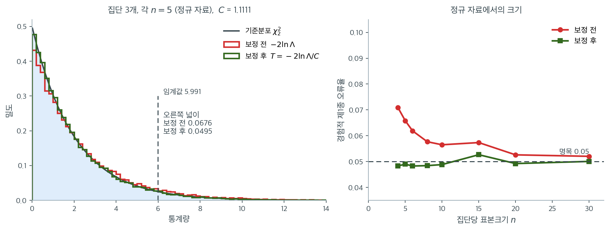

# 유도와 카이제곱 근사

Bartlett 검정통계량은 가능도비 원리로 동기를 부여할 수 있다. $k$개 집단이 공통 분산을 갖는다는 귀무가설 아래에서 가능도함수가 단순해지고, 제약된 가능도와 제약 없는 가능도의 비에서 익숙한 Bartlett 공식이 곧바로 나온다. 이 절은 유도를 단계별로 제시하고 정확한 카이제곱 근사를 보장하는 보정인자를 설명한다.

---

## 1. 설정과 기호

정규 모집단에서 $k$개의 독립 표본을 뽑았다고 하자.

$$
X_{ij} \sim N(\mu_i, \sigma_i^2), \quad i = 1, \ldots, k, \quad j = 1, \ldots, n_i
$$

$N = \sum_{i=1}^{k} n_i$를 전체 표본크기, $S_i^2$을 집단 $i$의 표본분산이라 하고 합동분산을 다음으로 정의한다.

$$
S_p^2 = \frac{\sum_{i=1}^{k} (n_i - 1) S_i^2}{N - k}
$$

이는 자유도 $\nu_i = n_i - 1$에 비례하는 가중치를 갖는 집단분산들의 가중평균이다.

---

## 2. 가능도비

귀무가설 $H_0\colon \sigma_1^2 = \cdots = \sigma_k^2 = \sigma^2$ 아래에서 공통 분산의 최대가능도추정량은 $\hat{\sigma}^2 = S_p^2$이다. 대립가설 아래에서는 각 집단이 자기 추정량 $\hat{\sigma}_i^2 = S_i^2$을 갖는다.

로그가능도비 통계량은

$$
-2 \ln \Lambda = \sum_{i=1}^{k} \nu_i \ln\!\left(\frac{S_p^2}{S_i^2}\right) = (N-k)\ln S_p^2 - \sum_{i=1}^{k} \nu_i \ln S_i^2
$$

여기서 $\nu_i = n_i - 1$이다. 이 양은 (로그의 오목성과 Jensen 부등식에 의해) 항상 음이 아니며, 모든 표본분산이 같을 때만 0이 된다.

---

## 3. 보정인자

통계량 $-2\ln\Lambda$는 표본크기가 커지면 $\chi^2_{k-1}$로 수렴하지만, 중간 정도의 표본크기에서는 수렴이 느리다. Bartlett(1937)은 카이제곱 근사를 개선하기 위해 보정인자를 도입했다.

$$
C = 1 + \frac{1}{3(k-1)}\left(\sum_{i=1}^{k} \frac{1}{\nu_i} - \frac{1}{N - k}\right)
$$

보정된 검정통계량은

$$
T = \frac{-2\ln\Lambda}{C} = \frac{(N-k)\ln S_p^2 - \sum_{i=1}^{k} \nu_i \ln S_i^2}{1 + \frac{1}{3(k-1)}\left(\sum_{i=1}^{k} \frac{1}{\nu_i} - \frac{1}{N-k}\right)}
$$

$H_0$과 정규성 아래에서 $T \stackrel{\text{근사}}{\sim} \chi^2_{k-1}$이다.

!!! note "보정의 목적"
    보정인자 $C$는 항상 1보다 크므로 $C$로 나누면 검정통계량이 줄어든다. 보정하지 않으면 작은 표본에서 $-2\ln\Lambda$가 지나치게 커져 제1종 오류율이 부풀려진다. 보정은 실제 기각률을 명목 수준 $\alpha$에 가깝게 되돌린다.

$C$가 실제로 얼마나 벌어 주는지 모의실험으로 재어 보자. 정규 자료에서 세 집단을 같은 분포에서 뽑아($H_0$이 참) 보정 전후의 통계량을 4만 번씩 계산했다.



왼쪽은 $n = 5$인 극단적으로 작은 표본이다. 이때 $C = 1.1111$이니 통계량을 11%쯤 줄이는 셈이다. 얼핏 두 계단 곡선이 거의 겹쳐 보이지만 **판정을 가르는 것은 꼬리다.** 임계값 $5.991$ 오른쪽 넓이가 보정 전에는 $0.0676$, 보정 후에는 $0.0495$이다. 겨우 11%를 줄였는데 오류율이 $0.068$에서 $0.050$으로 내려온다. 꼬리 근처에서는 작은 이동이 큰 확률 차이를 만든다.

오른쪽이 전체 그림이다. 보정 전(빨강)은 $n = 4$에서 $0.071$, $n = 10$에서 $0.057$로 $n$이 커지면서 천천히 $0.05$로 다가간다. 점근적으로는 옳지만 수렴이 느리다는 뜻이다. 보정 후(초록)는 $n = 4$에서 이미 $0.048$이고 이후 줄곧 $0.05$ 근처에 붙어 있다. **$C$는 점근 결과를 유한표본에서 쓸 수 있게 만드는 다리다.**

이 아이디어의 일반적 이름이 **바틀렛 보정**이다. 가능도비 통계량 $-2\ln\Lambda$의 기댓값이 자유도와 정확히 같지 않고 $\mathbb{E}[-2\ln\Lambda] \approx (k-1)\,C$ 꼴로 어긋난다는 관찰에서 출발해, 그 배수로 나누어 기댓값을 맞춘다. 바틀렛이 1937년에 분산 검정을 위해 고안했지만 오늘날에는 가능도비 검정 일반에 쓰이는 표준 기법이 되었다.

다만 한 가지를 분명히 해 두어야 한다. **$C$가 고치는 것은 유한표본 근사 오차뿐이다.** 자료가 정규가 아니면 기준분포 $\chi^2_{k-1}$ 자체가 틀린 것이고, 그 문제는 어떤 상수로 나누어도 해결되지 않는다. 다음 절 [비정규성 아래의 한계](limitations.md)가 그 경우를 다룬다.

---

## 4. 공식의 직관

$T$의 분자는 다음과 같이 해석할 수 있다.

- $(N - k)\ln S_p^2$은 합동분산의 로그에 전체 자유도를 곱한 것이다.
- $\sum \nu_i \ln S_i^2$은 각 집단분산의 로그에 그 집단의 자유도를 곱해 더한 것이다.

모든 집단분산이 같으면 모든 $i$에 대해 $S_i^2 \approx S_p^2$이므로 분자가 0에 가깝다. 하나 이상의 집단이 실질적으로 다른 분산을 가지면 개별 $\ln S_i^2$이 $\ln S_p^2$에서 벗어나고 분자가 커진다.

곧 이 검정통계량은 개별 로그분산이 합동 로그분산에서 얼마나 벗어나는지를 표본크기로 조정하여 재는 것이다.

---

## 5. 판정규칙

유의수준 $\alpha$에서 다음이면 $H_0$을 기각한다.

$$
T > \chi^2_{1-\alpha,\, k-1}
$$

여기서 $\chi^2_{1-\alpha,\, k-1}$은 자유도 $k-1$인 카이제곱분포의 $(1-\alpha)$ 분위수이다. 등분산에서 어느 방향으로 벗어나든 $T$가 커지므로 이 검정은 항상 단측(오른쪽 꼬리)이다.

<div class="exbox" markdown>

**보기 1.** <span class="diff easy" title="쉬움"></span> 세 집단의 Bartlett 검정. 세 집단의 표본크기와 분산이 다음과 같다.

| 집단 | $n_i$ | $S_i^2$ | $\nu_i = n_i - 1$ |
|---|---|---|---|
| 1 | 10 | 5.2 | 9 |
| 2 | 12 | 8.1 | 11 |
| 3 | 8 | 4.7 | 7 |

</div>

??? success "풀이"
    **1단계.** 합계: $N = 30$, $N - k = 27$.

    **2단계.** 합동분산:

    $$
    S_p^2 = \frac{9(5.2) + 11(8.1) + 7(4.7)}{27} = \frac{46.8 + 89.1 + 32.9}{27} = \frac{168.8}{27} = 6.2519
    $$

    **3단계.** 분자:

    $$
    27 \ln(6.2519) - [9\ln(5.2) + 11\ln(8.1) + 7\ln(4.7)]
    $$

    $$
    = 27(1.8329) - [9(1.6487) + 11(2.0919) + 7(1.5476)]
    $$

    $$
    = 49.488 - [14.838 + 23.011 + 10.833] = 49.488 - 48.682 = 0.806
    $$

    **4단계.** 보정인자:

    $$
    C = 1 + \frac{1}{3(2)}\left(\frac{1}{9} + \frac{1}{11} + \frac{1}{7} - \frac{1}{27}\right) = 1 + \frac{1}{6}(0.1111 + 0.0909 + 0.1429 - 0.0370) = 1 + \frac{0.3078}{6} = 1.0513
    $$

    **5단계.** 검정통계량:

    $$
    T = \frac{0.806}{1.0513} = 0.767
    $$

    **6단계.** $\chi^2_{0.95,\, 2} = 5.991$과 비교한다. $0.767 < 5.991$이므로 $H_0$을 기각하지 못한다($p = 0.682$). 집단분산이 다르다고 결론지을 증거가 충분하지 않다.

---

## 6. Python 검증

<div class="exbox" markdown>

**보기 2.** <span class="diff easy" title="쉬움"></span> 요약값만으로 통계량 만들기. 보기 1 의 세 집단($n = 10, 12, 8$, $S^2 = 5.2, 8.1, 4.7$)을 원자료 없이 검정한다.

**(1)** 바틀렛 통계량이 **$(n_i, S_i^2)$ 만의 함수**임을 식에서 읽어 내고, 그 결과로 $T$가 분산들의 **공통 척도에 불변**임을 보이시오.

**(2)** (1)을 역으로 쓰면 요약값에 맞는 원자료를 아무렇게나 꾸며도 `scipy` 가 같은 답을 주어야 한다. 확인하시오. 또 넘겨받은 분산이 $\nu_i$ 로 나눈 것인지 $n_i$ 로 나눈 것인지가 언제 문제가 되는지 밝히시오.

</div>

??? success "풀이"

    **(1) 식에 원자료가 들어오는 통로가 없다.** 통계량을 다시 적어 보면

    $$
    T = \frac{(N-k)\ln S_p^2 - \sum_i \nu_i \ln S_i^2}{C},
    \qquad
    S_p^2 = \frac{\sum_i \nu_i S_i^2}{N-k},
    \qquad
    C = 1 + \frac{1}{3(k-1)}\left(\sum_i \frac{1}{\nu_i} - \frac{1}{N-k}\right)
    $$

    인데 오른쪽에 나오는 것은 $n_i$(따라서 $\nu_i$, $N$, $k$)와 $S_i^2$ 뿐이다. **관측값 $X_{ij}$ 가 어디에도 없다.** 그러므로 논문 표에 집단 크기와 표본분산만 실려 있어도 등분산 검정을 그대로 돌릴 수 있다. 원자료를 구할 필요가 없다.

    이것이 우연이 아닌 까닭은 연습문제 3 의 유도에 있다. 정규 로그가능도를 평균에 대해 최적화하고 나면 자료가 $\sum_j (X_{ij} - \bar X_i)^2 = \nu_i S_i^2$ 이라는 형태로만 남는다. 곧 **$(\bar X_i, S_i^2)$ 가 정규모형의 충분통계량**이고, 분산에 관한 가설은 그중 $S_i^2$ 만 쓴다.

    **척도불변성.** 모든 표본분산에 같은 상수 $a > 0$ 을 곱하면 합동분산도 $a S_p^2$ 이 되고, $\sum_i \nu_i = N - k$ 이므로 분자에서

    $$
    (N-k)\ln(aS_p^2) - \sum_i \nu_i \ln(aS_i^2)
    = (N-k)\ln a + (N-k)\ln S_p^2 - \Bigl(\sum_i \nu_i\Bigr)\ln a - \sum_i \nu_i \ln S_i^2
    $$

    에서 $\ln a$ 항이 **정확히 상쇄된다.** $C$ 는 $n_i$ 만의 함수라 애초에 영향을 받지 않는다. 따라서

    $$
    T(a S_1^2, \ldots, a S_k^2) = T(S_1^2, \ldots, S_k^2)
    $$

    이다. **단위를 바꾸어도(미터를 센티미터로, 원을 달러로) 같은 답이 나온다.** $T$ 가 보는 것은 분산들의 **비**뿐이다.

    **(2) 요약값이 전부라면, 요약값만 맞춘 가짜 자료도 같은 답을 주어야 한다.** 그리고 척도불변성이 하나 더 알려 준다. $n_i$ 가 모두 같으면 $\nu_i/n_i = (n-1)/n$ 이 공통 상수이므로 `ddof=0` 으로 받은 분산을 그대로 넣어도 $T$ 가 **바뀌지 않는다.** 그러나 $n_i$ 가 다르면 $\nu_i/n_i$ 가 집단마다 달라 공통 상수가 아니고, 그때는 $T$ 가 달라진다. 이 자료는 $n = (10, 12, 8)$ 로 불균형이니 영향이 있어야 한다.

    ```python
    import numpy as np
    from scipy import stats

    # 원자료 없이 집단 크기와 표본분산만으로 통계량을 만들 수 있다.
    n = np.array([10, 12, 8])
    s2 = np.array([5.2, 8.1, 4.7])
    k = len(n)
    nu = n - 1
    N = n.sum()

    # 귀무가설 아래의 공통 분산 추정값
    s2_pooled = np.sum(nu * s2) / np.sum(nu)

    # 분자는 합동분산의 로그와 각 분산 로그의 가중평균의 차이다.
    # 분산들이 고를수록 0 에 가까워진다.
    numerator = np.sum(nu) * np.log(s2_pooled) - np.sum(nu * np.log(s2))

    # 보정인자. 표본이 작을수록 1 보다 눈에 띄게 커져 통계량을 낮춘다.
    C = 1 + (1 / (3 * (k - 1))) * (np.sum(1 / nu) - 1 / np.sum(nu))

    # 검정통계량
    T = numerator / C

    # p-값
    p_value = stats.chi2.sf(T, k - 1)

    print(f"Pooled variance: {s2_pooled:.4f}")
    print(f"Numerator: {numerator:.4f}")
    print(f"Correction factor C: {C:.4f}")
    print(f"Test statistic T: {T:.4f}")
    print(f"P-value: {p_value:.4f}")


    def bart_from_summary(n, s2):
        """(n_i, S_i^2) 만으로 바틀렛 통계량과 p 값을 돌려준다."""
        n, s2 = np.asarray(n, float), np.asarray(s2, float)
        k, nu = len(n), np.asarray(n, float) - 1
        sp2 = np.sum(nu * s2) / np.sum(nu)
        num = np.sum(nu) * np.log(sp2) - np.sum(nu * np.log(s2))
        C = 1 + (1 / (3 * (k - 1))) * (np.sum(1 / nu) - 1 / np.sum(nu))
        return num / C, stats.chi2.sf(num / C, k - 1)


    # 요약값에 맞는 원자료를 아무렇게나 만들어 scipy 에 넣어 본다.
    # 평균을 어디에 두든, 어떤 분포에서 뽑든 분산만 맞추면 같은 값이 나와야 한다.
    def fake(n, s2, rng, draw):
        out = []
        for ni, v in zip(n, s2):
            z = draw(ni)
            z = (z - z.mean()) / z.std(ddof=1) * np.sqrt(v)
            out.append(z + rng.normal() * 10)
        return out


    rng = np.random.default_rng(99)
    g_norm = fake(n, s2, rng, lambda m: rng.normal(size=m))
    rng2 = np.random.default_rng(7)
    g_t3 = [a - 123.0 for a in fake(n, s2, rng2, lambda m: rng2.standard_t(3, size=m))]

    print(f"\n만든 자료의 표본분산: {[round(float(g.var(ddof=1)), 10) for g in g_norm]}")
    print(f"{'요약값만으로':22}{bart_from_summary(n, s2)[0]:.13f}")
    print(f"{'정규에서 만든 자료':22}{stats.bartlett(*g_norm).statistic:.13f}")
    print(f"{'t_3 에서 만든 자료':22}{stats.bartlett(*g_t3).statistic:.13f}")

    # 척도불변성: 분산에 공통 상수를 곱해도 T 가 바뀌지 않는다.
    print(f"\n분산을 1000배 하면:  T = {bart_from_summary(n, s2 * 1000)[0]:.13f}")

    # ddof 함정. n 으로 나눈 분산을 받아 그대로 넣으면?
    s2_pop = s2 * nu / n
    print(f"\nn 으로 나눈 분산 = {np.round(s2_pop, 4)}")
    print(f"  불균형 n=(10,12,8):  ddof=1 -> T = {bart_from_summary(n, s2)[0]:.4f}"
          f"   ddof=0 -> T = {bart_from_summary(n, s2_pop)[0]:.4f}")
    ne = np.array([10, 10, 10])
    print(f"  균형   n=(10,10,10): ddof=1 -> T = {bart_from_summary(ne, s2)[0]:.13f}")
    print(f"                       ddof=0 -> T = {bart_from_summary(ne, s2 * 9 / 10)[0]:.13f}")
    ```

    출력:

    ```text
    Pooled variance: 6.2519
    Numerator: 0.8063
    Correction factor C: 1.0513
    Test statistic T: 0.7670
    P-value: 0.6815

    만든 자료의 표본분산: [5.2, 8.1, 4.7]
    요약값만으로                0.7669773746398
    정규에서 만든 자료            0.7669773746398
    t_3 에서 만든 자료          0.7669773746398

    분산을 1000배 하면:  T = 0.7669773746398

    n 으로 나눈 분산 = [4.68   7.425  4.1125]
      불균형 n=(10,12,8):  ddof=1 -> T = 0.7670   ddof=0 -> T = 0.8743
      균형   n=(10,10,10): ddof=1 -> T = 0.7478100156592
                           ddof=0 -> T = 0.7478100156592
    ```

    **요약값만으로 보기 1 의 손계산이 그대로 재현된다.** 합동분산 $6.2519$, 분자 $0.8063$, 보정인자 $1.0513$, 통계량 $0.7670$, $p$값 $0.6815$ 로 보기 1 의 여섯 단계와 모두 맞는다(보기 1 은 분자를 $0.806$ 까지만 적었다).

    **(2)의 첫 주장이 맞는다.** 표본분산만 $5.2$, $8.1$, $4.7$ 에 맞추어 꾸민 자료를 `scipy.stats.bartlett` 에 넣으면 요약값만으로 구한 값과 소수점 열셋째 자리까지 같은 $0.7669773746398$ 이 나온다. **정규에서 뽑아 만든 것이든 $t_3$ 에서 뽑아 만든 것이든, 평균을 $+10$ 쪽에 두든 $-123$ 에 두든 결과가 같다.** 자료의 모양과 위치를 모두 지워도 통계량이 살아남는다는 뜻이고, 이것이 (1)의 "원자료가 들어오는 통로가 없다"는 말의 실물이다.

    여기에는 반전이 하나 숨어 있다. **통계량은 자료의 모양을 못 보지만, 기준분포 $\chi^2_{k-1}$ 은 자료가 정규라는 가정에서 나왔다.** $t_3$ 에서 만든 자료를 넣어도 같은 $T$ 가 나오지만, 그 자료에 대해 $\chi^2_2$ 가 옳은 기준인지는 전혀 다른 문제다. 위 실험은 분산을 억지로 맞춘 것이라 그 물음에 답하지 않는다. 다음 절 [비정규성 아래의 한계](limitations.md)가 답한다.

    **척도불변성도 확인된다.** 분산 셋을 모두 1000배 해도 $T$ 가 열셋째 자리까지 같다.

    **`ddof` 는 불균형일 때만 문제가 된다.** $n = (10, 12, 8)$ 에서 $n_i$ 로 나눈 분산 $(4.68,\, 7.425,\, 4.1125)$ 를 그대로 넣으면 $T = 0.8743$ 이 되어 올바른 $0.7670$ 보다 $14\%$ 크다. 반면 $n = (10,10,10)$ 으로 균형을 맞추면 두 길이 $0.7478100156592$ 로 **열셋째 자리까지 같다.** 공통 인자 $(n-1)/n = 0.9$ 가 척도불변성에 흡수되기 때문이다.

    **실무적 교훈.** 남의 표에서 분산을 받아 올 때 그것이 $n-1$ 로 나눈 것인지 꼭 확인하라. 균형 설계라면 틀려도 답이 같아서 실수가 드러나지 않고, 불균형 설계에서만 조용히 틀린다. **드러나지 않는 실수가 더 위험하다.**

---

## 연습문제

<div class="drillbox" markdown>

**연습문제 1.** <span class="diff med" title="중간"></span>
Bartlett 보정이 실제로 유한표본 크기를 개선하는지 모의실험으로 확인하라. 세 집단, 각 $n = 5$인 정규 자료에서 보정 있는 통계량과 없는 통계량의 경험적 크기를 비교하라.

</div>

??? success "풀이"

    ```python
    import numpy as np
    from scipy import stats

    rng = np.random.default_rng(0)
    k, n, R, alpha = 3, 5, 20000, 0.05
    nu = n - 1
    N = k * n
    C = 1 + (1 / (3 * (k - 1))) * (k / nu - 1 / (N - k))
    crit = stats.chi2.ppf(1 - alpha, k - 1)

    rej_raw = rej_corr = 0
    for _ in range(R):
        s2 = np.array([rng.normal(0, 1, n).var(ddof=1) for _ in range(k)])
        sp2 = s2.mean()                      # equal nu, so simple mean
        raw = (N - k) * np.log(sp2) - nu * np.sum(np.log(s2))
        rej_raw += (raw > crit)
        rej_corr += (raw / C > crit)

    print(f"Correction factor C = {C:.4f}")
    print(f"Uncorrected size: {rej_raw / R:.4f}")
    print(f"Corrected size:   {rej_corr / R:.4f}")
    ```

    출력:

    ```text
    Correction factor C = 1.1111
    Uncorrected size: 0.0672
    Corrected size:   0.0505
    ```

    보정하지 않은 통계량의 크기가 $0.067$로 명목값보다 34% 크다. 보정 후에는 $0.050$으로 명목값과 사실상 일치한다(몬테카를로 표준오차 0.0015).

    $n = 5$에서 $C = 1 + \frac{k+1}{3k(n-1)} = 1 + \frac{4}{36} = 1.1111$이다. 이렇게 작은 표본에서 점근 $\chi^2$ 근사가 부정확하며, Bartlett의 보정이 그 오차를 거의 완전히 제거함을 보여준다.

    **주의.** 이 실험은 자료가 **정규일 때**만 보정이 작동함을 보여줄 뿐이다. 비정규 자료에서는 보정이 있어도 크기가 통제되지 않는다. 보정은 유한표본 근사 오차를 고치는 것이지 모형 오설정을 고치는 것이 아니다. $\square$

---

<div class="drillbox" markdown>

**연습문제 2.** <span class="diff med" title="중간"></span>
본문 보기에서 집단 2의 분산을 $S_2^2 = 8.1$에서 점점 키워가며 $T$가 임계값 $5.991$을 넘는 지점을 찾아라. 이것이 Bartlett 검정의 검정력에 대해 무엇을 말해 주는가?

</div>

??? success "풀이"

    ```python
    import numpy as np
    from scipy import stats

    n = np.array([10, 12, 8])
    k, nu, N = 3, n - 1, n.sum()
    C = 1 + (1 / (3 * (k - 1))) * (np.sum(1 / nu) - 1 / np.sum(nu))
    crit = stats.chi2.ppf(0.95, k - 1)

    print(f"{'s2_2':>8} {'T':>8} {'p':>8} {'ratio to others':>18}")
    for s2_2 in [8.1, 15, 21, 25, 40, 60, 80]:
        s2 = np.array([5.2, s2_2, 4.7])
        sp2 = np.sum(nu * s2) / np.sum(nu)
        T = (np.sum(nu) * np.log(sp2) - np.sum(nu * np.log(s2))) / C
        p = stats.chi2.sf(T, k - 1)
        print(f"{s2_2:>8.1f} {T:>8.3f} {p:>8.4f} {s2_2 / 5.0:>18.1f}")
    ```

    출력:

    ```text
        s2_2        T        p    ratio to others
         8.1    0.767   0.6815                1.6
        15.0    3.856   0.1454                3.0
        21.0    6.468   0.0394                4.2
        25.0    8.045   0.0179                5.0
        40.0   12.938   0.0016                8.0
        60.0   17.761   0.0001               12.0
        80.0   21.438   0.0000               16.0
    ```

    이분법으로 정확한 교차점을 찾으면 $S_2^2 = 19.85$에서 $T = 5.9915$가 되어 임계값과 일치한다. 곧 집단 2의 분산이 나머지 두 집단(약 5)의 **네 배**를 넘어야 5% 수준에서 기각한다.

    **검정력에 대한 함의.** 총 $N = 30$개의 관측값으로는 4배의 분산 차이도 겨우 탐지한다. 표준편차로 환산하면 2배이다.

    이는 15.3절 연습문제 1에서 F 검정에 대해 본 것과 같은 결론이다. **분산 검정은 검정력이 근본적으로 낮다.** 실무에서 사전검정이 기각하지 못했다는 사실만으로 등분산성을 확신해서는 안 된다.

    표를 더 보면 $T$가 분산비의 로그에 거의 선형으로 반응한다는 점도 확인할 수 있다. 분산비가 3배에서 16배로 늘어날 때($\ln$ 기준 1.10에서 2.77로 2.5배) $T$는 3.86에서 21.44로 5.6배 늘었다. Bartlett 통계량이 로그 척도에서 작동하고 그 제곱 규모로 커지기 때문이다. $\square$

---

<div class="drillbox" markdown>

**연습문제 3.** <span class="diff hard" title="어려움"></span>
$-2\ln\Lambda = (N-k)\ln S_p^2 - \sum_i \nu_i \ln S_i^2$을 정규 로그가능도에서 직접 유도하라.

</div>

??? success "풀이"
    집단 $i$의 정규 로그가능도는(평균을 $\bar{X}_i$로 최적화한 뒤)

    $$
    \ell_i(\sigma_i^2) = -\frac{n_i}{2}\ln(2\pi) - \frac{n_i}{2}\ln \sigma_i^2 - \frac{1}{2\sigma_i^2}\sum_j (X_{ij}-\bar{X}_i)^2.
    $$

    $\sum_j (X_{ij}-\bar{X}_i)^2 = \nu_i S_i^2$로 쓰고 $\sigma_i^2$에 대해 미분하여 0으로 두면

    $$
    -\frac{n_i}{2\sigma_i^2} + \frac{\nu_i S_i^2}{2\sigma_i^4} = 0 \implies \hat{\sigma}_i^2 = \frac{\nu_i S_i^2}{n_i}.
    $$

    **대립가설 아래.** 각 집단이 자기 추정량을 쓰므로 최대화된 로그가능도는 상수를 빼고

    $$
    \ell_1 = -\frac{1}{2}\sum_i n_i \ln \hat{\sigma}_i^2 - \frac{N}{2}.
    $$

    **귀무가설 아래.** 공통 분산 하나뿐이므로

    $$
    \hat{\sigma}^2 = \frac{\sum_i \nu_i S_i^2}{N} = \frac{(N-k)S_p^2}{N}, \qquad \ell_0 = -\frac{N}{2}\ln \hat{\sigma}^2 - \frac{N}{2}.
    $$

    따라서

    $$
    -2\ln\Lambda = 2(\ell_1 - \ell_0) = N \ln \hat{\sigma}^2 - \sum_i n_i \ln \hat{\sigma}_i^2.
    $$

    **$\nu_i$ 버전으로의 이행.** 위 식은 MLE(분모 $n_i$)를 쓰지만 Bartlett 통계량은 불편추정량(분모 $\nu_i$)을 쓴다. $\hat{\sigma}_i^2 = (\nu_i/n_i)S_i^2$을 대입하면

    $$
    \sum_i n_i \ln \hat{\sigma}_i^2 = \sum_i n_i \ln S_i^2 + \sum_i n_i \ln(\nu_i/n_i)
    $$

    이고 두 번째 합은 자료에 의존하지 않는 상수이다. 실제로 쓰이는 형태는 $n_i$를 $\nu_i$로 바꾼

    $$
    -2\ln\Lambda = (N-k)\ln S_p^2 - \sum_i \nu_i \ln S_i^2
    $$

    이다. 이 치환은 자유도를 올바르게 반영하여 유한표본 성질을 개선하며, Bartlett 보정과 함께 쓰일 때 $\chi^2_{k-1}$ 근사가 가장 정확해진다. $\square$

---

<div class="drillbox" markdown>

**연습문제 4.** <span class="diff hard" title="어려움"></span>
$-2\ln\Lambda \geq 0$임을 Jensen 부등식으로 증명하라.

</div>

??? success "풀이"
    $w_i = \nu_i/(N-k)$라 하면 $\sum_i w_i = 1$이고 $w_i > 0$이므로 $\{w_i\}$가 확률분포를 이룬다.

    $$
    -2\ln\Lambda = (N-k)\left[\ln S_p^2 - \sum_i w_i \ln S_i^2\right] = (N-k)\left[\ln\left(\sum_i w_i S_i^2\right) - \sum_i w_i \ln S_i^2\right].
    $$

    $\ln$이 **오목**함수이므로 Jensen 부등식에 의해

    $$
    \ln\left(\sum_i w_i S_i^2\right) \geq \sum_i w_i \ln S_i^2.
    $$

    따라서 대괄호 안이 음이 아니고 $(N-k) > 0$이므로 $-2\ln\Lambda \geq 0$이다.

    **등호 조건.** $\ln$이 **엄격히** 오목하므로 Jensen 부등식의 등호는 $S_i^2$이 (확률 1로) 상수일 때, 곧 모든 $i$에 대해 $S_i^2$이 같을 때만 성립한다.

    **일반적 의미.** 이는 가능도비 검정 일반의 성질을 반영한다. $-2\ln\Lambda \geq 0$은 제약 없는 최대가능도가 제약된 최대가능도보다 항상 크거나 같기 때문이며, 이 검정이 항상 오른쪽 꼬리 단측검정인 이유이기도 하다. $\square$

---

## 정리하며

바틀렛 통계량이 **가능도비에서** 나온다.

- **제약된 가능도와 제약 없는 가능도의 비**를 취한다. $H_0$ 아래에서는 공통 $\sigma^2$ 하나, 대립가설 아래에서는 집단마다 $\sigma_i^2$ 이다.
- **로그를 취하면 익숙한 형태가 된다.** 합동분산의 로그와 각 집단 분산의 로그의 가중 차이이며, 모두 같으면 $0$ 이 된다.
- **보정인자가 필요하다.** 가능도비의 점근 카이제곱 근사가 소표본에서 부정확하므로, 바틀렛이 도입한 보정항이 근사를 크게 개선한다. **"바틀렛 보정"이라는 이름이 여기서 왔다.**
- **자유도는 $k-1$ 이다.** 모수 $k$ 개에서 하나로 줄인 제약의 개수다.
- **정규 가능도에서 출발했다는 것이 취약성의 뿌리다.** 유도의 첫 줄부터 정규성을 쓰므로, 그것이 깨지면 통계량의 분포가 통째로 달라진다.

다음 절 **한계**로 넘어간다.
