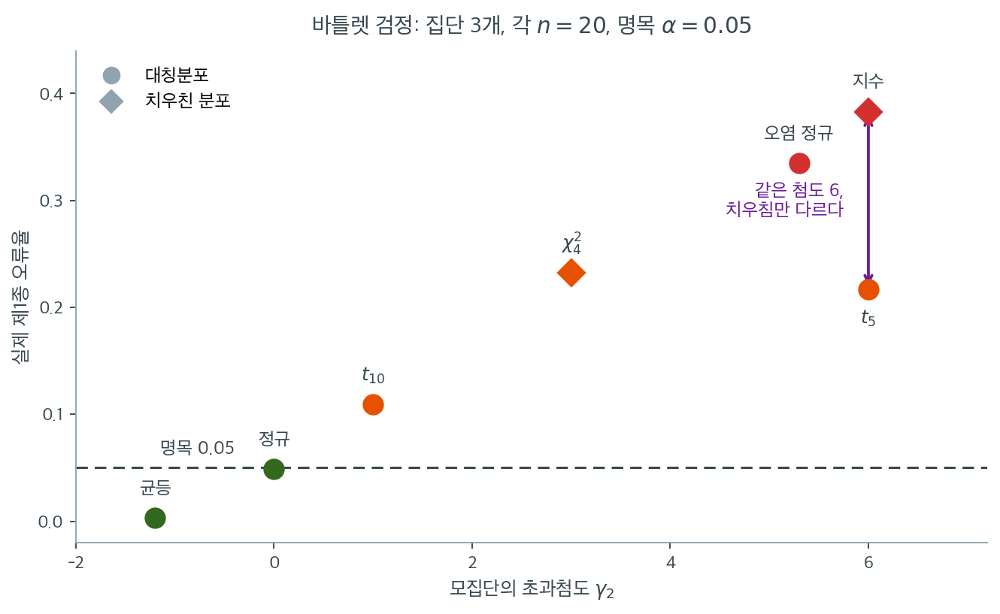

# 비정규성 아래의 한계

Bartlett 검정은 자료가 정말로 정규일 때 분산 동일성에 대한 가장 강력한 검정이지만, 정규가 아닐 때는 가장 취약한 검정이기도 하다. 이 장의 분산 검정 가운데 Bartlett 검정이 비정규성에 대한 민감도가 가장 높으며 F 검정보다도 심하다. 그래서 정규성이 검증되지 않은 상황에서 일상적인 진단 도구로 쓰기에는 신뢰할 수 없다.

## 근본적인 문제

Bartlett 검정통계량은 정규성 가정 아래의 가능도비에서 유도된다. 카이제곱 근사

$$
T \stackrel{\text{근사}}{\sim} \chi^2_{k-1}
$$

는 바탕 자료가 정규일 때 로그 표본분산이 근사적으로 정규라는 사실에 의존한다. 비정규 모집단에서는 $\ln S_i^2$의 분포가 정규에서 벗어나고 카이제곱 기준분포가 부정확해진다.

핵심 양은 모집단의 첨도이다. 초과첨도가 $\gamma_2 = \mu_4 / \sigma^4 - 3$인 분포에서 $\ln S^2$의 분산은 정규의 경우보다 부풀려진다.

$$
\operatorname{Var}(\ln S^2) \approx \frac{2}{\nu} + \frac{\gamma_2}{\nu} + O(\nu^{-2})
$$

여기서 $\nu = n - 1$이다. 정규성 아래에서는 $\gamma_2 = 0$이고 주항이 $2/\nu$이다. $\gamma_2 > 0$인 두꺼운 꼬리 분포에서는 추가항 $\gamma_2/\nu$가 로그분산의 변동을 키워 $T$가 $\chi^2_{k-1}$ 기준분포보다 확률적으로 커지게 만든다.

## 제1종 오류 팽창

모의실험 연구는 자료가 비정규일 때 Bartlett 검정이 $H_0$을 지나치게 자주 기각함을 일관되게 보여준다. 다음 표는 $k = 3$개 집단, $n_i = 20$, 명목 $\alpha = 0.05$에서의 실제 기각률이다(반복 20,000회, 몬테카를로 오차 약 0.003).

| 분포 | 초과첨도 $\gamma_2$ | 실제 제1종 오류 |
|---|---|---|
| Uniform | $-1.2$ | **0.003** |
| Normal | 0 | 0.049 |
| $t_{10}$ | 1 | 0.109 |
| $\chi^2_4$ | 3 | 0.232 |
| 오염 정규 (90% $\mathcal{N}(0,1)$ + 10% $\mathcal{N}(0,9)$) | 5.3 | 0.335 |
| $t_5$ | 6 | 0.217 |
| Exponential | 6 | **0.383** |

지수분포 자료에서 Bartlett 검정이 **38%의 확률로 기각한다.** 참 기각률이 5%여야 하는데 그렇다. 곧 유의한 Bartlett 결과는 분산의 불균등이 아니라 비정규성을 반영하는 것일 수 있다.

반대편 극단도 심각하다. 균등분포에서는 기각률이 $0.003$으로 명목값의 **17분의 1**이다. 검정이 사실상 무력해진다.

표를 가로축에 초과첨도를 놓고 다시 그리면 규칙이 드러난다.



점들이 왼쪽 아래에서 오른쪽 위로 거의 한 줄로 올라간다. **$\gamma_2$ 하나가 오류율을 대부분 설명한다.** $\gamma_2 = -1.2$의 균등에서 $0.003$, $\gamma_2 = 0$의 정규에서 $0.049$, $\gamma_2 = 1$의 $t_{10}$에서 $0.109$, $\gamma_2 = 5.3$의 오염 정규에서 $0.335$이다. 이 단조성은 우연이 아니라 $\operatorname{Var}(\ln S^2) \approx (2 + \gamma_2)/\nu$라는 앞의 식에서 바로 따라 나온다. 기준분포는 $\gamma_2 = 0$을 가정하고 폭을 정하는데 실제 분포는 $(2+\gamma_2)/2$배 넓으니, 첨도가 클수록 꼬리 밖으로 자주 나간다.

**정규분포가 이 직선 위의 한 점에 불과하다는 사실이 중요하다.** 바틀렛 검정이 정규 자료에서 잘 작동하는 것은 특별한 미덕이 아니라 $\gamma_2 = 0$이라는 좌표에 서 있기 때문이다. 자료가 그 점에서 조금만 벗어나면 오류율이 그 자리에서 따라 움직인다.

첨도만으로 다 설명되지는 않는다는 점도 그림이 알려 준다. 보라색 화살표로 이은 두 점은 둘 다 $\gamma_2 = 6$인데 $t_5$는 $0.217$, 지수분포는 $0.383$이다. **차이는 치우침이다.** $t_5$는 대칭이고 지수분포는 왜도가 $2.0$이다. 치우친 분포에서는 $\ln S^2$의 분포까지 비대칭이 되어 카이제곱 근사가 한 겹 더 어긋난다. 그림에서 마름모(치우친 분포)가 같은 첨도의 원(대칭분포)보다 위에 있는 것이 그 때문이다.

실무적으로 이 그림이 주는 메시지는 간단하다. **바틀렛 검정을 쓰려면 첨도를 먼저 보아야 한다.** 그런데 첨도는 4차 적률이라 표본에서 정밀하게 추정하기가 매우 어렵고, 그 추정 자체가 작은 표본에서 믿을 만하지 못하다. 결국 확인할 수 없는 조건에 검정의 타당성이 걸려 있다는 뜻이며, 15.5절의 로버스트 검정을 기본값으로 삼으라는 권고가 여기서 나온다.

!!! danger "Bartlett 검정은 위장한 정규성 검정일 수 있다"
    비정규 자료에 적용하면 Bartlett 검정은 분산이 실제로 다르기 때문이 아니라 분포의 모양이 정규성 가정을 위반하기 때문에 $H_0\colon \sigma_1^2 = \cdots = \sigma_k^2$을 기각하는 경우가 많다. 기각했다고 해서 분산의 이질성에 대해 아무것도 말해 주지 않을 수 있다.

### 재현 코드

<div class="exbox" markdown>

**보기 1.** <span class="diff easy" title="쉬움"></span> 모집단 모양에 따른 오류율. 위 표의 일곱 모집단에서 세 집단($k = 3$)을 **같은 분포**에서 뽑아 $H_0$ 를 참으로 만들고 실제 기각률을 센다.

**(1)** 연습문제 2 의 $\operatorname{Var}(\ln S^2) \approx (\beta_2 - 1)/\nu$ 에서 출발하여($\beta_2 = \gamma_2 + 3$ 은 첨도), 등표본 $n_i = n$ 에서 $n \to \infty$ 일 때

$$
T \;\longrightarrow\; \frac{\beta_2 - 1}{2}\,\chi^2_{k-1}
$$

임을 보이고, 명목 $\alpha$ 검정의 **극한 오류율**을 $\beta_2$ 와 $k$ 의 식으로 적으시오. 이 식이 $k = 2$ 에서 5.3절의 식으로 줄어드는지 확인하시오.

**(2)** 본문 표를 재현하고, $n$ 을 $20$ 에서 $1280$ 까지 키우며 오류율이 (1)의 극한값으로 가는지 보시오. 오류율이 **올라갈지 내려갈지** 미리 짚으시오.

</div>

??? success "풀이"

    **(1) 통계량을 등분산점 주위에서 두 번 펼친다.** 표본크기가 모두 같다고 하자. 그러면 $S_p^2$ 이 산술평균이다. 참 공통분산을 $\sigma^2$ 이라 쓰고

    $$
    S_i^2 = \sigma^2 (1 + u_i), \qquad u_i = \frac{S_i^2}{\sigma^2} - 1
    $$

    로 두면 $E[u_i] = 0$ 이고, 15.1절의 $\operatorname{Var}(S^2) \approx \sigma^4(\beta_2-1)/n$ 에서

    $$
    \tau^2 := \operatorname{Var}(u_i) \approx \frac{\beta_2 - 1}{\nu}
    $$

    이다($\nu = n-1$). 분자를 $\sigma^2$ 으로 정리하면 $\ln \sigma^2$ 이 상쇄되어

    $$
    -2\ln\Lambda = \nu\left[k \ln(1 + \bar u) - \sum_{i=1}^k \ln(1 + u_i)\right]
    $$

    만 남는다($\bar u = \frac1k\sum_i u_i$). $\ln(1+x) = x - \frac{x^2}{2} + O(x^3)$ 을 넣으면

    $$
    -2\ln\Lambda = \nu\left[\Bigl(k\bar u - \sum_i u_i\Bigr)
    + \frac12\Bigl(\sum_i u_i^2 - k \bar u^2\Bigr)\right] + O(u^3)
    $$

    인데 **일차항이 통째로 사라진다**($k\bar u = \sum_i u_i$ 이므로). 남는 이차항은 제곱합의 항등식 $\sum_i u_i^2 - k\bar u^2 = \sum_i (u_i - \bar u)^2$ 에 의해

    $$
    -2\ln\Lambda \approx \frac{\nu}{2}\sum_{i=1}^k (u_i - \bar u)^2
    $$

    이다. **이것이 바틀렛 통계량의 정체다.** 일차항이 사라지므로 통계량은 $u_i$ 들의 **흩어짐**만 본다. 연습문제 1·2 가 말한 "모든 분산이 같을 때만 0" 이 여기서는 "$u_i$ 가 모두 같을 때만 0" 으로 나타난다.

    **이제 극한분포가 읽힌다.** $u_i$ 는 독립이고 각각 평균 $0$, 분산 $\tau^2$ 이며 $n \to \infty$ 에서 $S_i^2$ 의 중심극한정리에 의해 근사적으로 정규다. 독립 정규 $k$ 개의 중심화 제곱합은 $\tau^2 \chi^2_{k-1}$ 이므로

    $$
    -2\ln\Lambda \;\longrightarrow\; \frac{\nu}{2}\cdot \tau^2 \cdot \chi^2_{k-1}
    = \frac{\nu}{2}\cdot\frac{\beta_2-1}{\nu}\cdot \chi^2_{k-1}
    = \frac{\beta_2-1}{2}\,\chi^2_{k-1}
    $$

    이고, $C \to 1$ 이므로 $T$ 도 같은 극한을 갖는다.

    **$\nu$ 가 약분되었다.** 이것이 이 유도의 핵심이다. 통계량의 크기를 정하는 $\nu/2$ 와 $u_i$ 의 분산 $(\beta_2-1)/\nu$ 가 서로 상쇄되어 **표본크기가 식에서 사라진다.** 남는 것은 배율 $(\beta_2-1)/2$ 하나뿐이고, 그것은 모집단 첨도만의 함수다.

    **극한 오류율.** 기각 조건 $T > \chi^2_{1-\alpha,\,k-1}$ 을 극한분포에 넣으면

    $$
    \text{극한 오류율} = P\!\left(\chi^2_{k-1} > \frac{2\,\chi^2_{1-\alpha,\,k-1}}{\beta_2 - 1}\right)
    $$

    이다. 정규($\beta_2 = 3$)를 넣으면 분모가 $2$ 라 임계값이 제자리로 돌아와 정확히 $\alpha$ 가 나오는 것이 검산이다.

    **배율 $(\beta_2-1)/2$ 가 5.3절의 그것과 똑같다.** 5.3절은 두 표본 분산비에 대해 $\operatorname{Var}(\log F)$ 가 정규 가정의 믿음보다 $(\beta_2-1)/2$ 배 넓어진다는 것을 유도했다. 바틀렛에서도 같은 배율이 나오며, $k = 2$ 로 두면 두 식이 **같은 식**이 된다.

    $$
    P\!\left(\chi^2_1 > \frac{2(1.96)^2}{\beta_2-1}\right)
    = P\!\left(\lvert Z\rvert > 1.96\sqrt{\frac{2}{\beta_2-1}}\right)
    = 2\left[1 - \Phi\!\left(1.96\sqrt{\frac{2}{\beta_2-1}}\right)\right]
    $$

    $\chi^2_1$ 이 $Z^2$ 이라는 것만 쓰면 바로 나온다. **그러므로 분산 검정이 중심극한정리의 보호를 받지 못한다는 5.3절의 결론이 $k$ 개 집단으로 그대로 확장된다.** 표본을 키워도 오류율은 $\alpha$ 로 돌아오지 않고 각자의 상수로 간다.

    **(2) 방향부터 짚는다.** $\beta_2 - 1 > 2$(두꺼운 꼬리)이면 배율이 1 보다 커서 $T$ 가 기준분포보다 넓게 퍼지므로 오류율이 $\alpha$ 보다 크다. $\beta_2 - 1 < 2$(균등)이면 반대다. 그리고 작은 $n$ 에서는 위 전개의 $O(u^3)$ 항과 $u_i$ 의 비정규성이 아직 살아 있어 극한에 못 미치므로, **꼬리가 무거운 쪽은 아래에서 위로 올라가고 균등은 위에서 아래로 내려가야** 한다.

    먼저 본문 표를 재현한다.

    ```python
    import numpy as np
    from scipy import stats

    # 모집단마다 세 집단을 같은 분포에서 뽑으므로 분산은 언제나 참으로 같다.
    # 그러니 아래 비율은 모두 0.05 여야 옳다. 실제로는 분포의 꼬리가 두꺼울수록
    # 훨씬 커진다 — Bartlett 검정이 정규성에 얼마나 매여 있는지를 보여 준다.
    rng = np.random.default_rng(2)
    n, k, R, alpha = 20, 3, 20000, 0.05

    def contaminated(m):
        """90%는 N(0,1), 10%는 N(0,9) 에서 나오는 오염 정규분포."""
        u = rng.random(m)
        return np.where(u < 0.9, rng.normal(0, 1, m), rng.normal(0, 3, m))

    cases = [
        ("Normal",         lambda: rng.normal(0, 1, n)),
        ("t(10)",          lambda: rng.standard_t(10, n)),
        ("chi2(4)",        lambda: rng.chisquare(4, n)),
        ("t(5)",           lambda: rng.standard_t(5, n)),
        ("Exponential",    lambda: rng.exponential(1, n)),
        ("Contaminated N", lambda: contaminated(n)),
        ("Uniform",        lambda: rng.uniform(0, 1, n)),
    ]

    for name, gen in cases:
        rej = sum(stats.bartlett(*[gen() for _ in range(k)])[1] < alpha
                  for _ in range(R))
        print(f"{name:>16}: {rej / R:.4f}")
    ```

    출력:

    ```text
              Normal: 0.0488
               t(10): 0.1116
             chi2(4): 0.2387
                t(5): 0.2193
         Exponential: 0.3790
      Contaminated N: 0.3331
             Uniform: 0.0022
    ```

    **본문 표가 그대로 나온다.** 지수분포 $0.3790$, 오염 정규 $0.3331$, $\chi^2_4$ $0.2387$, $t_5$ $0.2193$, $t_{10}$ $0.1116$, 정규 $0.0488$, 균등 $0.0022$ 다. **일곱 모집단 모두 분산이 참으로 같은데도** 기각률이 $0.002$ 에서 $0.379$ 까지 벌어진다.

    이제 (1)의 극한식과 견주며 $n$ 을 키운다.

    ```python
    import numpy as np
    from scipy import stats

    # 극한 오류율 예측:  크기 -> P( chi2_{k-1} > 2 * chi2_{0.95,k-1} / (beta2 - 1) )
    k, alpha = 3, 0.05
    crit = stats.chi2.ppf(1 - alpha, k - 1)


    def limit_size(beta2_minus_1):
        return stats.chi2.sf(2 * crit / beta2_minus_1, k - 1)


    spec = [("Uniform", -1.2), ("Normal", 0.0), ("t(10)", 1.0), ("chi2(4)", 3.0),
            ("Contaminated N", 5.3), ("t(5)", 6.0), ("Exponential", 6.0)]

    # k=2 로 두면 5.3절의 식 2[1 - Phi(1.96 sqrt(2/(beta2-1)))] 과 같아야 한다.
    c1 = stats.chi2.ppf(0.95, 1)
    print("k=2 로 줄이면 5.3절의 네 수가 되는가")
    for nm, b2 in [("정규", 3.0), ("균등", 1.8), ("지수", 9.0), ("로그정규", 113.94)]:
        mine = stats.chi2.sf(2 * c1 / (b2 - 1), 1)
        ref = 2 * stats.norm.sf(1.96 * np.sqrt(2 / (b2 - 1)))
        print(f"  {nm:>6}  beta2={b2:>7.2f}   내 식 {mine:.4f}   5.3절 식 {ref:.4f}")

    rng = np.random.default_rng(5)
    draw = {
        "Uniform":        lambda s: rng.uniform(0, 1, s),
        "Normal":         lambda s: rng.normal(0, 1, s),
        "t(10)":          lambda s: rng.standard_t(10, s),
        "chi2(4)":        lambda s: rng.chisquare(4, s),
        "Contaminated N": lambda s: np.where(rng.random(s) < 0.9,
                                             rng.normal(0, 1, s), rng.normal(0, 3, s)),
        "t(5)":           lambda s: rng.standard_t(5, s),
        "Exponential":    lambda s: rng.exponential(1, s),
    }

    M, CH = 10_000, 500            # 반복 수와 한 번에 처리할 묶음 크기
    ns = (20, 80, 320, 1280)
    print(f"\n표본을 키우면 오류율이 극한값으로 올라간다 (반복 {M}, k=3, alpha=0.05)")
    print(f"{'분포':>16}" + "".join(f"{f'n={n}':>9}" for n in ns) + f"{'극한 예측':>11}")
    for nm, g2 in spec:
        row = []
        for n in ns:
            C = 1 + (k + 1) / (3 * k * (n - 1))
            hits = 0
            for _ in range(M // CH):
                S = draw[nm]((CH, k, n)).var(axis=2, ddof=1)
                T = k * (n - 1) * np.log(S.mean(axis=1)
                                         / np.exp(np.log(S).mean(axis=1))) / C
                hits += int(np.sum(T > crit))
            row.append(hits / M)
        print(f"{nm:>16}" + "".join(f"{r:>9.4f}" for r in row)
              + f"{limit_size(g2 + 2):>11.4f}")
    print(f"\n몬테카를로 표준오차: 크기 0.05 근처 {np.sqrt(0.05 * 0.95 / M):.4f}, "
          f"0.45 근처 {np.sqrt(0.45 * 0.55 / M):.4f}")
    ```

    출력:

    ```text
    k=2 로 줄이면 5.3절의 네 수가 되는가
          정규  beta2=   3.00   내 식 0.0500   5.3절 식 0.0500
          균등  beta2=   1.80   내 식 0.0019   5.3절 식 0.0019
          지수  beta2=   9.00   내 식 0.3271   5.3절 식 0.3271
        로그정규  beta2= 113.94   내 식 0.7942   5.3절 식 0.7942

    표본을 키우면 오류율이 극한값으로 올라간다 (반복 10000, k=3, alpha=0.05)
                  분포     n=20     n=80    n=320   n=1280      극한 예측
             Uniform   0.0027   0.0006   0.0006   0.0003     0.0006
              Normal   0.0497   0.0492   0.0476   0.0501     0.0500
               t(10)   0.1076   0.1285   0.1359   0.1293     0.1357
             chi2(4)   0.2313   0.2774   0.2976   0.3011     0.3017
      Contaminated N   0.3327   0.4136   0.4415   0.4455     0.4401
                t(5)   0.2233   0.2950   0.3477   0.3900     0.4729
         Exponential   0.3859   0.4485   0.4565   0.4633     0.4729

    몬테카를로 표준오차: 크기 0.05 근처 0.0022, 0.45 근처 0.0050
    ```

    **$k = 2$ 로 줄이면 5.3절의 네 수가 정확히 나온다.** 정규 $0.0500$, 균등 $0.0019$, 지수 $0.3271$, 로그정규 $0.7942$ 로 두 식이 소수점 넷째 자리까지 같다. (1)에서 대수로 보인 것이 수로도 확인되었다. **5.3절이 두 표본 분산비에 대해 유도한 식은 바틀렛의 $k=2$ 특수경우였던 것이다.**

    **극한 예측이 여섯 모집단에서 맞는다.** $n$ 을 $20 \to 80 \to 320 \to 1280$ 으로 키우면

    | 모집단 | $n=20$ | $n=1280$ | 극한 예측 |
    |:---|---:|---:|---:|
    | 균등 | 0.0027 | 0.0003 | 0.0006 |
    | 정규 | 0.0497 | 0.0501 | 0.0500 |
    | $t_{10}$ | 0.1076 | 0.1293 | 0.1357 |
    | $\chi^2_4$ | 0.2313 | 0.3011 | 0.3017 |
    | 오염 정규 | 0.3327 | 0.4455 | 0.4401 |
    | 지수 | 0.3859 | 0.4633 | 0.4729 |

    **(2)에서 짚은 방향이 그대로다.** 정규만 $0.05$ 에 수평으로 머물고, 꼬리가 무거운 넷은 모두 **아래에서 위로 올라가** 각자의 극한값에 닿으며, 균등은 $0.0027$ 에서 $0.0006$ 으로 **내려간다.** $\chi^2_4$ 가 $0.3011$ 대 예측 $0.3017$, 오염 정규가 $0.4455$ 대 $0.4401$ 로 몬테카를로 표준오차 $0.005$ 안에서 맞는다. 균등의 $0.0003$ 과 $0.0006$ 도 그 수준에서는 표준오차가 $0.0002$ 라 어긋남이 아니다.

    **표본을 키워도 낫지 않는다. 오히려 나빠진다.** 표의 모든 비정규 행이 $n$ 과 함께 명목값에서 **멀어진다.** 평균에 대한 검정이라면 중심극한정리가 $n$ 과 함께 구원해 주지만, 분산 검정에서는 통계량의 크기와 요동이 같은 비율로 커져 둘의 비가 고정된다. (1)에서 $\nu$ 가 약분된 것이 그 말이다. **"표본이 크니 괜찮다"는 변명이 분산 검정에는 통하지 않는다.**

    **$t_5$ 하나만 극한에 닿지 못했다.** $n = 1280$ 에서 $0.3900$ 인데 예측은 $0.4729$ 다. 이 어긋남은 유도가 틀린 것이 아니라 **수렴이 느린 것**이다. 위 유도는 $u_i = S_i^2/\sigma^2 - 1$ 이 근사적으로 정규라는 데 기대고, 그 중심극한정리가 듣기 위해서는 $S^2$ 의 분산, 곧 모집단의 **4차 적률**이 필요하다. $t_5$ 는 4차 적률이 겨우 존재하는 분포다($t_d$ 의 $m$ 차 적률은 $m < d$ 에서만 존재하므로 $t_5$ 는 4차까지만 있다). $\operatorname{Var}(S^2)$ 자체의 요동을 재려면 8차 적률이 필요한데 그것이 무한이라, $u_i$ 가 정규에 다가가는 속도가 극단적으로 느리다. 같은 $\gamma_2 = 6$ 인 지수분포는 모든 적률이 유한해서 $n = 1280$ 에 이미 $0.4633$ 으로 예측에 거의 닿았다.

    **이것이 본문에서 "첨도만으로 다 설명되지는 않는다"고 한 대목의 정확한 사정이다.** $t_5$ 와 지수분포는 $\gamma_2$ 가 같으므로 **극한값은 같다.** 유한표본에서 갈리는 것은 그 극한에 다가가는 속도이며, 속도는 첨도보다 높은 적률과 치우침이 정한다. 그러므로 본문 그림의 점들이 한 줄로 늘어선 것은 $n = 20$ 이라는 특정 표본크기에서의 모습이고, $n$ 이 커지면 $t_5$ 점이 지수분포 점 쪽으로 올라붙는다.

    **실무적 결론은 더 날카로워진다.** 바틀렛을 쓰려면 첨도를 알아야 하는데, 첨도는 4차 적률이라 표본에서 믿을 만하게 추정되지 않는다. 게다가 방금 본 대로 **첨도를 정확히 안다 해도** 유한표본의 오류율을 맞히기에는 부족하다($t_5$ 와 지수분포가 그 반례다). 확인할 수 없는 것에 두 겹으로 기대고 있는 검정이며, 15.5절의 로버스트 검정을 기본값으로 삼으라는 권고가 여기서 나온다.


위 표의 수치가 그대로 재현된다. 지수분포 $0.379$, 균등분포 $0.002$로 양방향의 왜곡이 모두 극심하다.

## F 검정과의 비교

F 검정과 Bartlett 검정 모두 정규성을 가정하지만 Bartlett 쪽이 위반에 더 민감하다. Bartlett 검정이 표본분산의 **로그**를 쓰고, $\ln S^2$의 분포가 $S^2$ 자체의 분포보다 첨도에 더 민감하기 때문이다.

같은 조건($n_i = 20$)에서 두 검정을 비교하면(F 검정은 두 집단, Bartlett은 세 집단)

| 상황 | F 검정 제1종 오류 | Bartlett 제1종 오류 | 비율 |
|---|---|---|---|
| Normal | 0.050 | 0.049 | 1.0 |
| $t_{10}$ | 0.089 | 0.109 | 1.2 |
| $\chi^2_4$ | 0.169 | 0.232 | 1.4 |
| $t_5$ | 0.156 | 0.217 | 1.4 |
| Exponential | 0.266 | 0.383 | 1.4 |

Bartlett 검정의 제1종 오류 팽창이 같은 비정규 분포에서 F 검정보다 대체로 **1.2~1.4배** 더 심하다. (집단 수가 다르므로 엄밀한 비교는 아니지만, 방향과 크기의 감을 준다.)

## Bartlett 검정을 쓰지 말아야 할 때

다음 상황에서는 Bartlett 검정을 피해야 한다.

1. **비정규 자료.** Q-Q 그림이 두꺼운 꼬리, 치우침, 이상점을 보이면 Bartlett 검정을 신뢰할 수 없다. Levene 검정이나 Brown-Forsythe 검정을 쓰라.
2. **작은 표본.** $n_i$가 작으면 정규성을 신뢰성 있게 평가할 수 없고 카이제곱 근사도 덜 정확하다. 보정인자 $C$가 완화하지만 문제를 없애지는 못한다.
3. **분포 모양을 모를 때.** 모집단 분포에 대한 사전지식이 없다면 로버스트 검정이 더 안전한 선택이다.
4. **분산분석 전의 예비검정.** Bartlett 검정을 분산분석의 등분산성 사전검정으로 권하는 경우가 있으나, 분산분석 자료가 완벽히 정규인 경우는 드물므로 Levene 검정이 사전검정으로 더 낫다.

## Bartlett 검정이 적절한 때

한계에도 불구하고 Bartlett 검정이 유용한 상황이 있다.

- **정규성이 알려진 자료.** 모집단이 정규임을 아는 경우(보정된 계측기의 측정오차 등) Bartlett 검정이 가장 강력한 선택이다.
- **형식적 검정으로 정규성이 확인된 경우.** Shapiro-Wilk나 Anderson-Darling 검정이 정규성을 기각하지 못하고 Q-Q 그림이 선형으로 보이면 Bartlett 검정이 적절하다.
- **크고 잘 정돈된 표본.** 거의 정규인 모집단에서 큰 표본을 얻었다면 카이제곱 근사가 정확하다.

!!! tip "실무자를 위한 판정 지침"

    1. 각 집단의 정규성을 확인한다(Shapiro-Wilk 또는 Q-Q 그림).
    2. 정규성이 성립하면 최대 검정력을 위해 Bartlett 검정을 쓴다.
    3. 정규성이 의심스러우면 Brown-Forsythe 검정을 쓴다(15.5절).
    4. 정규성이 명백히 위배되면 Fligner-Killeen 검정을 쓴다(15.5절).

    다만 15.1절 연습문제 4에서 논한 대로 이 두 단계 절차 자체에도 문제가 있다. 정규성이 이론적으로 보장되는 상황이 아니라면 처음부터 Brown-Forsythe를 쓰는 편이 안전하다.

## 역사적 맥락

Bartlett은 1937년 F 검정을 $k > 2$개 집단으로 확장한 것으로서 이 검정을 발표했다. 수십 년 동안 분산의 동질성에 대한 표준 검정이었다. 비정규성에 대한 극단적 민감성이 인식되면서 Levene(1960), Brown and Forsythe(1974), Fligner and Killeen(1976)의 로버스트 대안이 개발되었다. 오늘날 대부분의 통계 소프트웨어는 일상적인 용도로 Bartlett 검정 대신 Levene 검정이나 Brown-Forsythe 검정을 기본값으로 삼는다.

## 연습문제

<div class="drillbox" markdown>

**연습문제 1.** <span class="diff med" title="중간"></span>
정규분포를 따르지 않는 두 자료집합에 Bartlett 검정을 수행하여 낮은 $p$값(등분산 $H_0$ 기각)을 얻었다. 그러나 Levene 검정은 높은 $p$값(기각 실패)을 냈다. 이 두 결과를 어떻게 해석해야 하는가?

</div>

??? success "풀이"

    - 정규성 가정이 위배된 상황에서 Bartlett 검정의 결과는 **신뢰할 수 없다**. Bartlett 검정은 비정규성에 매우 민감하며, 귀무가설 기각이 실제 분산 차이가 아니라 분포의 모양 때문일 수 있다.
    - Levene 검정은 정규성 위반에 **덜 민감**하므로 이 상황에서 더 믿을 만한 결과를 준다. 두 자료집합의 분산이 같다고 결론짓는 것이 합리적이다.

    본문 표의 수치가 이를 뒷받침한다. 지수분포 자료에서 Bartlett의 실제 크기는 0.383이므로, 등분산인 자료에서도 열 번 중 네 번은 기각한다. 이런 검정의 "유의한" 결과에는 정보가 거의 없다.

    다만 두 검정이 어긋날 때 **자동으로 Levene을 믿는 것**도 옳지 않다. 올바른 절차는 (1) 왜 어긋나는지 자료를 살펴보고, (2) Q-Q 그림으로 정규성 이탈의 유형과 정도를 확인하고, (3) 그 진단에 근거하여 판단하는 것이다. 이탈이 실제로 심하다면 Levene을 신뢰하고, 정규성이 무난한데도 결과가 갈린다면 검정력 차이 때문일 수 있으므로 표본크기와 효과 크기를 함께 보아야 한다. $\square$

<div class="drillbox" markdown>

**연습문제 2.** <span class="diff hard" title="어려움"></span>
$\operatorname{Var}(\ln S^2) \approx (\gamma_2 + 2)/\nu$를 델타 방법으로 유도하고, 이것이 왜 Bartlett 검정을 F 검정보다 첨도에 민감하게 만드는지 설명하라.

</div>

??? success "풀이"
    **델타 방법 유도.** 15.1절에서 $\operatorname{Var}(S^2) \approx \sigma^4(\gamma_2+2)/n$이다. 함수 $g(x) = \ln x$에 델타 방법을 적용하면

    $$
    \operatorname{Var}(\ln S^2) \approx [g'(\sigma^2)]^2 \operatorname{Var}(S^2) = \frac{1}{\sigma^4}\cdot\frac{\sigma^4(\gamma_2+2)}{n} = \frac{\gamma_2+2}{n} \approx \frac{2}{\nu} + \frac{\gamma_2}{\nu}.
    $$

    **왜 Bartlett이 더 민감한가.** 결정적인 차이는 **모수 의존성이 제거되는 방식**에 있다.

    - $S^2$의 분산은 $\sigma^4$에 비례한다. 곧 척도에 의존한다.
    - $\ln S^2$의 분산은 $\sigma^2$에 **전혀 의존하지 않고** 오직 $\gamma_2$에만 의존한다.

    로그 변환이 척도 정보를 지우고 모양 정보만 남기는 것이다. 이는 검정의 설계에는 유리하지만(척도 불변 통계량을 만든다), 동시에 **첨도의 영향을 순수하게 전달한다**는 뜻이기도 하다.

    F 검정에서는 분자와 분모 양쪽에서 첨도의 영향이 부분적으로 상쇄된다. $S_1^2/S_2^2$의 비에서 두 표본분산이 같은 방향으로 부풀려지면 비는 덜 영향받는다. Bartlett 검정은 $k$개 로그분산의 **흩어짐**을 재므로 이런 상쇄가 일어나지 않고, 각 $\ln S_i^2$의 부풀려진 변동이 그대로 누적된다.

    본문 표에서 확인되듯 그 결과 Bartlett의 크기 팽창이 F 검정보다 1.2~1.4배 크다. $\square$

<div class="drillbox" markdown>

**연습문제 3.** <span class="diff med" title="중간"></span>
균등분포 자료에서 Bartlett 검정의 크기가 0.003으로 극단적으로 작다. 이 "안전해 보이는" 결과가 실무에서 왜 위험한지, 특히 분산분석 사전검정 맥락에서 설명하라.

</div>

??? success "풀이"
    크기 0.003은 명목 5% 검정이 실제로는 0.3% 수준에서 작동한다는 뜻이다.

    **직접적 결과: 검정력의 붕괴.** 사전검정으로서 Bartlett 검정의 임무는 등분산 가정이 깨졌을 때 그것을 알리는 것이다. 그런데 크기가 0.003이면 참 분산 차이가 상당해도 기각하지 못한다. 결국 **모든 자료에 표준 분산분석을 통과시켜 준다**.

    **더 나쁜 점: 거짓 안심.** 실무자는 "Bartlett 검정을 통과했으니 등분산성이 확인되었다"고 결론짓고 표준 분산분석으로 진행한다. 그러나 실제로 분산이 다르다면 분산분석의 $F$ 검정 자체가 왜곡된다. 사전검정이 오히려 잘못된 확신을 심어 준 셈이다.

    **왜 저첨 자료에서 이런 일이 일어나는가.** $\gamma_2 = -1.2$이면 $\operatorname{Var}(\ln S^2) \approx 0.8/\nu$로 정규의 $2/\nu$보다 훨씬 작다. 곧 $T$가 $\chi^2_{k-1}$보다 확률적으로 **작아진다**. 그런데 우리는 $\chi^2_{k-1}$의 상위 5% 지점을 임계값으로 쓰므로 거의 도달하지 못한다.

    **실무적 함의.** 균등분포에 가까운 자료(예: 반올림된 측정값, 유계 척도의 설문 응답, 난수 생성기 출력)에서 Bartlett 검정은 사전검정으로 쓸모가 없다. 이런 상황에서도 크기가 안정적인 Brown-Forsythe(15.1절 표에서 세 분포 모두 0.039~0.042)를 쓰거나, 애초에 사전검정 없이 Welch 분산분석으로 가는 편이 낫다. $\square$

<div class="drillbox" markdown>

**연습문제 4.** <span class="diff med" title="중간"></span>
"Bartlett 검정이 유의하면 비정규성 때문일 수 있다"는 경고를 실제로 확인하라. 등분산인 지수분포 세 집단에서 Bartlett이 기각한 표본들을 모아 그 표본분산의 실제 흩어짐을 조사하라.

</div>

??? success "풀이"

    ```python
    import numpy as np
    from scipy import stats

    rng = np.random.default_rng(11)
    n, k, R = 20, 3, 5000
    rej_ratios, all_ratios = [], []

    for _ in range(R):
        g = [rng.exponential(1, n) for _ in range(k)]
        v = np.array([x.var(ddof=1) for x in g])
        ratio = v.max() / v.min()
        all_ratios.append(ratio)
        if stats.bartlett(*g)[1] < 0.05:
            rej_ratios.append(ratio)

    print(f"Rejection rate: {len(rej_ratios) / R:.4f}")
    print(f"All samples   - median max/min variance ratio: "
          f"{np.median(all_ratios):.2f}")
    print(f"Rejected only - median max/min variance ratio: "
          f"{np.median(rej_ratios):.2f}")
    ```

    출력:

    ```text
    Rejection rate: 0.3882
    All samples   - median max/min variance ratio: 2.55
    Rejected only - median max/min variance ratio: 4.25
    ```

    이 실험의 요점은 **모든 표본이 같은 분포에서 왔다**는 것이다. 참 분산은 세 집단 모두 정확히 1이므로 참 비율은 1이다.

    그런데 전체 표본에서도 최대·최소 표본분산 비의 중앙값이 **2.55**이고, Bartlett이 기각한 표본만 모으면 **4.25**로 뛴다. 실무자가 기각된 표본을 보면 "분산이 네 배 차이 난다"고 결론짓기 쉽다. 그러나 참 비율은 1이며, 그 차이는 전적으로 **지수분포의 두꺼운 꼬리가 만들어 낸 표집변동**이다.

    기각률도 0.388로 본문 표의 0.383과 일치한다. 등분산인 자료의 39%에서 "분산이 다르다"는 결론이 나온다.

    지수분포에서 $\gamma_2 = 6$이므로 $\operatorname{Var}(S^2)$이 정규의 네 배이다. 표본분산이 그만큼 널뛰므로 등분산인데도 큰 비율이 흔하게 나타난다.

    **핵심 교훈.** 유의한 Bartlett 결과를 보았을 때 물어야 할 첫 질문은 "분산이 정말 다른가?"가 아니라 **"자료가 정규인가?"**이다. 정규성을 확인하지 않은 채 Bartlett의 기각을 분산 이질성의 증거로 받아들이면, 실제로는 분포 모양에 대한 정보를 분산에 대한 정보로 오독하게 된다. $\square$

---

## 정리하며

바틀렛 검정은 **정규일 때 최강, 아닐 때 최약**이다.

- **이 장에서 비정규성 민감도가 가장 높다.** $F$ 검정보다도 심하며, 꼬리가 두꺼운 자료에서 거짓 양성률이 크게 부푼다.
- **기각의 원인을 구별할 수 없다.** 분산이 달라서인지 자료가 비정규여서인지 알 수 없으며, **그것이 진단 도구로서 치명적인 결함**이다.
- **그래서 일상적인 등분산 확인에는 쓰지 않는다.** 레빈이나 브라운–포사이드가 실무의 선택이다.
- **정당한 용도는 정규성이 확립된 경우다.** 공정이 오래 안정되어 정규성이 검증된 품질관리 자료 같은 상황이다.
- **검정력의 이득이 크지 않다.** 정규 자료에서 레빈 대비 이득이 있지만, 그 이득을 얻으려고 감수하는 위험이 훨씬 크다.

다음 절 **바틀렛 검정 (코드)** 로 넘어간다.
