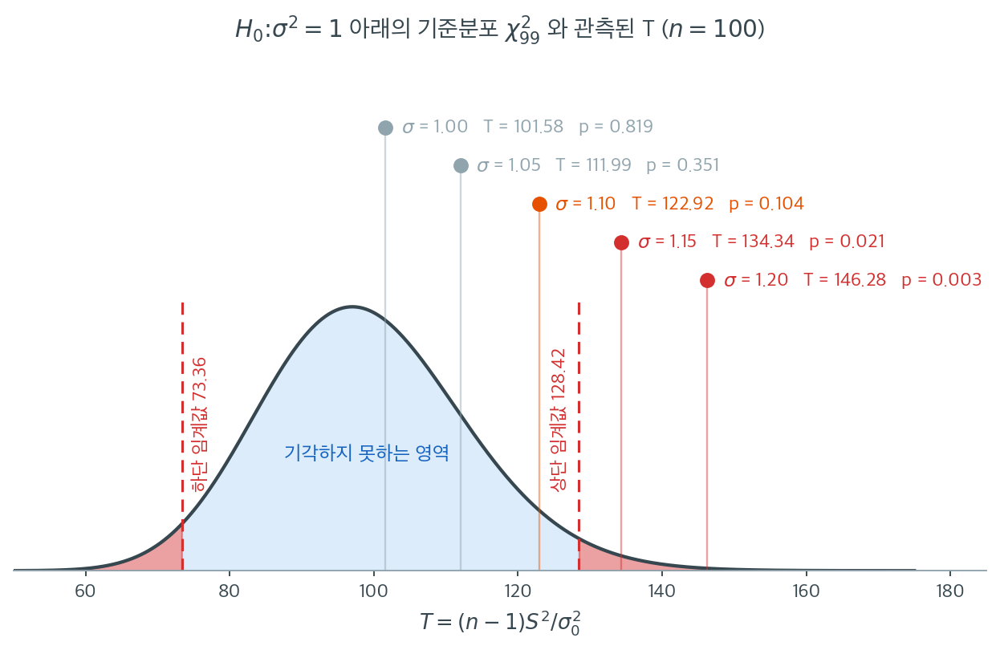

# 분산에 대한 카이제곱 검정

!!! note "이 주제를 다루는 다른 곳"
    분산분석의 등분산성 사전확인이라는 좁은 맥락에서 같은 검정을 짧게 쓰는 예가
    **11.5 가정**에 있다.

---

## 개요

분산에 대한 카이제곱 검정은 정규분포를 따르는 모집단의 분산이 가설로 세운 값과 같은지 판정하는 일표본 가설검정이다. 카이제곱분포 위에 직접 세워져 있으며, 평균에 대한 일표본 $z$ 검정이나 $t$ 검정의 분산판에 해당한다. 검정통계량이 표본분산과 가설 분산의 비에 의존하므로, 공정이 지정된 변동성 목표를 충족해야 하는 품질관리 상황에서 특히 유용하다.

---

## 1. 검정 설정

$X_1, X_2, \ldots, X_n$이 $N(\mu, \sigma^2)$에서 나온 독립 확률표본이라 하자. 다음을 검정한다.

$$
H_0 : \sigma^2 = \sigma_0^2 \quad \text{대} \quad H_1 : \sigma^2 \neq \sigma_0^2
$$

여기서 $\sigma_0^2$은 가설로 세운 모분산이다.

---

## 2. 검정통계량

표본분산을

$$
S^2 = \frac{1}{n-1} \sum_{i=1}^{n} (X_i - \bar{X})^2
$$

로 정의한다. $H_0$ 아래에서 검정통계량

$$
T = \frac{(n-1) S^2}{\sigma_0^2}
$$

은 자유도 $n - 1$인 카이제곱분포를 따른다.

$$
T \sim \chi^2(n-1).
$$

---

## 3. 판정규칙

유의수준 $\alpha$의 양측검정에서 다음이면 $H_0$을 기각한다.

$$
T < \chi^2_{\alpha/2,\, n-1} \quad \text{또는} \quad T > \chi^2_{1-\alpha/2,\, n-1},
$$

여기서 $\chi^2_{q,\, n-1}$은 $\chi^2(n-1)$의 $q$ 분위수이다. 동등하게 양측 $p$값은

$$
p = 2 \min\!\bigl(F_{\chi^2}(T),\; 1 - F_{\chi^2}(T)\bigr),
$$

여기서 $F_{\chi^2}$은 $\chi^2(n-1)$의 CDF이다.

아래 함수는 분산에 대한 일표본 카이제곱 검정을 구현한다.

<div class="exbox" markdown>

**보기 1.** <span class="diff easy" title="쉬움"></span> 분산에 대한 카이제곱 검정 구현. 위의 판정규칙을 그대로 함수로 옮긴다. 두 꼴로 적어 두고 "동등하게"라고 했으니, 정말 동등한지 확인할 몫이 남았다.

**(1)** 임계값으로 자르는 규칙과 $p = 2\min\bigl(F_{\chi^2}(T),\, 1 - F_{\chi^2}(T)\bigr) < \alpha$ 규칙이 **정확히 같은 기각역**을 줌을 보이시오.

**(2)** $n = 25$, $\alpha = 0.05$ 에서 수치로 확인하시오. 분포가 비대칭이라는 사실이 기각역의 어디에 나타나는가.

</div>

??? success "풀이"

    **(1) 두 규칙은 같은 사건이다.** $\ell = \chi^2_{\alpha/2,\,n-1}$, $u = \chi^2_{1-\alpha/2,\,n-1}$ 이라 쓰고 $F = F_{\chi^2}$ 라 하자. $F$ 는 $(0,\infty)$ 에서 연속이고 **엄격히 증가**하므로 분위수와 다음처럼 맞바꿀 수 있다.

    $$
    T < \ell \iff F(T) < \frac\alpha2,
    \qquad
    T > u \iff F(T) > 1 - \frac\alpha2 \iff 1 - F(T) < \frac\alpha2
    $$

    그러므로 임계값 규칙은 "$F(T)$ 와 $1-F(T)$ 가운데 **적어도 하나**가 $\alpha/2$ 보다 작다"는 것이고, 이것은 작은 쪽이 $\alpha/2$ 보다 작다는 말과 같다.

    $$
    T < \ell \;\text{ 또는 }\; T > u
    \iff
    \min\bigl(F(T),\, 1 - F(T)\bigr) < \frac\alpha2
    \iff
    p = 2\min\bigl(F(T),\, 1-F(T)\bigr) < \alpha
    $$

    **두 규칙이 같은 기각역을 준다.** 양쪽 꼬리에 각각 $\alpha/2$ 를 떼어 주었으니 **등꼬리 양측검정**이고, 두 사건이 서로 배반이므로 크기가 정확히 $\alpha/2 + \alpha/2 = \alpha$ 다.

    이 $p$ 값이 $1$ 을 넘지 않는다는 것과 $H_0$ 아래에서 **정확히** $U(0,1)$ 을 따른다는 것은 $F$ 검정의 양측 $p$ 값과 글자 하나 다르지 않은 논증이다. 15.3절 **$F$ 검정 구현** 보기 1 에 적어 두었으므로 되풀이하지 않는다. 다만 그 "정확히"가 어디에 기대고 있는지는 여기서도 같다. 유일한 고리는 $T \sim \chi^2_{n-1}$ 이고, 그것은 **정규모집단에서만** 참이다(5.2절). 정규성이 깨지면 위의 등식들은 그대로 남지만 $F$ 가 더 이상 $T$ 의 참 분포함수가 아니게 되어 크기가 $\alpha$ 에서 벗어난다.

    **(2) 수치적으로.** 임계값 바로 안팎까지 격자에 끼워 두 규칙을 한 점씩 맞춰 본다.

    ```python
    import numpy as np
    import scipy.stats as stats


    def chi2_test_for_variance(data, sigma2_0=1.0):
        """모분산이 sigma2_0 인지 검정하는 일표본 카이제곱 검정.

        H0: sigma^2 = sigma2_0
        H1: sigma^2 != sigma2_0

        카이제곱 분포는 좌우가 대칭이 아니므로, 양측 p-값은 두 꼬리 넓이 중
        작은 쪽을 두 배 해서 만든다.
        """
        n = len(data)
        s2 = np.var(data, ddof=1)
        statistic = (n - 1) * s2 / sigma2_0
        p_value = 2 * min(
            stats.chi2(df=n - 1).cdf(statistic),
            stats.chi2(df=n - 1).sf(statistic),
        )
        return statistic, p_value


    # 한 쌍으로 손풀기. H0 이 참인 표본이므로 p 가 커야 한다.
    rng = np.random.default_rng(5)
    stat, pval = chi2_test_for_variance(rng.normal(size=25), sigma2_0=1.0)
    print(f"표본 하나:  T = {stat:.4f},  p = {pval:.4f}")

    n, alpha = 25, 0.05
    dist = stats.chi2(df=n - 1)
    lo, hi = dist.ppf([alpha / 2, 1 - alpha / 2])
    print(f"\nchi2(24) 의 2.5%/97.5% 임계값 = {lo:.4f}  {hi:.4f}")
    print(f"  경계에서의 p:  p({lo:.4f}) = {2 * min(dist.cdf(lo), dist.sf(lo)):.6f}"
          f"   p({hi:.4f}) = {2 * min(dist.cdf(hi), dist.sf(hi)):.6f}")

    # (1) 두 판정규칙이 정말 같은 기각역을 주는가. 임계값 바로 안팎까지 격자에 끼운다.
    grid = np.unique(np.concatenate([
        np.linspace(1e-6, 120, 200_001),
        lo + np.array([-1e-9, 0.0, 1e-9]),
        hi + np.array([-1e-9, 0.0, 1e-9]),
    ]))
    U = dist.cdf(grid)
    p_grid = 2 * np.minimum(U, 1 - U)
    rule_crit = (grid < lo) | (grid > hi)      # 임계값으로 자르는 규칙
    rule_pval = p_grid < alpha                 # p < alpha 규칙
    print(f"\n격자점 {grid.size:,} 개에서 두 규칙이 어긋난 횟수 = {(rule_crit != rule_pval).sum()}")
    print(f"격자에서 p 의 최대값 = {p_grid.max():.6f}  (1 을 넘지 않는다)")

    # 비대칭이라는 것이 눈에 보이게. 평균은 n-1 = 24 지만 p = 1 이 되는 곳은 중앙값이다.
    print(f"\nchi2(24) 의 평균 = {n - 1},  중앙값 = {dist.median():.4f}")
    print(f"  기각역 하단은 평균에서 {(n - 1) - lo:.4f} 아래,  상단은 {hi - (n - 1):.4f} 위")
    print(f"  p(평균 24) = {2 * min(dist.cdf(24), dist.sf(24)):.6f}")
    print(f"  p(중앙값)  = {2 * min(dist.cdf(dist.median()), dist.sf(dist.median())):.6f}")
    ```

    출력:

    ```text
    표본 하나:  T = 18.8045,  p = 0.4753

    chi2(24) 의 2.5%/97.5% 임계값 = 12.4012  39.3641
      경계에서의 p:  p(12.4012) = 0.050000   p(39.3641) = 0.050000

    격자점 200,007 개에서 두 규칙이 어긋난 횟수 = 2
    격자에서 p 의 최대값 = 0.999968  (1 을 넘지 않는다)

    chi2(24) 의 평균 = 24,  중앙값 = 23.3367
      기각역 하단은 평균에서 11.5988 아래,  상단은 15.3641 위
      p(평균 24) = 0.923195
      p(중앙값)  = 1.000000
    ```

    **두 경계에서 $p$ 가 정확히 $\alpha$ 다.** $T = 12.4012$ 와 $T = 39.3641$ 에서 모두 $p = 0.050000$ 이 나왔다. (1)의 대응이 수치로 확인된 것이다. 기각역의 경계가 곧 $p = \alpha$ 의 등위면이다.

    **20만 개 격자점 가운데 어긋난 곳이 둘 있다.** 덮어 두지 말고 짚자. 어긋난 자리는 **임계값 그 자신인 $T = \ell$ 과 $T = u$ 뿐**이다. 그 두 점에서 참값은 $p = \alpha$ 지만 부동소수점 계산이 $p - \alpha$ 를 각각 $-4.9\times10^{-17}$, $-1.8\times10^{-16}$ 으로 돌려주어 `p < alpha` 가 참이 되어 버린다. 임계값 규칙은 `T < lo` 가 거짓이므로 기각하지 않는다. **연속분포에서 $T$ 가 임계값과 정확히 같을 확률은 $0$ 이므로** 실제 검정에서는 결코 걸리지 않는 차이이고, 격자에 일부러 그 점을 끼워 넣었기 때문에 드러난 것이다. 임계값에서 $10^{-9}$ 만 벗어난 네 점은 모두 두 규칙이 일치한다.

    **비대칭은 기각역의 모양에 나타난다.** $\chi^2_{24}$ 의 평균은 $n-1 = 24$ 인데 기각역 하단은 평균에서 $11.60$ 아래, 상단은 $15.36$ 위다. **한쪽이 다른 쪽보다 $3.8$ 만큼 멀다.** 평균을 중심으로 $\pm c$ 로 잘라서는 양쪽 꼬리를 $2.5\%$ 씩 맞출 수 없다는 뜻이고, 그래서 정규나 $t$ 검정처럼 "추정값 $\pm$ 임계값" 꼴로 쓸 수 없다. 꼬리확률을 직접 재는 수밖에 없다.

    $p = 1$ 이 되는 자리도 평균이 아니다. $p$ 가 $1$ 이 되려면 $F(T) = 1/2$, 곧 $T$ 가 **중앙값**이어야 한다. $\chi^2_{24}$ 의 중앙값은 $23.3367$ 이고 거기서 $p = 1.000000$ 이다. 평균 $24$ 에서는 $p = 0.923195$ 로 $1$ 에 못 미친다. 오른쪽으로 치우친 분포여서 평균이 중앙값보다 크기 때문이다.

전형적인 사용법은 참 표준편차를 바꿔가며 자료를 생성하고 검정이 $\sigma_0^2 = 1$로부터의 이탈을 탐지하는지 확인하는 것이다.

<div class="exbox" markdown>

**보기 2.** <span class="diff easy" title="쉬움"></span> 분산을 키워 가며 검정하기. $n = 100$, **씨앗을 고정**하고 참 표준편차 $\sigma$ 만 $1.00$ 에서 $1.20$ 까지 올린다. $\sigma_0^2 = 1$ 로 검정한다.

**(1)** 씨앗이 같으면 통계량이 표집변동 없이 $T(\sigma) = \sigma^2 T(1)$ 이 됨을 보이고, 기각이 시작되는 $\sigma$ 를 **돌려 보기 전에** 임계값으로 계산하시오.

**(2)** 수치로 확인한 뒤, 이 표를 "검정력"으로 읽으면 왜 안 되는지 밝히시오. 독립 표본에서의 실제 기각률을 구해 15.3절 두 표본 $F$ 검정과 견주시오.

</div>

??? success "풀이"

    **(1) 다섯 표본이 같은 난수를 척도만 바꾸어 쓴 것이다.** `stats.norm(loc=1, scale=sigma).rvs(size, random_state=seed)` 는 씨앗 하나로 정해지는 표준정규 추출값 $z_1, \ldots, z_{100}$ 에 $1 + \sigma z_j$ 를 씌워 돌려준다. 씨앗이 고정되어 있으니 $z$ 가 **같은 수열**이고

    $$
    y_j(\sigma) = 1 + \sigma z_j
    $$

    이다. 표본분산은 위치이동에 둔감하고 척도에 대해 이차이므로 $S_y^2(\sigma) = \sigma^2 S_z^2$ 이고, 따라서

    $$
    T(\sigma) = \frac{(n-1) S_y^2(\sigma)}{\sigma_0^2} = \sigma^2 \cdot \frac{(n-1) S_z^2}{\sigma_0^2} = \sigma^2 \, T(1)
    $$

    이다. **$S_z^2$ 이 공통인자로 빠져 자료가 통째로 사라졌다.** 표본표준편차도 $s_y(\sigma) = \sigma \, s_z$ 로 비례한다. 다섯 줄은 독립인 다섯 실험이 아니라 **한 표본을 다섯 배율로 늘여 본 것**이다.

    **기각이 시작되는 $\sigma$.** $T$ 가 커지는 쪽만 보면 되므로 상단 임계값 $u = \chi^2_{0.975,\,99}$ 만 쓰면 된다. $\sigma^2 T(1) > u$ 에서

    $$
    \sigma > \sqrt{\frac{u}{T(1)}}
    $$

    이다. 수치로는 $u = 128.4220$, $T(1) = 101.5827$ 이므로 문턱이 $\sigma = 1.1244$ 다. 다섯 후보 가운데 $1.15$ 와 $1.20$ 이 이를 넘으므로 **앞의 셋은 기각하지 못하고 뒤의 둘은 기각한다**고 예측된다. 판정이 뒤집히는 자리가 $1.10$ 과 $1.15$ 사이에 있다.

    **(2) 확인한다.** 아래 코드는 보기 1 의 `chi2_test_for_variance` 를 그대로 이어받는다.

    ```python
    # 참 표준편차를 1 에서 1.2 까지 올려 가며 검정이 언제부터 잡아내는지 본다.
    size, seed = 100, 0

    null = stats.chi2(df=size - 1)
    lo, hi = null.ppf([0.025, 0.975])
    T1, _ = chi2_test_for_variance(
        stats.norm(loc=1, scale=1.0).rvs(size, random_state=seed), sigma2_0=1.0)
    print(f"chi2(99) 의 2.5%/97.5% 임계값 = {lo:.4f}  {hi:.4f}")
    print(f"sigma = 1 일 때의 T(1) = {T1:.4f}")
    print(f"기각 문턱:  sigma > sqrt({hi:.4f}/{T1:.4f}) = {np.sqrt(hi / T1):.4f}\n")

    print(f"{'sigma':>6}{'s':>9}{'T':>10}{'sigma^2*T(1)':>14}{'차':>10}{'p':>8}  판정")
    for scale in [1.00, 1.05, 1.10, 1.15, 1.20]:
        y = stats.norm(loc=1, scale=scale).rvs(size, random_state=seed)
        stat, pval = chi2_test_for_variance(y, sigma2_0=1.0)
        pred = scale**2 * T1
        verdict = "기각" if (stat < lo or stat > hi) else "기각 못함"
        print(f"{scale:>6.2f}{y.std(ddof=1):>9.4f}{stat:>10.4f}{pred:>14.4f}"
              f"{abs(stat - pred):>10.1e}{pval:>8.3f}  {verdict}")

    # 다섯 표본이 같은 z 를 척도만 바꾸어 쓴 것인지 직접 확인한다.
    z = stats.norm(loc=0, scale=1).rvs(size, random_state=seed)
    y12 = stats.norm(loc=1, scale=1.2).rvs(size, random_state=seed)
    print(f"\ny(1.2) - (1 + 1.2*z) 의 최대 절대오차 = {np.abs(y12 - (1 + 1.2 * z)).max():.3e}")

    # 독립 표본이면 기각률이 얼마인가. T_obs = sigma^2 * W,  W ~ chi2(99) 이므로
    print("\n독립 표본일 때 정확한 기각률 (n=100, alpha=0.05)")
    print(f"{'sigma':>6}{'일표본 chi2':>14}{'두표본 F':>12}")
    f_null = stats.f(size - 1, size - 1)
    f_lo, f_hi = f_null.ppf([0.025, 0.975])
    for scale in [1.00, 1.05, 1.10, 1.15, 1.20, 1.30]:
        r = scale**2
        chi_pow = null.cdf(lo / r) + null.sf(hi / r)
        f_pow = f_null.cdf(f_lo * r) + f_null.sf(f_hi * r)
        print(f"{scale:>6.2f}{chi_pow:>14.4f}{f_pow:>12.4f}")
    ```

    출력:

    ```text
    chi2(99) 의 2.5%/97.5% 임계값 = 73.3611  128.4220
    sigma = 1 일 때의 T(1) = 101.5827
    기각 문턱:  sigma > sqrt(128.4220/101.5827) = 1.1244

     sigma        s         T  sigma^2*T(1)         차       p  판정
      1.00   1.0130  101.5827      101.5827   0.0e+00   0.819  기각 못함
      1.05   1.0636  111.9949      111.9949   2.8e-14   0.351  기각 못함
      1.10   1.1143  122.9150      122.9150   4.3e-14   0.104  기각 못함
      1.15   1.1649  134.3431      134.3431   5.7e-14   0.021  기각
      1.20   1.2156  146.2790      146.2790   5.7e-14   0.003  기각

    y(1.2) - (1 + 1.2*z) 의 최대 절대오차 = 0.000e+00

    독립 표본일 때 정확한 기각률 (n=100, alpha=0.05)
     sigma      일표본 chi2       두표본 F
      1.00        0.0500      0.0500
      1.05        0.1158      0.0769
      1.10        0.2946      0.1559
      1.15        0.5352      0.2817
      1.20        0.7500      0.4378
      1.30        0.9586      0.7381
    ```

    **(1)의 항등식이 기계 정밀도까지 맞는다.** $T$ 와 $\sigma^2 T(1)$ 의 차가 $5.7\times10^{-14}$ 이하이고 $\sigma = 1$ 에서는 정확히 $0$ 이다($T$ 가 $10^2$ 규모이므로 상대오차가 $10^{-16}$ 수준이다). 더 결정적인 것은 `y(1.2) - (1 + 1.2*z)` 의 최대 절대오차가 **정확히 $0$** 이라는 줄이다. 다섯 표본이 같은 $z$ 를 공유한다는 것이 어림이 아니라 비트 단위로 확인되었다. 표본표준편차가 $1.0130 \times \{1.00, 1.05, 1.10, 1.15, 1.20\}$ 으로 꼭 떨어지는 것도 같은 까닭이다.

    **기각 문턱 예측도 맞는다.** $\sigma = 1.1244$ 가 문턱이고, 실제로 $1.10$ 에서 $T = 122.9150$ 이 상단 임계값 $128.4220$ 안쪽($p = 0.104$)이며 $1.15$ 에서 $T = 134.3431$ 이 선을 넘는다($p = 0.021$). **표준편차가 $10\%$ 에서 $15\%$ 로 바뀌는 사이에 판정이 뒤집힌다.**

    **그러나 이 표는 검정력이 아니다.** 표집변동이 0 으로 눌려 있으므로 다섯 줄은 "같은 효과크기에서 $p$ 값이 어떻게 나오는가"의 분포를 전혀 보여 주지 않는다. 독립 표본에서는 $T_{\text{obs}} = \sigma^2 W$ 로 $W \sim \chi^2_{99}$ 가 곱해져 $T$ 가 $\sigma^2 T(1)$ 주위로 넓게 흩어진다. 마지막 표가 그 결과인데, $\sigma = 1.15$ 에서 실제 기각률이 $0.5352$ 다. **$p = 0.021$ 로 깔끔하게 기각한 그 효과크기가, 진짜 독립 표본에서는 두 번에 한 번쯤만 잡힌다.** $\sigma = 1.10$ 은 $0.2946$ 으로 넷에 하나를 조금 넘는다.

    검산도 된다. $\sigma = 1.00$ 줄의 기각률이 두 검정 모두 $0.0500$ 으로 명목값과 정확히 같다. 보기 1 에서 이 검정의 크기가 정규 가정 아래 정확히 $\alpha$ 임을 보였으니 그래야 한다.

    **일표본 $\chi^2$ 이 두 표본 $F$ 보다 한결 날카롭다.** 같은 $n = 100$, 같은 $\alpha$, 같은 $\sigma$ 비율에서 $\sigma = 1.20$ 일 때 $0.7500$ 대 $0.4378$, $\sigma = 1.15$ 에서 $0.5352$ 대 $0.2817$ 로 거의 두 배다. 까닭은 분모에 있다. 일표본 검정은 $\sigma_0^2$ 을 **알려진 상수**로 쓰므로 흔들리는 것이 $S^2$ 하나뿐인데, $F$ 검정은 분자와 분모가 둘 다 추정값이라 불확실성이 두 번 들어온다. **비교 대상이 추정값이라는 사실 하나가 검정력을 절반 가까이 깎는다.**

    마지막으로 이 깔끔함이 전부 정규성 위에 얹혀 있음을 다시 적어 둔다. 위의 모든 수는 $T \sim \chi^2_{99}$ 를 참으로 두고 나온 것이고, 15.3절은 비정규 모집단에서 그 $0.0500$ 이 **표본을 키워도 낫지 않는** 다른 상수로 간다는 것까지 유도해 두었다. 연습문제 4 의 $t_5$ 에서 $0.1725$ 가 나오는 것이 그 실물이다.

---

## 4. 해석

- 참 분산이 가설값과 같으면($\sigma = 1.00$) $p$값이 크게 나오므로 $H_0$을 기각하지 못한다.
- 참 표준편차가 커질수록 검정통계량이 커지고 $p$값이 작아져 $H_0$에 반하는 증거가 강해진다.
- 이 검정은 정규성을 가정한다. 꼬리가 두껍거나 치우친 자료에서는 실제 제1종 오류율이 명목 수준 $\alpha$에서 크게 벗어날 수 있다.

$n = 100$에서 표준편차가 15%만 커져도($\sigma = 1.15$) 5% 수준에서 기각한다는 점이 눈에 띈다. 15.3절에서 본 F 검정의 낮은 검정력과 대비되는데, 이는 일표본 검정이 $\sigma_0^2$을 **알려진 상수**로 취급하여 비교 대상의 불확실성이 없기 때문이다.

이 다섯 줄의 출력을 기준분포 위에 얹어 보면 검정이 무슨 일을 하는지가 한눈에 들어온다.



연한 파랑이 $H_0\colon \sigma^2 = 1$ 아래에서 $T$가 살아야 할 곳, 곧 $\chi^2_{99}$이다. 양쪽 붉은 점선이 2.5% 임계값 $73.36$과 $128.42$다. 자유도가 99이므로 분포의 중심도 99 근처이고, 참 $\sigma$가 정확히 1이면 $T$가 이 근처에서 나온다. 실제로 $\sigma = 1.00$인 표본에서 $T = 101.58$이 나왔다. 기준분포 한가운데다.

참 표준편차를 조금씩 올리면 $T$가 **오른쪽으로 밀려난다.** $T$의 기댓값이 $(n-1)\sigma^2/\sigma_0^2$이므로 $\sigma$가 1.20이면 중심이 $99 \times 1.44 = 142.6$으로 옮겨 간다. 그림의 다섯 점이 정확히 그 궤적을 그린다. $101.58 \to 111.99 \to 122.92 \to 134.34 \to 146.28$.

결정적인 것은 **점이 임계선을 넘는 순간**이다. $\sigma = 1.10$의 $T = 122.92$는 아직 $128.42$ 안쪽이라 기각하지 못한다($p = 0.104$). $\sigma = 1.15$의 $T = 134.34$가 선을 넘으면서 $p = 0.021$이 된다. 표준편차가 10%에서 15%로 바뀌는 사이에 판정이 뒤집힌다. **검정력은 이 선을 넘을 확률이고, 그림에서는 점 무리가 선 오른쪽으로 얼마나 밀려났는지가 곧 검정력이다.**

한 가지 주의. 이 다섯 줄은 같은 난수 시드에서 뽑은 **표본 하나씩**이다. 같은 $\sigma = 1.10$으로 다시 뽑으면 $T$가 선 오른쪽에 떨어질 수도 있다. 점 하나는 검정력이 아니라 검정력 분포에서 뽑은 한 번의 추첨이다.

---

## 연습문제

<div class="drillbox" markdown>

**연습문제 1.** <span class="diff easy" title="쉬움"></span> 어떤 제조공정은 부품 지름의 분산이 $\sigma_0^2 = 0.04\;\text{mm}^2$이 되도록 설계되었다. 부품 $n = 25$개의 표본에서 $S^2 = 0.06$을 얻었다. 카이제곱 검정통계량을 계산하고 Python으로 양측 $p$값을 구하라. $\alpha = 0.05$에서 결론을 서술하라.

</div>

??? success "풀이"

    검정통계량은

    $$
    T = \frac{(25 - 1)(0.06)}{0.04} = \frac{1.44}{0.04} = 36.
    $$

    ```python
    import scipy.stats as stats

    T = 24 * 0.06 / 0.04  # 36.0
    p = 2 * min(stats.chi2(df=24).cdf(T), stats.chi2(df=24).sf(T))
    print(f"T = {T:.1f}, right tail = {stats.chi2(df=24).sf(T):.4f}, "
          f"two-sided p = {p:.4f}")
    ```

    출력:

    ```text
    T = 36.0, right tail = 0.0549, two-sided p = 0.1098
    ```

    $\chi^2(24)$에서 오른쪽 꼬리확률 $P(\chi^2 > 36) = 0.0549$이므로 양측 $p = 0.110$이다. $\alpha = 0.05$에서 $H_0$을 기각하지 못한다. 분산이 $0.04$와 다르다고 결론지을 증거가 충분하지 않다.

    **다만 단측이라면 결론이 달라질 뻔했다.** 품질관리에서는 보통 "분산이 목표보다 **큰가**"만 문제가 되므로 단측검정이 적절하다. 그 경우 $p = 0.0549$로 여전히 기각하지 못하지만 경계선에 훨씬 가깝다.

    검정 방향은 자료를 보기 전에 정해야 한다. 양측으로 계획했다가 결과를 보고 단측으로 바꾸는 것은 유의수준을 두 배로 부풀리는 조작이다. $\square$

---

<div class="drillbox" markdown>

**연습문제 2.** <span class="diff easy" title="쉬움"></span> $N(0,1)$에서 크기 $n = 30$인 표본을 뽑아 $\sigma_0^2 = 1$, $\alpha = 0.05$로 카이제곱 검정을 적용하는 모의실험(5,000회 이상)을 작성하라. 경험적 제1종 오류율을 추정하고 0.05에 가까운지 확인하라.

</div>

??? success "풀이"

    ```python
    import numpy as np
    import scipy.stats as stats

    rng = np.random.default_rng(42)
    n, sigma2_0, alpha, n_sims = 30, 1.0, 0.05, 10000
    rejections = 0

    for _ in range(n_sims):
        x = rng.normal(0, 1, size=n)
        s2 = np.var(x, ddof=1)
        T = (n - 1) * s2 / sigma2_0
        p = 2 * min(stats.chi2(df=n - 1).cdf(T), stats.chi2(df=n - 1).sf(T))
        if p < alpha:
            rejections += 1

    print(f"Empirical Type I error: {rejections / n_sims:.4f}")
    ```

    출력:

    ```text
    Empirical Type I error: 0.0500
    ```

    정확히 $0.0500$이다. 정규성 아래에서 이 검정이 **정확한**(exact) 검정이므로 당연한 결과이다. 점근근사가 아니라 정확한 표집분포를 쓰기 때문에 어떤 $n$에서도 크기가 정확히 $\alpha$이다.

    이는 14장과 15장에서 본 다른 검정들(D'Agostino $K^2$, Jarque-Bera, Levene 등)이 근사에 기대어 크기가 조금씩 어긋났던 것과 대조된다. $\square$

---

<div class="drillbox" markdown>

**연습문제 3.** <span class="diff med" title="중간"></span> 표본분산의 정의와, $H_0$ 아래에서 각 $(X_i - \mu)/\sigma_0 \sim N(0,1)$이라는 사실에서 출발하여 검정통계량 $T = (n-1)S^2 / \sigma_0^2$을 유도하라. 자유도가 왜 $n$이 아니라 $n - 1$인지 설명하라.

</div>

??? success "풀이"

    $Z_i = (X_i - \mu)/\sigma_0$이라 쓰면 $\sum_{i=1}^n Z_i^2 \sim \chi^2(n)$이다. 그러나 $\mu$는 알려져 있지 않아 $\bar{X}$로 대체된다. 제약 $\sum (X_i - \bar{X}) = 0$이 자유도 하나를 없애므로

    $$
    \sum_{i=1}^{n} \frac{(X_i - \bar{X})^2}{\sigma_0^2} = \frac{(n-1)S^2}{\sigma_0^2} \sim \chi^2(n-1).
    $$

    이는 $n$차원 표준정규 벡터를 모든 성분이 1인 벡터에 직교하는 $(n-1)$차원 부분공간으로 사영한 것이며, Cochran 정리에 의해 $\chi^2(n-1)$ 분포를 갖는다.

    **기하학적 그림.** $\mathbf{Z} = (Z_1,\ldots,Z_n)$의 분포는 회전에 불변이다. 이 벡터를 두 성분으로 분해한다.

    - $\mathbf{1}$ 방향 성분: $\sqrt{n}\bar{Z}$, 자유도 1
    - 그에 직교하는 성분: $\sum_i (Z_i - \bar{Z})^2$, 자유도 $n-1$

    직교 분해이므로 두 성분이 독립이고 자유도가 $1 + (n-1) = n$으로 더해진다. 우리가 관심 갖는 것은 두 번째 성분이며, 그것이 $\chi^2(n-1)$이다. $\square$

---

<div class="drillbox" markdown>

**연습문제 4.** <span class="diff med" title="중간"></span> 연습문제 2의 모의실험을 정규분포 대신 $t(5)$ 분포(꼬리가 더 두꺼움)에서 뽑아 반복하라. 경험적 기각률을 $\alpha = 0.05$와 비교하고, 카이제곱 검정이 비정규 자료에 왜 문제가 되는지 설명하라.

</div>

??? success "풀이"

    ```python
    import numpy as np
    import scipy.stats as stats

    rng = np.random.default_rng(42)
    n, sigma2_0, alpha, n_sims = 30, 5 / 3, 0.05, 10000
    # Var(t(5)) = 5/(5-2) = 5/3
    rejections = 0

    for _ in range(n_sims):
        x = stats.t(df=5).rvs(size=n, random_state=rng)
        s2 = np.var(x, ddof=1)
        T = (n - 1) * s2 / sigma2_0
        p = 2 * min(stats.chi2(df=n - 1).cdf(T), stats.chi2(df=n - 1).sf(T))
        if p < alpha:
            rejections += 1

    print(f"Empirical rejection rate (t(5)): {rejections / n_sims:.4f}")
    ```

    출력:

    ```text
    Empirical rejection rate (t(5)): 0.1725
    ```

    기각률이 $0.173$으로 명목값의 **3.5배**이다. 연습문제 2의 정확한 $0.0500$과 극명하게 대비된다.

    **원인.** 카이제곱 분산 검정은 첨도에 민감하다. 15.1절 연습문제 1에서 유도했듯

    $$
    \operatorname{Var}(S^2) \approx \frac{\sigma^4(\gamma_2 + 2)}{n}
    $$

    이고 $t_5$는 $\gamma_2 = 6$이므로 $S^2$의 실제 분산이 정규 이론값의 **4배**이다. 카이제곱 기준분포는 정규 이론값을 쓰므로 실제보다 절반의 폭을 갖고, 그래서 $T$가 임계값 밖으로 자주 벗어난다.

    **표본을 키워도 나아지지 않는다.** 팽창 인자 $(\gamma_2+2)/2 = 4$가 $n$에 의존하지 않기 때문이다. 15.3절 연습문제 3에서 F 검정에 대해 확인한 것과 같은 구조이다.

    **대안.** 붓스트랩 신뢰구간(15.6절)이나, 분산 자체보다 로버스트 산포 측도(중앙값절대편차 등)를 쓰는 방법이 있다. $\square$

---

<div class="drillbox" markdown>

**연습문제 5.** <span class="diff med" title="중간"></span> 단측검정 $H_0 : \sigma^2 \le \sigma_0^2$ 대 $H_1 : \sigma^2 > \sigma_0^2$을 구성하라. 기각규칙을 $\chi^2_{1-\alpha,\, n-1}$로 표현하고, Python 함수 `chi2_test_for_variance`를 단측 $p$값을 반환하도록 수정하라.

</div>

??? success "풀이"

    오른쪽 대립가설 $H_1: \sigma^2 > \sigma_0^2$에 대해 다음이면 $H_0$을 기각한다.

    $$
    T = \frac{(n-1)S^2}{\sigma_0^2} > \chi^2_{1-\alpha,\, n-1}.
    $$

    단측 $p$값은 $p = P(\chi^2(n-1) \ge T) = 1 - F_{\chi^2}(T)$이다.

    ```python
    import numpy as np
    import scipy.stats as stats

    def chi2_test_variance(data, sigma2_0=1.0, alternative='two-sided'):
        """모분산에 대한 일표본 카이제곱 검정.

        alternative: 'two-sided', 'greater', or 'less'
        """
        n = len(data)
        s2 = np.var(data, ddof=1)
        T = (n - 1) * s2 / sigma2_0
        dist = stats.chi2(df=n - 1)
        if alternative == 'greater':
            p = dist.sf(T)
        elif alternative == 'less':
            p = dist.cdf(T)
        elif alternative == 'two-sided':
            p = 2 * min(dist.cdf(T), dist.sf(T))
        else:
            raise ValueError(f"unknown alternative: {alternative}")
        return T, p
    ```

    **왜 $H_0$을 $\sigma^2 \le \sigma_0^2$(부등호)로 쓰는가.** 복합 귀무가설이지만 검정은 경계값 $\sigma^2 = \sigma_0^2$에서 수행한다. $\sigma^2 < \sigma_0^2$이면 $T$가 더 작아져 기각확률이 더 낮아지므로, 경계에서의 크기가 $H_0$ 전체에 대한 크기의 **상한**이 된다. 이런 성질을 갖는 검정을 수준 $\alpha$ 검정이라 한다.

    **품질관리에서의 의미.** 실무에서 관심은 대체로 "변동성이 규격을 넘는가"이므로 단측이 자연스럽다. 15.2절 연습문제 2에서 다룬 상단 신뢰한계와 쌍대 관계에 있다. $\square$

---

## 정리하며

카이제곱 분산 검정의 **구현**에서 챙길 점들이다.

- **`ddof=1` 을 확인한다.** 통계량이 베셀 수정한 $S^2$ 을 쓰므로 `numpy` 기본값(`ddof=0`)을 그대로 쓰면 틀린다.
- **양측 $p$ 값은 작은 쪽 꼬리의 두 배**로 계산하되 $1$ 을 넘지 않게 자른다. 비대칭 분포이므로 관례가 필요하다.
- **`scipy` 에 전용 함수가 없다.** `chi2.sf` 와 `chi2.cdf` 로 직접 만들어야 하며, 그래서 구현 실수가 생기기 쉽다.
- **분산비 시나리오로 검증한다.** 참 분산을 $\sigma_0^2$ 의 여러 배수로 두고 기각률을 재면 검정이 의도대로 작동하는지 확인된다.
- **정규가 아닌 자료로도 돌려 본다.** 제1종 오류율이 명목값에서 얼마나 벗어나는지 직접 보는 것이 이 장의 경고를 체감하는 가장 좋은 방법이다.

다음 절 **카이제곱분포**를 정리하고 $F$ 검정으로 넘어간다.
