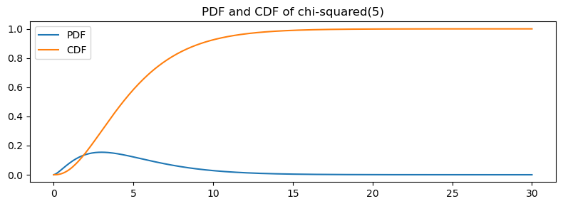
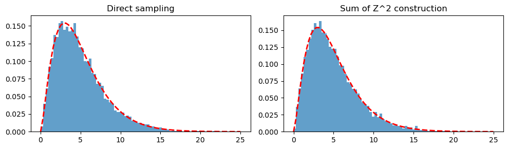
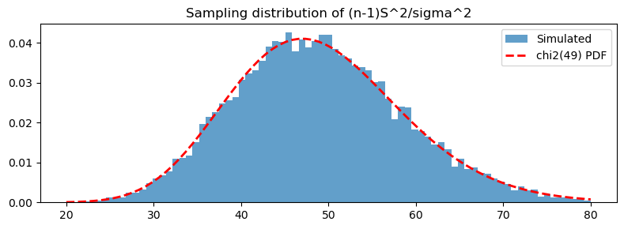

# 카이제곱분포

!!! note "이 주제를 다루는 다른 곳"
    분산분석에서 등분산성을 확인하는 맥락으로 이 분포를 짧게 만나려면 **11.5 가정**을 보라.

## 개요

카이제곱분포는 통계적 추론에서 가장 기본적인 분포 가운데 하나이다. 독립인 표준정규 확률변수의 제곱합의 분포로 자연스럽게 등장한다. 카이제곱분포는 분산 검정, 적합도 검정, 분할표의 독립성 검정을 떠받치며, 정규 모집단에서 나온 표본분산의 표집분포에도 나타난다.

## 정의

$Z_1, Z_2, \ldots, Z_d$가 독립인 표준정규 확률변수이면

$$
Q = \sum_{i=1}^{d} Z_i^2 \sim \chi^2(d),
$$

여기서 $d$는 자유도 모수이다.

## 성질

$\chi^2(d)$ 확률변수의 평균과 분산은

$$
E[Q] = d, \qquad \operatorname{Var}(Q) = 2d.
$$

$x > 0$에 대한 확률밀도함수는

$$
f(x; d) = \frac{1}{2^{d/2}\,\Gamma(d/2)}\, x^{d/2 - 1}\, e^{-x/2}.
$$

추가적인 주요 성질은 다음과 같다.

- **가법성**: $Q_1 \sim \chi^2(d_1)$과 $Q_2 \sim \chi^2(d_2)$가 독립이면 $Q_1 + Q_2 \sim \chi^2(d_1 + d_2)$이다.
- **표본분산과의 관계**: $X_1, \ldots, X_n \overset{\text{iid}}{\sim} N(\mu, \sigma^2)$이면 $(n-1)S^2/\sigma^2 \sim \chi^2(n-1)$이다.
- **중심극한정리 근사**: $d$가 크면 $\chi^2(d) \approx N(d, 2d)$이다.

## 코드

### PDF와 CDF

```python
import numpy as np
import scipy.stats as stats
import matplotlib.pyplot as plt

df = 5
x = np.linspace(0, 30, 300)

fig, ax = plt.subplots(figsize=(8, 3))
ax.plot(x, stats.chi2(df=df).pdf(x), label="PDF")
ax.plot(x, stats.chi2(df=df).cdf(x), label="CDF")
ax.legend()
ax.set_title(f"PDF and CDF of chi-squared({df})")
plt.tight_layout()
plt.show()
```



### 표집과 정규분포로부터의 구성

다음 코드는 $\chi^2(d)$에서 직접 표집한 결과와 표준정규 제곱 $d$개의 합을 비교하여 정의를 확인한다.

```python
df, seed = 5, 1

# Direct sampling
data_direct = stats.chi2(df=df).rvs(10_000, random_state=seed)

# Construction: sum of d squared standard normals
z = stats.norm().rvs(size=(df, 10_000), random_state=seed)
data_constructed = np.sum(z ** 2, axis=0)

# Both histograms should match the theoretical PDF
bins = np.linspace(0, 25, 80)
fig, (ax1, ax2) = plt.subplots(1, 2, figsize=(10, 3))
for ax, data, title in [
    (ax1, data_direct, "Direct sampling"),
    (ax2, data_constructed, "Sum of Z^2 construction"),
]:
    ax.hist(data, bins=bins, density=True, alpha=0.7)
    ax.plot(bins, stats.chi2(df=df).pdf(bins), "r--", lw=2)
    ax.set_title(title)
plt.tight_layout()
plt.show()
```



## 해석

- 자유도 $d$가 커지면 분포가 오른쪽으로 이동하고 더 대칭이 되어 정규분포에 접근한다.
- $\chi^2(d)$의 최빈값은 $\max(d - 2, 0)$이므로 $d$가 작으면 분포가 심하게 오른쪽으로 치우친다.
- 정규 제곱합으로부터의 구성은 기하학적 직관을 준다. $Q$는 $d$차원 표준정규 벡터의 원점으로부터의 제곱거리이다.

## 연습문제

**연습문제 1.** $Q \sim \chi^2(10)$이라 하자. Python으로 $P(Q > 18.307)$과 $P(3.247 < Q < 20.483)$을 계산하라.

??? success "풀이"

    ```python
    import scipy.stats as stats

    rv = stats.chi2(df=10)
    p1 = rv.sf(18.307)
    p2 = rv.cdf(20.483) - rv.cdf(3.247)
    print(f"P(Q > 18.307) = {p1:.4f}")
    print(f"P(3.247 < Q < 20.483) = {p2:.4f}")
    ```

    출력:

    ```text
    P(Q > 18.307) = 0.0500
    P(3.247 < Q < 20.483) = 0.9500
    ```

    $P(Q > 18.307) = 0.05$이다($18.307$이 $\chi^2_{0.95}(10)$ 임계값이다). $P(3.247 < Q < 20.483) = 0.95$로 95% 중심구간이다.

    두 값이 우연이 아니라 정확히 나온다는 점에 주목하라. $3.247 = \chi^2_{0.025}(10)$이고 $20.483 = \chi^2_{0.975}(10)$이므로, 이 구간은 15.2절 신뢰구간 구성에 쓰이는 바로 그 분위수 쌍이다.

    구간이 평균 $d = 10$을 중심으로 대칭이 아니라는 점도 확인하라. 아래로 $6.75$, 위로 $10.48$ 떨어져 있다. 오른쪽 치우침 때문이다. $\square$

---

**연습문제 2.** 가법성을 증명하라. $Q_1 \sim \chi^2(d_1)$과 $Q_2 \sim \chi^2(d_2)$가 독립이면 $Q_1 + Q_2 \sim \chi^2(d_1 + d_2)$임을 보여라.

??? success "풀이"

    $Q_1 = \sum_{i=1}^{d_1} Z_i^2$, $Q_2 = \sum_{j=1}^{d_2} W_j^2$로 쓰고 모든 $Z_i, W_j \overset{\text{iid}}{\sim} N(0,1)$이 독립이라 하자($Q_1$과 $Q_2$의 독립성에서 나온다). 그러면

    $$
    Q_1 + Q_2 = \sum_{i=1}^{d_1} Z_i^2 + \sum_{j=1}^{d_2} W_j^2 = \sum_{l=1}^{d_1 + d_2} U_l^2,
    $$

    이는 독립인 표준정규 제곱 $d_1 + d_2$개의 합이므로 정의에 의해 $\chi^2(d_1 + d_2)$이다.

    **적률생성함수를 이용한 대안적 증명.** 연습문제 4에서 $M_Q(t) = (1-2t)^{-d/2}$임을 보인다. 독립인 확률변수의 합의 MGF는 각 MGF의 곱이므로

    $$
    M_{Q_1+Q_2}(t) = (1-2t)^{-d_1/2}(1-2t)^{-d_2/2} = (1-2t)^{-(d_1+d_2)/2},
    $$

    이는 $\chi^2(d_1+d_2)$의 MGF이다. MGF가 분포를 유일하게 결정하므로 결과가 따라 나온다.

    **왜 이 성질이 중요한가.** 15.2절 유도에서 쓴 분해

    $$
    \underbrace{\sum_i \frac{(X_i-\mu)^2}{\sigma^2}}_{\chi^2(n)} = \underbrace{\sum_i \frac{(X_i-\bar{X})^2}{\sigma^2}}_{\chi^2(n-1)} + \underbrace{\frac{n(\bar{X}-\mu)^2}{\sigma^2}}_{\chi^2(1)}
    $$

    가 정확히 가법성의 역방향 적용이다. 자유도가 $1 + (n-1) = n$으로 맞아떨어지는 것이 이 성질의 결과이다. $\square$

---

**연습문제 3.** $N(3, 4)$(곧 $\mu = 3$, $\sigma^2 = 4$)에서 $n = 50$개 표본을 뽑아 $(n-1)S^2/\sigma^2$을 계산하는 과정을 10,000회 반복하는 모의실험을 작성하라. 히스토그램을 그리고 $\chi^2(49)$ PDF를 겹쳐 이론적 결과를 확인하라.

??? success "풀이"

    ```python
    import numpy as np
    import scipy.stats as stats
    import matplotlib.pyplot as plt

    rng = np.random.default_rng(42)
    n, mu, sigma2 = 50, 3, 4
    n_sims = 10000

    chi2_stats = []
    for _ in range(n_sims):
        x = rng.normal(mu, np.sqrt(sigma2), n)
        s2 = np.var(x, ddof=1)
        chi2_stats.append((n - 1) * s2 / sigma2)

    chi2_stats = np.array(chi2_stats)
    print(f"simulated mean = {chi2_stats.mean():.3f} (theory: {n-1})")
    print(f"simulated var  = {chi2_stats.var(ddof=1):.3f} "
          f"(theory: {2*(n-1)})")

    bins = np.linspace(20, 80, 80)
    fig, ax = plt.subplots(figsize=(8, 3))
    ax.hist(chi2_stats, bins=bins, density=True, alpha=0.7, label="Simulated")
    ax.plot(bins, stats.chi2(df=n - 1).pdf(bins), "r--", lw=2,
            label="chi2(49) PDF")
    ax.legend()
    ax.set_title("Sampling distribution of (n-1)S^2/sigma^2")
    plt.tight_layout()
    plt.show()
    ```

    출력:

    ```
    simulated mean = 49.090 (theory: 49)
    simulated var  = 97.480 (theory: 98)
    ```

    

    모의실험 평균 $49.09$와 분산 $97.48$이 이론값 $49$, $98$과 잘 맞는다. $(n-1)S^2/\sigma^2 \sim \chi^2(n-1)$이 성립함을 수치로 확인한 것이다.

    히스토그램이 $\chi^2(49)$ 곡선과 잘 맞는다. 모의실험 평균이 $49.09$(이론값 $49$), 분산이 $97.48$(이론값 $98$)로 이론과 부합한다.

    !!! note "$\sigma^2$을 알아야 한다는 점이 핵심이다"
        이 확인이 성립하는 것은 $\sigma^2 = 4$를 **알고** 있어서 통계량을 계산할 수 있기 때문이다. 실무에서는 $\sigma^2$을 모르므로 이 결과를 직접 쓸 수 없다.

        대신 이 결과를 **뒤집어** 쓴다. $(n-1)S^2/\sigma^2$의 분포를 알고 $S^2$을 관측했으므로, 미지의 $\sigma^2$에 대한 확률 진술을 만들 수 있다. 이것이 15.2절의 추축량 논법이며, 가설검정과 신뢰구간이 모두 여기서 나온다. $\square$

---

**연습문제 4.** $\chi^2(d)$의 적률생성함수(MGF)를 유도하고 이를 이용해 $E[Q]$와 $\operatorname{Var}(Q)$를 구하라.

??? success "풀이"

    $Z \sim N(0,1)$이면 $Z^2$의 MGF는 $t < 1/2$에 대해 $M_{Z^2}(t) = (1-2t)^{-1/2}$이다. $Q = \sum_{i=1}^d Z_i^2$이고 $Z_i$가 독립이므로

    $$
    M_Q(t) = \prod_{i=1}^d M_{Z_i^2}(t) = (1 - 2t)^{-d/2}, \quad t < \tfrac{1}{2}.
    $$

    미분하면

    $$
    M_Q'(t) = d(1-2t)^{-d/2 - 1}, \quad E[Q] = M_Q'(0) = d.
    $$

    $$
    M_Q''(t) = d(d+2)(1-2t)^{-d/2 - 2}, \quad E[Q^2] = M_Q''(0) = d(d+2).
    $$

    따라서

    $$
    \operatorname{Var}(Q) = E[Q^2] - (E[Q])^2 = d(d+2) - d^2 = 2d.
    $$

    **$M_{Z^2}(t) = (1-2t)^{-1/2}$의 유도.**

    $$
    E[e^{tZ^2}] = \int_{-\infty}^\infty \frac{1}{\sqrt{2\pi}}e^{tz^2 - z^2/2}\,dz = \int_{-\infty}^\infty \frac{1}{\sqrt{2\pi}}e^{-z^2(1-2t)/2}\,dz.
    $$

    $u = z\sqrt{1-2t}$로 치환하면($1-2t > 0$, 곧 $t < 1/2$일 때 유효)

    $$
    = \frac{1}{\sqrt{1-2t}}\int_{-\infty}^\infty \frac{1}{\sqrt{2\pi}}e^{-u^2/2}\,du = (1-2t)^{-1/2}.
    $$

    **더 높은 적률.** 같은 방법으로 3차, 4차 적률을 얻어 왜도 $\gamma_1 = \sqrt{8/d}$와 초과첨도 $\gamma_2 = 12/d$를 계산할 수 있다. $\square$

---

**연습문제 5.** $d = 1, 5, 10, 30, 100$에 대해 공식 $\gamma_1 = \sqrt{8/d}$로 $\chi^2(d)$의 왜도를 계산하고 표본으로 수치 확인하라. $d$가 커질수록 정규근사가 개선되는 이유를 설명하라.

??? success "풀이"

    ```python
    import numpy as np
    import scipy.stats as stats

    for d in [1, 5, 10, 30, 100]:
        theoretical_skew = np.sqrt(8 / d)
        samples = stats.chi2(df=d).rvs(100000, random_state=42)
        empirical_skew = stats.skew(samples)
        print(f"df={d:3d}: theoretical={theoretical_skew:.4f}, "
              f"empirical={empirical_skew:.4f}")
    ```

    출력:

    ```text
    df=  1: theoretical=2.8284, empirical=2.7697
    df=  5: theoretical=1.2649, empirical=1.2716
    df= 10: theoretical=0.8944, empirical=0.8922
    df= 30: theoretical=0.5164, empirical=0.5128
    df=100: theoretical=0.2828, empirical=0.2790
    ```

    왜도 $\gamma_1 = \sqrt{8/d}$는 $d$가 커질수록 줄어든다. $d = 1$에서 $2\sqrt{2} = 2.83$이지만 $d = 100$에서는 $0.283$이다. 중심극한정리에 의해 $Q = \sum Z_i^2$이 i.i.d. 항의 합이므로 표준화된 분포가 $N(0,1)$로 수렴한다.

    ($d = 1$에서 표본왜도 $2.77$이 이론값 $2.83$보다 작은 것은 표본왜도가 두꺼운 꼬리 분포에서 아래로 편향되기 때문이다. $\chi^2(1)$은 극단적으로 치우쳐 있어 $10^5$개 표본으로도 이론값에 정확히 도달하지 않는다.)

    !!! warning "$d \gtrsim 30$이면 정규근사가 충분하다는 통설은 과장이다"
        정규근사 $\chi^2(d) \approx N(d, 2d)$의 정확도를 상위 5% 분위수에서 확인해 보자.

        ```python
        import numpy as np
        from scipy import stats

        for d in [5, 10, 30, 100]:
            exact = stats.chi2.ppf(0.95, d)
            approx = d + 1.645 * np.sqrt(2 * d)
            print(f"d={d:>4}: exact={exact:8.3f}, normal={approx:8.3f}, "
                  f"error={100*(approx-exact)/exact:+6.2f}%")
        ```

        출력:

        ```text
        d=   5: exact=  11.070, normal=  10.202, error= -7.85%
        d=  10: exact=  18.307, normal=  17.357, error= -5.19%
        d=  30: exact=  43.773, normal=  42.742, error= -2.36%
        d= 100: exact= 124.342, normal= 123.264, error= -0.87%
        ```

        $d = 30$에서도 임계값을 2.4% 과소추정한다. 검정에 쓰면 지나치게 자주 기각하게 된다. $d = 100$에서도 0.9% 오차가 남는다.

        분포의 **중심** 근처는 $d \geq 30$에서 정규근사가 좋지만, 검정과 신뢰구간에 필요한 **꼬리**는 훨씬 느리게 수렴한다. 15.2절 연습문제 3에서 본 Wilson-Hilferty 근사 $\chi^2_\nu \approx \nu(1 - \frac{2}{9\nu} + z\sqrt{\frac{2}{9\nu}})^3$이 훨씬 정확하며, $d = 5$에서 이미 소수 둘째 자리까지 맞는다.

        오늘날에는 정확한 분위수를 직접 계산할 수 있으므로 근사가 필요 없다. 그래도 이 사실은 "$n \geq 30$이면 중심극한정리가 충분하다"는 일반적 통설을 꼬리 확률에 적용할 때 조심해야 한다는 점을 상기시킨다. $\square$
