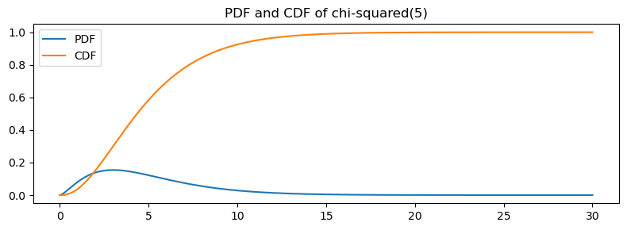
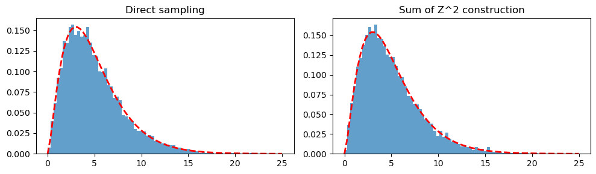
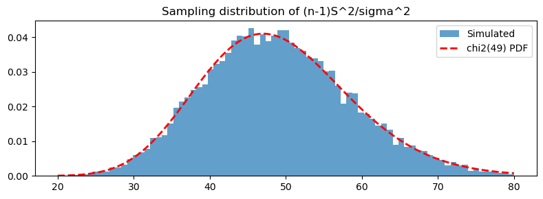

# 카이제곱분포

!!! note "이 주제를 다루는 다른 곳"
    분산분석에서 등분산성을 확인하는 맥락으로 이 분포를 짧게 만나려면 **11.5 가정**을 보라.

---

## 개요

카이제곱분포는 통계적 추론에서 가장 기본적인 분포 가운데 하나이다. 독립인 표준정규 확률변수의 제곱합의 분포로 자연스럽게 등장한다. 카이제곱분포는 분산 검정, 적합도 검정, 분할표의 독립성 검정을 떠받치며, 정규 모집단에서 나온 표본분산의 표집분포에도 나타난다.

<div class="defn" markdown>

### 정의 1. 카이제곱분포 { .dfn }

$Z_1, Z_2, \ldots, Z_d$가 독립인 표준정규 확률변수이면

$$
Q = \sum_{i=1}^{d} Z_i^2 \sim \chi^2(d),
$$

여기서 $d$는 자유도 모수이다.

</div>

---

## 1. 성질

$\chi^2(d)$ 확률변수의 평균과 분산은

$$
E[Q] = d, \qquad \operatorname{Var}(Q) = 2d.
$$

$x > 0$에 대한 확률밀도함수는

$$
f(x; d) = \frac{1}{2^{d/2}\,\Gamma(d/2)}\, x^{d/2 - 1}\, e^{-x/2}.
$$

추가적인 주요 성질은 다음과 같다.

- **가법성**: $Q_1 \sim \chi^2(d_1)$과 $Q_2 \sim \chi^2(d_2)$가 독립이면 $Q_1 + Q_2 \sim \chi^2(d_1 + d_2)$이다.
- **표본분산과의 관계**: $X_1, \ldots, X_n \overset{\text{iid}}{\sim} N(\mu, \sigma^2)$이면 $(n-1)S^2/\sigma^2 \sim \chi^2(n-1)$이다.
- **중심극한정리 근사**: $d$가 크면 $\chi^2(d) \approx N(d, 2d)$이다.

### PDF와 CDF

<div class="exbox" markdown>

**보기 1.** <span class="diff easy" title="쉬움"></span> 카이제곱 분포의 밀도와 분포함수. 자유도 $5$ 인 밀도와 분포함수를 $0 \le x \le 30$ 에서 한 축에 겹쳐 그린다.

**(1)** 위에 적은 밀도식에서 $\chi^2(d)$ 의 **최빈값이 $d > 2$ 일 때 $d - 2$** 임을 보이고, $d \le 2$ 에서는 왜 봉우리가 없는지 밝히시오. $d = 5$ 에서 봉우리의 높이는 얼마인가.

**(2)** 그려서 확인하시오. 코드의 격자가 그 봉우리를 정확히 집는가. 두 곡선을 **한 축에** 겹쳐 놓은 이 그림이 가리는 것은 무엇인가.

</div>

??? success "풀이"

    **(1) 해석적으로.** 밀도는

    $$
    f(x; d) = \frac{1}{2^{d/2}\,\Gamma(d/2)}\, x^{d/2 - 1}\, e^{-x/2}, \qquad x > 0
    $$

    이다. 앞의 상수는 $x$ 와 무관하므로 최대점을 찾는 데 쓸모가 없다. 곱을 합으로 바꾸려고 로그를 씌운다. $\log$ 가 엄격히 증가하므로 최대점은 옮겨 가지 않는다.

    $$
    \log f(x; d) = \text{상수} + \left(\frac d2 - 1\right)\log x - \frac x2
    $$

    미분하면

    $$
    \frac{d}{dx}\log f = \frac{d/2 - 1}{x} - \frac12
    $$

    이고, 이것을 $0$ 으로 두면 $x = d - 2$ 를 얻는다. 이 정류점이 최대임은 이계도함수가 보여 준다.

    $$
    \frac{d^2}{dx^2}\log f = -\frac{d/2 - 1}{x^2} < 0 \qquad (d > 2,\; x > 0)
    $$

    $\log f$ 가 $(0,\infty)$ 에서 위로 오목하므로 정류점은 하나뿐이고 그것이 최대다. 따라서 **$d > 2$ 이면 최빈값이 $d - 2$** 다.

    **$d \le 2$ 에서는 봉우리가 없다.** $d/2 - 1 \le 0$ 이면 위 도함수가 $(0,\infty)$ 전체에서 음수이므로 $f$ 가 **단조감소**한다. 정류점이 아예 없고 상한은 $x \to 0^+$ 에서만 다가간다. 그 끝점의 모습은 $d$ 에 따라 셋으로 갈린다.

    - $d = 2$: $f(x) = \tfrac12 e^{-x/2}$ 이므로 $f(0^+) = 1/2$ 로 유한하다(지수분포다).
    - $d < 2$: $x^{d/2-1} \to \infty$ 이므로 밀도가 $0$ 에서 **발산한다.** $d = 1$ 이 그렇다.
    - $d > 2$: $x^{d/2-1} \to 0$ 이므로 $f(0^+) = 0$ 이고, 그래서 안쪽에 봉우리가 생긴다.

    어느 쪽이든 $(0,\infty)$ 안에 최대점이 없으므로 관례상 최빈값을 $0$ 으로 적는다. 이것이 쪽 머리의 $\max(d-2, 0)$ 이라는 표기다.

    **$d = 5$ 의 봉우리.** 최빈값은 $x = 3$ 이고 높이는

    $$
    f(3; 5) = \frac{1}{2^{5/2}\,\Gamma(5/2)}\, 3^{3/2}\, e^{-3/2}
    $$

    이다. $\Gamma(5/2) = \tfrac34\sqrt\pi = 1.329340$ 이고 $2^{5/2} = 5.656854$ 이므로 앞의 상수가 $1/7.519884 = 0.132980$ 이고, $3^{3/2} = 5.196152$, $e^{-3/2} = 0.223130$ 을 곱하면 $f(3;5) = 0.154180$ 이다.

    **(2) 그려서 확인한다.** 아래 코드는 원래의 그림 코드에 (1)을 검산하는 출력만 덧붙인 것이다.

    ```python
    import numpy as np
    import scipy.stats as stats
    import matplotlib.pyplot as plt

    plt.rcParams["font.sans-serif"] = ["NanumGothic", "Apple SD Gothic Neo", "Malgun Gothic"]
    plt.rcParams["font.family"] = "sans-serif"
    plt.rcParams["axes.unicode_minus"] = False

    # 자유도 5 인 카이제곱의 밀도와 분포함수. 0 이상에서만 정의되고
    # 오른쪽으로 길게 늘어져 있다.
    df = 5
    x = np.linspace(0, 30, 300)

    rv = stats.chi2(df=df)
    print(f"해석적 최빈값 d - 2 = {df - 2}")
    print(f"  거기서의 밀도 f({df - 2}) = {rv.pdf(df - 2):.10f}")
    print(f"격자가 고른 최대점       = {x[np.argmax(rv.pdf(x))]:.10f}  (격자 간격 {x[1] - x[0]:.6f})")
    print(f"  거기서의 밀도         = {rv.pdf(x).max():.10f}")

    print(f"\n평균 = {df},  중앙값 = {rv.median():.4f},  최빈값 = {df - 2}")
    print(f"CDF 가 최빈값에서 가지는 값 = {rv.cdf(df - 2):.4f}")
    print(f"P(X > 10) = {rv.sf(10):.6f}   P(X > 30) = {rv.sf(30):.3e}")

    # 자유도가 2 이하이면 봉우리가 없다. 0 근처의 밀도를 재 본다.
    print("\n0 바로 옆(x = 1e-8)에서의 밀도")
    for d in (1, 2, 3, 4, 5):
        print(f"  d={d}:  f(1e-8) = {stats.chi2(df=d).pdf(1e-8):>12.4g}   최빈값 = {max(d - 2, 0)}")

    fig, ax = plt.subplots(figsize=(8, 3))
    ax.plot(x, stats.chi2(df=df).pdf(x), label="PDF")
    ax.plot(x, stats.chi2(df=df).cdf(x), label="CDF")
    ax.legend()
    ax.set_title(f"PDF and CDF of chi-squared({df})")
    plt.tight_layout()
    plt.show()
    ```

    출력:

    ```text
    해석적 최빈값 d - 2 = 3
      거기서의 밀도 f(3) = 0.1541803298
    격자가 고른 최대점       = 3.0100334448  (격자 간격 0.100334)
      거기서의 밀도         = 0.1541790392

    평균 = 5,  중앙값 = 4.3515,  최빈값 = 3
    CDF 가 최빈값에서 가지는 값 = 0.3000
    P(X > 10) = 0.075235   P(X > 30) = 1.475e-05

    0 바로 옆(x = 1e-8)에서의 밀도
      d=1:  f(1e-8) =         3989   최빈값 = 0
      d=2:  f(1e-8) =          0.5   최빈값 = 0
      d=3:  f(1e-8) =    3.989e-05   최빈값 = 1
      d=4:  f(1e-8) =      2.5e-09   최빈값 = 2
      d=5:  f(1e-8) =     1.33e-13   최빈값 = 3
    ```

    

    **봉우리의 높이가 맞는다.** 손으로 구한 $f(3;5) = 0.154180$ 과 코드가 준 $0.1541803298$ 이 소수 여섯째 자리까지 같다.

    **그러나 격자는 봉우리를 집지 못했다.** 코드의 격자가 $0$ 에서 $30$ 까지를 $300$ 등분해 간격이 $0.100334$ 이므로 **$x = 3$ 이 후보에 아예 없다.** `np.argmax` 가 고른 것은 가장 가까운 격자점 $3.0100$ 이고 거기서의 밀도는 $0.1541790$ 으로 참 봉우리보다 $1.3\times 10^{-6}$ 낮다. 밀도가 봉우리 근처에서 평평하므로 높이의 손해는 작지만, **위치는 한 칸 비껴나 있다.** 해석적으로 푼 답은 정확하고 격자 탐색은 격자만큼만 정확하다. 그림에서 봉우리의 자리를 눈으로 읽을 때도 같은 한계가 있다.

    **$d \le 2$ 의 경계도 수치로 보인다.** $x = 10^{-8}$ 에서 밀도가 $d = 1$ 이면 $3989$ 로 치솟고($x^{-1/2}$ 가 발산한다), $d = 2$ 이면 정확히 $0.5$ 이며, $d \ge 3$ 부터는 $0$ 으로 내려간다. $d = 3, 4, 5$ 에서 각각 $4\times10^{-5}$, $2.5\times10^{-9}$, $1.3\times10^{-13}$ 으로 $x^{d/2-1}$ 의 지수가 커질수록 더 빨리 꺼진다. **$d = 2$ 가 봉우리가 생기기 시작하는 문턱**이다.

    **세 중심이 한 줄로 늘어선다.** 최빈값 $3 <$ 중앙값 $4.3515 <$ 평균 $5$ 다. 오른쪽으로 치우친 분포의 표준적인 순서이고, 치우침의 정도는 연습문제 3 의 왜도 $\gamma_1 = \sqrt{8/d} = 1.2649$ 로 잰다. 분포함수가 최빈값에서 $0.3000$ 밖에 안 된다는 것도 같은 말이다. **밀도가 가장 높은 자리의 왼쪽에 질량의 $30\%$ 밖에 없다.**

    **이 그림이 가리는 것 — 세로축을 CDF 가 독차지한다.** 밀도의 최대값이 $0.1542$ 인데 분포함수는 $1$ 까지 올라가므로, 한 축에 겹쳐 놓으면 **밀도 곡선이 화면 아래쪽 $15\%$ 띠 안에 눌린다.** 그림에서 파란 곡선이 거의 바닥에 깔려 보이는 까닭이고, 그래서 꼬리의 모양을 전혀 읽을 수 없다. 밀도와 분포함수는 단위가 다르므로($f$ 는 $1/x$ 의 단위, $F$ 는 무차원) 원래 같은 축에 놓을 것이 아니다. 두 패널로 나누거나 오른쪽에 두 번째 축을 세워야 한다.

    **가로 범위도 낭비다.** $P(X > 10) = 0.0752$ 이고 $P(X > 30) = 1.5\times10^{-5}$ 다. 곧 $x = 10$ 오른쪽의 그림 **3분의 2가 질량의 $7.5\%$ 를 그리는 데 쓰이고**, 그 가운데 $x > 30$ 은 십만 분의 $1.5$ 다. 그 구간에서 밀도가 정확히 $0$ 인지 아주 작은지는 이 선형 축에서 분간할 수 없다. 꼬리를 보려면 로그 세로축을 쓰거나 범위를 좁혀야 한다. 분산 검정에서 정작 중요한 것이 이 꼬리라는 점을 생각하면 가볍게 넘길 일이 아니다.

### 표집과 정규분포로부터의 구성

다음 코드는 $\chi^2(d)$에서 직접 표집한 결과와 표준정규 제곱 $d$개의 합을 비교하여 정의를 확인한다.

<div class="exbox" markdown>

**보기 2.** <span class="diff easy" title="쉬움"></span> 정규 제곱합으로 만들어 보기. $\chi^2(5)$ 에서 직접 뽑은 표본 $10{,}000$ 개와, 표준정규 다섯 개를 제곱해 더해 만든 표본 $10{,}000$ 개를 견준다.

**(1)** 정규적률 $E[Z^2] = 1$, $E[Z^4] = 3$, $E[Z^6] = 15$ 에서 출발해 $E[Q] = d$, $\operatorname{Var}(Q) = 2d$, 왜도 $\gamma_1 = \sqrt{8/d}$ 를 유도하시오. $d = 5$, $N = 10{,}000$ 에서 표본평균의 몬테카를로 표준오차는 얼마인가.

**(2)** 두 방법이 정말 같은 분포를 주는지 적률과 적합도검정으로 확인하고, 그림이 보여 주는 것과 보여 주지 못하는 것을 가르시오.

</div>

??? success "풀이"

    **(1) 한 항의 적률부터.** $Z \sim N(0,1)$ 이면 $E[Z^{2k}] = (2k-1)!!$ 이므로 $E[Z^2] = 1$, $E[Z^4] = 3$, $E[Z^6] = 15$ 다. 한 항 $Z^2$ 의 중심적률을 차례로 구한다.

    $$
    E[Z^2] = 1, \qquad
    \operatorname{Var}(Z^2) = E[Z^4] - \bigl(E[Z^2]\bigr)^2 = 3 - 1 = 2
    $$

    $$
    E\bigl[(Z^2-1)^3\bigr] = E[Z^6] - 3E[Z^4] + 3E[Z^2] - 1 = 15 - 9 + 3 - 1 = 8
    $$

    **$d$ 항으로 넘어간다.** $Q = \sum_{i=1}^d Z_i^2$ 이고 항들이 독립이므로 기댓값·분산·3차 중심적률이 모두 더해진다(3차 중심적률의 가법성은 독립일 때 성립한다).

    $$
    E[Q] = d, \qquad \operatorname{Var}(Q) = 2d, \qquad E\bigl[(Q - d)^3\bigr] = 8d
    $$

    왜도는 3차 중심적률을 표준편차의 세제곱으로 나눈 것이므로

    $$
    \gamma_1 = \frac{E[(Q-d)^3]}{\bigl(\operatorname{Var} Q\bigr)^{3/2}}
    = \frac{8d}{(2d)^{3/2}}
    = \frac{8d}{2\sqrt2\, d^{3/2}}
    = \frac{2\sqrt2}{\sqrt d}
    = \sqrt{\frac8d}
    $$

    이다. $d = 5$ 에 넣으면 $\gamma_1 = \sqrt{1.6} = 1.264911$ 이다.

    **몬테카를로 표준오차.** 독립인 $N$ 개의 표본평균이므로

    $$
    \operatorname{SE}(\bar Q) = \sqrt{\frac{\operatorname{Var}(Q)}{N}} = \sqrt{\frac{2d}{N}} = \sqrt{\frac{10}{10000}} = 0.03162
    $$

    이다. **그러므로 표본평균이 $5$ 에서 $0.06$ 쯤 어긋나는 것은 흠이 아니라 예정된 일이다.** 아래 수치를 읽을 때 이 자를 들고 읽어야 한다.

    **(2) 수치적으로.** 그림만으로는 "비슷해 보인다"에서 멈추므로 적률과 적합도검정을 함께 찍는다.

    ```python
    plt.rcParams["font.sans-serif"] = ["NanumGothic", "Apple SD Gothic Neo", "Malgun Gothic"]
    plt.rcParams["font.family"] = "sans-serif"
    plt.rcParams["axes.unicode_minus"] = False

    df, seed = 5, 1

    # 방법 1: scipy 의 생성기를 그대로 쓴다.
    data_direct = stats.chi2(df=df).rvs(10_000, random_state=seed)

    # 방법 2: 정의를 그대로 실행한다. 표준정규 d 개를 제곱해 더하면
    # 자유도 d 인 카이제곱이 된다. 표본분산의 분포가 카이제곱이 되는 까닭도
    # 결국 이 구성에 있다.
    z = stats.norm().rvs(size=(df, 10_000), random_state=seed)
    data_constructed = np.sum(z ** 2, axis=0)

    # 이론값과 나란히 놓는다. 평균 d, 분산 2d, 왜도 sqrt(8/d).
    N = 10_000
    print(f"{'':>14}{'평균':>10}{'분산':>10}{'왜도':>10}")
    print(f"{'이론':>14}{df:>10.4f}{2 * df:>10.4f}{np.sqrt(8 / df):>10.4f}")
    for name, d in [("직접 표집", data_direct), ("Z^2 합 구성", data_constructed)]:
        print(f"{name:>12}{d.mean():>10.4f}{d.var(ddof=1):>10.4f}{stats.skew(d):>10.4f}")
    print(f"\n표본평균의 몬테카를로 표준오차 = sqrt(2d/N) = {np.sqrt(2 * df / N):.4f}")
    print(f"  직접 표집의 어긋남 = {data_direct.mean() - df:+.4f}"
          f"  ({(data_direct.mean() - df) / np.sqrt(2 * df / N):+.2f} SE)")
    print(f"  Z^2 합 구성의 어긋남 = {data_constructed.mean() - df:+.4f}"
          f"  ({(data_constructed.mean() - df) / np.sqrt(2 * df / N):+.2f} SE)")

    # 두 표본이 정말 chi2(5) 인가. 그리고 서로 같은 분포인가.
    for name, d in [("직접 표집", data_direct), ("Z^2 합 구성", data_constructed)]:
        ks = stats.kstest(d, "chi2", args=(df,))
        print(f"\n{name} vs chi2(5):   KS = {ks.statistic:.5f},  p = {ks.pvalue:.4f}")
    ks2 = stats.ks_2samp(data_direct, data_constructed)
    print(f"두 표본끼리:          KS = {ks2.statistic:.5f},  p = {ks2.pvalue:.4f}")

    # 두 히스토그램이 같은 이론 곡선에 얹히는지 확인한다.
    bins = np.linspace(0, 25, 80)
    fig, (ax1, ax2) = plt.subplots(1, 2, figsize=(10, 3))
    for ax, data, title in [
        (ax1, data_direct, "Direct sampling"),
        (ax2, data_constructed, "Sum of Z^2 construction"),
    ]:
        ax.hist(data, bins=bins, density=True, alpha=0.7)
        ax.plot(bins, stats.chi2(df=df).pdf(bins), "r--", lw=2)
        ax.set_title(title)
    plt.tight_layout()
    plt.show()
    ```

    출력:

    ```text
                          평균        분산        왜도
                이론    5.0000   10.0000    1.2649
           직접 표집    4.9953   10.0317    1.2592
        Z^2 합 구성    5.0068    9.9999    1.2822

    표본평균의 몬테카를로 표준오차 = sqrt(2d/N) = 0.0316
      직접 표집의 어긋남 = -0.0047  (-0.15 SE)
      Z^2 합 구성의 어긋남 = +0.0068  (+0.22 SE)

    직접 표집 vs chi2(5):   KS = 0.00478,  p = 0.9754

    Z^2 합 구성 vs chi2(5):   KS = 0.00554,  p = 0.9171
    두 표본끼리:          KS = 0.00760,  p = 0.9349
    ```

    

    **세 적률이 모두 이론과 맞는다.** 평균은 $4.9953$ 과 $5.0068$ 로 각각 $-0.15\,\mathrm{SE}$, $+0.22\,\mathrm{SE}$ 다. (1)에서 계산한 자가 $0.0316$ 이므로 둘 다 우연으로 완전히 설명되는 크기다. 분산은 $10.0317$ 과 $9.9999$ 로 이론값 $10$ 에, 왜도는 $1.2592$ 와 $1.2822$ 로 $\sqrt{8/5} = 1.2649$ 에 붙는다. **왜도의 어긋남이 평균보다 커 보이는 것은 흠이 아니다.** 고차 적률일수록 추정이 느리게 수렴하며, 꼬리가 긴 분포에서는 특히 그렇다. 연습문제 3 에서 $\chi^2(1)$ 의 표본왜도가 $10^5$ 개로도 이론값에 못 미치는 것이 같은 현상이다.

    **적합도검정도 통과한다.** 두 표본 모두 $\chi^2(5)$ 와의 KS 거리가 $0.005$ 수준이고 $p$ 값이 $0.92$, $0.98$ 이다. 표본 $10{,}000$ 개에서 KS 거리의 눈금이 $1/\sqrt{10000} = 0.01$ 쯤이므로 $0.005$ 는 그 안쪽이다. 두 표본끼리 맞대어도 $p = 0.93$ 으로 **같은 분포에서 나왔다는 것과 어긋나지 않는다.** 정의가 수치로 확인된 것이다.

    **씨앗이 같아도 두 표본은 같은 수가 아니다.** 보기 1 의 척도 바꾸기와 달리 여기서는 생성 방식 자체가 다르다. `chi2.rvs` 는 감마 생성기를, `norm.rvs` 는 정규 생성기를 거치므로 같은 난수열에서 출발해도 전혀 다른 수가 나온다. 두 표본이 **같은 분포를 따를 뿐 같은 값이 아니라는 것**이 두 KS 거리가 $0$ 이 아닌 까닭이고, 그래서 위의 비교가 의미를 가진다.

    **그림이 보여 주는 것.** 두 히스토그램이 같은 붉은 $\chi^2(5)$ 곡선에 얹힌다. 봉우리가 $x = 3$ 근처(보기 1 에서 구한 최빈값)에 있고 오른쪽으로 길게 늘어진 모양이 양쪽에서 같다.

    **그림이 보여 주지 못하는 것.** 눈으로는 $0.005$ 와 $0.05$ 의 KS 거리를 구별할 수 없다. 두 히스토그램 사이의 차이가 몬테카를로 요동인지 체계적 편차인지도 그림에서는 읽히지 않으며, 그래서 위의 수치가 필요했다. 가로 범위가 $25$ 에서 잘려 있어 $P(X > 25) = 1.4\times10^{-4}$ 쯤의 꼬리는 아예 그려지지 않고, 세로축이 선형이라 $x > 15$ 구간의 밀도 차이도 바닥에 눌린다. **"같은 곡선에 얹혔다"는 눈의 판정은 중심부에 대한 것이지 꼬리에 대한 것이 아니다.**

---

## 2. 해석

- 자유도 $d$가 커지면 분포가 오른쪽으로 이동하고 더 대칭이 되어 정규분포에 접근한다.
- $\chi^2(d)$의 최빈값은 $\max(d - 2, 0)$이므로 $d$가 작으면 분포가 심하게 오른쪽으로 치우친다.
- 정규 제곱합으로부터의 구성은 기하학적 직관을 준다. $Q$는 $d$차원 표준정규 벡터의 원점으로부터의 제곱거리이다.

---

## 연습문제

<div class="drillbox" markdown>

**연습문제 1.** <span class="diff easy" title="쉬움"></span> $Q \sim \chi^2(10)$이라 하자. Python으로 $P(Q > 18.307)$과 $P(3.247 < Q < 20.483)$을 계산하라.

</div>

??? success "풀이"

    ```python
    import scipy.stats as stats

    rv = stats.chi2(df=10)
    p1 = rv.sf(18.307)
    p2 = rv.cdf(20.483) - rv.cdf(3.247)
    print(f"P(Q > 18.307) = {p1:.4f}")
    print(f"P(3.247 < Q < 20.483) = {p2:.4f}")
    ```

    출력:

    ```text
    P(Q > 18.307) = 0.0500
    P(3.247 < Q < 20.483) = 0.9500
    ```

    $P(Q > 18.307) = 0.05$이다($18.307$이 $\chi^2_{0.95}(10)$ 임계값이다). $P(3.247 < Q < 20.483) = 0.95$로 95% 중심구간이다.

    두 값이 우연이 아니라 정확히 나온다는 점에 주목하라. $3.247 = \chi^2_{0.025}(10)$이고 $20.483 = \chi^2_{0.975}(10)$이므로, 이 구간은 15.2절 신뢰구간 구성에 쓰이는 바로 그 분위수 쌍이다.

    구간이 평균 $d = 10$을 중심으로 대칭이 아니라는 점도 확인하라. 아래로 $6.75$, 위로 $10.48$ 떨어져 있다. 오른쪽 치우침 때문이다. $\square$

---

<div class="drillbox" markdown>

**연습문제 2.** <span class="diff easy" title="쉬움"></span> $N(3, 4)$(곧 $\mu = 3$, $\sigma^2 = 4$)에서 $n = 50$개 표본을 뽑아 $(n-1)S^2/\sigma^2$을 계산하는 과정을 10,000회 반복하는 모의실험을 작성하라. 히스토그램을 그리고 $\chi^2(49)$ PDF를 겹쳐 이론적 결과를 확인하라.

</div>

??? success "풀이"

    ```python
    import numpy as np
    import scipy.stats as stats
    import matplotlib.pyplot as plt

    rng = np.random.default_rng(42)
    n, mu, sigma2 = 50, 3, 4
    n_sims = 10000

    chi2_stats = []
    for _ in range(n_sims):
        x = rng.normal(mu, np.sqrt(sigma2), n)
        s2 = np.var(x, ddof=1)
        chi2_stats.append((n - 1) * s2 / sigma2)

    chi2_stats = np.array(chi2_stats)
    print(f"simulated mean = {chi2_stats.mean():.3f} (theory: {n-1})")
    print(f"simulated var  = {chi2_stats.var(ddof=1):.3f} "
          f"(theory: {2*(n-1)})")

    bins = np.linspace(20, 80, 80)
    fig, ax = plt.subplots(figsize=(8, 3))
    ax.hist(chi2_stats, bins=bins, density=True, alpha=0.7, label="Simulated")
    ax.plot(bins, stats.chi2(df=n - 1).pdf(bins), "r--", lw=2,
            label="chi2(49) PDF")
    ax.legend()
    ax.set_title("Sampling distribution of (n-1)S^2/sigma^2")
    plt.tight_layout()
    plt.show()
    ```

    출력:

    ```
    simulated mean = 49.090 (theory: 49)
    simulated var  = 97.480 (theory: 98)
    ```

    

    모의실험 평균 $49.09$와 분산 $97.48$이 이론값 $49$, $98$과 잘 맞는다. $(n-1)S^2/\sigma^2 \sim \chi^2(n-1)$이 성립함을 수치로 확인한 것이다.

    히스토그램이 $\chi^2(49)$ 곡선과 잘 맞는다. 모의실험 평균이 $49.09$(이론값 $49$), 분산이 $97.48$(이론값 $98$)로 이론과 부합한다.

    !!! note "$\sigma^2$을 알아야 한다는 점이 핵심이다"
        이 확인이 성립하는 것은 $\sigma^2 = 4$를 **알고** 있어서 통계량을 계산할 수 있기 때문이다. 실무에서는 $\sigma^2$을 모르므로 이 결과를 직접 쓸 수 없다.

        대신 이 결과를 **뒤집어** 쓴다. $(n-1)S^2/\sigma^2$의 분포를 알고 $S^2$을 관측했으므로, 미지의 $\sigma^2$에 대한 확률 진술을 만들 수 있다. 이것이 15.2절의 추축량 논법이며, 가설검정과 신뢰구간이 모두 여기서 나온다. $\square$

---

<div class="drillbox" markdown>

**연습문제 3.** <span class="diff easy" title="쉬움"></span> $d = 1, 5, 10, 30, 100$에 대해 공식 $\gamma_1 = \sqrt{8/d}$로 $\chi^2(d)$의 왜도를 계산하고 표본으로 수치 확인하라. $d$가 커질수록 정규근사가 개선되는 이유를 설명하라.

</div>

??? success "풀이"

    ```python
    import numpy as np
    import scipy.stats as stats

    for d in [1, 5, 10, 30, 100]:
        theoretical_skew = np.sqrt(8 / d)
        samples = stats.chi2(df=d).rvs(100000, random_state=42)
        empirical_skew = stats.skew(samples)
        print(f"df={d:3d}: theoretical={theoretical_skew:.4f}, "
              f"empirical={empirical_skew:.4f}")
    ```

    출력:

    ```text
    df=  1: theoretical=2.8284, empirical=2.7697
    df=  5: theoretical=1.2649, empirical=1.2716
    df= 10: theoretical=0.8944, empirical=0.8922
    df= 30: theoretical=0.5164, empirical=0.5128
    df=100: theoretical=0.2828, empirical=0.2790
    ```

    왜도 $\gamma_1 = \sqrt{8/d}$는 $d$가 커질수록 줄어든다. $d = 1$에서 $2\sqrt{2} = 2.83$이지만 $d = 100$에서는 $0.283$이다. 중심극한정리에 의해 $Q = \sum Z_i^2$이 i.i.d. 항의 합이므로 표준화된 분포가 $N(0,1)$로 수렴한다.

    ($d = 1$에서 표본왜도 $2.77$이 이론값 $2.83$보다 작은 것은 표본왜도가 두꺼운 꼬리 분포에서 아래로 편향되기 때문이다. $\chi^2(1)$은 극단적으로 치우쳐 있어 $10^5$개 표본으로도 이론값에 정확히 도달하지 않는다.)

    !!! warning "$d \gtrsim 30$이면 정규근사가 충분하다는 통설은 과장이다"
        정규근사 $\chi^2(d) \approx N(d, 2d)$의 정확도를 상위 5% 분위수에서 확인해 보자.

        ```python
        import numpy as np
        from scipy import stats

        for d in [5, 10, 30, 100]:
            exact = stats.chi2.ppf(0.95, d)
            approx = d + 1.645 * np.sqrt(2 * d)
            print(f"d={d:>4}: exact={exact:8.3f}, normal={approx:8.3f}, "
                  f"error={100*(approx-exact)/exact:+6.2f}%")
        ```

        출력:

        ```text
        d=   5: exact=  11.070, normal=  10.202, error= -7.85%
        d=  10: exact=  18.307, normal=  17.357, error= -5.19%
        d=  30: exact=  43.773, normal=  42.742, error= -2.36%
        d= 100: exact= 124.342, normal= 123.264, error= -0.87%
        ```

        $d = 30$에서도 임계값을 2.4% 과소추정한다. 검정에 쓰면 지나치게 자주 기각하게 된다. $d = 100$에서도 0.9% 오차가 남는다.

        분포의 **중심** 근처는 $d \geq 30$에서 정규근사가 좋지만, 검정과 신뢰구간에 필요한 **꼬리**는 훨씬 느리게 수렴한다. 15.2절 연습문제 2에서 본 Wilson-Hilferty 근사 $\chi^2_\nu \approx \nu(1 - \frac{2}{9\nu} + z\sqrt{\frac{2}{9\nu}})^3$이 훨씬 정확하며, $d = 5$에서 이미 소수 둘째 자리까지 맞는다.

        오늘날에는 정확한 분위수를 직접 계산할 수 있으므로 근사가 필요 없다. 그래도 이 사실은 "$n \geq 30$이면 중심극한정리가 충분하다"는 일반적 통설을 꼬리 확률에 적용할 때 조심해야 한다는 점을 상기시킨다. $\square$

---

<div class="drillbox" markdown>

**연습문제 4.** <span class="diff med" title="중간"></span> 가법성을 증명하라. $Q_1 \sim \chi^2(d_1)$과 $Q_2 \sim \chi^2(d_2)$가 독립이면 $Q_1 + Q_2 \sim \chi^2(d_1 + d_2)$임을 보여라.

</div>

??? success "풀이"

    $Q_1 = \sum_{i=1}^{d_1} Z_i^2$, $Q_2 = \sum_{j=1}^{d_2} W_j^2$로 쓰고 모든 $Z_i, W_j \overset{\text{iid}}{\sim} N(0,1)$이 독립이라 하자($Q_1$과 $Q_2$의 독립성에서 나온다). 그러면

    $$
    Q_1 + Q_2 = \sum_{i=1}^{d_1} Z_i^2 + \sum_{j=1}^{d_2} W_j^2 = \sum_{l=1}^{d_1 + d_2} U_l^2,
    $$

    이는 독립인 표준정규 제곱 $d_1 + d_2$개의 합이므로 정의에 의해 $\chi^2(d_1 + d_2)$이다.

    **적률생성함수를 이용한 대안적 증명.** 연습문제 5에서 $M_Q(t) = (1-2t)^{-d/2}$임을 보인다. 독립인 확률변수의 합의 MGF는 각 MGF의 곱이므로

    $$
    M_{Q_1+Q_2}(t) = (1-2t)^{-d_1/2}(1-2t)^{-d_2/2} = (1-2t)^{-(d_1+d_2)/2},
    $$

    이는 $\chi^2(d_1+d_2)$의 MGF이다. MGF가 분포를 유일하게 결정하므로 결과가 따라 나온다.

    **왜 이 성질이 중요한가.** 15.2절 유도에서 쓴 분해

    $$
    \underbrace{\sum_i \frac{(X_i-\mu)^2}{\sigma^2}}_{\chi^2(n)} = \underbrace{\sum_i \frac{(X_i-\bar{X})^2}{\sigma^2}}_{\chi^2(n-1)} + \underbrace{\frac{n(\bar{X}-\mu)^2}{\sigma^2}}_{\chi^2(1)}
    $$

    가 정확히 가법성의 역방향 적용이다. 자유도가 $1 + (n-1) = n$으로 맞아떨어지는 것이 이 성질의 결과이다. $\square$

---

<div class="drillbox" markdown>

**연습문제 5.** <span class="diff med" title="중간"></span> $\chi^2(d)$의 적률생성함수(MGF)를 유도하고 이를 이용해 $E[Q]$와 $\operatorname{Var}(Q)$를 구하라.

</div>

??? success "풀이"

    $Z \sim N(0,1)$이면 $Z^2$의 MGF는 $t < 1/2$에 대해 $M_{Z^2}(t) = (1-2t)^{-1/2}$이다. $Q = \sum_{i=1}^d Z_i^2$이고 $Z_i$가 독립이므로

    $$
    M_Q(t) = \prod_{i=1}^d M_{Z_i^2}(t) = (1 - 2t)^{-d/2}, \quad t < \tfrac{1}{2}.
    $$

    미분하면

    $$
    M_Q'(t) = d(1-2t)^{-d/2 - 1}, \quad E[Q] = M_Q'(0) = d.
    $$

    $$
    M_Q''(t) = d(d+2)(1-2t)^{-d/2 - 2}, \quad E[Q^2] = M_Q''(0) = d(d+2).
    $$

    따라서

    $$
    \operatorname{Var}(Q) = E[Q^2] - (E[Q])^2 = d(d+2) - d^2 = 2d.
    $$

    **$M_{Z^2}(t) = (1-2t)^{-1/2}$의 유도.**

    $$
    E[e^{tZ^2}] = \int_{-\infty}^\infty \frac{1}{\sqrt{2\pi}}e^{tz^2 - z^2/2}\,dz = \int_{-\infty}^\infty \frac{1}{\sqrt{2\pi}}e^{-z^2(1-2t)/2}\,dz.
    $$

    $u = z\sqrt{1-2t}$로 치환하면($1-2t > 0$, 곧 $t < 1/2$일 때 유효)

    $$
    = \frac{1}{\sqrt{1-2t}}\int_{-\infty}^\infty \frac{1}{\sqrt{2\pi}}e^{-u^2/2}\,du = (1-2t)^{-1/2}.
    $$

    **더 높은 적률.** 같은 방법으로 3차, 4차 적률을 얻어 왜도 $\gamma_1 = \sqrt{8/d}$와 초과첨도 $\gamma_2 = 12/d$를 계산할 수 있다. $\square$

---

## 정리하며

카이제곱분포를 **이 장의 맥락에서** 다시 정리한다.

- **$\sum_{i=1}^d Z_i^2\sim\chi^2_d$ 가 정의다.** 평균 $d$, 분산 $2d$ 이고 오른쪽으로 치우쳐 있다.
- **정규성이 출발점이라는 사실이 중요하다.** 이 분포가 나오는 근거가 정규확률변수의 제곱이므로, **정규성이 깨지면 연쇄적으로 모든 분산 추론이 흔들린다.**
- **$d$ 가 커지면 정규에 가까워지지만 느리다.** 왜도가 $\sqrt{8/d}$ 이며, 4장에서 보았듯 정규근사가 필요하면 윌슨–힐퍼티 변환이 훨씬 낫다.
- **$F$ 분포의 재료다.** 독립인 두 카이제곱을 자유도로 나눈 비가 $F$ 이며, 다음 절의 이표본 검정이 거기 기댄다.
- **여러 장에서 반복해 등장한다.** 분산 추론, 적합도·독립성 검정, 분산분석의 $F$ 가 모두 이 분포에 뿌리를 둔다.

다음 절부터 **$F$ 검정**으로 넘어간다.
