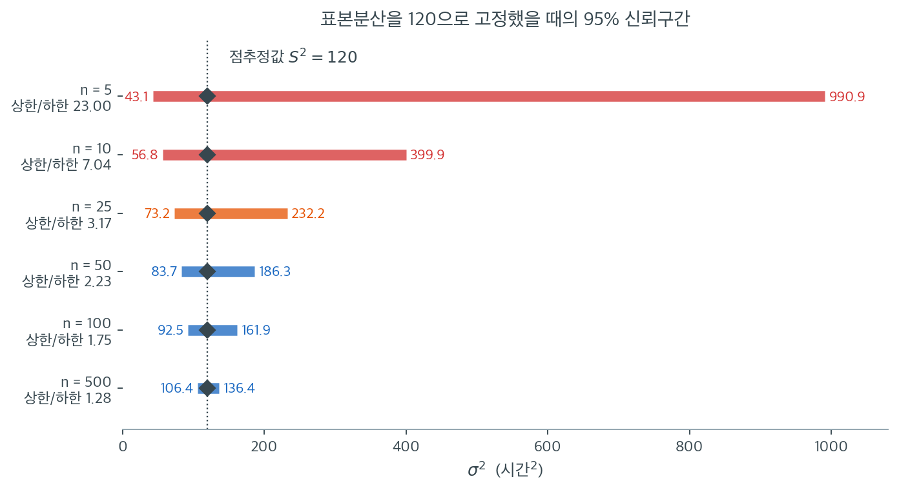

# 모분산의 신뢰구간

가설검정은 $\sigma^2$의 특정 값을 기각할지 알려주지만, 신뢰구간은 그럴듯한 값들의 범위를 제공한다. 모분산의 신뢰구간은 앞 절에서 유도한 추축량 $(n-1)S^2/\sigma^2 \sim \chi^2_{n-1}$에서 곧바로 나온다. 카이제곱분포가 오른쪽으로 치우쳐 있으므로 그 결과인 구간은 $S^2$을 중심으로 비대칭이다.

## 추축량으로부터의 유도

분포이론적 결과

$$
\frac{(n-1)S^2}{\sigma^2} \sim \chi^2_{n-1}
$$

에서 출발하면 임의의 $0 < \alpha < 1$에 대해 다음 확률 진술을 쓸 수 있다.

$$
P\!\left(\chi^2_{\alpha/2,\, n-1} \le \frac{(n-1)S^2}{\sigma^2} \le \chi^2_{1-\alpha/2,\, n-1}\right) = 1 - \alpha
$$

여기서 $\chi^2_{\alpha/2,\, n-1}$은 자유도 $n-1$인 카이제곱분포의 하단 $\alpha/2$ 분위수, $\chi^2_{1-\alpha/2,\, n-1}$은 상단 분위수를 나타낸다.

세 부분으로 $(n-1)S^2$을 나누고 부등호 방향을 뒤집어 부등식을 뒤집으면

$$
P\!\left(\frac{(n-1)S^2}{\chi^2_{1-\alpha/2,\, n-1}} \le \sigma^2 \le \frac{(n-1)S^2}{\chi^2_{\alpha/2,\, n-1}}\right) = 1 - \alpha
$$

## 신뢰구간 공식

모분산 $\sigma^2$의 $100(1-\alpha)\%$ 신뢰구간은

$$
\left(\frac{(n-1)S^2}{\chi^2_{1-\alpha/2,\, n-1}},\; \frac{(n-1)S^2}{\chi^2_{\alpha/2,\, n-1}}\right)
$$

모표준편차 $\sigma$의 신뢰구간은 양 끝에 제곱근을 취하여 얻는다.

$$
\left(\sqrt{\frac{(n-1)S^2}{\chi^2_{1-\alpha/2,\, n-1}}},\; \sqrt{\frac{(n-1)S^2}{\chi^2_{\alpha/2,\, n-1}}}\right)
$$

!!! note "구간의 비대칭성"
    $\bar{X}$를 중심으로 대칭인 평균의 신뢰구간과 달리 분산의 신뢰구간은 $S^2$을 중심으로 비대칭이다. 상한이 하한보다 $S^2$에서 더 멀리 뻗는다. 이 비대칭성은 카이제곱분포가 오른쪽으로 치우친 모양임을 반영한다.

## 단측 신뢰한계

응용에 따라서는 $\sigma^2$의 상한이나 하한만 필요할 수 있다.

**상단 신뢰한계** (수준 $1 - \alpha$):

$$
\sigma^2 \le \frac{(n-1)S^2}{\chi^2_{\alpha,\, n-1}}
$$

**하단 신뢰한계** (수준 $1 - \alpha$):

$$
\sigma^2 \ge \frac{(n-1)S^2}{\chi^2_{1-\alpha,\, n-1}}
$$

상한은 분산이 지나치게 클까 우려될 때(품질관리 등) 유용하고, 하한은 분산이 지나치게 작을까 우려될 때(표집계획에 충분한 변동성이 필요한 경우 등) 쓴다.

<div class="exbox" markdown>

**보기 1.** <span class="diff easy" title="쉬움"></span> 전구 수명의 모분산 신뢰구간. 어떤 생산라인에서 전구 $n = 25$개를 확률표본으로 뽑았더니 표본분산이 $S^2 = 120$(시간$^2$)이었다. 수명이 정규분포를 따른다고 가정하고 모분산 $\sigma^2$의 95% 신뢰구간을 구성하라.

</div>

??? success "풀이"
    **1단계.** 관련 값들을 확인한다.

    - $n = 25$이므로 $n - 1 = 24$
    - $S^2 = 120$
    - $\alpha = 0.05$

    **2단계.** 자유도 $\nu = 24$의 카이제곱 임계값을 찾는다.

    - $\chi^2_{0.025,\, 24} = 12.401$
    - $\chi^2_{0.975,\, 24} = 39.364$

    **3단계.** 신뢰구간을 계산한다.

    $$
    \left(\frac{24 \times 120}{39.364},\; \frac{24 \times 120}{12.401}\right) = (73.16,\; 232.24)
    $$

    모분산이 73.16과 232.24 시간$^2$ 사이에 있다고 95% 신뢰수준에서 말할 수 있다.

    **4단계.** 표준편차에 대해서는

    $$
    \left(\sqrt{73.16},\; \sqrt{232.24}\right) = (8.55,\; 15.24)
    $$

    $\sigma$의 95% 신뢰구간은 근사적으로 $(8.55, 15.24)$ 시간이다.

## 신뢰구간의 폭

$\sigma^2$ 신뢰구간의 폭은 두 요인에 의존한다.

1. **표본크기.** $n$이 클수록 자유도가 커져 카이제곱 분위수 사이의 간격이 좁아지고 구간이 촘촘해진다.
2. **신뢰수준.** 신뢰수준이 높을수록($\alpha$가 작을수록) 분위수가 꼬리 쪽으로 더 나아가므로 구간이 넓어진다.

작은 표본에서는 구간이 매우 넓어져 $\sigma^2$에 대한 상당한 불확실성을 드러낸다. 상한과 하한의 비가 유용한 척도이다.

$$
\text{폭 비율} = \frac{\chi^2_{1-\alpha/2,\, n-1}}{\chi^2_{\alpha/2,\, n-1}}
$$

$n \to \infty$이면 이 비가 1로 가고 구간이 점추정값 $S^2$으로 수축한다.

표본분산을 $S^2 = 120$으로 **고정한 채** 표본크기만 바꿔 가며 95% 신뢰구간을 그리면 이 두 요인이 한눈에 들어온다.



먼저 **비대칭**이다. 검은 마름모가 점추정값 120인데 어느 구간에서도 가운데에 있지 않다. $n = 25$의 구간은 $(73.2,\ 232.2)$로, 아래로는 47만큼 내려가고 위로는 112만큼 올라간다. 위쪽이 두 배 넘게 길다. 이유는 공식에 있다. 하한은 $S^2$을 **큰** 분위수로 나누고 상한은 **작은** 분위수로 나누는데, 카이제곱분포의 오른쪽 꼬리가 길어 작은 분위수 쪽이 0에 더 가깝기 때문이다. 나눗셈에서 분모가 작아지면 결과는 급격히 커진다.

다음은 **폭**이다. $n = 5$에서 구간은 $(43.1,\ 990.9)$이고 상한/하한 비가 $23.00$이다. 참 분산이 43일 수도 991일 수도 있다는 뜻이니, 사실상 아무것도 모른다는 말과 같다. $n = 25$에서 비가 $3.17$, $n = 100$에서 $1.75$, $n = 500$에서야 $1.28$까지 내려온다. **분산을 평균만큼 정밀하게 알려면 표본이 한 자릿수 더 필요하다.**

이 그림이 주는 실무 교훈은 단순하다. 작은 표본에서 "표본분산이 120이므로 분산은 120쯤이다"라고 말하는 것은 위험하다. $n = 10$이면 그 말의 정직한 판본은 "분산은 57과 400 사이 어딘가다"이다. 분산 추정값을 보고할 때 신뢰구간을 함께 적어야 하는 이유이고, 표준편차로 바꿔 보고하면 제곱근이 폭을 눌러 주어 덜 험악해 보인다는 점도 기억할 만하다. $n = 25$의 $\sigma$ 구간 $(8.55,\ 15.24)$는 같은 정보를 담고 있지만 비가 $\sqrt{3.17} = 1.78$로 줄어든다.

## 가설검정과의 쌍대성

$\sigma^2$의 신뢰구간과 카이제곱 검정은 쌍대 절차이다. 값 $\sigma_0^2$이 $100(1-\alpha)\%$ 신뢰구간 밖에 있을 필요충분조건은 카이제곱 검정이 유의수준 $\alpha$에서 $H_0\colon \sigma^2 = \sigma_0^2$을 기각하는 것이다.

<div class="exbox" markdown>

**보기 2.** <span class="diff easy" title="쉬움"></span> 분산과 표준편차의 신뢰구간. 보기 1 과 같은 자료($n = 25$, $S^2 = 120$)로 $95\%$ 구간을 코드로 만든다.

**(1)** 구간의 **양 끝이 $S^2$ 의 상수배**임을 보이고, 그 두 배수와 상한/하한 비를 자유도만의 식으로 적으시오. 표준편차 구간의 비는 얼마인가.

**(2)** $S^2$ 을 네 자릿수에 걸쳐 바꾸어 (1)을 확인하시오. 이 구간은 $S^2$ 을 **어떤 뜻에서도 중심에 두지 않는다**는 것을 산술·기하 두 가지로 재어 보이시오.

</div>

??? success "풀이"

    **(1) 양 끝이 $S^2$ 의 상수배다.** 공식을 그대로 옮겨 적으면

    $$
    \text{하한} = \frac{(n-1)S^2}{\chi^2_{1-\alpha/2,\,n-1}} = k_{\text{lo}} \, S^2,
    \qquad
    \text{상한} = \frac{(n-1)S^2}{\chi^2_{\alpha/2,\,n-1}} = k_{\text{hi}} \, S^2
    $$

    이고 두 배수는

    $$
    k_{\text{lo}} = \frac{n-1}{\chi^2_{1-\alpha/2,\,n-1}},
    \qquad
    k_{\text{hi}} = \frac{n-1}{\chi^2_{\alpha/2,\,n-1}}
    $$

    로 **$n$ 과 $\alpha$ 만으로 정해진다.** 자료는 $S^2$ 이라는 배율 하나로만 들어온다. 그러므로 상한/하한 비에서는 $S^2$ 이 **약분되어 사라진다.**

    $$
    \frac{\text{상한}}{\text{하한}}
    = \frac{k_{\text{hi}} S^2}{k_{\text{lo}} S^2}
    = \frac{k_{\text{hi}}}{k_{\text{lo}}}
    = \frac{\chi^2_{1-\alpha/2,\,n-1}}{\chi^2_{\alpha/2,\,n-1}}
    $$

    이것이 쪽 머리의 **폭 비율**이고, 8장이 같은 사실을 다루었다. **자료를 보기도 전에 구간이 몇 배로 벌어질지 알 수 있다**는 뜻이다. 자료가 할 수 있는 일은 그 구간을 척도축 위에서 통째로 옮기는 것뿐이다.

    표준편차 구간은 양 끝의 제곱근이므로 비도 제곱근이 된다.

    $$
    \frac{\sqrt{\text{상한}}}{\sqrt{\text{하한}}} = \sqrt{\frac{\chi^2_{1-\alpha/2,\,n-1}}{\chi^2_{\alpha/2,\,n-1}}}
    $$

    $n = 25$, $\alpha = 0.05$ 에 넣으면 $\chi^2_{0.025,\,24} = 12.4012$, $\chi^2_{0.975,\,24} = 39.3641$ 이므로

    $$
    k_{\text{lo}} = \frac{24}{39.3641} = 0.60969,
    \qquad
    k_{\text{hi}} = \frac{24}{12.4012} = 1.93530
    $$

    이고 분산 구간의 비가 $1.93530/0.60969 = 3.17423$, 표준편차 구간의 비가 $\sqrt{3.17423} = 1.78164$ 다.

    **(2) 수치적으로.**

    ```python
    import numpy as np
    from scipy import stats

    n = 25
    s_squared = 120
    alpha = 0.05
    df = n - 1

    # 카이제곱은 좌우가 대칭이 아니므로 두 기각값을 따로 구한다.
    chi2_lower = stats.chi2.ppf(alpha / 2, df)
    chi2_upper = stats.chi2.ppf(1 - alpha / 2, df)

    # 위아래가 뒤집혀 들어간다. (n-1)S^2/sigma^2 이 카이제곱을 따르므로
    # sigma^2 로 풀면 분모에 기각값이 오고, 큰 기각값이 구간의 아래끝을 만든다.
    # 부호를 헷갈리기 쉬운 대목이다.
    ci_lower = df * s_squared / chi2_upper
    ci_upper = df * s_squared / chi2_lower

    # 표준편차의 구간은 분산 구간에 제곱근을 씌우면 된다. 제곱근이 단조함수라
    # 순서가 그대로 보존되기 때문이다.
    ci_sd_lower = np.sqrt(ci_lower)
    ci_sd_upper = np.sqrt(ci_upper)

    print(f"95% CI for variance: ({ci_lower:.2f}, {ci_upper:.2f})")
    print(f"95% CI for std dev:  ({ci_sd_lower:.2f}, {ci_sd_upper:.2f})")

    # (1) 양 끝이 S^2 의 상수배다. 그 상수는 자유도와 alpha 만으로 정해진다.
    k_lo = df / chi2_upper
    k_hi = df / chi2_lower
    print(f"\n하한 배수 (n-1)/chi2_0.975 = {k_lo:.5f}")
    print(f"상한 배수 (n-1)/chi2_0.025 = {k_hi:.5f}")
    print(f"분산 구간의 상한/하한 비 = {k_hi / k_lo:.5f}  (= chi2_0.975/chi2_0.025 = {chi2_upper / chi2_lower:.5f})")
    print(f"표준편차 구간의 비        = {np.sqrt(k_hi / k_lo):.5f}")

    # S^2 을 바꾸어도 비가 그대로인가.
    print(f"\n{'S^2':>10}{'하한':>12}{'상한':>12}{'비':>10}{'sd 비':>9}")
    for s2 in (0.05, 7.0, 120.0, 9_999.0):
        lo, hi = df * s2 / chi2_upper, df * s2 / chi2_lower
        print(f"{s2:>10.2f}{lo:>12.5f}{hi:>12.5f}{hi / lo:>10.5f}{np.sqrt(hi / lo):>9.5f}")

    # (2) 구간은 S^2 을 산술적으로도 기하적으로도 중심에 두지 않는다.
    print(f"\n점추정값 S^2 = {s_squared}")
    print(f"  아래로 {s_squared - ci_lower:.2f},  위로 {ci_upper - s_squared:.2f}  (위쪽이 {(ci_upper - s_squared) / (s_squared - ci_lower):.3f} 배)")
    print(f"  산술 중점 = {(ci_lower + ci_upper) / 2:.2f}")
    print(f"  기하 중점 = {np.sqrt(ci_lower * ci_upper):.2f}   (배수 {np.sqrt(k_lo * k_hi):.5f})")
    print(f"  두 분위수의 기하평균 = {np.sqrt(chi2_lower * chi2_upper):.4f}  vs  n-1 = {df}")
    ```

    출력:

    ```text
    95% CI for variance: (73.16, 232.24)
    95% CI for std dev:  (8.55, 15.24)

    하한 배수 (n-1)/chi2_0.975 = 0.60969
    상한 배수 (n-1)/chi2_0.025 = 1.93530
    분산 구간의 상한/하한 비 = 3.17423  (= chi2_0.975/chi2_0.025 = 3.17423)
    표준편차 구간의 비        = 1.78164

           S^2          하한          상한         비     sd 비
          0.05     0.03048     0.09677   3.17423  1.78164
          7.00     4.26785    13.54713   3.17423  1.78164
        120.00    73.16315   232.23652   3.17423  1.78164
       9999.00  6096.31974 19351.10823   3.17423  1.78164

    점추정값 S^2 = 120
      아래로 46.84,  위로 112.24  (위쪽이 2.396 배)
      산술 중점 = 152.70
      기하 중점 = 130.35   (배수 1.08625)
      두 분위수의 기하평균 = 22.0943  vs  n-1 = 24
    ```

    **비가 자료와 무관하다는 것이 표에 그대로 보인다.** $S^2$ 을 $0.05$ 에서 $9999$ 로 **$20$ 만 배** 키웠는데 비는 $3.17423$, 표준편차 비는 $1.78164$ 로 소수 다섯째 자리까지 꿈쩍하지 않는다. 구간의 양 끝도 $S^2$ 에 정확히 비례해 움직인다. $120 \times 0.60969 = 73.163$, $120 \times 1.93530 = 232.237$ 로 (1)의 배수와 맞는다.

    $S^2 = 0.05$ 줄이 $(0.03048,\, 0.09677)$ 인 것도 눈여겨볼 만하다. 15.2절에서 $n = 25$, $s^2 = 0.05$ 로 구한 구간과 같은 수다. **같은 $n$ 과 같은 신뢰수준이면 구간의 모양이 하나로 정해져 있고, 자료는 그것을 어디에 놓을지만 정한다.**

    **구간은 $S^2$ 을 어떤 뜻에서도 중심에 두지 않는다.** 산술적으로는 아래로 $46.84$, 위로 $112.24$ 로 위쪽이 $2.396$ 배 길고, 구간의 산술 중점 $152.70$ 은 $S^2 = 120$ 에서 한참 위다. 비대칭이 심한 양은 보통 로그 척도에서 대칭이 되는데 **여기서는 그마저도 아니다.** 기하 중점이 $\sqrt{73.16 \times 232.24} = 130.35$ 로 역시 $120$ 보다 크다. 배수로 쓰면 $\sqrt{k_{\text{lo}} k_{\text{hi}}} = 1.08625 \ne 1$ 이다.

    까닭은 마지막 줄에 있다. 기하 중점의 배수는

    $$
    \sqrt{k_{\text{lo}} k_{\text{hi}}} = \frac{n-1}{\sqrt{\chi^2_{\alpha/2,\,n-1}\,\chi^2_{1-\alpha/2,\,n-1}}}
    $$

    이고, 두 분위수의 기하평균이 $\sqrt{12.4012 \times 39.3641} = 22.0943$ 으로 **$n - 1 = 24$ 에 못 미친다.** 등꼬리 분위수 쌍이 $n-1$ 을 기하적으로 둘러싸지 않기 때문이다. 자유도가 같은 $F$ 분포에서는 두 분위수가 서로 역수라 기하평균이 정확히 $1$ 이 되는데(15.3절), $\chi^2$ 에는 그런 대칭이 없다.

    **그러므로 "$\pm$" 로 요약하지 말라.** 분산의 구간은 점추정값에 **곱해지는 두 배수**로 적는 것이 정직하다. $n = 25$, $95\%$ 라면 $S^2 \times [0.610,\ 1.935]$ 다. 이 괄호를 좁히는 방법은 하나뿐이고, 그것은 $n$ 을 키우는 것이다. $S^2$ 이 무엇으로 나오든 괄호는 그대로다.

## 연습문제

<div class="drillbox" markdown>

**연습문제 1.** <span class="diff easy" title="쉬움"></span>
$n \in \{10, 25, 50, 100, 500, 1000\}$에 대해 95% 신뢰구간의 폭 비율을 계산하라. 분산을 상대오차 10% 이내로 추정하려면 표본이 얼마나 커야 하는가?

</div>

??? success "풀이"

    ```python
    from scipy import stats

    print(f"{'n':>6} {'var ratio':>10} {'sd ratio':>10}")
    for n in [10, 25, 50, 100, 500, 1000]:
        df = n - 1
        r = stats.chi2.ppf(0.975, df) / stats.chi2.ppf(0.025, df)
        print(f"{n:>6} {r:>10.3f} {r**0.5:>10.3f}")
    ```

    출력:

    ```text
         n  var ratio   sd ratio
        10      7.044      2.654
        25      3.174      1.782
        50      2.225      1.492
       100      1.751      1.323
       500      1.282      1.132
      1000      1.192      1.092
    ```

    수치가 인상적이다. $n = 10$에서 상한이 하한의 **7배**이다. 분산에 대해 사실상 아무것도 모른다는 뜻이다. $n = 100$에서도 1.75배이다.

    비교하자면 평균의 신뢰구간 폭은 $2 \times 1.96 \times \sigma/\sqrt{n}$으로 $n = 100$이면 $\pm 0.196\sigma$에 불과하다. **분산은 평균보다 추정하기가 훨씬 어렵다.**

    **10% 상대오차를 얻으려면.** 표준편차 비율이 대략 $1.1$이 되기를 원한다면 표에서 $n \approx 800$ 정도가 필요하다. 근사적으로 $\operatorname{Var}(S) \approx \sigma^2/(2n)$이므로 $S$의 변동계수는 $1/\sqrt{2n}$이고, 95% 구간의 반폭이 $1.96/\sqrt{2n} < 0.05$이려면

    $$
    n > \frac{1.96^2}{2 \times 0.05^2} = 768.
    $$

    분산 자체를 10% 이내로 추정하려면 그 네 배인 $n \approx 3000$이 필요하다. 분산의 상대오차가 표준편차 상대오차의 두 배이기 때문이다. $\square$

<div class="drillbox" markdown>

**연습문제 2.** <span class="diff med" title="중간"></span>
카이제곱 신뢰구간의 실제 포함확률이 비정규 자료에서 어떻게 되는지 모의실험으로 조사하라. $n = 25$, 명목 95%로 정규, $t_5$, 균등, 지수분포를 비교하라.

</div>

??? success "풀이"

    ```python
    import numpy as np
    from scipy import stats

    rng = np.random.default_rng(0)
    n, df, R = 25, 24, 20000
    lo_q = stats.chi2.ppf(0.025, df)
    hi_q = stats.chi2.ppf(0.975, df)

    cases = [
        ("Normal",      lambda: rng.normal(0, 1, n),      1.0),
        ("t(5)",        lambda: rng.standard_t(5, n),     5 / 3),
        ("Uniform",     lambda: rng.uniform(0, 1, n),     1 / 12),
        ("Exponential", lambda: rng.exponential(1, n),    1.0),
    ]

    for name, gen, true_var in cases:
        hits = 0
        for _ in range(R):
            s2 = gen().var(ddof=1)
            lo, hi = df * s2 / hi_q, df * s2 / lo_q
            hits += (lo <= true_var <= hi)
        print(f"{name:>12}: coverage = {hits / R:.4f}")
    ```

    출력:

    ```text
          Normal: coverage = 0.9504
            t(5): coverage = 0.8292
         Uniform: coverage = 0.9961
     Exponential: coverage = 0.7218
    ```

    | 분포 | $\gamma_2$ | 실제 포함확률 |
    |---|---|---|
    | $\text{Uniform}$ | $-1.2$ | 0.996 |
    | $\mathcal{N}(0,1)$ | 0 | **0.950** |
    | $t_5$ | 6 | 0.829 |
    | $\text{Exponential}$ | 6 | 0.722 |

    정규 자료에서만 명목값 95%가 달성된다.

    **지수분포에서는 포함확률이 72%에 불과하다.** 곧 "95% 신뢰구간"이라고 부르는 구간이 실제로는 네 번에 한 번 이상 참값을 놓친다. $t_5$에서도 83%로 크게 부족하다.

    반대로 저첨인 균등분포에서는 99.6%로 지나치게 보수적이다. 15.1절 연습문제 1의 팽창 인자 $(\gamma_2+2)/2$가 1보다 작기 때문이다.

    **실무적 결론.** 카이제곱 분산 신뢰구간은 정규성이 확립된 경우에만 써야 한다. 그렇지 않으면 붓스트랩 구간(15.6절)을 쓰라. 특히 금융 수익률이나 대기시간처럼 꼬리가 두꺼운 자료에서 이 구간을 쓰는 것은 심각한 오류이다. $\square$

<div class="drillbox" markdown>

**연습문제 3.** <span class="diff easy" title="쉬움"></span>
어떤 제조업체가 부품 치수의 표준편차가 0.5 mm를 넘지 않아야 한다는 규격을 만족함을 보이려 한다. $n = 30$개 표본에서 $s = 0.42$ mm를 얻었다. 95% 상단 신뢰한계를 계산하고 규격 준수를 주장할 수 있는지 판단하라.

</div>

??? success "풀이"

    95% 상단 신뢰한계는

    $$
    \sigma^2 \le \frac{(n-1)s^2}{\chi^2_{0.05,\, n-1}} = \frac{29 \times 0.42^2}{\chi^2_{0.05,\,29}}.
    $$

    $\chi^2_{0.05,29} = 17.708$(하단 5% 분위수)이므로

    $$
    \sigma^2 \le \frac{29 \times 0.1764}{17.708} = \frac{5.1156}{17.708} = 0.2889,
    $$

    $$
    \sigma \le \sqrt{0.2889} = 0.5375 \text{ mm}.
    $$

    ```python
    from scipy import stats
    import numpy as np

    n, s = 30, 0.42
    ub_var = (n - 1) * s**2 / stats.chi2.ppf(0.05, n - 1)
    print(f"95% upper bound: sigma^2 <= {ub_var:.4f}, sigma <= {np.sqrt(ub_var):.4f}")
    ```

    출력:

    ```text
    95% upper bound: sigma^2 <= 0.2889, sigma <= 0.5375
    ```

    **결론: 규격 준수를 주장할 수 없다.** 점추정값 $s = 0.42$가 규격 0.5보다 작지만, 95% 상단 신뢰한계 $0.5375$가 규격을 넘는다. 참 표준편차가 0.5 mm를 초과할 가능성을 배제할 수 없다.

    필요한 표본크기를 역산해 보자. $s = 0.42$가 유지된다고 가정하면 상단 한계가 0.5 아래가 되려면

    $$
    \frac{(n-1)(0.42)^2}{\chi^2_{0.05,\,n-1}} < 0.25 \implies \frac{n-1}{\chi^2_{0.05,\,n-1}} < 1.4172.
    $$

    시행착오로 확인하면 $n = 52$에서 $51/35.600 = 1.4326$으로 아직 크고, $n = 55$에서 $54/38.116 = 1.4167 < 1.4172$가 되어 조건을 만족한다. 곧 **표본을 30개에서 55개로 늘려야** 같은 $s$ 값으로 규격 준수를 주장할 수 있다.

    이는 실무에서 중요한 교훈이다. 점추정값이 규격을 만족한다고 규격 준수가 입증되는 것이 아니다. $\square$

<div class="drillbox" markdown>

**연습문제 4.** <span class="diff med" title="중간"></span>
신뢰구간과 가설검정의 쌍대성을 15.2절 보기로 확인하라. $n = 25$, $s^2 = 0.05$일 때 95% 신뢰구간을 구하고, 이 구간에 포함되지 않는 $\sigma_0^2$ 값에 대해서만 양측 카이제곱 검정이 $\alpha = 0.05$에서 기각함을 보여라.

</div>

??? success "풀이"

    15.2절에서 95% 신뢰구간은 $(0.0305, 0.0968)$이었다.

    쌍대성을 확인하기 위해 여러 $\sigma_0^2$ 값에 대해 검정을 수행한다.

    ```python
    from scipy import stats

    n, s2, df = 25, 0.05, 24
    lo = df * s2 / stats.chi2.ppf(0.975, df)
    hi = df * s2 / stats.chi2.ppf(0.025, df)
    print(f"95% CI: ({lo:.5f}, {hi:.5f})\n")

    for sigma0_sq in [0.025, 0.0305, 0.04, 0.07, 0.0968, 0.12]:
        c = df * s2 / sigma0_sq
        p = 2 * min(stats.chi2.cdf(c, df), stats.chi2.sf(c, df))
        inside = lo <= sigma0_sq <= hi
        print(f"sigma0^2 = {sigma0_sq:.4f}: chi2 = {c:7.3f}, "
              f"p = {p:.4f}, in CI = {inside}")
    ```

    출력:

    ```text
    95% CI: (0.03048, 0.09677)

    sigma0^2 = 0.0250: chi2 =  48.000, p = 0.0050, in CI = False
    sigma0^2 = 0.0305: chi2 =  39.344, p = 0.0502, in CI = True
    sigma0^2 = 0.0400: chi2 =  30.000, p = 0.3695, in CI = True
    sigma0^2 = 0.0700: chi2 =  17.143, p = 0.3150, in CI = True
    sigma0^2 = 0.0968: chi2 =  12.397, p = 0.0499, in CI = False
    sigma0^2 = 0.1200: chi2 =  10.000, p = 0.0109, in CI = False
    ```

    쌍대성이 정확히 성립한다. 구간 안의 값은 모두 $p > 0.05$, 밖의 값은 모두 $p < 0.05$이다.

    경계 근처의 두 값이 특히 교훈적이다. $\sigma_0^2 = 0.0305$는 하한 $0.03048$보다 아주 조금 크므로 구간 **안**이고 $p = 0.0502 > 0.05$이다. $\sigma_0^2 = 0.0968$은 상한 $0.09677$보다 아주 조금 크므로 구간 **밖**이고 $p = 0.0499 < 0.05$이다. 소수 다섯째 자리의 차이가 판정을 뒤집는다. 쌍대성이 근사가 아니라 정확한 대응관계임을 보여준다.

    **개념적 의미.** 신뢰구간은 **기각되지 않는 모든 귀무가설의 집합**이다. 이 관점은 일반적으로 성립하며, 신뢰구간 하나가 무한히 많은 가설검정을 요약한다는 것을 뜻한다. 그래서 $p$값 하나보다 신뢰구간을 보고하는 편이 정보량이 많다. $\square$

---

## 정리하며

같은 추축량에서 **신뢰구간**이 곧바로 나온다.

$$
\left[\frac{(n-1)S^2}{\chi^2_{\alpha/2,\,n-1}},\;\frac{(n-1)S^2}{\chi^2_{1-\alpha/2,\,n-1}}\right]
$$

- **분모의 임계값이 뒤바뀐다.** 부등식을 $\sigma^2$ 에 대해 풀면 큰 분위수가 하한으로 간다. 부호를 헷갈리기 쉬운 대목이다.
- **$S^2$ 을 중심으로 비대칭이다.** 카이제곱이 오른쪽으로 치우쳐 있어 구간이 위쪽으로 길게 늘어나며, $n$ 이 작을수록 심하다.
- **검정과 쌍대다.** $\sigma_0^2$ 이 구간 밖에 있는 것과 양측검정이 기각하는 것이 같다.
- **정규성 의존이 여기에도 그대로다.** 8장에서 재어 본 실제 포함률이 로그정규에서 $42\%$, 지수에서 $72\%$ 였다.
- **먼저 첨도를 확인하라.** $\hat\gamma_2$ 가 $1$ 을 넘으면 이 구간을 쓰지 않는 편이 안전하다.

다음 절 **카이제곱 분산 검정 (코드)** 로 넘어간다.
