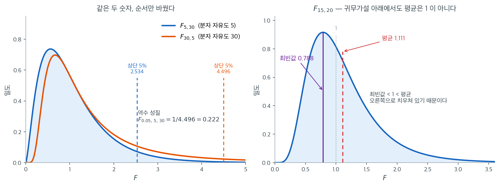

# F 분포와 자유도

F 분포는 독립인 두 정규 모집단의 분산을 비교할 때 자연스럽게 등장한다. 독립인 두 카이제곱 확률변수를 각자의 자유도로 나눈 것의 비로 구성된다. F 분포를 이해하는 것은 필수적이다. F 검정의 귀무분포를 제공할 뿐 아니라 분산분석과 회귀분석 전반에 등장하기 때문이다.

<div class="defn" markdown>

### 정의 1. F 분포 { .dfn }

$U \sim \chi^2_{d_1}$과 $V \sim \chi^2_{d_2}$가 자유도 $d_1$, $d_2$인 독립 카이제곱 확률변수라 하자. 확률변수

$$
F = \frac{U / d_1}{V / d_2}
$$

는 분자 자유도 $d_1$, 분모 자유도 $d_2$인 F 분포를 따르며 $F \sim F_{d_1, d_2}$로 쓴다.

자유도의 순서가 중요하다. $d_1 = d_2$가 아닌 한 $F_{d_1, d_2}$와 $F_{d_2, d_1}$은 서로 다른 분포이다.

</div>

## 표본분산과의 연결

정규 모집단에서 독립인 두 확률표본을 뽑았다고 하자.

$$
X_1, \ldots, X_{n_1} \sim N(\mu_1, \sigma_1^2), \qquad Y_1, \ldots, Y_{n_2} \sim N(\mu_2, \sigma_2^2)
$$

표본분산에 대한 카이제곱 결과에서

$$
\frac{(n_1 - 1)S_1^2}{\sigma_1^2} \sim \chi^2_{n_1 - 1}, \qquad \frac{(n_2 - 1)S_2^2}{\sigma_2^2} \sim \chi^2_{n_2 - 1}
$$

여기서 $S_1^2$과 $S_2^2$은 표본분산이다. 두 표본이 독립이므로 이 카이제곱 변수들도 독립이다. 비를 만들면

$$
F = \frac{S_1^2 / \sigma_1^2}{S_2^2 / \sigma_2^2} = \frac{S_1^2 \sigma_2^2}{S_2^2 \sigma_1^2} \sim F_{n_1-1,\, n_2-1}
$$

귀무가설 $H_0\colon \sigma_1^2 = \sigma_2^2$ 아래에서 이 비는 다음으로 간단해진다.

$$
F = \frac{S_1^2}{S_2^2} \sim F_{n_1-1,\, n_2-1}
$$

이것이 분산 동일성에 대한 F 검정의 검정통계량이다.

## F 분포의 성질

자유도 $d_1$, $d_2$인 F 분포는 다음 성질을 갖는다.

- **정의역:** $F > 0$ (양수의 비는 항상 양수)
- **평균:** $d_2 > 2$일 때 $E[F] = \dfrac{d_2}{d_2 - 2}$
- **분산:** $d_2 > 4$일 때 $\operatorname{Var}(F) = \dfrac{2d_2^2(d_1 + d_2 - 2)}{d_1(d_2-2)^2(d_2-4)}$
- **최빈값:** $d_1 > 2$일 때 $\dfrac{d_1 - 2}{d_1} \cdot \dfrac{d_2}{d_2 + 2}$
- **오른쪽 치우침:** 항상 양의 왜도를 가지며, 두 자유도가 모두 커지면 왜도가 줄어든다

!!! note "귀무가설 아래에서 평균이 1 근처"
    $d_2$가 어느 정도 크면 $E[F] \approx 1$이다. 직관적으로 타당하다. $H_0\colon \sigma_1^2 = \sigma_2^2$ 아래에서 비 $S_1^2/S_2^2$은 평균적으로 1에 가까워야 한다. $F$가 1보다 훨씬 크거나 작으면 분산이 같지 않다는 증거가 된다.

    다만 평균 $d_2/(d_2-2)$가 정확히 1은 **아니다**. $d_2 = 20$이면 $E[F] = 1.111$이다. 이 위쪽 치우침은 F 분포가 비대칭이기 때문이며, 최빈값은 반대로 1보다 작다($d_1 = 15$, $d_2 = 20$에서 $0.788$).

## 자유도의 역할

두 자유도 모수 $d_1$과 $d_2$가 F 분포의 모양을 결정한다.

- **분자 자유도** $d_1 = n_1 - 1$: 분자에 분산이 오는 집단의 표본크기를 반영한다. $d_1$이 커지면 분포가 더 집중된다.
- **분모 자유도** $d_2 = n_2 - 1$: 분모에 오는 집단의 표본크기를 반영한다. $d_2$가 커지면 분산이 줄고 평균이 1에 가까워진다.

$d_1$과 $d_2$가 모두 크면 F 분포가 1 근처를 중심으로 하는 정규분포에 접근한다.

## 역수 성질

$F \sim F_{d_1, d_2}$이면

$$
\frac{1}{F} \sim F_{d_2, d_1}
$$

이 성질은 하단 임계값을 계산하는 데 유용하다. (표에 늘 실려 있지는 않은) $F_{\alpha,\, d_1,\, d_2}$를 찾는 대신 다음을 쓸 수 있다.

$$
F_{\alpha,\, d_1,\, d_2} = \frac{1}{F_{1-\alpha,\, d_2,\, d_1}}
$$

자유도의 순서가 왜 중요한지, 그리고 귀무가설 아래에서도 왜 평균이 1이 아닌지를 한 그림에 모았다.



왼쪽은 같은 두 숫자 5와 30을 순서만 바꾼 두 분포다. $F_{5,30}$은 분자 자유도가 작아 분자의 표본분산이 불안정하므로 오른쪽으로 길게 늘어진다. $F_{30,5}$는 반대로 분모가 불안정해서 큰 값 쪽 꼬리가 더 두껍다. 실무에서 차이가 드러나는 지점은 임계값이다. **상단 5% 임계값이 $2.534$와 $4.496$으로 1.8배 차이 난다.** 어느 집단을 분자에 놓았는지 헷갈린 채 표에서 $2.534$를 읽으면, 실제로는 5% 검정이 아니라 훨씬 헐거운 검정을 하게 된다.

두 곡선이 같은 그림에 있으니 역수 성질도 눈으로 확인된다. $F_{5,30}$의 **하단** 5% 지점은 $1/4.496 = 0.222$이다. 주황 곡선의 상단 5% 임계값 하나만 알면 파랑 곡선의 하단 임계값이 따라 나온다. 상단 분위수만 실린 옛 표로 양측검정을 할 수 있었던 것이 이 덕분이다.

오른쪽은 $F_{15,20}$ 하나만 자세히 본 것이다. 세 개의 세로선이 최빈값 $0.788$, 기준점 $1$, 평균 $1.111$이다. **최빈값 < 1 < 평균**이라는 순서가 F 분포가 오른쪽으로 치우쳐 있다는 사실의 직접적인 표현이다. 가장 흔히 나오는 값은 1보다 작은데 평균은 1보다 크다. 오른쪽 꼬리에 드물지만 아주 큰 값들이 있어 평균을 끌어올리기 때문이다.

그래서 "$H_0$ 아래에서 $F$는 1 근처"라는 직관을 쓸 때는 **어느 의미의 근처인지** 따져야 한다. $E[F] = d_2/(d_2-2)$이고 $d_2$가 작으면 1에서 꽤 멀다. $d_2 = 20$에서 $1.111$, $d_2 = 6$이면 $1.5$나 된다. 판정은 언제나 평균이 아니라 임계값으로 해야 한다.

## 다른 분포와의 관계

F 분포는 여러 다른 분포와 연결된다.

- **베타분포:** $F \sim F_{d_1, d_2}$이면 $d_1 F / (d_1 F + d_2) \sim \text{Beta}(d_1/2, d_2/2)$이다.
- **$t$ 분포:** $T \sim t_\nu$이면 $T^2 \sim F_{1, \nu}$이다. $t$ 검정통계량의 제곱은 분자 자유도가 1인 F 통계량이다.
- **큰 표본 극한:** $d_2 \to \infty$이면 $d_1 F \to \chi^2_{d_1}$이다. F 분포를 카이제곱으로 되돌려 연결한다.

<div class="exbox" markdown>

**보기 1.** <span class="diff easy" title="쉬움"></span> 두 모분산의 F 검정. 정규 모집단에서 크기 $n_1 = 16$, $n_2 = 21$인 독립 표본을 뽑았다. 표본분산은 $S_1^2 = 45$, $S_2^2 = 28$이다. $H_0\colon \sigma_1^2 = \sigma_2^2$ 아래에서

</div>

??? success "풀이"
    $$
    F = \frac{45}{28} = 1.607
    $$

    이 통계량은 귀무가설 아래에서 $F_{15, 20}$을 따른다. $F_{15,20}$의 평균은 $20/18 \approx 1.111$이다. 관측값 1.607은 평균보다 크지만 임계값 $F_{0.975}(15, 20) = 2.573$($\alpha = 0.05$ 양측)과 비교해야 한다. $1.607 < 2.573$이므로 $H_0$을 기각하지 못한다($p = 0.318$).

<div class="exbox" markdown>

**보기 2.** <span class="diff easy" title="쉬움"></span> F 분포의 성질과 기각값. 보기 1 의 설정 $d_1 = 15$, $d_2 = 20$, $F_{\text{obs}} = 45/28$ 을 그대로 쓴다.

**(1)** $F(15,20)$ 의 평균과 분산을 닫힌 꼴로 구하고, **상단 분위수만 실린 표**로 하단 임계값 $F_{0.025}(15,20)$ 을 얻는 법을 보이시오.

**(2)** 코드로 확인하시오. 관측값 $1.607$ 이 평균 $1.111$ 보다 큰데도 기각하지 못하는 까닭을 **분산의 크기로** 설명하시오.

</div>

??? success "풀이"

    **(1) 평균과 분산.** 평균은 연습문제 1 에서 유도한다.

    $$
    E[F] = \frac{d_2}{d_2 - 2} = \frac{20}{18} = 1.1111 \qquad (d_2 > 2)
    $$

    분산은 $d_2 > 4$ 에서

    $$
    \operatorname{Var}(F) = \frac{2 d_2^2 (d_1 + d_2 - 2)}{d_1 (d_2-2)^2 (d_2-4)}
    = \frac{2 \cdot 400 \cdot 33}{15 \cdot 324 \cdot 16}
    = \frac{26400}{77760} = 0.339506
    $$

    이다. 표준편차로는 $\sqrt{0.339506} = 0.5827$ 이다. **평균은 $d_1$ 에 의존하지 않지만 분산은 의존한다** — 분자 자유도가 작을수록 분자가 불안정해 비가 더 흔들린다.

    **하단 임계값은 상단 분위수 하나로 얻는다.** 역수 성질 $1/F \sim F(d_2,d_1)$ 에서

    $$
    \alpha = P\bigl(F(d_1,d_2) \le F_\alpha(d_1,d_2)\bigr)
    = P\!\left(F(d_2,d_1) \ge \frac{1}{F_\alpha(d_1,d_2)}\right)
    $$

    이므로 $1/F_\alpha(d_1,d_2)$ 가 $F(d_2,d_1)$ 의 상단 $\alpha$ 점, 곧

    $$
    F_\alpha(d_1,d_2) = \frac{1}{F_{1-\alpha}(d_2,d_1)}
    $$

    이다. 여기서는 $F_{0.025}(15,20) = 1/F_{0.975}(20,15)$ 이고, **자유도의 순서가 뒤바뀐다**는 데 주의해야 한다. 옛 표에 상단 분위수만 실려 있어도 양측검정을 할 수 있었던 것이 이 덕분이다.

    **(2) 확인한다.**

    ```python
    from scipy import stats

    # 분자와 분모의 자유도
    d1, d2 = 15, 20

    # F 분포의 평균은 d2/(d2-2) 로 1 보다 조금 크다. 분산비의 분포이므로
    # 아래로는 0 에서 막히고 위로는 열려 있어 오른쪽으로 치우친 탓이다.
    print(f"Mean: {stats.f.mean(d1, d2):.4f}")
    print(f"Variance: {stats.f.var(d1, d2):.4f}")

    alpha = 0.05
    f_lower = stats.f.ppf(alpha / 2, d1, d2)
    f_upper = stats.f.ppf(1 - alpha / 2, d1, d2)
    print(f"Critical values: [{f_lower:.3f}, {f_upper:.3f}]")

    # 두 표본분산의 비. 큰 쪽을 분자에 두면 오른쪽 꼬리만 보면 되지만,
    # 여기서는 순서를 정해 놓고 양측으로 계산한다.
    f_stat = 45 / 28
    p_value = 2 * min(stats.f.cdf(f_stat, d1, d2), stats.f.sf(f_stat, d1, d2))
    print(f"F-statistic: {f_stat:.3f}")
    print(f"P-value: {p_value:.4f}")

    # (1) 의 닫힌 꼴과 맞춰 본다.
    mean_formula = d2 / (d2 - 2)
    var_formula = 2 * d2**2 * (d1 + d2 - 2) / (d1 * (d2 - 2) ** 2 * (d2 - 4))
    print(f"\n공식 평균 d2/(d2-2)                       = {mean_formula:.6f}")
    print(f"공식 분산 2 d2^2 (d1+d2-2) / (d1 (d2-2)^2 (d2-4)) = {var_formula:.6f}")

    # 하단 임계값을 상단 분위수만으로 얻는다: F_a(d1,d2) = 1 / F_{1-a}(d2,d1)
    upper_swapped = stats.f.ppf(1 - alpha / 2, d2, d1)      # 자유도를 뒤바꾼 상단 분위수
    print(f"\nF_0.975(20,15)      = {upper_swapped:.6f}")
    print(f"1 / F_0.975(20,15)  = {1 / upper_swapped:.6f}")
    print(f"F_0.025(15,20)      = {f_lower:.6f}")

    # 관측값이 평균에서 몇 표준편차 떨어져 있는가
    sd = var_formula**0.5
    print(f"\n표준편차 = {sd:.4f}")
    print(f"(F_obs - 평균)/표준편차 = {(f_stat - mean_formula) / sd:.4f}")
    ```

    출력:

    ```text
    Mean: 1.1111
    Variance: 0.3395
    Critical values: [0.363, 2.573]
    F-statistic: 1.607
    P-value: 0.3184

    공식 평균 d2/(d2-2)                       = 1.111111
    공식 분산 2 d2^2 (d1+d2-2) / (d1 (d2-2)^2 (d2-4)) = 0.339506

    F_0.975(20,15)      = 2.755902
    1 / F_0.975(20,15)  = 0.362858
    F_0.025(15,20)      = 0.362858

    표준편차 = 0.5827
    (F_obs - 평균)/표준편차 = 0.8513
    ```

    **세 가지가 모두 맞는다.** 공식 평균 $1.111111$ 과 분산 $0.339506$ 이 `scipy` 의 $1.1111$, $0.3395$ 와 같고, $1/F_{0.975}(20,15) = 0.362858$ 이 $F_{0.025}(15,20) = 0.362858$ 과 소수 여섯째 자리까지 같다.

    **기각하지 못하는 까닭은 분산이 크기 때문이다.** 표준편차가 $0.5827$ 인데 관측값은 평균에서 겨우 $0.85$ 표준편차 떨어져 있다. 정규분포라면 $0.85$ 표준편차는 흔하디흔한 자리다. 채택역 $[0.363,\ 2.573]$ 을 같은 눈금으로 재면 평균에서 아래로 $1.28$, 위로 $2.51$ 표준편차까지 뻗어 있으니 $0.85$ 는 한참 안쪽이다. $p = 0.3184$ 가 그 말이다.

    **"관측값이 평균보다 크다"는 것은 아무 증거도 아니다.** $F$ 분포의 평균 $1.111$ 자체가 1 보다 크고(오른쪽 치우침 때문이다), 그 주위의 산포는 그보다 훨씬 크다. **판정은 언제나 평균이 아니라 임계값으로** 해야 한다.


## 연습문제

<div class="drillbox" markdown>

**연습문제 1.** <span class="diff med" title="중간"></span>
$F \sim F_{d_1,d_2}$의 평균이 $d_2 > 2$일 때 $d_2/(d_2-2)$임을 유도하라. 왜 이 값이 $d_1$에 의존하지 않는지 설명하라.

</div>

??? success "풀이"
    $F = (U/d_1)/(V/d_2)$이고 $U \sim \chi^2_{d_1}$, $V \sim \chi^2_{d_2}$가 독립이다. 독립성에 의해

    $$
    E[F] = \frac{d_2}{d_1}\, E[U]\, E\!\left[\frac{1}{V}\right].
    $$

    $E[U] = d_1$이다. 역수의 기댓값은 역카이제곱분포의 성질에서

    $$
    E\!\left[\frac{1}{V}\right] = \frac{1}{d_2 - 2} \quad (d_2 > 2).
    $$

    이를 직접 계산해 보면, $V \sim \chi^2_{d_2}$의 밀도가 $f(v) = \frac{v^{d_2/2-1}e^{-v/2}}{2^{d_2/2}\Gamma(d_2/2)}$이므로

    $$
    E\!\left[\frac{1}{V}\right] = \int_0^\infty \frac{v^{d_2/2-2}e^{-v/2}}{2^{d_2/2}\Gamma(d_2/2)}\,dv = \frac{2^{d_2/2-1}\Gamma(d_2/2-1)}{2^{d_2/2}\Gamma(d_2/2)} = \frac{1}{2}\cdot\frac{1}{d_2/2-1} = \frac{1}{d_2-2}.
    $$

    적분이 수렴하려면 $d_2/2 - 2 > -1$, 곧 $d_2 > 2$가 필요하다. 따라서

    $$
    E[F] = \frac{d_2}{d_1} \cdot d_1 \cdot \frac{1}{d_2-2} = \frac{d_2}{d_2-2}.
    $$

    **왜 $d_1$에 의존하지 않는가.** $U/d_1$의 기댓값이 $d_1$과 무관하게 항상 1이기 때문이다. 곧 분자는 어떤 자유도에서든 평균 1인 확률변수이고, 평균이 1에서 벗어나는 것은 전적으로 **분모의 역수 기댓값**에서 온다. Jensen 부등식에 의해 $E[1/W] > 1/E[W] = 1$이며($W = V/d_2$, $E[W]=1$), 그 초과분이 $d_2/(d_2-2) - 1 = 2/(d_2-2)$이다.

    실무적 함의: $E[F]$가 1보다 큰 것은 분산 차이의 증거가 아니라 **비의 기댓값이 갖는 편향**이다. $d_2 = 5$이면 $E[F] = 1.67$이나 되므로 작은 표본에서 $F$ 값을 1과 비교할 때 이 점을 유념해야 한다. $\square$

<div class="drillbox" markdown>

**연습문제 2.** <span class="diff med" title="중간"></span>
$T \sim t_\nu$이면 $T^2 \sim F_{1,\nu}$임을 보이고, 이 관계가 이표본 $t$ 검정과 일원분산분석의 관계에 어떻게 나타나는지 설명하라.

</div>

??? success "풀이"
    **증명.** $t$ 분포의 정의에 의해

    $$
    T = \frac{Z}{\sqrt{V/\nu}}, \qquad Z \sim \mathcal{N}(0,1),\; V \sim \chi^2_\nu \text{ 독립}.
    $$

    제곱하면

    $$
    T^2 = \frac{Z^2}{V/\nu} = \frac{Z^2/1}{V/\nu}.
    $$

    $Z^2 \sim \chi^2_1$이고 $V \sim \chi^2_\nu$가 독립이므로, 이는 정확히 $F_{1,\nu}$의 정의이다.

    **수치 확인.** $t_{0.975,10} = 2.2281$이고 그 제곱은 $4.9646$이다. 한편 $F_{0.95}(1,10) = 4.9646$이다. 정확히 일치한다. $t$의 **양측** 확률이 $F$의 **단측** 확률에 대응한다는 점에 주목하라. $F$가 $T^2$이므로 $T$의 양쪽 꼬리가 $F$의 오른쪽 꼬리 하나로 접힌다.

    **이표본 $t$ 검정과 분산분석의 관계.** 두 집단($k=2$)에 대한 일원분산분석의 F 통계량은

    $$
    F = \frac{\text{집단간 평균제곱}}{\text{집단내 평균제곱}} \sim F_{1,\, n_1+n_2-2}
    $$

    이고, 합동분산 이표본 $t$ 검정의 통계량은 $T \sim t_{n_1+n_2-2}$이다. 두 통계량 사이에는 정확히 $F = T^2$이 성립한다.

    따라서 **두 집단에 대한 분산분석과 양측 이표본 $t$ 검정은 완전히 같은 검정**이다. $p$값도 동일하다. 분산분석이 $t$ 검정을 $k > 2$로 일반화한 것이라는 서술의 정확한 의미가 이것이다. $\square$

<div class="drillbox" markdown>

**연습문제 3.** <span class="diff med" title="중간"></span>
$d_2 \to \infty$일 때 $d_1 F \to \chi^2_{d_1}$임을 보이고, $d_1 = 5$에 대해 $d_2 \in \{10, 100, 10000\}$에서 이 근사의 정확도를 수치로 확인하라.

</div>

??? success "풀이"
    **증명.** $F = (U/d_1)/(V/d_2)$이므로

    $$
    d_1 F = \frac{U}{V/d_2}.
    $$

    $V \sim \chi^2_{d_2}$이므로 $E[V/d_2] = 1$이고 $\operatorname{Var}(V/d_2) = 2/d_2 \to 0$이다. 따라서 대수의 법칙에 의해 $V/d_2 \xrightarrow{p} 1$이다.

    Slutsky 정리에 의해

    $$
    d_1 F = \frac{U}{V/d_2} \xrightarrow{d} \frac{U}{1} = U \sim \chi^2_{d_1}.
    $$

    **수치 확인.**

    ```python
    from scipy import stats

    d1 = 5
    print(f"chi2_5 0.95 quantile: {stats.chi2.ppf(0.95, d1):.4f}\n")
    for d2 in [10, 100, 10000]:
        print(f"d2 = {d2:>5}: d1 * F_0.95 = {d1 * stats.f.ppf(0.95, d1, d2):.4f}")
    ```

    출력:

    ```text
    chi2_5 0.95 quantile: 11.0705

    d2 =    10: d1 * F_0.95 = 16.6292
    d2 =   100: d1 * F_0.95 = 11.5266
    d2 = 10000: d1 * F_0.95 = 11.0750
    ```

    | $d_2$ | $d_1 F_{0.95}$ | $\chi^2_{5,\,0.95}$ 대비 오차 |
    |---|---|---|
    | 10 | 16.629 | $+50\%$ |
    | 100 | 11.527 | $+4.1\%$ |
    | 10000 | 11.075 | $+0.04\%$ |

    수렴은 하지만 **느리다**. $d_2 = 10$에서 오차가 50%에 이른다. 분모 자유도가 작을 때 분모의 변동이 F 통계량의 꼬리를 크게 부풀리기 때문이다.

    **실무적 함의.** 회귀분석과 분산분석에서 F 검정 대신 카이제곱 근사(Wald 검정 등)를 쓰는 경우가 있는데, 이는 분모 자유도(잔차 자유도)가 충분히 클 때만 정당하다. 잔차 자유도가 수십 수준이면 F 분포를 그대로 쓰는 편이 훨씬 정확하다. $\square$

<div class="drillbox" markdown>

**연습문제 4.** <span class="diff med" title="중간"></span>
F 분포의 왜도가 자유도에 따라 어떻게 변하는지 조사하고, 이것이 왜 F 검정의 양측 임계값을 비대칭으로 만드는지 설명하라.

</div>

??? success "풀이"

    ```python
    from scipy import stats

    print(f"{'d1':>5} {'d2':>5} {'skewness':>10} {'lower':>8} {'upper':>8}")
    for d1, d2 in [(5, 10), (15, 20), (50, 50), (200, 200)]:
        sk = stats.f.stats(d1, d2, moments='s')
        lo = stats.f.ppf(0.025, d1, d2)
        up = stats.f.ppf(0.975, d1, d2)
        print(f"{d1:>5} {d2:>5} {sk:>10.4f} {lo:>8.4f} {up:>8.4f}")
    ```

    출력:

    ```text
       d1    d2   skewness    lower    upper
        5    10     3.8670   0.1511   4.2361
       15    20     1.7435   0.3629   2.5731
       50    50     0.9218   0.5708   1.7520
      200   200     0.4326   0.7573   1.3204
    ```

    | $d_1, d_2$ | 왜도 | 하단 | 상단 | $1$과의 거리 (하 / 상) |
    |---|---|---|---|---|
    | 5, 10 | 3.87 | 0.151 | 4.236 | 0.85 / 3.24 |
    | 15, 20 | 1.74 | 0.363 | 2.573 | 0.64 / 1.57 |
    | 50, 50 | 0.92 | 0.571 | 1.752 | 0.43 / 0.75 |
    | 200, 200 | 0.43 | 0.757 | 1.320 | 0.24 / 0.32 |

    **비대칭의 근원.** F 통계량은 두 양수의 **비**이다. 비는 위쪽으로는 무한대까지 갈 수 있지만 아래쪽으로는 0에서 막혀 있다. 따라서 분포가 필연적으로 오른쪽으로 치우친다.

    이 때문에 임계값이 1을 중심으로 대칭이 아니다. $d_1 = d_2 = 50$에서 하단 임계값은 1에서 $0.43$ 떨어져 있지만 상단은 $0.75$ 떨어져 있다. 상단이 거의 두 배 멀다.

    **로그 척도에서는 대칭에 가깝다.** $\ln F$를 생각하면 역수 성질 $1/F \sim F_{d_2,d_1}$에 의해 $d_1 = d_2$일 때 $\ln F$의 분포가 0을 중심으로 **정확히 대칭**이다. 실제로 $d_1=d_2=50$에서 $\ln(0.5708) = -0.5607$이고 $\ln(1.7520) = +0.5607$로 크기가 정확히 같다.

    이것이 분산비를 논할 때 로그 척도가 자연스러운 이유이며, Bartlett 검정이 $\ln S_i^2$의 형태를 취하는 것과 같은 배경이다. $\square$

---

## 정리하며

$F$ 분포는 **독립인 두 카이제곱의 비**다.

$$
F=\frac{U/d_1}{V/d_2},\qquad U\sim\chi^2_{d_1},\;V\sim\chi^2_{d_2}
$$

- **오른쪽으로 치우쳐 있고 지지집합이 $[0,\infty)$ 다.** 두 자유도가 커질수록 $1$ 주위로 모인다.
- **평균이 $1$ 이 아니라 $d_2/(d_2-2)$ 다.** $d_2>2$ 에서만 존재하며, **분모 자유도가 작으면 귀무가설 아래에서도 $F$ 가 1 보다 눈에 띄게 크게 나온다.**
- **뒤집기 성질.** $F_{1-\alpha,d_1,d_2}=1/F_{\alpha,d_2,d_1}$ 이므로 표 한쪽만 있으면 된다.
- **$t^2=F(1,\nu)$ 다.** 자유도 1 짜리 $F$ 검정과 양측 $t$ 검정이 같은 결론을 준다.
- **여러 곳에 등장한다.** 분산비 검정, 분산분석, 회귀의 전체 $F$ 검정, 내포모형 비교가 모두 이 분포를 쓴다.

다음 절 **민감도**로 넘어간다.
