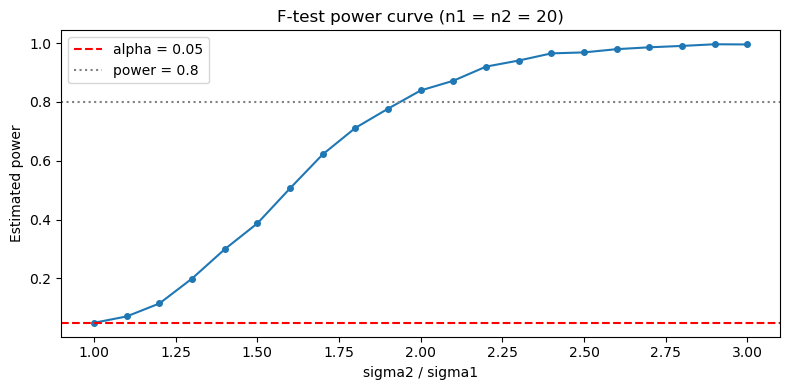

# F 검정 검정력 모의실험

## 개요

가설검정의 검정력은 귀무가설이 거짓일 때 그것을 올바르게 기각할 확률이다. 분산 동일성에 대한 F 검정에서 검정력은 참 분산비, 표본크기, 유의수준에 의존한다. F 검정의 닫힌 형태 검정력 표현이 복잡하므로, 몬테카를로 모의실험이 특정 모수 조합에서 검정력을 추정하는 실용적이고 투명한 방법을 제공한다.

## F 검정의 검정력

다음 양측 F 검정을 생각하자.

$$
H_0: \sigma_1^2 = \sigma_2^2 \quad \text{대} \quad H_1: \sigma_1^2 \neq \sigma_2^2.
$$

검정력은

$$
\beta(\sigma_1, \sigma_2) = P\!\left(H_0 \text{ 기각} \mid \sigma_1^2 \neq \sigma_2^2\right).
$$

검정력은 다음 경우에 커진다.

- 참 분산비 $\sigma_1^2/\sigma_2^2$이 1에서 더 멀 때.
- 표본크기 $n_1$과 $n_2$가 커질 때.
- 유의수준 $\alpha$가 커질 때.

## 몬테카를로 추정

검정력의 몬테카를로 추정은 다음과 같이 진행된다.

1. 참 모수 $\sigma_1, \sigma_2, n_1, n_2$와 유의수준 $\alpha$를 고정한다.
2. $B$번의 반복 각각에서 $X_1 \sim N(\mu_1, \sigma_1^2)$과 $X_2 \sim N(\mu_2, \sigma_2^2)$을 생성한다.
3. F 통계량과 양측 $p$값을 계산한다.
4. $p < \alpha$인지 기록한다.
5. 추정 검정력은 기각 비율 $\hat{\beta} = (\text{기각 횟수}) / B$이다.

$\hat{\beta}$의 표준오차는 $\sqrt{\hat{\beta}(1-\hat{\beta})/B}$이다.

## 코드

```python
import numpy as np
from scipy.stats import f

rng = np.random.default_rng(0)


def f_test_two_sided(x1, x2, alpha=0.05):
    """Return True if the two-sided F-test rejects H0."""
    n1, n2 = x1.size, x2.size
    df1, df2 = n1 - 1, n2 - 1
    F_obs = x1.var(ddof=1) / x2.var(ddof=1)
    p_left = f.cdf(F_obs, df1, df2)
    p_right = f.sf(F_obs, df1, df2)
    p_two = 2 * min(p_left, p_right)
    return p_two < alpha


def estimate_power(n1=12, n2=12, sigma1=1.0, sigma2=1.5,
                   n_sims=2000, alpha=0.05):
    """Estimate power of the two-sided F-test via simulation."""
    hits = 0
    for _ in range(n_sims):
        x1 = rng.normal(0, sigma1, size=n1)
        x2 = rng.normal(0, sigma2, size=n2)
        if f_test_two_sided(x1, x2, alpha=alpha):
            hits += 1
    return hits / n_sims


# Example: sigma1/sigma2 = 1/2, n1 = n2 = 10
power = estimate_power(n1=10, n2=10, sigma1=1.0, sigma2=2.0,
                       n_sims=5000, alpha=0.05)
se = np.sqrt(power * (1 - power) / 5000)
print(f"Estimated power: {power:.3f} (SE: {se:.3f})")
```

출력:

```text
Estimated power: 0.506 (SE: 0.007)
```

검정력이 표본크기에 따라 어떻게 변하는지 살펴보려면

```python
for n in [10, 20, 30, 50, 100]:
    pw = estimate_power(n1=n, n2=n, sigma1=1.0, sigma2=1.5, n_sims=3000)
    print(f"n1=n2={n:3d}: power = {pw:.3f}")
```

출력:

```text
n1=n2= 10: power = 0.209
n1=n2= 20: power = 0.395
n1=n2= 30: power = 0.573
n1=n2= 50: power = 0.809
n1=n2=100: power = 0.977
```

## 해석

- $\sigma_1 = 1$, $\sigma_2 = 2$(표준편차 2:1, 분산 4:1)이면 작은 표본($n = 10$)에서도 검정력이 $0.506$으로 중간 수준이다.
- $\sigma_1/\sigma_2 = 1/1.5$(분산비 2.25:1)처럼 더 미묘한 차이에는 큰 표본이 필요하다. $n = 10$에서 $0.209$, 관례적 기준 0.8에 도달하려면 $n \approx 50$이 필요하다.
- 모의실험은 점근근사와 달리 F 검정의 유한표본 거동을 자연스럽게 반영한다.

**표본크기와 검정력의 관계.** 위 표에서 $n$을 두 배로 할 때 검정력이 $0.209 \to 0.395 \to 0.809$(10 → 20 → 50, 정확히 두 배는 아니지만 대략)로 늘어난다. 분산비가 고정되어 있으면 검정력이 $n$에 대해 대략 로지스틱 곡선을 그린다.

## 연습문제

<div class="drillbox" markdown>

**연습문제 1.** `estimate_power` 함수로 $n_1 = n_2 \in \{10, 25, 50, 100\}$과 $\sigma_2/\sigma_1 \in \{1.25, 1.5, 2.0, 3.0\}$, $\alpha = 0.05$에 대한 검정력 표를 만들어라.

</div>

??? success "풀이"

    ```python
    import numpy as np
    from scipy.stats import f

    rng = np.random.default_rng(0)

    def f_test_two_sided(x1, x2, alpha=0.05):
        F = x1.var(ddof=1) / x2.var(ddof=1)
        df1, df2 = x1.size - 1, x2.size - 1
        p = 2 * min(f.cdf(F, df1, df2), f.sf(F, df1, df2))
        return p < alpha

    print(f"{'n':>5s}", end="")
    for ratio in [1.25, 1.5, 2.0, 3.0]:
        print(f"  ratio={ratio:.2f}", end="")
    print()

    for n in [10, 25, 50, 100]:
        print(f"{n:5d}", end="")
        for ratio in [1.25, 1.5, 2.0, 3.0]:
            hits = 0
            for _ in range(5000):
                x1 = rng.normal(0, 1.0, n)
                x2 = rng.normal(0, ratio, n)
                if f_test_two_sided(x1, x2):
                    hits += 1
            print(f"  {hits/5000:10.3f}", end="")
        print()
    ```

    출력:

    ```text
        n  ratio=1.25  ratio=1.50  ratio=2.00  ratio=3.00
       10       0.096       0.205       0.500       0.873
       25       0.184       0.487       0.910       1.000
       50       0.338       0.801       0.998       1.000
      100       0.598       0.981       1.000       1.000
    ```

    | $n$ | $\sigma$비 1.25 | 1.50 | 2.00 | 3.00 |
    |---|---|---|---|---|
    | 10 | 0.096 | 0.205 | 0.500 | 0.873 |
    | 25 | 0.184 | 0.487 | 0.910 | 1.000 |
    | 50 | 0.338 | 0.801 | 0.998 | 1.000 |
    | 100 | 0.598 | 0.981 | 1.000 | 1.000 |

    검정력이 $n$과 분산비 양쪽에 따라 커진다.

    **검정력 0.8에 필요한 표본크기.**

    | $\sigma$비 (분산비) | 필요한 $n$ |
    |---|---|
    | 1.25 (1.56) | $> 100$ |
    | 1.50 (2.25) | $\approx 50$ |
    | 2.00 (4.00) | $\approx 20$ |
    | 3.00 (9.00) | $< 10$ |

    표준편차가 25% 차이(분산 1.56배)인 경우 $n = 100$에서도 검정력이 $0.598$에 그친다. **분산 차이를 탐지하는 것이 평균 차이를 탐지하는 것보다 훨씬 어렵다.** 평균에 대한 $t$ 검정이라면 $n = 100$에서 $0.4$ 표준편차 차이도 검정력 0.98로 탐지한다. $\square$

<div class="drillbox" markdown>

**연습문제 2.** 같은 모수 격자에 대해 **Levene 검정**(중앙값 중심)의 검정력을 추정하도록 모의실험을 수정하라. F 검정과 결과를 비교하라.

</div>

??? success "풀이"

    ```python
    import numpy as np
    from scipy.stats import levene, f as fdist

    rng = np.random.default_rng(0)

    for n in [10, 25, 50, 100]:
        for ratio in [1.5, 2.0]:
            hits_f, hits_l = 0, 0
            for _ in range(3000):
                x1 = rng.normal(0, 1.0, n)
                x2 = rng.normal(0, ratio, n)
                F = np.var(x1, ddof=1) / np.var(x2, ddof=1)
                p = 2 * min(fdist(n-1, n-1).cdf(F), fdist(n-1, n-1).sf(F))
                if p < 0.05:
                    hits_f += 1
                _, p_l = levene(x1, x2, center='median')
                if p_l < 0.05:
                    hits_l += 1
            print(f"n={n:3d}, ratio={ratio}: "
                  f"F-test={hits_f/3000:.3f}, Levene={hits_l/3000:.3f}")
    ```

    출력:

    ```text
    n= 10, ratio=1.5: F-test=0.218, Levene=0.131
    n= 10, ratio=2.0: F-test=0.508, Levene=0.311
    n= 25, ratio=1.5: F-test=0.487, Levene=0.384
    n= 25, ratio=2.0: F-test=0.903, Levene=0.812
    n= 50, ratio=1.5: F-test=0.812, Levene=0.725
    n= 50, ratio=2.0: F-test=0.997, Levene=0.992
    n=100, ratio=1.5: F-test=0.976, Levene=0.958
    n=100, ratio=2.0: F-test=1.000, Levene=1.000
    ```

    정규성 아래에서 F 검정이 Levene 검정보다 검정력이 높다. F 검정이 가정을 충족할 때 최적이기 때문이다.

    **다만 차이가 "몇 퍼센트포인트"라는 통설보다 크다.**

    | $n$ | 비율 | F | Levene | 상대 손실 |
    |---|---|---|---|---|
    | 10 | 1.5 | 0.218 | 0.131 | $-40\%$ |
    | 10 | 2.0 | 0.508 | 0.311 | $-39\%$ |
    | 25 | 1.5 | 0.487 | 0.384 | $-21\%$ |
    | 50 | 1.5 | 0.812 | 0.725 | $-11\%$ |
    | 100 | 1.5 | 0.976 | 0.958 | $-2\%$ |

    **작은 표본에서 손실이 크다.** $n = 10$이면 검정력의 40%를 잃는다. $n$이 커지면서 격차가 줄어 $n = 100$에서는 2%에 불과하다.

    이유는 두 가지이다. (1) 중앙값 추정이 작은 표본에서 특히 비효율적이고, (2) 15.5절 비교 페이지에서 보았듯 Brown-Forsythe가 작은 표본에서 보수적이다(정규 자료에서 크기 0.039).

    **실무적 함의.** 표본이 작을 때는 로버스트성의 대가가 크다. 그러나 표본이 작으면 정규성도 확인할 수 없으므로, 여전히 로버스트 검정을 쓰는 것이 안전하다. 근본적으로는 **분산 검정에 작은 표본을 쓰지 않는 것**이 답이다. $\square$

<div class="drillbox" markdown>

**연습문제 3.** 몬테카를로 검정력 추정의 표준오차 공식 $\text{SE}(\hat{\beta}) = \sqrt{\hat{\beta}(1-\hat{\beta})/B}$를 유도하라. 95% 신뢰수준에서 검정력을 $\pm 0.01$ 이내로 추정하려면 몇 번의 모의실험 $B$가 필요한가?

</div>

??? success "풀이"

    각 반복은 성공확률 $\beta$(참 검정력)인 Bernoulli 시행이다. 추정량 $\hat{\beta} = \sum_{i=1}^B I_i / B$는 표본비율이므로

    $$
    \operatorname{Var}(\hat{\beta}) = \frac{\beta(1-\beta)}{B}, \quad \text{SE}(\hat{\beta}) = \sqrt{\frac{\hat{\beta}(1-\hat{\beta})}{B}}.
    $$

    반폭 $\delta = 0.01$인 95% 신뢰구간을 얻으려면 $1.96 \cdot \text{SE} \le 0.01$이어야 하므로

    $$
    B \ge \frac{1.96^2 \cdot \beta(1-\beta)}{0.01^2}.
    $$

    최악의 경우는 $\beta = 0.5$이며 $B \ge 1.96^2 \cdot 0.25 / 0.0001 = 9604$이다. 따라서 $B = 10{,}000$이면 충분하다.

    **$\beta$에 따라 필요한 $B$가 달라진다.**

    | $\beta$ | 필요한 $B$ |
    |---|---|
    | 0.5 | 9,604 |
    | 0.8 | 6,147 |
    | 0.9 | 3,458 |
    | 0.95 | 1,825 |
    | 0.99 | 380 |

    검정력이 1에 가까울수록 필요한 반복이 급격히 줄어든다. 연습문제 1의 표에서 검정력 $1.000$으로 나온 칸들은 적은 반복으로도 확인할 수 있었다.

    **본문 예제의 확인.** $\hat{\beta} = 0.506$, $B = 5000$이면 $\text{SE} = \sqrt{0.506 \times 0.494/5000} = 0.00707$이고 95% 구간이 $0.506 \pm 0.014$이다. $\pm 0.01$ 목표에는 조금 부족하므로 $B = 10{,}000$이 필요하다. $\square$

<div class="drillbox" markdown>

**연습문제 4.** 검정력 곡선을 그려라. $n_1 = n_2 = 20$, $\alpha = 0.05$로 고정하고 $\sigma_2/\sigma_1$을 1.0에서 3.0까지 변화시킨다. $x$축에 분산비, $y$축에 추정 검정력을 그려라.

</div>

??? success "풀이"

    ```python
    import numpy as np
    import matplotlib.pyplot as plt
    from scipy.stats import f as fdist

    rng = np.random.default_rng(0)
    n, n_sims, alpha = 20, 3000, 0.05
    ratios = np.arange(1.0, 3.05, 0.1)
    powers = []

    for r in ratios:
        hits = 0
        for _ in range(n_sims):
            x1 = rng.normal(0, 1.0, n)
            x2 = rng.normal(0, r, n)
            F = np.var(x1, ddof=1) / np.var(x2, ddof=1)
            p = 2 * min(fdist(n-1, n-1).cdf(F), fdist(n-1, n-1).sf(F))
            if p < alpha:
                hits += 1
        powers.append(hits / n_sims)

    plt.figure(figsize=(8, 4))
    plt.plot(ratios, powers, "o-", markersize=4)
    plt.axhline(alpha, ls="--", color="red", label=f"alpha = {alpha}")
    plt.axhline(0.8, ls=":", color="gray", label="power = 0.8")
    plt.xlabel("sigma2 / sigma1")
    plt.ylabel("Estimated power")
    plt.title("F-test power curve (n1 = n2 = 20)")
    plt.legend()
    plt.tight_layout()
    plt.show()
    ```

    

    비율 $= 1.0$에서 "검정력"이 $\alpha = 0.05$와 같다. 이것이 검정의 크기이다. 비율이 커지면서 검정력이 빠르게 올라가 약 2.5를 넘으면 1에 접근한다.

    **곡선의 형태 읽기.**

    - 비율 1.0 근처에서 곡선이 **평평하다**. 미세한 분산 차이는 거의 탐지하지 못한다.
    - 비율 1.5~2.5 구간에서 가장 가파르다. 이 구간이 검정이 "작동하는" 영역이다.
    - 비율 2.5 이상에서 다시 평평해진다(천장 효과).

    이 S자 형태는 검정력 곡선의 전형이다. 표본크기를 늘리면 곡선 전체가 왼쪽으로 이동하여 더 작은 차이도 탐지하게 된다. 연습문제 1의 표를 세로로 읽으면 그 이동을 볼 수 있다.

    **주의.** 곡선은 **양측**검정이므로 비율이 1보다 작은 쪽으로 가도 검정력이 올라간다. 대칭성을 보려면 $x$축을 $\ln(\sigma_2/\sigma_1)$로 두면 곡선이 0을 중심으로 대칭이 된다. $\square$

<div class="drillbox" markdown>

**연습문제 5.** 표본크기가 매우 불균형할 때(예: $n_1 = 5$, $n_2 = 100$) F 검정이 분산 차이를 탐지하는 검정력이 나쁜 이유를 설명하라. 모의실험으로 확인하라.

</div>

??? success "풀이"

    F 검정통계량 $F = S_1^2/S_2^2$의 자유도는 $d_1 = n_1 - 1$, $d_2 = n_2 - 1$이다. $n_1$이 매우 작으면 $S_1^2$이 아주 적은 관측값으로 추정되어 변동이 크다. $d_1$이 작은 $F(d_1, d_2)$ 분포는 매우 넓게 퍼져 있어 임계값이 멀리 떨어지고 기각역이 좁아진다.

    ```python
    import numpy as np
    from scipy.stats import f as fdist

    rng = np.random.default_rng(0)
    n_sims = 5000

    for n1, n2 in [(5, 100), (50, 50)]:
        hits = 0
        for _ in range(n_sims):
            x1 = rng.normal(0, 1.0, n1)
            x2 = rng.normal(0, 2.0, n2)
            F = np.var(x1, ddof=1) / np.var(x2, ddof=1)
            p = 2 * min(fdist(n1-1, n2-1).cdf(F), fdist(n1-1, n2-1).sf(F))
            if p < 0.05:
                hits += 1
        print(f"n1={n1:3d}, n2={n2:3d}: power = {hits/n_sims:.3f}")
    ```

    출력:

    ```text
    n1=  5, n2=100: power = 0.257
    n1= 50, n2= 50: power = 0.997
    ```

    **총 표본크기가 105 대 100으로 첫 번째가 더 큰데도 검정력이 $0.257$ 대 $0.997$로 네 배 차이가 난다.**

    병목은 작은 집단이다. 분산 차이를 탐지하는 능력이 가장 부정확하게 추정된 분산에 의해 제한된다.

    **왜 그런가.** $\ln F = \ln S_1^2 - \ln S_2^2$의 분산은 근사적으로

    $$
    \operatorname{Var}(\ln F) \approx \frac{2}{n_1 - 1} + \frac{2}{n_2 - 1}
    $$

    이다. $(5, 100)$이면 $\frac{2}{4} + \frac{2}{99} = 0.520$이고, $(50, 50)$이면 $\frac{2}{49} + \frac{2}{49} = 0.0816$이다. 첫 번째가 여섯 배 넘게 크다.

    이 식은 **조화평균 구조**를 갖는다. 두 항 중 큰 쪽이 지배하므로, 한 집단을 아무리 키워도 다른 집단이 작으면 소용이 없다. $n_2 \to \infty$로 보내도 $\operatorname{Var}(\ln F) \to 2/(n_1-1) = 0.5$로 수렴할 뿐이다.

    **실무 지침.** 분산을 비교할 때는 **표본크기를 균형 있게 배분**해야 한다. 총 예산 $N$이 정해져 있다면 $n_1 = n_2 = N/2$가 최적이다. 평균 비교(분산이 다르면 불균형이 유리할 수 있다)와 다른 점이다. $\square$
