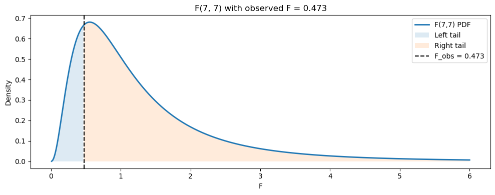
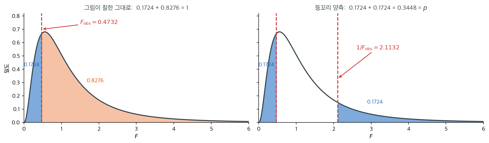
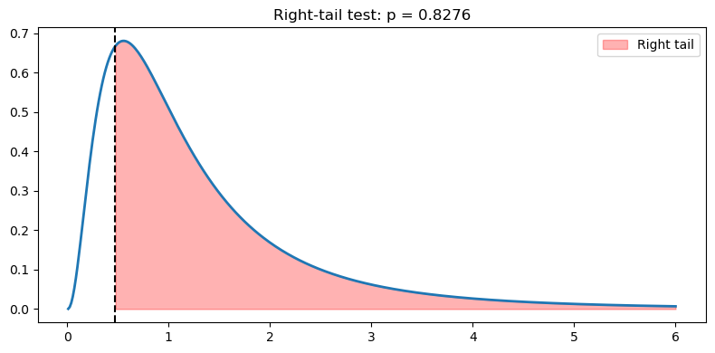
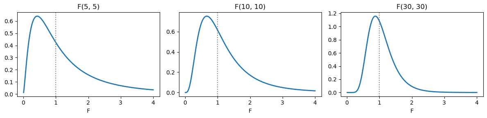

# F 검정 꼬리 영역 시각화

## 개요

F 분포의 꼬리 영역을 시각화하는 것은 분산 동일성에 대한 F 검정이 어떻게 판정에 이르는지 이해하는 데 필수적이다. 관측된 F 통계량을 밀도 곡선 위에 표시하면 음영으로 칠한 꼬리 면적이 $p$값에 대응한다. 이 페이지는 단측과 양측 대립가설에 대해 그런 그림을 만드는 법을 시연하여 F 분포를 이용한 가설검정의 기하학적 직관을 세운다.

---

## 1. F 분포와 꼬리 면적

정규 모집단에서 나온 크기 $n_1$, $n_2$인 독립 표본 둘에 대해 F 통계량

$$
F_{\text{obs}} = \frac{S_1^2}{S_2^2}
$$

은 $H_0: \sigma_1^2 = \sigma_2^2$ 아래에서 $F(d_1, d_2)$ 분포를 따른다. 여기서 $d_1 = n_1 - 1$, $d_2 = n_2 - 1$이다.

$p$값은 대립가설에 따라 달라진다.

- **오른쪽 꼬리** ($H_1: \sigma_1^2 > \sigma_2^2$): $p = P(F \ge F_{\text{obs}})$.
- **왼쪽 꼬리** ($H_1: \sigma_1^2 < \sigma_2^2$): $p = P(F \le F_{\text{obs}})$.
- **양측** ($H_1: \sigma_1^2 \neq \sigma_2^2$): $p = 2\min\!\bigl(P(F \le F_{\text{obs}}),\; P(F \ge F_{\text{obs}})\bigr)$.

다음 코드는 두 표본에서 F 통계량을 계산하고 $F(d_1, d_2)$ 밀도와 양쪽 꼬리 영역을 그린다.

<div class="exbox" markdown>

**보기 1.** <span class="diff easy" title="쉬움"></span> 관측된 F를 그림에 얹기. 두 표본 $\{12,15,14,10,13,14,12,11\}$ 과 $\{22,25,20,18,24,23,19,21\}$ 로 $F_{\text{obs}}$ 를 만들고, $F(7,7)$ 밀도 위에 $F_{\text{obs}}$ 의 왼쪽과 오른쪽을 각각 칠한다.

**(1)** 그렇게 칠한 두 영역의 넓이를 각각 구하고 **그 합**이 얼마인지 말하시오. 이 그림을 그대로 "양측 $p$ 값"으로 읽을 수 있는가?

**(2)** 같은 $F_{\text{obs}}$ 에 대해 **등꼬리 양측검정의 기각역**을 제대로 보이려면 어디를 칠해야 하는가. $d_1 = d_2 = 7$ 에서 그 두 경계를 구하고, 칠한 넓이가 양측 $p$ 값과 같음을 확인하시오.

</div>

??? success "풀이"

    **(1) 두 넓이의 합은 정확히 1 이다.** 칠한 두 영역이 $\{F \le F_{\text{obs}}\}$ 와 $\{F \ge F_{\text{obs}}\}$ 인데, 이 둘은 $F_{\text{obs}}$ 한 점에서만 겹치고 그 점은 연속분포에서 확률 0 이다. 그러므로

    $$
    \underbrace{P(F \le F_{\text{obs}})}_{\text{왼쪽}} + \underbrace{P(F \ge F_{\text{obs}})}_{\text{오른쪽}} = 1
    $$

    이다. **$F_{\text{obs}}$ 를 어디에 두든 합은 1 이다.** 칠해진 넓이가 자료에 전혀 반응하지 않는다는 뜻이고, 따라서 **이 그림을 그대로 양측 $p$ 값으로 읽을 수 없다.** 그림이 말해 주는 것은 넓이가 아니라 **$F_{\text{obs}}$ 가 밀도의 어디에 앉았는가** 하나다.

    두 넓이는 각각 단측 $p$ 값이다. 왼쪽이 $H_1: \sigma_1^2 < \sigma_2^2$ 의 $p$ 값, 오른쪽이 $H_1: \sigma_1^2 > \sigma_2^2$ 의 $p$ 값이며, 둘 중 **큰 쪽은 쓸 일이 없다**(언제나 $1/2$ 를 넘으므로 어떤 수준에서도 기각하지 못한다).

    **그려서 수를 읽는다.**

    ```python
    import numpy as np
    import matplotlib.pyplot as plt
    from scipy.stats import f

    plt.rcParams["font.sans-serif"] = ["NanumGothic", "Apple SD Gothic Neo", "Malgun Gothic"]
    plt.rcParams["font.family"] = "sans-serif"
    plt.rcParams["axes.unicode_minus"] = False

    sample1 = [12, 15, 14, 10, 13, 14, 12, 11]
    sample2 = [22, 25, 20, 18, 24, 23, 19, 21]

    # 두 집단의 분산비가 F 분포의 어디에 떨어지는지 그림으로 본다.
    x1 = np.asarray(sample1, dtype=float)
    x2 = np.asarray(sample2, dtype=float)
    df1, df2 = x1.size - 1, x2.size - 1

    F_obs = x1.var(ddof=1) / x2.var(ddof=1)

    xs = np.linspace(0.01, max(6, F_obs + 2), 400)
    pdf = f(df1, df2).pdf(xs)

    fig, ax = plt.subplots(figsize=(10, 4))
    ax.plot(xs, pdf, linewidth=2, label="F({},{}) PDF".format(df1, df2))

    # 왼쪽 꼬리를 칠한다. 분산비가 1 보다 작은 쪽의 이탈에 해당한다.
    mask_left = xs <= F_obs
    ax.fill_between(xs[mask_left], pdf[mask_left], 0, alpha=0.15, label="Left tail")

    # 오른쪽 꼬리. 양측검정이므로 두 꼬리를 모두 본다.
    mask_right = xs >= F_obs
    ax.fill_between(xs[mask_right], pdf[mask_right], 0, alpha=0.15, label="Right tail")

    ax.axvline(F_obs, linestyle="--", color="black", label=f"F_obs = {F_obs:.3f}")
    ax.set_xlabel("F")
    ax.set_ylabel("Density")
    ax.set_title(f"F({df1}, {df2}) with observed F = {F_obs:.3f}")
    ax.legend()
    plt.tight_layout()
    plt.show()

    # 칠해진 두 영역의 넓이를 실제로 재 본다.
    dist = f(df1, df2)
    area_left, area_right = dist.cdf(F_obs), dist.sf(F_obs)
    print(f"F_obs = {F_obs:.6f}   (d1 = {df1}, d2 = {df2})")
    print(f"왼쪽 영역 넓이 = {area_left:.6f}")
    print(f"오른쪽 영역 넓이 = {area_right:.6f}")
    print(f"두 넓이의 합   = {area_left + area_right:.12f}")
    print(f"양측 p 값      = {2 * min(area_left, area_right):.6f}")
    ```

    출력:

    ```text
    F_obs = 0.473214   (d1 = 7, d2 = 7)
    왼쪽 영역 넓이 = 0.172386
    오른쪽 영역 넓이 = 0.827614
    두 넓이의 합   = 1.000000000000
    양측 p 값      = 0.344772
    ```

    

    **예측대로 합이 $1.000000000000$ 이다.** 그런데 양측 $p$ 값은 $0.344772$ 다. 그림에 칠해진 어느 영역도, 두 영역을 합한 것도 이 수가 아니다. **$0.3448$ 은 그림 어디에도 없다.**

    **(2) 등꼬리 양측검정이 칠해야 할 곳.** 양측 $p$ 값 $2\min(\cdot,\cdot)$ 이 재는 것은 "꼬리확률이 $F_{\text{obs}}$ 의 작은 쪽 꼬리만큼 극단적인 모든 값"의 확률이다. 아래쪽 경계가 $F_{\text{obs}}$ 이면 위쪽 경계 $c$ 는 **오른쪽 꼬리확률이 왼쪽과 같아지는 자리**다.

    $$
    P(F \ge c) = P(F \le F_{\text{obs}}) \iff c = F_F^{-1}\bigl(1 - F_F(F_{\text{obs}})\bigr)
    $$

    $d_1 = d_2$ 이면 $1/F \sim F(d_2,d_1) = F(d_1,d_2)$ 라는 역수 성질에서 이 $c$ 가 깔끔하게 나온다.

    $$
    P(F \ge 1/F_{\text{obs}}) = P(1/F \le F_{\text{obs}}) = P(F \le F_{\text{obs}})
    $$

    곧 $c = 1/F_{\text{obs}} = 1/0.473214 = 2.113208$ 이다. 따라서 칠해야 할 곳은

    $$
    \{F \le 0.4732\} \cup \{F \ge 2.1132\}
    $$

    이고 그 넓이는 $0.172386 \times 2 = 0.344772$, 바로 양측 $p$ 값이다.

    ```python
    import matplotlib
    matplotlib.use("Agg")
    import matplotlib.pyplot as plt
    import numpy as np
    from scipy.stats import f

    plt.rcParams["font.sans-serif"] = ["NanumGothic", "Apple SD Gothic Neo", "Malgun Gothic"]
    plt.rcParams["font.family"] = "sans-serif"
    plt.rcParams["axes.unicode_minus"] = False

    INK, BLUE, BLUEL = "#37474F", "#1565C0", "#DCEBFB"
    ORANGE, ORANGEL, RED = "#E65100", "#FFE0B2", "#D32F2F"

    d1 = d2 = 7
    dist = f(d1, d2)
    F_obs = 0.47321428571428575
    mirror = 1 / F_obs

    xs = np.linspace(0.001, 6, 1200)
    pdf = dist.pdf(xs)

    fig, (ax, az) = plt.subplots(1, 2, figsize=(12, 3.6), sharey=True)

    for a in (ax, az):
        a.plot(xs, pdf, color=INK, lw=1.8, zorder=4)
        a.axvline(F_obs, color=RED, ls="--", lw=1.6, zorder=5)
        a.set_xlabel("$F$")
        a.set_xlim(0, 6)
        a.set_ylim(0, 0.82)
        a.spines[["top", "right"]].set_visible(False)

    # 왼쪽: 쪽의 그림이 칠한 그대로. 두 영역이 축 전체를 덮는다.
    m = xs <= F_obs
    ax.fill_between(xs[m], pdf[m], 0, color=BLUE, alpha=0.55, zorder=2)
    m = xs >= F_obs
    ax.fill_between(xs[m], pdf[m], 0, color=ORANGE, alpha=0.35, zorder=2)
    ax.set_ylabel("밀도")
    ax.set_title("그림이 칠한 그대로:  0.1724 + 0.8276 = 1", fontsize=11, color=INK)
    ax.text(0.20, 0.42, "0.1724", color=BLUE, fontsize=10, ha="center", fontweight="bold")
    ax.text(1.9, 0.30, "0.8276", color=ORANGE, fontsize=10, ha="center", fontweight="bold")
    ax.annotate("$F_{\\mathrm{obs}} = 0.4732$", xy=(F_obs, 0.70), xytext=(1.5, 0.74),
                color=RED, fontsize=10,
                arrowprops=dict(arrowstyle="->", color=RED, lw=1.2))

    # 오른쪽: 등꼬리 양측 기각역. 두 꼬리가 각각 0.1724 다.
    m = xs <= F_obs
    az.fill_between(xs[m], pdf[m], 0, color=BLUE, alpha=0.55, zorder=2)
    m = xs >= mirror
    az.fill_between(xs[m], pdf[m], 0, color=BLUE, alpha=0.55, zorder=2)
    az.axvline(mirror, color=RED, ls="--", lw=1.6, zorder=5)
    az.set_title("등꼬리 양측:  0.1724 + 0.1724 = 0.3448 = $p$", fontsize=11, color=INK)
    az.text(0.20, 0.42, "0.1724", color=BLUE, fontsize=10, ha="center", fontweight="bold")
    az.text(3.1, 0.14, "0.1724", color=BLUE, fontsize=10, ha="center", fontweight="bold")
    az.annotate("$1/F_{\\mathrm{obs}} = 2.1132$", xy=(mirror, 0.33), xytext=(2.6, 0.55),
                color=RED, fontsize=10,
                arrowprops=dict(arrowstyle="->", color=RED, lw=1.2))

    plt.tight_layout()
    plt.show()

    print(f"위쪽 경계  1/F_obs            = {mirror:.6f}")
    print(f"일반 공식  ppf(1 - cdf(F_obs)) = {dist.ppf(1 - dist.cdf(F_obs)):.6f}")
    print(f"칠한 넓이  cdf(F_obs) + sf(1/F_obs) = {dist.cdf(F_obs) + dist.sf(mirror):.6f}")
    print(f"양측 p 값                         = {2 * min(dist.cdf(F_obs), dist.sf(F_obs)):.6f}")
    ```

    출력:

    ```text
    위쪽 경계  1/F_obs            = 2.113208
    일반 공식  ppf(1 - cdf(F_obs)) = 2.113208
    칠한 넓이  cdf(F_obs) + sf(1/F_obs) = 0.344772
    양측 p 값                         = 0.344772
    ```

    

    역수로 구한 $2.113208$ 과 일반 공식 $F_F^{-1}(1 - F_F(F_{\text{obs}}))$ 가 소수 여섯째 자리까지 같다. 칠한 넓이도 $0.344772$ 로 양측 $p$ 값과 정확히 맞는다.

    **두 그림을 나란히 놓으면 차이가 분명하다.** 왼쪽은 축 전체가 칠해져 있어 넓이가 언제나 1 이고, 오른쪽은 가운데가 비어 있다. **비어 있는 가운데가 채택역**이고 그 넓이가 $1 - 0.3448 = 0.6552$ 다. 꼬리 그림을 그릴 때 흔히 저지르는 실수가 왼쪽처럼 $F_{\text{obs}}$ 를 기준으로 양쪽을 다 칠해 놓고 "양측이니까 두 꼬리"라고 적는 것이다. **양측의 두 꼬리는 $F_{\text{obs}}$ 와 그 거울상에서 바깥으로 뻗는 두 조각이지, $F_{\text{obs}}$ 에서 좌우로 갈라진 두 반쪽이 아니다.**

    $d_1 \ne d_2$ 이면 거울상이 $1/F_{\text{obs}}$ 가 아니다. 그때는 역수 요령이 통하지 않으므로 일반 공식 `ppf(1 - cdf(F_obs))` 를 써야 한다.

$p$값을 명시적으로 계산하려면

<div class="exbox" markdown>

**보기 2.** <span class="diff easy" title="쉬움"></span> 양측 p-값 계산. 보기 1 의 $F_{\text{obs}} = 0.4732$ 에 대해 왼쪽·오른쪽·양측 $p$ 값을 모두 찍는다.

**(1)** 세 수 가운데 **독립인 것은 몇 개인가.** $p_{\text{two}}$ 를 $p_{\text{left}}$ 하나의 식으로 적으시오.

**(2)** $F_{\text{obs}}$ 를 움직이며 세 수를 표로 만들고, $p_{\text{two}} = 1$ 이 되는 $F_{\text{obs}}$ 가 어디인지 구하시오. 표가 $F_{\text{obs}} \mapsto 1/F_{\text{obs}}$ 에 대해 어떤 꼴을 보이는가.

</div>

??? success "풀이"

    **(1) 독립인 것은 하나뿐이다.** 보기 1 에서 본 대로 두 꼬리확률의 합이 1 이므로

    $$
    p_{\text{right}} = 1 - p_{\text{left}}
    $$

    이고, 양측 $p$ 값도 $p_{\text{left}}$ 만의 함수다. $u = p_{\text{left}}$ 라 쓰면

    $$
    p_{\text{two}} = 2\min(u,\, 1-u) =
    \begin{cases}
    2u, & u \le \tfrac12 \\[2pt]
    2(1-u), & u > \tfrac12
    \end{cases}
    \;=\; 1 - \lvert 2u - 1 \rvert
    $$

    이다. **세 수는 전부 $p_{\text{left}}$ 하나로 정해진다.** 셋을 나란히 찍는 것은 읽는 사람의 편의일 뿐 새 정보가 아니다.

    $1 - \lvert 2u-1 \rvert$ 꼴에서 바로 읽히는 것이 셋 있다.

    - $p_{\text{two}} \le 1$ 이고 등호는 $u = 1/2$ 일 때뿐이다.
    - $p_{\text{two}}$ 는 $u = 1/2$ 에서 꼭짓점을 이루는 **삼각형 꼴**이라 $u$ 와 $1-u$ 에서 같은 값을 준다.
    - 따라서 **두 꼬리 넓이를 그냥 더하면 안 된다.** 더하면 언제나 $1$ 이다(보기 1).

    **(2) 표로 확인한다.** 아래 코드는 보기 1 의 `x1`, `x2`, `df1`, `df2`, `F_obs` 를 그대로 이어받는다.

    ```python
    # 두 꼬리 중 작은 쪽을 두 배 해 양측 p-값을 만든다. F 분포가 대칭이
    # 아니라서 두 꼬리 넓이를 그냥 더하면 안 된다.
    p_left = f(df1, df2).cdf(F_obs)
    p_right = f(df1, df2).sf(F_obs)
    p_two = 2 * min(p_left, p_right)

    print(f"Sample variances: {x1.var(ddof=1):.4f}, {x2.var(ddof=1):.4f}")
    print(f"F_obs = {F_obs:.4f}")
    print(f"Left-tail  p-value: {p_left:.4f}")
    print(f"Right-tail p-value: {p_right:.4f}")
    print(f"Two-sided  p-value: {p_two:.4f}")

    # (1) 의 두 항등식을 확인한다.
    print(f"두 꼬리의 합 = {p_left + p_right:.12f}")
    print(f"1 - |2*p_left - 1| = {1 - abs(2 * p_left - 1):.4f}")

    # F_obs 를 움직이며 세 수가 어떻게 가는지 본다.
    dist = f(df1, df2)
    print(f"\n{'F_obs':>8}{'p_left':>10}{'p_right':>10}{'합':>8}{'p_two':>9}")
    for Fo in (0.2, 0.4732, 0.8, 1.0, 1.25, 2.1132, 5.0):
        L, R = dist.cdf(Fo), dist.sf(Fo)
        print(f"{Fo:>8.4f}{L:>10.4f}{R:>10.4f}{L + R:>8.4f}{2 * min(L, R):>9.4f}")
    print(f"\nF(7,7) 의 중앙값 = {dist.median():.6f}   (이 자리에서 p_two 가 1 이 된다)")
    ```

    출력:

    ```text
    Sample variances: 2.8393, 6.0000
    F_obs = 0.4732
    Left-tail  p-value: 0.1724
    Right-tail p-value: 0.8276
    Two-sided  p-value: 0.3448
    두 꼬리의 합 = 1.000000000000
    1 - |2*p_left - 1| = 0.3448

       F_obs    p_left   p_right       합    p_two
      0.2000    0.0249    0.9751  1.0000   0.0499
      0.4732    0.1724    0.8276  1.0000   0.3448
      0.8000    0.3880    0.6120  1.0000   0.7760
      1.0000    0.5000    0.5000  1.0000   1.0000
      1.2500    0.6120    0.3880  1.0000   0.7760
      2.1132    0.8276    0.1724  1.0000   0.3448
      5.0000    0.9751    0.0249  1.0000   0.0499

    F(7,7) 의 중앙값 = 1.000000   (이 자리에서 p_two 가 1 이 된다)
    ```

    **(1)의 두 항등식이 맞는다.** 합이 $1.000000000000$ 이고 $1 - \lvert 2p_{\text{left}} - 1\rvert = 0.3448$ 이 `2 * min(...)` 과 같다.

    **$p_{\text{two}} = 1$ 이 되는 자리는 $F_{\text{obs}} = 1$ 이다.** $p_{\text{two}} = 1$ 은 $p_{\text{left}} = 1/2$ 를 뜻하고, 그것은 $F_{\text{obs}}$ 가 귀무분포의 **중앙값**이라는 말이다. 출력의 마지막 줄이 $F(7,7)$ 의 중앙값을 $1.000000$ 으로 준다. $d_1 = d_2$ 일 때만 그렇다 — 역수 성질 $1/F \sim F(d,d)$ 에서 $P(F\le 1) = P(F \ge 1) = 1/2$ 이기 때문이다. $d_1 \ne d_2$ 이면 중앙값이 1 이 아니고, $F_{\text{obs}} = 1$ 이어도 $p_{\text{two}} < 1$ 이 된다.

    **표가 $F_{\text{obs}} \mapsto 1/F_{\text{obs}}$ 에 대해 뒤집힌 꼴을 보인다.** $0.2$ 와 $5.0$, $0.4732$ 와 $2.1132$, $0.8$ 과 $1.25$ 가 각각 서로 역수인 짝인데, 짝마다 $p_{\text{left}}$ 와 $p_{\text{right}}$ 가 **맞바뀌고** $p_{\text{two}}$ 는 **그대로**다($0.0499$, $0.3448$, $0.7760$). 역수 성질이 만드는 대칭이며, 로그 척도로 옮기면 $\log F$ 의 분포가 0 을 중심으로 정확히 대칭이라는 말과 같다. 그래서 **어느 표본분산을 분자에 두든 양측 $p$ 값이 바뀌지 않는다**(15.3절 [F 검정](f_test_variances.md) 연습문제 2).

    맨 윗줄과 맨 아랫줄의 $p_{\text{two}} = 0.0499$ 도 읽어 둘 만하다. $F(7,7)$ 의 $2.5\%$ 와 $97.5\%$ 분위수가 $0.2002$ 와 $4.9949$ 이므로 $0.2$ 와 $5.0$ 은 둘 다 기각역에 **간신히 들어가 있고**, 그래서 $p$ 가 $0.05$ 바로 아래다. **집단당 8 개로는 분산비가 5 배는 되어야 기각한다.**

---

## 2. 해석

- $F_{\text{obs}}$까지의 왼쪽 꼬리 면적은 $H_0$ 아래에서 관측된 것만큼 작거나 더 작은 분산비를 얻을 확률이다.
- $F_{\text{obs}}$부터의 오른쪽 꼬리 면적은 그만큼 크거나 더 큰 비를 얻을 확률이다.
- 양측검정에서는 더 작은 쪽 꼬리 면적을 두 배 한다. $F_{\text{obs}}$가 1에 가까우면($d_2$가 클 때 $H_0$ 아래의 기댓값) 양쪽 꼬리가 모두 커서 $p$값이 1에 가까워진다.
- F 분포는 특히 자유도가 작을 때 오른쪽으로 치우쳐 있다. 이 비대칭 때문에 주어진 $F_{\text{obs}}$에 대해 왼쪽과 오른쪽 꼬리 $p$값이 일반적으로 같지 않다.

여기서 두 꼬리 확률이 $0.172$와 $0.828$로 합이 정확히 1이다(연속분포이므로 당연하다). 양측 $p$값 $0.345$는 작은 쪽을 두 배 한 값이다.

---

## 연습문제

<div class="drillbox" markdown>

**연습문제 1.** <span class="diff easy" title="쉬움"></span> 위 코드의 표본에 대해 $F_{\text{obs}}$를 손으로 계산하고 코드 출력과 대조하라. 자유도를 서술하라.

</div>

??? success "풀이"

    표본 1: $\{12, 15, 14, 10, 13, 14, 12, 11\}$, $n_1 = 8$, $\bar{x}_1 = 12.625$.

    $$
    S_1^2 = \frac{1}{7}\sum(x_i - 12.625)^2
    $$

    $$
    = \frac{1}{7}(0.390625 + 5.640625 + 1.890625 + 6.890625 + 0.140625 + 1.890625 + 0.390625 + 2.640625) = \frac{19.875}{7} = 2.8393.
    $$

    표본 2: $\{22, 25, 20, 18, 24, 23, 19, 21\}$, $n_2 = 8$, $\bar{x}_2 = 21.5$.

    $$
    S_2^2 = \frac{1}{7}(0.25 + 12.25 + 2.25 + 12.25 + 6.25 + 2.25 + 6.25 + 0.25) = \frac{42}{7} = 6.0.
    $$

    $$
    F_{\text{obs}} = \frac{2.8393}{6.0} = 0.4732, \quad d_1 = 7, \; d_2 = 7.
    $$

    코드 출력과 정확히 일치한다.

    **자유도가 왜 $n-1$인가.** 각 표본분산이 자기 집단의 평균을 추정하는 데 자유도 하나를 썼기 때문이다. $S_i^2$의 분자 $\sum (x_{ij} - \bar{x}_i)^2$은 제약 $\sum_j (x_{ij} - \bar{x}_i) = 0$을 만족하므로 자유로운 성분이 $n_i - 1$개이다. $\square$

<div class="drillbox" markdown>

**연습문제 2.** <span class="diff med" title="중간"></span> 단측검정 $H_1: \sigma_1^2 > \sigma_2^2$에 맞게 오른쪽 꼬리만 음영으로 칠하도록 코드를 수정하라. 오른쪽 꼬리 $p$값은 얼마인가?

</div>

??? success "풀이"

    ```python
    import numpy as np
    import matplotlib.pyplot as plt
    from scipy.stats import f

    x1 = np.array([12, 15, 14, 10, 13, 14, 12, 11], dtype=float)
    x2 = np.array([22, 25, 20, 18, 24, 23, 19, 21], dtype=float)
    df1, df2 = 7, 7
    F_obs = x1.var(ddof=1) / x2.var(ddof=1)

    xs = np.linspace(0.01, 6, 400)
    pdf = f(df1, df2).pdf(xs)

    fig, ax = plt.subplots(figsize=(8, 4))
    ax.plot(xs, pdf, lw=2)
    mask = xs >= F_obs
    ax.fill_between(xs[mask], pdf[mask], 0, alpha=0.3, color="red",
                    label="Right tail")
    ax.axvline(F_obs, ls="--", color="black")
    ax.set_title(f"Right-tail test: p = {f(df1,df2).sf(F_obs):.4f}")
    ax.legend()
    plt.tight_layout()
    plt.show()
    ```

    

    $F_{\text{obs}} = 0.4732 < 1$이므로 오른쪽 꼬리 면적이 매우 크다. $p = 0.8276$으로 $\sigma_1^2 > \sigma_2^2$의 증거가 전혀 없다.

    **당연한 결과이다.** 표본분산이 $2.84 < 6.00$으로 오히려 집단 1이 작으므로, "집단 1의 분산이 더 크다"는 대립가설의 방향과 자료가 정반대이다.

    !!! warning "$p > 0.5$는 대립가설의 방향이 틀렸다는 신호이다"
        단측검정에서 $p$값이 $0.5$를 크게 넘으면, 자료가 대립가설과 **반대 방향**을 가리키고 있다는 뜻이다. 이때 "$H_0$을 기각하지 못한다"고만 보고하면 정보를 잃는다.

        올바른 서술은 "자료는 $\sigma_1^2 > \sigma_2^2$을 지지하지 않으며, 오히려 반대 방향($\sigma_1^2 < \sigma_2^2$, 왼쪽 꼬리 $p = 0.172$)을 시사한다"이다.

        다만 **자료를 보고 대립가설의 방향을 바꾸어서는 안 된다.** 그렇게 하면 실제 유의수준이 $2\alpha$가 된다. 방향을 미리 확신할 수 없다면 처음부터 양측검정을 계획해야 한다. $\square$

<div class="drillbox" markdown>

**연습문제 3.** <span class="diff med" title="중간"></span> $F(d_1, d_2)$ 밀도가 1을 중심으로 대칭이 아닌 이유를 설명하라. 이 비대칭이 양측 $p$값 계산에 어떤 영향을 주는가?

</div>

??? success "풀이"

    F 분포는 척도가 조정된 두 카이제곱 변수의 비로 정의되며, 둘 다 음이 아니고 오른쪽으로 치우쳐 있다. 밀도의 정의역이 $(0, \infty)$이고 $d_1 > 2$에 대해 최빈값이

    $$
    \frac{d_1-2}{d_1} \cdot \frac{d_2}{d_2+2} < 1
    $$

    이다. 이 고유한 오른쪽 치우침 때문에 일반적으로 $P(F > c) \neq P(F < 1/c)$이다.

    양측 $p$값에서는 정규분포처럼 대칭인 분포에서 하듯 한쪽 꼬리 면적을 단순히 두 배 할 수 없다. 대신 $p = 2\min(P(F \le F_{\text{obs}}), P(F \ge F_{\text{obs}}))$를 쓴다. 작은 쪽 꼬리를 골라 두 배 하는 것이다. 이렇게 하면 검정이 타당해지지만, 기각역이 $F$ 척도에서 1을 중심으로 대칭이 아니게 된다.

    **로그 척도에서는 대칭이 회복된다.** $d_1 = d_2 = d$일 때 역수 성질 $1/F \sim F(d,d)$에 의해 $\ln F$의 분포가 0을 중심으로 **정확히 대칭**이다. 본문 보기에서 $d_1 = d_2 = 7$이므로

    $$
    P(F \le 0.4732) = P(F \ge 1/0.4732) = P(F \ge 2.1132) = 0.1724
    $$

    가 성립한다. 로그 척도의 대칭성이 이 관계를 만든다.

    $d_1 \neq d_2$이면 이 대칭은 깨진다. 두 임계값이 더는 서로 역수가 아니다. **그러나 $\min$을 두 배 하는 규칙의 크기는 그대로 정확히 $\alpha$다.** 자유도와 무관하다.

    까닭은 대칭이 아니라 확률적분변환이다. $H_0$ 아래에서 $P = F_{d_1,d_2}(F_{\text{obs}})$는 자유도가 무엇이든 $U(0,1)$을 따른다. $2\min(P, 1-P)$는 $U(0,1)$을 반으로 접어 두 배한 것이므로 다시 $U(0,1)$이고, 따라서

    $$
    P\bigl(2\min(P,\,1-P) < \alpha\bigr) = \alpha
    $$

    가 정확히 성립한다. $(4,30)$, $(30,4)$, $(3,60)$, $(2,5)$, $(14,19)$에서 $40$만 회씩 확인하면 모두 $0.0497$에서 $0.0506$ 사이로, 몬테카를로 표준오차 $0.00034$의 두 배 안에 들어온다.

    자유도가 달라서 달라지는 것은 **임계값이 놓이는 자리**이고, 기각역의 **크기**가 아니다. $\square$

<div class="drillbox" markdown>

**연습문제 4.** <span class="diff med" title="중간"></span> $(d_1, d_2) \in \{(5,5), (10,10), (30,30)\}$에 대한 $F(d_1, d_2)$ 밀도를 세 개의 부분그림으로 그려라. 자유도가 커지면서 모양이 어떻게 변하는지 논하라.

</div>

??? success "풀이"

    ```python
    import numpy as np
    import matplotlib.pyplot as plt
    from scipy.stats import f

    fig, axes = plt.subplots(1, 3, figsize=(12, 3))
    for ax, (d1, d2) in zip(axes, [(5, 5), (10, 10), (30, 30)]):
        xs = np.linspace(0.01, 4, 300)
        ax.plot(xs, f(d1, d2).pdf(xs), lw=2)
        ax.axvline(1, ls=":", color="gray")
        ax.set_title(f"F({d1}, {d2})")
        ax.set_xlabel("F")
    plt.tight_layout()
    plt.show()

    for d1, d2 in [(5, 5), (10, 10), (30, 30)]:
        mode = (d1 - 2) / d1 * d2 / (d2 + 2)
        mean = d2 / (d2 - 2)
        print(f"F({d1},{d2}): mode={mode:.4f}, mean={mean:.4f}")
    ```

    출력:

    ```text
    F(5,5): mode=0.4286, mean=1.6667
    F(10,10): mode=0.6667, mean=1.2500
    F(30,30): mode=0.8750, mean=1.0714
    ```

    

    자유도가 커질수록 최빈값이 $0.43 \to 0.67 \to 0.88$로 1에 가까워지고 분포가 1을 중심으로 좁아진다. $d_1 = d_2 \to \infty$이면 $F \to 1$에 축퇴한다.

    | $(d_1,d_2)$ | 최빈값 | 평균 | 왜도 |
    |---|---|---|---|
    | $(5,5)$ | 0.429 | 1.667 | 정의되지 않음 |
    | $(10,10)$ | 0.667 | 1.250 | 3.615 |
    | $(30,30)$ | 0.875 | 1.071 | 1.268 |

    자유도가 커지면 F 밀도가 1 주위로 더 집중되고(기댓값이 $d_2/(d_2-2) \to 1$) 더 대칭이 된다. $d_1, d_2$가 크면 $\ln F$가 근사적으로 정규이고 분포가 1 근처를 중심으로 하는 정규분포와 비슷해진다.

    !!! note "$F(5,5)$의 왜도는 존재하지 않는다"
        F 분포의 왜도 공식은 $d_2 > 6$을 요구한다. $d_2 \leq 6$이면 3차 적률이 존재하지 않는다.

        마찬가지로 평균은 $d_2 > 2$, 분산은 $d_2 > 4$가 필요하다. **분모 자유도가 작으면 F 분포의 적률이 차례로 사라진다.**

        실무적 함의: 두 표본이 각각 $n \leq 7$이면($d_2 \leq 6$) F 통계량의 왜도조차 정의되지 않을 만큼 분포가 극단적이다. 이런 자료에서 F 검정의 $p$값은 형식적으로는 계산되지만, 검정통계량이 매우 불안정하므로 결과를 신뢰하기 어렵다. $\square$

<div class="drillbox" markdown>

**연습문제 5.** <span class="diff med" title="중간"></span> $F \sim F(d_1, d_2)$이면 $1/F \sim F(d_2, d_1)$임을 증명하라. 이를 이용해 $F(d_1, d_2)$ 아래에서 $F_{\text{obs}}$의 왼쪽 꼬리 $p$값이 $F(d_2, d_1)$ 아래에서 $1/F_{\text{obs}}$의 오른쪽 꼬리 $p$값과 같음을 보여라.

</div>

??? success "풀이"

    정의에 의해 $F = (U/d_1)/(V/d_2)$이고 $U \sim \chi^2(d_1)$, $V \sim \chi^2(d_2)$가 독립이다. 그러면

    $$
    \frac{1}{F} = \frac{V/d_2}{U/d_1} \sim F(d_2, d_1)
    $$

    자유도를 뒤바꾼 F 분포의 정의 그대로이다.

    이제 $P(F \le F_{\text{obs}}) = P(1/F \ge 1/F_{\text{obs}})$이다. $1/F \sim F(d_2, d_1)$이므로 이는 오른쪽 꼬리확률 $P(F(d_2, d_1) \ge 1/F_{\text{obs}})$이며, 정확히 $1/F_{\text{obs}}$에서 평가한 $F(d_2, d_1)$의 생존함수이다.

    **수치 확인.**

    ```python
    from scipy.stats import f

    F_obs, d1, d2 = 0.4732, 7, 7
    print(f"left tail  of F({d1},{d2}) at {F_obs}:      "
          f"{f(d1, d2).cdf(F_obs):.6f}")
    print(f"right tail of F({d2},{d1}) at {1/F_obs:.4f}: "
          f"{f(d2, d1).sf(1 / F_obs):.6f}")
    ```

    출력:

    ```
    left tail  of F(7,7) at 0.4732:      0.172376
    right tail of F(7,7) at 2.1133: 0.172376
    ```

    왼쪽 꼬리와 오른쪽 꼬리가 소수 여섯째 자리까지 $0.172376$으로 같다.

    두 값이 소수 여섯째 자리까지 같다.

    **실무적 의미.** 이 성질 덕분에 F 분포표에 상단 분위수만 실어도 충분하다. 하단 임계값이 필요하면 자유도를 뒤바꾼 상단 임계값의 역수를 취하면 된다.

    또한 이는 "어느 집단을 분자에 둘지"가 검정 결과에 영향을 주지 않는다는 것을 보장한다. 양측검정에서는 $\min$을 취하므로 두 배열이 정확히 같은 $p$값을 낸다(15.3절 [F 검정](f_test_variances.md) 연습문제 2 참조). $\square$

---

## 정리하며

$p$ 값을 **그림으로** 보면 판정의 근거가 분명해진다.

- **밀도 아래 칠해진 넓이가 $p$ 값이다.** 관측된 $F$ 를 곡선 위에 표시하고 그 오른쪽을 칠하면 된다.
- **단측과 양측의 차이가 그림에서 보인다.** 양측이면 양쪽 꼬리를 칠하며, $F$ 분포가 비대칭이라 두 꼬리의 모양이 다르다.
- **자유도를 바꿔 가며 그려 보면 감이 생긴다.** 분모 자유도가 작을 때 분포가 얼마나 오른쪽으로 늘어지는지가 눈에 들어온다.
- **임계값과 $p$ 값이 같은 것의 두 표현임**도 확인된다. 기각역의 경계가 곧 $p=\alpha$ 인 지점이다.
- **그림은 이해를 돕지만 타당성을 보장하지 않는다.** 정규성이 깨지면 이 곡선 자체가 틀린 기준분포다.

다음 절 **로버스트 대안**으로 넘어간다.
