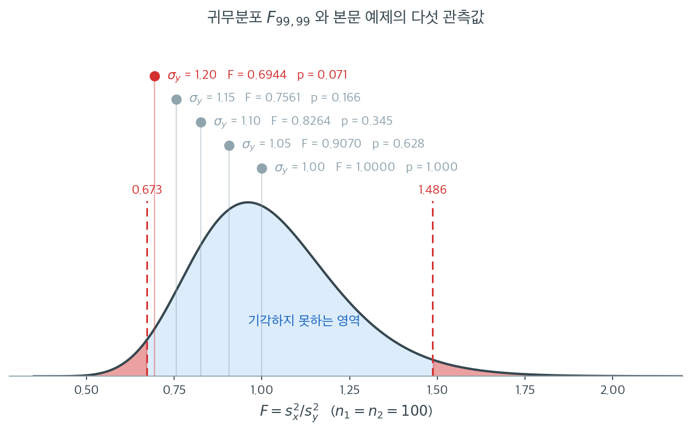

# 분산 동일성에 대한 F 검정

!!! note "이 주제를 다루는 다른 곳"
    분산분석의 등분산성 사전확인이라는 좁은 맥락에서 같은 검정을 짧게 쓰는 예가
    **11.5 가정**에 있다.

---

## 개요

분산 동일성에 대한 F 검정은 정규분포를 따르는 두 모집단의 분산을 비교하는 이표본 검정이다. 검정통계량은 두 표본분산의 비이며 귀무가설 아래에서 F 분포를 따른다. 정확한 정규성 아래에서는 우아하고 최적이지만, F 검정은 정규성 이탈에 극도로 민감하기로 악명 높다. 그래서 실무에서는 Levene 검정 같은 로버스트 대안이 대체로 낫다.

---

## 1. 검정 설정

$X_1, \ldots, X_{n_1} \overset{\text{iid}}{\sim} N(\mu_1, \sigma_1^2)$과 $Y_1, \ldots, Y_{n_2} \overset{\text{iid}}{\sim} N(\mu_2, \sigma_2^2)$이 독립 표본이라 하자. 가설은

$$
H_0 : \sigma_1^2 = \sigma_2^2 \quad \text{대} \quad H_1 : \sigma_1^2 \neq \sigma_2^2.
$$

---

## 2. 검정통계량

F 통계량은 두 표본분산의 비로 정의된다.

$$
F = \frac{S_1^2}{S_2^2},
$$

여기서 $S_i^2 = \frac{1}{n_i - 1}\sum_{j=1}^{n_i}(X_{ij} - \bar{X}_i)^2$이다. $H_0$ 아래에서

$$
F \sim F(n_1 - 1,\; n_2 - 1).
$$

---

## 3. 판정규칙

수준 $\alpha$의 양측검정에서 $p$값은

$$
p = 2\min\!\bigl(F_{F\text{-dist}}(F_{\text{obs}}),\; 1 - F_{F\text{-dist}}(F_{\text{obs}})\bigr),
$$

여기서 $F_{F\text{-dist}}$는 $F(n_1-1, n_2-1)$의 CDF이다. $p < \alpha$이면 $H_0$을 기각한다.

<div class="exbox" markdown>

**보기 1.** <span class="diff easy" title="쉬움"></span> F 검정 구현. 위의 판정규칙을 그대로 함수로 옮긴다. `scipy` 에는 두 분산을 비교하는 전용 함수가 없으므로 $p$ 값을 직접 조립해야 한다.

**(1)** $p = 2\min\bigl(F_{F}(F_{\text{obs}}),\, 1 - F_{F}(F_{\text{obs}})\bigr)$ 이 **결코 1 을 넘지 않음**을 보이고, $H_0$ 이 참이면 이 값이 **정확히** $U(0,1)$ 을 따름을 보이시오. 따라서 이 검정의 크기는 정확히 $\alpha$ 다.

**(2)** 모의실험으로 그 균등성을 확인하시오. 또 꼬리확률을 `sf` 대신 `1 - cdf` 로 계산하면 어디서부터 무너지는지 밝히시오.

</div>

??? success "풀이"

    **(1) 1 을 넘지 않는다.** $U = F_{F}(F_{\text{obs}})$ 라 쓰면 `sf` 는 $1 - U$ 이고, 두 꼬리확률의 합이 1 이므로 작은 쪽은 반을 넘을 수 없다.

    $$
    \min(U,\, 1-U) \le \tfrac12
    \quad\Longrightarrow\quad
    p = 2\min(U,\, 1-U) \le 1
    $$

    등호는 $U = 1/2$, 곧 $F_{\text{obs}}$ 가 귀무분포의 중앙값일 때만 성립한다. **그러므로 따로 $1$ 에서 자를 필요가 없다.** 양측 $p$ 값을 "두 배"로 만드는 다른 관용구들은 $1$ 을 넘길 수 있지만 이 식은 그렇지 않다.

    **$H_0$ 아래에서 정확히 균등하다.** $H_0$ 아래에서 $F_{\text{obs}} \sim F(d_1, d_2)$ 이고 이 분포는 연속이므로, 확률적분변환에 의해

    $$
    U = F_F(F_{\text{obs}}) \sim U(0,1)
    $$

    이다. 그러면 $0 < t < 1$ 에 대하여 $2\min(U, 1-U) \le t$ 는 $U \le t/2$ 또는 $U \ge 1 - t/2$ 와 같은 사건이고, 두 사건은 서로 배반이므로

    $$
    P(p \le t) = P\!\left(U \le \tfrac t2\right) + P\!\left(U \ge 1 - \tfrac t2\right) = \frac t2 + \frac t2 = t
    $$

    이다. 곧 $p \sim U(0,1)$ 이 **근사가 아니라 정확히** 성립하고, 따라서

    $$
    P(p < \alpha \mid H_0) = \alpha
    $$

    로 검정의 크기가 명목값과 정확히 같다. 양쪽 꼬리가 각각 $\alpha/2$ 씩을 받으므로 이것을 **등꼬리 양측검정**이라 부른다.

    **이 "정확히"가 어디에 기대고 있는지 보라.** 유일한 고리는 $F_{\text{obs}} \sim F(d_1, d_2)$ 이고, 그것은 $(n_i-1)S_i^2/\sigma_i^2 \sim \chi^2_{n_i-1}$ 에서 나오며, 그 사실은 **정규모집단에서만** 참이다. 5.2절이 그 유도를 적었다. 정규성이 깨지면 $U$ 가 균등하지 않게 되고 위 등식은 통째로 무너진다. 5.3절은 그때 극한 오류율이 모집단 첨도만의 함수

    $$
    2\left[1 - \Phi\!\left(1.96\sqrt{\frac{2}{\beta_2-1}}\right)\right]
    $$

    로 가고 **표본을 키워도 낫지 않는다**는 것까지 유도해 두었다. 정규 $0.050$, 균등 $0.002$, 지수 $0.327$, 로그정규 $0.794$ 다.

    **(2) 수치적으로.** $H_0$ 이 참인 두 표본을 20만 쌍 만들어 $p$ 값의 분포를 본다.

    ```python
    import numpy as np
    import scipy.stats as stats


    def f_test(data_0, data_1):
        """두 분산이 같은지 검정하는 이표본 F 검정.

        H0: sigma_1^2 = sigma_2^2
        H1: sigma_1^2 != sigma_2^2

        두 표본분산의 비가 F 분포를 따른다는 사실을 쓴다. 이 사실 자체가
        정규성에서 나오므로, 정규가 아니면 검정 전체가 무너진다.
        """
        statistic = data_0.var(ddof=1) / data_1.var(ddof=1)
        df1 = data_0.shape[0] - 1
        df2 = data_1.shape[0] - 1
        p_value = 2 * min(
            stats.f(df1, df2).cdf(statistic),
            stats.f(df1, df2).sf(statistic),
        )
        return statistic, p_value


    # 한 쌍으로 손풀기. H0 이 참인 두 표본이므로 p 가 커야 한다.
    rng = np.random.default_rng(7)
    stat, pval = f_test(rng.normal(size=100), rng.normal(size=100))
    print(f"표본 한 쌍:  F = {stat:.4f},  p = {pval:.4f}")

    # (1) p 값이 1 을 넘지 않는가, H0 아래에서 균등한가.
    n, M = 100, 200_000
    X = rng.normal(size=(M, n))
    Y = rng.normal(size=(M, n))          # 두 표본 모두 N(0,1) 이므로 H0 이 참이다
    F = X.var(axis=1, ddof=1) / Y.var(axis=1, ddof=1)

    dist = stats.f(n - 1, n - 1)
    U = dist.cdf(F)
    p = 2 * np.minimum(U, 1 - U)          # 함수가 돌려주는 것과 같은 식

    print(f"p 의 최대값 = {p.max():.6f}   (1 을 넘지 않는다)")
    print(f"p 의 평균   = {p.mean():.6f}   (U(0,1) 이면 0.5)")
    ks = stats.kstest(p, "uniform")
    print(f"p 가 U(0,1) 인가:  KS = {ks.statistic:.5f},  p-value = {ks.pvalue:.4f}")
    for a in (0.01, 0.05, 0.10):
        print(f"   명목 alpha = {a:.2f}  ->  실제 기각률 = {np.mean(p < a):.5f}")

    # (2) 꼬리에서 1 - cdf 가 무너진다. 2^-53 = 1.11e-16 바닥에 붙는다.
    print(f"\n{'F':>6}{'sf(F)':>16}{'1 - cdf(F)':>16}  배율")
    for f in (5, 10, 20, 50, 100):
        sf, naive = dist.sf(f), 1 - dist.cdf(f)
        print(f"{f:>6}{sf:>16.3e}{naive:>16.3e}  {naive / sf:.1e}")
    print(f"2**-53 = {2.0**-53:.3e}")
    ```

    출력:

    ```text
    표본 한 쌍:  F = 1.0182,  p = 0.9285
    p 의 최대값 = 0.999999   (1 을 넘지 않는다)
    p 의 평균   = 0.500026   (U(0,1) 이면 0.5)
    p 가 U(0,1) 인가:  KS = 0.00126,  p-value = 0.9066
       명목 alpha = 0.01  ->  실제 기각률 = 0.00983
       명목 alpha = 0.05  ->  실제 기각률 = 0.04985
       명목 alpha = 0.10  ->  실제 기각률 = 0.09879

         F           sf(F)      1 - cdf(F)  배율
         5       1.370e-14       1.366e-14  1.0e+00
        10       7.783e-26       1.110e-16  1.4e+09
        20       8.867e-39       1.110e-16  1.3e+22
        50       2.955e-57       1.110e-16  3.8e+40
       100       9.653e-72       1.110e-16  1.2e+55
    2**-53 = 1.110e-16
    ```

    **(1)의 두 주장이 모두 맞는다.** $p$ 의 최대값이 $0.999999$ 로 $1$ 을 넘지 않고, 평균이 $0.500026$ 으로 $U(0,1)$ 의 $0.5$ 와 맞는다. 콜모고로프–스미르노프 거리가 $0.00126$ 이고 그 $p$ 값이 $0.9066$ 이라 균등분포와 구별되지 않는다. 20만 번이면 $\pm 1/\sqrt{200000} \approx 0.0022$ 정도의 거리는 우연으로 설명되므로, $0.00126$ 은 몬테카를로 오차 안이다. 세 명목수준에서 실제 기각률이 $0.00983$, $0.04985$, $0.09879$ 로 모두 명목값과 맞는다.

    **`1 - cdf` 는 $F = 10$ 에서 이미 무너진다.** $F(99,99)$ 에서 참값 `sf(10)` 이 $7.8\times10^{-26}$ 인데 `1 - cdf(10)` 은 $1.11\times 10^{-16}$ 을 돌려준다. 열 자릿수 가까이 **크게** 준다. 그리고 $F = 20, 50, 100$ 에서도 값이 $1.11\times 10^{-16}$ 에서 꼼짝하지 않는데, 이것이 바로 $2^{-53}$, 곧 배정도 부동소수점에서 $1$ 바로 아래의 간격이다. `cdf` 가 $1$ 에 너무 가까워져 `1 - cdf` 가 **반올림의 잔돈만 돌려주는 것**이다.

    $p$ 값을 작게 줄 수 있어야 하는 검정에서 꼬리확률을 자릿수째로 크게 주는 것은 치명적이다. 그래서 위 함수가 `sf` 를 쓴다. **꼬리확률은 늘 `sf` 로 계산하라.** `1 - cdf` 는 꼬리가 $10^{-16}$ 보다 얇아지는 곳에서 바닥에 붙는다.

다음 보기는 두 번째 표본의 표준편차를 점점 키우면서 F 검정을 적용한다.

<div class="exbox" markdown>

**보기 2.** <span class="diff easy" title="쉬움"></span> 분산 차이를 키워 가며. 집단당 $n = 100$, $x$ 와 $y$ 에 **같은 씨앗**을 주고 $\sigma_y$ 만 $1.00$ 에서 $1.20$ 까지 키운다.

**(1)** 이 설정에서 $F$ 통계량이 표집변동 없이 **정확히** $1/\sigma_y^2$ 이 됨을 보이고, $\sigma_y = 1$ 에서 $p$ 가 정확히 $1$ 이 되는 까닭을 밝히시오.

**(2)** $F(99,99)$ 의 양측 $2.5\%$ 임계값을 구해 다섯 경우의 판정을 **돌려 보기 전에** 예측하시오. 또 이 표를 "검정력"으로 읽으면 왜 안 되는지, 독립 표본이면 실제 기각률이 얼마인지 밝히시오.

</div>

??? success "풀이"

    **(1) 두 표본이 같은 난수를 공유한다.** `stats.norm(loc=a, scale=s).rvs(size, random_state=seed)` 는 표준정규 추출값 $z_1, \ldots, z_{100}$ 을 씨앗 하나로 정하고 $a + s z_j$ 를 돌려준다. 씨앗이 같으므로 두 표본에 들어가는 $z$ 가 **같은 수열**이고

    $$
    x_j = z_j, \qquad y_j = 1 + \sigma_y z_j
    $$

    이다. 표본분산은 위치이동에 둔감하고 척도에 대해 이차이므로

    $$
    S_x^2 = S_z^2, \qquad S_y^2 = \sigma_y^2 S_z^2
    $$

    이고, 따라서

    $$
    F = \frac{S_x^2}{S_y^2} = \frac{S_z^2}{\sigma_y^2 S_z^2} = \frac{1}{\sigma_y^2}
    $$

    이 된다. **$S_z^2$ 이 약분되어 자료가 통째로 사라졌다.** 표본을 다시 뽑아도, 씨앗을 바꾸어도 $F$ 는 꿈쩍하지 않는다. 두 표본이 독립이라는 F 검정의 전제가 깨져 있으니 당연히 그렇다. 이 설정이 보여 주는 것은 **표집변동이 0 인 이상적 신호**다.

    **$\sigma_y = 1$ 에서 $p = 1$ 인 까닭.** 그때 $F = 1$ 이다. 그리고 $W \sim F(d,d)$ 이면 $1/W \sim F(d,d)$ 이므로(두 자유도가 같다) $P(W \le 1) = P(1/W \le 1) = P(W \ge 1)$ 이고, 두 확률의 합이 $1$ 이니

    $$
    F_F(1) = \tfrac12 \quad \text{(자유도가 같은 } F \text{ 분포의 중앙값은 1)}
    $$

    이다. 보기 1 의 식에 넣으면 $p = 2\min(1/2, 1/2) = 1$ 이다. **$p$ 가 어림값 1 이 아니라 정확히 1 이다.** 독립 표본에서는 $F$ 가 정확히 $1$ 이 될 확률이 $0$ 이므로 결코 일어나지 않는 일이다.

    **(2) 임계값으로 판정을 미리 짚는다.** $F(99,99)$ 의 $2.5\%$ 와 $97.5\%$ 분위수를 $\ell, u$ 라 하면 역수 성질에서 $\ell = 1/u$ 다. 수치로는 $\ell = 0.67284$, $u = 1.48623$ 이다. $F = 1/\sigma_y^2 < 1$ 이므로 걸리는 쪽은 **하단**이고, 기각 조건은

    $$
    \frac{1}{\sigma_y^2} < \ell \iff \sigma_y^2 > \frac{1}{\ell} = u \iff \sigma_y > \sqrt{u} = 1.2191
    $$

    이다. 다섯 후보 가운데 $1.2191$ 을 넘는 것이 없으므로 **다섯 모두 기각하지 못한다**고 예측된다.

    **확인한다.** 아래 코드는 보기 1 의 `f_test` 를 그대로 이어받는다.

    ```python
    # 표준편차 차이를 키워 가며 검정력을 눈으로 본다. 앞의 Bartlett·Levene 과
    # 같은 설정이므로 세 검정의 p-값을 견줄 수 있다.
    size, seed = 100, 1
    x = stats.norm(loc=0, scale=1).rvs(size, random_state=seed)

    null = stats.f(size - 1, size - 1)
    lo, hi = null.ppf([0.025, 0.975])
    print(f"F(99,99) 의 임계값:  {lo:.5f}  과  {hi:.5f}   (서로 역수: 1/{lo:.5f} = {1 / lo:.5f})")
    print(f"하단을 넘기려면 sigma_y > sqrt({hi:.5f}) = {np.sqrt(hi):.4f} 여야 한다\n")

    print(f"{'sigma_y':>8}{'F':>10}{'1/sigma_y^2':>13}{'차':>10}{'p':>8}  판정")
    for scale in [1.00, 1.05, 1.10, 1.15, 1.20]:
        y = stats.norm(loc=1, scale=scale).rvs(size, random_state=seed)
        stat, pval = f_test(x, y)
        exact = 1 / scale**2
        verdict = "기각" if (stat < lo or stat > hi) else "기각 못함"
        print(f"{scale:>8.2f}{stat:>10.4f}{exact:>13.6f}{abs(stat - exact):>10.1e}"
              f"{pval:>8.3f}  {verdict}")

    # x 와 y 가 같은 z 를 공유하는지 직접 확인한다.
    y12 = stats.norm(loc=1, scale=1.2).rvs(size, random_state=seed)
    print(f"\ny(scale=1.2) - (1 + 1.2*x) 의 최대 절대오차 = {np.abs(y12 - (1 + 1.2 * x)).max():.3e}")

    # 독립 표본이면 어떻게 되는가. 기각률을 정확히 계산한다.
    # F_obs = (sigma_x^2/sigma_y^2) * W,  W ~ F(99,99) 이므로
    print("\n독립 표본일 때 실제 기각률 (n=100, alpha=0.05)")
    for scale in [1.00, 1.10, 1.20, 1.30, 1.50]:
        r = 1 / scale**2
        power = null.cdf(lo / r) + null.sf(hi / r)
        print(f"  sigma_y = {scale:.2f}  ->  기각률 {power:.4f}")
    ```

    출력:

    ```text
    F(99,99) 의 임계값:  0.67284  과  1.48623   (서로 역수: 1/0.67284 = 1.48623)
    하단을 넘기려면 sigma_y > sqrt(1.48623) = 1.2191 여야 한다

     sigma_y         F  1/sigma_y^2         차       p  판정
        1.00    1.0000     1.000000   2.2e-16   1.000  기각 못함
        1.05    0.9070     0.907029   1.1e-16   0.628  기각 못함
        1.10    0.8264     0.826446   1.1e-16   0.345  기각 못함
        1.15    0.7561     0.756144   0.0e+00   0.166  기각 못함
        1.20    0.6944     0.694444   0.0e+00   0.071  기각 못함

    y(scale=1.2) - (1 + 1.2*x) 의 최대 절대오차 = 0.000e+00

    독립 표본일 때 실제 기각률 (n=100, alpha=0.05)
      sigma_y = 1.00  ->  기각률 0.0500
      sigma_y = 1.10  ->  기각률 0.1559
      sigma_y = 1.20  ->  기각률 0.4378
      sigma_y = 1.30  ->  기각률 0.7381
      sigma_y = 1.50  ->  기각률 0.9798
    ```

    **(1)의 항등식이 기계 정밀도까지 맞는다.** $F$ 와 $1/\sigma_y^2$ 의 차가 $2.2\times10^{-16}$ 이하이고 두 경우는 **정확히 0** 이다. 더 결정적인 것은 `y - (1 + 1.2*x)` 의 최대 절대오차가 $0$ 이라는 줄이다. 두 표본이 같은 $z$ 를 공유한다는 것이 어림이 아니라 비트 단위로 확인되었다.

    **(2)의 예측도 맞는다.** 다섯 모두 "기각 못함"이고, 마지막 $F = 0.6944$ 가 하단 임계값 $0.67284$ 에 바짝 붙었지만 아직 안쪽이다. 그래서 $p = 0.071$ 이다.

    **이 표를 "검정력"으로 읽으면 안 된다.** 독립 표본에서는 $F_{\text{obs}} = (\sigma_x^2/\sigma_y^2)\, W$ 로 $W \sim F(99,99)$ 가 곱해지므로 $F$ 가 $1/\sigma_y^2$ 주위로 넓게 흩어진다. 마지막 줄의 표가 그 결과인데, $\sigma_y = 1.20$ 에서 실제 기각률이 $0.4378$ 이다. **잡음 없는 설정에서 $p = 0.071$ 로 간신히 비껴간 그 효과크기가, 진짜 독립 표본에서는 열 번에 네 번 남짓만 잡힌다.** 같은 $\sigma$ 비율에서도 표본에 따라 $p$ 값이 $0.001$ 에서 $0.9$ 까지 흔들린다는 뜻이다.

    검산도 된다. $\sigma_y = 1.00$ 줄의 기각률이 $0.0500$ 으로 명목값과 정확히 같다. 보기 1 에서 이 검정의 크기가 정규 가정 아래 정확히 $\alpha$ 임을 보였으니 그래야 한다.

    독립 표본으로 바꾸려면 `y` 에 다른 씨앗을 주면 된다(예: `random_state=seed + 1`). 그러면 위의 깔끔한 단조 수열은 사라지고 표본마다 다른 값이 나온다. **잡음을 없앤 이 설정은 신호의 크기를 보여 주는 데에만 쓰고, 검정의 성능은 반드시 반복 추출로 재야 한다.**

---

## 4. 해석

- 두 모집단의 분산이 같으면($\sigma_1 = \sigma_2$) F 통계량이 1에 가깝고 $p$값이 크다.
- 분산비가 1에서 멀어질수록 F 통계량이 1에서 멀어지고 $p$값이 작아진다.
- F 검정은 비정규성에 극도로 민감하다. 중간 정도의 치우침이나 두꺼운 꼬리만으로도 실제 제1종 오류율이 $\alpha$를 크게 넘을 수 있다. 정규성이 의심스러우면 Levene이나 Brown-Forsythe 검정이 낫다.

표에서 $n_1 = n_2 = 100$이고 표준편차 비가 1.2(분산비 1.44)인데도 $p = 0.071$로 5% 수준을 넘지 못한다는 점에 주목하라. **표집변동이 전혀 없는 이상적 상황에서도** 그렇다. 두 표본을 비교하는 F 검정의 검정력이 얼마나 낮은지 보여준다.

다섯 개의 $F$ 값을 귀무분포 위에 얹으면 그 둔함이 눈에 보인다.



연한 파랑이 $H_0$ 아래의 $F_{99,99}$이고, 붉은 점선이 2.5% 임계값 $0.673$과 $1.486$이다. 표본이 각각 100개나 되는데도 채택역이 $0.673$에서 $1.486$까지 뻗어 있다. **표본분산의 비가 0.67배에서 1.49배 사이면 무엇이든 "차이 없음"으로 판정된다는 뜻이다.**

다섯 관측값은 $1.0000,\ 0.9070,\ 0.8264,\ 0.7561,\ 0.6944$로 왼쪽으로 한 걸음씩 이동한다. 마지막 $0.6944$가 하단 임계값 $0.673$에 거의 닿았지만 아직 안쪽이다. 그래서 $p = 0.071$이다. 분산이 44% 차이 나는데도, 게다가 표집오차가 하나도 없는데도 기각하지 못한다.

왜 이렇게 둔한가. 검정통계량이 **두 개의** 표본분산의 비이기 때문이다. 분자도 흔들리고 분모도 흔들리니 불확실성이 두 배로 들어온다. 앞 절의 일표본 카이제곱 검정에서는 $\sigma_0^2$이 알려진 상수였기에 $n = 100$, $\sigma = 1.15$에서 이미 $p = 0.021$로 기각했다. 같은 표본크기, 비슷한 크기의 효과인데 결과가 갈린다. **비교 대상이 추정값이라는 사실 하나가 검정력을 크게 갉아먹는다.**

실무적 함의는 분명하다. 분산 차이를 탐지하려는 연구를 설계한다면 평균 차이를 탐지할 때보다 훨씬 큰 표본이 필요하다. 그리고 유의하지 않은 결과가 나왔을 때 "분산이 같다"고 결론짓지 말아야 한다.

---

## 연습문제

<div class="drillbox" markdown>

**연습문제 1.** <span class="diff easy" title="쉬움"></span> 두 실험실이 어떤 화합물의 농도를 측정한다. 실험실 A는 $n_1 = 15$회 측정에서 $S_1^2 = 3.2$를, 실험실 B는 $n_2 = 20$회 측정에서 $S_2^2 = 1.8$을 보고했다. F 통계량을 계산하고 자유도를 밝힌 뒤 Python으로 양측 $p$값을 구하라.

</div>

??? success "풀이"

    $$
    F = \frac{S_1^2}{S_2^2} = \frac{3.2}{1.8} = 1.7778, \quad df_1 = 14,\; df_2 = 19.
    $$

    ```python
    import scipy.stats as stats

    F = 3.2 / 1.8
    df1, df2 = 14, 19
    p = 2 * min(stats.f(df1, df2).cdf(F), stats.f(df1, df2).sf(F))
    print(f"F = {F:.4f}, p = {p:.4f}")
    ```

    출력:

    ```text
    F = 1.7778, p = 0.2413
    ```

    $p = 0.241$이므로 $\alpha = 0.05$에서 $H_0$을 기각하지 못한다.

    **해석.** 표본분산의 비가 $1.78$배로 꽤 커 보이지만 유의하지 않다. 15.3절 연습문제 3의 표에 따르면 $n \approx 15$에서 F 검정이 탐지하려면 분산비가 $3$배 이상이어야 한다.

    실험실 A의 측정 정밀도가 실제로 나쁠 가능성이 높지만, 이 자료만으로는 확정할 수 없다. **표본을 늘리거나** 여러 차례 반복 측정한 결과를 축적해야 한다. $\square$

<div class="drillbox" markdown>

**연습문제 2.** <span class="diff med" title="중간"></span> $H_0$ 아래에서 $F = S_1^2/S_2^2 \sim F(d_1, d_2)$이면 $1/F = S_2^2/S_1^2 \sim F(d_2, d_1)$임을 보여라. 어느 표본분산을 분자에 두든 양측 $p$값이 같은 이유를 설명하라.

</div>

??? success "풀이"

    $H_0$ 아래에서 $(n_1-1)S_1^2/\sigma^2 \sim \chi^2(d_1)$과 $(n_2-1)S_2^2/\sigma^2 \sim \chi^2(d_2)$가 독립이다. F 분포의 정의에 의해

    $$
    F = \frac{S_1^2}{S_2^2} = \frac{\chi^2(d_1)/d_1}{\chi^2(d_2)/d_2} \sim F(d_1, d_2).
    $$

    역수를 취하면 분자와 분모가 뒤바뀌므로

    $$
    \frac{1}{F} = \frac{\chi^2(d_2)/d_2}{\chi^2(d_1)/d_1} \sim F(d_2, d_1).
    $$

    **양측 $p$값의 불변성.** $F_{\text{obs}}$에 대한 양측 $p$값은

    $$
    p = 2\min\bigl(P(F(d_1,d_2) \le F_{\text{obs}}),\; P(F(d_1,d_2) \ge F_{\text{obs}})\bigr).
    $$

    분자와 분모를 바꾸면 관측값이 $1/F_{\text{obs}}$가 되고 참조분포가 $F(d_2,d_1)$이 된다. 역수 성질에서

    $$
    P(F(d_1,d_2) \ge F_{\text{obs}}) = P\!\left(\frac{1}{F(d_1,d_2)} \le \frac{1}{F_{\text{obs}}}\right) = P\!\left(F(d_2,d_1) \le \frac{1}{F_{\text{obs}}}\right)
    $$

    이므로 두 꼬리확률이 정확히 맞바뀐다. $\min$을 취하면 같은 값이 나온다.

    **수치 확인.** 연습문제 1에서 $F = 1.7778$, $df = (14,19)$일 때 $p = 0.2413$이다. 뒤집으면 $F = 0.5625$, $df = (19,14)$이고 역시 $p = 0.2413$이다.

    ```python
    import scipy.stats as stats
    print(2 * min(stats.f(14, 19).cdf(3.2/1.8), stats.f(14, 19).sf(3.2/1.8)))
    print(2 * min(stats.f(19, 14).cdf(1.8/3.2), stats.f(19, 14).sf(1.8/3.2)))
    ```

    출력:

    ```
    0.24129852289627232
    0.24129852289627232
    ```

    두 배열 모두 $p = 0.2413$이다. 어느 집단을 분자에 두든 양측 $p$값이 같다.

    **단측검정에서는 다르다.** 대립가설이 $\sigma_1^2 > \sigma_2^2$인지 $\sigma_1^2 < \sigma_2^2$인지에 따라 어느 꼬리를 보는지가 달라지므로, 순서를 바꾸면 대립가설도 함께 바꿔야 한다. $\square$

<div class="drillbox" markdown>

**연습문제 3.** <span class="diff med" title="중간"></span> 10,000회 반복의 몬테카를로 모의실험을 작성하라. 각 반복에서 $N(0,1)$에서 $n_1 = n_2 = 20$을 뽑아 $\alpha = 0.05$로 F 검정을 적용한다. 경험적 제1종 오류가 0.05에 가까운지 확인하라. 그런 다음 $t(3)$ 자료로 반복하고 결과를 논평하라.

</div>

??? success "풀이"

    ```python
    import numpy as np
    import scipy.stats as stats

    rng = np.random.default_rng(0)
    n, alpha, n_sims = 20, 0.05, 10000

    for dist_name in ["Normal", "t(3)"]:
        rej = 0
        for _ in range(n_sims):
            if dist_name == "Normal":
                x = rng.normal(0, 1, n)
                y = rng.normal(0, 1, n)
            else:
                x = stats.t(df=3).rvs(n, random_state=rng)
                y = stats.t(df=3).rvs(n, random_state=rng)
            F = np.var(x, ddof=1) / np.var(y, ddof=1)
            p = 2 * min(stats.f(n-1, n-1).cdf(F), stats.f(n-1, n-1).sf(F))
            if p < alpha:
                rej += 1
        print(f"{dist_name}: rejection rate = {rej/n_sims:.4f}")
    ```

    출력:

    ```text
    Normal: rejection rate = 0.0499
    t(3): rejection rate = 0.2917
    ```

    정규성 아래에서 $0.0499$로 정확하다. $t(3)$에서는 **$0.2917$로 명목값의 거의 여섯 배**이다.

    등분산인 자료의 **29%에서 "분산이 다르다"고 판정한다.** 이는 15.3절 표의 $t_5$ 결과(0.156)보다도 훨씬 나쁘다. $t_3$은 네 번째 적률조차 존재하지 않아 $S^2$의 분산이 무한대이기 때문이다.

    **실무적 함의.** 명목 5% F 검정을 $t_3$ 수준의 두꺼운 꼬리 자료에 적용하면, 유의한 결과의 대부분이 거짓 양성이다. $p = 0.03$을 보고 "분산이 다르다"고 결론지어서는 안 된다.

    금융 수익률의 첨도가 흔히 3~10임을 떠올리면(15.7절), 이 상황이 실무에서 드물지 않다는 점이 우려스럽다. $\square$

<div class="drillbox" markdown>

**연습문제 4.** <span class="diff med" title="중간"></span> 단측검정 $H_0: \sigma_1^2 \le \sigma_2^2$ 대 $H_1: \sigma_1^2 > \sigma_2^2$을 하고 싶다고 하자. 기각규칙을 서술하고 Python 코드를 단측 $p$값을 반환하도록 수정하라.

</div>

??? success "풀이"

    $H_1: \sigma_1^2 > \sigma_2^2$에서는 $F = S_1^2/S_2^2$의 큰 값이 $H_0$에 반하는 증거이다. 다음이면 기각한다.

    $$
    F > F_{1-\alpha}(n_1-1, n_2-1).
    $$

    단측 $p$값은 $p = P\bigl(F(n_1-1,n_2-1) \ge F_{\text{obs}}\bigr)$이다.

    ```python
    import numpy as np
    import scipy.stats as stats

    def f_test_variances(data_0, data_1, alternative='two-sided'):
        """두 분산이 같은지 검정하는 F 검정.

        alternative 는 'two-sided', 'greater'(sigma_0 > sigma_1), 'less' 중 하나다.
        """
        F = np.var(data_0, ddof=1) / np.var(data_1, ddof=1)
        df1, df2 = len(data_0) - 1, len(data_1) - 1
        dist = stats.f(df1, df2)
        if alternative == 'greater':
            p = dist.sf(F)
        elif alternative == 'less':
            p = dist.cdf(F)
        elif alternative == 'two-sided':
            p = 2 * min(dist.cdf(F), dist.sf(F))
        else:
            raise ValueError(f"unknown alternative: {alternative}")
        return F, p
    ```

    **연습문제 1에 적용하면.** 실험실 A의 정밀도가 더 나쁜지($\sigma_A^2 > \sigma_B^2$)만 관심이라면 단측 $p$값은 $0.2413/2 = 0.1206$이다. 여전히 기각하지 못하지만 양측보다 절반이다.

    **주의.** 단측검정은 방향을 **자료를 보기 전에** 정했을 때만 정당하다. 관측된 $F > 1$을 보고 나서 단측으로 바꾸면 실제 유의수준이 $2\alpha$가 된다. $\square$

<div class="drillbox" markdown>

**연습문제 5.** <span class="diff med" title="중간"></span> $F \sim F(d_1, d_2)$일 때 $d_2 > 2$에 대해 $E[F] = \frac{d_2}{d_2 - 2}$임을 증명하고, $E[F]$가 $d_1$에 의존하지 않는 이유를 설명하라.

</div>

??? success "풀이"

    $F = (U/d_1)/(V/d_2)$로 쓰고 $U \sim \chi^2(d_1)$, $V \sim \chi^2(d_2)$가 독립이라 하자. 그러면

    $$
    E[F] = \frac{d_2}{d_1} \cdot E[U] \cdot E[1/V].
    $$

    $E[U] = d_1$이고 $d_2 > 2$인 $V \sim \chi^2(d_2)$에 대해 $E[1/V] = 1/(d_2 - 2)$(역카이제곱 적률)이므로

    $$
    E[F] = \frac{d_2}{d_1} \cdot d_1 \cdot \frac{1}{d_2 - 2} = \frac{d_2}{d_2 - 2}.
    $$

    $d_1$ 항이 소거되는 것은 어떤 $d_1$에 대해서도 $E[U/d_1] = 1$이기 때문이다. 곧 분자의 자유도는 $F$의 평균이 아니라 **분산**에만 영향을 준다.

    **$E[F] > 1$이라는 사실의 실무적 의미.** $H_0$이 참이어도 $F$의 기댓값이 정확히 1이 아니다.

    | $d_2$ | 5 | 10 | 20 | 50 | 100 |
    |---|---|---|---|---|---|
    | $E[F]$ | 1.667 | 1.250 | 1.111 | 1.042 | 1.020 |

    분모 자유도가 작으면 등분산인데도 $F$가 평균적으로 1보다 훨씬 크게 나온다. Jensen 부등식 때문이다. $E[1/W] > 1/E[W]$이고 $W = V/d_2$의 평균이 1이므로 $E[1/W] > 1$이다.

    **그래서 $F$ 값 자체를 1과 비교하여 눈으로 판단해서는 안 된다.** 반드시 올바른 자유도의 F 분포와 비교해야 한다. $d_2 = 5$에서 $F = 1.6$은 오히려 평균보다 작은 값이다. $\square$

---

## 정리하며

$F$ 검정의 **구현**을 정리했다.

- **`scipy` 에 전용 함수가 없다.** `f.sf` 와 `f.cdf` 로 직접 만들어야 하며, 자유도의 순서를 헷갈리지 않아야 한다.
- **`ddof=1` 을 확인한다.** 베셀 수정한 표본분산의 비다.
- **양측 $p$ 값은 작은 쪽 꼬리의 두 배**를 쓰되 $1$ 로 자른다.
- **정규 자료에서는 정확하다.** 모의실험으로 제1종 오류율이 명목값에 맞는지 확인할 수 있다.
- **비정규 자료로도 돌려 보는 것이 이 절의 요점이다.** 같은 코드에 로그정규나 $t$ 자료를 넣으면 오류율이 얼마나 어긋나는지 직접 보게 된다.

다음 절 **$F$ 검정 꼬리 그림**으로 넘어간다.
