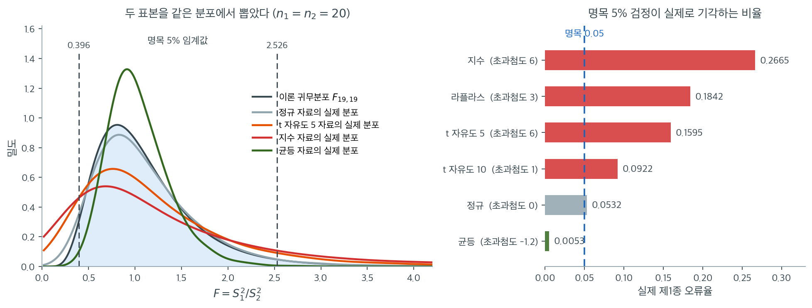

# 비정규성에 대한 민감도

두 분산을 비교하는 F 검정은 두 모집단이 모두 정규분포를 따른다고 가정한다. 흔히 쓰는 통계검정 가운데 F 검정은 분포 가정의 위반에 가장 민감한 축에 든다. 평균에 대한 $t$ 검정은 중심극한정리 덕분에 중간 정도의 비정규성에 상당히 로버스트하지만, 분산비 검정에는 그에 상응하는 보호장치가 없다. 이 절은 비정규성 아래에서 F 검정이 무너지는 이유를 설명하고 모의실험 증거를 요약한다.

## F 검정이 민감한 이유

F 검정통계량 $F = S_1^2 / S_2^2$이 $F_{n_1-1, n_2-1}$ 분포를 따르는 것은 두 표본이 모두 정규 모집단에서 왔을 때뿐이다. $S^2$의 정확한 분포는 처음 두 적률만이 아니라 바탕 분포의 모든 적률에 의존한다. 특히 (첨도와 관련된) 4차 중심적률이 결정적인 역할을 한다.

4차 중심적률이 $\mu_4 = E[(X - \mu)^4]$인 모집단에 대해 표본분산의 분산은

$$
\operatorname{Var}(S^2) = \frac{1}{n}\left(\mu_4 - \frac{n-3}{n-1}\sigma^4\right)
$$

정규분포에서는 $\mu_4 = 3\sigma^4$이므로 이 식이 $2\sigma^4/(n-1)$로 간단해진다. 초과첨도 $\gamma_2 = \mu_4/\sigma^4 - 3 > 0$인 두꺼운 꼬리 분포에서는 $S^2$의 분산이 부풀려지고, 그 결과 $F$의 실제 분포가 명목 $F_{n_1-1, n_2-1}$ 분포보다 두꺼운 꼬리를 갖게 된다.

!!! warning "첨도 효과"
    F 검정은 주로 **첨도**(두껍거나 얇은 꼬리)에 민감하며 치우침에는 상대적으로 덜 민감하다. 자유도가 작은 $t$ 분포처럼 대칭이면서 꼬리가 두꺼운 분포가, 꼬리는 정규에 가까우면서 중간 정도로 치우친 분포보다 F 검정을 더 심하게 왜곡할 수 있다.

    다만 아래 모의실험에서 보듯 치우침도 첨도 위에 **추가로** 왜곡을 더한다. 같은 $\gamma_2 = 6$이라도 대칭인 $t_5$보다 치우친 지수분포에서 왜곡이 훨씬 크다.

## 제1종 오류 팽창

모집단이 비정규이면 F 검정의 실제 제1종 오류율이 명목 유의수준 $\alpha$에서 크게 벗어날 수 있다. 왜곡의 방향과 크기는 첨도에 달려 있다.

- **두꺼운 꼬리 분포** ($\gamma_2 > 0$, 고첨): 실제 기각률이 $\alpha$를 넘는다. F 검정이 자유주의적이 되어 지나치게 자주 기각한다.
- **얇은 꼬리 분포** ($\gamma_2 < 0$, 저첨): 실제 기각률이 $\alpha$에 못 미친다. F 검정이 보수적이 되어 지나치게 드물게 기각한다.

다음 표는 $n_1 = n_2 = 20$, 명목 $\alpha = 0.05$에서 귀무가설 $H_0\colon \sigma_1^2 = \sigma_2^2$이 참일 때 F 검정의 모의실험 결과이다(반복 20,000회, 몬테카를로 오차 약 0.002).

| 분포 | 초과첨도 $\gamma_2$ | 왜도 | 실제 제1종 오류 |
|---|---|---|---|
| Uniform | $-1.2$ | 0 | **0.005** |
| Normal | 0 | 0 | 0.053 |
| $\chi^2_{20}$ | 0.6 | 0.63 | 0.073 |
| $t_{10}$ | 1 | 0 | 0.092 |
| $\text{Gamma}(4)$ | 1.5 | 1.0 | 0.111 |
| Laplace | 3 | 0 | 0.184 |
| $t_5$ | 6 | 0 | 0.160 |
| Exponential | 6 | 2.0 | **0.267** |

지수분포 자료에서 명목 5% 검정이 $H_0$ 아래에서 **26.7%의 확률로 기각한다.** 의도한 비율의 다섯 배가 넘는다.

반대 방향의 왜곡도 극적이다. 균등분포에서는 기각률이 $0.005$로 명목값의 10분의 1에 불과하다. 이 경우 검정이 사실상 아무것도 탐지하지 못한다.

표의 숫자가 어디서 오는지는 $F$ 통계량의 **실제 분포**를 그려 보면 바로 보인다. 아래 왼쪽 그림에서 두 표본은 언제나 같은 분포에서 뽑았으므로 $\sigma_1^2 = \sigma_2^2$이 정확히 성립한다. 검정은 $F$가 $F_{19,19}$(회색 곡선)를 따른다고 믿고 임계값 $0.396$과 $2.526$을 긋는다.



정규 자료(연회색)만이 회색 이론곡선과 겹친다. 지수분포 자료(빨강)의 실제 분포는 **훨씬 납작하고 넓게 퍼져** 있다. 봉우리가 낮아진 만큼 확률질량이 양쪽 꼬리로 흘러갔고, 그 꼬리가 임계선 바깥에 놓인다. 그래서 기각률이 $0.2665$까지 올라간다. $t_5$(주황)도 같은 방향으로 어긋나 $0.1595$다.

균등분포(초록)는 정반대다. 실제 분포가 기준분포보다 **좁다.** 꼬리가 임계선에 닿기도 전에 끝나 버리니 기각이 거의 일어나지 않는다. $0.0053$이라는 숫자가 그 결과다. 이것도 똑같이 심각한 고장이다. 크기가 명목값보다 작으면 "보수적이니 안전하다"고 말하기 쉽지만, 검정력을 그만큼 잃었다는 뜻이기도 하다.

오른쪽 막대를 초과첨도 순으로 정렬해 보면 규칙이 드러난다. 초과첨도 $-1.2$에서 $0.0053$, $0$에서 $0.0532$, $1$에서 $0.0922$, $3$에서 $0.1842$, $6$에서 $0.1595$와 $0.2665$. **첨도가 오류율을 거의 단조로 결정한다.**

같은 $\gamma_2 = 6$인 $t_5$와 지수분포가 $0.160$과 $0.267$로 갈리는 것을 치우침의 몫으로 읽기 쉽지만 그렇지 않다. **극한 오류율은 첨도만의 함수여서 두 분포가 같은 값 $0.3271$로 간다.** $n = 20$에서 갈라지는 것은 **수렴 속도**가 다르기 때문이다. 지수분포는 $n$을 키우면 $0.3245$까지 올라가 극한에 거의 닿는데, $t_5$는 $n = 2000$에서도 $0.2815$에 머문다. $t_5$는 8차 적률이 무한해서 이 근사의 바탕이 되는 중심극한 수렴이 극단적으로 느리다. 곧 치우침이 오류를 **더하는** 것이 아니라, $t_5$가 극한에 **늦게 닿는** 것이다.

여기서 기억할 것은 이 왜곡이 **표본을 키워도 사라지지 않는다**는 점이다. $n$이 커지면 $F$의 실제 분포도 $F_{19,19}$도 함께 1 근처로 좁아지지만, 둘의 **분산의 비**는 $(\gamma_2+2)/2$로 남는다(폭, 곧 표준편차의 비는 그 제곱근 $\sqrt{(\gamma_2+2)/2}$다). 카이제곱 검정에서 보았던 것과 같은 구조적 문제다.

### 재현 코드

<div class="exbox" markdown>

**보기 1.** <span class="diff easy" title="쉬움"></span> 모집단 모양에 따른 오류율. 여섯 모집단에서 $n_1 = n_2 = 20$ 인 두 표본을 **같은 분포**에서 뽑아($\sigma_1^2 = \sigma_2^2$ 이 정확히 참이다) 명목 $5\%$ F 검정의 실제 기각률을 $20{,}000$ 번씩 잰다.

**(1)** 5.3절이 유도한 극한 오류율 공식에 여섯 모집단의 첨도 $\beta_2$ 를 넣어 $n \to \infty$ 에서의 값을 구하시오. 첨도가 같은 두 모집단은 같은 극한값을 갖는가?

**(2)** $n = 20$ 의 모의실험 값이 그 극한값과 어긋난다. 식이 틀린 것인가, 아니면 $n = 20$ 이 작은 것인가. $n$ 을 키워 가며 판정하시오.

</div>

??? success "풀이"

    **(1) 극한 오류율은 첨도 하나로 정해진다.** 5.3절 [분산비의 표본분포(비정규)](../../ch05/applications/var_ratio_nonnormal.md)가 유도한 대로, $\log F$ 의 참 표준편차는 $\sqrt{(\beta_2-1)(1/n_1+1/n_2)}$ 인데 F 검정은 그것을 정규 가정의 $\sqrt{2(1/n_1+1/n_2)}$ 로 믿는다. 두 $\sqrt{1/n_1+1/n_2}$ 가 **약분되어 $n$ 이 사라지고**

    $$
    \text{실제 오류율} \;\longrightarrow\; 2\left[1 - \Phi\!\left(1.96\sqrt{\frac{2}{\beta_2-1}}\right)\right]
    $$

    만 남는다. 여기서 $\beta_2 = \gamma_2 + 3$ 은 (초과가 아닌) 첨도다. 여섯 모집단에 넣는다.

    | 모집단 | $\gamma_2$ | $\beta_2$ | $1.96\sqrt{2/(\beta_2-1)}$ | 극한 오류율 |
    |:---|---:|---:|---:|---:|
    | 균등 | $-1.2$ | 1.8 | 3.099 | 0.0019 |
    | 정규 | 0 | 3.0 | 1.960 | 0.0500 |
    | $t_{10}$ | 1 | 4.0 | 1.600 | 0.1095 |
    | 라플라스 | 3 | 6.0 | 1.240 | 0.2151 |
    | $t_5$ | 6 | 9.0 | 0.980 | 0.3271 |
    | 지수 | 6 | 9.0 | 0.980 | 0.3271 |

    **첨도가 같으면 극한값도 같다.** $t_5$ 와 지수는 왜도가 $0$ 과 $2$ 로 전혀 다른데도 $\beta_2$ 가 둘 다 $9$ 라 극한값이 $0.3271$ 로 같다. 이 식에는 왜도가 들어갈 자리가 아예 없기 때문이다. 정규에서 정확히 $0.05$ 가 나오는 것이 검산이다.

    **(2) 식도 맞고 $n = 20$ 이 작은 것이다.** 극한값은 $\log F$ 에 중심극한정리를 적용해 얻은 것이라 $n$ 이 충분히 커야 들어맞는다. $n = 20$ 에서는 아직 거기까지 가지 않았고, **$n$ 을 키우면 극한값 쪽으로 간다**(정규만 제자리에 머문다). 확인한다.

    ```python
    import numpy as np
    from scipy import stats

    # 두 표본을 늘 같은 분포에서 뽑으므로 분산은 참으로 같다. 그러니 아래
    # 비율은 모두 0.05 여야 옳다. 실제로는 정규에서 벗어날수록 크게 어긋난다.
    # 꼬리가 두꺼운 t(5)·지수에서는 부풀고, 꼬리가 얇은 균등에서는 오히려 줄어든다.
    rng = np.random.default_rng(1)
    n, R, alpha = 20, 20000, 0.05

    cases = [
        ("Normal",      lambda: rng.normal(0, 1, n)),
        ("t(10)",       lambda: rng.standard_t(10, n)),
        ("t(5)",        lambda: rng.standard_t(5, n)),
        ("Exponential", lambda: rng.exponential(1, n)),
        ("Uniform",     lambda: rng.uniform(0, 1, n)),
        ("Laplace",     lambda: rng.laplace(0, 1, n)),
    ]

    for name, gen in cases:
        rej = 0
        for _ in range(R):
            F = gen().var(ddof=1) / gen().var(ddof=1)
            p = 2 * min(stats.f.cdf(F, n - 1, n - 1),
                        stats.f.sf(F, n - 1, n - 1))
            rej += (p < alpha)
        print(f"{name:>12}: {rej / R:.4f}")
    ```

    출력:

    ```
          Normal: 0.0532
           t(10): 0.0922
            t(5): 0.1595
     Exponential: 0.2665
         Uniform: 0.0053
         Laplace: 0.1842
    ```

    위 표의 값이 재현된다. 정규 $0.053$은 명목값에 맞지만 지수분포는 $0.267$, 균등분포는 $0.005$로 크게 벗어난다.

    이제 $n$ 을 키워 극한값으로 가는지 본다. 벡터로 바꾸어 돌리되, $n = 2000$ 까지 가므로 반복은 $2000$ 회로 줄이고 **몬테카를로 오차를 함께 적는다.**

    ```python
    import numpy as np
    from scipy import stats

    z = stats.norm.ppf(0.975)


    def limit_size(beta2):
        """5.3 절의 극한 오류율. beta2 는 (초과가 아닌) 첨도다."""
        return 2 * (1 - stats.norm.cdf(z * np.sqrt(2 / (beta2 - 1))))


    rng = np.random.default_rng(7)
    R = 2000                       # 반복이 작으므로 몬테카를로 오차를 함께 적는다
    cases = [
        ("Normal",      3.0,  lambda s: rng.normal(0, 1, s)),
        ("t(10)",       4.0,  lambda s: rng.standard_t(10, s)),
        ("t(5)",        9.0,  lambda s: rng.standard_t(5, s)),
        ("Exponential", 9.0,  lambda s: rng.exponential(1, s)),
        ("Uniform",     1.8,  lambda s: rng.uniform(0, 1, s)),
        ("Laplace",     6.0,  lambda s: rng.laplace(0, 1, s)),
    ]

    print(f"{'n':>6}" + "".join(f"{nm:>13}" for nm, _, _ in cases))
    for n in (20, 100, 500, 2000):
        d = stats.f(n - 1, n - 1)
        lo, hi = d.ppf([0.025, 0.975])
        row = f"{n:>6}"
        for _, _, gen in cases:
            F = gen((R, n)).var(axis=1, ddof=1) / gen((R, n)).var(axis=1, ddof=1)
            row += f"{np.mean((F < lo) | (F > hi)):>13.4f}"
        print(row)
    print(f"{'극한':>6}" + "".join(f"{limit_size(b2):>13.4f}" for _, b2, _ in cases))

    print(f"\n반복 {R}회에서의 몬테카를로 표준오차")
    for p in (0.05, 0.002, 0.33):
        print(f"  참값이 {p:.3f} 근처면 SE = {np.sqrt(p * (1 - p) / R):.4f}")
    ```

    출력:

    ```text
         n       Normal        t(10)         t(5)  Exponential      Uniform      Laplace
        20       0.0455       0.0890       0.1675       0.2720       0.0100       0.1670
       100       0.0590       0.1055       0.2130       0.3115       0.0040       0.2055
       500       0.0520       0.1210       0.2550       0.3220       0.0030       0.2265
      2000       0.0415       0.1165       0.2815       0.3245       0.0020       0.2175
        극한       0.0500       0.1095       0.3271       0.3271       0.0019       0.2151

    반복 2000회에서의 몬테카를로 표준오차
      참값이 0.050 근처면 SE = 0.0049
      참값이 0.002 근처면 SE = 0.0010
      참값이 0.330 근처면 SE = 0.0105
    ```

    **다섯 모집단이 극한값으로 수렴한다.** 정규는 $n$ 과 무관하게 $0.05$ 둘레를 맴돌고($0.0415$–$0.0590$, 표준오차 $0.0049$ 이니 모두 $\pm 2$ SE 안이다), $t_{10}$ 은 $0.0890 \to 0.1165$ 로 극한 $0.1095$ 에, 라플라스는 $0.1670 \to 0.2175$ 로 $0.2151$ 에, 지수는 $0.2720 \to 0.3245$ 로 $0.3271$ 에, 균등은 $0.0100 \to 0.0020$ 으로 $0.0019$ 에 다가간다. **공식이 틀린 것이 아니라 $n = 20$ 이 극한과 멀 뿐이었다.**

    반복이 $2000$ 회뿐이라 각 칸의 흔들림이 작지 않다. $0.33$ 근처에서 표준오차가 $0.0105$ 이므로 지수 열의 $0.3245$ 와 극한 $0.3271$ 의 차이는 **읽을 수 없는 크기**다. 균등 열의 $0.0020$ 은 $2000$ 번 중 네 번 기각했다는 뜻이라 더 거칠다. 그래도 각 열이 $n$ 과 함께 한 방향으로 움직이는 것은 흔들림보다 훨씬 큰 변화라 분명하게 읽힌다.

    $t_5$ 만 더디다. $n = 2000$ 에서도 $0.2815$ 로 극한 $0.3271$ 에 못 미치며, 그 차 $0.046$ 은 표준오차 $0.010$ 의 네 배가 넘으므로 **잡음으로 설명되지 않는다.** 까닭은 $t_5$ 의 **적률이 간신히 존재하기** 때문이다. $t_\nu$ 는 $\nu$ 차 적률부터 발산하므로 $t_5$ 에는 $4$ 차 적률($\beta_2 = 9$)까지만 있고 그 위가 없다. $\operatorname{Var}(S^2)$ 의 델타근사를 정당화하는 중심극한정리가 네 제곱의 평균에 걸려 있는데, 그 항의 분산이 $8$ 차 적률을 요구하므로 **$t_5$ 에서는 애초에 무한대**다. 수렴은 하되 $1/\sqrt n$ 보다 훨씬 느리다. 같은 $\beta_2 = 9$ 인 지수는 모든 적률이 존재해 $n = 500$ 에서 이미 극한에 거의 닿는다.

    **이것이 이 절의 핵심이다.** 평균에 대한 $t$ 검정은 $n$ 을 키우면 중심극한정리가 비정규성을 씻어 주지만, **분산비 검정에는 그런 보호가 없다.** 임계값도 $1/\sqrt n$ 로 줄고 실제 산포도 $1/\sqrt n$ 로 줄어 둘의 비가 처음부터 끝까지 $\sqrt{(\beta_2-1)/2}$ 로 고정되기 때문이다. 표를 세로로 읽으면 $t_5$ 열이 $0.168 \to 0.282$ 로, 지수 열이 $0.272 \to 0.325$ 로 **올라간다.** 표본을 키우는 것이 해결책이 아니라 악화 요인이다.

## 모의실험이 보여주는 패턴

광범위한 모의실험 연구(Box, 1953; Markowski and Markowski, 1990)와 위 결과가 함께 확인해 주는 패턴은 다음과 같다.

1. **중간 정도의 비정규성도 문제가 된다.** 초과첨도가 1~2 정도인 가벼운 이탈만으로도 제1종 오류율이 눈에 띄게 부풀려진다($\gamma_2 = 1$에서 이미 0.092로 명목값의 두 배).
2. **첨도가 지배적 요인이다.** 왜곡은 첨도에 따라 급격히 커진다. $\gamma_2$가 0.6, 1, 1.5, 3으로 커질 때 크기가 0.073, 0.092, 0.111, 0.184로 단조증가한다.
3. **치우침도 첨도 위에 왜곡을 더한다.** 같은 $\gamma_2 = 6$에서 대칭인 $t_5$가 0.160인 반면 치우친 지수분포는 0.267이다. 첨도가 주된 요인이라는 것은 맞지만, 치우침을 무해하다고 볼 수는 없다.
4. **표본크기를 키우면 오히려 나빠진다.** $t$ 검정과 달리 표본크기를 늘려도 F 검정의 비정규성 민감도가 줄지 않는다. 아래에서 보듯 오히려 **악화된다**.

### 표본크기의 효과

$n$을 키우면서 같은 실험을 반복하면(반복 10,000회)

| $n$ | Normal | $t_5$ | Exponential |
|---|---|---|---|
| 10 | 0.049 | 0.127 | 0.228 |
| 20 | 0.049 | 0.168 | 0.270 |
| 50 | 0.048 | 0.195 | 0.295 |
| 100 | 0.054 | 0.223 | 0.308 |
| 500 | 0.049 | 0.262 | 0.318 |

정규 자료에서는 어떤 $n$에서도 0.05가 유지된다. 그러나 $t_5$에서는 크기가 $n$과 함께 **커져서** $n = 500$에서 0.262에 이른다.

이유는 두 가지가 결합되어 있다. 첫째, $F$의 참 분산은 $\operatorname{Var}(S^2)$의 팽창 인자 $(\gamma_2+2)/2$만큼 명목값보다 크며 이 비율은 $n$에 의존하지 않는다. 둘째, $n$이 커지면 명목 $F$ 분포는 1 주위로 수축하지만 실제 분포는 그보다 느리게 수축한다. 그래서 상대적 불일치가 오히려 커진다.

**표본을 늘리는 것은 해결책이 아니라 문제를 키운다.** 이것이 F 검정에 관해 기억해야 할 가장 중요한 사실이다.

## t 검정과의 비교

$t$ 검정과의 대비가 교훈적이다. 일표본 $t$ 검정은

$$
T = \frac{\bar{X} - \mu}{S / \sqrt{n}} \sim t_{n-1}
$$

중심극한정리가 $n$이 어느 정도만 되면 $\bar{X}$를 근사적으로 정규로 만들어 주므로 분자가 잘 작동한다. 분모 $S$는 대수의 법칙에 의해 $\sigma$로 수렴하므로 전체 통계량이 근사적으로 $t$ 분포를 유지한다.

F 검정에서는 분자와 분모가 모두 표본분산이다. 어느 쪽도 중간 표본크기에서 중심극한정리 같은 결과의 혜택을 받지 못한다. $S^2$의 분포는 모집단의 4차 적률로 결정되고, 비 $S_1^2/S_2^2$은 양쪽 모두에서 오는 왜곡을 물려받는다.

## F 검정을 피해야 할 때

다음 경우에는 F 검정을 피해야 한다.

- 정규성 검정(Shapiro-Wilk, Anderson-Darling, Q-Q 그림 검토)이 어느 한 표본에서라도 정규성을 기각할 때
- 자료가 꼬리가 두꺼운 분포에서 온다고 알려져 있을 때(금융 수익률, 소득 자료, 생존시간)
- 자료에 이상점이 있을 때. 이상점은 표본분산과 첨도를 동시에 부풀린다
- 표본크기가 작아 정규성을 신뢰성 있게 평가할 수 없을 때

## 권장 대안

정규성이 의심스러울 때 다음 검정들이 제1종 오류율을 더 잘 조절한다.

| 검정 | 로버스트성 | 정규성 아래 검정력 | 절 |
|---|---|---|---|
| Levene 검정 | 좋음 | F 검정보다 약간 낮음 | 15.5 |
| Brown-Forsythe 검정 | 매우 좋음 | Levene보다 약간 낮음 | 15.5 |
| Fligner-Killeen 검정 | 뛰어남 | Levene보다 낮음 | 15.5 |
| 붓스트랩 검정 | 좋음~뛰어남 | 구현에 따라 다름 | 15.6 |

!!! tip "실무 권고"
    형식적 검정과 시각적 검토로 정규성이 확인되지 않았다면 F 검정보다 Brown-Forsythe 검정을 선호하라. Brown-Forsythe 검정은 폭넓은 분포에서 명목 제1종 오류율을 유지하면서 자료가 실제로 정규일 때도 합리적인 검정력을 유지한다.


## 연습문제

<div class="drillbox" markdown>

**연습문제 1.** <span class="diff hard" title="어려움"></span>
$\operatorname{Var}(S^2) = \frac{1}{n}\left(\mu_4 - \frac{n-3}{n-1}\sigma^4\right)$가 정규분포에서 $2\sigma^4/(n-1)$로 환원됨을 보여라.

</div>

??? success "풀이"
    정규분포에서 $\mu_4 = 3\sigma^4$이므로

    $$
    \operatorname{Var}(S^2) = \frac{1}{n}\left(3\sigma^4 - \frac{n-3}{n-1}\sigma^4\right) = \frac{\sigma^4}{n}\cdot\frac{3(n-1) - (n-3)}{n-1}.
    $$

    분자를 정리하면

    $$
    3(n-1) - (n-3) = 3n - 3 - n + 3 = 2n
    $$

    이므로

    $$
    \operatorname{Var}(S^2) = \frac{\sigma^4}{n}\cdot\frac{2n}{n-1} = \frac{2\sigma^4}{n-1}.
    $$

    **교차검증.** 정규성 아래에서 $(n-1)S^2/\sigma^2 \sim \chi^2_{n-1}$이고 $\operatorname{Var}(\chi^2_{n-1}) = 2(n-1)$이므로

    $$
    \frac{(n-1)^2}{\sigma^4}\operatorname{Var}(S^2) = 2(n-1) \implies \operatorname{Var}(S^2) = \frac{2\sigma^4}{n-1}.
    $$

    두 경로가 일치한다.

    일반 분포에서 $\mu_4 = \sigma^4(\gamma_2+3)$을 대입하면 큰 $n$에서

    $$
    \operatorname{Var}(S^2) \approx \frac{\sigma^4(\gamma_2 + 2)}{n}
    $$

    이 되어 15.1절의 결과를 회복한다. 팽창 인자가 $(\gamma_2+2)/2$이다. $\square$

<div class="drillbox" markdown>

**연습문제 2.** <span class="diff med" title="중간"></span>
본문 표에서 $t_5$($\gamma_2 = 6$, 대칭)의 크기가 0.160인 반면 지수분포($\gamma_2 = 6$, 왜도 2)는 0.267이다. 첨도가 같은데 왜 다른지 설명하라.

</div>

??? success "풀이"
    첨도가 같아도 F 검정의 크기가 다른 이유는 여러 층위가 있다.

    **1. 유한표본에서 표본첨도의 거동이 다르다.** $t_5$는 네 번째 적률이 존재하지만 여덟 번째 적률이 없으므로 표본첨도 $g_2$의 분산이 무한대이다. 대부분의 $t_5$ 표본은 실제로는 $\gamma_2 = 6$보다 훨씬 작은 표본첨도를 보이고, 드물게 매우 큰 값이 나온다. 곧 **전형적인 $t_5$ 표본은 이론적 첨도가 시사하는 것보다 정규에 가깝다.**

    지수분포는 모든 적률이 존재하므로 표본첨도가 안정적으로 6 근처에 모인다. 그래서 왜곡이 표본마다 일관되게 나타난다.

    **2. 치우침이 $\bar{X}$와 $S^2$의 상관을 만든다.** 15.2절 연습문제에서 보았듯 $\bar{X}$와 $S^2$의 독립성은 정규분포에만 특유하다. 오른쪽으로 치우친 분포에서는 두 통계량이 양의 상관을 가지며, 이 상관이 $S^2$의 표집분포를 더욱 오른쪽으로 치우치게 만든다.

    **3. 지수분포는 유계이다.** $X > 0$이라는 제약이 $S^2$의 분포에 추가적인 비대칭을 들여온다.

    **교훈.** "F 검정은 첨도에만 민감하다"는 서술은 1차 근사에 불과하다. 실무에서는 **왜도와 첨도를 모두 확인**해야 하며, 어느 하나라도 0에서 멀면 F 검정을 피해야 한다. $\square$

<div class="drillbox" markdown>

**연습문제 3.** <span class="diff med" title="중간"></span>
균등분포에서 F 검정의 크기가 0.005로 극단적으로 작다. 이것이 왜 "안전한" 것이 아닌지 설명하라.

</div>

??? success "풀이"
    보수적인 검정은 제1종 오류 측면에서는 안전해 보인다. 명목 5%보다 훨씬 적게 잘못 기각하기 때문이다. 그러나 두 가지 이유로 문제가 있다.

    **1. 검정력이 붕괴한다.** 제1종 오류와 제2종 오류는 맞바꿈 관계이다. 크기가 0.005라는 것은 검정이 실질적으로 $\alpha = 0.005$ 수준에서 작동한다는 뜻이고, 그만큼 참 분산 차이를 탐지할 능력이 떨어진다.

    구체적으로 균등분포 자료에서 참 분산비가 2배여도 명목 5% F 검정이 이를 탐지할 확률은 정규 자료의 경우보다 훨씬 낮다. 실제 존재하는 차이를 놓치게 된다.

    **2. 보고된 유의수준이 거짓이다.** "5% 수준에서 검정했다"고 보고하지만 실제 수준은 0.5%이다. 다른 연구와 비교하거나 메타분석에 포함할 때 오도한다. $p$값 자체도 의미가 왜곡된다.

    **3. 방향을 미리 알 수 없다.** 실무에서 자료의 첨도가 양인지 음인지 확신할 수 없다면, 검정이 자유주의적일지 보수적일지도 모른다. 크기가 통제되지 않는다는 사실 자체가 문제이며, 어느 방향인지는 부차적이다.

    올바른 대응은 어느 방향의 왜곡이든 피하는 것, 곧 크기가 안정적인 로버스트 검정을 쓰는 것이다. $\square$

<div class="drillbox" markdown>

**연습문제 4.** <span class="diff med" title="중간"></span>
표본크기를 키우면 F 검정의 크기 왜곡이 오히려 **커진다**는 본문의 관찰을 설명하라. 이것이 대부분의 통계적 직관과 어떻게 어긋나는가?

</div>

??? success "풀이"
    통상적인 직관은 "$n$을 키우면 점근이론이 잘 맞고 근사가 좋아진다"는 것이다. F 검정에서는 이 직관이 통하지 않는다.

    **왜 그런가.** $H_0$ 아래에서 $\ln F = \ln S_1^2 - \ln S_2^2$을 생각하자. 델타 방법에 의해 큰 $n$에서

    $$
    \operatorname{Var}(\ln S_i^2) \approx \frac{\operatorname{Var}(S_i^2)}{\sigma^4} \approx \frac{\gamma_2 + 2}{n},
    $$

    이므로

    $$
    \operatorname{Var}(\ln F) \approx \frac{2(\gamma_2 + 2)}{n}.
    $$

    한편 명목 $F_{n-1,n-1}$ 분포에서는 $\operatorname{Var}(\ln F) \approx 4/n$이다($\gamma_2 = 0$ 대입).

    두 값의 **비**는

    $$
    \frac{2(\gamma_2+2)/n}{4/n} = \frac{\gamma_2 + 2}{2}
    $$

    로 $n$에 전혀 의존하지 않는다. 곧 실제 산포와 명목 산포의 불일치가 $n$을 키워도 사라지지 않는다.

    **그런데 왜 크기가 *커지는가*?** 두 분포 모두 $n$이 커지면 좁아지지만 비율은 고정되어 있다. 그런데 $n$이 작을 때는 두 분포 모두 넓어서 꼬리가 두툼하고 서로 상당 부분 겹친다. $n$이 커지면 명목 분포가 급격히 좁아지는데 실제 분포는 그보다 $\sqrt{(\gamma_2+2)/2}$배 넓은 상태를 유지하므로, 명목 임계값 밖으로 나가는 질량의 **비율**이 커진다.

    구체적으로 $\ln F$가 근사적으로 정규라고 하면 실제 크기는

    $$
    2\Phi\!\left(-1.96\sqrt{\frac{2}{\gamma_2+2}}\right)
    $$

    로 수렴한다. $\gamma_2 = 6$이면 $2\Phi(-1.96 \times 0.5) = 2\Phi(-0.98) = 0.327$이다. 모의실험에서 $t_5$가 $n = 500$에서 0.262, 지수분포가 0.318로 이 극한값에 접근하고 있다.

    **핵심 교훈.** 이는 "일치성 없는 검정"의 사례이다. 자료를 아무리 모아도 절차가 옳아지지 않는다. 잘못된 기준분포를 쓰고 있다는 근본적 문제는 표본크기로 해결되지 않으며, 오히려 큰 표본에서 잘못된 결론을 더 확신 있게 내리게 만든다. $\square$

---

## 정리하며

$F$ 검정이 **왜 그렇게 취약한지**가 이 절의 핵심이다.

- **$S^2$ 의 분포가 4차적률에 의존한다.** 평균의 분포는 처음 두 적률로 결정되지만 분산의 분포는 그렇지 않으며, **첨도가 직접 들어온다.**
- **$t$ 검정에 해당하는 보호장치가 없다.** 중심극한정리는 표본평균을 정규로 만들어 주지만 표본분산에는 그런 구실을 하지 않는다.
- **그 결과가 제1종 오류율의 폭증이다.** 꼬리가 조금만 두꺼워도 명목 $5\%$ 가 $20\%$ 를 넘는 일이 흔하다. **분산이 실제로 같은데도 기각한다.**
- **표본을 늘려도 나아지지 않는다.** 오히려 잘못된 분포를 더 정밀하게 따라가므로 문제가 유지된다.
- **결론은 명확하다.** 정규성을 확신할 수 없으면 $F$ 검정을 쓰지 않는다. 레빈 계열로 간다.

다음 절 **$F$ 검정 (코드)** 로 넘어간다.
