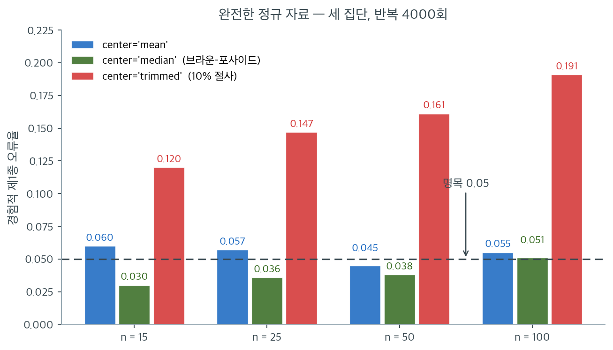

# Brown-Forsythe 검정

Levene 검정은 각 관측값을 집단평균으로부터의 절대편차로 바꾼 뒤 그 편차에 분산분석을 수행한다. Brown과 Forsythe(1974)는 단 하나이지만 영향력 있는 변경을 제안했다. 절대편차의 중심으로 집단평균 대신 집단 **중앙값**을 쓰는 것이다. 중앙값은 평균과 달리 극단값에 끌려가지 않으므로, 이 수정이 치우친 분포와 이상점에 대한 로버스트성을 크게 높인다.

## Levene 검정으로부터의 수정

Levene의 원래 검정에서 변환된 관측값은

$$
Z_{ij}^{(\text{Levene})} = |X_{ij} - \bar{X}_i|
$$

Brown-Forsythe 검정에서는

$$
Z_{ij}^{(\text{BF})} = |X_{ij} - \tilde{X}_i|
$$

여기서 $\tilde{X}_i$는 집단 $i$의 중앙값이다. 검정통계량은 $Z_{ij}^{(\text{BF})}$ 값에 대해 계산한 표준 일원분산분석 $F$ 통계량이다.

$$
W^* = \frac{(N - k) \sum_{i=1}^{k} n_i (\bar{Z}_i^* - \bar{Z}^*)^2}{(k - 1) \sum_{i=1}^{k} \sum_{j=1}^{n_i} (Z_{ij}^* - \bar{Z}_i^*)^2}
$$

여기서 $Z_{ij}^* = Z_{ij}^{(\text{BF})}$이고 $\bar{Z}_i^*$는 집단 $i$의 변환값 평균, $\bar{Z}^*$는 전체평균이다.

$H_0\colon \sigma_1^2 = \cdots = \sigma_k^2$ 아래에서 $W^*$는 근사적으로 $F_{k-1, N-k}$를 따른다.

## 중앙값이 로버스트성을 높이는 이유

평균 $\bar{X}_i$는 이상점에 민감하다. 극단값 하나가 평균을 크게 이동시키고, 그러면 그 집단의 **모든** 관측값의 절대편차가 부풀려진다. 이 왜곡이 검정통계량으로 전파되어 거짓 기각을 일으킬 수 있다.

중앙값 $\tilde{X}_i$의 붕괴점(breakdown point)은 50%이다. 관측값의 절반까지 오염되어야 중앙값이 임의로 영향받는다는 뜻이다. 자료가 치우쳐 있을 때 중앙값은 평균보다 자료의 다수 쪽에 가까이 놓이므로, 다수 관측값의 산포를 더 충실히 반영하는 편차를 만들어 낸다.

!!! danger "SciPy의 `center='trimmed'`는 쓰지 말라"
    일부 Levene 검정 구현은 중심으로 평균, 중앙값, 10% 절사평균의 세 가지를 제공한다. 중앙값 판이 Brown-Forsythe 검정이다. 절사평균이 검정력(평균 쪽)과 로버스트성(중앙값 쪽) 사이의 절충이라고 소개되는 경우가 많다.

    그러나 **SciPy의 `stats.levene(..., center='trimmed')`는 제1종 오류율이 심각하게 부풀려진다.** 완전한 정규 자료에서 측정한 경험적 크기는 다음과 같다(세 집단, 반복 4,000회, 명목 $\alpha = 0.05$).

    | $n$ | `mean` | `median` | `trimmed` (10%) |
    |---|---|---|---|
    | 15 | 0.060 | 0.030 | **0.120** |
    | 25 | 0.057 | 0.036 | **0.147** |
    | 50 | 0.045 | 0.038 | **0.161** |
    | 100 | 0.055 | 0.051 | **0.191** |

    정규 자료인데도 절사판의 크기가 명목값의 2.4~3.8배이고 $n$이 커질수록 나빠진다. SciPy가 편차를 계산하기 전에 자료를 잘라내므로 가장 큰 편차들이 제거되어 F 통계량의 분모(집단내 제곱합)가 과도하게 줄어드는데, $F$ 기준분포는 이 선택 효과를 보정하지 않기 때문이다.

    **범용 기본값으로는 중앙값(`center='median'`)을 쓰라.**



표를 그림으로 옮기면 세 막대의 운명이 갈리는 것이 한눈에 들어온다. 파랑(평균)은 네 표본크기에서 $0.045 \sim 0.060$으로 명목선 주위를 맴돈다. 초록(중앙값)은 $0.030 \sim 0.051$로 명목선 **아래**에 머문다. 약간 보수적이라는 뜻이고, 그 대가로 검정력을 조금 내주지만 거짓 양성을 만들지는 않는다.

빨강(절사평균)은 완전히 다른 궤적을 그린다. $n = 15$에서 이미 $0.120$이고, 표본이 커질수록 $0.147 \to 0.161 \to 0.191$로 **올라간다.** 이것이 결정적인 단서다. 보통의 근사 오차라면 $n$이 커질수록 줄어들어야 한다. 커진다는 것은 오차가 아니라 **구조적 편향**이 있다는 뜻이다.

원인은 SciPy가 편차를 계산하기 **전에** 자료의 양 끝 10%를 잘라 버리는 데 있다. 잘려 나가는 것은 집단 중심에서 가장 먼 관측값들, 곧 가장 큰 절대편차를 만들었을 값들이다. 그러면 $F$ 통계량의 분모인 집단내 제곱합이 실제보다 작아지고, 분모가 작아지면 통계량이 커진다. 기준분포 $F_{k-1, N-k}$는 이 선택 효과를 전혀 모르므로 임계값이 너무 낮게 잡힌다. 표본이 클수록 잘려 나가는 관측값의 절대 개수가 늘어 편향이 더 심해진다.

**실무 규칙은 단순하다.** 이 자료가 완전한 정규분포였다는 점을 기억하라. 가장 유리한 조건에서도 명목값의 세 배로 기각하는 검정이라면, 조건이 나빠지는 실제 자료에서 쓸 이유가 없다. `stats.levene`의 기본값인 `center='median'`을 그대로 두는 것이 가장 안전하다.

## 가설과 판정규칙

$$
H_0\colon \sigma_1^2 = \sigma_2^2 = \cdots = \sigma_k^2
$$

$$
H_1\colon \sigma_i^2 \neq \sigma_j^2 \text{ (적어도 한 쌍의)} i \neq j
$$

유의수준 $\alpha$에서 $W^* > F_{1-\alpha,\, k-1,\, N-k}$이면 $H_0$을 기각한다.

<div class="exbox" markdown>

**보기 1.** <span class="diff easy" title="쉬움"></span> 세 집단의 Brown-Forsythe 검정. 세 집단을 생각하자.

| 집단 1 | 집단 2 | 집단 3 |
|---|---|---|
| 8, 10, 12, 9, 11 | 5, 30, 18, 22, 15 | 14, 16, 15, 17, 14 |

</div>

??? success "풀이"
    **1단계.** 집단중앙값을 계산한다.

    - $\tilde{X}_1 = 10$, $\tilde{X}_2 = 18$, $\tilde{X}_3 = 15$

    **2단계.** 중앙값으로부터의 절대편차를 계산한다.

    | 집단 1 | 집단 2 | 집단 3 |
    |---|---|---|
    | 2, 0, 2, 1, 1 | 13, 12, 0, 4, 3 | 1, 1, 0, 2, 1 |

    **3단계.** 편차의 집단평균을 계산한다.

    - $\bar{Z}_1^* = 1.20$, $\bar{Z}_2^* = 6.40$, $\bar{Z}_3^* = 1.00$

    **4단계.** 전체평균은 $\bar{Z}^* = (1.20 + 6.40 + 1.00)/3 = 2.867$이다.

    **5단계.** 이 편차들에 분산분석 공식을 적용해 $W^*$를 계산하고 $F_{0.95,\, 2,\, 12} = 3.885$와 비교한다.

<div class="exbox" markdown>

**보기 2.** <span class="diff easy" title="쉬움"></span> Brown-Forsythe 검정과 세 방법 비교. 보기 1 의 세 집단에 중앙값 중심·평균 중심·Bartlett 을 모두 적용한다.

**(1)** 세 집단의 평균과 중앙값을 구해 **두 중심이 갈리는 집단이 하나뿐**임을 확인하고, 그로부터 두 Levene 판본의 $W$ 가 왜 소수 셋째 자리에서만 다를지 예측하시오. 모든 집단에서 두 중심이 같다면 두 $W$ 가 **정확히** 같아야 함도 보이시오.

**(2)** Bartlett 통계량을 **정의대로 손으로 조립**해 SciPy 와 맞추고, 그 $p$ 값이 로버스트 검정의 $p$ 값보다 백 배 작은 까닭을 두 통계량이 보는 **신호와 잡음**에서 찾으시오.

</div>

??? success "풀이"

    **(1) 두 중심이 갈리는 집단을 찾는다.** 손으로 더해 보면 된다.

    | 집단 | 자료 | 평균 | 중앙값 |
    |:---|:---|---:|---:|
    | 1 | $8, 10, 12, 9, 11$ | $50/5 = 10.0$ | $10$ |
    | 2 | $5, 30, 18, 22, 15$ | $90/5 = 18.0$ | $18$ |
    | 3 | $14, 16, 15, 17, 14$ | $76/5 = 15.2$ | $15$ |

    **집단 1 과 2 에서는 평균과 중앙값이 완전히 같고, 집단 3 에서만 $0.2$ 어긋난다.** 집단 1 은 $\{8,9,10,11,12\}$ 로 대칭이고, 집단 2 는 $5$ 와 $30$ 이 중앙값 $18$ 양쪽에서 $-13$ 과 $+12$ 로 거의 맞물려 상쇄된다. 집단 3 만 $14$ 가 두 번 나와 평균이 중앙값보다 조금 위로 올라간다.

    **그러므로 두 판본의 $Z$ 는 열다섯 개 가운데 다섯 개만, 그것도 $0.2$ 씩만 다르다.** 집단 1·2 의 열 개는 글자 그대로 같은 수다. 분자도 분모도 거의 같은 값으로 조립되니 $W$ 가 소수 셋째 자리에서만 갈릴 것이다.

    **모든 집단에서 두 중심이 같다면 정확히 같다.** 이것은 어림이 아니라 항등식이다. $\bar X_i = \tilde X_i$ 가 모든 $i$ 에서 성립하면

    $$
    Z_{ij}^{(\text{Levene})} = \lvert X_{ij} - \bar X_i\rvert = \lvert X_{ij} - \tilde X_i\rvert = Z_{ij}^{(\text{BF})}
    $$

    로 **입력 자료 자체가 같아진다.** 두 검정은 그 뒤로 똑같은 일원분산분석을 하므로 $W = W^*$ 다. 두 판본의 차이는 통계량의 꼴에 있지 않고 오직 **중심의 추정값에** 있다는 뜻이다.

    **(2) Bartlett 통계량의 꼴.** 합동분산을 $s_p^2 = \sum_i \nu_i s_i^2 / \sum_i \nu_i$ ($\nu_i = n_i - 1$) 이라 쓰면

    $$
    T = \frac{\bigl(\sum_i \nu_i\bigr)\ln s_p^2 - \sum_i \nu_i \ln s_i^2}{C},
    \qquad
    C = 1 + \frac{1}{3(k-1)}\left[\sum_i \frac{1}{\nu_i} - \frac{1}{\sum_i \nu_i}\right]
    $$

    이고 $H_0$ 아래에서 $T \;\dot\sim\; \chi^2_{k-1}$ 이다. 여기서 $\nu_i = 4$, $\sum \nu_i = 12$, $k = 3$ 이므로

    $$
    C = 1 + \frac{1}{6}\left[\frac34 - \frac1{12}\right] = 1 + \frac{1}{6}\cdot\frac23 = \frac{10}{9} = 1.111111
    $$

    이다. **$T$ 가 로그분산의 산포를 재고 있다는 것이 요점이다.** 산술평균의 로그와 로그의 가중평균의 차이이므로 산술–기하 평균 부등식에 의해 분자가 늘 음이 아니고, 분산들이 흩어질수록 커진다.

    **확인한다.**

    ```python
    import numpy as np
    from scipy import stats

    # 2번 집단만 유난히 퍼져 있다. 5 와 30 처럼 멀리 떨어진 값이 섞여 있어
    # 평균 중심 방법이 흔들리기 좋은 자료다.
    group1 = [8, 10, 12, 9, 11]
    group2 = [5, 30, 18, 22, 15]
    group3 = [14, 16, 15, 17, 14]

    print("variances:", [round(np.var(g, ddof=1), 2)
                         for g in (group1, group2, group3)])

    # (1) 어느 집단에서 평균과 중앙값이 갈리는가.
    print(f"\n{'집단':>5}{'평균':>9}{'중앙값':>9}{'차':>8}")
    for i, g in enumerate((group1, group2, group3), start=1):
        a = np.array(g, dtype=float)
        print(f"{i:>5}{a.mean():>9.2f}{np.median(a):>9.2f}{a.mean() - np.median(a):>8.2f}")

    # Brown-Forsythe 는 각 값에서 제 집단의 중앙값을 뺀 절대편차에 분산분석을
    # 돌린다. 중심을 평균이 아니라 중앙값으로 잡는 것이 전부인데, 그 한 가지
    # 차이로 치우친 자료와 이상치에 훨씬 잘 버틴다.
    stat, p_value = stats.levene(group1, group2, group3, center='median')
    print(f"\nBrown-Forsythe W*:      {stat:.4f}, p = {p_value:.4f}")

    # 원래 Levene 은 평균을 중심으로 쓴다. 이상치에 끌려간다.
    s_m, p_m = stats.levene(group1, group2, group3, center='mean')
    print(f"Levene (mean-centered): {s_m:.4f}, p = {p_m:.4f}")

    # Bartlett 은 정규성을 전제하므로 이런 자료에서 가장 많이 어긋난다.
    s_b, p_b = stats.bartlett(group1, group2, group3)
    print(f"Bartlett:               {s_b:.4f}, p = {p_b:.6f}")

    # 집단 3 의 다섯째 값만 14 -> 13 으로 바꾸면 세 집단 모두 평균 = 중앙값이 된다.
    group3b = [14, 16, 15, 17, 13]
    print(f"\n집단 3 을 {group3b} 로 바꾸면 "
          f"평균 {np.mean(group3b):.1f} = 중앙값 {np.median(group3b):.1f}")
    a = stats.levene(group1, group2, group3b, center='median')[0]
    b = stats.levene(group1, group2, group3b, center='mean')[0]
    print(f"  W*(중앙값) = {a:.12f}")
    print(f"  W (평균)   = {b:.12f}   차 = {abs(a - b):.2e}")

    # (2) Bartlett 통계량을 정의대로 조립한다.
    groups = [np.array(g, dtype=float) for g in (group1, group2, group3)]
    nu = np.array([len(g) - 1 for g in groups])
    s2 = np.array([g.var(ddof=1) for g in groups])
    N, k = sum(len(g) for g in groups), len(groups)
    sp2 = (nu * s2).sum() / nu.sum()
    num = nu.sum() * np.log(sp2) - (nu * np.log(s2)).sum()
    C = 1 + ((1 / nu).sum() - 1 / nu.sum()) / (3 * (k - 1))
    print(f"\n합동분산 s_p^2 = {sp2:.6f}")
    print(f"분자 = {nu.sum()} * ln(s_p^2) - sum nu_i ln(s_i^2) = {num:.6f}")
    print(f"보정계수 C = {C:.6f}")
    print(f"T = {num:.6f} / {C:.6f} = {num / C:.6f}   (scipy {s_b:.6f}, 차 {abs(num / C - s_b):.1e})")
    print(f"p = chi2(2).sf(T) = {stats.chi2(k - 1).sf(num / C):.6e}")

    # 두 검정이 보는 '신호'의 척도가 다르다.
    Z = [np.abs(g - np.median(g)) for g in groups]
    zbar = np.array([z.mean() for z in Z])
    print(f"\n표본분산        {np.round(s2, 2)}   최대/최소 = {s2.max() / s2.min():.2f}")
    print(f"Zbar (중앙값)   {np.round(zbar, 2)}   최대/최소 = {zbar.max() / zbar.min():.2f}")
    print(f"  로그 폭:  ln(분산비) = {np.log(s2.max() / s2.min()):.4f},  "
          f"ln(Zbar 비) = {np.log(zbar.max() / zbar.min()):.4f}")
    print(f"  sqrt(분산비) = {np.sqrt(s2.max() / s2.min()):.4f}  (Zbar 비 {zbar.max() / zbar.min():.4f} 과 견주라)")
    ss_w = sum(((z - z.mean()) ** 2).sum() for z in Z)
    print(f"\nBF 의 분모 SS_within(Z) = {ss_w:.3f}  "
          f"(집단별 {[round(((z - z.mean()) ** 2).sum(), 2) for z in Z]})")
    n_i = np.array([len(z) for z in Z])
    grand = np.concatenate(Z).mean()
    ss_b = (n_i * (zbar - grand) ** 2).sum()
    print(f"BF 의 분자 SS_between(Z) = {ss_b:.4f}  ->  W* = 12*{ss_b:.4f}/(2*{ss_w:.1f}) = {12 * ss_b / (2 * ss_w):.4f}")
    print(f"집단 2 가 분모에서 차지하는 몫 = {((Z[1] - Z[1].mean()) ** 2).sum() / ss_w:.4f}")
    print(f"F(0.95; 2, 12) = {stats.f(2, 12).ppf(0.95):.4f}")
    ```

    출력:

    ```text
    variances: [2.5, 84.5, 1.7]

       집단       평균      중앙값       차
        1    10.00    10.00    0.00
        2    18.00    18.00    0.00
        3    15.20    15.00    0.20

    Brown-Forsythe W*:      4.0754, p = 0.0446
    Levene (mean-centered): 4.0610, p = 0.0450
    Bartlett:               15.3946, p = 0.000454

    집단 3 을 [14, 16, 15, 17, 13] 로 바꾸면 평균 15.0 = 중앙값 15.0
      W*(중앙값) = 3.896253602305
      W (평균)   = 3.896253602305   차 = 0.00e+00

    합동분산 s_p^2 = 29.566667
    분자 = 12 * ln(s_p^2) - sum nu_i ln(s_i^2) = 17.105089
    보정계수 C = 1.111111
    T = 17.105089 / 1.111111 = 15.394580   (scipy 15.394580, 차 0.0e+00)
    p = chi2(2).sf(T) = 4.540560e-04

    표본분산        [ 2.5 84.5  1.7]   최대/최소 = 49.71
    Zbar (중앙값)   [1.2 6.4 1. ]   최대/최소 = 6.40
      로그 폭:  ln(분산비) = 3.9061,  ln(Zbar 비) = 1.8563
      sqrt(분산비) = 7.0502  (Zbar 비 6.4000 과 견주라)

    BF 의 분모 SS_within(Z) = 138.000  (집단별 [2.8, 133.2, 2.0])
    BF 의 분자 SS_between(Z) = 93.7333  ->  W* = 12*93.7333/(2*138.0) = 4.0754
    집단 2 가 분모에서 차지하는 몫 = 0.9652
    F(0.95; 2, 12) = 3.8853
    ```

    **(1)의 두 주장이 모두 맞는다.** 집단 3 만 $0.2$ 어긋나고, 그 결과 $W^* = 4.0754$ 와 $W = 4.0610$ 이 소수 셋째 자리에서 갈린다($p$ 는 $0.0446$ 대 $0.0450$). 그리고 집단 3 의 다섯째 값만 $14$ 에서 $13$ 으로 바꾸어 세 집단 모두 평균과 중앙값을 맞추면 두 통계량이 $3.896253602305$ 로 **소수 열두째 자리까지 같다.** 차가 `0.00e+00` 이니 같은 자료에 같은 계산을 한 것이다.

    **손으로 조립한 Bartlett 이 SciPy 와 정확히 맞는다.** $s_p^2 = 29.566667$, 분자 $17.105089$, $C = 10/9$, $T = 15.394580$ 이고 차가 `0.0e+00` 이다. $p = 4.54\times10^{-4}$ 도 재현된다.

    **왜 Bartlett 의 $p$ 가 백 배 작은가.** 두 가지가 겹친다.

    *첫째, 신호의 척도가 다르다.* Bartlett 이 보는 양은 로그분산의 산포이고, 최대·최소 분산비가 $49.71$ 이므로 $\ln 49.71 = 3.906$ 만큼 벌어져 있다. Brown-Forsythe 가 보는 양은 $\bar Z_i$ 의 산포인데, $\bar Z$ 는 $\sigma$ 에 비례하는 양이므로 같은 상황이 **제곱근 척도**로 눌려 $\ln 6.40 = 1.856$ 밖에 안 된다. **로그 눈금에서 신호가 절반으로 줄어든다.** 참고로 $\sqrt{49.71} = 7.05$ 인데 관측된 $\bar Z$ 비는 $6.40$ 이다. 둘이 완전히 같지 않은 것은 $E[\bar Z] = \sigma\sqrt{2/\pi}$ 라는 비례가 **정규모집단에서만** 성립하기 때문이고, 집단 2 는 $5$ 와 $30$ 이 끌어당기는 정규와 거리가 먼 자료다.

    *둘째, 분모가 스스로를 무디게 한다.* Brown-Forsythe 의 분모 $\mathrm{SS}_{\text{within}}(Z) = 138.0$ 가운데 **$133.2$, 곧 $96.5\%$ 가 집단 2 혼자서 낸다.** 집단 2 의 중앙값 편차가 $(13, 12, 0, 4, 3)$ 으로 그 자체가 크게 흩어져 있기 때문이다. **분산이 크다고 말하려는 집단이 바로 그 주장을 가릴 잡음까지 공급한다.** Bartlett 의 기준분포 $\chi^2_2$ 에는 이런 자료에서 추정한 분모가 없다. 정규성을 가정하는 대가로 분모의 흔들림을 이론으로 대체해 버린 것이다.

    그래서 $W^* = 4.0754$ 가 임계값 $F(0.95;\,2,\,12) = 3.8853$ 을 간신히 넘고, Bartlett 은 $\chi^2_{0.95,2} = 5.99$ 를 두 배 반 넘게 넘는다. **같은 자료가 한쪽에서는 "겨우 유의", 다른 쪽에서는 "압도적 유의"가 된다.**

    믿을 수 있는가는 다른 문제다. 집단 2 의 표본분산 $84.5$ 는 $5$ 와 $30$ 두 값이 만든 것이고, 그런 자료에 정규성을 가정한 $\chi^2$ 기준분포를 들이대는 것이 Bartlett 이 하는 일이다. **$p = 0.00045$ 라는 자릿수는 정규성이 참일 때만 그 자릿수다.** 15.4절이 측정한 대로 Bartlett 은 꼬리가 무거운 자료에서 등분산인데도 기각하며, 로그정규에서 크기 $0.677$ 이 관측된 적이 있다. 이 자료가 그만큼 나쁜지는 $n_i = 5$ 로 판정할 길이 없다.

!!! note "이 보기에서는 중앙값과 평균의 차이가 없다"
    집단 2의 중앙값과 평균이 모두 **18**로 우연히 일치한다($\{5,15,18,22,30\}$의 평균 = $90/5$ = 18). 그래서 Brown-Forsythe($4.0754$)와 Levene($4.0610$)의 결과가 사실상 같다. 이 자료는 중앙값 중심화의 이점을 보여주지 못한다. 이점이 실제로 드러나는 상황은 연습문제 2에서 다룬다.

    한편 **Bartlett은 $p = 0.00045$로 로버스트 검정들의 $p = 0.045$보다 100배 작다.** 집단 2의 표본분산이 $84.5$로 다른 집단의 $2.5$, $1.7$보다 30~50배나 크기 때문이다. 이렇게 이탈이 극단적일 때는 Bartlett의 높은 검정력이 드러난다. 다만 그 검정력은 정규성 가정에 기대고 있으며, 여기서 집단 2는 이상점 하나가 지배하고 있어 정규성이 의심스럽다.

## 성능 특성

Brown-Forsythe 검정은 모의실험으로 광범위하게 연구되었다.

- **제1종 오류 조절.** 치우쳤거나 꼬리가 두꺼운 모집단을 포함해 넓은 범위의 분포에서 실제 기각률이 명목 $\alpha$에 가깝게 유지된다.
- **정규성 아래 검정력.** 자료가 정말로 정규일 때 Bartlett 검정이나 원래의 Levene 검정보다 검정력이 약간 낮다. 15.4절 연습문제 4의 모의실험에서 손실은 대체로 10~25%였다.
- **비정규성 아래 검정력.** 자료가 비정규여도 분산 차이를 탐지하는 검정력이 잘 유지된다. 분포 모양이 일으키는 거짓 경보에 검정력을 낭비하지 않기 때문이다.

## Brown-Forsythe 검정을 쓸 때

Brown-Forsythe 검정은 대부분의 실무 상황에서 분산의 동질성을 검정하는 권장 기본값이다.

- **분산분석 전의 사전검정**으로서 모집단 모양과 무관하게 신뢰할 만한 분산 진단을 제공한다.
- **분포를 모를 때** 이 장의 검정 가운데 로버스트성과 검정력의 균형이 가장 좋다.
- **자료에 이상점이 있을 때** 중앙값 기반 편차가 거짓 기각을 막는다.

다른 검정이 더 나은 유일한 경우는 정규성이 확인되었고 최대 검정력이 필요할 때이다. 그 경우에는 Bartlett 검정이 가장 강력한 선택이다.


## 연습문제

<div class="drillbox" markdown>

**연습문제 1.** <span class="diff med" title="중간"></span>
Brown-Forsythe 검정의 크기가 여러 분포에서 안정적인지 모의실험으로 확인하고, 평균 중심 Levene과 비교하라.

</div>

??? success "풀이"

    ```python
    import numpy as np
    from scipy import stats

    rng = np.random.default_rng(4)
    R, n = 5000, 25

    cases = [
        ("Normal",         lambda: rng.normal(0, 1, n)),
        ("Lognormal(0,1)", lambda: rng.lognormal(0, 1, n)),
        ("t(3)",           lambda: rng.standard_t(3, n)),
    ]

    for name, gen in cases:
        c_mean = c_med = 0
        for _ in range(R):
            g = [gen() for _ in range(3)]
            c_mean += stats.levene(*g, center='mean')[1] < 0.05
            c_med += stats.levene(*g, center='median')[1] < 0.05
        print(f"{name:>16}: mean-centered {c_mean/R:.4f}, "
              f"median-centered {c_med/R:.4f}")
    ```

    출력:

    ```text
              Normal: mean-centered 0.0592, median-centered 0.0418
      Lognormal(0,1): mean-centered 0.2658, median-centered 0.0376
                t(3): mean-centered 0.0622, median-centered 0.0402
    ```

    | 분포 | Levene (평균) | Brown-Forsythe (중앙값) |
    |---|---|---|
    | $\mathcal{N}(0,1)$ | 0.059 | 0.042 |
    | $\text{Lognormal}(0,1)$ | **0.266** | 0.038 |
    | $t_3$ | 0.067 | 0.045 |

    **강하게 치우친 대수정규 자료에서 차이가 극적이다.** 평균 중심 Levene의 크기가 $0.266$으로 명목값의 다섯 배가 넘는 반면 Brown-Forsythe는 $0.038$로 안정적이다.

    이유는 명확하다. $\text{Lognormal}(0,1)$은 왜도가 $6.185$로 극단적이라 평균이 분포의 중심을 대표하지 못한다. 표본마다 평균의 위치가 크게 흔들리고, 그 흔들림이 절대편차 전체에 전파된다.

    $t_3$처럼 대칭이지만 꼬리가 두꺼운 분포에서는 두 방식의 차이가 작다($0.067$ 대 $0.045$). **평균 중심화의 문제는 첨도가 아니라 치우침에서 온다**는 점을 확인해 준다.

    Brown-Forsythe가 세 분포 모두에서 $0.038$~$0.045$로 명목값보다 약간 보수적이라는 점도 눈여겨볼 만하다. 완벽하지는 않지만 왜곡의 크기가 실무적으로 무시할 수준이다. $\square$

<div class="drillbox" markdown>

**연습문제 2.** <span class="diff med" title="중간"></span>
중앙값 중심화가 실제로 유리한 자료를 구성하라. 이상점 하나가 집단평균을 끌어당기는 상황에서 두 검정의 결과를 비교하라.

</div>

??? success "풀이"
    본문 보기에서는 집단 2의 평균과 중앙값이 우연히 같아 차이가 드러나지 않았다. 이상점을 한쪽으로 더 밀어 보자.

    ```python
    import numpy as np
    from scipy import stats

    # 2집단에는 극단값이 하나 있어 평균이 나머지 무리에서 멀리 끌려간다
    g1 = [10, 11, 12, 13, 14, 11, 12]
    g2 = [10, 11, 12, 13, 14, 11, 60]   # 60 is the outlier
    g3 = [10, 11, 12, 13, 14, 11, 12]

    for g in (g1, g2, g3):
        print(f"mean = {np.mean(g):7.3f}, median = {np.median(g):5.1f}, "
              f"var = {np.var(g, ddof=1):8.2f}")

    print(f"\nLevene (mean):   p = {stats.levene(g1, g2, g3, center='mean')[1]:.4f}")
    print(f"Brown-Forsythe:  p = {stats.levene(g1, g2, g3, center='median')[1]:.4f}")
    print(f"Bartlett:        p = {stats.bartlett(g1, g2, g3)[1]:.4g}")
    ```

    출력:

    ```text
    mean =  11.857, median =  12.0, var =     1.81
    mean =  18.714, median =  12.0, var =   333.24
    mean =  11.857, median =  12.0, var =     1.81

    Levene (mean):   p = 0.0224
    Brown-Forsythe:  p = 0.3723
    Bartlett:        p = 2.018e-09
    ```

    집단 2의 평균은 이상점 60에 끌려 $18.71$까지 올라가지만 중앙값은 $12$로 다른 두 집단과 같다.

    - **평균 중심 Levene:** 집단 2의 모든 관측값이 부풀려진 평균 $18.71$에서 멀어지므로 편차가 전반적으로 커진다. 이상점 하나가 **일곱 개 편차 모두**를 오염시킨다. 그 결과 $p = 0.022$로 기각한다.
    - **Brown-Forsythe:** 중앙값 $12$가 이상점의 영향을 받지 않으므로 정상 관측값 여섯 개의 편차는 다른 집단과 동일하고, 이상점 하나만 큰 편차 $48$을 낸다. 편차 하나만 다르므로 $p = 0.372$로 **기각하지 못한다**.
    - **Bartlett:** $p = 2 \times 10^{-9}$로 압도적으로 기각한다. 제곱편차를 쓰므로 $48^2 = 2304$가 통계량을 지배한다.

    **여기서 어느 쪽이 옳은가?** 답은 이상점 60을 어떻게 보느냐에 달려 있다.

    - 60이 **자료 입력 오류**라면 집단 2의 참 산포는 다른 집단과 같으므로 Brown-Forsythe가 옳다.
    - 60이 **진짜 관측값**이라면 집단 2는 실제로 산포가 훨씬 크므로 Bartlett이 옳다.

    통계 절차만으로는 이 질문에 답할 수 없다. 이것이 Brown-Forsythe의 로버스트성이 갖는 **대가**이다. 이상점의 오염 효과를 막아 주는 대신, 이상점이 실제 산포 증가를 나타낼 때 그것을 놓칠 수 있다.

    이 예에서 중앙값 중심화의 이점이 뚜렷하게 드러나는 것은 **오염의 범위**이다. 평균 중심화는 이상점 하나의 영향을 집단 전체로 퍼뜨리고, 중앙값 중심화는 이상점 자신에게 가둔다. 이 차이가 결정적으로 중요해지는 것은 연습문제 1의 대수정규 상황처럼 **모든 집단이 치우쳐 있어 모든 평균이 함께 흔들릴 때**이다. 그때 평균 중심화는 거짓 기각을 대량으로 만들어 낸다. $\square$

<div class="drillbox" markdown>

**연습문제 3.** <span class="diff med" title="중간"></span>
중앙값의 붕괴점이 50%임을 설명하고, 평균의 붕괴점과 비교하라. 이것이 Brown-Forsythe 검정의 로버스트성과 어떻게 연결되는가?

</div>

??? success "풀이"
    **붕괴점의 정의.** 추정량의 붕괴점은 그 추정량을 임의로 크게(또는 작게) 만들기 위해 오염시켜야 하는 관측값의 최소 비율이다.

    **평균의 붕괴점은 $1/n \to 0$이다.** $n$개 관측값 중 **단 하나**를 $\infty$로 보내면 평균도 $\infty$가 된다.

    $$
    \bar{X} = \frac{1}{n}\left(\sum_{i=1}^{n-1} X_i + X_n\right) \to \infty \quad (X_n \to \infty).
    $$

    **중앙값의 붕괴점은 50%이다.** $n$이 홀수일 때 중앙값은 $\lceil n/2 \rceil$번째 순서통계량이다. 관측값의 절반 미만을 $\infty$로 보내면 그 값들은 정렬 후 위쪽에 모이고 중앙 위치는 여전히 오염되지 않은 관측값이 차지한다. 절반 이상을 오염시켜야 중앙 위치가 오염된 값으로 넘어간다.

    | 추정량 | 붕괴점 |
    |---|---|
    | 평균 | $1/n$ |
    | 10% 절사평균 | 0.10 |
    | 중앙값 | 0.50 |

    **Brown-Forsythe와의 연결.** Levene 계열 검정의 첫 단계는 각 집단의 중심을 추정하는 것이다. 이 중심 추정이 오염되면 그 집단의 **모든** 절대편차가 오염되고, 검정통계량 전체가 왜곡된다.

    평균을 쓰면 붕괴점이 $1/n$이므로 집단당 이상점 하나로 검정이 무너질 수 있다. 중앙값을 쓰면 집단의 절반이 오염되어야 하므로 사실상 안전하다.

    **미묘한 점.** 여기서 중요한 것은 중심 추정의 로버스트성이지 검정 전체의 로버스트성이 아니다. 분산 자체를 재는 데는 여전히 절대편차의 **평균**을 쓰므로, 이상점이 자기 몫의 큰 편차로 통계량에 기여하는 것은 막지 못한다. 그것이 옳은 동작이다. 이상점은 실제로 그 집단의 산포가 크다는 정보이기 때문이다. Brown-Forsythe가 막는 것은 이상점 하나가 **다른 관측값들의 편차까지** 오염시키는 것이다. $\square$

<div class="drillbox" markdown>

**연습문제 4.** <span class="diff med" title="중간"></span>
Brown-Forsythe 검정이 항상 최선인 것은 아니다. 이 검정보다 다른 검정을 써야 하는 두 가지 구체적 상황을 제시하고 이유를 설명하라.

</div>

??? success "풀이"

    **상황 1: 정규성이 이론적으로 보장되고 검정력이 결정적일 때 → Bartlett.**

    보정된 계측기의 반복측정처럼 오차가 정규임이 물리적으로 근거 있는 경우, 그리고 표본이 작아 검정력이 아쉬운 경우이다. 15.4절 연습문제 4에서 보았듯 정규 자료에서 Bartlett의 검정력이 Brown-Forsythe보다 12~25% 높다.

    다만 "정규성이 보장된다"는 판단은 자료가 아니라 **자료 생성 과정에 대한 지식**에서 나와야 한다. 정규성 검정을 통과했다는 이유만으로는 부족하다(14장에서 보았듯 작은 표본의 정규성 검정은 검정력이 낮다).

    **상황 2: 극단적으로 꼬리가 두껍거나 이산성이 강할 때 → Fligner-Killeen.**

    Brown-Forsythe도 결국 절대편차의 **평균**에 대한 F 검정이므로, 편차의 분포가 극단적으로 두꺼운 꼬리를 가지면 그 평균이 불안정해진다. Fligner-Killeen 검정은 편차를 순위로 바꾸므로 원분포의 모양에 아예 의존하지 않는다.

    이산 자료나 반올림이 심한 자료, 그리고 오염 비율이 높은 자료에서 Fligner-Killeen이 더 안전하다.

    **상황 3(보너스): 집단 수가 2이고 분산비 자체에 관심이 있을 때 → 붓스트랩 신뢰구간.**

    검정보다 추정이 목적이라면 $\sigma_1^2/\sigma_2^2$의 붓스트랩 신뢰구간(15.6절)이 훨씬 정보량이 많다. "분산이 다른가"라는 이분법적 질문보다 "얼마나 다른가"가 실무적으로 중요한 경우가 많다. $\square$

---

## 정리하며

브라운–포사이드는 **중심을 중앙값으로** 바꾼 것뿐이다.

$$
Z_{ij}=|X_{ij}-\tilde X_i| \quad(\tilde X_i \text{ 는 집단 중앙값})
$$

- **한 글자 차이가 큰 개선을 낳는다.** 중앙값은 극단값에 끌려가지 않으므로, 치우친 분포와 이상치에 대한 저항이 크게 는다.
- **치우친 자료에서 특히 중요하다.** 평균 중심이면 긴 꼬리 쪽 관측의 편차가 과대평가되어 거짓 양성이 늘어난다.
- **`scipy.stats.levene` 의 기본값이 이것이다.** `center='median'` 이 기본이므로, 아무 인자 없이 호출하면 실제로는 브라운–포사이드다. **이름과 실제가 다르다는 점을 기억할 일이다.**
- **정규 자료에서의 손해는 작다.** 검정력을 조금 잃지만 그 대가가 저렴하다.
- **실무의 기본 선택**으로 널리 권장된다.

다음 절 **Fligner-Killeen**으로 넘어간다.
