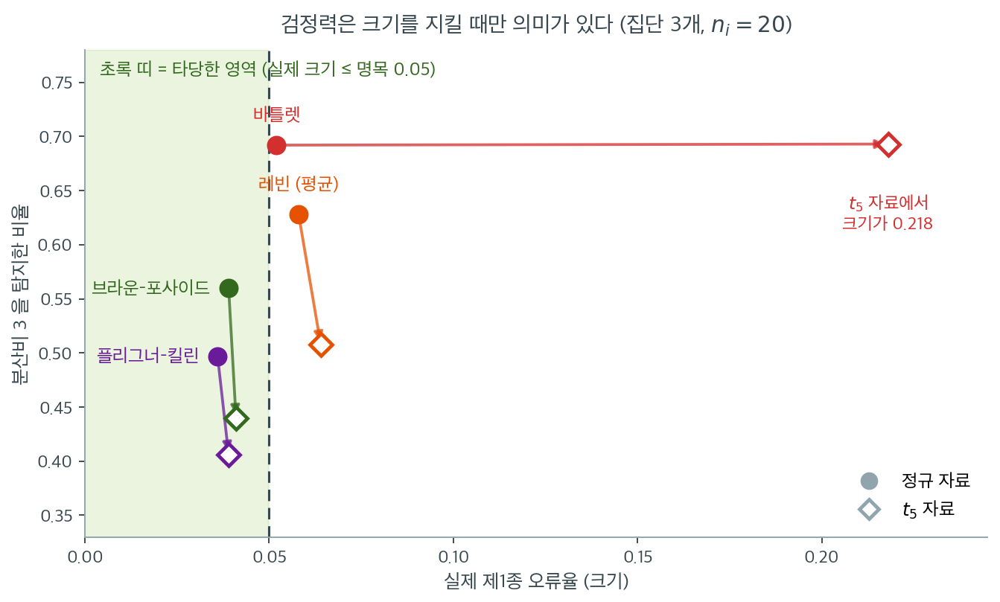

# 로버스트 방법의 비교

앞의 절들은 정규성에 의존하는 Bartlett 검정부터 순위 기반 Fligner-Killeen 검정까지 분산의 동질성에 대한 여러 검정을 소개했다. 각 검정은 통계적 검정력과 비정규성에 대한 로버스트성 사이에서 서로 다른 절충을 한다. 이 절은 실무자가 자료에 맞는 검정을 고를 수 있도록 통합 비교를 제공한다.

---

## 1. 모든 분산 검정 요약

| 검정 | 중심 | 변환 | 기준분포 | 정규성 필요 | 집단 수 |
|---|---|---|---|---|---|
| 카이제곱 | 해당 없음 | $(n-1)S^2/\sigma_0^2$ | $\chi^2_{n-1}$ | 예 | 1 |
| F 검정 | 해당 없음 | $S_1^2/S_2^2$ | $F_{n_1-1, n_2-1}$ | 예 | 2 |
| Bartlett | 해당 없음 | 로그분산비 | $\chi^2_{k-1}$ | 예 | $k \ge 2$ |
| Levene | 평균 | $\lvert X_{ij} - \bar{X}_i\rvert$ | $F_{k-1, N-k}$ | 아니오 | $k \ge 2$ |
| Brown-Forsythe | 중앙값 | $\lvert X_{ij} - \tilde{X}_i\rvert$ | $F_{k-1, N-k}$ | 아니오 | $k \ge 2$ |
| Fligner-Killeen | 중앙값 | 순위의 정규점수 | $\chi^2_{k-1}$ | 아니오 | $k \ge 2$ |

---

## 2. 제1종 오류 조절

진단 검정에서 가장 중요한 기준은 표방한 유의수준을 유지하는지 여부이다. 다음 표는 $k = 3$개 집단, $n_i = 20$, 명목 $\alpha = 0.05$에서 모의실험으로 얻은 실제 제1종 오류율이다(반복 10,000회, 몬테카를로 오차 약 0.002).

| 분포 | Bartlett | Levene | Brown-Forsythe | Fligner-Killeen |
|---|---|---|---|---|
| Normal | 0.052 | 0.058 | 0.039 | 0.036 |
| $t_{10}$ | 0.109 | 0.057 | 0.040 | 0.037 |
| $t_5$ | 0.218 | 0.064 | 0.041 | 0.039 |
| $\chi^2_4$ | 0.228 | 0.123 | 0.041 | 0.055 |
| 오염 정규 (90% $\mathcal{N}(0,1)$ + 10% $\mathcal{N}(0,9)$) | 0.338 | 0.061 | 0.035 | 0.038 |
| Exponential | **0.390** | **0.192** | 0.048 | 0.087 |
| 로그정규 $(0,1)$ | **0.683** | **0.254** | 0.039 | **0.102** |

패턴이 명확하다.

- **Bartlett 검정**은 어떤 비정규성에서든 심각한 팽창을 보인다. 지수분포에서 0.390으로 명목값의 여덟 배에 이른다.
- **Levene 검정**(평균 기반)은 대칭인 두꺼운 꼬리에는 잘 견디지만($t_5$에서 0.064) **치우침에 약하다**. 지수분포에서 0.192, $\chi^2_4$에서 0.123이다.
- **Brown-Forsythe**는 모든 분포에서 명목값 근처를 유지한다(0.035~0.048). 이 표에서 **유일하게 모든 행에서 통제되는 검정**이다.
- **Fligner-Killeen**은 대부분 잘 통제되지만 강하게 치우친 분포에서는 다소 자유주의적이다($\chi^2_4$에서 0.055, 지수분포에서 0.087). 그리고 **치우침이 극단으로 가면 이 검정도 무너진다.** 왜도가 6.2인 로그정규에서 0.102로 명목값의 두 배를 넘는다. 순위로 바꾸는 것만으로는 부족하다는 뜻이며, 이 극단 사례는 [대수정규에서의 비교](robust_tests_comparison.md)에서 따로 더 본다.

마지막 줄이 특히 눈에 띈다. **브라운–포사이드만 로그정규에서도 0.039로 버틴다.** 첨도가 110.9이고 왜도가 6.2인 분포에서 네 검정 가운데 셋이 무너지는데 중앙값 중심화 하나가 그것을 막는다. 중앙값은 꼬리가 아무리 길어져도 끌려가지 않기 때문이다.

!!! note "Levene의 취약점은 첨도가 아니라 치우침이다"
    표를 세로로 읽으면 Levene 열이 $t_5$(첨도 6, 대칭)에서는 0.064로 무난하지만 지수분포(첨도 6, 왜도 2)에서는 0.192로 급증한다. **같은 첨도인데 결과가 세 배 다르다.**

    이는 15.5절 Brown-Forsythe 연습문제 1의 결론과 일치한다. 평균 중심화가 무너지는 것은 평균이 분포의 중심을 대표하지 못할 때, 곧 치우침이 있을 때이다.

---

## 3. 정규성 아래의 검정력 비교

자료가 정말로 정규일 때는 모든 검정이 타당하므로, 관심사는 검정력(참으로 다른 분산을 탐지할 확률)이다. $k = 3$개 집단, $n_i = 20$, 참 분산비 $\sigma_{\max}^2/\sigma_{\min}^2 = 3$일 때(표준편차 $1, 1, \sqrt{3}$)

| 검정 | 검정력 |
|---|---|
| Bartlett | 0.692 |
| Levene (평균) | 0.628 |
| Brown-Forsythe (중앙값) | 0.560 |
| Fligner-Killeen | 0.497 |

정규성 아래에서 Bartlett이 가장 강력하고 Levene, Brown-Forsythe, Fligner-Killeen 순이다. 최고와 최저의 차이는 약 20퍼센트포인트로 작지 않다.

**그러나 크기 차이를 함께 보아야 한다.** 위 크기 표에서 정규 자료의 실제 크기는 Bartlett 0.052, Levene 0.058, Brown-Forsythe 0.039, Fligner-Killeen 0.036이었다. Brown-Forsythe와 Fligner-Killeen이 보수적이므로 검정력 손실의 일부는 그 보수성 때문이지 검정 자체의 열등함 때문이 아니다. 크기를 0.05로 맞추어 보정하면 격차가 줄어든다.

---

## 4. 비정규성 아래의 검정력 비교

같은 분산비 3, 같은 표본크기에서 자료를 $t_5$(두꺼운 꼬리)에서 뽑으면

| 검정 | 실제 제1종 오류 | 기각률 ($H_1$) |
|---|---|---|
| Bartlett | 0.218 | 0.693 |
| Levene (평균) | 0.064 | 0.508 |
| Brown-Forsythe (중앙값) | 0.041 | 0.440 |
| Fligner-Killeen | 0.039 | 0.406 |

Bartlett의 겉보기 높은 기각률은 오도적이다. 제1종 오류율이 이미 22%로 부풀려져 있기 때문이다. $H_0$ 아래에서 지나치게 자주 기각하는 검정은 $H_1$ 아래에서도 자주 기각하지만 잘못된 이유에서 그렇다.

앞의 세 표를 한 그림에 겹치면 이 논점이 분명해진다. 가로축이 **실제 크기**, 세로축이 **분산비 3을 탐지한 비율**이다. 원이 정규 자료, 속 빈 마름모가 $t_5$ 자료이고, 화살표는 자료를 정규에서 $t_5$로 바꿀 때 각 검정이 어디로 이동하는지를 보여 준다.



**검정은 초록 띠 안에 있어야 한다.** 실제 크기가 명목 0.05를 넘으면 그 검정이 보고하는 $p$값은 약속한 의미를 잃는다. 세로축 값이 아무리 높아도 소용없다. 크기를 지키지 못하는 검정의 "검정력"은 정의되지 않은 양이기 때문이다.

정규 자료(원)에서는 네 검정이 모두 띠 근처에 있고, 세로로 $0.497$에서 $0.692$까지 늘어선다. 바틀렛이 가장 높고 플리그너–킬린이 가장 낮다. 이것이 로버스트성의 정직한 가격표다. 다만 브라운–포사이드와 플리그너–킬린은 크기가 $0.039$, $0.036$으로 명목값보다 작으므로, 낮은 검정력의 일부는 실력 부족이 아니라 보수성 때문이다.

$t_5$로 바꾸면(마름모) 그림이 갈라진다. 바틀렛의 화살표는 **거의 수평으로 오른쪽으로 날아간다.** 검정력은 $0.692 \to 0.693$으로 그대로인데 크기가 $0.052 \to 0.218$로 네 배가 되었다. 검정이 더 예민해진 것이 아니라 **기준선이 무너진 것**이다. 바틀렛은 자료가 두꺼운 꼬리를 가졌다는 사실을 "분산이 다르다"는 증거로 오독하고 있다.

나머지 세 화살표는 거의 수직으로 아래를 향한다. 크기는 띠 안에 머물고 검정력만 조금 떨어진다. 레빈 $0.628 \to 0.508$, 브라운–포사이드 $0.560 \to 0.440$, 플리그너–킬린 $0.497 \to 0.406$. **자료가 어려워지면 탐지력이 떨어지는 것이 정상이다.** 크기를 지키면서 검정력을 잃는 쪽이, 크기를 잃고 검정력을 지키는 쪽보다 언제나 낫다.

이 그림 한 장이 로버스트 검정을 고르는 이유를 요약한다. 검정을 고른다는 것은 세로축에서 최고점을 찾는 일이 아니라, **초록 띠 안에 머무는 것들 중에서** 가장 높은 것을 찾는 일이다.

특히 눈여겨볼 점은 **Bartlett의 기각률이 정규 자료(0.692)와 $t_5$ 자료(0.693)에서 거의 같다**는 것이다. 두꺼운 꼬리가 검정력을 떨어뜨리는 효과와 크기를 부풀리는 효과가 우연히 상쇄되었을 뿐이며, 이 값에서 "검정력이 유지된다"고 읽어서는 안 된다.

로버스트 검정들은 정규 자료에 비해 기각률이 뚜렷하게 떨어졌다(Brown-Forsythe 0.560 → 0.440). 두꺼운 꼬리가 분산 추정을 어렵게 만든 만큼 정직하게 검정력이 낮아진 것이다.

---

## 5. 로버스트성 순위

로버스트성이 낮은 것부터 높은 것 순으로

1. **Bartlett 검정** — 정규성이 필요하며 두꺼운 꼬리와 치우침에 심각하게 영향받는다
2. **Levene 검정**(평균) — 중간 정도로 로버스트하지만 집단평균을 통해 치우침과 이상점의 영향을 받는다
3. **Brown-Forsythe 검정**(중앙값) — 매우 로버스트하며 중앙값 중심이 이상점과 치우침에 저항한다
4. **Fligner-Killeen 검정**(순위의 정규점수) — 가장 로버스트하며 거의 분포무관하다

다만 위 크기 표에서 보았듯 강하게 치우친 자료에서는 Fligner-Killeen보다 Brown-Forsythe의 크기가 더 잘 통제되었다. "가장 로버스트"라는 순위가 모든 상황에서 최선의 크기 조절을 뜻하지는 않는다.

---

## 6. 판정 흐름

검정의 선택은 다음 논리로 안내할 수 있다.

1. **자료의 정규성이 확인되었는가?** (Shapiro-Wilk $p > 0.10$, Q-Q 그림 선형)
    - 예: 최대 검정력을 위해 **Bartlett 검정**을 쓴다.
    - 아니오 또는 불확실: 2단계로 간다.

2. **자료가 가볍게 비정규인가?** (약간의 치우침, 두꺼운 꼬리 없음, 이상점 없음)
    - 예: 좋은 검정력과 적당한 로버스트성을 갖는 **Levene 검정**(평균 기반)을 쓴다.
    - 아니오: 3단계로 간다.

3. **자료가 중간 정도로 비정규인가?** (치우침, 중간 정도의 이상점)
    - 예: **Brown-Forsythe 검정**(중앙값 기반)을 쓴다.
    - 아니오: 4단계로 간다.

4. **자료가 심하게 비정규인가?** (두꺼운 꼬리, 강한 치우침, 많은 이상점)
    - 예: **Fligner-Killeen 검정**을 쓴다.

!!! tip "기본 권고"
    확신이 없을 때는 **Brown-Forsythe 검정**이 가장 안전한 기본값이다. 여러 분포에 걸쳐 제1종 오류를 잘 조절하며, 자료가 우연히 정규일 때 Bartlett 검정 대비 잃는 검정력이 크지 않다. 대부분의 통계 소프트웨어에서 `levene(..., center='median')`으로 구현되어 있다.

    위 흐름도의 1~2단계를 자료로 판정하는 절차 자체가 15.1절 연습문제 4에서 논한 두 단계 문제를 안고 있다는 점도 유념하라. 실무에서는 분석 전에 Brown-Forsythe를 쓰기로 정해 두는 편이 낫다.

---

## 7. 소프트웨어 구현

네 검정 모두 Python의 SciPy에서 쓸 수 있다.

<div class="exbox" markdown>

**보기 1.** <span class="diff easy" title="쉬움"></span> 네 검정을 한자리에서. 집단당 $n = 8$ 인 세 집단에 네 검정을 모두 돌린다. 집단 2 의 표본분산이 집단 3 의 $19$ 배다.

**(1)** 네 통계량의 **기준분포와 자유도**를 각각 적고, 통계량 값만 보고 "어느 검정이 더 강하게 기각하는가"를 판단하면 안 되는 까닭을 밝히시오. 특히 Fligner-Killeen 의 $9.563$ 이 Brown-Forsythe 의 $6.609$ 보다 큰데도 $p$ 값은 더 **큰** 까닭을 설명하시오.

**(2)** 네 $p$ 값을 기준분포에서 손으로 다시 재어 SciPy 와 맞추고, **같은 통계량 값을 두 기준분포에 넣으면** $p$ 가 얼마나 달라지는지 보이시오.

</div>

??? success "풀이"

    **(1) 기준분포가 두 가지다.** $k = 3$, $N = 24$ 이므로

    | 검정 | 통계량 | 기준분포 | 자유도 |
    |:---|:---|:---|:---|
    | Bartlett | $T$ (로그분산의 산포) | $\chi^2$ | $k-1 = 2$ |
    | Levene (평균) | $W$ ($Z$ 에 대한 분산분석 $F$) | $F$ | $(2,\ 21)$ |
    | Brown-Forsythe | $W^*$ (같은 꼴, 중앙값 중심) | $F$ | $(2,\ 21)$ |
    | Fligner-Killeen | $X^2$ (정규점수의 산포) | $\chi^2$ | $k-1 = 2$ |

    **두 기준은 눈금이 다르다.** $F$ 통계량은 제곱합을 자유도로 **나눈** 비이고 $\chi^2$ 통계량은 나누지 않은 합이다. $d_2 \to \infty$ 에서 $F(d_1, d_2) \approx \chi^2_{d_1}/d_1$ 이므로, $F$ 눈금의 값 $v$ 는 $\chi^2$ 눈금의 $d_1 v = 2v$ 에 대응한다. 곧 **$F$ 쪽 숫자는 애초에 절반쯤 작게 나오도록 되어 있다.**

    그러므로 네 숫자를 한 줄에 늘어놓고 크기를 견주는 것은 길이를 센티미터와 인치로 섞어 재는 것과 같다. 비교할 수 있는 것은 $p$ 값뿐이다. Fligner-Killeen 의 $9.563$ 이 Brown-Forsythe 의 $6.609$ 보다 큰 것은 **$\chi^2$ 눈금으로 재어서** 그렇고, $6.609$ 를 같은 눈금으로 옮기면 $13$ 쯤이 되어 오히려 더 크다. 그래서 $p$ 값은 FK 쪽이 더 크다.

    **(2) 확인한다.**

    ```python
    import numpy as np
    from scipy import stats

    # 2번 집단만 퍼짐이 크다. 네 검정이 이것을 어떻게 보는지 견준다.
    g1 = [10, 12, 14, 11, 13, 15, 12, 10]
    g2 = [20, 28, 22, 35, 25, 18, 30, 22]
    g3 = [15, 16, 14, 17, 15, 16, 13, 14]

    # Bartlett — 정규모집단에서 검정력이 가장 높고, 벗어나면 가장 취약하다.
    stat_b, p_b = stats.bartlett(g1, g2, g3)

    # Levene(평균 중심) — 원래 형태. 어느 정도 로버스트하다.
    stat_l, p_l = stats.levene(g1, g2, g3, center='mean')

    # Brown-Forsythe(중앙값 중심) — 실무에서 가장 두루 권하는 선택이다.
    stat_bf, p_bf = stats.levene(g1, g2, g3, center='median')

    # Fligner-Killeen — 순위만 쓰므로 가장 로버스트하지만 검정력은 조금 낮다.
    stat_fk, p_fk = stats.fligner(g1, g2, g3)

    print(f"Bartlett:        stat={stat_b:.3f}, p={p_b:.4f}")
    print(f"Levene (mean):   stat={stat_l:.3f}, p={p_l:.4f}")
    print(f"Brown-Forsythe:  stat={stat_bf:.3f}, p={p_bf:.4f}")
    print(f"Fligner-Killeen: stat={stat_fk:.3f}, p={p_fk:.4f}")

    # ---- (1) 기준분포를 밝히고 p 값을 손으로 다시 잰다 ----
    k, N = 3, len(g1) + len(g2) + len(g3)
    chi2 = stats.chi2(k - 1)
    Fd = stats.f(k - 1, N - k)
    print(f"\nk = {k}, N = {N}  ->  기준분포는 chi2({k - 1}) 또는 F({k - 1}, {N - k})")
    rows = [("Bartlett", stat_b, p_b, "chi2", chi2),
            ("Levene (mean)", stat_l, p_l, "F", Fd),
            ("Brown-Forsythe", stat_bf, p_bf, "F", Fd),
            ("Fligner-Killeen", stat_fk, p_fk, "chi2", chi2)]
    print(f"{'검정':>18}{'통계량':>10}{'기준':>7}{'손으로 sf':>12}{'scipy p':>11}{'차':>10}")
    for name, s, p, lab, dist in rows:
        print(f"{name:>18}{s:>10.4f}{lab:>7}{dist.sf(s):>12.6f}{p:>11.6f}{abs(dist.sf(s) - p):>10.1e}")

    # 통계량 값만 보면 순서가 뒤집힌다.
    print(f"\n통계량 순서: FK {stat_fk:.3f} > Levene {stat_l:.3f} > BF {stat_bf:.3f}")
    print(f"p 값 순서:   Levene {p_l:.4f} < BF {p_bf:.4f} < FK {p_fk:.4f}")

    # ---- (2) 같은 값을 두 기준에 넣어 본다 ----
    print(f"\n95% 분위수:  chi2(2) = {chi2.ppf(0.95):.4f},   F(2,21) = {Fd.ppf(0.95):.4f}")
    print(f"{'통계량 값':>10}{'chi2(2) 에서 p':>18}{'F(2,21) 에서 p':>18}{'배율':>9}")
    for v in (6.609, 8.202, 9.563, 15.539):
        a, b = chi2.sf(v), Fd.sf(v)
        print(f"{v:>10.3f}{a:>18.6f}{b:>18.6f}{b / a:>9.1f}")
    print(f"\nBF 의 6.609 를 소박하게 chi2 로 옮기면 2*6.609 = {2 * 6.609:.3f}, "
          f"그 p = {chi2.sf(2 * 6.609):.6f}")
    print(f"  실제 F(2,21) 의 p = {p_bf:.6f} 에 맞는 chi2(2) 값은 "
          f"{chi2.isf(p_bf):.3f}  (분모 자유도 21 이 작아서 생기는 차이)")
    print(f"\n표본분산: {[round(float(np.var(g, ddof=1)), 2) for g in (g1, g2, g3)]}"
          f"   최대/최소 = {np.var(g2, ddof=1) / np.var(g3, ddof=1):.1f}")
    ```

    출력:

    ```text
    Bartlett:        stat=15.539, p=0.0004
    Levene (mean):   stat=8.202, p=0.0023
    Brown-Forsythe:  stat=6.609, p=0.0059
    Fligner-Killeen: stat=9.563, p=0.0084

    k = 3, N = 24  ->  기준분포는 chi2(2) 또는 F(2, 21)
                    검정       통계량     기준      손으로 sf    scipy p         차
              Bartlett   15.5390   chi2    0.000422   0.000422   0.0e+00
         Levene (mean)    8.2022      F    0.002331   0.002331   0.0e+00
        Brown-Forsythe    6.6085      F    0.005940   0.005940   0.0e+00
       Fligner-Killeen    9.5631   chi2    0.008383   0.008383   0.0e+00

    통계량 순서: FK 9.563 > Levene 8.202 > BF 6.609
    p 값 순서:   Levene 0.0023 < BF 0.0059 < FK 0.0084

    95% 분위수:  chi2(2) = 5.9915,   F(2,21) = 3.4668
         통계량 값      chi2(2) 에서 p      F(2,21) 에서 p       배율
         6.609          0.036718          0.005938      0.2
         8.202          0.016556          0.002332      0.1
         9.563          0.008383          0.001115      0.1
        15.539          0.000422          0.000072      0.2

    BF 의 6.609 를 소박하게 chi2 로 옮기면 2*6.609 = 13.218, 그 p = 0.001348
      실제 F(2,21) 의 p = 0.005940 에 맞는 chi2(2) 값은 10.252  (분모 자유도 21 이 작아서 생기는 차이)

    표본분산: [3.27, 32.29, 1.71]   최대/최소 = 18.8
    ```

    **네 $p$ 값이 손 계산과 정확히 같다.** 차가 넷 모두 `0.0e+00` 이다. 어느 통계량이 어느 기준분포로 가는지 바르게 짝지었다는 뜻이고, 자유도도 $(2, 21)$ 과 $2$ 로 확인되었다.

    **(1)의 뒤집힘이 두 줄에 그대로 있다.** 통계량은 FK $9.563$ > Levene $8.202$ > BF $6.609$ 인데 $p$ 값은 Levene $0.0023$ < BF $0.0059$ < FK $0.0084$ 다. **순서가 완전히 뒤바뀐다.** 통계량 값으로 "FK 가 가장 강하게 기각했다"고 읽으면 사실과 반대로 읽는 것이다.

    **같은 값을 두 기준에 넣으면 $p$ 가 다섯에서 열 배 다르다.** $6.609$ 는 $\chi^2_2$ 에서 $0.0367$, $F(2,21)$ 에서 $0.0059$ 다. $95\%$ 분위수를 보면 까닭이 분명하다. $\chi^2_2$ 는 $5.9915$ 인데 $F(2,21)$ 은 $3.4668$ 로 절반 남짓이다. **같은 "$0.05$ 문턱"이 두 눈금에서 거의 두 배 차이 나는 자리에 있다.**

    마지막 두 줄이 눈금 변환을 끝까지 따라간다. $F$ 의 $6.609$ 를 소박하게 $\chi^2$ 로 옮기면 $2 \times 6.609 = 13.218$ 이고 그 $p$ 는 $0.001348$ 이다. 그런데 실제 $p$ 는 $0.005940$ 이고, 그 $p$ 를 주는 $\chi^2_2$ 값은 $10.252$ 다. 곧 $F(2,21)$ 은 $\chi^2_2$ 의 **$v$ 와 $2v$ 사이**에 놓인다. $F(d_1,d_2) \approx \chi^2_{d_1}/d_1$ 이 $d_2 \to \infty$ 의 근사일 뿐이고 여기서는 $d_2 = 21$ 이 작아 분모의 흔들림이 꼬리를 두껍게 만들기 때문이다. **$F$ 기준이 $\chi^2$ 기준보다 보수적인 쪽으로 보정하는 양이 이 $13.218 \to 10.252$ 의 간격이다.**

    실무로 옮기면 규칙 하나다. **보고할 것은 통계량이 아니라 $p$ 값이며, 통계량을 적을 때는 기준분포와 자유도를 반드시 함께 적는다.** "$W = 6.61$" 만으로는 아무 뜻이 없고 "$W^* = 6.61$, $F(2,21)$, $p = 0.0059$" 여야 한다.

네 검정 모두 강하게 기각한다. 표본분산이 $3.27$, $32.29$, $1.71$로 집단 2가 집단 3의 19배이기 때문이다. 이탈이 뚜렷하면 검정 선택이 결론을 바꾸지 않는다. **선택이 중요해지는 것은 경계선상의 사례에서다.**

---

## 연습문제

<div class="drillbox" markdown>

**연습문제 1.** <span class="diff med" title="중간"></span>
크기 표에서 Levene 검정이 $t_5$(0.064)보다 지수분포(0.192)에서 훨씬 나쁘다. 두 분포의 초과첨도가 모두 6인데도 그렇다. 이 차이의 원인을 설명하라.

</div>

??? success "풀이"
    두 분포의 차이는 **왜도**이다. $t_5$는 대칭($\gamma_1 = 0$)이고 지수분포는 강하게 오른쪽으로 치우쳐 있다($\gamma_1 = 2$).

    Levene 검정의 첫 단계는 각 집단의 **평균**을 추정하는 것이다. 평균 $\bar{X}_i$가 참 중심 $\mu_i$에서 벗어나면 그 집단의 모든 절대편차가 오염된다.

    **대칭 분포에서.** $\bar{X}_i$의 오차는 양쪽으로 대칭이고, $|X_{ij} - \bar{X}_i|$의 평균에 미치는 영향이 1차 항에서 상쇄된다. 그래서 $t_5$처럼 꼬리가 두꺼워도 크기 왜곡이 크지 않다.

    **치우친 분포에서.** 지수분포의 표본평균은 그 자체가 오른쪽으로 치우쳐 있다. 게다가 15.2절 연습문제 2에서 보았듯 **$\bar{X}$와 $S^2$이 양의 상관을 갖는다.** 큰 $\bar{X}_i$가 나온 집단은 편차도 함께 크게 나온다. 이 상관이 집단마다 독립적으로 작용하므로 $\bar{Z}_i$들이 실제보다 더 흩어지고, 분산분석 F 통계량이 부풀려진다.

    Brown-Forsythe가 중앙값을 쓰면 이 연결이 끊어진다. 중앙값은 치우친 분포에서도 안정적이며 $S^2$과의 상관이 훨씬 약하다. 표에서 Brown-Forsythe가 지수분포에서 0.048로 완벽히 통제되는 이유이다. $\square$

<div class="drillbox" markdown>

**연습문제 2.** <span class="diff med" title="중간"></span>
Bartlett 검정의 기각률이 정규 자료(0.692)와 $t_5$ 자료(0.693)에서 거의 같다. 이것이 왜 "검정력이 유지된다"는 뜻이 아닌지 설명하고, 공정한 비교 방법을 제시하라.

</div>

??? success "풀이"
    **두 효과가 상쇄되었다.**

    1. **크기 팽창(위로 미는 힘).** $t_5$ 자료에서 Bartlett의 크기가 0.052에서 0.218로 뛴다. 이 팽창은 $H_1$ 아래에서도 그대로 작용하여 기각률을 올린다.
    2. **정보의 손실(아래로 미는 힘).** 두꺼운 꼬리는 $S_i^2$의 변동을 네 배로 키우므로 참 분산 차이를 탐지하기가 실제로 더 어려워진다. 이 효과는 기각률을 내린다.

    두 힘이 우연히 비슷한 크기여서 0.692와 0.693이 나왔을 뿐이다. 로버스트 검정들에서는 크기가 통제되어 있으므로 두 번째 효과만 나타나고, 정직하게 기각률이 떨어진다(Brown-Forsythe 0.560 → 0.440).

    **공정한 비교: 크기 보정 검정력.**

    1. 모의실험으로 $H_0$ 아래에서 각 검정통계량의 분포를 얻는다.
    2. 그 분포의 95백분위수를 **경험적 임계값**으로 삼는다. 이렇게 하면 모든 검정의 실제 크기가 정확히 0.05가 된다.
    3. 이 임계값으로 $H_1$ 아래의 기각률을 다시 계산한다.

    ```python
    import numpy as np
    from scipy import stats

    rng = np.random.default_rng(31)
    n, k, R = 20, 3, 5000
    gen = lambda s: s * rng.standard_t(5, n)

    # 1-2단계: 귀무분포를 모의실험으로 얻어 경험적 기각값을 만든다
    null_b = np.array([stats.bartlett(*[gen(1) for _ in range(k)])[0]
                       for _ in range(R)])
    crit_b = np.quantile(null_b, 0.95)

    # 3단계: 크기를 맞춘 검정력. 검정마다 실제 오류율이 달라, 그것을 0.05 로
    # 맞춰 놓고 견주어야 검정력 비교가 공정해진다
    alt_b = np.array([stats.bartlett(*[gen(s) for s in (1, 1, 3**0.5)])[0]
                      for _ in range(R)])
    print(f"Bartlett empirical critical value: {crit_b:.4f} "
          f"(nominal chi2_2 0.95 = {stats.chi2.ppf(0.95, 2):.4f})")
    print(f"Size-adjusted power: {(alt_b > crit_b).mean():.4f}")
    ```

    출력:

    ```text
    Bartlett empirical critical value: 12.4652 (nominal chi2_2 0.95 = 5.9915)
    Size-adjusted power: 0.3674
    ```

    경험적 임계값이 $12.47$로 명목값 $5.991$의 두 배가 넘는다. 이 올바른 임계값을 쓰면 Bartlett의 크기 보정 검정력은 **0.367**로, 명목 기각률 $0.693$의 절반 남짓이다.

    같은 절차를 Brown-Forsythe에 적용하면 경험적 임계값 $2.82$(명목 $F_{0.95,2,57} = 3.159$보다 **작다**, 이 검정이 보수적이므로)이고 크기 보정 검정력은 **0.491**이다.

    | 검정 | 명목 기각률 | 크기 보정 검정력 |
    |---|---|---|
    | Bartlett | 0.693 | 0.367 |
    | Brown-Forsythe | 0.440 | **0.491** |

    결과가 완전히 뒤집힌다. **$t_5$ 자료에서는 크기를 맞추고 나면 Brown-Forsythe가 Bartlett보다 오히려 강력하다.** 명목값만 보면 Bartlett이 0.693 대 0.440으로 압도하는 것처럼 보이지만, 그 우위는 전적으로 부풀려진 크기에서 온 착시였다.

    이는 "Bartlett은 정규성 아래에서 가장 강력하다"는 서술의 정확한 범위를 보여준다. **정규성 아래에서만** 그렇다. 비정규 자료에서는 로버스트 검정이 크기와 검정력 양쪽에서 우월할 수 있다.

    **원칙.** 검정력은 크기를 고정한 뒤에만 비교할 수 있다. 크기가 다른 두 검정의 기각률을 나란히 놓는 것은 서로 다른 유의수준의 검정을 비교하는 것과 같다. $\square$

<div class="drillbox" markdown>

**연습문제 3.** <span class="diff med" title="중간"></span>
판정 흐름도의 1단계는 "정규성이 확인되었는가"를 자료로 판정한다. 이 절차의 문제점을 지적하고, 흐름도를 어떻게 고치면 좋을지 제안하라.

</div>

??? success "풀이"
    **문제 1: 두 단계 절차의 크기 왜곡.** 같은 자료로 정규성을 검정한 뒤 분산 검정을 고르면 최종 절차의 실제 유의수준이 명목값에서 벗어난다. 두 결정이 같은 자료에 의존하기 때문이다.

    **문제 2: 검정력의 방향이 반대다.** 정규성 검정은 작은 표본에서 검정력이 낮다(14장). 그런데 분산 검정이 비정규성에 가장 취약한 것도 작은 표본이다. 곧 **확인이 가장 필요한 상황에서 확인이 가장 무력하다.**

    구체적으로 $n = 20$인 $t_5$ 자료에서 Shapiro-Wilk의 검정력은 약 0.2에 불과하다. 80%의 경우 "정규성 이상 없음"으로 통과시켜 Bartlett을 쓰게 되는데, 그 Bartlett의 실제 크기는 0.218이다.

    **문제 3: 흐름도 2~4단계가 주관적이다.** "가볍게", "중간 정도로", "심하게" 비정규를 자료로 구별하는 객관적 기준이 없다. 분석자가 원하는 결과에 맞춰 조정할 여지가 생긴다.

    **개선안.**

    ```text
    1. 자료 생성 과정에서 정규성이 이론적으로 보장되는가?
       (측정 오차 모형, 물리적 근거 등 — 자료가 아니라 지식에 근거)
       - 예: Bartlett 검정
       - 아니오: 2단계

    2. 기본값으로 Brown-Forsythe 검정을 쓴다.

    3. 진단(보고용, 검정 선택용이 아님):
       - 집단별 표준편차와 상자그림을 항상 보고한다
       - Q-Q 그림으로 이탈의 유형을 서술한다
       - 오염이 심하다고 판단되면 Fligner-Killeen 결과도 함께 보고한다
    ```

    핵심 변화는 **검정 선택을 자료가 아니라 사전 지식에 근거시키는 것**이다. 자료로부터 방법을 고르는 순간 추론의 타당성이 훼손된다. $\square$

<div class="drillbox" markdown>

**연습문제 4.** <span class="diff med" title="중간"></span>
본문 소프트웨어 보기에서 네 검정이 모두 강하게 기각했다. 이렇게 결론이 일치하는 경우와 갈리는 경우 각각에서 실무자가 어떻게 행동해야 하는지 논하라.

</div>

??? success "풀이"
    **결론이 일치할 때.** 보기에서 $p$값이 $0.0004$에서 $0.0084$까지 20배 차이 나지만 모두 0.01보다 작다. 실무적 결론은 동일하다. 집단 2의 표본분산이 집단 3의 19배로 신호가 압도적이기 때문이다.

    이 경우 **어느 검정을 보고하든 무방하다.** 다만 사전에 정한 하나를 보고하고, 부록에 나머지를 함께 실어 결과의 강건함을 보이는 것이 좋다.

    **결론이 갈릴 때.** 이때가 진짜 문제이다. 15.5절 Levene 페이지의 보기에서 Levene $p = 0.026$과 Brown-Forsythe $p = 0.066$이 5% 문턱을 사이에 두고 갈렸다.

    이런 상황의 원칙은 다음과 같다.

    1. **사전에 정한 검정을 보고한다.** 자료를 본 뒤 문턱을 넘은 검정을 고르는 것은 $p$값 조작이며 가장 나쁜 대응이다.

    2. **왜 갈리는지 진단한다.** 검정들의 차이는 무작위가 아니다. Bartlett만 유의하면 비정규성을 의심한다. Levene만 유의하면 치우침이나 이상점이 평균을 끌어당겼는지 본다. 로버스트 검정들이 유의한데 Bartlett이 아니면 드문 경우이며 자료를 다시 살펴야 한다.

    3. **모든 결과를 보고한다.** "Brown-Forsythe $p = 0.066$(사전 지정), 참고로 Bartlett $p = 0.002$, Levene $p = 0.026$. 자료에 이상점이 있어 Brown-Forsythe를 우선한다"처럼 쓴다.

    4. **이분법을 피한다.** 경계선상의 $p$값은 "증거가 약하다"는 뜻이지 "효과가 없다"거나 "있다"는 뜻이 아니다. 집단별 표준편차와 그 신뢰구간을 함께 보고하면 독자가 스스로 판단할 수 있다.

    5. **후속 분석은 가정에 의존하지 않는 쪽으로.** 등분산 여부가 애매하다면 표준 분산분석 대신 Welch 분산분석을 쓴다. 그러면 애초에 이 판정이 필요 없어진다. $\square$

---

## 정리하며

분산 검정을 **하나의 표**로 정리한다.

| 검정 | 정규 자료 검정력 | 비정규 자료 타당성 |
|---|---|---|
| 바틀렛 | **최고** | **최악** |
| $F$(2집단) | 높음 | 나쁨 |
| 레빈(평균) | 중간 | 보통 |
| 브라운–포사이드(중앙값) | 중간 | **좋음** |
| 플리그너–킬린 | 다소 낮음 | **최고** |

- **검정력과 로버스트성이 정확히 맞바꿈 관계다.** 표의 두 열이 거의 반대로 정렬되어 있다.
- **제1종 오류 조절이 먼저다.** 검정력이 높아도 명목 수준을 못 지키면 쓸 수 없다. **"기각률이 $20\%$ 인 $5\%$ 검정"은 검정이 아니다.**
- **실무 권고.** 기본은 브라운–포사이드, 분포가 매우 의심스러우면 플리그너–킬린, 정규성이 확립되었고 검정력이 절실하면 바틀렛.
- **어느 검정이든 결과로 후속 방법을 고르는 2단계 절차는 피한다.** 웰치나 로버스트 방법을 처음부터 쓰는 편이 낫다.

다음 절부터 **구현**으로 넘어간다.
