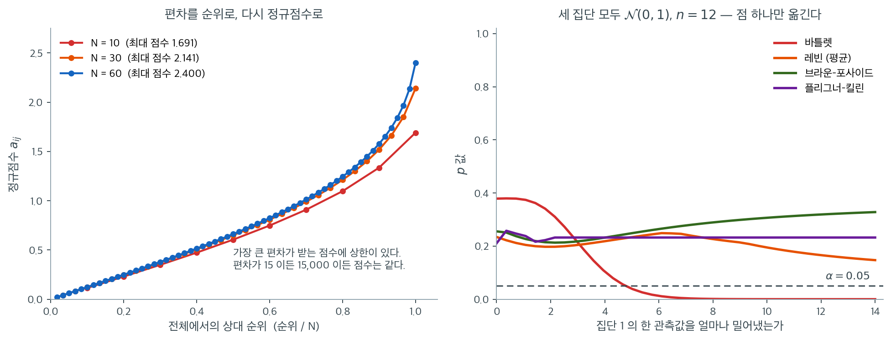

# Fligner-Killeen 검정

Fligner-Killeen 검정(1976)은 이 장에서 다루는 분산 동질성 검정 가운데 가장 로버스트하다. Levene 검정이 쓰는 원래의 절대편차를 그 편차들의 **순위**로 바꾸고, 다시 순위를 **정규점수**로 변환한다. 전 과정을 순위와 정규점수로만 처리하므로 검정이 거의 분포무관해지고, 꼬리가 두껍거나 강하게 치우친 분포에서도 명목 제1종 오류율을 유지한다.

---

## 1. 절차

검정은 다섯 단계로 진행된다.

**1단계.** 집단중앙값으로부터의 절대편차를 계산한다.

$$
Z_{ij} = |X_{ij} - \tilde{X}_i|
$$

여기서 $\tilde{X}_i$는 집단 $i$의 중앙값이다. Brown-Forsythe 검정에서 쓴 것과 같은 변환이다.

**2단계.** $N$개의 절대편차 $Z_{ij}$를 작은 것부터 큰 것까지 순위를 매긴다. $R_{ij}$를 전체 $N$개 값 중 $Z_{ij}$의 순위라 하자. 동점은 평균순위로 처리한다.

**3단계.** 역정규(분위수) 변환으로 순위를 정규점수로 바꾼다.

$$
a_{ij} = \Phi^{-1}\!\left(\frac{1 + R_{ij}/(N+1)}{2}\right)
$$

여기서 $\Phi^{-1}$은 표준정규 CDF의 역함수이다. 인자 $(1 + R_{ij}/(N+1))/2$는 순위를 $(0.5, 1)$ 구간의 값으로 보내고, 역정규가 이를 양의 점수로 보낸다. 편차가 클수록 큰 정규점수를 받는다.

**4단계.** 정규점수의 집단평균을 계산한다.

$$
\bar{a}_i = \frac{1}{n_i}\sum_{j=1}^{n_i} a_{ij}, \qquad \bar{a} = \frac{1}{N}\sum_{i=1}^{k}\sum_{j=1}^{n_i} a_{ij}
$$

**5단계.** 검정통계량을 계산한다.

$$
\chi^2_{\text{FK}} = \frac{\sum_{i=1}^{k} n_i (\bar{a}_i - \bar{a})^2}{\frac{1}{N-1}\sum_{i=1}^{k}\sum_{j=1}^{n_i}(a_{ij} - \bar{a})^2}
$$

$H_0\colon \sigma_1^2 = \cdots = \sigma_k^2$ 아래에서 $\chi^2_{\text{FK}}$는 근사적으로 자유도 $k - 1$인 카이제곱분포를 따른다.

---

## 2. 가설과 판정규칙

$$
H_0\colon \sigma_1^2 = \sigma_2^2 = \cdots = \sigma_k^2
$$

$$
H_1\colon \sigma_i^2 \neq \sigma_j^2 \text{ (적어도 한 쌍의)} i \neq j
$$

유의수준 $\alpha$에서 $\chi^2_{\text{FK}} > \chi^2_{1-\alpha,\, k-1}$이면 $H_0$을 기각한다.

---

## 3. 정규점수가 로버스트성을 주는 이유

순위를 쓰면 편차의 실제 크기가 미치는 영향이 사라진다. 극단적으로 큰 편차는 높은 순위를 받지만 극단적으로 큰 점수를 받지는 않는다. 정규점수 함수가 위쪽 꼬리를 압축하기 때문이다.

구체적으로 $N = 10$일 때 가장 큰 편차가 받는 점수는 $\Phi^{-1}((1 + 10/11)/2) = \Phi^{-1}(0.9545) = 1.691$로 유계이다. 원래 편차가 15이든 15,000이든 점수는 같다.

이 이중의 보호 장치(중앙값 기반 편차 + 순위 기반 점수) 덕분에 검정이 다음에 로버스트해진다.

- **이상점:** 극단 관측값 하나는 순위 하나만 바꾸므로 전체 검정에 미치는 영향이 최소이다.
- **두꺼운 꼬리:** $t_3$나 코시 같은 분포는 이따금 큰 편차를 만들지만 정규점수 변환이 그 영향을 제한한다.
- **치우침:** 중앙값 중심과 순위 변환이 함께 비대칭을 중화한다.

!!! note "Levene, Brown-Forsythe와의 비교"
    Levene 검정은 평균으로부터의 절대편차를 직접 쓴다. Brown-Forsythe는 중앙값을 써서 로버스트성을 높인다. Fligner-Killeen은 편차를 순위로, 다시 정규점수로 바꾸어 세 번째 보호층을 더한다. 각 단계는 정규성 아래에서 약간의 검정력을 내주고 비정규성 아래의 로버스트성을 얻는 교환이다.



왼쪽이 3단계의 변환 $a_{ij} = \Phi^{-1}\!\left((1 + R_{ij}/(N+1))/2\right)$를 그린 것이다. 가로축은 전체에서의 상대 순위이고 세로축이 점수다. 가장 중요한 것은 **곡선이 오른쪽 끝에서 끝난다**는 사실이다. $N = 10$이면 최대 점수가 $1.691$, $N = 30$이면 $2.141$, $N = 60$이면 $2.400$이다. 편차가 15이든 15,000이든 그 값은 여전히 "가장 큰 하나"일 뿐이므로 같은 점수를 받는다. 원자료의 크기 정보가 순위 문턱에서 걸러진다.

오른쪽은 그 효과를 실제 검정에서 본 것이다. 세 집단을 모두 $\mathcal{N}(0,1)$에서 $n = 12$씩 뽑아 놓고(참으로 $H_0$이 옳다) **집단 1의 관측값 딱 하나만** 오른쪽으로 밀어낸다. 가로축이 얼마나 밀었는지다.

바틀렛(빨강)이 무너지는 속도를 보라. 아무것도 건드리지 않았을 때 $p = 0.379$였는데, 그 점 하나를 5만큼 밀자 $p = 0.039$로 기각선을 넘고, 8만큼 밀면 $p = 0.001$, 14만큼 밀면 $p < 0.0001$이다. **36개 관측값 가운데 단 하나 때문에 "분산이 다르다"고 확신하게 된다.** 편차를 제곱하는 통계량이 이상점에 이차적으로 반응하기 때문이다.

브라운–포사이드(초록)와 플리그너–킬린(보라)은 사실상 평평하다. 14만큼 밀어낸 뒤에도 각각 $p = 0.328$, $p = 0.232$로 기각 근처에도 가지 않는다. 레빈(주황, 평균 중심)은 중간이다. 절대편차라 제곱보다는 낫지만 중심으로 쓰는 평균 자체가 이상점에 끌려가므로 $p$가 $0.234$에서 $0.147$까지 서서히 내려간다. **중앙값 중심화와 순위 변환이 각각 한 겹씩 막아 주고 있음이 이 네 곡선의 간격에 그대로 나타난다.**

<div class="exbox" markdown>

**보기 1.** <span class="diff easy" title="쉬움"></span> 두 집단의 Fligner-Killeen 검정. 두 집단을 생각하자.

| 집단 1 | 집단 2 |
|---|---|
| 10, 12, 11, 13, 10 | 8, 25, 15, 30, 12 |

</div>

??? success "풀이"
    **1단계.** 중앙값: $\tilde{X}_1 = 11$, $\tilde{X}_2 = 15$.

    **2단계.** 중앙값으로부터의 절대편차:

    | 집단 1 | 집단 2 |
    |---|---|
    | 1, 1, 0, 2, 1 | 7, 10, 0, 15, 3 |

    **3단계.** 열 개의 편차 $\{0, 0, 1, 1, 1, 2, 3, 7, 10, 15\}$에 순위를 매긴다. 동점은 평균순위를 쓰므로 $\{1.5, 1.5, 4, 4, 4, 6, 7, 8, 9, 10\}$이다.

    **4단계.** $a = \Phi^{-1}((1 + R/11)/2)$로 순위를 정규점수로 바꾼다.

    | 편차 | 0 | 0 | 1 | 1 | 1 | 2 | 3 | 7 | 10 | 15 |
    |---|---|---|---|---|---|---|---|---|---|---|
    | 순위 | 1.5 | 1.5 | 4 | 4 | 4 | 6 | 7 | 8 | 9 | 10 |
    | 점수 | 0.172 | 0.172 | 0.473 | 0.473 | 0.473 | 0.748 | 0.909 | 1.097 | 1.335 | 1.691 |

    **5단계.** 집단별 정규점수 평균은 $\bar{a}_1 = 0.4676$, $\bar{a}_2 = 1.0406$이고 전체평균은 $\bar{a} = 0.7541$이다. 분모의 분산 추정값은 $V = 0.2524$이므로

    $$
    \chi^2_{\text{FK}} = \frac{5(0.4676 - 0.7541)^2 + 5(1.0406 - 0.7541)^2}{0.2524} = \frac{0.8206}{0.2524} = 3.252.
    $$

    $\chi^2_{0.95, 1} = 3.841$과 비교하면 $3.252 < 3.841$이므로 기각하지 못한다($p = 0.0714$).

<div class="exbox" markdown>

**보기 2.** <span class="diff easy" title="쉬움"></span> Fligner-Killeen 검정. 보기 1 의 두 집단에 세 검정을 나란히 돌린다. 집단 2 의 표본분산이 집단 1 의 $50$ 배다.

**(1)** 동점이 없을 때 정규점수의 **다중집합이 자료와 무관하게 $N$ 하나로 정해짐**을 보이고, 그로부터 분모 $V^2$ 와 전체평균 $\bar a$ 가 상수임을 결론하시오. 이어서 $n_1 = n_2 = 5$ 인 이 설계에서 FK 의 $p$ 값이 **아무리 자료가 극단적이어도 내려갈 수 없는 바닥**을 구하시오.

**(2)** 집단 2 의 값 $30$ 을 $300,\ 3000,\ 300000$ 으로 키우며 세 검정의 반응을 보시오. 브라운–포사이드의 $W$ 가 가는 극한값을 손으로 구하고 확인하시오.

</div>

??? success "풀이"

    **(1) 점수는 자료를 보지 않는다.** 3단계의 점수함수는 순위만 받는다.

    $$
    a_{ij} = \Phi^{-1}\!\left(\frac12 + \frac{R_{ij}}{2(N+1)}\right)
    $$

    동점이 없으면 $N$ 개의 순위 $R_{ij}$ 는 $1, 2, \ldots, N$ 의 **순열**이므로, 모든 점수를 모은 다중집합은

    $$
    \left\{\Phi^{-1}\!\left(\tfrac12 + \tfrac{r}{2(N+1)}\right) : r = 1, \ldots, N\right\}
    $$

    로 $N$ 하나에 의해 정해진다. **자료가 정하는 것은 "어느 점수가 어느 집단에 가는가"뿐이다.** 따라서 전체평균

    $$
    \bar a = \frac1N\sum_{r=1}^{N} \Phi^{-1}\!\left(\tfrac12 + \tfrac{r}{2(N+1)}\right),
    \qquad
    V^2 = \frac{1}{N-1}\sum_{r=1}^{N}\bigl(a_{(r)} - \bar a\bigr)^2
    $$

    도 **상수**다. 모집단이 정규든 코시든 로그정규든 같은 수다. 이것이 플리그너–킬린이 거의 분포무관한 까닭의 핵심이며, 브라운–포사이드와 결정적으로 갈리는 지점이다. 브라운–포사이드의 분모는 $Z$ 의 실제 크기에서 계산되므로 자료에 따라 얼마든지 커질 수 있다.

    점수에는 **상한**도 따라온다. 가장 큰 순위 $r = N$ 이 받는 점수가

    $$
    a_{\max} = \Phi^{-1}\!\left(\frac12 + \frac{N}{2(N+1)}\right)
    $$

    이고 $N = 10$ 에서 $\Phi^{-1}(0.9545) = 1.6906$ 이다. 편차가 $15$ 든 $15{,}000$ 든 **같은 수를 받는다.**

    **$p$ 값의 바닥.** $\bar a$ 와 $V^2$ 가 상수이고 집단 크기도 정해져 있으므로

    $$
    \chi^2_{\text{FK}} = \frac{\sum_i n_i(\bar a_i - \bar a)^2}{V^2}
    $$

    에서 자유로운 것은 **쪼개기뿐**이다. $N = 10$ 을 $5{+}5$ 로 나누는 방법이 $\binom{10}{5} = 252$ 가지이고, 그 가운데 통계량을 가장 크게 하는 것은 한 집단이 작은 점수 다섯 개를, 다른 집단이 큰 점수 다섯 개를 몰아 받는 쪼개기다. 그때의 값이 FK 가 이 설계에서 **낼 수 있는 최대값**이고, 그 $p$ 값이 **낼 수 있는 최소값**이다. 아래에서 $252$ 가지를 모두 세어 확인한다.

    **(2) 돌린다.**

    ```python
    import itertools

    import numpy as np
    from scipy import stats

    # 2번 집단의 퍼짐이 훨씬 크다.
    group1 = [10, 12, 11, 13, 10]
    group2 = [8, 25, 15, 30, 12]

    print("variances:", round(np.var(group1, ddof=1), 2),
          round(np.var(group2, ddof=1), 2))

    # Fligner-Killeen 은 값을 순위로 바꾼 뒤 정규점수를 매겨 계산한다.
    # 원래 값의 크기가 아예 셈에 들어가지 않으므로 이상치가 통계량을
    # 끌고 갈 수 없다. 세 검정 중 가장 로버스트한 까닭이다.
    stat, p_value = stats.fligner(group1, group2)
    print(f"Fligner-Killeen: {stat:.4f}, p = {p_value:.4f}")

    # 다른 두 검정과 견준다.
    s_bf, p_bf = stats.levene(group1, group2, center='median')
    s_b, p_b = stats.bartlett(group1, group2)
    print(f"Brown-Forsythe:  {s_bf:.4f}, p = {p_bf:.4f}")
    print(f"Bartlett:        {s_b:.4f}, p = {p_b:.4f}")

    # (1) 점수의 상한과 p 값의 바닥. 동점이 없을 때 점수는 N 만으로 정해진다.
    N = 10
    r = np.arange(1, N + 1)
    a = stats.norm.ppf(0.5 + r / (2 * (N + 1)))
    print(f"\nN = {N}, 동점 없을 때의 점수 = {np.round(a, 4)}")
    print(f"  최대 점수 = Phi^-1(0.5 + {N}/{2 * (N + 1)}) = {a[-1]:.4f}  (상한)")
    abar, V2 = a.mean(), a.var(ddof=1)
    print(f"  abar = {abar:.6f},  V^2 = {V2:.6f}   (자료가 아니라 N 이 정한다)")

    best, split = -1.0, None
    for idx in itertools.combinations(range(N), 5):
        A = a[list(idx)]
        B = a[[i for i in range(N) if i not in idx]]
        X2 = (5 * (A.mean() - abar) ** 2 + 5 * (B.mean() - abar) ** 2) / V2
        if X2 > best:
            best, split = X2, idx
    print(f"  252 가지 쪼개기 가운데 최대 X^2 = {best:.6f} (순위 {[i + 1 for i in split]} 가 한 집단)")
    print(f"  그때의 p = {stats.chi2(1).sf(best):.6f}   <- n=(5,5) 에서 FK 의 p 값 바닥")
    print(f"  chi2(0.95, 1) = {stats.chi2(1).ppf(0.95):.4f}")

    # (2) 집단 2 의 30 을 키워 간다. 중앙값 15 는 그대로이므로 순위도 그대로다.
    print(f"\n{'30 대신':>10}{'var(g2)':>16}{'FK stat':>11}{'FK p':>10}"
          f"{'BF W':>10}{'BF p':>9}{'Bartlett p':>13}")
    for big in (30, 300, 3000, 300000):
        g2 = [8, 25, 15, big, 12]
        fk = stats.fligner(group1, g2)
        bf = stats.levene(group1, g2, center='median')
        ba = stats.bartlett(group1, g2)
        print(f"{big:>10}{np.var(g2, ddof=1):>16.1f}{fk.statistic:>11.6f}{fk.pvalue:>10.6f}"
              f"{bf.statistic:>10.4f}{bf.pvalue:>9.4f}{ba.pvalue:>13.3e}")

    # 순위가 정말 바뀌지 않는가.
    for big in (30, 300000):
        Z = np.concatenate([np.abs(np.array(g, dtype=float) - np.median(g))
                            for g in (group1, [8, 25, 15, big, 12])])
        print(f"  big={big:>7}  편차의 순위 = {stats.rankdata(Z)}")
    ```

    출력:

    ```text
    variances: 1.7 84.5
    Fligner-Killeen: 3.2515, p = 0.0714
    Brown-Forsythe:  5.1429, p = 0.0531
    Bartlett:        9.1010, p = 0.0026

    N = 10, 동점 없을 때의 점수 = [0.1142 0.2299 0.3488 0.4728 0.6046 0.7479 0.9085 1.0968 1.3352 1.6906]
      최대 점수 = Phi^-1(0.5 + 10/22) = 1.6906  (상한)
      abar = 0.754912,  V^2 = 0.256235   (자료가 아니라 N 이 정한다)
      252 가지 쪼개기 가운데 최대 X^2 = 6.271519 (순위 [1, 2, 3, 4, 5] 가 한 집단)
      그때의 p = 0.012269   <- n=(5,5) 에서 FK 의 p 값 바닥
      chi2(0.95, 1) = 3.8415

         30 대신         var(g2)    FK stat      FK p      BF W     BF p   Bartlett p
            30            84.5   3.251534  0.071357    5.1429   0.0531    2.555e-03
           300         16284.5   3.251534  0.071357    1.1469   0.3154    1.441e-07
          3000       1782084.5   3.251534  0.071357    1.0135   0.3436    2.732e-11
        300000   17998200084.5   3.251534  0.071357    1.0001   0.3466    1.590e-18
      big=     30  편차의 순위 = [ 4.   4.   1.5  6.   4.   8.   9.   1.5 10.   7. ]
      big= 300000  편차의 순위 = [ 4.   4.   1.5  6.   4.   8.   9.   1.5 10.   7. ]
    ```

    **(1)의 바닥이 $p = 0.0123$ 이다.** $252$ 가지를 모두 세어 보니 최대 $\chi^2_{\text{FK}} = 6.2715$ 이고 그 쪼개기가 순위 $1$–$5$ 를 한 집단에 몰아 준 경우다. 예상한 대로다. **$n = (5,5)$ 에서 FK 는 자료가 어떻든 $p < 0.0123$ 을 줄 수 없다.** $\chi^2_{0.95,1} = 3.8415$ 보다는 크므로 기각 자체는 가능하지만, 자료가 "완벽하게 갈린" 극단에서도 $p$ 가 $0.012$ 에 머문다. 순위 기반 검정의 검정력이 왜 낮은지가 이 한 숫자에 다 들어 있다. 실제 이 자료는 $3.2515$ 로 최대값의 절반을 조금 넘겼을 뿐이다.

    (유보 하나. 이 자료에는 동점이 있다. 두 집단 모두 $n_i = 5$ 로 홀수라 중앙값이 관측값과 겹쳐 편차 $0$ 이 둘 생기고, 순위가 $1.5, 1.5$ 로 평균순위가 된다. 그래서 실제 $V^2$ 는 $0.2524$ 로 동점 없을 때의 $0.256235$ 와 조금 다르다. 바닥 $0.0123$ 은 **동점이 없는 경우**의 값이다.)

    **(2) FK 는 한 자리도 움직이지 않는다.** 집단 2 의 표본분산이 $84.5$ 에서 $1.8\times10^{10}$ 으로 **여덟 자릿수** 커지는데 FK 통계량은 $3.251534$, $p$ 는 $0.071357$ 로 소수 여섯째 자리까지 똑같다. 마지막 두 줄이 그 까닭이다. 중앙값은 $15$ 로 그대로이므로 편차는 $(7, 10, 0, \text{거대}, 3)$ 이 되고, "거대"가 여전히 가장 큰 하나이므로 **순위 벡터가 글자 하나 바뀌지 않는다.** 순위가 같으면 점수가 같고, 점수가 같으면 통계량이 같다. (1)에서 점수가 $N$ 만의 함수라고 한 것이 바로 이 모습이다.

    **바틀렛은 자릿수째로 무너진다.** $p$ 가 $2.6\times10^{-3} \to 1.4\times10^{-7} \to 2.7\times10^{-11} \to 1.6\times10^{-18}$ 이다. 관측값 **하나**를 키운 것인데 "분산이 다르다"는 확신이 $10^{15}$ 배 세진다. 제곱편차를 쓰므로 그 한 점이 통계량을 지배한다.

    **브라운–포사이드는 오히려 거꾸로 간다.** $W$ 가 $5.1429$ 에서 $1.1469 \to 1.0135 \to 1.0001$ 로 **$1$ 로 수렴하고** $p$ 가 $0.0531$ 에서 $0.3466$ 으로 올라간다. 손으로 유도할 수 있다. 큰 값을 $M$, 그 편차를 $D = M - 15$ 라 쓰면 $Z_2 = (7, 10, 0, D, 3)$ 이고 $Z_1 = (1,1,0,2,1)$ 이다. $D \to \infty$ 에서

    $$
    \bar Z_2 = 4 + \frac D5, \qquad
    S_2 = \sum_j (Z_{2j} - \bar Z_2)^2 \to 4\left(\frac D5\right)^2 + \left(\frac{4D}{5}\right)^2 = \frac{20D^2}{25} = 0.8 D^2
    $$

    이고, $\bar Z_1 = 1$, $S_1 = 2$ 는 상수다. 전체평균이 $\bar Z = 2.5 + D/10$ 이므로 두 집단의 편차가 각각 $\mp(1.5 + D/10)$ 이고

    $$
    \mathrm{SS}_{\text{between}} = 5\left(\frac{D}{10}\right)^2 \cdot 2 \to 0.1 D^2
    $$

    이다. $N = 10$, $k = 2$ 를 넣으면

    $$
    W = \frac{8\,\mathrm{SS}_{\text{between}}}{\mathrm{SS}_{\text{within}}} \longrightarrow \frac{8 \times 0.1 D^2}{2 + 0.8 D^2} \longrightarrow \frac{0.8}{0.8} = 1
    $$

    **분자와 분모가 둘 다 $D^2$ 으로 커지면서 비가 $1$ 로 고정된다.** $M = 300000$ 에서 $W = 1.0001$ 이니 유도한 극한과 맞는다. 중앙값 중심화가 이상점의 오염을 그 한 점에 가두지만, 그 한 점이 **분모에도 들어가** 신호를 함께 지워 버린다는 뜻이다.

    **세 검정이 세 방향으로 간다.** 같은 조작에 바틀렛은 폭발하고, 브라운–포사이드는 무디어지고, 플리그너–킬린은 꿈쩍하지 않는다. "로버스트"가 한 가지 뜻이 아님을 보여 주는 표다. FK 의 무감각은 순위에서 오므로 **설계된** 것이고, BF 의 무감각은 분모가 커진 결과라 **우연한** 것이다.

세 검정의 $p$값이 로버스트성의 순서와 정확히 반대이다. Bartlett($0.0026$) < Brown-Forsythe($0.0531$) < Fligner-Killeen($0.0714$). 로버스트할수록 이 자료에서 보수적이다.

표본분산의 비가 $84.5/1.7 = 50$배인데도 로버스트 검정들이 기각하지 못한다는 점에 주목하라. 집단 2의 산포가 대부분 극단값 두 개(8과 30)에서 오는데, 순위·중앙값 기반 검정은 그것을 "관측값 두 개가 멀다"로만 셀 뿐 "50배 멀다"로 세지 않기 때문이다. 각 집단 $n = 5$로는 관측값 두 개의 정보가 유의성에 도달하지 못한다.

---

## 4. 강점과 한계

**강점:**

- 고전적 방법 가운데 분산 동질성에 대해 가장 로버스트하다
- 넓은 범위의 분포에서 제1종 오류율을 잘 조절한다
- 꼬리가 두껍거나 오염된 자료에 특히 효과적이다
- 카이제곱 기준분포를 쓰므로 단순하고 표가 잘 정비되어 있다

**한계:**

- 자료가 정규이거나 거의 정규일 때 Levene이나 Brown-Forsythe보다 검정력이 낮다
- 다른 검정보다 계산이 복잡하다(현대 소프트웨어에서는 무시할 수준)
- 기초 통계 소프트웨어에서 Levene 검정만큼 널리 구현되어 있지는 않다

Fligner-Killeen 검정은 오염이 심하다고 의심되거나 자료의 정규성을 전혀 신뢰할 수 없을 때 선호되는 선택이다. 분포가 가볍게 비정규인 일상적 분석에서는 Brown-Forsythe 검정이 검정력과 로버스트성의 절충이 더 낫다.

---

## 연습문제

<div class="drillbox" markdown>

**연습문제 1.** <span class="diff med" title="중간"></span>
정규점수 변환 $a = \Phi^{-1}((1 + R/(N+1))/2)$이 왜 양수만 만들어 내며, 왜 위쪽 꼬리를 압축하는지 설명하라. $N = 100$일 때 가장 큰 점수를 계산하라.

</div>

??? success "풀이"
    **양수인 이유.** $R$이 $1$부터 $N$까지의 순위이므로 $R/(N+1) \in (0, 1)$이다. 따라서

    $$
    \frac{1 + R/(N+1)}{2} \in \left(\frac{1}{2}, 1\right)
    $$

    이고 $\Phi^{-1}$이 $(1/2, 1)$을 $(0, \infty)$로 보내므로 모든 점수가 양수이다.

    이는 의도된 설계이다. 우리가 다루는 것은 **절대편차**이므로 크기만 문제가 되고 부호는 없다. 순위가 클수록(편차가 클수록) 점수가 커진다.

    변환이 정규분포의 **오른쪽 절반**을 쓰는 절반정규(half-normal) 점수라는 점도 이해에 도움이 된다. 정규성 아래에서 $|X - \mu|/\sigma$가 절반정규를 따르므로 이 점수화가 자연스럽다.

    **위쪽 꼬리 압축.** 점수는 $\Phi^{-1}$의 값이므로 최대 순위 $R = N$에서

    $$
    a_{\max} = \Phi^{-1}\!\left(\frac{1 + N/(N+1)}{2}\right).
    $$

    $N = 10$이면 $\Phi^{-1}(0.9545) = 1.691$, $N = 100$이면

    $$
    \Phi^{-1}\!\left(\frac{1 + 100/101}{2}\right) = \Phi^{-1}(0.99505) = 2.579.
    $$

    ```python
    from scipy import stats

    for N in [10, 50, 100, 1000, 10000]:
        a_max = stats.norm.ppf((1 + N / (N + 1)) / 2)
        print(f"N = {N:>6}: max score = {a_max:.4f}")
    ```

    출력:

    ```text
    N =     10: max score = 1.6906
    N =     50: max score = 2.3338
    N =    100: max score = 2.5793
    N =   1000: max score = 3.2908
    N =  10000: max score = 3.8906
    ```

    최대 점수가 $N$에 따라 $\sqrt{2\ln N}$ 규모로 아주 느리게만 커진다. **원자료의 편차가 얼마나 크든 점수는 이 상한을 넘지 못한다.** 이것이 이상점의 영향을 원천적으로 차단하는 메커니즘이다.

    반면 Bartlett 검정에서는 이상점 하나가 $S_i^2$을 통해 무제한으로 통계량을 키울 수 있다. 유계와 무계의 차이가 로버스트성의 본질이다. $\square$

<div class="drillbox" markdown>

**연습문제 2.** <span class="diff med" title="중간"></span>
세 검정(Bartlett, Brown-Forsythe, Fligner-Killeen)의 크기와 검정력을 오염된 자료에서 비교하는 모의실험을 수행하라.

</div>

??? success "풀이"

    ```python
    import numpy as np
    from scipy import stats

    rng = np.random.default_rng(9)
    n, R, alpha = 30, 5000, 0.05

    def contaminated(scale):
        """오염 정규분포. 90%는 N(0, scale^2), 10%는 표준편차가 다섯 배인 쪽에서 나온다."""
        u = rng.random(n)
        return np.where(u < 0.9, rng.normal(0, scale, n),
                        rng.normal(0, 5 * scale, n))

    for label, scales in [("H0 (size)", (1, 1, 1)),
                          ("H1 (power)", (1, 1, 2))]:
        cb = cbf = cfk = 0
        for _ in range(R):
            g = [contaminated(s) for s in scales]
            cb += stats.bartlett(*g)[1] < alpha
            cbf += stats.levene(*g, center='median')[1] < alpha
            cfk += stats.fligner(*g)[1] < alpha
        print(f"{label:>12}: Bartlett {cb/R:.4f}, "
              f"BF {cbf/R:.4f}, FK {cfk/R:.4f}")
    ```

    출력:

    ```text
       H0 (size): Bartlett 0.6602, BF 0.0372, FK 0.0414
      H1 (power): Bartlett 0.8730, BF 0.5490, FK 0.7170
    ```

    오염 정규분포는 90%가 $\mathcal{N}(0, s^2)$, 10%가 $\mathcal{N}(0, 25s^2)$인 혼합이다. 초과첨도가 크지만 **모든 집단의 오염 구조가 같으므로** 첫 줄에서는 $H_0$이 참이다.

    | | Bartlett | Brown-Forsythe | Fligner-Killeen |
    |---|---|---|---|
    | 크기 ($H_0$) | **0.660** | 0.037 | 0.041 |
    | 기각률 ($H_1$) | 0.873 | 0.549 | 0.717 |

    - **크기($H_0$).** Bartlett의 실제 크기가 **0.660**이다. 등분산인 자료의 3분의 2에서 기각한다. 명목값의 13배로, 15.4절 표의 오염 정규 결과(0.335)보다도 훨씬 나쁘다(거기서는 오염 배수가 3이었고 여기서는 5이다). Brown-Forsythe(0.037)와 Fligner-Killeen(0.041)은 명목값 근처를 유지한다.
    - **기각률($H_1$).** 세 검정 모두 올라간다. Bartlett이 0.873으로 가장 높지만, **크기가 0.660인 검정의 기각률 0.873은 검정력이 아니다.** 이미 등분산에서도 0.660을 기각하던 검정이 0.873으로 오른 것은 실질적 개선이 거의 없다.

    - **로버스트 검정끼리의 비교가 의미 있다.** Fligner-Killeen(0.717)이 Brown-Forsythe(0.549)보다 뚜렷하게 강력하다. 두 검정 모두 크기가 0.04 근처로 통제되어 있으므로 이 비교는 공정하다. **오염이 심한 자료에서는 Fligner-Killeen이 Brown-Forsythe보다 낫다**는, 이 장의 일반적 권고와 반대되는 결과이다. 순위 변환이 오염된 관측값의 영향을 제한하면서도 산포 차이 신호는 보존하기 때문이다.

    **핵심.** 크기가 통제되지 않은 검정의 검정력을 비교하는 것은 무의미하다. Bartlett의 기각률이 가장 높더라도 그것이 더 좋은 검정임을 뜻하지 않는다. 공정한 비교를 하려면 크기가 비슷한 검정끼리 비교하거나, 모의실험으로 각 검정의 임계값을 실제 크기가 0.05가 되도록 조정한 뒤 검정력을 비교해야 한다(크기 보정 검정력). $\square$

<div class="drillbox" markdown>

**연습문제 3.** <span class="diff med" title="중간"></span>
본문 보기에서 표본분산 비가 50배인데도 Fligner-Killeen이 기각하지 못했다. 이것이 이 검정의 결함인지, 아니면 올바른 동작인지 논하라.

</div>

??? success "풀이"
    집단 2는 $\{8, 12, 15, 25, 30\}$이다. 중앙값 15로부터의 편차는 $\{7, 3, 0, 10, 15\}$이다.

    **Fligner-Killeen이 보는 것.** 전체 10개 편차 중 집단 2가 상위 순위 $\{6, 7, 8, 9, 10\}$ 가운데 $\{7, 8, 9, 10\}$의 네 개를 차지한다(순위 6은 집단 1의 편차 2). 곧 집단 2가 큰 편차를 더 많이 갖고 있다는 **순위 정보**만 본다.

    **왜 그것으로 부족한가.** $n_1 = n_2 = 5$일 때, 집단 2가 상위 순위를 독점하는 극단적 배열이 등분산 아래에서도 우연히 나올 확률이 무시할 수 없다. 순위 정보만으로는 $\binom{10}{5} = 252$가지 배열밖에 구별하지 못하므로, 가장 극단적인 배열이라도 $p$값이 $1/252 = 0.004$보다 작아질 수 없다. 여기서는 완전한 분리가 아니므로 $p = 0.071$이 나온다.

    **결함인가 올바른 동작인가.** 둘 다 아니고 **의도된 교환**이다.

    - 순위만 쓰기로 한 순간 크기 정보를 버렸다. 그 대가로 분포 모양에 무관한 타당성을 얻었다.
    - 크기 정보가 진짜라면(집단 2가 정말 50배 산포가 크다면) Fligner-Killeen은 그것을 놓친다. 검정력의 손실이다.
    - 크기 정보가 이상점 때문이라면(집단 2가 사실은 같은 산포인데 극단값 두 개가 있는 것이라면) Bartlett의 $p = 0.0026$이 거짓 경보이다.

    **실무적 결론.** $n = 5$로는 어떤 검정으로도 이 질문에 답할 수 없다. 표본이 이렇게 작을 때는 형식적 검정보다 자료를 직접 보고 판단하는 편이 낫다. 집단 2의 8과 30이 타당한 관측값인지 확인하는 것이 어떤 $p$값보다 유용하다. $\square$

<div class="drillbox" markdown>

**연습문제 4.** <span class="diff med" title="중간"></span>
Fligner-Killeen 검정통계량의 분모가 $\frac{1}{N-1}\sum_{ij}(a_{ij} - \bar{a})^2$인 이유를 설명하라. 왜 집단내 변동이 아니라 전체 변동을 쓰는가?

</div>

??? success "풀이"
    Levene과 Brown-Forsythe는 분산분석의 F 통계량 형태이므로 분모에 **집단내** 평균제곱을 쓴다. Fligner-Killeen은 카이제곱 형태이므로 **전체** 분산을 쓴다. 이 차이에는 이유가 있다.

    **순위 변환이 주변분포를 고정한다.** 자료가 무엇이든 $N$개 편차의 순위는 항상 $\{1, 2, \ldots, N\}$의 순열이다. 따라서 정규점수의 전체 집합 $\{a_{(1)}, \ldots, a_{(N)}\}$도 **자료와 무관하게 고정**되어 있다. 바뀌는 것은 어느 점수가 어느 집단에 배정되는가뿐이다.

    이는 순열검정의 구조이다. $H_0$ 아래에서 모든 배정이 동등하게 가능하다면, $\bar{a}_i$의 분산은 유한모집단 표집 이론으로 정확히 계산된다.

    $$
    \operatorname{Var}(\bar{a}_i) = \frac{V}{n_i}\cdot\frac{N - n_i}{N - 1}, \qquad V = \frac{1}{N-1}\sum_{ij}(a_{ij} - \bar{a})^2.
    $$

    여기서 $V$가 **고정된 점수 집합의 분산**이며, 이것이 분모에 등장하는 값이다. 자료에서 추정하는 양이 아니라 알려진 상수에 가깝다.

    **왜 이것이 유리한가.** 분산분석의 F 통계량은 분자와 분모가 모두 확률변수이므로 그 비가 F 분포를 따른다. Fligner-Killeen은 분모가 사실상 상수이므로 분자만 확률적이고, 분자가 근사적으로 정규인 $\bar{a}_i$들의 제곱합이므로 곧바로 카이제곱이 된다. 자유도를 추정할 필요도, F 분포를 참조할 필요도 없다.

    **부수 효과.** 이 구조 덕분에 $N$이 작아도 카이제곱 근사가 비교적 정확하다. 분모의 변동에서 오는 오차가 없기 때문이다. 다만 $\bar{a}_i$의 정규근사는 여전히 필요하므로 $n_i$가 아주 작으면 정확한 순열 $p$값을 쓰는 편이 낫다. $\square$

---

## 정리하며

플리그너–킬린은 **순위와 정규점수**만 쓴다.

- **다섯 단계다.** 중앙값으로부터의 절대편차 → 전체 순위 → 정규점수 변환 → 집단별 평균 → 카이제곱 통계량.
- **거의 분포무관하다.** 원래 값을 쓰지 않고 순위만 쓰므로, 꼬리가 아무리 두꺼워도 귀무분포가 크게 흔들리지 않는다.
- **이 장에서 가장 로버스트하다.** 극단적으로 치우치거나 두꺼운 꼬리 자료에서 명목 수준을 가장 잘 지킨다.
- **대가는 정규 자료에서의 검정력이다.** 순위로 바꾸며 정보를 일부 버리므로 바틀렛이나 레빈보다 약간 떨어진다.
- **선택 기준이 분명하다.** 분포를 전혀 신뢰할 수 없으면 이쪽이고, 대체로 온건하면 브라운–포사이드다.

다음 절 **비교**에서 전체를 정리한다.
