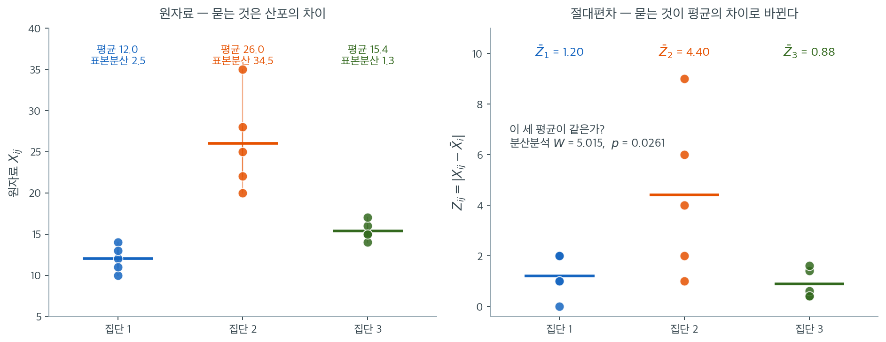

# Levene 검정

카이제곱 검정, F 검정, Bartlett 검정은 모두 정규성을 가정하며 자료가 비정규이면 무너진다. Levene(1960)은 우아하게 단순한 아이디어를 제안했다. 분산을 직접 검정하는 대신 자료를 집단평균으로부터의 절대편차로 변환한 뒤 변환된 값에 표준 일원분산분석을 적용하는 것이다. 이 변환은 분산 비교 문제를 평균 비교 문제로 바꾸며, 평균 비교는 바탕 분포의 모양에 훨씬 덜 민감하다.

## 핵심 아이디어

어떤 집단의 분산이 크면 그 관측값들이 집단 중심에서 멀리 떨어지는 경향이 있다. 분산이 작으면 중심 가까이 모인다. Levene 검정은 이 직관을 다음 새 변수로 형식화한다.

$$
Z_{ij} = |X_{ij} - \bar{X}_i|
$$

여기서 $X_{ij}$는 집단 $i$의 $j$번째 관측값이고 $\bar{X}_i$는 집단 $i$의 평균이다. $Z_{ij}$는 각 관측값이 집단평균에서 얼마나 떨어져 있는지를 잰다. 분산이 큰 집단은 평균적으로 큰 $Z_{ij}$ 값을 만들어 낸다.

따라서 $H_0\colon \sigma_1^2 = \cdots = \sigma_k^2$을 검정하는 것은 $Z_{ij}$의 평균이 집단에 걸쳐 같은지를 검정하는 것과 같아진다.

## 검정통계량

변환된 값 $Z_{ij}$에 표준 일원분산분석의 F 통계량을 적용한다.

$$
W = \frac{(N - k) \sum_{i=1}^{k} n_i (\bar{Z}_i - \bar{Z})^2}{(k - 1) \sum_{i=1}^{k} \sum_{j=1}^{n_i} (Z_{ij} - \bar{Z}_i)^2}
$$

여기서

- $\bar{Z}_i = \frac{1}{n_i} \sum_{j=1}^{n_i} Z_{ij}$는 집단 $i$의 변환값 평균
- $\bar{Z} = \frac{1}{N} \sum_{i=1}^{k} \sum_{j=1}^{n_i} Z_{ij}$는 모든 변환값의 전체평균
- $N = \sum_{i=1}^{k} n_i$는 전체 표본크기
- $k$는 집단의 수

$H_0$과 완만한 정칙조건 아래에서 $W$는 근사적으로 $F_{k-1, N-k}$를 따른다.

## 가설

$$
H_0\colon \sigma_1^2 = \sigma_2^2 = \cdots = \sigma_k^2
$$

$$
H_1\colon \sigma_i^2 \neq \sigma_j^2 \text{ (적어도 한 쌍의)} i \neq j
$$

$W > F_{1-\alpha,\, k-1,\, N-k}$이면 $H_0$을 기각한다.

## Levene 검정이 로버스트한 이유

로버스트성은 두 원천에서 나온다.

1. **절대편차는 제곱편차보다 이상점에 덜 민감하다.** 표본분산은 $(X_{ij} - \bar{X}_i)^2$을 쓰므로 극단 관측값에 이차 영향력을 준다. 절대편차 $|X_{ij} - \bar{X}_i|$는 일차 영향력만 준다.

2. **평균에 대한 분산분석 F 검정 자체가 로버스트하다.** 중심극한정리에 의해 $Z_{ij}$ 자체가 정규가 아니더라도 표본크기가 어느 정도면 집단평균 $\bar{Z}_i$가 근사적으로 정규가 된다. 평균에 대한 F 검정이 이 로버스트성을 물려받는다.

여기에 근본적인 차이가 하나 더 있다. 앞의 검정들이 **4차 적률**에 의존한 데 반해 Levene 검정은 $Z$의 **2차 적률**만 쓴다. 곧 원자료의 첨도가 아니라 원자료의 분산에 해당하는 정보만 필요하다. 이것이 로버스트성의 진짜 근원이다.

!!! note "원래의 Levene 검정과 수정판"
    Levene의 1960년 원안은 집단평균 $\bar{X}_i$를 중심으로 쓴다. Brown-Forsythe 수정(다음 절에서 다룬다)은 평균을 집단중앙값으로 바꾸어 치우침과 이상점에 대한 추가 로버스트성을 제공한다.

    저자들이 단서 없이 "Levene 검정"이라 할 때 Brown-Forsythe 판을 뜻하는 경우가 있으므로 쓰는 소프트웨어의 문서를 확인해야 한다. **SciPy의 `stats.levene`은 기본값이 `center='median'`, 곧 Brown-Forsythe이다.** 원래의 Levene 검정을 쓰려면 `center='mean'`을 명시해야 한다.

<div class="exbox" markdown>

**보기 1.** <span class="diff easy" title="쉬움"></span> 세 집단의 Levene 검정. 세 집단의 관측값이 다음과 같다.

| 집단 1 | 집단 2 | 집단 3 |
|---|---|---|
| 10, 12, 14, 11, 13 | 20, 28, 22, 35, 25 | 15, 16, 14, 17, 15 |

</div>

??? success "풀이"
    **1단계.** 집단평균을 계산한다.

    - $\bar{X}_1 = 12.0$, $\bar{X}_2 = 26.0$, $\bar{X}_3 = 15.4$

    **2단계.** 절대편차 $Z_{ij} = |X_{ij} - \bar{X}_i|$를 계산한다.

    | 집단 1 | 집단 2 | 집단 3 |
    |---|---|---|
    | 2, 0, 2, 1, 1 | 6, 2, 4, 9, 1 | 0.4, 0.6, 1.4, 1.6, 0.4 |

    **3단계.** 변환값의 평균을 계산한다.

    - $\bar{Z}_1 = 1.20$, $\bar{Z}_2 = 4.40$, $\bar{Z}_3 = 0.88$
    - $\bar{Z} = (1.20 + 4.40 + 0.88)/3 = 2.16$ (집단 크기가 같으므로 단순평균)

    **4단계.** $Z_{ij}$ 값에 분산분석 공식을 적용해 $W$ 통계량을 계산한다. $k = 3$개 집단, $N = 15$개 관측값이므로 $H_0$ 아래에서 $W$는 $F_{2, 12}$를 따른다.

    **5단계.** $W$를 임계값 $F_{0.95,\, 2,\, 12} = 3.885$와 비교한다. 집단 2의 편차가 다른 집단보다 훨씬 크므로 큰 $W$ 값이 나올 것이고 $H_0$을 기각할 가능성이 높다.

이 변환이 실제로 무엇을 하는지 그림으로 보자. 왼쪽이 원자료이고 오른쪽이 절대편차 $Z_{ij}$이다.



왼쪽 그림에서 세 집단은 **중심의 높이도 다르고 퍼짐도 다르다.** 집단 2는 평균이 26으로 가장 높고 점들이 20에서 35까지 흩어져 있다. 우리가 묻고 싶은 것은 높이가 아니라 퍼짐인데, 두 정보가 한 그림에 섞여 있어 곧바로 검정하기 어렵다. 표본분산 $2.5,\ 34.5,\ 1.3$을 비교하려면 카이제곱 계열의 분포이론이 필요하고, 그 이론은 정규성을 요구한다.

각 점에서 제 집단의 평균까지의 **거리**만 재면 오른쪽 그림이 된다. 이 순간 높이 정보가 사라진다. 세 집단의 중심이 모두 0으로 옮겨졌기 때문이다. 남은 것은 오직 "평균에서 얼마나 떨어져 있는가"뿐이고, 그 평균값이 $\bar{Z}_1 = 1.20$, $\bar{Z}_2 = 4.40$, $\bar{Z}_3 = 0.88$이다.

**이제 질문이 완전히 바뀌었다.** "세 집단의 분산이 같은가"가 "세 집단의 $Z$ 평균이 같은가"가 되었고, 뒤의 질문은 11장에서 배운 일원분산분석이 그대로 답한다. 실제로 계산하면 $W = 5.015$, $p = 0.0261$로 5% 수준에서 기각한다.

변환 하나로 왜 로버스트해지는지도 여기서 보인다. 원자료 쪽 질문은 편차를 **제곱**해서 다루므로 4차 적률(첨도)에 매여 있었다. 오른쪽 질문은 $Z$의 **평균**을 다루므로 1차 적률 문제다. 평균에는 중심극한정리라는 보호막이 있다. 분산 검정을 평균 검정으로 바꾼 것이 레빈의 아이디어 전부이며, 그 한 번의 치환이 정규성 가정을 떼어 낸다.

<div class="exbox" markdown>

**보기 2.** <span class="diff easy" title="쉬움"></span> Levene 검정 — 중심의 선택. 보기 1 의 세 집단에 평균 중심과 중앙값 중심을 둘 다 적용한다.

**(1)** 두 중심에 대해 $W$ 를 **정의대로 손으로 조립**하고, 두 값의 비를 $\dfrac{\mathrm{SS}_{\text{between}}\text{의 몫}}{\ }\times\dfrac{\ }{\mathrm{SS}_{\text{within}}\text{의 몫}}$ 으로 쪼개어 **분자와 분모 가운데 어느 쪽이 결론을 뒤집는지** 밝히시오.

**(2)** SciPy 와 맞추어 보고, 중앙값으로 바꿀 때 분모가 커지는 까닭을 집단 2 와 3 의 편차에서 읽으시오.

</div>

??? success "풀이"

    **(1) 손으로 조립한다.** 두 중심 모두 집단크기가 $n_i = 5$, $N = 15$, $k = 3$ 이므로

    $$
    W = \frac{(N-k)\,\mathrm{SS}_{\text{between}}}{(k-1)\,\mathrm{SS}_{\text{within}}} = \frac{12\,\mathrm{SS}_{\text{between}}}{2\,\mathrm{SS}_{\text{within}}}
    $$

    이고, 두 중심의 차이는 $Z_{ij}$ 가 무엇이냐에만 있다.

    **평균 중심.** 집단평균이 $12.0,\ 26.0,\ 15.4$ 이므로 절대편차와 그 집단평균이

    | 집단 | $Z_{ij}$ | $\bar Z_i$ |
    |:---|:---|---:|
    | 1 | $2,\,0,\,2,\,1,\,1$ | $1.20$ |
    | 2 | $6,\,2,\,4,\,9,\,1$ | $4.40$ |
    | 3 | $0.4,\,0.6,\,1.4,\,1.6,\,0.4$ | $0.88$ |

    이고 전체평균이 $\bar Z = 2.16$ 이다. 따라서

    $$
    \mathrm{SS}_{\text{between}} = 5\bigl[(1.20-2.16)^2+(4.40-2.16)^2+(0.88-2.16)^2\bigr] = 5(7.5776) = 37.888
    $$

    이고 집단내 제곱합은 $2.800 + 41.200 + 1.328 = 45.328$ 이다. 그러므로

    $$
    W_{\text{평균}} = \frac{12 \times 37.888}{2 \times 45.328} = \frac{454.656}{90.656} = 5.015178
    $$

    **중앙값 중심.** 집단중앙값이 $12,\ 25,\ 15$ 이므로

    | 집단 | $Z_{ij}$ | $\bar Z_i$ |
    |:---|:---|---:|
    | 1 | $2,\,0,\,2,\,1,\,1$ | $1.20$ |
    | 2 | $5,\,3,\,3,\,10,\,0$ | $4.20$ |
    | 3 | $0,\,1,\,1,\,2,\,0$ | $0.80$ |

    이고 $\bar Z = 6.2/3 = 2.066667$ 이다. 집단간은 $5(6.906667) = 34.533333$, 집단내는 $2.800 + 54.800 + 2.800 = 60.400$ 이므로

    $$
    W_{\text{중앙값}} = \frac{12 \times 34.533333}{2 \times 60.400} = \frac{414.4}{120.8} = 3.430464
    $$

    **비를 쪼갠다.** $W$ 는 비이므로 두 판본의 몫도 분자의 몫과 분모의 몫으로 깔끔히 갈라진다.

    $$
    \frac{W_{\text{평균}}}{W_{\text{중앙값}}}
    = \underbrace{\frac{37.888}{34.5333}}_{1.0971}\times\underbrace{\frac{60.400}{45.328}}_{1.3325}
    = 1.4620
    $$

    **분모 쪽이 세 배 넘게 세다.** 분자는 $9.7\%$ 만 움직이는데 분모는 $33.3\%$ 움직인다. 중심을 중앙값으로 바꾸어 $W$ 가 $5.02$ 에서 $3.43$ 으로 떨어지는 일의 대부분은 **집단내 변동이 커진 데서** 온다.

    분자가 줄어드는 쪽은 예상할 수 있었다. 중앙값은 $\sum_j \lvert y_{ij} - c\rvert$ 를 최소화하므로 $\bar Z_i$ 가 중앙값에서 가장 작고(11.5절 보기 1 이 볼록성으로 유도해 두었다), 실제로 $4.40 \to 4.20$, $0.88 \to 0.80$ 으로 세 집단 모두 줄거나 그대로다. $\bar Z_i$ 들이 전체적으로 작아지면 그 흩어짐도 줄어들기 쉽다.

    **그러나 분모에는 그런 보증이 없다.** 중앙값이 최소화하는 것은 $Z$ 의 **합**이고, 분모는 $Z$ 의 **집단내 제곱합**이다. 최소화되는 양과 분모는 다른 양이므로 부등식이 넘어오지 않으며, 여기서는 오히려 커졌다. 이것이 "$W$ 는 비이므로 $\bar Z$ 의 부등식을 물려받지 않는다"는 말의 구체적인 모습이다.

    **(2) 확인한다.**

    ```python
    import numpy as np
    from scipy import stats

    # 2번 집단만 퍼짐이 크다.
    group1 = [10, 12, 14, 11, 13]
    group2 = [20, 28, 22, 35, 25]
    group3 = [15, 16, 14, 17, 15]
    groups = [np.array(g, dtype=float) for g in (group1, group2, group3)]


    def levene_by_hand(groups, center):
        """W 를 정의대로 조립하고 분자·분모를 따로 돌려준다."""
        Z = [np.abs(g - center(g)) for g in groups]
        n = np.array([len(z) for z in Z])
        zbar = np.array([z.mean() for z in Z])
        N, k = n.sum(), len(Z)
        grand = np.concatenate(Z).mean()
        ss_between = (n * (zbar - grand) ** 2).sum()
        ss_within = sum(((z - z.mean()) ** 2).sum() for z in Z)
        W = (N - k) * ss_between / ((k - 1) * ss_within)
        return W, zbar, grand, ss_between, ss_within


    res = {}
    for name, center in [("mean", np.mean), ("median", np.median)]:
        W, zbar, grand, sb, sw = levene_by_hand(groups, center)
        res[name] = (W, sb, sw)
        print(f"[{name:>6} 중심]")
        print(f"  Z 의 집단평균 = {np.round(zbar, 4)},  전체평균 = {grand:.6f}")
        print(f"  SS_between = {sb:.6f}   SS_within = {sw:.6f}")
        print(f"  W = 12 * {sb:.6f} / (2 * {sw:.6f}) = {W:.6f}")

    # Levene 의 원래 형태는 평균을 중심으로 쓴다. 각 값에서 제 집단의 평균을
    # 뺀 절대편차에 분산분석을 돌리는 것이다.
    stat, p_value = stats.levene(group1, group2, group3, center='mean')
    print(f"\nLevene's W statistic (mean-centered):   {stat:.4f}, p = {p_value:.4f}")

    # 중앙값을 중심으로 쓰면 Brown-Forsythe 가 되고, 이것이 scipy 의 기본값이다.
    # 이름이 levene 이라 평균 중심이 기본이라고 오해하기 쉽다.
    stat_m, p_m = stats.levene(group1, group2, group3, center='median')
    print(f"Brown-Forsythe (median-centered):       {stat_m:.4f}, p = {p_m:.4f}")

    alpha = 0.05
    if p_value < alpha:
        print("Levene (mean): reject H0 - variances differ.")
    else:
        print("Levene (mean): fail to reject H0.")

    # 손 계산과 scipy 가 맞는지, 그리고 비를 분자·분모로 쪼갠다.
    Wm, sbm, swm = res["mean"]
    Wd, sbd, swd = res["median"]
    print(f"\n손 계산과 scipy 의 차: 평균 {abs(Wm - stat):.2e},  중앙값 {abs(Wd - stat_m):.2e}")
    print(f"W(평균)/W(중앙값) = {Wm / Wd:.6f}")
    print(f"  분자 몫 SS_b(평균)/SS_b(중앙값) = {sbm / sbd:.6f}   (중앙값 쪽이 {100 * (1 - sbd / sbm):.1f}% 작다)")
    print(f"  분모 몫 SS_w(중앙값)/SS_w(평균) = {swd / swm:.6f}   (중앙값 쪽이 {100 * (swd / swm - 1):.1f}% 크다)")
    print(f"  두 몫의 곱 = {(sbm / sbd) * (swd / swm):.6f}")
    crit = stats.f(2, 12).ppf(0.95)
    print(f"\nF(0.95; 2, 12) = {crit:.4f}  ->  평균 {Wm:.4f} 는 넘고, 중앙값 {Wd:.4f} 는 못 넘는다")

    # 집단 2 와 3 의 편차를 중심별로 나란히 본다.
    print()
    for i in (1, 2):
        g = groups[i]
        zm, zd = np.abs(g - g.mean()), np.abs(g - np.median(g))
        print(f"집단 {i + 1}: 평균 {g.mean():.2f} / 중앙값 {np.median(g):.2f}")
        print(f"   |x - 평균|   = {np.sort(zm)}  평균 {zm.mean():.3f}  SS {((zm - zm.mean()) ** 2).sum():.3f}")
        print(f"   |x - 중앙값| = {np.sort(zd)}  평균 {zd.mean():.3f}  SS {((zd - zd.mean()) ** 2).sum():.3f}")
    ```

    출력:

    ```text
    [  mean 중심]
      Z 의 집단평균 = [1.2  4.4  0.88],  전체평균 = 2.160000
      SS_between = 37.888000   SS_within = 45.328000
      W = 12 * 37.888000 / (2 * 45.328000) = 5.015178
    [median 중심]
      Z 의 집단평균 = [1.2 4.2 0.8],  전체평균 = 2.066667
      SS_between = 34.533333   SS_within = 60.400000
      W = 12 * 34.533333 / (2 * 60.400000) = 3.430464

    Levene's W statistic (mean-centered):   5.0152, p = 0.0261
    Brown-Forsythe (median-centered):       3.4305, p = 0.0663
    Levene (mean): reject H0 - variances differ.

    손 계산과 scipy 의 차: 평균 0.00e+00,  중앙값 0.00e+00
    W(평균)/W(중앙값) = 1.461954
      분자 몫 SS_b(평균)/SS_b(중앙값) = 1.097143   (중앙값 쪽이 8.9% 작다)
      분모 몫 SS_w(중앙값)/SS_w(평균) = 1.332510   (중앙값 쪽이 33.3% 크다)
      두 몫의 곱 = 1.461954

    F(0.95; 2, 12) = 3.8853  ->  평균 5.0152 는 넘고, 중앙값 3.4305 는 못 넘는다

    집단 2: 평균 26.00 / 중앙값 25.00
       |x - 평균|   = [1. 2. 4. 6. 9.]  평균 4.400  SS 41.200
       |x - 중앙값| = [ 0.  3.  3.  5. 10.]  평균 4.200  SS 54.800
    집단 3: 평균 15.40 / 중앙값 15.00
       |x - 평균|   = [0.4 0.4 0.6 1.4 1.6]  평균 0.880  SS 1.328
       |x - 중앙값| = [0. 0. 1. 1. 2.]  평균 0.800  SS 2.800
    ```

    **손 계산과 SciPy 가 완전히 같다.** 차가 두 경우 모두 `0.00e+00` 이다. 그리고 두 몫의 곱 $1.097143 \times 1.332510 = 1.461954$ 가 $W$ 의 비와 소수 여섯째 자리까지 맞는다. 비를 분자와 분모로 쪼갠 계산이 맞다는 뜻이다.

    **분모가 커지는 까닭이 마지막 두 덩어리에 보인다.** 집단 2 에서 중심을 $26.0$ 에서 $25.0$ 으로 옮기면 편차가 $(1,2,4,6,9)$ 에서 $(0,3,3,5,10)$ 으로 바뀐다. 평균은 $4.40$ 에서 $4.20$ 으로 **줄었는데** 제곱합은 $41.2$ 에서 $54.8$ 로 $33\%$ 늘었다. 중앙값 $25$ 가 관측값 하나와 겹쳐 편차 $0$ 이 강제로 생기고, 동시에 가장 먼 $35$ 의 편차가 $9$ 에서 $10$ 으로 벌어지기 때문이다. **양 끝이 동시에 밀려 나가므로 평균은 줄고 산포는 커진다.** 집단 3 도 같다. 편차가 $(0.4,0.4,0.6,1.4,1.6)$ 에서 $(0,0,1,1,2)$ 로 바뀌며 평균은 $0.88 \to 0.80$, 제곱합은 $1.328 \to 2.800$ 으로 두 배가 된다.

    관측값 개수가 홀수이면 중앙값이 언제나 관측값 하나와 같으므로 $Z_{ij} = 0$ 이 반드시 하나 생긴다. $n_i = 5$ 처럼 작은 집단에서는 그 한 칸이 $Z$ 의 산포에 미치는 몫이 $1/5$ 이라 분모를 눈에 띄게 흔든다. **이 보기에서 결론이 갈리는 것은 집단 2 의 치우침만의 일이 아니라, 집단당 다섯 개라는 표본크기의 일이기도 하다.**

    임계값으로 읽으면 간명하다. $F(0.95;\,2,\,12) = 3.8853$ 을 평균 판 $5.0152$ 는 넘고 중앙값 판 $3.4305$ 는 넘지 못한다. 두 값이 임계값을 사이에 두고 양쪽에 있으니 결론이 갈린다. 다만 **어느 쪽이 "옳은" 답인지를 이 자료가 말해 주지는 않는다.** 그 판단은 연습문제 3 이 다룬다.

!!! warning "중심의 선택이 결론을 바꾼다"
    같은 자료에서 평균 중심 Levene은 $p = 0.026$으로 기각하고 중앙값 중심 Brown-Forsythe는 $p = 0.066$으로 기각하지 못한다. 5% 문턱을 사이에 두고 결론이 갈린다.

    집단 2의 관측값 $\{20, 28, 22, 35, 25\}$에서 35가 이상점처럼 작용하기 때문이다. 평균 26.0은 이 값에 끌려가지만 중앙값 25는 거의 영향받지 않는다. 그 결과 평균 기준 편차가 더 크게 나온다.

    **어느 쪽을 보고할지는 자료를 보기 전에 정해야 한다.** 두 결과를 계산한 뒤 마음에 드는 쪽을 고르는 것은 $p$값 조작이다.

## 강점과 한계

**강점:**

- 중간 정도의 정규성 이탈에 로버스트하다
- 계산이 간단하다(절대편차에 대한 분산분석일 뿐)
- 모든 주요 통계 소프트웨어에서 제공된다
- 대칭인 비정규 분포에서 잘 작동한다

**한계:**

- 여전히 집단평균을 쓰므로 이상점과 치우침에 민감하다. Brown-Forsythe 수정이 중앙값을 써서 이를 해결한다.
- $F$ 분포 근사는 점근적이다. 아주 작은 표본에서는 크기 왜곡이 나타날 수 있다.
- 자료가 정말로 정규일 때는 Bartlett 검정보다 검정력이 낮다.

## 연습문제

<div class="drillbox" markdown>

**연습문제 1.** <span class="diff easy" title="쉬움"></span>
세 집단의 학생에게 서로 다른 교수법을 적용했다. 학기 후 점수가 다음과 같이 기록되었다.

- **집단 1:** $[78, 82, 85, 90, 87]$
- **집단 2:** $[65, 70, 72, 68, 74]$
- **집단 3:** $[92, 88, 94, 89, 91]$

Levene 검정으로 세 집단의 점수 분산이 같은지 판정하라.

</div>

??? success "풀이"

    **가설:**

    - 귀무가설 ($H_0$): 세 집단의 분산이 같다.
    - 대립가설 ($H_1$): 적어도 한 집단의 분산이 다른 집단과 다르다.

    **Python 구현:**

    ```python
    import numpy as np
    from scipy.stats import levene, bartlett

    group1 = [78, 82, 85, 90, 87]
    group2 = [65, 70, 72, 68, 74]
    group3 = [92, 88, 94, 89, 91]

    print("variances:", [round(np.var(g, ddof=1), 2)
                         for g in (group1, group2, group3)])

    s_med, p_med = levene(group1, group2, group3)                  # median
    s_mean, p_mean = levene(group1, group2, group3, center='mean')
    s_b, p_b = bartlett(group1, group2, group3)

    print(f"Brown-Forsythe (default): W = {s_med:.4f}, p = {p_med:.4f}")
    print(f"Levene (mean-centered):   W = {s_mean:.4f}, p = {p_mean:.4f}")
    print(f"Bartlett:                 T = {s_b:.4f}, p = {p_b:.4f}")
    ```

    출력:

    ```text
    variances: [21.3, 12.2, 5.7]
    Brown-Forsythe (default): W = 0.7500, p = 0.4933
    Levene (mean-centered):   W = 0.9837, p = 0.4022
    Bartlett:                 T = 1.4745, p = 0.4784
    ```

    **판정.** 세 검정 모두 $p > 0.05$로 기각하지 못한다. 세 집단의 분산이 다르다고 볼 증거가 없다.

    **해석.** 표본분산이 $21.3$, $12.2$, $5.7$로 최대·최소 비가 $3.7$에 이르는데도 유의하지 않다. 각 집단 $n = 5$로는 검정력이 사실상 없기 때문이다. 15.4절 연습문제 4에서 보았듯 이 정도 표본으로는 네 배 이상의 분산 차이가 있어야 탐지한다.

    **결론을 어떻게 써야 하는가.** "분산이 같다"가 아니라 **"이 자료로는 분산 차이를 탐지할 수 없다"**가 옳은 서술이다. 후속 분산분석을 한다면 등분산 가정이 확인되었다고 보지 말고 Welch 분산분석을 쓰는 편이 안전하다. $\square$

<div class="drillbox" markdown>

**연습문제 2.** <span class="diff med" title="중간"></span>
두 모집단에서 표본을 뽑아 분석했다. Levene 검정은 높은 $p$값(등분산 $H_0$ 기각 실패)을 냈으나, 등분산을 가정한 $t$ 검정은 $p < 0.001$을 냈다. 이 두 결과를 어떻게 해석해야 하는가?

</div>

??? success "풀이"

    - Levene 검정은 두 모집단의 **분산이 같다**는 가정을 뒷받침한다.
    - $t$ 검정 결과는 두 모집단의 **평균**이 유의하게 다르다는 **강한 증거**를 제공한다.
    - 두 결과는 모순이 아니다. 두 모집단이 같은 분산을 가지면서 평균은 크게 다를 수 있다. Levene 검정이 $t$ 검정에 쓰인 등분산 가정을 뒷받침하므로, 관찰된 평균 차이가 진짜라는 결론이 오히려 강화된다.

    **분산과 평균은 서로 다른 모수이다.** 분포의 위치(평균)와 산포(분산)는 독립적으로 변할 수 있다. 예컨대 $\mathcal{N}(0, 4)$와 $\mathcal{N}(10, 4)$는 분산이 같고 평균이 크게 다르다. 검정 결과의 조합이 이 상황을 정확히 반영한다. $\square$

<div class="drillbox" markdown>

**연습문제 3.** <span class="diff med" title="중간"></span>
본문 보기에서 평균 중심 Levene($p = 0.026$)과 중앙값 중심 Brown-Forsythe($p = 0.066$)의 결론이 갈렸다. 어느 쪽을 신뢰해야 하는지 판단하고, 그 판단의 근거를 제시하라.

</div>

??? success "풀이"
    **자료를 먼저 살펴본다.** 집단 2는 $\{20, 22, 25, 28, 35\}$(정렬)이다. 평균은 26.0, 중앙값은 25이다. 값 35가 다음으로 큰 값 28보다 7만큼 떨어져 있어 오른쪽 꼬리가 길다.

    ```python
    import numpy as np
    from scipy import stats

    g2 = np.array([20, 28, 22, 35, 25])
    print(f"mean = {g2.mean()}, median = {np.median(g2)}")
    print(f"|x - mean| = {np.abs(g2 - g2.mean())}")
    print(f"|x - median| = {np.abs(g2 - np.median(g2))}")
    ```

    출력:

    ```text
    mean = 26.0, median = 25.0
    |x - mean| = [6. 2. 4. 9. 1.]
    |x - median| = [ 5.  3.  3. 10.  0.]
    ```

    두 편차 집합의 평균은 각각 $4.4$와 $4.2$로 크게 다르지 않다. 결론이 갈리는 것은 분자보다 **분모**(집단 안의 편차 변동) 차이 때문이다.

    **어느 쪽을 신뢰할 것인가.**

    - $n = 5$로 매우 작으므로 어느 검정이든 신뢰도가 낮다. $p = 0.026$과 $p = 0.066$의 차이를 실질적 차이로 읽어서는 안 된다.
    - 원리적으로는 **Brown-Forsythe가 더 안전한 기본값**이다. 집단 2에 치우침의 징후가 있으므로 평균이 좋은 중심 측도가 아니다.
    - 그러나 **가장 정직한 결론은 "경계선상이며 이 자료로는 판정할 수 없다"**이다.

    **실무 지침.** 이런 경우 두 $p$값을 모두 보고하고, 표본크기의 한계를 명시하며, 후속 분석에서는 등분산 가정에 의존하지 않는 절차(Welch)를 쓰는 것이 옳다. 문턱을 넘은 쪽만 골라 보고하는 것이 가장 나쁜 선택이다. $\square$

<div class="drillbox" markdown>

**연습문제 4.** <span class="diff med" title="중간"></span>
Levene 검정이 원자료의 4차 적률에 의존하지 않는다는 본문의 주장을 확인하라. 절대편차 $Z = |X - \mu|$의 분산이 원자료의 어떤 적률에 의존하는지 계산하라.

</div>

??? success "풀이"
    $X$가 평균 $\mu$, 분산 $\sigma^2$을 갖고 $Z = |X - \mu|$라 하자.

    $$
    \operatorname{Var}(Z) = E[Z^2] - (E[Z])^2 = E[(X-\mu)^2] - (E|X-\mu|)^2 = \sigma^2 - \left(E|X-\mu|\right)^2.
    $$

    $E[Z^2] = \sigma^2$이 되는 것이 핵심이다. 절댓값의 제곱이 그냥 제곱이므로 **2차 적률만 필요하다**.

    두 번째 항 $E|X-\mu|$는 평균절대편차(MAD)로, 분포의 모양에 의존하지만 어디까지나 **1차** 양이다. 정규분포에서는 $E|X-\mu| = \sigma\sqrt{2/\pi} = 0.7979\sigma$이므로

    $$
    \operatorname{Var}(Z) = \sigma^2 - \frac{2\sigma^2}{\pi} = \sigma^2\left(1 - \frac{2}{\pi}\right) = 0.3634\,\sigma^2.
    $$

    **비교.** Bartlett 검정과 F 검정은 $S^2$의 분산을 다루므로 $\operatorname{Var}(S^2) \approx \sigma^4(\gamma_2+2)/n$, 곧 **4차 적률**이 필요했다. Levene 검정은 $\bar{Z}$의 분산 $\operatorname{Var}(Z)/n$을 다루므로 **2차 적률**만 필요하다.

    이것이 결정적인 차이이다. 4차 적률은 꼬리가 조금만 두꺼워져도 폭발적으로 커지고 심하면 존재하지 않지만($t_5$의 8차 적률처럼), 2차 적률은 분산이 유한한 어떤 분포에서든 존재하고 안정적이다.

    **$Z$의 분포가 비정규라는 점은 문제가 되지 않는다.** $Z \geq 0$이고 오른쪽으로 치우쳐 있지만, 분산분석 F 검정이 필요로 하는 것은 $Z$ 자체의 정규성이 아니라 $\bar{Z}_i$의 근사적 정규성이며 이는 중심극한정리가 보장한다. 곧 Levene 검정은 정규성 가정을 **더 쉽게 충족되는 가정으로 바꾼** 것이다. $\square$

---

## 정리하며

레빈의 착상은 **문제를 바꾸는 것**이다.

$$
Z_{ij}=|X_{ij}-\bar X_i| \;\longrightarrow\; Z \text{ 에 일원배치 분산분석}
$$

- **분산 비교를 평균 비교로 환원한다.** 분산이 큰 집단은 중심에서 멀리 퍼지므로 절대편차의 **평균**이 크다. 그 평균들을 비교하면 된다.
- **평균 비교는 분포 모양에 훨씬 덜 민감하다.** 중심극한정리의 보호를 받기 때문이며, 이것이 로버스트성의 원천이다.
- **바틀렛과 정반대의 성격이다.** 정규성 아래 최적성은 포기하고 넓은 범위의 분포에서 타당성을 얻는다.
- **$F$ 분포를 기준으로 쓴다.** 변환 후에는 보통의 분산분석이므로 11장의 결과가 그대로 적용된다.
- **중심을 무엇으로 잡느냐가 남은 선택이다.** 다음 절의 브라운–포사이드가 그 답을 바꾼다.

다음 절 **Brown-Forsythe**로 넘어간다.
