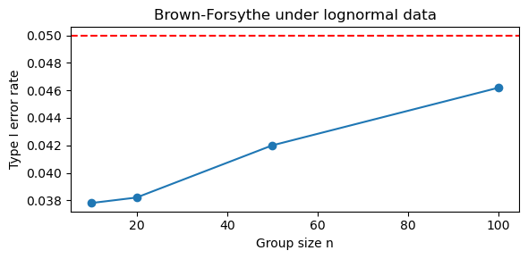

# Levene 검정 정규 대 치우친 분포 모의실험

## 개요

중앙값 중심 Levene 검정(Brown-Forsythe 변형)은 비정규성에 로버스트하다는 이유로 분산 동일성 검정에 자주 권장된다. 이 페이지는 정규 자료와 치우친(대수정규) 자료 모두에서 중앙값 중심 Levene 검정의 제1종 오류율을 몬테카를로 모의실험으로 조사한다. 목표는 서로 다른 분포 설정에 걸쳐 이 검정이 명목 크기 $\alpha = 0.05$를 유지하는지 확인하는 것이다.

## 모의실험 설계

모의실험은 다음과 같이 진행된다.

1. 정규분포 또는 대수정규분포에서 모수가 모두 같은 크기 $n$인 집단 $k = 3$개를 생성한다($H_0$이 성립한다).
2. 수준 $\alpha = 0.05$에서 중앙값 중심 Levene 검정을 적용한다.
3. $H_0$이 기각되었는지 기록한다.
4. $B$번 반복하여 경험적 제1종 오류율을 계산한다.

검정이 잘 보정되어 있다면 분포와 무관하게 기각률이 0.05에 가까워야 한다.

<div class="codebox" markdown>

### 예제 1. 모집단 모양에 따른 제1종 오류율 { .eg }

```python
import numpy as np
from scipy.stats import levene

rng = np.random.default_rng(0)

def simulate_once(n=20, dist="normal"):
    """주어진 분포에서 세 집단을 만들어 검정하고 p-값을 돌려준다.

    셋 다 같은 모수를 쓰므로 분산은 참으로 같다. 그러니 기각 비율이
    0.05 근처로 나와야 옳다.
    """
    if dist == "normal":
        g1 = rng.normal(0, 1.0, size=n)
        g2 = rng.normal(0, 1.0, size=n)
        g3 = rng.normal(0, 1.0, size=n)
    else:
        g1 = rng.lognormal(0, 1.0, size=n)
        g2 = rng.lognormal(0, 1.0, size=n)
        g3 = rng.lognormal(0, 1.0, size=n)
    _, p = levene(g1, g2, g3, center='median')
    return p

# 정규와 로그정규에서 각각 돌려 본다. Bartlett 이라면 로그정규에서
# 오류율이 크게 부풀지만, 중앙값 중심 방법은 0.05 근처를 지킨다.
alpha = 0.05
n_sims = 5000

for dist in ["normal", "lognormal"]:
    pvals = [simulate_once(20, dist) for _ in range(n_sims)]
    type1 = np.mean(np.array(pvals) < alpha)
    print(f"Type I error (median-centered) under {dist}: {type1:.4f}")
```

출력:

```text
Type I error (median-centered) under normal: 0.0370
Type I error (median-centered) under lognormal: 0.0374
```

</div>

## 해석

- **정규** 자료에서 기각률이 $0.037$로 0.05에 가깝다. 다소 보수적이다.
- **대수정규** 자료에서도 $0.0374$로 사실상 동일하다. 중앙값 중심 Levene 검정의 로버스트성을 잘 보여준다.
- 같은 대수정규 상황에서 Bartlett 검정이 $0.675$의 기각률을 보이는 것과 극명하게 대비된다(15.8절 [Bartlett 검정 비정규성 민감도](../bartlett_test/bartlett_sensitivity.md)).
- 중앙값 중심 변형이 로버스트성을 얻는 것은 중앙값이 대수정규분포 오른쪽 꼬리의 극단값에 영향받지 않기 때문이다.

!!! note "두 수치가 거의 같다는 사실이 핵심이다"
    정규 $0.0370$과 대수정규 $0.0374$의 차이는 몬테카를로 오차($\sqrt{0.037 \times 0.963/5000} = 0.0027$) 안에 있다. 곧 **분포가 완전히 바뀌었는데도 검정의 크기가 전혀 변하지 않았다.**

    이것이 "로버스트"의 정확한 의미이다. 절대적으로 정확하다는 뜻이 아니라(둘 다 0.05가 아니라 0.037이다), **분포가 바뀌어도 성능이 변하지 않는다**는 뜻이다.

    $0.037$이라는 약간의 보수성은 15.5절 [로버스트 검정](./robust_tests.md) 연습문제 4에서 논한 자유도 문제에서 온다. 중앙값을 추정하는 데 쓴 자유도가 $F$ 기준분포에 반영되지 않기 때문이다.

## 연습문제

<div class="drillbox" markdown>

**연습문제 1.** <span class="diff med" title="중간"></span> **평균 중심** Levene 검정의 제1종 오류도 계산하도록 모의실험을 확장하라. 대수정규 자료에서 두 중심화 방식을 비교하라.

</div>

??? success "풀이"

    ```python
    import numpy as np
    from scipy.stats import levene

    rng = np.random.default_rng(0)
    n_sims, n, alpha = 5000, 20, 0.05

    for center in ['mean', 'median']:
        rej = 0
        for _ in range(n_sims):
            g1 = rng.lognormal(0, 1, n)
            g2 = rng.lognormal(0, 1, n)
            g3 = rng.lognormal(0, 1, n)
            _, p = levene(g1, g2, g3, center=center)
            if p < alpha:
                rej += 1
        print(f"Levene ({center:6s}): Type I error = {rej/n_sims:.4f}")
    ```

    출력:

    ```text
    Levene (mean  ): Type I error = 0.2470
    Levene (median): Type I error = 0.0374
    ```

    평균 중심 판의 기각률이 $0.247$로 명목값의 **다섯 배**이다. 중앙값 중심 판은 $0.037$로 안정적이다. **6.6배 차이**이다.

    차이는 평균이 무거운 오른쪽 꼬리 쪽으로 끌려가는 데서 생긴다. $\text{Lognormal}(0,1)$의 왜도가 $6.185$로 극단적이므로 표본평균이 표본마다 크게 흔들리고, 그 흔들림이 그 집단의 **모든** 절대편차에 전파된다. 집단별 $\bar{Z}_i$가 실제보다 흩어져 F 통계량의 분자가 부풀려진다.

    중앙값은 붕괴점이 50%이므로 극단값에 흔들리지 않고, 이 연쇄가 끊어진다. $\square$

<div class="drillbox" markdown>

**연습문제 2.** <span class="diff med" title="중간"></span> 집단 크기를 $n \in \{10, 20, 50, 100\}$으로 바꿔가며 대수정규 자료에서 중앙값 중심 Levene 검정의 제1종 오류율을 그려라. 표본이 커지면 개선되는가?

</div>

??? success "풀이"

    ```python
    import numpy as np
    from scipy.stats import levene
    import matplotlib.pyplot as plt

    rng = np.random.default_rng(0)
    n_sims, alpha = 5000, 0.05
    sizes = [10, 20, 50, 100]
    rates = []

    for n in sizes:
        rej = 0
        for _ in range(n_sims):
            g1 = rng.lognormal(0, 1, n)
            g2 = rng.lognormal(0, 1, n)
            g3 = rng.lognormal(0, 1, n)
            _, p = levene(g1, g2, g3, center='median')
            if p < alpha:
                rej += 1
        rates.append(rej / n_sims)
        print(f"n={n:4d}: Type I error = {rej/n_sims:.4f}")

    plt.figure(figsize=(6, 3))
    plt.plot(sizes, rates, "o-")
    plt.axhline(0.05, ls="--", color="red")
    plt.xlabel("Group size n")
    plt.ylabel("Type I error rate")
    plt.title("Brown-Forsythe under lognormal data")
    plt.tight_layout()
    plt.show()
    ```

    출력:

    ```text
    n=  10: Type I error = 0.0378
    n=  20: Type I error = 0.0382
    n=  50: Type I error = 0.0420
    n= 100: Type I error = 0.0462
    ```

    

    | $n$ | 10 | 20 | 50 | 100 |
    |---|---|---|---|---|
    | 제1종 오류 | 0.038 | 0.038 | 0.042 | 0.046 |

    모든 표본크기에서 0.05 근처를 유지하며, **$n$이 커질수록 0.05에 더 가까워진다.**

    작은 $n$에서 다소 보수적인 것은 (1) 중앙값 추정에 쓴 자유도가 $F$ 기준분포에 반영되지 않고, (2) $\bar{Z}_i$의 정규근사가 아직 정확하지 않기 때문이다. $n$이 커지면서 두 효과가 모두 사라진다.

    **Bartlett과의 대비가 결정적이다.** 같은 자료에서 Bartlett은 $n$이 커질수록 **악화**되어 $0.675 \to 0.813$이었다(15.8절 연습문제 2). Brown-Forsythe는 개선된다.

    이 방향의 차이가 두 검정의 근본적 성격을 드러낸다. Brown-Forsythe의 편차는 **유한표본 근사 오차**이므로 $n$과 함께 사라지지만, Bartlett의 편차는 **모형 오설정**이므로 $n$과 함께 커진다. $\square$

<div class="drillbox" markdown>

**연습문제 3.** <span class="diff med" title="중간"></span> $t(3)$ 분포(대칭이지만 꼬리가 두꺼움) 자료로 모의실험을 반복하라. 중앙값 중심 Levene 검정이 평균 중심 판에 비해 어떻게 작동하는가?

</div>

??? success "풀이"

    ```python
    import numpy as np
    from scipy.stats import levene, t as tdist

    rng = np.random.default_rng(0)
    n_sims, n, alpha = 5000, 20, 0.05

    for center in ['mean', 'median']:
        rej = 0
        for _ in range(n_sims):
            g1 = tdist(df=3).rvs(n, random_state=rng)
            g2 = tdist(df=3).rvs(n, random_state=rng)
            g3 = tdist(df=3).rvs(n, random_state=rng)
            _, p = levene(g1, g2, g3, center=center)
            if p < alpha:
                rej += 1
        print(f"t(3), Levene ({center:6s}): {rej/n_sims:.4f}")
    ```

    출력:

    ```text
    t(3), Levene (mean  ): 0.0640
    t(3), Levene (median): 0.0340
    ```

    대칭인 두꺼운 꼬리($t(3)$)에서 두 중심화가 모두 비교적 잘 작동한다. 평균과 중앙값이 모두 0이기 때문이다.

    | 자료 | Levene (평균) | Brown-Forsythe |
    |---|---|---|
    | $t(3)$ (대칭, 두꺼운 꼬리) | 0.064 | 0.034 |
    | Lognormal (치우침) | **0.247** | 0.037 |

    **대비가 결정적이다.** 평균 중심 판은 $t(3)$에서 $0.064$로 약간만 부풀려지지만 대수정규에서는 $0.247$로 폭발한다. 두 분포 모두 꼬리가 극도로 두꺼운데도 그렇다($t(3)$은 초과첨도가 무한대이다).

    **곧 평균 중심화가 무너지는 것은 첨도 때문이 아니라 치우침 때문이다.** 이는 15.8절 [로버스트 분산 검정 비교](robust_tests_comparison.md)에서 반복 확인한 결론이다.

    중앙값 중심 판이 $t(3)$에서 $0.034$로 다소 보수적인 것은 극단값이 많은 자료에서 중앙값 중심 편차의 집단내 변동이 커져 F 통계량의 분모가 부풀려지기 때문이다. 로버스트성의 대가로 약간의 검정력을 내준다. $\square$

<div class="drillbox" markdown>

**연습문제 4.** <span class="diff med" title="중간"></span> 원자료가 비정규여도 Levene 검정통계량의 $F$ 분포 근사가 타당한 이유를 설명하라.

</div>

??? success "풀이"

    Levene 검정은 원래의 $X_{ij}$가 아니라 변환된 관측값 $Z_{ij} = |X_{ij} - c_i|$에 일원분산분석 F 검정을 적용한다. $X_{ij}$가 비정규여도 중심극한정리에 의해 $n$이 어느 정도면 집단평균 $\bar{Z}_{i\cdot}$이 근사적으로 정규이고, $Z_{ij}$로 계산한 F 통계량이 근사적으로 $F(k-1, N-k)$ 분포를 따른다.

    나아가 절대편차 변환은 분산안정화 연산이다. 문제를 분산 비교(정확한 이론에 정규성이 필요하다)에서 평균 비교(중심극한정리 덕분에 로버스트하다)로 옮긴다. 분산분석 F 검정은 균형 설계와 적당한 표본크기에서 입력 자료의 중간 정도 비정규성에 로버스트한 것으로 알려져 있다.

    **더 근본적인 이유: 필요한 적률의 차수가 낮아진다.** 15.5절 [Levene 검정](./levene.md) 연습문제 4에서 보았듯

    $$
    \operatorname{Var}(Z) = E[Z^2] - (E[Z])^2 = \sigma^2 - (E|X-\mu|)^2
    $$

    이므로 **원자료의 2차 적률만** 필요하다. Bartlett과 F 검정이 4차 적률(첨도)을 요구하는 것과 대조된다.

    4차 적률은 꼬리가 조금만 두꺼워져도 폭발하거나 아예 존재하지 않지만($t_5$의 8차 적률처럼), 2차 적률은 분산이 유한한 어떤 분포에서든 존재하고 안정적이다.

    **한계도 명확하다.** 이 논거는 (1) $n$이 중심극한정리가 작동할 만큼 크고, (2) $c_i$의 추정이 안정적일 때만 성립한다. 연습문제 1에서 보았듯 평균을 $c_i$로 쓰고 자료가 강하게 치우쳐 있으면 (2)가 깨져 근사가 무너진다. $\square$

<div class="drillbox" markdown>

**연습문제 5.** <span class="diff med" title="중간"></span> 집단 $\sigma$ 모수가 $(1.0, 1.0, 1.5)$인 대수정규 자료(분산이 실제로 다르다)에서 중앙값 중심 Levene 검정의 **검정력**을 추정하는 모의실험을 설계하라. 같은 표준편차의 정규 자료에서의 검정력과 비교하라.

</div>

??? success "풀이"

    ```python
    import numpy as np
    from scipy.stats import levene

    rng = np.random.default_rng(0)
    n_sims, n, alpha = 5000, 30, 0.05

    for dist in ["normal", "lognormal"]:
        rej = 0
        for _ in range(n_sims):
            if dist == "normal":
                g1 = rng.normal(0, 1.0, n)
                g2 = rng.normal(0, 1.0, n)
                g3 = rng.normal(0, 1.5, n)
            else:
                g1 = rng.lognormal(0, 1.0, n)
                g2 = rng.lognormal(0, 1.0, n)
                g3 = rng.lognormal(0, 1.5, n)
            _, p = levene(g1, g2, g3, center='median')
            if p < alpha:
                rej += 1
        print(f"{dist:10s}: power = {rej/n_sims:.4f}")
    ```

    출력:

    ```text
    normal    : power = 0.5122
    lognormal : power = 0.2086
    ```

    !!! warning "두 검정력을 직접 비교할 수 없다"
        정규 $0.512$와 대수정규 $0.209$의 차이가 "대수정규에서 검정력이 낮다"를 뜻하는 것처럼 보이지만, **두 설정의 참 분산비가 완전히 다르다.**

        - **정규:** $\sigma = (1, 1, 1.5)$이므로 분산비가 $1 : 1 : 2.25$이다.
        - **대수정규:** $\sigma$는 **로그 척도의** 모수이다. 실제 분산은 $(e^{\sigma^2}-1)e^{\sigma^2}$이므로

        $$
        \sigma = 1.0 \Rightarrow \operatorname{Var} = (e-1)e = 4.671, \qquad
        \sigma = 1.5 \Rightarrow \operatorname{Var} = (e^{2.25}-1)e^{2.25} = 80.53.
        $$

        분산비가 $1 : 1 : 17.2$로 정규 설정의 **일곱 배 이상**이다.

        곧 대수정규 설정은 **훨씬 큰 분산 차이를 훨씬 낮은 검정력으로** 탐지하고 있다. 검정력 손실이 실제로는 표에 보이는 것보다 훨씬 크다.

    **왜 그렇게 어려운가.** 대수정규에서 $\sigma$가 커지면 분산만 커지는 것이 아니라 **분포 모양 자체가 바뀐다.** $\sigma = 1.5$이면 왜도가 $33.5$, 초과첨도가 약 $10{,}075$로 극단적이다. 중앙값 중심 편차의 분포가 심하게 치우쳐 있어 $\bar{Z}_i$의 정규근사가 나쁘고, F 검정의 검정력이 크게 떨어진다.

    **중요한 점은 검정력이 "정직하다"는 것이다.** 본문에서 확인했듯 제1종 오류율이 통제되어 있으므로, 기각이 일어났다면 그것은 진짜 분산 불균등의 탐지이다. Bartlett의 높은 기각률은 그런 보장이 없다.

    **실무 지침.** 강하게 치우친 자료에서 분산을 비교해야 한다면, 로그 변환 후 검정하는 편이 검정력에서 훨씬 유리하다. $\ln X \sim \mathcal{N}(0, \sigma^2)$이므로 로그 척도에서는 정규 자료가 되고 분산비가 $1 : 1 : 2.25$인 문제로 환원된다. $\square$

---

## 정리하며

중앙값 중심 레빈의 **제1종 오류율을 직접 확인**했다.

- **정규 자료에서 명목 $5\%$ 를 지킨다.** 기본적인 타당성 확인이다.
- **로그정규 자료에서도 지킨다.** 이것이 핵심 결과이며, 같은 조건에서 바틀렛이 무너지는 것과 대조된다.
- **표본크기를 바꿔 가며 확인하는 것이 중요하다.** 소표본에서는 어떤 검정이든 근사가 불안할 수 있다.
- **집단 수와 불균형도 변수다.** $k$ 가 크거나 표본크기가 크게 다르면 오류율이 조금 흔들릴 수 있다.
- **"로버스트하다"를 수치로 보여 주는 절이다.** 주장과 증거를 나란히 두는 것이 이 책의 방식이다.

다음 절 **Brown-Forsythe (코드)** 로 넘어간다.
