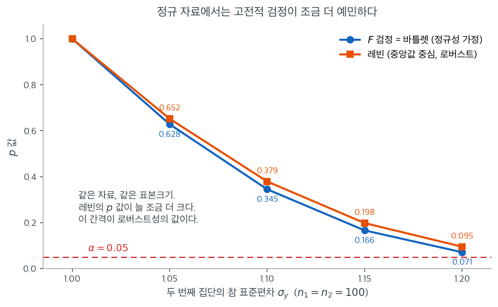

# Levene 검정

!!! note "이 주제를 다루는 다른 곳"
    분산분석의 등분산성 사전확인이라는 좁은 맥락에서 같은 검정을 짧게 쓰는 예가
    **11.5 가정**에 있다.

## 개요

Levene 검정은 둘 이상의 집단이 같은 분산을 갖는지(등분산성) 평가한다. Bartlett 검정과 달리 Levene 검정은 정규성 이탈에 로버스트하다. 분산 비교 문제를 절대편차에 대한 일원분산분석으로 환원하기 때문이다. 이 로버스트성 덕분에 합동분산 이표본 $t$ 검정이나 일원분산분석처럼 등분산을 가정하는 절차 앞에서 가장 흔히 권장되는 예비 확인 도구가 되었다.

## 검정 설정

크기 $n_1, \ldots, n_k$인 독립 집단 $k$개가 주어졌을 때 가설은

$$
H_0 : \sigma_1^2 = \sigma_2^2 = \cdots = \sigma_k^2 \quad \text{대} \quad H_1 : \sigma_i^2 \text{이 모두 같지는 않다}.
$$

## 검정통계량

각 관측값 $X_{ij}$에 대해 변환값을

$$
Z_{ij} = |X_{ij} - \bar{X}_i|
$$

로 정의한다. 여기서 $\bar{X}_i$는 집단평균이다(Levene의 원래 형태). 검정통계량은 $Z_{ij}$에 적용한 일원분산분석 F 통계량이다.

$$
W = \frac{(N - k) \sum_{i=1}^{k} n_i (\bar{Z}_{i\cdot} - \bar{Z}_{\cdot\cdot})^2}{(k - 1) \sum_{i=1}^{k} \sum_{j=1}^{n_i} (Z_{ij} - \bar{Z}_{i\cdot})^2},
$$

여기서 $N = \sum n_i$, $\bar{Z}_{i\cdot}$은 집단 $i$ 안의 $Z_{ij}$ 평균, $\bar{Z}_{\cdot\cdot}$은 전체평균이다. $H_0$ 아래에서

$$
W \;\dot{\sim}\; F(k-1,\; N-k).
$$

!!! note "중심화 변형"
    집단평균 $\bar{X}_i$를 집단 **중앙값**으로 바꾸면 Brown-Forsythe 검정이 되며, 치우친 분포에 더욱 로버스트하다.

    **SciPy의 `stats.levene`은 기본값이 `center='median'`, 곧 Brown-Forsythe이다.** 원래의 Levene 검정을 쓰려면 `center='mean'`을 명시해야 한다.

SciPy는 `scipy.stats.levene`을 직접 제공한다.

<div class="exbox" markdown>

**보기 1.** <span class="diff easy" title="쉬움"></span> 분산 차이를 키워 가며. 집단당 $n = 100$, $x$ 와 $y$ 에 **같은 씨앗**을 주고 $\sigma_y$ 만 $1.00$ 에서 $1.20$ 까지 키운다. 15.3절의 $F$ 검정·15.4절의 Bartlett 검정과 똑같은 설정이다.

**(1)** 이 설정에서 두 집단의 절대편차가 $Z^y_j = \sigma_y Z^x_j$ 로 **정확히** 비례함을 보이고, 이로부터 $W$ 의 닫힌 꼴을 구하시오. 그 식에서 자료가 어디로 모여 들어가는지 밝히시오.

**(2)** 수치로 확인하고, $\sigma_y = 1$ 에서 $W$ 가 정확히 $0$, $p$ 가 정확히 $1$ 이 되는 까닭을 (1)의 식으로 설명하시오.

</div>

??? success "풀이"

    **(1) 두 표본이 같은 난수를 공유한다.** `rvs(size, random_state=seed)` 는 씨앗 하나로 정해지는 표준정규 추출값 $z_1, \ldots, z_{100}$ 에 $a + s z_j$ 를 입힌다. 씨앗이 같으므로 두 표본에 들어가는 $z$ 가 **같은 수열**이고

    $$
    x_j = z_j, \qquad y_j = 1 + \sigma_y z_j
    $$

    이다. 중앙값은 증가하는 아핀변환에 대해 동변이므로 $\operatorname{med}(y) = 1 + \sigma_y \operatorname{med}(z)$ 이고, 따라서

    $$
    Z^y_j = \lvert y_j - \operatorname{med}(y)\rvert = \lvert \sigma_y (z_j - \operatorname{med}(z))\rvert = \sigma_y \lvert z_j - \operatorname{med}(z)\rvert = \sigma_y Z^x_j
    $$

    이다. **두 집단의 절대편차가 비례상수 $\sigma_y$ 로 완전히 묶여 있다.** 표집변동이 없다.

    **닫힌 꼴.** $Z = Z^x$, $\bar Z$ 를 그 평균, $S = \sum_j (Z_j - \bar Z)^2$ 이라 쓰자. 집단 1 의 편차는 $Z$, 집단 2 의 편차는 $\sigma_y Z$ 이므로 집단평균이 $\bar Z$ 와 $\sigma_y \bar Z$, 전체평균이 $\tfrac12(1+\sigma_y)\bar Z$ 다. 집단간 제곱합은

    $$
    \mathrm{SS}_{\text{between}} = n\left(\bar Z - \frac{1+\sigma_y}{2}\bar Z\right)^2 + n\left(\sigma_y \bar Z - \frac{1+\sigma_y}{2}\bar Z\right)^2 = \frac{n \bar Z^2 (\sigma_y-1)^2}{2}
    $$

    이고, 집단내 제곱합은 척도가 이차로 들어오므로

    $$
    \mathrm{SS}_{\text{within}} = S + \sigma_y^2 S = (1+\sigma_y^2)\,S
    $$

    이다. $N = 2n$, $k = 2$ 를 $W$ 의 정의에 넣으면

    $$
    W = \frac{(2n-2)\cdot \frac{n \bar Z^2(\sigma_y-1)^2}{2}}{1 \cdot (1+\sigma_y^2) S}
    = \underbrace{\frac{n(n-1)\bar Z^2}{S}}_{c}\cdot \frac{(\sigma_y-1)^2}{1+\sigma_y^2}
    $$

    를 얻는다. **자료는 상수 $c$ 하나로 접혀 들어가고, $\sigma_y$ 의 역할은 $(\sigma_y-1)^2/(1+\sigma_y^2)$ 라는 함수 하나로 분리된다.** $c$ 는 $x$ 표본의 절대편차만으로 정해지므로 $\sigma_y$ 를 바꾸어도 꿈쩍하지 않는다.

    **(2) $\sigma_y = 1$ 에서 왜 정확히 $0$ 과 $1$ 인가.** 위 식에 $\sigma_y = 1$ 을 넣으면 분자의 $(\sigma_y-1)^2$ 이 $0$ 이므로 $W = 0$ 이다. 어림값이 아니라 **항등적으로** $0$ 이다. 두 집단의 절대편차가 글자 그대로 같은 수열이어서 집단간 변동이 존재하지 않기 때문이다. 그리고 $F(1, 198)$ 의 분포함수가 $0$ 에서 $0$ 이므로 양측이 아닌 상단꼬리 $p$ 값이 $P(F \ge 0) = 1$ 이 된다. 독립 표본에서는 $W = 0$ 이 될 확률이 $0$ 이니 결코 일어나지 않는 일이다.

    **확인한다.**

    ```python
    import numpy as np
    import scipy.stats as stats

    # 앞의 Bartlett·F 검정과 같은 설정이다. 세 검정의 p-값을 견줄 수 있다.
    size, seed = 100, 1
    x = stats.norm(loc=0, scale=1).rvs(size, random_state=seed)

    for scale in [1.00, 1.05, 1.10, 1.15, 1.20]:
        y = stats.norm(loc=1, scale=scale).rvs(size, random_state=seed)
        stat, pval = stats.levene(x, y)   # median-centred by default
        print(f"sigma_y={scale:.2f}  W={stat:.4f}  p={pval:.3f}")

    # (1) 의 비례관계와 닫힌 꼴을 확인한다. 기본값이 중앙값이므로 Z 도 중앙값 기준.
    Z = np.abs(x - np.median(x))
    n = size
    c = n * (n - 1) * Z.mean() ** 2 / ((Z - Z.mean()) ** 2).sum()
    print(f"\nc = n(n-1) Zbar^2 / SS(Z) = {c:.6f}")

    print(f"\n{'sigma_y':>8}{'|Zy - s*Zx|max':>17}{'scipy W':>12}{'닫힌 꼴':>12}{'차':>10}")
    for scale in [1.00, 1.05, 1.10, 1.15, 1.20]:
        y = stats.norm(loc=1, scale=scale).rvs(size, random_state=seed)
        Zy = np.abs(y - np.median(y))
        W_sp, _ = stats.levene(x, y, center="median")
        W_cf = c * (scale - 1) ** 2 / (1 + scale ** 2)
        print(f"{scale:>8.2f}{np.abs(Zy - scale * Z).max():>17.2e}"
              f"{W_sp:>12.6f}{W_cf:>12.6f}{abs(W_sp - W_cf):>10.1e}")
    ```

    출력:

    ```text
    sigma_y=1.00  W=0.0000  p=1.000
    sigma_y=1.05  W=0.2044  p=0.652
    sigma_y=1.10  W=0.7780  p=0.379
    sigma_y=1.15  W=1.6657  p=0.198
    sigma_y=1.20  W=2.8187  p=0.095

    c = n(n-1) Zbar^2 / SS(Z) = 171.940898

     sigma_y   |Zy - s*Zx|max     scipy W        닫힌 꼴         차
        1.00         2.22e-16    0.000000    0.000000   4.3e-30
        1.05         2.22e-16    0.204448    0.204448   4.7e-16
        1.10         4.44e-16    0.778013    0.778013   6.7e-16
        1.15         4.44e-16    1.665735    1.665735   5.1e-15
        1.20         4.44e-16    2.818703    2.818703   4.4e-16
    ```

    **비례관계가 비트 단위로 맞는다.** $\lvert Z^y_j - \sigma_y Z^x_j\rvert$ 의 최대값이 $4.4\times10^{-16}$ 로 배정도 반올림 한 칸 수준이다.

    **닫힌 꼴도 맞는다.** $c = 171.940898$ 하나와 함수 $(\sigma_y-1)^2/(1+\sigma_y^2)$ 만으로 네 개의 $W$ 가 전부 재현되고, SciPy 값과의 차가 $5\times10^{-15}$ 이하다. 손으로 $\sigma_y = 1.20$ 을 넣어 보면

    $$
    171.940898 \times \frac{0.04}{2.44} = 2.818703
    $$

    이다. **$W$ 를 키우는 것은 표본이 아니라 $\sigma_y$ 하나뿐**임이 식과 수치에서 함께 확인된다.

    한 가지 더. 15.3절의 $F$ 검정에서는 같은 설정의 $F$ 가 정확히 $1/\sigma_y^2$ 였다. 거기서도 자료가 약분되어 사라졌지만, **여기서는 $c$ 라는 자료의 흔적이 남는다.** $F$ 검정은 분자와 분모가 같은 $S_z^2$ 를 쓰므로 통째로 약분되는데, Levene 은 집단간 변동과 집단내 변동이 서로 다른 조합이라 완전히 약분되지 않기 때문이다.

`center` 인자가 중심화 방식을 조절한다.

<div class="exbox" markdown>

**보기 2.** <span class="diff easy" title="쉬움"></span> 두 판본의 차이. 보기 1 의 같은 자료에 세 중심(평균·중앙값·$10\%$ 절사평균)을 넣는다.

**(1)** 보기 1 의 유도가 **중심의 선택과 무관하게** 성립함을 보이고, 따라서 세 판본의 $W$ 의 비가 $\sigma_y$ 에 **의존하지 않는 상수**임을 결론하시오. 또 그 상수를 $Z$ 의 변동계수로 적으시오.

**(2)** 세 판본을 돌려 그 비가 정말 $\sigma_y$ 에 무관한지 확인하시오. 이 자료에서 평균 판과 중앙값 판이 거의 같은 까닭은 무엇인가. 그리고 이 설정으로는 **확인할 수 없는** 것이 무엇인가.

</div>

??? success "풀이"

    **(1) 세 중심 모두 아핀 동변이다.** 보기 1 의 유도에서 중앙값이라는 사실은 한 곳에만 쓰였다. $y_j = 1 + \sigma_y z_j$ 일 때 중심 $c(\cdot)$ 가

    $$
    c(y) = 1 + \sigma_y\, c(z)
    $$

    를 만족한다는 것이다. 평균은 선형이므로 성립하고, 중앙값은 증가하는 아핀변환에 동변이므로 성립하며, 절사평균은 순서를 보존하는 변환이 같은 관측값을 잘라 내므로 역시 성립한다. 그러므로 어느 중심을 쓰든

    $$
    Z^y_j = \sigma_y Z^x_j
    $$

    가 그대로 성립하고, 보기 1 의 계산이 글자 하나 바뀌지 않고 되풀이되어

    $$
    W_{\text{center}} = c_{\text{center}} \cdot \frac{(\sigma_y-1)^2}{1+\sigma_y^2},
    \qquad
    c_{\text{center}} = \frac{n(n-1)\bar Z^2}{\sum_j (Z_j-\bar Z)^2}
    $$

    를 얻는다. **$\sigma_y$ 에 딸린 함수는 세 판본에서 똑같고, 중심의 선택은 상수 $c$ 만 바꾼다.** 따라서

    $$
    \frac{W_{\text{A}}}{W_{\text{B}}} = \frac{c_{\text{A}}}{c_{\text{B}}}
    $$

    가 되어 **$\sigma_y$ 와 무관한 상수**다. 이것은 돌려 보기 전에 확인할 수 있는 예측이다.

    **$c$ 를 변동계수로 적으면.** $\sum_j (Z_j - \bar Z)^2 = (n-1)\operatorname{Var}(Z)$ 이므로 $(n-1)$ 이 약분되어

    $$
    c = \frac{n \bar Z^2}{\operatorname{Var}(Z)} = \frac{n}{\mathrm{CV}(Z)^2},
    \qquad \mathrm{CV}(Z) = \frac{\operatorname{SD}(Z)}{\bar Z}
    $$

    이다. **중심의 선택이 $W$ 에 미치는 영향은 오직 하나, 절대편차의 변동계수를 얼마나 줄이는가다.** $\mathrm{CV}(Z)$ 가 작아지면 $c$ 가 커지고 $W$ 도 비례해서 커진다.

    **(2) 돌려서 확인한다.**

    ```python
    import inspect

    import numpy as np
    import scipy.stats as stats

    # 기본값이 무엇인지 함수 서명에서 직접 확인한다.
    print("levene 의 center 기본값 =",
          inspect.signature(stats.levene).parameters["center"].default)

    size, seed = 100, 1
    x = stats.norm(loc=0, scale=1).rvs(size, random_state=seed)
    scales = [1.00, 1.05, 1.10, 1.15, 1.20]

    # 중앙값 중심 — Brown-Forsythe 이며 scipy 의 기본값이다.
    # 평균 중심 — Levene 의 원래 형태. center 를 명시해야 이쪽이 된다.
    W = {}
    for center in ("mean", "median", "trimmed"):
        kw = {"proportiontocut": 0.1} if center == "trimmed" else {}
        row = []
        for scale in scales:
            y = stats.norm(loc=1, scale=scale).rvs(size, random_state=seed)
            stat, pval = stats.levene(x, y, center=center, **kw)
            row.append((stat, pval))
        W[center] = row
        cells = "  ".join(f"{s:.4f}/{p:.3f}" for s, p in row)
        print(f"{center:>8}  {cells}")

    # (1) 의 결론: 세 판본의 비는 sigma_y 와 무관해야 한다.
    print("\nW 의 비 (sigma_y = 1.05, 1.10, 1.15, 1.20)")
    for a, b in [("mean", "median"), ("median", "trimmed")]:
        r = [W[a][i][0] / W[b][i][0] for i in range(1, 5)]
        print(f"  {a:>6} / {b:<8} " + "  ".join(f"{v:.8f}" for v in r)
              + f"   폭 = {max(r) - min(r):.1e}")

    # 이 표본에서 평균과 중앙값이 얼마나 가까운가
    print(f"\nx 의 평균 {x.mean():+.6f},  중앙값 {np.median(x):+.6f},  차 {x.mean() - np.median(x):+.6f}")
    print(f"x 의 표본왜도 = {stats.skew(x):+.4f}")

    # 절사평균은 표본을 먼저 자른다. 그래서 자유도까지 바뀐다.
    xt = stats.trimboth(np.sort(x), 0.1)
    print(f"\n절사 뒤 집단크기 = {len(xt)}  ->  분모 자유도 N-k = {2 * len(xt) - 2} (원래는 198)")

    # c = n / CV(Z)^2 이므로, 중심을 바꾸면 Z 의 변동계수가 바뀌어 W 가 움직인다.
    print(f"\n{'중심':>8}{'n':>5}{'Zbar':>9}{'sd(Z)':>9}{'CV(Z)':>9}{'c = n/CV^2':>13}")
    for lbl, xx, ctr in [("median", x, np.median(x)),
                         ("trimmed", stats.trimboth(np.sort(x), 0.1), None)]:
        if ctr is None:
            ctr = xx.mean()
        Z = np.abs(xx - ctr)
        cv = Z.std(ddof=1) / Z.mean()
        print(f"{lbl:>8}{len(xx):>5}{Z.mean():>9.4f}{Z.std(ddof=1):>9.4f}{cv:>9.4f}{len(xx) / cv ** 2:>13.4f}")
    ```

    출력:

    ```text
    levene 의 center 기본값 = median
        mean  0.0000/1.000  0.2045/0.652  0.7780/0.379  1.6658/0.198  2.8188/0.095
      median  0.0000/1.000  0.2044/0.652  0.7780/0.379  1.6657/0.198  2.8187/0.095
     trimmed  0.0000/1.000  0.2446/0.622  0.9309/0.336  1.9930/0.160  3.3724/0.068

    W 의 비 (sigma_y = 1.05, 1.10, 1.15, 1.20)
        mean / median   1.00004257  1.00004257  1.00004257  1.00004257   폭 = 8.4e-15
      median / trimmed  0.83580724  0.83580724  0.83580724  0.83580724   폭 = 3.7e-15

    x 의 평균 +0.060583,  중앙값 +0.064074,  차 -0.003491
    x 의 표본왜도 = -0.0045

    절사 뒤 집단크기 = 80  ->  분모 자유도 N-k = 158 (원래는 198)

          중심    n     Zbar    sd(Z)    CV(Z)   c = n/CV^2
      median  100   0.7051   0.5378   0.7626     171.9409
     trimmed   80   0.4914   0.3065   0.6236     205.7184
    ```

    **기본값은 `median` 이다.** 함수 서명이 그렇게 말한다. 그러므로 `levene(x, y)` 라고만 쓰면 **원래의 Levene 검정이 아니라 Brown-Forsythe 검정**이 돌아간다. 보기 1 의 출력이 중앙값 줄과 같은 것이 그 증거다.

    **(1)의 예측이 맞는다.** 네 개의 $\sigma_y$ 에서 비가 소수 여덟째 자리까지 같고, 폭이 $10^{-14}$ 수준이다. 평균 대 중앙값은 $1.00004257$, 중앙값 대 절사평균은 $0.83580724$ 로 고정되어 있다. 중심을 바꾸는 일이 $\sigma_y$ 축을 **휘게 하지 않고 통째로 상수배 하는 것뿐**임이 확인되었다.

    **평균 판과 중앙값 판이 거의 같은 까닭.** 이 표본의 평균이 $+0.060583$, 중앙값이 $+0.064074$ 로 차이가 $0.0035$ 에 지나지 않는다. 표본왜도도 $-0.0045$ 다. $N(0,1)$ 에서 뽑았으니 당연하고, **두 중심이 거의 같으면 두 $Z$ 도 거의 같아 $c$ 가 거의 같다.** 여기서 두 판본의 차이는 $W$ 의 소수 넷째 자리, $p$ 값으로는 세 자리 안쪽이다. 두 판본이 크게 갈리는 것은 치우친 자료에서다. 모분산이 **정확히 같은** 로그정규 세 집단에서 평균 판이 $W = 2.0636$, 중앙값 판이 $W = 0.6888$ 로 갈리는 것을 11.5절 보기 1 이 측정해 두었고, 이 쪽 연습문제 3 의 지수 자료에서는 제1종 오류율이 $0.187$ 대 $0.047$ 로 네 배 차이가 난다.

    **절사평균 판은 $W$ 를 $19.6\%$ 키운다.** $1/0.8358 = 1.1964$ 다. 까닭이 $\mathrm{CV}(Z)$ 표에 있다. 절사는 중심에서 가장 먼 관측값들을 먼저 잘라 내므로 $Z$ 의 산포를 평균보다 더 많이 깎는다. $\mathrm{CV}(Z)$ 가 $0.7626$ 에서 $0.6236$ 으로 줄고, $c = n/\mathrm{CV}^2$ 이 $171.94$ 에서 $205.72$ 로 커진다. 집단당 $n$ 이 $100$ 에서 $80$ 으로 줄어 $c$ 를 깎는 효과가 있는데도 변동계수 쪽이 이겼다. 분모 자유도도 $198$ 에서 $158$ 로 줄어든다. $\sigma_y = 1.20$ 에서 $p$ 가 $0.095$ 에서 $0.068$ 로 내려가는 것이 그 합이다.

    **이 설정으로는 확인할 수 없는 것.** 절사평균 판의 제1종 오류율이다. $\sigma_y = 1.00$ 줄을 보면 세 판본 모두 $W = 0$, $p = 1.000$ 이다. 보기 1 에서 본 대로 $(\sigma_y-1)^2$ 이 $0$ 이면 중심이 무엇이든 $W$ 가 항등적으로 $0$ 이기 때문이다. **같은 씨앗이 표집변동을 없앴으니 "귀무가설이 참일 때 얼마나 자주 기각하는가"를 이 표에서는 읽을 수 없다.** 그것은 독립 표본으로 반복 추출해야 재는 값이고, 아래의 경고 상자가 가리키는 15.5절 [Brown-Forsythe 검정](./brown_forsythe.md)의 모의실험이 그 일을 한다.

!!! danger "`center='trimmed'`는 권하지 않는다"
    SciPy는 10% 절사평균 중심화도 제공하지만, 15.5절 [Brown-Forsythe 검정](./brown_forsythe.md)에서 측정했듯 **완전한 정규 자료에서도 제1종 오류율이 0.12~0.19까지 부풀려진다.**

    SciPy가 편차를 계산하기 전에 자료를 잘라내므로 F 통계량의 분모가 과도하게 줄어들기 때문이다. 절사평균이 "평균과 중앙값의 절충"이라는 설명은 이론적으로는 맞지만 이 구현에는 해당되지 않는다.

앞의 F 검정·Bartlett 검정 페이지와 마찬가지로 `x`와 `y`가 같은 seed를 공유하여 표집변동이 제거되어 있다. 다만 Levene의 $p$값 $(1.000, 0.652, 0.379, 0.198, 0.095)$은 F 검정·Bartlett의 $(1.000, 0.628, 0.345, 0.166, 0.071)$과 **조금씩 크다**. 로버스트 검정이 정규 자료에서 잃는 검정력이 이 차이로 나타난다.



두 곡선이 거의 겹쳐 있다는 것이 첫 번째 메시지다. 자료가 정말로 정규일 때 레빈 검정은 $F$ 검정과 거의 같은 결론을 낸다. $\sigma_y = 1.10$에서 $0.345$ 대 $0.379$, $\sigma_y = 1.20$에서 $0.071$ 대 $0.095$이다. **차이가 있긴 하지만 판정을 뒤집을 만한 크기가 아니다.**

두 번째 메시지는 그 작은 간격의 방향이 언제나 같다는 것이다. 주황(레빈)이 늘 파랑(고전적 검정) 위에 있다. 로버스트 검정은 정규성이라는 정보를 쓰지 않기로 **선택한** 검정이므로, 그 정보가 실제로 참일 때는 약간 손해를 본다. 공짜 점심은 없다.

문제는 이 손해와 이득의 크기가 전혀 대칭이 아니라는 점이다. 정규일 때 잃는 것은 $p$값 소수 셋째 자리이지만, 정규가 아닐 때 $F$ 검정이 잃는 것은 검정의 타당성 자체다. 15.3절에서 지수 자료의 제1종 오류율이 $0.267$이었음을 떠올려 보라. **한쪽은 몇 퍼센트의 검정력이고 다른 쪽은 다섯 배의 거짓 양성이다.** 이 비대칭이 "정규성이 확실하지 않으면 로버스트 검정을 기본값으로"라는 권고의 근거다.

$\sigma_y = 1.00$에서 두 $p$값이 모두 정확히 $1.000$인 것은 같은 시드 때문에 두 표본이 사실상 동일한 자료여서 그렇다. 실제 자료에서는 여기서도 표집변동이 있다.

## 해석

- $W$가 크면($p$값이 작으면) 집단들의 산포가 다르다는 뜻이다.
- Levene 검정은 분산분석이나 합동 $t$ 검정에 앞선 예비 확인으로 적절하다.
- 치우친 분포에서는 중앙값 중심 변형(Brown-Forsythe)이 평균 중심 판보다 제1종 오류율을 더 잘 조절한다.

## 연습문제

<div class="drillbox" markdown>

**연습문제 1.** <span class="diff easy" title="쉬움"></span> 두 집단의 자료가 다음과 같다. 집단 A = $\{3, 7, 8, 5, 6\}$, 집단 B = $\{12, 14, 11, 19, 15\}$. 평균 중심화로 Levene 검정통계량 $W$를 손으로 계산하라.

</div>

??? success "풀이"

    집단평균: $\bar{X}_A = 5.8$, $\bar{X}_B = 14.2$.

    절대편차:

    - 집단 A: $|3-5.8|=2.8$, $|7-5.8|=1.2$, $|8-5.8|=2.2$, $|5-5.8|=0.8$, $|6-5.8|=0.2$.
    - 집단 B: $|12-14.2|=2.2$, $|14-14.2|=0.2$, $|11-14.2|=3.2$, $|19-14.2|=4.8$, $|15-14.2|=0.8$.

    편차의 집단평균: $\bar{Z}_A = 1.44$, $\bar{Z}_B = 2.24$, 전체 $\bar{Z} = 1.84$.

    집단간 제곱합: $5(1.44-1.84)^2 + 5(2.24-1.84)^2 = 5(0.16) + 5(0.16) = 1.6$.

    A의 집단내 제곱합: $(2.8-1.44)^2 + (1.2-1.44)^2 + (2.2-1.44)^2 + (0.8-1.44)^2 + (0.2-1.44)^2 = 1.8496 + 0.0576 + 0.5776 + 0.4096 + 1.5376 = 4.432$.

    B의 집단내 제곱합: $(2.2-2.24)^2 + (0.2-2.24)^2 + (3.2-2.24)^2 + (4.8-2.24)^2 + (0.8-2.24)^2 = 0.0016 + 4.1616 + 0.9216 + 6.5536 + 2.0736 = 13.712$.

    $$
    W = \frac{(10 - 2) \cdot 1.6}{(2 - 1) \cdot (4.432 + 13.712)} = \frac{12.8}{18.144} = 0.7055.
    $$

    ```python
    import numpy as np
    import scipy.stats as stats

    A = np.array([3, 7, 8, 5, 6])
    B = np.array([12, 14, 11, 19, 15])
    print(f"variances: {np.var(A, ddof=1):.2f}, {np.var(B, ddof=1):.2f}")
    mean_res = stats.levene(A, B, center='mean')
    med_res = stats.levene(A, B, center='median')
    print(f"Levene (mean):   W = {mean_res.statistic:.4f}, "
          f"p = {mean_res.pvalue:.4f}")
    print(f"Levene (median): W = {med_res.statistic:.4f}, "
          f"p = {med_res.pvalue:.4f}")
    ```

    출력:

    ```text
    variances: 3.70, 9.70
    Levene (mean):   W = 0.7055, p = 0.4253
    Levene (median): W = 0.6400, p = 0.4468
    ```

    손 계산과 SciPy가 정확히 일치한다. $F(1, 8)$에서 $p = 0.425$로 크므로 등분산을 기각하지 못한다.

    **표본분산이 $3.70$ 대 $9.70$으로 2.6배 차이인데도 유의하지 않다.** 15.3절 연습문제 3에 따르면 $n = 5$에서 F 검정이 탐지하려면 9.6배가 필요하고, 로버스트 검정은 그보다도 검정력이 낮다. $\square$

<div class="drillbox" markdown>

**연습문제 2.** <span class="diff med" title="중간"></span> 절대편차 $|X_{ij} - \bar{X}_i|$에 분산분석을 적용하는 것이 왜 분산의 동일성을 검정하는 것인지 직관적으로 설명하라.

</div>

??? success "풀이"

    절대편차 $|X_{ij} - \bar{X}_i|$는 각 관측값이 집단 중심에서 얼마나 떨어져 있는지를 잰다. 어떤 집단의 분산이 크면 평균 절대편차도 크다. 따라서 Levene 검정은 분산 비교 문제를 평균 비교 문제로 바꾼다. 집단들의 평균 산포가 다른지를 묻는 것이다. 분산분석이 집단평균 비교를 위해 설계되었으므로 $Z_{ij}$에 적용하는 것은 자연스럽고 효과적이다.

    **정량적 근거.** 정규 자료에서

    $$
    E[|X - \mu|] = \sigma\sqrt{2/\pi} = 0.7979\,\sigma
    $$

    이므로 $\sigma$의 차이가 $E[Z]$의 차이로 그대로 번역된다. 분산비가 $\sigma_1^2/\sigma_2^2 = c$이면 평균 절대편차의 비는 $\sqrt{c}$이다.

    **왜 제곱편차가 아니라 절대편차인가.** 제곱편차 $(X_{ij}-\bar X_i)^2$에 분산분석을 적용해도 원리적으로는 같은 검정이 된다. 그러나 제곱편차는 원자료의 **4차 적률**에 의존하므로 첨도에 민감해지고, 결국 Bartlett 검정과 같은 취약성을 갖게 된다.

    절대편차는 15.5절 [Levene 검정](./levene.md) 연습문제 4에서 보았듯 $E[Z^2] = \sigma^2$이므로 **2차 적률만** 필요하다. 이것이 로버스트성의 근원이다. $\square$

<div class="drillbox" markdown>

**연습문제 3.** <span class="diff med" title="중간"></span> $\text{Exp}(1)$에서 뽑은 자료에 대해 Levene 검정(평균 중심)과 Brown-Forsythe(중앙값 중심)의 제1종 오류율을 비교하는 모의실험을 작성하라. $k = 3$개 집단, $n = 20$, $\alpha = 0.05$를 쓴다.

</div>

??? success "풀이"

    ```python
    import numpy as np
    import scipy.stats as stats

    rng = np.random.default_rng(0)
    n_sims, n, alpha = 5000, 20, 0.05
    rej_mean, rej_median = 0, 0

    for _ in range(n_sims):
        g1 = rng.exponential(1, n)
        g2 = rng.exponential(1, n)
        g3 = rng.exponential(1, n)
        _, p_mean = stats.levene(g1, g2, g3, center='mean')
        _, p_med = stats.levene(g1, g2, g3, center='median')
        if p_mean < alpha:
            rej_mean += 1
        if p_med < alpha:
            rej_median += 1

    print(f"Mean-centered:   {rej_mean/n_sims:.4f}")
    print(f"Median-centered: {rej_median/n_sims:.4f}")
    ```

    출력:

    ```text
    Mean-centered:   0.1866
    Median-centered: 0.0468
    ```

    평균 중심 판의 기각률이 $0.187$로 명목값의 **거의 네 배**이다. 중앙값 중심 판은 $0.047$로 정확하다.

    **원인.** 지수분포는 왜도가 2로 강하게 오른쪽으로 치우쳐 있다. 표본평균 $\bar{X}_i$가 분포의 중심을 잘 대표하지 못하고 표본마다 크게 흔들린다. 그 흔들림이 그 집단의 **모든** 절대편차에 전파되어 $\bar{Z}_i$들이 실제보다 흩어지고, F 통계량이 부풀려진다.

    중앙값은 치우친 분포에서도 안정적이므로 이 연쇄가 끊어진다.

    **주의: 이것은 첨도의 문제가 아니다.** 15.5절 비교 페이지의 표에서 확인했듯, 같은 첨도($\gamma_2 = 6$)를 갖는 대칭인 $t_5$에서는 평균 중심 Levene의 크기가 0.064로 무난하다. 문제는 오직 **치우침**에서 온다. $\square$

<div class="drillbox" markdown>

**연습문제 4.** <span class="diff med" title="중간"></span> 정규성 아래에서 크기가 같은 두 집단에 대해 Levene 검정(평균 중심)이 절대편차에 대한 이표본 $t$ 검정과 동등함을 증명하라.

</div>

??? success "풀이"

    $k = 2$인 일원분산분석에서 분자 자유도가 1인 F 통계량은 $F = t^2$을 만족한다. 여기서 $t$는 이표본 $t$ 통계량이다.

    Levene 검정통계량 $W$가 $Z_{ij} = |X_{ij} - \bar{X}_i|$에 대한 분산분석 F 통계량으로 정의되고, 두 집단 분산분석이 $t$ 검정으로 환원되므로

    $$
    W = t_Z^2,
    $$

    여기서 $t_Z$는 $\bar{Z}_A$와 $\bar{Z}_B$를 비교하는 합동 이표본 $t$ 통계량이다. $F(1, 2n-2)$에서 얻은 $p$값은 $t(2n-2)$의 양측 $p$값과 같다. 따라서 두 집단인 경우 Levene 검정은 집단평균으로부터의 절대편차에 대한 이표본 $t$ 검정과 정확히 같다.

    **수치 확인.** 연습문제 1에서 $W = 0.7055$이므로 $t_Z = \pm\sqrt{0.7055} = \pm 0.8399$이다.

    ```python
    import numpy as np
    from scipy import stats

    A = np.array([3, 7, 8, 5, 6]); B = np.array([12, 14, 11, 19, 15])
    ZA = np.abs(A - A.mean()); ZB = np.abs(B - B.mean())
    t, p = stats.ttest_ind(ZA, ZB)
    print(f"t = {t:.4f}, t^2 = {t**2:.4f}, p = {p:.4f}")
    ```

    출력:

    ```
    t = -0.8399, t^2 = 0.7055, p = 0.4253
    ```

    $t^2 = 0.7055$이고 $p = 0.4253$으로 Levene의 결과와 정확히 일치한다.

    **한 가지 유보.** 이 동등성은 $t$ 검정이 **합동분산**을 쓸 때만 성립한다. Welch $t$ 검정을 쓰면 자유도가 달라져 $p$값이 조금 다르다. 그리고 $Z_{ij}$의 집단내 분산이 실제로 다를 수 있으므로(집단분산이 다르면 $\operatorname{Var}(Z_i)$도 다르다), Welch 판을 쓰는 것이 이론적으로 더 정당할 수 있다. $\square$

<div class="drillbox" markdown>

**연습문제 5.** <span class="diff easy" title="쉬움"></span> 어떤 연구자에게 표본크기 25, 30, 28, 22인 처치집단 넷이 있다. Levene 검정을 수행하여 $W = 3.12$, $p = 0.028$을 얻었다. 일원분산분석을 계획하고 있다. 이 결과를 두고 취할 수 있는 두 가지 행동 방향을 기술하고 각각의 절충을 설명하라.

</div>

??? success "풀이"

    **방안 1: Welch 분산분석을 쓴다.** $p = 0.028 < 0.05$가 이분산을 시사하므로, 등분산을 가정하는 표준 일원분산분석 대신 Welch 분산분석으로 바꾼다. 절충: 분산이 실제로 같을 때 Welch 분산분석의 검정력이 약간 낮지만(15.7절 모의실험에서 2~3퍼센트포인트), 이분산 아래에서 올바른 제1종 오류를 유지한다.

    **방안 2: 자료를 변환한다.** 분산안정화 변환(로그, 제곱근, Box-Cox)으로 분산을 균등하게 만든 뒤 표준 분산분석을 진행한다. 절충: 가설이 변환된 척도의 평균에 관한 것이 되어 해석이 어려워진다. 또 변환이 분산을 완전히 안정시키지 못할 수도 있고, 추론의 척도 자체가 바뀐다.

    세 번째 가능성은 집단 크기가 거의 같으면 표준 분산분석을 그대로 진행하는 것이다. 균형 설계에서 분산분석은 중간 정도의 이분산에 어느 정도 로버스트하기 때문이다. 여기서 크기가 25, 30, 28, 22로 상당히 균형적이므로 이 논거가 어느 정도 성립한다.

    !!! warning "그러나 진짜 문제는 이 결정 구조 자체이다"
        세 방안 모두 **Levene 검정 결과를 보고 나서** 방법을 고른다. 15.7절 [분산분석 사전검정](../applications/anova_pretest.md)에서 보았듯 이 두 단계 절차는 결합된 제1종 오류율을 왜곡한다.

        $p = 0.028$이라는 경계선상의 값이 특히 곤란하다. 조금만 달랐어도 반대 방향으로 갔을 것이다. 그리고 Levene 검정의 검정력이 낮으므로, 기각했다는 것이 "분산 차이가 크다"는 뜻도 아니다.

        **가장 나은 대응은 애초에 이 결정을 하지 않는 것이다.** 자료를 보기 전에 Welch 분산분석을 쓰기로 정해 두었다면 Levene 검정 결과와 무관하게 진행하면 된다. 등분산일 때 잃는 2~3퍼센트포인트가 이 결정 문제 전체를 없애는 대가로는 저렴하다.

        이미 Levene 검정을 수행한 뒤라면, 결과를 **보고할 사실**로 서술하되 방법 선택의 근거로 삼지 말고, 집단별 표준편차를 함께 제시하는 것이 정직한 보고이다. $\square$

---

## 정리하며

`scipy.stats.levene` 의 **사용법과 함정**이다.

- **`center` 인자가 핵심이다.** `'median'`(기본, 브라운–포사이드), `'mean'`(원래 레빈), `'trimmed'`(절사평균) 중에서 고른다. **기본값이 중앙값이라는 점을 모르면 결과를 잘못 보고하게 된다.**
- **집단별 배열을 넘긴다.** `levene(g1, g2, g3)` 형태이며 표본크기가 달라도 된다.
- **반환값은 통계량과 $p$ 값이다.** 자유도는 직접 계산해야 하며 $(k-1, N-k)$ 다.
- **모의실험으로 검증한다.** 등분산일 때 기각률이 $\alpha$ 에 맞는지 확인하고, 분산비를 키우며 검정력을 본다.
- **절사평균 중심이 절충안이다.** 꼬리가 아주 두꺼운 자료에서 `center='trimmed'` 가 권장되기도 한다.

다음 절 **로버스트 검정 비교 (코드)** 로 넘어간다.
