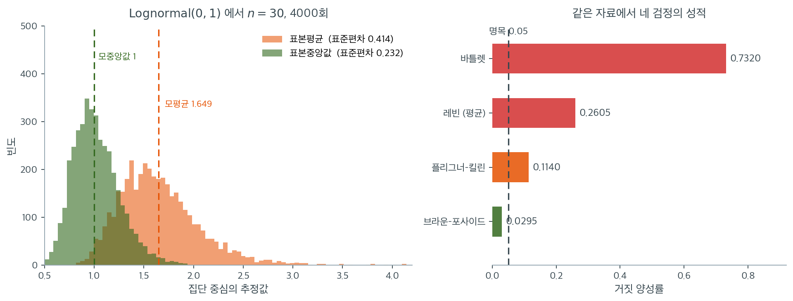

# 대수정규에서의 비교: 치우침이 극단일 때

## 개요

[로버스트 방법의 비교](comparison.md)가 여섯 분포에 걸쳐 네 검정을 훑었다면, 이 쪽은 그 표의 **마지막 줄 하나를 확대**한다. 대상은 $\text{Lognormal}(0,1)$이다. 왜도 6.19, 초과첨도 110.9로 이 책에서 다루는 가장 치우친 분포이며, 소득·보험청구액·입원기간처럼 실무에서 흔히 마주치는 모양이기도 하다.

이 한 분포를 따로 보는 까닭이 있다. 앞 쪽의 표를 위에서 아래로 훑으면 치우침이 심해질수록 검정들이 차례로 무너지는데, **대수정규에 이르면 네 검정 가운데 셋이 무너진다.** 순위로 바꾸어 비모수로 만든 Fligner-Killeen조차 명목 5%를 지키지 못한다. 중앙값 중심화를 쓰는 Brown-Forsythe 하나만 남는다.

그래서 이 쪽은 "어느 검정이 더 나은가"를 묻지 않는다. 그 물음은 앞 쪽이 답했다. 여기서 묻는 것은 **로버스트하다고 알려진 방법들도 어디에서 한계에 부딪히는가**이다. 표본크기를 $n = 30$으로 두어 앞 쪽($n = 20$)보다 조금 넉넉하게 잡았는데, 그런데도 결과가 나아지지 않는다는 점이 이 쪽의 답이기도 하다.

---

## 1. 비교하는 검정들

분산 동질성에 대한 네 가지 주요 검정은 다음과 같다.

| 검정 | 가정 | 로버스트성 |
|---|---|---|
| Bartlett | 정규성 필요 | 비정규성에 로버스트하지 않음 |
| Levene (평균) | 없음 | 중간 정도로 로버스트 |
| Brown-Forsythe (중앙값 Levene) | 없음 | 치우침에 로버스트 |
| Fligner-Killeen | 없음 | 매우 로버스트 (비모수) |

정규성과 귀무가설 $H_0: \sigma_1^2 = \cdots = \sigma_k^2$ 아래에서 네 검정 모두 대략 $\alpha$의 비율로 기각해야 한다. 비정규성 아래에서는 Bartlett 검정이 제1종 오류를 부풀리는 반면 나머지는 조절을 유지한다.

---

## 2. 수학적 틀

네 검정은 공통의 관점으로 볼 수 있다. 집단 중심으로부터의 편차에 기반한 변환값 $Z_{ij}$를 정의하고 $Z_{ij}$의 집단평균이 다른지 검정하는 것이다.

$$
Z_{ij} = |X_{ij} - c_i|,
$$

여기서 $c_i$는 집단평균(Levene), 중앙값(Brown-Forsythe), 또는 순위 기반 중심(Fligner-Killeen)이다. Bartlett 검정은 대신 로그가능도비에 직접 작동한다.

다음 모의실험은 집단분산이 모두 같은 치우친(대수정규) 분포에서 네 검정의 거짓 양성률을 비교한다.

<div class="exbox" markdown>

**보기 1.** <span class="diff easy" title="쉬움"></span> 네 검정의 거짓 양성률. 세 집단을 모두 $\text{Lognormal}(0,1)$ 에서 $n = 30$ 씩 뽑으므로 분산이 참으로 같다. 반복 $2000$ 회, $\alpha = 0.05$ 다.

**(1)** 이론값과 반복 $2000$ 회의 **몬테카를로 표준오차**를 적고, 바틀렛 통계량의 극한분포를 $\operatorname{Var}(S^2) \approx \sigma^4(\beta_2-1)/n$ 에서 유도해 **극한 크기**를 계산하시오. 정규모집단에서 $\alpha$ 가 나오는지로 검산하시오.

**(2)** 모의실험으로 확인하고, $n$ 을 키워 가며 세 검정 가운데 **나아지는 것**과 **나빠지는 것**을 가르시오.

</div>

??? success "풀이"

    **(1) 이론값은 $0.05$ 다.** 세 집단이 같은 모집단에서 나왔으니 $H_0$ 이 참이고, 보정이 제대로 된 검정이라면 명목값만큼만 기각해야 한다. 반복 $B = 2000$ 회의 표준오차는

    $$
    \mathrm{SE} = \sqrt{\frac{0.05 \times 0.95}{2000}} = 0.00487
    $$

    이므로 $0.05 \pm 0.010$ 바깥의 값은 우연이 아니다.

    **바틀렛의 극한 크기를 유도한다.** 집단크기가 모두 $n$ 이라 하고 $\nu = n-1$ 이라 쓰자. $s_i^2 = \sigma^2(1+u_i)$ 로 두면 $E[u_i] = 0$ 이고 5.2절·5.6절의 결과

    $$
    \operatorname{Var}(S^2) \approx \frac{\sigma^4(\beta_2-1)}{n}
    \quad\Longrightarrow\quad
    \operatorname{Var}(u_i) \approx \frac{\beta_2-1}{n}
    $$

    이다. 합동분산은 $s_p^2 = \sigma^2(1+\bar u)$ 이므로 바틀렛 통계량의 분자가

    $$
    \nu\sum_{i=1}^{k}\bigl[\ln(1+\bar u) - \ln(1+u_i)\bigr]
    $$

    이고, $\ln(1+x) = x - \tfrac{x^2}{2} + O(x^3)$ 을 넣으면 일차항이 $k\bar u - \sum_i u_i = 0$ 으로 **통째로 사라진다.** 남는 이차항은

    $$
    \nu\left[\frac{\sum_i u_i^2 - k\bar u^2}{2}\right] = \frac{\nu}{2}\sum_{i=1}^{k}(u_i - \bar u)^2
    $$

    다. $u_i$ 가 독립이고 $n$ 이 크면 근사적으로 정규이므로 $\sum_i (u_i-\bar u)^2 \approx \dfrac{\beta_2-1}{n}\chi^2_{k-1}$ 이고, 보정계수는 $C \to 1$ 이다. 따라서

    $$
    T \;\longrightarrow\; \frac{\beta_2-1}{2}\,\chi^2_{k-1}
    $$

    가 된다. **정규 이론은 이 배율을 $1$ 로 믿는다.** $\beta_2 = 3$ 일 때 $(\beta_2-1)/2 = 1$ 이기 때문이다. 그러므로 극한 크기는

    $$
    P\!\left(\frac{\beta_2-1}{2}\chi^2_{k-1} > \chi^2_{1-\alpha,\,k-1}\right)
    = P\!\left(\chi^2_{k-1} > \frac{2\,\chi^2_{1-\alpha,\,k-1}}{\beta_2-1}\right)
    $$

    이고 **$n$ 이 아예 들어 있지 않다.** 5.3절이 $F$ 검정에 대해 유도한

    $$
    2\left[1-\Phi\!\left(1.96\sqrt{\frac{2}{\beta_2-1}}\right)\right]
    $$

    와 같은 구조다. 임계값은 정규 이론이 정하고 실제 산포는 첨도가 정하며, 둘의 비가 $n$ 과 무관하게 고정된다. **분산 검정에는 중심극한정리의 보호가 없다.**

    **검산.** $\beta_2 = 3$ 을 넣으면 $2/(\beta_2-1) = 1$ 이라 $P(\chi^2_{k-1} > \chi^2_{1-\alpha,k-1}) = \alpha$ 가 정확히 나온다.

    **로그정규에 넣으면.** $\text{LogN}(0,\sigma^2)$ 의 첨도는 $\beta_2 = e^{4\sigma^2} + 2e^{3\sigma^2} + 3e^{2\sigma^2} - 3$ 이고 $\sigma = 1$ 에서

    $$
    \beta_2 = e^4 + 2e^3 + 3e^2 - 3 = 113.94
    $$

    다. $k = 3$, $\alpha = 0.05$ 이면 $\chi^2_{0.95,2} = 5.9915$ 이므로 극한 크기가 $P(\chi^2_2 > 2 \times 5.9915/112.94) = P(\chi^2_2 > 0.1061) = 0.9483$ 이다. **$n$ 을 아무리 키워도 등분산인 세 집단의 $95\%$ 에서 "분산이 다르다"고 답하는 쪽으로 간다.**

    **(2) 돌린다.**

    ```python
    import numpy as np
    from scipy import stats

    # 1부: 제1종 오류율. 세 집단을 모두 같은 로그정규에서 뽑으므로 분산은
    # 참으로 같다. 기각 비율이 0.05 를 크게 넘는 검정은 정규성에 매여 있다는 뜻이다.
    rng = np.random.default_rng(42)
    n_sims, n, alpha = 2000, 30, 0.05
    results = {"Bartlett": 0, "Levene (mean)": 0,
               "Brown-Forsythe": 0, "Fligner-Killeen": 0}

    for _ in range(n_sims):
        g1 = rng.lognormal(0, 1, n)
        g2 = rng.lognormal(0, 1, n)
        g3 = rng.lognormal(0, 1, n)

        _, p = stats.bartlett(g1, g2, g3)
        if p < alpha:
            results["Bartlett"] += 1

        _, p = stats.levene(g1, g2, g3, center='mean')
        if p < alpha:
            results["Levene (mean)"] += 1

        _, p = stats.levene(g1, g2, g3, center='median')
        if p < alpha:
            results["Brown-Forsythe"] += 1

        _, p = stats.fligner(g1, g2, g3)
        if p < alpha:
            results["Fligner-Killeen"] += 1

    for name, count in results.items():
        print(f"{name:20s}: false-positive rate = {count/n_sims:.4f}")

    # ---- (1) 몬테카를로 오차로 재고, 바틀렛의 극한값을 계산한다 ----
    # 반복 2000 회이므로 0.05 근처의 표준오차는 sqrt(.05*.95/2000) = 0.0049 다.
    print(f"\n명목 0.05, 반복 {n_sims} 회의 몬테카를로 표준오차 = "
          f"{np.sqrt(0.05 * 0.95 / n_sims):.5f}")
    print(f"{'검정':>18}{'크기':>9}{'SE':>9}{'0.05 로부터':>14}{'명목의 배수':>12}")
    for name, count in results.items():
        r = count / n_sims
        se = np.sqrt(r * (1 - r) / n_sims)
        print(f"{name:>18}{r:>9.4f}{se:>9.5f}{(r - 0.05) / se:>11.1f} SE{r / 0.05:>12.2f}")

    # 로그정규(0,1) 의 첨도와, 그것이 정하는 바틀렛의 극한 크기
    b2 = np.exp(4) + 2 * np.exp(3) + 3 * np.exp(2) - 3
    crit = stats.chi2(2).ppf(1 - alpha)
    print(f"\n로그정규(0,1) 의 첨도 beta_2 = {b2:.4f}")
    print(f"예측: T / ((beta_2-1)/2) -> chi2_2 이므로 E[T] -> beta_2 - 1 = {b2 - 1:.2f}")
    print(f"극한 크기 = P(chi2_2 > 2 * {crit:.4f} / (beta_2 - 1)) = "
          f"{stats.chi2(2).sf(2 * crit / (b2 - 1)):.4f}")
    print(f"검산 (정규, beta_2 = 3): P(chi2_2 > 2*{crit:.4f}/2) = "
          f"{stats.chi2(2).sf(2 * crit / 2):.4f}")

    # ---- (2) 표본을 키우면 나아지는가. 세 검정을 n 으로 훑는다 ----
    # rng 와 따로 쓰는 생성기여야 위쪽 출력이 바뀌지 않는다.
    rng_b = np.random.default_rng(2024)
    B = 2000
    print(f"\n로그정규 세 집단, 등분산, 반복 {B} 회")
    print(f"{'n':>6}{'Bartlett':>20}{'Brown-Forsythe':>22}{'Fligner-Killeen':>22}")
    for nn in (30, 120, 480):
        rej = {"ba": 0, "bf": 0, "fk": 0}
        for _ in range(B):
            g = [rng_b.lognormal(0, 1, nn) for _ in range(3)]
            rej["ba"] += stats.bartlett(*g)[1] < alpha
            rej["bf"] += stats.levene(*g, center='median')[1] < alpha
            rej["fk"] += stats.fligner(*g)[1] < alpha
        cells = ""
        for k in ("ba", "bf", "fk"):
            r = rej[k] / B
            cells += f"{r:>14.4f} (SE {np.sqrt(r * (1 - r) / B):.4f})"
        print(f"{nn:>6}{cells}")
    ```

    출력:

    ```text
    Bartlett            : false-positive rate = 0.7320
    Levene (mean)       : false-positive rate = 0.2605
    Brown-Forsythe      : false-positive rate = 0.0295
    Fligner-Killeen     : false-positive rate = 0.1140

    명목 0.05, 반복 2000 회의 몬테카를로 표준오차 = 0.00487
                    검정       크기       SE      0.05 로부터      명목의 배수
              Bartlett   0.7320  0.00990       68.9 SE       14.64
         Levene (mean)   0.2605  0.00981       21.4 SE        5.21
        Brown-Forsythe   0.0295  0.00378       -5.4 SE        0.59
       Fligner-Killeen   0.1140  0.00711        9.0 SE        2.28

    로그정규(0,1) 의 첨도 beta_2 = 113.9364
    예측: T / ((beta_2-1)/2) -> chi2_2 이므로 E[T] -> beta_2 - 1 = 112.94
    극한 크기 = P(chi2_2 > 2 * 5.9915 / (beta_2 - 1)) = 0.9483
    검산 (정규, beta_2 = 3): P(chi2_2 > 2*5.9915/2) = 0.0500

    로그정규 세 집단, 등분산, 반복 2000 회
         n            Bartlett        Brown-Forsythe       Fligner-Killeen
        30        0.7145 (SE 0.0101)        0.0400 (SE 0.0044)        0.1150 (SE 0.0071)
       120        0.8025 (SE 0.0089)        0.0430 (SE 0.0045)        0.1495 (SE 0.0080)
       480        0.8715 (SE 0.0075)        0.0450 (SE 0.0046)        0.1700 (SE 0.0084)
    ```

    **검산이 먼저 통과한다.** $\beta_2 = 3$ 을 넣은 극한 크기가 정확히 $0.0500$ 이다. 유도한 식이 정규모집단에서 명목값을 되돌려 주므로 꼴이 맞다.

    **네 수치를 몬테카를로 자로 재면.** 바틀렛은 $0.05$ 에서 $68.9$ 표준오차, Levene(평균)은 $21.4$ 표준오차 위에 있다. 우연일 가능성이 없다. 플리그너–킬린은 $9.0$ 표준오차 위로 **명목값의 $2.28$ 배**, 브라운–포사이드만 $-5.4$ 표준오차로 **아래쪽**에 있다. 넷 가운데 거짓 양성을 만들지 않는 것이 하나뿐이다.

    **$n$ 을 키우면 셋이 세 방향으로 갈린다.**

    - **바틀렛: $0.7145 \to 0.8025 \to 0.8715$.** 표본을 열여섯 배 키웠는데 더 나빠진다. (1)에서 유도한 극한 $0.9483$ 을 향해 올라가고 있다. 수렴이 느린 것은 로그정규의 4차 적률이 $e^8 \approx 2981$ 로 거대해 $u_i$ 의 정규근사가 늦기 때문이다. **이것이 "표본이 크니 괜찮겠지"가 정규성 가정에 통하지 않는다는 말의 수치다.**
    - **브라운–포사이드: $0.0400 \to 0.0430 \to 0.0450$.** 명목선 $0.05$ 를 향해 **아래에서 올라간다.** 기준분포가 옳고 유한표본에서만 조금 어긋나는 것이므로 $n$ 이 고쳐 준다. 이것이 **근사 오차**다.
    - **플리그너–킬린: $0.1150 \to 0.1495 \to 0.1700$.** 명목선에서 **멀어진다.** $n = 30$ 과 $n = 480$ 의 차가 $0.055$ 이고 두 표준오차를 합쳐도 $0.011$ 이니 다섯 배 넘는 거리다. 우연이 아니다.

    마지막 줄은 이 쪽 본문(아래)의 설명을 한 걸음 더 밀어 준다. 본문은 플리그너–킬린의 $\chi^2_{k-1}$ 근사가 부정확해진다고 적었는데, **그 부정확이 표본을 키워도 사라지지 않는다.** 중심이 중앙값이라 안전한데도 그렇다. 편차 $\lvert X_{ij} - \tilde X_i\rvert$ 자체가 극단적으로 치우쳐 있으면 어느 집단이 상위 순위를 몰아 차지하는 변동이 $n$ 과 함께 줄지 않는다는 뜻이고, 성격으로는 바틀렛 쪽(모형 오설정)에 가깝다. 다만 크기가 $0.17$ 과 $0.87$ 로 자릿수가 다르다.

분산이 실제로 다른 정규 자료에서의 검정력 비교는 다음과 같다.

<div class="exbox" markdown>

**보기 2.** <span class="diff easy" title="쉬움"></span> 네 검정의 검정력. 이번에는 **정규**모집단이고 표준편차를 $1,\ 1.5,\ 2$ 로 실제로 다르게 두었다. 같은 $n = 30$, 반복 $2000$ 회다.

**(1)** 네 검정의 검정력 **순서를 돌려 보기 전에** 예측하고 근거를 밝히시오. 반복 $2000$ 회에서 검정력 $0.85$ 쯤의 몬테카를로 표준오차도 적으시오.

**(2)** 확인하고, **이 표를 근거로 검정을 고르면 안 되는** 까닭 두 가지를 수치로 보이시오. 하나는 보기 1 의 표와 모집단이 다르다는 것이고, 다른 하나는 이 표의 간격 가운데 일부가 **검정력 차이가 아니라 크기 차이**라는 것이다.

</div>

??? success "풀이"

    **(1) 순서는 미리 정해진다.** 네 검정이 자료에서 쓰는 정보의 양이 사다리를 이룬다.

    | 검정 | 보는 양 | 버리는 것 |
    |:---|:---|:---|
    | Bartlett | $\ln s_i^2$ | 없음 (정규모형의 충분통계량) |
    | Levene (평균) | $\lvert x_{ij} - \bar x_i\rvert$ | 제곱 척도 |
    | Brown-Forsythe | $\lvert x_{ij} - \tilde x_i\rvert$ | 제곱 척도 + 평균의 효율 |
    | Fligner-Killeen | 편차의 순위 | 위의 모두 + 크기 정보 |

    바틀렛은 정규모형의 **가능도비 검정**이다. $(\bar x_i, s_i^2)$ 가 정규모형의 충분통계량이므로 자료에 든 분산 정보를 하나도 버리지 않는다. 그 아래로 내려갈 때마다 정보를 한 겹씩 내놓는다. 그러므로 **자료가 정말 정규일 때**는

    $$
    \text{Bartlett} > \text{Levene(평균)} > \text{Brown-Forsythe} > \text{Fligner-Killeen}
    $$

    순서를 예측한다. 보기 1 에서 이 사다리가 거꾸로 작동하는 것을 보았으니, 같은 사다리가 정규에서는 바로 작동하는지 확인하는 셈이다.

    **몬테카를로 표준오차.** $p = 0.85$, $B = 2000$ 에서

    $$
    \mathrm{SE} = \sqrt{\frac{0.85 \times 0.15}{2000}} = 0.00798
    $$

    이므로 **$0.016$ 보다 작은 간격은 읽어서는 안 된다.**

    **(2) 돌린다.** 아래 코드는 보기 1 의 `rng`, `n_sims`, `n`, `alpha` 를 그대로 이어받는다.

    ```python
    # 2부: 검정력. 이번에는 정규모집단이고 표준편차를 1, 1.5, 2 로 실제로
    # 다르게 두었다. 오류율만 보고 검정을 고를 수 없는 까닭이 여기 있다 —
    # 보수적인 검정은 오류율은 낮지만 차이도 잘 못 잡는다.
    results_power = {"Bartlett": 0, "Levene (mean)": 0,
                     "Brown-Forsythe": 0, "Fligner-Killeen": 0}

    for _ in range(n_sims):
        g1 = rng.normal(0, 1.0, n)
        g2 = rng.normal(0, 1.5, n)
        g3 = rng.normal(0, 2.0, n)

        _, p = stats.bartlett(g1, g2, g3)
        if p < alpha:
            results_power["Bartlett"] += 1

        _, p = stats.levene(g1, g2, g3, center='mean')
        if p < alpha:
            results_power["Levene (mean)"] += 1

        _, p = stats.levene(g1, g2, g3, center='median')
        if p < alpha:
            results_power["Brown-Forsythe"] += 1

        _, p = stats.fligner(g1, g2, g3)
        if p < alpha:
            results_power["Fligner-Killeen"] += 1

    for name, count in results_power.items():
        print(f"{name:20s}: power = {count/n_sims:.4f}")

    # ---- 크기를 맞춘 뒤의 검정력. 따로 쓰는 생성기여야 위쪽이 바뀌지 않는다 ----
    # 정규 H0 에서 각 검정의 p-값 5% 분위수를 문턱으로 다시 잡으면, 네 검정의
    # 실제 크기가 정확히 0.05 가 된다. 그 문턱으로 검정력을 다시 센다.
    rng_c = np.random.default_rng(777)
    names = ["Bartlett", "Levene (mean)", "Brown-Forsythe", "Fligner-Killeen"]


    def four_pvalues(g):
        return [stats.bartlett(*g)[1],
                stats.levene(*g, center='mean')[1],
                stats.levene(*g, center='median')[1],
                stats.fligner(*g)[1]]


    P0 = np.array([four_pvalues([rng_c.normal(0, 1, n) for _ in range(3)])
                   for _ in range(n_sims)])                      # 정규 H0
    P1 = np.array([four_pvalues([rng_c.normal(0, s, n) for s in (1.0, 1.5, 2.0)])
                   for _ in range(n_sims)])                      # 정규 H1
    thresh = np.quantile(P0, alpha, axis=0)

    print(f"\n{'검정':>18}{'정규 크기':>11}{'보정 문턱':>11}{'명목 검정력':>13}{'보정 검정력':>13}")
    for i, nm in enumerate(names):
        size = (P0[:, i] < alpha).mean()
        pw = (P1[:, i] < alpha).mean()
        pw_cal = (P1[:, i] < thresh[i]).mean()
        print(f"{nm:>18}{size:>11.4f}{thresh[i]:>11.4f}{pw:>13.4f}{pw_cal:>13.4f}")
    print(f"\n검정력 0.85 쯤의 몬테카를로 표준오차 = "
          f"{np.sqrt(0.85 * 0.15 / n_sims):.5f}")
    ```

    출력:

    ```text
    Bartlett            : power = 0.9215
    Levene (mean)       : power = 0.8490
    Brown-Forsythe      : power = 0.8155
    Fligner-Killeen     : power = 0.7810

                    검정      정규 크기      보정 문턱       명목 검정력       보정 검정력
              Bartlett     0.0485     0.0511       0.9220       0.9240
         Levene (mean)     0.0515     0.0471       0.8505       0.8450
        Brown-Forsythe     0.0420     0.0597       0.8185       0.8480
       Fligner-Killeen     0.0420     0.0613       0.7845       0.8160

    검정력 0.85 쯤의 몬테카를로 표준오차 = 0.00798
    ```

    **(1)의 예측이 맞는다.** $0.9215 > 0.8490 > 0.8155 > 0.7810$ 으로 사다리 순서 그대로다. 이웃한 간격이 $0.0725$, $0.0335$, $0.0345$ 이고 표준오차가 $0.008$ 이니 세 간격 모두 우연이 아니다. **정규 자료에서는 정보를 버린 만큼 정확히 손해를 본다.**

    새로 돌린 둘째 표의 명목 검정력 $0.9220,\ 0.8505,\ 0.8185,\ 0.7845$ 도 첫 표와 $0.005$ 안에서 맞는다. 씨앗이 다른 두 번의 모의실험이 같은 답을 주었으니 수치가 안정적이다.

    **첫째 까닭: 두 표의 모집단이 다르다.** 보기 1 의 크기는 **로그정규**에서, 이 쪽의 검정력은 **정규**에서 쟀다. 둘째 표의 "정규 크기" 칸이 그 사실을 드러낸다. 네 검정이 정규 자료에서는 $0.0420$–$0.0515$ 로 모두 명목값을 지킨다. 바틀렛의 $0.0485$ 가 옳은 크기이므로 그 $0.9215$ 는 **정직하게 번 검정력**이다. 문제는 실제 자료가 정규가 아닐 때이고, 그때 바틀렛의 크기는 $0.7320$ 이 된다. **검정력은 크기가 맞는다는 조건 아래에서만 뜻이 있는 수**이며, 두 표를 나란히 두고 "검정력이 높으니 바틀렛"이라고 읽는 것은 조건을 지운 읽기다.

    **둘째 까닭: 간격의 일부가 검정력이 아니라 크기다.** 브라운–포사이드와 플리그너–킬린은 정규에서도 $0.0420$ 으로 조금 보수적이다. 문턱을 정규 $H_0$ 의 $p$ 값 $5\%$ 분위수로 다시 잡으면 네 검정의 크기가 정확히 $0.05$ 가 되는데, 그 문턱이 바틀렛은 $0.0511$ 로 거의 그대로인 반면 브라운–포사이드는 $0.0597$, 플리그너–킬린은 $0.0613$ 으로 느슨해진다. 그렇게 크기를 맞추면

    - 브라운–포사이드 $0.8185 \to 0.8480$ (**$+0.030$**)
    - 플리그너–킬린 $0.7845 \to 0.8160$ (**$+0.032$**)
    - 바틀렛 $0.9220 \to 0.9240$, Levene(평균) $0.8505 \to 0.8450$ (둘 다 표준오차 안)

    이다. **브라운–포사이드의 검정력 손실 가운데 $0.030$ 은 정보를 버린 값이 아니라 그저 보수적이었던 값이다.** 바틀렛에 대한 열세가 $0.104$ 에서 $0.076$ 으로 줄고, Levene(평균)과는 $0.8480$ 대 $0.8450$ 으로 **사실상 같아진다**(차 $0.003$, 표준오차 $0.008$ 안이라 구별할 수 없다).

    **그러므로 이 쪽이 네 검정에 매기는 값은 이렇다.** 정규 자료에서 바틀렛의 우위는 실재하고 $0.076$ 쯤이다. 그러나 브라운–포사이드가 로버스트 셋 가운데 검정력을 가장 적게 잃는다는 사실은 **크기를 맞추고 나서야** 보인다. 그리고 선택의 근거는 결국 보기 1 의 표다. 로그정규에서 $0.7320$ 과 $0.0295$ 의 차이는 검정력 $0.076$ 으로 메울 수 있는 크기가 아니다. **크기가 깨진 검정의 검정력은 숫자로서 뜻이 없다.**

---

## 3. 해석

| | 대수정규 크기 ($H_0$) | 정규 검정력 ($H_1$) |
|---|---|---|
| Bartlett | **0.732** | 0.922 |
| Levene (평균) | **0.261** | 0.849 |
| Brown-Forsythe | 0.030 | 0.816 |
| Fligner-Killeen | **0.114** | 0.781 |

- **정규성과 등분산 아래**: 네 검정 모두 대략 $\alpha = 0.05$로 기각한다.
- **비정규성(대수정규)과 등분산 아래**: Bartlett의 거짓 양성률이 $0.732$로 심하게 부풀려지고, Levene(평균)도 $0.261$로 문제가 있다.
- **정규성과 이분산 아래(검정력)**: Bartlett의 검정력이 가장 높고(정규성 아래에서 최적이므로) Levene(평균), Brown-Forsythe, Fligner-Killeen 순이다.

왜 하필 **중앙값 중심화**가 이 극단적 분포에서 결정적인지는 집단 중심 자체의 안정성을 보면 알 수 있다. 같은 조건($n = 30$, $\text{Lognormal}(0,1)$)에서 표본평균과 표본중앙값의 표집분포를 4000번 그려 보았다.



왼쪽에서 주황(표본평균)이 초록(표본중앙값)보다 훨씬 넓게 퍼져 있다. 표준편차가 $0.414$ 대 $0.232$로 **1.8배** 차이이고, 모양도 오른쪽으로 길게 끌린다. 대수정규의 오른쪽 꼬리에서 큰 값이 하나 뽑히면 그 표본의 평균이 통째로 끌려가기 때문이다.

이 흔들림이 왜 검정을 망가뜨리는가. 레빈 검정은 각 집단에서 $Z_{ij} = |X_{ij} - \bar{X}_i|$를 만든 뒤 $\bar{Z}_i$들을 비교한다. 중심 $\bar{X}_i$가 집단마다 제멋대로 흔들리면 **그 집단의 모든 편차가 함께 흔들리고**, $\bar{Z}_i$ 사이의 차이가 실제 산포 차이가 아니라 중심 추정의 잡음을 반영하게 된다. 분산분석 F 통계량의 분자는 그 차이를 신호로 읽는다. 세 집단이 같은 모집단에서 왔는데도 $0.2605$의 비율로 기각하는 이유다.

오른쪽 막대가 결론이다. 중심을 평균에서 중앙값으로 바꾸는 것만으로 $0.2605$가 $0.0295$로 내려간다. 바틀렛의 $0.7320$과 견주면 더 극적이다. **네 검정을 가르는 것은 정교함이 아니라 중심을 어디에 두느냐라는 한 가지 선택이다.**

플리그너–킬린이 $0.1140$으로 중간에 머무는 것은 다른 이유에서다. 이 검정도 중앙값 중심 편차를 쓰므로 중심은 안전하다. 문제는 그다음이다. 대수정규의 편차 $|X_{ij} - \tilde{X}_i|$ 자체가 여전히 극단적으로 치우쳐 있어서, 어느 한 집단이 우연히 상위 순위를 몰아 차지하는 일이 자주 생긴다. 그러면 정규점수의 집단평균 $\bar{a}_i$가 표본마다 크게 흔들리고 $\chi^2_{k-1}$ 근사가 부정확해진다. **순위로 바꾸는 것은 크기의 영향을 없애 주지만, 어느 집단이 큰 쪽을 차지하는가라는 변동까지 없애지는 못한다.**

!!! warning "Fligner-Killeen이 언제나 가장 로버스트한 것은 아니다"
    표에서 Fligner-Killeen의 대수정규 크기가 **0.114**로 명목값의 두 배가 넘는다. Brown-Forsythe의 $0.030$보다 나쁘다.

    "Fligner-Killeen이 가장 로버스트하다"는 서술은 **대칭인 두꺼운 꼬리**에 대해서는 맞다. 15.5절 [Fligner-Killeen 검정](fligner_killeen.md) 연습문제 2에서 코시 자료에 대해 FK가 $0.044$로 BF의 $0.022$보다 명목값에 가까웠다.

    그러나 **강한 치우침**에서는 반대이다. $\text{Lognormal}(0,1)$은 왜도 $6.18$, 초과첨도 $110.9$로 극단적으로 치우쳐 있는데, 이때 FK의 순위 변환이 오히려 부족하다. 편차 $|x - \tilde{x}|$ 자체가 강하게 치우쳐 있어 정규점수의 집단평균이 표본마다 크게 흔들리기 때문이다.

    | 자료 | Brown-Forsythe | Fligner-Killeen |
    |---|---|---|
    | Cauchy (대칭, 극단 꼬리) | 0.022 | **0.044** |
    | $\chi^2_4$ (치우침 중간) | 0.041 | 0.055 |
    | Exponential (치우침 강함) | 0.048 | 0.087 |
    | Lognormal(0,1) (치우침 극단) | **0.030** | 0.114 |

    **결론: 치우침이 주된 문제이면 Brown-Forsythe, 대칭인 두꺼운 꼬리가 주된 문제이면 Fligner-Killeen을 쓰라.** 어느 쪽인지 모른다면 Brown-Forsythe가 안전한 기본값이다. 이 표에서 유일하게 모든 행에서 통제되는 검정이기 때문이다.

절충이 명확하다. Bartlett은 정규성이 성립할 때 검정력에서 이기지만 그렇지 않으면 파국적으로 실패한다. 범용으로는 Brown-Forsythe가 로버스트성과 검정력의 균형이 가장 좋다.

---

## 연습문제

<div class="drillbox" markdown>

**연습문제 1.** <span class="diff med" title="중간"></span> 위 거짓 양성 모의실험을 $n = 30$ 대신 $n = 100$으로 실행하라. 표본크기를 늘리면 대수정규 자료에서 Bartlett 검정의 제1종 오류 조절이 개선되는가? 설명하라.

</div>

??? success "풀이"

    ```python
    import numpy as np
    from scipy import stats

    rng = np.random.default_rng(0)
    n_sims, n, alpha = 5000, 100, 0.05
    rej = 0

    for _ in range(n_sims):
        g1 = rng.lognormal(0, 1, n)
        g2 = rng.lognormal(0, 1, n)
        g3 = rng.lognormal(0, 1, n)
        _, p = stats.bartlett(g1, g2, g3)
        if p < alpha:
            rej += 1

    print(f"Bartlett false-positive rate (n=100): {rej/n_sims:.4f}")
    ```

    출력:

    ```text
    Bartlett false-positive rate (n=100): 0.8134
    ```

    $n$을 늘려도 Bartlett의 제1종 오류가 개선되지 **않는다**. 오히려 $n = 30$의 $0.732$에서 $n = 100$의 $0.813$으로 **악화**된다.

    | $n$ | 20 | 30 | 100 |
    |---|---|---|---|
    | Bartlett 크기 | 0.675 | 0.732 | 0.813 |

    ($n = 20$ 값은 15.4절 [Bartlett 검정](../bartlett_test/bartlett_test_code.md) 연습문제 4에서 얻은 것이다.)

    **이유.** 15.3절 연습문제 4에서 유도했듯, 명목 분포와 실제 분포의 산포 비율이

    $$
    \frac{\operatorname{Var}(\ln S^2)_{\text{실제}}}{\operatorname{Var}(\ln S^2)_{\text{명목}}} = \frac{\gamma_2 + 2}{2}
    $$

    로 $n$에 의존하지 않는다. $n$이 커지면 명목 $\chi^2$ 분포가 좁아지는데 실제 분포는 같은 비율로 넓은 상태를 유지하므로, 임계값 밖으로 나가는 질량의 비율이 커진다.

    이는 **모형 가정 위반**이지 유한표본 인공물이 아니다. 자료를 아무리 모아도 잘못된 기준분포는 옳아지지 않으며, 오히려 잘못된 결론을 더 확신 있게 내리게 된다. $\square$

<div class="drillbox" markdown>

**연습문제 2.** <span class="diff med" title="중간"></span> $k = 2$개 집단인 경우 F 검정(이표본판)을 비교에 추가하라. 대수정규 자료에서 그 제1종 오류율이 Bartlett과 어떻게 비교되는가?

</div>

??? success "풀이"

    ```python
    import numpy as np
    from scipy import stats

    rng = np.random.default_rng(0)
    n_sims, n, alpha = 5000, 30, 0.05
    rej_f, rej_b = 0, 0

    for _ in range(n_sims):
        g1 = rng.lognormal(0, 1, n)
        g2 = rng.lognormal(0, 1, n)
        F = np.var(g1, ddof=1) / np.var(g2, ddof=1)
        p_f = 2 * min(stats.f(n-1, n-1).cdf(F), stats.f(n-1, n-1).sf(F))
        _, p_b = stats.bartlett(g1, g2)
        if p_f < alpha:
            rej_f += 1
        if p_b < alpha:
            rej_b += 1

    print(f"F-test:   {rej_f/n_sims:.4f}")
    print(f"Bartlett: {rej_b/n_sims:.4f}")
    ```

    출력:

    ```text
    F-test:   0.5108
    Bartlett: 0.5108
    ```

    **두 값이 완전히 동일하다.** 소수점 이하까지 같다.

    우연이 아니다. 15.4절 [Bartlett 검정](../bartlett_test/bartlett_test_code.md) 연습문제 5에서 증명했듯, $k = 2$이고 $n_1 = n_2$이면 Bartlett 통계량이 F 통계량의 엄격히 단조인 함수이다. 따라서 두 검정의 기각역이 정확히 일치하고, 모든 표본에서 같은 결론을 낸다.

    **두 검정 모두 크기가 $0.511$이다.** 등분산인 자료의 절반 이상에서 기각한다. 대수정규 자료에 분산 검정을 적용할 때 정규성 기반 방법을 쓰면 안 되는 이유를 보여준다. $\square$

<div class="drillbox" markdown>

**연습문제 3.** <span class="diff med" title="중간"></span> 집단 표준편차가 $\sigma_1 = 1$, $\sigma_2 = 1.5$, $\sigma_3 = 2$이고 자료가 $t(5)$ 분포에서 올 때 각 검정의 검정력을 추정하는 모의실험을 설계하라. 전체적으로 어느 검정이 가장 좋은지 논하라.

</div>

??? success "풀이"

    ```python
    import numpy as np
    from scipy import stats

    rng = np.random.default_rng(0)
    n_sims, n, alpha = 5000, 30, 0.05
    power = {"Bartlett": 0, "Levene": 0, "BF": 0, "FK": 0}

    for _ in range(n_sims):
        g1 = stats.t(df=5).rvs(n, random_state=rng) * 1.0
        g2 = stats.t(df=5).rvs(n, random_state=rng) * 1.5
        g3 = stats.t(df=5).rvs(n, random_state=rng) * 2.0
        _, p = stats.bartlett(g1, g2, g3)
        if p < alpha:
            power["Bartlett"] += 1
        _, p = stats.levene(g1, g2, g3, center='mean')
        if p < alpha:
            power["Levene"] += 1
        _, p = stats.levene(g1, g2, g3, center='median')
        if p < alpha:
            power["BF"] += 1
        _, p = stats.fligner(g1, g2, g3)
        if p < alpha:
            power["FK"] += 1

    for name, count in power.items():
        print(f"{name:10s}: {count/n_sims:.4f}")
    ```

    출력:

    ```text
    Bartlett  : 0.8578
    Levene    : 0.7096
    BF        : 0.6584
    FK        : 0.6616
    ```

    | 검정 | 기각률 ($H_1$) | $t_5$ 아래 크기 ($H_0$) |
    |---|---|---|
    | Bartlett | 0.858 | 0.267 |
    | Levene (평균) | 0.710 | 0.054 |
    | Brown-Forsythe | 0.658 | 0.042 |
    | Fligner-Killeen | 0.662 | 0.040 |

    (크기는 15.5절 비교 페이지의 $t_5$ 행에서 가져왔다.)

    Bartlett이 겉보기 "검정력"이 가장 높아 보이지만 **오도적이다.** 크기가 이미 $0.267$로 부풀려져 있기 때문이다. 등분산인 자료의 27%를 기각하던 검정이 이분산에서 86%를 기각한 것은 대단한 성취가 아니다.

    크기가 통제된 세 검정만 비교하면 **Levene(평균)이 $0.710$으로 가장 강력하다.** $t_5$는 대칭이므로 평균 중심화가 무너지지 않고, 중앙값·순위 변환이 버리는 정보를 활용하기 때문이다.

    Brown-Forsythe($0.658$)와 Fligner-Killeen($0.662$)은 사실상 같다.

    **전체적 권고.** 자료가 **대칭이면서 꼬리만 두껍다**고 확신할 수 있으면 Levene(평균)이 최선이다. 치우침 가능성이 있으면 Brown-Forsythe로 가야 한다. 본문 표에서 대수정규일 때 Levene(평균)의 크기가 $0.261$까지 치솟았음을 기억하라. $\square$

<div class="drillbox" markdown>

**연습문제 4.** <span class="diff med" title="중간"></span> Brown-Forsythe 검정이 평균 중심 Levene 검정보다 치우침에 로버스트한 이유를 수학적으로 설명하라.

</div>

??? success "풀이"

    치우친 분포에서는 평균이 꼬리 쪽으로 끌려가므로 절대편차 $Z_{ij} = |X_{ij} - \bar{X}_i|$가 그 비대칭을 물려받는다. 긴 꼬리 쪽의 관측값들이 체계적으로 더 큰 $Z_{ij}$ 값을 만들어 낸다. 이는 $Z_{ij}$의 집단내 변동을 부풀리고 분산분석 F 통계량에 영향을 준다.

    중앙값은 50백분위수이므로 극단값의 **크기**에 영향받지 않는다. 중앙값으로 중심화하면 원래의 $X_{ij}$가 치우쳐 있어도 $Z_{ij}$가 더 대칭적으로 분포한다.

    형식적으로 $X$가 분포 $F$를 가지면

    $$
    E[|X - \text{median}|] \le E[|X - \mu|]
    $$

    이다(중앙값이 기대절대편차를 최소화하므로). 따라서 중앙값 중심 편차의 분산이 더 작고 꼬리에 덜 민감하다. 이것이 $H_0$ 아래에서 검정통계량의 더 나은 보정으로 이어진다.

    **더 근본적인 이유: 표집 안정성.** 위 부등식은 모집단 수준의 진술이다. 실무에서 더 중요한 것은 **추정된 중심의 표집변동**이다.

    - 치우친 분포에서 $\bar{X}_i$는 표본마다 크게 흔들린다. 특히 극단값 하나가 포함되었는지 여부가 평균을 크게 바꾼다.
    - 중앙값은 붕괴점이 50%이므로 극단값 몇 개에 거의 영향받지 않는다.

    $\bar{X}_i$가 흔들리면 그 집단의 **모든** $Z_{ij}$가 함께 이동한다. 이 공통 이동이 $\bar{Z}_i$들을 실제보다 흩어지게 만들어 F 통계량의 분자를 부풀린다. 15.5절 비교 페이지 연습문제 1에서 논한 $\bar{X}$와 $S^2$의 상관이 바로 이 현상이다.

    본문 표의 수치가 이를 확인해 준다. 대수정규에서 Levene(평균) $0.261$ 대 Brown-Forsythe $0.030$으로 아홉 배 차이이다. $\square$

<div class="drillbox" markdown>

**연습문제 5.** <span class="diff med" title="중간"></span> 결과가 오른쪽으로 치우쳐 있다고 알려진 임상시험 자료(예: 입원 기간)를 분석한다고 하자. 후속 분석을 결정하기 전에 세 처치군의 등분산을 확인해야 한다. 어떤 검정을 권하며 그 이유는 무엇인가? 대안을 최소 두 가지 논하라.

</div>

??? success "풀이"

    입원 기간처럼 오른쪽으로 치우친 임상 자료에는 **Brown-Forsythe 검정**(`scipy.stats.levene`에 `center='median'`)을 권한다. 치우침 아래에서 제1종 오류율을 잘 조절하면서 참된 분산 차이를 탐지할 합리적인 검정력을 유지한다.

    본문 표가 이를 뒷받침한다. 극단적으로 치우친 대수정규 자료에서 Brown-Forsythe만이 $0.030$으로 통제되고, Fligner-Killeen($0.114$), Levene 평균($0.261$), Bartlett($0.732$)은 모두 부풀려진다.

    **대안 1: Fligner-Killeen 검정.** 중앙값으로부터의 절대편차의 순위에 기반한 비모수 검정이다. 이상점이 있을 수 있을 때 적절하다. 다만 위에서 보았듯 **극단적 치우침에서는 오히려 Brown-Forsythe보다 크기 조절이 나쁘다.** "가장 로버스트하다"는 통념에 기대어 무조건 선택해서는 안 된다.

    **대안 2: 로그 변환 후 Bartlett.** 치우침이 대수정규 같은 기제에서 온다면 로그 변환이 자료를 대칭화하여 더 강력한 Bartlett 검정을 타당하게 쓸 수 있다. 위험은 변환이 자료를 완전히 정규화하지 못할 수 있다는 점과, 추론이 로그 척도에서 이루어진다는 점이다.

    입원 기간의 경우 로그 변환이 특히 자연스럽다. 대수정규 모형이 생존시간·대기시간 자료에 잘 맞는 것으로 알려져 있기 때문이다. 다만 변환 후에도 반드시 정규성을 확인해야 하며(14장), 0값이 있으면 $\log(x+c)$ 형태의 조정이 필요하다.

    **대안 3: 붓스트랩 검정.** 15.6절의 붓스트랩 분산 검정은 분포 가정을 하지 않는다. 다만 강한 치우침에서 크기가 다소 부풀려질 수 있으므로(15.6절 연습문제 3에서 지수분포 0.082) 만능은 아니다.

    !!! tip "가장 나은 대응은 이 질문을 피하는 것이다"
        "등분산을 확인한 뒤 후속 분석을 결정한다"는 두 단계 절차 자체가 15.7절 [분산분석 사전검정](../applications/anova_pretest.md)에서 논한 문제를 안고 있다.

        임상시험이라면 분석계획서를 사전에 확정해야 하므로 더욱 그렇다. **처음부터 Welch 분산분석(또는 로그 변환 후 표준 분산분석)을 쓰기로 명시**하면 이 판정이 필요 없어진다.

        등분산 검정 결과는 방법 선택의 근거가 아니라 **자료의 특성을 서술하는 보조 정보**로 보고하는 것이 옳다. 집단별 표준편차와 상자그림을 함께 제시하면 독자가 스스로 판단할 수 있다.

    Bartlett 검정과 F 검정은 치우친 자료에 직접 적용해서는 안 된다. 신뢰할 수 없는 $p$값을 낳기 때문이다. $\square$

---

## 정리하며

네 검정을 **같은 조건에서** 견주었다.

- **분포를 바꿔 가며 제1종 오류율을 잰다.** 정규·로그정규·$t$ 자료에서 각각 돌리면 표의 주장이 수치로 확인된다.
- **정규 자료에서는 넷이 모두 명목 수준을 지킨다.** 차이는 검정력에서만 나타나며 바틀렛이 앞선다.
- **비정규 자료에서 갈린다.** 바틀렛의 오류율이 폭증하고 순위 기반이 가장 안정적이다.
- **검정력 비교는 오류율이 맞을 때만 의미가 있다.** 오류율이 $20\%$ 인 검정의 높은 기각률은 검정력이 아니라 거짓 양성이다. **이 순서를 지키는 것이 비교의 기본이다.**
- **모의실험 코드를 재사용할 수 있다.** 자신의 자료와 비슷한 분포로 바꿔 돌리면 어느 검정을 쓸지 근거를 갖고 정할 수 있다.

다음 절 **Levene 모의실험**으로 넘어간다.
