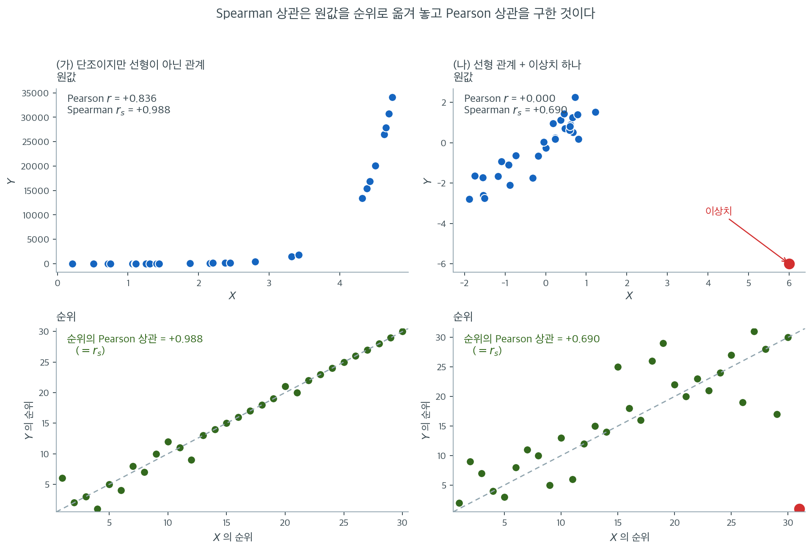

# Spearman 순위상관 (재론)

Spearman 순위상관계수 $r_s$는 [12장](../../ch12/correlation/spearman.md)에서 두 변수 사이의 단조 연관성 측도로 소개되었다. 이 절에서는 비모수 검정의 관점에서 $r_s$를 다시 보며, 가설검정, 동점 처리, 그리고 이 장 전체에서 전개한 순위 기반 틀과의 연결에 집중한다.

<div class="defn" markdown>

### 정의 1. Spearman 순위상관계수 { .dfn }

대응 관측값 $(X_1, Y_1), (X_2, Y_2), \ldots, (X_n, Y_n)$이 주어졌을 때, $R_i$를 $X_1, \ldots, X_n$ 안에서 $X_i$의 순위, $S_i$를 $Y_1, \ldots, Y_n$ 안에서 $Y_i$의 순위라 하자. Spearman 상관은 순위에 대해 계산한 Pearson 상관이다.

$$
r_s = \frac{\sum_{i=1}^{n}(R_i - \bar{R})(S_i - \bar{S})}{\sqrt{\sum_{i=1}^{n}(R_i - \bar{R})^2 \sum_{i=1}^{n}(S_i - \bar{S})^2}}
$$

동점이 없으면 이 식은 다음으로 단순해진다.

$$
r_s = 1 - \frac{6 \sum_{i=1}^{n} d_i^2}{n(n^2 - 1)}
$$

여기서 $d_i = R_i - S_i$는 대응 순위의 차이이다.

이 계수는 $-1 \le r_s \le 1$을 만족하며, $r_s = 1$은 완전한 단조증가 관계를, $r_s = -1$은 완전한 단조감소 관계를 뜻한다.

</div>

## 가설검정

### 가설

$$
H_0 \colon \rho_s = 0 \quad \text{(단조 연관성이 없다)}
$$

$$
H_a \colon \rho_s \ne 0 \quad \text{(양측)}
$$

여기서 $\rho_s$는 모집단 Spearman 상관이다.

### 검정통계량

$n$이 크면(보통 $n \ge 10$) 통계량

$$
t = r_s \sqrt{\frac{n - 2}{1 - r_s^2}}
$$

가 $H_0$ 아래 근사적으로 자유도 $n - 2$인 $t$ 분포를 따른다.

$n$이 작으면 $r_s$의 순열분포에 기반한 정확 임계값을 표에서 얻을 수 있다.

### 정확 귀무분포

$H_0$(독립) 아래에서 순위의 모든 순열이 동등하게 가능하다. 가능한 순위 순열이 $n!$개이고 각각에 대해 $r_s$를 계산하면 정확 귀무분포를 얻는다. $n$이 작으면 실행 가능하고, 크면 $t$ 근사를 쓴다.

## 동점 처리

동점이 있으면 단순화된 공식 $1 - 6\sum d_i^2 / [n(n^2-1)]$이 더 이상 정확하지 않다. 대신 중간순위에 완전한 Pearson 공식을 적용해야 한다.

$$
r_s = \frac{\sum_{i=1}^{n}(R_i - \bar{R})(S_i - \bar{S})}{\sqrt{\sum_{i=1}^{n}(R_i - \bar{R})^2 \sum_{i=1}^{n}(S_i - \bar{S})^2}}
$$

여기서 $R_i$와 $S_i$는 중간순위이다. 이 공식은 동점을 자연스럽게 처리하며 동점이 없을 때 단순화된 형태로 환원된다.

!!! warning "동점이 있을 때 축약 공식을 쓰지 말 것"
    공식 $r_s = 1 - 6\sum d_i^2 / [n(n^2-1)]$은 동점이 없다고 가정한다. 동점이 있으면 이 공식은 틀린 값을 준다. 동점이 있으면 언제나 순위에 대한 완전한 Pearson 공식을 쓴다.

<div class="exbox" markdown>

**보기 1.** <span class="diff easy" title="쉬움"></span> 동점은 축약 공식을 깨고, $\lvert r_s \rvert = 1$ 은 p-값을 깬다. 한 분석가가 직원 8명의 경력(년)과 고객만족도(1--10 척도)의 관계를 살펴본다.

| 직원 | 경력 ($X$) | 만족도 ($Y$) | $R_i$ | $S_i$ | $d_i$ |
|:--------:|:------:|:------:|:--:|:--:|:---:|
| 1 | 2 | 7 | 1 | 3 | $-2$ |
| 2 | 5 | 8 | 3 | 4.5 | $-1.5$ |
| 3 | 3 | 6 | 2 | 1.5 | $0.5$ |
| 4 | 8 | 9 | 5.5 | 6.5 | $-1$ |
| 5 | 10 | 10 | 7.5 | 8 | $-0.5$ |
| 6 | 8 | 8 | 5.5 | 4.5 | $1$ |
| 7 | 10 | 6 | 7.5 | 1.5 | $6$ |
| 8 | 6 | 9 | 4 | 6.5 | $-2.5$ |

동점이 많다. 경력에서는 $8$이 두 번, $10$이 두 번 나타나고, 만족도에서는 $6$, $8$, $9$가 각각 두 번씩 나타난다. 따라서 중간순위에 완전한 Pearson 공식을 적용한다.

**(1)** 중간순위의 제곱합 $\sum(R_i-\bar R)^2$, $\sum(S_i-\bar S)^2$, $\sum(R_i-\bar R)(S_i-\bar S)$ 를 구해 $r_s$ 를 손으로 계산하시오. 축약 공식이 $0.393$ 을 주는 까닭을 그 제곱합으로 설명하시오.

**(2)** `spearmanr` 의 p-값은 $t = r_s\sqrt{(n-2)/(1-r_s^2)}$ 를 쓴 근사다. 관계가 **완전 단조**인 자료를 넣으면 어떻게 되는가. 올바른 값은 무엇인가.

</div>

??? success "풀이"

    **(1) 제곱합을 센다.** 중간순위를 써도 순위의 합은 $n(n+1)/2 = 36$ 으로 변하지 않으므로

    $$
    \bar R = \bar S = \frac{n+1}{2} = 4.5
    $$

    다. 표의 순위로 제곱합을 세면

    $$
    \sum (R_i - 4.5)^2 = 41,
    \qquad
    \sum (S_i - 4.5)^2 = 40.5,
    \qquad
    \sum (R_i - 4.5)(S_i - 4.5) = 15.25
    $$

    이고

    $$
    r_s = \frac{15.25}{\sqrt{41 \times 40.5}} = \frac{15.25}{40.749233} = 0.374240
    $$

    이다.

    **축약 공식이 왜 틀리는지가 이 세 수로 바로 보인다.** $\bar R = \bar S$ 이므로

    $$
    \sum d_i^2 = \sum\bigl[(R_i - \bar R) - (S_i - \bar S)\bigr]^2
    = \sum (R_i-\bar R)^2 + \sum (S_i-\bar S)^2 - 2\sum (R_i-\bar R)(S_i-\bar S)
    $$

    이고, 따라서 **어떤 자료에서나**

    $$
    r_s = \frac{\sum (R_i-\bar R)^2 + \sum (S_i-\bar S)^2 - \sum d_i^2}{2\sqrt{\sum (R_i-\bar R)^2 \sum (S_i-\bar S)^2}}
    $$

    가 성립한다. 검산하면 $(41 + 40.5 - 51)/(2 \times 40.749233) = 0.374240$ 으로 맞는다.

    동점이 없으면 두 제곱합이 **모두** $n(n^2-1)/12 = 8 \times 63/12 = 42$ 가 되고, 이 식이

    $$
    r_s = \frac{42 + 42 - \sum d_i^2}{2 \times 42} = 1 - \frac{\sum d_i^2}{84} = 1 - \frac{6\sum d_i^2}{n(n^2-1)}
    $$

    로 줄어든다. **곧 축약 공식은 "두 제곱합이 모두 42 다" 라는 사실을 쓴다.** 이 자료는 동점 때문에 $41$ 과 $40.5$ 로 **줄었는데** 축약 공식은 여전히 $42$ 를 쓰므로

    $$
    1 - \frac{6 \times 51}{504} = 1 - \frac{306}{504} = 0.392857
    $$

    로 참값보다 $0.0186$ 크게 나온다. 동점이 많아질수록 제곱합이 더 줄고 어긋남이 커진다.

    **(2) `spearmanr` 의 p-값은 $t$ 근사다.** 확인해 보면

    $$
    t = 0.374240\sqrt{\frac{6}{1 - 0.374240^2}} = 0.374240 \times 2.641428 = 0.988532
    $$

    $$
    p = 2\,P(t_6 > 0.988532) = 0.361065
    $$

    로 `scipy` 가 준 $0.36106491$ 과 같다.

    **그런데 $r_s^2 = 1$ 이면 분모가 0 이다.** 완전 단조인 자료를 넣으면 다음이 나온다.

    | 자료 | `statistic` | `pvalue` | 올바른 값 |
    |---|---|---|---|
    | $n=8$, $y = x^3+1$ | $1.0$ | $0.0$ | $4.96 \times 10^{-5}$ |
    | $n=8$, $y = -2x$ | $-1.0$ | $0.0$ | $4.96 \times 10^{-5}$ |
    | $n=5$, $y = e^x$ | $0.9999999999999999$ | $1.40 \times 10^{-24}$ | $0.0167$ |

    **셋 다 무의미한 값이다.** 올바른 값은 열거로 바로 나온다. $H_0$ 아래에서 $S$ 가 $\{1, \dots, n\}$ 의 어느 순열이든 같은 확률이고, $\lvert r_s \rvert = 1$ 이 되는 순열은 **오름차순과 내림차순 둘**뿐이므로

    $$
    P\bigl(\lvert r_s \rvert = 1\bigr) = \frac{2}{n!}
    $$

    다. $n = 8$ 이면 $2/40320 = 4.96 \times 10^{-5}$, $n = 5$ 이면 $2/120 = 0.0167$ 이다.

    **$n = 5$ 의 경우가 특히 위험하다.** `scipy` 는 $1.4 \times 10^{-24}$ 를 주지만 참값은 $0.0167$ 로 **스물두 자릿수 차이**다. 다섯 점이 완전히 단조인 것은 우연히도 60분의 1 확률로 일어나는 일이며 "압도적 증거" 가 아니다. $n = 8$ 에서는 $0.0$ 을 돌려주는데, 확률 $0$ 인 사건이 아니므로 그것도 거짓이다.

    까닭은 분모 $1 - r_s^2$ 다. $r_s^2$ 가 정확히 $1$ 이면 $0$ 으로 나누어 $t = \infty$ 가 되고 p-값이 $0$ 으로 떨어진다. 부동소수 오차로 $r_s^2$ 가 $1$ 에서 $10^{-16}$ 만큼 모자라면 $t \approx 10^{8}$ 이 되어 p-값이 $10^{-24}$ 규모가 된다. **어느 쪽이든 표본이 작다는 사실이 반영되지 않는다.**

    **권고: $\lvert r_s \rvert$ 가 $1$ 에 가까우면 `spearmanr` 의 p-값을 쓰지 말라.** $n \leq 10$ 이면 $n! \leq 3{,}628{,}800$ 이므로 순열을 직접 열거하는 것이 가장 빠르고 정확하다.

    **수치적으로.**

    ```python
    import numpy as np
    from scipy import stats
    X = np.array([2, 5, 3, 8, 10, 8, 10, 6])
    Y = np.array([7, 8, 6, 9, 10, 8, 6, 9])
    print(stats.rankdata(X))   # [1.  3.  2.  5.5 7.5 5.5 7.5 4. ]
    print(stats.rankdata(Y))   # [3.  4.5 1.5 6.5 8.  4.5 1.5 6.5]
    print(stats.spearmanr(X, Y))
    # SignificanceResult(statistic=0.37424, pvalue=0.36106)
    ```

    출력:

    ```
    [1.  3.  2.  5.5 7.5 5.5 7.5 4. ]
    [3.  4.5 1.5 6.5 8.  4.5 1.5 6.5]
    SignificanceResult(statistic=0.37424017169809104, pvalue=0.36106491276336194)
    ```

    $$
    r_s = 0.374
    $$

    **검정:**

    $$
    t = 0.374\sqrt{\frac{6}{1 - 0.374^2}} = 0.374 \times 2.642 = 0.989
    $$

    자유도 $n - 2 = 6$에서 양측 $p = 0.361$이다. $\alpha = 0.05$에서 $H_0$을 기각하지 못한다.

    ```python
    R, S = stats.rankdata(X), stats.rankdata(Y)
    n = len(X)
    SS_R = ((R - R.mean()) ** 2).sum()
    SS_S = ((S - S.mean()) ** 2).sum()
    SS_RS = ((R - R.mean()) * (S - S.mean())).sum()
    d2 = ((R - S) ** 2).sum()
    print(f"R 의 평균 {R.mean()},  S 의 평균 {S.mean()}  ((n+1)/2 = {(n + 1) / 2})")
    print(f"SS_R = {SS_R},  SS_S = {SS_S},  SS_RS = {SS_RS},  sum d^2 = {d2}")
    print(f"동점이 없을 때의 제곱합 n(n^2-1)/12 = {n * (n * n - 1) / 12}")

    rs = SS_RS / np.sqrt(SS_R * SS_S)
    print(f"\n완전한 공식   r_s = {SS_RS}/sqrt({SS_R}*{SS_S}) = {rs:.6f}")
    print(f"항등식으로도  r_s = ({SS_R}+{SS_S}-{d2})/(2*{np.sqrt(SS_R * SS_S):.6f})"
          f" = {(SS_R + SS_S - d2) / (2 * np.sqrt(SS_R * SS_S)):.6f}")
    print(f"축약 공식     r_s = 1 - 6*{d2}/({n}*{n * n - 1}) = "
          f"{1 - 6 * d2 / (n * (n * n - 1)):.6f}   <- 틀린 값")

    t = rs * np.sqrt((n - 2) / (1 - rs ** 2))
    print(f"\nt = {t:.6f},  양측 p = {2 * stats.t.sf(abs(t), n - 2):.8f}")
    print(f"scipy 의 p-값                  = {stats.spearmanr(X, Y).pvalue:.8f}")
    ```

    출력:

    ```
    R 의 평균 4.5,  S 의 평균 4.5  ((n+1)/2 = 4.5)
    SS_R = 41.0,  SS_S = 40.5,  SS_RS = 15.25,  sum d^2 = 51.0
    동점이 없을 때의 제곱합 n(n^2-1)/12 = 42.0
    
    완전한 공식   r_s = 15.25/sqrt(41.0*40.5) = 0.374240
    항등식으로도  r_s = (41.0+40.5-51.0)/(2*40.749233) = 0.374240
    축약 공식     r_s = 1 - 6*51.0/(8*63) = 0.392857   <- 틀린 값
    
    t = 0.988532,  양측 p = 0.36106491
    scipy 의 p-값                  = 0.36106491
    ```

    ```python
    import itertools
    from math import factorial

    print("완전 단조인 자료에 spearmanr 을 넣으면")
    cases = [("n=8, y = x^3+1", np.arange(8), np.arange(8) ** 3 + 1),
             ("n=8, y = -2x   ", np.arange(8), -2.0 * np.arange(8)),
             ("n=5, y = e^x   ", np.arange(5), np.exp(np.arange(5)))]
    for label, x, y in cases:
        r = stats.spearmanr(x, y)
        print(f"  {label}: statistic = {r.statistic!r},  pvalue = {r.pvalue!r}")

    print("\n전수 열거로 구한 올바른 값")
    for m in (5, 8):
        base = np.arange(1, m + 1)
        rs_all = np.array([np.corrcoef(base, p)[0, 1]
                           for p in itertools.permutations(base)])
        hit = int((np.abs(rs_all) >= 1 - 1e-12).sum())
        print(f"  n = {m}: 순열 {len(rs_all)} 개 (= {m}!),"
              f"  |r_s| = 1 인 것 {hit} 개  ->  p = 2/{factorial(m)}"
              f" = {hit / len(rs_all):.8f}")
    ```

    출력:

    ```
    완전 단조인 자료에 spearmanr 을 넣으면
      n=8, y = x^3+1: statistic = 1.0,  pvalue = 0.0
      n=8, y = -2x   : statistic = -1.0,  pvalue = 0.0
      n=5, y = e^x   : statistic = 0.9999999999999999,  pvalue = 1.4042654220543672e-24
    
    전수 열거로 구한 올바른 값
      n = 5: 순열 120 개 (= 5!),  |r_s| = 1 인 것 2 개  ->  p = 2/120 = 0.01666667
      n = 8: 순열 40320 개 (= 8!),  |r_s| = 1 인 것 2 개  ->  p = 2/40320 = 0.00004960
    ```

    **손으로 센 $SS_R = 41$, $SS_S = 40.5$, $SS_{RS} = 15.25$, $\sum d^2 = 51$ 이 모두 맞고, 세 가지 계산이 $0.374240 / 0.374240 / 0.392857$ 로 (1) 의 표와 같다.** $t = 0.988532$ 에서 나온 p-값이 `scipy` 의 값과 소수 여덟째 자리까지 같으므로 **`spearmanr` 의 p-값이 $t$ 근사라는 것이 확인된다.**

    (2) 의 결함도 그대로 재현된다. $n = 8$ 에서 `pvalue = 0.0` 이고 $n = 5$ 에서 $1.4 \times 10^{-24}$ 인데, 열거가 주는 참값은 $4.96 \times 10^{-5}$ 와 $0.0167$ 이다. **$n = 5$ 의 자료에서 "$p < 10^{-23}$" 을 보고하는 것은 심각한 오류다** — 올바른 결론은 "$p = 0.017$ 로 $\alpha = 0.05$ 에서는 유의하지만 $\alpha = 0.01$ 에서는 아니다" 다.

!!! note "축약 공식을 쓰면 얼마나 틀리는가"
    이 자료에서 $\sum d_i^2 = 4 + 2.25 + 0.25 + 1 + 0.25 + 1 + 36 + 6.25 = 51$이다. 축약 공식을 잘못 적용하면

    $$
    1 - \frac{6 \times 51}{8 \times 63} = 1 - \frac{306}{504} = 0.393
    $$

    이 나와 올바른 값 $0.374$와 다르다. 동점이 8쌍 중 여러 곳에 있어 순위의 분산이 이론값 $(n^2-1)/12 = 5.25$보다 작아졌기 때문이다. 이 보기에서 차이는 $0.02$로 작지만, 동점이 많을수록 커진다.



정의 1이 "순위에 대해 계산한 Pearson 상관"이라고 말한 것이 어떤 그림인지 보자. 위 두 칸이 원값 산점도이고, 아래 두 칸은 같은 자료를 **순위로 바꿔 다시 그린 것**이다. 아래 칸에서 Pearson 상관을 구하면 그것이 곧 $r_s$이다.

(가)는 $Y$가 $X$의 지수함수인 자료다. 관계는 완벽하게 단조인데 곡선이 심하게 휘어 있어 Pearson $r = +0.836$에 그친다. 아래 순위 산점도를 보면 점들이 대각선 위에 거의 일직선으로 늘어서 $r_s = +0.988$이 된다. **순위변환이 단조 곡선을 직선으로 펴 놓은 것**이다. Pearson $r$이 "$1$에서 얼마나 모자란가"로 재는 것은 비선형성인데, 단조 관계를 찾는 것이 목적이었다면 그 결손은 답이 아니라 잡음이다.

(나)는 방향이 반대로 극적이다. 원자료는 기울기가 뚜렷한 선형 관계인데 오른쪽 아래에 이상치 하나($X = 6$, $Y = -6$)를 넣었다. 그러자 Pearson $r$이 **정확히 $0.000$으로 무너진다.** 점 하나가 $X$에서도 $Y$에서도 극단이라 곱 $(x_i - \bar x)(y_i - \bar y)$에 큰 음수를 기여해 나머지 $30$개의 양의 기여를 전부 상쇄해 버렸다. 아래 순위 산점도에서는 그 점이 오른쪽 아래 구석에 놓일 뿐이고, 순위 $31$과 순위 $1$이라는 위치가 그것이 행사할 수 있는 최대 영향이어서 $r_s = +0.690$이 유지된다.

두 칸을 합쳐 읽으면 $r_s$가 로버스트한 정확한 이유가 보인다. **순위 산점도는 언제나 $\{1, \ldots, n\} \times \{1, \ldots, n\}$ 격자 위에 놓이므로 어떤 점도 격자 바깥으로 나갈 수 없다.** 원값 산점도는 그런 상한이 없다. 다만 값을 되돌려 받을 수 없다는 대가도 함께 온다. (가)의 $r_s = 0.988$은 "거의 완벽한 단조"라고 말해 줄 뿐 $Y$가 $X$의 지수함수라는 사실은 말해 주지 않는다. 관계의 **형태**를 알고 싶다면 순위가 아니라 산점도를 봐야 한다.

## Pearson r과의 비교

| 특징 | Pearson $r$ | Spearman $r_s$ |
|:--------|:-------------|:-----------------|
| 재는 것 | 선형 연관성 | 단조 연관성 |
| 민감한 대상 | 이상치, 비선형성 | 둘 다에 로버스트 |
| 가정 | 이변량 정규성(검정 시) | 없음(순위 기반) |
| Pearson 대비 ARE (이변량 정규) | 1.0 | $3/\pi \approx 0.955$ |
| 비선형 단조 추세 탐지 | 약함 | 잘함 |

## 언제 Pearson 대신 Spearman을 쓰는가

- 관계가 단조이지만 선형이 아닐 때(예: 수확체감).
- 자료에 Pearson $r$을 부풀리거나 줄일 수 있는 이상치가 있을 때.
- 자료가 순서형일 때(예: 설문 평가, 순위).
- 이변량 정규성이 합리적인 가정이 아닐 때.

## 연습문제

<div class="drillbox" markdown>

**연습문제 1.** <span class="diff easy" title="쉬움"></span>
한 교사가 학생 8명을 수학 시험과 영어 시험 성적으로 각각 순위를 매겼다.

| 학생 | 수학 순위 | 영어 순위 |
|:---:|:---:|:---:|
| 1 | 1 | 3 |
| 2 | 2 | 1 |
| 3 | 3 | 2 |
| 4 | 4 | 5 |
| 5 | 5 | 4 |
| 6 | 6 | 8 |
| 7 | 7 | 6 |
| 8 | 8 | 7 |

**(a)** 순위차이 $d_i$와 $d_i^2$을 계산하라.

**(b)** Spearman 순위상관계수

$$
r_s = 1 - \frac{6 \sum d_i^2}{n(n^2 - 1)}
$$

을 계산하라.

**(c)** $t$ 근사

$$
t = r_s \sqrt{\frac{n-2}{1 - r_s^2}}
$$

로 $r_s$가 0과 유의하게 다른지 자유도 $n - 2$에서 검정하라.

</div>

??? success "풀이"

    **(a)**

    | 학생 | 수학 | 영어 | $d_i$ | $d_i^2$ |
    |:---:|:---:|:---:|:---:|:---:|
    | 1 | 1 | 3 | $-2$ | 4 |
    | 2 | 2 | 1 | 1 | 1 |
    | 3 | 3 | 2 | 1 | 1 |
    | 4 | 4 | 5 | $-1$ | 1 |
    | 5 | 5 | 4 | 1 | 1 |
    | 6 | 6 | 8 | $-2$ | 4 |
    | 7 | 7 | 6 | 1 | 1 |
    | 8 | 8 | 7 | 1 | 1 |

    $$
    \sum d_i^2 = 4 + 1 + 1 + 1 + 1 + 4 + 1 + 1 = 14
    $$

    **(b)**

    $$
    r_s = 1 - \frac{6 \times 14}{8(64 - 1)} = 1 - \frac{84}{504} = 1 - 0.1667 = 0.8333
    $$

    **(c)** $t$ 통계량은

    $$
    t = 0.8333 \sqrt{\frac{6}{1 - 0.6944}} = 0.8333 \sqrt{\frac{6}{0.3056}} = 0.8333 \sqrt{19.63} = 0.8333 \times 4.431 = 3.692
    $$

    자유도 6에서 $\alpha = 0.05$ 양측 임계값은 $t_{0.025, 6} = 2.447$이다.

    $|t| = 3.69 > 2.447$이므로 $H_0$을 기각한다. $p$값은 약 $0.0102$이다. 수학 성적과 영어 성적 사이에 통계적으로 유의한 양의 단조 연관성이 있다($r_s = 0.83$).

    ```python
    import numpy as np
    from scipy import stats
    math = np.arange(1, 9); eng = np.array([3, 1, 2, 5, 4, 8, 6, 7])
    print(stats.spearmanr(math, eng))
    # SignificanceResult(statistic=0.83333, pvalue=0.010176)
    ```

    출력:

    ```
    SignificanceResult(statistic=0.8333333333333335, pvalue=0.01017554012345675)
    ```

    SciPy의 `spearmanr`은 $t$ 근사를 쓰므로 $p = 0.010176$을 반환하며, 위에서 손으로 계산한 $0.010185$와 같다. 다만 이것은 정확 $p$값이 아니다. 연습문제 2에서 보듯 $n = 8$의 정확값은 $0.0154$이다.

<div class="drillbox" markdown>

**연습문제 2.** <span class="diff med" title="중간"></span>
$n = 8$에서 $r_s$의 정확 귀무분포를 열거로 구하고, $t$ 근사가 얼마나 정확한지 확인하라.

</div>

??? success "풀이"
    한쪽 변수의 순위를 $1, \ldots, 8$로 고정하고 다른 쪽의 $8! = 40{,}320$가지 순열을 모두 열거한다.

    ```python
    import numpy as np, itertools
    from scipy import stats

    n = 8
    R = np.arange(1, n + 1)
    denom = n * (n * n - 1) / 6
    rs_all = np.array([1 - ((R - np.array(p)) ** 2).sum() / denom
                       for p in itertools.permutations(R)])
    print(len(rs_all), rs_all.mean().round(6), rs_all.std().round(4))

    for obs in (0.8333, 0.6190, 0.4762, 0.3810):
        exact = 2 * (rs_all >= obs - 1e-9).mean()
        t = obs * np.sqrt((n - 2) / (1 - obs ** 2))
        approx = 2 * stats.t.sf(t, n - 2)
        print(round(obs, 4), round(exact, 5), round(approx, 5))
    ```

    출력:

    ```
    40320 0.0 0.378
    0.8333 0.01538 0.01018
    0.619 0.11498 0.10177
    0.4762 0.21617 0.23292
    0.381 0.32684 0.35175
    ```

    | 관측 $r_s$ | 정확 양측 $p$ | $t$ 근사 $p$ |
    |---:|---:|---:|
    | 0.8333 | 0.0154 | 0.0102 |
    | 0.6190 | 0.1150 | 0.1018 |
    | 0.4762 | 0.2162 | 0.2329 |
    | 0.3810 | 0.3268 | 0.3518 |

    귀무분포의 평균은 정확히 $0$이고 표준편차는 $1/\sqrt{n-1} = 0.3780$으로, 이론값과 소수점 넷째 자리까지 일치한다.

    $t$ 근사의 오차 방향이 $r_s$의 크기에 따라 **뒤집힌다**. 꼬리($r_s \ge 0.62$)에서는 $p$값을 과소평가하고(예: $0.0102$ 대 $0.0154$, 34% 작다) 중앙부($r_s \le 0.48$)에서는 과대평가한다.

    실무적으로 위험한 쪽은 꼬리이다. $r_s = 0.8333$에서 $t$ 근사가 $p = 0.0102$를 주어 $\alpha = 0.01$ 근처에서 기각하게 만들지만 정확값은 $0.0154$로 기각하지 못한다. **$n \le 15$ 정도에서는 정확 $p$값을 쓰는 편이 안전하다.** SciPy의 `spearmanr`은 $t$ 근사를 쓰므로, 정확값이 필요하면 `scipy.stats.permutation_test`를 쓴다.

<div class="drillbox" markdown>

**연습문제 3.** <span class="diff med" title="중간"></span>
Spearman $r_s$가 이상치에 로버스트하다고 하지만, 어떤 종류의 이상치에는 여전히 취약하다. Pearson $r$과 $r_s$가 이상치 하나에 어떻게 반응하는지 비교하라.

</div>

??? success "풀이"
    두 가지 이상치를 구별해야 한다.

    ```python
    import numpy as np
    from scipy import stats
    rng = np.random.default_rng(0)
    n = 30
    x = rng.normal(0, 1, n)
    y = x + rng.normal(0, 0.5, n)      # 강한 양의 상관

    print("원자료:", stats.pearsonr(x, y).statistic.round(3),
          stats.spearmanr(x, y).statistic.round(3))

    # (A) 두 변수 모두 극단이지만 추세를 따르는 점
    xa, ya = np.append(x, 10), np.append(y, 10)
    print("추세 따름:", stats.pearsonr(xa, ya).statistic.round(3),
          stats.spearmanr(xa, ya).statistic.round(3))

    # (B) 추세를 거스르는 지렛대점
    xb, yb = np.append(x, 10), np.append(y, -10)
    print("추세 거스름:", stats.pearsonr(xb, yb).statistic.round(3),
          stats.spearmanr(xb, yb).statistic.round(3))
    ```

    출력:

    ```
    원자료: 0.829 0.84
    추세 따름: 0.972 0.855
    추세 거스름: -0.701 0.668
    ```

    | 자료 | Pearson $r$ | Spearman $r_s$ |
    |:---|---:|---:|
    | 원자료 ($n = 30$) | 0.829 | 0.840 |
    | (A) 추세를 따르는 극단점 추가 | **0.972** | 0.855 |
    | (B) 추세를 거스르는 극단점 추가 | **$-0.701$** | 0.668 |

    **(A)** 추세를 따르는 극단점 하나가 Pearson $r$을 $0.829$에서 $0.972$로 밀어 올린다. 상관이 실제보다 훨씬 강해 보이게 만드는 것이다. $r_s$는 $0.840 \to 0.855$로 거의 움직이지 않는다.

    **(B)** 추세를 거스르는 점 하나가 Pearson $r$을 $+0.829$에서 $-0.701$로 뒤집는다. **부호까지 반대가 되어** 강한 음의 상관을 보고한다. $r_s$는 $0.668$로 줄기는 하지만 여전히 올바른 방향의 강한 연관성을 보고한다.

    **왜 $r_s$가 안전한가.** 순위변환이 $(10, -10)$이라는 점을 $(31, 1)$이라는 순위로 바꾼다. 여전히 반대 방향의 증거이지만 그 크기가 순위 하나만큼으로 제한된다. Pearson은 $10 \times (-10) = -100$이라는 거대한 음의 교차곱을 그대로 받으며, 이 하나가 나머지 30개의 기여를 압도한다.

    **그러나 $r_s$도 무적은 아니다.** $0.840 \to 0.668$은 21% 감소로 결코 작지 않다. 이상치가 여러 개이거나 $n$이 더 작으면 $r_s$도 크게 흔들린다. 로버스트성은 정도의 문제이지 절대적 보장이 아니다.

<div class="drillbox" markdown>

**연습문제 4.** <span class="diff med" title="중간"></span>
Spearman $r_s$와 Pearson $r$이 완전히 다른 결론을 주는 상황을 만들어라. 어느 쪽이 옳은가?

</div>

??? success "풀이"
    **상황 1: 완전한 단조 관계이지만 비선형.**

    ```python
    import numpy as np
    from scipy import stats
    x = np.arange(1, 21)
    y = np.exp(x / 2)          # 완전한 단조증가
    print(stats.pearsonr(x, y).statistic.round(4))    # 0.6991
    print(stats.spearmanr(x, y).statistic.round(4))   # 1.0000
    ```

    출력:

    ```
    0.6991
    1.0
    ```

    $y = e^{x/2}$는 $x$의 완전한 단조증가 함수이므로 $r_s = 1$이 **정확히** 맞다. Pearson $r = 0.70$은 "관계가 선형이 아니다"를 반영할 뿐이며, 이것을 "연관성이 약하다"로 읽으면 오독이다.

    **상황 2: 강한 관계이지만 단조가 아님.**

    ```python
    x = np.linspace(-3, 3, 41)
    y = x ** 2                 # 완벽한 결정론적 관계
    print(stats.pearsonr(x, y).statistic.round(4))    # -0.0000
    print(stats.spearmanr(x, y).statistic.round(4))   # -0.0146
    ```

    출력:

    ```
    -0.0
    -0.0146
    ```

    여기서는 **둘 다 사실상 0**이다($r = 0.0000$, $r_s = -0.0146$). $y$가 $x$로 완전히 결정되는데도 그렇다. 두 계수 모두 단조성을 전제하므로 U자 관계를 전혀 잡아내지 못한다.

    **어느 쪽이 옳은가?** 질문에 따라 다르다.

    | 질문 | 적절한 측도 |
    |:---|:---|
    | "$x$가 커지면 $y$도 커지는가?" | $r_s$ 또는 $\tau$ |
    | "$y$를 $x$의 선형함수로 얼마나 잘 예측하는가?" | $r$ |
    | "$x$와 $y$가 독립인가?" | 둘 다 부적절 --- 거리상관이나 상호정보량 |

    **가장 중요한 교훈:** 어떤 상관계수도 산점도를 대체하지 못한다. 상황 2에서 $r \approx r_s \approx 0$이라는 숫자만 보고 "관계 없음"이라 결론지으면 완벽한 포물선 관계를 놓친다. Anscombe의 사중주가 보여 준 것과 같은 교훈이다.

---

## 정리하며

Spearman $r_s$는 관측값의 순위에 적용한 Pearson 상관계수로, 단조 연관성의 비모수 측도를 제공한다. 가설검정은 대표본에서 $t$ 근사를, 소표본에서 정확 순열분포를 쓴다. 동점은 완전한 Pearson 공식에 중간순위를 넣어 처리한다. Spearman $r_s$는 이변량 정규성 아래 Pearson $r$ 대비 ARE $3/\pi \approx 0.955$를 달성하며, 비정규성이나 비선형성이 있으면 훨씬 더 유용할 수 있다.
