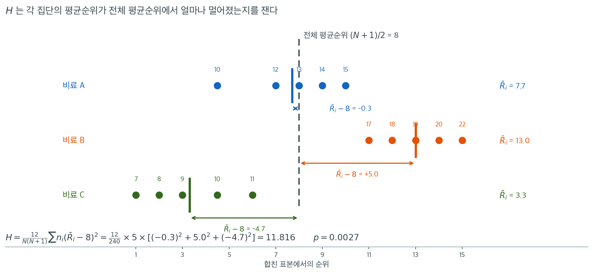

# Kruskal-Wallis 검정

독립인 세 집단 이상을 비교할 때 표준적인 모수적 접근은 일원분산분석이지만, 여기에는 정규성과 등분산성이 필요하다. **Kruskal-Wallis 검정**은 그 비모수 대응물로, 평균순위를 비교하여 집단들이 같은 분포를 갖는지 검정한다. [Wilcoxon 순위합검정](../two_sample_nonparametric/rank_sum.md)과 마찬가지로 합친 표본의 순위 위에서 작동하므로 이상치와 비정규성에 대한 로버스트성을 물려받는다.

집단이 둘뿐이면($k = 2$) Kruskal-Wallis 검정은 Wilcoxon 순위합(Mann-Whitney) 검정으로 환원된다.

---

## 1. 가정

1. $k$개의 표본이 서로 **독립**이다.
2. 관측값이 **연속**분포에서 추출된다.
3. 분포들의 **모양이 같다**(이 검정은 주로 위치 차이에 민감하다).

---

## 2. 가설

$$
H_0 \colon F_1 = F_2 = \cdots = F_k \quad \text{(모든 집단이 같은 분포를 갖는다)}
$$

$$
H_a \colon \text{적어도 한 집단이 나머지와 다르다}
$$

위치이동 모형 아래에서 이는 모든 집단의 중앙값이 같은지 검정하는 것과 동치이다.

---

## 3. 검정통계량

**1단계.** $N = \sum_{i=1}^{k} n_i$개의 관측값을 모두 합쳐 1부터 $N$까지 순위를 매기고, 동점에는 중간순위를 쓴다.

**2단계.** 각 집단 $i$의 순위합 $R_i$와 평균순위 $\bar{R}_i = R_i / n_i$를 계산한다.

**3단계.** Kruskal-Wallis $H$ 통계량은

$$
H = \frac{12}{N(N+1)} \sum_{i=1}^{k} \frac{R_i^2}{n_i} - 3(N+1)
$$

이다. 동치로

$$
H = \frac{12}{N(N+1)} \sum_{i=1}^{k} n_i \left(\bar{R}_i - \frac{N+1}{2}\right)^2
$$

로 쓸 수 있으며, 이는 $H$가 평균순위의 가중 집단간 변동을 재는 양임을 보여 준다.

---

## 4. 동점 보정

동점이 있으면 $H$를 다음 보정계수로 나눈다.

$$
H_{\text{corrected}} = \frac{H}{1 - \frac{\sum_{j=1}^{g}(t_j^3 - t_j)}{N^3 - N}}
$$

여기서 $g$는 동점 집단의 개수, $t_j$는 $j$번째 집단의 동점 관측값 개수이다. 동점이 없으면 보정계수는 1이다.

---

## 5. 귀무분포

$H_0$ 아래에서 표본이 크면 $H$는 근사적으로

$$
H \sim \chi^2_{k-1}
$$

로 분포한다. 이 근사는 각 $n_i \ge 5$일 때 신뢰할 만하다고 본다.

소표본에서는 가능한 모든 순위 배정을 열거하여 정확 $p$값을 얻을 수 있다.

<div class="exbox" markdown>

**보기 1.** <span class="diff easy" title="쉬움"></span> "$n_i \geq 5$ 면 믿을 만하다" 는 지침을 시험한다. 세 가지 비료를 식물 생장(키, cm)에 대해 시험한다. 각 비료에 식물 5개체를 무작위로 배정했다.

**비료 A** ($n_1 = 5$): 12, 15, 14, 10, 13

**비료 B** ($n_2 = 5$): 20, 18, 22, 17, 19

**비료 C** ($n_3 = 5$): 8, 11, 9, 7, 10

**(1)** 위 다섯 단계를 밟아 $H$ 와 동점 보정, $p$ 값을 손으로 구하시오.

**(2)** 이 자료는 $n_i = 5$ 로 위에 적은 지침의 경계에 딱 걸린다. $15$ 개 순위를 다섯씩 세 집단에 나누는 $756{,}756$ 가지를 **전수 열거**해 $\chi^2_2$ 근사가 정말 믿을 만한지 확인하시오.

</div>

??? success "풀이"

    **(1) 다섯 단계.**

    **1단계.** 합쳐서 순위를 매긴다($N = 15$).

    | 값 | 집단 | 순위 |
    |:-----:|:-----:|:----:|
    | 7 | C | 1 |
    | 8 | C | 2 |
    | 9 | C | 3 |
    | 10 | A | 4.5 |
    | 10 | C | 4.5 |
    | 11 | C | 6 |
    | 12 | A | 7 |
    | 13 | A | 8 |
    | 14 | A | 9 |
    | 15 | A | 10 |
    | 17 | B | 11 |
    | 18 | B | 12 |
    | 19 | B | 13 |
    | 20 | B | 14 |
    | 22 | B | 15 |

    값 $10$이 집단 A와 C에 하나씩 있어 동점이므로 둘 다 중간순위 $4.5$를 받는다.

    **2단계.** 순위합:

    - $R_A = 4.5 + 7 + 8 + 9 + 10 = 38.5$
    - $R_B = 11 + 12 + 13 + 14 + 15 = 65$
    - $R_C = 1 + 2 + 3 + 4.5 + 6 = 16.5$

    **검산:** $38.5 + 65 + 16.5 = 120 = 15 \times 16/2$. $\checkmark$

    **3단계.** $H$를 계산한다.

    $$
    H = \frac{12}{15 \times 16}\left(\frac{38.5^2}{5} + \frac{65^2}{5} + \frac{16.5^2}{5}\right) - 3(16)
    $$

    $$
    = \frac{12}{240}\left(296.45 + 845 + 54.45\right) - 48
    $$

    $$
    = 0.05 \times 1195.9 - 48 = 59.795 - 48 = 11.795
    $$

    **4단계.** 동점 보정을 적용한다. 크기 2인 동점 집단이 하나 있으므로

    $$
    H_{\text{corrected}} = \frac{11.795}{1 - \frac{2^3 - 2}{15^3 - 15}} = \frac{11.795}{1 - \frac{6}{3360}} = \frac{11.795}{0.998214} = 11.816
    $$

    **5단계.** $\chi^2_2$와 비교한다: $P(\chi^2_2 > 11.816) = 0.0027$.

    ```python
    from scipy import stats
    A = [12, 15, 14, 10, 13]; B = [20, 18, 22, 17, 19]; C = [8, 11, 9, 7, 10]
    print(stats.kruskal(A, B, C))
    # KruskalResult(statistic=11.8161, pvalue=0.0027175)
    ```

    출력:

    ```
    KruskalResult(statistic=11.816100178890885, pvalue=0.0027174805686494947)
    ```

    $\alpha = 0.05$에서 $H_0$을 기각한다. 적어도 한 비료가 유의하게 다른 생장을 낸다. 평균순위($\bar{R}_A = 7.7$, $\bar{R}_B = 13.0$, $\bar{R}_C = 3.3$)를 보면 비료 B가 가장 큰 식물을, 비료 C가 가장 작은 식물을 낸다.

    **(2) 지침은 수준에 대해서는 맞고, p-값의 숫자에 대해서는 틀린다.** $H_0$ 아래에서 열다섯 개 중간순위를 다섯씩 세 집단에 나누는 모든 방법이 같은 확률이고, 그런 방법은

    $$
    \binom{15}{5}\binom{10}{5} = 3003 \times 252 = 756{,}756
    $$

    가지다. 전부 열거해 $H$ 의 정확 귀무분포를 얻으면 두 가지가 드러난다.

    먼저 **분포의 몸통에서는 근사가 잘 맞는다.** 열거한 $H$ 의 평균이 $1.996$ 으로 $\chi^2_2$ 의 평균 $2$ 와 거의 같고, 명목수준별 실제 수준은

    | 명목 $\alpha$ | $\chi^2_2$ 임계값 | 실제 수준 | 실제/명목 |
    |---|---|---|---|
    | 0.10 | 4.6052 | 0.095508 | 0.955 |
    | 0.05 | 5.9915 | 0.042783 | 0.856 |
    | 0.01 | 9.2103 | 0.003235 | 0.323 |
    | 0.001 | 13.8155 | **0.000000** | 0.000 |

    다. $\alpha = 0.05$ 에서 실제 수준이 $0.043$ 이므로 **"$n_i \geq 5$ 면 쓸 만하다" 는 지침은 이 수준에서는 맞는다.** 보수적인 쪽으로 조금 빗나가는 정도다.

    $\alpha = 0.001$ 줄이 왜 $0$ 인지도 분명하다. $H$ 의 **최댓값이 $12.5$** 이기 때문이다 — 세 집단이 순위를 $\{1..5\}, \{6..10\}, \{11..15\}$ 로 완전히 나눠 가지는 배치가 가장 치우친 것이고 그때 $H = 12.5$ 다. $\chi^2_2$ 의 $0.1\%$ 임계값 $13.8155$ 는 **도달 불가능**하므로 이 설계로는 $p < 0.001$ 을 낼 수 없다.

    그런데 둘째, **관측값의 p-값 숫자는 전혀 맞지 않는다.** 관측된 $H = 11.795$ 이상인 배치는 $756{,}756$ 가지 가운데

    $$
    p_{\text{정확}} = \frac{24}{756{,}756} = \frac{2}{63{,}063} = 0.0000317
    $$

    로 **스물네 가지**뿐이다. $\chi^2$ 근사의 $0.002717$ 은 이것의 **86배**다. 관측값이 $H_{\max} = 12.5$ 의 턱밑에 있으니 그럴 수밖에 없다 — 이산적이고 유한한 꼬리를 꼬리가 무한한 연속분포로 재면 이렇게 된다.

    **결론은 둘로 갈라서 적어야 한다.** $\alpha = 0.05$ 로 판정하는 데는 $\chi^2$ 근사를 써도 된다(실제 수준 $0.043$). 그러나 **"$p = 0.0027$" 이라는 숫자를 보고하면 안 된다** — 참값은 $0.0000317$ 이고, 그 차이는 근사의 오차가 아니라 분포의 모양이 다르기 때문이다.

    ```python
    import itertools
    from collections import Counter
    from fractions import Fraction
    from math import comb

    import numpy as np

    allv = np.array(A + B + C)
    N = len(allv)
    r = stats.rankdata(allv)
    tie = sum(t ** 3 - t for t in Counter(allv.tolist()).values())
    corr = 1 - tie / (N ** 3 - N)
    R = [r[0:5].sum(), r[5:10].sum(), r[10:15].sum()]
    H_raw = 12 / (N * (N + 1)) * sum(x ** 2 / 5 for x in R) - 3 * (N + 1)
    print(f"순위 {r.tolist()}")
    print(f"R = {R},  보정 전 H = {H_raw:.6f},  보정계수 = {corr:.6f},"
          f"  H/C = {H_raw / corr:.6f}")

    # 15 개 순위를 5 개씩 세 집단에 나누는 모든 방법을 열거한다.
    sub2 = np.array(list(itertools.combinations(range(10), 5)))
    const = 12 / (N * (N + 1)) / 5
    total = r.sum()
    chunks = []
    for first in itertools.combinations(range(N), 5):
        s1 = r[list(first)].sum()
        rest = np.array([r[i] for i in range(N) if i not in first])
        s2 = rest[sub2].sum(axis=1)
        s3 = total - s1 - s2
        chunks.append(const * (s1 ** 2 + s2 ** 2 + s3 ** 2) - 3 * (N + 1))
    Hs = np.concatenate(chunks)
    print(f"\n열거한 가지 수 {len(Hs)}  (= {comb(15, 5)} x {comb(10, 5)})")
    print(f"열거한 H 의 평균 {Hs.mean():.6f}  (chi2_2 의 평균 2),  최댓값 {Hs.max()}")

    print("\n명목     임계값   실제 수준   실제/명목")
    for alpha in (0.10, 0.05, 0.01, 0.001):
        c = stats.chi2.isf(alpha, 2)
        size = float((Hs / corr >= c - 1e-9).mean())
        print(f"{alpha:>6}  {c:>8.4f}  {size:>10.6f}  {size / alpha:>9.3f}")

    hit = int((Hs >= H_raw - 1e-9).sum())
    print(f"\nH >= {H_raw:.3f} 인 배치 {hit} 개")
    print(f"정확     p = {hit}/{len(Hs)} = {Fraction(hit, len(Hs))} = {hit / len(Hs):.7f}")
    print(f"chi2_2   p = {stats.chi2.sf(H_raw / corr, 2):.7f}"
          f"   ->  {stats.chi2.sf(H_raw / corr, 2) / (hit / len(Hs)):.1f} 배")
    ```

    출력:

    ```
    순위 [7.0, 10.0, 9.0, 4.5, 8.0, 14.0, 12.0, 15.0, 11.0, 13.0, 2.0, 6.0, 3.0, 1.0, 4.5]
    R = [38.5, 65.0, 16.5],  보정 전 H = 11.795000,  보정계수 = 0.998214,  H/C = 11.816100
    
    열거한 가지 수 756756  (= 3003 x 252)
    열거한 H 의 평균 1.996429  (chi2_2 의 평균 2),  최댓값 12.5
    
    명목     임계값   실제 수준   실제/명목
       0.1    4.6052    0.095508      0.955
      0.05    5.9915    0.042783      0.856
      0.01    9.2103    0.003235      0.323
     0.001   13.8155    0.000000      0.000
    
    H >= 11.795 인 배치 24 개
    정확     p = 24/756756 = 2/63063 = 0.0000317
    chi2_2   p = 0.0027175   ->  85.7 배
    ```

    **손으로 계산한 $H = 11.795$, 보정계수 $0.998214$, $H/C = 11.816100$ 이 모두 맞는다.** 그리고 열거가 (2) 의 두 결론을 수로 확인한다 — 평균은 $1.996$ 으로 $\chi^2_2$ 와 거의 같고, $\alpha = 0.05$ 의 실제 수준은 $0.0428$ 로 쓸 만하지만, 관측값 자리의 p-값은 $86$ 배 어긋난다.

    $\chi^2_2$ 의 $0.1\%$ 임계값 $13.8155$ 가 $H$ 의 최댓값 $12.5$ 보다 크다는 것이 표의 마지막 줄을 설명한다. **이 설계로 $\alpha = 0.001$ 검정을 하면 어떤 자료가 와도 기각하지 못한다.**

!!! note "동점 보정의 크기"
    이 보기에서 동점 보정은 $H$를 $11.795$에서 $11.816$으로, $p$값을 $0.00275$에서 $0.00272$로 아주 조금 바꾼다. 동점 집단이 하나뿐이고 크기가 2라 보정계수가 $0.998$에 불과하기 때문이다.

    동점 비율이 높으면 이야기가 달라진다. Likert 척도처럼 값의 종류가 몇 개뿐인 자료에서는 보정계수가 $0.9$ 아래로 내려가 $H$를 10% 이상 키운다. `scipy.stats.kruskal`은 언제나 보정을 자동으로 적용한다.



$H$의 두 번째 표현식이 무엇을 재는지 이 자료로 확인해 두자. 가로축은 합친 표본에서의 순위 $1$부터 $15$까지이고, 세로로 세 집단이 나뉘어 있다. 점 위에 적힌 숫자는 원래의 키(cm)이다.

먼저 눈여겨볼 것은 **점들의 간격이 거의 일정하다**는 사실이다. 비료 B의 키가 $17, 18, 19, 20, 22$로 마지막 하나가 튀어도 순위는 $11, 12, 13, 14, 15$로 고르게 늘어선다. 원값의 불균등한 간격이 여기서 사라지고, 남는 것은 **어느 집단이 어느 구간을 차지하는가**뿐이다.

검은 점선이 전체 평균순위 $(N+1)/2 = 8$이다. $H_0$이 참이면 세 집단이 순위를 골고루 나눠 가지므로 각 집단의 평균순위가 모두 $8$ 근처여야 한다. 실제로는 $\bar{R}_A = 7.7$, $\bar{R}_B = 13.0$, $\bar{R}_C = 3.3$으로 벌어졌고, 편차가 $-0.3$, $+5.0$, $-4.7$이다. 색 화살표의 길이가 곧 편차이며, $H$는 이 길이들을 제곱해 더한 값에 상수를 곱한 것이다.

$$
H = \frac{12}{N(N+1)} \sum_i n_i \left(\bar{R}_i - \frac{N+1}{2}\right)^2
= \frac{12}{240} \times 5 \times \left[(-0.3)^2 + 5.0^2 + (-4.7)^2\right] = 11.816
$$

이렇게 보면 $H$가 일원분산분석의 $F$와 같은 생각을 다른 재료로 실행한 것임이 드러난다. $F$는 집단평균이 전체평균에서 얼마나 떨어졌는지를 원값의 척도로 재고, $H$는 같은 것을 **순위의 척도**로 잰다. 순위의 분산은 $H_0$ 아래에서 $N$만으로 정해지므로 표본분산을 추정할 필요가 없고, 그래서 $H$의 분모에는 오차제곱합 대신 상수 $N(N+1)/12$가 들어간다. 분포 가정이 사라지는 자리가 바로 여기다.

---

## 6. 사후비교

Kruskal-Wallis 결과가 유의하다는 것은 적어도 한 집단이 다르다는 뜻이지, 어느 쌍이 다른지는 알려 주지 않는다. 사후분석의 선택지는 다음과 같다.

- **[Dunn 검정](dunn.md)** --- 평균순위 차이에 기반한 쌍별 비교로, 다중검정에 대한 $p$값 보정(Bonferroni, Holm, Benjamini-Hochberg)을 적용한다.
- **쌍별 Mann-Whitney 검정** --- $\binom{k}{2}$개의 이표본 검정을 Bonferroni 보정과 함께 수행한다.

!!! warning "전체검정을 건너뛰지 말 것"
    사후 쌍별 비교는 Kruskal-Wallis 검정이 $H_0$을 기각한 뒤에만 수행해야 한다. 전체적인 차이를 먼저 확인하지 않고 쌍별 검정을 하면 집단별 오류율이 부풀려진다.

---

## 연습문제

<div class="drillbox" markdown>

**연습문제 1.** <span class="diff easy" title="쉬움"></span>
세 비료를 식물 생장(4주 후 키, cm)에 대해 시험했다.

- **비료 A**: 15, 18, 20, 17
- **비료 B**: 22, 25, 19, 23
- **비료 C**: 12, 14, 16, 13

**(a)** 모든 관측값을 합쳐 순위를 배정하라.

**(b)** 각 집단의 평균순위를 계산하라.

**(c)** Kruskal-Wallis 검정통계량

$$
H = \frac{12}{N(N+1)} \sum_{i=1}^{k} n_i (\bar{R}_i - \bar{R})^2
$$

을 계산하라. 여기서 $N$은 전체 표본크기, $n_i$는 집단 $i$의 크기, $\bar{R}_i$는 집단 $i$의 평균순위, $\bar{R} = (N+1)/2$이다.

**(d)** $H_0$ 아래에서 $H$는 근사적으로 자유도 $k - 1$인 $\chi^2$ 분포를 따른다. $p$값을 구하고 $\alpha = 0.05$에서 결론을 내려라.

</div>

??? success "풀이"

    **(a)** 합쳐서 정렬하고 순위를 매기면

    | 값 | 집단 | 순위 |
    |:---:|:---:|:---:|
    | 12 | C | 1 |
    | 13 | C | 2 |
    | 14 | C | 3 |
    | 15 | A | 4 |
    | 16 | C | 5 |
    | 17 | A | 6 |
    | 18 | A | 7 |
    | 19 | B | 8 |
    | 20 | A | 9 |
    | 22 | B | 10 |
    | 23 | B | 11 |
    | 25 | B | 12 |

    **(b)** 평균순위:

    $$
    \bar{R}_A = \frac{4 + 6 + 7 + 9}{4} = \frac{26}{4} = 6.5
    $$

    $$
    \bar{R}_B = \frac{8 + 10 + 11 + 12}{4} = \frac{41}{4} = 10.25
    $$

    $$
    \bar{R}_C = \frac{1 + 2 + 3 + 5}{4} = \frac{11}{4} = 2.75
    $$

    전체 평균순위는 $\bar{R} = (N+1)/2 = 13/2 = 6.5$이다.

    **(c)**

    $$
    H = \frac{12}{12 \times 13} \sum_{i=1}^{3} 4(\bar{R}_i - 6.5)^2
    $$

    $$
    = \frac{12}{156}\left[4(6.5 - 6.5)^2 + 4(10.25 - 6.5)^2 + 4(2.75 - 6.5)^2\right]
    $$

    $$
    = \frac{1}{13}\left[0 + 4(14.0625) + 4(14.0625)\right] = \frac{112.5}{13} \approx 8.654
    $$

    **(d)** $H_0$ 아래에서 $H \sim \chi^2(k-1) = \chi^2(2)$이다. $\alpha = 0.05$에서 $\chi^2(2)$의 임계값은 $5.991$이다.

    $H = 8.654 > 5.991$이므로 $H_0$을 기각한다. $p$값은 $P(\chi^2(2) > 8.654) = 0.0132$이다.

    ```python
    from scipy import stats
    a = [15, 18, 20, 17]; b = [22, 25, 19, 23]; c = [12, 14, 16, 13]
    print(stats.kruskal(a, b, c))          # H=8.6538, p=0.013208
    print(stats.f_oneway(a, b, c))         # F=16.130, p=0.001057
    ```

    출력:

    ```
    KruskalResult(statistic=8.653846153846153, pvalue=0.013208125416383262)
    F_onewayResult(statistic=16.129629629629616, pvalue=0.0010574135527856804)
    ```

    세 비료가 서로 다른 생장 분포를 낸다는 유의한 증거가 있다. 어느 쌍이 다른지는 사후분석(예: Dunn 검정)으로 판정해야 한다.

    참고로 일원분산분석은 $p = 0.00106$으로 훨씬 작은 값을 준다. 이 자료가 정규성과 등분산성을 잘 만족하고 $n_i = 4$로 매우 작아, 순위로 정보를 버리는 대가가 크게 나타난 경우이다.

<div class="drillbox" markdown>

**연습문제 2.** <span class="diff med" title="중간"></span>
$k = 3$이고 $n_i = 4$인 이 보기에서 $\chi^2$ 근사가 얼마나 믿을 만한가? 정확 순열분포를 열거하여 확인하라.

</div>

??? success "풀이"
    $12$개 순위를 세 집단에 $4$개씩 나누는 방법은 $\binom{12}{4}\binom{8}{4} = 495 \times 70 = 34{,}650$가지이다. 모두 열거할 수 있다.

    ```python
    import numpy as np, itertools
    from scipy import stats

    N, k, n = 12, 3, 4
    ranks = np.arange(1, N + 1)
    Rbar = (N + 1) / 2
    Hs = []
    for g1 in itertools.combinations(range(N), n):
        rest = [i for i in range(N) if i not in g1]
        for g2 in itertools.combinations(rest, n):
            g3 = [i for i in rest if i not in g2]
            means = [ranks[list(g)].mean() for g in (g1, g2, g3)]
            Hs.append(12 / (N * (N + 1)) * n * sum((m - Rbar) ** 2 for m in means))
    Hs = np.array(Hs)
    print(len(Hs))                                  # 34650
    print("exact p:", (Hs >= 8.6538 - 1e-9).mean()) # 0.00139
    print("chi2  p:", stats.chi2.sf(8.6538, 2))     # 0.01321
    ```

    출력:

    ```
    34650
    exact p: 0.0013852813852813853
    chi2  p: 0.013208430222794458
    ```

    | 방법 | $p$값 |
    |:---|---:|
    | 정확 (열거) | $0.00139$ |
    | $\chi^2_2$ 근사 | $0.01321$ |

    $\chi^2$ 근사가 정확값의 **9.5배**로 $p$값을 크게 과대평가한다. 즉 이 표본크기에서 근사는 심하게 **보수적**이다.

    이유는 $H$의 귀무분포가 아직 이산적이고 오른쪽으로 덜 치우쳐 있기 때문이다. $n_i \ge 5$라는 통상적 지침이 여기서 지켜지지 않았다.

    다행히 이 자료에서는 두 값 모두 $0.05$ 아래여서 결론이 같다. 그러나 $p$가 $0.05$ 근처였다면 근사에 기대는 것이 위험했을 것이다.

    **권고:** 집단당 관측값이 5개 미만이면 `scipy.stats.permutation_test`로 정확 또는 몬테카를로 $p$값을 구한다.

<div class="drillbox" markdown>

**연습문제 3.** <span class="diff med" title="중간"></span>
Kruskal-Wallis 검정은 분포의 **모양이 같다**고 가정한다. 모양이 다르면 어떻게 되는가? 중앙값이 모두 같지만 왜도가 다른 세 집단을 만들어 제1종 오류율을 확인하라.

</div>

??? success "풀이"
    중앙값이 모두 0인 세 분포를 만든다. 각각 오른쪽 치우침, 대칭, 왼쪽 치우침이다.

    ```python
    import numpy as np
    from scipy import stats
    rng = np.random.default_rng(0)
    B = 2000

    def sim(n):
        rej = 0
        for _ in range(B):
            g1 = rng.exponential(1, n) - np.log(2)          # 오른쪽 치우침
            g2 = rng.normal(0, 1, n)                        # 대칭
            g3 = -(rng.exponential(1, n) - np.log(2))       # 왼쪽 치우침
            rej += stats.kruskal(g1, g2, g3).pvalue < 0.05
        return rej / B

    for n in (10, 20, 50, 100):
        print(n, sim(n))
    ```

    출력:

    ```
    10 0.097
    20 0.1355
    50 0.3295
    100 0.614
    ```

    | 집단당 $n$ | 기각률 |
    |---:|---:|
    | 10 | 0.097 |
    | 20 | 0.136 |
    | 50 | 0.330 |
    | 100 | 0.614 |

    세 집단의 **중앙값이 모두 정확히 0**인데도 기각률이 명목수준의 두 배($n=10$)에서 12배($n=100$)까지 올라가고, $n$이 커질수록 **더 나빠진다**.

    이유는 Kruskal-Wallis가 검정하는 것이 "중앙값이 같다"가 아니라 "분포가 같다"이기 때문이다. 평균순위는 중앙값이 아니라 $P(X_i > X_j)$ 형태의 양에 민감하다. 오른쪽으로 치우친 분포는 극단적으로 큰 값을 자주 내므로 합친 표본에서 높은 순위를 더 많이 차지한다.

    구체적으로, 세 분포의 기대 평균순위를 계산해 보면 $g_1 > g_2 > g_3$ 순으로 갈리며, 이 차이가 표본이 커질수록 잡음에 비해 뚜렷해진다.

    **실무적 함의:** "Kruskal-Wallis는 중앙값을 비교한다"는 흔한 설명은 **모양이 같을 때만** 옳다. 집단별 상자그림을 그려 모양이 눈에 띄게 다르면, 중앙값 비교가 목적일 때는 Mood 중앙값검정이나 중앙값의 붓스트랩 신뢰구간을 쓰는 편이 정직하다.

<div class="drillbox" markdown>

**연습문제 4.** <span class="diff hard" title="어려움"></span>
Kruskal-Wallis $H$의 두 표현

$$
\frac{12}{N(N+1)} \sum_i \frac{R_i^2}{n_i} - 3(N+1)
\quad\text{와}\quad
\frac{12}{N(N+1)} \sum_i n_i \left(\bar{R}_i - \frac{N+1}{2}\right)^2
$$

이 같음을 보여라.

</div>

??? success "풀이"
    두 번째 식을 전개한다. $\bar{R} = (N+1)/2$이고 $\bar{R}_i = R_i/n_i$이므로

    $$
    \sum_i n_i (\bar{R}_i - \bar{R})^2
    = \sum_i n_i \bar{R}_i^2 - 2\bar{R}\sum_i n_i \bar{R}_i + \bar{R}^2 \sum_i n_i
    $$

    각 항을 정리하자.

    - $\sum_i n_i \bar{R}_i^2 = \sum_i n_i \frac{R_i^2}{n_i^2} = \sum_i \frac{R_i^2}{n_i}$
    - $\sum_i n_i \bar{R}_i = \sum_i R_i = \frac{N(N+1)}{2}$ (전체 순위합)
    - $\sum_i n_i = N$

    따라서

    $$
    \sum_i n_i (\bar{R}_i - \bar{R})^2
    = \sum_i \frac{R_i^2}{n_i} - 2 \cdot \frac{N+1}{2} \cdot \frac{N(N+1)}{2} + \left(\frac{N+1}{2}\right)^2 N
    $$

    $$
    = \sum_i \frac{R_i^2}{n_i} - \frac{N(N+1)^2}{2} + \frac{N(N+1)^2}{4}
    = \sum_i \frac{R_i^2}{n_i} - \frac{N(N+1)^2}{4}
    $$

    이제 앞의 계수 $\frac{12}{N(N+1)}$을 곱하면

    $$
    \frac{12}{N(N+1)}\sum_i \frac{R_i^2}{n_i} - \frac{12}{N(N+1)} \cdot \frac{N(N+1)^2}{4}
    = \frac{12}{N(N+1)}\sum_i \frac{R_i^2}{n_i} - 3(N+1) \quad \square
    $$

    두 표현이 각각 유용한 지점이 다르다. 첫 번째는 손계산에 편하고(순위합만 있으면 된다), 두 번째는 $H$가 무엇을 재는지 --- **평균순위의 집단간 변동** --- 를 드러낸다.

    두 번째 표현은 분산분석과의 유비도 명확히 한다. 일원분산분석의 $F$ 통계량이 집단간 제곱합을 집단내 제곱합으로 나눈 것이라면, $H$는 순위의 집단간 제곱합을 순위의 **전체** 분산 $N(N+1)/12$로 나눈 것이다. 순위의 전체 분산은 자료와 무관하게 고정되어 있으므로 집단내 변동을 따로 추정할 필요가 없고, 이것이 $H$가 분포무관인 이유이다.

---

## 정리하며

Kruskal-Wallis 검정은 순위합 접근을 $k \ge 2$개의 독립집단으로 확장하여 평균순위의 집단간 변동을 비교한다. 분포가 동일하다는 귀무가설 아래에서 $H$ 통계량은 근사적으로 $\chi^2_{k-1}$ 분포를 따른다. 정규성 아래 일원분산분석 대비 ARE $3/\pi \approx 0.955$를 달성하며, 비정규 조건에서는 훨씬 더 강력할 수 있다. $H$가 유의하면 [Dunn 검정](dunn.md) 같은 사후절차로 어느 쌍이 다른지 밝힌다.
