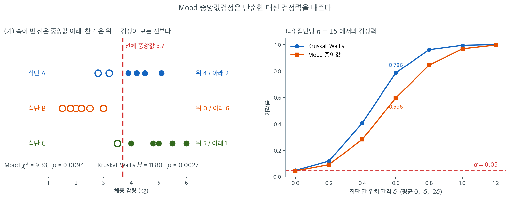

# Mood 중앙값검정

**Mood 중앙값검정**은 독립인 두 집단 이상을 비교하는 가장 단순한 비모수 검정 중 하나이다. 각 관측값을 전체 중앙값보다 위인지 아래인지로 분류한 뒤 그 분할표에 카이제곱 독립성 검정을 적용하여 집단들이 같은 중앙값을 갖는지 검정한다.

개념이 명료하고 이상치에 극도로 로버스트하지만, 각 관측값이 중앙값에서 얼마나 떨어져 있는지에 대한 정보를 모두 버리므로 [Kruskal-Wallis 검정](kruskal_wallis.md)보다 대체로 검정력이 낮다.

## 가설

$$
H_0 \colon k \text{개 집단의 중앙값이 모두 같다}
$$

$$
H_a \colon \text{적어도 한 집단의 중앙값이 다르다}
$$

## 절차

**1단계.** 크기 $N = \sum_{i=1}^{k} n_i$인 합친 표본의 **전체 중앙값** $\tilde{x}$를 계산한다.

**2단계.** 각 집단에서 전체 중앙값보다 위인 관측값과 아래(또는 같은) 관측값의 개수를 센다. 이렇게 $2 \times k$ 분할표가 만들어진다.

|  | 집단 1 | 집단 2 | $\cdots$ | 집단 $k$ | 합계 |
|:-|:-------:|:-------:|:--------:|:---------:|:-----:|
| $\tilde{x}$ 위 | $a_1$ | $a_2$ | $\cdots$ | $a_k$ | $A$ |
| $\tilde{x}$ 아래 | $b_1$ | $b_2$ | $\cdots$ | $b_k$ | $B$ |
| **합계** | $n_1$ | $n_2$ | $\cdots$ | $n_k$ | $N$ |

$\tilde{x}$와 정확히 같은 관측값은 보통 "아래 또는 같음" 범주에 넣지만 관례가 다양하다.

**3단계.** 분할표에 **Pearson 카이제곱 검정**을 적용한다.

$$
\chi^2 = \sum_{i=1}^{k} \left[\frac{(a_i - E_{a_i})^2}{E_{a_i}} + \frac{(b_i - E_{b_i})^2}{E_{b_i}}\right]
$$

여기서 $H_0$ 아래의 기대도수는

$$
E_{a_i} = \frac{n_i \times A}{N}, \qquad E_{b_i} = \frac{n_i \times B}{N}
$$

이다.

**4단계.** $H_0$ 아래에서 검정통계량은 근사적으로

$$
\chi^2 \sim \chi^2_{k-1}
$$

을 따른다.

<div class="exbox" markdown>

**보기 1.** <span class="diff easy" title="쉬움"></span> 기대도수가 모두 3 이다. 세 가지 식단을 8주간의 체중 감량(kg)으로 비교한다.

**식단 A** ($n_1 = 6$): 3.2, 4.5, 2.8, 5.1, 3.9, 4.2

**식단 B** ($n_2 = 6$): 1.5, 2.0, 3.0, 2.5, 1.8, 2.2

**식단 C** ($n_3 = 6$): 4.0, 5.5, 3.5, 6.0, 4.8, 5.0

**(1)** 위 네 단계를 밟아 전체 중앙값, 분할표, $\chi^2$, $p$ 값을 손으로 구하시오.

**(2)** 기대도수가 모두 $3$ 으로 "$E \geq 5$" 라는 흔한 규칙에 못 미친다. 주변합이 고정된 $2 \times 3$ 표를 **전부 열거**해 정확 p-값을 구하고 $\chi^2_2$ 근사와 견주시오.

</div>

??? success "풀이"

    **(1) 네 단계.**

    **1단계.** 합친 표본을 정렬한다: 1.5, 1.8, 2.0, 2.2, 2.5, 2.8, 3.0, 3.2, 3.5, 3.9, 4.0, 4.2, 4.5, 4.8, 5.0, 5.1, 5.5, 6.0.

    $N = 18$이므로 전체 중앙값은 9번째와 10번째 값의 평균이다.

    $$
    \tilde{x} = \frac{3.5 + 3.9}{2} = 3.7
    $$

    **2단계.** $\tilde{x} = 3.7$ 위·아래를 센다.

    |  | 식단 A | 식단 B | 식단 C | 합계 |
    |:-|:------:|:------:|:------:|:-----:|
    | 3.7 위 | 4 | 0 | 5 | 9 |
    | 3.7 아래 | 2 | 6 | 1 | 9 |
    | **합계** | 6 | 6 | 6 | 18 |

    **3단계.** 기대도수는 모두 $E = 6 \times 9/18 = 3$이다.

    $$
    \chi^2 = \frac{(4-3)^2}{3} + \frac{(0-3)^2}{3} + \frac{(5-3)^2}{3} + \frac{(2-3)^2}{3} + \frac{(6-3)^2}{3} + \frac{(1-3)^2}{3}
    $$

    $$
    = \frac{1 + 9 + 4 + 1 + 9 + 4}{3} = \frac{28}{3} \approx 9.33
    $$

    **4단계.** $\chi^2_2$와 비교한다: $P(\chi^2_2 > 9.33) = 0.0094$.

    ```python
    from scipy import stats
    A = [3.2, 4.5, 2.8, 5.1, 3.9, 4.2]
    B = [1.5, 2.0, 3.0, 2.5, 1.8, 2.2]
    C = [4.0, 5.5, 3.5, 6.0, 4.8, 5.0]
    print(stats.median_test(A, B, C))
    # statistic=9.3333, pvalue=0.0094036, median=3.7,
    # table=[[4 0 5]
    #        [2 6 1]]
    ```

    출력:

    ```
    MedianTestResult(statistic=9.333333333333334, pvalue=0.009403562551495204, median=3.7, table=array([[4, 0, 5],
           [2, 6, 1]]))
    ```

    $\alpha = 0.05$에서 $H_0$을 기각한다. 식단들의 중앙값 체중 감량이 다르다는 유의한 증거가 있다. 식단 B가 가장 효과가 낮고(6개 중 0개가 전체 중앙값 위), 식단 C가 가장 효과가 높다(6개 중 5개).

    **(2) 표가 37 가지뿐이고 $\chi^2$ 은 여섯 값만 갖는다.** 주변합이 고정되어 있다 — 열합은 $6, 6, 6$ 이고 행합은 $9, 9$ 다. 그러므로 첫 행 $(a, b, c)$ 만 정하면 표가 결정되고, 조건은

    $$
    a + b + c = 9, \qquad 0 \leq a, b, c \leq 6
    $$

    뿐이다. 그런 $(a,b,c)$ 는 **37 가지**다. $H_0$ 아래에서 "위" 아홉 개가 열여덟 자리 가운데 어디로 가는지는 모두 같은 확률이므로

    $$
    P(a, b, c) = \frac{\binom{6}{a}\binom{6}{b}\binom{6}{c}}{\binom{18}{9}},
    \qquad \binom{18}{9} = 48{,}620
    $$

    이다(다변량 초기하분포). 기대도수가 모두 $3$ 이고 둘째 행이 첫 행의 보수($6-a$ 등)이므로

    $$
    \chi^2 = \frac{1}{3}\sum\bigl[(a-3)^2 + (3-a)^2 + \cdots\bigr]
    = \frac{2}{3}\left[(a-3)^2 + (b-3)^2 + (c-3)^2\right]
    $$

    로 간단해진다. 관측값 $(4, 0, 5)$ 에서 $\tfrac23(1 + 9 + 4) = \tfrac{28}{3}$ 로 맞는다.

    $u = a-3$ 등으로 두면 $u + v + w = 0$ 이고 $-3 \leq u,v,w \leq 3$ 이다. 이 조건에서 $u^2+v^2+w^2$ 가 가질 수 있는 값은 $0, 2, 6, 8, 14, 18$ **여섯 개뿐**이므로 $\chi^2$ 도 여섯 값만 갖는다.

    | $\chi^2$ | 그 값을 주는 표 $(a,b,c)$ 의 예 | 정확 $P(\chi^2 \geq \cdot)$ | $\chi^2_2$ 근사 |
    |---|---|---|---|
    | $0$ | $(3,3,3)$ | 1.000000 | 1.000000 |
    | $4/3$ | $(4,2,3)$ | 0.835459 | 0.513417 |
    | $4$ | $(4,4,1)$ | 0.280132 | 0.135335 |
    | $16/3$ | $(5,1,3)$ | 0.113534 | 0.069483 |
    | $28/3$ | $(4,0,5)$ | **0.024681** | **0.009404** |
    | $12$ | $(6,3,0)$ | 0.002468 | 0.002479 |

    **관측값의 정확 p-값은 $1200/48620 = 60/2431 = 0.024681$ 이고, $\chi^2_2$ 근사의 $0.009404$ 는 그 $0.381$ 배 — 곧 참값이 근사의 2.6배다.** 근사가 **위험한 방향**으로 틀렸다: p-값을 작게 보고하므로 유의성을 과장한다. 기대도수가 $3$ 밖에 되지 않는 자리에서 "$E \geq 5$" 규칙을 무시한 대가다.

    명목수준별 실제 수준을 보면 이산성이 더 뚜렷하다.

    | 명목 $\alpha$ | $\chi^2_2$ 임계값 | 실제 수준 | 실제/명목 |
    |---|---|---|---|
    | 0.10 | 4.6052 | 0.113534 | 1.135 |
    | 0.05 | 5.9915 | 0.024681 | 0.494 |
    | 0.01 | 9.2103 | 0.024681 | **2.468** |

    $\alpha = 0.05$ 와 $\alpha = 0.01$ 의 임계값 사이에 **도달 가능한 $\chi^2$ 값이 하나도 없으므로** 두 검정의 기각역이 똑같고 실제 수준도 똑같이 $0.0247$ 이다. 그래서 $\alpha = 0.01$ 을 요구하면 실제로는 $0.0247$ 짜리 검정, 곧 **명목의 2.5배**를 돌리게 된다.

    **결론.** 이 자료에서 $\alpha = 0.05$ 판정은 안전하지만($0.0247 < 0.05$), **보고해야 할 p-값은 $0.0094$ 가 아니라 $0.0247$ 이다.** $2 \times k$ 표에서 기대도수가 작으면 위처럼 주변합을 고정해 직접 열거하거나 `scipy.stats.permutation_test` 로 정확 p-값을 구해야 한다.

    ```python
    import numpy as np
    from fractions import Fraction
    from math import comb

    N, row_above = 18, 9
    total = comb(N, row_above)
    tables = []
    for a in range(7):
        for b in range(7):
            c = row_above - a - b
            if 0 <= c <= 6:
                count = comb(6, a) * comb(6, b) * comb(6, c)
                T = np.array([[a, b, c], [6 - a, 6 - b, 6 - c]])
                E = np.outer(T.sum(1), T.sum(0)) / N
                tables.append((a, b, c, count, ((T - E) ** 2 / E).sum()))
    print(f"가능한 표 {len(tables)} 가지,  가지수 합 {sum(t[3] for t in tables)}"
          f" = C(18,9) = {total}")

    chi_vals = sorted({round(t[4], 6) for t in tables})
    print(f"chi2 가 가질 수 있는 값 {chi_vals}")
    print("\n  chi2      정확 p     chi2_2 근사")
    for v in chi_vals:
        exact = sum(t[3] for t in tables if t[4] >= v - 1e-9) / total
        print(f"{v:>8.4f}  {exact:>10.6f}  {stats.chi2.sf(v, 2):>12.6f}")

    obs = 28 / 3
    hit = sum(t[3] for t in tables if t[4] >= obs - 1e-9)
    print(f"\n관측 chi2 = 28/3 = {obs:.4f}")
    print(f"  정확   p = {hit}/{total} = {Fraction(hit, total)} = {hit / total:.6f}")
    print(f"  chi2_2 p = {stats.chi2.sf(obs, 2):.6f}"
          f"  ->  근사/정확 = {stats.chi2.sf(obs, 2) / (hit / total):.3f}")

    print("\n명목     임계값   실제 수준   실제/명목")
    for alpha in (0.10, 0.05, 0.01):
        crit = stats.chi2.isf(alpha, 2)
        size = sum(t[3] for t in tables if t[4] >= crit - 1e-9) / total
        print(f"{alpha:>6}  {crit:>8.4f}  {size:>10.6f}  {size / alpha:>9.3f}")
    ```

    출력:

    ```
    가능한 표 37 가지,  가지수 합 48620 = C(18,9) = 48620
    chi2 가 가질 수 있는 값 [0.0, 1.333333, 4.0, 5.333333, 9.333333, 12.0]
    
      chi2      정확 p     chi2_2 근사
      0.0000    1.000000      1.000000
      1.3333    0.835459      0.513417
      4.0000    0.280132      0.135335
      5.3333    0.113534      0.069483
      9.3333    0.024681      0.009404
     12.0000    0.002468      0.002479
    
    관측 chi2 = 28/3 = 9.3333
      정확   p = 1200/48620 = 60/2431 = 0.024681
      chi2_2 p = 0.009404  ->  근사/정확 = 0.381
    
    명목     임계값   실제 수준   실제/명목
       0.1    4.6052    0.113534      1.135
      0.05    5.9915    0.024681      0.494
      0.01    9.2103    0.024681      2.468
    ```

    **가지수의 합이 $\binom{18}{9} = 48620$ 으로 정확히 떨어지는 것이 열거가 빠짐없다는 검산이다.** 그리고 손으로 따진 여섯 개의 $\chi^2$ 값과 정확 p-값이 모두 맞는다.

    표의 맨 아래 줄 $\chi^2 = 12$ 에서 정확 $0.002468$ 과 근사 $0.002479$ 가 거의 같은 것이 재미있다. **근사가 이 한 점에서만 잘 맞는다** — 꼬리의 끝에서 우연히 교차한 것이고, 그 바로 앞 $\chi^2 = 28/3$ 에서는 2.6배 어긋난다. 이산분포를 연속곡선으로 덮을 때 두 곡선이 교차하는 지점이 있는 것은 당연하며, **거기서 잘 맞는 것을 근사가 쓸 만하다는 증거로 읽으면 안 된다.**

!!! note "$2 \times k$ 표에는 Yates 보정을 쓰지 않는다"
    Yates 연속성 보정은 $2 \times 2$ 표에만 적용된다. 여기서는 $k = 3$이라 $2 \times 3$ 표이므로 보정 없이 계산하며, `scipy.stats.median_test`도 보정을 적용하지 않는다.

    $k = 2$일 때는 [이표본 비모수 검정](../two_sample_nonparametric/two_sample.md)에서 보았듯 보정 여부가 결과를 크게 바꿀 수 있으므로 주의해야 한다.

## 장점과 한계

| 장점 | 한계 |
|:----------|:-----------|
| 계산이 매우 간단하다 | 검정력이 낮다(크기 정보를 버린다) |
| 이상치에 극도로 로버스트하다 | 중앙값 차이만 탐지하고 산포는 보지 못한다 |
| 순서형 자료에도 쓸 수 있다 | 기대도수가 작으면 카이제곱 근사가 나쁘다 |
| $k > 2$로 자연스럽게 확장된다 | 대체로 [Kruskal-Wallis](kruskal_wallis.md)에 밀린다 |



"검정력이 낮다"를 말로만 두지 말고 값을 붙여 보자.

(가)가 이 검정의 시야다. 속이 빈 점은 전체 중앙값 $3.7$보다 아래, 속이 찬 점은 위이다. **Mood 검정이 아는 것은 이 색칠 여부가 전부다.** 식단 C의 $6.0$과 $3.9$는 둘 다 그냥 "위 하나"이고, 식단 B의 $1.5$와 $3.0$은 둘 다 그냥 "아래 하나"이다. 그래도 식단 B가 $0 : 6$으로 완전히 한쪽에 몰려 있어 신호가 강하고, $\chi^2 = 9.33$, $p = 0.0094$로 기각에 이른다. 같은 자료에서 Kruskal-Wallis는 $H = 11.80$, $p = 0.0027$을 준다.

(나)가 그 격차를 일반화한 것이다. 평균이 $0$, $\delta$, $2\delta$인 정규 세 집단에서 집단당 $n = 15$를 뽑아 두 검정의 기각률을 쟀다. $\delta = 0$에서는 둘 다 $0.045$ 근처로 크기가 맞지만, 효과가 생기면 파란 곡선이 줄곧 위에 있다. $\delta = 0.4$에서 $0.406$ 대 $0.283$, $\delta = 0.6$에서 **$0.786$ 대 $0.596$**이다. 검정력 $0.80$에 이르는 지점으로 환산하면 Mood 검정은 같은 효과를 잡는 데 표본이 대략 $1.5$배 필요하다.

그렇다면 Mood 검정을 왜 배우는가. 이 검정이 요구하는 정보가 **"각 관측값이 기준선 위인가 아래인가"뿐**이기 때문이다. 순위를 매길 수 없는 자료 --- 검출한계 밖이라 "$> 100$"으로만 기록된 측정값, 구간으로만 보고된 소득 --- 에서도 그대로 작동한다. 검정력을 $1.5$배의 표본으로 사는 대신 순위를 매길 수 있다는 가정을 통째로 버리는 거래이다.

!!! warning "낮은 검정력"
    Mood 중앙값검정은 Kruskal-Wallis 검정보다 검정력이 상당히 낮다. 이상치 저항성이 무엇보다 중요하거나 자료가 의미 있는 임계값을 기준으로 자연스럽게 이분되는 경우에 주로 써야 한다. 일상적인 비교에는 Kruskal-Wallis 검정이 낫다.

## 언제 쓰는가

- **극단적인 이상치가 있어** 순위 기반 검정조차 영향을 받을 수 있을 때(실무에서는 드물다).
- **빠른 탐색적 분석**이 필요하고 뒤이어 형식적인 순위 기반 검정을 할 때.
- **연구 질문이 구체적으로 중앙값에 관한 것**이고 분할표 구조가 직관적인 요약이 될 때.

## 연습문제

<div class="drillbox" markdown>

**연습문제 1.** <span class="diff med" title="중간"></span>
본문의 식단 자료에 Kruskal-Wallis 검정을 적용하여 Mood 중앙값검정과 비교하라. 어느 쪽이 더 작은 $p$값을 주는가?

</div>

??? success "풀이"
    ```python
    from scipy import stats
    A = [3.2, 4.5, 2.8, 5.1, 3.9, 4.2]
    B = [1.5, 2.0, 3.0, 2.5, 1.8, 2.2]
    C = [4.0, 5.5, 3.5, 6.0, 4.8, 5.0]
    print(stats.median_test(A, B, C).pvalue)   # 0.009404
    print(stats.kruskal(A, B, C).pvalue)       # 0.002738
    print(stats.f_oneway(A, B, C).pvalue)      # 1.20e-04
    ```

    출력:

    ```
    0.009403562551495204
    0.002737843272588475
    0.00011973857254105124
    ```

    | 검정 | 통계량 | $p$값 |
    |:---|---:|---:|
    | Mood 중앙값 | $\chi^2 = 9.33$ | $0.00940$ |
    | Kruskal-Wallis | $H = 11.80$ | $0.00274$ |
    | 일원분산분석 | $F = 17.5$ | $1.2 \times 10^{-4}$ |

    사용하는 정보량 순서대로 $p$값이 작아진다.

    - **Mood**는 각 관측값을 "위/아래"라는 이진값으로 뭉갠다. $18$개 자료점에서 남는 정보가 $2 \times 3$ 표의 6개 숫자뿐이다.
    - **Kruskal-Wallis**는 $18$개의 순위를 모두 쓴다.
    - **분산분석**은 원값을 쓴다. 이 자료는 각 집단이 거의 정규이고 등분산이라 분산분석에 매우 유리하다.

    Mood 검정이 $\chi^2$의 자유도를 $k-1 = 2$로 유지하면서도 정보를 크게 잃으므로 Kruskal-Wallis보다 $p$값이 3.4배 커진다.

    실무 결론: 세 검정 모두 $\alpha = 0.05$에서 기각하므로 이 자료에서는 어느 것을 써도 같다. 그러나 효과가 더 약했다면 Mood 검정만 놓쳤을 것이다.

<div class="drillbox" markdown>

**연습문제 2.** <span class="diff med" title="중간"></span>
Mood 중앙값검정의 정규분포 아래 ARE는 얼마인가? 검정력을 모의실험으로 확인하고 Kruskal-Wallis와 비교하라.

</div>

??? success "풀이"
    Mood 중앙값검정은 각 집단에서 "전체 중앙값을 넘는 비율"을 비교하는 것이므로 본질적으로 부호검정의 다집단 확장이다. 따라서 정규분포 아래 일원분산분석 대비 ARE는 부호검정과 같은

    $$
    \text{ARE} = \frac{2}{\pi} \approx 0.637
    $$

    이다. Kruskal-Wallis의 $3/\pi \approx 0.955$보다 훨씬 낮다.

    ```python
    import numpy as np
    from scipy import stats
    rng = np.random.default_rng(0)
    B = 1500

    for n in (10, 20, 40):
        pm, pk, pf = [], [], []
        for _ in range(B):
            g1 = rng.normal(0.0, 1, n)
            g2 = rng.normal(0.5, 1, n)
            g3 = rng.normal(1.0, 1, n)
            pm.append(stats.median_test(g1, g2, g3).pvalue)
            pk.append(stats.kruskal(g1, g2, g3).pvalue)
            pf.append(stats.f_oneway(g1, g2, g3).pvalue)
        f = lambda p: round(np.mean(np.array(p) < .05), 3)
        print(n, f(pm), f(pk), f(pf))
    ```

    출력:

    ```
    10 0.256 0.428 0.459
    20 0.575 0.757 0.78
    40 0.885 0.97 0.982
    ```

    처리 효과가 $(0, 0.5, 1.0)$인 세 정규집단의 검정력:

    | 집단당 $n$ | Mood 중앙값 | Kruskal-Wallis | 일원분산분석 |
    |---:|---:|---:|---:|
    | 10 | 0.256 | 0.428 | 0.459 |
    | 20 | 0.575 | 0.757 | 0.780 |
    | 40 | 0.885 | 0.970 | 0.982 |

    Kruskal-Wallis가 분산분석에 거의 붙어 있는 반면($0.757$ 대 $0.780$, 3% 손실) Mood 중앙값검정은 뚜렷이 뒤처진다($0.575$, 26% 손실).

    $n = 20$에서 Kruskal-Wallis가 도달한 검정력 $0.757$을 Mood 검정으로 얻으려면 $n = 30$ 정도가 필요하다. ARE 비 $0.637/0.955 = 0.667$이 예측하는 배수 $1.5$와 대체로 부합한다.

<div class="drillbox" markdown>

**연습문제 3.** <span class="diff med" title="중간"></span>
전체 중앙값과 **정확히 같은** 관측값을 어떻게 처리하느냐가 결과를 바꿀 수 있다. `scipy.stats.median_test`의 `ties` 인자가 제공하는 세 가지 방식을 이산자료로 비교하라.

</div>

??? success "풀이"
    ```python
    import numpy as np
    from scipy import stats
    # 세 집단, 값이 1~5 인 Likert 자료
    g1 = [3, 3, 3, 4, 4, 5]
    g2 = [2, 3, 3, 3, 4, 4]
    g3 = [1, 2, 3, 3, 3, 3]
    print(np.median(g1 + g2 + g3))     # 3.0

    for t in ("below", "above", "ignore"):
        r = stats.median_test(g1, g2, g3, ties=t)
        print(t, round(float(r.statistic), 4), round(float(r.pvalue), 4))
        print(r.table)
    ```

    출력:

    ```
    3.0
    below 3.8769 0.1439
    [[3 2 0]
     [3 4 6]]
    above 2.4 0.3012
    [[6 5 4]
     [0 1 2]]
    ignore 5.1556 0.0759
    [[3 2 0]
     [0 1 2]]
    ```

    | `ties` | $\chi^2$ | $p$ | 분할표 |
    |:---|---:|---:|:---|
    | `"below"` (기본값) | 3.877 | 0.144 | $\begin{smallmatrix}3&2&0\\3&4&6\end{smallmatrix}$ |
    | `"above"` | 2.400 | 0.301 | $\begin{smallmatrix}6&5&4\\0&1&2\end{smallmatrix}$ |
    | `"ignore"` | 5.156 | 0.076 | $\begin{smallmatrix}3&2&0\\0&1&2\end{smallmatrix}$ |

    $18$개 관측값 중 $10$개가 전체 중앙값 $3$과 같다. 처리 방식에 따라 $\chi^2$이 $2.4$에서 $5.16$까지, $p$값이 $0.301$에서 $0.076$까지 4배 범위로 움직인다.

    `"ignore"`의 분할표는 자료가 $18$개에서 $8$개로 줄어든 것임에 유의하라. 통계량이 가장 크게 나오지만 표본크기를 절반 이상 버린 결과라 신뢰하기 어렵다.

    이것이 Mood 중앙값검정의 근본적 약점이다. **자료가 이산적일수록 중앙값과 같은 값이 많아지고, 임의의 규칙이 결론을 좌우한다.**

    Kruskal-Wallis는 이 문제에서 훨씬 자유롭다. 중간순위라는 원칙적인 동점 처리 방식이 있고 보정계수로 분산을 조정하기 때문이다.

    ```python
    print(stats.kruskal(g1, g2, g3))   # H=4.9342, p=0.08483
    ```

    출력:

    ```
    KruskalResult(statistic=4.93421605716687, pvalue=0.0848298300499718)
    ```

    이 자료에서는 어느 방법도 $\alpha = 0.05$에서 기각하지 않으므로 결론이 갈리지는 않는다. 그러나 $p$값의 요동 폭 자체가 경고 신호이다.

    **권고:** 값의 종류가 적은 순서형 자료(Likert 척도, 등급)에는 Mood 중앙값검정을 쓰지 말라.

<div class="drillbox" markdown>

**연습문제 4.** <span class="diff med" title="중간"></span>
중앙값이 모두 같지만 산포가 크게 다른 세 집단에서 Mood 중앙값검정과 Kruskal-Wallis 검정의 제1종 오류율을 확인하라. 두 검정이 정말로 명목수준을 지키는가?

</div>

??? success "풀이"
    ```python
    import numpy as np
    from scipy import stats
    rng = np.random.default_rng(1)
    B = 2000

    for n in (20, 50, 100):
        rej_m = rej_k = 0
        for _ in range(B):
            g1 = rng.normal(0, 1, n)
            g2 = rng.normal(0, 3, n)
            g3 = rng.normal(0, 9, n)
            rej_m += stats.median_test(g1, g2, g3).pvalue < 0.05
            rej_k += stats.kruskal(g1, g2, g3).pvalue < 0.05
        print(n, rej_m / B, rej_k / B)
    ```

    출력:

    ```
    20 0.092 0.0745
    50 0.102 0.0855
    100 0.117 0.0785
    ```

    세 집단의 중앙값이 모두 0이고 표준편차만 $1, 3, 9$로 다르다.

    | 집단당 $n$ | Mood 중앙값 | Kruskal-Wallis |
    |---:|---:|---:|
    | 20 | 0.092 | 0.075 |
    | 50 | 0.102 | 0.086 |
    | 100 | 0.117 | 0.079 |

    **두 검정 모두 명목수준을 넘는다.** 중앙값이 정확히 0으로 같은데도 Mood 검정은 $9$--$12\%$, Kruskal-Wallis는 $8$--$9\%$를 기각한다.

    Mood 검정이 왜 무너지는지가 특히 의외이다. "중앙값만 본다"면 문제가 없어야 하지 않은가?

    핵심은 **전체 중앙값이 모수가 아니라 추정값**이라는 데 있다. $\chi^2$ 검정은 분할표의 행 합이 $N/2$로 고정되었을 때 열 도수가 초기하분포를 따른다고 가정한다. 이 가정은 세 집단이 **같은 분포**일 때만 성립한다. 분산이 다르면 표본 전체 중앙값의 변동이 각 집단의 도수와 다른 방식으로 상관되어 초기하 귀무분포가 깨진다.

    구체적으로, 표본 전체 중앙값은 분산이 작은 집단($\sigma = 1$)의 관측값들에 의해 주로 결정된다. 그 집단의 표본이 우연히 오른쪽으로 치우치면 전체 중앙값이 올라가고, 그러면 분산이 큰 집단들의 "위" 도수가 함께 내려간다. 이 유도된 상관이 도수의 변동을 부풀린다.

    Mood 검정이 Kruskal-Wallis보다 더 나쁘고 $n$이 커질수록 악화되는 것도 이 때문이다.

    **정리:** "Mood 중앙값검정은 중앙값만 검정하므로 모양 차이에 안전하다"는 흔한 설명은 **정확하지 않다**. 등분산성이 크게 깨지면 두 검정 모두 신뢰할 수 없다. 이런 상황에서는 각 집단 중앙값의 붓스트랩 신뢰구간을 비교하는 편이 정직하다.

---

## 정리하며

Mood 중앙값검정은 전체 중앙값 위·아래 도수의 $2 \times k$ 분할표를 만들고 카이제곱 독립성 검정을 적용하여 집단 중앙값을 비교한다. 극도의 단순함과 이상치 로버스트성이 낮은 통계적 검정력과 맞바꾸어진다. 대부분의 응용에서 [Kruskal-Wallis 검정](kruskal_wallis.md)이 더 강력한 대안이며, Mood 중앙값검정은 이상치 저항성이 최우선인 상황에 아껴 두는 것이 좋다.
