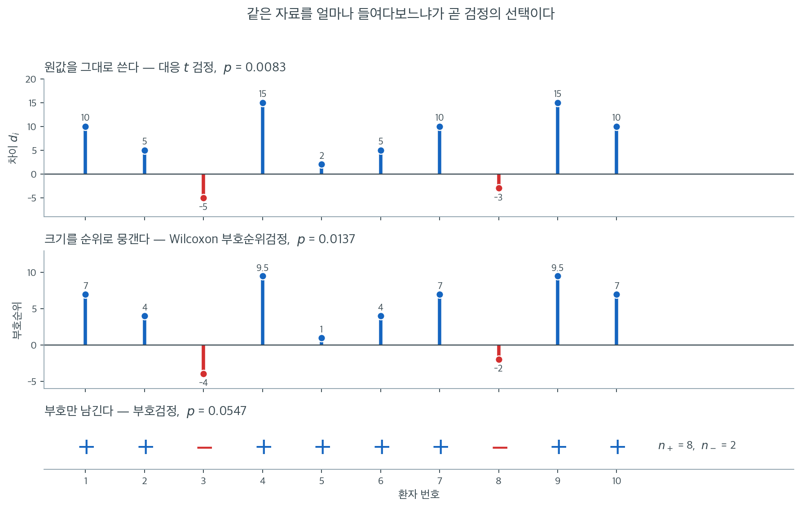

# 16.2 일표본 비모수 검정


이 절에서는 하나의 표본에 적용하는(또는 대응자료를 차이의 단일 표본으로 다루는) 기초적인 비모수 검정 세 가지를 소개한다. 무작위성에 대한 **런 검정**, 중앙값에 대한 **부호검정**, 그리고 편차의 부호와 크기를 모두 쓰는 **Wilcoxon 부호순위검정**이다.

---

## 1. 2.1 런 검정 (Wald–Wolfowitz)

### 개념

**Wald–Wolfowitz 런 검정**은 두 값으로 이루어진 자료 수열이 무작위인지 확인한다. **런**은 같은 원소가 연달아 이어지는 최대 부분수열이다. 예를 들어 수열

$$
\underbrace{+ + +}_{\text{런 1}} \; \underbrace{- -}_{\text{런 2}} \; \underbrace{+}_{\text{런 3}} \; \underbrace{- - -}_{\text{런 4}}
$$

에는 런이 4개 있다. 런이 너무 적으면 자료가 뭉쳐 있음(양의 자기상관)을, 너무 많으면 체계적인 교대를 시사한다.

### 가설

$$
H_0: \text{수열의 원소들이 서로 독립이다(무작위이다).}
$$

$$
H_a: \text{원소들이 독립이 아니다.}
$$

### 검정통계량

길이가 $N$이고 한 종류의 값이 $N_+$개, 다른 종류가 $N_- = N - N_+$개인 수열에서

**런의 개수:**

$$
R = \frac{N_+ + N_- + 1 - \sum_{i=1}^{N-1} x_i \, x_{i+1}}{2}
$$

여기서 자료는 $+1$과 $-1$로 부호화된다.

**$H_0$ 아래의 평균과 표준편차:**

$$
\mu_R = \frac{2 \, N_+ \, N_-}{N} + 1
$$

$$
\sigma_R = \sqrt{\frac{(\mu_R - 1)(\mu_R - 2)}{N - 1}}
$$

**표준화 검정통계량 (정규근사):**

$$
Z = \frac{R - \mu_R}{\sigma_R}
$$

$H_0$ 아래에서 $N$이 크면 $Z \xrightarrow{d} \mathcal{N}(0,1)$이다.

**p값 (양측):**

$$
p = 2 \, \Phi(-|Z|)
$$

<div class="exbox" markdown>

**보기 1.** <span class="diff easy" title="쉬움"></span> $\sigma_R$ 의 두 얼굴. 위 식은 런의 표준편차를 $\sigma_R = \sqrt{(\mu_R-1)(\mu_R-2)/(N-1)}$ 로 적는다. 교과서에서 더 자주 보는 꼴은

$$
\operatorname{Var}(R) = \frac{2N_+N_-\,(2N_+N_- - N)}{N^2(N-1)}
$$

이다.

**(1)** 두 식이 같은 것임을 보이시오.

**(2)** $\mu_R$ 과 $\operatorname{Var}(R)$ 은 근사식이 아니라 **등식**이다. 작은 $N$ 에서 전수 열거로 확인하시오.

</div>

??? success "풀이"

    **(1) 대입하면 끝난다.** $\mu_R = \dfrac{2N_+N_-}{N} + 1$ 이므로

    $$
    \mu_R - 1 = \frac{2N_+N_-}{N},
    \qquad
    \mu_R - 2 = \frac{2N_+N_-}{N} - 1 = \frac{2N_+N_- - N}{N}
    $$

    이고, 두 값을 곱해 $N - 1$ 로 나누면

    $$
    \frac{(\mu_R-1)(\mu_R-2)}{N-1}
    = \frac{1}{N-1} \cdot \frac{2N_+N_-}{N} \cdot \frac{2N_+N_- - N}{N}
    = \frac{2N_+N_-\,(2N_+N_- - N)}{N^2(N-1)}
    $$

    가 되어 교과서 꼴과 **글자 하나까지 같다.** $\square$

    구현이 앞의 꼴을 쓰는 까닭은 간단하다. $\mu_R$ 을 이미 계산해 두었으므로 **곱셈 두 번과 나눗셈 한 번으로 끝나고** $N_+N_-$ 를 다시 쓰지 않아도 된다.

    분산이 양수이려면 $2N_+N_- > N$ 이 필요하다. $N_+ = 1$ 이면 $2N_- = 2(N-1) > N$ 이 $N > 2$ 에서 성립하므로 양쪽에 하나씩이라도 있으면 괜찮다. **그러나 $N_+ = 0$ 이나 $N_- = 0$ 이면 분산이 0 이 되어 $Z$ 가 0 으로 나누어진다.** 한 종류만 나온 수열에서는 런이 언제나 1 개이므로 검정할 것이 없다 — 이 구현은 그 자리를 막아 두지 않았다.

    **(2) 전수 열거.** $H_0$ 아래에서 $N_+$ 개의 $+1$ 을 $N$ 자리에 놓는 $\binom{N}{N_+}$ 가지가 모두 같은 확률이다. 각 배치의 $R$ 을 세어 평균과 분산을 내면 공식과 맞아야 한다. $N = 17$, $N_+ = 6$ 이면 $\binom{17}{6} = 12376$ 가지다.

    $$
    \mu_R = \frac{2 \times 6 \times 11}{17} + 1 = \frac{132}{17} + 1 = 8.764706,
    \qquad
    \operatorname{Var}(R) = \frac{(7.764706)(6.764706)}{16} = 3.282872
    $$

    아래 코드가 네 가지 $(N_+, N_-)$ 에서 열거한 값과 공식이 **소수 여섯째 자리까지 같다**는 것을 보인다.

    **수치적으로.**

    ```python
    import numpy as np
    import scipy.stats as stats

    def runs_test(data):
        """Wald-Wolfowitz 런 검정. 관측 순서가 무작위인지 본다.

        +1 과 -1 이 늘어선 수열에서 같은 부호가 이어지는 덩어리를 런이라 한다.
        런이 너무 적으면 같은 값끼리 뭉쳐 있다는 뜻이고, 너무 많으면 번갈아
        나온다는 뜻이다. 둘 다 무작위가 아니다.

        매개변수
        --------
        data : +1 과 -1 로 이루어진 수열

        돌려주는 값
        ----------
        statistic : Z 통계량
        p_value : 양측 p-값
        """
        data = np.asarray(data)
        N = data.shape[0]
        N_plus = (data == 1).sum()
        N_minus = N - N_plus

        # 무작위라면 런의 개수가 이 평균과 표준편차를 갖는다.
        mu = 2 * N_plus * N_minus / N + 1
        sigma = np.sqrt((mu - 1) * (mu - 2) / (N - 1))

        # 런의 개수를 이웃한 원소의 곱으로 센다. 부호가 바뀌는 자리에서만
        # 곱이 -1 이 되므로, 그 개수가 런의 경계 수다. 반복문 없이 끝난다.
        R = (N_plus + N_minus + 1 - np.sum(data[1:] * data[:-1])) / 2

        statistic = (R - mu) / sigma
        p_value = 2 * stats.norm.cdf(-abs(statistic))

        return statistic, p_value
    ```

    ```python
    import itertools

    def count_runs(x):
        x = np.asarray(x)
        return (len(x) + 1 - np.sum(x[1:] * x[:-1])) / 2

    print(" N+  N-   배치수    E[R]열거    mu_R공식     Var열거  (mu-1)(mu-2)/(N-1)  교과서꼴")
    for N_plus, N_minus in ((6, 11), (9, 8), (4, 4), (5, 3)):
        N = N_plus + N_minus
        mu = 2 * N_plus * N_minus / N + 1
        var_a = (mu - 1) * (mu - 2) / (N - 1)
        var_b = 2 * N_plus * N_minus * (2 * N_plus * N_minus - N) / (N ** 2 * (N - 1))
        Rs = []
        for comb in itertools.combinations(range(N), N_plus):
            x = -np.ones(N, int)
            x[list(comb)] = 1
            Rs.append(count_runs(x))
        Rs = np.array(Rs)
        print(f"{N_plus:>3} {N_minus:>3} {len(Rs):>8} "
              f"{Rs.mean():>11.6f} {mu:>11.6f} {Rs.var():>11.6f} "
              f"{var_a:>19.6f} {var_b:>9.6f}")
    ```

    출력:

    ```
     N+  N-   배치수    E[R]열거    mu_R공식     Var열거  (mu-1)(mu-2)/(N-1)  교과서꼴
      6  11    12376    8.764706    8.764706    3.282872            3.282872  3.282872
      9   8    24310    9.470588    9.470588    3.955017            3.955017  3.955017
      4   4       70    5.000000    5.000000    1.714286            1.714286  1.714286
      5   3       56    4.750000    4.750000    1.473214            1.473214  1.473214
    ```

    **네 경우 모두 열거한 평균·분산이 공식과 소수 여섯째 자리까지 같고, 두 분산 꼴도 서로 같다.** 이것이 (1) 의 대수적 증명을 수로 뒷받침한다. 특히 $N_+ = N_- = 4$ 처럼 $N = 8$ 로 아주 작아도 **등식이 그대로 성립한다** — 근사가 끼어드는 곳은 $R$ 의 평균과 분산이 아니라 $Z$ 를 표준정규로 보는 **마지막 단계** 하나뿐이다.

<div class="exbox" markdown>

**보기 2.** <span class="diff easy" title="쉬움"></span> 뭉침과 과잉 교대, 두 꼬리에서 하나씩. 세 수열에 위 `runs_test` 를 돌리면 $Z$ 가 각각 $-3.7335$, $+2.2775$, $+1.3294$ 로 나온다. 첫째는 뭉침이 심한 수열, 둘째는 언뜻 "잘 섞여" 보이는 수열, 셋째는 진짜 독립인 모의 이항자료다.

**(1)** 세 수열의 $N_+$, $N_-$, $R$, $\mu_R$, $\sigma_R$, $Z$ 를 손으로 구해 코드의 값과 맞추시오.

**(2)** 둘째 수열은 왜 기각되는가. 런이 **너무 많다**는 것이 $Z$ 의 부호에서 어떻게 읽히는가.

</div>

??? success "풀이"

    **(1) 세 수열의 손계산.**

    **첫째 수열** $(1^6 0^{11})$ 은 $N = 17$, $N_+ = 6$, $N_- = 11$ 이고 런은 $1$ 의 덩어리와 $0$ 의 덩어리 **둘**뿐이다.

    $$
    \mu_R = \frac{2 \times 6 \times 11}{17} + 1 = \frac{132}{17} + 1 = 8.764706,
    \qquad
    \sigma_R = \sqrt{\frac{7.764706 \times 6.764706}{16}} = 1.811870
    $$

    $$
    Z = \frac{2 - 8.764706}{1.811870} = -3.733550
    $$

    **둘째 수열** $(1,1,0,1,0,1,0,0,1,0,1,0,1,0,1,1,0)$ 은 $1$ 이 **아홉 개**, $0$ 이 여덟 개다. 이웃한 열여섯 쌍 가운데 값이 바뀌는 자리가 열세 개이므로 $R = 13 + 1 = 14$ 다.

    $$
    \mu_R = \frac{2 \times 9 \times 8}{17} + 1 = \frac{144}{17} + 1 = 9.470588,
    \qquad
    \sigma_R = \sqrt{\frac{8.470588 \times 7.470588}{16}} = 1.988723
    $$

    $$
    Z = \frac{14 - 9.470588}{1.988723} = +2.277548
    $$

    **셋째 수열**은 $n = 200$ 의 모의 이항자료로 $1$ 이 80개, $0$ 이 120개이고 $R = 106$ 이다.

    $$
    \mu_R = \frac{2 \times 80 \times 120}{200} + 1 = 96 + 1 = 97,
    \qquad
    \sigma_R = \sqrt{\frac{96 \times 95}{199}} = 6.769723
    $$

    $$
    Z = \frac{106 - 97}{6.769723} = +1.329449
    $$

    세 값이 모두 코드의 $-3.7335$, $+2.2775$, $+1.3294$ 와 맞는다.

    **(2) $Z$ 의 부호가 어느 꼬리인지를 말해 준다.** 런 검정은 양측이지만 **두 꼬리의 뜻이 다르다.**

    | 수열 | $R$ | $\mu_R$ | $Z$ | 읽는 법 |
    |---|---|---|---|---|
    | 뭉침 | 2 | 8.7647 | $-3.73$ | 런이 **너무 적다** — 같은 값이 덩어리를 짓는다(양의 자기상관) |
    | 과잉 교대 | 14 | 9.4706 | $+2.28$ | 런이 **너무 많다** — 지나치게 자주 뒤바뀐다(음의 자기상관) |
    | 이항 | 106 | 97 | $+1.33$ | 기댓값 근처 — 독립성과 일관된다 |

    둘째 수열이 "잘 섞여" 보이는 것은 **같은 값이 세 번 이상 이어지는 곳이 없기** 때문이다. 실제로 이 수열의 가장 긴 런은 길이 2 다. 그러나 $N = 17$ 의 진짜 무작위 수열이라면 런이 평균 $9.47$ 개여야 하고, 14 개는 표준편차의 $2.28$ 배 위다. **눈에 "규칙적으로 보이지 않는 것"과 통계적 무작위성은 다르다.** 아래 연습문제 2 가 이것을 최장 런의 길이로 다시 본다.

    **수치적으로.**

    ```python
    data = np.array([1, 1, 1, 1, 1, 1, 0, 0, 0, 0, 0, 0, 0, 0, 0, 0, 0])
    statistic, p_value = runs_test(data * 2 - 1)  # {0,1} → {-1,+1} 변환
    print(f"{statistic = :.4f}")   # -3.7335
    print(f"{p_value   = :.4f}")   # 0.0002 → 무작위성 기각
    ```

    출력:

    ```
    statistic = -3.7335
    p_value   = 0.0002
    ```

    ```python
    data = np.array([1, 1, 0, 1, 0, 1, 0, 0, 1, 0, 1, 0, 1, 0, 1, 1, 0])
    statistic, p_value = runs_test(data * 2 - 1)
    print(f"{statistic = :.4f}")   # +2.2775
    print(f"{p_value   = :.4f}")   # 0.0228 → 무작위성 기각
    ```

    출력:

    ```
    statistic = 2.2775
    p_value   = 0.0228
    ```

    ```python
    np.random.seed(1)
    data = np.random.binomial(n=1, p=0.4, size=200)
    statistic, p_value = runs_test(data * 2 - 1)
    print(f"{statistic = :.4f}")   # +1.3294
    print(f"{p_value   = :.4f}")   # 0.1837 → 무작위성을 기각하지 못함
    ```

    출력:

    ```
    statistic = 1.3294
    p_value   = 0.1837
    ```

    ```python
    seqs = {
        "뭉침": np.array([1, 1, 1, 1, 1, 1, 0, 0, 0, 0, 0, 0, 0, 0, 0, 0, 0]),
        "과잉 교대": np.array([1, 1, 0, 1, 0, 1, 0, 0, 1, 0, 1, 0, 1, 0, 1, 1, 0]),
    }
    np.random.seed(1)
    seqs["이항 n=200"] = np.random.binomial(n=1, p=0.4, size=200)

    for name, s in seqs.items():
        x = s * 2 - 1
        N = len(x)
        N_plus = int((x == 1).sum())
        N_minus = N - N_plus
        R = (N + 1 - np.sum(x[1:] * x[:-1])) / 2
        mu = 2 * N_plus * N_minus / N + 1
        sigma = np.sqrt((mu - 1) * (mu - 2) / (N - 1))
        z, p = runs_test(x)
        print(f"{name}: N+={N_plus:>3} N-={N_minus:>3} R={R:>5.0f} "
              f"mu={mu:>9.6f} sigma={sigma:>8.6f} "
              f"z={(R - mu) / sigma:>9.6f}  (runs_test: {z:>9.6f}, p={p:.4f})")
        # 가장 긴 런
        best = cur = 1
        for i in range(1, N):
            cur = cur + 1 if s[i] == s[i - 1] else 1
            best = max(best, cur)
        print(f"  가장 긴 런의 길이 {best}")
    ```

    출력:

    ```
    뭉침: N+=  6 N-= 11 R=    2 mu= 8.764706 sigma=1.811870 z=-3.733550  (runs_test: -3.733550, p=0.0002)
      가장 긴 런의 길이 11
    과잉 교대: N+=  9 N-=  8 R=   14 mu= 9.470588 sigma=1.988723 z= 2.277548  (runs_test:  2.277548, p=0.0228)
      가장 긴 런의 길이 2
    이항 n=200: N+= 80 N-=120 R=  106 mu=97.000000 sigma=6.769723 z= 1.329449  (runs_test:  1.329449, p=0.1837)
      가장 긴 런의 길이 9
    ```

    **손계산 세 개가 모두 `runs_test` 와 소수 여섯째 자리까지 같다.** 가장 긴 런의 길이를 함께 찍어 보면 세 수열의 성격이 한눈에 갈린다 — 뭉친 수열은 11, 과잉 교대는 2, 진짜 무작위는 9 이다.

!!! warning "'잘 섞인' 것처럼 보인다고 무작위인 것은 아니다"
    이 수열은 언뜻 잘 섞여 보이지만 런이 $14$개로, 기댓값 $9.47$보다 **너무 많다**. 사람이 무작위 수열을 흉내 낼 때 전형적으로 저지르는 실수가 바로 이것이다. 같은 값이 연달아 나오는 것을 피하려다 실제 무작위 수열보다 훨씬 자주 교대하게 된다. 런 검정은 뭉침만이 아니라 이 과잉 교대도 잡아낸다.

**보기 3 --- 모의 이항자료:**

```python
np.random.seed(1)
data = np.random.binomial(n=1, p=0.4, size=200)
statistic, p_value = runs_test(data * 2 - 1)
print(f"{statistic = :.4f}")   # +1.3294
print(f"{p_value   = :.4f}")   # 0.1837 → 무작위성을 기각하지 못함
```

출력:

```
statistic = 1.3294
p_value   = 0.1837
```

이 자료는 진짜로 독립이므로 기각하지 않는 것이 옳다.

### 해석

| 결과 | 의미 |
|:--------|:--------|
| $p < \alpha$ | $H_0$ 기각: 표본이 독립적으로 추출된 것이 **아니다** |
| $p \geq \alpha$ | $H_0$ 기각 못 함: 표본이 독립성과 일관된다 |

### 금융에서의 응용

런 검정은 **임의보행 가설**을 검정하기 위해 주식 수익률 계열에 흔히 적용된다. 연속된 수익률이 독립이라면 양·음 수익률의 수열이 무작위로 보여야 한다.

---

## 2. 2.2 부호검정

### 개념

**부호검정**은 가장 단순한 비모수 검정 중 하나이다. 가설값 $m_0$보다 큰 관측값과 작은 관측값의 개수를 세어 분포의 중앙값이 $m_0$과 같은지 검정한다.

대응자료 $(x_i, y_i)$에서는 차이 $d_i = x_i - y_i$를 구하여 중앙값 차이가 0인지 검정한다. 이 검정은 차이의 **부호**만 쓰고 크기는 무시한다.

### 가설

$p = P(X > m_0)$(대응자료에서는 $p = P(d_i > 0)$)이라 하자. $H_0$: 중앙값 $= m_0$ 아래에서 $p = 0.5$이다.

| 검정 유형 | $H_0$ | $H_a$ |
|:----------|:-------|:-------|
| 양측 | $p = 0.5$ | $p \neq 0.5$ |
| 왼쪽 꼬리 | $p = 0.5$ | $p < 0.5$ |
| 오른쪽 꼬리 | $p = 0.5$ | $p > 0.5$ |

### 동점 처리

$m_0$과 정확히 같은 관측값(대응자료에서는 $d_i = 0$인 쌍)은 분석에서 **제외**한다. 남은 $n = n_+ + n_-$개만 사용한다.

### 검정통계량

$$
T = \sum_{i=1}^{N} \operatorname{sign}(d_i) \quad \text{(동점 제외)}
$$

동치로, $n = n_+ + n_-$일 때 $\hat{p} = n_+ / n$이라 두면 정규근사는

$$
Z = \frac{\hat{p} - 0.5}{\sqrt{0.25 / n}}
$$

이다.

### 보기 자료

다음 대응자료는 학생 15명의 처치 후 점수와 처치 전 점수를 비교한 것이다. 절대차이의 순위는 **Pratt 방법**(0을 순위 매기기에 포함)으로 매겼다.

| 학생 | 후 | 전 | 부호 | 절대차이 | 절대차이의 순위 |
|:-------:|:----:|:---:|:----:|:--------:|:----------------:|
| 6 | 54 | 54 | 0 | 0 | 2 |
| 13 | 78 | 78 | 0 | 0 | 2 |
| 15 | 76 | 76 | 0 | 0 | 2 |
| 2 | 70 | 72 | − | 2 | 4.5 |
| 12 | 89 | 87 | + | 2 | 4.5 |
| 4 | 65 | 68 | − | 3 | 6.5 |
| 14 | 80 | 77 | + | 3 | 6.5 |
| 3 | 81 | 75 | + | 6 | 8.5 |
| 7 | 94 | 88 | + | 6 | 8.5 |
| 10 | 65 | 57 | + | 8 | 10 |
| 11 | 95 | 86 | + | 9 | 11 |
| 8 | 91 | 81 | + | 10 | 12 |
| 9 | 77 | 65 | + | 12 | 13 |
| 5 | 79 | 65 | + | 14 | 14 |
| 1 | 93 | 76 | + | 17 | 15 |

동점 3개를 제외하면 $n_+ = 10$, $n_- = 2$, $n = 12$이다.

부호검정의 정규근사는

$$
\hat{p} = \frac{10}{12} = 0.8333, \qquad
Z = \frac{0.8333 - 0.5}{\sqrt{0.25/12}} = 2.309, \qquad p = 0.0209
$$

이다.

<div class="exbox" markdown>

**보기 3.** <span class="diff easy" title="쉬움"></span> 이 $Z$ 는 사실 $T/\sqrt{n}$ 이다. 아래 구현은 부호검정을 비율검정의 꼴 $Z = (\hat p - 0.5)/\sqrt{0.25/n}$ 으로 쓴다.

**(1)** 이 $Z$ 가 앞에 적은 부호통계량 $T = n_+ - n_-$ 를 $\sqrt{n}$ 으로 나눈 것과 **똑같음**을 보이시오.

**(2)** 이 구현은 연속성 보정을 하지 않는다. 바로 위 자료($n = 12$, $n_+ = 10$)에서 정확 이항검정과 얼마나 어긋나며, 연속성 보정을 넣으면 얼마나 가까워지는가.

</div>

??? success "풀이"

    **(1) 두 줄로 끝난다.** $\hat p = n_+/n$ 이고 $n = n_+ + n_-$ 이므로

    $$
    \hat p - \frac12 = \frac{n_+}{n} - \frac12 = \frac{2n_+ - n}{2n},
    \qquad
    \sqrt{\frac{0.25}{n}} = \frac{1}{2\sqrt{n}}
    $$

    이고 나누면

    $$
    Z = \frac{(2n_+ - n)/(2n)}{1/(2\sqrt{n})}
      = \frac{2n_+ - n}{2n} \cdot 2\sqrt{n}
      = \frac{2n_+ - n}{\sqrt{n}}
    $$

    다. 한편 $n_- = n - n_+$ 이므로

    $$
    T = n_+ - n_- = n_+ - (n - n_+) = 2n_+ - n
    $$

    이고 따라서 $Z = T/\sqrt{n}$ 이다. $\square$ **"비율의 검정"과 "부호의 합"이 같은 통계량의 두 이름일 뿐이다.** 확인하면 $T = 10 - 2 = 8$, $\sqrt{12} = 3.464102$, $8/3.464102 = 2.309401$ 로 구현이 주는 값과 같다.

    이 꼴에서 $\operatorname{Var}(T) = n$ 인 것도 바로 읽힌다. $T = \sum \operatorname{sign}(d_i)$ 이고 $H_0$ 아래에서 각 항이 $\pm 1$ 을 반반씩 독립으로 받으므로 항마다 분산이 1 이다.

    **(2) 보정이 없으면 두 배 가까이 어긋난다.** 정확 양측 p-값은 이항분포에서 바로 나온다. $n = 12$, $n_+ = 10$ 이므로 꼬리는 $\{10, 11, 12\}$ 와 대칭인 $\{0, 1, 2\}$ 이고

    $$
    p_{\text{정확}} = \frac{2\left[\binom{12}{10} + \binom{12}{11} + \binom{12}{12}\right]}{2^{12}}
    = \frac{2(66 + 12 + 1)}{4096}
    = \frac{158}{4096}
    = 0.038574
    $$

    다. 구현의 정규근사는

    $$
    Z = \frac{8}{\sqrt{12}} = 2.309401
    \implies p = 2\Phi(-2.309401) = 0.020921
    $$

    로 **정확값의 54% 에 불과하다.** $n_+$ 가 정수이므로 반 칸을 깎아 주면

    $$
    Z_{\text{보정}} = \frac{\lvert n_+ - n/2 \rvert - 0.5}{\sqrt{n/4}} = \frac{4 - 0.5}{\sqrt{3}} = 2.020726
    \implies p = 0.043308
    $$

    이 되어 정확값 $0.038574$ 에 훨씬 가깝다. 오차가 $0.017653$ 에서 $0.004734$ 로 **3.7배 줄었다.**

    | 방법 | $p$ | 정확값과의 차이 |
    |---|---|---|
    | 정확 이항 | 0.038574 | --- |
    | 정규근사, 보정 없음 (이 구현) | 0.020921 | $-0.017653$ |
    | 정규근사, 연속성 보정 | 0.043308 | $+0.004734$ |

    **보정 없는 쪽이 위험한 방향으로 틀린다** — p-값을 작게 보고하므로 기각을 과하게 한다. $n$ 이 열두 개뿐인 자료에 연속성 보정 없는 정규근사를 쓰는 것은 권할 일이 아니다.

    정확 p-값은 `binomtest` 로 구했다. 흔히 쓰이는 `2 * binom.cdf(...)` 관례는 $n$ 이 짝수이고 $n_+ = n/2$ 인 자리에서 **1 을 넘는 "p-값"** 을 돌려주는 결함이 있다. [9장 보기 17](../../ch09/one_sample_tests/one_sample.md) 이 그 자리를 수로 따져 두었으니 참고하라.

    구현에도 걸리는 데가 두 곳 있다. 모든 쌍이 동점이면 $n = 0$ 이 되어 `n_plus / n` 이 0 으로 나누어지고, `test_type` 에 세 문자열 가운데 없는 값을 주면 `p_value` 가 정의되지 않은 채 `return` 에 닿는다.

    **수치적으로.**

    ```python
    import numpy as np
    import scipy.stats as stats

    def sign_test(paired_data, test_type="two-sided"):
        """대응표본에 대한 부호검정.

        차이의 크기는 버리고 부호만 센다. 그래서 자료가 순서척도이기만 하면
        쓸 수 있고 이상치에도 끄떡없다. 대신 크기 정보를 버린 만큼 검정력이
        낮다 — 그 중간이 부호순위검정이다.

        매개변수
        --------
        paired_data : 모양 (n, 2) 인 배열. 0열이 처리 후, 1열이 처리 전이다.
        test_type : "less", "two-sided", "greater" 중 하나

        돌려주는 값
        ----------
        z : Z 통계량
        p_value : p-값
        """
        p_0, q_0 = 0.5, 0.5

        # 동점(차이가 0)은 아예 세지 않는다. 그래서 실제로 쓰이는 n 이
        # 원래 표본크기보다 작아진다.
        n_plus = np.sum(paired_data[:, 0] > paired_data[:, 1])
        n_minus = np.sum(paired_data[:, 0] < paired_data[:, 1])
        n = n_plus + n_minus
        p_hat = n_plus / n

        z = (p_hat - p_0) / np.sqrt(p_0 * q_0 / n)

        if test_type == "less":
            p_value = stats.norm.cdf(z)
        elif test_type == "two-sided":
            p_value = 2 * stats.norm.cdf(-abs(z))
        elif test_type == "greater":
            p_value = stats.norm.sf(z)

        return z, p_value
    ```

    ```python
    from math import comb

    n, n_plus = 12, 10
    T = 2 * n_plus - n
    print(f"T = n+ - n- = {T},  sqrt(n) = {np.sqrt(n):.6f},  T/sqrt(n) = {T / np.sqrt(n):.6f}")
    p_hat = n_plus / n
    print(f"(p_hat - 0.5)/sqrt(0.25/n) = {(p_hat - 0.5) / np.sqrt(0.25 / n):.6f}   <- 같다")

    exact = 2 * sum(comb(n, k) for k in range(n_plus, n + 1)) / 2 ** n
    print(f"\n정확     : 2*({' + '.join(str(comb(n, k)) for k in range(n_plus, n + 1))})"
          f"/{2 ** n} = {exact:.6f}")
    print(f"binomtest: {stats.binomtest(n_plus, n).pvalue:.6f}")

    z0 = (p_hat - 0.5) / np.sqrt(0.25 / n)
    zc = (abs(n_plus - n / 2) - 0.5) / np.sqrt(n / 4)
    p0 = 2 * stats.norm.sf(z0)
    pc = 2 * stats.norm.sf(zc)
    print(f"\n보정 없음: z = {z0:.6f},  p = {p0:.6f},  차이 {p0 - exact:+.6f}")
    print(f"연속성보정: z = {zc:.6f},  p = {pc:.6f},  차이 {pc - exact:+.6f}")
    print(f"오차가 {abs(p0 - exact) / abs(pc - exact):.1f} 배 줄었다")
    ```

    출력:

    ```
    T = n+ - n- = 8,  sqrt(n) = 3.464102,  T/sqrt(n) = 2.309401
    (p_hat - 0.5)/sqrt(0.25/n) = 2.309401   <- 같다

    정확     : 2*(66 + 12 + 1)/4096 = 0.038574
    binomtest: 0.038574

    보정 없음: z = 2.309401,  p = 0.020921,  차이 -0.017653
    연속성보정: z = 2.020726,  p = 0.043308,  차이 +0.004734
    오차가 3.7 배 줄었다
    ```

    **$T/\sqrt{n}$ 과 $(\hat p - 0.5)/\sqrt{0.25/n}$ 이 소수 여섯째 자리까지 같다.** 손으로 센 $158/4096 = 0.038574$ 가 `binomtest` 와 같고, 연속성 보정이 오차를 3.7배 줄이는 것도 확인된다.

<div class="exbox" markdown>

**보기 4.** <span class="diff easy" title="쉬움"></span> 동점 세 개를 어디에 넣는가. 처리 전후 점수 15쌍에 위 `sign_test` 를 돌리면 $Z = 2.3094$, $p = 0.0209$ 가 나온다.

**(1)** $n_+$, $n_-$, 동점의 개수, $n$, $\hat p$, $Z$ 를 손으로 구해 코드의 값과 맞추시오.

**(2)** 이 구현은 동점 세 개를 **버린다.** 동점을 양·음에 반반씩 세거나 모두 $H_0$ 쪽(음의 방향)으로 세면 p-값이 어떻게 달라지는가. 어느 처리가 정직한가.

</div>

??? success "풀이"

    **(1) 세어 본다.** 15쌍의 차이(후 $-$ 전)는

    $$
    d = (17,\ -2,\ 6,\ -3,\ 14,\ 0,\ 6,\ 10,\ 12,\ 8,\ 9,\ 2,\ 0,\ 3,\ 0)
    $$

    이고 양수 열 개, 음수 두 개, **0 이 세 개**다. 구현은 `>` 와 `<` 만 세므로 0 인 쌍은 어느 쪽에도 들어가지 않는다.

    $$
    n_+ = 10, \quad n_- = 2, \quad n = 12, \quad \hat p = \frac{10}{12} = 0.833333
    $$

    $$
    Z = \frac{0.833333 - 0.5}{\sqrt{0.25/12}} = \frac{0.333333}{0.144338} = 2.309401
    \implies p = 0.020921
    $$

    이고 코드의 $2.3094$, $0.0209$ 와 맞는다. **관측 15쌍 가운데 실제로 검정에 쓰인 것은 열두 개다.**

    **(2) 동점의 처리가 결론을 뒤집는다.** 세 가지 관례를 모두 계산하면

    | 동점 처리 | $n_+$ | $n$ | $\hat p$ | $Z$ | 정규근사 $p$ | 정확 $p$ |
    |---|---|---|---|---|---|---|
    | 버린다 (이 구현) | 10 | 12 | 0.8333 | 2.3094 | 0.0209 | 0.0386 |
    | 반반씩 센다 | 11.5 | 15 | 0.7667 | 2.0656 | 0.0389 | --- |
    | 모두 음의 방향으로 센다 | 10 | 15 | 0.6667 | 1.2910 | 0.1967 | 0.3018 |

    **버리는 쪽과 가장 보수적인 쪽 사이에서 p-값이 $0.021$ 에서 $0.197$ 로 아홉 배 벌어진다.** 정확검정으로 보면 $0.039$ 대 $0.302$ 로 여덟 배다. $\alpha = 0.05$ 에서 첫 둘은 기각하고 마지막은 기각하지 못한다. **관측 열다섯 개 가운데 세 개의 처리가 결론을 결정한다.**

    어느 쪽이 정직한가는 **0 이 왜 생겼는지**에 달렸다. 여기서는 점수가 정수로 기록되어 $54 \to 54$, $78 \to 78$, $76 \to 76$ 이 된 것이므로, 눈금이 더 고왔다면 아주 작은 양수나 음수였을 수 있다. 그렇다면 그 쌍이 양·음일 확률이 반반이라고 보는 **"반반씩" 쪽이 맞고**, 실제로 그 값 $0.0389$ 가 버리는 쪽의 정확값 $0.0386$ 과 거의 같다. 반면 "0 은 변화 없음이므로 효과의 증거가 아니다" 라는 입장을 취하면 가장 보수적인 쪽으로 가야 하고 그때는 기각할 수 없다.

    **그래서 보고할 때 동점의 개수를 반드시 적어야 한다.** "$n = 15$, $p = 0.021$" 은 읽는 이를 오도한다. "15쌍 가운데 동점 3쌍을 제외한 $n = 12$ 로 검정했고 $p = 0.021$(정규근사) 또는 $0.039$(정확)" 가 정직한 서술이다.

    **수치적으로.**

    ```python
    # 처리 전후 점수 15쌍. 아래 부호검정과 부호순위검정을 같은 자료에 돌려
    # p-값을 견줄 수 있다.
    data = np.array([
        [93, 76], [70, 72], [81, 75], [65, 68], [79, 65],
        [54, 54], [94, 88], [91, 81], [77, 65], [65, 57],
        [95, 86], [89, 87], [78, 78], [80, 77], [76, 76]
    ])
    z, p_value = sign_test(data)
    print(f"{z       = :.4f}")   # 2.3094
    print(f"{p_value = :.4f}")   # 0.0209
    ```

    출력:

    ```
    z       = 2.3094
    p_value = 0.0209
    ```

    ```python
    d = data[:, 0] - data[:, 1]
    n_plus = int((d > 0).sum())
    n_minus = int((d < 0).sum())
    n_zero = int((d == 0).sum())
    print(f"차이 {list(d)}")
    print(f"n+ = {n_plus},  n- = {n_minus},  동점 = {n_zero},  n = {n_plus + n_minus}")

    print("\n동점 처리별 p-값")
    for label, np_eff, n_eff in (("버린다       ", n_plus, n_plus + n_minus),
                                 ("반반씩 센다  ", n_plus + n_zero / 2, 15),
                                 ("음의 방향으로", n_plus, 15)):
        p_hat = np_eff / n_eff
        z = (p_hat - 0.5) / np.sqrt(0.25 / n_eff)
        line = (f"  {label}: n+={np_eff:>5} n={n_eff:>3} p_hat={p_hat:.4f} "
                f"z={z:.4f} 근사 p={2 * stats.norm.sf(abs(z)):.4f}")
        if float(np_eff).is_integer():
            line += f" 정확 p={stats.binomtest(int(np_eff), n_eff).pvalue:.4f}"
        print(line)
    ```

    출력:

    ```
    차이 [17, -2, 6, -3, 14, 0, 6, 10, 12, 8, 9, 2, 0, 3, 0]
    n+ = 10,  n- = 2,  동점 = 3,  n = 12

    동점 처리별 p-값
      버린다       : n+=   10 n= 12 p_hat=0.8333 z=2.3094 근사 p=0.0209 정확 p=0.0386
      반반씩 센다  : n+= 11.5 n= 15 p_hat=0.7667 z=2.0656 근사 p=0.0389
      음의 방향으로: n+=   10 n= 15 p_hat=0.6667 z=1.2910 근사 p=0.1967 정확 p=0.3018
    ```

    **손계산 $\hat p = 0.8333$, $Z = 2.3094$, $p = 0.0209$ 가 구현과 같고**, 세 관례의 p-값 $0.0209 / 0.0389 / 0.1967$ 도 표와 맞는다. 동점 셋이 결론을 가르는 자리에 있다는 것이 그대로 보인다.

### 언제 쓰는가

부호검정은 변화의 방향만 중요하거나(또는 방향만 측정 가능하거나) 차이를 양수·음수·동점으로만 분류할 수 있을 때 적절하다. 차이의 크기도 의미가 있다면 **Wilcoxon 부호순위검정**(16.2.3절)이 대체로 검정력이 더 높다.

---

## 3. 2.3 Wilcoxon 부호순위검정

### 개념

**Wilcoxon 부호순위검정**은 가설 중앙값으로부터의 각 편차에서 *방향*뿐 아니라 *크기*까지 고려하여 부호검정을 확장한다. 절대편차에 순위를 매기고 양·음 차이의 순위를 각각 합산하는 방식이다.

!!! note "혼동하지 말 것"
    **Wilcoxon 순위합검정**(16.4.1절)은 독립인 두 표본을 위한 것이다. **부호순위**검정은 일표본 또는 대응자료를 위한 것이다.

### 가설

차이 $d_i = x_i - y_i$인 대응자료에서

$$
H_0: d_i \text{의 중앙값이 0이다}
$$

$$
H_a: d_i \text{의 중앙값이 0이 아니다 (양측)}
$$

### 검정통계량

1. 차이 $d_i = x_i - y_i$를 계산한다.
2. $|d_i|$ 값들을 작은 값부터 순위를 매긴다.
3. 검정통계량은 다음과 같다.

$$
T = \sum_{i=1}^{N} \operatorname{sign}(d_i) \times \text{Rank}(|d_i|)
$$

0이 아닌 모든 차이를 똑같이 취급하는 부호검정과 달리, 이 통계량은 0에서 더 멀리 벗어난 관측값에 더 큰 가중치를 준다.

### 동점(0인 차이) 처리

`zero_method` 매개변수가 0인 차이의 처리 방식을 정한다.

| 방법 | 설명 |
|:-------|:------------|
| `"wilcox"` | 0을 버리고 남은 값들에 순위를 매긴다 |
| `"pratt"` | 0을 순위 매기기에 포함시킨 뒤 합에서 제외한다 |
| `"zsplit"` | 0의 순위를 양·음에 절반씩 나눈다 |

### 계산 보기

부호검정 절의 학생 자료를 Pratt 방법으로 계산하면

$$
T = (-1)(4.5) + (+1)(4.5) + (-1)(6.5) + (+1)(6.5) + (+1)(8.5) + \cdots + (+1)(15)
$$

이고 순위합은

$$
W^+ = 4.5 + 6.5 + 8.5 + 8.5 + 10 + 11 + 12 + 13 + 14 + 15 = 103,
\qquad W^- = 4.5 + 6.5 = 11
$$

이다. 양의 순위가 압도한다.

### SciPy 구현

<div class="exbox" markdown>

**보기 5.** <span class="diff easy" title="쉬움"></span> 크기 정보가 결론을 뒤집는다. 같은 15쌍에 부호순위검정을 돌리면 $W = 11$, $p = 0.0086$ 으로 부호검정의 $p = 0.0209$ 보다 2.4배 작다.

**(1)** 그 차이가 어디에서 오는지 $W^+ = 103$, $W^- = 11$ 을 써서 말하시오. 부호검정에게는 전달되지 않는 정보가 무엇인가.

**(2)** 차이의 **부호는 그대로 두고 크기만 뒤바꾸어** 부호검정의 p-값은 변하지 않는데 부호순위검정이 기각하지 못하게 만들 수 있는가.

</div>

??? success "풀이"

    **(1) 음의 차이 둘이 가장 작은 쪽이다.** 0 이 아닌 차이 열둘의 절대값은 $2, 2, 3, 3, 6, 6, 8, 9, 10, 12, 14, 17$ 이고, 음의 차이는 $-2$ 와 $-3$ 둘뿐이다. Pratt 방식의 순위에서 그 둘이 받는 것은 $4.5$ 와 $6.5$ 로 **열두 개 가운데 아래쪽 두 자리**다. 그래서

    $$
    W^- = 4.5 + 6.5 = 11,
    \qquad
    W^+ = 103,
    \qquad
    W^+ + W^- = 114
    $$

    로 양의 순위가 압도한다.

    **부호검정에게는 이 사실이 전달되지 않는다.** 부호검정은 $n_+ = 10$, $n_- = 2$ 라는 두 숫자만 본다. 음의 차이가 $-2, -3$ 인지 $-17, -14$ 인지 구별하지 못한다. 부호순위검정은 "반대 방향 증거가 둘 있는데 그 둘이 가장 약한 것들이다" 를 $W^- = 11$ 이라는 작은 수로 셈에 넣는다. 그만큼 증거가 강해지고 p-값이 $0.0209$ 에서 $0.0086$ 으로 내려간다.

    **(2) 만들 수 있다.** 절대값의 **다중집합을 그대로 유지**하고 음의 부호만 가장 큰 두 값에 옮긴다.

    $$
    d' = (-17,\ -14,\ 12,\ 10,\ 9,\ 8,\ 6,\ 6,\ 3,\ 3,\ 2,\ 2,\ 0,\ 0,\ 0)
    $$

    $\lvert d' \rvert$ 의 다중집합은 $\lvert d \rvert$ 와 같고, 양수 열 개·음수 두 개·0 세 개도 그대로다. **따라서 부호검정은 $n_+ = 10$, $n_- = 2$, $n = 12$ 를 그대로 받아 $Z = 2.3094$, $p = 0.0209$ 를 그대로 낸다.**

    부호순위검정은 다르다. 순위가 같은 자리(동점 묶음도 같으므로 $\operatorname{E}[W] = 57$, $\sigma = 17.496428$ 이 변하지 않는다)에 있지만 음의 차이가 **가장 높은 두 순위** $14$ 와 $15$ 를 받는다.

    $$
    W^- = 14 + 15 = 29,
    \qquad
    W^+ = 114 - 29 = 85
    $$

    $$
    z = \frac{29 - 57}{17.496428} = -1.600327
    \implies p = 0.109526
    $$

    **$0.0086$ 에서 $0.1095$ 로 열세 배 올라가 기각하지 못한다.** 부호검정의 p-값은 한 자리도 움직이지 않았다.

    | | 원래 자료 | 크기를 뒤바꾼 자료 |
    |---|---|---|
    | $n_+ / n_-$ | 10 / 2 | 10 / 2 |
    | 부호검정 $p$ | 0.0209 | **0.0209** (같다) |
    | $W^- / W^+$ | 11 / 103 | 29 / 85 |
    | 부호순위 $p$ | 0.0086 | **0.1095** (기각 못 함) |

    이것이 두 검정의 관계를 가장 또렷하게 보여 준다. **부호검정은 부호의 개수만 보므로 크기를 어떻게 섞어도 같은 답을 낸다.** 부호순위검정은 반대 방향 증거의 **크기**까지 보므로, 소수의 반대 사례가 크면 결론을 바꾼다. 어느 쪽이 옳은지는 자료가 아니라 가정이 정한다 — 부호순위검정의 $0.1095$ 는 **차이의 분포가 0 을 중심으로 대칭**이라는 가정 아래의 답이고, 부호검정의 $0.0209$ 는 그 가정 없이 얻은 답이다.

    **수치적으로.**

    ```python
    import numpy as np
    import scipy.stats as stats

    data = np.array([
        [93, 76], [70, 72], [81, 75], [65, 68], [79, 65],
        [54, 54], [94, 88], [91, 81], [77, 65], [65, 57],
        [95, 86], [89, 87], [78, 78], [80, 77], [76, 76]
    ])

    # 부호순위검정은 부호뿐 아니라 차이의 크기 순위까지 쓴다. 그래서 같은
    # 자료에서 부호검정보다 작은 p-값이 나온다.
    statistic, p_value = stats.wilcoxon(
        data[:, 0], data[:, 1],
        alternative="two-sided",
        method="approx",      # 정규근사
        zero_method="pratt"   # 0을 순위 매기기에 포함
    )
    print(f"{statistic = }")   # 11.0  (= W^-)
    print(f"{p_value   = :.4f}")   # 0.0086
    ```

    출력:

    ```
    statistic = 11.0
    p_value   = 0.0086
    ```

    ```python
    d_orig = data[:, 0] - data[:, 1]
    # 부호는 그대로, 크기만 뒤바꾼다. |d| 의 다중집합이 같다.
    d_swap = np.array([-17, -14, 12, 10, 9, 8, 6, 6, 3, 3, 2, 2, 0, 0, 0])
    print(f"원래  |d| 정렬 {sorted(np.abs(d_orig))}")
    print(f"뒤바꾼 |d| 정렬 {sorted(np.abs(d_swap))}   <- 같다")

    for label, d in (("원래      ", d_orig), ("크기 뒤바꿈", d_swap)):
        r = stats.rankdata(np.abs(d))
        n_plus, n_minus = int((d > 0).sum()), int((d < 0).sum())
        n = n_plus + n_minus
        z_sign = (n_plus / n - 0.5) / np.sqrt(0.25 / n)
        w = stats.wilcoxon(d, method="approx", zero_method="pratt")
        print(f"\n{label}: n+={n_plus} n-={n_minus}  "
              f"부호검정 z={z_sign:.4f} p={2 * stats.norm.sf(abs(z_sign)):.4f}")
        print(f"            W-={r[d < 0].sum():.1f}  W+={r[d > 0].sum():.1f}  "
              f"부호순위 W={w.statistic:.1f} p={w.pvalue:.6f}")
    ```

    출력:

    ```
    원래  |d| 정렬 [0, 0, 0, 2, 2, 3, 3, 6, 6, 8, 9, 10, 12, 14, 17]
    뒤바꾼 |d| 정렬 [0, 0, 0, 2, 2, 3, 3, 6, 6, 8, 9, 10, 12, 14, 17]   <- 같다

    원래      : n+=10 n-=2  부호검정 z=2.3094 p=0.0209
                W-=11.0  W+=103.0  부호순위 W=11.0 p=0.008561

    크기 뒤바꿈: n+=10 n-=2  부호검정 z=2.3094 p=0.0209
                W-=29.0  W+=85.0  부호순위 W=29.0 p=0.109526
    ```

    **부호검정의 $z = 2.3094$ 와 $p = 0.0209$ 가 두 자료에서 완전히 같고, 부호순위검정만 $0.008561 \to 0.109526$ 으로 움직인다.** 손으로 구한 $W^- = 29$, $z = -1.600327$ 도 맞는다.

    **지어낸 자료가 아니면 이런 일이 드물다고 생각하기 쉬우나 그렇지 않다.** "대부분 좋아졌지만 몇 사람은 크게 나빠졌다" 는 흔한 임상 양상이 바로 이 모양이다. 그때 부호검정과 부호순위검정이 갈리며, 어느 쪽을 보고할지는 **몇 명이 나빠졌는가**를 묻는지 **얼마나 나빠졌는가**를 묻는지에 달려 있다.

!!! warning "`mode=` 는 더 이상 쓰이지 않는다"
    옛 SciPy 코드는 `mode="approx"`를 썼지만 이 인자는 `method=`로 바뀌었다. 옛 이름은 SciPy 1.9에서 폐기되었고 이후 제거되었다.

    또 `zero_method="pratt"`를 쓰면 정확검정을 쓸 수 없다(0이 있으면 정확 귀무분포가 정의되지 않는다). SciPy는 이 경우 경고와 함께 정규근사로 자동 전환한다.

### 부호검정과 Wilcoxon 부호순위검정

| 특징 | 부호검정 | Wilcoxon 부호순위 |
|:--------|:----------|:---------------------|
| 부호를 쓰는가 | ✓ | ✓ |
| 크기를 쓰는가 | ✗ | ✓ (순위를 통해) |
| 가정 | i.i.d. 외에 없음 | 차이의 분포가 대칭 |
| 검정력 | 낮음 | 높음 (대칭성이 성립할 때) |
| 이상치에 대한 로버스트성 | 매우 높음 | 높음 |

부호검정은 $H_0$ 아래에서 $P(d_i > 0) = P(d_i < 0)$만 요구하는 반면, Wilcoxon 부호순위검정은 차이의 분포가 0을 중심으로 대칭이라는 것까지 가정한다.



이 절에서 본 검정들을 한 장에 겹쳐 놓으면 공통 구조가 드러난다. 세 칸 모두 **같은 자료**이다. 환자 10명의 처치 전후 차이 $d = (10, 5, -5, 15, 2, 5, 10, -3, 15, 10)$을 세 가지 해상도로 바라본 것뿐이다.

맨 위는 원값 그대로이다. $-5$가 $-3$보다 두 배 가까이 크다는 것, $15$가 $2$의 일곱 배라는 것을 전부 쓴다. 대응 $t$ 검정이 이 층에서 작동하고 $p = 0.0083$을 준다. 가운데는 절대차이를 순위로 뭉갠 것이다. $15$와 $15$는 순위 $9.5$, $2$는 순위 $1$이 되어 **간격은 사라지고 순서만 남는다.** Wilcoxon 부호순위검정이 여기서 $p = 0.0137$을 준다. 맨 아래는 부호만 남긴 층이다. 열 개의 $+$와 $-$뿐이며 부호검정이 $p = 0.0547$을 준다.

$p$값이 $0.0083 \to 0.0137 \to 0.0547$로 **층을 내려갈 때마다 커진다**는 점을 눈여겨보라. 여기서는 두 음의 차이가 $-5$와 $-3$으로 작은 축에 속해, 순위를 버리는 순간 "반대 방향 증거가 있긴 하지만 미미하다"는 정보가 통째로 사라지기 때문이다. 다만 이것을 "위쪽 검정이 항상 낫다"로 읽으면 안 된다. 아래층으로 내려가는 것은 정보를 잃는 동시에 **가정을 덜어 내는** 일이다. $t$ 검정은 차이가 정규에 가깝기를, 부호순위검정은 대칭이기를 요구하지만 부호검정은 아무것도 요구하지 않는다.

그래서 검정을 고르는 일은 "가장 강력한 것 고르기"가 아니라 **자료의 어느 층까지를 믿을 수 있는가를 정하는 일**이다. Likert 척도라면 위 두 층은 애초에 존재하지 않고, 이상치가 의심스럽다면 맨 위 층을 믿을 수 없으며, 분포가 비대칭이면 가운데 층의 귀무분포가 틀어진다. 믿을 수 있는 가장 위층을 고르는 것이 옳은 순서이다.

---

## 연습문제

<div class="drillbox" markdown>

**연습문제 1.** <span class="diff med" title="중간"></span>
위 학생 자료에서 세 검정(런 검정은 제외)의 $p$값을 모두 구하고 비교하라. 부호검정, Wilcoxon(Pratt), Wilcoxon(wilcox), 대응 $t$ 검정을 각각 계산하라.

</div>

??? success "풀이"
    ```python
    import numpy as np, scipy.stats as stats
    data = np.array([
        [93, 76], [70, 72], [81, 75], [65, 68], [79, 65],
        [54, 54], [94, 88], [91, 81], [77, 65], [65, 57],
        [95, 86], [89, 87], [78, 78], [80, 77], [76, 76]])
    d = data[:, 0] - data[:, 1]

    print(stats.binomtest(int((d > 0).sum()), int((d != 0).sum())).pvalue)
    print(stats.wilcoxon(d, zero_method='pratt', method='approx').pvalue)
    print(stats.wilcoxon(d, zero_method='wilcox', method='exact').pvalue)
    print(stats.ttest_1samp(d, 0).pvalue)
    ```

    출력:

    ```
    0.03857421875
    0.008560915878575636
    0.007579201614253502
    0.003815602209766083
    ```

    | 검정 | $p$값 (양측) |
    |:---|---:|
    | 부호검정 (정확) | $0.0386$ |
    | 부호검정 (정규근사) | $0.0209$ |
    | Wilcoxon, Pratt | $0.0086$ |
    | Wilcoxon, wilcox | $0.0076$ |
    | 대응 $t$ | $0.0038$ |

    검정력의 서열이 그대로 드러난다. $t$ < Wilcoxon < 부호검정 순으로 $p$값이 커진다. 이 자료가 대략 대칭이고 이상치가 없어 $t$ 검정에 유리한 조건이기 때문이다.

    부호검정에서 정확 $p$값 $0.0386$이 정규근사 $0.0209$의 거의 두 배임에도 주목하라. $n = 12$는 정규근사를 쓰기에 너무 작다. 이 자료에서는 두 값 모두 $0.05$ 아래라 결론이 같지만, 소표본에서 정규근사를 쓰면 $p$값을 크게 과소평가할 수 있다.

    Pratt와 wilcox의 차이는 작다($0.0086$ 대 $0.0076$). Pratt 방법이 0을 순위 매기기에 포함시켜 나머지 순위를 모두 3칸씩 밀어 올리므로 $W^+$와 $W^-$가 함께 커지고, 결과적으로 표준화된 값이 살짝 보수적으로 나온다.

---

<div class="drillbox" markdown>

**연습문제 2.** <span class="diff med" title="중간"></span>
보기 2의 수열 $(1,1,0,1,0,1,0,0,1,0,1,0,1,0,1,1,0)$은 "잘 섞인" 것처럼 보이지만 런 검정이 기각한다. 사람이 만든 무작위 수열이 왜 이런 특징을 보이는지 설명하고, 진짜 무작위 수열에서 가장 긴 런의 기대 길이를 모의실험으로 확인하라.

</div>

??? success "풀이"
    ```python
    import numpy as np
    rng = np.random.default_rng(0)

    def max_run(s):
        best = cur = 1
        for i in range(1, len(s)):
            cur = cur + 1 if s[i] == s[i - 1] else 1
            best = max(best, cur)
        return best

    for n in (17, 50, 100, 200):
        m = [max_run(rng.integers(0, 2, n)) for _ in range(20000)]
        print(n, np.mean(m), np.percentile(m, [5, 95]))
    ```

    출력:

    ```
    17 4.41955 [3. 7.]
    50 5.9724 [4. 9.]
    100 6.97655 [ 5. 10.]
    200 7.98065 [ 6. 11.]
    ```

    | $n$ | 최장 런의 평균 | 5--95 백분위 |
    |---:|---:|:---:|
    | 17 | 4.4 | 3 -- 7 |
    | 50 | 6.0 | 4 -- 9 |
    | 100 | 7.0 | 5 -- 10 |
    | 200 | 8.0 | 6 -- 11 |

    동전을 100번 던지면 같은 면이 **평균 7번** 연달아 나온다. 사람이 무작위 수열을 흉내 낼 때는 이런 긴 덩어리를 "무작위처럼 보이지 않는다"는 이유로 피하기 때문에 지나치게 자주 교대하게 된다.

    보기 2의 수열은 길이 17에서 최장 런이 2에 불과하다. 기대되는 $4.4$의 절반도 안 되고, 5% 백분위인 $3$보다도 작다. 그래서 런 개수가 $14$로 기댓값 $9.47$을 크게 넘고, $Z = +2.28$로 기각된다.

    이것은 실무적으로 중요한 진단이다. 자료 조작이나 설문 응답 위조를 탐지할 때 "너무 규칙적으로 불규칙한" 패턴이 오히려 신호가 된다.

---

<div class="drillbox" markdown>

**연습문제 3.** <span class="diff med" title="중간"></span>
`zero_method`의 세 선택지(`wilcox`, `pratt`, `zsplit`)는 언제 갈라지는가? 0이 아닌 차이는 그대로 두고 0의 개수만 늘려 가며 세 방법의 $p$값을 비교하라.

</div>

??? success "풀이"
    0이 아닌 차이를 $(3, 5, 8, 12, 15, 2, 6, -4, -9, -1)$로 고정하고 0의 개수만 바꾼다.

    ```python
    import numpy as np, scipy.stats as stats
    nonzero = [3, 5, 8, 12, 15, 2, 6, -4, -9, -1]
    for nz in (0, 10, 20, 30, 40):
        d = np.array([0] * nz + nonzero)
        print(nz,
              round(stats.wilcoxon(d, zero_method='wilcox', method='approx').pvalue, 4),
              round(stats.wilcoxon(d, zero_method='pratt',  method='approx').pvalue, 4),
              round(stats.wilcoxon(d, zero_method='zsplit', method='approx').pvalue, 4))
    ```

    출력:

    ```
    0 0.1394 0.1394 0.1394
    10 0.1394 0.1663 0.1912
    20 0.1394 0.1792 0.245
    30 0.1394 0.1859 0.2908
    40 0.1394 0.1899 0.3297
    ```

    | 0의 개수 | 전체 $n$ | wilcox | pratt | zsplit |
    |---:|---:|---:|---:|---:|
    | 0 | 10 | 0.1394 | 0.1394 | 0.1394 |
    | 10 | 20 | 0.1394 | 0.1663 | 0.1912 |
    | 20 | 30 | 0.1394 | 0.1792 | 0.2450 |
    | 30 | 40 | 0.1394 | 0.1859 | 0.2908 |
    | 40 | 50 | 0.1394 | 0.1899 | 0.3297 |

    결정적인 관찰: **`wilcox`의 $p$값은 0을 아무리 많이 붙여도 전혀 변하지 않는다.** 0을 통째로 버리므로 $n = 10$짜리 검정을 반복하는 것과 같다. 반면 `pratt`과 `zsplit`은 0이 늘수록 보수적으로 변한다.

    - **wilcox**가 묻는 질문은 "변화가 있었던 쌍들 중에서 양의 변화가 우세한가?"이다. 변화 없는 쌍이 90%라도 답이 같다.
    - **pratt**은 0을 순위 매기기에 포함시켜 전체 $n$을 유지한다. 0들이 가장 낮은 순위를 차지하므로 0이 아닌 값들의 순위가 위로 밀리지만, 표준화 분산도 함께 커진다. 순 효과는 완만한 보수화이고 $0.19$ 부근에서 포화된다.
    - **zsplit**은 0의 순위를 양·음에 절반씩 나눈다. 나뉜 순위가 $W^+$와 $W^-$를 모두 중앙값 쪽으로 끌어당기므로 신호가 가장 강하게 희석되어 $0.33$까지 올라간다.

    **어느 쪽이 옳은가는 맥락에 달렸다.** 0이 측정 해상도의 한계로 생긴 것(실제로는 미세한 변화가 있었으나 반올림됨)이라면 wilcox가 합리적이다. 0이 진짜로 "효과 없음"을 뜻한다면 pratt이나 zsplit이 정직하다. 변화 없는 쌍이 90%인데 나머지 10%에서 방향이 우세하다는 이유로 "처치에 효과가 있다"고 말하는 것은 오도이기 때문이다.

    Pratt이 자신의 방법을 제안한 이유가 정확히 이것이다. 0을 버리면 자료를 본 뒤에 표본크기를 정하는 셈이 되어 검정의 실제 크기가 명목수준을 넘을 수 있다.

---

<div class="drillbox" markdown>

**연습문제 4.** <span class="diff hard" title="어려움"></span>
`runs_test` 구현에서 $R = (N_+ + N_- + 1 - \sum_i x_i x_{i+1})/2$가 왜 런의 개수와 같은지 증명하라.

</div>

??? success "풀이"
    $x_i \in \{-1, +1\}$이라 하자. 인접한 쌍에 대해

    $$
    x_i x_{i+1} = \begin{cases} +1 & x_i = x_{i+1} \ (\text{같음}) \\ -1 & x_i \ne x_{i+1} \ (\text{바뀜}) \end{cases}
    $$

    이다. 부호가 바뀌는 위치의 개수를 $D$라 하면, 인접 쌍은 총 $N - 1$개이고 그중 $D$개가 바뀌는 쌍, $N - 1 - D$개가 같은 쌍이므로

    $$
    \sum_{i=1}^{N-1} x_i x_{i+1} = (N - 1 - D)(+1) + D(-1) = N - 1 - 2D
    $$

    이다. 한편 런의 개수는 부호가 바뀔 때마다 하나씩 늘어나므로 $R = D + 1$이다. 따라서

    $$
    \frac{N_+ + N_- + 1 - \sum_i x_i x_{i+1}}{2}
    = \frac{N + 1 - (N - 1 - 2D)}{2}
    = \frac{2 + 2D}{2} = D + 1 = R \quad \square
    $$

    이 항등식이 유용한 이유는 벡터 연산 한 줄로 런을 셀 수 있기 때문이다. `np.sum(data[1:] * data[:-1])`은 반복문 없이 $O(N)$에 끝난다. 다만 이 공식은 자료가 정확히 $\pm 1$로 부호화되어 있을 것을 요구한다. $\{0, 1\}$ 자료를 그대로 넣으면 곱이 모두 0이 되어 잘못된 답이 나오므로 보기의 `data * 2 - 1` 변환이 반드시 필요하다.

---

## 정리하며

일표본 비모수 검정 **셋**을 보았다.

- **런 검정**은 수열의 **무작위성**을 본다. 런이 너무 적으면 뭉침, 너무 많으면 교대이며, **독립성 가정 자체를 검정하는 드문 도구**다.
- **부호검정**은 차이의 **부호만** 쓴다. 가정이 가장 적은 대신 크기 정보를 통째로 버려 검정력이 낮다.
- **윌콕슨 부호순위검정**은 부호와 **크기의 순위**를 함께 쓴다. 부호검정보다 강력하지만 **차이의 분포가 대칭**이라는 가정이 추가된다.
- **셋의 관계가 가정과 검정력의 맞바꿈이다.** 가정을 더 할수록 검정력이 오른다.
- **대응자료를 차이의 일표본으로 환원**하는 수법이 여기서도 쓰인다.

다음 절부터 각 검정의 **구현**으로 넘어간다.
