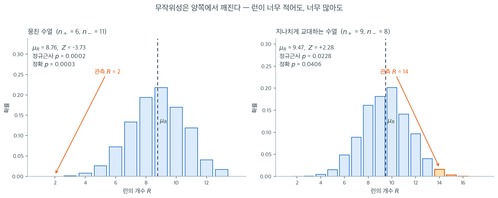

# 런 검정

## 개요

**Wald--Wolfowitz 런 검정**은 이진 관측값의 수열이 무작위로 생성되었는지 판정하는 비모수 절차이다.
*런*(같은 기호가 연달아 이어지는 최대 부분수열)의 개수를 세어, 독립이라는 귀무가설 아래에서
기대되는 분포와 비교한다. 런이 너무 적으면 뭉침을, 너무 많으면 체계적 교대를 시사한다.

## 런 통계량

길이 $N$인 이진 수열에 한 종류의 기호가 $N_+$개, 다른 종류가 $N_- = N - N_+$개 있다고 하자.
**런**은 같은 기호가 연달아 이어지는 최대 덩어리이다.

수열이 독립이고 동일하게 분포한다는 귀무가설 $H_0$ 아래에서 런의 개수 $R$은
다음 평균과 표준편차를 갖는다.

$$
\mu_R = \frac{2\,N_+\,N_-}{N} + 1, \qquad
\sigma_R = \sqrt{\frac{(\mu_R - 1)(\mu_R - 2)}{N - 1}}.
$$

$N$이 중간 이상이면 표준화된 통계량

$$
Z = \frac{R - \mu_R}{\sigma_R}
$$

이 근사적으로 표준정규를 따르므로 양측 $p$값은

$$
p = 2\,\Phi\!\bigl(-|Z|\bigr)
$$

이며 $\Phi$는 표준정규 누적분포함수이다.

## 런을 효율적으로 세기

$\pm 1$로 부호화된 수열 $x_1, x_2, \dots, x_N$에서 곱 $x_i\,x_{i+1}$은 연속된 두 원소가
같으면 $+1$, 다르면 $-1$이다. 부호가 바뀔 때마다 새 런이 시작되므로

$$
R = \frac{N_+ + N_- + 1 - \displaystyle\sum_{i=1}^{N-1} x_i\,x_{i+1}}{2}.
$$



$\mu_R$과 $\sigma_R$ 공식만 보면 무엇을 재는지 감이 잘 오지 않는다. 그럴 때는 귀무분포를 통째로 그려 보는 편이 빠르다. 위 그림의 두 막대그림은 근사가 아니라 **가능한 배열을 전부 열거해서** 얻은 정확분포이다. 왼쪽은 $+$가 $6$개, $-$가 $11$개인 $\binom{17}{6} = 12{,}376$가지 배열, 오른쪽은 $+$가 $9$개, $-$가 $8$개인 $\binom{17}{9} = 24{,}310$가지 배열을 모두 세었다.

왼쪽은 뒤에 나올 뭉친 수열 $111111\,00000000000$이다. 런이 $2$개뿐인데 분포의 중심 $\mu_R = 8.76$에서 한참 왼쪽이라 $Z = -3.73$, 정확 $p = 0.0003$으로 압도적으로 기각된다. 막대그림에서 $R = 2$ 자리의 막대가 눈에 보이지도 않을 만큼 낮다는 것이 그대로 $p$값이다.

오른쪽이 더 배울 점이 많다. 이 수열은 언뜻 잘 섞여 보이지만 런이 $14$개로 $\mu_R = 9.47$보다 **너무 많다.** $Z = +2.28$, 정규근사 $p = 0.0228$이다. 사람이 무작위를 흉내 낼 때 같은 값이 연달아 나오는 것을 피하려다 실제 무작위보다 훨씬 자주 교대하게 되는데, 런 검정은 바로 이 과잉 교대를 잡는다. **무작위성은 양쪽에서 깨질 수 있다**는 것이 두 그림의 공통 교훈이다.

한 가지 더. 오른쪽 패널에서 정확 $p$값은 $0.0406$으로 정규근사의 $0.0228$보다 **거의 두 배**이다. $R$이 정수만 취하는 이산 통계량인데 연속 정규곡선으로 덮었으니 꼬리가 깎인 것이며, 여기서는 $\alpha = 0.05$ 경계 근처라 결론이 갈릴 뻔했다. $n_1$과 $n_2$가 각각 $10$을 넘기 전에는 정규근사를 믿지 말고 정확분포를 쓰라는 권고가 여기서 나온다.

다음 파이썬 함수는 정규근사를 이용한 런 검정을 구현한다.

<div class="exbox" markdown>

**보기 1.** <span class="diff easy" title="쉬움"></span> $\{0,1\}$ 을 그대로 넣으면 런이 반 개가 나온다. 아래 함수는 $R$ 을 이웃한 원소의 곱으로 센다. 그 수법은 자료가 **정확히 $\pm 1$** 일 때만 통한다.

**(1)** $\{0,1\}$ 로 부호화한 자료를 변환 없이 그대로 넣으면 무엇이 어떻게 틀어지는가. 두 수열로 확인하시오.

**(2)** 이 함수는 정규근사만 준다. 위에서 말한 두 수열의 **정확** p-값 $0.0003$ 과 $0.0406$ 을 전수 열거로 확인하고, 그 값이 어느 관례의 p-값인지 밝히시오.

</div>

??? success "풀이"

    **(1) $\mu_R$ 과 $\sigma_R$ 은 멀쩡하고 $R$ 만 틀어진다.** 함수 안에서 $N_+$ 는 `(data == 1).sum()` 으로 세므로 $\{0,1\}$ 부호화에서도 $1$ 의 개수가 제대로 나온다. $N_-$, $\mu_R$, $\sigma_R$ 모두 옳다. 문제는 마지막 줄이다.

    $$
    x_i x_{i+1} =
    \begin{cases}
    +1 & x_i = x_{i+1} \\
    -1 & x_i \ne x_{i+1}
    \end{cases}
    \qquad (x_i \in \{-1, +1\})
    $$

    이 관계가 $R$ 공식의 근거인데, $x_i \in \{0, 1\}$ 이면 곱이

    $$
    x_i x_{i+1} =
    \begin{cases}
    1 & x_i = x_{i+1} = 1 \\
    0 & \text{그 밖}
    \end{cases}
    $$

    이 되어 **"$1$ 이 두 번 이어진 자리의 개수"** 를 셀 뿐이다. 부호가 바뀌는 자리와 아무 관계가 없다.

    교대 수열 $(1,1,0,1,0,1,0,0,1,0,1,0,1,0,1,1,0)$ 에서 $1$ 이 이어지는 자리는 맨 앞 $(1,1)$ 과 끝의 $(1,1)$ 둘뿐이므로 $\sum x_ix_{i+1} = 2$ 이고

    $$
    R_{\text{잘못}} = \frac{17 + 1 - 2}{2} = 8
    \quad (\text{참값은 } 14)
    $$

    이 된다. $Z$ 가 $+2.2775$ 에서 $-0.7395$ 로 바뀌고 p-값은 $0.0228$ 에서 $0.4596$ 으로 뛴다. **기각에서 기각 못 함으로 결론이 뒤집힌다.**

    뭉친 수열 $(1^6 0^{11})$ 은 더 노골적이다. $1$ 이 여섯 개 이어졌으므로 이어진 자리가 다섯이고

    $$
    R_{\text{잘못}} = \frac{17 + 1 - 5}{2} = 6.5
    $$

    **런의 개수가 $6.5$ 개로 나온다.** 런은 정수여야 하므로 이 하나만으로도 부호화가 틀렸다는 것을 알 수 있다. 쓸 때마다 `data * 2 - 1` 을 잊지 말아야 하고, 더 나은 설계는 함수 안에서 입력이 $\pm 1$ 인지 확인하는 것이다.

    **(2) 정확 귀무분포는 열거로 얻는다.** $H_0$ 아래에서 $\binom{N}{N_+}$ 가지 배치가 모두 같은 확률이므로, 그 전부의 $R$ 을 세면 정확분포가 나온다. $N_+ = 6$ 이면 $12376$ 가지, $N_+ = 9$ 이면 $24310$ 가지다. 아래 연습문제 6 의 조합식과 열거가 완전히 일치한다.

    정확 양측 p-값에는 **관례가 둘** 있다.

    - **편차 기준** — $\lvert r - \mu_R \rvert \geq \lvert R_{\text{obs}} - \mu_R \rvert$ 인 모든 $r$ 을 모은다.
    - **작은 꼬리의 두 배** — 한쪽 꼬리 확률을 구해 2를 곱한다.

    $R$ 의 귀무분포는 **대칭이 아니므로** 두 관례가 다른 값을 준다.

    | 수열 | $R$ | $\mu_R$ | 정규근사 | 편차 기준 | 작은 꼬리 $\times 2$ |
    |---|---|---|---|---|---|
    | 뭉침 ($N_+=6$) | 2 | 8.7647 | 0.000189 | $2/12376 = 0.000162$ | 0.000323 |
    | 과잉 교대 ($N_+=9$) | 14 | 9.4706 | 0.022753 | $622/24310 = 0.025586$ | 0.040559 |

    **위에서 말한 $0.0003$ 과 $0.0406$ 은 "작은 꼬리의 두 배" 관례의 값이다.** 그러므로 "정확 $p$ 값이 정규근사의 거의 두 배" 라는 비교는 **관례의 차이와 근사의 오차가 섞인 것**이다. 같은 관례로 견주면 편차 기준 $0.025586$ 대 정규근사 $0.022753$ 으로 12% 차이에 그친다. 두 배로 벌어진 몫의 대부분은 **비대칭 분포에서 작은 꼬리를 두 배 한 데서** 왔다.

    **수치적으로.**

    ```python
    import numpy as np
    import scipy.stats as stats


    def runs_test(data):
        """+1/-1 수열에 대한 Wald-Wolfowitz 런 검정.

        같은 부호가 이어지는 덩어리를 런이라 한다. 런이 너무 적으면 뭉쳐
        있다는 뜻이고 너무 많으면 번갈아 난다는 뜻이며, 둘 다 무작위가 아니다.
        """
        data = np.asarray(data)
        N = data.shape[0]
        N_plus = (data == 1).sum()
        N_minus = N - N_plus

        # 무작위라는 가정 아래에서 런 개수의 평균과 표준편차
        mu = 2 * N_plus * N_minus / N + 1
        sigma = np.sqrt((mu - 1) * (mu - 2) / (N - 1))
        # 이웃한 원소의 곱은 부호가 바뀌는 자리에서만 -1 이다. 그 개수를 세면
        # 런의 경계 수가 나온다.
        R = (N_plus + N_minus + 1 - np.sum(data[1:] * data[:-1])) / 2

        statistic = (R - mu) / sigma
        p_value = 2 * stats.norm.cdf(-abs(statistic))
        return statistic, p_value
    ```

    ```python
    def runs_detail(data):
        """R 과 중간값을 모두 돌려주어 추적할 수 있게 한다."""
        data = np.asarray(data)
        N = data.shape[0]
        N_plus = int((data == 1).sum())
        N_minus = N - N_plus
        mu = 2 * N_plus * N_minus / N + 1
        sigma = np.sqrt((mu - 1) * (mu - 2) / (N - 1))
        prod = int(np.sum(data[1:] * data[:-1]))
        R = (N + 1 - prod) / 2
        z = (R - mu) / sigma
        return N_plus, N_minus, prod, R, mu, sigma, z, 2 * stats.norm.cdf(-abs(z))

    seqs = {
        "뭉침": np.array([1, 1, 1, 1, 1, 1, 0, 0, 0, 0, 0, 0, 0, 0, 0, 0, 0]),
        "과잉 교대": np.array([1, 1, 0, 1, 0, 1, 0, 0, 1, 0, 1, 0, 1, 0, 1, 1, 0]),
    }
    for name, s in seqs.items():
        for tag, x in (("±1 로 변환", s * 2 - 1), ("{0,1} 그대로", s)):
            Np, Nm, prod, R, mu, sigma, z, p = runs_detail(x)
            print(f"{name} / {tag}: N+={Np} N-={Nm} sum(x_i x_(i+1))={prod:>3} "
                  f"R={R:>5} mu={mu:.4f} z={z:>9.4f} p={p:.4f}")
    ```

    출력:

    ```
    뭉침 / ±1 로 변환: N+=6 N-=11 sum(x_i x_(i+1))= 14 R=  2.0 mu=8.7647 z=  -3.7335 p=0.0002
    뭉침 / {0,1} 그대로: N+=6 N-=11 sum(x_i x_(i+1))=  5 R=  6.5 mu=8.7647 z=  -1.2499 p=0.2113
    과잉 교대 / ±1 로 변환: N+=9 N-=8 sum(x_i x_(i+1))=-10 R= 14.0 mu=9.4706 z=   2.2775 p=0.0228
    과잉 교대 / {0,1} 그대로: N+=9 N-=8 sum(x_i x_(i+1))=  2 R=  8.0 mu=9.4706 z=  -0.7395 p=0.4596
    ```

    ```python
    import itertools
    from collections import Counter
    from math import comb

    def exact_runs_pmf(N_plus, N_minus):
        """가능한 모든 배치를 열거해 R 의 정확 귀무분포를 얻는다."""
        N = N_plus + N_minus
        tally = Counter()
        for cb in itertools.combinations(range(N), N_plus):
            x = -np.ones(N, int)
            x[list(cb)] = 1
            tally[int((N + 1 - np.sum(x[1:] * x[:-1])) // 2)] += 1
        return tally, comb(N, N_plus)

    for name, N_plus, N_minus, R_obs in (("뭉침", 6, 11, 2), ("과잉 교대", 9, 8, 14)):
        N = N_plus + N_minus
        mu = 2 * N_plus * N_minus / N + 1
        sigma = np.sqrt((mu - 1) * (mu - 2) / (N - 1))
        tally, total = exact_runs_pmf(N_plus, N_minus)
        dev = abs(R_obs - mu)
        hit = sum(c for r, c in tally.items() if abs(r - mu) >= dev - 1e-12)
        lower = sum(c for r, c in tally.items() if r <= R_obs)
        upper = sum(c for r, c in tally.items() if r >= R_obs)
        p_two = min(1.0, 2 * min(lower, upper) / total)
        print(f"{name}: N+={N_plus} N-={N_minus}  배치 {total} 가지,  "
              f"R 의 범위 {min(tally)} ~ {max(tally)}")
        print(f"   정규근사      p = {2 * stats.norm.cdf(-abs((R_obs - mu) / sigma)):.6f}")
        print(f"   편차 기준     p = {hit}/{total} = {hit / total:.6f}")
        print(f"   작은 꼬리 x2  p = {p_two:.6f}")
    ```

    출력:

    ```
    뭉침: N+=6 N-=11  배치 12376 가지,  R 의 범위 2 ~ 13
       정규근사      p = 0.000189
       편차 기준     p = 2/12376 = 0.000162
       작은 꼬리 x2  p = 0.000323
    과잉 교대: N+=9 N-=8  배치 24310 가지,  R 의 범위 2 ~ 17
       정규근사      p = 0.022753
       편차 기준     p = 622/24310 = 0.025586
       작은 꼬리 x2  p = 0.040559
    ```

    **$\{0,1\}$ 을 그대로 넣으면 뭉친 수열에서 $R = 6.5$ 가 나온다** — 손으로 따진 그대로다. 두 수열 모두 결론이 뒤집히고, 교대 수열에서는 $Z$ 의 **부호까지** 바뀐다.

    정확 p-값도 손으로 세운 표와 맞는다. 특히 뭉친 수열의 편차 기준 p-값이 $2/12376$ 이라는 것은 뜻이 분명하다 — 12376 가지 배치 가운데 $R = 2$ 를 주는 것이 **단 두 가지**뿐이고 그보다 치우친 배치는 아예 없다는 것이다. 아래 보기 2 가 그 두 가지가 무엇인지 따진다.

<div class="exbox" markdown>

**보기 2.** <span class="diff easy" title="쉬움"></span> 가장 뭉친 수열은 12376 가지 가운데 둘뿐이다. 뭉친 수열 $(1,1,1,1,1,1,0,0,\dots,0)$ 은 $N_+ = 6$, $N_- = 11$ 이고 런이 두 개다.

**(1)** $R$, $\mu_R$, $\sigma_R$, $Z$ 를 손으로 구해 $p = 0.0002$ 를 확인하시오.

**(2)** $N_+ = 6$, $N_- = 11$ 에서 $R$ 이 가질 수 있는 **최솟값과 최댓값**은 무엇인가. $R = 2$ 를 주는 배치가 몇 개인지 세시오.

</div>

??? success "풀이"

    **(1) 손계산.** $N = 17$ 이고 수열은 $1$ 의 덩어리 하나와 $0$ 의 덩어리 하나로 **런이 둘**이다.

    $$
    \mu_R = \frac{2 \times 6 \times 11}{17} + 1 = \frac{132}{17} + 1 = 8.764706
    $$

    $$
    \sigma_R = \sqrt{\frac{(8.764706 - 1)(8.764706 - 2)}{16}}
             = \sqrt{\frac{7.764706 \times 6.764706}{16}}
             = \sqrt{3.282872} = 1.811870
    $$

    $$
    Z = \frac{2 - 8.764706}{1.811870} = -3.733550
    \implies p = 2\Phi(-3.733550) = 0.000189
    $$

    로 코드의 $0.0002$ 와 맞는다. $\pm 1$ 로 바꾼 수열에서 열여섯 개의 이웃 쌍 가운데 열다섯이 같은 값이고 하나만 바뀌므로 $\sum x_ix_{i+1} = 15 - 1 = 14$ 이고 $R = (17+1-14)/2 = 2$ 인 것도 확인된다.

    **(2) 범위는 2 부터 13 까지다.**

    **최솟값.** 런이 하나뿐일 수는 없다 — 두 기호가 모두 있으니 적어도 한 번은 바뀐다. 런이 둘이면 각 기호가 **통째로 한 덩어리**여야 하므로 $(+^6 -^{11})$ 과 $(-^{11} +^6)$ **두 가지**뿐이다. 열거한 결과의 $R = 2$ 칸이 정확히 2 인 것이 이것이다.

    **최댓값.** 런은 $+$ 덩어리와 $-$ 덩어리가 번갈아 놓인 것이므로, $+$ 덩어리가 $a$ 개, $-$ 덩어리가 $b$ 개면 $\lvert a - b \rvert \leq 1$ 이어야 한다. $a \leq N_+ = 6$, $b \leq N_- = 11$ 이므로 $a$ 는 6 을 넘을 수 없고, 그때 $b$ 는 최대 $a + 1 = 7$ 이다. 따라서

    $$
    R_{\max} = 2\min(N_+, N_-) + 1 = 2 \times 6 + 1 = 13
    $$

    이고, 그 배치는 $+$ 를 여섯 덩어리로(곧 하나씩) 떼어 놓고 그 사이사이에 $-$ 를 끼운 모양이다. 열거해 보면 $R = 13$ 인 배치가 210 가지다.

    $$
    \binom{N_- - 1}{\,6 - 1\,} = \binom{10}{5} = 252 ?
    $$

    가 아니라 $210$ 인 까닭은 $-$ 열한 개를 **일곱 덩어리**로 나누어야 하기 때문이다. $\binom{10}{6} = 210$ 이 그 수다(열한 개 사이의 열 군데 틈 가운데 여섯 곳을 골라 자른다).

    **$R = 2$ 가 두 가지뿐이라는 사실이 이 수열의 p-값을 그대로 정한다.** 12376 가지 배치 가운데 "이만큼 또는 더 뭉친" 것이 둘이므로 편차 기준 정확 양측 p-값이 $2/12376 = 0.000162$ 다. 정규근사의 $0.000189$ 는 이보다 17% 크다 — **이 꼬리에서는 근사가 보수적인 쪽으로 조금 빗나간다.**

    **수치적으로.**

    ```python
    data = np.array([1, 1, 1, 1, 1, 1, 0, 0, 0, 0, 0, 0, 0, 0, 0, 0, 0])
    z, p = runs_test(data * 2 - 1)
    print(f"z = {z:.4f}, p = {p:.4f}")
    # R = 2, mu = 8.76, sigma = 1.81
    # z = -3.7335, p = 0.0002 → 무작위성 기각
    ```

    출력:

    ```
    z = -3.7335, p = 0.0002
    ```

    ```python
    tally, total = exact_runs_pmf(6, 11)
    print(f"배치 {total} 가지,  R 의 범위 {min(tally)} ~ {max(tally)}"
          f"  (2*min(N+,N-)+1 = {2 * min(6, 11) + 1})")
    print("R :", [r for r in sorted(tally)])
    print("개수:", [tally[r] for r in sorted(tally)])
    print(f"R = 2 인 배치 {tally[2]} 가지  ->  (+^6 -^11) 과 (-^11 +^6)")
    print(f"R = 13 인 배치 {tally[13]} 가지  (C(10, 6) = {comb(10, 6)})")
    print(f"합계 {sum(tally.values())} = {total}")
    print(f"\n편차 기준 정확 p = {tally[2]}/{total} = {tally[2] / total:.6f}")
    print(f"정규근사       p = 0.000189,  비 = {0.000189 / (tally[2] / total):.2f} 배")
    ```

    출력:

    ```
    배치 12376 가지,  R 의 범위 2 ~ 13  (2*min(N+,N-)+1 = 13)
    R : [2, 3, 4, 5, 6, 7, 8, 9, 10, 11, 12, 13]
    개수: [2, 15, 100, 325, 900, 1650, 2400, 2700, 2100, 1470, 504, 210]
    R = 2 인 배치 2 가지  ->  (+^6 -^11) 과 (-^11 +^6)
    R = 13 인 배치 210 가지  (C(10, 6) = 210)
    합계 12376 = 12376
    
    편차 기준 정확 p = 2/12376 = 0.000162
    정규근사       p = 0.000189,  비 = 1.17 배
    ```

    **$R$ 의 범위가 $2 \sim 13$ 이고 양 끝의 배치 수가 각각 2 와 210 으로 손계산과 맞는다.** 개수의 합이 $12376$ 으로 떨어지는 것이 열거가 빠짐없다는 검산이다. 분포의 봉우리는 $R = 9$ 에 있고($2700$ 가지) $\mu_R = 8.76$ 과 가깝다.

    눈여겨볼 것은 **분포가 대칭이 아니라는 점**이다. 왼쪽 꼬리는 $R = 2$ 까지 $6.76$ 칸 뻗지만 오른쪽은 $R = 13$ 까지 $4.24$ 칸밖에 못 간다. $N_+ \ne N_-$ 이기 때문이다. 정규근사는 이 비대칭을 전혀 모른다 — 양쪽 꼬리를 같은 모양으로 재는 것이 근사의 가장 큰 한계다.

<div class="exbox" markdown>

**보기 3.** <span class="diff easy" title="쉬움"></span> 지나치게 교대하는 수열. 빈번한 교대 역시 무작위성으로부터의 이탈이다.

</div>

??? success "풀이"
    ```python
    data = np.array([1, 1, 0, 1, 0, 1, 0, 0, 1, 0, 1, 0, 1, 0, 1, 1, 0])
    z, p = runs_test(data * 2 - 1)
    # R = 14, mu = 9.47, sigma = 1.99
    # z = +2.2775, p = 0.0228 → 무작위성 기각
    ```

!!! warning "'잘 섞여 보임'은 무작위성의 증거가 아니다"
    두 번째 수열은 언뜻 잘 섞인 듯 보이지만 $17$개 원소에서 런이 $14$개로, 기댓값 $9.47$을
    크게 넘는다. 최장 런의 길이가 $2$에 불과한데, 무작위 수열이라면 길이 $17$에서 평균
    $4.4$ 정도의 런이 나타나야 한다.

    사람이 무작위를 흉내 낼 때 같은 값이 이어지는 것을 피하려다 정확히 이런 패턴을 만든다.
    런 검정은 뭉침과 과잉 교대를 **양쪽 모두** 잡아낸다.

## 해석

| 결과 | 의미 |
|---|---|
| $Z \ll 0$ (런이 적음) | 관측값이 **뭉쳐** 있다 --- 연속된 값이 같은 경향이 있다. |
| $Z \gg 0$ (런이 많음) | 관측값이 우연보다 자주 **교대**한다. |
| $\lvert Z \rvert$가 작음 | 선택한 유의수준에서 무작위성에 반하는 증거가 없다. |

이 검정은 기본적으로 양측이다. 런이 비정상적으로 적은 경우와 많은 경우 모두 독립성에
반하는 증거이다.

## 연습문제

<div class="drillbox" markdown>

**연습문제 1.** <span class="diff easy" title="쉬움"></span> 동전을 20번 던져 수열
HHHHTTTTHHHHTTTTTTHH를 얻었다. 각 H를 $+1$, 각 T를 $-1$로 부호화하고 런의 개수
$R$을 센 뒤 $\mu_R$과 $\sigma_R$을 손으로 계산하라.

</div>

??? success "풀이"

    수열은 HHHH TTTT HHHH TTTTTT HH이므로 $R = 5$개의 런이 있다.
    $N = 20$, $N_+ = 10$, $N_- = 10$이다.

    $$
    \mu_R = \frac{2 \cdot 10 \cdot 10}{20} + 1 = 11.
    $$

    $$
    \sigma_R = \sqrt{\frac{(11 - 1)(11 - 2)}{20 - 1}}
             = \sqrt{\frac{90}{19}}
             \approx 2.176.
    $$

    따라서 $Z = (5 - 11)/2.176 \approx -2.757$이고 $p = 0.0058$로 뭉침의 강한 증거가 된다.
    $\square$

<div class="drillbox" markdown>

**연습문제 2.** <span class="diff hard" title="어려움"></span> 각 $x_i \in \{-1, +1\}$일 때
$R = \dfrac{N_+ + N_- + 1 - \sum_{i=1}^{N-1} x_i\,x_{i+1}}{2}$임을 증명하라.

</div>

??? success "풀이"

    $i = 1,\dots,N-1$에 대해 지시함수 $d_i = \mathbf{1}[x_i \neq x_{i+1}]$을 정의한다.
    부호가 바뀔 때마다 새 런이 시작되므로 $R = 1 + \sum_{i=1}^{N-1} d_i$이다.

    $x_i \in \{-1,+1\}$이므로 $x_i\,x_{i+1} = 1 - 2\,d_i$이고 따라서
    $d_i = (1 - x_i\,x_{i+1})/2$이다. 합하면

    $$
    R = 1 + \sum_{i=1}^{N-1} \frac{1 - x_i\,x_{i+1}}{2}
      = 1 + \frac{(N-1) - \sum_{i=1}^{N-1} x_i\,x_{i+1}}{2}
      = \frac{N + 1 - \sum_{i=1}^{N-1} x_i\,x_{i+1}}{2}.
    $$

    $N = N_+ + N_-$이므로 결과가 따라 나온다. $\square$

<div class="drillbox" markdown>

**연습문제 3.** <span class="diff easy" title="쉬움"></span> 위 "지나치게 교대하는 수열" 보기의 자료로 런 검정 통계량과 $p$값을
파이썬에서 계산하라. $\alpha = 0.05$에서 귀무가설이 기각되는지 확인하라.

</div>

??? success "풀이"

    ```python
    import numpy as np
    import scipy.stats as stats

    data = np.array([1, 1, 0, 1, 0, 1, 0, 0, 1, 0, 1, 0, 1, 0, 1, 1, 0])
    seq = data * 2 - 1  # convert to +1/-1

    N = len(seq)
    N_plus = (seq == 1).sum()   # 9
    N_minus = N - N_plus        # 8

    mu = 2 * N_plus * N_minus / N + 1               # 9.4706
    sigma = np.sqrt((mu - 1) * (mu - 2) / (N - 1))  # 1.9887
    R = (N - np.sum(seq[1:] * seq[:-1]) + 1) / 2    # 14

    z = (R - mu) / sigma
    p = 2 * stats.norm.cdf(-abs(z))
    print(f"R = {R}, Z = {z:.4f}, p = {p:.4f}")
    # R = 14.0, Z = 2.2775, p = 0.0228  →  H0 기각
    ```

    출력:

    ```
    R = 14.0, Z = 2.2775, p = 0.0228
    ```

    $p = 0.0228 < 0.05$이므로 $\alpha = 0.05$에서 **귀무가설을 기각한다**. 런이 $14$개로
    기댓값 $9.47$보다 유의하게 많아 과잉 교대의 증거가 된다. $\square$

<div class="drillbox" markdown>

**연습문제 4.** <span class="diff med" title="중간"></span> 수열이 이진이 아니면 왜 런 검정이 부적절한지 설명하라. 연속 수열을
검정에 적합한 이진 수열로 바꾸는 흔한 방법 하나를 기술하라.

</div>

??? success "풀이"

    $\mu_R$과 $\sigma_R$의 유도는 기호가 정확히 두 종류이고 개수가 $N_+$, $N_-$로
    고정되어 있다고 가정한다. 범주가 셋 이상이면 조합론이 달라지고 정규근사가
    더 이상 성립하지 않는다.

    표준적인 해법은 연속 수열을 표본**중앙값을 기준으로 이분**하는 것이다. 중앙값보다
    큰 값을 $+1$, 작은 값을 $-1$로 부호화한다(중앙값과 같은 값은 관례에 따라 버리거나
    한쪽에 배정한다). 이렇게 얻은 이진 수열에 Wald--Wolfowitz 절차를 적용한다.
    $\square$

<div class="drillbox" markdown>

**연습문제 5.** <span class="diff hard" title="어려움"></span> 수열의 모든 순열에 걸친 세기 논증으로
$\operatorname{E}[R] = \mu_R = \dfrac{2\,N_+\,N_-}{N} + 1$임을 보여라.

</div>

??? success "풀이"

    $H_0$ 아래에서 수열의 $\binom{N}{N_+}$가지 배열이 모두 동등하게 가능하다.
    $d_i = \mathbf{1}[x_i \neq x_{i+1}]$일 때 $R = 1 + \sum_{i=1}^{N-1} d_i$이므로
    기댓값의 선형성에 의해

    $$
    \operatorname{E}[R] = 1 + \sum_{i=1}^{N-1} P(x_i \neq x_{i+1}).
    $$

    인접한 한 쌍의 위치 $(i, i+1)$에 대해, 균등 무작위 배열에서 그 두 자리에 놓이는
    기호의 조합은 $N$개 중 순서 있게 2개를 뽑는 $N(N-1)$가지가 모두 동등하게 가능하다.
    이 중 앞이 $+$이고 뒤가 $-$인 경우가 $N_+ N_-$가지, 그 반대가 $N_+ N_-$가지이므로

    $$
    P(x_i \neq x_{i+1}) = \frac{2\,N_+\,N_-}{N(N-1)}.
    $$

    이 확률은 $i$에 의존하지 않는다. 인접 쌍이 $N-1$개이므로

    $$
    \operatorname{E}[R] = 1 + (N-1) \cdot \frac{2\,N_+\,N_-}{N(N-1)}
                        = 1 + \frac{2\,N_+\,N_-}{N}
                        = \mu_R.
    $$

    $\square$

    !!! note "분산은 왜 이 방법으로 안 되는가"
        기댓값은 $d_i$들이 서로 종속이어도 선형성 덕에 쉽게 나온다. 그러나 분산은
        $\text{Cov}(d_i, d_{i+1}) \ne 0$을 다루어야 한다. 인접한 두 지시함수가
        관측값 $x_{i+1}$을 공유하기 때문이다. 이 공분산을 모두 더하면 본문의
        $\sigma_R^2 = (\mu_R-1)(\mu_R-2)/(N-1)$이 나온다.

<div class="drillbox" markdown>

**연습문제 6.** <span class="diff med" title="중간"></span> 런 검정의 실제 제1종 오류율을 확인하라. $N$이 작을 때 정규근사가
얼마나 정확한가?

</div>

??? success "풀이"

    $R$의 정확 귀무분포는 조합식으로 바로 쓸 수 있다. $N_+$개의 $+$가 $k$개의 런으로,
    $N_-$개의 $-$가 $k$개의 런으로 나뉘는 경우를 세면

    $$
    P(R = 2k) = \frac{2\binom{N_+-1}{k-1}\binom{N_--1}{k-1}}{\binom{N}{N_+}}, \qquad
    P(R = 2k+1) = \frac{\binom{N_+-1}{k-1}\binom{N_--1}{k} + \binom{N_+-1}{k}\binom{N_--1}{k-1}}{\binom{N}{N_+}}
    $$

    이다. 이 분포로 $|Z| > 1.96$이라는 기각역의 실제 확률을 계산한다.

    ```python
    import numpy as np
    from math import comb
    import scipy.stats as stats

    def runs_pmf(N_plus, N_minus):
        N = N_plus + N_minus
        tot = comb(N, N_plus)
        pmf = {}
        for k in range(1, min(N_plus, N_minus) + 1):
            pmf[2 * k] = 2 * comb(N_plus - 1, k - 1) * comb(N_minus - 1, k - 1) / tot
            pmf[2 * k + 1] = (comb(N_plus - 1, k - 1) * comb(N_minus - 1, k)
                              + comb(N_plus - 1, k) * comb(N_minus - 1, k - 1)) / tot
        return pmf

    crit = stats.norm.isf(0.025)
    for n in (5, 10, 15, 20, 50):
        N = 2 * n
        mu = 2 * n * n / N + 1
        sd = np.sqrt((mu - 1) * (mu - 2) / (N - 1))
        pmf = runs_pmf(n, n)
        size = sum(p for R, p in pmf.items() if abs((R - mu) / sd) > crit)
        print(N, round(size, 4))
    ```

    출력:

    ```
    10 0.0794
    20 0.037
    30 0.0398
    40 0.0363
    100 0.0555
    ```

    | $N$ ($N_+ = N_- = N/2$) | 실제 크기 |
    |---:|---:|
    | 10 | **0.0794** |
    | 20 | 0.0370 |
    | 30 | 0.0398 |
    | 40 | 0.0363 |
    | 100 | 0.0555 |

    $N = 10$에서 실제 크기가 $0.079$로 명목값의 **1.6배**이다. 근사가 비보수적이다.
    $R$이 가질 수 있는 값이 $2$부터 $10$까지 9가지뿐이라 이산성이 극심하기 때문이다.

    더 흥미로운 것은 크기가 $N$에 따라 단조 수렴하지 않고 $0.036$과 $0.079$ 사이를
    **요동한다**는 점이다. $N = 100$에서도 $0.0555$로 명목값을 넘는다. 계단함수의
    계단 위치가 임계값 $\pm 1.96\sigma_R$과 어떻게 맞물리느냐에 따라 기각역이
    한 계단 더 포함되거나 덜 포함되기 때문이다.

    **권고:** 각 기호가 최소 10개씩 있어도 근사 오차가 $\pm 0.01$ 수준으로 남는다.
    정확한 판정이 필요하면 위 `runs_pmf`로 정확 $p$값을 직접 계산한다. 관측된 $R$에
    대해 $p = \sum_{r : |r - \mu_R| \ge |R - \mu_R|} P(R = r)$을 쓰면 된다.

---

## 정리하며

런 검정은 **독립성을 직접 검정**한다.

- **런의 개수가 통계량이다.** 귀무가설(무작위) 아래에서 런 수의 평균과 분산이 닫힌 형태로 주어지며, 표준화해 $Z$ 로 판정한다.
- **양쪽 꼬리가 모두 의미를 갖는다.** 런이 적으면 **뭉침**(양의 자기상관), 많으면 **지나친 교대**(음의 자기상관)다.
- **사람이 만든 "무작위" 수열이 잘 걸린다.** 사람은 같은 값이 연달아 나오는 것을 피하려 해서 런이 지나치게 많아진다.
- **이진 자료로 바꾸어 쓴다.** 연속 자료라면 중앙값 기준으로 위아래를 나눈다.
- **이 책에서 드문 종류의 검정이다.** 대부분의 검정이 독립성을 **가정**하는 반면 이 검정은 그것을 **확인**한다.

다음 절 **부호검정 (코드)** 로 넘어간다.
