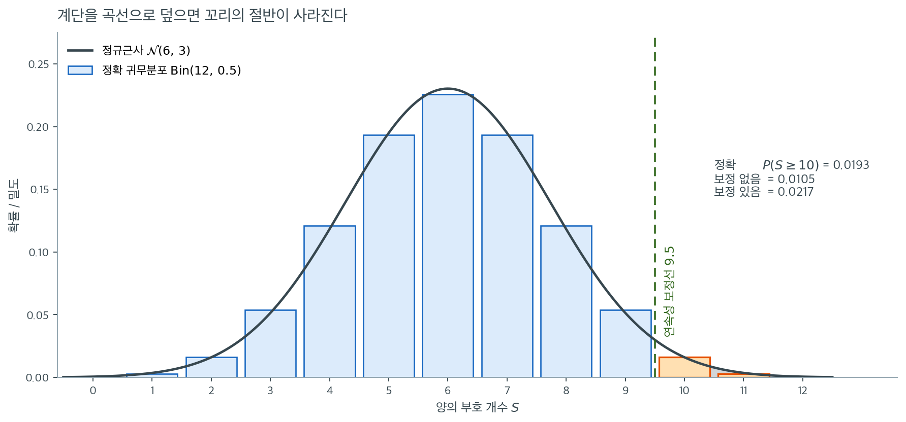

# 부호검정

## 개요

**부호검정**은 대응자료에 대한 가장 단순한 비모수 검정 중 하나이다. 쌍별 차이의
*부호*만 살펴서 두 관련 측정값의 중앙값 차이가 0인지 판정한다. 크기 정보를 완전히
버리므로 가정이 매우 적다 --- 차이들이 독립이고 연속분포에서 나왔다는 것뿐이다.
그 덕에 매우 로버스트하지만 Wilcoxon 부호순위검정 같은 대안보다 검정력이 낮다.

## 가설과 검정통계량

$n$개의 대응 관측값 $(X_i, Y_i)$에서 차이 $D_i = X_i - Y_i$를 정의한다.
양의 차이 개수를 $n_+$, 음의 차이 개수를 $n_-$라 하자. 동점($D_i = 0$)은 제외하며
유효 표본크기는 $n = n_+ + n_-$이다.

$H_0{:}\; \text{median}(D) = 0$ 아래에서 0이 아닌 각 차이는 양수일 확률과 음수일 확률이
같으므로 $n_+$는 $\text{Binomial}(n, 1/2)$를 따른다. 양의 부호의 표본비율은

$$
\hat{p} = \frac{n_+}{n}
$$

이다. 정규근사의 표준화 통계량은

$$
Z = \frac{\hat{p} - 0.5}{\sqrt{0.5 \cdot 0.5 \,/\, n}}
  = \frac{\hat{p} - 0.5}{\,1 / (2\sqrt{n}\,)}
$$

이다. $p$값은 대립가설에 따라 달라진다.

| 대립가설 | $p$값 |
|---|---|
| $H_1{:}\; \text{median}(D) \neq 0$ | $2\,\Phi(-\lvert Z \rvert)$ |
| $H_1{:}\; \text{median}(D) > 0$ | $1 - \Phi(Z)$ |
| $H_1{:}\; \text{median}(D) < 0$ | $\Phi(Z)$ |

<div class="exbox" markdown>

**보기 1.** <span class="diff easy" title="쉬움"></span> 명목 5%, 실제로는 7.8% 까지. 아래 함수는 연속성 보정 없는 정규근사를 쓴다. 양측 $\alpha = 0.05$ 로 쓰면 기각규칙이 사실

$$
\lvert Z \rvert = \frac{\lvert 2n_+ - n \rvert}{\sqrt{n}} > 1.959964
$$

가 된다.

**(1)** 이 규칙의 **실제 제1종 오류율**을 $n = 5$ 부터 $40$ 까지 정확 이항분포로 계산하시오. 모의실험이 아니라 합으로 구할 수 있다.

**(2)** 연속성 보정을 넣은 규칙과 `binomtest` 의 정확 규칙은 어떤가. 세 규칙 가운데 명목수준을 넘는 것은 무엇이며, $n$ 을 키우면 그 문제가 사라지는가.

</div>

??? success "풀이"

    **(1) 실제 수준은 유한 합으로 정확히 구해진다.** $H_0$ 아래에서 $n_+ \sim \text{Bin}(n, 1/2)$ 는 **정확한** 사실이고, 기각역은 정수 $k$ 의 유한집합이다. 그러므로

    $$
    \text{실제 수준} = \sum_{k \,:\, \lvert 2k - n \rvert > 1.959964\sqrt{n}} \binom{n}{k} \frac{1}{2^n}
    $$

    을 그대로 더하면 된다. 모의실험이 필요 없다.

    $n = 21$ 을 손으로 해 보자. $\sqrt{21} = 4.582576$ 이므로 문턱은 $1.959964 \times 4.582576 = 8.982$ 이다. $n$ 이 홀수이면 $2k - n$ 도 홀수이므로 $\lvert 2k-21 \rvert \in \{1, 3, 5, \dots, 21\}$ 이고, $8.982$ 를 넘는 가장 작은 값은 $9$ 다. $\lvert 2k-21 \rvert \geq 9$ 는 $k \leq 6$ 또는 $k \geq 15$ 를 뜻하므로

    $$
    \text{실제 수준}
    = 2 \sum_{k=0}^{6} \binom{21}{k} \frac{1}{2^{21}}
    = \frac{2(1 + 21 + 210 + 1330 + 5985 + 20349 + 54264)}{2097152}
    = \frac{164320}{2097152}
    = 0.078354
    $$

    **명목 $0.05$ 의 1.57배다.** 이 규칙은 $H_0$ 이 참일 때 스무 번에 한 번이 아니라 **열세 번에 한 번** 기각한다.

    **(2) 보정하면 넘지 않는다.** $n = 5$ 부터 $40$ 까지 세 규칙을 모두 재면

    | 규칙 | 명목수준을 넘는 $n$ 의 개수 | 최대 실제 수준 |
    |---|---|---|
    | 정규근사, 보정 없음 (이 함수) | 36 개 가운데 **17 개** | $0.078354$ ($n = 21$) |
    | 정규근사, 연속성 보정 | 0 개 | $0.047031$ ($n = 37$) |
    | 정확 이항 (`binomtest`) | 0 개 | $0.049042$ ($n = 17$) |

    **보정 없는 쪽만 명목수준을 넘고, 그것도 절반 가까운 $n$ 에서 넘는다.**

    그리고 **$n$ 을 키워도 문제가 사라지지 않는다.** $n = 39$ 에서도 $0.0533$ 이다. 까닭은 이산성이다. 문턱 $1.959964\sqrt{n}$ 이 $\lvert 2k-n \rvert$ 이 실제로 가질 수 있는 값들(짝수 $n$ 이면 짝수, 홀수 $n$ 이면 홀수) 사이 어디에 떨어지는지가 $n$ 마다 다르다. 문턱이 어떤 달성 가능한 값 **바로 아래**에 떨어지면 그 쌍이 기각역에 들어와 실제 수준이 튀어 오른다. $\sqrt{n}$ 은 매끄럽게 커지지만 격자는 $2$ 씩 뛰므로 이 어긋남이 **주기적으로 되풀이된다.**

    연속성 보정이 하는 일이 바로 그 어긋남을 메우는 것이다. 문턱을 반 칸 밖으로 밀어 두므로 격자점이 경계에 걸리는 일이 줄고, 그 결과 실제 수준이 명목값 **아래**로 내려간다. 다만 지나치게 내려가기도 한다 — $n = 17$ 에서 정확검정은 $0.0490$ 인데 보정 규칙은 $0.0127$ 이다. **검정력을 그만큼 버린 셈이다.**

    따라서 권고는 분명하다. **이 함수의 $p$ 값을 $0.05$ 와 견주어 판정하지 말고 `binomtest` 를 쓰라.** 정확검정은 설계상 명목수준을 넘지 않으며, 보정 규칙처럼 지나치게 보수적이지도 않다. $n$ 이 수천 이하이면 계산은 순식간이다.

    **수치적으로.**

    ```python
    import numpy as np
    import scipy.stats as stats


    def sign_test(paired_data, test_type="two-sided"):
        """대응표본에 대한 부호검정.

        차이의 크기는 버리고 부호만 센다. 그래서 자료가 순서척도이기만 하면
        쓸 수 있고 이상치에도 끄떡없다. 대신 크기 정보를 버린 만큼 검정력이
        낮다 — 그 중간이 부호순위검정이다.

        매개변수
        --------
        paired_data : 모양 (n, 2) 인 배열. 0열이 처리 후, 1열이 처리 전이다.
        test_type : "less", "two-sided", "greater" 중 하나

        돌려주는 값
        ----------
        z : Z 통계량
        p_value : p-값
        """
        p_0, q_0 = 0.5, 0.5

        n_plus = np.sum(paired_data[:, 0] > paired_data[:, 1])
        n_minus = np.sum(paired_data[:, 0] < paired_data[:, 1])
        n = n_plus + n_minus  # 동점은 세지 않는다
        p_hat = n_plus / n

        z = (p_hat - p_0) / np.sqrt(p_0 * q_0 / n)

        if test_type == "less":
            p_value = stats.norm.cdf(z)
        elif test_type == "two-sided":
            p_value = 2 * stats.norm.cdf(-abs(z))
        elif test_type == "greater":
            p_value = stats.norm.sf(z)

        return z, p_value
    ```

    ```python
    from math import comb, sqrt

    crit = stats.norm.isf(0.025)
    print(f"임계값 z_0.025 = {crit:.6f}")

    # n = 21 을 손으로 따라가 본다.
    n = 21
    print(f"\nn = {n}: 문턱 = {crit:.6f} * sqrt({n}) = {crit * sqrt(n):.3f}")
    ks = [k for k in range(n + 1) if abs(2 * k - n) > crit * sqrt(n)]
    print(f"  기각역 k in {ks}")
    terms = [comb(n, k) for k in range(7)]
    print(f"  2*({' + '.join(map(str, terms))})/{2 ** n} = {2 * sum(terms)}/{2 ** n}"
          f" = {2 * sum(terms) / 2 ** n:.6f}")

    print("\n  n   보정없음    보정    정확")
    worst = {"plain": (0, 0), "corr": (0, 0), "exact": (0, 0)}
    over = []
    for n in range(5, 41):
        pmf = np.array([comb(n, k) for k in range(n + 1)]) / 2 ** n
        k = np.arange(n + 1)
        rej_plain = np.abs(2 * k - n) / np.sqrt(n) > crit
        rej_corr = (np.abs(k - n / 2) - 0.5) / np.sqrt(n / 4) > crit
        rej_exact = np.array([stats.binomtest(j, n).pvalue < 0.05 for j in k])
        s = (pmf[rej_plain].sum(), pmf[rej_corr].sum(), pmf[rej_exact].sum())
        for key, val in zip(("plain", "corr", "exact"), s):
            if val > worst[key][0]:
                worst[key] = (val, n)
        if s[0] > 0.05:
            over.append(n)
        if n in (5, 12, 17, 21, 25, 30, 39, 40):
            print(f"{n:>3} {s[0]:>10.4f} {s[1]:>8.4f} {s[2]:>8.4f}")

    print(f"\n보정 없음: 명목 0.05 를 넘는 n {len(over)} 개 / 36 개  -> {over}")
    print(f"  최대 실제 수준 {worst['plain'][0]:.6f} (n = {worst['plain'][1]})")
    print(f"연속성 보정: 최대 {worst['corr'][0]:.6f} (n = {worst['corr'][1]})")
    print(f"정확 이항  : 최대 {worst['exact'][0]:.6f} (n = {worst['exact'][1]})")
    ```

    출력:

    ```
    임계값 z_0.025 = 1.959964

    n = 21: 문턱 = 1.959964 * sqrt(21) = 8.982
      기각역 k in [0, 1, 2, 3, 4, 5, 6, 15, 16, 17, 18, 19, 20, 21]
      2*(1 + 21 + 210 + 1330 + 5985 + 20349 + 54264)/2097152 = 164320/2097152 = 0.078354

      n   보정없음    보정    정확
      5     0.0625   0.0000   0.0000
     12     0.0386   0.0386   0.0386
     17     0.0490   0.0127   0.0490
     21     0.0784   0.0266   0.0266
     25     0.0433   0.0433   0.0433
     30     0.0428   0.0428   0.0428
     39     0.0533   0.0237   0.0237
     40     0.0385   0.0385   0.0385

    보정 없음: 명목 0.05 를 넘는 n 17 개 / 36 개  -> [5, 8, 11, 14, 16, 19, 21, 22, 24, 26, 27, 29, 31, 32, 34, 36, 39]
      최대 실제 수준 0.078354 (n = 21)
    연속성 보정: 최대 0.047031 (n = 37)
    정확 이항  : 최대 0.049042 (n = 17)
    ```

    **손으로 더한 $164320/2097152 = 0.078354$ 가 코드와 같다.** 보정 없는 규칙이 36 개 $n$ 가운데 17 개에서 명목수준을 넘고, $n = 39$ 까지도 $0.0533$ 으로 넘는다는 것이 확인된다. 보정 규칙과 정확 규칙은 한 번도 넘지 않는다.

    표에서 $n = 12, 25, 30, 40$ 처럼 **세 값이 완전히 같아지는** $n$ 들이 눈에 띈다. 그 $n$ 에서는 문턱이 세 규칙 모두 같은 격자점 사이에 떨어져 **기각역이 글자 하나까지 같아지기** 때문이다. 어느 규칙을 쓰느냐가 중요한 것은 문턱이 격자점 바로 옆에 떨어지는 $n$ 에서다. 그리고 **어느 $n$ 이 그런지는 미리 알 수 없다** — 그러므로 늘 정확검정을 쓰는 편이 안전하다.

<div class="exbox" markdown>

**보기 2.** <span class="diff easy" title="쉬움"></span> 학생의 처치 전후 점수. 학생 15명을 처치 프로그램 전후에 측정했다.

</div>

??? success "풀이"
    ```python
    paired_data = np.array([
        [93, 76], [70, 72], [81, 75], [65, 68], [79, 65],
        [54, 54], [94, 88], [91, 81], [77, 65], [65, 57],
        [95, 86], [89, 87], [78, 78], [80, 77], [76, 76]
    ])

    diffs = paired_data[:, 0] - paired_data[:, 1]
    print(diffs)
    # [17 -2  6 -3 14  0  6 10 12  8  9  2  0  3  0]

    z, p_value = sign_test(paired_data, test_type="two-sided")
    print(f"Z = {z:.4f}, p = {p_value:.4f}")
    # Z = 2.3094, p = 0.0209
    ```

    출력:

    ```
    [17 -2  6 -3 14  0  6 10 12  8  9  2  0  3  0]
    Z = 2.3094, p = 0.0209
    ```

15쌍 중 **세 쌍**이 동점($D_i = 0$)이라 제외되어 $n = 12$가 남는다. 그중
$n_+ = 10$, $n_- = 2$이므로 $\hat{p} = 10/12 \approx 0.833$이고
$Z \approx 2.309$, 양측 $p$값은 약 $0.021$이다.

!!! warning "동점의 개수를 반드시 확인하라"
    이 자료에서 동점은 학생 6번(54 대 54), 13번(78 대 78), 15번(76 대 76)의
    **세 개**이다. 동점을 하나 놓치면 $n$이 $12$가 아니라 $13$이 되어 $\hat{p}$,
    $Z$, $p$값이 모두 달라진다. `sign_test`를 호출하기 전에 항상 `diffs`를 출력하여
    확인하는 습관을 들이는 것이 좋다.



위 `sign_test` 함수는 정규근사를 쓴다. $n = 12$에서 그것이 얼마나 위험한지 보자. 파란 막대가 $H_0$ 아래 $S = n_+$의 정확한 분포 $\text{Bin}(12,\,0.5)$이고, 검은 곡선이 이 함수가 대신 쓰는 정규근사 $\mathcal{N}(6,\,3)$이다.

몸통에서는 두 분포가 아주 잘 맞는다. $S = 6$의 막대 높이 $0.226$과 곡선의 봉우리 $0.230$이 거의 겹친다. 그런데 우리가 실제로 쓰는 곳은 몸통이 아니라 **꼬리**이다. 관측값이 $S = 10$일 때 정확한 단측 $p$값은 막대 $10, 11, 12$의 합인 $0.0193$인데, 곡선을 $10$부터 적분하면 $0.0105$밖에 되지 않는다. **정확값의 54%이다.**

이유는 그림에 직접 보인다. $S = 10$의 막대는 $9.57$에서 $10.43$까지 **폭 $1$을 차지하는 직사각형**인데, 곡선을 $10$부터 적분하면 그 막대의 왼쪽 절반이 통째로 빠진다. 계단을 연속 곡선으로 덮을 때 생기는 이 체계적 손실을 메우는 것이 **연속성 보정**이고, 초록 점선이 그 보정선 $9.5$이다. $9.5$부터 적분하면 $0.0217$로 정확값 $0.0193$에 훨씬 가까워진다. 오차가 $0.0088$에서 $0.0024$로 줄었다.

방향이 늘 같다는 점이 중요하다. 보정 없는 근사는 **언제나** $p$값을 과소평가하므로 기각을 지나치게 많이 하게 된다. 실무 지침은 둘 중 하나다. 연속성 보정을 반드시 넣든지, 아니면 애초에 `stats.binomtest`로 정확 $p$값을 계산하든지. $n$이 수천 이하이면 정확 계산이 순식간에 끝나므로 후자가 낫다.

## 해석

- 부호검정은 대응 비교를 베르누이 시행의 수열로 바꾼다. 본질적으로 "이 동전은
  공정한가?"를 묻는 것이며, 앞면은 "후 > 전"을 뜻한다.
- 부호 정보만 쓰므로 **분포무관**이다. 차이에 대해 정규성이나 대칭성 가정이 필요 없다.
- 대가는 낮은 **검정력**이다. 차이가 얼마나 큰지를 무시한다. 차이가 대략 대칭이면
  Wilcoxon 부호순위검정이 더 강력하다.
- 표본이 매우 작으면($n < 20$) 정규근사 대신 정확 이항분포를 써야 한다.

## 연습문제

<div class="drillbox" markdown>

**연습문제 1.** <span class="diff easy" title="쉬움"></span> 피험자 8명을 식단 전후에 측정했다. 체중 변화(후 $-$ 전, kg)는
$-3, +1, -2, 0, -4, -1, +2, -5$이다. 정확 이항분포로 $\alpha = 0.05$에서
부호검정을 수행하라.

</div>

??? success "풀이"

    동점($D = 0$)을 버리면 $n = 7$이 남는다. 0이 아닌 차이 중
    $n_+ = 2$, $n_- = 5$이다.

    $H_0$ 아래에서 $n_+ \sim \text{Binomial}(7, 0.5)$이므로 양측 $p$값은

    $$
    p = 2 \cdot P(n_+ \leq 2) = 2 \sum_{k=0}^{2} \binom{7}{k} (0.5)^7
      = 2 \cdot \frac{1 + 7 + 21}{128} = \frac{58}{128} \approx 0.453.
    $$

    $p = 0.453 > 0.05$이므로 $H_0$을 기각하지 못한다. 중앙값 체중 변화가 0과
    다르다는 유의한 증거가 없다. $\square$

<div class="drillbox" markdown>

**연습문제 2.** <span class="diff med" title="중간"></span> 학생 자료 보기에서 $H_1{:}\; \text{median}(D) > 0$(처치가 점수를
높인다)인 단측검정으로 부호검정을 다시 수행하라. $\alpha = 0.05$에서 결론을 밝혀라.

</div>

??? success "풀이"

    보기에서 $n_+ = 10$, $n = 12$, $\hat{p} = 10/12 \approx 0.833$,
    $Z \approx 2.309$였다.

    단측(greater) 대립가설의 $p$값은

    $$
    p = 1 - \Phi(Z) = 1 - \Phi(2.309) \approx 0.0105.
    $$

    정확 이항 단측 $p$값은 $P(X \ge 10) = 79/4096 = 0.0193$이다.

    ```python
    from scipy import stats
    print(stats.binomtest(10, 12, alternative='greater').pvalue)   # 0.019287
    ```

    출력:

    ```
    0.019287109375
    ```

    두 값 모두 $0.05$보다 작으므로 $H_0$을 기각하고, 처치가 점수를 유의하게
    높인다고 결론짓는다. 다만 정규근사($0.0105$)가 정확값($0.0193$)의 절반에
    가깝다는 점에 유의하라. $n = 12$는 정규근사에 작다. $\square$

<div class="drillbox" markdown>

**연습문제 3.** <span class="diff med" title="중간"></span> 부호검정 통계량 $Z$를 다음과 같이 쓸 수 있음을 보여라.

$$
Z = \frac{2\,n_+ - n}{\sqrt{n}}.
$$

</div>

??? success "풀이"

    정의에서 출발하면

    $$
    Z = \frac{\hat{p} - 0.5}{\sqrt{0.25/n}}
      = \frac{n_+/n - 0.5}{\,1/(2\sqrt{n}\,)}
      = \frac{(n_+ - n/2)/n}{\,1/(2\sqrt{n}\,)}
      = \frac{2\sqrt{n}\,(n_+ - n/2)}{n}
      = \frac{2\,n_+ - n}{\sqrt{n}}.
    $$

    $\square$

    이 형태가 유용한 것은 $2n_+ - n = n_+ - n_-$이기 때문이다. 즉

    $$
    Z = \frac{n_+ - n_-}{\sqrt{n_+ + n_-}}
    $$

    로도 쓸 수 있으며, 이는 "양의 부호가 음의 부호보다 얼마나 많은가"를
    표준화한 것이라는 직관을 그대로 보여 준다. 학생 자료에서
    $Z = (10 - 2)/\sqrt{12} = 8/3.464 = 2.309$로 앞의 계산과 일치한다.

<div class="drillbox" markdown>

**연습문제 4.** <span class="diff med" title="중간"></span> 차이의 분포가 심하게 치우쳐 있어도 부호검정이 타당한 이유를
설명하고, Wilcoxon 부호순위검정은 부적절하지만 부호검정은 적절한 상황을 하나 들어라.

</div>

??? success "풀이"

    부호검정은 $H_0$ 아래에서 $P(D_i > 0) = P(D_i < 0) = 0.5$라는 사실에만
    의존하며, 이는 $D_i$가 중앙값 0인 연속분포이기만 하면 성립한다. 대칭성이나
    적률의 유한성 같은 가정이 전혀 필요 없다.

    Wilcoxon 부호순위검정은 여기에 더해 $D_i$의 분포가 0을 중심으로 **대칭**임을
    요구한다. 예를 들어 차이가 중앙값 0이 되도록 이동한 지수분포에서 나온다면
    (즉 크기가 심하게 오른쪽으로 치우쳐 있다면) 부호순위검정의 대칭성 가정이
    깨지고 귀무분포가 더 이상 옳지 않다. 이 경우에도 부호검정은 타당하다.

    [Wilcoxon 부호순위검정](./wilcoxon_signed_rank.md)
    연습문제 2에서 이를 정량적으로 확인했다. 중앙값 이동 지수분포에서
    $n = 100$일 때 Wilcoxon의 제1종 오류율이 $0.376$까지 치솟는 반면
    부호검정은 $0.035$를 유지했다. $\square$

<div class="drillbox" markdown>

**연습문제 5.** <span class="diff med" title="중간"></span> 정규근사가 아니라 정확 이항분포를 쓰는 부호검정 함수를 작성하고
학생 자료로 검정하라.

</div>

??? success "풀이"

    ```python
    import numpy as np
    from scipy.stats import binom

    def sign_test_exact(paired_data):
        """대응관측에 대한 정확 양측 부호검정.

            정규근사 대신 이항분포로 p-값을 정확히 구한다. 표본이 작을 때는
            이쪽이 맞다.
            """
        diffs = paired_data[:, 0] - paired_data[:, 1]
        nonzero = diffs[diffs != 0]
        n = len(nonzero)
        n_plus = (nonzero > 0).sum()

        # 양측 p-값: 2 * min(P(X <= n_+), P(X >= n_+))
        p_left = binom.cdf(n_plus, n, 0.5)
        p_right = binom.sf(n_plus - 1, n, 0.5)  # P(X >= n_+)
        p_value = 2 * min(p_left, p_right)
        p_value = min(p_value, 1.0)  # cap at 1

        return n_plus, n, p_value

    paired_data = np.array([
        [93, 76], [70, 72], [81, 75], [65, 68], [79, 65],
        [54, 54], [94, 88], [91, 81], [77, 65], [65, 57],
        [95, 86], [89, 87], [78, 78], [80, 77], [76, 76]
    ])

    n_plus, n, p = sign_test_exact(paired_data)
    print(f"n_+ = {n_plus}, n = {n}, exact p = {p:.4f}")
    # n_+ = 10, n = 12, exact p = 0.0386
    ```

    출력:

    ```
    n_+ = 10, n = 12, exact p = 0.0386
    ```

    정확 양측 $p$값은 $0.0386$으로 정규근사값 $0.0209$의 **1.8배**이다.
    두 값 모두 $\alpha = 0.05$에서 기각하므로 결론은 같지만, 근사가
    유의성을 과장하고 있다.

    `min(p_value, 1.0)`으로 1을 자르는 처리가 필요한 이유는
    $n_+$가 $n/2$에 가까울 때 $2\min(\cdot)$이 1을 넘을 수 있기 때문이다.
    $n = 12$, $n_+ = 6$이면 $2 \times P(X \le 6) = 2 \times 0.6128 = 1.226$이 된다.

    `scipy.stats.binomtest`를 쓰면 이 처리가 자동으로 되며, 같은 값 $0.0386$을
    반환한다.

    ```python
    from scipy.stats import binomtest
    print(binomtest(10, 12).pvalue)   # 0.03857421875
    ```

    출력:

    ```
    0.03857421875
    ```

    $\square$

<div class="drillbox" markdown>

**연습문제 6.** <span class="diff med" title="중간"></span> 부호검정과 Wilcoxon 부호순위검정, 대응 $t$ 검정을 학생 자료에
모두 적용하여 $p$값을 비교하고, 순서가 왜 그렇게 나오는지 설명하라.

</div>

??? success "풀이"

    ```python
    import numpy as np
    from scipy import stats
    d = np.array([17, -2, 6, -3, 14, 0, 6, 10, 12, 8, 9, 2, 0, 3, 0])

    print(stats.binomtest(10, 12).pvalue)                        # 0.038574
    print(stats.wilcoxon(d, zero_method='wilcox',
                         method='exact').pvalue)                 # 0.007579
    print(stats.ttest_1samp(d, 0).pvalue)                        # 0.003816
    ```

    출력:

    ```
    0.03857421875
    0.007579201614253502
    0.003815602209766083
    ```

    | 검정 | 양측 $p$값 | 사용 정보 |
    |:---|---:|:---|
    | 부호검정 (정확) | $0.0386$ | 부호만 |
    | Wilcoxon 부호순위 (정확) | $0.0076$ | 부호 + 순위 |
    | 대응 $t$ | $0.0038$ | 원값 |

    사용하는 정보량이 늘어날수록 $p$값이 작아진다. 이 자료에서는 그 서열이
    깨끗하게 나타난다.

    **왜 이 자료가 부호검정에 특히 불리한가.** 음의 차이 두 개가 $-2$와 $-3$으로
    **절댓값이 가장 작은 축**이다. 양의 차이는 $2$부터 $17$까지 퍼져 있다.

    - 부호검정에게 $-3$은 $-300$과 똑같은 한 개의 음수이다.
    - Wilcoxon은 $-2$와 $-3$이 절댓값 순위 $1.5$와 $3.5$를 받는다는 것을 안다.
      $W^- = 5$에 불과하고 $W^+ = 73$이다.
    - $t$ 검정은 여기에 더해 $17$과 $14$가 얼마나 큰지까지 반영한다.

    반대로 음의 차이가 $-17$과 $-14$였다면 서열이 뒤집혔을 것이다. 검정의
    상대적 성능은 자료의 구조에 달려 있으며, "$t$ 검정이 언제나 가장 작은
    $p$값을 준다"는 규칙은 존재하지 않는다.

---

## 정리하며

부호검정은 **가장 단순한** 비모수 검정이다.

- **부호만 세면 끝난다.** 양의 차이 개수가 $\text{Binomial}(n,0.5)$ 를 따르는지 보는 것이며, 이항검정 그 자체다.
- **가정이 극도로 적다.** 차이가 독립이고 연속이면 된다. **대칭성도 필요 없다**는 점이 윌콕슨과의 결정적 차이다.
- **$0$ 인 차이는 버린다.** 그만큼 유효 표본이 줄어들며, 그 수를 보고해야 한다.
- **검정력이 낮다.** 크기 정보를 버리므로 윌콕슨이나 $t$ 검정보다 약하며, 정규 자료에서 점근효율이 $2/\pi\approx0.64$ 다.
- **중앙값에 대한 검정임을 기억한다.** 평균이 아니라 중앙값이 $0$ 인지를 묻는다.

다음 절 **Wilcoxon 검정 (코드)** 로 넘어간다.
