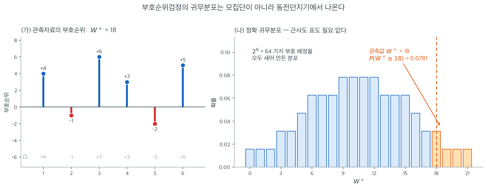

# Wilcoxon 검정

## 개요

**Wilcoxon 검정**은 특정 모수적 분포를 가정하지 않고 자료의 순서 정보를 쓰는
순위 기반 비모수 절차의 계열이다. 가장 중요한 두 구성원은 대응 또는 일표본 문제를 위한
**Wilcoxon 부호순위검정**과, 독립인 두 표본을 비교하기 위한
**Wilcoxon 순위합검정**(Mann--Whitney $U$ 검정과 동치)이다. 두 검정 모두 밑에 깔린 분포가
대칭일 때 부호검정보다 강력하면서도, 모수적 대응물보다 훨씬 약한 조건에서 타당하다.

## Wilcoxon 부호순위검정

### 설정

$n$개의 대응 관측값 $(X_i, Y_i)$에서 차이 $D_i = X_i - Y_i$를 만든다.
동점($D_i = 0$)을 제외하면 0이 아닌 차이가 $n'$개 남는다.

1. 절댓값 $|D_1|, |D_2|, \dots, |D_{n'}|$에 $1$부터 $n'$까지 순위를 매긴다.
2. 각 순위에 $D_i$의 부호를 붙여 **부호순위**
   $R_i^{+} = \operatorname{rank}(|D_i|) \cdot \operatorname{sgn}(D_i)$를 만든다.
3. 검정통계량을 계산한다.

$$
W^{+} = \sum_{i:\, D_i > 0} \operatorname{rank}(|D_i|).
$$

차이가 대칭인 $H_0{:}\;\text{median}(D) = 0$ 아래에서 각 부호순위가 양수일 확률과
음수일 확률이 같으므로

$$
\operatorname{E}[W^{+}] = \frac{n'(n'+1)}{4}, \qquad
\operatorname{Var}(W^{+}) = \frac{n'(n'+1)(2n'+1)}{24}.
$$

표준화된 통계량

$$
Z = \frac{W^{+} - \operatorname{E}[W^{+}]}{\sqrt{\operatorname{Var}(W^{+})}}
$$

은 $n'$이 중간 이상이면 근사적으로 표준정규를 따른다.



그런데 $n'$이 작으면 근사에 기댈 필요가 없다. 귀무분포를 **손으로 세어 만들 수 있기** 때문이다. 그 과정이 위 그림이다.

(가)는 연습문제 1의 자료 $D = (4, -1, 7, 3, -2, 5)$이다. 절댓값 $(4, 1, 7, 3, 2, 5)$에 순위를 매기면 $(4, 1, 6, 3, 2, 5)$이고, 양의 차이가 받은 순위를 더하면 $W^+ = 4 + 6 + 3 + 5 = 18$이다.

(나)가 핵심이다. 차이가 $0$을 중심으로 대칭이면 각 순위의 부호가 **독립적인 동전던지기**로 정해진다. 순위가 여섯 개이므로 가능한 부호 배정은 $2^6 = 64$가지이고, 각각이 확률 $1/64$로 똑같이 가능하다. 그 $64$가지에서 나오는 $W^+$를 전부 세면 $0$부터 $21$까지 퍼진 막대그림이 되며, 이것이 $W^+$의 **정확 귀무분포**이다. 모집단이 정규인지 지수인지는 한 번도 쓰이지 않았다. 순위에 붙는 부호가 동전던지기라는 사실만 썼다.

관측값 $W^+ = 18$ 이상이 나오는 배정은 $64$가지 중 $5$가지여서 단측 $p$값이 $5/64 = 0.0781$이다. SciPy의 `stats.wilcoxon(D, alternative="greater")`가 돌려주는 값과 정확히 같다. 표도 $t$ 분포표도 필요 없고, 근사 오차도 없다.

이 열거가 가능한 범위가 곧 정확검정을 쓸 수 있는 범위이다. $n' = 6$이면 $64$가지, $n' = 20$이면 약 $100$만 가지로 여전히 즉시 계산되지만 $n' = 50$이면 $10^{15}$가지가 되어 동적계획법이나 정규근사로 넘어가야 한다. SciPy가 $n' \le 25$에서 기본적으로 `method="exact"`를 쓰는 것이 이 경계선이다.

<div class="exbox" markdown>

**보기 1.** <span class="diff easy" title="쉬움"></span> `method="exact"` 를 달라고 해도 주지 않는다. 아래 자료는 15쌍 가운데 **세 쌍의 차이가 0** 이고, 0 이 아닌 차이 안에도 동점이 있다.

**(1)** 이 자료에 `method="exact"` 를 주면 `scipy` 가 무엇을 하는가. `zero_method="wilcox"` 로 0 을 버려도 마찬가지인가.

**(2)** 그래도 정확 p-값은 구할 수 있다. 0 을 버린 $n' = 12$ 개 순위에 부호를 다는 $2^{12} = 4096$ 가지를 전수 열거하시오. 정규근사와 얼마나 어긋나는가.

</div>

??? success "풀이"

    **(1) 경고와 함께 근사로 되돌아간다.** 차이는

    $$
    d = (17,\ -2,\ 6,\ -3,\ 14,\ 0,\ 6,\ 10,\ 12,\ 8,\ 9,\ 2,\ 0,\ 3,\ 0)
    $$

    이고 0 이 셋이다. `method="exact"` 를 주면 `scipy` 는

    ```
    UserWarning: Exact p-value calculation does not work if there are zeros.
    Switching to normal approximation.
    ```

    를 띄우고 **정규근사의 값을 돌려준다.** `zero_method="wilcox"` 로 0 을 버려도 같다 — 검사가 **입력의 차이**를 보고 이루어지므로, 0 을 버리기로 했는지는 따지지 않는다. 그래서 `method="exact"` 와 `method="approx"` 가 똑같이 $0.007579201614$ 를 준다.

    0 이 없더라도 **동점이 있으면 `scipy` 의 정확검정을 믿을 수 없다.** `scipy` 가 쓰는 정확 분포는 순위가 $1, 2, \dots, n'$ 인 경우의 표이므로, 중간순위가 끼면 그 표가 더 이상 맞지 않는다. 그런데 이때는 **경고조차 없다.** 아래 코드가 그 자리를 하나 보인다 — $d = (1, 1, 2, 3, -1, 5)$ 에서 `scipy` 는 $0.09375$ 를 주지만 중간순위로 전수 열거한 참값은 $0.125$ 다.

    **(2) 전수 열거.** 0 세 개를 버리면 $n' = 12$ 이고 $\lvert d \rvert$ 의 중간순위는

    $$
    r = (12,\ 1.5,\ 5.5,\ 3.5,\ 11,\ 5.5,\ 9,\ 10,\ 7,\ 8,\ 1.5,\ 3.5),
    \qquad \sum r = 78 = \frac{12 \times 13}{2}
    $$

    다. $H_0$ 과 대칭성 아래에서 **각 순위의 부호가 독립적인 동전던지기**이므로 $2^{12} = 4096$ 가지 부호 배정이 모두 확률 $1/4096$ 이다. 관측된 $W^- = 1.5 + 3.5 = 5$ 이므로 양측 정확 p-값은

    $$
    p_{\text{정확}} = P\bigl(\min(W^+, W^-) \leq 5\bigr) = \frac{20}{4096} = 0.004883
    $$

    이다. 정규근사의 $0.007579$ 는 이보다 **1.55배 크다.** 근사가 보수적인 쪽으로 빗나갔다.

    열거는 분산 공식을 검산해 주기도 한다. 열거한 $W^+$ 의 평균과 분산은

    $$
    \operatorname{E}[W^+] = 39 = \frac{n'(n'+1)}{4},
    \qquad
    \operatorname{Var}(W^+) = 162.125 = \frac{n'(n'+1)(2n'+1) - \tfrac12\sum_j(t_j^3-t_j)}{24}
    $$

    로 **동점 보정을 넣은 식과 정확히 같다.** 여기서 $t = 2$ 인 묶음이 셋이므로 $\sum(t_j^3-t_j) = 18$ 이고 $(3900 - 9)/24 = 162.125$ 다. **즉 동점 보정은 근사가 아니라 등식이다** — 근사가 끼어드는 곳은 분산이 아니라 그다음 단계, $W^+$ 를 정규분포로 보는 데 있다.

    **수치적으로.**

    ```python
    import numpy as np
    from scipy import stats

    # 같은 사람을 두 번 잰 대응자료다. 짝지어져 있다는 것이 핵심이라,
    # 두 열을 따로 떼어 독립표본 검정을 쓰면 안 된다.
    paired_data = np.array([
        [93, 76], [70, 72], [81, 75], [65, 68], [79, 65],
        [54, 54], [94, 88], [91, 81], [77, 65], [65, 57],
        [95, 86], [89, 87], [78, 78], [80, 77], [76, 76]
    ])

    # zero_method="pratt" 는 차이가 0 인 쌍을 순위 매기기에는 넣되 통계량에서는
    # 뺀다. "wilcox"(기본값)는 아예 버린다. 동점이 여럿일 때 결과가 갈린다.
    statistic, p_value = stats.wilcoxon(
        paired_data[:, 0], paired_data[:, 1],
        alternative="two-sided",
        method="approx",       # 옛 SciPy의 mode= 는 제거되었다
        zero_method="pratt"
    )
    print(f"W = {statistic}, p = {p_value:.4f}")
    # W = 11.0, p = 0.0086
    ```

    출력:

    ```
    W = 11.0, p = 0.0086
    ```

    ```python
    import itertools
    import warnings
    from collections import Counter

    d = paired_data[:, 0] - paired_data[:, 1]
    with warnings.catch_warnings(record=True) as caught:
        warnings.simplefilter("always")
        r_exact = stats.wilcoxon(d, method="exact", zero_method="wilcox")
    print(f"method='exact'  -> W = {r_exact.statistic}, p = {r_exact.pvalue:.12f}")
    print(f"  경고: {str(caught[0].message)}")
    print(f"method='approx' -> p = "
          f"{stats.wilcoxon(d, method='approx', zero_method='wilcox').pvalue:.12f}"
          f"   <- 같은 값이다")

    # 동점만 있고 0 은 없는 자료: 경고도 없이 틀린 정확값을 준다
    tie_only = np.array([1, 1, 2, 3, -1, 5])
    rk = stats.rankdata(np.abs(tie_only))
    S = np.array(list(itertools.product([0, 1], repeat=len(tie_only))))
    Wp = S @ rk
    obs = min(rk[tie_only > 0].sum(), rk[tie_only < 0].sum())
    enum_p = (np.minimum(Wp, rk.sum() - Wp) <= obs + 1e-9).mean()
    print(f"\n동점만 있는 자료 {tie_only.tolist()}  중간순위 {rk.tolist()}")
    print(f"  scipy method='exact' = "
          f"{stats.wilcoxon(tie_only, method='exact').pvalue:.6f}  (경고 없음)")
    print(f"  중간순위로 전수 열거 = {enum_p:.6f}   <- 참값")
    ```

    출력:

    ```
    method='exact'  -> W = 5.0, p = 0.007579201614
      경고: Exact p-value calculation does not work if there are zeros. Switching to normal approximation.
    method='approx' -> p = 0.007579201614   <- 같은 값이다
    
    동점만 있는 자료 [1, 1, 2, 3, -1, 5]  중간순위 [2.0, 2.0, 4.0, 5.0, 2.0, 6.0]
      scipy method='exact' = 0.093750  (경고 없음)
      중간순위로 전수 열거 = 0.125000   <- 참값
    ```

    ```python
    nonzero = d[d != 0]
    r = stats.rankdata(np.abs(nonzero))
    n_eff = len(nonzero)
    total = r.sum()
    print(f"n' = {n_eff},  중간순위 {r.tolist()}")
    print(f"순위합 {total}  (n'(n'+1)/2 = {n_eff * (n_eff + 1) / 2})")

    # 2^12 = 4096 가지 부호 배정을 전수 열거한다.
    signs = np.array(list(itertools.product([0, 1], repeat=n_eff)))
    W_plus = signs @ r
    W_min = np.minimum(W_plus, total - W_plus)
    W_obs = r[nonzero < 0].sum()
    hit = int((W_min <= W_obs + 1e-9).sum())
    print(f"\n열거한 가지 수 {len(W_plus)}  (2^{n_eff} = {2 ** n_eff})")
    print(f"관측 W- = {W_obs},  min(W+, W-) <= {W_obs} 인 배정 {hit} 개")
    print(f"정확   양측 p = {hit}/{len(W_plus)} = {hit / len(W_plus):.6f}")
    approx = stats.wilcoxon(d, method="approx", zero_method="wilcox").pvalue
    print(f"정규근사 양측 p = {approx:.6f}   ->  근사/정확 = "
          f"{approx / (hit / len(W_plus)):.2f} 배")

    tie = sum(c ** 3 - c for c in Counter(r).values())
    V = (n_eff * (n_eff + 1) * (2 * n_eff + 1) - tie / 2) / 24
    print(f"\n열거한 E[W+] = {W_plus.mean()},  공식 n'(n'+1)/4 = {n_eff * (n_eff + 1) / 4}")
    print(f"열거한 Var    = {W_plus.var()},  동점 보정 공식 = {V}"
          f"   (sum(t^3-t) = {tie})")
    ```

    출력:

    ```
    n' = 12,  중간순위 [12.0, 1.5, 5.5, 3.5, 11.0, 5.5, 9.0, 10.0, 7.0, 8.0, 1.5, 3.5]
    순위합 78.0  (n'(n'+1)/2 = 78.0)
    
    열거한 가지 수 4096  (2^12 = 4096)
    관측 W- = 5.0,  min(W+, W-) <= 5.0 인 배정 20 개
    정확   양측 p = 20/4096 = 0.004883
    정규근사 양측 p = 0.007579   ->  근사/정확 = 1.55 배
    
    열거한 E[W+] = 39.0,  공식 n'(n'+1)/4 = 39.0
    열거한 Var    = 162.125,  동점 보정 공식 = 162.125   (sum(t^3-t) = 18)
    ```

    **열거한 평균 $39$ 와 분산 $162.125$ 가 공식과 글자 하나까지 같다.** 그리고 정확 양측 p-값이 $20/4096 = 0.004883$ 으로, `scipy` 가 "정확" 이라고 이름 붙여 돌려준 $0.007579$ 와 1.55배 차이가 난다. **`scipy` 가 준 것은 정확값이 아니라 근사값이었다.**

    여기서 얻을 습관은 하나다. **`method="exact"` 를 주었다고 정확값을 받았다고 믿지 말라.** 0 이 있으면 경고와 함께 근사로 되돌아가고, 동점이 있으면 경고조차 없이 동점을 무시한 표를 쓴다. 두 경우 모두 $n'$ 이 작으면 위처럼 **직접 열거하는 것이 가장 안전하다** — $n' \leq 20$ 이면 $2^{20} \approx 100$ 만 가지로 즉시 끝난다.

!!! warning "`mode=`가 아니라 `method=`이다"
    SciPy 1.9에서 `wilcoxon`의 `mode` 인자가 `method`로 이름이 바뀌었고 옛 이름은
    이후 제거되었다. 또 반환되는 `statistic`은 $W^+$가 아니라
    $\min(W^+, W^-)$임에 유의하라. 이 자료에서는 $W^+ = 103$, $W^- = 11$이므로
    $11$이 반환된다.

## Wilcoxon 순위합검정

### 설정

독립인 두 표본 $X_1, \dots, X_m$과 $Y_1, \dots, Y_n$을 합쳐 $N = m + n$개 관측값 전체에
순위를 매긴다. 첫 번째 표본에 배정된 순위의 합을 $W$라 하자.

두 모집단의 분포가 동일하다는 $H_0$ 아래에서

$$
\operatorname{E}[W] = \frac{m(N + 1)}{2}, \qquad
\operatorname{Var}(W) = \frac{m\,n\,(N + 1)}{12}.
$$

표준화된 순위합통계량

$$
Z = \frac{W - \operatorname{E}[W]}{\sqrt{\operatorname{Var}(W)}}
$$

은 점근적으로 표준정규를 따른다.

<div class="exbox" markdown>

**보기 2.** <span class="diff easy" title="쉬움"></span> 짝을 버리면 검정력이 0 까지 떨어진다. 아래 코드는 **독립인** 두 집단에 순위합검정을 쓴다 — 쓰임이 맞는 자리다. 그런데 아래 경고 상자는 같은 함수를 **대응자료**에 쓰면 $p$ 가 $0.0086$ 에서 $0.141$ 로 뛴다고 한다.

**(1)** 개체 간 변동(사람마다 기본 수준이 다른 것)의 크기를 바꾸어 가며, 짝을 쓰는 부호순위검정과 짝을 버리는 순위합검정의 **검정력**을 모의실험으로 재시오.

**(2)** 개체 간 변동이 **없으면** 어느 쪽이 나은가. 그 까닭은 무엇인가.

</div>

??? success "풀이"

    **(1) 모형을 세우고 재 본다.** 참가자 $i$ 의 기본 수준을 $S_i \sim \mathcal{N}(0, \sigma_s^2)$, 측정 잡음을 $\varepsilon \sim \mathcal{N}(0,1)$, 처리 효과를 $\delta$ 라 하고

    $$
    X_i = S_i + \delta + \varepsilon_{i1},
    \qquad
    Y_i = S_i + \varepsilon_{i2}
    \qquad (i = 1, \dots, 15)
    $$

    로 15쌍을 만든다. **차이 $X_i - Y_i = \delta + \varepsilon_{i1} - \varepsilon_{i2}$ 에서 $S_i$ 가 깨끗이 사라진다.** 이것이 대응설계의 핵심이다. 반면 두 열을 따로 떼어 독립표본으로 보면 $S_i$ 의 퍼짐이 그대로 잡음으로 남는다.

    이론이 예측하는 바는 분명하다. $\delta = 1$, $\sigma_s = 10$ 이면 차이의 표준편차는 $\sqrt{1+1} = 1.414$ 로 신호 $\delta = 1$ 과 비슷한 크기이지만, 각 열의 표준편차는 $\sqrt{100 + 1} = 10.05$ 로 신호의 **열 배**다. 순위합검정은 신호를 찾을 수 없다.

    $\alpha = 0.05$, 반복 2000회로 재면

    | $\sigma_s$ | $\delta$ | 부호순위(짝 사용) | 순위합(짝 무시) |
    |---|---|---|---|
    | 10 | 1 | **0.690** | 0.000 |
    | 1 | 1 | **0.701** | 0.439 |
    | 0 | 1 | 0.700 | **0.742** |
    | 10 | 0 | 0.049 (크기) | 0.000 |

    (반복 2000회의 몬테카를로 오차는 기각률 $0.7$ 근처에서 $\pm 0.010$, $0.05$ 근처에서 $\pm 0.005$ 다.)

    **$\sigma_s = 10$ 에서 순위합검정의 검정력이 $0.000$ 이다.** 2000번 가운데 한 번도 기각하지 못했다. 부호순위검정의 검정력 $0.690$ 은 $\sigma_s$ 가 $0$ 이든 $10$ 이든 거의 같다 — 차이를 취하면서 $S_i$ 를 지웠으므로 개체 간 변동이 아예 보이지 않는다.

    맨 아래 줄도 눈여겨볼 일이다. $\delta = 0$ 일 때 부호순위검정의 기각률은 $0.049$ 로 명목수준과 맞지만 순위합검정은 $0.000$ 이다. **순위합검정이 검정력만 잃은 것이 아니라 아예 작동을 멈춘 것이다.** 두 열이 같은 $S_i$ 를 공유하므로 합친 30개 관측값이 "쌍끼리 붙어 있는" 모양이 되고, 순위합이 기댓값 근처에 못 박힌다.

    **(2) 개체 간 변동이 없으면 순위합이 조금 앞선다.** $\sigma_s = 0$ 줄에서 $0.742$ 대 $0.700$ 이다(차이 $0.042$, 몬테카를로 오차 $\pm 0.010$ 수준). 까닭은 **쓰는 순위의 개수**다. 부호순위검정은 15개 차이에 $1 \sim 15$ 의 순위를 매기지만, 순위합검정은 30개 관측값에 $1 \sim 30$ 의 순위를 매긴다. 짝지을 것이 없는 자료에서 억지로 짝을 지으면 자유도를 반으로 줄이는 셈이다.

    **그러므로 "대응 검정이 늘 낫다"가 아니다.** 옳은 서술은 **"자료가 대응이면 대응 검정을 써야 한다"** 다. 자료의 구조가 검정을 정하고, 구조를 잘못 읽으면 양쪽 방향으로 틀린다 — 대응자료에 독립 검정을 쓰면 검정력을 통째로 잃고($0.690 \to 0.000$), 독립자료를 억지로 짝지으면 조금 잃는다($0.742 \to 0.700$).

    **수치적으로.**

    ```python
    from scipy import stats

    # 서로 다른 두 집단에서 독립적으로 얻은 관측값이어야 한다.
    # 크기가 달라도 되는 것이 대응표본 검정과의 큰 차이다.
    a = [12, 15, 18, 22, 25]
    b = [8, 10, 14, 19, 21, 24]

    # ranksums 는 순위합 검정이다. Mann-Whitney U 와 수학적으로 같은 검정이지만
    # 정규근사만 쓰고 동점 보정을 하지 않는다. 표본이 작으면 mannwhitneyu 쪽이 낫다.
    statistic, p_value = stats.ranksums(a, b, alternative="two-sided")
    print(f"Z = {statistic:.4f}, p = {p_value:.4f}")
    # Z = 0.7303, p = 0.4652
    ```

    출력:

    ```
    Z = 0.7303, p = 0.4652
    ```

    ```python
    import numpy as np

    rng = np.random.default_rng(0)
    B, n = 2000, 15

    print("sigma_s  delta   부호순위   순위합")
    for sigma_s, delta in ((10.0, 1.0), (1.0, 1.0), (0.0, 1.0), (10.0, 0.0)):
        p_paired, p_indep = [], []
        for _ in range(B):
            S = rng.normal(0, sigma_s, n)           # 개체 간 변동
            X = S + delta + rng.normal(0, 1, n)
            Y = S + rng.normal(0, 1, n)
            p_paired.append(stats.wilcoxon(X, Y).pvalue)
            p_indep.append(stats.ranksums(X, Y).pvalue)
        print(f"{sigma_s:>7} {delta:>6}   "
              f"{np.mean(np.array(p_paired) < 0.05):>8.3f} "
              f"{np.mean(np.array(p_indep) < 0.05):>8.3f}")
    print(f"\n반복 {B} 회의 몬테카를로 오차: 0.7 근처에서 "
          f"{np.sqrt(0.7 * 0.3 / B):.4f}, 0.05 근처에서 {np.sqrt(0.05 * 0.95 / B):.4f}")
    ```

    출력:

    ```
    sigma_s  delta   부호순위   순위합
       10.0    1.0      0.690    0.000
        1.0    1.0      0.701    0.439
        0.0    1.0      0.700    0.742
       10.0    0.0      0.049    0.000
    
    반복 2000 회의 몬테카를로 오차: 0.7 근처에서 0.0102, 0.05 근처에서 0.0049
    ```

    **이론이 예측한 대로다.** 부호순위검정의 검정력이 $\sigma_s$ 에 거의 무관하게 $0.69 \sim 0.70$ 에 머무르는 것은 차이를 취하면서 $S_i$ 가 지워지기 때문이고, 순위합검정이 $0.742 \to 0.439 \to 0.000$ 으로 무너지는 것은 $S_i$ 의 퍼짐이 그대로 잡음이 되기 때문이다. $\delta = 0$ 줄의 $0.049$ 는 명목수준 $0.05$ 와 몬테카를로 오차($\pm 0.005$) 안에서 맞는다.

!!! danger "대응자료에 순위합검정을 쓰지 말 것"
    부호순위검정 보기의 학생 자료를 두 열로 쪼개어 `ranksums`에 넣으면
    $Z = 1.472$, $p = 0.141$이 나온다. 부호순위검정의 $p = 0.0086$과 비교하면
    16배이다.

    이는 **대응 구조를 버렸기 때문**이며, 오류이다. 같은 학생의 처치 전 점수와
    처치 후 점수는 독립이 아니다. 대응자료에는 반드시 부호순위검정이나
    대응 $t$ 검정을 써야 한다.

## Mann--Whitney U와의 관계

Mann--Whitney $U$ 통계량은 $X_i > Y_j$인 쌍 $(X_i, Y_j)$의 개수이다. 순위합과는

$$
U = W - \frac{m(m+1)}{2}
$$

로 연결되므로 두 검정은 대수적으로 동치이고 언제나 같은 $p$값을 낸다.

## 해석

| 검정 | 귀무가설 | 핵심 가정 |
|---|---|---|
| 부호순위 | 중앙값 차이가 0 | 차이가 0을 중심으로 **대칭** |
| 순위합 | 두 모집단이 동일 | 관측값이 집단 간 **독립** |

- **부호순위 대 부호검정**: 부호순위검정은 각 차이의 부호와 순위를 모두 쓰므로,
  대칭성 가정이 성립할 때 검정력이 더 높다.
- **순위합 대 이표본 $t$ 검정**: 순위합검정은 이상치와 두꺼운 꼬리에 로버스트하지만
  정확히 정규분포일 때는 $t$ 검정보다 약간 덜 강력하다.

## 연습문제

<div class="drillbox" markdown>

**연습문제 1.** <span class="diff easy" title="쉬움"></span> 피험자 6명의 대응차이가
$D = (4, -1, 7, 3, -2, 5)$이다. 부호순위통계량 $W^+$를 손으로 계산하라.

</div>

??? success "풀이"

    절댓값에 순위를 매기면

    | $D_i$ | $\lvert D_i \rvert$ | 순위 | 부호 |
    |---|---|---|---|
    | $-1$ | $1$ | $1$ | $-$ |
    | $-2$ | $2$ | $2$ | $-$ |
    | $3$  | $3$ | $3$ | $+$ |
    | $4$  | $4$ | $4$ | $+$ |
    | $5$  | $5$ | $5$ | $+$ |
    | $7$  | $7$ | $6$ | $+$ |

    $$
    W^+ = 3 + 4 + 5 + 6 = 18.
    $$

    가능한 최댓값이 $6 \cdot 7 / 2 = 21$이므로 $21$ 중 $18$은 강한 양의 이동을
    시사한다.

    정확 $p$값을 손으로 세어 보자. $2^6 = 64$가지 부호 배정이 모두 동등하게 가능하고
    $W^+ + W^- = 21$이다.

    **단측** ($H_1$: 중앙값 $> 0$): $W^+ \ge 18$인 배정을 센다. $W^+ = 21 - (\text{음의 순위합})$
    이므로 음의 순위합이 $3$ 이하인 부분집합을 세면 된다. $\varnothing$(합 0), $\{1\}$,
    $\{2\}$, $\{3\}$, $\{1,2\}$의 **5개**이므로

    $$
    p_{\text{단측}} = \frac{5}{64} = 0.078125.
    $$

    **양측**: $\min(W^+, W^-) \le 3$인 배정을 센다. 대칭이므로 위의 5개와 그 여집합
    5개를 합쳐 $10$개이고

    $$
    p_{\text{양측}} = \frac{10}{64} = 0.15625.
    $$

    ```python
    import numpy as np
    from scipy import stats
    D = np.array([4, -1, 7, 3, -2, 5])
    print(stats.wilcoxon(D, method='exact'))
    # WilcoxonResult(statistic=3.0, pvalue=0.15625)
    print(stats.wilcoxon(D, alternative='greater', method='exact').pvalue)
    # 0.078125
    ```

    출력:

    ```
    WilcoxonResult(statistic=3.0, pvalue=0.15625)
    0.078125
    ```

    손계산과 SciPy가 정확히 일치한다. $n' = 6$에서 도달 가능한 최소 양측 $p$값이
    $2/64 = 0.03125$이므로, 이 자료는 강한 양의 이동을 보이면서도
    $\alpha = 0.05$에 이르지 못한다. $\square$

<div class="drillbox" markdown>

**연습문제 2.** <span class="diff med" title="중간"></span> $H_0$ 아래에서 $\operatorname{E}[W^+] = n'(n'+1)/4$임을 보여라.

</div>

??? success "풀이"

    귀무가설(대칭성) 아래에서 각 차이 $D_i$는 양수일 확률과 음수일 확률이 같다.
    따라서 순위 $r_i$를 갖는 관측값은 확률 $1/2$로 $r_i$를 $W^+$에 기여하고,
    나머지 확률로 $0$을 기여한다.

    $$
    \operatorname{E}[W^+]
      = \sum_{i=1}^{n'} r_i \cdot \frac{1}{2}
      = \frac{1}{2} \sum_{i=1}^{n'} i
      = \frac{1}{2} \cdot \frac{n'(n'+1)}{2}
      = \frac{n'(n'+1)}{4}.
    $$

    $\square$

    핵심은 $\{r_1, \ldots, r_{n'}\}$이 어떤 순서로 배정되든 **$1$부터 $n'$까지의
    순열**이라는 점이다. 따라서 $\sum_i r_i = n'(n'+1)/2$가 자료와 무관하게 고정된다.
    이것이 부호순위검정이 분포무관인 이유이다.

<div class="drillbox" markdown>

**연습문제 3.** <span class="diff easy" title="쉬움"></span> 독립인 두 집단의 값이 다음과 같다.

- 집단 A: $12, 15, 18, 22, 25$
- 집단 B: $8, 10, 14, 19, 21, 24$

$\alpha = 0.05$에서 Wilcoxon 순위합검정을 파이썬으로 수행하라.

</div>

??? success "풀이"

    ```python
    from scipy import stats

    a = [12, 15, 18, 22, 25]
    b = [8, 10, 14, 19, 21, 24]

    print(stats.ranksums(a, b))
    # RanksumsResult(statistic=0.7303, pvalue=0.4652)
    print(stats.mannwhitneyu(a, b, method='exact'))
    # MannwhitneyuResult(statistic=19.0, pvalue=0.5368)
    ```

    출력:

    ```
    RanksumsResult(statistic=0.7302967433402214, pvalue=0.4652088184521418)
    MannwhitneyuResult(statistic=19.0, pvalue=0.5367965367965368)
    ```

    11개 값을 합쳐 순위를 매기면 $8(1), 10(2), 12(3), 14(4), 15(5), 18(6),
    19(7), 21(8), 22(9), 24(10), 25(11)$이다.

    집단 A의 순위합: $3 + 5 + 6 + 9 + 11 = 34$.
    기댓값: $5 \cdot 12 / 2 = 30$. 분산: $5 \cdot 6 \cdot 12 / 12 = 30$.

    $$
    Z = \frac{34 - 30}{\sqrt{30}} = \frac{4}{5.477} = 0.730, \qquad p = 0.465.
    $$

    $p$값이 $0.05$보다 훨씬 크므로 두 집단이 같은 분포에서 왔다는 귀무가설을
    기각하지 못한다.

    정확 $p$값 $0.5368$이 정규근사값 $0.4652$보다 큼에 유의하라. $m = 5$, $n = 6$은
    정규근사에 작다. 두 값 모두 기각하지 않으므로 결론은 같다. $\square$

<div class="drillbox" markdown>

**연습문제 4.** <span class="diff med" title="중간"></span> Wilcoxon 부호순위검정은 차이의 분포가 대칭이라는 가정을 요구하는데
부호검정은 그렇지 않은 이유를 설명하라. 이 구별이 중요해지는 분포의 예를 들어라.

</div>

??? success "풀이"

    부호순위검정은 각 관측값에 순위 크기를 배정한 뒤, 대칭성 가정을 이용해 각
    부호순위가 양수일 확률과 음수일 확률이 **독립적으로** 같다고 결론짓는다.
    $|D_i|$의 분포가 양의 차이와 음의 차이에서 다르면(즉 분포가 치우쳐 있으면)
    $W^+$의 귀무분포가 대칭 아래에서 유도한 것과 달라진다.

    부호검정은 $\operatorname{sgn}(D_i)$만 쓰므로 $H_0$ 아래에서
    $P(D_i > 0) = P(D_i < 0) = 0.5$만 요구한다. 이는 중앙값이 0인 임의의 연속분포에서
    대칭 여부와 무관하게 성립한다.

    **예:** $D_i$가 중앙값 0이 되도록 이동한 지수분포
    $D_i \sim \text{Exp}(1) - \ln 2$를 따른다고 하자. 이 분포는 오른쪽으로 치우쳐 있다.
    부호검정은 타당하지만(중앙값이 0이다) 부호순위검정의 귀무분포는 대칭성 가정이
    깨져 옳지 않다.

    [Wilcoxon 부호순위검정](./wilcoxon_signed_rank.md)
    연습문제 2에서 이 상황의 제1종 오류율을 모의실험했다. $n = 100$에서
    부호순위검정의 기각률이 $0.376$까지 올라가는 반면 부호검정은 $0.035$를
    유지한다. $\square$

<div class="drillbox" markdown>

**연습문제 5.** <span class="diff med" title="중간"></span> Mann--Whitney $U$ 통계량과 Wilcoxon 순위합 $W$ 사이의 관계
$U = W - m(m+1)/2$를 유도하라.

</div>

??? success "풀이"

    표본 $X$의 관측값을 **정렬하여** $X_{(1)} < X_{(2)} < \cdots < X_{(m)}$이라 하고,
    $N = m + n$개 전체 순위에서 $X_{(i)}$의 순위를 $R_{(i)}$라 하자.
    $W = \sum_{i=1}^{m} R_{(i)}$이다.

    Mann--Whitney $U$는 쌍을 센다.

    $$
    U = \sum_{i=1}^{m} \sum_{j=1}^{n} \mathbf{1}[X_i > Y_j].
    $$

    $X_{(i)}$ 하나를 고정하면 $R_{(i)}$는 $X_{(i)}$ 이하인 관측값의 개수이다.
    이는 두 부분으로 나뉜다.

    - 표본 $X$ 안에서 $X_{(i)}$ 이하인 것: 정렬했으므로 정확히 $i$개(자신 포함).
    - 표본 $Y$ 안에서 $X_{(i)}$보다 작은 것: $c_i$개.

    따라서 $R_{(i)} = i + c_i$이고 $c_i = R_{(i)} - i$이다. 모든 $i$에 대해 합하면

    $$
    U = \sum_{i=1}^{m} c_i = \sum_{i=1}^{m} \bigl(R_{(i)} - i\bigr)
      = W - \sum_{i=1}^{m} i = W - \frac{m(m+1)}{2}.
    $$

    $\square$

    **정렬이 필수임에 유의하라.** $R_i$를 원래 순서대로 두고 $\sum_i (R_i - i)$를
    계산해도 합은 같지만, 각 항 $R_i - i$가 "그보다 작은 $Y$의 개수"라는 의미를
    갖지 않는다. 총합만 우연히 일치하는 것이다.

<div class="drillbox" markdown>

**연습문제 6.** <span class="diff med" title="중간"></span> `stats.wilcoxon`이 반환하는 `statistic`이 $W^+$가 아니라
$\min(W^+, W^-)$임을 확인하고, `alternative`를 바꾸면 무엇이 달라지는지 조사하라.

</div>

??? success "풀이"

    ```python
    import numpy as np
    from scipy import stats
    D = np.array([4, -1, 7, 3, -2, 5])
    r = stats.rankdata(np.abs(D))
    print("W+ =", r[D > 0].sum(), " W- =", r[D < 0].sum())   # 18.0  3.0

    for alt in ("two-sided", "greater", "less"):
        res = stats.wilcoxon(D, alternative=alt, method='exact')
        print(alt, res.statistic, round(res.pvalue, 5))
    ```

    출력:

    ```
    W+ = 18.0  W- = 3.0
    two-sided 3.0 0.15625
    greater 18.0 0.07812
    less 18.0 0.95312
    ```

    출력:

    | `alternative` | `statistic` | $p$값 |
    |:---|---:|---:|
    | `"two-sided"` | $3.0$ | $0.15625$ |
    | `"greater"` | $18.0$ | $0.07812$ |
    | `"less"` | $18.0$ | $0.95312$ |

    반환되는 `statistic`이 `alternative`에 따라 **달라진다**.

    - `"two-sided"`: $\min(W^+, W^-) = 3$
    - `"greater"`, `"less"`: $W^+ = 18$

    이는 SciPy의 문서화된 동작이지만 혼동을 부르기 쉽다. 논문에 통계량을 보고할
    때는 어느 쪽인지 명시하거나, 아예 $W^+$와 $W^-$를 직접 계산하여 함께 보고하는
    편이 안전하다.

    단측 $p$값 $0.07813 = 5/64$와 $0.95313 = 61/64$의 합이 $1$을 넘는다는 점도
    유의하라($66/64$). 이산분포에서 $P(W^+ \ge 18)$과 $P(W^+ \le 18)$이 모두
    $P(W^+ = 18)$을 포함하기 때문이다.

---

## 정리하며

윌콕슨 계열은 **순위를 쓰는 두 검정**이다.

- **부호순위검정**은 일표본·대응 문제에, **순위합검정**(=만–휘트니)은 독립 이표본에 쓴다.
- **부호순위는 대칭성을 가정한다.** 차이의 분포가 중앙값을 중심으로 대칭이어야 하며, 그래야 결과를 중앙값에 대한 진술로 읽을 수 있다. **이 가정을 빠뜨리는 일이 흔하다.**
- **동점 처리에 관례가 있다.** 평균 순위를 주고 분산을 보정하며, 동점이 많으면 정규근사가 나빠진다.
- **정확검정과 근사검정이 갈린다.** 표본이 작으면 정확 분포를, 크면 정규근사를 쓰며 `scipy` 가 자동으로 고른다.
- **$t$ 검정 대비 손해가 작다.** 정규 자료에서 $3/\pi\approx0.955$ 이며, 꼬리가 두꺼우면 오히려 앞선다.

다음 절 **대응표본 비모수 검정**으로 넘어간다.
