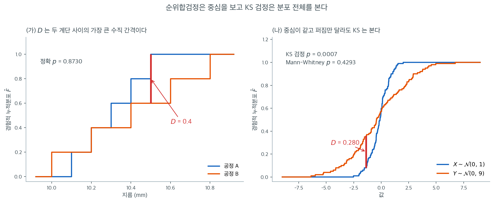

# Kolmogorov-Smirnov 이표본 검정

[Wilcoxon 순위합](rank_sum.md) 검정과 [Mann-Whitney U](mann_whitney.md) 검정은 주로 **위치이동** --- 두 분포의 중심경향 차이 --- 에 민감하다. **Kolmogorov-Smirnov(KS) 이표본 검정**은 더 넓은 관점을 취한다. 두 표본의 *전체* 경험적 누적분포함수(ECDF)를 비교하여 위치, 산포, 모양, 그 밖의 어떤 분포적 특징의 차이든 탐지할 수 있다.

이 일반성 덕에 KS 검정은 다재다능한 진단도구가 되지만, 순수한 위치이동 같은 특정 대립가설에 대해서는 순위 기반 검정보다 검정력이 낮다는 대가를 치른다.

## 직관

독립인 두 표본이 주어지면 각 표본이 경험적 CDF --- 관측값마다 $1/n$씩 뛰는 계단함수 --- 를 만든다. 두 모집단이 동일하다면 두 ECDF가 서로 가까이 붙어 움직여야 한다. KS 검정은 두 ECDF 사이의 최대 수직 간격을 재고, 그 간격이 표집변동만으로 설명하기에 너무 크면 $H_0$을 기각한다.

## 가설

$$
H_0 \colon F_X = F_Y \quad \text{(두 모집단이 같은 연속분포를 갖는다)}
$$

$$
H_a \colon F_X \ne F_Y \quad \text{(분포가 어떤 식으로든 다르다)}
$$

이 검정은 본질적으로 양측이다. 분포 사이의 *임의의* 차이를 탐지한다.

## 검정통계량

크기 $n_1$과 $n_2$인 두 표본의 ECDF를 $\hat{F}_1(x)$, $\hat{F}_2(x)$라 하자. KS 통계량은 절대차이의 상한이다.

$$
D_{n_1, n_2} = \sup_{x \in \mathbb{R}} \left|\hat{F}_1(x) - \hat{F}_2(x)\right|
$$

실제로는 $N = n_1 + n_2$개 관측값을 모두 합쳐 정렬한 뒤, 각 관측값에서(그리고 각 도약 직전에서) $|\hat{F}_1 - \hat{F}_2|$를 평가하여 $D$를 계산한다.

## 귀무분포

연속분포라는 $H_0$ 아래에서 $D_{n_1, n_2}$의 귀무분포는 공통분포 $F$에 의존하지 않는다. 즉 검정이 분포무관이다.

표본이 크면 척도조정된 통계량

$$
\sqrt{\frac{n_1 \, n_2}{n_1 + n_2}} \, D_{n_1, n_2}
$$

이 **Kolmogorov 분포**로 분포수렴하며, 그 CDF는

$$
K(t) = 1 - 2\sum_{k=1}^{\infty} (-1)^{k-1} e^{-2k^2 t^2}
$$

이다. 점근 $p$값은 $c = \sqrt{n_1 n_2 / (n_1 + n_2)} \cdot D$일 때 $p = 1 - K(c)$이다.

소표본에서는 열거나 동적계획법으로 정확 $p$값을 계산한다.

<div class="exbox" markdown>

**보기 1.** <span class="diff easy" title="쉬움"></span> 정확 p-값 $0.873016$ 의 분모는 252 다. 두 제조공정이 볼베어링을 생산한다. 각 공정의 표본에서 지름(mm)을 측정했다.

**공정 A** ($n_1 = 5$): 10.1, 10.3, 10.2, 10.5, 10.4

**공정 B** ($n_2 = 5$): 10.0, 10.2, 10.6, 10.8, 10.4

**(1)** 두 ECDF 의 표를 만들어 $D$ 와 척도조정 통계량 $\sqrt{n_1n_2/(n_1+n_2)}\,D$ 를 손으로 구하시오.

**(2)** $n_1 = n_2 = 5$ 이면 합친 표본을 두 집단에 배치하는 방법이 $\binom{10}{5} = 252$ 가지뿐이다. 전수 열거로 정확 p-값을 **분수로** 적고, $D$ 가 가질 수 있는 값이 몇 개인지 세시오. 또 `scipy` 의 `method='asymp'` 가 주는 $0.82$ 가 위 식 $1 - K(c)$ 와 같은지 확인하시오.

</div>

??? success "풀이"

    **(1) ECDF 표.** 합친 표본의 서로 다른 값은 여덟 개다. 각 값에서 두 ECDF 를 읽는다.

    | 값 | $\hat{F}_1(x)$ | $\hat{F}_2(x)$ | $\lvert \hat{F}_1 - \hat{F}_2 \rvert$ |
    |:-----:|:-----:|:-----:|:-----:|
    | 10.0 | 0/5 = 0.0 | 1/5 = 0.2 | 0.2 |
    | 10.1 | 1/5 = 0.2 | 1/5 = 0.2 | 0.0 |
    | 10.2 | 2/5 = 0.4 | 2/5 = 0.4 | 0.0 |
    | 10.3 | 3/5 = 0.6 | 2/5 = 0.4 | 0.2 |
    | 10.4 | 4/5 = 0.8 | 3/5 = 0.6 | 0.2 |
    | 10.5 | 5/5 = 1.0 | 3/5 = 0.6 | 0.4 |
    | 10.6 | 5/5 = 1.0 | 4/5 = 0.8 | 0.2 |
    | 10.8 | 5/5 = 1.0 | 5/5 = 1.0 | 0.0 |

    최대 간격은 $x = 10.5$ 에서 $D = 0.4$ 다. $A$ 의 계단이 $10.5$ 에서 $1.0$ 에 닿는데 $B$ 는 아직 $0.6$ 에 머물러 있다. 척도조정 통계량은

    $$
    c = \sqrt{\frac{n_1 n_2}{n_1 + n_2}}\,D = \sqrt{\frac{25}{10}} \times 0.4 = \sqrt{2.5} \times 0.4 = 0.632456
    $$

    이다.

    **(2) 전수 열거.** $H_0$ 아래에서 합친 10개 관측값 가운데 어느 다섯이 $A$ 가 되는지는 모두 같은 확률이고, 그런 배치가 $\binom{10}{5} = 252$ 가지다. 배치를 정하면 $D$ 가 다음과 같이 **한 번 훑어** 나온다. 정렬한 합친 표본을 왼쪽부터 보면서 $A$ 의 값에서 $+1/5$, $B$ 의 값에서 $-1/5$ 를 더해 가면 부분합이 $\hat F_1 - \hat F_2$ 이고

    $$
    D = \max_{k} \left\lvert \sum_{i \leq k} s_i \right\rvert,
    \qquad s_i = \pm \tfrac15
    $$

    이다. **따라서 $D$ 는 $0.2$ 의 배수일 수밖에 없다.** 게다가 첫 걸음에서 이미 $\lvert s_1 \rvert = 0.2$ 이므로 $D = 0$ 은 불가능하다. 가능한 값은 $0.2, 0.4, 0.6, 0.8, 1.0$ 의 **다섯 개뿐**이고 252 가지가 그 다섯에 나뉘어 들어간다.

    | $D$ | 0.2 | 0.4 | 0.6 | 0.8 | 1.0 | 합 |
    |---|---|---|---|---|---|---|
    | 배치 수 | 32 | 130 | 70 | 18 | 2 | 252 |

    관측값 $D = 0.4$ 이상인 배치는 $130 + 70 + 18 + 2 = 220$ 개다.

    $$
    p_{\text{정확}} = \frac{220}{252} = \frac{55}{63} = 0.873016
    $$

    **`scipy` 의 `method='exact'` 가 준 $0.873015873$ 과 같다.** $D$ 가 다섯 값만 가지므로 **이 검정이 낼 수 있는 p-값도 다섯 개뿐**이다: $1, 220/252, 90/252, 20/252, 2/252$, 곧 $1,\ 0.8730,\ 0.3571,\ 0.0794,\ 0.0079$. $\alpha = 0.05$ 에서 기각하려면 $D = 1.0$, 곧 **두 표본이 완전히 분리되어야** 한다.

    **점근값은 본문의 $1 - K(c)$ 와 다르다.** 본문의 급수를 $c = 0.632456$ 에서 더하면

    $$
    1 - K(c) = 2\sum_{k=1}^{\infty}(-1)^{k-1}e^{-2k^2c^2} = 0.818621
    $$

    인데 `scipy` 는 $0.82$ 를 돌려준다. 까닭은 `scipy` 가 극한분포를 쓰지 않고 **유효 표본크기를 정수로 반올림한 유한 $n$ 분포**를 쓰기 때문이다.

    $$
    n_{\text{eff}} = \frac{n_1n_2}{n_1+n_2} = 2.5
    \ \xrightarrow{\text{반올림}}\ 2,
    \qquad
    p = P(D_2 \geq 0.4) \ \text{(일표본 KS 분포)} = 0.82
    $$

    `numpy` 의 반올림은 $2.5$ 를 **짝수 쪽인 $2$** 로 보낸다. 차이 $0.0014$ 는 여기서 대수롭지 않지만, **"점근 p-값"이라는 이름이 붙은 수가 실제로 무엇으로 계산되는지는 함수마다 확인해야 한다.**

    **수치적으로.**

    ```python
    from scipy import stats
    A = [10.1, 10.3, 10.2, 10.5, 10.4]
    B = [10.0, 10.2, 10.6, 10.8, 10.4]
    print(stats.ks_2samp(A, B, method='exact').pvalue)   # 0.873016
    print(stats.ks_2samp(A, B, method='asymp').pvalue)   # 0.820000
    ```

    출력:

    ```
    0.873015873015873
    0.82
    ```

    ```python
    import itertools
    import math
    from collections import Counter

    import numpy as np

    n1 = n2 = 5
    N = n1 + n2
    pool = np.array(sorted(A + B))
    print(f"정렬한 합친 표본 {pool.tolist()}")
    print(f"동점 {[(k, v) for k, v in sorted(Counter(pool.tolist()).items()) if v > 1]}")

    # 252 가지 배치를 전수 열거한다.
    Ds = []
    for comb in itertools.combinations(range(N), n1):
        step = np.full(N, -1 / n2)
        step[list(comb)] = 1 / n1
        Ds.append(np.abs(np.cumsum(step)).max())
    Ds = np.round(Ds, 10)
    tally = Counter(Ds)
    print(f"\n열거한 배치 수 {len(Ds)}  (C(10,5) = {math.comb(N, n1)})")
    print(f"D 가 가질 수 있는 값 {sorted(tally)}")
    print(f"배치 수           {[tally[d] for d in sorted(tally)]}")

    D_obs = 0.4
    hit = int((Ds >= D_obs - 1e-12).sum())
    print(f"\nD >= {D_obs} 인 배치 {hit} 개  ->  정확 p = {hit}/{len(Ds)}"
          f" = {hit / len(Ds):.9f}")
    print(f"scipy method='exact' : {stats.ks_2samp(A, B, method='exact').pvalue:.9f}")
    print("이 검정이 낼 수 있는 p-값 전부:")
    for d in sorted(tally):
        k = int((Ds >= d - 1e-12).sum())
        print(f"  D = {d}:  p = {k}/{len(Ds)} = {k / len(Ds):.4f}")

    c = np.sqrt(n1 * n2 / N) * D_obs
    series = 2 * sum((-1) ** (k - 1) * np.exp(-2 * k ** 2 * c ** 2)
                     for k in range(1, 200))
    print(f"\nc = sqrt({n1 * n2}/{N}) * {D_obs} = {c:.6f}")
    print(f"급수 1 - K(c)        = {series:.6f}")
    print(f"kstwobign.sf(c)      = {stats.kstwobign.sf(c):.6f}")
    print(f"n_eff = {n1 * n2 / N} -> round -> {np.round(n1 * n2 / N):.0f}")
    print(f"kstwo.sf(D, round(n_eff)) = {stats.kstwo.sf(D_obs, int(np.round(n1 * n2 / N))):.6f}")
    print(f"scipy method='asymp'      = {stats.ks_2samp(A, B, method='asymp').pvalue:.6f}")
    ```

    출력:

    ```
    정렬한 합친 표본 [10.0, 10.1, 10.2, 10.2, 10.3, 10.4, 10.4, 10.5, 10.6, 10.8]
    동점 [(10.2, 2), (10.4, 2)]

    열거한 배치 수 252  (C(10,5) = 252)
    D 가 가질 수 있는 값 [0.2, 0.4, 0.6, 0.8, 1.0]
    배치 수           [32, 130, 70, 18, 2]

    D >= 0.4 인 배치 220 개  ->  정확 p = 220/252 = 0.873015873
    scipy method='exact' : 0.873015873
    이 검정이 낼 수 있는 p-값 전부:
      D = 0.2:  p = 252/252 = 1.0000
      D = 0.4:  p = 220/252 = 0.8730
      D = 0.6:  p = 90/252 = 0.3571
      D = 0.8:  p = 20/252 = 0.0794
      D = 1.0:  p = 2/252 = 0.0079

    c = sqrt(25/10) * 0.4 = 0.632456
    급수 1 - K(c)        = 0.818621
    kstwobign.sf(c)      = 0.818621
    n_eff = 2.5 -> round -> 2
    kstwo.sf(D, round(n_eff)) = 0.820000
    scipy method='asymp'      = 0.820000
    ```

    **열거한 $220/252$ 가 `scipy` 의 정확 p-값과 아홉째 자리까지 같다.** 그리고 급수로 더한 $1 - K(c) = 0.818621$ 이 `kstwobign.sf(c)` 와 같으므로 **본문의 극한 공식은 맞다** — `scipy` 의 `'asymp'` 가 그것을 쓰지 않을 뿐이다. $n_{\text{eff}} = 2.5$ 를 $2$ 로 반올림해 `kstwo.sf(0.4, 2) = 0.82` 를 돌려주는 것이 확인된다.

    $\alpha = 0.05$ 에서 $H_0$ 을 기각하지 못한다. 두 공정의 지름 분포에 유의한 차이가 나타나지 않는다. **다만 "차이가 없다"가 아니라 "다섯 개씩으로는 완전 분리가 아니면 어차피 기각할 수 없었다"가 정확한 서술이다.** 이 설계의 가장 작은 p-값이 $2/252 = 0.0079$ 라는 사실이 그 뜻이다.

!!! warning "이 자료는 동점을 포함한다"
    공정 A와 B가 $10.2$와 $10.4$를 공유한다. KS 검정은 연속분포를 가정하므로 엄밀히는 동점이 없어야 한다. 동점이 있으면 정확 귀무분포가 성립하지 않고 검정이 **보수적**으로 된다. 반올림된 측정값에서는 이런 상황이 흔하므로, 동점이 많다면 순열검정으로 실제 귀무분포를 직접 계산하는 편이 낫다.

## KS 검정이 탐지하는 것

위치에 집중하는 순위 기반 검정과 달리 KS 검정은 다음 차이에 민감하다.

- **위치** --- 한 분포가 다른 분포에 대해 이동
- **척도** --- 한 분포가 더 퍼져 있음
- **모양** --- 왜도, 첨도, 봉우리 수의 차이
- **위의 임의의 조합**



$D = \sup_x |\hat{F}_1(x) - \hat{F}_2(x)|$라는 정의는 그림으로 보면 한 줄로 끝난다. **두 계단 사이의 가장 긴 세로 막대를 찾는 것**이다.

(가)는 위의 볼베어링 보기이다. 공정 A(파랑)의 계단이 $10.5$에서 $1.0$까지 올라가는데 공정 B(주황)는 아직 $0.6$에 머물러 있어 그 자리의 간격이 $0.4$로 가장 크다. 빨간 막대가 바로 $D$이다. 다만 $n_1 = n_2 = 5$로 표본이 워낙 작아 이 정도 간격은 우연으로 충분히 설명되며, 정확 $p$값이 $0.8730$이다. **간격의 크기 자체가 아니라 그 크기가 표본크기에 비해 놀라운가**를 묻는 것이 검정이다.

(나)가 KS 검정을 따로 배울 이유를 보여 준다. 집단당 $100$개씩 뽑은 $X \sim \mathcal{N}(0, 1)$과 $Y \sim \mathcal{N}(0, 9)$인데, **중심은 같고 퍼짐만 세 배 다르다.** 두 계단이 가운데 $0.5$ 근처에서 교차하고 양쪽 끝에서 갈라지는 X자 모양이 이 상황의 전형적인 신호이다. KS 통계량은 $D = 0.280$이고 $p = 0.0007$로 강하게 기각한다.

같은 자료에 Mann-Whitney 검정을 돌리면 $p = 0.4293$이 나온다. 순위합은 "$Y$ 쪽 순위가 전체적으로 높은가 낮은가"만 보는데, $Y$는 아래로도 위로도 똑같이 퍼졌으므로 순위합에서 두 효과가 **정확히 상쇄된다.** 순위합검정에게 이 두 집단은 구별되지 않는다.

그래서 두 검정은 경쟁 관계가 아니라 분업 관계이다. 위치이동이 관심사라면 순위합검정이 더 강력하고, 차이의 성격을 모르거나 산포·모양이 관심사라면 KS 검정이 필요하다. 탐색 단계에서는 둘을 함께 돌리고 **결과가 갈리는 방향에서 무슨 일이 벌어지는지**를 읽는 것이 좋은 습관이다.

!!! warning "특정 대립가설에 대한 검정력은 낮다"
    KS 검정의 일반성에는 대가가 있다. 순수한 위치이동에 대해서는 Wilcoxon 순위합검정의 검정력이 대체로 더 높다. KS 검정은 차이의 성격을 모르거나 모양·산포의 차이가 관심사일 때 가장 유용하다.

## 순위 기반 검정과의 비교

| 특징 | Wilcoxon 순위합 | KS 이표본 |
|:--------|:-----------------|:--------------|
| 위치이동 탐지 | 높은 검정력 | 중간 검정력 |
| 산포 차이 탐지 | 낮은 검정력 | 중간 검정력 |
| 모양 차이 탐지 | 낮은 검정력 | 중간 검정력 |
| 검정통계량 | 순위합 ($W$) | 최대 ECDF 간격 ($D$) |
| 동점 처리 | 중간순위로 처리 | 연속성을 요구 |
| 효과크기 해석 | $U$를 통한 $P(X > Y)$ | 최대 분포 간격 |

## 연습문제

<div class="drillbox" markdown>

**연습문제 1.** <span class="diff easy" title="쉬움"></span>
두 집단의 학생이 서로 다른 준비 과정을 수강했고 시험 점수는 다음과 같다.

- **과정 1**: 72, 78, 85, 90, 65
- **과정 2**: 80, 88, 92, 95, 85, 76

**(a)** 각 집단의 경험적 CDF $\hat{F}_1(x)$와 $\hat{F}_2(x)$를 계산하라.

**(b)** Kolmogorov-Smirnov 검정통계량 $D = \max_x |\hat{F}_1(x) - \hat{F}_2(x)|$를 구하라.

**(c)** $D$가 크다는 것은 두 분포에 대해 무엇을 뜻하는가?

</div>

??? success "풀이"

    **(a)** 각 표본을 정렬하고 ECDF를 계산한다(각 도약의 크기는 $1/n_i$).

    **과정 1** ($n_1 = 5$): 65, 72, 78, 85, 90. ECDF가 각 값에서 $1/5 = 0.2$씩 뛴다.

    **과정 2** ($n_2 = 6$): 76, 80, 85, 88, 92, 95. ECDF가 각 값에서 $1/6 \approx 0.167$씩 뛴다.

    **(b)** $D$를 찾기 위해 관측된 모든 값에서 $|\hat{F}_1(x) - \hat{F}_2(x)|$를 평가한다.

    | $x$ | $\hat{F}_1(x)$ | $\hat{F}_2(x)$ | $\lvert \hat{F}_1 - \hat{F}_2 \rvert$ |
    |:---:|:---:|:---:|:---:|
    | 65 | 0.2 | 0 | 0.200 |
    | 72 | 0.4 | 0 | 0.400 |
    | 76 | 0.4 | 1/6 | 0.233 |
    | 78 | 0.6 | 1/6 | 0.433 |
    | 80 | 0.6 | 2/6 | 0.267 |
    | 85 | 0.8 | 3/6 | 0.300 |
    | 88 | 0.8 | 4/6 | 0.133 |
    | 90 | 1.0 | 4/6 | 0.333 |
    | 92 | 1.0 | 5/6 | 0.167 |
    | 95 | 1.0 | 1.0 | 0.000 |

    $$
    D = \max_x |\hat{F}_1(x) - \hat{F}_2(x)| = 0.433 \quad (x = 78 \text{에서})
    $$

    **(c)** $D$가 크면 두 경험적 CDF가 상당히 다르다는 뜻이고, 두 표본이 서로 다른 모집단 분포에서 왔음을 시사한다. KS 검정은 위치(이동)와 모양의 차이 모두에 민감하다.

    이 자료에서 $D = 0.433$은 과정 2 학생들이 더 높은 점수를 내는 경향을 시사하지만, $n_1 = 5$, $n_2 = 6$에서 $\alpha = 0.05$의 임계값은

    $$
    c(\alpha)\sqrt{\frac{n_1 + n_2}{n_1 n_2}} = 1.36\sqrt{\frac{11}{30}} \approx 0.824
    $$

    이므로 $D = 0.433 < 0.824$이고 이 표본크기에서는 $H_0$을 기각하지 못한다.

    ```python
    from scipy import stats
    c1 = [72, 78, 85, 90, 65]; c2 = [80, 88, 92, 95, 85, 76]
    print(stats.ks_2samp(c1, c2, method='exact'))
    # statistic=0.4333, pvalue=0.5909
    print(stats.mannwhitneyu(c1, c2, method='exact').pvalue)   # 0.2468
    ```

    출력:

    ```
    KstestResult(statistic=0.43333333333333335, pvalue=0.5909090909090909, statistic_location=78, statistic_sign=1)
    0.24675324675324672
    ```

    정확 $p$값은 $0.591$이다. Mann-Whitney의 $0.247$과 비교하면 두 배가 넘는데, 이 자료의 차이가 주로 위치이동이라 순위 기반 검정이 더 효율적으로 잡아내기 때문이다.

<div class="drillbox" markdown>

**연습문제 2.** <span class="diff med" title="중간"></span>
KS 검정과 Mann-Whitney 검정의 검정력을 **위치이동**과 **척도 차이** 두 상황에서 모의실험으로 비교하라.

</div>

??? success "풀이"
    ```python
    import numpy as np
    from scipy import stats
    rng = np.random.default_rng(0)
    B, n = 3000, 25

    def rates(gen):
        pk, pm = [], []
        for _ in range(B):
            x, y = gen()
            pk.append(stats.ks_2samp(x, y).pvalue)
            pm.append(stats.mannwhitneyu(x, y).pvalue)
        return round(np.mean(np.array(pk) < .05), 3), \
               round(np.mean(np.array(pm) < .05), 3)

    for d in (0.0, 0.8):
        print("shift", d, rates(lambda: (rng.normal(0, 1, n), rng.normal(d, 1, n))))
    for s in (1.0, 2.0, 3.0):
        print("scale", s, rates(lambda: (rng.normal(0, 1, n), rng.normal(0, s, n))))
    ```

    출력:

    ```
    shift 0.0 (0.039, 0.047)
    shift 0.8 (0.614, 0.757)
    scale 1.0 (0.037, 0.047)
    scale 2.0 (0.153, 0.058)
    scale 3.0 (0.414, 0.069)
    ```

    **위치이동** ($n = 25$씩, $\alpha = 0.05$):

    | 이동 $\delta$ | KS | Mann-Whitney |
    |---:|---:|---:|
    | 0.0 (크기) | 0.039 | 0.047 |
    | 0.8 | 0.614 | **0.757** |

    **척도 차이** (평균은 둘 다 0):

    | 척도비 | KS | Mann-Whitney |
    |---:|---:|---:|
    | 1.0 (크기) | 0.037 | 0.047 |
    | 2.0 | **0.153** | 0.058 |
    | 3.0 | **0.414** | 0.069 |

    두 검정의 성격이 정반대로 갈린다.

    - **위치이동**에서는 Mann-Whitney가 $0.757$ 대 $0.614$로 명백히 앞선다. 순위합이 위치 차이에 최적화된 통계량이기 때문이다.
    - **척도 차이**에서는 Mann-Whitney가 사실상 **무력하다**. 척도비가 3배여도 기각률이 $0.069$로 명목수준을 겨우 넘는다. 두 분포가 모두 0 대칭이라 $P(X > Y) = 0.5$가 그대로 유지되어 순위합이 아무 신호도 받지 못한다.
    - KS는 척도비 3에서 $0.414$를 낸다. 완벽하지는 않지만 유일하게 탐지한다.

    **크기 확인:** 두 검정 모두 귀무가설 아래 기각률이 $0.05$ 아래이다(KS $0.037$--$0.039$, MWU $0.047$). KS가 다소 보수적인데, 이는 $D$의 이산성 때문이다.

    **실무 지침:** 관심이 "중심이 다른가"라면 Mann-Whitney를, "분포가 다른가"라면 KS를 쓴다. 둘 다 돌려 보고 유의한 쪽을 고르는 것은 다중검정 문제를 낳는다.

<div class="drillbox" markdown>

**연습문제 3.** <span class="diff hard" title="어려움"></span>
KS 검정이 분포무관인 이유를 설명하라. 즉 $D$의 귀무분포가 왜 공통분포 $F$에 의존하지 않는가?

</div>

??? success "풀이"
    핵심은 **확률적분변환**이다. $F$가 연속이면 $U = F(X) \sim \text{Uniform}(0,1)$이다.

    두 표본 $X_1, \ldots, X_{n_1}$과 $Y_1, \ldots, Y_{n_2}$가 모두 $F$에서 나왔다고 하자. 각 관측값에 $F$를 적용하면 $U_i = F(X_i)$, $V_j = F(Y_j)$가 되고, 모두 $\text{Uniform}(0,1)$이다.

    $F$가 단조증가이므로 순서가 보존되고 ECDF는 다음 관계를 만족한다.

    $$
    \hat{F}_1(x) = \hat{G}_1(F(x)), \qquad \hat{F}_2(x) = \hat{G}_2(F(x))
    $$

    여기서 $\hat{G}_1$, $\hat{G}_2$는 균등 표본의 ECDF이다. 따라서

    $$
    D = \sup_x |\hat{F}_1(x) - \hat{F}_2(x)| = \sup_{u \in (0,1)} |\hat{G}_1(u) - \hat{G}_2(u)|
    $$

    가 되어 $D$가 $F$에 전혀 의존하지 않는다.

    ```python
    import numpy as np
    from scipy import stats
    rng = np.random.default_rng(1)
    for name, gen in [("normal", lambda: rng.normal(0, 1, 30)),
                      ("exp",    lambda: rng.exponential(1, 30)),
                      ("cauchy", lambda: rng.standard_cauchy(30)),
                      ("unif",   lambda: rng.random(30))]:
        D = [stats.ks_2samp(gen(), gen()).statistic for _ in range(20000)]
        print(name, round(np.mean(D), 4), round(np.std(D), 4))
    ```

    출력:

    ```
    normal 0.2086 0.0667
    exp 0.2075 0.0663
    cauchy 0.2086 0.0676
    unif 0.2079 0.0667
    ```

    출력은 네 분포 모두 평균 약 $0.208$, 표준편차 약 $0.067$로 사실상 동일하다(normal 0.2086, exp 0.2075, cauchy 0.2086, uniform 0.2079).

    이것이 KS 검정의 근본적 장점이다. 모집단 분포를 몰라도, 심지어 코시처럼 평균이 존재하지 않아도 정확한 $p$값을 계산할 수 있다.

    **다만 두 조건이 필요하다.** (1) $F$가 **연속**이어야 한다. 이산분포에서는 $F(X)$가 균등하지 않아 검정이 보수적으로 된다. (2) 일표본 KS 검정에서 $F$의 모수를 자료로 추정하면 이 성질이 깨진다. 이것이 Lilliefors 보정이 필요한 이유이다([14장](../../ch14/index.md) 참조).

<div class="drillbox" markdown>

**연습문제 4.** <span class="diff med" title="중간"></span>
KS 통계량이 최댓값을 갖는 위치 $x^*$는 무엇을 알려 주는가? 두 분포가 다른 방식으로 다를 때 $x^*$가 어디에 나타나는지 확인하라.

</div>

??? success "풀이"
    ```python
    import numpy as np
    from scipy import stats
    rng = np.random.default_rng(7)
    n = 500

    cases = {
        "위치이동":   (rng.normal(0, 1, n),  rng.normal(1, 1, n)),
        "척도차이":   (rng.normal(0, 1, n),  rng.normal(0, 2.5, n)),
        "오른쪽 꼬리": (rng.normal(0, 1, n),  rng.standard_t(3, n)),
    }
    for name, (x, y) in cases.items():
        r = stats.ks_2samp(x, y)
        print(name, round(r.statistic, 3), round(r.statistic_location, 3))
    ```

    출력:

    ```
    위치이동 0.478 0.217
    척도차이 0.22 -1.57
    오른쪽 꼬리 0.078 1.199
    ```

    | 상황 | $D$ | $x^*$ (최대 간격 위치) |
    |:---|---:|---:|
    | 위치이동 $\mathcal{N}(0,1)$ 대 $\mathcal{N}(1,1)$ | 0.478 | $0.217$ |
    | 척도차이 $\mathcal{N}(0,1)$ 대 $\mathcal{N}(0,2.5^2)$ | 0.220 | $-1.570$ |
    | 꼬리차이 $\mathcal{N}(0,1)$ 대 $t(3)$ | 0.078 | $1.199$ |

    $x^*$의 위치가 차이의 성격을 알려 준다.

    - **위치이동**에서 $x^*$는 두 중앙값 사이($0$과 $1$ 사이)에 나타난다. 두 CDF가 서로 평행하게 이동했을 때 간격이 가장 벌어지는 곳이다.
    - **척도차이**에서 $x^*$는 중심이 아니라 한쪽 어깨($\approx -1.6$)에 나타난다. 두 CDF가 중앙($x = 0$)에서 교차하므로 그 지점의 간격은 0이고, 간격은 $\pm 1.5\sigma$ 부근에서 최대가 된다. 대칭이므로 $+1.6$ 근처에도 거의 같은 크기의 간격이 있다.
    - **꼬리차이**에서도 어깨 부근($\approx 1.2$)이지만 $D$ 자체가 $0.078$로 작다. $t(3)$과 정규분포의 차이는 주로 **극단 꼬리**에 있는데, 그곳은 CDF 값이 이미 0이나 1에 가까워 절대 간격이 클 수 없다.

    **핵심 한계:** KS 검정은 CDF의 **절대** 차이를 재므로 분포의 중앙부에 가장 민감하고 꼬리에는 둔감하다. 꼬리 차이를 잡아내려면 [14장](../../ch14/index.md)의 Anderson-Darling 검정처럼 $\sqrt{F(1-F)}$로 가중한 통계량을 써야 한다.

---

## 정리하며

Kolmogorov-Smirnov 이표본 검정은 독립인 두 표본의 경험적 분포함수 전체를 비교하여 최대 절대차이 $D = \sup|\hat{F}_1(x) - \hat{F}_2(x)|$를 계산한다. 동일한 연속분포라는 귀무가설 아래에서 분포무관이며 위치, 산포, 모양의 차이를 모두 탐지할 수 있다. 이 다재다능함 덕에 순위 기반 검정을 보완하는 유용한 도구가 되며, 특히 대립가설이 위치이동으로 국한되지 않을 때 그렇다. 순수한 위치 대립가설에 대해서는 Wilcoxon 순위합검정이 대체로 더 높은 검정력을 준다.
