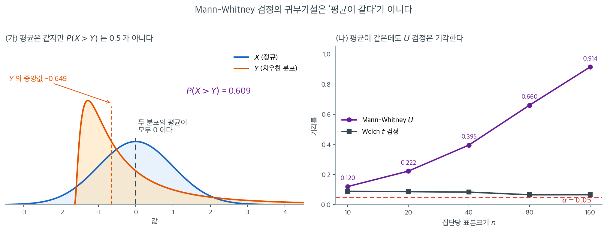

# 이표본 비모수 검정


## 1. Mann-Whitney U 검정 (Wilcoxon 순위합검정)

**Mann-Whitney U 검정**은 **Wilcoxon 순위합검정**이라고도 하며, 독립인 두 집단의 분포를 비교하는 비모수 통계 검정이다. 독립 이표본 t 검정 같은 모수적 검정의 가정이 충족되지 않을 때(예: 비정규성이나 순서형 자료) 특히 유용하다.

### 주요 특징

- **목적**: 독립인 두 집단의 분포가 같은지, 또는 한 집단이 다른 집단보다 큰(작은) 값을 갖는 경향이 있는지 검정한다.
- **가정**:
    - 두 집단이 서로 독립이다.
    - 관측값이 순서형, 구간형, 비율형이다(정규성은 필요 없다).
    - 두 표본이 무작위로 추출되었다.
- **귀무가설 ($H_0$)**: 두 집단이 같은 분포를 갖는다.
- **대립가설 ($H_1$)**: 분포가 다르거나 한 집단이 더 높은 값을 갖는 경향이 있다.

### 검정 원리

**1단계:** 두 집단의 자료를 모두 합쳐 값에 **순위**를 배정한다. 가장 작은 값이 순위 1, 두 번째가 순위 2 등이다. 동점이 있으면 동점 순위들의 평균을 배정한다.

**2단계:** 각 집단의 순위합을 계산한다.

- $R_1$: 집단 1의 순위합
- $R_2$: 집단 2의 순위합

**3단계:** 각 집단의 **U 통계량**을 계산한다.

$$U_1 = R_1 - \frac{n_1 (n_1 + 1)}{2}$$

$$U_2 = R_2 - \frac{n_2 (n_2 + 1)}{2}$$

여기서 $n_1$과 $n_2$는 집단 1과 2의 표본크기이다.

!!! warning "$U$의 정의는 교과서마다 다르다"
    어떤 문헌은 $U_1 = n_1 n_2 + \frac{n_1(n_1+1)}{2} - R_1$로 정의한다. 이는 위 정의의 $U_2$와 같다($n_1 n_2 - U_1 = U_2$). 두 관례 모두 $U = \min(U_1, U_2)$가 같으므로 **검정 결과에는 영향이 없다**.

    그러나 효과크기를 보고할 때는 차이가 난다. 이 책에서는 일관되게

    $$
    U_1 = R_1 - \frac{n_1(n_1+1)}{2} = \#\{(i,j) : X_i > Y_j\}
    $$

    를 쓰며, 따라서 $U_1/(n_1 n_2)$가 $P(X > Y)$의 추정값이다. 반대 관례를 쓰면 $P(X < Y)$가 된다. 어느 쪽을 썼는지 밝히지 않으면 방향이 뒤집힌 결론이 나온다.

**4단계:** Mann-Whitney U 통계량은

$$U = \min(U_1, U_2)$$

**5단계:** 유의성을 판정한다.

- 표본이 크면($n_1, n_2 > 20$) **정규근사**로 Z 점수를 쓴다.
- 표본이 작으면 $U$의 정확분포를 쓴다.

### 해석

- $p$값이 작으면(예: $p < 0.05$): $H_0$을 기각한다. 두 집단의 분포가 유의하게 다르다.
- $p$값이 크면: $H_0$을 기각하지 못한다. 차이의 증거가 없다.



여기서 반드시 짚어야 할 것이 있다. Mann-Whitney 검정을 "이표본 $t$ 검정의 비모수판"이라고 소개하면 $H_0$도 "두 평균이 같다"일 것 같지만 **그렇지 않다.** 그 차이가 실제로 결론을 뒤집는 상황이 위 그림이다.

(가)의 두 분포는 **평균이 둘 다 정확히 $0$이다.** 파란 $X$는 표준정규이고, 주황 $Y$는 로그정규분포에서 평균을 빼 중심을 맞춘 것이다. 그런데 $Y$는 왼쪽에 봉우리가 있고 오른쪽으로 긴 꼬리를 끄는 모양이라 중앙값이 $-0.649$로 훨씬 아래에 있다. 이 상태에서 두 분포에서 하나씩 뽑아 비교하면 $X$가 이길 확률이 $P(X > Y) = 0.609$로 $0.5$가 아니다. **$Y$는 가끔 아주 크지만 대부분의 날에는 $X$보다 작다.**

(나)가 그 결과다. 표본크기를 $10$에서 $160$까지 늘리며 기각률을 재면 Mann-Whitney는 $0.120 \to 0.222 \to 0.395 \to 0.660 \to 0.914$로 올라간다. 평균이 같은 자료인데 $n = 160$이면 $91\%$의 확률로 기각한다. 반면 Welch $t$ 검정은 $0.088 \to 0.086 \to 0.083 \to 0.065 \to 0.066$으로 명목수준 근처에 머문다. **두 검정이 다른 가설을 검정하고 있으므로 둘 다 옳다.**

실무적 결론은 명확하다. Mann-Whitney 검정이 유의하게 나왔을 때 "평균이 다르다"거나 "중앙값이 다르다"고 보고하면 틀릴 수 있다. 정확한 서술은 **"한 집단이 다른 집단보다 확률적으로 크다", 즉 $P(X > Y) \ne 0.5$**이며, 이것을 중앙값 비교로 읽으려면 두 분포의 모양이 같다는 위치이동 가정을 따로 정당화해야 한다. 효과크기로 $\hat{P}(X>Y) = U_1/(n_1 n_2)$를 함께 보고하면 이 혼동을 애초에 피할 수 있다.

### H_0이 기각되면 어느 집단이 더 큰가

각 집단의 **평균순위**를 비교한다. 평균순위가 높은 집단의 값이 큰 경향이 있다.

### 파이썬 구현

<div class="exbox" markdown>

**보기 1.** <span class="diff easy" title="쉬움"></span> 정확 p-값의 분자를 세어 본다. 두 교수법의 시험 점수가 집단 $A = (85, 78, 92, 88, 76, 95, 89, 82, 91, 87)$, 집단 $B = (72, 68, 81, 75, 70, 77, 74, 69, 73, 71)$ 로 각각 10개다. `scipy` 가 $U = 97$, $p = 0.000440$ 을 준다.

**(1)** 순위를 매겨 $R_1$, $U_1$, $U_2$ 를 손으로 구하고 $U_1 + U_2 = n_1 n_2$ 와 평균순위를 확인하시오. `scipy` 가 돌려준 $97$ 은 위 4단계의 $U = \min(U_1, U_2)$ 와 같은가.

**(2)** 동점이 하나도 없으므로 귀무분포를 **전수 열거**할 수 있다. 정확 양측 p-값을 분수로 적고, 정규근사가 왜 이 자리에서 여섯 배나 어긋나는지 말하시오.

</div>

??? success "풀이"

    **(1) 순위와 $U$.** 20개를 합쳐 늘어놓으면 동점이 하나도 없다.

    | 값 | 68 | 69 | 70 | 71 | 72 | 73 | 74 | 75 | 76 | 77 |
    |---|---|---|---|---|---|---|---|---|---|---|
    | 순위 | 1 | 2 | 3 | 4 | 5 | 6 | 7 | 8 | 9 | 10 |
    | 집단 | B | B | B | B | B | B | B | B | **A** | B |

    | 값 | 78 | 81 | 82 | 85 | 87 | 88 | 89 | 91 | 92 | 95 |
    |---|---|---|---|---|---|---|---|---|---|---|
    | 순위 | 11 | 12 | 13 | 14 | 15 | 16 | 17 | 18 | 19 | 20 |
    | 집단 | **A** | B | **A** | **A** | **A** | **A** | **A** | **A** | **A** | **A** |

    집단 $A$ 의 순위는 $9, 11, 13, 14, 15, 16, 17, 18, 19, 20$ 이므로

    $$
    R_1 = 152, \qquad R_2 = 210 - 152 = 58
    $$

    이고(검산: $R_1 + R_2 = N(N+1)/2 = 210$),

    $$
    U_1 = R_1 - \frac{n_1(n_1+1)}{2} = 152 - 55 = 97,
    \qquad
    U_2 = R_2 - \frac{n_2(n_2+1)}{2} = 58 - 55 = 3
    $$

    다. **검산은 $U_1 + U_2 = n_1 n_2$ 다**: $97 + 3 = 100 = 10 \times 10$. $\checkmark$ 평균순위는 $152/10 = 15.2$ 와 $58/10 = 5.8$ 이고 전체 평균순위 $(N+1)/2 = 10.5$ 를 사이에 둔다.

    **`scipy` 가 돌려준 $97$ 은 $U_1$ 이고 $\min(U_1, U_2) = 3$ 이 아니다.** `mannwhitneyu(x, y)` 는 늘 **첫 인수의** $U$ 를 준다. 양측검정에서는 어느 쪽을 쓰든 p-값이 같으므로 결론에 영향이 없지만, 효과크기를 읽을 때는 방향이 뒤집힌다. 여기서는 $\hat P(A > B) = U_1/(n_1n_2) = 0.97$ 이다 — **100 쌍 가운데 97 쌍에서 $A$ 가 이긴다.**

    **(2) 전수 열거.** $H_0$ 아래에서 집단 $A$ 가 받는 순위는 $\{1,\dots,20\}$ 의 크기 10 부분집합 가운데 아무 것이나 같은 확률이다. 그런 부분집합은

    $$
    \binom{20}{10} = 184{,}756
    $$

    개다. $\operatorname{E}[U] = n_1n_2/2 = 50$ 이고 관측된 치우침은 $\lvert 97 - 50 \rvert = 47$ 이다. 이만큼 또는 더 치우친 부분집합을 세면 **14개뿐**이다.

    $$
    p_{\text{정확}} = \frac{14}{184{,}756} = 7.5776 \times 10^{-5}
    $$

    정규근사는 $\operatorname{Var}(U) = n_1n_2(N+1)/12 = 100 \times 21/12 = 175$, $\sigma = 13.228757$ 에서

    $$
    z = \frac{47 - 0.5}{13.228757} = 3.515070
    \implies p = 2\Phi(-3.515070) = 4.3964 \times 10^{-4}
    $$

    로 **정확값의 5.8배**다. 까닭은 관측값이 귀무분포의 **극단 꼬리**에 있기 때문이다. $U$ 가 가질 수 있는 값은 $0$ 부터 $100$ 까지이고 관측값 $97$ 은 거의 끝이다. 정규분포는 중앙부에서 잘 맞고 꼬리로 갈수록 **상대오차**가 커진다. 다만 **절대오차는 $0.00036$ 으로 작다** — 어느 쪽을 쓰든 "$p < 0.001$" 이라는 결론은 같다. 자세한 이야기는 아래 연습문제 4 에 있다.

    **수치적으로.**

    ```python
    import numpy as np
    from scipy.stats import mannwhitneyu, rankdata

    # 두 교수법의 시험 점수를 견준다.
    group_a = np.array([85, 78, 92, 88, 76, 95, 89, 82, 91, 87])
    group_b = np.array([72, 68, 81, 75, 70, 77, 74, 69, 73, 71])

    # Mann-Whitney U 는 이표본 t 검정의 비모수 대응이다. 귀무가설이 "두 평균이
    # 같다"가 아니라 "무작위로 뽑은 A 가 B 보다 클 확률이 1/2"이라는 점에 주의한다.
    stat, p_value = mannwhitneyu(group_a, group_b, alternative='two-sided')

    print(f"U statistic: {stat}")        # 97.0
    print(f"P-value: {p_value:.6f}")     # 0.000440  (asymptotic)

    # 표본이 작고 동점이 없으면 정확분포를 쓸 수 있다. 근사값과 꽤 갈린다.
    print(mannwhitneyu(group_a, group_b, method='exact').pvalue)   # 7.58e-05

    # 유의하다는 결론이 났을 때 어느 쪽이 큰지는 평균순위로 말한다.
    # 동점에 중간순위를 주려면 argsort 가 아니라 rankdata 를 써야 한다.
    combined = np.concatenate([group_a, group_b])
    ranks = rankdata(combined)
    mean_rank_a = ranks[:len(group_a)].mean()
    mean_rank_b = ranks[len(group_a):].mean()
    print(f"Mean rank Group A: {mean_rank_a:.1f}")   # 15.2
    print(f"Mean rank Group B: {mean_rank_b:.1f}")   # 5.8

    alpha = 0.05
    if p_value < alpha:
        print("Reject H0: Significant difference between groups.")
        if mean_rank_a > mean_rank_b:
            print("Group A tends to have larger values.")
        else:
            print("Group B tends to have larger values.")
    else:
        print("Fail to reject H0.")
    ```

    출력:

    ```
    U statistic: 97.0
    P-value: 0.000440
    7.577561757128321e-05
    Mean rank Group A: 15.2
    Mean rank Group B: 5.8
    Reject H0: Significant difference between groups.
    Group A tends to have larger values.
    ```

    ```python
    import itertools
    import math
    from scipy import stats

    n1, n2 = len(group_a), len(group_b)
    N = n1 + n2
    R1, R2 = ranks[:n1].sum(), ranks[n1:].sum()
    U1 = R1 - n1 * (n1 + 1) / 2
    U2 = R2 - n2 * (n2 + 1) / 2
    print(f"R1 = {R1},  R2 = {R2},  합 = {R1 + R2}  (N(N+1)/2 = {N * (N + 1) / 2})")
    print(f"U1 = {U1},  U2 = {U2},  합 = {U1 + U2}  (n1*n2 = {n1 * n2})")
    print(f"min(U1, U2) = {min(U1, U2)}   <- scipy 가 돌려준 것은 U1 = {stat}")
    print(f"P(A > B) 추정 = U1/(n1 n2) = {U1 / (n1 * n2)}")

    # 귀무분포를 전수 열거한다. C(20, 10) = 184756 가지뿐이다.
    total = math.comb(N, n1)
    Us = np.array([sum(c) for c in itertools.combinations(range(1, N + 1), n1)]) \
         - n1 * (n1 + 1) / 2
    E = n1 * n2 / 2
    V = n1 * n2 * (N + 1) / 12
    hit = int((np.abs(Us - E) >= abs(U1 - E)).sum())
    print(f"\n열거한 가지 수 {total},  평균 {Us.mean()},  분산 {Us.var()}"
          f"  (공식: {E}, {V})")
    print(f"|U - {E:.0f}| >= {abs(U1 - E):.0f} 인 것 {hit} 개"
          f"  ->  정확 p = {hit}/{total} = {hit / total:.6e}")
    print(f"scipy method='exact' : {mannwhitneyu(group_a, group_b, method='exact').pvalue:.6e}")

    z = (abs(U1 - E) - 0.5) / np.sqrt(V)
    print(f"\nsigma = {np.sqrt(V):.6f},  z = {z:.6f},"
          f"  정규근사 p = {2 * stats.norm.sf(z):.6e}")
    print(f"근사/정확 = {2 * stats.norm.sf(z) / (hit / total):.2f} 배,"
          f"  절대차 = {2 * stats.norm.sf(z) - hit / total:.6f}")
    ```

    출력:

    ```
    R1 = 152.0,  R2 = 58.0,  합 = 210.0  (N(N+1)/2 = 210.0)
    U1 = 97.0,  U2 = 3.0,  합 = 100.0  (n1*n2 = 100)
    min(U1, U2) = 3.0   <- scipy 가 돌려준 것은 U1 = 97.0
    P(A > B) 추정 = U1/(n1 n2) = 0.97

    열거한 가지 수 184756,  평균 50.0,  분산 175.0  (공식: 50.0, 175.0)
    |U - 50| >= 47 인 것 14 개  ->  정확 p = 14/184756 = 7.577562e-05
    scipy method='exact' : 7.577562e-05
    
    sigma = 13.228757,  z = 3.515070,  정규근사 p = 4.396388e-04
    근사/정확 = 5.80 배,  절대차 = 0.000364
    ```

    **열거한 귀무분포의 평균 $50$ 과 분산 $175$ 가 공식과 정확히 같고, $14/184756$ 이 `scipy` 의 정확 p-값과 같다.** 분자가 14 라는 것은 뜻이 분명하다 — $A$ 의 열 명이 이만큼 윗자리를 차지하는 배치가 18만 여 가지 가운데 열네 가지뿐이라는 것이다. 정규근사는 $5.80$ 배 크게 보고하지만 절대차가 $0.00036$ 이므로 결론은 흔들리지 않는다.

    남는 교훈은 **`scipy` 가 $\min(U_1,U_2)$ 가 아니라 $U_1$ 을 준다**는 것이다. 위 4단계의 관례와 다르다. 양측 p-값은 같으니 검정 결과는 안전하지만, $U/(n_1n_2)$ 를 효과크기로 보고할 때 어느 집단을 첫 인수로 넣었는지 확인하지 않으면 $0.97$ 과 $0.03$ 을 뒤바꿔 적게 된다.

!!! warning "`argsort(argsort(x))`는 동점을 처리하지 못한다"
    순위를 구할 때 `np.argsort(np.argsort(x)) + 1`을 쓰는 코드를 흔히 본다. 동점이 없으면 맞지만, 동점이 있으면 **중간순위 대신 임의의 순서**를 배정한다.

    ```python
    import numpy as np
    from scipy.stats import rankdata
    x = np.array([3, 1, 3, 2])
    print(np.argsort(np.argsort(x)) + 1)   # [3 1 4 2]  ← 두 3에 3과 4를 배정
    print(rankdata(x))                     # [3.5 1.  3.5 2. ]  ← 올바른 중간순위
    ```

    출력:

    ```
    [3 1 4 2]
    [3.5 1.  3.5 2. ]
    ```

    항상 `scipy.stats.rankdata`를 쓴다.

### 동치성에 관한 참고

Mann-Whitney U 검정과 Wilcoxon 순위합검정은 **통계적으로 동치**이다. 용어의 선택은 소프트웨어에 따라 다른 경우가 많다.

- **SPSS**: "Mann-Whitney U test"
- **R**: "Wilcoxon rank-sum test" (`wilcox.test`)
- **Python scipy**: `mannwhitneyu` 또는 `ranksums`

---

## 2. Mood 중앙값검정

**Mood 중앙값검정**은 둘 이상 집단의 중앙값을 비교하는 비모수 가설검정이다. 평균이나 분산이 아니라 오직 중앙값에 집중하므로 자료가 비정규이거나 순서형이거나 이상치를 포함할 때 특히 유용하다.

### 주요 특징

- **비모수**: 분포에 대한 가정이 필요 없다.
- **이상치에 로버스트**: 중앙값에 집중한다.
- **둘 이상의 집단에 적용 가능**.
- **귀무가설 ($H_0$)**: 모든 집단의 중앙값이 같다.
- **대립가설 ($H_1$)**: 적어도 한 집단의 중앙값이 다르다.

### 가정

1. 표본들이 독립이다.
2. 자료가 연속형 또는 순서형이다.
3. 각 집단이 모집단에서 뽑은 확률표본이다.

### 작동 방식

**1단계:** 합친 자료 전체의 중앙값을 계산한다.

**2단계:** 각 집단에서 자료점을 전체 중앙값보다 "위" 또는 "아래"로 분류한다.

**3단계:** 각 집단의 중앙값 위·아래 도수를 담은 분할표를 만든다.

**4단계:** 분할표에 카이제곱 독립성 검정을 적용한다.

$$\chi^2 = \sum \frac{(O - E)^2}{E}$$

여기서 $O$는 관측도수, $E$는 귀무가설 아래의 기대도수이다.

**5단계:** $p$값으로 유의성을 판정한다.

<div class="exbox" markdown>

**보기 2.** <span class="diff easy" title="쉬움"></span> $5 + 5$ 에서 중앙값검정이 낼 수 있는 p-값은 몇 개인가. 두 학생 집단의 중앙값 시험점수를 비교한다.

- 집단 A: $[50, 55, 60, 65, 70]$
- 집단 B: $[45, 50, 55, 60, 65]$

**(1)** 위 1~5단계를 손으로 밟아 전체 중앙값, 분할표, $\chi^2$, p-값을 구하시오.

**(2)** $n_1 = n_2 = 5$ 이고 중앙값과 같은 값이 없으면 **분할표가 몇 가지밖에 안 된다.** 모두 열거해 이 검정이 낼 수 있는 p-값 전부를 적고, $\alpha = 0.05$ 에서 기각하려면 자료가 어떠해야 하는지 말하시오.

</div>

??? success "풀이"

    **(1) 다섯 단계를 밟는다.**

    **1단계.** 열 개를 합쳐 정렬하면 $45, 50, 50, 55, 55, 60, 60, 65, 65, 70$ 이다. $N = 10$ 이 짝수이므로 전체 중앙값은 5번째와 6번째의 평균

    $$
    \text{전체 중앙값} = \frac{55 + 60}{2} = 57.5
    $$

    다. **관측값 가운데 $57.5$ 와 같은 것은 하나도 없으므로** 동점을 어떻게 다룰지 고민할 필요가 없다.

    **2단계.** $A$ 에서 $57.5$ 보다 큰 것은 $60, 65, 70$ 셋, 작은 것은 $50, 55$ 둘이다. $B$ 에서 큰 것은 $60, 65$ 둘, 작은 것은 $45, 50, 55$ 셋이다.

    **3단계.**

    | | 집단 A | 집단 B | 합 |
    |---|---|---|---|
    | $> 57.5$ | 3 | 2 | 5 |
    | $< 57.5$ | 2 | 3 | 5 |
    | 합 | 5 | 5 | 10 |

    **4단계.** 행합과 열합이 모두 $5$ 이므로 기대도수는 네 칸 모두 $5 \times 5/10 = 2.5$ 다. 보정 없이

    $$
    \chi^2 = 4 \times \frac{(3 - 2.5)^2}{2.5} = \frac{4 \times 0.25}{2.5} = 0.4
    $$

    **5단계.** 자유도 $(2-1)(2-1) = 1$ 에서 $p = P(\chi^2_1 > 0.4) = 0.527089$ 다. 기각하지 못한다.

    **(2) 가능한 분할표는 여섯 가지뿐이다.** $N = 10$ 을 전체 중앙값으로 자르면 위가 정확히 5개, 아래가 정확히 5개다. 각 집단의 크기도 5 이므로 **네 변의 합이 모두 5 로 고정된다.** 따라서 왼쪽 위 칸의 값 $a$ 하나만 정하면 표가 결정된다.

    $$
    T(a) = \begin{pmatrix} a & 5-a \\ 5-a & a \end{pmatrix},
    \qquad a = 0, 1, 2, 3, 4, 5
    $$

    기대도수는 늘 $2.5$ 이므로

    $$
    \chi^2(a) = 4 \times \frac{(a - 2.5)^2}{2.5} = 1.6\,(a - 2.5)^2
    $$

    이고, 예이츠 보정을 넣으면 $\chi^2_Y(a) = 1.6\,(\lvert a - 2.5 \rvert - 0.5)^2$ 다.

    | $a$ | 분할표 | $\chi^2$ | $p$ | $\chi^2_Y$ | $p_Y$ |
    |---|---|---|---|---|---|
    | 0 또는 5 | $\begin{pmatrix} 5 & 0 \\ 0 & 5\end{pmatrix}$ | 10.0 | 0.001565 | 6.4 | 0.011412 |
    | 1 또는 4 | $\begin{pmatrix} 4 & 1 \\ 1 & 4\end{pmatrix}$ | 3.6 | 0.057780 | 1.6 | 0.205903 |
    | 2 또는 3 | $\begin{pmatrix} 3 & 2 \\ 2 & 3\end{pmatrix}$ | 0.4 | 0.527089 | 0.0 | 1.000000 |

    **이 검정이 낼 수 있는 p-값은 단 세 개다.** 보정 없이 $\{0.001565,\ 0.057780,\ 0.527089\}$, 보정하면 $\{0.011412,\ 0.205903,\ 1.000000\}$ 이다. 그러므로 $\alpha = 0.05$ 에서 기각하려면 **$a = 0$ 또는 $a = 5$, 곧 한 집단이 전체 중앙값 위를 전부 차지해야 한다.** 다섯 명씩으로는 두 집단이 완전히 분리되지 않는 한 유의할 수 없다.

    이 자료는 $A$ 가 $B$ 를 정확히 $5$ 만큼 평행이동한 것이다 — $A = B + 5$ 로 **구조가 뚜렷하다.** 그런데도 $a = 3$ 이 되어 두 번째로 큰 p-값을 받는다. **관측값이 겹치면 중앙값 위아래로 자르는 일만으로는 그 구조를 잡아낼 수 없다.**

    **수치적으로.**

    ```python
    import numpy as np
    from scipy import stats

    a = np.array([50, 55, 60, 65, 70])
    b = np.array([45, 50, 55, 60, 65])
    allv = np.concatenate([a, b])
    gm = np.median(allv)
    print(f"정렬 {np.sort(allv).tolist()}  ->  전체 중앙값 {gm}")
    print(f"= {gm} 인 관측값 {int((allv == gm).sum())} 개")
    print(f"A: 위 {int((a > gm).sum())}, 아래 {int((a < gm).sum())}  |  "
          f"B: 위 {int((b > gm).sum())}, 아래 {int((b < gm).sum())}")

    print("\n가능한 분할표를 모두 열거한다")
    for k in range(6):
        T = np.array([[k, 5 - k], [5 - k, k]])
        c0 = stats.chi2_contingency(T, correction=False)
        c1 = stats.chi2_contingency(T, correction=True)
        print(f"  a={k}  {T.tolist()}   chi2 = {c0.statistic:6.2f}, p = {c0.pvalue:.6f}"
              f"   |  Yates chi2 = {c1.statistic:5.2f}, p = {c1.pvalue:.6f}")
    print(f"\nscipy median_test: {stats.median_test(a, b)}")
    ```

    출력:

    ```
    정렬 [45, 50, 50, 55, 55, 60, 60, 65, 65, 70]  ->  전체 중앙값 57.5
    = 57.5 인 관측값 0 개
    A: 위 3, 아래 2  |  B: 위 2, 아래 3

    가능한 분할표를 모두 열거한다
      a=0  [[0, 5], [5, 0]]   chi2 =  10.00, p = 0.001565   |  Yates chi2 =  6.40, p = 0.011412
      a=1  [[1, 4], [4, 1]]   chi2 =   3.60, p = 0.057780   |  Yates chi2 =  1.60, p = 0.205903
      a=2  [[2, 3], [3, 2]]   chi2 =   0.40, p = 0.527089   |  Yates chi2 =  0.00, p = 1.000000
      a=3  [[3, 2], [2, 3]]   chi2 =   0.40, p = 0.527089   |  Yates chi2 =  0.00, p = 1.000000
      a=4  [[4, 1], [1, 4]]   chi2 =   3.60, p = 0.057780   |  Yates chi2 =  1.60, p = 0.205903
      a=5  [[5, 0], [0, 5]]   chi2 =  10.00, p = 0.001565   |  Yates chi2 =  6.40, p = 0.011412
    
    scipy median_test: MedianTestResult(statistic=0.0, pvalue=1.0, median=57.5, table=array([[3, 2],
           [2, 3]]))
    ```

    **손계산 $\chi^2 = 0.4$, $p = 0.527089$ 가 열거표의 $a = 3$ 줄과 같고, `scipy` 의 `median_test` 는 예이츠 보정을 기본으로 쓰므로 $\chi^2 = 0$, $p = 1.0$ 을 준다.** 세 가지 p-값만 가능하다는 것도 열거로 확인된다.

    이것이 중앙값검정의 **이산성**이다. 관측값 열 개를 두 칸짜리 표로 뭉개 버리면 자료가 가진 정보가 "$a$ 가 몇인가" 하나로 줄어들고, 그 $a$ 가 여섯 값만 가지므로 p-값도 여섯 — 대칭이니 실은 세 — 개만 가능하다. 아래 보기 3 이 이 여섯 칸 가운데 $a = 3$ 을 코드로 다시 확인한다.

### 파이썬 구현

<div class="exbox" markdown>

**보기 3.** <span class="diff easy" title="쉬움"></span> 명목수준 $0.05$, 실제 수준 $0.0079$. 앞 보기와 같은 자료를 직접 구현한 중앙값검정에 넣으면 예이츠 보정에서 $\chi^2 = 0$, $p = 1$ 이고 보정을 빼면 $\chi^2 = 0.4$, $p = 0.527$ 이 나온다.

**(1)** 보정이 $\chi^2$ 을 정확히 $0$ 으로 만드는 것이 우연인지 손으로 따져 보시오. 이 구현이 전체 중앙값과 **같은** 값을 버린다는 점은 이 자료에서 문제가 되는가.

**(2)** 주변합이 모두 $5$ 로 고정된 $2 \times 2$ 표이므로 피셔 정확검정을 쓸 수 있다. 보정·비보정·피셔 세 p-값을 견주고, 명목수준 $0.05$ 검정의 **실제 수준**을 열거로 구하시오.

</div>

??? success "풀이"

    **(1) 우연이 아니다.** 주변합이 모두 $5$ 이므로 기대도수는 네 칸 모두 $2.5$ 이고, 관측도수가 $(3,2,2,3)$ 이므로 **모든 칸에서 편차가 정확히 $\lvert O - E \rvert = 0.5$ 다.** 예이츠 보정은 그 편차에서 $0.5$ 를 깎는다.

    $$
    \chi^2_Y = \sum \frac{(\lvert O - E \rvert - 0.5)^2}{E}
    = 4 \times \frac{(0.5 - 0.5)^2}{2.5} = 0
    $$

    분자가 네 칸 모두 $0$ 이 되어 버린다. 앞 보기의 열거표에서 $a = 2$ 와 $a = 3$ 줄이 $\chi^2_Y = 0$ 인 것이 바로 이것이다. **$\chi^2_Y = 0$ 은 "두 집단이 완벽히 같다"는 뜻이 아니라 "편차가 보정량보다 크지 않다"는 뜻이다.** 보정이 편차를 다 먹어 치운 자리다.

    중앙값과 같은 값을 버리는 문제는 **이 자료에서는 일어나지 않는다.** 전체 중앙값 $57.5$ 는 두 관측값 $55$ 와 $60$ 의 평균이라 관측값 가운데 $57.5$ 인 것이 없다. $N$ 이 짝수이고 가운데 두 값이 다르면 늘 이렇게 된다. 반면 $N$ 이 홀수이거나 가운데 두 값이 같으면 전체 중앙값이 관측값과 일치해 이 구현이 자료를 버린다 — 아래 연습문제 2 가 그 경우를 다룬다.

    **(2) 세 p-값과 실제 수준.** 관측된 표 $a = 3$ 에서

    | 방법 | $p$ |
    |---|---|
    | $\chi^2$, 보정 없음 | 0.527089 |
    | $\chi^2$, 예이츠 보정 | 1.000000 |
    | 피셔 정확 | 1.000000 |

    로 셋 다 기각과는 거리가 멀다. 세 방법이 갈리는 곳은 **꼬리**다. 가장 치우친 표 $a = 5$ 에서

    $$
    p_{\text{보정 없음}} = 0.001565,
    \qquad
    p_{\text{예이츠}} = 0.011412,
    \qquad
    p_{\text{피셔}} = 0.007937
    $$

    이다. **피셔가 참값이므로, 보정 없는 $\chi^2$ 은 5배 작게(위험한 쪽으로) 보고하고 예이츠는 1.4배 크게(안전한 쪽으로) 보고한다.** 둘 다 참값을 비껴가지만 방향이 반대다.

    실제 수준은 **기각역을 정하고 그 확률을 세면** 나온다. $H_0$ 아래에서 주변합이 고정되면 $a$ 는 초기하분포를 따른다.

    $$
    P(a = k) = \frac{\binom{5}{k}\binom{5}{5-k}}{\binom{10}{5}},
    \qquad
    \left(\tfrac{1}{252},\ \tfrac{25}{252},\ \tfrac{100}{252},\ \tfrac{100}{252},\ \tfrac{25}{252},\ \tfrac{1}{252}\right)
    $$

    앞 보기의 열거표를 보면 $p \leq 0.05$ 가 되는 것은 세 방법 모두 $a \in \{0, 5\}$ 뿐이다(보정 없는 $\chi^2$ 조차 $a \in \{1,4\}$ 에서 $0.057780 > 0.05$ 다). **따라서 세 방법의 기각역이 똑같고**

    $$
    \text{실제 수준} = P(a = 0) + P(a = 5) = \frac{2}{252} = 0.007937
    $$

    이다. **명목 $0.05$ 의 6분의 1 도 안 된다.** 피셔의 $a = 5$ p-값 $0.007937$ 이 이 수와 같은 것은 우연이 아니다 — 가장 치우친 표의 정확 p-값이 곧 그 표만 기각하는 검정의 크기다.

    이산검정에서는 이렇게 **명목수준을 쓸 수가 없다.** $0.05$ 를 요구해도 실제로는 $0.0079$ 짜리 검정을 돌리게 되고, 그만큼 검정력을 잃는다. 어느 보정을 쓰느냐는 p-값의 숫자만 바꿀 뿐 여기서는 결론을 하나도 바꾸지 않는다.

    **수치적으로.**

    ```python
    import numpy as np
    from scipy.stats import chi2_contingency

    def moods_median_test(*groups, correction=True):
        """Mood 의 중앙값 검정. 여러 집단의 중앙값을 견준다.

        자료 전체의 중앙값을 구한 뒤, 집단마다 그보다 큰 값과 작은 값의 개수를
        세어 분할표를 만들고 카이제곱 검정을 돌린다. 값을 "위/아래" 둘로만
        나누므로 순위검정보다도 정보를 더 버리고, 그만큼 검정력이 낮다.
        대신 가정이 거의 없어 아주 거친 자료에도 쓸 수 있다.

        매개변수
        --------
        groups : 집단을 나타내는 배열 여럿
        correction : Yates 연속성 보정 여부 (2x2 표에서만 뜻이 있다)

        돌려주는 값
        ----------
        chi2_stat, p_value, contingency_table
        """
        # 전체 중앙값을 기준선으로 삼는다.
        combined_data = np.concatenate(groups)
        overall_median = np.median(combined_data)

        contingency_table = []
        for group in groups:
            # 중앙값과 정확히 같은 값은 어느 쪽에도 넣지 않는다.
            above_median = np.sum(group > overall_median)
            below_median = np.sum(group < overall_median)
            contingency_table.append([above_median, below_median])

        contingency_table = np.array(contingency_table).T
        chi2_stat, p_value, _, _ = chi2_contingency(contingency_table,
                                                    correction=correction)

        return chi2_stat, p_value, contingency_table

    # 예시 자료
    group_a = np.array([50, 55, 60, 65, 70])
    group_b = np.array([45, 50, 55, 60, 65])

    # 보정 여부에 따라 p-값이 꽤 갈린다. 2x2 표에서 표본이 작을 때 그렇다.
    for corr in (True, False):
        chi2_stat, p_value, table = moods_median_test(group_a, group_b,
                                                      correction=corr)
        print(f"correction={corr}: chi2={chi2_stat:.4f}, p={p_value:.4f}")
    print(f"Contingency Table:\n{table}")
    ```

    출력:

    ```
    correction=True: chi2=0.0000, p=1.0000
    correction=False: chi2=0.4000, p=0.5271
    Contingency Table:
    [[3 2]
     [2 3]]
    ```

    ```python
    import math
    from scipy.stats import fisher_exact

    T = np.array([[3, 2], [2, 3]])
    E = np.outer(T.sum(1), T.sum(0)) / T.sum()
    print(f"기대도수 {E.tolist()},  |O - E| = {np.abs(T - E).tolist()}")
    print(f"예이츠 분자 (|O-E| - 0.5)^2 = {((np.abs(T - E) - 0.5) ** 2).tolist()}")

    print(f"\n관측된 표 a=3")
    print(f"  보정 없음 p = {chi2_contingency(T, correction=False).pvalue:.6f}")
    print(f"  예이츠    p = {chi2_contingency(T, correction=True).pvalue:.6f}")
    print(f"  피셔      p = {fisher_exact(T).pvalue:.6f}")

    T5 = np.array([[5, 0], [0, 5]])
    print(f"가장 치우친 표 a=5")
    print(f"  보정 없음 p = {chi2_contingency(T5, correction=False).pvalue:.6f}")
    print(f"  예이츠    p = {chi2_contingency(T5, correction=True).pvalue:.6f}")
    print(f"  피셔      p = {fisher_exact(T5).pvalue:.6f}")

    # H0 아래에서 a 의 분포(초기하)와 alpha=0.05 검정의 실제 수준
    probs = np.array([math.comb(5, k) * math.comb(5, 5 - k) / math.comb(10, 5)
                      for k in range(6)])
    print(f"\nP(a = k) = {[f'{p:.6f}' for p in probs]}"
          f"   분자 {[math.comb(5, k) * math.comb(5, 5 - k) for k in range(6)]} / {math.comb(10, 5)}")
    for name, pv in (("보정 없음", [chi2_contingency(np.array([[k, 5 - k], [5 - k, k]]),
                                                  correction=False).pvalue for k in range(6)]),
                     ("예이츠   ", [chi2_contingency(np.array([[k, 5 - k], [5 - k, k]]),
                                                  correction=True).pvalue for k in range(6)]),
                     ("피셔     ", [fisher_exact(np.array([[k, 5 - k], [5 - k, k]])).pvalue
                                   for k in range(6)])):
        rej = [k for k in range(6) if pv[k] <= 0.05]
        print(f"  {name}: 기각역 a in {rej},  실제 수준 = {probs[rej].sum():.6f}")
    ```

    출력:

    ```
    기대도수 [[2.5, 2.5], [2.5, 2.5]],  |O - E| = [[0.5, 0.5], [0.5, 0.5]]
    예이츠 분자 (|O-E| - 0.5)^2 = [[0.0, 0.0], [0.0, 0.0]]

    관측된 표 a=3
      보정 없음 p = 0.527089
      예이츠    p = 1.000000
      피셔      p = 1.000000
    가장 치우친 표 a=5
      보정 없음 p = 0.001565
      예이츠    p = 0.011412
      피셔      p = 0.007937

    P(a = k) = ['0.003968', '0.099206', '0.396825', '0.396825', '0.099206', '0.003968']   분자 [1, 25, 100, 100, 25, 1] / 252
      보정 없음: 기각역 a in [0, 5],  실제 수준 = 0.007937
      예이츠   : 기각역 a in [0, 5],  실제 수준 = 0.007937
      피셔     : 기각역 a in [0, 5],  실제 수준 = 0.007937
    ```

    **예이츠 분자가 네 칸 모두 정확히 $0$ 이라는 것이 손계산과 맞는다.** 그리고 세 방법의 기각역이 모두 $\{0, 5\}$ 로 같아 **실제 수준이 셋 다 $0.007937$** 이다. 명목 $0.05$ 의 $16\%$ 밖에 되지 않는다.

    여기서 거꾸로 읽어야 할 것이 있다. 보정 논쟁은 p-값의 **숫자**를 두고 벌어지지만, 이 자료에서 보듯 숫자가 다섯 배 달라져도 **결정은 한 글자도 바뀌지 않는다.** 결정을 바꾸는 것은 보정이 아니라 자료의 이산성이다. $5 + 5$ 로는 완전 분리가 아니면 기각할 수 없다는 사실이 어떤 보정보다 중요하다.

!!! warning "SciPy는 $2\times2$ 표에 Yates 보정을 기본으로 적용한다"
    `chi2_contingency`의 `correction` 인자는 $2 \times 2$ 표에서 **기본값이 `True`**이다. 위 자료에서 Yates 보정을 적용하면 $\chi^2 = 0$, $p = 1$이 되고, 적용하지 않으면 $\chi^2 = 0.4$, $p = 0.527$이 된다.

    보정이 이렇게 극단적으로 작동하는 이유는 관측도수가 $(3, 2, 2, 3)$이고 기대도수가 모두 $2.5$여서, 각 칸의 편차 $|O - E| = 0.5$가 Yates 보정량 $0.5$와 정확히 같기 때문이다. 보정 후 분자가 $0$이 된다.

    `scipy.stats.median_test`도 기본적으로 보정을 적용하여 $p = 1.0$을 반환한다. 어느 쪽이든 이 자료에서는 기각하지 않으므로 결론은 같다.

**해석**: 두 경우 모두 $p$값이 $0.05$보다 크므로 귀무가설을 기각하지 못한다. 중앙값에 유의한 차이가 없다.

### 장점과 한계

| 장점 | 한계 |
|---|---|
| 이상치에 로버스트하다 | 집단 내 변동을 무시한다 |
| 비모수적이다 | 모수적 검정에 비해 검정력이 낮다 |
| 구현이 간단하다 | 독립성을 요구한다 |
| 여러 집단에 쓸 수 있다 | 중앙값과 같은 값을 버린다 |

---

## 3. Kruskal-Wallis 검정

**Kruskal-Wallis 검정**은 일원분산분석의 비모수 확장으로, 독립인 세 집단 이상의 분포를 비교하는 데 쓰인다.

### 주요 특징

- **목적**: 셋 이상 집단의 중앙값(또는 분포)이 다른지 검정한다.
- **귀무가설**: 모든 집단이 같은 분포를 갖는다.
- **대립가설**: 적어도 한 집단이 다르다.
- **관계**: 집단이 둘뿐이면 Kruskal-Wallis 검정은 Mann-Whitney U 검정과 동치이다.

### 검정통계량

$$H = \frac{12}{N(N+1)} \sum_{i=1}^{k} \frac{R_i^2}{n_i} - 3(N+1)$$

여기서 $N$은 전체 관측값 개수, $k$는 집단 수, $n_i$는 집단 $i$의 크기, $R_i$는 집단 $i$의 순위합이다.

$H_0$ 아래에서 $H$는 근사적으로 자유도 $k - 1$인 $\chi^2$ 분포를 따른다.

### 파이썬 구현

<div class="exbox" markdown>

**보기 4.** <span class="diff easy" title="쉬움"></span> $N = 15$ 에서 $\chi^2$ 근사는 얼마나 믿을 만한가. 집단 셋이 각각 다섯 개씩이고 `kruskal` 이 $H = 9.4136$, $p = 0.0090$ 을 준다.

**(1)** 순위합을 구해 $H$ 를 손으로 계산하시오. 이 자료에 동점이 있는가. 있다면 보정을 넣어 `scipy` 의 값과 맞추시오.

**(2)** $N = 15$ 를 셋으로 나누는 방법은 $756{,}756$ 가지뿐이므로 귀무분포를 **전수 열거**할 수 있다. 정확 p-값을 구해 $\chi^2_2$ 근사와 견주시오.

</div>

??? success "풀이"

    **(1) 순위와 $H$.** 15개 값을 합쳐 늘어놓으면 $88$ 이 두 개($A$ 와 $C$ 에 각각 하나), $92$ 가 두 개($A$ 와 $C$ 에 각각 하나) 있다. **동점이 있으므로 중간순위를 준다.**

    | 값 | 68 | 70 | 72 | 75 | 76 | 78 | 81 | 85 | 87 | 88 | 88 | 90 | 92 | 92 | 95 |
    |---|---|---|---|---|---|---|---|---|---|---|---|---|---|---|---|
    | 순위 | 1 | 2 | 3 | 4 | 5 | 6 | 7 | 8 | 9 | 10.5 | 10.5 | 12 | 13.5 | 13.5 | 15 |
    | 집단 | B | B | B | B | A | A | B | A | C | A | C | C | A | C | C |

    $$
    R_A = 5 + 6 + 8 + 10.5 + 13.5 = 43,
    \quad
    R_B = 1 + 2 + 3 + 4 + 7 = 17,
    \quad
    R_C = 9 + 10.5 + 12 + 13.5 + 15 = 60
    $$

    검산: $43 + 17 + 60 = 120 = 15 \times 16/2$. $\checkmark$ 평균순위는 $8.6$, $3.4$, $12.0$ 이고 전체 평균순위 $8$ 을 사이에 둔다. $B$ 가 가장 아래, $C$ 가 가장 위다.

    $$
    H = \frac{12}{15 \times 16}\left(\frac{43^2}{5} + \frac{17^2}{5} + \frac{60^2}{5}\right) - 3 \times 16
      = 0.05 \times (369.8 + 57.8 + 720) - 48
      = 57.38 - 48
      = 9.38
    $$

    **`scipy` 는 $9.4136$ 을 준다.** 차이는 동점 보정이다. $t = 2$ 인 묶음이 둘이므로

    $$
    \sum_j (t_j^3 - t_j) = 6 + 6 = 12,
    \qquad
    C = 1 - \frac{12}{15^3 - 15} = 1 - \frac{12}{3360} = 0.996429
    $$

    $$
    H_{\text{보정}} = \frac{9.38}{0.996429} = 9.413620
    $$

    로 `scipy` 와 소수 여섯째 자리까지 같다. $\chi^2_2$ 근사 p-값은 $P(\chi^2_2 > 9.413620) = 0.009034$ 다.

    **(2) 전수 열거.** $H_0$ 아래에서 15개 중간순위를 다섯 개씩 세 집단에 나누는 모든 방법이 같은 확률이다. 그런 방법은

    $$
    \binom{15}{5}\binom{10}{5} = 3003 \times 252 = 756{,}756
    $$

    가지다. 각 배치의 $H$ 를 계산해 관측값 이상인 것을 세면 **1890 개**다.

    $$
    p_{\text{정확}} = \frac{1890}{756{,}756} = \frac{5}{2002} = 0.0024975
    $$

    **$\chi^2_2$ 근사의 $0.009034$ 가 정확값의 3.6배다.** 근사가 **보수적인** 쪽으로 틀렸다. 다섯 개씩 세 집단에서 $\chi^2$ 근사가 신뢰할 만하지 않다는 것이 이렇게 수로 드러난다. 다만 두 값 모두 $0.05$ 아래이므로 **결론은 바뀌지 않는다** — 오히려 정확검정이 더 강하게 기각한다.

    보정인자 $C$ 가 모든 배치에 같은 상수이므로 $H$ 와 $H/C$ 의 순서가 같고, 따라서 **동점 보정을 넣든 안 넣든 정확 p-값은 똑같다.** 보정은 $\chi^2$ 근사를 쓸 때만 뜻이 있다.

    **수치적으로.**

    ```python
    from scipy.stats import kruskal

    group_a = [85, 78, 92, 88, 76]
    group_b = [72, 68, 81, 75, 70]
    group_c = [90, 95, 88, 92, 87]

    # Kruskal-Wallis 는 일원배치 분산분석의 비모수 대응이다. 집단이 셋 이상일
    # 때 쓰며, Mann-Whitney U 를 여러 집단으로 넓힌 것이라고 보면 된다.
    stat, p_value = kruskal(group_a, group_b, group_c)

    print(f"H statistic: {stat:.4f}")   # 9.4136
    print(f"P-value: {p_value:.4f}")    # 0.0090

    alpha = 0.05
    if p_value < alpha:
        print("Reject H0: At least one group differs significantly.")
    else:
        print("Fail to reject H0.")
    ```

    출력:

    ```
    H statistic: 9.4136
    P-value: 0.0090
    Reject H0: At least one group differs significantly.
    ```

    ```python
    import itertools
    import math
    from collections import Counter

    import numpy as np
    from scipy import stats

    allv = np.array(group_a + group_b + group_c)
    N = len(allv)
    r = stats.rankdata(allv)
    R = [r[0:5].sum(), r[5:10].sum(), r[10:15].sum()]
    print(f"순위  {r.tolist()}")
    print(f"동점  {[(k, v) for k, v in sorted(Counter(allv.tolist()).items()) if v > 1]}")
    print(f"R = {R},  합 = {sum(R)}  (N(N+1)/2 = {N * (N + 1) / 2})")
    print(f"평균순위 = {[x / 5 for x in R]}   (전체 {(N + 1) / 2})")

    H = 12 / (N * (N + 1)) * sum(x ** 2 / 5 for x in R) - 3 * (N + 1)
    tie = sum(t ** 3 - t for t in Counter(allv.tolist()).values())
    C = 1 - tie / (N ** 3 - N)
    print(f"\n보정 없는 H = {H:.6f}")
    print(f"sum(t^3-t) = {tie},  C = 1 - {tie}/{N ** 3 - N} = {C:.6f}")
    print(f"H/C = {H / C:.6f}   (scipy {stat:.6f})")
    print(f"chi2_2 근사 p = {stats.chi2.sf(H / C, 2):.6f}   (scipy {p_value:.6f})")

    # 귀무분포를 전수 열거한다. C(15,5) * C(10,5) = 756756 가지.
    sub2 = np.array(list(itertools.combinations(range(10), 5)))
    const = 12 / (N * (N + 1)) / 5
    total_rank = r.sum()
    chunks = []
    for first in itertools.combinations(range(N), 5):
        s1 = r[list(first)].sum()
        rest = np.array([r[i] for i in range(N) if i not in first])
        s2 = rest[sub2].sum(axis=1)
        s3 = total_rank - s1 - s2
        chunks.append(const * (s1 ** 2 + s2 ** 2 + s3 ** 2) - 3 * (N + 1))
    Hs = np.concatenate(chunks)
    hit = int((Hs >= H - 1e-9).sum())
    print(f"\n열거한 가지 수 {len(Hs)}  (= {math.comb(15, 5)} x {math.comb(10, 5)})")
    print(f"열거한 H 의 평균 {Hs.mean():.6f}   (chi2_2 의 평균 = 2)")
    print(f"H >= {H:.2f} 인 것 {hit} 개  ->  정확 p = {hit}/{len(Hs)} = {hit / len(Hs):.7f}")
    print(f"chi2_2 근사 / 정확 = {stats.chi2.sf(H / C, 2) / (hit / len(Hs)):.2f} 배")
    ```

    출력:

    ```
    순위  [8.0, 6.0, 13.5, 10.5, 5.0, 3.0, 1.0, 7.0, 4.0, 2.0, 12.0, 15.0, 10.5, 13.5, 9.0]
    동점  [(88, 2), (92, 2)]
    R = [43.0, 17.0, 60.0],  합 = 120.0  (N(N+1)/2 = 120.0)
    평균순위 = [8.6, 3.4, 12.0]   (전체 8.0)

    보정 없는 H = 9.380000
    sum(t^3-t) = 12,  C = 1 - 12/3360 = 0.996429
    H/C = 9.413620   (scipy 9.413620)
    chi2_2 근사 p = 0.009034   (scipy 0.009034)

    열거한 가지 수 756756  (= 3003 x 252)
    열거한 H 의 평균 1.992857   (chi2_2 의 평균 = 2)
    H >= 9.38 인 것 1890 개  ->  정확 p = 1890/756756 = 0.0024975
    chi2_2 근사 / 정확 = 3.62 배
    ```

    **손계산 $H = 9.38$, $C = 0.996429$, $H/C = 9.413620$ 이 `scipy` 와 모두 맞는다.** 열거한 귀무분포의 평균이 $1.992857$ 로 $\chi^2_2$ 의 평균 $2$ 에 거의 같다 — 근사가 **중앙부에서는** 잘 맞는다는 뜻이다. 그런데도 꼬리에서 $3.62$ 배 어긋났다.

    이것이 $\chi^2$ 근사의 성격이다. **평균은 맞추지만 꼬리 모양을 못 맞춘다.** $H$ 가 가질 수 있는 값이 756756 가지 배치로 결정되는 이산 집합인데 $\chi^2_2$ 는 연속분포이고, 특히 $H$ 의 최댓값은 유한하다(한 집단이 순위 상위 다섯 개를 모두 차지하는 배치). 꼬리가 짧은 이산분포를 꼬리가 무한한 연속분포로 재면 이런 차이가 난다. **$n_i = 5$ 정도에서는 정확검정이나 순열검정을 쓰는 것이 옳다.**

### 사후검정

Kruskal-Wallis 검정이 유의하면, 쌍별 Mann-Whitney U 검정에 다중비교 보정(예: Bonferroni 보정)을 적용하여 구체적으로 어느 집단이 다른지 판정한다.

---

## 비교: 이표본 모수적 검정 대 비모수 검정

| 특징 | 이표본 t 검정 | Mann-Whitney U | Mood 중앙값 |
|---|---|---|---|
| **가정** | 정규성, 등분산 | 독립성, 연속성 | 독립성 |
| **검정 대상** | 평균 | 분포 / 확률적 순서 | 중앙값 |
| **검정력** | 최고 (정규일 때) | 높음 (ARE $\approx 0.955$) | 낮음 |
| **로버스트성** | 이상치에 민감 | 로버스트 | 매우 로버스트 |
| **다집단** | 분산분석 | Kruskal-Wallis | 그대로 확장 가능 |

### 선택 지침

- **정규자료, 등분산**: **이표본 t 검정**(분산이 다르면 Welch t 검정).
- **비정규 연속자료**: **Mann-Whitney U 검정**.
- **극단적인 이상치가 있는 자료**: **Mood 중앙값검정**.
- **셋 이상의 집단**: **Kruskal-Wallis**(비모수) 또는 **분산분석**(모수적).


## 연습문제

<div class="drillbox" markdown>

**연습문제 1.** <span class="diff med" title="중간"></span>
Mood 중앙값검정과 Mann-Whitney U 검정을 같은 자료에 적용하면 결과가 어떻게 다른가? 본문의 집단 A $= [50, 55, 60, 65, 70]$, 집단 B $= [45, 50, 55, 60, 65]$로 확인하고, 두 검정이 버리는 정보를 각각 설명하라.

</div>

??? success "풀이"
    ```python
    import numpy as np
    from scipy.stats import mannwhitneyu, median_test
    a = np.array([50, 55, 60, 65, 70]); b = np.array([45, 50, 55, 60, 65])
    print(mannwhitneyu(a, b, method='exact'))    # U=17.0, p=0.4206
    print(median_test(a, b))                     # stat=0.0, p=1.0
    ```

    출력:

    ```
    MannwhitneyuResult(statistic=17.0, pvalue=0.42063492063492064)
    MedianTestResult(statistic=0.0, pvalue=1.0, median=57.5, table=array([[3, 2],
           [2, 3]]))
    ```

    | 검정 | 통계량 | $p$값 |
    |:---|---:|---:|
    | Mann-Whitney U | $U_1 = 17$ | $0.421$ |
    | Mood 중앙값 (Yates 보정) | $\chi^2 = 0$ | $1.000$ |
    | Mood 중앙값 (보정 없음) | $\chi^2 = 0.4$ | $0.527$ |

    두 검정 모두 기각하지 않지만 $p$값 차이가 크다.

    **Mood 중앙값검정이 버리는 것.** 각 관측값을 "전체 중앙값 위/아래"라는 이진값으로 뭉갠다. 집단 A의 $70$과 $60$이 똑같이 "위"로 처리된다. $25$개 자료점의 순서 정보 대부분이 사라지고 $2 \times 2$ 표만 남는다.

    **Mann-Whitney가 버리는 것.** 값 사이의 **거리**를 버린다. A의 $70$이 B의 $65$보다 5만큼 큰지 $500$만큼 큰지 구별하지 않는다.

    정보를 더 많이 버리는 쪽이 Mood 중앙값검정이며, 그만큼 검정력이 낮다. 실제로 Mood 중앙값검정의 정규분포 아래 ARE는 부호검정과 같은 $2/\pi \approx 0.637$로, Mann-Whitney의 $0.955$보다 훨씬 낮다.

    **그렇다면 Mood 중앙값검정을 언제 쓰는가?** 두 경우이다. (1) 분포의 **모양이 크게 다를** 때. Mann-Whitney는 모양이 다르면 중앙값이 같아도 기각할 수 있지만, Mood 검정은 중앙값만 본다. (2) 자료가 심하게 절단·중도절단되어 순위조차 신뢰할 수 없을 때.

<div class="drillbox" markdown>

**연습문제 2.** <span class="diff med" title="중간"></span>
본문의 Mood 중앙값검정 구현은 전체 중앙값과 **정확히 같은** 관측값을 버린다. 이것이 문제가 되는 상황을 만들고, SciPy `median_test`의 `ties` 인자와 비교하라.

</div>

??? success "풀이"
    관측값이 이산적이면 중앙값과 같은 값이 여러 개 생긴다.

    ```python
    import numpy as np
    from scipy.stats import median_test
    a = np.array([3, 3, 3, 4, 5, 5])
    b = np.array([1, 2, 3, 3, 3, 3])
    print(np.median(np.concatenate([a, b])))    # 3.0

    for ties in ("below", "above", "ignore"):
        r = median_test(a, b, ties=ties)
        print(ties, r.statistic.round(4), r.pvalue.round(4))
        print(r.table)
    ```

    출력:

    ```
    3.0
    below 1.7778 0.1824
    [[3 0]
     [3 6]]
    above 0.6 0.4386
    [[6 4]
     [0 2]]
    ignore 1.7014 0.1921
    [[3 0]
     [0 2]]
    ```

    | `ties` | 처리 방식 | 분할표 | $\chi^2$ | $p$ |
    |:---|:---|:---|---:|---:|
    | `"below"` (기본값) | 중앙값과 같은 값을 "아래"로 | $\begin{smallmatrix}3&0\\3&6\end{smallmatrix}$ | 1.778 | 0.182 |
    | `"above"` | "위"로 | $\begin{smallmatrix}6&4\\0&2\end{smallmatrix}$ | 0.600 | 0.439 |
    | `"ignore"` | 버린다 | $\begin{smallmatrix}3&0\\0&2\end{smallmatrix}$ | 1.701 | 0.192 |

    같은 자료에서 $\chi^2$이 $0.6$에서 $1.78$까지, $p$값이 $0.182$에서 $0.439$까지 요동친다. $12$개 관측값 중 $7$개가 중앙값 $3$과 같기 때문이다.

    본문 구현은 `"ignore"`에 해당한다. 이 자료에서는 표본크기를 $12$에서 $5$로 줄여 검정력을 크게 떨어뜨린다.

    **권고:** 동점이 많은 이산자료에는 Mood 중앙값검정을 쓰지 말라. 결론이 임의의 처리 규칙에 좌우된다. 이런 자료에는 순위 기반 검정(중간순위로 동점을 원칙적으로 처리한다)이나 정확 순열검정이 낫다.

<div class="drillbox" markdown>

**연습문제 3.** <span class="diff med" title="중간"></span>
Kruskal-Wallis 검정이 집단 둘일 때 Mann-Whitney U 검정과 동치임을 확인하라. $H$와 $Z$ 사이에 어떤 관계가 있는가?

</div>

??? success "풀이"
    ```python
    import numpy as np
    from scipy.stats import kruskal, mannwhitneyu, rankdata
    rng = np.random.default_rng(0)
    x = rng.normal(0, 1, 15); y = rng.normal(0.7, 1, 18)

    H, pH = kruskal(x, y)
    r = mannwhitneyu(x, y, method='asymptotic', use_continuity=False)
    n1, n2 = len(x), len(y)
    mu = n1 * n2 / 2
    sd = np.sqrt(n1 * n2 * (n1 + n2 + 1) / 12)
    Z = (r.statistic - mu) / sd
    print(H, Z**2, H - Z**2)        # 6.4052  6.4052  ~0
    print(pH, r.pvalue)             # 0.01138  0.01138
    ```

    출력:

    ```
    6.405228758169926 6.405228758169934 -7.993605777301127e-15
    0.011378476531193307 0.01137847653119324
    ```

    **$H = Z^2$이고 두 $p$값이 정확히 같다.**

    이유는 자유도 1인 카이제곱분포가 표준정규의 제곱이기 때문이다. $Z \sim \mathcal{N}(0,1)$이면 $Z^2 \sim \chi^2_1$이고, 집단이 둘이면 Kruskal-Wallis의 자유도가 $k - 1 = 1$이다.

    대수적으로도 확인할 수 있다. $k = 2$일 때

    $$
    H = \frac{12}{N(N+1)}\left(\frac{R_1^2}{n_1} + \frac{R_2^2}{n_2}\right) - 3(N+1)
    $$

    에 $R_2 = N(N+1)/2 - R_1$을 대입하고 정리하면

    $$
    H = \frac{\left(R_1 - \frac{n_1(N+1)}{2}\right)^2}{\frac{n_1 n_2 (N+1)}{12}} = Z^2
    $$

    가 된다.

    다만 두 검정이 완전히 같은 것은 아니다. Kruskal-Wallis는 언제나 **양측**이며 $\chi^2$ 근사만 쓴다. Mann-Whitney는 단측검정과 정확 $p$값을 지원한다. 집단이 둘이면 Mann-Whitney를 쓰는 편이 낫다.

<div class="drillbox" markdown>

**연습문제 4.** <span class="diff med" title="중간"></span>
본문의 Mann-Whitney 보기에서 SciPy의 기본 $p$값($0.000440$)과 정확 $p$값($7.58 \times 10^{-5}$)이 6배 가까이 차이 난다. 왜 이렇게 큰가?

</div>

??? success "풀이"
    자료를 다시 보자.

    - 집단 A: 76, 78, 82, 85, 87, 88, 89, 91, 92, 95
    - 집단 B: 68, 69, 70, 71, 72, 73, 74, 75, 77, 81

    B의 최댓값 $81$이 A의 최솟값 $76$과 두 번째 $78$보다 크므로 완전 분리는 아니지만 거의 그렇다. $U_1 = 97$로 최댓값 $100$에 가깝다.

    이것이 핵심이다. **관측값이 귀무분포의 극단 꼬리에 있다.** 정규근사는 분포의 중앙부에서 가장 정확하고 꼬리로 갈수록 상대오차가 커진다. $p$값이 $10^{-4}$ 수준이면 상대오차가 몇 배로 벌어지는 것이 정상이다.

    ```python
    import numpy as np, itertools
    from scipy.stats import mannwhitneyu
    ga = [85, 78, 92, 88, 76, 95, 89, 82, 91, 87]
    gb = [72, 68, 81, 75, 70, 77, 74, 69, 73, 71]
    print(mannwhitneyu(ga, gb, method='exact').pvalue)        # 7.5776e-05
    print(mannwhitneyu(ga, gb, method='asymptotic',
                       use_continuity=True).pvalue)           # 4.3964e-04
    print(mannwhitneyu(ga, gb, method='asymptotic',
                       use_continuity=False).pvalue)          # 3.8106e-04
    ```

    출력:

    ```
    7.577561757128321e-05
    0.00043963875262656465
    0.00038105845205068555
    ```

    | 방법 | $p$값 |
    |:---|---:|
    | 정확 | $7.58 \times 10^{-5}$ |
    | 정규근사, 보정 없음 | $3.81 \times 10^{-4}$ |
    | 정규근사, 연속성 보정 | $4.40 \times 10^{-4}$ |

    **절대오차는 $0.0004$로 작다.** 어느 방법을 써도 $\alpha = 0.05$나 $\alpha = 0.001$에서 같은 결론이 나온다. 배수로 보면 6배지만 결정에는 아무 영향이 없다.

    **교훈:** 아주 작은 $p$값의 정확한 자릿수에 집착할 필요는 없다. "$p < 0.001$"이 결론이고, 그 안에서 $7.6 \times 10^{-5}$인지 $4.4 \times 10^{-4}$인지는 실무적으로 같은 이야기이다. 반대로 $p$가 $0.04$와 $0.06$ 사이에 있다면 근사 오차가 결정을 뒤집을 수 있으므로 정확검정을 써야 한다.

---

## 정리하며

만–휘트니 $U$ 가 **이표본 $t$ 검정의 대안**이다.

- **두 표본을 합쳐 순위를 매긴다.** 한 집단의 순위합이 통계량이 되며, 윌콕슨 순위합검정과 같은 검정이다.
- **"분포가 같은가"를 검정한다.** 중앙값 비교로 읽으려면 **두 분포의 모양이 같다**는 가정이 필요하며, 이 단서를 빠뜨리면 결론이 과장된다.
- **위치 이동 모형에서 가장 자연스럽다.** 한 분포가 다른 것을 평행이동한 형태라면 중앙값 차이에 대한 검정이 된다.
- **순서형 자료에 쓸 수 있다.** 순위만 쓰므로 값의 간격이 의미 없어도 된다.
- **이상치에 강건하다.** 극단값도 순위 하나만 차지하므로 영향이 제한된다.

다음 절 **이표본 및 다집단 검정 (코드)** 로 넘어간다.
