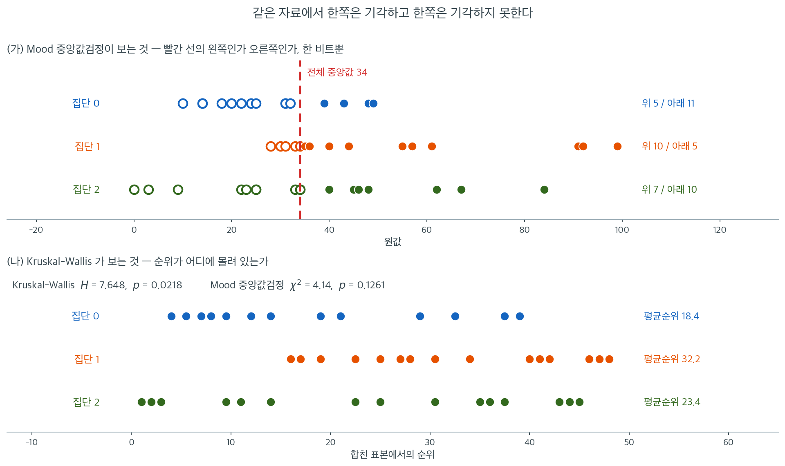

# 이표본 및 다집단 검정

## 개요

정규성을 가정하지 않고 두 집단 이상을 비교할 때 순위 기반 및 중앙값 기반 비모수 절차를
여럿 쓸 수 있다. 이 페이지에서는 **Wilcoxon 순위합검정**, **Wilcoxon 부호순위검정**,
**Mann--Whitney $U$ 검정**, **Kruskal--Wallis $H$ 검정**, **Mood 중앙값검정**을 다룬다.
각 검정은 원 관측값을 순위나 전체 중앙값 기준의 이진 지시값으로 바꾸어, 이상치와 비정규
자료에 로버스트한 분포무관 추론을 제공한다.

---

## 1. Wilcoxon 순위합검정

순위합검정은 **독립인** 두 표본을 비교한다. $N = m + n$개 관측값을 모두 합쳐 $1$부터 $N$까지
순위를 매기고 한 표본의 순위를 합한다.

$H_0$(분포가 동일) 아래에서 표본 1의 순위합 $W$는

$$
\operatorname{E}[W] = \frac{m(N+1)}{2}, \qquad
\operatorname{Var}(W) = \frac{m\,n\,(N+1)}{12}
$$

을 만족한다. 표준화된 통계량

$$
Z = \frac{W - \operatorname{E}[W]}{\sqrt{\operatorname{Var}(W)}}
$$

을 표준정규분포와 비교한다.

<div class="exbox" markdown>

**보기 1.** <span class="diff easy" title="쉬움"></span> 작은 표본에서 순위합의 정규근사. 독립인 두 집단의 관측값이 $A = (12, 15, 18, 22, 25)$와 $B = (8, 10, 14, 19, 21, 24)$다. `scipy` 의 `ranksums` 가 $Z = 0.7303$, $p = 0.4652$를 준다.

**(1)** 집단 $A$ 의 순위합 $W$ 와 $\operatorname{E}[W]$, $\operatorname{Var}(W)$, $Z$ 를 손으로 구해 `scipy` 의 값과 맞추시오.

**(2)** 동점이 하나도 없으므로 귀무분포를 **전수 열거**할 수 있다. 정확 양측 p-값을 구해 정규근사와 견주고, 어긋난다면 그 까닭을 밝히시오.

</div>

??? success "풀이"

    **(1) 순위를 매긴다.** $N = m + n = 5 + 6 = 11$개를 합쳐 작은 것부터 늘어놓는다.

    | 값 | 8 | 10 | 12 | 14 | 15 | 18 | 19 | 21 | 22 | 24 | 25 |
    |---|---|---|---|---|---|---|---|---|---|---|---|
    | 순위 | 1 | 2 | 3 | 4 | 5 | 6 | 7 | 8 | 9 | 10 | 11 |
    | 집단 | B | B | A | B | A | A | B | B | A | B | A |

    집단 $A$ 의 순위합은

    $$
    W = 3 + 5 + 6 + 9 + 11 = 34
    $$

    이다. 검산: $B$ 의 순위합은 $66 - 34 = 32$이고 둘을 더하면 $N(N+1)/2 = 66$이다.

    $$
    \operatorname{E}[W] = \frac{m(N+1)}{2} = \frac{5 \times 12}{2} = 30,
    \qquad
    \operatorname{Var}(W) = \frac{mn(N+1)}{12} = \frac{5 \times 6 \times 12}{12} = 30
    $$

    이므로

    $$
    Z = \frac{34 - 30}{\sqrt{30}} = \frac{4}{5.477226} = 0.730297
    $$

    이고 `scipy` 가 준 $0.7302967$과 같다. 양측 p-값은 $2\Phi(-0.730297) = 0.465209$다.

    **(2) 전수 열거.** $H_0$ 아래에서 집단 $A$ 가 받는 순위는 $\{1,\dots,11\}$에서 고른 크기 $5$의 부분집합 가운데 **아무 것이나 같은 확률**이다. 그런 부분집합은

    $$
    \binom{11}{5} = 462
    $$

    개뿐이므로 $W$ 의 귀무분포를 하나씩 세어 그대로 얻을 수 있다. 관측된 치우침 $\lvert W - 30 \rvert = 4$ 이상인 것을 세면 $248$개다.

    $$
    p_{\text{정확}} = \frac{248}{462} = 0.536797
    $$

    **정규근사 $0.465209$가 정확값보다 $0.0716$ 작다.** 15% 가량 작은 쪽으로 밀린 셈이다. 까닭은 $W$ 가 정수 격자 위에서만 값을 갖는 **이산** 통계량인데 $N = 11$ 에서 그 격자가 아직 거칠다는 데 있다. 연속분포로 이산분포의 꼬리를 재면 계단 하나의 절반이 남는다. 그 절반을 깎아 주면

    $$
    Z_{\text{연속성 보정}} = \frac{4 - 0.5}{\sqrt{30}} = 0.639010
    \implies p = 0.522817
    $$

    로 정확값에 훨씬 가까워진다. **`ranksums` 는 연속성 보정을 하지 않는다.** 보정을 넣고 정확검정까지 해 주는 `mannwhitneyu` 를 쓰는 편이 안전하다.

    **수치적으로.**

    ```python
    from scipy import stats

    # 독립인 두 집단
    group_a = [12, 15, 18, 22, 25]
    group_b = [8, 10, 14, 19, 21, 24]

    # 순위합 검정. 동점 보정을 하지 않으므로 동점이 많으면 mannwhitneyu 를 쓴다.
    stat, p = stats.ranksums(group_a, group_b, alternative="two-sided")
    print(f"Z = {stat:.4f}, p = {p:.2%}")
    # Z = 0.7303, p = 46.52%
    ```

    출력:

    ```
    Z = 0.7303, p = 46.52%
    ```

    ```python
    import itertools
    import numpy as np
    from scipy import stats

    m, n = len(group_a), len(group_b)
    N = m + n
    ranks = stats.rankdata(group_a + group_b)
    W = ranks[:m].sum()
    E = m * (N + 1) / 2
    V = m * n * (N + 1) / 12
    print(f"A 의 순위 {list(ranks[:m])}  ->  W = {W}")
    print(f"E[W] = {E},  Var(W) = {V},  Z = {(W - E) / np.sqrt(V):.6f}")

    # 귀무분포를 전수 열거한다. C(11, 5) = 462 가지뿐이다.
    Ws = np.array([sum(c) for c in itertools.combinations(range(1, N + 1), m)])
    print(f"\n열거한 가지 수 {len(Ws)},  평균 {Ws.mean()},  분산 {Ws.var()}")
    hit = (np.abs(Ws - E) >= abs(W - E)).sum()
    print(f"|W - {E:.0f}| >= {abs(W - E):.0f} 인 것 {hit} 개")
    print(f"정확      양측 p = {hit / len(Ws):.6f}")
    print(f"정규근사  양측 p = {2 * stats.norm.sf(abs(W - E) / np.sqrt(V)):.6f}")
    print(f"연속성보정 양측 p = {2 * stats.norm.sf((abs(W - E) - 0.5) / np.sqrt(V)):.6f}")
    print(f"mannwhitneyu(method='exact'): {stats.mannwhitneyu(group_a, group_b, method='exact')}")
    print(f"U = W - m(m+1)/2 = {W - m * (m + 1) / 2}")
    ```

    출력:

    ```
    A 의 순위 [3.0, 5.0, 6.0, 9.0, 11.0]  ->  W = 34.0
    E[W] = 30.0,  Var(W) = 30.0,  Z = 0.730297

    열거한 가지 수 462,  평균 30.0,  분산 30.0
    |W - 30| >= 4 인 것 248 개
    정확      양측 p = 0.536797
    정규근사  양측 p = 0.465209
    연속성보정 양측 p = 0.522817
    mannwhitneyu(method='exact'): MannwhitneyuResult(statistic=19.0, pvalue=0.5367965367965368)
    U = W - m(m+1)/2 = 19.0
    ```

    **열거한 분포의 평균과 분산이 공식이 준 $30$과 $30$에 정확히 같다.** 근사식이 아니라 등식이라는 것을 이렇게 확인할 수 있다. 그리고 `mannwhitneyu` 의 정확검정이 $0.5367965$로 열거한 $248/462$와 같은 수를 돌려준다. $U = W - m(m+1)/2 = 34 - 15 = 19$인 것도 맞는다.

    세 p-값이 모두 $0.46$ 과 $0.54$ 사이에 있어 **어느 것을 쓰든 결론은 같다**. 그러나 $p$ 가 $0.05$ 근처였다면 $0.0716$의 차이가 결론을 뒤집는다. 작은 표본에서 정규근사만 보고 판정하지 말아야 하는 까닭이다.

---

## 2. Wilcoxon 부호순위검정

**대응**자료에서는 부호순위검정이 절대차이 $|D_i|$에 순위를 매기고 원래 부호를 붙인 뒤
양의 부호순위를 합해 $W^+$를 얻는다.

차이가 대칭인 $H_0{:}\;\text{median}(D) = 0$ 아래에서

$$
\operatorname{E}[W^+] = \frac{n'(n'+1)}{4}, \qquad
\operatorname{Var}(W^+) = \frac{n'(n'+1)(2n'+1)}{24}
$$

이며 $n'$은 0이 아닌 차이의 개수이다.

<div class="exbox" markdown>

**보기 2.** <span class="diff easy" title="쉬움"></span> 0 을 다루는 두 가지 관례. 대응 관측 15쌍에서 차이가 정확히 0 인 쌍이 **세 개** 나온다. `scipy` 에 `zero_method="pratt"`, `method="approx"` 를 주면 $W = 11$, $p = 0.0086$이 나온다.

**(1)** 차이를 구하고 `"pratt"` 관례로 $W^+$ 와 $W^-$ 를 손으로 계산하시오. `"wilcox"` 관례와 무엇이 다르며 어느 쪽이 보수적인가.

**(2)** 0 보정과 동점 보정을 넣은 정규근사로 $p = 0.0086$을 재현하시오.

</div>

??? success "풀이"

    **(1) 차이와 두 관례.** 각 쌍의 차이는

    $$
    d = (17,\ -2,\ 6,\ -3,\ 14,\ 0,\ 6,\ 10,\ 12,\ 8,\ 9,\ 2,\ 0,\ 3,\ 0)
    $$

    이고 **0 이 세 개**(6, 13, 15번째) 있다. 두 관례는 이 0 을 다르게 다룬다.

    - **`"wilcox"`**(윌콕슨의 본래 방식) — 0 인 쌍을 **먼저 버리고** 남은 $n' = 12$개에 다시 순위를 매긴다.
    - **`"pratt"`** — 0 을 **순위 매길 때는 함께 세고** 합에서만 뺀다.

    `"pratt"` 로 가 보자. $\lvert d \rvert$ 열다섯 개 전부에 순위를 매긴다. $0$ 이 셋이므로 순위 $1,2,3$ 의 평균 $2$ 를, $2$ 가 둘이므로 $4,5$ 의 평균 $4.5$ 를, $3$ 이 둘이므로 $6,7$ 의 평균 $6.5$ 를, $6$ 이 둘이므로 $8,9$ 의 평균 $8.5$ 를 주고, 나머지 $8,9,10,12,14,17$ 에 차례로 $10,11,12,13,14,15$ 를 준다.

    $$
    r = (15,\ 4.5,\ 8.5,\ 6.5,\ 14,\ 2,\ 8.5,\ 12,\ 13,\ 10,\ 11,\ 4.5,\ 2,\ 6.5,\ 2)
    $$

    부호를 붙여 더하면 음의 차이는 $-2$ 와 $-3$ 둘뿐이므로

    $$
    W^- = 4.5 + 6.5 = 11,
    \qquad
    W^+ = 15 + 8.5 + 14 + 8.5 + 12 + 13 + 10 + 11 + 4.5 + 6.5 = 103
    $$

    이고 $W = \min = 11$ 이다. **검산은 0 의 순위를 뺀 총합이다.**

    $$
    W^+ + W^- = \frac{n(n+1)}{2} - (2 + 2 + 2) = 120 - 6 = 114,
    \qquad 103 + 11 = 114 \ \checkmark
    $$

    `"wilcox"` 로 가면 0 세 개를 버려 $n' = 12$ 가 되고 $\lvert d \rvert$ 를 다시 매긴 순위에서 $W^- = 1.5 + 3.5 = 5$, $W^+ = 73$, 합은 $12 \times 13/2 = 78$ 이다. $W = 5$ 이고 p-값은 $0.007579$ 다.

    **`"pratt"` 쪽이 보수적이다.** 0 에 가장 낮은 순위를 깔아 두면 그 위의 순위가 모두 한 칸씩 올라가므로, 작은 쪽 꼬리에 들어 있는 $-2$ 와 $-3$ 의 순위도 $1.5, 3.5$ 에서 $4.5, 6.5$ 로 올라간다. 중심에서 덜 멀어지는 셈이라 p-값이 커진다: $0.008561 > 0.007579$.

    **(2) 정규근사.** `"pratt"` 에서는 0 을 순위 매김에 포함했으므로 기댓값과 분산도 전체 $n = 15$ 에서 출발해 0 의 몫 $n_0 = 3$ 을 덜어 낸다.

    $$
    \operatorname{E}[W] = \frac{n(n+1)}{4} - \frac{n_0(n_0+1)}{4} = 60 - 3 = 57
    $$

    $$
    24\operatorname{Var}(W) = n(n+1)(2n+1) - n_0(n_0+1)(2n_0+1) - \frac{1}{2}\sum_j (t_j^3 - t_j)
    $$

    동점 묶음은 **0 을 뺀 순위에서** 센다. $4.5$ 가 둘, $6.5$ 가 둘, $8.5$ 가 둘이므로 $t = 2$ 인 묶음 셋이고 $\sum (t^3 - t) = 3 \times 6 = 18$, 그 절반이 $9$ 다.

    $$
    24\operatorname{Var}(W) = 7440 - 84 - 9 = 7347
    \implies \operatorname{Var}(W) = 306.125,\quad \sigma = 17.496428
    $$

    $$
    z = \frac{11 - 57}{17.496428} = -2.629108
    \implies p = 2\Phi(-2.629108) = 0.008560915879
    $$

    **`scipy` 가 준 $0.008560915878575636$과 소수 열한째 자리까지 같다.**

    **수치적으로.**

    ```python
    from scipy import stats
    import numpy as np

    paired_data = np.array([
        [93, 76], [70, 72], [81, 75], [65, 68], [79, 65],
        [54, 54], [94, 88], [91, 81], [77, 65], [65, 57],
        [95, 86], [89, 87], [78, 78], [80, 77], [76, 76]
    ])

    # 대응표본에는 부호순위검정을 쓴다. 짝을 무시하고 독립표본 검정을 쓰면
    # 개체 간 변동이 그대로 남아 검정력을 크게 잃는다.
    stat, p = stats.wilcoxon(
        paired_data[:, 0], paired_data[:, 1],
        alternative="two-sided", method="approx", zero_method="pratt"
    )
    print(f"W = {stat}, p = {p:.4f}")
    # W = 11.0, p = 0.0086
    ```

    출력:

    ```
    W = 11.0, p = 0.0086
    ```

    ```python
    from collections import Counter

    d = paired_data[:, 0] - paired_data[:, 1]
    n, n0 = len(d), int((d == 0).sum())
    r = stats.rankdata(np.abs(d))          # pratt: 0 도 함께 순위를 매긴다
    print(f"차이  {list(d)}")
    print(f"순위  {list(r)}   (0 이 {n0} 개)")
    W_plus, W_minus = r[d > 0].sum(), r[d < 0].sum()
    zero_rank_sum = r[d == 0].sum()
    print(f"W+ = {W_plus},  W- = {W_minus},  합 = {W_plus + W_minus}"
          f"   (n(n+1)/2 - 0 의 순위합 = {n * (n + 1) / 2} - {zero_rank_sum})")

    E = n * (n + 1) / 4 - n0 * (n0 + 1) / 4
    tie = sum(c ** 3 - c for c in Counter(r[d != 0]).values())
    V24 = n * (n + 1) * (2 * n + 1) - n0 * (n0 + 1) * (2 * n0 + 1) - tie / 2
    V = V24 / 24
    z = (W_minus - E) / np.sqrt(V)
    print(f"\nE[W] = {E},  24Var = {n * (n + 1) * (2 * n + 1)} - "
          f"{n0 * (n0 + 1) * (2 * n0 + 1)} - {tie / 2} = {V24}")
    print(f"Var = {V},  sigma = {np.sqrt(V):.6f}")
    print(f"z = {z:.6f},  양측 p = {2 * stats.norm.cdf(z):.12f}")
    print(f"scipy (pratt)  = {p:.12f}")

    w = stats.wilcoxon(paired_data[:, 0], paired_data[:, 1],
                       method="approx", zero_method="wilcox")
    print(f"scipy (wilcox) = W {w.statistic},  p = {w.pvalue:.12f}")
    ```

    출력:

    ```
    차이  [17, -2, 6, -3, 14, 0, 6, 10, 12, 8, 9, 2, 0, 3, 0]
    순위  [15.0, 4.5, 8.5, 6.5, 14.0, 2.0, 8.5, 12.0, 13.0, 10.0, 11.0, 4.5, 2.0, 6.5, 2.0]   (0 이 3 개)
    W+ = 103.0,  W- = 11.0,  합 = 114.0   (n(n+1)/2 - 0 의 순위합 = 120.0 - 6.0)

    E[W] = 57.0,  24Var = 7440 - 84 - 9.0 = 7347.0
    Var = 306.125,  sigma = 17.496428
    z = -2.629108,  양측 p = 0.008560915879
    scipy (pratt)  = 0.008560915879
    scipy (wilcox) = W 5.0,  p = 0.007579201614
    ```

    **손으로 세운 $\operatorname{E}[W] = 57$, $\operatorname{Var}(W) = 306.125$, $z = -2.629108$ 이 `scipy` 의 p-값을 그대로 재현한다.** 두 관례의 차이 $0.008561$ 대 $0.007579$ 는 열 몇 퍼센트이고 둘 다 $0.01$ 보다 작아 여기서는 결론이 같다. 그러나 **0 이 많아질수록 두 값은 벌어진다.** 0 이 생기는 까닭을 먼저 따져 보아야 한다. 측정 눈금이 거칠어 생긴 0 이라면 버리는 쪽(`"wilcox"`)이 자료를 줄여 검정력을 깎고, 진짜로 변화가 없어서 생긴 0 이라면 $H_0$ 쪽 증거이므로 포함하는 쪽(`"pratt"`)이 옳다. 어느 관례를 썼는지 반드시 밝혀야 한다.

!!! danger "같은 자료에 두 검정을 섞어 쓰지 말 것"
    위 대응자료를 두 열로 쪼개어 `ranksums`에 넣으면 $Z = 1.472$, $p = 0.141$이 나온다.
    부호순위검정의 $p = 0.0086$과 16배 차이가 난다.

    자료의 **구조**가 어느 검정을 쓸지 결정한다. 같은 피험자를 두 번 측정했다면
    대응자료이고, 서로 다른 피험자 집단이라면 독립표본이다. 두 검정을 모두 돌려 보고
    작은 $p$값을 고르는 것은 명백한 오용이다.

---

## 3. Mann--Whitney U 검정

Mann--Whitney $U$ 통계량은 한쪽 관측값이 다른 쪽을 넘어서는 쌍의 개수를 센다.

$$
U = \sum_{i=1}^{m} \sum_{j=1}^{n} \mathbf{1}[X_i > Y_j].
$$

순위합과는 $U = W - m(m+1)/2$로 연결되므로 두 검정은 동치이다.
SciPy 구현은 **동점**을 동점 보정 분산과 연속성 보정 정규근사로 처리한다.

<div class="exbox" markdown>

**보기 3.** <span class="diff easy" title="쉬움"></span> 동점 보정과 연속성 보정, 어느 쪽이 크게 움직이는가. 크기 $m = 16$, $n = 15$ 인 두 집단에 동점이 섞여 있다. `mannwhitneyu` 의 기본값이 $U = 49$, $p = 0.0053$을 준다.

**(1)** 동점이 있으면 `method="auto"` 가 정확검정을 쓰지 못하고 정규근사로 넘어간다. 동점 보정 분산과 연속성 보정을 손으로 넣어 $p = 0.0053$을 재현하시오.

**(2)** 두 보정을 하나씩 빼면 p-값이 각각 얼마나 움직이는가. 어느 쪽이 큰 몫을 하며 그 까닭은 무엇인가.

</div>

??? success "풀이"

    **(1) 정규근사를 손으로 세운다.** $N = 16 + 15 = 31$ 이고 `data0` 의 순위합은 $W = 185$, 따라서

    $$
    U = W - \frac{m(m+1)}{2} = 185 - \frac{16 \times 17}{2} = 185 - 136 = 49
    $$

    다. $H_0$ 아래에서

    $$
    \operatorname{E}[U] = \frac{mn}{2} = \frac{16 \times 15}{2} = 120
    $$

    이고, 동점이 없으면 $\operatorname{Var}(U) = mn(N+1)/12 = 16 \times 15 \times 32/12 = 640$ 이다. **동점이 있으면 중간순위가 값을 뭉치면서 분산이 줄어든다.** 크기 $t_j$ 인 동점 묶음마다

    $$
    \operatorname{Var}(U) = \frac{mn}{12}\left[(N+1) - \frac{\sum_j (t_j^3 - t_j)}{N(N-1)}\right]
    $$

    를 쓴다. 이 자료의 동점은 $14$ 가 두 개, $31$ 이 세 개(`data0` 에 둘, `data1` 에 하나), $43$ 이 두 개다.

    $$
    \sum_j (t_j^3 - t_j) = (8 - 2) + (27 - 3) + (8 - 2) = 6 + 24 + 6 = 36
    $$

    $$
    \operatorname{Var}(U) = 20\left[32 - \frac{36}{31 \times 30}\right] = 20\,(32 - 0.038710) = 639.225806,
    \quad \sigma = 25.282915
    $$

    연속성 보정은 중심까지의 거리에서 격자 반 칸을 깎는다.

    $$
    z = \frac{49 - 120 + 0.5}{25.282915} = \frac{-70.5}{25.282915} = -2.788444
    \implies p = 2\Phi(-2.788444) = 0.005296186
    $$

    **`scipy` 가 준 $0.0052961860870385$와 같다.**

    **(2) 두 보정을 하나씩 뺀다.**

    | 쓴 것 | $\sigma$ | $z$ | 양측 $p$ |
    |---|---|---|---|
    | 동점 + 연속성 (기본값) | 25.282915 | $-2.788444$ | 0.0052962 |
    | 동점만 (`use_continuity=False`) | 25.282915 | $-2.808220$ | 0.0049816 |
    | 연속성만 (동점 보정 없음) | 25.298221 | $-2.786757$ | 0.0053238 |

    두 보정은 **방향이 반대**다. 동점 보정은 분산을 줄여 $\lvert z \rvert$ 를 키우고 p-값을 **작게** 하며, 연속성 보정은 거리를 깎아 p-값을 **크게** 한다. 몫의 크기는

    $$
    \underbrace{0.0052962 - 0.0049816 = 0.0003146}_{\text{연속성 보정}},
    \qquad
    \underbrace{0.0052962 - 0.0053238 = -0.0000276}_{\text{동점 보정}}
    $$

    로 **연속성 보정이 열한 배 크다.** 동점 보정이 작은 까닭은 분산 안에서 차지하는 몫이 작기 때문이다. $\sum(t_j^3-t_j)/[N(N-1)] = 36/930 = 0.0387$ 은 $N + 1 = 32$ 의 **0.12%** 밖에 되지 않는다. 동점이 31개 가운데 일곱 개뿐이고 묶음도 크기 2, 3 짜리로 작은 자료에서는 그렇다. **동점 보정이 결론을 바꾸려면 묶음이 커야 한다** — $t_j^3$ 이므로 크기 10 짜리 묶음 하나가 크기 2 짜리 묶음 165 개와 맞먹는다.

    **수치적으로.**

    ```python
    from scipy import stats

    data0 = [10, 14, 14, 18, 20, 22, 24, 25, 31, 31, 32, 39, 43, 43, 48, 49]
    data1 = [28, 30, 31, 33, 34, 35, 36, 40, 44, 55, 57, 61, 91, 92, 99]

    # 크기가 다른 두 집단이어도 상관없다. 순위만 쓰기 때문이다.
    stat, p = stats.mannwhitneyu(data0, data1)
    print(f"U = {stat}, p = {p:.2%}")
    # U = 49.0, p = 0.53%
    ```

    출력:

    ```
    U = 49.0, p = 0.53%
    ```

    ```python
    import numpy as np
    from collections import Counter

    m, n = len(data0), len(data1)
    N = m + n
    combined = data0 + data1
    W = stats.rankdata(combined)[:m].sum()
    U = W - m * (m + 1) / 2
    mu = m * n / 2
    counts = Counter(combined)
    tie = sum(t ** 3 - t for t in counts.values())
    print(f"W = {W},  U = W - m(m+1)/2 = {U},  E[U] = {mu}")
    print(f"동점 묶음 {dict((k, v) for k, v in sorted(counts.items()) if v > 1)}"
          f"  ->  sum(t^3-t) = {tie}")

    V_tie = m * n / 12 * ((N + 1) - tie / (N * (N - 1)))
    V_plain = m * n * (N + 1) / 12
    print(f"Var(U) 동점보정 = {V_tie:.6f} (sigma {np.sqrt(V_tie):.6f}),"
          f"  보정없음 = {V_plain} (sigma {np.sqrt(V_plain):.6f})")
    print(f"동점항 / (N+1) = {tie / (N * (N - 1)) / (N + 1):.6%}")

    for label, V, cc in (("동점 + 연속성", V_tie, 0.5),
                         ("동점만        ", V_tie, 0.0),
                         ("연속성만      ", V_plain, 0.5)):
        z = (U - mu + cc) / np.sqrt(V)
        print(f"  {label}: z = {z:9.6f},  p = {2 * stats.norm.cdf(z):.7f}")
    print(f"  scipy 기본값             : p = {p:.7f}")
    print(f"  scipy use_continuity=False: "
          f"p = {stats.mannwhitneyu(data0, data1, use_continuity=False).pvalue:.7f}")
    ```

    출력:

    ```
    W = 185.0,  U = W - m(m+1)/2 = 49.0,  E[U] = 120.0
    동점 묶음 {14: 2, 31: 3, 43: 2}  ->  sum(t^3-t) = 36
    Var(U) 동점보정 = 639.225806 (sigma 25.282915),  보정없음 = 640.0 (sigma 25.298221)
    동점항 / (N+1) = 0.120968%
      동점 + 연속성: z = -2.788444,  p = 0.0052962
      동점만        : z = -2.808220,  p = 0.0049816
      연속성만      : z = -2.786757,  p = 0.0053238
      scipy 기본값             : p = 0.0052962
      scipy use_continuity=False: p = 0.0049816
    ```

    **손으로 세운 세 값이 `scipy` 의 두 설정과 모두 맞는다.** 어느 보정을 쓰든 $p \approx 0.0053$ 이 $0.01$ 아래이므로 결론이 흔들리지 않는다.

    다만 **두 보정의 몫이 어디서 오는지는 서로 다르다.** 연속성 보정이 주는 상대변화는 $0.5/\lvert U - \operatorname{E}[U]\rvert$ 로 **치우침의 크기**가 결정하고, 동점 보정이 주는 상대변화는 $\sum(t_j^3-t_j)/[N(N-1)(N+1)]$ 로 **동점 묶음의 크기**가 결정한다. 이 자료는 묶음이 크기 2, 3 짜리뿐이라 뒤쪽이 0.12% 로 작았다. 눈금이 거친 자료 — 리커트 5점 척도처럼 서로 다른 값이 몇 개뿐인 자료 — 에서는 묶음이 $N$ 에 비례해 커지므로 동점 보정이 훨씬 큰 몫을 하게 된다. **어느 보정이 중요한지는 자료를 보고 판단해야 하며, 이 쪽의 결론을 다른 자료로 옮겨 적용하지 말아야 한다.**

---

## 4. Kruskal--Wallis H 검정

Kruskal--Wallis 검정은 순위합의 발상을 $k \geq 2$개의 독립집단으로 확장한다.
$N$개 관측값을 모두 합쳐 순위를 매기고

$$
H = \frac{12}{N(N+1)} \sum_{j=1}^{k} \frac{R_j^2}{n_j} - 3(N+1)
$$

을 계산한다. $R_j$는 집단 $j$의 순위합, $n_j$는 집단 크기이다. $H_0$(모든 집단이 같은
모집단에서 왔다) 아래에서 $H$는 근사적으로 $\chi^2_{k-1}$을 따른다.

<div class="exbox" markdown>

**보기 4.** <span class="diff easy" title="쉬움"></span> 위의 식으로는 `scipy` 의 $H$ 가 나오지 않는다. 집단 셋의 크기가 $16, 15, 17$ 이고 `kruskal` 이 $H = 7.6480$, $p = 0.0218$ 을 준다.

**(1)** 이 쪽 본문에 적힌 식 $H = \dfrac{12}{N(N+1)}\sum_j R_j^2/n_j - 3(N+1)$ 로 $H$ 를 손으로 계산하시오. `scipy` 의 값과 맞는가.

**(2)** 맞지 않다면 빠진 항을 찾아 메우고, 그 항이 결론에 미치는 영향을 재시오.

</div>

??? success "풀이"

    **(1) 본문의 식으로 계산한다.** $N = 16 + 15 + 17 = 48$ 이다. 48개를 합쳐 순위를 매기면 집단별 순위합이

    $$
    R_1 = 295, \qquad R_2 = 483, \qquad R_3 = 398
    $$

    이다. 검산: $295 + 483 + 398 = 1176 = 48 \times 49/2$. $\checkmark$ 평균순위는 각각 $18.4375$, $32.2$, $23.4118$ 이고 전체 평균순위 $(N+1)/2 = 24.5$ 를 사이에 두고 벌어져 있다.

    $$
    \sum_j \frac{R_j^2}{n_j}
    = \frac{295^2}{16} + \frac{483^2}{15} + \frac{398^2}{17}
    = 5439.0625 + 15552.6 + 9317.882353
    = 30309.544853
    $$

    $$
    H = \frac{12}{48 \times 49} \times 30309.544853 - 3 \times 49
      = 154.640535 - 147
      = 7.640535
    $$

    **`scipy` 는 $7.648007$ 을 준다. 맞지 않는다.** 차이가 $0.007472$ 로 작지만 반올림 오차가 아니다 — 소수 둘째 자리에서 이미 갈린다.

    **(2) 빠진 것은 동점 보정이다.** 이 48개 값에는 동점이 아홉 묶음 있다. $14, 22, 33, 40, 43, 48$ 이 각각 두 개, $25, 31, 34$ 가 각각 세 개다.

    $$
    \sum_j (t_j^3 - t_j) = 6 \times (2^3 - 2) + 3 \times (3^3 - 3) = 36 + 72 = 108
    $$

    동점이 있으면 순위의 분산이 줄어들므로 $H$ 를 그만큼 **키워** 주어야 한다. 보정인자는

    $$
    C = 1 - \frac{\sum_j (t_j^3 - t_j)}{N^3 - N} = 1 - \frac{108}{110544} = 0.999023
    $$

    이고

    $$
    H_{\text{보정}} = \frac{H}{C} = \frac{7.640535}{0.999023} = 7.648007
    $$

    **이것이 `scipy` 의 값과 정확히 같다.** 즉 `scipy` 는 늘 동점 보정을 넣고, 이 쪽 본문의 식은 **동점이 없을 때의 식**이다.

    영향은 작다. 자유도 $k - 1 = 2$ 에서

    $$
    P(\chi^2_2 > 7.640535) = 0.021922,
    \qquad
    P(\chi^2_2 > 7.648007) = 0.021840
    $$

    로 p-값이 $0.00008$ 움직였을 뿐이다. $C \leq 1$ 이므로 **보정은 언제나 $H$ 를 키우고 p-값을 줄인다.** 보정을 빠뜨리면 보수적인 쪽으로 틀리는 셈이다. 여기서는 $108/110544$ 가 0.1% 라 거의 보이지 않지만, 눈금이 거친 자료에서는 $C$ 가 0.9 아래로 내려가 $H$ 를 10% 이상 밀어 올리기도 한다.

    **수치적으로.**

    ```python
    from scipy import stats

    data0 = [10, 14, 14, 18, 20, 22, 24, 25, 31, 31, 32, 39, 43, 43, 48, 49]
    data1 = [28, 30, 31, 33, 34, 35, 36, 40, 44, 55, 57, 61, 91, 92, 99]
    data2 = [0, 3, 9, 22, 23, 25, 25, 33, 34, 34, 40, 45, 46, 48, 62, 67, 84]

    # 집단이 셋이 되면 Kruskal-Wallis 로 간다. 유의하다는 결론이 나면 어느 쌍이
    # 다른지는 따로 사후비교를 해야 한다.
    stat, p = stats.kruskal(data0, data1, data2)
    print(f"H = {stat:.4f}, p = {p:.2%}")
    # H = 7.6480, p = 2.18%
    ```

    출력:

    ```
    H = 7.6480, p = 2.18%
    ```

    ```python
    import numpy as np
    from collections import Counter

    groups = [data0, data1, data2]
    sizes = [len(g) for g in groups]
    allv = sum(groups, [])
    N = len(allv)
    ranks = stats.rankdata(allv)
    edges = np.cumsum([0] + sizes)
    R = [ranks[edges[i]:edges[i + 1]].sum() for i in range(3)]
    print(f"n = {sizes},  N = {N}")
    print(f"R = {R},  합 = {sum(R)}  (N(N+1)/2 = {N * (N + 1) / 2})")
    print(f"평균순위 = {[round(R[i] / sizes[i], 4) for i in range(3)]}"
          f"   (전체 {(N + 1) / 2})")

    H = 12 / (N * (N + 1)) * sum(R[i] ** 2 / sizes[i] for i in range(3)) - 3 * (N + 1)
    counts = Counter(allv)
    tie = sum(t ** 3 - t for t in counts.values())
    C = 1 - tie / (N ** 3 - N)
    print(f"\n본문 식의 H          = {H:.6f}")
    print(f"동점 묶음 {dict((k, v) for k, v in sorted(counts.items()) if v > 1)}")
    print(f"sum(t^3-t) = {tie},  C = 1 - {tie}/{N ** 3 - N} = {C:.6f}")
    print(f"동점 보정한 H = H/C  = {H / C:.6f}")
    print(f"scipy 가 준 H        = {stat:.6f}")
    print(f"p: 보정 전 {stats.chi2.sf(H, 2):.6f}  ->  보정 후 {stats.chi2.sf(H / C, 2):.6f}"
          f"  (scipy {p:.6f})")
    ```

    출력:

    ```
    n = [16, 15, 17],  N = 48
    R = [295.0, 483.0, 398.0],  합 = 1176.0  (N(N+1)/2 = 1176.0)
    평균순위 = [18.4375, 32.2, 23.4118]   (전체 24.5)

    본문 식의 H          = 7.640535
    동점 묶음 {14: 2, 22: 2, 25: 3, 31: 3, 33: 2, 34: 3, 40: 2, 43: 2, 48: 2}
    sum(t^3-t) = 108,  C = 1 - 108/110544 = 0.999023
    동점 보정한 H = H/C  = 7.648007
    scipy 가 준 H        = 7.648007
    p: 보정 전 0.021922  ->  보정 후 0.021840  (scipy 0.021840)
    ```

    **본문의 식과 `scipy` 가 어긋난 까닭이 동점 보정 하나로 완전히 설명된다.** 손계산 $7.640535$ 를 $C = 0.999023$ 으로 나누면 소수 여섯째 자리까지 `scipy` 와 같다. 두 식 모두 틀린 것이 아니다 — **본문의 식은 동점이 없을 때의 식이고, 동점이 있으면 $C$ 로 나누어야 한다.** 손으로 계산한 값이 소프트웨어와 조금 다를 때 가장 먼저 의심할 곳이 여기다.

---

## 5. Mood 중앙값검정

Mood 중앙값검정은 Kruskal--Wallis의 더 간단한 대안이다. 모든 관측값의 **전체 중앙값**을
계산하고, 각 관측값을 그 중앙값보다 위인지 아래인지로 분류하여 $2 \times k$ 분할표를
만든다. 이 표에 카이제곱 검정을 적용하여 집단들의 중앙값이 같은지 판정한다.

<div class="exbox" markdown>

**보기 5.** <span class="diff easy" title="쉬움"></span> 전체 중앙값과 **같은** 값은 위인가 아래인가. 앞 보기와 같은 세 집단에 Mood 중앙값검정을 하면 전체 중앙값이 $34$ 이고 분할표가 $\begin{pmatrix} 5 & 10 & 7 \\ 11 & 5 & 10\end{pmatrix}$, $p = 0.1261$ 로 나온다.

**(1)** 전체 중앙값이 $34$ 임을 확인하고 분할표를 손으로 세우시오. 그다음 그 표에 카이제곱 검정을 해 $p = 0.1261$ 을 재현하시오.

**(2)** 이 자료에는 값이 정확히 $34$ 인 관측값이 **세 개** 있다. `scipy` 의 `ties` 인수를 `"below"`(기본값), `"above"`, `"ignore"` 로 바꾸면 결론이 어떻게 달라지는가.

</div>

??? success "풀이"

    **(1) 전체 중앙값과 분할표.** $N = 48$ 이므로 전체 중앙값은 정렬한 24번째와 25번째 값의 평균이다. 둘 다 $34$ 이므로

    $$
    \text{전체 중앙값} = \frac{34 + 34}{2} = 34
    $$

    다. $34$ 보다 큰 값이 22개, 작은 값이 23개, **같은 값이 3개**다. 기본값 `ties="below"` 는 같은 값을 아래 칸에 넣으므로 아래가 $23 + 3 = 26$ 이 된다.

    | | 집단 0 | 집단 1 | 집단 2 | 합 |
    |---|---|---|---|---|
    | $> 34$ | 5 | 10 | 7 | 22 |
    | $\leq 34$ | 11 | 5 | 10 | 26 |
    | 합 | 16 | 15 | 17 | 48 |

    기대도수는 $E_{ij} = (\text{행합})(\text{열합})/48$ 이다.

    | | 집단 0 | 집단 1 | 집단 2 |
    |---|---|---|---|
    | $> 34$ | $22 \cdot 16/48 = 7.3333$ | $22 \cdot 15/48 = 6.875$ | $22 \cdot 17/48 = 7.7917$ |
    | $\leq 34$ | $26 \cdot 16/48 = 8.6667$ | $26 \cdot 15/48 = 8.125$ | $26 \cdot 17/48 = 9.2083$ |

    $$
    \chi^2 = \sum_{i,j} \frac{(O_{ij} - E_{ij})^2}{E_{ij}}
    = \frac{(-2.3333)^2}{7.3333} + \frac{3.125^2}{6.875} + \frac{(-0.7917)^2}{7.7917}
      + \frac{2.3333^2}{8.6667} + \frac{(-3.125)^2}{8.125} + \frac{0.7917^2}{9.2083}
    $$

    $$
    \chi^2 = 0.742424 + 1.420455 + 0.080437 + 0.628205 + 1.201923 + 0.068062 = 4.141506
    $$

    자유도는 $(2-1)(3-1) = 2$ 이므로

    $$
    p = P(\chi^2_2 > 4.141506) = 0.126091
    $$

    이고 `scipy` 의 $0.1261$ 과 맞는다. $\chi^2_2$ 의 $5\%$ 임계값 $5.9915$ 에 못 미친다. **가장 큰 몫은 집단 1 이다** — 15개 가운데 10개가 위에 있어 기댓값 $6.875$ 를 셋 넘게 웃돌고, 이 한 칸이 $\chi^2$ 의 $1.42$, 곧 전체의 34%를 낸다.

    **(2) 같은 값을 어디에 넣는가가 결론을 뒤집는다.**

    | `ties` | 분할표 | $\chi^2$ | $p$ | $\alpha = 0.05$ |
    |---|---|---|---|---|
    | `"below"` (기본값) | $\begin{pmatrix} 5 & 10 & 7 \\ 11 & 5 & 10\end{pmatrix}$ | 4.141506 | 0.126091 | 기각 못 함 |
    | `"above"` | $\begin{pmatrix} 5 & 11 & 9 \\ 11 & 4 & 8\end{pmatrix}$ | 5.501708 | 0.063873 | 기각 못 함 |
    | `"ignore"` | $\begin{pmatrix} 5 & 10 & 7 \\ 11 & 4 & 8\end{pmatrix}$ | 4.868277 | 0.087673 | 기각 못 함 |

    세 값이 $0.064$ 와 $0.126$ 사이로 **두 배 가까이 벌어진다.** 여기서는 셋 모두 $0.05$ 를 넘어 결론이 같지만, `"above"` 의 $0.0639$ 는 $0.05$ 에서 멀지 않다. $34$ 인 관측값 세 개 가운데 둘이 집단 2 에, 하나가 집단 1 에 있어서 이 셋을 위로 올리면 두 집단의 "위" 개수가 함께 늘어나는데, 집단 1 은 원래 위에 치우쳐 있었으므로 벌어짐이 더 커진다.

    **관측값 48개 가운데 셋을 어느 칸에 넣는가가 p-값을 두 배 움직인다는 것이 Mood 검정의 약점을 그대로 보여 준다.** 각 관측값을 한 비트로 뭉개면 경계에 걸린 관측값의 몫이 그만큼 커진다. 순위를 쓰는 Kruskal--Wallis 에는 이런 선택지가 아예 없다 — 동점에는 중간순위를 주면 끝이다.

    **수치적으로.**

    ```python
    from scipy import stats

    data0 = [10, 14, 14, 18, 20, 22, 24, 25, 31, 31, 32, 39, 43, 43, 48, 49]
    data1 = [28, 30, 31, 33, 34, 35, 36, 40, 44, 55, 57, 61, 91, 92, 99]
    data2 = [0, 3, 9, 22, 23, 25, 25, 33, 34, 34, 40, 45, 46, 48, 62, 67, 84]

    # 중앙값 검정은 전체 중앙값을 기준으로 위아래 개수만 센다. 정보를 많이
    # 버리므로 위 Kruskal-Wallis 보다 p-값이 크게 나온다. 같은 자료에서
    # 한쪽은 유의하고 한쪽은 그렇지 않은 것이 그 차이다.
    result = stats.median_test(data0, data1, data2)
    print(f"Grand median = {result.median}")
    print(f"Contingency table:\n{result.table}")
    print(f"p-value = {result.pvalue:.4f}")
    # Grand median = 34.0
    # Contingency table:
    # [[ 5 10  7]
    #  [11  5 10]]
    # p-value = 0.1261
    ```

    출력:

    ```
    Grand median = 34.0
    Contingency table:
    [[ 5 10  7]
     [11  5 10]]
    p-value = 0.1261
    ```

    ```python
    import numpy as np

    allv = np.array(data0 + data1 + data2)
    s = np.sort(allv)
    N = len(allv)
    print(f"N = {N},  24번째 = {s[23]},  25번째 = {s[24]},  전체 중앙값 = {np.median(allv)}")
    print(f"> 34 인 것 {(allv > 34).sum()} 개,  < 34 인 것 {(allv < 34).sum()} 개,"
          f"  = 34 인 것 {(allv == 34).sum()} 개")

    T = np.array([[5, 10, 7], [11, 5, 10]])
    row, col = T.sum(1), T.sum(0)
    E = np.outer(row, col) / T.sum()
    print(f"\n행합 {list(row)},  열합 {list(col)}")
    print("기대도수\n", np.round(E, 4))
    chi2 = ((T - E) ** 2 / E).sum()
    print(f"칸별 기여 {np.round((T - E) ** 2 / E, 6).tolist()}")
    print(f"chi2 = {chi2:.6f},  p = {stats.chi2.sf(chi2, 2):.6f}"
          f"  (chi2_2 의 5% 임계값 {stats.chi2.ppf(0.95, 2):.4f})")

    print("\nties 인수를 바꾸어 본다")
    for tie in ("below", "above", "ignore"):
        r = stats.median_test(data0, data1, data2, ties=tie)
        print(f"  ties={tie:7s} {r.table.tolist()}  "
              f"chi2 = {r.statistic:.6f},  p = {r.pvalue:.6f}")
    for i, g in enumerate([data0, data1, data2]):
        print(f"  집단 {i} 에 34 가 {np.sum(np.array(g) == 34)} 개")
    ```

    출력:

    ```
    N = 48,  24번째 = 34,  25번째 = 34,  전체 중앙값 = 34.0
    > 34 인 것 22 개,  < 34 인 것 23 개,  = 34 인 것 3 개

    행합 [22, 26],  열합 [16, 15, 17]
    기대도수
     [[7.3333 6.875  7.7917]
     [8.6667 8.125  9.2083]]
    칸별 기여 [[0.742424, 1.420455, 0.080437], [0.628205, 1.201923, 0.068062]]
    chi2 = 4.141506,  p = 0.126091  (chi2_2 의 5% 임계값 5.9915)

    ties 인수를 바꾸어 본다
      ties=below   [[5, 10, 7], [11, 5, 10]]  chi2 = 4.141506,  p = 0.126091
      ties=above   [[5, 11, 9], [11, 4, 8]]  chi2 = 5.501708,  p = 0.063873
      ties=ignore  [[5, 10, 7], [11, 4, 8]]  chi2 = 4.868277,  p = 0.087673
      집단 0 에 34 가 0 개
      집단 1 에 34 가 1 개
      집단 2 에 34 가 2 개
    ```

    **손으로 센 $\chi^2 = 4.141506$ 과 $p = 0.126091$ 이 `scipy` 와 소수 여섯째 자리까지 같다.** 칸별 기여도 손계산과 맞고, 집단 1 의 "위" 칸이 $1.42$ 로 가장 크다는 것도 확인된다. `ties` 세 설정의 p-값 $0.1261 / 0.0639 / 0.0877$ 은 모두 $0.05$ 를 넘지만, 기본값에서 멀어질수록 작아진다. **`ties` 의 기본값이 `"below"` 라는 것은 임의의 관례이며, 경계에 동점이 많은 자료에서는 세 설정을 모두 보고하는 것이 정직하다.**

!!! note "같은 자료에서 두 검정의 결론이 갈린다"
    Kruskal--Wallis는 $p = 0.0218$로 기각하지만 Mood 중앙값검정은 $p = 0.1261$로
    기각하지 못한다. Mood 검정이 각 관측값을 한 비트로 뭉개면서 정보를 크게 잃기
    때문이다.

    구체적으로 `data1`은 값이 $28$부터 $99$까지 전체적으로 높지만, Mood 검정에게는
    "중앙값 $34$보다 위인 것이 $15$개 중 $10$개"라는 정보만 남는다. Kruskal--Wallis는
    `data1`의 값들이 순위 상위권에 몰려 있다는 사실을 그대로 반영한다.



두 검정의 결론이 갈리는 까닭이 그림에 그대로 보인다. 위아래 두 칸은 **완전히 같은 자료**이고, 다르게 그린 것은 각 검정이 실제로 들여다보는 양뿐이다.

(가)가 Mood 중앙값검정의 시야다. 빨간 점선이 전체 중앙값 $34$이고, 속이 빈 점은 그 아래, 속이 찬 점은 그 위이다. 이 검정에게 남는 것은 집단마다 "위 몇 개, 아래 몇 개"라는 숫자 한 쌍, 즉 분할표 $\begin{pmatrix} 5 & 10 & 7 \\ 11 & 5 & 10\end{pmatrix}$뿐이다. 집단 1의 $91$, $92$, $99$는 $35$와 똑같이 그냥 "위 한 개"로 취급된다. 이 표로 카이제곱 검정을 하면 $\chi^2 = 4.14$, $p = 0.1261$이 나온다.

(나)가 Kruskal--Wallis의 시야다. 관측값 $48$개 전부가 순위 $1$부터 $48$까지 제자리를 갖는다. 집단 1(주황)의 점들이 **오른쪽 절반에 치우쳐 몰려 있다**는 것이 눈으로 보이고, 평균순위가 $18.4 / 32.2 / 23.4$로 벌어진다. 이 벌어짐을 재면 $H = 7.648$, $p = 0.0218$로 기각에 이른다.

정보를 더 쓰는 쪽이 이겼으니 Mood 검정은 쓸모가 없는 것일까? 그렇지 않다. Mood 검정이 버린 정보는 곧 **버릴 수 있는 가정**이기도 하다. 이 검정은 관측값이 중앙값 위인지 아래인지만 알면 되므로 자료가 순수한 순서형이거나 일부 값이 검출한계 밖("$> 100$" 같은 중도절단)이어도 그대로 쓸 수 있다. Kruskal--Wallis는 그런 자료에서 순위를 매길 수 없다. 검정을 고르는 일은 언제나 **가진 정보와 감당할 가정 사이의 거래**이다.

---

## 6. 해석

| 검정 | 용도 | 귀무가설 | 통계량의 분포 |
|---|---|---|---|
| 순위합 | 독립인 두 표본 | 분포가 동일 | 정규 (대표본) |
| 부호순위 | 대응표본 | 중앙값 차이가 0 | 정규 (대표본) |
| Mann--Whitney $U$ | 독립인 두 표본 (동점 포함) | $P(X > Y) = 0.5$ | 정규 (대표본) |
| Kruskal--Wallis | $k$개 독립집단 | 모든 집단이 같은 모집단 | $\chi^2_{k-1}$ |
| Mood 중앙값 | $k$개 독립집단 | 모든 집단의 중앙값이 같음 | $\chi^2_{k-1}$ |

**검정의 선택**:

- 독립인 두 표본에서 순위합검정과 Mann--Whitney 검정은 동치이다. `mannwhitneyu`가
  정확검정과 효과크기 $U/(mn)$을 함께 제공하므로 대체로 더 편하다.
- 대응자료에는 부호순위검정(차이의 대칭성 필요)이나 부호검정(대칭성 불필요)을 쓴다.
- 셋 이상의 집단에는 Kruskal--Wallis가 Mood 중앙값검정보다 대체로 강력하지만,
  Mood 검정이 더 단순하고 이상치에 로버스트하다.

---

## 연습문제

<div class="drillbox" markdown>

**연습문제 1.** <span class="diff easy" title="쉬움"></span> 두 학생 집단이 서로 다른 시험지를 풀었다. 집단 A의 점수는
$(72, 78, 81, 85, 90)$, 집단 B의 점수는 $(68, 74, 77, 83, 88, 92)$이다.
Wilcoxon 순위합검정을 손으로 수행하라. 합치고 순위를 매긴 뒤 집단 A의 $W$와
$Z$ 통계량을 구하라.

</div>

??? success "풀이"

    $N = 11$개 값을 합쳐 순위를 매기면

    | 값 | 68 | 72 | 74 | 77 | 78 | 81 | 83 | 85 | 88 | 90 | 92 |
    |---|---|---|---|---|---|---|---|---|---|---|---|
    | 순위 | 1 | 2 | 3 | 4 | 5 | 6 | 7 | 8 | 9 | 10 | 11 |
    | 집단 | B | A | B | B | A | A | B | A | B | A | B |

    집단 A($m = 5$)의 순위합: $W = 2 + 5 + 6 + 8 + 10 = 31$.

    $$
    \operatorname{E}[W] = \frac{5 \cdot 12}{2} = 30, \qquad
    \operatorname{Var}(W) = \frac{5 \cdot 6 \cdot 12}{12} = 30.
    $$

    $$
    Z = \frac{31 - 30}{\sqrt{30}} \approx 0.183.
    $$

    양측 $p$값은 $2\Phi(-0.183) \approx 0.855$이다. $H_0$을 기각하지 못한다.
    두 집단 사이에 유의한 차이가 없다.

    ```python
    from scipy import stats
    a = [72, 78, 81, 85, 90]; b = [68, 74, 77, 83, 88, 92]
    print(stats.ranksums(a, b))
    # RanksumsResult(statistic=0.18257, pvalue=0.85513)
    print(stats.mannwhitneyu(a, b, method='exact'))
    # MannwhitneyuResult(statistic=16.0, pvalue=0.93074)
    ```

    출력:

    ```
    RanksumsResult(statistic=0.18257418583505536, pvalue=0.8551321405847059)
    MannwhitneyuResult(statistic=16.0, pvalue=0.9307359307359306)
    ```

    $U = W - m(m+1)/2 = 31 - 15 = 16$으로 확인된다. 두 집단의 값이 거의 완벽하게
    번갈아 나타나므로 $U$가 $mn/2 = 15$에 매우 가깝다. $\square$

---

<div class="drillbox" markdown>

**연습문제 2.** <span class="diff easy" title="쉬움"></span> 세 처리를 독립인 집단에 적용하여 다음 결과를 얻었다.

- 처리 1: $14, 18, 22, 25$
- 처리 2: $19, 23, 27, 30, 35$
- 처리 3: $10, 15, 20$

Kruskal--Wallis $H$ 통계량을 손으로 계산하라.

</div>

??? success "풀이"

    $N = 12$개 값을 합쳐 순위를 매기면

    | 값 | 10 | 14 | 15 | 18 | 19 | 20 | 22 | 23 | 25 | 27 | 30 | 35 |
    |---|---|---|---|---|---|---|---|---|---|---|---|---|
    | 순위 | 1 | 2 | 3 | 4 | 5 | 6 | 7 | 8 | 9 | 10 | 11 | 12 |
    | 집단 | 3 | 1 | 3 | 1 | 2 | 3 | 1 | 2 | 1 | 2 | 2 | 2 |

    순위합: $R_1 = 2+4+7+9 = 22$, $R_2 = 5+8+10+11+12 = 46$, $R_3 = 1+3+6 = 10$.

    검산: $22 + 46 + 10 = 78 = 12 \cdot 13 / 2$. $\checkmark$

    $$
    H = \frac{12}{12 \cdot 13}\left(\frac{22^2}{4} + \frac{46^2}{5} + \frac{10^2}{3}\right) - 3 \cdot 13.
    $$

    $$
    H = \frac{12}{156}\left(121 + 423.2 + 33.333\right) - 39
      = 0.076923 \times 577.533 - 39
      = 44.426 - 39
      = 5.426.
    $$

    자유도 $k - 1 = 2$에서 $P(\chi^2_2 > 5.426) = 0.0664$이다.
    $\alpha = 0.05$에서 기각하지 못하지만 시사적인 결과이다.

    ```python
    from scipy import stats
    t1 = [14, 18, 22, 25]; t2 = [19, 23, 27, 30, 35]; t3 = [10, 15, 20]
    print(stats.kruskal(t1, t2, t3))
    # KruskalResult(statistic=5.42564, pvalue=0.06637)
    ```

    출력:

    ```
    KruskalResult(statistic=5.425641025641035, pvalue=0.06634940320987275)
    ```

    집단 크기가 $4, 5, 3$으로 매우 작아 $\chi^2$ 근사가 신뢰할 만하지 않다는 점에
    유의하라. [Kruskal-Wallis](../multi_group_nonparametric/kruskal_wallis.md)
    연습문제 2에서 보았듯 이런 크기에서 $\chi^2$ 근사는 $p$값을 크게 과대평가할
    수 있다. $\square$

---

<div class="drillbox" markdown>

**연습문제 3.** <span class="diff easy" title="쉬움"></span> 위 코드 보기의 Mann--Whitney 자료로 $U = W - m(m+1)/2$를 손으로
확인하라. $W$는 `data0`의 순위합이고 $m = 16$이다.

</div>

??? success "풀이"

    합친 표본은 $N = 16 + 15 = 31$개이다. 합쳐 순위를 매긴 뒤 `data0`의 순위를
    더하면 $W$가 나온다.

    ```python
    import numpy as np
    from scipy import stats

    data0 = [10, 14, 14, 18, 20, 22, 24, 25, 31, 31, 32, 39, 43, 43, 48, 49]
    data1 = [28, 30, 31, 33, 34, 35, 36, 40, 44, 55, 57, 61, 91, 92, 99]

    combined = np.array(data0 + data1)
    ranks = stats.rankdata(combined)
    W = ranks[:16].sum()
    print(f"W = {W}")                        # W = 185.0
    print(f"W - m(m+1)/2 = {W - 16*17/2}")   # 49.0

    U, p = stats.mannwhitneyu(data0, data1)
    print(f"U = {U}")                        # U = 49.0
    ```

    출력:

    ```
    W = 185.0
    W - m(m+1)/2 = 49.0
    U = 49.0
    ```

    $W = 185$이고 $W - 16 \cdot 17/2 = 185 - 136 = 49 = U$로 정확히 일치한다.

    이 자료에는 동점이 여럿 있음에 유의하라. `data0`의 $14$가 두 개, $31$이 두 개,
    $43$이 두 개이고, `data0`의 $31$과 `data1`의 $31$은 **집단을 넘어서** 동점이다.
    `rankdata`가 중간순위를 배정하므로 $W$가 정수가 아닐 수도 있지만, 여기서는
    집단 간 동점이 하나뿐이라 우연히 정수로 떨어졌다.

    $U = 49$를 $mn = 240$으로 나누면 $\hat{P}(X > Y) = 0.204$이다. `data0`의 값이
    `data1`보다 큰 쌍이 20%에 불과하다는 뜻이며, $p = 0.0053$이라는 유의한 결과와
    일관된다. $\square$

---

<div class="drillbox" markdown>

**연습문제 4.** <span class="diff med" title="중간"></span> Mood 중앙값검정은 각 관측값을 이진 지시값(전체 중앙값 위/아래)으로
바꾼다. 이 접근이 Kruskal--Wallis보다 검정력이 낮지만 극단 이상치에 더 로버스트한
이유를 설명하라.

</div>

??? success "풀이"

    Mood 중앙값검정은 각 관측값을 정보 한 비트 --- 전체 중앙값을 넘는지 여부 ---
    로 줄인다. 각 관측값이 중앙값에서 *얼마나 멀리* 있는지를 무시하므로, 순위가
    보존하는 순서 정보를 버린다. Kruskal--Wallis는 완전한 순위 정보를 쓰므로
    분포 이동을 더 잘 포착하고 검정력이 더 높다.

    그러나 바로 그 정보 축소가 Mood 검정을 더 로버스트하게 만든다. 중앙값이 $30$인
    자료에 $10{,}000$이라는 극단 이상치가 있어도 $35$라는 온건한 값과 똑같이
    "위"라는 이진 부호를 받는다. Kruskal--Wallis에서는 이상치의 극단적 순위가 그
    집단의 순위합을 부풀려 결과를 왜곡할 수 있다.

    본문 보기가 이 대비를 보여 준다. Kruskal--Wallis는 $p = 0.0218$로 기각하고
    Mood 검정은 $p = 0.1261$로 기각하지 못한다.

    !!! warning "로버스트성의 한계"
        Mood 검정의 로버스트성은 과장되기 쉽다. 순위 자체도 이미 이상치에 매우
        로버스트하기 때문이다. 관측값이 $10{,}000$이든 $35$든 Kruskal--Wallis에서
        받는 최대 순위는 $N$으로 같다. 이상치 하나가 순위합을 움직일 수 있는 폭은
        $N$ 이하로 제한된다.

        [Mood 중앙값검정](../multi_group_nonparametric/median_test.md) 연습문제 3에서
        보았듯, 등분산성이 크게 깨지면 두 검정 모두 명목수준을 넘는다. Mood 검정이
        만능 보험은 아니다. $\square$

---

<div class="drillbox" markdown>

**연습문제 5.** <span class="diff hard" title="어려움"></span> $k = 2$일 때 Kruskal--Wallis $H$ 통계량이 순위합 $Z$ 통계량의
제곱으로 환원됨을 증명하라.

</div>

??? success "풀이"

    크기가 $m$과 $n = N - m$인 두 집단에서 순위합은 $R_1 + R_2 = N(N+1)/2$를
    만족한다. Kruskal--Wallis 통계량은

    $$
    H = \frac{12}{N(N+1)}\left(\frac{R_1^2}{m} + \frac{R_2^2}{n}\right) - 3(N+1)
    $$

    이다. $W = R_1$, $S = N(N+1)/2$라 두고 $R_2 = S - W$를 대입하면

    $$
    \frac{R_1^2}{m} + \frac{R_2^2}{n}
    = \frac{n W^2 + m(S - W)^2}{mn}
    = \frac{(m+n)W^2 - 2mSW + mS^2}{mn}
    = \frac{N W^2 - 2mSW + mS^2}{mn}.
    $$

    한편 목표하는 형태는 $\bigl(W - mS/N\bigr)^2$을 포함한다. 실제로

    $$
    \frac{N}{mn}\left(W - \frac{mS}{N}\right)^2
    = \frac{N W^2 - 2mSW + m^2S^2/N}{mn}
    $$

    이므로 두 식의 차이는

    $$
    \frac{mS^2 - m^2S^2/N}{mn} = \frac{S^2(N - m)}{Nn} = \frac{S^2}{N}
    $$

    이다. 따라서

    $$
    H = \frac{12}{N(N+1)}\left[\frac{N}{mn}\left(W - \frac{mS}{N}\right)^2 + \frac{S^2}{N}\right] - 3(N+1).
    $$

    $S = N(N+1)/2$이므로 $\frac{12}{N(N+1)} \cdot \frac{S^2}{N} = \frac{12}{N(N+1)} \cdot \frac{N(N+1)^2}{4} = 3(N+1)$이 되어
    상수항이 정확히 소거된다. 또 $mS/N = m(N+1)/2 = \operatorname{E}[W]$이므로

    $$
    H = \frac{12}{N(N+1)} \cdot \frac{N}{mn}\left(W - \operatorname{E}[W]\right)^2
      = \frac{\bigl(W - \operatorname{E}[W]\bigr)^2}{mn(N+1)/12}
      = Z^2. \quad \square
    $$

    이것이 $H$의 $\chi^2_1$ 분포가 $Z$의 표준정규분포의 제곱임을 확인해 준다.

    ```python
    import numpy as np
    from scipy import stats
    rng = np.random.default_rng(0)
    x = rng.normal(0, 1, 12); y = rng.normal(0.5, 1, 15)
    H = stats.kruskal(x, y).statistic
    Z = stats.ranksums(x, y).statistic
    print(H, Z ** 2, abs(H - Z ** 2) < 1e-10)
    # True
    ```

    출력:

    ```
    0.7714285714285722 0.7714285714285715 True
    ```

---

## 정리하며

다섯 검정의 **구현과 선택 기준**을 모았다.

| 검정 | 쓰는 곳 |
|---|---|
| 윌콕슨 순위합 · 만–휘트니 $U$ | 독립 2집단 (같은 검정) |
| 윌콕슨 부호순위 | 대응 2측정 |
| 크루스칼–월리스 $H$ | 독립 $k$집단 |
| 무드 중앙값검정 | 독립 $k$집단, 중앙값만 |

- **만–휘트니와 윌콕슨 순위합은 같은 검정이다.** 통계량의 정의만 다르고 $p$ 값이 같으며, 이름이 둘인 것이 혼동의 원인이다.
- **크루스칼–월리스는 분산분석의 순위판이다.** 기각하면 사후비교가 필요하며, 던 검정에 다중검정 보정을 쓴다.
- **무드 중앙값검정은 가정이 더 적고 검정력도 더 낮다.** 각 집단에서 전체 중앙값을 넘는 관측 수를 세어 카이제곱으로 검정한다.
- **`scipy` 의 기본값을 확인한다.** 연속성 보정, 동점 처리, 정확·근사 전환이 함수마다 다르다.
- **어느 검정이든 결론의 문장을 정확히 쓴다.** "중앙값이 다르다"인지 "분포가 다르다"인지가 가정에 달려 있다.

**이것으로 16장이 끝난다.** 분포 가정을 최소화한 검정들을 일표본·대응·이표본·다집단으로 훑었다.

다음 장 **재표집 방법**으로 넘어간다. 순위로 바꾸는 대신 **자료 자체를 다시 뽑아** 분포를 만드는 접근이다.
