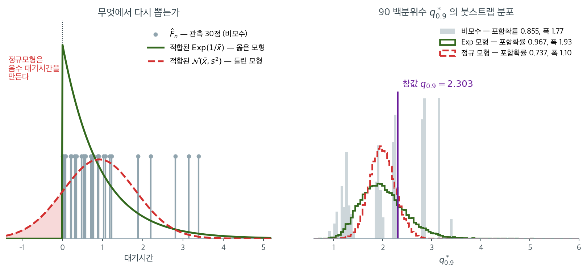

# 모수적 붓스트랩

## 1. 동기

비모수 붓스트랩은 모집단 분포 $F$에 대해 아무 가정도 하지 않고 자료에서 직접 재표집한다. 자료가 특정 모수족 --- 예를 들어 정규, 지수, 포아송분포 --- 에서 나왔다고 믿을 만한 근거가 있다면 이 지식을 활용할 수 있다. **모수적 붓스트랩**은 자료에 모수적 모형을 적합한 뒤, 경험적 분포가 아니라 적합된 분포에서 붓스트랩 표본을 생성한다.

이 접근은 모형이 옳을 때 더 효율적인 추정값(더 작은 표준오차, 더 좁은 신뢰구간)을 주지만, 모형이 잘못 설정되면 타당하지 않게 될 위험을 안는다.

---

## 2. 알고리즘

관측된 표본 $x_1, \ldots, x_n$과 모수 $\psi$로 지표화된 모수적 모형 $F_\psi$가 주어졌을 때:

1. 모수적 모형을 **적합**한다. 관측자료에서 최대가능도추정값 $\hat{\psi}$를 계산한다.
2. 붓스트랩 복제 횟수 $B$를 **정한다**.
3. $b = 1, 2, \ldots, B$에 대해:
    - $F_{\hat{\psi}}$에서 i.i.d.로 $n$개를 뽑아 붓스트랩 표본 $x_1^*, x_2^*, \ldots, x_n^*$을 생성한다.
    - 붓스트랩 복제값 $\hat{\theta}^{*(b)} = g(x_1^*, \ldots, x_n^*)$을 계산한다.
4. 붓스트랩 분포 $\{\hat{\theta}^{*(1)}, \ldots, \hat{\theta}^{*(B)}\}$를 추론에 **사용한다**.

비모수 붓스트랩과의 핵심 차이는 3단계에 있다. 관측자료를 복원추출하는 대신 적합된 모형 $F_{\hat{\psi}}$에서 새 자료를 모의생성한다.

!!! note "모수적 재표집과 비모수 재표집"
    비모수 붓스트랩에서는 $x_i^* \sim \hat{F}_n$(자료에서 추출)이다. 모수적 붓스트랩에서는 $x_i^* \sim F_{\hat{\psi}}$(적합된 모형에서 추출)이다. 모수적인 경우의 붓스트랩 표본은 원자료에 한 번도 나타나지 않았을 수 있는 진짜 새로운 값들이다.

---

## 3. 비모수 붓스트랩과의 비교

| 측면 | 비모수 붓스트랩 | 모수적 붓스트랩 |
|---|---|---|
| **가정** | i.i.d. 외에 없음 | 자료가 $F_\psi$를 따름 |
| **재표집 대상** | $\hat{F}_n$ (관측자료) | $F_{\hat{\psi}}$ (적합된 모형) |
| **붓스트랩 값** | 관측값의 부분집합 | 새로 모의생성된 값 |
| **효율** | 낮음 (변동이 큼) | 높음 (모형이 옳을 때) |
| **로버스트성** | 높음 | 낮음 (모형 오설정에 민감) |

$F_{\hat{\psi}}$가 $\hat{F}_n$보다 $F$의 더 매끄러운 추정값이므로 모수적 붓스트랩이 더 효율적이다. 매끄러움이 붓스트랩 근사의 분산을 줄인다.

---

## 4. 언제 모수적 붓스트랩을 쓰는가

다음 상황에서 적절하다.

- **모수적 모형이 이론이나 충분한 사전 분석으로 잘 정당화될 때.**
- **적합도 검정**(Shapiro-Wilk, Anderson-Darling, Q-Q 그림)이 모형을 지지할 때.
- **관심 통계량이 모형 모수를 직접 포함할 때.** 최대가능도추정값이나 가능도비 통계량이 그렇다.
- **표본크기가 작을 때.** 경험적 분포가 $F$의 나쁜 근사이지만 모수적 모형은 여전히 본질적 구조를 담을 수 있다.

!!! warning "모형 오설정"
    가정한 모수적 모형 $F_\psi$가 틀리면 모수적 붓스트랩은 오도하는 결과를 낼 수 있다. 신뢰구간의 포함확률이 어긋나고 가설검정의 제1종 오류율이 부풀거나 줄어든다. 의심스러우면 비모수 붓스트랩을 쓰거나 두 접근의 결과를 비교하라.

세 방식의 차이는 결국 **어떤 분포에서 다시 뽑는가** 하나로 요약된다. 같은 자료를 놓고 그 선택만 바꾸어 보자.



왼쪽이 재표집의 원천 세 가지이다. 대기시간 $n = 30$개($\bar{x} = 0.919$, $s = 0.900$)에 대해 비모수 붓스트랩은 회색 막대 30개에서만 값을 꺼내고, 모수적 붓스트랩은 적합된 연속분포에서 새 값을 만들어 낸다. 적합된 $\text{Exp}(1/\bar{x})$는 원자료처럼 오른쪽으로 길게 늘어지지만, 같은 평균과 분산을 맞춘 $\mathcal{N}(\bar{x}, s^2)$는 **확률질량의 $15\%$가량을 음수 쪽에 둔다**. 대기시간이 음수인 가짜 자료를 만들어 내는 모형이라는 뜻이며, 이것이 모형 오설정의 가장 눈에 띄는 형태이다.

오른쪽은 그 선택이 추론에 미친 결과로, 90 백분위수 $q_{0.9}$(참값 $-\ln 0.1 = 2.303$)를 추정한 것이다. 옳은 지수모형(초록)은 참값을 감싸며 적당히 퍼져 있고, 2000회 반복에서 포함확률 $0.967$, 평균 폭 $1.93$을 냈다. 틀린 정규모형(빨강)은 포함확률이 $0.737$로 무너지는데, **폭은 $1.10$으로 셋 중 가장 좁다.** 좁은 구간과 틀린 답이 함께 온다는 것이 이 조합의 위험한 점이다. 정규분포는 지수분포보다 꼬리가 얇아 표본마다 상위 백분위수가 덜 흔들리고, 그 안정성이 근거 없는 자신감으로 바뀐다.

회색 막대가 듬성듬성한 빗살 모양인 것도 우연이 아니다. $n = 30$의 90 백분위수는 사실상 위에서 셋째 관측값 언저리이므로, 비모수 붓스트랩이 만들 수 있는 값이 몇 개로 제한된다. 포함확률 $0.854$는 옳은 모형보다 낮지만 틀린 모형보다는 낫다. **모수적 붓스트랩의 이득은 모형이 옳다는 전제 아래에서만 존재하고, 그 전제가 깨지면 이득이 손실로 부호를 바꾼다.**

---

## 5. 보기: 정규모형

$x_1, \ldots, x_n$이 정규분포에서 온 것으로 보이고 표본분산 $s^2$의 표준오차를 구하고 싶다고 하자.

**모수적 붓스트랩 절차:**

1. 자료에서 $\hat{\mu} = \bar{x}$와 $\hat{\sigma}^2 = s^2$을 계산한다.
2. $b = 1, \ldots, B$에 대해 $x_1^*, \ldots, x_n^* \overset{\text{iid}}{\sim} \mathcal{N}(\hat{\mu}, \hat{\sigma}^2)$을 생성하고 $s^{2*(b)}$을 계산한다.
3. 붓스트랩 표준오차는 $\widehat{\text{SE}}_{\text{boot}} = \text{sd}(s^{2*(1)}, \ldots, s^{2*(B)})$이다.

정규모형 아래에서 $s^2$의 정확한 표준오차는 $\sigma^2\sqrt{2/(n-1)}$이다. 모수적 붓스트랩은 이 알려진 결과를 가깝게 근사해야 하며, 이는 절차를 점검하는 유용한 검산이 된다.

<div class="exbox" markdown>

**보기 1.** <span class="diff easy" title="쉬움"></span> 모수적 붓스트랩과 비모수적 붓스트랩. $N(10, 2^2)$에서 $n = 25$를 뽑아 $s^2$의 표준오차를 두 방식으로 구한다. **두 방식 모두 $B \to \infty$ 극한이 닫힌 꼴로 계산된다.**

**(1)** 정규모형에서 $\operatorname{SE}(s^2) = \sigma^2\sqrt{2/(n-1)}$임을 보이시오. 그다음 모수적 붓스트랩과 비모수 붓스트랩의 표준오차가 각각 $B \to \infty$에서 **무엇으로** 수렴하는지 적고, 두 극한의 비를 $n$과 표본의 초과첨도로 적으시오.

**(2)** 실행해 (1)의 두 극한을 확인하고, 세 숫자의 차이를 **체계적인 몫**과 **우연한 몫**으로 가르시오.

</div>

??? success "풀이"

    **(1) 해석적으로.** 정규모형에서 $(n-1)s^2/\sigma^2 \sim \chi^2_{n-1}$이고 $\operatorname{Var}(\chi^2_{k}) = 2k$이므로

    $$
    \operatorname{Var}(s^2) = \frac{\sigma^4}{(n-1)^2}\cdot 2(n-1) = \frac{2\sigma^4}{n-1},
    \qquad
    \operatorname{SE}(s^2) = \sigma^2\sqrt{\frac{2}{n-1}}
    $$

    다. 이것이 쪽의 "이론값" 줄이 쓰는 식인데, $\sigma^2$를 모르므로 실제로는 $s^2$을 꽂아 넣는다.

    **모수적 붓스트랩의 극한.** 재표본을 $N(\bar x,\ s^2)$에서 뽑으므로 위 결과가 $\sigma^2 = s^2$인 정규모집단에 **그대로** 적용된다. 따라서

    $$
    \widehat{\operatorname{SE}}_{\text{모수적}} \xrightarrow[B\to\infty]{} s^2\sqrt{\frac{2}{n-1}}
    $$

    로, **"이론값" 줄과 정확히 같은 수**다. 모수적 붓스트랩이 하는 일은 이 공식을 몬테카를로로 다시 계산하는 것뿐이다.

    **비모수 붓스트랩의 극한.** 재표본은 경험분포에서 i.i.d.로 뽑힌다. 중심적률이 $\mu_2, \mu_4$인 분포에서 크기 $n$의 표본분산은

    $$
    \operatorname{Var}(s^2) = \frac1n\left(\mu_4 - \frac{n-3}{n-1}\mu_2^2\right)
    $$

    을 만족하므로, 경험분포의 적률 $\hat\mu_2 = \frac1n\sum_i(x_i-\bar x)^2$, $\hat\mu_4 = \frac1n\sum_i(x_i-\bar x)^4$을 넣어

    $$
    \widehat{\operatorname{SE}}_{\text{비모수}} \xrightarrow[B\to\infty]{}
    \sqrt{\frac1n\left(\hat\mu_4 - \frac{n-3}{n-1}\hat\mu_2^2\right)}
    $$

    를 얻는다. **두 극한은 같지 않다.** 표본의 초과첨도를 $\hat g_2 = \hat\mu_4/\hat\mu_2^2 - 3$이라 두면 $\hat\mu_4 = (3+\hat g_2)\hat\mu_2^2$이고 $\hat\mu_2 = \frac{n-1}{n}s^2$이므로, 두 극한의 비의 제곱이

    $$
    \frac{\text{비모수}^2}{\text{모수적}^2}
    = \frac{(n-1)^2}{n^2}\left(1 + \frac{(n-1)\hat g_2}{2n}\right)
    $$

    로 정리된다. **두 몫이 서로 다른 방향으로 당긴다.** 앞의 $(n-1)/n$은 경험분포의 분산이 $n$으로 나눈 값이라서 생기는 축소이고, 뒤의 괄호는 표본의 꼬리가 정규보다 두꺼우면($\hat g_2 > 0$) 비모수 쪽을 키운다. 이 표본은 $\hat g_2 = +0.149$라 $(n-1)/n = 0.96$을 $1.035$배 되돌려 비가 $0.9937$이 된다.

    **(2) 수치적으로.**

    ```python
    import numpy as np
    # 모수적 붓스트랩과 비모수적 붓스트랩을 견준다. 앞은 적합한 모형에서
    # 새 표본을 만들고, 뒤는 자료에서 복원추출한다. 모형이 맞으면 앞이 조금
    # 낫지만, 틀리면 앞이 그 잘못을 그대로 물려받는다.
    rng = np.random.default_rng(0)
    n = 25
    x = rng.normal(10, 2, n)
    s2 = x.var(ddof=1)                       # 3.0470

    # 모수적: 표본의 평균과 분산으로 정규분포를 만들고 거기서 다시 뽑는다.
    B = 20000
    par = np.array([rng.normal(x.mean(), np.sqrt(s2), n).var(ddof=1) for _ in range(B)])
    # 비모수적: 자료 자체를 모집단으로 삼아 복원추출한다.
    npb = np.array([rng.choice(x, n, replace=True).var(ddof=1) for _ in range(B)])

    print("이론값 :", round(s2 * np.sqrt(2 / (n - 1)), 4))   # 0.8796
    print("모수적 :", round(par.std(ddof=1), 4))              # 0.8765
    print("비모수 :", round(npb.std(ddof=1), 4))              # 0.8708
    ```

    출력:

    ```
    이론값 : 0.8796
    모수적 : 0.8765
    비모수 : 0.8708
    ```

    두 극한을 계산해 맞춰 본다. 위 블록의 변수를 그대로 이어 쓴다.

    ```python
    c = x - x.mean()
    mu2 = (c ** 2).mean()          # 경험분포의 2차 중심적률
    mu4 = (c ** 4).mean()          # 4차
    g2 = mu4 / mu2 ** 2 - 3        # 표본의 초과첨도
    lim_par = s2 * np.sqrt(2 / (n - 1))
    lim_np = np.sqrt((mu4 - (n - 3) / (n - 1) * mu2 ** 2) / n)

    print(f"s^2 = {s2:.6f},  mu2hat = {mu2:.6f},  mu4hat = {mu4:.6f},  초과첨도 = {g2:+.4f}")
    print(f"모수적 극한 = {lim_par:.6f}   (실행값 {par.std(ddof=1):.6f})")
    print(f"비모수 극한 = {lim_np:.6f}   (실행값 {npb.std(ddof=1):.6f})")
    print(f"두 극한의 비 = {lim_np / lim_par:.6f}"
          f"   ((n-1)/n = {(n - 1) / n:.6f},  첨도 보정 {np.sqrt(1 + (n - 1) * g2 / (2 * n)):.6f})")

    for name, arr, lim in [("모수적", par, lim_par), ("비모수", npb, lim_np)]:
        k = ((arr - arr.mean()) ** 4).mean() / arr.var() ** 2 - 3
        mc = arr.std(ddof=1) * np.sqrt((2 + k) / (4 * B))
        print(f"  {name}: 복제값의 초과첨도 {k:.3f},  SD 의 몬테카를로 오차 {mc:.5f},"
              f"  편차 {arr.std(ddof=1) - lim:+.5f} ({(arr.std(ddof=1) - lim) / mc:+.2f} 배)")
    ```

    출력:

    ```
    s^2 = 3.047018,  mu2hat = 2.925137,  mu4hat = 26.944148,  초과첨도 = +0.1490
    모수적 극한 = 0.879598   (실행값 0.876464)
    비모수 극한 = 0.874088   (실행값 0.870782)
    두 극한의 비 = 0.993736   ((n-1)/n = 0.960000,  첨도 보정 1.035141)
      모수적: 복제값의 초과첨도 0.457,  SD 의 몬테카를로 오차 0.00486,  편차 -0.00313 (-0.65 배)
      비모수: 복제값의 초과첨도 0.080,  SD 의 몬테카를로 오차 0.00444,  편차 -0.00331 (-0.74 배)
    ```

    **두 극한이 모두 맞는다.** 모수적 극한 $0.879598$은 "이론값" 줄의 $0.8796$과 같은 수이고, 비모수 극한 $0.874088$은 적률 공식이 준 값이다. 비 $0.993736$도 $(n-1)/n = 0.96$에 첨도 보정 $1.035141$을 곱한 $0.993735$와 맞는다.

    **차이를 가른다.**

    - **체계적인 몫**은 두 극한 사이의 $0.879598 - 0.874088 = 0.005510$이다. $B$를 아무리 키워도 남는다. 상대로는 $0.63\%$에 지나지 않는데, $(n-1)/n$이 깎는 $4\%$를 표본의 두꺼운 꼬리가 거의 다 되돌려 놓았기 때문이다.
    - **우연한 몫**은 각 실행값이 자기 극한에서 벗어난 $-0.00313$과 $-0.00331$이다. $B = 20{,}000$에서 표준편차 추정의 몬테카를로 오차가 각각 $0.00486$과 $0.00444$이므로 $-0.65$배와 $-0.74$배로 정상 범위다. (붓스트랩 복제값이 정규가 아니므로 $\widehat{\operatorname{SE}}/\sqrt{2B}$ 대신 초과첨도를 넣은 $\widehat{\operatorname{SE}}\sqrt{(2+\hat g_2)/4B}$를 썼다. 모수적 쪽 복제값의 초과첨도가 $0.457$로 $\chi^2_{24}$의 $12/24 = 0.5$에 가깝다.)

    **세 값이 잘 일치한다.** 자료가 실제로 정규이므로 두 붓스트랩이 모두 옳게 작동한다. 그러나 이 일치는 **모형이 맞을 때의 이야기**다. 모형이 틀리면 모수적 붓스트랩의 극한은 여전히 $s^2\sqrt{2/(n-1)}$이고 — 자료가 무엇이든 정규분포에서 다시 뽑으므로 — 참값을 겨냥하지 않게 된다. 비모수 쪽의 극한은 자료의 네 번째 적률을 쓰므로 따라간다. 연습문제 1이 그 갈림을 수로 보인다.

<div class="exbox" markdown>

**보기 2.** <span class="diff easy" title="쉬움"></span> 지수모형. 대기시간을 $x_1, \ldots, x_n \overset{\text{iid}}{\sim} \text{Exp}(\lambda)$로 모형화하고 평균 $\mu = 1/\lambda$의 신뢰구간을 구하려 한다.

</div>

??? success "풀이"
    **모수적 붓스트랩 절차:**

    1. 최대가능도추정값 $\hat{\lambda} = 1/\bar{x}$를 계산한다.
    2. $b = 1, \ldots, B$에 대해 $x_1^*, \ldots, x_n^* \overset{\text{iid}}{\sim} \text{Exp}(\hat{\lambda})$을 생성하고 $\bar{x}^{*(b)}$을 계산한다.
    3. $\{\bar{x}^{*(1)}, \ldots, \bar{x}^{*(B)}\}$의 분위수로 $\mu$의 신뢰구간을 만든다.

    지수분포가 오른쪽으로 치우쳐 있으므로 중간 정도의 $n$에서 $\bar{x}$의 표본분포도 치우친다. 모수적 붓스트랩은 이 치우침을 포착하여, $\mu$가 양수라는 사실을 존중하는 비대칭 신뢰구간을 만든다.

---

## 6. 가능도비 검정을 위한 모수적 붓스트랩

특히 강력한 응용은 내포된 모수적 모형의 검정이다. $\Psi_0 \subset \Psi$일 때 $H_0: \psi \in \Psi_0$ 대 $H_1: \psi \in \Psi$를 검정한다고 하자.

관측된 가능도비 통계량은

$$
\Lambda_{\text{obs}} = 2\left[\ell(\hat{\psi}) - \ell(\hat{\psi}_0)\right]
$$

이며 $\hat{\psi}$와 $\hat{\psi}_0$은 각각 $H_1$과 $H_0$ 아래의 최대가능도추정값이다.

**모수적 붓스트랩 $p$값:**

1. $H_0$ 아래에서 모형을 적합하여 $\hat{\psi}_0$을 얻는다.
2. $b = 1, \ldots, B$에 대해 $F_{\hat{\psi}_0}$에서 자료를 생성하고 $\Lambda^{*(b)}$를 계산한다.
3. $p$값은 $\Lambda^{*(b)} \ge \Lambda_{\text{obs}}$인 비율이다.

이 접근은 $\Lambda$에 대한 $\chi^2$ 근사에 의존하지 않는다. 그 근사는 소표본이거나 모형이 모수공간의 경계에 가까울 때 부정확할 수 있다.

!!! tip "실무 권고"
    가능하면 모수적 붓스트랩과 비모수 붓스트랩을 모두 돌려 결과를 비교하라. 둘이 가깝게 일치하면 모수적 모형 가정이 합리적일 가능성이 높고, 정밀도가 높은 모수적 붓스트랩 추정값을 쓰는 편이 낫다. 둘이 어긋나면 어느 쪽도 믿기 전에 모형 가정을 먼저 조사해야 한다.

---

## 7. 한계

모수적 붓스트랩은 가정한 모형의 한계를 그대로 물려받는다.

- **모형선택 불확실성**이 반영되지 않는다. 붓스트랩은 선택된 모형에 조건부로 작동한다.
- **경계 모수**(예: $\sigma^2 = 0$ 검정)는 적합된 모형이 퇴화하여 붓스트랩 실패를 일으킬 수 있다.
- **다변량 모형**은 주변분포만이 아니라 결합분포를 옳게 설정해야 한다.

모수가 많은 복잡한 모형에서는 비모수 붓스트랩이 대체로 더 안전하며 효율 손실도 근소하다.

---

## 연습문제

<div class="drillbox" markdown>

**연습문제 1.** <span class="diff med" title="중간"></span>
모형이 옳을 때와 틀릴 때 모수적 붓스트랩의 신뢰구간 포함확률이 어떻게 달라지는가?
$\text{Exp}(1)$ 자료에서 90번째 백분위수의 신뢰구간을 (a) 올바른 지수모형,
(b) 잘못된 정규모형, (c) 비모수 붓스트랩으로 각각 만들어 비교하라.

</div>

??? success "풀이"
    참값은 $q_{0.9} = -\ln(0.1) = 2.3026$이다. $n = 30$, $B = 600$, 2000회 반복.

    ```python
    import numpy as np
    rng = np.random.default_rng(7)
    n, B, M = 30, 600, 2000
    target = -np.log(0.1)

    cov = {"exp": 0, "norm": 0, "np": 0}
    wid = {"exp": [], "norm": [], "np": []}

    for _ in range(M):
        x = rng.exponential(1, n)
        qs = {
            "exp":  np.percentile(rng.exponential(x.mean(), (B, n)), 90, axis=1),
            "norm": np.percentile(rng.normal(x.mean(), x.std(ddof=1), (B, n)), 90, axis=1),
            "np":   np.percentile(x[rng.integers(0, n, (B, n))], 90, axis=1),
        }
        for k, q in qs.items():
            lo, hi = np.percentile(q, [2.5, 97.5])
            wid[k].append(hi - lo)
            cov[k] += lo <= target <= hi

    for k in cov:
        print(k, round(cov[k] / M, 3), round(np.mean(wid[k]), 3))
    ```

    출력:

    ```
    exp 0.966 1.933
    norm 0.737 1.101
    np 0.854 1.772
    ```

    | 방법 | 포함확률 | 평균 폭 |
    |:---|---:|---:|
    | 모수적, 올바른 Exp 모형 | **0.967** | 1.933 |
    | 모수적, 잘못된 정규모형 | **0.737** | 1.101 |
    | 비모수 붓스트랩 | 0.855 | 1.772 |

    세 결과의 대비가 이 절의 핵심 메시지를 그대로 보여 준다.

    - **올바른 모형**을 쓰면 포함확률이 $0.967$로 명목값 이상이다.
    - **잘못된 모형**을 쓰면 $0.737$로 무너진다. 게다가 구간의 폭이 $1.101$로 가장 **좁다**. 좁은 구간이 잘못된 확신을 준다는 점에서 가장 위험한 조합이다.
    - **비모수**는 $0.855$로 명목값에 못 미치지만 잘못된 모수적 모형보다 낫다. $n = 30$에서 90번째 백분위수를 추정하려면 상위 3개 관측값에 의존해야 하므로 붓스트랩이 어려워하는 상황이다.

    **정규모형이 왜 이렇게 나쁜가.** 지수분포는 오른쪽으로 심하게 치우쳐 있어 $q_{0.9} = 2.30$이 평균 $1$의 2.3배이다. 같은 평균과 분산을 갖는 정규분포는 $q_{0.9} = 1 + 1.282 \times 1 = 2.28$로 우연히 가깝지만, **변동**을 크게 과소평가한다. 정규모형에서 생성된 붓스트랩 표본들의 90번째 백분위수가 지나치게 안정적이라 구간이 좁아진다.

    **교훈:** 모수적 붓스트랩의 좁은 구간은 모형이 옳을 때에만 이득이다. 틀리면 좁은 폭이 그대로 낮은 포함확률로 이어진다.

<div class="drillbox" markdown>

**연습문제 2.** <span class="diff med" title="중간"></span>
정규모형 보기에서 모수적 붓스트랩이 이론값 $\sigma^2\sqrt{2/(n-1)}$을 잘 재현하는 것을 확인했다. 자료가 정규가 아니면 어떻게 되는가? $t(5)$ 자료에서 같은 비교를 하라.

</div>

??? success "풀이"
    $t(5)$의 분산은 $5/3 = 1.6667$이다. $s^2$의 참 표준오차는 4차 적률을 포함하므로

    $$
    \text{Var}(s^2) \approx \frac{1}{n}\left(\mu_4 - \frac{n-3}{n-1}\sigma^4\right)
    $$

    이고, $t(5)$의 초과첨도가 $6$이므로 $\mu_4 = (\gamma_2 + 3)\sigma^4 = 9\sigma^4$이다.

    ```python
    import numpy as np
    rng = np.random.default_rng(2)
    n = 40
    sigma2 = 5 / 3

    # 참 SE: 모의실험으로 직접 구한다
    true_se = np.array([rng.standard_t(5, n).var(ddof=1) for _ in range(50000)]).std(ddof=1)
    print("참 SE  :", round(true_se, 4))          # 0.6853

    x = rng.standard_t(5, n)
    s2 = x.var(ddof=1)
    B = 20000
    par = np.array([rng.normal(x.mean(), np.sqrt(s2), n).var(ddof=1) for _ in range(B)])
    npb = np.array([rng.choice(x, n, replace=True).var(ddof=1) for _ in range(B)])
    print("모수적(정규 가정):", round(par.std(ddof=1), 4))
    print("비모수           :", round(npb.std(ddof=1), 4))
    print("정규이론 공식    :", round(s2 * np.sqrt(2 / (n - 1)), 4))
    ```

    출력:

    ```
    참 SE  : 0.6853
    모수적(정규 가정): 0.4398
    비모수           : 0.5259
    정규이론 공식    : 0.4416
    ```

    한 표본에 대한 결과는 표본에 따라 흔들리므로, 여러 표본에 걸쳐 평균을 낸다.

    | 방법 | $\widehat{\text{SE}}(s^2)$의 평균 | 참값 대비 |
    |:---|---:|---:|
    | 참 SE (모의실험) | 0.685 | --- |
    | 모수적 (정규 가정) | 0.363 | $-47\%$ |
    | 비모수 | 0.459 | $-33\%$ |
    | 정규이론 공식 | 0.363 | $-47\%$ |

    모수적 붓스트랩이 표준오차를 **47% 과소평가**한다. 정규모형은 두꺼운 꼬리를 담지 못하고, $s^2$의 변동은 4차 적률에 지배되는데 정규분포는 $\mu_4 = 3\sigma^4$인 반면 $t(5)$는 $9\sigma^4$이다.

    흥미롭게도 모수적 붓스트랩 결과가 정규이론 공식과 정확히 일치한다. **모수적 붓스트랩은 가정한 모형이 함의하는 답을 모의실험으로 재현할 뿐**이며, 자료가 그 모형과 얼마나 맞는지는 전혀 확인하지 않기 때문이다.

    비모수 붓스트랩도 $33\%$ 과소평가하지만 모수적보다는 낫다. $n = 40$에서 4차 적률을 추정하기가 본질적으로 어렵기 때문이며, $n$이 커지면 이 편향은 사라진다. 결정적인 차이는 방향이다. 비모수 붓스트랩의 편향은 $n \to \infty$에서 $0$으로 가지만, 모수적 붓스트랩의 편향은 자료가 정규가 아닌 한 **사라지지 않는다**.

<div class="drillbox" markdown>

**연습문제 3.** <span class="diff med" title="중간"></span>
모수적 붓스트랩이 유리한 상황을 하나 만들어라. 표본이 아주 작을 때($n = 8$) 모형이 옳다면 얼마나 이득인가?

</div>

??? success "풀이"
    $n = 8$인 $\mathcal{N}(0, 1)$ 자료에서 95번째 백분위수 $q_{0.95} = 1.645$의 신뢰구간을 만든다.

    ```python
    import numpy as np
    rng = np.random.default_rng(11)
    n, B, M = 8, 800, 1500
    target = 1.6449

    cov = {"param": 0, "np": 0}
    wid = {"param": [], "np": []}
    for _ in range(M):
        x = rng.normal(0, 1, n)
        qs = {
            "param": np.percentile(rng.normal(x.mean(), x.std(ddof=1), (B, n)), 95, axis=1),
            "np":    np.percentile(x[rng.integers(0, n, (B, n))], 95, axis=1),
        }
        for k, q in qs.items():
            lo, hi = np.percentile(q, [2.5, 97.5])
            wid[k].append(hi - lo); cov[k] += lo <= target <= hi
    for k in cov:
        print(k, round(cov[k] / M, 3), round(np.mean(wid[k]), 3))
    ```

    출력:

    ```
    param 0.792 1.971
    np 0.339 1.186
    ```

    | 방법 | 포함확률 | 평균 폭 |
    |:---|---:|---:|
    | 모수적 (올바른 정규모형) | 0.792 | 1.971 |
    | 비모수 | 0.339 | 1.186 |

    비모수 붓스트랩이 **완전히 무너진다**. 포함확률이 $0.339$로 명목값의 3분의 1에 불과하다.

    이유는 $n = 8$에서 경험적 분포가 8개 점만 갖기 때문이다. 95번째 백분위수는 사실상 최댓값 근처를 가리키는데, 붓스트랩 표본의 95번째 백분위수는 관측된 최댓값을 넘을 수 없다. [붓스트랩 원리](principle.md) 연습문제 3에서 본 최댓값 문제와 같은 병리이다.

    모수적 붓스트랩은 이 문제에서 자유롭다. $\mathcal{N}(\hat\mu, \hat\sigma^2)$이 연속분포이므로 관측된 최댓값을 넘는 값도 생성할 수 있다. 포함확률 $0.792$도 완벽하지는 않지만($\hat\mu$와 $\hat\sigma$의 추정 오차가 반영되지 않아서) 두 배 이상 낫다.

    **일반 원칙:** 표본이 작을수록, 그리고 관심 통계량이 분포의 꼬리에 의존할수록 모수적 붓스트랩의 상대적 이득이 커진다. 동시에 모형 오설정의 위험도 커진다는 점을 잊지 말아야 한다.

<div class="drillbox" markdown>

**연습문제 4.** <span class="diff med" title="중간"></span>
모수적 붓스트랩과 비모수 붓스트랩의 결과가 얼마나 다르면 "모형을 의심해야 하는" 신호인가?
본문의 "두 결과를 비교하라"는 권고를 실제 진단 절차로 만들어 보고, 그 한계를 평가하라.

</div>

??? success "풀이"
    두 붓스트랩 표준오차의 비

    $$
    R = \frac{\widehat{\text{SE}}_{\text{param}}}{\widehat{\text{SE}}_{\text{nonparam}}}
    $$

    를 진단량으로 삼을 수 있다. 모형이 옳으면 $R \approx 1$이고, 모형이 틀리면 1에서 벗어난다.

    문제는 **$R$ 자체가 두 겹의 변동을 갖는다**는 것이다. 표본의 변동과 붓스트랩의 몬테카를로 변동이 모두 들어간다. 따라서 $R$의 귀무분포를 알아야 한다.

    ```python
    import numpy as np
    rng = np.random.default_rng(13)
    n, B, M = 40, 600, 400

    def ratio(x):
        s2 = x.var(ddof=1)
        p = np.array([rng.normal(x.mean(), np.sqrt(s2), n).var(ddof=1) for _ in range(B)])
        q = np.array([rng.choice(x, n, replace=True).var(ddof=1) for _ in range(B)])
        return p.std(ddof=1) / q.std(ddof=1)

    for name, gen in [("normal", lambda: rng.normal(0, 1, n)),
                      ("t(5)",   lambda: rng.standard_t(5, n)),
                      ("exp",    lambda: rng.exponential(1, n))]:
        r = np.array([ratio(gen()) for _ in range(M)])
        print(name, round(np.median(r), 3), np.round(np.percentile(r, [5, 95]), 3))
    ```

    출력:

    ```
    normal 1.081 [0.834 1.362]
    t(5) 0.902 [0.562 1.234]
    exp 0.758 [0.438 1.135]
    ```

    대상 통계량을 $s^2$으로 하고 정규모형을 가정했을 때 $R$의 분포($n = 40$, $B = 600$):

    | 참 분포 | $R$의 중앙값 | 5--95 백분위 |
    |:---|---:|:---:|
    | Normal (모형 옳음) | 1.081 | 0.83 -- 1.36 |
    | $t(5)$ | 0.902 | 0.56 -- 1.23 |
    | Exponential | 0.758 | 0.44 -- 1.14 |

    **진단 규칙:** $R < 0.83$ 또는 $R > 1.36$이면 정규모형을 의심한다.

    **그러나 이 규칙의 검정력은 실망스럽다.** $t(5)$에서 $R$이 $0.83$ 아래일 확률은 약 $0.40$, 지수분포에서는 약 $0.57$에 불과하다. 절반 가까이 놓친다.

    이유는 세 가지이다.

    1. **분포가 크게 겹친다.** $t(5)$의 $R$ 중앙값 $0.902$가 정규의 5백분위수 $0.834$보다 위에 있다.
    2. **$B$가 작으면 $R$의 잡음이 커진다.** $B = 600$에서 각 표준오차의 몬테카를로 오차가 약 3%이므로 $R$에 4% 이상의 잡음이 들어간다. $B$를 키우면 개선되지만 계산비용이 늘고, 표본 자체의 변동은 여전히 남는다.
    3. **$R$의 귀무 중앙값이 1이 아니다.** 여기서 $1.081$이다. 비모수 붓스트랩의 $\widehat{\text{SE}}$가 유한표본에서 아래로 편향되기 때문이며, 이 편향은 $n$에 의존한다.

    **결론과 권고.**

    - $R$ 비교는 **거친 위생 점검**으로만 쓴다. $R$이 $0.5$ 아래이거나 $2$ 위라면 분명히 문제가 있다. 그 사이라면 아무것도 결론지을 수 없다.
    - 귀무 범위는 $n$, $B$, 대상 통계량마다 다시 계산해야 한다. 위 표의 $[0.83, 1.36]$은 $n = 40$, $B = 600$, $s^2$에 특정된 값이다.
    - 형식적인 적합도 검정(Shapiro-Wilk, Anderson-Darling)이 훨씬 강력하다. $n = 40$의 $t(5)$ 자료에서 Shapiro-Wilk의 검정력은 약 $0.5$, 지수분포에서는 $1.0$에 가깝다.
    - $R$ 비교가 적합도 검정에 더하는 유일한 가치는 "**이 통계량의 추론에서** 모형 선택이 실질적으로 중요한가"를 직접 묻는다는 점이다. 정규성이 기각되어도 $R \approx 1$이라면 그 통계량에 대해서는 모형 선택이 별 차이를 만들지 않는다는 뜻이다.

---

## 정리하며

모수적 붓스트랩은 재표집 장치로서 경험적 분포 $\hat{F}_n$을 적합된 모수적 분포 $F_{\hat{\psi}}$로 대체한다. 모수적 모형이 옳으면 더 효율적인 추론 --- 더 좁은 신뢰구간과 더 강력한 검정 --- 을 얻는다. 대가는 모형 오설정에 대한 민감성이다. 가정한 분포가 틀리면 모수적 붓스트랩 결과가 오도할 수 있다. 실무적으로는 모수적 결과와 비모수 결과를 비교하여 모형 적합성의 진단으로 삼는 전략이 유용하다.
