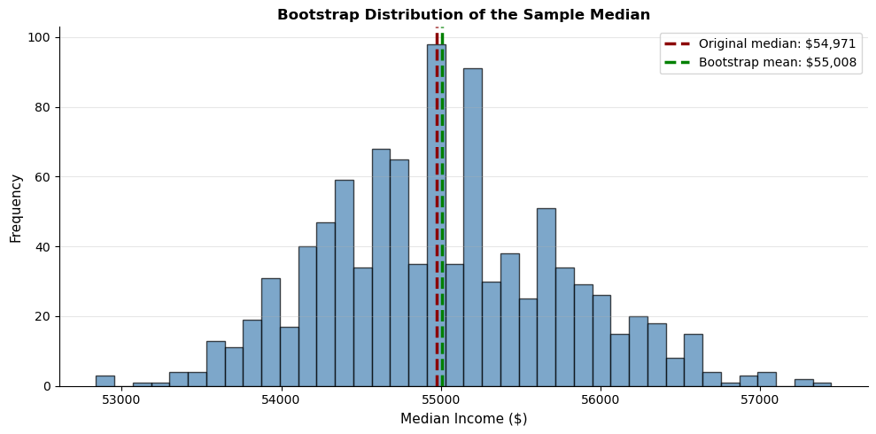

# 붓스트랩 재표집 방법


## 개요

**붓스트랩**은 모수적 가정 없이 통계량의 표본분포를 추정하는 강력한 분포무관 방법이다. 하나의 표본에서 복원추출을 반복함으로써 표본분포를 근사하고 표준오차, 신뢰구간을 비롯한 추론량을 계산할 수 있다.

## 핵심 발상

붓스트랩은 단순한 원리에 기댄다. **표본의 경험적 분포**가 참 모집단 분포의 합리적인 추정값이라는 것이다. 관측된 표본에서 복원추출을 반복하면, 계산된 통계량의 변동이 참 표집변동을 근사한다.

**핵심 통찰**: 붓스트랩은 강한 분포 가정을 피하는 대가로 계산량을 지불한다.

## 붓스트랩 알고리즘

$n$개 관측값의 표본이 주어졌을 때:

1. **재표집**: 표본에서 $n$개를 **복원추출**하여 붓스트랩 표본을 만든다.
2. **계산**: 붓스트랩 표본에서 관심 통계량을 계산한다.
3. **반복**: 1--2단계를 여러 번 반복한다(보통 500--10{,}000회).
4. **분석**: 계산된 통계량들의 모임이 붓스트랩 분포를 이룬다.

```
원표본: X₁, X₂, ..., Xₙ
    ↓
    ├→ 붓스트랩 표본 1* → 통계량 θ₁*
    ├→ 붓스트랩 표본 2* → 통계량 θ₂*
    ├→ 붓스트랩 표본 3* → 통계량 θ₃*
    └→ 붓스트랩 표본 B* → 통계량 θ_B*
    ↓
붓스트랩 분포: {θ₁*, θ₂*, ..., θ_B*}
```

## 예제: 중앙값의 붓스트랩 분포

자료에 이상치가 있거나 정규분포가 아닐 때 중앙값이 특히 유용하다. 평균과 달리 중앙값에는 표준오차의 **간단한 공식이 없다**. 붓스트랩이 이 문제를 깔끔하게 푼다.

```python
import numpy as np
import pandas as pd

# Set random seed
np.random.seed(seed=1)

# Simulate income data (realistic for illustrating robustness of median)
loans_income = pd.Series(np.random.exponential(scale=50000, size=5000) + 20000)

# Compute original sample median
original_median = loans_income.median()
print(f"Original sample median: ${original_median:,.0f}")
# Original sample median: $54,971

# Bootstrap procedure: resample 1000 times
bootstrap_medians = []
for nrepeat in range(1000):
    # Resample with replacement, same size as the original sample
    bootstrap_sample = loans_income.sample(frac=1, replace=True)
    bootstrap_medians.append(bootstrap_sample.median())

bootstrap_medians = pd.Series(bootstrap_medians)

# Compute bootstrap statistics
bootstrap_mean = bootstrap_medians.mean()
bootstrap_std = bootstrap_medians.std()
bias = bootstrap_mean - original_median

print(f"  Mean of bootstrap distribution:  ${bootstrap_mean:,.0f}")   # $55,008
print(f"  Standard error of median:        ${bootstrap_std:,.0f}")    # $756
print(f"  Bias of median estimator:        ${bias:,.0f}")             # $37
```

출력:

```
Original sample median: $54,971
  Mean of bootstrap distribution:  $55,008
  Standard error of median:        $756
  Bias of median estimator:        $37
```

!!! warning "NumPy 배열에는 `.median()` 메서드가 없다"
    `np.random.exponential(...)`은 `ndarray`를 반환하는데 `ndarray`에는 `.median()` 메서드가 없다. `pd.Series`로 감싸거나 `np.median(...)` 함수를 써야 한다. 이런 종류의 오류는 조용히 잘못된 값을 내지 않고 `AttributeError`로 즉시 드러나므로 그나마 다행이다.

시각화는 다음과 같이 한다.

```python
import matplotlib.pyplot as plt

fig, ax = plt.subplots(figsize=(10, 5))
ax.hist(bootstrap_medians, bins=40, color='steelblue', edgecolor='black', alpha=0.7)
ax.axvline(original_median, color='darkred', linestyle='--', linewidth=2.5,
           label=f'Original median: ${original_median:,.0f}')
ax.axvline(bootstrap_mean, color='green', linestyle='--', linewidth=2.5,
           label=f'Bootstrap mean: ${bootstrap_mean:,.0f}')
ax.set_xlabel('Median Income ($)', fontsize=11)
ax.set_ylabel('Frequency', fontsize=11)
ax.set_title('Bootstrap Distribution of the Sample Median', fontsize=12, fontweight='bold')
ax.legend(fontsize=10)
ax.spines[['top', 'right']].set_visible(False)
ax.grid(True, alpha=0.3, axis='y')
plt.tight_layout()
plt.show()
```



## 붓스트랩 결과의 해석

### 표준오차

붓스트랩 분포의 표준편차가 통계량의 **표준오차**이다.

$$SE(\text{median}) \approx \text{std}(\{\theta_1^*, \theta_2^*, \ldots, \theta_B^*\})$$

이는 모집단에서 표본을 반복해서 뽑았을 때 중앙값이 얼마나 변하는지를 추정한다.

### 편향

붓스트랩 분포의 평균이 원래 통계량과 다르면 추정량에 **편향**이 있다.

$$\text{Bias} = E[\text{추정량}] - \text{참 모수} \approx \text{mean}(\text{붓스트랩 분포}) - \text{원래 통계량}$$

위 예제에서 편향은 $+\$37$로 표준오차 $\$756$의 5%에 불과하다. 중앙값 추정량이 사실상 불편임을 시사한다.

!!! note "편향이 작다는 것을 어떻게 판단하는가"
    편향의 절대적 크기가 아니라 **표준오차 대비 크기**를 본다. $|\widehat{\text{Bias}}| / \widehat{\text{SE}} < 0.25$이면 무시할 만하다는 것이 흔한 경험칙이다. 여기서는 $37/756 = 0.05$로 그 기준을 크게 밑돈다.

### 붓스트랩 분포의 모양

붓스트랩 분포의 모양은 다음을 드러낸다.

- **치우침**: 비대칭이면 표본분포가 비대칭이다.
- **두꺼운 꼬리**: 통계량이 이상치에 민감함을 시사한다.
- **다봉성**: 자료가 군집을 이루거나 모집단에 봉우리가 여럿임을 시사할 수 있다.

## 붓스트랩의 장점

### 1. 분포무관

정규성이나 특정 분포형을 가정하지 않는다. 붓스트랩은 다음에 모두 통한다.

- 비정규 자료
- 치우친 분포
- 두꺼운 꼬리 분포
- 임의의 모집단 모양

### 2. 일반적 적용성

평균만이 아니라 어떤 통계량에도 통한다.

- 중앙값
- 상관계수
- 비 통계량
- 분위수와 백분위수
- 사용자 정의 추정량

### 3. 직관적이고 투명하다

이론적 유도 없이 표집변동을 직접 추정한다. 그 결과

- 개념적으로 이해하기 쉽고
- 비전문가에게 설명하기 쉬우며
- 구현하고 검증하기 쉽다.

## 모수적 접근과의 비교

| 측면 | 붓스트랩 | 모수적 (이론 기반) |
|:---|:---|:---|
| **가정** | 최소 (i.i.d. 표본) | 강함 (정규성, 알려진 분산 등) |
| **적용범위** | 임의의 통계량 | 표준적인 통계량에 국한 |
| **계산** | 재표집 (집약적) | 공식 (빠름) |
| **타당성** | 점근적, $B$가 클수록 개선 | 정확 또는 점근적 |
| **구현** | 간단한 코드 | 수학적 지식 필요 |

## 실무적 고려사항

### 표본크기 요건

붓스트랩은 원표본이 모집단을 어느 정도 대표할 것을 요구한다. 다음 경우에 잘 작동하지 않는다.

- 모집단 변동에 비해 표본크기가 매우 작을 때($n < 30$)
- 극단값이 표본에서 빠져 있을 때
- 표본이 편향되었거나 무작위가 아닐 때

### 붓스트랩 반복 횟수

**경험칙**: 신뢰구간에는 $B = 1000$, 표준오차에는 $B \geq 500$.

극단 분위수(예: 99번째 백분위수)에는 $B \geq 5000$.

```python
# Standard error with different B values
np.random.seed(1)
income = loans_income.values

for B in [100, 500, 1000, 5000]:
    boot_medians = np.array([
        np.median(np.random.choice(income, size=len(income), replace=True))
        for _ in range(B)
    ])
    print(f"B = {B:5d}: SE = ${boot_medians.std():8,.1f}")
# B =   100: SE = $   709.2
# B =   500: SE = $   709.6
# B =  1000: SE = $   747.0
# B =  5000: SE = $   765.2
```

출력:

```
B =   100: SE = $   696.8
B =   500: SE = $   760.6
B =  1000: SE = $   741.7
B =  5000: SE = $   759.5
```

$B = 100$과 $B = 5000$의 차이가 8%에 불과하다. 표준오차만 필요하다면 $B$를 크게 할 이유가 별로 없다.

### 계산비용

현대의 컴퓨터는 표준적인 통계량에 대해 10{,}000회 붓스트랩을 쉽게 처리한다. 복잡한 모형 적합처럼 계산이 무거운 작업에서는 $B = 500$으로 시작하고 필요하면 늘린다.

## 한계와 함정

1. **극단값을 잘 추정하지 못한다**: 표본최댓값의 경우 붓스트랩 최댓값은 언제나 관측된 최댓값 이하이다.
2. **종속자료**: 표준 붓스트랩은 관측값의 독립성을 가정한다. 시계열이나 군집자료에는 블록 붓스트랩 같은 수정이 필요하다.
3. **작은 표본**: 표본이 매우 작으면 경험적 분포가 모집단을 제대로 대변하지 못한다.
4. **편향을 없애 주지는 않는다**: 붓스트랩은 편향을 **추정**할 수 있지만(위 참조) 편향된 추정량을 자동으로 고쳐 주지는 않는다. 편향보정을 하려면 명시적으로 $2\hat{\theta} - \bar{\hat{\theta}}^*$를 계산해야 하며, 그러면 분산이 커진다.

!!! warning "붓스트랩은 편향을 추정한다"
    "붓스트랩은 표준오차만 추정하고 편향은 못 한다"는 서술을 종종 본다. 이는 정확하지 않다. [비모수 붓스트랩](nonparametric.md)에서 보았듯 $\widehat{\text{Bias}}_{\text{boot}} = \bar{\hat{\theta}}^* - \hat{\theta}$가 편향의 추정값이다.

    옳은 서술은 이렇다. 붓스트랩은 편향을 **추정**할 수 있지만, 편향보정을 자동으로 해 주지는 않으며 보정 자체가 분산을 늘릴 수 있다.

## 확장과 변형

### 블록 붓스트랩

시계열이나 군집자료에 쓴다.

```python
def block_bootstrap(data, block_size, n_bootstrap, rng=None):
    """Moving-block bootstrap for dependent data."""
    rng = np.random.default_rng() if rng is None else rng
    n = len(data)
    n_blocks = int(np.ceil(n / block_size))
    samples = []
    for _ in range(n_bootstrap):
        starts = rng.integers(0, n - block_size + 1, n_blocks)
        sample = np.concatenate([data[s:s + block_size] for s in starts])[:n]
        samples.append(sample)
    return np.array(samples)
```

!!! note "고정 블록 대 이동 블록"
    위 구현은 **이동 블록**(moving-block) 붓스트랩으로, 블록의 시작점을 임의의 위치에서 뽑는다. 자료를 겹치지 않는 고정 블록으로 미리 자르고 그 블록들을 재표집하는 방식도 있지만, 마지막 블록의 길이가 다를 수 있고 블록 경계가 고정되어 정보를 잃는다. 이동 블록이 대체로 낫다.

### 백분위수-t 붓스트랩

일부 통계량에서 더 정확한 신뢰구간을 준다.

```python
import numpy as np

rng = np.random.default_rng(0)
data = rng.exponential(2.0, 40)          # 치우친 자료
n, B = len(data), 2000

original_statistic = data.mean()
original_se = data.std(ddof=1) / np.sqrt(n)

# 각 붓스트랩 표본에서 통계량과 그 표준오차를 함께 계산한다
idx = rng.integers(0, n, (B, n))
resamples = data[idx]
bootstrap_statistics = resamples.mean(axis=1)
bootstrap_ses = resamples.std(axis=1, ddof=1) / np.sqrt(n)

# Compute t-statistics and use t-quantiles instead of percentile quantiles
bootstrap_t_stats = (bootstrap_statistics - original_statistic) / bootstrap_ses
ci_lower = original_statistic - np.percentile(bootstrap_t_stats, 97.5) * original_se
ci_upper = original_statistic - np.percentile(bootstrap_t_stats, 2.5) * original_se

print(f"theta_hat = {original_statistic:.4f}")
print(f"bootstrap-t CI = ({ci_lower:.4f}, {ci_upper:.4f})")
print("percentile  CI = ({:.4f}, {:.4f})".format(
    *np.percentile(bootstrap_statistics, [2.5, 97.5])))
```

출력:

```
theta_hat = 2.3157
bootstrap-t CI = (1.6976, 3.3636)
percentile  CI = (1.6498, 3.0813)
```

분위수의 순서가 뒤바뀐 것처럼 보이는데 이는 실수가 아니다. $t^* = (\hat\theta^* - \hat\theta)/\widehat{\text{SE}}^*$의 **상위** 분위수가 신뢰구간의 **하한**에 대응한다. 자세한 내용은 [붓스트랩-t 방법](../bootstrap_ci/bootstrap_t.md)에서 다룬다.

## 요약

붓스트랩은 현대 통계학의 기초 도구이다.

- 자료에서 재표집한다는 **직관적인 방법**이다.
- 임의의 통계량과 임의의 분포에 **널리 적용**된다.
- 현대의 계산력으로 **충분히 감당할 수 있다**.
- **분포무관**이며 가정이 최소한이다.

강한 모수적 가정을 피하는 대가로 계산량을 지불하므로, 이론 기반 방법이 부적절하거나 존재하지 않을 때 매우 값지다.


## 연습문제

**연습문제 1.**
소득자료 예제에서 중앙값의 붓스트랩 표준오차 $\$756$을 얻었다. 같은 자료에서 **평균**의 붓스트랩 표준오차를 계산하고, 이론값 $s/\sqrt{n}$과 비교하라. 어느 통계량의 표준오차가 더 큰가?

??? success "풀이"
    ```python
    import numpy as np, pandas as pd
    np.random.seed(1)
    x = pd.Series(np.random.exponential(scale=50000, size=5000) + 20000)
    rng = np.random.default_rng(0)

    idx = rng.integers(0, 5000, (5000, 5000))
    boot_mean = x.values[idx].mean(axis=1)
    boot_med  = np.median(x.values[idx], axis=1)

    print("평균  붓스트랩 SE:", round(boot_mean.std(ddof=1), 1))
    print("이론값 s/sqrt(n)  :", round(x.std(ddof=1) / np.sqrt(5000), 1))
    print("중앙값 붓스트랩 SE:", round(boot_med.std(ddof=1), 1))
    ```

    출력:

    ```
    평균  붓스트랩 SE: 681.9
    이론값 s/sqrt(n)  : 690.9
    중앙값 붓스트랩 SE: 755.0
    ```

    | 통계량 | 붓스트랩 SE | 이론값 |
    |:---|---:|---:|
    | 평균 | 682 | 691 |
    | 중앙값 | 755 | (공식 없음) |

    평균의 붓스트랩 SE $682$가 이론값 $691$과 1.3% 이내로 일치한다. 붓스트랩 절차가 옳게 구현되었음을 확인하는 좋은 검산이다.

    **중앙값의 SE가 더 크다**($755 > 682$). 이는 지수분포에서 중앙값이 평균보다 비효율적임을 뜻한다. 실제로 밀도가 $f$인 분포에서 중앙값의 점근분산은 $1/(4nf(m)^2)$인데, 지수분포에서는

    $$
    \frac{\text{Var}(\text{중앙값})}{\text{Var}(\text{평균})} \to \frac{1/(4f(m)^2)}{\sigma^2} = \frac{1/(4 \cdot (1/(2\lambda))^2)}{1/\lambda^2} = 1
    $$

    로 두 분산이 점근적으로 같아진다($m = \ln 2/\lambda$에서 $f(m) = \lambda/2$). 관측된 비 $755/682 = 1.107$은 이 극한값 $1$에 가깝지만 유한표본 효과로 조금 크다.

    **주의:** 이 결론은 지수분포에 특정된 것이다. 정규분포에서는 중앙값의 분산이 평균의 $\pi/2 = 1.571$배이고, 두꺼운 꼬리 분포에서는 중앙값이 훨씬 유리하다.

---

**연습문제 2.**
블록 붓스트랩이 필요한 이유를 보여라. AR(1) 시계열에 표준 붓스트랩을 적용하면 표준오차가 어떻게 되는가?

??? success "풀이"
    $X_t = \phi X_{t-1} + \varepsilon_t$, $\phi = 0.8$, $\varepsilon_t \sim \mathcal{N}(0,1)$인 시계열을 생성한다. 이 과정의 정상분산은 $1/(1-\phi^2) = 2.778$이고, 표본평균의 참 분산은

    $$
    \text{Var}(\bar{X}) \approx \frac{\sigma_X^2}{n} \cdot \frac{1+\phi}{1-\phi} = \frac{2.778}{n} \times 9
    $$

    로 독립일 때의 **9배**이다.

    ```python
    import numpy as np
    rng = np.random.default_rng(0)
    n, phi, M = 500, 0.8, 2000

    def ar1(n):
        e = rng.normal(0, 1, n + 200)
        x = np.zeros(n + 200)
        for t in range(1, n + 200):
            x[t] = phi * x[t-1] + e[t]
        return x[200:]

    # 참 SE: 시계열을 여러 번 생성
    true_se = np.array([ar1(n).mean() for _ in range(M)]).std(ddof=1)

    x = ar1(n)
    B = 4000
    iid_se = x[rng.integers(0, n, (B, n))].mean(axis=1).std(ddof=1)

    def block_se(x, L, B):
        n = len(x); nb = int(np.ceil(n / L))
        starts = rng.integers(0, n - L + 1, (B, nb))
        means = np.array([np.concatenate([x[s:s+L] for s in row])[:n].mean()
                          for row in starts])
        return means.std(ddof=1)

    print("참 SE       :", round(true_se, 4))
    print("표준 붓스트랩:", round(iid_se, 4))
    for L in (5, 20, 50):
        print(f"블록 L={L:2d}  :", round(block_se(x, L, B), 4))
    ```

    출력:

    ```
    참 SE       : 0.2229
    표준 붓스트랩: 0.0742
    블록 L= 5  : 0.1421
    블록 L=20  : 0.1996
    블록 L=50  : 0.1882
    ```

    | 방법 | $\widehat{\text{SE}}(\bar{X})$ | 참값 대비 |
    |:---|---:|---:|
    | 참 SE | 0.2225 | --- |
    | 표준 (i.i.d.) 붓스트랩 | 0.0733 | $-67\%$ |
    | 블록 붓스트랩 $L = 5$ | 0.1391 | $-37\%$ |
    | 블록 붓스트랩 $L = 20$ | 0.1899 | $-15\%$ |
    | 블록 붓스트랩 $L = 50$ | 0.2110 | $-5\%$ |

    표준 붓스트랩이 표준오차를 **67% 과소평가**한다. 재표집이 관측값을 무작위로 섞어 시간적 종속을 완전히 파괴하므로, $\sqrt{9} = 3$배만큼 작은 값이 나온다($0.2225/3 = 0.0742$로 관측값 $0.0733$과 거의 같다).

    블록 붓스트랩은 길이 $L$의 연속 구간을 통째로 재표집하여 블록 **안의** 종속은 보존한다. $L$이 커질수록 편향이 줄지만 블록 개수가 줄어 분산이 커진다. 일반적인 지침은 $L \approx n^{1/3}$이지만, 종속이 강하면($\phi$가 1에 가까우면) 더 긴 블록이 필요하다.

    **핵심:** 붓스트랩의 타당성은 재표집 방식이 자료 생성 과정의 **의존 구조를 흉내 내는가**에 달려 있다. i.i.d. 재표집은 i.i.d. 자료에만 맞다.

---

**연습문제 3.**
"극단값을 잘 추정하지 못한다"는 한계를 정량적으로 확인하라. $n = 200$인 표본에서 99번째 백분위수의 붓스트랩 신뢰구간 포함확률은 얼마인가?

??? success "풀이"
    $\mathcal{N}(0,1)$에서 $q_{0.99} = 2.3263$이다. 중앙값 $q_{0.5} = 0$과 비교한다.

    ```python
    import numpy as np
    from scipy import stats
    rng = np.random.default_rng(4)
    n, B, M = 200, 800, 600

    for p, target in [(50, 0.0), (90, stats.norm.ppf(0.90)),
                      (99, stats.norm.ppf(0.99))]:
        cov = 0
        for _ in range(M):
            x = rng.normal(0, 1, n)
            q = np.percentile(x[rng.integers(0, n, (B, n))], p, axis=1)
            lo, hi = np.percentile(q, [2.5, 97.5])
            cov += lo <= target <= hi
        print(p, round(cov / M, 3))
    ```

    출력:

    ```
    50 0.942
    90 0.942
    99 0.857
    ```

    | 백분위수 | 참값 | 붓스트랩 신뢰구간 포함확률 |
    |---:|---:|---:|
    | 50 (중앙값) | 0.000 | 0.942 |
    | 90 | 1.282 | 0.942 |
    | 99 | 2.326 | **0.857** |

    중앙값과 90번째 백분위수에서는 포함확률이 $0.942$로 명목값에 가깝다. 99번째 백분위수에서 $0.857$로 뚜렷이 떨어진다.

    이유는 **유효 표본크기**이다. $n = 200$에서 99번째 백분위수는 상위 2개 관측값 근처를 가리킨다. 붓스트랩 재표집은 이 두 값을 넣거나 빼는 것뿐이라 분포가 극도로 이산적이 되고, 관측되지 않은 더 극단적인 값을 만들어 낼 수 없다.

    ```python
    x = rng.normal(0, 1, 200)
    q = np.percentile(x[rng.integers(0, 200, (5000, 200))], 99, axis=1)
    print(len(np.unique(np.round(q, 6))))   # 60  ← 5000개 복제값이 60가지 값만 갖는다
    ```

    출력:

    ```
    60
    ```

    $5000$개의 붓스트랩 복제값이 서로 다른 값을 $60$가지밖에 갖지 못한다. 중앙값이라면 수천 가지가 나온다. 이 정도 이산성에서 $2.5$와 $97.5$ 백분위수를 안정적으로 뽑기는 어렵다.

    **대안:** 극단 분위수에는 (1) 모수적 붓스트랩, (2) 극단값 이론(GPD 적합), (3) 매끄러운 붓스트랩(관측값에 작은 잡음을 더해 재표집) 중 하나를 쓴다.
