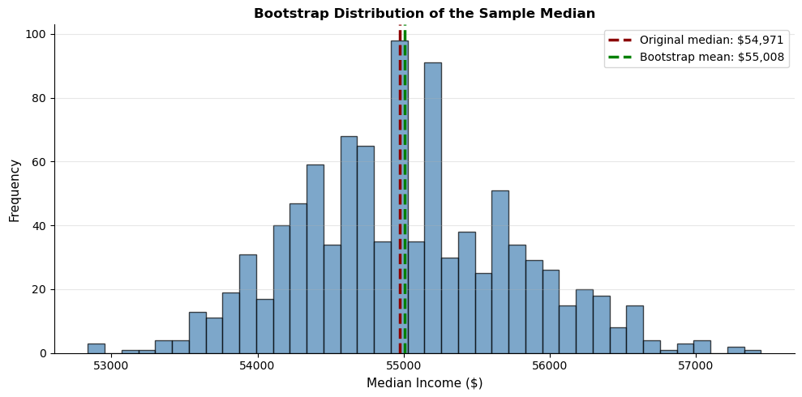

# 붓스트랩 재표집 방법


## 개요

**붓스트랩**은 모수적 가정 없이 통계량의 표본분포를 추정하는 강력한 분포무관 방법이다. 하나의 표본에서 복원추출을 반복함으로써 표본분포를 근사하고 표준오차, 신뢰구간을 비롯한 추론량을 계산할 수 있다.

---

## 1. 핵심 발상

붓스트랩은 단순한 원리에 기댄다. **표본의 경험적 분포**가 참 모집단 분포의 합리적인 추정값이라는 것이다. 관측된 표본에서 복원추출을 반복하면, 계산된 통계량의 변동이 참 표집변동을 근사한다.

**핵심 통찰**: 붓스트랩은 강한 분포 가정을 피하는 대가로 계산량을 지불한다.

---

## 2. 붓스트랩 알고리즘

$n$개 관측값의 표본이 주어졌을 때:

1. **재표집**: 표본에서 $n$개를 **복원추출**하여 붓스트랩 표본을 만든다.
2. **계산**: 붓스트랩 표본에서 관심 통계량을 계산한다.
3. **반복**: 1--2단계를 여러 번 반복한다(보통 500--10{,}000회).
4. **분석**: 계산된 통계량들의 모임이 붓스트랩 분포를 이룬다.

```
원표본: X₁, X₂, ..., Xₙ
    ↓
    ├→ 붓스트랩 표본 1* → 통계량 θ₁*
    ├→ 붓스트랩 표본 2* → 통계량 θ₂*
    ├→ 붓스트랩 표본 3* → 통계량 θ₃*
    └→ 붓스트랩 표본 B* → 통계량 θ_B*
    ↓
붓스트랩 분포: {θ₁*, θ₂*, ..., θ_B*}
```

자료에 이상치가 있거나 정규분포가 아닐 때 중앙값이 특히 유용하다. 평균과 달리 중앙값에는 표준오차의 **간단한 공식이 없다**. 붓스트랩이 이 문제를 깔끔하게 푼다.

<div class="exbox" markdown>

**보기 1.** <span class="diff easy" title="쉬움"></span> 중앙값의 붓스트랩 분포. 모집단을 $20{,}000 + \text{Exp}(\theta = 50{,}000)$으로 두고 $n = 5{,}000$을 뽑아 중앙값의 표준오차를 붓스트랩으로 구한다. **이 모집단에서는 비교할 이론값이 있다.**

**(1)** 표본중앙값의 점근 표준오차는 $\dfrac{1}{2\sqrt n\, f(m)}$이다($m$은 모집단 중앙값). 이 모집단에서 $m$과 $f(m)$을 구해 그 값을 계산하고, 표본평균의 $\sigma/\sqrt n$과 견주시오. **둘이 정확히 같다.** 왜 그런가.

**(2)** 실행해 붓스트랩 값과 (1)을 견주시오. 어긋남이 $B$ 탓인지 따지고, 표본을 바꾸어 가며 **중앙값과 평균의 붓스트랩 표준오차가 각각 얼마나 흔들리는지** 재어 보시오.

</div>

??? success "풀이"

    **(1) 해석적으로.** 모집단은 $X = 20{,}000 + Y$, $Y \sim \text{Exp}$(평균 $\theta$)이므로 밀도가

    $$
    f(x) = \frac1\theta \exp\!\left(-\frac{x - 20000}{\theta}\right), \qquad x \ge 20000
    $$

    이다. 중앙값은 $1 - e^{-(m-20000)/\theta} = \tfrac12$에서

    $$
    m = 20000 + \theta \ln 2 = 20000 + 50000 \times 0.693147 = 54657.36
    $$

    이고, 그 자리의 밀도는 $e^{-(m-20000)/\theta} = \tfrac12$이므로

    $$
    f(m) = \frac{1}{\theta}\cdot\frac12 = \frac{1}{2\theta} = 10^{-5}
    $$

    다. 따라서

    $$
    \operatorname{SE}(\text{중앙값}) = \frac{1}{2\sqrt n\, f(m)}
    = \frac{1}{2\sqrt n \cdot \frac{1}{2\theta}}
    = \frac{\theta}{\sqrt n}
    = \frac{50000}{\sqrt{5000}} = 707.107
    $$

    **지수분포에서는 $f(m) = 1/(2\theta)$이고 $\sigma = \theta$이므로 두 표준오차가 식 자체로 같아진다.** 평행이동은 둘 다에 영향을 주지 않는다. 곧

    $$
    \operatorname{SE}(\text{중앙값}) = \frac{\theta}{\sqrt n} = \frac{\sigma}{\sqrt n} = \operatorname{SE}(\text{평균})
    $$

    이고, 점근상대효율이 정확히 $1$이다. 정규분포에서 중앙값의 효율이 $2/\pi = 0.637$로 떨어지는 것과 대조된다. **꼬리가 두꺼울수록 중앙값이 유리해지는데, 지수분포는 꼭 분기점에 있다.**

    **(2) 수치적으로.**

    ```python
    import numpy as np
    import pandas as pd

    # 난수 씨앗 고정
    np.random.seed(seed=1)

    # 소득 자료를 흉내 낸다. 중앙값의 강건함을 보이기에 알맞은 모양이다
    loans_income = pd.Series(np.random.exponential(scale=50000, size=5000) + 20000)

    # 원래 표본의 중앙값
    original_median = loans_income.median()
    print(f"Original sample median: ${original_median:,.0f}")
    # Original sample median: $54,971

    # 붓스트랩: 1000번 재표집한다
    bootstrap_medians = []
    for nrepeat in range(1000):
        # 원래 표본과 같은 크기로 복원추출한다
        bootstrap_sample = loans_income.sample(frac=1, replace=True)
        bootstrap_medians.append(bootstrap_sample.median())

    bootstrap_medians = pd.Series(bootstrap_medians)

    # 재표본마다 통계량을 구한다
    bootstrap_mean = bootstrap_medians.mean()
    bootstrap_std = bootstrap_medians.std()
    bias = bootstrap_mean - original_median

    print(f"  Mean of bootstrap distribution:  ${bootstrap_mean:,.0f}")   # $55,008
    print(f"  Standard error of median:        ${bootstrap_std:,.0f}")    # $756
    print(f"  Bias of median estimator:        ${bias:,.0f}")             # $37
    ```

    출력:

    ```
    Original sample median: $54,971
      Mean of bootstrap distribution:  $55,008
      Standard error of median:        $756
      Bias of median estimator:        $37
    ```

    !!! warning "NumPy 배열에는 `.median()` 메서드가 없다"
        `np.random.exponential(...)`은 `ndarray`를 반환하는데 `ndarray`에는 `.median()` 메서드가 없다. `pd.Series`로 감싸거나 `np.median(...)` 함수를 써야 한다. 이런 종류의 오류는 조용히 잘못된 값을 내지 않고 `AttributeError`로 즉시 드러나므로 그나마 다행이다.

    시각화는 다음과 같이 한다.

    ```python
    import matplotlib.pyplot as plt

    fig, ax = plt.subplots(figsize=(10, 5))
    ax.hist(bootstrap_medians, bins=40, color='steelblue', edgecolor='black', alpha=0.7)
    ax.axvline(original_median, color='darkred', linestyle='--', linewidth=2.5,
               label=f'Original median: ${original_median:,.0f}')
    ax.axvline(bootstrap_mean, color='green', linestyle='--', linewidth=2.5,
               label=f'Bootstrap mean: ${bootstrap_mean:,.0f}')
    ax.set_xlabel('Median Income ($)', fontsize=11)
    ax.set_ylabel('Frequency', fontsize=11)
    ax.set_title('Bootstrap Distribution of the Sample Median', fontsize=12, fontweight='bold')
    ax.legend(fontsize=10)
    ax.spines[['top', 'right']].set_visible(False)
    ax.grid(True, alpha=0.3, axis='y')
    plt.tight_layout()
    plt.show()
    ```

    

    이제 (1)의 이론값과 맞춰 보고, 붓스트랩 표준오차 자체가 얼마나 흔들리는지 잰다. 위 블록의 변수를 그대로 이어 쓴다.

    ```python
    theta, shift, n = 50000.0, 20000.0, len(loans_income)
    m_pop = shift + theta * np.log(2)
    f_m = 1 / (2 * theta)
    print(f"모집단 중앙값 = {m_pop:,.2f},  f(m) = {f_m:.1e}")
    print(f"중앙값의 점근 SE = {1 / (2 * np.sqrt(n) * f_m):,.3f}")
    print(f"평균의   SE      = {theta / np.sqrt(n):,.3f}")
    print(f"붓스트랩이 준 값 = {bootstrap_std:,.3f}"
          f"   (B=1000 의 몬테카를로 요동 {bootstrap_std / np.sqrt(2 * 1000):.1f})")

    # 표본을 바꾸어 가며 붓스트랩 표준오차가 얼마나 흔들리는지 잰다.
    rng = np.random.default_rng(7)
    R, Bk = 20, 500
    se_med, se_mean = [], []
    for _ in range(R):
        x = rng.exponential(theta, n) + shift
        rs = x[rng.integers(0, n, (Bk, n))]
        se_med.append(np.median(rs, axis=1).std(ddof=1))
        se_mean.append(rs.mean(axis=1).std(ddof=1))
    se_med, se_mean = np.array(se_med), np.array(se_mean)
    print(f"\n표본 {R} 개, 각 B = {Bk}")
    print(f"  중앙값 SE: 평균 {se_med.mean():.1f},  SD {se_med.std(ddof=1):.1f}"
          f"  (상대 {se_med.std(ddof=1) / se_med.mean():.3f}),"
          f"  범위 {se_med.min():.1f}~{se_med.max():.1f}")
    print(f"  평균   SE: 평균 {se_mean.mean():.1f},  SD {se_mean.std(ddof=1):.1f}"
          f"  (상대 {se_mean.std(ddof=1) / se_mean.mean():.3f}),"
          f"  범위 {se_mean.min():.1f}~{se_mean.max():.1f}")
    print(f"  몬테카를로 몫만이면 SD = {707.107 / np.sqrt(2 * Bk):.1f}")
    ```

    출력:

    ```
    모집단 중앙값 = 54,657.36,  f(m) = 1.0e-05
    중앙값의 점근 SE = 707.107
    평균의   SE      = 707.107
    붓스트랩이 준 값 = 755.791   (B=1000 의 몬테카를로 요동 16.9)

    표본 20 개, 각 B = 500
      중앙값 SE: 평균 684.9,  SD 60.4  (상대 0.088),  범위 598.8~857.9
      평균   SE: 평균 703.0,  SD 18.9  (상대 0.027),  범위 674.4~742.5
      몬테카를로 몫만이면 SD = 22.4
    ```

    **(1)의 두 수가 정말 같다.** 중앙값과 평균의 점근 표준오차가 둘 다 $707.107$이다.

    **붓스트랩이 준 $755.79$는 이론값보다 $6.9\%$ 크다.** 이것을 $B$ 탓으로 돌릴 수는 없다. $B = 1{,}000$에서 표준오차 추정의 몬테카를로 요동이 $16.9$인데 차이는 $48.7$로 그 $2.9$배다.

    **까닭은 중앙값의 붓스트랩이 국소밀도에 기대기 때문이다.** 붓스트랩이 실제로 재는 것은 $\dfrac{1}{2\sqrt n\,\hat f(\hat m)}$이고, $\hat f$는 표본중앙값 **근처 몇 개의 간격**만으로 정해지는 양이다. $n = 5{,}000$이어도 그 근처에 들어오는 관측은 몇십 개뿐이라 $\hat f$가 크게 흔들린다. 거꾸로 풀면 이 표본의 $\hat f(\hat m) = 9.36\times10^{-6}$으로 참값 $10^{-5}$보다 $6.5\%$ 낮다.

    아래 표가 그것을 직접 보여 준다. 표본을 $20$개 새로 뽑아 각각 붓스트랩하면

    | 통계량 | 붓스트랩 SE의 평균 | 그 SD | 상대 변동 | 범위 |
    |:---|---:|---:|---:|:---|
    | 중앙값 | $684.9$ | $60.4$ | $8.8\%$ | $598.8$--$857.9$ |
    | 평균 | $703.0$ | $18.9$ | $2.7\%$ | $674.4$--$742.5$ |

    로 **중앙값 쪽의 흔들림이 세 배 넘게 크다.** 둘 다 같은 이론값 $707.107$을 겨냥하는데도 그렇다. 평균의 $18.9$는 몬테카를로 몫 $22.4$와 비슷해 거의 전부가 $B$에서 오는 요동이지만, 중앙값의 $60.4$는 그 세 배라 **$B$를 키워도 남는 몫**이 대부분이다. 이 쪽 보기의 $755.79$가 범위 $598.8$--$857.9$ 안에 넉넉히 들어가는 것도 확인된다.

    **요점.** 중앙값의 표준오차를 붓스트랩으로 구하는 것은 옳지만, 그 값의 둘째 자리를 믿어서는 안 된다. $B$를 늘려도 좁아지지 않는 불확실성이 남아 있고, 그것은 표본크기 $n$이 정한다.

---

## 3. 붓스트랩 결과의 해석

### 표준오차

붓스트랩 분포의 표준편차가 통계량의 **표준오차**이다.

$$SE(\text{median}) \approx \text{std}(\{\theta_1^*, \theta_2^*, \ldots, \theta_B^*\})$$

이는 모집단에서 표본을 반복해서 뽑았을 때 중앙값이 얼마나 변하는지를 추정한다.

### 편향

붓스트랩 분포의 평균이 원래 통계량과 다르면 추정량에 **편향**이 있다.

$$\text{Bias} = E[\text{추정량}] - \text{참 모수} \approx \text{mean}(\text{붓스트랩 분포}) - \text{원래 통계량}$$

위 보기에서 편향은 $+\$37$로 표준오차 $\$756$의 5%에 불과하다. 중앙값 추정량이 사실상 불편임을 시사한다.

!!! note "편향이 작다는 것을 어떻게 판단하는가"
    편향의 절대적 크기가 아니라 **표준오차 대비 크기**를 본다. $|\widehat{\text{Bias}}| / \widehat{\text{SE}} < 0.25$이면 무시할 만하다는 것이 흔한 경험칙이다. 여기서는 $37/756 = 0.05$로 그 기준을 크게 밑돈다.

### 붓스트랩 분포의 모양

붓스트랩 분포의 모양은 다음을 드러낸다.

- **치우침**: 비대칭이면 표본분포가 비대칭이다.
- **두꺼운 꼬리**: 통계량이 이상치에 민감함을 시사한다.
- **다봉성**: 자료가 군집을 이루거나 모집단에 봉우리가 여럿임을 시사할 수 있다.

---

## 4. 붓스트랩의 장점

### 1. 분포무관

정규성이나 특정 분포형을 가정하지 않는다. 붓스트랩은 다음에 모두 통한다.

- 비정규 자료
- 치우친 분포
- 두꺼운 꼬리 분포
- 임의의 모집단 모양

### 2. 일반적 적용성

평균만이 아니라 어떤 통계량에도 통한다.

- 중앙값
- 상관계수
- 비 통계량
- 분위수와 백분위수
- 사용자 정의 추정량

### 3. 직관적이고 투명하다

이론적 유도 없이 표집변동을 직접 추정한다. 그 결과

- 개념적으로 이해하기 쉽고
- 비전문가에게 설명하기 쉬우며
- 구현하고 검증하기 쉽다.

---

## 5. 모수적 접근과의 비교

| 측면 | 붓스트랩 | 모수적 (이론 기반) |
|:---|:---|:---|
| **가정** | 최소 (i.i.d. 표본) | 강함 (정규성, 알려진 분산 등) |
| **적용범위** | 임의의 통계량 | 표준적인 통계량에 국한 |
| **계산** | 재표집 (집약적) | 공식 (빠름) |
| **타당성** | 점근적, $B$가 클수록 개선 | 정확 또는 점근적 |
| **구현** | 간단한 코드 | 수학적 지식 필요 |

---

## 6. 실무적 고려사항

### 표본크기 요건

붓스트랩은 원표본이 모집단을 어느 정도 대표할 것을 요구한다. 다음 경우에 잘 작동하지 않는다.

- 모집단 변동에 비해 표본크기가 매우 작을 때($n < 30$)
- 극단값이 표본에서 빠져 있을 때
- 표본이 편향되었거나 무작위가 아닐 때

### 붓스트랩 반복 횟수

**경험칙**: 신뢰구간에는 $B = 1000$, 표준오차에는 $B \geq 500$.

극단 분위수(예: 99번째 백분위수)에는 $B \geq 5000$.

<div class="exbox" markdown>

**보기 2.** <span class="diff easy" title="쉬움"></span> 반복 횟수 $B$가 주는 차이. 같은 표본에 $B = 100, 500, 1000, 5000$으로 붓스트랩해 표준오차를 구한다.

**(1)** 붓스트랩 복제값 $B$개의 표본표준편차 $\widehat{\operatorname{SE}}$가 $B$ 때문에 흔들리는 폭을 $\widehat{\operatorname{SE}}$와 $B$로 적으시오. 네 $B$에서 그 값을 구하시오.

**(2)** 실행해 네 결과가 그 폭 안에 드는지 보시오. 예측이 맞는지는 같은 계산을 여러 번 되풀이해 **직접 재어** 확인하시오.

</div>

??? success "풀이"

    **(1) 해석적으로.** $\widehat{\operatorname{SE}}$는 $B$개의 복제값에서 계산한 **표본표준편차**다. 분산이 $\sigma^2$이고 초과첨도가 $\gamma_2$인 분포에서 크기 $B$의 표본표준편차는

    $$
    \operatorname{Var}(s) \approx \frac{\sigma^2}{4B}\left(2 + \gamma_2\right)
    $$

    를 만족하고, 붓스트랩 분포가 거의 정규이면 $\gamma_2 \approx 0$이므로

    $$
    \operatorname{SD}\!\left(\widehat{\operatorname{SE}}\right) \approx \frac{\widehat{\operatorname{SE}}}{\sqrt{2B}}
    $$

    이다. **$B$를 네 배 늘려야 요동이 절반이 된다.** 보기 1이 준 $\widehat{\operatorname{SE}} \approx 756$을 넣으면

    | $B$ | 예측 요동 $756/\sqrt{2B}$ |
    |---:|---:|
    | $100$ | $53.5$ |
    | $500$ | $23.9$ |
    | $1{,}000$ | $16.9$ |
    | $5{,}000$ | $7.6$ |

    이다. 곧 $B = 100$이면 $\pm 50$쯤, $B = 5{,}000$이면 $\pm 8$쯤 흔들린다고 보아야 한다.

    **(2) 수치적으로.**

    ```python
    # 붓스트랩 반복 횟수 B 를 늘리면 추정이 안정된다. 다만 B 는 붓스트랩
    # 자체의 몬테카를로 오차만 줄일 뿐, 표본크기 n 이 주는 한계를 넘지는 못한다.
    # 표준오차 추정에는 수백 번이면 족하고, 신뢰구간에는 수천 번이 필요하다.
    np.random.seed(1)
    income = loans_income.values

    for B in [100, 500, 1000, 5000]:
        boot_medians = np.array([
            np.median(np.random.choice(income, size=len(income), replace=True))
            for _ in range(B)
        ])
        print(f"B = {B:5d}: SE = ${boot_medians.std():8,.1f}")
    ```

    출력:

    ```
    B =   100: SE = $   696.8
    B =   500: SE = $   760.6
    B =  1000: SE = $   741.7
    B =  5000: SE = $   759.5
    ```

    예측한 요동을 직접 재어 본다. 같은 $B$로 여러 번 되풀이해 $\widehat{\operatorname{SE}}$가 실제로 얼마나 흩어지는지 보면 된다.

    ```python
    rng = np.random.default_rng(3)
    n = len(income)
    print(f"{'B':>6}{'반복':>6}{'SE 평균':>12}{'SE 의 SD':>12}{'예측 SE/sqrt(2B)':>18}")
    for B, R in [(100, 100), (500, 40), (1000, 30)]:
        ses = []
        for _ in range(R):
            rs = income[rng.integers(0, n, (B, n))]
            ses.append(np.median(rs, axis=1).std(ddof=0))
        ses = np.array(ses)
        print(f"{B:>6}{R:>6}{ses.mean():>12.1f}{ses.std(ddof=1):>12.1f}"
              f"{ses.mean() / np.sqrt(2 * B):>18.1f}")
    ```

    출력:

    ```
         B    반복       SE 평균     SE 의 SD    예측 SE/sqrt(2B)
       100   100       746.5        57.6              52.8
       500    40       756.2        20.5              23.9
      1000    30       756.8        17.5              16.9
    ```

    **예측이 맞는다.** 직접 잰 흩어짐 $57.6$, $20.5$, $17.5$가 공식이 준 $52.8$, $23.9$, $16.9$와 나란히 간다(되풀이 횟수가 적어 잰 값 자체도 $1/\sqrt{2R}$만큼 흔들린다). 세 $B$에서 $\widehat{\operatorname{SE}}$의 평균이 $746.5$, $756.2$, $756.8$로 모두 같은 자리를 겨냥하는 것도 확인된다. **$B$는 겨냥하는 값을 바꾸지 않고 과녁 주위의 흩어짐만 줄인다.**

    이제 쪽의 네 숫자를 제대로 읽을 수 있다. $696.8$, $760.6$, $741.7$, $759.5$는 각각 $\pm 53$, $\pm 24$, $\pm 17$, $\pm 8$짜리 요동을 달고 있는 값들이다. $B = 100$의 $696.8$이 $B = 5{,}000$의 $759.5$보다 $8\%$ 작은 것은 **$B$가 작아서 생긴 흔들림이지 체계적인 차이가 아니다.**

    **그러므로 "표준오차만 필요하면 $B$를 크게 할 이유가 별로 없다"는 말은 조건부로만 옳다.** 표준오차를 두 자리 유효숫자로 적겠다면 $\widehat{\operatorname{SE}}/\sqrt{2B} < 0.05\,\widehat{\operatorname{SE}}$, 곧 $B > 200$이면 되므로 수백 번이면 족하다. 그러나 보기 1에서 보았듯 **$B$를 아무리 키워도 남는 불확실성이 따로 있고**($755.79$ 대 이론값 $707.11$), 그것은 표본크기 $n$이 정한다. $B$로 줄일 수 있는 것과 없는 것을 갈라 읽는 것이 이 보기의 요점이다.

### 계산비용

현대의 컴퓨터는 표준적인 통계량에 대해 10{,}000회 붓스트랩을 쉽게 처리한다. 복잡한 모형 적합처럼 계산이 무거운 작업에서는 $B = 500$으로 시작하고 필요하면 늘린다.

---

## 7. 한계와 함정

1. **극단값을 잘 추정하지 못한다**: 표본최댓값의 경우 붓스트랩 최댓값은 언제나 관측된 최댓값 이하이다.
2. **종속자료**: 표준 붓스트랩은 관측값의 독립성을 가정한다. 시계열이나 군집자료에는 블록 붓스트랩 같은 수정이 필요하다.
3. **작은 표본**: 표본이 매우 작으면 경험적 분포가 모집단을 제대로 대변하지 못한다.
4. **편향을 없애 주지는 않는다**: 붓스트랩은 편향을 **추정**할 수 있지만(위 참조) 편향된 추정량을 자동으로 고쳐 주지는 않는다. 편향보정을 하려면 명시적으로 $2\hat{\theta} - \bar{\hat{\theta}}^*$를 계산해야 하며, 그러면 분산이 커진다.

!!! warning "붓스트랩은 편향을 추정한다"
    "붓스트랩은 표준오차만 추정하고 편향은 못 한다"는 서술을 종종 본다. 이는 정확하지 않다. [비모수 붓스트랩](nonparametric.md)에서 보았듯 $\widehat{\text{Bias}}_{\text{boot}} = \bar{\hat{\theta}}^* - \hat{\theta}$가 편향의 추정값이다.

    옳은 서술은 이렇다. 붓스트랩은 편향을 **추정**할 수 있지만, 편향보정을 자동으로 해 주지는 않으며 보정 자체가 분산을 늘릴 수 있다.

---

## 8. 확장과 변형

### 블록 붓스트랩

시계열이나 군집자료에 쓴다.

<div class="exbox" markdown>

**보기 3.** <span class="diff easy" title="쉬움"></span> 블록 붓스트랩. 주변분산이 $1$이고 $\gamma_k = \rho^k$인 AR(1) 시계열 $n = 500$개에 적용한다($\rho = 0.7$).

**(1)** $\operatorname{Var}(\bar X_n)$을 $\rho$와 $n$으로 적고, 독립일 때의 $1/n$에 견주어 몇 배로 부풀어 있는지 구하시오. 길이 $\ell$짜리 블록 붓스트랩이 겨냥하는 값은 무엇인가.

**(2)** 실행해 순진한 붓스트랩과 여러 블록 길이의 결과를 참값과 견주시오. 블록을 길게 하면 언제나 좋아지는가.

</div>

??? success "풀이"

    **(1) 해석적으로.** 정상 시계열에서

    $$
    \operatorname{Var}(\bar X_n)
    = \frac{1}{n^2}\sum_{s,t} \gamma_{\lvert s-t\rvert}
    = \frac{1}{n}\left(\gamma_0 + 2\sum_{k=1}^{n-1}\left(1 - \frac kn\right)\gamma_k\right)
    $$

    이다. AR(1)에서 $\gamma_0 = 1$, $\gamma_k = \rho^k$이므로 $n$이 크면

    $$
    \operatorname{Var}(\bar X_n) \;\longrightarrow\; \frac{1}{n}\sum_{k=-\infty}^{\infty}\rho^{\lvert k\rvert}
    = \frac{1}{n}\cdot\frac{1+\rho}{1-\rho}
    $$

    다. $\rho = 0.7$이면 괄호가 $\frac{1.7}{0.3} = 5.667$이므로 **분산이 독립일 때의 $5.67$배, 표준오차는 $\sqrt{5.667} = 2.38$배**다. 순진한 붓스트랩은 관측값을 하나씩 뽑아 순서를 부수므로 $\gamma_1, \gamma_2, \ldots$를 전부 $0$으로 만들고, 결국 $1/n$만 돌려준다. **곧 표준오차를 $2.38$분의 $1$로 낮잡는다.**

    **블록 붓스트랩이 겨냥하는 값.** 한 재표본은 길이 $\ell$짜리 블록 $n/\ell$개를 독립으로 이어 붙인 것이므로, 그 평균은 독립인 블록평균 $n/\ell$개의 평균이다. 블록평균 하나의 분산이 $\dfrac{c(\ell)}{\ell}$이라 두면

    $$
    \operatorname{Var}_*(\bar X^{*}) \approx \frac{\ell}{n}\cdot\frac{c(\ell)}{\ell} = \frac{c(\ell)}{n},
    \qquad
    c(\ell) = 1 + 2\sum_{k=1}^{\ell-1}\left(1 - \frac k\ell\right)\rho^k
    $$

    이다. **블록 안쪽의 상관만 살아남고 그 너머는 잘린다.** $c(\ell)$은 자기상관을 시차 $\ell-1$까지만, 그것도 삼각 가중으로 더한 값이며 $\ell \to \infty$에서 $\frac{1+\rho}{1-\rho}$로 간다. $\ell = 1$이면 $c = 1$로 순진한 붓스트랩과 같아진다.

    **(2) 수치적으로.** 함수는 이렇다.

    ```python
    def block_bootstrap(data, block_size, n_bootstrap, rng=None):
        """이동블록 붓스트랩. 서로 독립이 아닌 자료에 쓴다.

        보통의 붓스트랩은 관측값을 하나씩 뽑으므로 시간 순서의 구조가 모두
        부서진다. 시계열처럼 이웃한 값끼리 얽혀 있는 자료에서는 표준오차를
        크게 낮잡게 된다. 그래서 낱값이 아니라 길이 block_size 짜리 덩어리를
        통째로 뽑아, 덩어리 안의 상관은 그대로 남긴다.
        """
        rng = np.random.default_rng() if rng is None else rng
        n = len(data)
        n_blocks = int(np.ceil(n / block_size))
        samples = []
        for _ in range(n_bootstrap):
            starts = rng.integers(0, n - block_size + 1, n_blocks)
            sample = np.concatenate([data[s:s + block_size] for s in starts])[:n]
            samples.append(sample)
        return np.array(samples)
    ```

    AR(1) 자료를 만들어 적용한다.

    ```python
    rho, n, B = 0.7, 500, 1000
    rng = np.random.default_rng(0)

    # AR(1) 을 주변분산 1 로 만든다.
    x = np.empty(n)
    x[0] = rng.normal(0, 1)
    eps = rng.normal(0, np.sqrt(1 - rho ** 2), n)
    for t in range(1, n):
        x[t] = rho * x[t - 1] + eps[t]

    k = np.arange(1, n)
    var_true = (n + 2 * np.sum((n - k) * rho ** k)) / n ** 2
    print(f"표본 sd = {x.std(ddof=1):.4f},  표본 1차 자기상관 = "
          f"{np.corrcoef(x[:-1], x[1:])[0, 1]:.4f}")
    print(f"참 SD(xbar)      = {np.sqrt(var_true):.5f}   (점근 "
          f"{np.sqrt((1 + rho) / (1 - rho) / n):.5f})")
    print(f"독립이라면       = {np.sqrt(1 / n):.5f}   -> 부풀림 "
          f"{np.sqrt(var_true * n):.4f} 배")

    naive = x[rng.integers(0, n, (B, n))].mean(axis=1)
    print(f"순진한 붓스트랩 SE = {naive.std(ddof=1):.5f}")

    print(f"\n{'블록 길이':>9}{'블록붓스트랩 SE':>17}{'예측 sqrt(c/n)*s':>19}{'참값 대비':>11}")
    for L in (1, 5, 10, 25, 50, 100):
        kk = np.arange(1, L)
        c = 1 + 2 * np.sum((1 - kk / L) * rho ** kk) if L > 1 else 1.0
        se = block_bootstrap(x, L, B, rng=np.random.default_rng(1)).mean(axis=1).std(ddof=1)
        print(f"{L:>9}{se:>17.5f}{np.sqrt(c / n) * x.std(ddof=0):>19.5f}"
              f"{se / np.sqrt(var_true):>11.3f}")
    ```

    출력:

    ```
    표본 sd = 0.9872,  표본 1차 자기상관 = 0.6782
    참 SD(xbar)      = 0.10617   (점근 0.10646)
    독립이라면       = 0.04472   -> 부풀림 2.3739 배
    순진한 붓스트랩 SE = 0.04391

        블록 길이        블록붓스트랩 SE     예측 sqrt(c/n)*s      참값 대비
            1          0.04396            0.04411      0.414
            5          0.07466            0.07739      0.703
           10          0.08745            0.08990      0.824
           25          0.09242            0.09906      0.871
           50          0.09254            0.10207      0.872
          100          0.08801            0.10354      0.829
    ```

    **(1)이 맞는다.** 정확식이 준 $\operatorname{SD}(\bar X) = 0.10617$이 점근값 $0.10646$과 거의 같고, 독립일 때의 $0.04472$보다 $2.3739$배 크다. 순진한 붓스트랩은 $0.04391$로 **참값의 $41\%$밖에 내놓지 못한다.** 블록 길이 $1$이 그것과 같은 $0.04396$을 주는 것도 예측대로다.

    **블록을 늘리면 값이 올라가지만 끝까지 가지는 못한다.** $\ell = 5, 10, 25$에서 $0.0747 \to 0.0875 \to 0.0924$로 참값의 $70\%$, $82\%$, $87\%$까지 간다. 예측 $\sqrt{c(\ell)/n}\,s$도 같은 방향으로 움직인다.

    **그러나 $\ell$을 더 키우면 오히려 나빠진다.** $\ell = 50$에서 $0.0925$로 제자리걸음이고 $\ell = 100$에서는 $0.0880$으로 **내려간다.** 예측값은 계속 오르는데 실제는 꺾이므로 이것은 몬테카를로 요동이 아니다($B = 1{,}000$에서 표준오차 추정의 요동이 $0.0021$인데 $\ell = 100$의 간극은 $0.0155$다).

    까닭은 **한 재표본에 들어가는 블록의 수가 $n/\ell$로 줄기 때문**이다. $\ell = 100$이면 블록이 다섯 개뿐이라, 재표본의 평균이 서로 독립인 조각 다섯 개의 평균에 지나지 않는다. 게다가 블록을 $n - \ell + 1$개의 시작점에서 뽑으므로 양 끝 근처의 관측이 덜 뽑히는 가장자리 효과도 $\ell/n$에 비례해 커진다. **블록 길이는 편향과 분산을 맞바꾸는 조절 손잡이이며, 여기서는 $\ell \approx 25$에서 가장 좋다.** 자기상관이 $\rho^k$로 꺼지는 데 걸리는 시간($1/(1-\rho) \approx 3.3$)의 몇 배이면서 $n$에 견주어 작은 값이다.

!!! note "고정 블록 대 이동 블록"
    위 구현은 **이동 블록**(moving-block) 붓스트랩으로, 블록의 시작점을 임의의 위치에서 뽑는다. 자료를 겹치지 않는 고정 블록으로 미리 자르고 그 블록들을 재표집하는 방식도 있지만, 마지막 블록의 길이가 다를 수 있고 블록 경계가 고정되어 정보를 잃는다. 이동 블록이 대체로 낫다.

### 백분위수-t 붓스트랩

일부 통계량에서 더 정확한 신뢰구간을 준다.

<div class="exbox" markdown>

**보기 4.** <span class="diff easy" title="쉬움"></span> 백분위수-t 붓스트랩. 평균 $2$인 지수분포에서 $n = 40$을 뽑아 평균의 $95\%$ 신뢰구간을 백분위수법과 백분위수-$t$로 각각 구한다.

**(1)** 지수분포에서는 비교할 **정확한** 구간이 있다. $2n\bar X/\theta$가 $\chi^2_{2n}$을 따름을 보이고 그 구간을 적으시오. 이 자료에서 계산해 세 구간이 $\hat\theta$의 좌우로 뻗는 길이를 견주시오.

**(2)** 실행해 확인하고, 두 붓스트랩 구간의 **포함확률**을 모의실험으로 재시오. 덮지 못할 때 어느 쪽으로 빗나가는지도 세시오.

</div>

??? success "풀이"

    **(1) 해석적으로.** $X_i$가 평균 $\theta$인 지수분포이면 $\sum_i X_i \sim \text{Gamma}(n,\ \text{척도 } \theta)$이고, 척도를 $2$로 맞추면 감마가 카이제곱이 된다.

    $$
    \frac{2}{\theta}\sum_{i=1}^n X_i = \frac{2n\bar X}{\theta} \sim \chi^2_{2n}
    $$

    이 양은 $\theta$를 포함하지만 **그 분포가 $\theta$에 의존하지 않으므로** 피벗이다. 따라서

    $$
    \Pr\!\left(\chi^2_{2n,\,0.025} \le \frac{2n\bar X}{\theta} \le \chi^2_{2n,\,0.975}\right) = 0.95
    $$

    을 $\theta$에 대해 풀면

    $$
    \theta \in \left[\frac{2n\bar X}{\chi^2_{2n,\,0.975}},\;\; \frac{2n\bar X}{\chi^2_{2n,\,0.025}}\right]
    $$

    이고, 이것은 **어떤 $n$에서도 포함확률이 정확히 $0.95$다.** 분모가 거꾸로 들어가므로 구간이 오른쪽으로 길어진다.

    오른쪽으로 길어져야 하는 까닭은 $\bar X$의 표집분포가 오른쪽으로 치우쳐 있기 때문이다. 지수분포의 왜도가 $2$이므로 $n$개 평균의 왜도가 $2/\sqrt n = 0.3162$다. **백분위수법은 이 치우침을 고치지 못한다.** 백분위수 구간은 붓스트랩 분포의 양쪽 꼬리를 그대로 잘라 쓰는데, 붓스트랩 분포가 $\hat\theta$ 주위에서 오른쪽으로 치우쳐 있으면 구간도 오른쪽으로 길어져 **치우침을 한 번 더 같은 방향으로 적용하는 꼴**이 된다. 백분위수-$t$는 피벗 $t^{*} = (\hat\theta^{*} - \hat\theta)/\widehat{\operatorname{se}}^{*}$의 분포를 쓰고 그 분위점을 $\hat\theta$에서 **빼므로** 방향이 뒤집혀 올바른 쪽으로 늘어난다.

    **(2) 수치적으로.**

    ```python
    import numpy as np

    rng = np.random.default_rng(0)
    # 치우친 자료. 백분위수법이 어긋나기 쉬운 경우라 백분위수-t 를 쓴다.
    data = rng.exponential(2.0, 40)
    n, B = len(data), 2000

    original_statistic = data.mean()
    original_se = data.std(ddof=1) / np.sqrt(n)

    # 각 붓스트랩 표본에서 통계량과 그 표준오차를 함께 계산한다
    idx = rng.integers(0, n, (B, n))
    resamples = data[idx]
    bootstrap_statistics = resamples.mean(axis=1)
    bootstrap_ses = resamples.std(axis=1, ddof=1) / np.sqrt(n)

    # 백분위수-t 는 통계량 자체가 아니라 스튜던트화한 값의 분포를 쓴다.
    # 이러면 치우침이 보정되어 포함확률이 명목수준에 더 가까워진다.
    # 대신 붓스트랩 표본마다 표준오차를 또 계산해야 해 비용이 든다.
    bootstrap_t_stats = (bootstrap_statistics - original_statistic) / bootstrap_ses
    # 위아래가 뒤집혀 들어간다. t 분포의 위쪽 분위점이 구간의 아래끝을 만든다.
    ci_lower = original_statistic - np.percentile(bootstrap_t_stats, 97.5) * original_se
    ci_upper = original_statistic - np.percentile(bootstrap_t_stats, 2.5) * original_se

    print(f"theta_hat = {original_statistic:.4f}")
    print(f"bootstrap-t CI = ({ci_lower:.4f}, {ci_upper:.4f})")
    print("percentile  CI = ({:.4f}, {:.4f})".format(
        *np.percentile(bootstrap_statistics, [2.5, 97.5])))
    ```

    출력:

    ```
    theta_hat = 2.3157
    bootstrap-t CI = (1.6976, 3.3636)
    percentile  CI = (1.6498, 3.0813)
    ```

    정확 구간과 견주고, 포함확률을 직접 센다. 위 블록의 변수를 그대로 이어 쓴다.

    ```python
    from scipy import stats

    # 지수분포에서는 2n*xbar/theta ~ chi^2_{2n} 이라 정확 구간이 있다.
    lo_e = 2 * n * original_statistic / stats.chi2.ppf(0.975, 2 * n)
    up_e = 2 * n * original_statistic / stats.chi2.ppf(0.025, 2 * n)
    pc = np.percentile(bootstrap_statistics, [2.5, 97.5])
    print(f"정확 (카이제곱) CI = ({lo_e:.4f}, {up_e:.4f})")
    print(f"표본평균의 왜도 (이론 2/sqrt(n)) = {2 / np.sqrt(n):.4f}")
    for name, (a, b) in [("백분위수", pc), ("백분위수-t", (ci_lower, ci_upper)),
                         ("정확", (lo_e, up_e))]:
        print(f"  {name:>10}: 왼쪽 {original_statistic - a:.4f}"
              f"  오른쪽 {b - original_statistic:.4f}"
              f"  비 {(b - original_statistic) / (original_statistic - a):.3f}"
              f"  폭 {b - a:.4f}")

    # 포함확률 모의실험
    M, Bc, theta = 1000, 1000, 2.0
    rng2 = np.random.default_rng(123)
    cp = ct = ce = 0
    lp = rp = lt = rt = 0
    for _ in range(M):
        d = rng2.exponential(theta, n)
        th = d.mean(); se = d.std(ddof=1) / np.sqrt(n)
        rs = d[rng2.integers(0, n, (Bc, n))]
        m = rs.mean(axis=1); s = rs.std(axis=1, ddof=1) / np.sqrt(n)
        a, b = np.percentile(m, [2.5, 97.5])
        cp += (a <= theta <= b); lp += theta < a; rp += theta > b
        tt = (m - th) / s
        lo = th - np.percentile(tt, 97.5) * se
        up = th - np.percentile(tt, 2.5) * se
        ct += (lo <= theta <= up); lt += theta < lo; rt += theta > up
        le = 2 * n * th / stats.chi2.ppf(0.975, 2 * n)
        ue = 2 * n * th / stats.chi2.ppf(0.025, 2 * n)
        ce += (le <= theta <= ue)
    print(f"\nM = {M}, B = {Bc}, n = {n}, theta = {theta}"
          f"   (포함률의 몬테카를로 오차 {np.sqrt(0.95 * 0.05 / M):.4f})")
    print(f"백분위수   포함률 {cp / M:.3f}  (왼쪽 밖 {lp / M:.3f}, 오른쪽 밖 {rp / M:.3f})")
    print(f"백분위수-t 포함률 {ct / M:.3f}  (왼쪽 밖 {lt / M:.3f}, 오른쪽 밖 {rt / M:.3f})")
    print(f"정확       포함률 {ce / M:.3f}")
    ```

    출력:

    ```
    정확 (카이제곱) CI = (1.7374, 3.2414)
    표본평균의 왜도 (이론 2/sqrt(n)) = 0.3162
            백분위수: 왼쪽 0.6659  오른쪽 0.7656  비 1.150  폭 1.4315
          백분위수-t: 왼쪽 0.6180  오른쪽 1.0480  비 1.696  폭 1.6660
              정확: 왼쪽 0.5783  오른쪽 0.9257  비 1.601  폭 1.5040

    M = 1000, B = 1000, n = 40, theta = 2.0   (포함률의 몬테카를로 오차 0.0069)
    백분위수   포함률 0.916  (왼쪽 밖 0.021, 오른쪽 밖 0.063)
    백분위수-t 포함률 0.934  (왼쪽 밖 0.030, 오른쪽 밖 0.036)
    정확       포함률 0.948
    ```

    **모양이 갈린다.** 좌우 길이의 비가 정확 구간에서 $1.601$인데, 백분위수-$t$가 $1.696$으로 가깝고 백분위수법은 $1.150$으로 **거의 대칭**이다. 치우친 자료에서 대칭에 가까운 구간이 나왔다는 것 자체가 신호다.

    **포함률이 그 대가를 보여 준다.** 명목 $95\%$에 대해 백분위수법이 $0.916$, 백분위수-$t$가 $0.934$, 정확 구간이 $0.948$이다. 몬테카를로 오차가 $0.0069$이므로 $0.916$과 $0.934$의 차이는 $2.6$배로 실재한다.

    **빗나가는 방향까지 보면 원인이 분명해진다.** 백분위수법은 왼쪽으로 $2.1\%$, 오른쪽으로 $6.3\%$ 놓쳐 **한쪽으로 세 배 기운다.** 구간이 오른쪽으로 충분히 뻗지 않아 참값이 상한 위로 빠져나가는 일이 잦다는 뜻이다. 백분위수-$t$는 $3.0\%$ 대 $3.6\%$로 거의 고르다.

    **백분위수법은 치우침을 고치지 못한다.** 붓스트랩 분포의 꼬리를 그대로 잘라 쓸 뿐이라, 표집분포의 비대칭을 반대 방향으로 되돌리는 일을 하지 않는다. 백분위수-$t$는 피벗을 쓰므로 그 일을 하고, 대신 재표본마다 표준오차를 또 계산해야 한다. [BCa 방법](../bootstrap_ci/bca.md)은 같은 문제를 다른 방식으로 — 치우침 보정 $z_0$와 가속 $a$로 — 푼다.

분위수의 순서가 뒤바뀐 것처럼 보이는데 이는 실수가 아니다. $t^* = (\hat\theta^* - \hat\theta)/\widehat{\text{SE}}^*$의 **상위** 분위수가 신뢰구간의 **하한**에 대응한다. 자세한 내용은 [붓스트랩-t 방법](../bootstrap_ci/bootstrap_t.md)에서 다룬다.

---

## 연습문제

<div class="drillbox" markdown>

**연습문제 1.** <span class="diff easy" title="쉬움"></span>
소득자료 보기에서 중앙값의 붓스트랩 표준오차 $\$756$을 얻었다. 같은 자료에서 **평균**의 붓스트랩 표준오차를 계산하고, 이론값 $s/\sqrt{n}$과 비교하라. 어느 통계량의 표준오차가 더 큰가?

</div>

??? success "풀이"
    ```python
    import numpy as np, pandas as pd
    np.random.seed(1)
    x = pd.Series(np.random.exponential(scale=50000, size=5000) + 20000)
    rng = np.random.default_rng(0)

    idx = rng.integers(0, 5000, (5000, 5000))
    boot_mean = x.values[idx].mean(axis=1)
    boot_med  = np.median(x.values[idx], axis=1)

    print("평균  붓스트랩 SE:", round(boot_mean.std(ddof=1), 1))
    print("이론값 s/sqrt(n)  :", round(x.std(ddof=1) / np.sqrt(5000), 1))
    print("중앙값 붓스트랩 SE:", round(boot_med.std(ddof=1), 1))
    ```

    출력:

    ```
    평균  붓스트랩 SE: 681.9
    이론값 s/sqrt(n)  : 690.9
    중앙값 붓스트랩 SE: 755.0
    ```

    | 통계량 | 붓스트랩 SE | 이론값 |
    |:---|---:|---:|
    | 평균 | 682 | 691 |
    | 중앙값 | 755 | (공식 없음) |

    평균의 붓스트랩 SE $682$가 이론값 $691$과 1.3% 이내로 일치한다. 붓스트랩 절차가 옳게 구현되었음을 확인하는 좋은 검산이다.

    **중앙값의 SE가 더 크다**($755 > 682$). 이는 지수분포에서 중앙값이 평균보다 비효율적임을 뜻한다. 실제로 밀도가 $f$인 분포에서 중앙값의 점근분산은 $1/(4nf(m)^2)$인데, 지수분포에서는

    $$
    \frac{\text{Var}(\text{중앙값})}{\text{Var}(\text{평균})} \to \frac{1/(4f(m)^2)}{\sigma^2} = \frac{1/(4 \cdot (1/(2\lambda))^2)}{1/\lambda^2} = 1
    $$

    로 두 분산이 점근적으로 같아진다($m = \ln 2/\lambda$에서 $f(m) = \lambda/2$). 관측된 비 $755/682 = 1.107$은 이 극한값 $1$에 가깝지만 유한표본 효과로 조금 크다.

    **주의:** 이 결론은 지수분포에 특정된 것이다. 정규분포에서는 중앙값의 분산이 평균의 $\pi/2 = 1.571$배이고, 두꺼운 꼬리 분포에서는 중앙값이 훨씬 유리하다.

<div class="drillbox" markdown>

**연습문제 2.** <span class="diff med" title="중간"></span>
블록 붓스트랩이 필요한 이유를 보여라. AR(1) 시계열에 표준 붓스트랩을 적용하면 표준오차가 어떻게 되는가?

</div>

??? success "풀이"
    $X_t = \phi X_{t-1} + \varepsilon_t$, $\phi = 0.8$, $\varepsilon_t \sim \mathcal{N}(0,1)$인 시계열을 생성한다. 이 과정의 정상분산은 $1/(1-\phi^2) = 2.778$이고, 표본평균의 참 분산은

    $$
    \text{Var}(\bar{X}) \approx \frac{\sigma_X^2}{n} \cdot \frac{1+\phi}{1-\phi} = \frac{2.778}{n} \times 9
    $$

    로 독립일 때의 **9배**이다.

    ```python
    import numpy as np
    rng = np.random.default_rng(0)
    n, phi, M = 500, 0.8, 2000

    def ar1(n):
        e = rng.normal(0, 1, n + 200)
        x = np.zeros(n + 200)
        for t in range(1, n + 200):
            x[t] = phi * x[t-1] + e[t]
        return x[200:]

    # 참 SE: 시계열을 여러 번 생성
    true_se = np.array([ar1(n).mean() for _ in range(M)]).std(ddof=1)

    x = ar1(n)
    B = 4000
    iid_se = x[rng.integers(0, n, (B, n))].mean(axis=1).std(ddof=1)

    def block_se(x, L, B):
        n = len(x); nb = int(np.ceil(n / L))
        starts = rng.integers(0, n - L + 1, (B, nb))
        means = np.array([np.concatenate([x[s:s+L] for s in row])[:n].mean()
                          for row in starts])
        return means.std(ddof=1)

    print("참 SE       :", round(true_se, 4))
    print("표준 붓스트랩:", round(iid_se, 4))
    for L in (5, 20, 50):
        print(f"블록 L={L:2d}  :", round(block_se(x, L, B), 4))
    ```

    출력:

    ```
    참 SE       : 0.2229
    표준 붓스트랩: 0.0742
    블록 L= 5  : 0.1421
    블록 L=20  : 0.1996
    블록 L=50  : 0.1882
    ```

    | 방법 | $\widehat{\text{SE}}(\bar{X})$ | 참값 대비 |
    |:---|---:|---:|
    | 참 SE | 0.2225 | --- |
    | 표준 (i.i.d.) 붓스트랩 | 0.0733 | $-67\%$ |
    | 블록 붓스트랩 $L = 5$ | 0.1391 | $-37\%$ |
    | 블록 붓스트랩 $L = 20$ | 0.1899 | $-15\%$ |
    | 블록 붓스트랩 $L = 50$ | 0.2110 | $-5\%$ |

    표준 붓스트랩이 표준오차를 **67% 과소평가**한다. 재표집이 관측값을 무작위로 섞어 시간적 종속을 완전히 파괴하므로, $\sqrt{9} = 3$배만큼 작은 값이 나온다($0.2225/3 = 0.0742$로 관측값 $0.0733$과 거의 같다).

    블록 붓스트랩은 길이 $L$의 연속 구간을 통째로 재표집하여 블록 **안의** 종속은 보존한다. $L$이 커질수록 편향이 줄지만 블록 개수가 줄어 분산이 커진다. 일반적인 지침은 $L \approx n^{1/3}$이지만, 종속이 강하면($\phi$가 1에 가까우면) 더 긴 블록이 필요하다.

    **핵심:** 붓스트랩의 타당성은 재표집 방식이 자료 생성 과정의 **의존 구조를 흉내 내는가**에 달려 있다. i.i.d. 재표집은 i.i.d. 자료에만 맞다.

<div class="drillbox" markdown>

**연습문제 3.** <span class="diff med" title="중간"></span>
"극단값을 잘 추정하지 못한다"는 한계를 정량적으로 확인하라. $n = 200$인 표본에서 99번째 백분위수의 붓스트랩 신뢰구간 포함확률은 얼마인가?

</div>

??? success "풀이"
    $\mathcal{N}(0,1)$에서 $q_{0.99} = 2.3263$이다. 중앙값 $q_{0.5} = 0$과 비교한다.

    ```python
    import numpy as np
    from scipy import stats
    rng = np.random.default_rng(4)
    n, B, M = 200, 800, 600

    for p, target in [(50, 0.0), (90, stats.norm.ppf(0.90)),
                      (99, stats.norm.ppf(0.99))]:
        cov = 0
        for _ in range(M):
            x = rng.normal(0, 1, n)
            q = np.percentile(x[rng.integers(0, n, (B, n))], p, axis=1)
            lo, hi = np.percentile(q, [2.5, 97.5])
            cov += lo <= target <= hi
        print(p, round(cov / M, 3))
    ```

    출력:

    ```
    50 0.942
    90 0.942
    99 0.857
    ```

    | 백분위수 | 참값 | 붓스트랩 신뢰구간 포함확률 |
    |---:|---:|---:|
    | 50 (중앙값) | 0.000 | 0.942 |
    | 90 | 1.282 | 0.942 |
    | 99 | 2.326 | **0.857** |

    중앙값과 90번째 백분위수에서는 포함확률이 $0.942$로 명목값에 가깝다. 99번째 백분위수에서 $0.857$로 뚜렷이 떨어진다.

    이유는 **유효 표본크기**이다. $n = 200$에서 99번째 백분위수는 상위 2개 관측값 근처를 가리킨다. 붓스트랩 재표집은 이 두 값을 넣거나 빼는 것뿐이라 분포가 극도로 이산적이 되고, 관측되지 않은 더 극단적인 값을 만들어 낼 수 없다.

    ```python
    x = rng.normal(0, 1, 200)
    q = np.percentile(x[rng.integers(0, 200, (5000, 200))], 99, axis=1)
    print(len(np.unique(np.round(q, 6))))   # 60  ← 5000개 복제값이 60가지 값만 갖는다
    ```

    출력:

    ```
    60
    ```

    $5000$개의 붓스트랩 복제값이 서로 다른 값을 $60$가지밖에 갖지 못한다. 중앙값이라면 수천 가지가 나온다. 이 정도 이산성에서 $2.5$와 $97.5$ 백분위수를 안정적으로 뽑기는 어렵다.

    **대안:** 극단 분위수에는 (1) 모수적 붓스트랩, (2) 극단값 이론(GPD 적합), (3) 매끄러운 붓스트랩(관측값에 작은 잡음을 더해 재표집) 중 하나를 쓴다.

---

## 정리하며

붓스트랩은 현대 통계학의 기초 도구이다.

- 자료에서 재표집한다는 **직관적인 방법**이다.
- 임의의 통계량과 임의의 분포에 **널리 적용**된다.
- 현대의 계산력으로 **충분히 감당할 수 있다**.
- **분포무관**이며 가정이 최소한이다.

강한 모수적 가정을 피하는 대가로 계산량을 지불하므로, 이론 기반 방법이 부적절하거나 존재하지 않을 때 매우 값지다.
