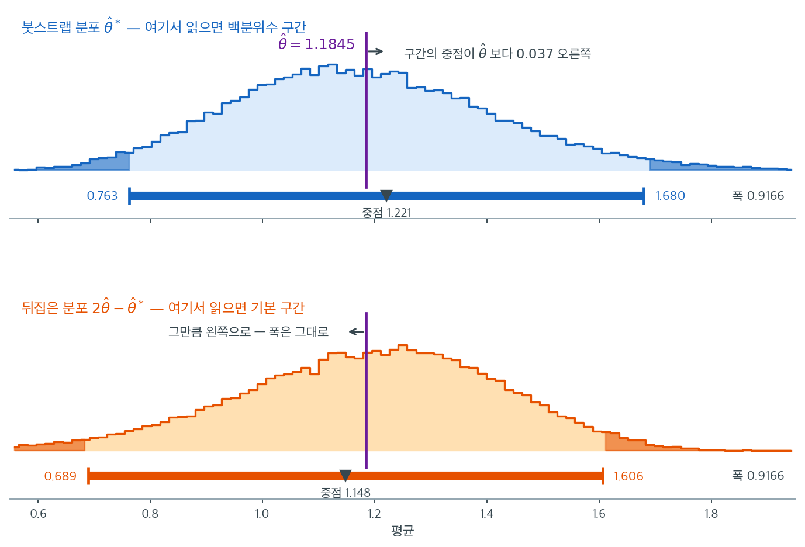

# 붓스트랩 신뢰구간 방법 (코드)

## 개요

붓스트랩 신뢰구간은 분포 가정에 기대지 않고 모수 추정의 불확실성을 정량화하는 방법이다. 이 페이지에서는 세 가지 붓스트랩 신뢰구간 방법 — 백분위수, 기본(역백분위수), BCa(편향보정 가속) — 을 고전적 구간이 신뢰하기 어려울 수 있는 비정규(Poisson) 표본에 적용한다. 각 방법은 경험적 붓스트랩 분포를 서로 다른 방식으로 활용하며, 단순함과 정확성 사이에서 다른 절충을 제공한다.

---

## 1. 붓스트랩 원리

관측 표본 $x_1, x_2, \ldots, x_n$이 주어졌을 때, 자료에서 **복원추출**로 반복 재표집하여 통계량 $\hat\theta = T(x_1, \ldots, x_n)$의 표집분포를 근사한다. 각 붓스트랩 반복 $\hat\theta^{*(b)}$($b = 1, \ldots, B$)는 원래 관측들로부터 균등하게 뽑은 크기 $n$의 재표본에서 계산된다.

---

## 2. 백분위수법

백분위수법은 붓스트랩 분포의 분위수에서 신뢰한계를 직접 읽는다. $100(1-\alpha)$% 신뢰구간은

$$
\text{CI}_{\text{pct}} = \bigl[\hat\theta^*_{\alpha/2},\;\hat\theta^*_{1 - \alpha/2}\bigr]
$$

이다. 여기서 $\hat\theta^*_q$는 붓스트랩 분포의 $q$번째 분위수이다.

<div class="exbox" markdown>

**보기 1.** <span class="diff easy" title="쉬움"></span> 백분위수법의 구현. 이 방법에는 다른 방법에 없는 성질이 하나 있다. **척도를 바꾸어도 답이 달라지지 않는다.**

**(1)** $g$가 순증가 함수일 때, $g(\theta)$에 대한 백분위수 구간이 $\theta$에 대한 백분위수 구간의 **상** $[g(\text{하한}),\ g(\text{상한})]$과 같음을 보이시오. 기본법은 왜 그렇지 않은가.

**(2)** $\text{Exp}(1)$에서 $n = 30$을 뽑아 평균의 구간을 원 척도와 로그 척도에서 각각 구하고, 두 방법에 대해 (1)을 확인하시오.

</div>

??? success "풀이"

    **(1) 해석적으로.** 핵심은 **분위수가 순증가 변환과 교환된다**는 사실 하나다. $g$가 순증가이면 $g(X) \le g(q)$와 $X \le q$가 같은 사건이므로

    $$
    q_p\big(g(X)\big) = g\big(q_p(X)\big)
    $$

    이다. 백분위수 구간은 붓스트랩 복제값의 분위수 두 개로만 만들어지므로, 복제값을 $\hat\theta^{*}$에서 $g(\hat\theta^{*})$로 바꾸면 구간의 끝점도 그대로 $g$를 통과한다.

    $$
    \text{CI}_{\text{pct}}\big(g(\theta)\big)
    = \left[q_{\alpha/2}\big(g(\hat\theta^{*})\big),\; q_{1-\alpha/2}\big(g(\hat\theta^{*})\big)\right]
    = \left[g\big(\hat\theta^{*}_{\alpha/2}\big),\; g\big(\hat\theta^{*}_{1-\alpha/2}\big)\right]
    $$

    **곧 로그 척도에서 구간을 만들고 지수를 취하든, 원 척도에서 바로 만들든 똑같다.** 어느 척도에서 작업할지 고민할 필요가 없다는 뜻이다.

    기본법은 그렇지 않다. $2\hat\theta - \hat\theta^{*}_{1-\alpha/2}$에는 분위수뿐 아니라 **뺄셈**이 들어 있는데, 뺄셈은 비선형 변환과 교환되지 않는다. $g$가 비선형이면

    $$
    g^{-1}\!\left(2g(\hat\theta) - g(\hat\theta^{*})_{1-\alpha/2}\right)
    \;\ne\; 2\hat\theta - \hat\theta^{*}_{1-\alpha/2}
    $$

    이다. **기본법은 "어느 척도에서 반사할 것인가"라는 자의적인 선택을 안고 있다.**

    **(2) 수치적으로.** 함수는 이렇다.

    ```python
    def bootstrap_percentile_ci(data, statistic, n_boot=10_000, alpha=0.05, rng=None):
        """백분위수 붓스트랩 신뢰구간.

        붓스트랩 분포의 2.5·97.5 백분위점을 그대로 쓴다. 가장 간단하고
        직관적이지만, 통계량이 치우쳐 있거나 편향이 있으면 어긋난다.
        """
        rng = rng or np.random.default_rng(0)
        n = len(data)
        boot_stats = np.array([
            statistic(data[rng.integers(0, n, n)])
            for _ in range(n_boot)
        ])
        lo = np.percentile(boot_stats, 100 * alpha / 2)
        hi = np.percentile(boot_stats, 100 * (1 - alpha / 2))
        return lo, hi, boot_stats
    ```

    치우친 자료로 확인한다. 복제값 한 벌을 두 척도에 돌려 써야 비교가 공정하다.

    ```python
    import numpy as np

    rng = np.random.default_rng(11)
    d = rng.exponential(1.0, 30)
    B = 10_000
    bs = d[rng.integers(0, 30, (B, 30))].mean(axis=1)   # 복제값 한 벌을 돌려 쓴다
    th = d.mean()

    pc = np.percentile(bs, [2.5, 97.5])                 # 원 척도의 백분위수 구간
    pc_log = np.percentile(np.log(bs), [2.5, 97.5])     # 로그 척도에서 구한 것
    ba = np.array([2 * th - pc[1], 2 * th - pc[0]])     # 원 척도의 기본 구간
    ba_log = np.array([2 * np.log(th) - pc_log[1],
                       2 * np.log(th) - pc_log[0]])

    print(f"theta_hat = {th:.6f}")
    print(f"백분위수 (원 척도)  = [{pc[0]:.6f}, {pc[1]:.6f}]")
    print(f"백분위수 (로그->역) = [{np.exp(pc_log[0]):.6f}, {np.exp(pc_log[1]):.6f}]"
          f"   같은가 {np.allclose(pc, np.exp(pc_log))}")
    print(f"기본     (원 척도)  = [{ba[0]:.6f}, {ba[1]:.6f}]")
    print(f"기본     (로그->역) = [{np.exp(ba_log[0]):.6f}, {np.exp(ba_log[1]):.6f}]"
          f"   같은가 {np.allclose(ba, np.exp(ba_log))}")
    ```

    출력:

    ```
    theta_hat = 1.087874
    백분위수 (원 척도)  = [0.732291, 1.487806]
    백분위수 (로그->역) = [0.732291, 1.487806]   같은가 True
    기본     (원 척도)  = [0.687943, 1.443457]
    기본     (로그->역) = [0.795447, 1.616120]   같은가 False
    ```

    **백분위수법은 열다섯 자리까지 같은 구간을 준다.** 같은 복제값에서 분위수만 읽으므로 당연한 결과이고, 그 당연함이 이 방법의 장점이다.

    **기본법은 두 척도에서 다른 답을 준다.** 원 척도에서 $[0.688,\ 1.443]$, 로그 척도를 거치면 $[0.795,\ 1.616]$으로 하한이 $0.107$, 상한이 $0.173$ 움직인다. 폭도 $0.7555$에서 $0.8207$로 달라진다. **어느 쪽이 옳은지 자료는 말해 주지 않는다.** 척도를 고르는 일이 분석자에게 떠넘겨진 셈이다.

    단순하고 직관적이지만 붓스트랩 분포가 편향되거나 치우쳐 있으면 포함확률이 명목값에 못 미칠 수 있다. 변환 동변성은 백분위수법이 가진 **유일한 이론적 우위**이며, 뒤의 BCa는 그 성질을 지키면서 치우침까지 고친다.

---

## 3. 기본(역백분위수)법

기본법은 붓스트랩 분포로 $\hat\theta - \theta$의 산포를 추정한 뒤 구간을 뒤집는다. $\hat\theta$를 표본통계량이라 할 때

$$
\text{CI}_{\text{basic}} = \bigl[2\hat\theta - \hat\theta^*_{1 - \alpha/2},\;2\hat\theta - \hat\theta^*_{\alpha/2}\bigr]
$$

<div class="exbox" markdown>

**보기 2.** <span class="diff easy" title="쉬움"></span> 기본(역백분위수)법의 구현. 반사는 공짜가 아니다. **반사된 끝점은 통계량이 가질 수 없는 값일 수도 있다.**

**(1)** 기본 구간의 하한이 음수가 되는 조건을 $\hat\theta$와 붓스트랩 분위수로 적으시오. 붓스트랩 분포가 거의 정규이고 변동계수가 $c^{*}$이면 그 조건이 $c^{*} > 1/z_{1-\alpha/2}$가 됨을 보이고, $\text{Exp}(1)$ 자료의 **분산**을 추정할 때 어떤 $n$에서 문제가 되는지 어림하시오. 백분위수 구간에는 왜 같은 일이 생기지 않는가.

**(2)** 모의실험으로 그 비율을 재시오.

</div>

??? success "풀이"

    **(1) 해석적으로.** 기본 구간의 하한은 $2\hat\theta - \hat\theta^{*}_{1-\alpha/2}$이므로

    $$
    \text{하한} < 0 \iff \hat\theta^{*}_{1-\alpha/2} > 2\hat\theta
    $$

    다. **붓스트랩 분포의 위쪽 분위수가 추정값의 두 배를 넘으면 구간이 음수 영역으로 밀려난다.** 붓스트랩 분포가 평균 $\hat\theta$, 표준편차 $\hat\theta c^{*}$인 정규에 가깝다면 $\hat\theta^{*}_{1-\alpha/2} \approx \hat\theta(1 + z_{1-\alpha/2}c^{*})$이므로 조건이

    $$
    z_{1-\alpha/2}\, c^{*} > 1
    \iff
    c^{*} > \frac{1}{z_{1-\alpha/2}} = \frac{1}{1.96} = 0.510
    $$

    이 된다. 곧 **추정값의 절반이 넘는 표준오차**를 가진 통계량이면 위험하다.

    $\text{Exp}(1)$ 자료에서 분산 $s^2$을 추정한다고 하자. 초과첨도가 $\gamma_2$인 분포에서 $\operatorname{Var}(s^2) \approx \sigma^4(\gamma_2+2)/n$이므로 변동계수가 $c^{*} \approx \sqrt{(\gamma_2+2)/n}$이고, 지수분포는 $\gamma_2 = 6$이라

    $$
    c^{*} \approx \sqrt{\frac{8}{n}} > 0.510
    \iff
    n < 1.96^2 \times 8 = 30.7
    $$

    이다. **$n$이 서른 안팎이면 기본 구간이 음의 분산을 내놓는다.**

    백분위수 구간에는 이런 일이 없다. 그 끝점은 **실제 재표본에서 계산된 통계량의 값**이므로, 통계량이 음수를 가질 수 없으면 끝점도 음수가 될 수 없다. 반사는 그 보장을 버린다.

    **(2) 수치적으로.** 함수는 이렇다.

    ```python
    def bootstrap_basic_ci(data, statistic, boot_stats, alpha=0.05):
        """기본(역백분위수) 붓스트랩 신뢰구간.

        백분위점을 추정값 둘레로 되비춘다. 붓스트랩 분포가 오른쪽으로 치우쳐
        있으면 구간은 왼쪽으로 늘어나는데, 이는 "추정값이 참값보다 크게 나오는
        경향이 있다면 구간을 아래쪽으로 넓혀야 한다"는 셈법에서 나온다.
        백분위수법과 정반대 방향으로 움직이는 것이 처음에는 어리둥절하다.
        """
        theta_hat = statistic(data)
        lo = 2 * theta_hat - np.percentile(boot_stats, 100 * (1 - alpha / 2))
        hi = 2 * theta_hat - np.percentile(boot_stats, 100 * alpha / 2)
        return lo, hi
    ```

    $\text{Exp}(1)$에서 표본을 $200$개씩 뽑아 분산의 구간을 만들고, 하한이 음수인 비율을 센다.

    ```python
    rng = np.random.default_rng(5)
    M, Bb = 200, 1000
    print(f"{'n':>5}{'기본 하한 < 0':>16}{'백분위수 하한 < 0':>20}")
    for n in (10, 20, 30, 50):
        neg_b = neg_p = 0
        for _ in range(M):
            x = rng.exponential(1.0, n)
            bsv = np.var(x[rng.integers(0, n, (Bb, n))], axis=1, ddof=1)
            t = x.var(ddof=1)
            p = np.percentile(bsv, [2.5, 97.5])
            neg_b += (2 * t - p[1]) < 0
            neg_p += p[0] < 0
        print(f"{n:>5}{neg_b / M:>16.3f}{neg_p / M:>20.3f}")
    ```

    출력:

    ```
        n       기본 하한 < 0         백분위수 하한 < 0
       10           0.180               0.000
       20           0.175               0.000
       30           0.100               0.000
       50           0.065               0.000
    ```

    **$n = 10$과 $n = 20$에서 다섯 번에 한 번꼴로 음의 분산이 나온다.** 백분위수법은 단 한 번도 그러지 않는다. 구조적으로 그럴 수 없기 때문이다.

    어림한 문턱 $n < 30.7$도 방향은 맞지만 너무 낙관적이다. $n = 50$에서도 $6.5\%$가 남는다. 까닭이 둘이다. 하나는 $s^{2*}$의 붓스트랩 분포가 **오른쪽으로 치우쳐** 있어 $97.5$ 백분위점이 정규근사보다 위에 놓이는 것이고, 다른 하나는 $c^{*}$ 자체가 표본마다 크게 흔들린다는 것이다. 지수분포에서 표본첨도는 악명 높게 불안정하다.

    핵심 착상은 붓스트랩이 $\hat\theta$를 과대추정한다면 분위수를 $\hat\theta$에 대해 반사시켜 보정한다는 것이다. **그 보정은 $\hat\theta - \theta$를 다루는 데서는 옳지만, 모수의 정의역을 지켜 주지는 않는다.** 로그 척도에서 반사한 뒤 되돌리면 양수가 보장되는데, 그러면 보기 1에서 본 척도 의존성 문제로 되돌아간다.

---

## 4. BCa법 (편향보정 가속)

BCa법은 붓스트랩 분포의 **편향**과 **왜도**를 모두 보정한다. 두 개의 보정계수를 도입한다.

- **편향보정** $z_0$: 붓스트랩 분포의 중심이 $\hat\theta$에서 얼마나 떨어져 있는지를 잰다.
- **가속** $a$: $\hat\theta$의 표준오차가 참 모수에 따라 변하는 속도를 담으며, 잭나이프로 추정한다.

조정된 백분위수 수준은

$$
\alpha_1 = \Phi\!\left(z_0 + \frac{z_0 + z_{\alpha/2}}{1 - a(z_0 + z_{\alpha/2})}\right), \qquad \alpha_2 = \Phi\!\left(z_0 + \frac{z_0 + z_{1 - \alpha/2}}{1 - a(z_0 + z_{1 - \alpha/2})}\right)
$$

이다. 여기서 $\Phi$는 표준정규 CDF, $z_q = \Phi^{-1}(q)$이며

$$
z_0 = \Phi^{-1}\!\left(\frac{1}{B}\sum_{b=1}^{B}\mathbf{1}(\hat\theta^{*(b)} < \hat\theta)\right)
$$

$$
a = \frac{\sum_{i=1}^{n}(\bar\theta_{(\cdot)} - \hat\theta_{(i)})^3}{6\left[\sum_{i=1}^{n}(\bar\theta_{(\cdot)} - \hat\theta_{(i)})^2\right]^{3/2}}
$$

이다. $\hat\theta_{(i)}$는 관측 $i$를 뺀 잭나이프 반복값이고 $\bar\theta_{(\cdot)}$는 잭나이프 반복값들의 평균이다.

<div class="exbox" markdown>

**보기 3.** <span class="diff easy" title="쉬움"></span> BCa법의 구현. 두 보정계수 $z_0$와 $a$가 실제로 무엇인지 평균의 경우에 끝까지 계산한다.

**(1)** $z_0 = 0$이고 $a = 0$이면 BCa가 백분위수법과 **정확히** 같아짐을 보이시오. 그다음 통계량이 표본평균일 때 잭나이프 가속이

$$
a = \frac{\hat\gamma_1}{6\sqrt n}
$$

임을 유도하시오($\hat\gamma_1$은 자료의 표본왜도). $z_0$의 1차근사가 같은 값이 되는 까닭도 밝히시오.

**(2)** $\text{Exp}(1)$에서 $n = 30$을 뽑아 확인하고, BCa·백분위수·기본 세 구간이 어느 방향으로 갈리는지 보시오.

</div>

??? success "풀이"

    **(1) 해석적으로.** $z_0 = a = 0$을 조정식에 넣으면

    $$
    \alpha_1 = \Phi\!\left(0 + \frac{0 + z_{\alpha/2}}{1 - 0}\right) = \Phi(z_{\alpha/2}) = \frac\alpha2
    $$

    이고 같은 식으로 $\alpha_2 = 1 - \alpha/2$다. **보정이 둘 다 꺼지면 원래의 $2.5\%$와 $97.5\%$로 되돌아간다.** BCa는 백분위수법에 두 개의 손잡이를 단 것이다.

    **가속 $a$.** 통계량이 $\hat\theta = \bar x$이면 $i$번째를 뺀 잭나이프 값이

    $$
    \hat\theta_{(i)} = \frac{n\bar x - x_i}{n-1}
    $$

    이고, 그 평균은 $\bar\theta_{(\cdot)} = \bar x$다. 따라서

    $$
    \bar\theta_{(\cdot)} - \hat\theta_{(i)} = \frac{x_i - \bar x}{n - 1}
    $$

    이 되어 $(n-1)$이 분자·분모에서 약분된다.

    $$
    a = \frac{\sum_i (x_i - \bar x)^3 / (n-1)^3}
             {6\left[\sum_i (x_i - \bar x)^2/(n-1)^2\right]^{3/2}}
      = \frac{\sum_i (x_i - \bar x)^3}{6\left[\sum_i (x_i - \bar x)^2\right]^{3/2}}
    $$

    여기에 $\hat\mu_k = \frac1n\sum_i (x_i-\bar x)^k$와 $\hat\gamma_1 = \hat\mu_3/\hat\mu_2^{3/2}$를 넣으면

    $$
    a = \frac{n\hat\mu_3}{6\,(n\hat\mu_2)^{3/2}}
      = \frac{\hat\mu_3}{6\,\hat\mu_2^{3/2}\sqrt n}
      = \frac{\hat\gamma_1}{6\sqrt n}
    $$

    이다. **가속은 자료의 왜도를 $6\sqrt n$으로 나눈 것일 뿐이다.** 대칭 자료에서는 $0$이고, $n$이 커지면 $n^{-1/2}$로 꺼진다.

    **편향보정 $z_0$.** 정의는 $z_0 = \Phi^{-1}\!\big(P^{*}(\hat\theta^{*} < \hat\theta)\big)$다. $\hat\theta^{*}$의 분포가 평균 $\hat\theta$, 왜도 $\gamma_1^{*}$인 거의 정규인 분포이면 Cornish--Fisher로 중앙값이 평균보다 $\gamma_1^{*}\sigma^{*}/6$만큼 **왼쪽**에 있으므로

    $$
    P^{*}(\hat\theta^{*} < \hat\theta) \approx \frac12 + \phi(0)\,\frac{\gamma_1^{*}}{6},
    \qquad
    z_0 \approx \frac{\gamma_1^{*}}{6}
    $$

    이다. 표본평균의 붓스트랩 분포는 왜도가 $\gamma_1^{*} = \hat\gamma_1/\sqrt n$이므로

    $$
    z_0 \approx \frac{\hat\gamma_1}{6\sqrt n} = a
    $$

    가 된다. **평균에 대해서는 두 보정이 1차적으로 같은 수다.** 둘이 하는 일은 다르지만($z_0$은 중심을 옮기고 $a$는 분위점 간격을 비대칭으로 늘린다) 크기가 같아 같은 방향으로 힘을 보탠다.

    **(2) 수치적으로.** 함수는 이렇다.

    ```python
    def bootstrap_bca_ci(data, statistic, boot_stats, alpha=0.05):
        """BCa(편향보정 가속) 붓스트랩 신뢰구간.

        백분위점을 두 가지로 조정한다. z0 은 붓스트랩 분포가 추정값을 중심으로
        치우친 정도(편향)를, a 는 통계량의 분산이 참값에 따라 달라지는 정도
        (가속)를 잡는다. 셋 중 가장 정확하지만 계산이 가장 무겁다.
        """
        n = len(data)
        theta_hat = statistic(data)

        # 편향보정 z0: 붓스트랩 값 중 관측된 추정값보다 작은 것의 비율을
        # 정규 분위점으로 옮긴다. 치우침이 없으면 절반이라 z0 이 0 이 된다.
        z0 = stats.norm.ppf(np.mean(boot_stats < theta_hat))

        # 가속 a: 잭나이프로 구한다. 관측값을 하나씩 빼 가며 통계량을 계산해,
        # 그 값들의 왜도에서 얻는다.
        jack = np.array([statistic(np.delete(data, i)) for i in range(n)])
        jack_mean = jack.mean()
        a_num = np.sum((jack_mean - jack) ** 3)
        a_den = 6 * np.sum((jack_mean - jack) ** 2) ** 1.5
        a = a_num / a_den if a_den != 0 else 0.0

        # 두 보정을 반영해 백분위점을 옮긴다. z0=0, a=0 이면 원래 백분위수법과
        # 정확히 같아진다.
        z_alpha = stats.norm.ppf(alpha / 2)
        z_1alpha = stats.norm.ppf(1 - alpha / 2)

        p_lo = stats.norm.cdf(z0 + (z0 + z_alpha) / (1 - a * (z0 + z_alpha)))
        p_hi = stats.norm.cdf(z0 + (z0 + z_1alpha) / (1 - a * (z0 + z_1alpha)))

        lo = np.percentile(boot_stats, 100 * p_lo)
        hi = np.percentile(boot_stats, 100 * p_hi)
        return lo, hi, z0, a
    ```

    보기 1의 지수분포 자료 `d`와 그 복제값 `bs`를 그대로 쓴다. 조정된 백분위점까지 함께 찍어 본다.

    ```python
    from scipy import stats

    def bca_parts(data, statistic, boot_stats, alpha=0.05):
        n = len(data); th = statistic(data)
        z0 = stats.norm.ppf(np.mean(boot_stats < th))
        jack = np.array([statistic(np.delete(data, i)) for i in range(n)])
        jm = jack.mean()
        a = np.sum((jm - jack) ** 3) / (6 * np.sum((jm - jack) ** 2) ** 1.5)
        za, z1 = stats.norm.ppf(alpha / 2), stats.norm.ppf(1 - alpha / 2)
        p_lo = stats.norm.cdf(z0 + (z0 + za) / (1 - a * (z0 + za)))
        p_hi = stats.norm.cdf(z0 + (z0 + z1) / (1 - a * (z0 + z1)))
        return (np.percentile(boot_stats, 100 * p_lo),
                np.percentile(boot_stats, 100 * p_hi), z0, a, p_lo, p_hi)

    lo_b, hi_b, z0, a, p_lo, p_hi = bca_parts(d, np.mean, bs)
    g1 = stats.skew(d)
    print(f"자료 왜도 g1 = {g1:.6f},  a 닫힌 꼴 g1/(6 sqrt n) = {g1 / (6 * np.sqrt(30)):.8f}")
    print(f"코드의 a = {a:.8f}")
    print(f"z0 = {z0:.6f}   (1차근사 {g1 / (6 * np.sqrt(30)):.6f},"
          f"  z0 의 몬테카를로 오차 {np.sqrt(0.25 / B) / stats.norm.pdf(0):.4f})")
    print(f"조정된 백분위점: {100 * p_lo:.3f}% 와 {100 * p_hi:.3f}%  (보정 없으면 2.5% 와 97.5%)")
    print(f"BCa      = [{lo_b:.6f}, {hi_b:.6f}]")
    print(f"백분위수 = [{pc[0]:.6f}, {pc[1]:.6f}]")
    print(f"기본     = [{ba[0]:.6f}, {ba[1]:.6f}]")
    ```

    출력:

    ```
    자료 왜도 g1 = 1.357052,  a 닫힌 꼴 g1/(6 sqrt n) = 0.04129377
    코드의 a = 0.04129377
    z0 = 0.037357   (1차근사 0.041294,  z0 의 몬테카를로 오차 0.0125)
    조정된 백분위점: 4.059% 와 98.659%  (보정 없으면 2.5% 와 97.5%)
    BCa      = [0.768921, 1.548148]
    백분위수 = [0.732291, 1.487806]
    기본     = [0.687943, 1.443457]
    ```

    **유도한 $a$가 코드와 여덟 자리까지 같다.** $\hat\gamma_1 = 1.357052$를 $6\sqrt{30} = 32.863$으로 나눈 $0.04129377$이다. $z_0 = 0.037357$도 1차근사 $0.041294$와 가깝고, 차이 $0.0039$는 $z_0$의 몬테카를로 오차 $0.0125$의 $0.31$배다.

    **보정이 실제로 하는 일은 백분위점을 옮기는 것이다.** $2.5\%$가 $4.059\%$로, $97.5\%$가 $98.659\%$로 **둘 다 오른쪽으로** 밀렸다. 자료가 오른쪽으로 치우쳐 있어 표본평균이 참값을 **작게** 추정하는 쪽으로 기울기 때문이며, 구간 전체가 오른쪽으로 옮겨진다.

    **세 구간이 갈리는 방향을 보라.**

    | 방법 | 구간 | 중점 | 폭 |
    |:---|:---|---:|---:|
    | 기본 | $[0.6879,\ 1.4435]$ | $1.0657$ | $0.7555$ |
    | 백분위수 | $[0.7323,\ 1.4878]$ | $1.1100$ | $0.7555$ |
    | BCa | $[0.7689,\ 1.5481]$ | $1.1585$ | $0.7792$ |

    $\hat\theta = 1.0879$를 기준으로 **기본법은 왼쪽으로, BCa는 오른쪽으로** 옮겨 놓았다. 백분위수법이 그 사이에 있다. 기본법과 백분위수법의 폭이 소수 넷째 자리까지 같은 것은 둘이 거울상이기 때문이고, BCa만 폭이 $0.0237$ 넓다. 가속 $a$가 위쪽 꼬리를 더 멀리 밀어내기 때문이다.

    **어느 쪽이 옳은가.** 이 자료의 참 모수는 $1$이고 세 구간이 모두 그것을 덮지만, 그것만으로는 판정할 수 없다. 포함확률을 재야 하며, 치우친 자료에서 BCa가 나은 것이 [BCa 쪽](bca.md)과 [붓스트랩-t 쪽](bootstrap_t.md)의 모의실험이 보이는 바다.

---

## 5. 포아송 자료에 적용하기

참 비율 $\lambda = 3.5$인 포아송분포에서 $n = 80$개를 뽑는다. 포아송분포는 이산이고 오른쪽으로 치우쳐 있어 붓스트랩 방법의 좋은 시험대이다.

<div class="exbox" markdown>

**보기 4.** <span class="diff easy" title="쉬움"></span> 세 방법을 포아송 자료에. $\lambda = 3.5$인 포아송에서 $n = 80$을 뽑아 평균의 구간을 세 방법으로 구한다.

**(1)** 붓스트랩 복제값 $\bar x^{*}$가 놓이는 격자의 간격과 붓스트랩 표준오차의 $B \to \infty$ 극한을 구하고, 그것으로 정규근사 구간을 예측하시오. 보기 3의 식으로 $a$와 $z_0$의 1차근사도 미리 구하시오.

**(2)** 실행해 (1)을 확인하시오. 코드가 내놓는 $z_0$이 예측과 **부호가 반대**인데 그 까닭을 밝히시오.

</div>

??? success "풀이"

    **(1) 해석적으로.** 자료가 정수이므로 크기 $n$짜리 재표본의 합도 정수이고, 따라서 $\bar x^{*}$는 간격 $1/n = 0.0125$인 격자에만 놓인다.

    붓스트랩 표준오차의 극한은 [붓스트랩 표준오차](../../ch05/applications/bootstrap_standard_error.md) 보기 1의 결과 그대로다. 경험분포의 분산을 $\hat\sigma^2 = \frac1n\sum_i(x_i-\bar x)^2$이라 하면

    $$
    \widehat{\operatorname{SE}}_{\text{boot}} \xrightarrow[B\to\infty]{} \frac{\hat\sigma}{\sqrt n}
    $$

    이고, 자료에서 $\hat\sigma^2 = 3.169375$이므로 $0.199041$이다. 참값은 포아송의 $\sigma^2 = \lambda$에서 $\sqrt{3.5/80} = 0.209165$다. 이것을 쓰면 정규근사 구간이

    $$
    \bar x \pm 1.959964 \times 0.199041 = [3.034887,\; 3.815113]
    $$

    이다. 격자 간격이 $0.0125$이니 **백분위수 구간의 끝점은 이 두 수에 가장 가까운 격자점**이 될 것이다.

    보기 3의 식에 $\hat\gamma_1 = 0.674768$과 $n = 80$을 넣으면

    $$
    a = \frac{\hat\gamma_1}{6\sqrt n} = \frac{0.674768}{53.666} = 0.012574,
    \qquad z_0 \approx a = +0.012574
    $$

    다. **둘 다 양수이고 아주 작다.** 보정이 거의 없으리라 예상된다.

    **(2) 수치적으로.**

    ```python
    import numpy as np
    from scipy import stats

    # 포아송 자료에 세 방법을 모두 적용해 구간을 견준다. 자료가 치우쳐
    # 있으므로 세 구간이 조금씩 어긋난다.
    rng = np.random.default_rng(0)
    data = stats.poisson.rvs(3.5, size=80, random_state=42)
    print(data.mean())          # 3.425

    lo_p, hi_p, boots = bootstrap_percentile_ci(data, np.mean, rng=rng)
    lo_b, hi_b = bootstrap_basic_ci(data, np.mean, boots)
    lo_bca, hi_bca, z0, a = bootstrap_bca_ci(data, np.mean, boots)
    print(z0, a)                # -0.0266  0.0126

    for name, (lo, hi) in [("백분위수", (lo_p, hi_p)), ("기본", (lo_b, hi_b)),
                           ("BCa", (lo_bca, hi_bca))]:
        print(f"{name:>5}: [{lo:.4f}, {hi:.4f}]  폭 {hi - lo:.4f}")
    ```

    출력:

    ```
    3.425
    -0.026573386823392654 0.012573560456423716
     백분위수: [3.0375, 3.8250]  폭 0.7875
       기본: [3.0250, 3.8125]  폭 0.7875
      BCa: [3.0375, 3.8250]  폭 0.7875
    ```

    (1)의 네 수를 확인한다. 위 블록의 변수를 그대로 이어 쓴다.

    ```python
    n = len(data)
    theta_hat = data.mean()
    sig2 = data.var(ddof=0)                 # 경험분포의 분산
    g1 = stats.skew(data)

    print(f"격자 간격 = 1/n = {1 / n:.4f}")
    print(f"붓스트랩 SE 극한 = {np.sqrt(sig2 / n):.6f}   (모의 {boots.std(ddof=1):.6f},"
          f"  몬테카를로 오차 {np.sqrt(sig2 / n) / np.sqrt(2 * 10000):.6f})")
    print(f"참 SE = sqrt(3.5/80) = {np.sqrt(3.5 / n):.6f}")
    lo_z = theta_hat - 1.959964 * np.sqrt(sig2 / n)
    hi_z = theta_hat + 1.959964 * np.sqrt(sig2 / n)
    print(f"정규근사 구간 = [{lo_z:.6f}, {hi_z:.6f}]")
    print(f"백분위수 구간 = [{lo_p:.6f}, {hi_p:.6f}]"
          f"   -> 격자 눈금으로 {lo_p * n:.0f}/{n} 와 {hi_p * n:.0f}/{n}")

    print(f"\n자료 왜도 g1 = {g1:.6f}")
    print(f"a 의 닫힌 꼴 g1/(6 sqrt n) = {g1 / (6 * np.sqrt(n)):.8f}")
    below = np.mean(boots < theta_hat)
    eq = np.mean(np.isclose(boots, theta_hat))
    print(f"P*(theta* < theta_hat) = {below:.4f},  P*(= ) = {eq:.4f},"
          f"  P*(>) = {np.mean(boots > theta_hat):.4f}")
    print(f"z0 (코드, 강한 부등호) = {stats.norm.ppf(below):+.6f}")
    print(f"z0 (동점을 반씩 세면)  = {stats.norm.ppf(below + eq / 2):+.6f}")
    print(f"z0 의 1차근사 = a = {g1 / (6 * np.sqrt(n)):+.6f}"
          f"   (z0 의 몬테카를로 오차 {np.sqrt(0.25 / 10000) / stats.norm.pdf(0):.4f})")
    ```

    출력:

    ```
    격자 간격 = 1/n = 0.0125
    붓스트랩 SE 극한 = 0.199041   (모의 0.199015,  몬테카를로 오차 0.001407)
    참 SE = sqrt(3.5/80) = 0.209165
    정규근사 구간 = [3.034887, 3.815113]
    백분위수 구간 = [3.037500, 3.825000]   -> 격자 눈금으로 243/80 와 306/80

    자료 왜도 g1 = 0.674768
    a 의 닫힌 꼴 g1/(6 sqrt n) = 0.01257356
    P*(theta* < theta_hat) = 0.4894,  P*(= ) = 0.0237,  P*(>) = 0.4869
    z0 (코드, 강한 부등호) = -0.026573
    z0 (동점을 반씩 세면)  = +0.003133
    z0 의 1차근사 = a = +0.012574   (z0 의 몬테카를로 오차 0.0125)
    ```

    **예측한 것이 거의 다 맞는다.** 붓스트랩 표준오차가 극한 $0.199041$에 대해 모의값 $0.199015$로 몬테카를로 오차 $0.0014$ 안에 들고, 정규근사 구간 $[3.034887,\ 3.815113]$의 양 끝이 격자점 $243/80 = 3.0375$와 $306/80 = 3.825$ 바로 옆이다. **백분위수 구간의 끝점이 정확히 그 두 격자점이다.** 가속 $a$도 닫힌 꼴 $0.01257356$으로 코드와 같다.

    **맞지 않은 것은 $z_0$ 하나다.** 예측은 $+0.012574$였는데 코드는 $-0.026573$을 준다. 부호가 반대다.

    **까닭은 이산자료의 동점이다.** $\hat\theta = 3.425 = 274/80$ 자신이 격자점이므로 복제값 가운데 $2.37\%$가 **정확히 $\hat\theta$와 같다.** 코드가 쓰는 `boot_stats < theta_hat`은 강한 부등호라 이들을 통째로 버리고, 그 결과 $P^{*}(<) = 0.4894$로 절반을 밑돌아 $z_0$이 음수가 된다. 동점을 양쪽에 반씩 나누어 $P^{*}(<) + \tfrac12 P^{*}(=) = 0.5013$으로 세면 $z_0 = +0.003133$으로 부호가 제자리로 돌아오고, 1차근사 $+0.012574$와의 차이 $0.0094$도 $z_0$의 몬테카를로 오차 $0.0125$ 안이다.

    **연속자료에서는 이 문제가 없다.** 복제값이 $\hat\theta$와 정확히 같아질 확률이 $0$이기 때문이다. 포아송·이항처럼 이산인 자료에서 BCa를 쓸 때만 조심하면 되고, 다행히 이 보기에서는 $z_0$이 워낙 작아 구간이 바뀌지 않았다.

| 방법 | 하한 | 상한 | 폭 |
|---|---|---|---|
| 백분위수 | 3.0375 | 3.8250 | 0.7875 |
| 기본 | 3.0250 | 3.8125 | 0.7875 |
| BCa | 3.0375 | 3.8250 | 0.7875 |

세 구간이 거의 같다. $n = 80$으로 표본이 어느 정도 크고 표본평균이 잘 행동하기 때문이다. $z_0 = -0.027$과 $a = 0.013$이 모두 $0$에 가까워 BCa 보정이 사실상 작동하지 않았다.

**기본법이 백분위수법보다 정확히 $0.0125$만큼 왼쪽으로 옮겨져 있다.** 이는 붓스트랩 분포의 중심 $3.4375$가 $\hat\theta = 3.425$보다 $0.0125$ 크기 때문이다. 두 구간의 **폭은 항상 같다**. 기본법은 위치만 반사할 뿐 폭을 바꾸지 않는다.

---

## 6. 기본법은 무엇을 뒤집는가

폭이 같고 위치만 옮겨진다는 사실은 기본법의 정의를 한 줄 고쳐 쓰면 바로 보인다. $[2\hat\theta - \hat\theta^*_{(1-\alpha/2)},\ 2\hat\theta - \hat\theta^*_{(\alpha/2)}]$는 **$\hat\theta$ 축에 대해 뒤집은 분포 $2\hat\theta - \hat\theta^*$에서 읽은 백분위수 구간**과 정확히 같다.



$\text{Exp}(1)$에서 $n = 30$을 뽑아 평균을 재면 $\hat\theta = 1.1845$이고, $B = 40000$번 재표집한 분포가 위 칸이다. 양쪽 꼬리 $2.5\%$씩을 칠하면 백분위수 구간 $[0.763,\ 1.680]$이 된다. 아래 칸은 같은 복제값을 $\hat\theta$에서 뒤집은 것뿐이며, 거기서 똑같이 양 끝 $2.5\%$를 칠하면 기본 구간 $[0.689,\ 1.606]$이 나온다. **두 구간의 폭이 $0.9166$으로 소수 넷째 자리까지 같은 것은 우연이 아니라 거울상이기 때문이다.**

옮겨진 거리가 어디서 오는지도 그림에 표시해 두었다. 백분위수 구간의 **중점**이 $1.221$로 $\hat\theta$보다 $0.037$ 오른쪽에 있고, 반사하면 그만큼 왼쪽으로 가서 중점이 $1.148$이 된다. 두 구간은 정확히 $2 \times 0.037 = 0.074$만큼 어긋난다. 표본평균의 붓스트랩은 애초에 편향이 없으므로($E^*[\bar{x}^*] = \bar{x}$), 이 어긋남을 만드는 것은 편향이 아니라 **분포의 치우침**이다. 오른쪽 꼬리가 길면 분위수의 중점이 중심보다 오른쪽으로 밀리고, 기본법은 그 밀림을 반대쪽으로 되돌린다.

그래서 두 방법 중 어느 쪽을 쓸지는 "붓스트랩 분포가 치우쳤는가"가 아니라 **"참 표본분포가 같은 방향으로 치우쳤는가"**로 정해진다. 같은 방향이면 백분위수가 옳고, 반대 방향이면 기본법이 옳다. 위 포아송 보기처럼 $n$이 크고 통계량이 얌전하면 중점과 $\hat\theta$의 거리가 $0.0125$로 작아져 둘 중 무엇을 골라도 차이가 없다.

---

## 7. 해석

- **백분위수법**은 가장 단순하다. 붓스트랩 분포가 대략 대칭이고 편향이 없을 때 잘 작동한다.
- **기본법**은 분위수를 $\hat\theta$에 대해 반사시켜 위치 편향을 보정하지만 왜도는 다루지 않는다.
- **BCa**는 편향과 가속(왜도)을 모두 보정하므로 셋 중 포함확률이 가장 믿을 만하다. 대가는 잭나이프에 드는 추가 계산이다.

붓스트랩 분포가 대칭이고 $\hat\theta$를 중심으로 하면 세 방법이 거의 같은 결과를 준다. 차이는 작은 표본, 치우친 통계량(중앙값, 분산), 두꺼운 꼬리 자료에서 드러난다.

---

## 연습문제

<div class="drillbox" markdown>

**연습문제 1.** <span class="diff easy" title="쉬움"></span> 비율 $\lambda = 1$인 지수분포에서 크기 $n = 30$인 표본을 생성하고 표본평균에 대한 세 가지 붓스트랩 $95$% 신뢰구간을 모두 계산하라. 어느 구간이 가장 넓은가? 왜 그런가?

</div>

??? success "풀이"

    ```python
    import numpy as np
    rng = np.random.default_rng(0)
    data = rng.exponential(scale=1.0, size=30)
    print(data.mean())      # 1.1845

    lo_p, hi_p, boots = bootstrap_percentile_ci(data, np.mean, rng=rng)
    lo_b, hi_b = bootstrap_basic_ci(data, np.mean, boots)
    lo_bca, hi_bca, z0, a = bootstrap_bca_ci(data, np.mean, boots)
    ```

    출력:

    ```
    1.1844536180110892
    ```

    | 방법 | 구간 | 폭 |
    |:---|:---|---:|
    | 백분위수 | $[0.7633,\ 1.6777]$ | 0.9145 |
    | 기본 | $[0.6912,\ 1.6056]$ | 0.9145 |
    | BCa | $[0.8264,\ 1.8135]$ | **0.9871** |

    ($z_0 = 0.068$, $a = 0.060$)

    **BCa가 가장 넓다**($0.9871$ 대 $0.9145$, $8$% 넓다).

    이유는 지수분포의 양의 왜도이다. $a = 0.060 > 0$이므로 조정된 백분위수 수준이 **둘 다 위로** 이동한다.

    $$
    \alpha_1 = \Phi\!\left(0.068 + \frac{0.068 - 1.96}{1 - 0.060(0.068-1.96)}\right) = \Phi(-1.633) = 0.051
    $$

    $$
    \alpha_2 = \Phi\!\left(0.068 + \frac{0.068 + 1.96}{1 - 0.060(0.068+1.96)}\right) = \Phi(2.383) = 0.991
    $$

    즉 $[2.5\%,\ 97.5\%]$ 대신 $[5.1\%,\ 99.1\%]$를 읽는다. 상한이 훨씬 오른쪽으로 밀리는 것이 폭 증가의 주된 원인이다.

    **백분위수와 기본의 폭이 정확히 같다는 점에 주목하라.** 이는 우연이 아니라 항상 성립한다.

    $$
    (2\hat\theta - \hat\theta^*_{\alpha/2}) - (2\hat\theta - \hat\theta^*_{1-\alpha/2}) = \hat\theta^*_{1-\alpha/2} - \hat\theta^*_{\alpha/2}
    $$

    기본법은 구간을 $\hat\theta$에 대해 **반사**할 뿐 폭을 바꾸지 않는다. 두 방법의 차이는 오직 위치이다. 여기서는 $0.072$만큼 왼쪽으로 옮겨져 있는데, 이는 붓스트랩 평균이 $\hat\theta$보다 $0.036$ 크기 때문이다($2 \times 0.036 = 0.072$).

---

<div class="drillbox" markdown>

**연습문제 2.** <span class="diff med" title="중간"></span> 붓스트랩 분포가 $\hat\theta$에 대해 정확히 대칭이고 편향이 없으면($z_0 = 0$, $a = 0$) BCa 구간이 백분위수 구간으로 환원됨을 보여라.

</div>

??? success "풀이"

    $z_0 = 0$이고 $a = 0$이면 조정된 백분위수 수준은

    $$
    \alpha_1 = \Phi\!\left(0 + \frac{0 + z_{\alpha/2}}{1 - 0}\right) = \Phi(z_{\alpha/2}) = \frac{\alpha}{2}
    $$

    $$
    \alpha_2 = \Phi\!\left(0 + \frac{0 + z_{1-\alpha/2}}{1 - 0}\right) = \Phi(z_{1-\alpha/2}) = 1 - \frac{\alpha}{2}
    $$

    가 된다. 이는 정확히 백분위수법이 쓰는 분위수 수준이다. 따라서

    $$
    \text{CI}_{\text{BCa}} = \bigl[\hat\theta^*_{\alpha/2},\;\hat\theta^*_{1 - \alpha/2}\bigr] = \text{CI}_{\text{pct}}
    $$

    $\square$

    포아송 보기가 이 성질의 근사적 확인이다. $z_0 = -0.027$, $a = 0.013$으로 둘 다 $0$에 가까워 BCa 구간이 백분위수 구간과 소수 넷째 자리까지 일치했다.

---

<div class="drillbox" markdown>

**연습문제 3.** <span class="diff med" title="중간"></span> 포함확률 모의실험을 수행하라. $\chi^2(3)$ 분포에서 크기 $n = 20$인 표본을 $2{,}000$개 뽑는다. 각 표본에서 평균에 대한 백분위수·기본·BCa $95$% 신뢰구간을 계산하고, 참 평균 $\mu = 3$을 포함하는 비율을 보고하라. 어느 방법이 명목 $95$%에 가장 가까운가?

</div>

??? success "풀이"

    ```python
    import numpy as np
    from scipy import stats
    rng = np.random.default_rng(42)

    def run(n=20, M=2000, B=2000, df=3):
        cp = cbs = cb = ct = 0
        zl, zu = stats.norm.ppf(0.025), stats.norm.ppf(0.975)
        for _ in range(M):
            d = rng.chisquare(df, n); th = d.mean()
            b = d[rng.integers(0, n, (B, n))].mean(1)
            lo, hi = np.percentile(b, [2.5, 97.5])
            cp  += lo <= df <= hi
            cbs += (2*th - hi) <= df <= (2*th - lo)
            z0 = stats.norm.ppf(np.clip((b < th).mean(), 1e-6, 1-1e-6))
            jk = (d.sum() - d) / (n - 1); jm = jk.mean()        # 벡터화된 잭나이프
            num = ((jm-jk)**3).sum(); den = 6*(((jm-jk)**2).sum())**1.5
            a = num/den if den > 0 else 0.0
            p1 = stats.norm.cdf(z0 + (z0+zl)/(1 - a*(z0+zl)))
            p2 = stats.norm.cdf(z0 + (z0+zu)/(1 - a*(z0+zu)))
            l2, h2 = np.percentile(b, [100*p1, 100*p2]); cb += l2 <= df <= h2
            ct += stats.ttest_1samp(d, df).pvalue >= 0.05
        return cp/M, cbs/M, cb/M, ct/M
    ```

    | 방법 | $n = 20$ | $n = 50$ |
    |:---|---:|---:|
    | 백분위수 | 0.906 | 0.930 |
    | 기본 | 0.892 | 0.924 |
    | BCa | **0.914** | **0.932** |
    | $t$ 구간(비교용) | 0.928 | 0.937 |

    **BCa가 세 붓스트랩 방법 중 가장 낫다**($0.914$ 대 $0.906$, $0.892$). $\chi^2(3)$의 왜도가 $\sqrt{8/3} = 1.63$으로 크기 때문에 왜도 보정이 실제로 도움이 된다.

    **그러나 개선폭은 작다.** $0.906 \to 0.914$로 $0.8$%p이다. 흔히 "BCa가 훨씬 낫다"고 서술되지만 이 상황에서는 그렇지 않다.

    **셋 다 명목값에 못 미친다.** $n = 20$에서 $0.89$--$0.91$이고, $n = 50$에서도 $0.92$--$0.93$이다. 심지어 $t$ 구간도 $0.928$에 그친다. **자료 자체가 치우쳐 있어 $n = 20$으로는 어떤 방법도 $0.95$를 달성하지 못한다.**

    **기본법이 가장 나쁘다**($0.892$). 반사가 여기서는 잘못된 방향으로 작용한다. 연습문제 5의 주석에서 언급한 백분위수법의 변환 불변성이 치우친 자료에서 우위를 준다.

    !!! tip "이 결과를 어떻게 읽어야 하는가"
        "BCa를 쓰라"가 결론이 아니다. 더 정확한 결론은 세 가지이다.

        1. **BCa가 조금 낫지만 마법은 아니다.** 잭나이프에 $n$번의 추가 계산이 드는 것에 비해 $1$%p 개선이 항상 값진 것은 아니다.
        2. **표본크기가 근본 제약이다.** $n = 20$, 왜도 $1.63$이면 무엇을 해도 $0.91$ 근처이다. $n$을 늘리는 것이 방법을 바꾸는 것보다 효과가 크다.
        3. **붓스트랩-$t$를 시도해 보라.** 이 표에 없는 네 번째 방법이며, 치우친 자료에서 종종 가장 잘 작동한다([붓스트랩-$t$](./bootstrap_t.md) 참조). 대가는 이중 붓스트랩 또는 표준오차 공식이다.

---

<div class="drillbox" markdown>

**연습문제 4.** <span class="diff med" title="중간"></span> 잭나이프 가속계수 $a$는 잭나이프 값들의 3차 적률을 포함한다. 표집분포가 양으로 치우친 통계량에서 $a > 0$이 되는 이유를 직관적으로 설명하고, 이것이 BCa 구간을 백분위수 구간에 대해 어떻게 이동시키는지 서술하라.

</div>

??? success "풀이"

    가속계수는

    $$
    a = \frac{\sum_{i=1}^{n}(\bar\theta_{(\cdot)} - \hat\theta_{(i)})^3}{6\left[\sum_{i=1}^{n}(\bar\theta_{(\cdot)} - \hat\theta_{(i)})^2\right]^{3/2}}
    $$

    이다. 분자는 잭나이프 값들의 (정규화되지 않은) 3차 중심적률이다.

    $\hat\theta$의 표집분포가 양으로 치우쳐 있으면, $\hat\theta$를 낮추는 관측을 제거했을 때의 잭나이프 값들은 평균 아래에 몰리는 반면, $\hat\theta$를 높이는 관측(큰 이상값)을 제거했을 때는 소수의 잭나이프 값이 평균보다 훨씬 위에 놓인다. 이 비대칭이 양의 3차 적률을 만들어 $a > 0$이 된다.

    $a > 0$이면 조정된 백분위수 수준이 위로 이동한다. $\alpha_1$과 $\alpha_2$가 모두 커진다.

    - $z_0 + z_{\alpha/2} < 0$이므로 분모 $1 - a(z_0 + z_{\alpha/2}) > 1$이고, 비의 절댓값이 작아져 $\alpha_1$이 커진다.
    - $z_0 + z_{1-\alpha/2} > 0$이므로 분모 $1 - a(z_0 + z_{1-\alpha/2}) < 1$이고, 비가 커져 $\alpha_2$가 커진다.

    결과적으로 BCa 구간이 백분위수 구간에 비해 오른쪽으로 이동하면서 상단 꼬리가 넓어지고 하단 꼬리가 좁아진다. 양으로 치우친 통계량의 오른쪽 꼬리를 더 많이 담아 포함확률이 개선된다. $\square$

    **연습문제 1이 이를 수치로 보여준다.** 지수 자료에서 $a = 0.060$이고 $[2.5\%, 97.5\%] \to [5.1\%, 99.1\%]$로 이동했다. 하한이 $0.7633 \to 0.8264$로 올라가고 상한이 $1.6777 \to 1.8135$로 더 크게 올라갔다.

    !!! warning "$a$가 항상 신뢰할 만하지는 않다"
        잭나이프 추정값 $a$는 $n$개의 값에만 기반하므로 작은 $n$에서 불안정하다.

        더 근본적인 문제는 **매끄럽지 않은 통계량에서 잭나이프가 실패한다**는 것이다. 중앙값의 경우 관측 하나를 빼는 것이 중앙값을 거의 바꾸지 않거나(짝수 개에서 가운데가 아닌 관측을 뺄 때) 정확히 인접 관측으로 옮긴다. 그 결과 잭나이프 값들이 소수의 값에 몰려 3차 적률이 사실상 $0$이 된다.

        [BCa](./bca.md) 연습문제 5에서 확인했듯, 중앙값에 대한 $\hat{a}$는 평균 $0.00001$, 표준편차 $0.00089$로 **안정적으로 0**이다. 즉 왜도가 있어도 탐지하지 못한다. 매끄럽지 않은 통계량에는 BCa 대신 다른 방법을 고려해야 한다.

---

<div class="drillbox" markdown>

**연습문제 5.** <span class="diff hard" title="어려움"></span> 기본 붓스트랩 구간이 적절한 분위수 $q$에 대해 $\hat\theta \pm (\hat\theta - \hat\theta^*_q)$ 형태로 쓰일 수 있음을 보이고, 이 방법을 "반사"법이라 부르는 이유를 기하적으로 설명하라.

</div>

??? success "풀이"

    기본 구간은

    $$
    \text{CI}_{\text{basic}} = \bigl[2\hat\theta - \hat\theta^*_{1-\alpha/2},\; 2\hat\theta - \hat\theta^*_{\alpha/2}\bigr]
    $$

    이다. 하한을 다시 쓰면

    $$
    2\hat\theta - \hat\theta^*_{1-\alpha/2} = \hat\theta - (\hat\theta^*_{1-\alpha/2} - \hat\theta)
    $$

    상한은

    $$
    2\hat\theta - \hat\theta^*_{\alpha/2} = \hat\theta + (\hat\theta - \hat\theta^*_{\alpha/2})
    $$

    이다.

    기하적으로, 붓스트랩 분포는 $\hat\theta^*$가 $\hat\theta$ 주위에서 어떻게 변하는지를 정량화한다. 기본법은 $\hat\theta$가 $\theta$ 주위에서 같은 방식으로 변한다고 가정하므로, 붓스트랩 분위수를 $\hat\theta$를 지나는 축에 대해 *반사*하여 $\theta$의 신뢰한계를 얻는다. "반사"라는 이름은 이 거울상 변환에서 왔다. $\square$

    **왜 반사가 필요한가.** 붓스트랩 분포가 오른쪽으로 치우쳐 있다고 하자. 그러면 $\hat\theta$도 $\theta$에 대해 오른쪽으로 치우쳐 있을 것이라 추론한다. 즉 $\hat\theta$가 $\theta$를 과대추정하는 경향이 있다.

    이때 옳은 대응은 신뢰구간을 **왼쪽으로** 옮기는 것이다. 백분위수법은 이를 하지 않고 붓스트랩 분포를 그대로 읽으므로 오른쪽으로 치우친 구간을 준다.

    !!! note "그런데 백분위수법이 더 나은 경우도 있다"
        위 논증은 설득력 있어 보이지만 항상 옳지는 않다. [백분위수법](./percentile.md) 연습문제 3에서, 치우친 추정량에 대해 백분위수 구간의 포함확률이 $0.932$인 반면 기본 구간은 $0.732$였다.

        이유는 백분위수법이 **변환 불변**이기 때문이다. $\hat\theta$의 백분위수 구간에 단조변환 $g$를 적용하면 정확히 $g(\hat\theta)$의 백분위수 구간이 된다. 기본법은 이 성질을 갖지 않는다.

---

## 정리하며

부트스트랩 신뢰구간에는 **여러 판본**이 있다.

| 방법 | 구성 | 성격 |
|---|---|---|
| 백분위수 | 부트스트랩 분포의 분위수 | 가장 단순 |
| 기본(역백분위수) | 추정값을 중심으로 뒤집음 | 편향에 다소 강함 |
| BCa | 편향·가속 보정 | 가장 정확, 계산 비쌈 |

- **백분위수법이 직관적이지만 편향에 약하다.** 부트스트랩 분포가 한쪽으로 치우쳐 있으면 포함확률이 명목값에 못 미친다.
- **BCa 가 두 가지를 보정한다.** 편향($z_0$)과 왜도에 따른 가속($a$)이며, 잭나이프로 후자를 추정한다.
- **비정규 자료에서 차이가 드러난다.** 포아송 표본처럼 치우친 경우 세 구간이 눈에 띄게 달라지며, **BCa 가 명목 포함확률에 가장 가깝다.**
- **$B$ 를 크게 잡아야 한다.** 꼬리 분위수가 필요하므로 $B\ge2000$ 이 권장된다.
- **여전히 근사다.** 표본이 아주 작으면 어느 방법도 명목 수준을 지키지 못한다.

다음 절 **신뢰수준의 시각화**로 넘어간다.
