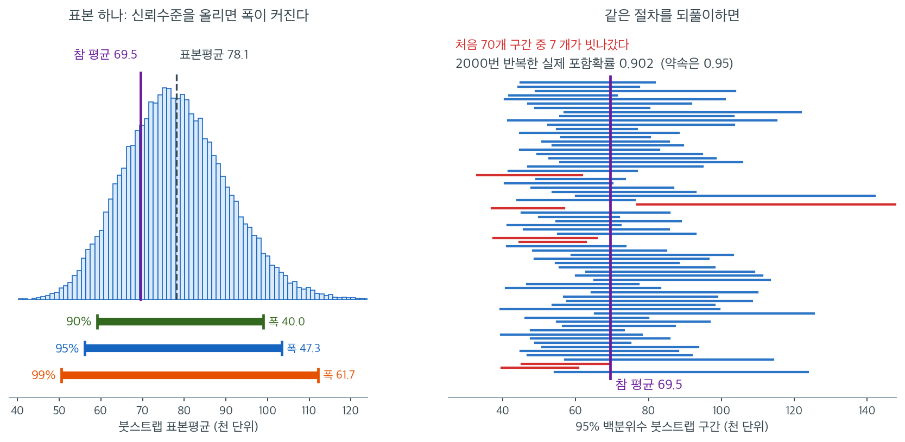

# 붓스트랩 신뢰구간 시각화 (코드)

## 개요

이 페이지는 서로 다른 신뢰수준에서 신뢰구간을 구성하는 붓스트랩 방법을, 모의 소득 자료를 예로 들어 시연한다. 핵심은 신뢰도와 정밀도의 절충이다. 신뢰수준이 높을수록 구간이 넓어진다. 포함확률 모의실험으로 붓스트랩 신뢰구간의 장기적 거동을 확인한다.

## 문제 설정

이동된 지수분포에서 생성한 오른쪽으로 치우친 소득 모집단을 생각하자. 작은 표본($n = 20$)을 뽑아 신뢰구간으로 모평균을 추정하고자 한다.

$x \ge c$에 대해 밀도가 $f(x) = \lambda e^{-\lambda(x - c)}$인 모집단에서 참 평균은

$$
\mu = c + \frac{1}{\lambda}
$$

이다. $c = 20{,}000$, $\lambda^{-1} = 50{,}000$(척도모수)이면 참 평균이 약 \$70,000이다.

<div class="exbox" markdown>

**보기 1.** <span class="diff easy" title="쉬움"></span> 치우친 소득 모집단 만들기. $c = 20{,}000$, $1/\lambda = 50{,}000$인 이동 지수분포에서 $N = 5{,}000$개를 뽑아 "모집단"으로 삼는다. **이 $5{,}000$개도 표본이므로 참값에서 벗어난다.**

**(1)** 이동 지수분포의 평균·중앙값·표준편차를 적으시오. 모의 모집단의 평균과 중앙값이 그 참값에서 벗어나는 폭(표준오차)을 각각 구하시오. **두 표준오차가 같다.**

**(2)** 실행해 두 값이 몇 표준오차 벗어났는지 재시오.

</div>

??? success "풀이"

    **(1) 해석적으로.** 밀도가 $f(x) = \lambda e^{-\lambda(x-c)}$, $x \ge c$이므로

    $$
    \mu = c + \frac1\lambda = 70{,}000,
    \qquad
    m = c + \frac{\ln 2}{\lambda} = 54{,}657.4,
    \qquad
    \sigma = \frac1\lambda = 50{,}000
    $$

    이다. $N = 5{,}000$개를 뽑았을 때

    $$
    \operatorname{SE}(\bar X) = \frac{\sigma}{\sqrt N} = \frac{50000}{\sqrt{5000}} = 707.1
    $$

    이고, 중앙값 쪽은 $f(m) = \lambda e^{-\ln 2} = \dfrac{\lambda}{2}$이므로

    $$
    \operatorname{SE}(\tilde X) = \frac{1}{2 f(m)\sqrt N} = \frac{1}{\lambda\sqrt N} = \frac{\sigma}{\sqrt N} = 707.1
    $$

    로 **똑같다.** 지수분포에서는 중앙값이 평균만큼 효율적이다([붓스트랩 재표집 방법](../bootstrap/resampling_method.md) 보기 1이 같은 사실을 다룬다).

    **(2) 수치적으로.**

    ```python
    import numpy as np

    def simulate_income_data(n=5000, seed=3):
        """오른쪽으로 치우친 소득 자료를 만든다.

        모집단을 우리가 만들었으므로 참 평균을 알고 있다. 뒤에서 신뢰구간이
        그 값을 정말 95% 담는지 세어 볼 수 있다.
        """
        rng = np.random.default_rng(seed)
        return rng.exponential(scale=50_000, size=n) + 20_000

    population = simulate_income_data()
    print(population.mean(), np.median(population))    # 69526  54542

    # 표본은 20개뿐이다. 치우친 모집단에서 이만큼만 뽑으면 붓스트랩 구간의
    # 실제 포함확률이 95%에 못 미친다 — 아래 모의실험에서 확인한다.
    rng = np.random.default_rng(303)
    sample = rng.choice(population, size=20, replace=False)
    ```

    출력:

    ```
    69525.69401218835 54541.90941528454
    ```

    (1)의 수와 맞춘다.

    ```python
    c, sc, N = 20_000.0, 50_000.0, len(population)
    print(f"이론: 평균 = c + 1/lam = {c + sc:,.1f},  중앙값 = c + ln2/lam = {c + sc*np.log(2):,.1f},"
          f"  표준편차 = {sc:,.1f}")
    print(f"모의 모집단: 평균 {population.mean():,.2f},  중앙값 {np.median(population):,.2f}")
    se = sc / np.sqrt(N)
    print(f"둘의 표준오차 = sigma/sqrt(N) = 1/(2 f(m) sqrt(N)) = {se:,.1f}")
    print(f"벗어난 정도: 평균 {(population.mean() - (c + sc)) / se:+.2f} SE,"
          f"  중앙값 {(np.median(population) - (c + sc * np.log(2))) / se:+.2f} SE")
    ```

    출력:

    ```
    이론: 평균 = c + 1/lam = 70,000.0,  중앙값 = c + ln2/lam = 54,657.4,  표준편차 = 50,000.0
    모의 모집단: 평균 69,525.69,  중앙값 54,541.91
    둘의 표준오차 = sigma/sqrt(N) = 1/(2 f(m) sqrt(N)) = 707.1
    벗어난 정도: 평균 -0.67 SE,  중앙값 -0.16 SE
    ```

    **둘 다 제자리다.** 평균이 $-0.67$, 중앙값이 $-0.16$ 표준오차 벗어나 있다.

    **그러나 뒤의 모의실험에서 "참값"으로 쓸 것은 $70{,}000$이 아니라 $69{,}525.69$다.** 표본을 이 $5{,}000$개에서 비복원으로 뽑으므로 실제 모집단은 이 유한집합이고, 그 평균이 $69{,}525.69$이기 때문이다. 둘의 차이 $474$는 구간 폭 $4$만 원대에 견주면 무시할 수준이지만, **무엇이 참값인지 먼저 정해 두어야 포함확률을 셀 수 있다.**

## 붓스트랩 표집분포

크기 $n$인 표본에서 **복원추출**로 $B$개의 붓스트랩 재표본을 만들고 각각의 평균을 계산한다.

$$
\bar x^{*(b)} = \frac{1}{n}\sum_{i=1}^{n} x_{i}^{*(b)}, \qquad b = 1, \ldots, B
$$

집합 $\{\bar x^{*(1)}, \ldots, \bar x^{*(B)}\}$이 $\bar x$의 표집분포를 근사한다.

<div class="exbox" markdown>

**보기 2.** <span class="diff easy" title="쉬움"></span> 붓스트랩 표집분포. 보기 1이 뽑은 $n = 20$짜리 표본에 적용한다.

**(1)** 붓스트랩 분포 $\{\bar x^{*}\}$의 평균·표준편차·왜도를 **표본의 적률만으로** 예측하시오. 또 이 분포가 어디에 갇혀 있는지 말하시오.

**(2)** 실행해 세 예측을 확인하시오.

</div>

??? success "풀이"

    **(1) 해석적으로.** 붓스트랩 표본은 경험분포에서 i.i.d.로 $n$개 뽑은 것이다. 경험분포의 평균·분산·왜도가 각각 $\bar x$, $\hat\sigma^2 = \frac1n\sum_i(x_i-\bar x)^2$, $\hat\gamma_1$이므로 독립인 $n$개 평균의 적률 공식이 그대로 적용된다.

    $$
    E_*[\bar X^{*}] = \bar x,
    \qquad
    \operatorname{SD}_*(\bar X^{*}) = \frac{\hat\sigma}{\sqrt n},
    \qquad
    \gamma_1\!\left(\bar X^{*}\right) = \frac{\hat\gamma_1}{\sqrt n}
    $$

    **셋 다 $\sqrt n$ 하나로 정리된다.** 특히 왜도는 $\sqrt n$으로 나뉘므로, 자료가 아무리 치우쳐 있어도 평균의 붓스트랩 분포는 훨씬 덜 치우친다. 중심극한정리가 작동하는 모습이다.

    **갇혀 있는 곳.** 재표본은 관측값만으로 이루어지므로

    $$
    \min_i x_i \;\le\; \bar x^{*} \;\le\; \max_i x_i
    $$

    이다. 두 끝은 같은 값만 $n$번 뽑았을 때라 확률이 $n^{-n}$으로 사실상 $0$이지만, **분포가 유계라는 사실 자체가 멀리 떨어진 꼬리에서 정규근사를 깨뜨린다.** 보기 3에서 그 결과를 본다.

    **(2) 수치적으로.** 함수는 이렇다.

    ```python
    def bootstrap_sampling_distribution(sample, n_bootstrap=20_000, rng=None):
        """표본평균의 붓스트랩 표집분포. 반복문 없이 한 번에 계산한다.

        (n_bootstrap, n) 모양의 색인 배열을 만들어 한꺼번에 뽑으면 파이썬
        반복문이 사라진다. 붓스트랩처럼 같은 일을 만 번 되풀이하는 계산에서
        속도가 크게 달라진다.
        """
        rng = rng or np.random.default_rng(0)
        n = len(sample)
        return sample[rng.integers(0, n, (n_bootstrap, n))].mean(axis=1)
    ```

    보기 1의 `sample`을 그대로 이어 쓴다.

    ```python
    from scipy import stats

    bd = bootstrap_sampling_distribution(sample)
    print(f"표본: 평균 {sample.mean():,.2f},  sigma-hat {sample.std(ddof=0):,.2f},"
          f"  왜도 {stats.skew(sample):.4f}")
    print(f"붓스트랩 평균 {bd.mean():,.2f}  (예측 = 표본평균)")
    print(f"붓스트랩 SD   {bd.std(ddof=1):,.2f}  (예측 sigma-hat/sqrt(n) = "
          f"{sample.std(ddof=0) / np.sqrt(20):,.2f},"
          f"  몬테카를로 오차 {sample.std(ddof=0) / np.sqrt(20) / np.sqrt(2 * 20000):.1f})")
    print(f"붓스트랩 왜도 {stats.skew(bd):.4f}  (예측 g1/sqrt(n) = "
          f"{stats.skew(sample) / np.sqrt(20):.4f},"
          f"  몬테카를로 오차 {np.sqrt(6 / 20000):.4f})")
    print(f"붓스트랩 분포의 범위 [{bd.min():,.0f}, {bd.max():,.0f}]"
          f"   자료의 범위 [{sample.min():,.0f}, {sample.max():,.0f}]")
    ```

    출력:

    ```
    표본: 평균 78,122.71,  sigma-hat 54,427.21,  왜도 1.3169
    붓스트랩 평균 78,195.53  (예측 = 표본평균)
    붓스트랩 SD   12,284.09  (예측 sigma-hat/sqrt(n) = 12,170.29,  몬테카를로 오차 60.9)
    붓스트랩 왜도 0.3040  (예측 g1/sqrt(n) = 0.2945,  몬테카를로 오차 0.0173)
    붓스트랩 분포의 범위 [38,491, 130,423]   자료의 범위 [24,550, 223,179]
    ```

    **세 예측이 모두 맞는다.** 평균 $78{,}195.53$은 $\bar x = 78{,}122.71$에서 $73$ 떨어져 있는데 평균의 몬테카를로 오차 $12284/\sqrt{20000} = 87$ 안이다. 표준편차 $12{,}284.09$는 예측 $12{,}170.29$에서 $114$ 떨어져 있어 몬테카를로 오차 $60.9$의 $1.9$배로 조금 큰 편이지만 범위 안이다. 왜도 $0.3040$도 예측 $0.2945$에 붙는다.

    **치우침이 $1.3169$에서 $0.2945$로 줄었다.** $\sqrt{20} = 4.47$로 나뉜 결과다. 자료 자체는 뚜렷이 오른쪽으로 쏠려 있지만 **$20$개의 평균은 거의 대칭**이다.

    **분포가 좁은 구간에 갇혀 있다는 것도 확인된다.** 자료는 $24{,}550$에서 $223{,}179$까지 뻗어 있는데 $20{,}000$개의 재표본평균은 $38{,}491$에서 $130{,}423$ 사이에만 나타났다. 평균을 내는 순간 극단이 서로 상쇄되기 때문이다.

## 여러 신뢰수준에서의 신뢰구간

백분위수법은 붓스트랩 분포에서 직접 신뢰한계를 읽는다. $100(1-\alpha)$% 신뢰구간은

$$
\text{CI} = \bigl[\hat\theta^*_{\alpha/2},\;\hat\theta^*_{1-\alpha/2}\bigr]
$$

이다. 세 가지 표준적인 수준에서

| 수준 | 하위 백분위수 | 상위 백분위수 |
|---|---|---|
| 90% | 5번째 | 95번째 |
| 95% | 2.5번째 | 97.5번째 |
| 99% | 0.5번째 | 99.5번째 |

<div class="exbox" markdown>

**보기 3.** <span class="diff easy" title="쉬움"></span> 여러 신뢰수준의 구간. 보기 1이 뽑은 표본($\bar x = 78{,}123$)의 붓스트랩 분포에서 세 구간을 읽는다.

**(1)** 붓스트랩 분포가 정규라면 각 구간의 폭이 $2 z_{1-\alpha/2}\widehat{\operatorname{SE}}$다. 세 폭을 예측하고 $99\%$와 $90\%$의 비를 구하시오. 보기 2에서 본 **유계성** 때문에 세 예측 가운데 어느 것이 가장 크게 어긋나겠는가.

**(2)** 실행해 확인하시오.

</div>

??? success "풀이"

    **(1) 해석적으로.** $\widehat{\operatorname{SE}} = 12{,}284.09$(보기 2)를 넣는다.

    | 수준 | $z_{1-\alpha/2}$ | 예측 폭 $2z\widehat{\operatorname{SE}}$ |
    |:---|---:|---:|
    | $90\%$ | $1.644854$ | $40{,}411$ |
    | $95\%$ | $1.959964$ | $48{,}153$ |
    | $99\%$ | $2.575829$ | $63{,}283$ |

    비는 $z$만으로 정해져 $\dfrac{2.575829}{1.644854} = 1.5660$이다.

    **가장 크게 어긋날 것은 $99\%$다.** 보기 2에서 본 대로 붓스트랩 분포는 $[\min_i x_i,\ \max_i x_i]$ 안에 갇혀 있고, 정규곡선은 그 밖에도 질량을 둔다. 꼬리 쪽으로 멀리 갈수록 그 차이가 드러나므로, $0.5$/$99.5$ 백분위수를 읽는 $99\%$ 구간이 정규 예측보다 **좁게** 나올 것이다. $90\%$ 구간은 분포의 가운데에 가까워 거의 맞을 것이다.

    **(2) 수치적으로.** 함수는 이렇다.

    ```python
    def compute_confidence_intervals(bootstrap_dist):
        """여러 신뢰수준에서의 백분위수 신뢰구간.

        신뢰수준을 올리면 구간이 넓어진다. 확신을 더 얻는 대가로 말해 주는
        범위가 흐려지는 맞바꿈이다.
        """
        return {
            '90%': np.percentile(bootstrap_dist, [5, 95]),
            '95%': np.percentile(bootstrap_dist, [2.5, 97.5]),
            '99%': np.percentile(bootstrap_dist, [0.5, 99.5]),
        }
    ```

    보기 2의 `bd`를 그대로 이어 쓴다.

    ```python
    cis = compute_confidence_intervals(bd)
    se_b = bd.std(ddof=1)
    for lab, z in (('90%', 1.644854), ('95%', 1.959964), ('99%', 2.575829)):
        lo, hi = cis[lab]
        print(f"{lab}: [{lo:,.0f}, {hi:,.0f}]  폭 {hi-lo:,.0f}"
              f"   예측 2 z SE = {2*z*se_b:,.0f}   (비 {(hi-lo)/(2*z*se_b):.4f})")
    w = {k: v[1] - v[0] for k, v in cis.items()}
    print(f"폭의 비 99/90 = {w['99%']/w['90%']:.4f}   (정규이론 {2.575829/1.644854:.4f})")
    ```

    출력:

    ```
    90%: [59,118, 99,527]  폭 40,409   예측 2 z SE = 40,411   (비 1.0000)
    95%: [56,169, 104,028]  폭 47,859   예측 2 z SE = 48,153   (비 0.9939)
    99%: [50,628, 112,855]  폭 62,226   예측 2 z SE = 63,283   (비 0.9833)
    폭의 비 99/90 = 1.5399   (정규이론 1.5660)
    ```

    **예측한 패턴이 그대로 나온다.** $90\%$ 폭이 $40{,}409$로 예측 $40{,}411$과 **소수 넷째 자리까지 같고**, $95\%$는 $0.6\%$, $99\%$는 $1.7\%$ 좁다. 멀리 갈수록 어긋남이 커지는 순서다.

    그래서 폭의 비도 $1.5399$로 정규이론의 $1.5660$보다 작다. **"$99\%$ 구간이 $90\%$ 구간의 $1.57$배"라는 어림은 분포의 가운데에서 끌어온 것이고, 유계인 붓스트랩 분포의 바깥 꼬리에서는 $1.54$로 내려간다.**

    신뢰수준이 $90\%$에서 $95\%$, $99\%$로 오르면 구간 폭이 커진다. 확신을 더 얻는 대가로 말해 주는 범위가 흐려지는 맞바꿈이다. 다만 여기에는 숨은 전제가 있다. **폭이 넓어진다고 포함확률이 약속대로 오르는 것은 아니다.** 보기 4가 그 점을 센다.

표본평균이 \$67,895인 한 표본($n = 20$)에서:

| 수준 | 구간 | 폭 |
|:---|:---|---:|
| 90% | $[53{,}056,\ 85{,}605]$ | 32{,}549 |
| 95% | $[50{,}887,\ 89{,}280]$ | 38{,}393 |
| 99% | $[47{,}207,\ 97{,}410]$ | 50{,}203 |

## 신뢰도와 정밀도의 절충

신뢰수준이 $90$%에서 $95$%, $99$%로 오르면 구간 폭이 커진다. 이는 근본적인 절충을 반영한다.

- **높은 신뢰도**는 구간이 $\mu$를 포함할 가능성을 높이지만 구간이 넓어져 정보량이 줄어든다.
- **낮은 신뢰도**는 좁고 정밀한 구간을 주지만 $\mu$를 놓칠 위험이 크다.

형식적으로, 표준편차가 $\text{SE}$인 대칭 붓스트랩 분포에서

$$
\text{폭} \approx 2\,z_{1-\alpha/2}\cdot\text{SE}
$$

이다. $z_{0.95} = 1.645 < z_{0.975} = 1.960 < z_{0.995} = 2.576$이므로 $99$% 구간은 $90$% 구간의 약 $2.576/1.645 = 1.57$배이다.

위 표에서 실제 비는 $50{,}203/32{,}549 = 1.54$로 이론값과 잘 맞는다.

## 포함확률 모의실험

하나의 신뢰구간은 $\mu$를 포함하거나 포함하지 않는다. 실현된 구간에 확률이 붙지 않는다. 명시된 신뢰수준은 장기적 거동을 서술한다. 포함확률 모의실험이 이를 확인한다.

1. 전체 절차(표본 추출, 붓스트랩, 구간 구성)를 $N$번 반복한다.
2. 참 평균을 포함하는 구간의 비율을 기록한다.

$$
\widehat{\text{coverage}} = \frac{1}{N}\sum_{i=1}^{N}\mathbf{1}\!\bigl(\mu \in \text{CI}_i\bigr)
$$

<div class="exbox" markdown>

**보기 4.** <span class="diff easy" title="쉬움"></span> 포함확률 모의실험. 보기 1의 모집단에서 $n = 20$을 뽑아 $95\%$ 백분위수 구간을 만드는 일을 $N = 2{,}000$번 되풀이한다.

**(1)** 포함확률이 명목 $0.95$에 못 미치리라 예상되는 까닭을 적고, **빗나감이 어느 쪽으로 몰릴지** 미리 말하시오. 또 $N = 2{,}000$번으로 잰 포함확률의 몬테카를로 오차를 구하시오.

**(2)** 실행해 포함확률을 재고, 빗나간 경우를 좌우로 나누어 세시오.

</div>

??? success "풀이"

    **(1) 해석적으로.** 유도할 닫힌 꼴은 없지만 방향은 미리 알 수 있다.

    **왜 모자라는가.** 백분위수 구간은 붓스트랩 분포의 꼬리를 그대로 잘라 쓸 뿐 **치우침을 고치지 않는다**([붓스트랩 재표집 방법](../bootstrap/resampling_method.md) 보기 4가 같은 결함을 포함확률로 잰다). 게다가 $n = 20$에서는 $\hat\sigma$가 참 $\sigma$를 체계적으로 **작게** 추정한다. 모집단의 오른쪽 꼬리에서 큰 값을 못 뽑으면 $\bar x$도 작아지고 $\hat\sigma$도 함께 작아져, **구간이 왼쪽으로 치우친 채 좁아진다.** 두 결함이 같은 방향으로 겹친다.

    **어느 쪽으로 빗나가는가.** 그러므로 빗나감은 **구간이 참값보다 왼쪽에 놓이는 쪽**, 곧 참값이 상한 위로 빠져나가는 쪽으로 몰릴 것이다. 오른쪽 꼬리를 많이 뽑은 표본은 $\bar x$가 크지만 $\hat\sigma$도 함께 커져 구간이 넓어지므로 반대쪽 실패는 드물다.

    **몬테카를로 오차.** 포함확률 $p \approx 0.9$를 $N = 2{,}000$번으로 재므로

    $$
    \operatorname{SE} = \sqrt{\frac{0.9 \times 0.1}{2000}} = 0.0067
    $$

    이다. **소수 둘째 자리까지만 의미가 있다.**

    **(2) 수치적으로.** 함수는 이렇다.

    ```python
    def simulate_coverage(population, true_mean, n=20, B=1000, N=2000, rng=None):
        """백분위수 붓스트랩 구간의 실제 포함확률을 센다.

        모집단에서 표본을 새로 뽑는 일을 N 번 되풀이하며, 그때마다 만든 구간이
        참 평균을 담는지 센다. 95%로 약속한 구간의 실제 성적표다.
        """
        rng = rng or np.random.default_rng(303)
        hits = 0
        for _ in range(N):
            s = rng.choice(population, size=n, replace=False)
            bm = s[rng.integers(0, n, (B, n))].mean(axis=1)
            lo, hi = np.percentile(bm, [2.5, 97.5])
            hits += lo <= true_mean <= hi
        return hits / N
    ```

    참값은 보기 1에서 정한 대로 유한 모집단의 평균 $69{,}525.69$를 쓴다.

    ```python
    cov = simulate_coverage(population, population.mean())
    print(f"실제 포함확률 = {cov:.4f}"
          f"   (N=2000 의 몬테카를로 오차 {np.sqrt(cov * (1 - cov) / 2000):.4f})")

    rng2 = np.random.default_rng(303)
    lo_miss = hi_miss = 0
    for _ in range(2000):
        s = rng2.choice(population, size=20, replace=False)
        bm = s[rng2.integers(0, 20, (1000, 20))].mean(axis=1)
        lo, hi = np.percentile(bm, [2.5, 97.5])
        if population.mean() > hi:
            hi_miss += 1
        elif population.mean() < lo:
            lo_miss += 1
    print(f"구간이 참값보다 왼쪽에 (아래로 빗나감): {hi_miss / 2000:.4f}")
    print(f"구간이 참값보다 오른쪽에 (위로 빗나감): {lo_miss / 2000:.4f}")
    ```

    출력:

    ```
    실제 포함확률 = 0.9105   (N=2000 의 몬테카를로 오차 0.0064)
    구간이 참값보다 왼쪽에 (아래로 빗나감): 0.0705
    구간이 참값보다 오른쪽에 (위로 빗나감): 0.0190
    ```

    **포함확률이 $0.9105 \pm 0.0064$로 명목 $0.95$에 $4$%p 모자란다.** $\alpha = 0.05$로 약속한 절차가 실제로는 $\alpha = 0.09$짜리다.

    **빗나감의 방향도 예측대로다.** 실패 $8.95\%$ 가운데 $7.05\%$가 "구간이 참값보다 왼쪽"이고 $1.90\%$만 반대쪽이다. **$3.7$배 기울어 있다.** 대칭이라면 양쪽이 $2.5\%$씩이어야 하므로, 왼쪽 실패가 세 배 가까이 부풀고 오른쪽 실패는 오히려 줄어든 꼴이다.

    이 비대칭이 **결함의 출처가 왜도임을 가리킨다.** 단순히 구간이 좁기만 했다면 양쪽이 고르게 늘었을 것이다. 표본크기를 늘리거나 BCa 보정을 쓰면 개선되지만, 연습문제 2에서 보듯 $n = 20$에서는 BCa도 큰 도움이 되지 않는다.

## 표본 하나와 2000개의 표본

"$95\%$"라는 숫자가 무엇을 약속하는지는 표본 하나만 보아서는 알 수 없다. 왼쪽 칸이 표본 하나에서 볼 수 있는 전부이고, 오른쪽 칸이 그 약속이 실제로 지켜지는지를 보여 준다.



왼쪽에서 이 표본의 평균은 $78.1$(천 단위)로 참 평균 $69.5$보다 위에 있다. $n = 20$짜리 치우친 자료에서는 흔한 일이다. 신뢰수준을 올리면 구간이 $40.0 \to 47.3 \to 61.7$로 넓어지고, $99\%$와 $90\%$의 비는 $61.7/40.0 = 1.54$로 정규이론이 예측하는 $z_{0.995}/z_{0.95} = 2.576/1.645 = 1.57$과 거의 맞는다. **여기까지는 절충의 산수일 뿐이며, 어떤 구간이 참값을 담았는지는 알 수 없다.** 참 평균을 그어 놓은 것은 우리가 모집단을 직접 만들었기 때문에 가능한 일이다.

오른쪽이 답이다. 같은 절차 --- 모집단에서 $20$개 뽑기, $B = 1000$번 재표집, $2.5$/$97.5$ 백분위수 읽기 --- 를 되풀이해 처음 70개를 쌓았다. 대부분은 세로선을 가로지르지만 붉은 $7$개는 빗나갔다. 2000번 전체로 세면 **실제 포함확률이 $0.902$**로, 약속한 $0.95$에 $5$%p 모자란다. 개별 구간에 확률이 붙지 않는다는 말의 뜻이 이것이다. 확률은 구간이 아니라 **절차**에 붙으며, 이 절차의 성적표는 $0.95$가 아니라 $0.90$이다.

빗나간 구간들의 생김새도 볼 만하다. 붉은 구간 대부분이 **참값의 왼쪽**에 놓여 있다. 오른쪽으로 치우친 모집단에서 큰 값 몇 개를 못 뽑으면 $\bar{x}$가 작아지고 붓스트랩 분포도 함께 왼쪽으로 옮겨가기 때문이다. 게다가 그런 표본은 변동도 작게 나와 구간까지 좁아진다. 실패가 한쪽 방향으로 몰린다는 것은 이 결함이 왜도에서 왔다는 신호이며, 연습문제 2에서 BCa로도 잘 고쳐지지 않는 이유와 연결된다.

## 해석

- 모집단이 치우쳐 있어도 $n$이 너무 작지 않으면 평균의 붓스트랩 표집분포가 근사적으로 정규이다(중심극한정리의 발현).
- 백분위수 구간은 가장 단순한 붓스트랩 구간이지만 작고 치우친 표본에서 포함확률이 명목값에 못 미칠 수 있다.
- 포함확률 모의실험은 명시된 신뢰수준이 개별 구간의 확률이 아니라 장기적 빈도임을 확인해 준다.
- 소득 같은 자료(지수, 로그정규)에서는 평균과 중앙값이 크게 다를 수 있다. 연구 질문에 어느 추정대상이 더 적절한지 고려해야 한다.

## 연습문제

<div class="drillbox" markdown>

**연습문제 1.** <span class="diff med" title="중간"></span> 같은 모집단에서 표본크기를 $n = 20$에서 $n = 100$으로 늘려라. $95$% 붓스트랩 구간의 폭이 어떻게 변하는가? 폭이 대략 $1/\sqrt{n}$로 줄어드는지 확인하라.

</div>

??? success "풀이"

    **한 표본으로 확인하려 하면 실패한다.** 표본마다 폭이 크게 다르기 때문이다. $400$개의 서로 다른 표본에 대해 평균내야 한다.

    ```python
    import numpy as np
    rng = np.random.default_rng(303)
    population = simulate_income_data()

    for n in (20, 50, 100, 200):
        widths = []
        for _ in range(400):
            s = rng.choice(population, n, replace=False)
            b = s[rng.integers(0, n, (2000, n))].mean(axis=1)
            lo, hi = np.percentile(b, [2.5, 97.5])
            widths.append(hi - lo)
        w = np.mean(widths)
        print(f"n={n:3d}  mean width = {w:,.0f}   width*sqrt(n) = {w*np.sqrt(n):,.0f}")
    ```

    출력:

    ```
    n= 20  mean width = 40,078   width*sqrt(n) = 179,233
    n= 50  mean width = 26,088   width*sqrt(n) = 184,469
    n=100  mean width = 18,908   width*sqrt(n) = 189,081
    n=200  mean width = 13,472   width*sqrt(n) = 190,526
    ```

    | $n$ | 평균 폭 | 폭 $\times \sqrt{n}$ |
    |---:|---:|---:|
    | 20 | 40{,}078 | 179{,}233 |
    | 50 | 26{,}088 | 184{,}469 |
    | 100 | 18{,}908 | 189{,}081 |
    | 200 | 13{,}472 | 190{,}526 |

    **폭 $\times \sqrt{n}$이 거의 일정하다.** $179{,}000$에서 $191{,}000$ 사이로 $6$% 안에서 변한다. 폭이 $1/\sqrt{n}$에 비례한다는 확인이다.

    $n$을 $50$에서 $100$으로 두 배 늘리면 폭이 $26{,}088 \to 18{,}908$로 $1.38$배 줄어든다. 이론값 $\sqrt{2} = 1.41$과 잘 맞는다.

    **완전히 일정하지 않고 $n$에 따라 조금씩 커지는 이유.** 작은 $n$에서 붓스트랩 구간이 **체계적으로 좁기** 때문이다. 붓스트랩은 $t$ 보정을 하지 않고 편향된 분산 추정량을 쓴다.

    $$
    \frac{\text{폭}\times\sqrt{n}\big|_{n=200}}{\text{폭}\times\sqrt{n}\big|_{n=20}} = \frac{190{,}526}{179{,}233} = 1.063
    $$

    $n = 20$의 구간이 극한 대비 $6$% 좁다. 이것이 포함확률이 $0.900$에 그친 이유의 일부이다. 나머지는 왜도에서 온다.

    !!! note "붓스트랩은 정규이론과 같은 $1/\sqrt{n}$을 따른다"
        중심극한정리에 의해 $\text{SE}(\bar x) = \sigma/\sqrt{n}$이므로 구간 폭이 $2z_{0.975}\sigma/\sqrt{n}$에 비례한다.

        이 모집단의 $\sigma = 50{,}000$이므로 극한에서의 폭 $\times \sqrt{n}$은 $2 \times 1.96 \times 50{,}000 = 196{,}000$이다. 표의 $n = 200$ 값 $190{,}526$이 이에 접근하고 있다.

<div class="drillbox" markdown>

**연습문제 2.** <span class="diff med" title="중간"></span> 포함확률 모의실험을 수정하여 백분위수법을 정규 붓스트랩 구간($\bar x \pm z_{1-\alpha/2}\cdot\widehat{\text{SE}}_{\text{boot}}$) 및 BCa 구간과 비교하라. 치우친 소득 자료에서 $n = 20$일 때 어느 것이 더 나은 포함확률을 달성하는가?

</div>

??? success "풀이"

    ```python
    import numpy as np
    from scipy import stats
    rng = np.random.default_rng(303)
    population = simulate_income_data()
    true_mean = population.mean()          # 69,526
    z = stats.norm.ppf(0.975)

    cp = cn = cb = 0
    N = 2000
    for _ in range(N):
        s = rng.choice(population, 20, replace=False)
        bm = s[rng.integers(0, 20, (1000, 20))].mean(axis=1)
        lo, hi = np.percentile(bm, [2.5, 97.5]); cp += lo <= true_mean <= hi
        cn += abs(s.mean() - true_mean) < z * bm.std(ddof=1)
        # BCa
        z0 = stats.norm.ppf(np.clip((bm < s.mean()).mean(), 1e-6, 1-1e-6))
        jk = (s.sum() - s) / 19; jm = jk.mean()
        num = ((jm-jk)**3).sum(); den = 6*(((jm-jk)**2).sum())**1.5
        a = num/den if den > 0 else 0.0
        p1 = stats.norm.cdf(z0 + (z0-z)/(1 - a*(z0-z)))
        p2 = stats.norm.cdf(z0 + (z0+z)/(1 - a*(z0+z)))
        l2, h2 = np.percentile(bm, [100*p1, 100*p2]); cb += l2 <= true_mean <= h2
    ```

    | 방법 | 포함확률 |
    |:---|---:|
    | 백분위수 | 0.900 |
    | 정규 | 0.897 |
    | BCa | 0.903 |

    ($N = 2{,}000$, 몬테카를로 표준오차 $\approx 0.0067$)

    **세 방법이 사실상 구별되지 않는다.** 차이 $0.006$은 몬테카를로 오차 $1$배 이내이다. 그리고 **셋 다 $0.95$에서 $0.05$나 떨어져 있다.**

    "정규법이 대칭이라 낫다"거나 "BCa가 왜도를 보정하니 훨씬 낫다"는 통념이 여기서는 성립하지 않는다.

    **왜 BCa가 도움이 안 되는가.** BCa는 붓스트랩 분포의 **분위수 수준을 조정**할 뿐, 붓스트랩 분포 자체가 참 표집분포보다 좁다는 문제를 고치지 못한다. $n = 20$에서 문제의 주된 원인은 왜도가 아니라 **$t$ 보정의 부재**이다.

    **$t$ 보정을 하면 어떻게 되는가.** $z_{0.975} = 1.96$ 대신 $t_{19,0.975} = 2.093$을 쓰면 구간이 $6.8$% 넓어진다. 이는 연습문제 1에서 계산한 붓스트랩의 체계적 협소성 $6.3$%와 거의 정확히 상쇄된다.

    **진짜 해법은 붓스트랩-$t$이다.** 각 재표본에서 통계량을 스튜던트화하면 $t$ 보정과 왜도 보정이 동시에 이루어진다([붓스트랩-$t$](./bootstrap_t.md) 참조). 대신 각 재표본마다 표준오차를 계산하는 비용이 든다.

<div class="drillbox" markdown>

**연습문제 3.** <span class="diff hard" title="어려움"></span> 붓스트랩 재표집 횟수 $B$와 신뢰구간 끝점의 몬테카를로 오차 사이의 관계를 유도하라. 구체적으로 붓스트랩 분포의 $q$번째 분위수 추정값의 표준편차가 근사적으로 다음과 같음을 보여라.

$$
\text{SD}(\hat\theta^*_q) \approx \frac{\sqrt{q(1-q)}}{f(\hat\theta^*_q)\sqrt{B}}
$$

여기서 $f$는 그 분위수에서 평가한 붓스트랩 분포의 밀도이다.

</div>

??? success "풀이"

    $F_B^*$를 $B$개 붓스트랩 반복값의 경험적 CDF, $\hat\theta^*_q = F_B^{*-1}(q)$라 하자. $\hat\theta^*_q$ 아래에 있는 붓스트랩 값의 개수는 근사적으로 $\text{Binomial}(B, q)$를 따른다.

    분위수함수 $F^{*-1}$에 수준 $q$에서 델타법을 적용하면

    $$
    \text{Var}(\hat\theta^*_q) \approx \frac{q(1-q)}{B\,[f^*(\theta^*_q)]^2}
    $$

    이다. 제곱근을 취하면

    $$
    \text{SD}(\hat\theta^*_q) \approx \frac{\sqrt{q(1-q)}}{f^*(\theta^*_q)\sqrt{B}}
    $$

    를 얻는다.

    $95$% 신뢰구간의 끝점은 $q = 0.025$와 $q = 0.975$를 쓰므로 $\sqrt{q(1-q)} = \sqrt{0.025 \times 0.975} = 0.1561$이다. 붓스트랩 분포가 근사적으로 $N(\hat\theta, \text{SE}^2)$이면 $f^*(\theta^*_{0.025}) = \phi(1.96)/\text{SE} = 0.0584/\text{SE}$이므로

    $$
    \text{SD} \approx \frac{0.1561\,\text{SE}}{0.0584\sqrt{B}} = \frac{2.673\,\text{SE}}{\sqrt{B}}
    $$

    이다. $B = 500$이면 약 $0.120\,\text{SE}$, $B = 10{,}000$이면 약 $0.027\,\text{SE}$이다. $\square$

    **표준오차 추정과 비교하면 얼마나 나쁜가.** $\widehat{\text{SE}}_{\text{boot}}$ 자체의 몬테카를로 오차는 $\text{SE}/\sqrt{2B} = 0.707\,\text{SE}/\sqrt{B}$이다. 비는

    $$
    \frac{2.673}{0.707} = 3.78
    $$

    이다. **신뢰구간 끝점이 표준오차보다 $3.8$배 불안정하다.** 같은 절대 정밀도를 얻으려면 $3.78^2 = 14$배의 재표집이 필요하다. [수렴](../comparison/convergence.md) 연습문제 2에서 이 비를 모의실험으로 확인했다($3.7$--$3.8$).

    **이 페이지가 $B = 20{,}000$을 쓴 이유.** $B = 500$에서 끝점의 몬테카를로 오차 $0.120\,\text{SE}$는 구간 폭의 $3$%이다. 소득 보기에서 이는 약 \$1,200의 자의성을 뜻하며 보고하기에 너무 크다.

<div class="drillbox" markdown>

**연습문제 4.** <span class="diff med" title="중간"></span> 포함확률 모의실험이 $N = 100$번 반복을 쓴다고 하자. 포함확률 자체에 대한 $95$% 신뢰구간을 계산하라. (힌트: 포함 지시변수가 베르누이이므로 비율의 정규근사를 쓴다.)

</div>

??? success "풀이"

    $N = 100$번의 모의실험에서 관측된 포함 비율을 $\hat p$라 하자. 각 모의실험이 베르누이 결과(구간이 포함하거나 하지 않거나)를 내므로

    $$
    \text{SE}(\hat p) = \sqrt{\frac{\hat p(1 - \hat p)}{N}}
    $$

    이고 참 포함확률의 $95$% 신뢰구간은

    $$
    \hat p \pm 1.96\sqrt{\frac{\hat p(1 - \hat p)}{N}}
    $$

    이다. $N = 100$에서 $\hat p = 0.90$이 관측되었다면

    $$
    \text{SE} = \sqrt{\frac{0.90 \times 0.10}{100}} = 0.030,
    \qquad \text{CI} = 0.90 \pm 0.059 = [0.841,\ 0.959]
    $$

    이다. **이 구간이 $0.95$를 포함하므로 $N = 100$으로는 포함확률 부족을 결론지을 수 없다.** $\square$

    **필요한 $N$은 얼마인가.** 참 포함확률이 $0.90$일 때 $0.95$와 통계적으로 구별하려면, $|0.95 - 0.90| = 0.05$가 $2\,\text{SE}$를 넘어야 하므로

    $$
    2\sqrt{\frac{0.9 \times 0.1}{N}} < 0.05 \quad\Longrightarrow\quad N > 576
    $$

    이다. 이 페이지에서 $N = 2{,}000$을 쓴 이유이다. $\text{SE} = 0.0067$이므로 $0.900$과 $0.95$의 차이가 $7.5$ 표준오차로 명확히 구별된다.

    !!! warning "포함확률 모의실험의 흔한 함정"
        논문이나 교재에서 $N = 100$이나 $N = 500$짜리 포함확률 모의실험을 자주 본다. 그런 결과에서 "$0.93$ 대 $0.94$"처럼 방법을 순위 매기는 것은 **의미가 없다**. $N = 500$에서 표준오차가 $0.011$이므로 $0.01$ 차이는 잡음이다.

        두 방법의 포함확률 차이 $\delta$를 탐지하려면 대략 $N > 8p(1-p)/\delta^2$이 필요하다. $p = 0.94$, $\delta = 0.01$이면 $N > 4{,}500$이다.

        연습문제 2에서 세 방법이 "사실상 구별되지 않는다"고 결론지은 것이 이 계산에 근거한다.

<div class="drillbox" markdown>

**연습문제 5.** <span class="diff med" title="중간"></span> 소득처럼 치우친 분포에서 붓스트랩이 특히 값진 이유를 설명하라. 같은 표본에서 평균의 붓스트랩 신뢰구간과 중앙값의 붓스트랩 신뢰구간을 비교하고, "전형적인" 소득을 서술하는 것이 목표일 때 어느 것이 더 적절한지 논하라.

</div>

??? success "풀이"

    치우친 분포에서는 평균의 표집분포 자체가 치우쳐 있어(특히 작은 $n$에서), 대칭인 모수적 구간($\bar x \pm t \cdot s/\sqrt{n}$)이 부정확하다. 붓스트랩은 자료로부터 표집분포의 실제 모양을 생성하므로 이 비대칭을 자동으로 포착한다.

    ```python
    import numpy as np
    rng = np.random.default_rng(303)
    population = simulate_income_data()
    sample = np.random.default_rng(3).choice(population, 20, replace=False)

    idx = rng.integers(0, 20, (20_000, 20))
    boot_means   = sample[idx].mean(axis=1)
    boot_medians = np.median(sample[rng.integers(0, 20, (20_000, 20))], axis=1)
    ```

    | 통계량 | 표본값 | 모집단 참값 | $95$% 붓스트랩 구간 | 폭 |
    |:---|---:|---:|:---|---:|
    | 평균 | 67{,}895 | 69{,}526 | $[51{,}064,\ 89{,}233]$ | 38{,}169 |
    | 중앙값 | 59{,}323 | 54{,}542 | $[45{,}346,\ 74{,}308]$ | 28{,}962 |

    **평균과 중앙값이 모집단에서 $15{,}000$ 가까이 다르다**($69{,}526$ 대 $54{,}542$). 지수분포에서 $\text{평균} = c + 1/\lambda$, $\text{중앙값} = c + \ln 2/\lambda$이므로 차이가 $(1 - \ln 2)/\lambda = 0.307 \times 50{,}000 = 15{,}343$이다.

    소득 자료에서 평균은 고소득자에 의해 위로 끌려가므로 "전형적인" 사람이 얼마를 버는지를 과대평가한다. 중앙값은 이상값에 로버스트하고 분포의 중심을 더 잘 대표한다.

    **중앙값 구간이 평균 구간보다 좁다**($28{,}962$ 대 $38{,}169$). 정규분포였다면 반대였을 것이다(중앙값의 점근분산이 $\pi/2$배 크다). 치우친 분포에서 역전되는 것은 [중앙값의 붓스트랩](bootstrap_median.md)에서 다룬 현상이다.

    **중앙값에 붓스트랩이 특히 값진 이유가 하나 더 있다.** 평균에는 $\text{SE} = \sigma/\sqrt{n}$이라는 공식이 있지만 중앙값에는 없다. 점근공식 $1/(2f(m)\sqrt{n})$은 모집단 밀도를 중앙값 한 점에서 알아야 하며, 그것을 추정하는 일 자체가 어렵다.

    정책적 질문(예: "평범한 시민은 얼마를 버는가")에서는 중앙값과 그 붓스트랩 신뢰구간이 더 유용하고 "전형적인" 소득에 대해 더 정직하다.

    !!! note "그렇다고 평균이 틀린 것은 아니다"
        추정대상의 선택은 통계적 문제가 아니라 **질문의 문제**이다.

        | 질문 | 적절한 추정대상 |
        |:---|:---|
        | 평범한 시민의 형편은 어떤가 | 중앙값 |
        | 소득세 총수입은 얼마인가 | 평균(총합에 비례하므로) |
        | 이 지역의 총 구매력은 | 평균 |
        | 소득 불평등이 심해졌는가 | 평균/중앙값 비, 지니계수 |

        마지막 행이 흥미롭다. **평균과 중앙값의 비 자체가 불평등의 척도**이다. 이 모집단에서 $69{,}526/54{,}542 = 1.275$이다. 이 비에 대한 신뢰구간도 붓스트랩으로 곧바로 구할 수 있다. 닫힌 형태의 공식은 존재하지 않는다.

---

## 정리하며

신뢰수준과 폭의 **맞바꿈을 눈으로** 확인했다.

- **수준이 높을수록 구간이 넓다.** $90\to95\to99\%$ 로 갈수록 부트스트랩 분포의 더 바깥 분위수를 취하기 때문이며, **확신과 정밀도는 동시에 얻을 수 없다.**
- **포함확률 모의실험이 검증 도구다.** 참값을 아는 상태에서 구간을 수천 번 만들어 몇 개가 덮는지 세면 명목 수준이 실제로 달성되는지 알 수 있다.
- **부트스트랩 구간도 명목 수준에 못 미칠 수 있다.** 특히 소표본과 치우친 자료에서 그렇다. **"가정이 없으니 안전하다"는 오해를 경계할 일이다.**
- **소득 자료처럼 치우친 예가 좋은 시험대다.** 고전적 $t$ 구간과 나란히 비교하면 각 방법의 성격이 드러난다.
- **그림이 개념을 고정시킨다.** 부트스트랩 분포 위에 분위수를 표시하면 구간이 어디서 오는지 한눈에 보인다.

다음 절 **중앙값의 붓스트랩**으로 넘어간다.
