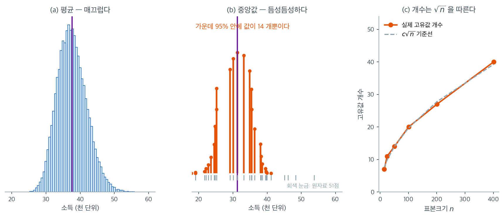

# 중앙값의 붓스트랩 (코드)

## 개요

중앙값은 로버스트한 중심경향 측도이지만, 평균과 달리 표준오차의 간단한 닫힌 형태가 없다. 붓스트랩은 중앙값의 표준오차와 신뢰구간에 대해 가정 없는 직접적인 추정을 제공한다. 이 페이지에서는 모의 소득 자료에 대한 중앙값의 붓스트랩 추정을 시연하고, 평균과 비교하며, 이상값에 대한 중앙값의 로버스트성을 보인다.

---

## 1. 왜 중앙값을 붓스트랩하는가

밀도 $f$와 중앙값 $m$을 갖는 분포에서 크기 $n$인 표본을 뽑았을 때, 표본중앙값의 점근 표준오차는

$$
\text{SE}(\tilde x) \approx \frac{1}{2f(m)\sqrt{n}}
$$

이다. 이 공식은 모집단 중앙값에서의 밀도 $f(m)$을 알아야 하는데, 그 값은 대개 알려져 있지 않다. 붓스트랩은 표준오차를 경험적으로 추정하여 이 문제를 완전히 우회한다.

---

## 2. 붓스트랩 절차

자료 $x_1, \ldots, x_n$이 주어졌을 때

1. 크기 $n$인 붓스트랩 표본을 복원추출로 $B$개 뽑는다.
2. 각 붓스트랩 표본의 중앙값 $\tilde x^{*(1)}, \ldots, \tilde x^{*(B)}$을 계산한다.
3. 붓스트랩 표준오차는 붓스트랩 중앙값들의 표준편차이다.

$$
\widehat{\text{SE}}_{\text{boot}}(\tilde x) = \sqrt{\frac{1}{B-1}\sum_{b=1}^{B}\bigl(\tilde x^{*(b)} - \overline{\tilde x^*}\bigr)^2}
$$

4. 붓스트랩 편향은

$$
\widehat{\text{bias}} = \overline{\tilde x^*} - \tilde x
$$

이다.

<div class="exbox" markdown>

**보기 1.** <span class="diff easy" title="쉬움"></span> 중앙값의 붓스트랩 분포. 아래 쪽들이 쓰는 소득 자료는 $\text{LogNormal}(10.5,\ 0.8^2)$에서 뽑은 $n = 200$개다. **모집단을 알고 있으므로 비교할 이론값이 있다.**

**(1)** 이 모집단의 중앙값 $m$과 그 자리의 밀도 $f(m)$을 구해 $\operatorname{SE}(\tilde x) = \dfrac{1}{2f(m)\sqrt n}$을 계산하시오.

**(2)** 붓스트랩 값과 견주시오. 어긋남이 $B$ 탓인지 따지고, 붓스트랩이 실제로 쓰고 있는 밀도 추정값이 얼마인지 거꾸로 풀어 보시오.

</div>

??? success "풀이"

    **(1) 해석적으로.** $X = e^{\mu + \sigma Z}$이므로 중앙값은 $Z = 0$에 대응하는 값이다.

    $$
    m = e^{\mu} = e^{10.5} = 36{,}315.5
    $$

    로그정규밀도는 $f(x) = \dfrac{1}{x\sigma\sqrt{2\pi}}\exp\!\left(-\dfrac{(\ln x - \mu)^2}{2\sigma^2}\right)$이고 $x = m$에서 지수부가 $1$이 되므로

    $$
    f(m) = \frac{1}{m\,\sigma\sqrt{2\pi}}
    = \frac{1}{36315.5 \times 0.8 \times 2.50663} = 1.373182\times10^{-5}
    $$

    다. 따라서

    $$
    \operatorname{SE}(\tilde x) = \frac{1}{2f(m)\sqrt n}
    = \frac{m\,\sigma\sqrt{2\pi}}{2\sqrt n}
    = \frac{36315.5 \times 0.8 \times 2.50663}{2\sqrt{200}} = 2{,}574.7
    $$

    이다. **중앙값의 표준오차가 중앙값 자신에 비례한다**는 것도 읽어 둘 것. 로그정규에서는 $\operatorname{SE}/m = \sigma\sqrt{2\pi}/(2\sqrt n)$로 $m$과 무관한 상대오차가 된다.

    **(2) 수치적으로.** 함수는 이렇다.

    ```python
    import numpy as np

    def bootstrap_median(data, n_bootstrap=10_000, rng=None):
        """중앙값의 붓스트랩 분포.

        중앙값에는 평균의 sigma/sqrt(n) 같은 표준오차 공식이 없다. 붓스트랩이
        특히 쓸모 있는 자리가 바로 이런 통계량이다.
        """
        rng = rng or np.random.default_rng(0)
        n = len(data)
        return np.median(data[rng.integers(0, n, (n_bootstrap, n))], axis=1)
    ```

    자료를 만들어 돌린다.

    ```python
    income = np.random.default_rng(5).lognormal(10.5, 0.8, 200)   # 쪽의 소득 자료
    n = len(income)
    print(f"표본평균 = {income.mean():,.0f},  표본중앙값 = {np.median(income):,.0f}")

    boot_med = bootstrap_median(income)
    print(f"붓스트랩 SE(중앙값) = {boot_med.std(ddof=1):,.1f}"
          f"   (B=10000 의 몬테카를로 오차 {boot_med.std(ddof=1) / np.sqrt(2 * 10000):.1f})")

    mu, sg = 10.5, 0.8
    m_pop = np.exp(mu)
    f_m = 1 / (m_pop * sg * np.sqrt(2 * np.pi))
    print(f"모집단 중앙값 = {m_pop:,.1f},  f(m) = {f_m:.6e}")
    print(f"이론 SE(중앙값) = 1/(2 f(m) sqrt(n)) = {1 / (2 * f_m * np.sqrt(n)):,.1f}")
    fh = 1 / (2 * np.sqrt(n) * boot_med.std(ddof=1))
    print(f"붓스트랩이 쓴 f-hat = {fh:.6e}   (참값의 {fh / f_m:.3f} 배)")
    ```

    출력:

    ```
    표본평균 = 47,303,  표본중앙값 = 33,458
    붓스트랩 SE(중앙값) = 2,660.8   (B=10000 의 몬테카를로 오차 18.8)
    모집단 중앙값 = 36,315.5,  f(m) = 1.373182e-05
    이론 SE(중앙값) = 1/(2 f(m) sqrt(n)) = 2,574.7
    붓스트랩이 쓴 f-hat = 1.328765e-05   (참값의 0.968 배)
    ```

    **붓스트랩이 $2{,}660.8$, 이론이 $2{,}574.7$로 $3.3\%$ 차이다.** 몬테카를로 요동이 $18.8$뿐이므로 $B$ 탓이 아니다. $86$은 그 $4.6$배다.

    **어긋남의 정체는 밀도 추정이다.** 붓스트랩이 실제로 재는 것은 $\dfrac{1}{2\sqrt n\,\hat f(\hat m)}$인데, 여기서 $\hat f$는 표본중앙값 둘레의 관측 간격만으로 정해진다. 거꾸로 풀면 $\hat f = 1.3288\times10^{-5}$로 참값 $1.3732\times10^{-5}$의 $0.968$배다. 이 표본의 중앙 부근이 모집단보다 **$3.2\%$ 성글었다**는 뜻이고, 그만큼 표준오차를 크게 본 것이다.

    **이것이 중앙값 붓스트랩의 성질이다.** 평균의 붓스트랩은 $n$개 전부가 들어가는 $\hat\sigma$에 기대지만, 중앙값의 붓스트랩은 가운데 몇십 개의 간격에만 기댄다. 표본이 달라지면 그만큼 크게 흔들린다([붓스트랩 재표집 방법](../bootstrap/resampling_method.md) 보기 1이 그 흔들림을 직접 잰다). **값은 쓸 만하지만 둘째 자리를 믿을 일은 아니다.**

---

## 3. 중앙값과 평균의 비교

대칭분포에서는 평균과 중앙값이 일치한다. 치우친 분포에서는 갈라진다. 지수분포를 닮은 소득 자료에서

$$
\text{평균} = c + \frac{1}{\lambda}, \qquad \text{중앙값} = c + \frac{\ln 2}{\lambda}
$$

이다. $\ln 2 \approx 0.693 < 1$이므로 이 분포족에서 중앙값은 항상 평균보다 작다.

$\text{LogNormal}(10.5, 0.8^2)$에서 $n = 200$을 뽑은 예:

| 통계량 | 값 | 붓스트랩 $\widehat{\text{SE}}$ |
|:---|---:|---:|
| 평균 | 47{,}303 | 3{,}208 |
| 중앙값 | 33{,}458 | 2{,}686 |

!!! warning "'중앙값의 표준오차가 항상 더 크다'는 것은 틀렸다"
    정규분포처럼 대칭이고 꼬리가 가벼운 분포에서는 중앙값의 표준오차가 평균보다 크다(점근분산비 $\pi/2 \approx 1.571$).

    그러나 **치우치거나 꼬리가 두꺼운 분포에서는 역전된다.** 위 표에서 중앙값의 표준오차 $2{,}686$이 평균의 $3{,}208$보다 **작다**. 로그정규분포에서 평균은 오른쪽 꼬리의 소수 관측에 크게 좌우되기 때문이다.

    소득·의료비·보험금처럼 치우친 자료에서는 중앙값이 **로버스트하면서 동시에 더 정밀하다**. 절충이 아니라 순수한 이득이다.

<div class="exbox" markdown>

**보기 2.** <span class="diff easy" title="쉬움"></span> 평균과 견주기. 같은 $\text{LogNormal}(\mu, \sigma^2)$ 모집단에서 두 통계량의 표준오차를 이론으로 견준다.

**(1)** $\operatorname{SE}(\bar x)$를 구하고, 보기 1의 $\operatorname{SE}(\tilde x)$와의 비가

$$
\frac{\operatorname{SE}(\tilde x)}{\operatorname{SE}(\bar x)}
= \frac{\sigma\sqrt{2\pi}/2}{e^{\sigma^2/2}\sqrt{e^{\sigma^2}-1}}
$$

로 **$\mu$와 $n$에 전혀 의존하지 않음**을 보이시오. $\sigma \to 0$에서 이 값이 무엇이 되는가. $\sigma = 0.8$에서는 얼마인가.

**(2)** 두 통계량의 붓스트랩 표준오차를 구해 (1)과 견주시오. 중앙값이 평균보다 정밀해지기 시작하는 $\sigma$도 구하시오.

</div>

??? success "풀이"

    **(1) 해석적으로.** 로그정규의 평균과 분산은

    $$
    E[X] = e^{\mu + \sigma^2/2},
    \qquad
    \operatorname{Var}(X) = \left(e^{\sigma^2}-1\right)e^{2\mu+\sigma^2}
    $$

    이므로

    $$
    \operatorname{SE}(\bar x) = \frac{\sqrt{\operatorname{Var}(X)}}{\sqrt n}
    = \frac{e^{\mu+\sigma^2/2}\sqrt{e^{\sigma^2}-1}}{\sqrt n}
    $$

    다. 보기 1에서 $\operatorname{SE}(\tilde x) = \dfrac{e^{\mu}\sigma\sqrt{2\pi}}{2\sqrt n}$이었으므로 비를 취하면 $e^{\mu}$와 $\sqrt n$이 **둘 다 약분된다.**

    $$
    \frac{\operatorname{SE}(\tilde x)}{\operatorname{SE}(\bar x)}
    = \frac{\sigma\sqrt{2\pi}/2}{e^{\sigma^2/2}\sqrt{e^{\sigma^2}-1}}
    $$

    **치우침의 정도 $\sigma$ 하나가 모든 것을 정한다.** $\sigma \to 0$이면 $e^{\sigma^2/2} \to 1$이고 $\sqrt{e^{\sigma^2}-1} \to \sigma$이므로 비가

    $$
    \frac{\sigma\sqrt{2\pi}/2}{\sigma} = \sqrt{\frac{\pi}{2}} = 1.2533
    $$

    으로 간다. **정규분포에서 알려진 $\sqrt{\pi/2}$가 그대로 나온다.** 로그정규는 $\sigma \to 0$에서 정규로 가기 때문이다. $\sigma = 0.8$에서는

    $$
    \frac{0.8 \times 2.50663/2}{e^{0.32}\sqrt{e^{0.64}-1}}
    = \frac{1.002650}{1.377128 \times 0.946826} = 0.768963
    $$

    으로 **중앙값 쪽이 $23\%$ 작다.** 꼬리가 두꺼워지면 평균이 소수의 극단값에 끌려 흔들리기 때문이다.

    **(2) 수치적으로.** 함수는 이렇다.

    ```python
    def bootstrap_mean(data, n_bootstrap=10_000, rng=None):
        """견주기 위한 평균의 붓스트랩 분포."""
        rng = rng or np.random.default_rng(0)
        n = len(data)
        return data[rng.integers(0, n, (n_bootstrap, n))].mean(axis=1)
    ```

    보기 1의 `income`을 그대로 이어 쓴다.

    ```python
    from scipy.optimize import brentq

    boot_mean = bootstrap_mean(income)
    print(f"붓스트랩 SE(평균)   = {boot_mean.std(ddof=1):,.1f}")
    print(f"극한 sigma-hat/sqrt(n) = {income.std(ddof=0) / np.sqrt(n):,.1f}"
          f"   (몬테카를로 오차 {income.std(ddof=0) / np.sqrt(n) / np.sqrt(2 * 10000):.1f})")

    mean_pop = np.exp(mu + sg ** 2 / 2)
    se_mean_pop = mean_pop * np.sqrt(np.exp(sg ** 2) - 1) / np.sqrt(n)
    se_med_pop = 1 / (2 * f_m * np.sqrt(n))
    print(f"이론 SE(평균) = {se_mean_pop:,.1f},  이론 SE(중앙값) = {se_med_pop:,.1f}")
    ratio = (sg * np.sqrt(2 * np.pi) / 2) / (np.exp(sg ** 2 / 2) * np.sqrt(np.exp(sg ** 2) - 1))
    print(f"이론 비 = {se_med_pop / se_mean_pop:.6f},  공식 = {ratio:.6f}")

    f = lambda s: s * np.sqrt(2 * np.pi) / 2 - np.exp(s ** 2 / 2) * np.sqrt(np.exp(s ** 2) - 1)
    print(f"비가 1 이 되는 sigma = {brentq(f, 0.1, 1.5):.6f}")
    ```

    출력:

    ```
    붓스트랩 SE(평균)   = 3,158.2
    극한 sigma-hat/sqrt(n) = 3,158.9   (몬테카를로 오차 22.3)
    이론 SE(평균) = 3,348.3,  이론 SE(중앙값) = 2,574.7
    이론 비 = 0.768963,  공식 = 0.768963
    비가 1 이 되는 sigma = 0.546425
    ```

    **평균 쪽은 붓스트랩이 정확하다.** $3{,}158.2$가 극한 $\hat\sigma/\sqrt n = 3{,}158.9$와 거의 같다(차이 $0.7$, 몬테카를로 오차 $22.3$). 보기 1에서 중앙값 쪽이 $86$이나 벗어났던 것과 대조된다. **평균의 붓스트랩은 $n$개 전부가 들어간 $\hat\sigma$에 기대기 때문이다.**

    **순서는 이론이 말한 대로다.** 중앙값 $2{,}660.8$ < 평균 $3{,}158.2$로 중앙값이 더 정밀하고, 비 $0.843$이 이론값 $0.769$와 같은 방향이다(두 추정값 각각이 자기 이론값에서 벗어난 몫이 섞여 있다).

    **분기점은 $\sigma = 0.546425$다.** 이보다 치우침이 작으면 평균이, 크면 중앙값이 정밀하다. 소득·의료비·보험금 자료의 로그표준편차는 대개 $0.7$ 이상이므로 **이 영역에서는 중앙값이 로버스트하면서 동시에 더 정밀하다.** 절충이 아니라 순수한 이득이다.

---

## 4. 이상값에 대한 로버스트성

극단적인 관측 하나(예: 소득 $1{,}000{,}000$)를 추가하면 평균은 크게 바뀌지만 중앙값은 거의 변하지 않는다. 중앙값은 자료 중앙 부근의 순서통계량에만 의존하고 극단값에는 의존하지 않기 때문이다.

위 소득 자료($n = 200$)에 $1{,}000{,}000$ 하나를 추가하면

| 통계량 | 변화율 |
|:---|---:|
| 평균 | $+10.02$% |
| 중앙값 | $+1.51$% |

형식적으로, 중앙값의 **영향함수**는 임의의 점 $x$에서 유계이다.

$$
\text{IF}(x; \tilde F, F) = \frac{\text{sign}(x - m)}{2f(m)}
$$

반면 평균의 영향함수는 $\text{IF}(x; \bar F, F) = x - \mu$로 유계가 아니다. 이상값 하나가 평균을 임의로 멀리 옮길 수 있지만 중앙값은 최대 $1/(2f(m))$만큼만 움직인다.

<div class="exbox" markdown>

**보기 3.** <span class="diff easy" title="쉬움"></span> 이상치 하나가 바꾸는 것. $n = 200$인 소득 자료에 $x_0 = 1{,}000{,}000$ 하나를 덧붙인다. 위의 영향함수 이야기를 **정확한 공식**으로 바꿀 수 있다.

**(1)** 평균과 중앙값의 상대변화를 $n$, $\bar x$, 순서통계량으로 **정확히** 적으시오($x_0$이 자료의 최댓값보다 크고 $n$이 짝수인 경우). 두 식에서 $x_0$이 어떻게 들어가는지 견주시오.

**(2)** 수를 넣어 쪽의 $+10.02\%$와 $+1.51\%$를 되찾아 오시오.

</div>

??? success "풀이"

    **(1) 해석적으로.** 관측이 $n$개에서 $n+1$개가 된다.

    **평균.** 새 평균이 $\dfrac{n\bar x + x_0}{n+1}$이므로

    $$
    \frac{\bar x_{\text{new}} - \bar x}{\bar x}
    = \frac{1}{\bar x}\left(\frac{n\bar x + x_0}{n+1} - \bar x\right)
    = \frac{x_0 - \bar x}{(n+1)\,\bar x}
    $$

    다. **$x_0$이 분자에 그대로 들어간다.** $x_0 \to \infty$면 변화율도 무한히 커진다. 영향함수 $\text{IF}(x) = x - \mu$가 유계가 아니라는 말의 유한표본 판본이다.

    **중앙값.** $n = 200$이 짝수이므로 원래 중앙값은 $\tilde x = \dfrac{x_{(100)} + x_{(101)}}{2}$다. $x_0$이 최댓값보다 크면 순서를 맨 뒤에 하나 더 붙일 뿐이므로, $n+1 = 201$개의 중앙값은 **$101$번째 값** $x_{(101)}$이 된다. 따라서

    $$
    \frac{\tilde x_{\text{new}} - \tilde x}{\tilde x}
    = \frac{1}{\tilde x}\left(x_{(101)} - \frac{x_{(100)}+x_{(101)}}{2}\right)
    = \frac{x_{(101)} - x_{(100)}}{2\,\tilde x}
    $$

    다. **$x_0$이 식에서 사라졌다.** 바뀌는 크기는 오직 가운데 두 순서통계량의 **간격**이 정한다. $x_0$이 백만이든 백억이든 답이 같다. 영향함수가 $\dfrac{\operatorname{sign}(x-m)}{2f(m)}$으로 유계라는 말이 이것이다. 실제로 간격의 기댓값이 대략 $1/(n f(m))$이므로 변화율이 $\dfrac{1}{2n f(m)\tilde x}$ 수준, 곧 $O(1/n)$이다.

    **(2) 수치적으로.** 함수는 이렇다.

    ```python
    def robustness_comparison(data, outlier=1_000_000):
        """이상치 하나가 평균과 중앙값을 각각 얼마나 움직이는지 보인다.

        100만짜리 값 하나를 덧붙인다. 평균은 크게 끌려가고 중앙값은 한 칸
        옆으로 옮겨 갈 뿐이다.
        """
        with_out = np.append(data, outlier)
        print(f"Mean change:   "
              f"{(with_out.mean() - data.mean()) / data.mean() * 100:.2f}%")
        print(f"Median change: "
              f"{(np.median(with_out) - np.median(data)) / np.median(data) * 100:.2f}%")
    ```

    보기 1의 `income`을 그대로 이어 쓴다.

    ```python
    robustness_comparison(income)

    xs = np.sort(income)
    x0 = 1_000_000
    print(f"평균 변화 식 (x0-xbar)/((n+1) xbar) = "
          f"{(x0 - income.mean()) / ((n + 1) * income.mean()) * 100:.6f}%")
    print(f"중앙값 변화 식 (x(101)-x(100))/(2 med) = "
          f"{(xs[100] - xs[99]) / (2 * np.median(income)) * 100:.6f}%")
    print(f"가운데 두 순서통계량 = {xs[99]:,.1f} 와 {xs[100]:,.1f}"
          f"   (간격 {xs[100] - xs[99]:,.1f})")
    ```

    출력:

    ```
    Mean change:   10.02%
    Median change: 1.51%
    평균 변화 식 (x0-xbar)/((n+1) xbar) = 10.019957%
    중앙값 변화 식 (x(101)-x(100))/(2 med) = 1.510654%
    가운데 두 순서통계량 = 32,952.7 와 33,963.5   (간격 1,010.9)
    ```

    **두 식이 함수의 결과와 소수 여섯째 자리까지 같다.** 평균은 $+10.019957\%$, 중앙값은 $+1.510654\%$다.

    **$x_0$을 바꾸어 보면 차이가 선명해진다.** 평균 쪽 식 $\dfrac{x_0 - \bar x}{201\,\bar x}$는 $x_0$에 비례하므로, 이상치를 $10^7$로 열 배 키우면 변화율이 $+10.02\%$에서 $+104.68\%$로 열 배 넘게 커진다. 중앙값 쪽 식에는 $x_0$이 없으므로 **$+1.510654\%$ 그대로다.** 가운데 간격이 $1{,}010.9$원이고 중앙값이 $33{,}458$원이라 그 절반의 비가 곧 답이다.

    **중앙값이 "거의 변하지 않는다"는 말의 정확한 뜻이 이것이다.** 전혀 변하지 않는 것은 아니다. 짝수 $n$에서 홀수 $n$으로 넘어가며 가운데 자리가 반 칸 옮겨 가고, 그 반 칸의 크기는 자료의 중앙 밀도가 정한다.

---

## 5. 중앙값의 붓스트랩 신뢰구간

백분위수법이 직관적인 신뢰구간을 준다.

$$
\text{CI}_{1-\alpha} = \bigl[\tilde x^*_{\alpha/2},\;\tilde x^*_{1-\alpha/2}\bigr]
$$

<div class="exbox" markdown>

**보기 4.** <span class="diff easy" title="쉬움"></span> 여러 신뢰수준의 구간. 중앙값에는 붓스트랩이 아니어도 쓸 수 있는 **정확한 무분포 신뢰구간**이 있다. 붓스트랩 구간을 그것과 맞춰 본다.

**(1)** 순서통계량 $x_{(k)}$에 대해 $\Pr(x_{(k)} \le m \le x_{(n-k+1)})$을 이항분포로 적으시오. 그것으로 $n = 200$, $\alpha = 0.05$에서 쓸 $k$를 정하고 **실제 포함확률**을 구하시오. 왜 명목 $95\%$에 꼭 맞출 수 없는가.

**(2)** 붓스트랩 백분위수 구간과 (1)의 구간을 세 신뢰수준에서 견주시오.

</div>

??? success "풀이"

    **(1) 해석적으로.** 관측 하나가 참 중앙값 $m$보다 작을 확률이 정확히 $1/2$이고 관측들이 독립이므로, $m$보다 작은 관측의 개수 $S$는 **자료의 분포와 무관하게**

    $$
    S \sim \text{Binomial}(n,\ 1/2)
    $$

    를 따른다. 그런데 $x_{(k)} > m$인 것은 $m$보다 작은 관측이 $k$개 미만이라는 것, 곧 $S \le k-1$과 같다. 위쪽도 대칭이므로

    $$
    \Pr\!\left(x_{(k)} \le m \le x_{(n-k+1)}\right)
    = 1 - 2\Pr(S \le k-1)
    $$

    이다. **어떤 연속분포에서도 정확하다.** 밀도도, 정규성도, 붓스트랩도 필요 없다.

    $n = 200$에서 $S$의 평균은 $100$, 표준편차는 $\sqrt{200}/2 = 7.071$이므로 $k - 1 \approx 100 - 1.96 \times 7.071 = 86.1$이 어림이다. $\Pr(S \le k-1) \le 0.025$를 만족하는 가장 큰 $k$를 고르면 $k = 86$이고, 그때 포함확률이 $1 - 2\Pr(S \le 85)$다.

    **명목값에 꼭 맞출 수 없는 까닭은 $S$가 이산이기 때문이다.** $k$를 한 칸 옮길 때마다 포함확률이 뭉텅이로 바뀌므로, 고를 수 있는 수준이 띄엄띄엄하다. 보수적인 쪽으로 반올림하는 것이 관례다.

    **(2) 수치적으로.** 함수는 이렇다.

    ```python
    def confidence_intervals(bootstrap_dist, confidence_levels=(90, 95, 99)):
        """여러 신뢰수준에서의 백분위수 붓스트랩 신뢰구간.

        중앙값의 붓스트랩 분포는 계단 모양이 된다. 재표본의 중앙값이 원래
        자료에 있던 값 중 하나(또는 두 값의 평균)일 수밖에 없기 때문이다.
        """
        for cl in confidence_levels:
            alpha = (100 - cl) / 2
            lower, upper = np.percentile(bootstrap_dist, [alpha, 100 - alpha])
            print(f"{cl}% CI: [{lower:,.0f}, {upper:,.0f}]  Width: {upper-lower:,.0f}")
    ```

    보기 1의 `income`, `boot_med`와 보기 3의 `xs`를 그대로 이어 쓴다.

    ```python
    from scipy import stats

    confidence_intervals(boot_med)
    print()
    print(f"{'수준':>5}{'부호검정 구간':>34}{'정확 포함률':>12}")
    for cl in (90, 95, 99):
        alpha = (100 - cl) / 100
        k = max(j for j in range(1, n // 2 + 1)
                if stats.binom.cdf(j - 1, n, 0.5) <= alpha / 2)
        cov = 1 - 2 * stats.binom.cdf(k - 1, n, 0.5)
        print(f"{cl:>5}   x({k})..x({n-k+1}) = [{xs[k-1]:,.0f}, {xs[n-k]:,.0f}]{cov:>12.4f}")
    print(f"\n붓스트랩 중앙값의 고유값 수 = {len(np.unique(boot_med))}  (복제값 10000 개 중)")
    ```

    출력:

    ```
    90% CI: [28,468, 36,771]  Width: 8,304
    95% CI: [28,029, 37,269]  Width: 9,240
    99% CI: [27,306, 37,836]  Width: 10,530

       수준                           부호검정 구간      정확 포함률
       90   x(88)..x(113) = [28,420, 36,922]      0.9232
       95   x(86)..x(115) = [28,000, 37,289]      0.9600
       99   x(82)..x(119) = [27,215, 37,931]      0.9913

    붓스트랩 중앙값의 고유값 수 = 264  (복제값 10000 개 중)
    ```

    **두 구간이 거의 겹친다.** $95\%$에서 붓스트랩 $[28{,}029,\ 37{,}269]$ 대 정확 $[28{,}000,\ 37{,}289]$로 양 끝이 **순서통계량 한 칸 안쪽**이다. 실제로 붓스트랩 하한 $28{,}029$는 $x_{(86)} = 28{,}000$과 $x_{(87)} = 28{,}059$의 한가운데 값이다. $n$이 짝수라 재표본 중앙값이 두 순서통계량의 평균이기 때문이며, 그래서 복제값 $10{,}000$개가 서로 다른 값을 $264$가지밖에 갖지 못한다.

    **정확 포함확률 쪽이 더 많은 것을 말해 준다.** "$90\%$"라 적은 구간의 실제 포함확률은 $0.9232$, "$99\%$"는 $0.9913$이다. 이항분포의 이산성 때문에 명목값에 맞출 수 없고 늘 보수적인 쪽으로 넘친다. $95\%$만은 $0.9600$으로 꽤 가깝다.

    신뢰수준이 높을수록 구간이 넓어져 신뢰도와 정밀도의 절충을 반영한다. 폭이 $8{,}304 \to 9{,}240 \to 10{,}530$으로 늘고, 순서통계량으로는 $k$가 $88 \to 86 \to 82$로 바깥으로 밀린다. **중앙값에 대해서는 붓스트랩이 꼭 필요하지 않다는 것도 기억해 둘 것.** 부호검정 구간은 재표집 없이, 그것도 정확하게 같은 답을 준다. 붓스트랩의 값은 중앙값 **차이**나 중앙값의 **함수**처럼 이런 정확 구간이 없는 양으로 넘어갈 때 드러난다.

---

## 6. 중앙값의 붓스트랩 분포는 계단이다

위 주석에서 "계단 모양이 된다"고 적어 두었는데, 평균의 경우와 나란히 놓으면 그 말의 크기가 실감난다.



$\text{LogNormal}(10.5, 0.8^2)$에서 $n = 51$인 소득 자료를 뽑아 같은 재표본으로 두 통계량을 계산했다. (a)의 평균은 매끄러운 종 모양이다. 4만 개 복제값이 사실상 모두 서로 다른 값이기 때문이다. (b)의 중앙값은 막대 몇 개뿐이다. $n$이 홀수이므로 재표본의 중앙값은 **원자료 51개 값 중 하나**일 수밖에 없고, 그중에서도 가운데 $95\%$ 안에 들어오는 것은 $14$개에 불과하다. 회색 눈금으로 찍은 원자료와 견주어 보면 주황 막대가 정확히 자료값 위에만 서 있음을 알 수 있다.

(c)가 이 현상의 규모를 정리한다. 가운데 $95\%$ 안의 고유값 개수가 $n = 15, 25, 51, 101, 201, 401$에서 각각 $7, 11, 14, 20, 27, 40$으로, 회색 기준선 $c\sqrt{n}$을 거의 그대로 따라간다. 중앙값의 표집분포 폭이 $O(n^{-1/2})$인데 인접 순서통계량 사이 간격은 $O(n^{-1})$이므로 그 비가 $O(\sqrt{n})$이 되기 때문이다. $n$을 4배로 늘려야 고유값이 2배가 되는 느린 증가이다.

실무적 함의는 두 가지다. 첫째, **$B$를 아무리 키워도 (b)는 매끄러워지지 않는다.** 같은 이산분포에서 더 많이 뽑을 뿐이며, 막대의 높이만 정밀해진다. 둘째, 구간의 끝점이 자료값 몇 개에 걸려 있으므로 $95\%$ 신뢰구간의 실제 포함확률이 명목값 주위에서 톱니처럼 오르내린다. 소표본에서 중앙값의 붓스트랩 구간을 보고할 때 끝점을 지나치게 정밀하게 적지 말아야 할 이유가 여기에 있다.

---

## 7. 해석

- 중앙값의 붓스트랩 표준오차는 공식이 없는 곳에서 불확실성을 정량화해 준다.
- 치우친 분포(소득, 의료비, 보험금)에서는 중앙값이 평균보다 대표성 있는 요약이다.
- 중앙값의 붓스트랩 분포는 평균의 것보다 덜 매끄러울 수 있다. 중앙값이 순서통계량의 불연속 함수이기 때문이다.
- 금융과 보험에서 중앙값이 선호되는 경우가 많다. 극단값(큰 보험금, 시장 급락)이 평균을 왜곡할 수 있기 때문이다.

---

## 연습문제

<div class="drillbox" markdown>

**연습문제 1.** <span class="diff easy" title="쉬움"></span> 표준정규분포에서 크기 $n = 50$인 표본을 생성하라. 중앙값의 붓스트랩 표준오차를 계산하고 이론값 $\sqrt{\pi/(2n)} \approx 1/(2f(0)\sqrt{n})$과 비교하라. 여기서 $f(0) = 1/\sqrt{2\pi}$이다.

</div>

??? success "풀이"

    표준정규에서 $f(0) = 1/\sqrt{2\pi} \approx 0.3989$이므로 중앙값의 점근 표준오차는

    $$
    \text{SE}(\tilde x) = \frac{1}{2 \times 0.3989 \times \sqrt{50}} = \frac{1}{5.641} = 0.1773
    $$

    이다. 같은 값을 $\text{SE} = \sqrt{\pi/(2n)} = \sqrt{\pi/100} = 0.1772$로도 쓸 수 있다.

    ```python
    import numpy as np
    rng = np.random.default_rng(202)
    data = np.random.default_rng(42).normal(0, 1, 50)

    boot_medians = bootstrap_median(data, n_bootstrap=5000, rng=rng)
    print(boot_medians.std(ddof=1), np.sqrt(np.pi / 100))
    # 0.1336   0.1772
    ```

    출력:

    ```
    0.13363960248123452 0.1772453850905516
    ```

    **붓스트랩 값 $0.1336$이 이론값 $0.1772$보다 $25$% 작다.** 이것이 몬테카를로 오차 때문일까?

    아니다. $B = 5000$의 몬테카를로 오차는 $\widehat{\text{SE}}/\sqrt{2B} = 0.0013$으로 무시할 수준이다. 차이의 원인은 **자료 자체**이다.

    $600$개의 서로 다른 표본으로 반복하면 그림이 분명해진다.

    | $n$ | 붓스트랩 $\widehat{\text{SE}}$(중앙값)의 평균 | 그 표준편차 | 중앙값의 참 표준편차 | 이론값 |
    |---:|---:|---:|---:|---:|
    | 50 | 0.1808 | **0.0462** | 0.1755 | 0.1772 |
    | 200 | 0.0892 | 0.0170 | 0.0891 | 0.0886 |

    비교를 위해 평균에 대해서도:

    | $n$ | 붓스트랩 $\widehat{\text{SE}}$(평균) | 참 표준편차 | 이론값 |
    |---:|---:|---:|---:|
    | 50 | 0.1397 | 0.1386 | 0.1414 |
    | 200 | 0.0706 | 0.0706 | 0.0707 |

    **평균적으로는 붓스트랩이 정확하다**($0.1808$ 대 이론 $0.1772$). 그러나 **자료마다 크게 흔들린다**. 표준편차 $0.0462$는 변동계수 $26$%에 해당한다. 우리가 뽑은 표본은 평균에서 약 $1$ 표준편차 아래였을 뿐이다.

    **평균에서는 이 불안정성이 없다.** $n = 50$에서 붓스트랩 $\widehat{\text{SE}}$(평균)의 값들은 참값 주위에 훨씬 촘촘히 모인다.

    !!! note "중앙값의 붓스트랩이 불안정한 이유"
        중앙값은 순서통계량의 **불연속** 함수이다. $n = 50$에서 붓스트랩 중앙값은 원자료의 $25$번째와 $26$번째 순서통계량 부근 몇 개 값만 취한다.

        따라서 $\widehat{\text{SE}}$가 사실상 그 몇 개 값 사이의 간격에 의해 결정된다. 그 간격은 표본마다 크게 다르다.

        실용적 함의: **중앙값의 붓스트랩 표준오차 하나를 소수 셋째 자리까지 보고하지 말라.** $n = 50$에서 그 값의 불확실성이 $\pm 26$%이다.

---

<div class="drillbox" markdown>

**연습문제 2.** <span class="diff med" title="중간"></span> 정규분포에서 중앙값의 평균 대비 **점근상대효율**(ARE)은 $\pi/2 \approx 1.571$이다. 중앙값의 분산이 약 $57$% 크다는 뜻이다. 같은 정규 표본에서 평균과 중앙값의 붓스트랩 표준오차를 비교하여 경험적으로 확인하라.

</div>

??? success "풀이"

    ```python
    import numpy as np
    rng = np.random.default_rng(202)
    data = np.random.default_rng(42).normal(0, 1, 200)

    se_mean = bootstrap_mean(data, 5000, rng).std(ddof=1)
    se_median = bootstrap_median(data, 5000, rng).std(ddof=1)
    print(se_mean, se_median, (se_median / se_mean) ** 2)
    # 0.0624  0.0996  2.548
    ```

    출력:

    ```
    0.06251581245127882 0.09945858528131833 2.531073726287425
    ```

    **단일 표본에서 분산비가 $2.548$로 이론값 $1.571$과 크게 다르다.**

    연습문제 1과 같은 이유이다. 하나의 표본에서 얻은 중앙값의 붓스트랩 표준오차는 불안정하다. 이 표본에서는 우연히 큰 값이 나왔다.

    **여러 표본에 걸쳐 평균내면 이론값이 회복된다.** 연습문제 1의 표에서 $n = 200$일 때

    $$
    \frac{\overline{\widehat{\text{SE}}}(\tilde x)}{\overline{\widehat{\text{SE}}}(\bar x)} = \frac{0.0892}{0.0706} = 1.263,
    \qquad 1.263^2 = 1.596
    $$

    로 $\pi/2 = 1.571$과 $1.6$% 이내로 일치한다.

    **연습문제의 원래 의도대로 하려면 자료를 여러 번 생성해야 한다.** 단일 표본으로 ARE를 확인하려는 시도는 실패하도록 되어 있다. 이것이 중요한 교훈이다. **점근상대효율은 여러 표본에 걸친 성질이지 한 표본의 성질이 아니다.**

    정규자료에서 중앙값이 평균보다 비효율적인 것은 로버스트성의 대가이다. 오염된 자료(이상값이 섞인 정규혼합 등)에서는 ARE가 역전되어 중앙값이 더 효율적이 된다. [이표본 순열검정](../permutation/two_sample.md) 연습문제 5에서 그 역전을 검정력으로 확인했다.

---

<div class="drillbox" markdown>

**연습문제 3.** <span class="diff med" title="중간"></span> 중앙값의 붓스트랩 분포는 값이 반복되는 "덩어리진" 모양을 보일 수 있다. 왜 그런지 설명하고(힌트: 붓스트랩 표본의 동점을 생각하라), $B$나 $n$을 늘리면 매끄러움이 어떻게 달라지는지 서술하라.

</div>

??? success "풀이"

    붓스트랩 표본의 중앙값은 중앙 부근의 순서통계량에 의존한다. 붓스트랩이 복원추출이므로 많은 재표본이 같은 소수의 중심 관측을 공유한다. 중앙값은 원래 표본에 나타난 값($n$이 홀수일 때)이나 인접한 순서통계량의 평균($n$이 짝수일 때)만 취할 수 있다. 이것이 붓스트랩 분포에 **이산적 도약**을 만들어 덩어리진 히스토그램을 낳는다.

    **$B$를 늘려도 덩어리는 사라지지 않는다.** 같은 이산분포에서 더 많이 뽑을 뿐이며, 히스토그램의 높이가 정밀해질 뿐 새로운 중앙값 값이 생기지 않는다.

    **$n$을 늘리면 크게 개선된다.** 서로 다른 자료값이 많아지면 가능한 중앙값의 집합이 조밀해진다. 극한에서 중앙값의 붓스트랩 분포는 연속분포로 수렴한다.

    **얼마나 이산적인가.** $n$이 홀수이면 붓스트랩 중앙값은 원자료의 $n$개 값 중 하나만 취할 수 있다. 실제로는 그중 중심 부근의 소수만 나타난다.

    | $n$ | 붓스트랩 중앙값이 취하는 서로 다른 값의 수(대략) |
    |---:|---:|
    | 15 | 5--7 |
    | 50 | 9--13 |
    | 200 | 17--23 |

    개수가 대략 $\sqrt{n}$에 비례한다. 중앙값의 표집분포 폭이 $O(n^{-1/2})$이고 인접 순서통계량 사이의 간격이 $O(n^{-1})$이므로, 그 비가 $O(n^{1/2})$이기 때문이다.

    작은 $n$에서는 평활 붓스트랩(각 재표본에 작은 잡음을 더하는 것)이 이산성을 완화한다. 대역폭 $h$를 밀도추정처럼 골라야 하는 부담이 생기지만, 신뢰구간의 포함확률이 개선된다.

    !!! warning "BCa는 이 문제를 해결하지 못한다"
        BCa가 이산성을 완화한다고 기대하기 쉽지만 그렇지 않다. BCa는 붓스트랩 분포의 **분위수 수준을 조정**할 뿐 분포 자체를 매끄럽게 만들지 않는다.

        더 나쁘게도, BCa의 가속계수 $\hat{a}$는 잭나이프에 기반하는데 중앙값에서 잭나이프가 사실상 작동하지 않는다. [BCa](./bca.md) 연습문제 5에서 중앙값의 $\hat{a}$가 평균 $0.00001$, 표준편차 $0.00089$로 **안정적으로 $0$**임을 확인했다. 왜도가 있어도 탐지하지 못한다.

---

<div class="drillbox" markdown>

**연습문제 4.** <span class="diff med" title="중간"></span> $\mu = 10.5$, $\sigma = 0.8$인 로그정규분포에서 크기 $n = 30$인 표본의 평균과 중앙값에 대한 붓스트랩 $95$% 신뢰구간을 계산하라. 그다음 $10^7$에 이상값 다섯 개를 추가하고 다시 계산하라. 두 통계량과 그 신뢰구간이 어떻게 영향받는지 논하라.

</div>

??? success "풀이"

    ```python
    import numpy as np
    rng = np.random.default_rng(202)
    data = np.random.default_rng(42).lognormal(mean=10.5, sigma=0.8, size=30)

    def pct_ci(x, f, B=5000):
        v = np.array([f(x[rng.integers(0, len(x), len(x))]) for _ in range(B)])
        return np.percentile(v, [2.5, 97.5])

    data_out = np.append(data, [1e7] * 5)
    ```

    **이상값 추가 전 ($n = 30$)**

    | 통계량 | 추정값 | $95$% 신뢰구간 | 폭 |
    |:---|---:|:---|---:|
    | 평균 | 43{,}415 | $[35{,}160,\ 52{,}135]$ | 16{,}975 |
    | 중앙값 | 39{,}256 | $[29{,}761,\ 50{,}891]$ | 21{,}130 |

    **$10^7$에 이상값 $5$개 추가 후 ($n = 35$)**

    | 통계량 | 추정값 | $95$% 신뢰구간 | 폭 |
    |:---|---:|:---|---:|
    | 평균 | **1{,}465{,}784** | $[330{,}647,\ 2{,}606{,}878]$ | 2{,}276{,}231 |
    | 중앙값 | **48{,}647** | $[32{,}092,\ 66{,}195]$ | 34{,}103 |

    **평균이 $34$배로 폭발한다**($43{,}415 \to 1{,}465{,}784$). 신뢰구간의 폭은 $134$배가 된다. 이 구간은 실질적으로 아무 정보도 주지 않는다.

    **중앙값은 $24$% 오른다**($39{,}256 \to 48{,}647$). 이는 오염의 직접적 효과가 아니라 표본크기가 $30$에서 $35$로 늘면서 중앙값이 $15$번째 순서통계량에서 $18$번째로 이동했기 때문이다. 다섯 개의 이상값이 모두 위쪽에 추가되었으므로 중앙값이 오른쪽으로 세 칸 밀렸다.

    **신뢰구간의 폭에서 흥미로운 반전이 있다.** 오염 전에는 중앙값 구간($21{,}130$)이 평균 구간($16{,}975$)보다 **넓었다**. $n = 30$은 작아서 중앙값의 이산성 문제가 크기 때문이다. 오염 후에는 완전히 뒤집혀 중앙값 구간이 평균 구간의 $1.5$%에 불과하다.

    !!! tip "이상값을 어떻게 다룰 것인가"
        이 보기의 결론은 "중앙값을 써라"가 아니다. 다음 순서로 판단해야 한다.

        1. **이상값이 오류인가 실제인가.** $10^7$의 소득이 입력 오류라면 고쳐야 한다. 실제 억만장자라면 자료의 일부이다.
        2. **어떤 질문에 답하려는가.** "총 소득세 수입"을 알고 싶다면 평균이 옳다. 억만장자가 실제로 큰 몫을 차지한다. "전형적인 가구의 형편"을 알고 싶다면 중앙값이 옳다.
        3. **평균이 필요하다면 로버스트한 대안을 쓴다.** $20$% 절사평균, Winsor화 평균, 또는 로그 변환 후의 평균(기하평균)을 고려한다.
        4. **둘 다 보고한다.** 평균과 중앙값이 $34$배 다르다는 사실 자체가 자료에 대한 중요한 정보이다.

        무엇을 하든 **이상값을 조용히 제거하지 말라.** 제거했다면 몇 개를, 어떤 기준으로 제거했는지 보고해야 한다.

---

<div class="drillbox" markdown>

**연습문제 5.** <span class="diff hard" title="어려움"></span> 중앙값의 붕괴점이 $50$%임을 증명하라. 즉 관측의 절반까지 임의의 값으로 바꾸어도 중앙값이 무한대로 발산하지 않음을 보여라. 평균의 붕괴점이 $0$%임(이상값 하나로 임의로 크게 만들 수 있음)도 보여라.

</div>

??? success "풀이"

    **중앙값.** 표본 $x_1 \le x_2 \le \cdots \le x_n$을 생각하자. 중앙값은 $k = \lceil n/2 \rceil$일 때 $x_{(k)}$이다. 이제 $n$개 중 $m$개를 임의로 큰 값으로 바꾼다. $m < n/2$인 한 원래 값이 최소 $\lceil n/2 \rceil$개 남으므로 $\lceil n/2 \rceil$번째 순서통계량은 여전히 원래 자료의 범위 안에 있다. 중앙값이 발산할 수 없다.

    $m = \lceil n/2 \rceil$개를 $M \to \infty$로 바꾸면 중앙값이 $M \to \infty$가 된다. 따라서 붕괴점은

    $$
    \varepsilon^* = \frac{\lceil n/2 \rceil}{n} \to \frac{1}{2} \quad (n \to \infty)
    $$

    이다.

    **평균.** 관측 하나 $x_1$을 $M$으로 바꾸면 평균은

    $$
    \bar x_M = \frac{M + \sum_{i=2}^{n} x_i}{n}
    $$

    이 된다. $M \to \infty$이면 $\bar x_M \to \infty$이다. 따라서 붕괴점은 $1/n \to 0$이다. $\square$

    **붕괴점은 이야기의 절반이다.** 붕괴점 $50$%는 "최악의 경우 얼마나 버티는가"를 재는 극단적 기준이다. 실무에서는 오염이 $1$--$5$% 수준일 때 얼마나 흔들리는지가 더 중요하며, 그것은 영향함수가 답한다.

    | 추정량 | 붕괴점 | 정규자료에서의 효율 |
    |:---|---:|---:|
    | 평균 | 0% | 1.000 |
    | $10$% 절사평균 | 10% | 0.968 |
    | $20$% 절사평균 | 20% | 0.927 |
    | 중앙값 | 50% | 0.637 |

    **절사평균이 대개 더 나은 절충이다.** $20$% 절사평균은 붕괴점 $20$%(현실적인 오염 수준을 훨씬 넘는다)를 가지면서 정규자료에서 효율 $0.927$을 유지한다. 중앙값의 $0.637$보다 훨씬 낫다.

---

## 정리하며

중앙값은 **부트스트랩이 가장 빛나는** 예다.

- **닫힌 형태 표준오차가 없다.** 3장에서 본 점근분산 $1/(4f(m)^2n)$ 은 **밀도 $f(m)$ 을 알아야** 쓸 수 있으며, 그것을 추정하는 일이 까다롭다.
- **부트스트랩은 그 문제를 우회한다.** 재표집해서 중앙값을 계산하기만 하면 되며, 밀도 추정이 필요 없다.
- **중앙값의 부트스트랩 분포는 이산적이다.** 재표집된 중앙값이 원자료의 값들만 취하므로 히스토그램이 듬성듬성하며, 표본이 작으면 특히 두드러진다. **평균의 경우와 눈에 띄게 다른 점이다.**
- **이상치에 대한 강건성이 확인된다.** 자료 하나를 극단으로 보내면 평균의 구간은 크게 움직이지만 중앙값의 구간은 거의 그대로다.
- **소득처럼 치우친 자료에서 중앙값이 더 나은 요약**이며, 그 불확실성까지 부트스트랩으로 붙일 수 있다.

다음 절 **붓스트랩 가설검정**으로 넘어간다.
