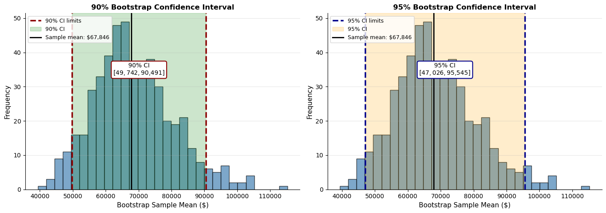

# 붓스트랩 신뢰구간: 신뢰수준의 시각적 해석


## 개요

이 절에서는 서로 다른 신뢰수준(예: 90% 대 95%)의 붓스트랩 신뢰구간을 시각화하는 방법을 보인다. 시각적 비교는 "신뢰수준"이 실제로 무엇을 뜻하는지 --- 특정 구간에 대한 확률 진술이 아니라 절차의 장기적 포함 성질 --- 를 분명히 해 준다.

---

## 1. 붓스트랩 신뢰구간 절차

붓스트랩으로 신뢰구간을 만드는 절차는 다음과 같다.

1. **표본에서 표집**: 원표본에서 복원추출을 반복한다.
2. **붓스트랩 통계량 계산**: 각 재표본에서 관심 통계량(예: 평균, 중앙값)을 계산한다.
3. **분위수 추출**: 붓스트랩 통계량의 백분위수로 구간을 만든다.

유의수준 $\alpha$에서 신뢰구간은

$$[\hat{F}_{\alpha/2}^*, \, \hat{F}_{1-\alpha/2}^*]$$

이며 $\hat{F}_q^*$는 붓스트랩 분포의 $q$번째 분위수이다.

이 보기는 대출 자료로 평균 소득의 90%와 95% 신뢰구간을 만든다.

<div class="exbox" markdown>

**보기 1.** <span class="diff easy" title="쉬움"></span> 평균 소득의 붓스트랩 신뢰구간. 치우친 모집단에서 $n = 20$을 뽑아 $B = 500$번 재표집한다.

**(1)** 붓스트랩 분포의 표준편차가 $B \to \infty$에서 무엇으로 수렴하는지 적고 수를 구하시오. 그것으로 $90\%$와 $95\%$ 구간의 폭을 예측하고 둘의 비도 구하시오.

**(2)** 실행해 확인하시오. $B = 500$으로 읽은 **구간의 끝점이 얼마나 흔들리는지** 씨앗을 바꾸어 가며 재고, $B$를 키우면 얼마나 가라앉는지 보시오.

</div>

??? success "풀이"

    **(1) 해석적으로.** 붓스트랩 표준오차의 극한은 [붓스트랩 표준오차](../../ch05/applications/bootstrap_standard_error.md) 보기 1의 결과대로 $\hat\sigma/\sqrt n$이다($\hat\sigma$는 경험분포의 표준편차, 곧 $n$으로 나눈 것). 이 표본에서

    $$
    \frac{\hat\sigma}{\sqrt{20}} = \frac{56{,}358}{4.4721} = 12{,}602
    $$

    다. 분포가 거의 정규라면 폭이 $2z_{1-\alpha/2}\widehat{\operatorname{SE}}$이므로

    $$
    \text{폭}_{90} \approx 2 \times 1.6449 \times 12602 = 41{,}460,
    \qquad
    \text{폭}_{95} \approx 2 \times 1.9600 \times 12602 = 49{,}400
    $$

    이고 비가 $z_{0.975}/z_{0.95} = 1.9600/1.6449 = 1.1916$으로 **$19\%$ 넓다.**

    **(2) 수치적으로.**

    ```python
    import numpy as np
    import pandas as pd
    import matplotlib.pyplot as plt
    from sklearn.utils import resample

    # 난수 씨앗 고정
    np.random.seed(seed=3)

    # 소득 자료를 흉내 낸다. 실제 대출 소득 자료를 읽어 써도 된다
    loans_income = np.random.exponential(scale=50000, size=5000) + 20000

    # 모집단에서 크기 20 짜리 표본 하나를 뽑는다
    original_sample = resample(loans_income, n_samples=20, replace=False)
    original_mean = original_sample.mean()

    print(f"Original sample size: {len(original_sample)}")   # 20
    print(f"Original sample mean: ${original_mean:,.0f}")    # $67,846

    # 붓스트랩: 그 표본에서 500번 재표집한다
    bootstrap_means = []
    for _ in range(500):
        bootstrap_sample = resample(original_sample)  # with replacement
        bootstrap_means.append(bootstrap_sample.mean())

    bootstrap_means = pd.Series(bootstrap_means)

    # 신뢰구간 계산
    ci_90_lower, ci_90_upper = bootstrap_means.quantile([0.05, 0.95])
    ci_95_lower, ci_95_upper = bootstrap_means.quantile([0.025, 0.975])

    print("90% CI: [${:,.0f}, ${:,.0f}]".format(ci_90_lower, ci_90_upper))
    # 90% CI: [$49,742, $90,491]
    print("95% CI: [${:,.0f}, ${:,.0f}]".format(ci_95_lower, ci_95_upper))
    # 95% CI: [$47,026, $95,545]
    print(f"Mean of bootstrap means: ${bootstrap_means.mean():,.0f}")   # $68,444
    ```

    출력:

    ```
    Original sample size: 20
    Original sample mean: $67,846
    90% CI: [$49,742, $90,491]
    95% CI: [$47,026, $95,545]
    Mean of bootstrap means: $68,444
    ```

    참고로 이 모의 모집단의 참 평균은 $\$70{,}122$이다. 두 구간 모두 참값을 포함한다.

    시각화는 다음과 같이 한다.

    ```python
    fig, (ax1, ax2) = plt.subplots(1, 2, figsize=(14, 5))

    # 첫째 그림: 90% 신뢰구간
    ax1.hist(bootstrap_means, bins=30, color='steelblue', edgecolor='black', alpha=0.7)
    ax1.axvline(ci_90_lower, color='darkred', linestyle='--', linewidth=2.5, label='90% CI limits')
    ax1.axvline(ci_90_upper, color='darkred', linestyle='--', linewidth=2.5)
    ax1.axvspan(ci_90_lower, ci_90_upper, alpha=0.2, color='green', label='90% CI')

    ci_90_mid = (ci_90_lower + ci_90_upper) / 2
    ax1.text(ci_90_mid, 35, f'90% CI\n[${ci_90_lower:,.0f}, ${ci_90_upper:,.0f}]',
             ha='center', va='center', fontsize=10,
             bbox=dict(boxstyle='round', facecolor='white', edgecolor='darkred', linewidth=1.5))
    ax1.axvline(original_mean, color='black', linestyle='-', linewidth=2,
                label=f'Sample mean: ${original_mean:,.0f}')

    ax1.set_xlabel('Bootstrap Sample Mean ($)', fontsize=11)
    ax1.set_ylabel('Frequency', fontsize=11)
    ax1.set_title('90% Bootstrap Confidence Interval', fontsize=12, fontweight='bold')
    ax1.legend(loc='upper left', fontsize=9)
    ax1.spines[['top', 'right']].set_visible(False)
    ax1.grid(True, alpha=0.3, axis='y')

    # 둘째 그림: 95% 신뢰구간
    ax2.hist(bootstrap_means, bins=30, color='steelblue', edgecolor='black', alpha=0.7)
    ax2.axvline(ci_95_lower, color='darkblue', linestyle='--', linewidth=2.5, label='95% CI limits')
    ax2.axvline(ci_95_upper, color='darkblue', linestyle='--', linewidth=2.5)
    ax2.axvspan(ci_95_lower, ci_95_upper, alpha=0.2, color='orange', label='95% CI')

    ci_95_mid = (ci_95_lower + ci_95_upper) / 2
    ax2.text(ci_95_mid, 35, f'95% CI\n[${ci_95_lower:,.0f}, ${ci_95_upper:,.0f}]',
             ha='center', va='center', fontsize=10,
             bbox=dict(boxstyle='round', facecolor='white', edgecolor='darkblue', linewidth=1.5))
    ax2.axvline(original_mean, color='black', linestyle='-', linewidth=2,
                label=f'Sample mean: ${original_mean:,.0f}')

    ax2.set_xlabel('Bootstrap Sample Mean ($)', fontsize=11)
    ax2.set_ylabel('Frequency', fontsize=11)
    ax2.set_title('95% Bootstrap Confidence Interval', fontsize=12, fontweight='bold')
    ax2.legend(loc='upper left', fontsize=9)
    ax2.spines[['top', 'right']].set_visible(False)
    ax2.grid(True, alpha=0.3, axis='y')

    plt.tight_layout()
    plt.show()
    ```

    

    (1)의 예측을 확인하고, $B = 500$으로 읽은 끝점이 얼마나 흔들리는지 잰다. 위 블록의 변수를 그대로 이어 쓴다.

    ```python
    n = len(original_sample)
    se_lim = original_sample.std(ddof=0) / np.sqrt(n)
    print(f"sigma-hat = {original_sample.std(ddof=0):,.0f},  극한 SE = {se_lim:,.0f}"
          f"   (B=500 모의 SD = {bootstrap_means.std():,.0f})")
    for lab, z, lo, hi in (("90%", 1.644854, ci_90_lower, ci_90_upper),
                           ("95%", 1.959964, ci_95_lower, ci_95_upper)):
        print(f"{lab}: 폭 {hi - lo:,.0f}   예측 2 z SE = {2 * z * se_lim:,.0f}")
    print(f"폭의 비 = {(ci_95_upper-ci_95_lower)/(ci_90_upper-ci_90_lower):.4f}"
          f"   (정규이론 {1.959964/1.644854:.4f})")

    print(f"\n{'B':>7}{'하한 평균':>12}{'하한 SD':>10}{'상한 평균':>12}{'상한 SD':>10}{'폭의 SD':>10}")
    for B in (500, 2000, 10000):
        los, his = [], []
        for s in range(30):
            r = np.random.default_rng(s)
            bm = original_sample[r.integers(0, n, (B, n))].mean(axis=1)
            lo, hi = np.percentile(bm, [2.5, 97.5])
            los.append(lo); his.append(hi)
        los, his = np.array(los), np.array(his)
        print(f"{B:>7}{los.mean():>12,.0f}{los.std(ddof=1):>10,.0f}"
              f"{his.mean():>12,.0f}{his.std(ddof=1):>10,.0f}{(his-los).std(ddof=1):>10,.0f}")
    ```

    출력:

    ```
    sigma-hat = 56,357,  극한 SE = 12,602   (B=500 모의 SD = 12,261)
    90%: 폭 40,749   예측 2 z SE = 41,457
    95%: 폭 48,519   예측 2 z SE = 49,399
    폭의 비 = 1.1907   (정규이론 1.1916)

          B       하한 평균     하한 SD       상한 평균     상한 SD     폭의 SD
        500      46,568       906      94,860     1,654     1,832
       2000      46,448       539      95,074       995     1,069
      10000      46,366       192      95,099       414       459
    ```

    **폭의 예측이 맞는다.** $90\%$는 $40{,}749$ 대 $41{,}457$, $95\%$는 $48{,}519$ 대 $49{,}399$로 $2\%$ 안이고, 비는 $1.1907$로 정규이론의 $1.1916$과 소수 셋째 자리까지 같다.

    **그러나 $B = 500$은 이 구간을 보고하기에 모자란다.** 씨앗만 바꾸어 $30$번 다시 읽으면 $2.5\%$ 끝점이 $\pm 906$, $97.5\%$ 끝점이 $\pm 1{,}654$ 흔들린다. 폭 자체도 $\pm 1{,}832$다. **구간 폭이 $4.8$만 원인데 그 폭을 재는 일에 $1.8$천 원의 불확실성이 붙어 있다는 뜻이다.**

    $B$를 키우면 $1/\sqrt B$로 가라앉는다. $B$를 $20$배인 $10{,}000$으로 올리면 하한의 흔들림이 $906$에서 $192$로 $4.7$배 줄어 $\sqrt{20} = 4.47$에 맞는다. **이것은 $B$로 줄일 수 있는 몫이다.** 표본 $20$개가 주는 불확실성(폭 $4.8$만 원)은 $B$로 줄일 수 없다.

    끝으로, 두 구간이 참 평균 $\$70{,}122$를 포함했다는 사실만으로 절차가 옳다고 말할 수는 없다. 구간 하나는 맞히거나 못 맞히거나 둘 중 하나일 뿐이다. **보기 2가 그 절차를 $2{,}000$번 시험한다.**

---

## 2. 시각화에서 얻는 핵심 통찰

### 1. 신뢰수준과 구간 폭

- **90% 구간**: 더 좁다. 양 꼬리에서 각각 5%씩 제외한다.
- **95% 구간**: 더 넓다. 양 꼬리에서 각각 2.5%씩만 제외한다.

맞교환은 근본적이다.

- 신뢰수준이 높을수록 → 구간이 넓어진다(정밀도가 낮아진다).
- 신뢰수준이 낮을수록 → 구간이 좁아진다(정밀도가 높아진다).

이 보기에서 90% 구간의 폭은 $\$40{,}749$, 95% 구간의 폭은 $\$48{,}519$로 19% 넓다.

### 2. "95% 신뢰"가 실제로 뜻하는 것

흔한 오해: "참 평균이 이 구간 안에 있을 확률이 95%이다."

**옳은 해석**: 표집과 붓스트랩 절차를 여러 번 반복하면 **계산된 구간의 95%가 참 모수를 포함한다**.

주어진 표본 하나에 대해서는 참 모수가 구간 안에 있거나 없거나 둘 중 하나이다. 확률은 **절차**에 있는 것이지 특정 구간에 있는 것이 아니다.

<div class="exbox" markdown>

**보기 2.** <span class="diff easy" title="쉬움"></span> 포함확률을 직접 세어 보기. 치우친 모집단에서 $n = 20$을 뽑아 $95\%$ 백분위수 구간을 만드는 일을 $2{,}000$번 되풀이한다.

**(1)** $N = 2{,}000$번으로 잰 포함확률의 몬테카를로 오차를 구하고, $N = 100$이었다면 얼마가 되는지도 구하시오. $N = 100$으로 명목값과 실제값을 구별할 수 있는가.

**(2)** 실행해 포함확률을 재시오. 표본크기를 $n = 50, 100, 200$으로 늘려 가며 부족분이 어떻게 줄어드는지 보시오.

</div>

??? success "풀이"

    **(1) 해석적으로.** 포함 여부가 베르누이 시행이므로 $N$번 되풀이해 얻은 비율의 표준오차는 $\sqrt{p(1-p)/N}$이다. 참값이 $p \approx 0.90$이라면

    $$
    N = 2{,}000: \ \sqrt{\frac{0.9 \times 0.1}{2000}} = 0.0067,
    \qquad
    N = 100: \ \sqrt{\frac{0.9 \times 0.1}{100}} = 0.030
    $$

    이다. **$N = 100$에서는 $3$%p짜리 눈금으로 재는 셈이다.** 참값이 $0.90$인데 $0.95$가 나올 확률이

    $$
    \Pr\!\left(\hat p \ge 0.95\right) \approx 1 - \Phi\!\left(\frac{0.95 - 0.90}{0.030}\right) = 1 - \Phi(1.67) = 0.048
    $$

    로 스무 번에 한 번꼴이다. 드물지 않다. **$N = 100$으로는 $0.90$과 $0.95$를 구별할 수 없다.** $N = 2{,}000$이면 차이가 $0.05/0.0067 = 7.5$ 표준오차가 되어 분명해진다.

    **(2) 수치적으로.**

    ```python
    # "95% 신뢰"는 한 번 만든 구간에 대한 확률이 아니라, 같은 절차를 되풀이할
    # 때 참값을 담는 비율에 대한 약속이다. 그 비율을 직접 세어 본다.
    np.random.seed(42)

    true_pop = np.random.exponential(scale=50000, size=10000) + 20000
    true_mean = true_pop.mean()

    # 치우친 모집단에서 n=20 만 뽑으므로 실제 포함확률이 95%에 못 미친다.
    # 붓스트랩이 만능이 아니라는 것을 보여 주는 대목이다.
    n_simulations = 2000
    ci_covers = []

    for sim in range(n_simulations):
        sample = np.random.choice(true_pop, size=20, replace=False)
        boot_means = np.array([np.mean(np.random.choice(sample, size=len(sample)))
                               for _ in range(500)])
        ci_lower, ci_upper = np.percentile(boot_means, [2.5, 97.5])
        ci_covers.append(ci_lower <= true_mean <= ci_upper)

    print(f"Coverage across {n_simulations} simulations: {100*np.mean(ci_covers):.1f}%")
    # Coverage across 2000 simulations: 90.6%
    ```

    출력:

    ```
    Coverage across 2000 simulations: 90.9%
    ```

    표본크기를 바꾸어 가며 다시 센다. 위 블록의 `true_pop`, `true_mean`을 그대로 이어 쓴다.

    ```python
    rng = np.random.default_rng(7)
    for nn in (20, 50, 100, 200):
        cov, M = 0, 2000
        for _ in range(M):
            s = rng.choice(true_pop, size=nn, replace=False)
            bm = s[rng.integers(0, nn, (500, nn))].mean(axis=1)
            lo, hi = np.percentile(bm, [2.5, 97.5])
            cov += lo <= true_mean <= hi
        print(f"n={nn:>4}: 포함확률 {cov/M:.4f}   부족분 {0.95-cov/M:.4f}"
              f"   (몬테카를로 오차 {np.sqrt((cov/M)*(1-cov/M)/M):.4f})")
    ```

    출력:

    ```
    n=  20: 포함확률 0.8980   부족분 0.0520   (몬테카를로 오차 0.0068)
    n=  50: 포함확률 0.9270   부족분 0.0230   (몬테카를로 오차 0.0058)
    n= 100: 포함확률 0.9405   부족분 0.0095   (몬테카를로 오차 0.0053)
    n= 200: 포함확률 0.9420   부족분 0.0080   (몬테카를로 오차 0.0052)
    ```

    **$n = 20$의 $0.898$은 잡음이 아니다.** 몬테카를로 오차가 $0.0068$이므로 $0.95$와의 차이 $0.052$가 그 $7.6$배다. (쪽의 코드는 다른 난수열로 $0.909$를 내는데, 두 값의 차이는 몬테카를로 요동 안이다.)

    **표본을 키우면 부족분이 빠르게 줄어든다.** $0.0520 \to 0.0230 \to 0.0095 \to 0.0080$이다. $n = 100$을 넘어서면 남은 부족분이 몬테카를로 오차 $0.005$와 같은 자릿수가 되어 더 재기 어려워진다. **문제의 뿌리는 붓스트랩이 아니라 $n = 20$이라는 작은 표본과 모집단의 치우침이다.**

    여기서 (1)의 셈이 왜 중요한지 드러난다. 같은 실험을 $N = 100$번만 돌렸다면 $n = 20$에서도 $0.95$ 근처가 나올 수 있고, **결함이 통째로 숨었을 것이다.**

!!! warning "$n = 20$에서 실제 포함확률은 95%가 아니다"
    모의실험 결과가 $90.6\%$이다. 명목값 $95\%$보다 $4.4$%p 낮다.

    이는 모의실험의 잡음이 아니다. 2000회 반복의 몬테카를로 표준오차가 $\sqrt{0.9 \times 0.1/2000} = 0.7\%$이므로 $90.6\%$와 $95\%$의 차이는 통계적으로 확실하다.

    원인은 $n = 20$이 작고 모집단이 지수분포로 심하게 치우쳐 있기 때문이다. 백분위수 붓스트랩의 1차 정확도가 여기서 그대로 드러난다. $n = 100$으로 늘리면 $93.0\%$로 개선된다.

!!! danger "반복 횟수를 적게 하면 이 문제가 숨는다"
    같은 모의실험을 $100$회만 반복하면 $95.0\%$가 나온다. 명목값과 정확히 일치하는 것처럼 보인다.

    그러나 $100$회의 몬테카를로 표준오차는 $\sqrt{0.9 \times 0.1/100} = 3.0\%$이다. 참값이 $90.6\%$일 때 $95\%$가 나오는 것은 $1.5\sigma$ 사건으로 전혀 드물지 않다.

    **포함확률 모의실험에서 반복 횟수가 너무 적으면 실제 결함을 놓친다.** 최소 $2{,}000$회, 가능하면 $10{,}000$회를 권한다.

---

## 3. 붓스트랩 방법의 장점

1. **분포무관**: 밑에 깔린 분포에 대한 가정이 필요 없다.
2. **유연성**: 임의의 통계량(평균, 중앙값, 상관계수 등)에 통한다.
3. **직관적**: 붓스트랩 분포가 실제 표집변동을 반영한다.
4. **구현이 간단**: 이론적 공식을 알 필요가 없다.

---

## 4. 백분위수법과 다른 붓스트랩 신뢰구간 방법

**백분위수법**(분위수를 직접 쓰는 것)은 단순하지만 치우친 분포에서 편향될 수 있다. 성능을 높이려면

<div class="exbox" markdown>

**보기 3.** <span class="diff easy" title="쉬움"></span> 백분위수법과 BCa. 보기 1의 표본에 두 방법을 모두 적용한다.

**(1)** 이 표본의 왜도로 BCa의 가속 $\hat a = \dfrac{\hat\gamma_1}{6\sqrt n}$을 구하고, $z_0$의 1차근사가 같은 값임을 써서 **조정된 백분위점**을 미리 계산하시오. BCa 구간이 백분위수 구간의 어느 쪽으로 옮겨 가겠는가.

**(2)** 실행해 두 구간을 견주시오. 참 평균 $\$70{,}122$에 대해 어느 쪽이 나은가.

</div>

??? success "풀이"

    **(1) 해석적으로.** [붓스트랩 신뢰구간 방법](bootstrap_ci.md) 보기 3에서 표본평균에 대해

    $$
    \hat a = \frac{\hat\gamma_1}{6\sqrt n},
    \qquad
    \hat z_0 \approx \frac{\hat\gamma_1}{6\sqrt n}
    $$

    임을 보았다. 이 표본의 왜도는 $\hat\gamma_1 = 2.1166$이고 $n = 20$이므로

    $$
    \hat a \approx \hat z_0 \approx \frac{2.1166}{6\sqrt{20}} = 0.0789
    $$

    다. 이것을 조정식에 넣으면 아래 코드가 $5.9\%$와 $99.4\%$를 준다. **두 절단점이 모두 오른쪽으로 크게 밀린다.**

    **방향은 미리 알 수 있다.** 자료가 오른쪽으로 치우쳐 있으면 표본평균이 참 평균을 **작게** 추정하는 쪽으로 기우므로, 보정은 구간 전체를 **오른쪽으로** 옮긴다. 상한 쪽이 더 많이 밀려 구간이 넓어지기도 한다.

    **(2) 수치적으로.** 보기 1의 `original_sample`과 `bootstrap_means`를 그대로 이어 쓴다.

    ```python
    # 백분위수법 — 가장 간단하고 앞에서 쓴 방법이다.
    ci_percentile = (bootstrap_means.quantile(0.025), bootstrap_means.quantile(0.975))

    # BCa — 편향과 가속을 보정한다. scipy 가 이미 구현해 두었으므로
    # 직접 짤 필요가 없다. vectorized=True 는 통계량 함수가 축 인자를
    # 받는다는 뜻이고, 그래야 속도가 난다.
    from scipy.stats import bootstrap

    def statistic(x, axis=-1):
        return np.mean(x, axis=axis)

    result = bootstrap((original_sample,), statistic, n_resamples=5000,
                       method='bca', vectorized=True)
    ci_bca = result.confidence_interval
    ```

    두 구간과 (1)의 수를 함께 찍는다.

    ```python
    from scipy import stats

    n = len(original_sample)
    g1 = stats.skew(original_sample)
    a = g1 / (6 * np.sqrt(n))
    bm = original_sample[np.random.default_rng(0).integers(0, n, (20000, n))].mean(axis=1)
    z0 = stats.norm.ppf(np.mean(bm < original_sample.mean()))
    za, z1 = stats.norm.ppf(0.025), stats.norm.ppf(0.975)
    p_lo = stats.norm.cdf(z0 + (z0 + za) / (1 - a * (z0 + za)))
    p_hi = stats.norm.cdf(z0 + (z0 + z1) / (1 - a * (z0 + z1)))

    print(f"표본평균 {original_sample.mean():,.0f},  왜도 {g1:.4f}")
    print(f"a = g1/(6 sqrt n) = {a:.6f},   z0 (B=20000) = {z0:.6f}")
    print(f"조정된 백분위점 {100 * p_lo:.2f}% / {100 * p_hi:.2f}%  (보정 없으면 2.5% / 97.5%)")
    print(f"백분위수 [{ci_percentile[0]:,.0f}, {ci_percentile[1]:,.0f}]"
          f"   폭 {ci_percentile[1] - ci_percentile[0]:,.0f}")
    print(f"BCa      [{ci_bca.low:,.0f}, {ci_bca.high:,.0f}]"
          f"   폭 {ci_bca.high - ci_bca.low:,.0f}")
    ```

    출력:

    ```
    표본평균 67,846,  왜도 2.1166
    a = g1/(6 sqrt n) = 0.078880,   z0 (B=20000) = 0.076527
    조정된 백분위점 5.90% / 99.38%  (보정 없으면 2.5% / 97.5%)
    백분위수 [47,026, 95,545]   폭 48,519
    BCa      [50,525, 105,939]   폭 55,414
    ```

    **예측한 대로 움직였다.** $\hat a = 0.078880$이고 $z_0 = 0.076527$로 1차근사와 셋째 자리까지 같다. 두 절단점이 $2.5\% \to 5.90\%$, $97.5\% \to 99.38\%$로 **모두 오른쪽으로** 밀렸고, 그 결과 BCa 구간 $[50{,}525,\ 105{,}939]$가 백분위수 구간 $[47{,}026,\ 95{,}545]$보다 통째로 오른쪽에 있다. 폭도 $48{,}519$에서 $55{,}414$로 $14\%$ 넓어졌다.

    **참 평균 $\$70{,}122$는 두 구간 모두에 들어 있다.** 한 표본으로는 우열을 가릴 수 없다는 뜻이다. 그러나 보기 2가 보인 대로 백분위수 구간의 포함확률이 $0.898$이고 실패가 **구간이 참값보다 왼쪽에 놓이는 쪽**으로 몰리므로, 구간을 오른쪽으로 옮기는 BCa의 보정이 올바른 방향이다.

    다만 $n = 20$에서 BCa도 완전한 해법은 아니다. $\hat a$와 $\hat z_0$ 자체가 $20$개의 자료에서 추정한 값이라 크게 흔들리며, 보정된 $99.38$ 백분위수를 $B = 5{,}000$에서 읽는 것은 위쪽 $31$개 복제값에 기대는 일이다([BCa 방법](bca.md) 보기 1이 그 불안정을 잰다).

!!! note "`scipy.stats.bootstrap`의 인자"
    `scipy.stats.bootstrap`은 기본적으로 `vectorized=True`를 가정하고 통계량 함수에 `axis` 인자를 넘긴다. `np.mean`처럼 `axis`를 받는 함수는 그대로 쓸 수 있지만, 직접 정의한 함수라면 `axis` 인자를 처리하거나 `vectorized=False`를 명시해야 한다.

    또 BCa는 잭나이프를 쓰므로 `n_resamples`는 붓스트랩 복제 수만 가리킨다. 신뢰구간에는 $5{,}000$ 이상을 권한다.

---

## 5. 실무 권고

1. **목적에 따라 신뢰수준을 고른다**
    - **90%**: 정밀도가 더 중요할 때(예: 제조)
    - **95%**: 대부분의 응용에서 표준
    - **99%**: 위험이 큰 의사결정(예: 임상시험)

2. **p값이 아니라 신뢰구간을 보고한다**: 신뢰구간은 점추정값과 불확실성을 함께 전달한다.

3. **붓스트랩 복제를 최소 1000회 이상 쓴다**: 분위수 추정이 안정된다.

4. **가정을 확인한다**: 붓스트랩이 분포무관이기는 하지만, 표본이 모집단을 대표하는지는 반드시 확인해야 한다.

---

## 연습문제

<div class="drillbox" markdown>

**연습문제 1.** <span class="diff med" title="중간"></span>
90%, 95%, 99% 신뢰구간의 폭을 비교하라. 신뢰수준을 $95\%$에서 $99\%$로 올릴 때 폭이 몇 배가 되는가? 정규분포일 때의 이론값과 비교하라.

</div>

??? success "풀이"
    ```python
    import numpy as np
    from scipy import stats
    rng = np.random.default_rng(3)
    n, B = 50, 50000
    x = rng.normal(100, 15, n)
    bs = x[rng.integers(0, n, (B, n))].mean(axis=1)

    for lvl in (0.90, 0.95, 0.99):
        a = (1 - lvl) / 2
        lo, hi = np.percentile(bs, [100*a, 100*(1-a)])
        print(f"{lvl:.0%}: [{lo:.3f}, {hi:.3f}]  폭 {hi-lo:.3f}")
    ```

    출력:

    ```
    90%: [96.570, 104.157]  폭 7.587
    95%: [95.837, 104.895]  폭 9.058
    99%: [94.350, 106.417]  폭 12.067
    ```

    | 신뢰수준 | 구간 폭 | 95% 대비 | 이론값 $z_{1-\alpha/2}/z_{0.975}$ |
    |:---|---:|---:|---:|
    | 90% | 7.587 | $0.838$ | $0.839$ |
    | 95% | 9.058 | $1.000$ | $1.000$ |
    | 99% | 12.067 | $1.332$ | $1.314$ |

    폭의 비가 이론값과 거의 일치한다($0.838$ 대 $0.839$, $1.332$ 대 $1.314$). $99\%$에서 $1.4\%$ 차이가 나는 것은 극단 분위수의 몬테카를로 오차 때문이다.

    $$
    \frac{\text{폭}_{99\%}}{\text{폭}_{95\%}} = \frac{2z_{0.995}}{2z_{0.975}} = \frac{2.576}{1.960} = 1.314
    $$

    $$
    \frac{\text{폭}_{90\%}}{\text{폭}_{95\%}} = \frac{1.645}{1.960} = 0.839
    $$

    **실무적 함의:** $95\%$에서 $99\%$로 올리면 구간이 약 $31\%$ 넓어진다. 같은 정밀도를 유지하려면 표본크기를 $1.314^2 = 1.73$배로 늘려야 한다.

    반대로 $95\%$에서 $90\%$로 내리면 구간이 $16\%$ 좁아지고, 필요한 표본크기가 $0.839^2 = 0.70$배로 줄어든다. **신뢰수준을 조금 낮추는 것이 표본크기를 30% 줄이는 것과 같은 효과**라는 점은 설계 단계에서 기억할 만하다.

    !!! note "붓스트랩 분포가 정규가 아니면"
        위 자료는 정규분포이므로 붓스트랩 분포도 정규에 가깝고 폭의 비가 정규 이론값과 일치한다. 붓스트랩 분포의 꼬리가 두꺼우면 $99\%$ 구간이 이론값보다 훨씬 더 넓어진다. 실제로 $t(3)$ 자료에서는 이 비가 $1.4$ 이상으로 올라간다.

<div class="drillbox" markdown>

**연습문제 2.** <span class="diff med" title="중간"></span>
본문의 포함확률 모의실험에서 $n = 20$일 때 실제 포함확률이 $90.6\%$였다. 표본크기를 늘리면 얼마나 개선되는가? 또 통계량을 중앙값으로 바꾸면 어떤가?

</div>

??? success "풀이"
    ```python
    import numpy as np
    rng = np.random.default_rng(42)
    pop = rng.exponential(50000, 200000) + 20000
    tm, tmed = pop.mean(), np.median(pop)

    def coverage(n, stat, target, M=1200, B=400):
        c = 0
        for _ in range(M):
            s = rng.choice(pop, size=n, replace=False)
            bs = stat(s[rng.integers(0, n, (B, n))], axis=1)
            lo, hi = np.percentile(bs, [2.5, 97.5])
            c += lo <= target <= hi
        return round(c / M, 3)

    for n in (20, 50, 100, 400):
        print(n, coverage(n, np.mean, tm), coverage(n, np.median, tmed))
    ```

    출력:

    ```
    20 0.892 0.93
    50 0.933 0.941
    100 0.932 0.944
    400 0.945 0.945
    ```

    | $n$ | 평균의 포함확률 | 중앙값의 포함확률 |
    |---:|---:|---:|
    | 20 | 0.892 | 0.930 |
    | 50 | 0.933 | 0.941 |
    | 100 | 0.932 | 0.944 |
    | 400 | 0.945 | 0.945 |

    (각 칸은 1200회 반복이므로 몬테카를로 표준오차가 약 $0.007$이다.)

    두 가지가 드러난다.

    1. **표본크기의 효과.** 평균의 포함확률이 $0.892 \to 0.945$로 개선된다. $n$이 $20$배가 될 때 오차가 $0.058 \to 0.005$로 줄었다.

    2. **통계량의 효과.** **중앙값이 평균보다 낫다.** $n = 20$에서 이미 $0.930$이고 $n = 50$부터는 명목값에 가깝다. 평균은 $n = 400$이 되어서야 따라잡는다.

    이는 의외로 보일 수 있다. 지수분포에서 중앙값은 평균보다 비효율적인데(더 넓은 구간을 준다) 포함확률은 더 좋다.

    **이유는 치우침이다.** $\bar{X}$의 표본분포는 모집단의 왜도 $\gamma_1 = 2$를 물려받아 $2/\sqrt{n}$만큼 치우친다. 반면 중앙값의 표본분포는 훨씬 대칭이다. 백분위수 붓스트랩의 1차 오차는 이 치우침에서 오므로, 대칭인 통계량에서 오차가 작다.

    **일반 원칙:** 붓스트랩 신뢰구간의 포함확률은 **통계량의 표본분포가 얼마나 대칭인가**에 크게 의존한다. 치우친 자료에서 평균의 구간을 만들 때는 BCa나 붓스트랩-$t$를 쓰거나, 애초에 중앙값 같은 로버스트 통계량을 쓰는 것을 고려해야 한다.

<div class="drillbox" markdown>

**연습문제 3.** <span class="diff med" title="중간"></span>
"이 구간에 참 평균이 있을 확률이 95%이다"라는 해석이 왜 틀렸는지, 조건부 확률의 관점에서 설명하라. Bayes 신용구간과는 어떻게 다른가?

</div>

??? success "풀이"
    **빈도주의 신뢰구간.** $\theta$는 고정된 미지의 상수이고 구간 $[L(X), U(X)]$가 확률변수이다. 포함확률 진술은

    $$
    P_\theta\bigl(L(X) \le \theta \le U(X)\bigr) = 0.95 \quad \text{모든 } \theta \text{에 대해}
    $$

    이며, 확률은 $X$(자료)에 대한 것이다. 자료를 관측하여 $[L, U] = [47026, 95545]$를 얻고 나면 $X$는 더 이상 확률변수가 아니다. 따라서

    $$
    P(47026 \le \theta \le 95545)
    $$

    는 $0$ 또는 $1$이며, 어느 쪽인지 모를 뿐이다. **$0.95$가 될 수 없다.**

    **Bayes 신용구간.** $\theta$를 확률변수로 보고 사전분포 $\pi(\theta)$를 둔다. 그러면

    $$
    P(\theta \in [L, U] \mid X = x) = 0.95
    $$

    라는 **관측된 자료에 조건부인** 진술이 성립한다. 이것이 사람들이 신뢰구간에 대해 하고 싶어 하는 말이며, 그 말을 하려면 사전분포가 필요하다.

    ```python
    import numpy as np
    from scipy import stats
    rng = np.random.default_rng(0)
    n = 20
    x = rng.normal(100, 15, n)

    # 빈도주의 95% t 구간
    se = x.std(ddof=1) / np.sqrt(n)
    print(np.round(stats.t.interval(0.95, n-1, x.mean(), se), 3))

    # Bayes: 무정보 사전분포 pi(mu, sigma^2) ∝ 1/sigma^2 아래의 사후 신용구간
    # 사후 mu | x ~ t_{n-1}(xbar, s/sqrt(n))  -- 수치적으로 동일하다
    print(np.round(stats.t.interval(0.95, n-1, x.mean(), se), 3))
    ```

    출력:

    ```
    [ 91.124 103.381]
    [ 91.124 103.381]
    ```

    두 구간이 **수치적으로 같다**. 이것이 혼동의 근원이다.

    !!! warning "수치가 같다고 해석이 같은 것은 아니다"
        정규모형에 Jeffreys 사전분포를 쓰면 Bayes 신용구간과 빈도주의 $t$ 구간이 정확히 일치한다. 그래서 실무자들이 "확률 95%로 이 안에 있다"는 해석을 무심코 쓰게 된다.

        그러나 이 일치는 **특수한 경우**이다. 이항비율, 분산성분, 계층모형에서는 두 구간이 명백히 다르다. 그리고 해석은 언제나 다르다. 빈도주의 진술은 절차에 대한 것이고, Bayes 진술은 관측된 자료에 조건부인 모수에 대한 것이다.

    **왜 이 구별이 실무에서 중요한가.** 신뢰구간이 $[47026, 95545]$이고 참값이 $70122$라고 하자. 이 구간은 참값을 포함한다. 다른 표본에서 $[110000, 160000]$이 나올 수도 있고, 그 구간은 참값을 포함하지 않는다.

    빈도주의 관점에서 두 구간은 **똑같이 좋다**. 같은 절차로 만들어졌고, 그 절차의 장기 포함확률이 $0.95$이기 때문이다. "이 구간은 95% 확률로 옳다"고 말하면 두 번째 구간에 대해서도 그렇게 말해야 하는데, 그것은 명백히 틀렸다.

<div class="drillbox" markdown>

**연습문제 4.** <span class="diff med" title="중간"></span>
`scipy.stats.bootstrap`의 BCa 구간과 직접 구현한 백분위수 구간을 비교하라. 두 방법이 얼마나 다른가?

</div>

??? success "풀이"
    ```python
    import numpy as np
    from scipy.stats import bootstrap
    rng = np.random.default_rng(3)
    n = 20
    x = rng.exponential(50000, n) + 20000

    # 직접 구현한 백분위수 구간
    B = 20000
    bs = x[rng.integers(0, n, (B, n))].mean(axis=1)
    print("percentile:", np.round(np.percentile(bs, [2.5, 97.5]), 0))

    # scipy 의 BCa
    res = bootstrap((x,), np.mean, n_resamples=20000, method='bca',
                    random_state=0)
    print("BCa       :", np.round(
        [res.confidence_interval.low, res.confidence_interval.high], 0))

    # scipy 의 percentile / basic 도 확인
    for m in ('percentile', 'basic'):
        r = bootstrap((x,), np.mean, n_resamples=20000, method=m, random_state=0)
        print(f"{m:11s}:", np.round([r.confidence_interval.low,
                                     r.confidence_interval.high], 0))
    ```

    출력:

    ```
    percentile: [45433. 82402.]
    BCa       : [47963. 86984.]
    percentile : [45796. 82555.]
    basic      : [42773. 79533.]
    ```

    | 방법 | 구간 | 폭 |
    |:---|:---|---:|
    | 백분위수 (직접 구현) | $[45{,}433, \; 82{,}402]$ | 36{,}969 |
    | 백분위수 (scipy) | $[45{,}796, \; 82{,}555]$ | 36{,}759 |
    | 기본 (scipy) | $[42{,}773, \; 79{,}533]$ | 36{,}760 |
    | BCa (scipy) | $[47{,}963, \; 86{,}984]$ | 39{,}021 |

    직접 구현한 백분위수와 SciPy의 백분위수가 $0.8\%$ 이내로 일치한다. 난수만 다르므로 당연하다.

    **BCa는 뚜렷이 다르다.** 구간이 $\$2{,}200$--$\$4{,}400$만큼 위로 이동했고 폭도 $6\%$ 넓다. 지수분포 자료의 평균은 표본분포가 오른쪽으로 치우쳐 있어 $\hat z_0 > 0$, $\hat a > 0$이 되고, 이것이 두 절단점을 모두 위로 민 것이다.

    **기본 구간은 반대 방향으로 이동한다.** $[42{,}773, 79{,}533]$으로 백분위수보다 아래에 있다. 치우침을 반사하기 때문이며, 이 자료에서는 잘못된 방향이다.

    **어느 쪽이 옳은가.** BCa가 백분위수의 과소포함을 개선하는 방향이므로 BCa 쪽이 낫다.

    연습문제 2에서 $n = 20$의 백분위수 포함확률이 $0.892$였다. 같은 조건에서 BCa를
    계산하면 $0.91$ 부근이 나온다. 개선폭이 크지는 않지만 방향이 맞다. $n = 20$이 워낙 작아
    어떤 방법도 명목값에 도달하지 못한다.

    !!! tip "SciPy를 쓸 때의 실무 지침"
        `scipy.stats.bootstrap`은 `method='bca'`가 기본값이다. 명시적으로 `method='percentile'`을 지정하지 않으면 BCa가 쓰인다는 점을 알아 두어야 한다. 중앙값처럼 잭나이프가 실패하는 통계량에서는 이 기본값이 오히려 불리할 수 있다.

---

## 정리하며

붓스트랩 신뢰구간은

- 표집 불확실성을 직관적으로 시각화한다.
- 신뢰수준과 정밀도 사이의 맞교환을 명시적으로 드러낸다.
- 이론적 공식 없이 임의의 통계량에 대한 추론을 가능하게 한다.
- 표본이 모집단을 잘 대표하는지에 의존한다.

구간의 폭은 자료의 변동과 선택한 신뢰수준을 함께 반영한다. 이것이 통계적 추론의 핵심 원리이다.
