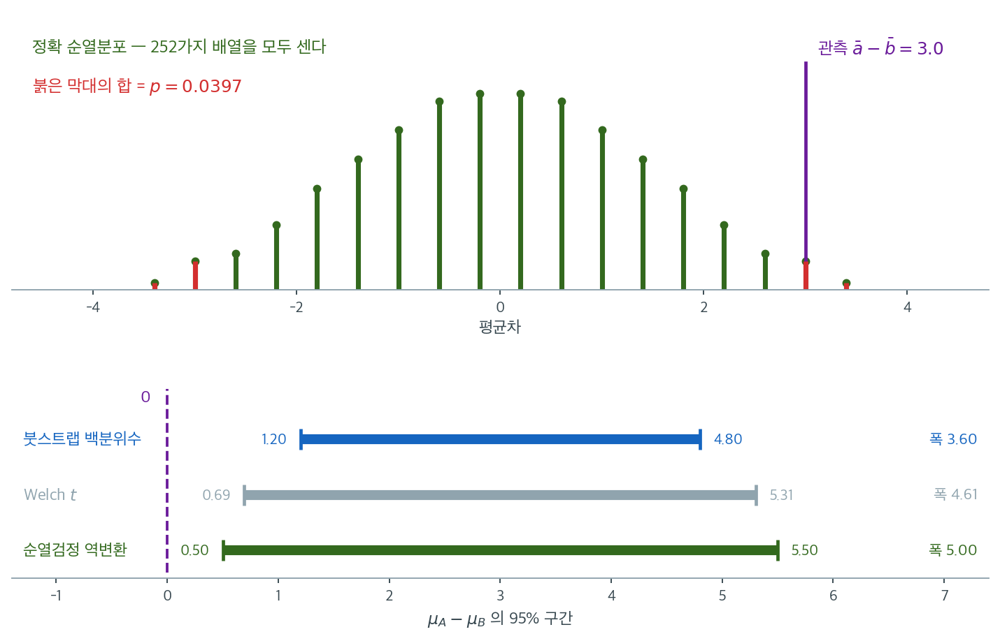

# 비교: 붓스트랩과 순열검정


## 개요

**붓스트랩**과 **순열검정**은 널리 쓰이는 두 가지 재표집 기법이다. 관측된 자료로 표집분포를 구성한다는 원리를 공유하지만, 목적·방법론·응용에서 근본적으로 다르다.

---

## 나란히 비교

### 1. 목적

| 측면 | 붓스트랩 | 순열검정 |
|---|---|---|
| **목표** | 신뢰구간이나 변동성을 위해 통계량의 분포를 추정 | 관측 통계량을 귀무분포와 비교하여 가설을 검정 |
| **주 용도** | 신뢰구간, 표준오차, 모형 검증 | 가설검정(예: 집단 간 차이 검정) |

### 2. 방법론

| 측면 | 붓스트랩 | 순열검정 |
|---|---|---|
| **작동 방식** | 관측 자료에서 **복원**추출로 반복 재표집 | 자료 라벨을 **비복원**으로 반복 재배열(순열) |
| **재표집 방식** | 복원추출 | 비복원 |
| **핵심 착상** | 관측 표본을 모집단의 대리로 삼아 새 표본을 뽑는 것을 흉내낸다 | 귀무가설 아래에서 자료와 집단 사이의 연관을 끊는다 |

### 3. 가정

| 측면 | 붓스트랩 | 순열검정 |
|---|---|---|
| **분포** | 없음. 관측 자료가 모집단을 대표한다고 가정 | 귀무가설 아래 교환가능성을 가정 |
| **독립성** | 관측이 독립이라고 가정(종속자료용 확장이 있다) | 귀무가설이 성립하여 라벨을 섞을 수 있다고 가정 |

### 4. 응용

| 측면 | 붓스트랩 | 순열검정 |
|---|---|---|
| **신뢰구간** | 널리 쓰인다 | 보통 쓰지 않는다 |
| **가설검정** | 변형하면 가능하지만 덜 직관적이다 | 주 용도 |
| **복잡한 통계량** | 잘 다룬다(회귀계수, 왜도) | 어떤 통계량이든 다루지만 귀무가설이 단순해야 한다 |

### 5. 계산비용

| 측면 | 붓스트랩 | 순열검정 |
|---|---|---|
| **강도** | 높음(수천 번의 재표집과 재계산) | 중간에서 높음(순열 수가 계승으로 증가하지만 근사가 가능하다) |
| **작은 표본** | **주의가 필요하다**(아래 연습문제 1 참조) | 정확한 결과가 가능하다(모든 순열 열거) |

---

## 실전 보기: 평균차 검정

### 붓스트랩 접근

1. 두 집단을 각각 **복원**추출로 재표집한다.
2. 각 붓스트랩 표본에서 평균차를 계산한다.
3. 평균차의 **신뢰구간**을 추정한다.

<div class="exbox" markdown>

**보기 1.** <span class="diff easy" title="쉬움"></span> 붓스트랩으로 구간 구하기. 집단 A $= (8,7,9,10,6)$, 집단 B $= (5,6,4,3,7)$로 각 $n = 5$다.

**(1)** 집단마다 따로 복원추출할 때 $\bar A^{*} - \bar B^{*}$의 표준편차를 닫힌 꼴로 구하고, 고전적 $\sqrt{(s_a^2+s_b^2)/n}$과의 비를 구하시오. 복제값이 놓이는 **격자**의 간격도 구하시오.

**(2)** 그것으로 $95\%$ 구간을 예측하고 실행 결과와 견주시오.

</div>

??? success "풀이"

    **(1) 해석적으로.** 두 집단을 독립으로 재표집하므로 두 재표본평균도 독립이고, 각각의 분산이 [붓스트랩 표준오차](../../ch05/applications/bootstrap_standard_error.md) 보기 1의 결과대로 $\hat\sigma^2/n$이다($\hat\sigma^2$은 $n$으로 나눈 경험분산). 따라서

    $$
    \operatorname{SD}_*\!\left(\bar A^{*} - \bar B^{*}\right)
    = \sqrt{\frac{\hat\sigma_a^2 + \hat\sigma_b^2}{n}}
    $$

    이다. 두 집단 모두 중심에서의 편차가 $(0,\pm1,\pm2)$ 꼴이라 $\hat\sigma_a^2 = \hat\sigma_b^2 = \frac{0+1+1+4+4}{5} = 2$이고

    $$
    \operatorname{SD}_* = \sqrt{\frac{2+2}{5}} = \sqrt{0.8} = 0.894427
    $$

    다. 고전적 값은 $s_a^2 = s_b^2 = 2.5$에서 $\sqrt{(2.5+2.5)/5} = 1$이므로 비가

    $$
    \frac{0.894427}{1} = \sqrt{\frac{n-1}{n}} = \sqrt{\frac45} = 0.894427
    $$

    로 **붓스트랩 쪽이 $10.6\%$ 좁다.** $n = 5$에서 $\sqrt{(n-1)/n}$ 보정이 가장 아프게 작용한다.

    **격자.** 자료가 정수이므로 각 재표본의 합도 정수이고 평균은 $1/5$의 배수다. 두 평균의 차도 마찬가지이므로 복제값은 간격 $0.2$인 격자에만 놓인다.

    **예측.** 분포가 거의 정규라면

    $$
    3 \pm 1.959964 \times 0.894427 = [1.246955,\ 4.753045]
    $$

    이고, 격자로 반올림하면 $[1.2,\ 4.8]$이 될 것이다.

    **(2) 수치적으로.**

    ```python
    import numpy as np
    # 같은 자료에 붓스트랩과 순열검정을 각각 적용해 무엇이 다른지 본다.
    # 붓스트랩은 "차이가 얼마인가"에, 순열검정은 "차이가 있는가"에 답한다.
    rng = np.random.default_rng(55)

    group_a = np.array([8, 7, 9, 10, 6])
    group_b = np.array([5, 6, 4, 3, 7])

    # 붓스트랩은 집단마다 따로 복원추출한다. 집단 구분을 그대로 둔 채
    # 차이의 분포를 얻으므로 신뢰구간이 나온다.
    n_resamples = 100_000
    A = group_a[rng.integers(0, 5, (n_resamples, 5))]
    B = group_b[rng.integers(0, 5, (n_resamples, 5))]
    boot_diffs = A.mean(axis=1) - B.mean(axis=1)

    ci = np.percentile(boot_diffs, [2.5, 97.5])
    print(f"Bootstrap 95% CI for mean difference: ({ci[0]:.2f}, {ci[1]:.2f})")
    # (1.20, 4.80)
    ```

    출력:

    ```
    Bootstrap 95% CI for mean difference: (1.20, 4.80)
    ```

    (1)의 수와 맞춘다.

    ```python
    print(f"붓스트랩 SD = {boot_diffs.std(ddof=1):.6f}"
          f"   닫힌 꼴 = {np.sqrt((group_a.var(ddof=0)+group_b.var(ddof=0))/5):.6f}")
    print(f"고전 SE = {np.sqrt((group_a.var(ddof=1)+group_b.var(ddof=1))/5):.6f}"
          f"   비 = {np.sqrt(4/5):.6f}")
    print(f"정규근사 구간 = [{3-1.959964*np.sqrt(0.8):.6f}, {3+1.959964*np.sqrt(0.8):.6f}]")
    u = np.unique(np.round(boot_diffs, 6))
    print(f"복제값의 고유값 수 = {len(u)},  최소 간격 = {np.diff(u).min():.4f}")
    print(f"붓스트랩 꼬리확률 P(|d* - 3| >= 3) = {np.mean(np.abs(boot_diffs-3) >= 3-1e-12):.5f}")
    ```

    출력:

    ```
    붓스트랩 SD = 0.895799   닫힌 꼴 = 0.894427
    고전 SE = 1.000000   비 = 0.894427
    정규근사 구간 = [1.246955, 4.753045]
    복제값의 고유값 수 = 35,  최소 간격 = 0.2000
    붓스트랩 꼬리확률 P(|d* - 3| >= 3) = 0.00062
    ```

    **셋 다 예측대로다.** 모의 표준편차 $0.895799$가 닫힌 꼴 $0.894427$과 맞고($B = 10^5$의 몬테카를로 오차 $0.002$), 격자 간격이 $0.2$이며, 정규근사 구간 $[1.246955,\ 4.753045]$를 격자로 옮기면 실행값 $[1.20,\ 4.80]$ 그대로다.

    **구간이 $0$에서 멀리 떨어져 있다.** 꼬리확률로 바꾸면 $0.00062$다. 그러나 **이 수를 $p$값으로 읽어서는 안 된다.** 보기 2가 보이듯 같은 자료의 정확 순열 $p$값은 $0.0397$로 $64$배 크다. 눈금이 다르기 때문이며, 그 차이의 정체를 보기 2에서 끝까지 따진다.


### 순열 접근

1. 두 집단을 하나의 자료로 합친다.
2. 집단 라벨을 **비복원**으로 무작위로 섞는다.
3. 각 순열에서 평균차를 계산한다.
4. 관측 평균차를 순열된 차이들의 분포와 비교하여 **$p$값**을 구한다.

<div class="exbox" markdown>

**보기 2.** <span class="diff easy" title="쉬움"></span> 순열로 $p$값 구하기. 같은 자료에 라벨 섞기를 적용한다. $\binom{10}{5} = 252$가지뿐이라 **전부 열거할 수 있다.**

**(1)** 순열 귀무분포의 표준편차를 닫힌 꼴로 구하고, 보기 1의 붓스트랩 표준편차와의 **비**를 구하시오. 그 비가 왜 $1$보다 큰지 $t$ 통계량으로 설명하시오.

**(2)** 정확 $p$값을 구하고, 보기 1의 꼬리확률 $0.00062$와 $64$배 차이가 나는 까닭을 (1)로 설명하시오. 이 설계에서 가능한 **최소 $p$값**도 구하시오.

</div>

??? success "풀이"

    **(1) 해석적으로.** [이표본 순열검정](../permutation/two_sample.md) 보기 1에서 라벨을 섞을 때의 평균차가

    $$
    \operatorname{SD}(d^{*}) = S\sqrt{\frac{1}{n_1}+\frac{1}{n_2}}
    $$

    임을 보았다. 여기서 $S^2$은 **합친 $10$개**의 표본분산이다. 합친 자료의 평균이 $6.5$이고 편차제곱합이 $42.5$이므로 $S^2 = 42.5/9 = 4.722222$이고

    $$
    \operatorname{SD}(d^{*}) = \sqrt{4.722222 \times 0.4} = 1.374369
    $$

    다. 보기 1의 붓스트랩 표준편차 $0.894427$에 견주면

    $$
    \frac{1.374369}{0.894427} = 1.536591
    $$

    로 **순열 쪽 눈금이 $1.54$배 넓다.**

    **왜 넓은가.** 두 가지가 겹친다. 하나는 $\sqrt{(n-1)/n}$ 보정으로, 붓스트랩 쪽이 $0.894$배 좁다. 다른 하나가 더 크다. **합친 표본의 분산 $S^2$에는 두 집단 사이의 차이까지 들어 있다.** [이표본 순열검정](../permutation/two_sample.md) 보기 3의 항등식

    $$
    (N-1)S^2 = (N - 2 + t^2)\,s_p^2
    $$

    에 $N = 10$, $s_p^2 = 2.5$, $t = 3/1 = 3$을 넣으면 $9S^2 = 17 \times 2.5 = 42.5$로 맞는다. 곧

    $$
    \frac{\operatorname{SD}(d^{*})}{\operatorname{SE}_t} = \sqrt{\frac{N-2+t^2}{N-1}} = \sqrt{\frac{17}{9}} = 1.374369
    $$

    다. **관측된 효과가 클수록 순열 귀무분포가 스스로 넓어진다.** 붓스트랩은 집단을 나눈 채 재표집하므로 그 효과를 귀무분포에 넣지 않는다.

    **최소 $p$값.** 양측으로는 관측된 배정과 그 보수(두 집단을 통째로 맞바꾼 것) 둘이 늘 걸리므로 $2/252 = 0.0079$ 아래로 내려갈 수 없다.

    **(2) 수치적으로.**

    ```python
    import numpy as np, itertools

    group_a = np.array([8, 7, 9, 10, 6])
    group_b = np.array([5, 6, 4, 3, 7])
    # 순열검정은 반대로 집단 이름표를 섞는다. 귀무가설이 참이라면 이름표가
    # 아무 뜻이 없다는 데서 나온 발상이라, p-값이 나온다.
    combined = np.concatenate([group_a, group_b])
    observed_diff = group_a.mean() - group_b.mean()

    # 각 집단이 5개뿐이므로 C(10,5) = 252 가지를 전부 열거한다
    perm_diffs = np.array([
        combined[list(c)].mean() - np.delete(combined, list(c)).mean()
        for c in itertools.combinations(range(10), 5)
    ])
    p_value = (np.abs(perm_diffs) >= abs(observed_diff) - 1e-12).mean()
    print(f"Exact permutation p-value: {p_value:.4f}")   # 0.0397
    ```

    출력:

    ```
    Exact permutation p-value: 0.0397
    ```

    (1)의 수와 맞춘다.

    ```python
    from scipy import stats

    S = combined.std(ddof=1)
    sd_perm = S * np.sqrt(2 / 5)
    sd_boot = np.sqrt((group_a.var(ddof=0) + group_b.var(ddof=0)) / 5)
    sp2 = (4 * group_a.var(ddof=1) + 4 * group_b.var(ddof=1)) / 8
    t = observed_diff / np.sqrt(sp2 * 0.4)

    print(f"S^2 = {S**2:.6f},  순열 SD 닫힌 꼴 = {sd_perm:.6f}"
          f"   (열거 SD = {perm_diffs.std():.6f})")
    print(f"붓스트랩 SD = {sd_boot:.6f},   두 눈금의 비 = {sd_perm/sd_boot:.6f}")
    print(f"s_p^2 = {sp2:.4f},  t = {t:.4f},"
          f"  sqrt((N-2+t^2)/(N-1)) = {np.sqrt((10-2+t**2)/9):.6f}")
    print(f"정확 p = {(np.abs(perm_diffs) >= abs(observed_diff)-1e-12).sum()}/252"
          f" = {p_value:.6f},   가능한 최소 p = 2/252 = {2/252:.6f}")
    print(f"순열 눈금의 정규근사 p = {2*stats.norm.sf(observed_diff/sd_perm):.6f}")
    print(f"붓스트랩 눈금의 정규근사 p = {2*stats.norm.sf(observed_diff/sd_boot):.6f}")
    ```

    출력:

    ```
    S^2 = 4.722222,  순열 SD 닫힌 꼴 = 1.374369   (열거 SD = 1.374369)
    붓스트랩 SD = 0.894427,   두 눈금의 비 = 1.536591
    s_p^2 = 2.5000,  t = 3.0000,  sqrt((N-2+t^2)/(N-1)) = 1.374369
    정확 p = 10/252 = 0.039683,   가능한 최소 p = 2/252 = 0.007937
    순열 눈금의 정규근사 p = 0.029049
    붓스트랩 눈금의 정규근사 p = 0.000796
    ```

    **항등식이 맞는다.** 닫힌 꼴 $1.374369$가 열거한 표준편차와 여섯 자리까지 같고, $\sqrt{(N-2+t^2)/(N-1)} = \sqrt{17/9}$도 같은 수다.

    **$64$배 차이의 정체가 눈금이다.** 같은 관측값 $3.0$을 두 눈금으로 재면

    - 붓스트랩 눈금($0.894427$)에서는 $3/0.894427 = 3.354$ 표준편차 → 정규근사 $p = 0.000796$
    - 순열 눈금($1.374369$)에서는 $3/1.374369 = 2.183$ 표준편차 → 정규근사 $p = 0.02905$

    로 $36$배가 벌어진다. **눈금의 비는 $1.54$뿐인데 꼬리확률의 비는 $36$배다.** 정규 꼬리가 지수적으로 떨어지기 때문이며, 여기에 이산성이 더해져 정확값 $0.0397$까지 올라가면 $0.00062$의 $64$배가 된다.

    **어느 쪽이 옳은가.** 순열검정이다. $p$값은 **귀무가설이 참일 때** 관측값이 얼마나 드문지를 묻는 양인데, 붓스트랩의 집단별 재표집은 귀무가설을 전혀 강제하지 않는다. 그것이 답하는 물음은 "차이가 얼마인가"이지 "차이가 있는가"가 아니다. 구간은 그대로 쓰되 꼬리확률을 $p$값으로 바꿔 읽는 일만 하지 않으면 된다.

    **그리고 이 설계의 한계도 보인다.** 가능한 최소 $p$값이 $2/252 = 0.0079$다. 자료가 아무리 극단적이어도 그 아래로 못 내려간다. $n = 5$가 담을 수 있는 증거의 총량이 그만큼이다.


!!! danger "이 보기에서 두 방법이 심각하게 어긋난다"
    | 방법 | 결과 |
    |:---|:---|
    | 정확 순열 $p$값 | $0.0397$ |
    | Welch $t$ 검정 $p$값 | $0.0171$ |
    | 붓스트랩 백분위수 구간 | $[1.20,\ 4.80]$ — $0$을 크게 벗어난다 |
    | 붓스트랩 꼬리 확률 | $0.0006$ |

    붓스트랩 꼬리 확률이 순열 $p$값의 **$1/66$**이다. 어느 쪽이 옳은가? 순열검정이다. $n = 5$에서 붓스트랩 신뢰구간은 심각하게 좁다. 연습문제 1에서 그 이유와 크기를 다룬다.

이 불일치를 그림으로 보면 어디서 틈이 벌어지는지가 드러난다.



위 칸은 $252$가지 배열을 **하나도 빠짐없이** 계산한 정확 순열분포다. 몬테카를로가 전혀 없으므로 막대의 높이가 곧 확률이다. 관측값 $\bar{a} - \bar{b} = 3.0$만큼 극단적인 배열은 붉게 칠한 네 개뿐이고, 그 확률의 합이 $10/252 = 0.0397$이다. 이 값은 $n = 5$짜리 자료가 담을 수 있는 증거의 한계를 정직하게 보여 준다. 가능한 가장 작은 $p$값이 $2/252 = 0.0079$이므로, **이 설계로는 아무리 극단적인 결과가 나와도 $p$를 그 아래로 내릴 수 없다.**

아래 칸의 세 막대가 문제의 핵심이다. 순열검정을 역변환해 얻은 구간 $[0.50,\ 5.50]$이 가장 넓고, Welch $t$ 구간 $[0.69,\ 5.31]$이 그다음이며, 붓스트랩 백분위수 구간 $[1.20,\ 4.80]$이 가장 좁다. 붓스트랩 구간의 폭은 순열 구간의 $72\%$에 불과하다. **$28\%$ 짧아진 구간이 $66$배 작은 꼬리 확률로 증폭된 것이다.**

이유는 두 가지가 겹친다. 첫째, 백분위수 붓스트랩은 $t$ 보정을 하지 않아 정규이론 구간보다 체계적으로 좁고, 그 효과가 $n = 5$에서 극대화된다. 둘째, 각 집단에서 복원추출로 다섯 개를 뽑으면 그 표본의 분산이 원자료의 분산보다 평균적으로 작다. **$n = 5$에서는 "관측 표본이 모집단을 대표한다"는 붓스트랩의 전제 자체가 무리이며**, 순열검정은 애초에 그런 전제를 두지 않기 때문에 이 함정을 피한다.

---

## 요약표

| 특징 | **붓스트랩** | **순열검정** |
|---|---|---|
| **주 목적** | 신뢰구간, 변동성 추정 | 가설검정 |
| **재표집** | 복원추출 | 비복원 |
| **주 산출물** | 신뢰구간, 표준오차 | $p$값 |
| **가정** | 자료가 모집단을 대표 | $H_0$ 아래 교환가능성 |
| **계산강도** | 높음 | 중간에서 높음 |
| **유연성** | 매우 유연(임의의 통계량, 복잡한 모형) | 통계량은 자유롭지만 귀무가설이 교환가능성을 함의해야 한다 |
| **작은 표본** | 신뢰구간이 지나치게 좁다 | 정확하다 |

---

## 선택 지침

### 붓스트랩을 쓸 때

- **신뢰구간**이나 **표준오차**가 필요하다.
- 통계량이 복잡하다(회귀계수, 분위수, 비).
- 가설검정에 더해 변동성도 추정하고 싶다.
- 새롭거나 특이한 추정량의 불확실성을 평가해야 한다.

### 순열검정을 쓸 때

- 차이나 연관에 대한 **가설을 검정**해야 한다.
- 자료가 작아 모든 순열 열거가 가능하다.
- 모수적 검정을 대신할 정밀하고 무가정인 방법이 필요하다.
- **정확한** $p$값이 필요하다(작은 표본).

### 둘 다 쓸 때

- 포괄적인 추론을 원한다. **순열검정**으로 $p$값을, **붓스트랩**으로 신뢰구간을 얻는다.
- 이 조합은 결정(기각/비기각)과 불확실성을 동반한 효과크기 추정을 함께 제공한다.
- 두 결과가 **어긋나면** 그것 자체가 진단 정보이다.

---

## 다른 방법과의 관계

| 방법 | 장 | 재표집? | 주된 차이 |
|---|---|---|---|
| $z$ 검정, $t$ 검정 | 9장 | 아니오 | 이론적 분포에 의존 |
| Wilcoxon, Mann-Whitney | 16장 | 아니오 | 원값이 아니라 순위를 쓴다 |
| 붓스트랩 | 17장 | 예(복원) | 임의의 표집분포를 추정 |
| 순열검정 | 17장 | 예(비복원) | 라벨 섞기로 가설을 검정 |

## 연습문제

<div class="drillbox" markdown>

**연습문제 1.** <span class="diff med" title="중간"></span>
위 보기에서 붓스트랩 신뢰구간 $[1.20, 4.80]$과 순열 $p$값 $0.0397$이 어긋났다.

**(a)** 순열검정을 역변환하여 평균차의 $95$% 신뢰구간을 구하고 붓스트랩 구간·Welch 구간과 비교하라.

**(b)** $n = 5, 10, 20, 40$에서 백분위수 붓스트랩 구간과 붓스트랩-$t$ 구간의 포함확률을 모의실험으로 구하라.

**(c)** 붓스트랩 백분위수 구간이 작은 $n$에서 좁아지는 이유를 설명하라.

</div>

??? success "풀이"
    **(a) 순열검정의 역변환**

    $H_0: \mu_A - \mu_B = \delta$를 검정하려면 집단 A에서 $\delta$를 빼고 순열검정을 한다. 기각되지 않는 $\delta$들의 집합이 신뢰구간이다.

    ```python
    import numpy as np, itertools
    a = np.array([8, 7, 9, 10, 6]); b = np.array([5, 6, 4, 3, 7])

    def perm_p(delta):
        x = a - delta
        z = np.concatenate([x, b]); obs = abs(x.mean() - b.mean())
        d = np.array([z[list(c)].mean() - np.delete(z, list(c)).mean()
                      for c in itertools.combinations(range(10), 5)])
        return (np.abs(d) >= obs - 1e-12).mean()

    grid = np.arange(-2, 8.001, 0.05)
    acc = [g for g in grid if perm_p(g) > 0.05]
    print(min(acc), max(acc))       # 0.50  5.50
    ```

    출력:

    ```
    0.5000000000000022 5.500000000000007
    ```

    | 방법 | $95$% 구간 | 폭 |
    |:---|:---|---:|
    | 붓스트랩 백분위수 | $[1.20,\ 4.80]$ | 3.60 |
    | Welch $t$ | $[0.69,\ 5.31]$ | 4.61 |
    | 순열검정 역변환 | $[0.50,\ 5.50]$ | **5.00** |

    **순열검정 역변환 구간이 가장 넓고 붓스트랩이 가장 좁다.** 순열 구간이 $0$을 제외하므로 $p = 0.0397 < 0.05$와 일관된다.

    붓스트랩 구간은 순열 구간의 $72$% 폭에 불과하다. 이 차이가 앞서 본 $p$값 불일치의 정체이다.

    **(b) 포함확률 모의실험** ($X, Y \sim N(0,1)$, $H_0$ 참, $M = 4{,}000$)

    | $n$ | 백분위수 붓스트랩 | 붓스트랩-$t$ | Welch $t$ |
    |---:|---:|---:|---:|
    | 5 | **0.890** | 0.960 | 0.961 |
    | 10 | 0.916 | 0.946 | 0.948 |
    | 20 | 0.927 | 0.941 | 0.941 |
    | 40 | 0.944 | 0.951 | 0.953 |

    **백분위수 붓스트랩이 $n = 5$에서 $0.890$으로 명목값에 크게 못 미친다.** $n$이 커지면서 $0.944$까지 회복하지만 수렴이 느리다.

    **붓스트랩-$t$는 $n = 5$에서도 $0.960$으로 정상이다.** Welch $t$와 사실상 동일하다.

    **(c) 왜 좁아지는가**

    두 가지가 겹친다.

    **첫째, 붓스트랩은 $t$ 보정을 하지 않는다.** 백분위수 구간은 사실상 $\hat{\theta} \pm 1.96\,\widehat{\text{se}}$에 해당한다. 정규이론은 $n = 5$에서 $t_4$의 임계값 $2.776$을 써야 한다고 말한다. 비가 $1.96/2.776 = 0.706$으로, 관측된 폭의 비 $3.60/5.00 = 0.72$와 거의 일치한다.

    **둘째, 붓스트랩은 편향된 분산 추정량을 쓴다.** 붓스트랩 분산은 $s^2$이 아니라 $\frac{n-1}{n}s^2$에 해당한다. $n = 5$에서 이는 $20$% 과소추정이며, 표준오차로는 $\sqrt{0.8} = 0.894$배이다.

    두 효과를 곱하면 $0.706 \times 0.894 = 0.63$으로, 실제 관측된 $0.72$보다 조금 더 좁다(백분위수법이 꼬리를 약간 넓히므로 상쇄된다).

    !!! tip "작은 표본에서 붓스트랩을 쓸 때의 규칙"
        $n < 20$이면 **백분위수 붓스트랩 구간을 그대로 쓰지 말라.** 대안은 순서대로

        1. **붓스트랩-$t$**: 위 표에서 $n = 5$에도 잘 작동한다. 스튜던트화가 $t$ 보정 역할을 대신한다.
        2. **순열검정**: 가설검정만 필요하다면 정확하다.
        3. **정규이론**: 자료가 정규에 가깝다면 $t$ 구간이 가장 단순하고 정확하다.

        BCa는 편향과 왜도를 보정하지만 $t$ 보정은 하지 않으므로, 작은 $n$에서의 이 문제를 완전히 해결하지 못한다.

<div class="drillbox" markdown>

**연습문제 2.** <span class="diff med" title="중간"></span>
"붓스트랩은 신뢰구간, 순열검정은 $p$값"이라는 요약이 지나친 단순화인 지점을 세 가지 들어라.

</div>

??? success "풀이"
    **(1) 붓스트랩도 $p$값을 준다.** 중심화나 합치기로 $H_0$을 강제하면 붓스트랩 가설검정이 된다([단일 평균](../bootstrap_testing/single_mean.md), [두 평균](../bootstrap_testing/two_means.md) 참조). 순열검정이 적용되지 않는 귀무가설 — 예를 들어 $H_0: \rho = 0.5$나 $H_0: \sigma = 2$ — 에는 붓스트랩이 유일한 재표집 도구이다.

    **(2) 순열검정도 신뢰구간을 준다.** 연습문제 1(a)에서 실제로 만들었다. $H_0: \theta = \delta$를 각 $\delta$에 대해 검정하고 기각되지 않는 집합을 모으면 된다. 계산이 비싸다는 것이 실무에서 잘 쓰지 않는 유일한 이유이며, 원리적 한계가 아니다.

    실제로 이 방법으로 얻은 구간은 **정확한 포함확률**을 갖는다. 붓스트랩 구간은 그렇지 않다. 작은 표본에서는 계산비용을 치를 가치가 있다.

    **(3) "순열검정은 단순한 통계량용"이라는 통념이 틀렸다.** 순열검정은 통계량의 복잡도에 아무 제약을 두지 않는다([순열검정 개요](../permutation/permutation.md) 연습문제 3에서 분산비를, [상관](../permutation/correlation.md) 연습문제 3에서 비선형 종속성 통계량을 다루었다).

    순열검정의 진짜 제약은 **귀무가설**에 있다. 라벨을 섞는 것이 $H_0$ 아래에서 자료 분포를 바꾸지 않아야 한다. 이는 통계량이 아니라 실험 설계와 가설의 성질이다.

    | 흔한 요약 | 더 정확한 진술 |
    |:---|:---|
    | "붓스트랩 = 신뢰구간" | 붓스트랩은 표집분포를 근사한다. 신뢰구간은 그 응용 중 하나이다. |
    | "순열검정 = $p$값" | 순열검정은 교환가능성 아래의 귀무분포를 만든다. |
    | "순열검정은 단순한 통계량용" | 순열검정은 단순한 **귀무가설**용이다. 통계량은 자유롭다. |
    | "붓스트랩은 가정이 없다" | 붓스트랩은 iid와 매끄러움을 가정한다([재표집이 실패할 때](limitations.md) 참조). |

<div class="drillbox" markdown>

**연습문제 3.** <span class="diff med" title="중간"></span>
다음 각 상황에서 붓스트랩, 순열검정, 또는 둘 다 중 무엇을 쓰겠는가? 이유를 밝혀라.

**(a)** 무작위 배정 임상시험에서 신약과 위약의 반응률 차이를 검정한다. 각 군 $40$명이다.

**(b)** 회귀모형의 $R^2$에 대한 $95$% 신뢰구간이 필요하다.

**(c)** 두 기계가 만든 부품의 지름 분산이 다른지 검정한다. 표본은 각각 $12$개와 $30$개이다.

**(d)** 고객 이탈률의 월별 시계열에서 자기상관을 고려한 평균의 신뢰구간이 필요하다.

</div>

??? success "풀이"
    **(a) 순열검정.** 무작위 배정이 교환가능성을 **설계로 보장**한다. 배정이 무작위였으므로 $H_0$(약효 없음) 아래에서 라벨은 문자 그대로 임의적이다. 이는 가정이 아니라 사실이다.

    이진 결과이므로 순열분포가 초기하분포이고 Fisher 정확검정과 같아진다([기초](../permutation/foundations.md) 연습문제 4). 재표집조차 필요 없다.

    효과크기 보고를 위해 붓스트랩 구간을 **함께** 주는 것이 좋다. 반응률 차이의 신뢰구간은 순열검정이 주지 않는다.

    **(b) 붓스트랩.** $R^2$에 대해 검정할 자연스러운 귀무가설이 없고(모든 계수가 $0$이라는 $F$ 검정은 다른 질문이다) 신뢰구간이 필요하다. 순열검정은 애초에 신뢰구간 도구가 아니다.

    구체적으로는 **쌍 붓스트랩**(관측 행 $(y_i, \mathbf{x}_i)$을 통째로 재표집)을 쓴다. $R^2$의 표집분포가 $[0,1]$에 갇혀 있고 강하게 치우쳐 있으므로 BCa가 적절하다.

    **(c) 주의해서 순열검정, 또는 붓스트랩.** 함정이 있는 문제이다.

    분산비의 순열검정은 [순열검정 개요](../permutation/permutation.md) 연습문제 3에서 잘 작동했지만, 그것은 $n_1 = n_2 = 25$인 **균형** 설계였다. 여기서는 $12$ 대 $30$으로 불균형하다.

    더 근본적으로, $H_0: \sigma_1^2 = \sigma_2^2$는 교환가능성을 함의하지 **않는다**. 평균이 다르거나 분포 모양이 다르면 라벨을 섞을 수 없다. 각 표본을 자기 평균으로 중심화한 뒤 순열하는 보정이 필요하며, 그마저 근사이다.

    안전한 선택은 두 집단을 **따로** 재표집하여 $\log(s_1^2/s_2^2)$의 붓스트랩 구간을 만드는 것이다. 정규성이 의심되면 $F$ 검정은 쓰지 않는다(제1종 오류율이 $0.318$까지 오른다).

    **(d) 블록 붓스트랩.** 순열검정은 여기서 완전히 부적절하다. 관측을 섞는 것 자체가 시간 구조를 파괴하는데, 우리가 보존하려는 것이 바로 그 구조이다.

    iid 붓스트랩도 안 된다. [재표집이 실패할 때](limitations.md) 연습문제 1에서 $\phi = 0.7$인 AR(1)의 포함확률이 $0.572$로 떨어지는 것을 보았다.

    이동 블록 붓스트랩을 여러 블록 길이로 실행하고 결과의 민감도를 보고한다. 월별 자료라면 계절성도 확인해야 하며, 계절 주기의 배수를 블록 길이로 쓰는 것을 고려한다.

    !!! note "판단의 순서"
        어느 방법을 쓸지 정하는 질문은 "무엇을 계산하고 싶은가"가 아니라 다음 세 가지이다.

        1. **$p$값인가 구간인가?** 구간이면 붓스트랩이 기본이다.
        2. **귀무가설이 교환가능성을 함의하는가?** 무작위 배정 실험이면 예이다. $H_0: \theta = \theta_0$ 형태의 모수 가설이면 대개 아니다.
        3. **관측이 독립인가?** 아니면 두 방법 모두 표준형으로는 쓸 수 없다.

---

## 정리하며

부트스트랩과 순열검정은 **목적이 다르다.**

| | 부트스트랩 | 순열 |
|---|---|---|
| 주된 용도 | **추정**(표준오차·구간) | **검정**($p$ 값) |
| 재표집 방식 | 복원추출 | 라벨 재배열(비복원) |
| 가정 | 표본이 모집단 대표 | **교환가능성** |
| 정확성 | 근사 | $H_0$ 아래 **정확** |

- **순열은 귀무가설이 참일 때의 세계를 만든다.** 그래서 검정에 맞고, 부트스트랩은 관측된 세계를 흉내 내므로 추정에 맞는다.
- **부트스트랩으로도 검정할 수 있다.** 다만 귀무가설을 자료에 부과해야 하며, 그 단계가 순열에서는 자동이다.
- **순열로는 신뢰구간을 만들기 어렵다.** 귀무가설 아래의 분포만 주기 때문이다.
- **둘을 함께 쓰는 것이 흔하다.** 순열로 $p$ 값을, 부트스트랩으로 구간을 낸다.

다음 절 **재표집 방법 비교 (코드)** 로 넘어간다.
