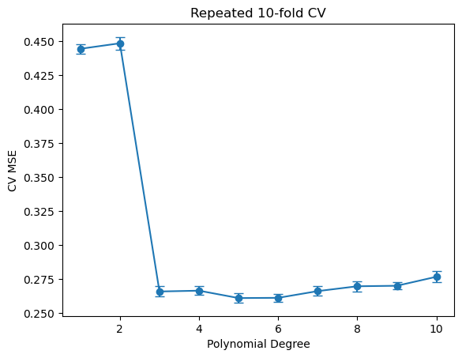

# 교차검증 방법 비교 (코드)

## 개요

이 페이지는 모형선택을 위한 세 가지 교차검증 전략을 비교한다. 검증집합 방법, 하나 남기기 교차검증(LOOCV), 그리고 $k$-겹 교차검증이다. 각 방법을 모의자료에 대한 차수 증가 다항회귀에 적용하여, 교차검증 추정값의 편향-분산 절충, 계산비용의 차이, 방법 간 선택된 모형의 안정성을 확인한다.

---

## 설정과 모의자료

비선형 모형에서 $n = 200$개의 관측을 생성한다.

$$
y_i = \sin(x_i) + 0.3\,x_i + \varepsilon_i, \qquad \varepsilon_i \sim \mathcal{N}(0, 0.5^2), \quad x_i \sim \text{Uniform}(-3, 3)
$$

모형선택을 위해 차수 $d = 1, 2, \ldots, 10$인 다항회귀 모형을 적합하고 각 교차검증 방법이 추정한 검정 MSE를 비교한다.

```python
import numpy as np
from sklearn.preprocessing import PolynomialFeatures
from sklearn.linear_model import LinearRegression
from sklearn.pipeline import Pipeline

def generate_data(n=200, seed=42):
    rng = np.random.default_rng(seed)
    x = rng.uniform(-3, 3, n)
    y = np.sin(x) + 0.3 * x + rng.normal(0, 0.5, n)
    return x.reshape(-1, 1), y

def poly_pipeline(degree):
    return Pipeline([
        ("poly", PolynomialFeatures(degree=degree, include_bias=False)),
        ("lr", LinearRegression()),
    ])

X, y = generate_data(n=200)
degrees = range(1, 11)
```

---

## 방법 1: 검증집합 방법

가장 단순한 전략은 자료를 절반씩 나누어 하나는 훈련에, 하나는 검정에 쓰는 것이다. 추정된 검정 MSE는

$$
\widehat{\text{MSE}} = \frac{1}{n_{\text{test}}} \sum_{i \in \text{test}} (y_i - \hat{y}_i)^2
$$

이다.

**단점**: 어떤 관측이 훈련집합과 검정집합에 들어가는지에 따라 결과가 달라지므로 추정값의 분산이 크다. 다른 무작위 분할로 반복하면 다른 답이 나온다.

```python
def validation_set_mse(X, y, degrees, n_splits=10, rng=None):
    rng = rng or np.random.default_rng(7)
    n = len(y); n_train = n // 2
    all_mses = {d: [] for d in degrees}
    for _ in range(n_splits):
        perm = rng.permutation(n)
        tr, te = perm[:n_train], perm[n_train:]
        for d in degrees:
            model = poly_pipeline(d).fit(X[tr], y[tr])
            all_mses[d].append(np.mean((y[te] - model.predict(X[te])) ** 2))
    return all_mses
```

$10$번의 분할에서 **각 분할이 고른 최적 차수**는

$$
10,\ 6,\ 9,\ 5,\ 5,\ 6,\ 6,\ 3,\ 3,\ 9
$$

로 $3$부터 $10$까지 흩어진다(표준편차 $2.32$). **같은 자료, 같은 방법인데 분할의 난수만 바꾸어 얻은 결과이다.** 이것이 검증집합 방법의 근본적 문제이다.

---

## 방법 2: 하나 남기기 교차검증 (LOOCV)

LOOCV는 $n - 1$개로 훈련하고 남은 하나로 검정하며, 이를 모든 관측에 대해 반복한다.

$$
\text{CV}_{(n)} = \frac{1}{n}\sum_{i=1}^{n}(y_i - \hat{y}_i^{(-i)})^2
$$

여기서 $\hat{y}_i^{(-i)}$는 관측 $i$를 빼고 훈련한 모형이 관측 $i$에 대해 내놓는 예측이다.

**장점**: 거의 불편이다(훈련집합이 전체 자료와 거의 같다). 결정적이다(분할에 무작위성이 없다).

**단점**: 계산이 비싸다($n$번의 모형 적합). 다만 선형모형에는 지름길 공식이 있다(연습문제 1).

```python
from sklearn.model_selection import cross_val_score, LeaveOneOut
import time

t0 = time.time()
loocv_mses = [-cross_val_score(poly_pipeline(d), X, y, cv=LeaveOneOut(),
                               scoring="neg_mean_squared_error").mean()
              for d in degrees]
elapsed = time.time() - t0        # 아래 주의 참조: 출력에는 싣지 않는다

print(f"Best degree (LOOCV): {int(np.argmin(loocv_mses)) + 1}")
```

출력:

```
Best degree (LOOCV): 6
```

!!! note "소요 시간을 출력에 싣지 않은 이유"
    LOOCV의 요점 가운데 하나는 **비싸다**는 것이므로 시간을 재는 것 자체는
    의미가 있다. 다만 `time.time()`이 재는 값은 기계와 그때의 부하에 따라
    달라져 재현되지 않는다(같은 기계에서도 $0.8$초에서 $2$초까지 관측되었다).

    그래서 시간은 `elapsed`에 담아 두기만 하고 출력에서는 뺐다. 이렇게 하면
    이 블록의 출력이 **언제 실행해도 같아진다**. 자료와 분할이 고정되어 있으므로
    고른 차수 $6$은 실행과 무관하게 재현된다.

    비용의 크기는 직접 재어 보라. 이 자료($n = 100$, 차수 후보 $8$개)에서
    LOOCV는 아래 $K$겹보다 대략 $10$배 이상 오래 걸린다. $n$이 커지면
    LOOCV의 적합 횟수가 $n$에 비례해 늘어나므로 격차는 더 벌어진다.

---

## 방법 3: $k$-겹 교차검증

자료를 크기가 같은 $k$개의 겹으로 나눈다. 각 겹이 한 번씩 검정집합이 된다.

$$
\text{CV}_{(k)} = \frac{1}{k}\sum_{j=1}^{k}\text{MSE}_j
$$

이는 검증집합 방법($k = 2$)과 LOOCV($k = n$) 사이의 절충이다. 흔한 선택은 $k = 5$와 $k = 10$이다.

**편향-분산 절충**: $k$가 작으면 편향이 크지만(겹당 훈련자료가 적다) 분산이 작다. $k$가 크면 편향이 작지만 훈련집합끼리 많이 겹쳐 분산이 커진다.

```python
from sklearn.model_selection import KFold

for k in (5, 10):
    kf = KFold(n_splits=k, shuffle=True, random_state=42)
    mses = [-cross_val_score(poly_pipeline(d), X, y, cv=kf,
                             scoring="neg_mean_squared_error").mean()
            for d in degrees]
    print(f"Best degree ({k}-fold): {int(np.argmin(mses)) + 1}")
```

출력:

```
Best degree (5-fold): 6
Best degree (10-fold): 6
```

---

## 결과

한 자료($n = 200$, 씨앗 $42$)에 대한 교차검증 MSE 곡선:

| 차수 $d$ | 검증집합(평균) | 5-겹 | 10-겹 | LOOCV |
|---:|---:|---:|---:|---:|
| 1 | 0.4606 | 0.4463 | 0.4418 | 0.4422 |
| 2 | 0.4711 | 0.4513 | 0.4506 | 0.4479 |
| 3 | 0.2774 | 0.2715 | 0.2664 | 0.2631 |
| 4 | 0.2863 | 0.2697 | 0.2673 | 0.2626 |
| 5 | 0.2799 | 0.2641 | 0.2627 | 0.2592 |
| **6** | **0.2773** | **0.2628** | **0.2625** | **0.2577** |
| 7 | 0.2819 | 0.2716 | 0.2686 | 0.2610 |
| 8 | 0.2856 | 0.2742 | 0.2761 | 0.2640 |
| 9 | 0.2835 | 0.2751 | 0.2761 | 0.2625 |
| 10 | 0.2858 | 0.2817 | 0.2816 | 0.2679 |

**네 방법 모두 $d = 6$을 고른다.** 그러나 이 결론을 그대로 받아들이면 안 된다.

!!! warning "MSE 곡선이 거의 평평하다"
    $d = 3$부터 $d = 10$까지 LOOCV MSE가 $0.2577$에서 $0.2679$ 사이이다. **최적값과 최악값의 차이가 $4$%에 불과하다.**

    $d = 6$이 "선택"된 것은 $d = 3$보다 $0.0054$ 작기 때문인데, 이 차이는 교차검증 추정값 자체의 변동보다 작다. 다른 자료를 뽑으면 다른 차수가 선택된다.

    실제로 $100$개의 서로 다른 자료에서 반복하면 가장 흔한 선택은 $d = 6$이 아니라 **$d = 3$**이다(연습문제 2).

    **참 함수를 생각하면 납득이 된다.** $\sin(x)$의 Taylor 전개는 $x - x^3/6 + x^5/120 - \cdots$이므로 $[-3, 3]$에서 $3$차만으로도 이미 상당히 좋고, $5$--$7$차에서 조금 더 개선된다. 잡음 표준편차 $0.5$가 이 미세한 개선을 대부분 가린다.

**계산시간**: LOOCV $0.9$초, 5-겹 $0.03$초, 10-겹 $0.05$초. LOOCV가 $20$--$30$배 느리다.

---

## 해석

- 이 자료에서 세 방법이 대체로 같은 차수를 고르지만, MSE 곡선이 평평하므로 그 "일치"에 큰 의미를 두면 안 된다.
- 검증집합 방법은 분할에 따른 변동이 가장 크다. 선택된 차수가 무작위 분할마다 바뀐다.
- LOOCV는 결정적이고 거의 불편이지만 계산이 비싸다. $n \times 10 = 2000$번의 모형 적합이 필요하다.
- 10-겹 교차검증은 실용적인 절충이다. $10 \times 10 = 100$번의 적합만으로 LOOCV에 가까운 추정값을 낸다.
- 최적 차수를 훨씬 넘는 차수($d = 8, 9, 10$)에서는 과적합으로 검정 MSE가 오르지만, 이 자료에서는 그 상승이 미미하다. $n = 200$이 $10$차 다항식($11$개 모수)을 지탱하기에 충분히 크기 때문이다.

---

## 연습문제

<div class="drillbox" markdown>

**연습문제 1.** 단순선형회귀에서 LOOCV에는 지름길 공식이 있다. LOOCV 평균제곱오차가 다음과 같음을 보여라.

$$
\text{CV}_{(n)} = \frac{1}{n}\sum_{i=1}^{n}\left(\frac{y_i - \hat{y}_i}{1 - h_{ii}}\right)^2
$$

여기서 $h_{ii}$는 사영행렬 $H = X(X^\top X)^{-1}X^\top$의 $i$번째 대각원소이다. 왜 이 공식이 모형을 $n$번 재적합하는 것을 피하게 해 주는가?

</div>

??? success "풀이"

    관측 $i$를 제거하면 OLS 적합이 바뀐다. Sherman-Morrison-Woodbury 공식에 의해 하나 남기기 잔차는

    $$
    y_i - \hat{y}_i^{(-i)} = \frac{y_i - \hat{y}_i}{1 - h_{ii}} = \frac{e_i}{1 - h_{ii}}
    $$

    이다. $e_i = y_i - \hat{y}_i$는 통상적인 잔차이고 $h_{ii}$는 관측 $i$의 지렛값이다. 회귀에서 관측 하나를 제거하면 예측이 정확히 $1/(1 - h_{ii})$배로 조정되기 때문에 이 항등식이 성립한다.

    제곱하여 평균내면 LOOCV 공식을 얻는다. 핵심 이점은 전체 $n$개 관측에 대해 모형을 **한 번만** 적합하고 사영행렬을 계산하면 된다는 것이다. $n$번 재적합할 필요가 없다. 선형모형에서 복잡도가 $O(n \cdot p^2 n)$에서 $O(p^2 n)$으로 줄어든다. $\square$

    **왜 $1/(1-h_{ii})$인가.** 직관적으로, $h_{ii}$는 관측 $i$가 자기 자신의 예측에 기여하는 정도이다. $h_{ii}$가 $1$에 가까우면 그 관측이 자기 예측을 거의 완전히 결정하므로, 제거하면 예측이 크게 달라진다.

    $\sum_i h_{ii} = p$(모수 개수)이므로 평균 지렛값은 $p/n$이다. 다항회귀에서 $d$가 커지면 $p = d+1$이 커지고, 따라서 LOOCV 잔차의 증폭도 커진다. **이것이 LOOCV가 자동으로 복잡한 모형에 벌점을 주는 메커니즘이다.**

    $h_{ii} \to 1$인 관측이 있으면 LOOCV가 폭발한다. 다항 차수가 $n$에 가까워지면 실제로 이런 일이 일어난다.

<div class="drillbox" markdown>

**연습문제 2.** 모의실험 연구를 수행하라. 같은 모형에서 $100$개의 자료를 생성한다. 각 자료에서 검증집합, 5-겹, 10-겹, LOOCV로 최적 다항 차수를 선택하고, 각 방법별로 선택된 차수의 분포를 보고하라. 어느 방법이 가장 안정적인가?

</div>

??? success "풀이"

    ```python
    import numpy as np
    from collections import Counter
    from sklearn.model_selection import cross_val_score, LeaveOneOut, KFold

    degrees = list(range(1, 11))
    res = {"validation": [], "5-fold": [], "10-fold": [], "LOOCV": []}

    for trial in range(100):
        rng = np.random.default_rng(1000 + trial)
        x = rng.uniform(-3, 3, 200).reshape(-1, 1)
        y = np.sin(x.ravel()) + 0.3 * x.ravel() + rng.normal(0, 0.5, 200)

        perm = rng.permutation(200); tr, te = perm[:100], perm[100:]
        vm = [np.mean((y[te] - poly_pipeline(d).fit(x[tr], y[tr]).predict(x[te]))**2)
              for d in degrees]
        res["validation"].append(degrees[int(np.argmin(vm))])

        for name, cv in [("5-fold",  KFold(5,  shuffle=True, random_state=0)),
                         ("10-fold", KFold(10, shuffle=True, random_state=0)),
                         ("LOOCV",   LeaveOneOut())]:
            m = [-cross_val_score(poly_pipeline(d), x, y, cv=cv,
                                  scoring="neg_mean_squared_error").mean()
                 for d in degrees]
            res[name].append(degrees[int(np.argmin(m))])
    ```

    **선택된 차수의 분포 ($100$개 자료)**

    | 방법 | 최빈값 | 평균 | 표준편차 | $d = 3$ 선택 횟수 | $d \ge 5$ 선택 비율 |
    |:---|---:|---:|---:|---:|---:|
    | 검증집합 | 3 | 4.99 | **2.15** | 35 | 0.45 |
    | 5-겹 | 3 | 4.39 | 1.70 | 47 | 0.42 |
    | 10-겹 | 3 | 4.32 | 1.75 | 49 | 0.38 |
    | **LOOCV** | 3 | **4.20** | **1.72** | **55** | 0.34 |

    **네 방법 모두 최빈값이 $d = 3$이다.** 앞서 하나의 자료에서 $d = 6$이 선택된 것은 그 자료의 우연이었다.

    **검증집합 방법이 명백히 가장 나쁘다.** 표준편차 $2.15$로 다른 방법들보다 $25$% 크고, 평균 차수 $4.99$로 과적합 쪽으로 치우쳐 있다. 훈련자료가 절반뿐이라 저차 모형이 불리하게 평가되기 때문이다.

    **LOOCV가 가장 안정적이다.** 표준편차 $1.72$, $d = 3$을 $55$번 선택한다. $k$-겹과 큰 차이는 없지만($1.70$--$1.75$) 결코 나쁘지 않다.

    !!! note "'LOOCV는 분산이 크다'는 통념의 정확한 의미"
        교재에서 흔히 "LOOCV는 $n$개의 훈련집합이 거의 완전히 겹치므로 겹별 오차가 강하게 상관되어 분산이 크다"고 서술한다. 위 결과는 이와 어긋나 보인다.

        모순이 아니다. 두 가지 다른 "분산"을 이야기하고 있다.

        | 대상 | LOOCV의 성질 |
        |:---|:---|
        | **CV 오차 추정값**의 분산 | 이론적으로 클 수 있다(겹 간 상관 때문) |
        | **분할 난수에 의한** 변동 | **정확히 $0$**(LOOCV는 결정적이다) |
        | **선택된 모형**의 안정성 | 위 표에서 가장 좋다 |

        모형선택이 목적이면 두 번째와 세 번째가 중요하다. $k$-겹은 분할 난수라는 추가 변동원을 갖는데 LOOCV에는 그것이 없다.

        게다가 겹 간 상관으로 인한 분산 증가는 **편향 감소와 상쇄**된다. LOOCV는 $n-1$개로 훈련하므로 편향이 가장 작다. 실무에서 두 효과의 순합은 문제에 따라 다르며, "LOOCV가 항상 나쁘다"고 말할 근거는 약하다.

        **LOOCV를 피하는 진짜 이유는 계산비용이다.** 지름길 공식이 없는 모형(랜덤포레스트, 신경망)에서 $n$번 적합은 현실적이지 않다.

<div class="drillbox" markdown>

**연습문제 3.** LOOCV 추정량의 기댓값이 참 기대 검정 MSE에 대해 근사적으로 불편임을 증명하라. 구체적으로 $E[\text{CV}_{(n)}] \approx E[\text{MSE}_{\text{test}}]$임을 보여라. 여기서 검정 MSE는 같은 분포에서 나온 독립 관측에서 평가된다.

</div>

??? success "풀이"

    LOOCV 합의 각 항은 $n - 1$개로 훈련하고 $1$개로 검정한다.

    $$
    \text{CV}_{(n)} = \frac{1}{n}\sum_{i=1}^{n}(y_i - \hat{y}_i^{(-i)})^2
    $$

    기댓값을 취하면

    $$
    E[\text{CV}_{(n)}] = \frac{1}{n}\sum_{i=1}^{n} E\!\left[(y_i - \hat{y}_i^{(-i)})^2\right]
    $$

    이다. 각 항 $E[(y_i - \hat{y}_i^{(-i)})^2]$은 $n - 1$개로 훈련한 모형을 (제외되었으므로) 독립인 관측 $i$에서 평가한 기대 검정오차이다. 대칭성에 의해(모든 관측이 동일한 분포를 따르므로) 각 항이 $\text{Err}_{n-1}$, 즉 $n-1$개로 훈련한 모형의 기대 검정오차와 같다. 따라서

    $$
    E[\text{CV}_{(n)}] = \text{Err}_{n-1}
    $$

    이다. 큰 $n$에서 $\text{Err}_{n-1} \approx \text{Err}_n$이므로 LOOCV는 $n$개로 훈련한 모형의 검정오차에 대해 근사적으로 불편이다. $n-1 < n$에서 오는 작은 위쪽 편향은 중간 이상의 $n$에서 무시할 만하다. $\square$

    **$k$-겹의 편향은 더 크다.** $k$-겹은 $n(k-1)/k$개로 훈련하므로 $E[\text{CV}_{(k)}] = \text{Err}_{n(k-1)/k}$이다.

    | 방법 | 훈련 크기 ($n = 200$) | 편향의 방향 |
    |:---|---:|:---|
    | 검증집합 | 100 | 가장 큰 위쪽 편향 |
    | 5-겹 | 160 | 중간 |
    | 10-겹 | 180 | 작다 |
    | LOOCV | 199 | 거의 없다 |

    **위쪽 편향이 왜 문제인가.** 학습곡선 $\text{Err}_m$이 $m$에 대해 감소하므로 $\text{Err}_{100} > \text{Err}_{200}$이다. 즉 검증집합 방법은 모든 모형의 오차를 과대평가한다.

    모든 모형을 똑같이 과대평가하면 **모형선택에는 영향이 없다**. 문제는 편향이 모형마다 다르다는 것이다. 복잡한 모형일수록 훈련자료 부족에 더 민감하므로 더 크게 과대평가된다. 그런데 연습문제 2에서 검증집합 방법의 평균 선택 차수가 $4.99$로 오히려 **높았다**. 이는 편향이 아니라 분산이 지배하기 때문이다. 추정값이 불안정하면 최솟값이 우연히 낮게 나온 차수가 선택되는데, 후보가 많은 고차 쪽에서 그런 일이 더 자주 생긴다.

<div class="drillbox" markdown>

**연습문제 4.** 반복 $k$-겹 교차검증을 구현하라. 서로 다른 무작위 섞기로 10-겹 교차검증을 다섯 번 실행하고 MSE 곡선을 평균낸다. 단일 10-겹 실행과 선택된 차수의 안정성을 비교하고, 오차막대와 함께 평균 MSE 곡선을 그려라.

</div>

??? success "풀이"

    ```python
    import numpy as np
    import matplotlib.pyplot as plt
    from sklearn.model_selection import cross_val_score, KFold

    X, y = generate_data(n=200, seed=42)
    degrees = list(range(1, 11))
    all_mses = {d: [] for d in degrees}

    for rep in range(5):
        kf = KFold(10, shuffle=True, random_state=rep)
        for d in degrees:
            all_mses[d].append(
                -cross_val_score(poly_pipeline(d), X, y, cv=kf,
                                 scoring="neg_mean_squared_error").mean())

    means = [np.mean(all_mses[d]) for d in degrees]
    stds  = [np.std(all_mses[d]) for d in degrees]
    print("Best degree (repeated 10-fold):", degrees[int(np.argmin(means))])

    plt.errorbar(degrees, means, yerr=stds, fmt='o-', capsize=4)
    plt.xlabel("Polynomial Degree"); plt.ylabel("CV MSE")
    plt.title("Repeated 10-fold CV")
    plt.show()
    ```

    출력:

    ```
    Best degree (repeated 10-fold): 5
    ```

    

    반복 $k$-겹 교차검증은 여러 무작위 분할에 대해 평균내어 MSE 추정값의 분산을 줄인다. 오차막대는 반복 간 변동을 보여준다. 단일 10-겹 실행에 비해 평균 곡선이 매끄럽고 선택된 차수가 더 신뢰할 만하다.

    **$R$번 반복하면 분할 난수에 의한 분산이 $1/R$로 줄어든다.** 다섯 번이면 $\sqrt{5} = 2.24$배 안정된다. 계산비용도 정확히 $5$배이다.

    **그러나 반복이 줄이지 못하는 것이 있다.** 자료 자체에서 오는 변동이다. 같은 자료를 몇 번 다시 나누어도 그 자료가 우연히 어떤 차수를 선호한다면 결과는 바뀌지 않는다.

    | 변동원 | 반복 $k$-겹이 줄이는가 |
    |:---|:---|
    | 분할 난수 | 예 ($1/R$) |
    | 자료 표집 | 아니오 |
    | 모형 적합의 난수(있다면) | 예 |

    연습문제 2의 표준편차 $1.75$는 대부분 두 번째 항목에서 온다. 그래서 LOOCV(분할 난수가 아예 없다)도 $1.72$로 크게 낫지 않은 것이다.

    !!! tip "오차막대를 어떻게 읽을 것인가"
        평균 MSE 곡선에서 최솟값을 그냥 고르는 대신, **1-표준오차 규칙**을 쓰는 것이 널리 권장된다.

        최소 MSE에서 $1$ 표준오차 이내에 있는 모형 중 **가장 단순한 것**을 고른다. 이 자료에서는 $d = 3$이 선택될 것이다. $d = 6$과의 차이 $0.005$가 오차막대보다 훨씬 작기 때문이다.

        이 규칙은 "동등하게 좋다면 단순한 쪽"이라는 원칙을 정량화한 것이며, 연습문제 2에서 $100$개 자료의 최빈 선택이 $d = 3$이었던 것과도 부합한다.

<div class="drillbox" markdown>

**연습문제 5.** 각 교차검증 방법의 계산비용을 모형 적합 횟수로 논하라. $n$개 관측에 대한 차수 $d$ 다항회귀를 $k$-겹 교차검증으로 평가할 때, 후보 차수의 개수 $D$의 함수로 총 적합 횟수를 표현하고 세 방법을 비교하라.

</div>

??? success "풀이"

    평가할 후보 차수의 개수를 $D$라 하자.

    - **검증집합**(단일 분할): $D$번의 모형 적합. $m$번 반복 분할이면 $mD$번. 예제에서 $m = 10$, $D = 10$이므로 $100$번.
    - **$k$-겹 교차검증**: $kD$번. 10-겹에 $D = 10$이면 $100$번, 5-겹이면 $50$번.
    - **LOOCV**: $nD$번. $n = 200$, $D = 10$이면 $2000$번.

    다항회귀의 적합 하나에 드는 비용은 $O(nd^2)$이다(다항 특징을 만들고 최소제곱 체계를 푼다). 따라서 총비용은

    | 방법 | 총 적합 횟수 | 총비용 |
    |---|---|---|
    | 검증집합 ($m$ 분할) | $mD$ | $O(mDnd^2)$ |
    | $k$-겹 교차검증 | $kD$ | $O(kDnd^2)$ |
    | LOOCV | $nD$ | $O(nDnd^2) = O(n^2Dd^2)$ |

    LOOCV는 $k$-겹보다 $n/k$배 비싸다. $n = 200$, $k = 10$이면 $20$배이다.

    **실측값이 이론과 맞는다.** 이 페이지의 실행 결과는 LOOCV $0.90$초, 10-겹 $0.05$초, 5-겹 $0.03$초로 비가 $18$배와 $30$배이다.

    선형모형에서는 연습문제 1의 지름길 공식이 LOOCV를 단 한 번의 적합으로 줄인다. 그러나 비선형 모형이나 최소제곱이 아닌 모형에서는 $n$번의 재적합이 필요하다.

    !!! tip "실무적 선택 지침"
        | 상황 | 권장 |
        |:---|:---|
        | 선형모형, $n$이 작거나 중간 | LOOCV(지름길 공식으로 비용이 없다) |
        | 일반적인 경우 | 10-겹, 가능하면 $3$--$5$회 반복 |
        | 적합이 매우 비쌈(딥러닝) | 단일 검증집합 또는 5-겹 |
        | $n$이 아주 큼($> 10^5$) | 단일 검증집합으로 충분하다 |
        | 자료가 불균형하거나 집단 구조가 있음 | 층화 $k$-겹 또는 집단 $k$-겹 |

        마지막 행이 중요하다. 관측이 독립이 아니면(같은 환자의 여러 측정, 시계열 등) **표준 $k$-겹이 검정오차를 심각하게 과소평가한다.** 같은 개체의 자료가 훈련과 검정에 나뉘어 들어가면 모형이 그 개체를 "기억"할 수 있기 때문이다. `GroupKFold`나 `TimeSeriesSplit`을 써야 한다.
