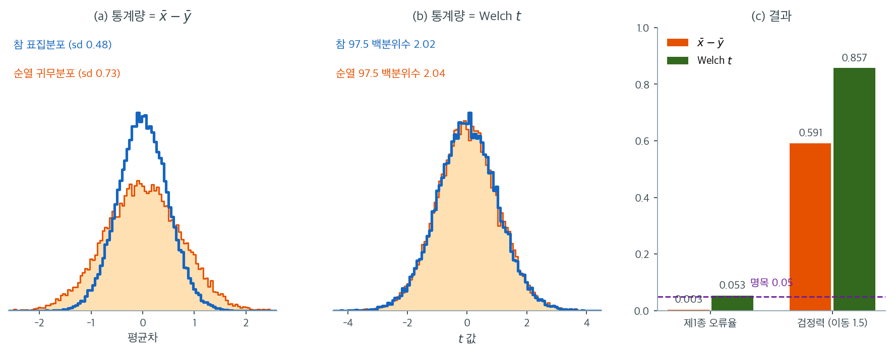

# 재표집 방법 비교 (코드)

## 개요

이 페이지는 붓스트랩과 순열 재표집 방법을 나란히 비교한다. 붓스트랩 신뢰구간(정규, 백분위수, 기본, BCa)과 포함확률 모의실험, 이표본 및 대응 순열검정, 상관에 대한 순열검정, 그리고 붓스트랩 신뢰구간과 순열 $p$값의 직접 비교를 다룬다. 각 방법이 언제 왜 적절한지를 보이는 것이 목표이다.

## 붓스트랩 표준오차와 신뢰구간

표본 $x_1, \ldots, x_n$이 주어졌을 때 통계량 $\hat\theta$의 붓스트랩 표준오차는

$$
\widehat{\text{SE}}_{\text{boot}} = \sqrt{\frac{1}{B-1}\sum_{b=1}^{B}\bigl(\hat\theta^{*(b)} - \overline{\hat\theta^*}\bigr)^2}
$$

이다. 네 가지 신뢰구간 방법이 있다.

**정규 구간.** 붓스트랩 표준오차와 정규 분위수를 쓴다.

$$
\hat\theta \pm z_{1-\alpha/2}\cdot\widehat{\text{SE}}_{\text{boot}}
$$

**백분위수 구간.** 붓스트랩 분포의 분위수에서 직접 읽는다.

$$
\bigl[\hat\theta^*_{\alpha/2},\;\hat\theta^*_{1-\alpha/2}\bigr]
$$

**기본(추축) 구간.** 분위수를 $\hat\theta$에 대해 반사한다.

$$
\bigl[2\hat\theta - \hat\theta^*_{1-\alpha/2},\;2\hat\theta - \hat\theta^*_{\alpha/2}\bigr]
$$

**BCa 구간.** 잭나이프를 써서 편향($z_0$)과 가속($a$)을 보정한다.

$$
\alpha_j = \Phi\!\left(z_0 + \frac{z_0 + z_{\alpha_j}}{1 - a(z_0 + z_{\alpha_j})}\right)
$$

<div class="exbox" markdown>

**보기 1.** <span class="diff easy" title="쉬움"></span> 세 가지 붓스트랩 신뢰구간. 평균에 대해 정규·백분위수·기본 구간을 같은 복제값에서 읽는다.

**(1)** 세 구간의 **폭**과 **중점** 사이에 성립하는 항등식을 적으시오. 구체적으로 어느 둘의 폭이 늘 같은가. 세 중점은 $\hat\theta$와 어떤 관계인가. 정규 구간의 폭이 $B \to \infty$에서 무엇으로 수렴하는가.

**(2)** $\text{Exp}(3)$에서 $n = 30$을 뽑아 확인하시오.

</div>

??? success "풀이"

    **(1) 해석적으로.** $\hat\theta^{*}_{q}$를 붓스트랩 분위수라 하고 $L = \hat\theta^{*}_{\alpha/2}$, $U = \hat\theta^{*}_{1-\alpha/2}$라 두자.

    - 백분위수 구간은 $[L,\ U]$, 기본 구간은 $[2\hat\theta - U,\ 2\hat\theta - L]$이다. **두 폭이 똑같이 $U - L$이다.** 기본 구간은 백분위수 구간을 $\hat\theta$에 대해 뒤집은 것일 뿐이라 길이가 보존된다.
    - 중점은 각각 $\dfrac{L+U}{2}$와 $2\hat\theta - \dfrac{L+U}{2}$이므로 **두 중점의 합이 $2\hat\theta$**다. $\hat\theta$를 가운데 두고 정확히 대칭으로 벌어진다는 뜻이고, 붓스트랩 분포가 오른쪽으로 치우쳐 $L+U > 2\hat\theta$이면 백분위수가 오른쪽, 기본이 왼쪽으로 간다.
    - 정규 구간 $[\hat\theta - z\widehat{\operatorname{SE}},\ \hat\theta + z\widehat{\operatorname{SE}}]$의 중점은 **언제나 $\hat\theta$**다. 셋 가운데 유일하게 치우침을 반영하지 않는다.

    식으로 적으면 이렇다.

    $$
    \text{mid}_{\text{백분위수}} + \text{mid}_{\text{기본}} = 2\hat\theta,
    \qquad
    \text{mid}_{\text{정규}} = \hat\theta
    $$

    폭의 극한은 [붓스트랩 표준오차](../../ch05/applications/bootstrap_standard_error.md) 보기 1에서 $\widehat{\operatorname{SE}} \to \hat\sigma/\sqrt n$이므로

    $$
    \text{폭}_{\text{정규}} \xrightarrow[B\to\infty]{} 2 z_{1-\alpha/2}\,\frac{\hat\sigma}{\sqrt n}
    $$

    다. **셋이 모두 같아지는 것은 붓스트랩 분포가 $\hat\theta$에 대해 대칭이고 정규일 때뿐이다.**

    **(2) 수치적으로.**

    ```python
    import numpy as np
    from scipy import stats

    def bootstrap_ci_demo(data, B=10_000, alpha=0.05, rng=None):
        """평균에 대한 세 가지 붓스트랩 신뢰구간을 함께 구한다.

        정규법은 붓스트랩으로 표준오차만 얻고 구간은 정규분포로 만든다.
        백분위수법은 붓스트랩 분포의 분위점을 그대로 쓴다. 기본법은 그
        분위점을 추정값 둘레로 되비춘다. 분포가 대칭이면 셋이 거의 같다.
        """
        rng = rng or np.random.default_rng(0)
        n = len(data)
        theta_hat = data.mean()
        z = stats.norm.ppf(1 - alpha / 2)

        boot_means = data[rng.integers(0, n, (B, n))].mean(axis=1)
        se_boot = boot_means.std(ddof=1)
        lo_q, hi_q = np.percentile(boot_means, [100*alpha/2, 100*(1 - alpha/2)])

        return {
            "normal":     (theta_hat - z*se_boot, theta_hat + z*se_boot),
            "percentile": (lo_q, hi_q),
            "basic":      (2*theta_hat - hi_q, 2*theta_hat - lo_q),
        }
    ```

    $\text{Exp}(3)$에서 $n = 30$을 뽑아 확인한다.

    ```python
    d = np.random.default_rng(12).exponential(1/3, 30)
    r = bootstrap_ci_demo(d)
    th = d.mean()
    for k, (a, b) in r.items():
        print(f"{k:>11}: [{a:.6f}, {b:.6f}]  폭 {b-a:.6f}  중점 {(a+b)/2:.6f}")
    print(f"theta_hat = {th:.6f}")
    print(f"중점 합 (기본+백분위수) = {(sum(r['basic'])/2 + sum(r['percentile'])/2):.6f}"
          f"  = 2*theta_hat = {2*th:.6f}")
    print(f"정규 구간 폭 극한 = 2 z sigma-hat/sqrt(n) = "
          f"{2*1.959964*d.std(ddof=0)/np.sqrt(30):.6f}")
    ```

    출력:

    ```
         normal: [0.257486, 0.511222]  폭 0.253736  중점 0.384354
     percentile: [0.261750, 0.516883]  폭 0.255133  중점 0.389317
          basic: [0.251825, 0.506958]  폭 0.255133  중점 0.379392
    theta_hat = 0.384354
    중점 합 (기본+백분위수) = 0.768708  = 2*theta_hat = 0.768708
    정규 구간 폭 극한 = 2 z sigma-hat/sqrt(n) = 0.255376
    ```

    **세 항등식이 모두 확인된다.** 백분위수와 기본의 폭이 $0.255133$으로 **소수 여섯째 자리까지 같고**, 두 중점의 합 $0.768708$이 $2\hat\theta$와 같으며, 정규 구간의 중점이 $\hat\theta = 0.384354$와 정확히 일치한다.

    **치우침이 보인다.** 백분위수 중점이 $\hat\theta$보다 $+0.0050$, 기본 중점이 $-0.0050$ 옮겨져 있다. 지수분포 자료라 붓스트랩 분포가 오른쪽으로 치우친 결과이며, **두 방법이 정반대 방향으로 움직인다**는 것이 핵심이다. 어느 쪽이 옳은지는 참 표집분포가 같은 방향으로 치우쳤는지에 달렸다.

    정규 구간의 폭 $0.253736$도 극한 $0.255376$에 가깝다(차이 $0.0016$은 $B = 10{,}000$에서 $\widehat{\operatorname{SE}}$의 몬테카를로 요동이 폭으로 환산되어 $0.0018$인 범위 안).

    **아래 포함확률 표가 보여 주듯 셋 다 $n = 30$에서는 명목값에 못 미친다.** 폭과 중점의 산수는 정확해도, 그 구간이 참값을 $95\%$ 담느냐는 별개의 물음이다.


## 붓스트랩 포함확률 모의실험

포함확률 모의실험은 명목 신뢰수준이 참 모수를 포함하는 구간의 실제 비율과 일치하는지 확인한다. $N$번의 모의실험 각각에서

1. 알려진 모집단에서 새 표본을 뽑는다.
2. 붓스트랩 신뢰구간을 만든다.
3. 참 모수가 그 안에 들어가는지 확인한다.

경험적 포함확률은

$$
\widehat{\text{coverage}} = \frac{1}{N}\sum_{i=1}^{N}\mathbf{1}\!\bigl(\theta \in \text{CI}_i\bigr)
$$

이다.

$\text{Exp}(3)$에서 $n = 30$을 뽑은 결과($M = 3{,}000$, $B = 2{,}000$):

| 방법 | 포함확률 |
|:---|---:|
| 정규 | 0.912 |
| 백분위수 | 0.913 |
| 기본 | 0.902 |
| BCa | 0.922 |
| $t$ 구간 | 0.925 |

**네 붓스트랩 방법 모두 명목값에 못 미친다.** $t$ 구간도 $0.925$에 그친다. 지수분포의 왜도가 $2$로 크기 때문이며, $n = 30$으로는 어떤 방법도 $0.95$를 달성하지 못한다.

## 이표본 순열검정

순열검정은 두 표본을 합치고 라벨을 섞어 각 순열에서 검정통계량을 계산한다.

<div class="exbox" markdown>

**보기 2.** <span class="diff easy" title="쉬움"></span> 이표본 순열검정. 이 함수는 평균차를 기본 통계량으로 쓴다. 쪽 끝의 그림이 다루는 상황 — $X \sim N(5, 1^2)$을 $n_x = 20$, $Y \sim N(5, 3^2)$을 $n_y = 50$ — 에서 그 선택이 어떻게 되는지 수로 따진다.

**(1)** $H_0$가 참일 때 $\bar x - \bar y$의 **참** 표준편차와, 라벨을 섞어 만든 **순열 귀무분포**의 표준편차를 각각 구하시오. 둘의 비는 얼마이며, 그 결과 제1종 오류율이 명목값보다 커지겠는가 작아지겠는가.

**(2)** 모의실험으로 제1종 오류율을 재어 Welch $t$ 검정과 견주시오.

</div>

??? success "풀이"

    **(1) 해석적으로.** 두 표본이 독립이므로 참 표준편차는

    $$
    \operatorname{SD}(\bar X - \bar Y)
    = \sqrt{\frac{\sigma_x^2}{n_x} + \frac{\sigma_y^2}{n_y}}
    = \sqrt{\frac{1}{20} + \frac{9}{50}} = \sqrt{0.23} = 0.4796
    $$

    다. 반면 라벨을 섞으면 $70$개가 한 웅덩이가 되어 **모든 관측이 같은 분산을 갖게 된다.** 합친 자료의 분산은

    $$
    \bar\sigma^2 \approx \frac{n_x\sigma_x^2 + n_y\sigma_y^2}{n_x+n_y}
    = \frac{20 \times 1 + 50 \times 9}{70} = 6.714
    $$

    이고, [이표본 순열검정](../permutation/two_sample.md) 보기 1의 식에 넣으면

    $$
    \operatorname{SD}(d^{*}) = S\sqrt{\frac{1}{n_x}+\frac{1}{n_y}}
    \approx \sqrt{6.714 \times \frac{70}{69} \times 0.07} = 0.6905
    $$

    다. **비가 $0.6905/0.4796 = 1.44$로 귀무분포가 실제보다 $44\%$ 넓다.**

    **그러므로 검정이 지나치게 보수적이 된다.** 관측된 차이는 참 표준편차 $0.4796$짜리 분포에서 나왔는데 $0.6905$짜리 자로 재니 좀처럼 극단으로 보이지 않는다. 제1종 오류율이 $0.05$에 **크게 못 미칠** 것이다.

    **(2) 수치적으로.** 함수는 이렇다.

    ```python
    def permutation_test_two_sample(x, y, B=9999, stat_func=None, rng=None):
        """이표본 순열검정. 통계량 함수를 바꿔 끼울 수 있다.

        평균 차이든 중앙값 차이든 절사평균 차이든, 귀무가설 아래에서 이름표가
        무의미하다는 논리는 그대로다. 순열검정이 통계량에 매이지 않는 까닭이다.
        """
        rng = rng or np.random.default_rng(0)
        if stat_func is None:
            stat_func = lambda a, b: a.mean() - b.mean()
        t_obs = stat_func(x, y)
        pooled = np.concatenate([x, y])
        m = len(x)

        count = 0
        for _ in range(B):
            p = rng.permutation(pooled)
            count += abs(stat_func(p[:m], p[m:])) >= abs(t_obs)
        return t_obs, (count + 1) / (B + 1)
    ```

    $H_0$가 참인 자료를 $1{,}000$번 만들어 기각률을 센다. 반복이 많으므로 벡터화해 쓴다.

    ```python
    nx, ny, sx, sy = 20, 50, 1.0, 3.0
    true_sd = np.sqrt(sx**2/nx + sy**2/ny)
    sbar2 = (nx*sx**2 + ny*sy**2)/(nx+ny)
    perm_sd = np.sqrt(sbar2*(nx+ny)/(nx+ny-1)*(1/nx+1/ny))
    print(f"참 SD(xbar-ybar) = {true_sd:.4f},  순열 귀무 SD 어림 = {perm_sd:.4f},"
          f"  비 = {perm_sd/true_sd:.4f}")

    rng = np.random.default_rng(21)
    M, B = 1000, 499
    rej_mean = rej_welch = 0
    sds = []
    for _ in range(M):
        x = rng.normal(5, sx, nx); y = rng.normal(5, sy, ny)
        obs = x.mean() - y.mean(); z = np.concatenate([x, y])
        P = np.array([rng.permutation(z) for _ in range(B)])
        dd = P[:, :nx].mean(1) - P[:, nx:].mean(1)
        sds.append(dd.std(ddof=1))
        rej_mean += ((np.abs(dd) >= abs(obs)).sum() + 1)/(B + 1) < 0.05
        rej_welch += stats.ttest_ind(x, y, equal_var=False).pvalue < 0.05
    print(f"순열 귀무 SD 의 평균(모의) = {np.mean(sds):.4f}")
    print(f"제1종 오류율: 평균차 순열 {rej_mean/M:.3f},  Welch t {rej_welch/M:.3f}"
          f"   (몬테카를로 오차 {np.sqrt(0.05*0.95/M):.4f})")
    ```

    출력:

    ```
    참 SD(xbar-ybar) = 0.4796,  순열 귀무 SD 어림 = 0.6905,  비 = 1.4398
    순열 귀무 SD 의 평균(모의) = 0.6840
    제1종 오류율: 평균차 순열 0.006,  Welch t 0.044   (몬테카를로 오차 0.0069)
    ```

    **어림이 맞는다.** 예측한 순열 귀무 SD $0.6905$에 대해 모의 평균이 $0.6840$이다.

    **결과는 예측보다 극단적이다.** 제1종 오류율이 $0.006$으로 명목값 $0.05$의 **$8$분의 $1$**이다. Welch $t$ 검정은 $0.044$로 제자리를 지킨다. 귀무분포가 $1.44$배 넓어진 것이 꼬리확률에서는 이만큼 증폭된 셈이다.

    **"보수적이니 안전하다"고 넘길 일이 아니다.** 크기가 $0.006$인 검정은 검정력도 그만큼 잃는다. 실제 차이가 있어도 잡아내지 못한다는 뜻이고, 이 설계에서는 **쓰지 말아야 할 검정**이다. 처방은 통계량을 Welch 식으로 스튜던트화하는 것이다([순열검정: 기초](../permutation/foundations.md) 연습문제 1).

    처치군 대 대조군 자료에 적용하면 순열 $p$값이 대개 Welch $t$ 검정의 $p$값과 가깝다. **다만 분산이 다르고 표본이 불균형하면 그렇지 않다**(연습문제 2).

## 상관에 대한 순열검정

$H_0\colon \rho = 0$을 검정하려면 한 변수를 고정한 채 다른 변수를 순열한다.

$$
p = \frac{\#\bigl\{b : |r^{(\pi_b)}| \ge |r_{\text{obs}}|\bigr\} + 1}{B + 1}
$$

<div class="exbox" markdown>

**보기 3.** <span class="diff easy" title="쉬움"></span> 상관에 대한 순열검정. 보기 2의 검정은 등분산이 깨지면 무너졌다. 이 검정은 그렇지 않다.

**(1)** $X$와 $Y$가 **독립이기만 하면** 주변분포가 무엇이든 이 검정의 크기가 정확함을 설명하시오. 순열 귀무분포에서 $\operatorname{Var}(r^{*})$는 얼마인가. $B = 999$에 $(c+1)/(B+1) < 0.05$ 규칙을 쓰면 명목 크기가 정확히 얼마가 되는가.

**(2)** $X \sim N(0,1)$, $Y \sim \text{Exp}(1)$을 독립으로 뽑아($n = 20$) 크기와 $p$값의 분포를 재시오.

</div>

??? success "풀이"

    **(1) 해석적으로.** $X$와 $Y$가 독립이면, 관측된 $y$값들을 어떤 순서로 $x$에 붙이든 **똑같이 그럴듯하다.** $n!$가지 짝짓기가 교환가능하므로 관측된 배열은 그중 무작위로 하나를 뽑은 것과 구별되지 않고, 따라서 $p$값이 정확하다. **두 변수의 주변분포는 아무 상관이 없다.** 보기 2가 무너진 까닭은 합치는 순간 두 집단의 분포가 뒤섞여 교환가능성이 깨졌기 때문인데, 여기서는 한쪽만 섞으므로 주변분포가 그대로 남는다.

    분산은 [상관에 대한 순열검정](../permutation/correlation.md) 보기 1에서 유도한 대로 자료와 무관하게

    $$
    \operatorname{Var}(r^{*}) = \frac{1}{n-1}
    $$

    이고, $n = 20$이면 $\operatorname{SD}(r^{*}) = 1/\sqrt{19} = 0.229416$이다.

    **명목 크기.** $\hat p = (c+1)/1000 < 0.05$는 $c + 1 \le 49$, 곧 $c \le 48$과 같다. 교환가능성에서 $c+1$이 $\{1, \ldots, 1000\}$ 위에 균등하므로

    $$
    \Pr(\hat p < 0.05) = \frac{49}{1000} = 0.049
    $$

    다. **$0.05$가 아니라 $0.049$가 이 규칙의 정확한 크기다.**

    **(2) 수치적으로.** 함수는 이렇다.

    ```python
    def permutation_test_correlation(x, y, B=9999, rng=None):
        """상관계수에 대한 순열검정.

        한쪽만 섞는다. 그러면 두 변수의 짝은 부서지되 각각의 주변분포는
        그대로 남으므로, "관계가 없다"는 상태를 정확히 흉내 낼 수 있다.
        """
        rng = rng or np.random.default_rng(0)
        r_obs = np.corrcoef(x, y)[0, 1]
        count = 0
        for _ in range(B):
            count += abs(np.corrcoef(x, rng.permutation(y))[0, 1]) >= abs(r_obs)
        return r_obs, (count + 1) / (B + 1)
    ```

    주변분포를 일부러 서로 다르게 — 한쪽은 정규, 한쪽은 지수 — 두고 $1{,}000$번 돌린다.

    ```python
    rng = np.random.default_rng(31)
    M, B, n = 1000, 999, 20
    rej = 0
    ps = []
    for _ in range(M):
        x = rng.normal(0, 1, n)
        y = rng.exponential(1, n)          # 독립, 주변분포는 서로 다름
        r = np.corrcoef(x, y)[0, 1]
        perm = np.array([np.corrcoef(x, rng.permutation(y))[0, 1] for _ in range(B)])
        p = ((np.abs(perm) >= abs(r)).sum() + 1) / (B + 1)
        ps.append(p); rej += p < 0.05
    ps = np.array(ps)
    print(f"제1종 오류율 = {rej/M:.3f}  (몬테카를로 오차 {np.sqrt(0.05*0.95/M):.4f})")
    print(f"p 값의 평균 = {ps.mean():.4f} (균등이면 0.5),"
          f"  표준편차 {ps.std(ddof=1):.4f} (균등이면 0.2887)")
    print(f"SD(r*) 닫힌 꼴 1/sqrt(n-1) = {1/np.sqrt(n-1):.6f}")
    ```

    출력:

    ```
    제1종 오류율 = 0.037  (몬테카를로 오차 0.0069)
    p 값의 평균 = 0.5104 (균등이면 0.5),  표준편차 0.2904 (균등이면 0.2887)
    SD(r*) 닫힌 꼴 1/sqrt(n-1) = 0.229416
    ```

    **크기가 지켜진다.** $0.037$은 명목값 $0.049$에서 $-1.7$ 몬테카를로 오차 떨어져 있어 우연의 범위다. 보기 2의 $0.006$과 견주면 차이가 분명하다.

    **$p$값이 균등분포를 따른다.** 평균 $0.5104$(균등이면 $0.5$), 표준편차 $0.2904$(균등이면 $1/\sqrt{12} = 0.2887$)로 둘 다 맞는다. **$p$값이 균등하다는 것과 크기가 정확하다는 것은 같은 말이다.**

    주변분포를 정규와 지수로 일부러 어긋나게 두었는데도 그렇다. **이것이 "한쪽만 섞는다"는 설계가 사는 지점이다.**

## 대응 순열검정 (부호 뒤집기)

대응자료 $(x_i, y_i)$에서 차이 $d_i = x_i - y_i$는 $H_0$ 아래에서 $0$에 대해 대칭이어야 한다. 부호를 무작위로 뒤집는다.

$$
T^{(\pi)} = \frac{1}{n}\sum_{i=1}^{n} s_i\,d_i, \qquad s_i \in \{-1, +1\} \text{ 균등}
$$

<div class="exbox" markdown>

**보기 4.** <span class="diff easy" title="쉬움"></span> 대응 순열검정. 주석이 말하듯 이 검정은 **"차이의 분포가 $0$에 대해 대칭"**이라는 가정 위에 서 있다. 그 가정이 깨지면 어떻게 되는지 잰다.

**(1)** $E[d_i] = 0$이기만 하고 **대칭이 아니면** 왜 교환가능성이 깨지는지 적으시오. 제1종 오류율이 어느 방향으로 틀어지겠는가.

**(2)** $n = 15$에서 차이를 (가) 정규, (나) $\text{Exp}(1) - 1$, (다) 중심화한 로그정규로 두고 각각 크기를 재시오.

</div>

??? success "풀이"

    **(1) 해석적으로.** 부호 뒤집기가 타당한 근거는 **$d_i$와 $-d_i$가 같은 분포를 갖는다**는 것 하나다. 그래야 $\varepsilon_i d_i$가 $d_i$와 교환가능해지고 $2^n$가지 배정이 모두 똑같이 그럴듯해진다.

    평균만 $0$이고 분포가 치우쳐 있으면 그 전제가 깨진다. 예컨대 $d_i = E_i - 1$($E_i \sim \text{Exp}(1)$)이면 $d_i$는 $-1$ 아래로 못 가지만 $-d_i$는 $1$ 위로 뻗는다. **두 분포가 다르다.**

    결과는 한쪽으로 치우친다. $d_i$가 오른쪽으로 치우쳐 있으면 큰 양수 하나가 $\bar d$를 끌어올리는 일이 잦은데, 부호를 뒤집어 만든 귀무분포는 그 큰 값을 양쪽에 고르게 배치하므로 **대칭이 되어 실제 $\bar d$의 분포보다 가운데가 두껍다.** 그래서 관측된 $\bar d$가 과하게 극단으로 보이고, **제1종 오류율이 명목값보다 커진다.**

    **(2) 수치적으로.** 함수는 이렇다.

    ```python
    def paired_permutation_test(x, y, B=9999, rng=None):
        """차이의 부호를 뒤집는 대응 순열검정.

        대응자료에서는 이름표를 섞으면 안 된다. 짝 자체가 자료의 구조이기
        때문이다. 대신 귀무가설 아래에서 각 차이의 분포가 0 을 중심으로
        대칭이므로, 부호를 아무렇게나 뒤집어도 똑같이 그럴듯하다.
        """
        rng = rng or np.random.default_rng(0)
        d = np.asarray(x) - np.asarray(y)
        t_obs = d.mean()
        signs = rng.choice([-1, 1], size=(B, len(d)))
        t_perm = (signs * d).mean(axis=1)
        return t_obs, ((np.abs(t_perm) >= abs(t_obs)).sum() + 1) / (B + 1)
    ```

    평균이 모두 $0$이고 치우침만 다른 세 분포에서 크기를 잰다.

    ```python
    rng = np.random.default_rng(41)
    M, B, n = 2000, 999, 15
    for name, gen in [
            ("대칭 (정규)", lambda k: rng.normal(0, 1, k)),
            ("치우침 (지수-1)", lambda k: rng.exponential(1, k) - 1),
            ("강한 치우침 (로그정규 중심화)",
             lambda k: np.exp(rng.normal(0, 1.5, k)) - np.exp(1.5**2/2))]:
        rej = 0
        for _ in range(M):
            d = gen(n); t = d.mean()
            S = rng.choice([-1, 1], size=(B, n))
            tp = (S * d).mean(axis=1)
            rej += ((np.abs(tp) >= abs(t)).sum() + 1)/(B + 1) < 0.05
        print(f"{name:>22}: 제1종 오류율 {rej/M:.3f}"
              f"  (몬테카를로 오차 {np.sqrt(0.05*0.95/M):.4f})")
    ```

    출력:

    ```
                   대칭 (정규): 제1종 오류율 0.045  (몬테카를로 오차 0.0049)
                치우침 (지수-1): 제1종 오류율 0.088  (몬테카를로 오차 0.0049)
         강한 치우침 (로그정규 중심화): 제1종 오류율 0.248  (몬테카를로 오차 0.0049)
    ```

    **예측한 방향으로, 예상보다 크게 틀어진다.**

    | 차이의 분포 | 왜도 | 제1종 오류율 |
    |:---|---:|---:|
    | 정규 | $0$ | $0.045$ |
    | $\text{Exp}(1) - 1$ | $2$ | $0.088$ |
    | 중심화 로그정규 $(\sigma = 1.5)$ | $33.5$ | $0.248$ |

    대칭일 때는 $0.045$로 명목값 $0.049$를 지킨다. 지수분포로 바꾸면 $0.088$로 **$1.8$배**, 로그정규로 더 밀면 $0.248$로 **$5$배**가 된다. $n = 15$에서 $\alpha = 0.05$라 믿고 썼는데 넷에 하나꼴로 헛되이 기각하는 셈이다.

    **"대칭"은 장식이 아니다.** 순열검정이 "가정 없는 방법"으로 소개되곤 하지만, 정확히 말하면 가정이 **교환가능성 하나**로 줄어든 것일 뿐이다. 설계마다 그 하나가 다른 얼굴을 한다. 이표본에서는 $F_X = F_Y$였고(보기 2), 상관에서는 독립성이었으며(보기 3), 대응에서는 $0$에 대한 대칭이다. **셋 가운데 가장 깨지기 쉬운 것이 이 세 번째다.**

    차이가 크게 치우쳐 있다면 부호검정(중앙값이 $0$인지만 묻는다)이나 차이를 로그 척도로 옮긴 뒤의 부호 뒤집기를 생각해야 한다.

## 붓스트랩과 순열: 나란히

두 재표집 전략은 서로 다른 질문에 답한다.

| 측면 | 붓스트랩 | 순열 |
|---|---|---|
| **목표** | 모수 또는 그 불확실성 추정 | 귀무가설 검정 |
| **산출물** | 신뢰구간 | $p$값 |
| **재표집** | 각 집단에서 복원추출 | 라벨을 비복원으로 섞기 |
| **가정** | 표본이 대표적 | $H_0$ 아래 교환가능성 |

같은 이표본 비교에 둘 다 적용했을 때, $0$을 제외하는 붓스트랩 신뢰구간과 같은 $\alpha$에서 기각하는 순열검정은 **대개** 일치한다. 어긋나는 경우는 연습문제 4에서 다룬다.

<div class="exbox" markdown>

**보기 5.** <span class="diff easy" title="쉬움"></span> 붓스트랩과 순열 나란히. 위 표는 "$0$을 제외하는 신뢰구간"과 "기각하는 순열검정"이 **대개** 일치한다고 했다. 그 "대개"를 수로 재어 본다.

**(1)** 두 절차가 쓰는 **눈금**이 어떻게 다른지 적으시오([붓스트랩과 순열검정 비교](comparison.md) 보기 2의 식을 쓴다). 어긋난다면 어느 쪽이 더 자주 기각하겠는가.

**(2)** $X \sim N(0.5, 1)$, $Y \sim N(0, 1)$에서 각 $25$개씩 뽑는 일을 $500$번 되풀이해 두 결론이 갈리는 비율과 **방향**을 세시오.

</div>

??? success "풀이"

    **(1) 해석적으로.** 두 절차의 눈금이 다르다.

    - **붓스트랩 구간**은 집단을 나눈 채 따로 재표집하므로 폭이 $\sqrt{\hat\sigma_x^2/m + \hat\sigma_y^2/n}$ 수준이다. 집단 안의 흩어짐만 들어간다.
    - **순열 귀무분포**는 합친 표본의 분산 $S^2$로 재므로 폭이 $S\sqrt{1/m + 1/n}$이다. [붓스트랩과 순열검정 비교](comparison.md) 보기 2에서 보았듯 $S^2$에는 **관측된 두 집단의 차이까지 들어 있다.**

    둘째 눈금은 $t$ 통계량으로 다시 쓸 수 있다.

    $$
    \frac{\operatorname{SD}_{\text{순열}}}{\operatorname{SE}_t} = \sqrt{\frac{N-2+t^2}{N-1}}
    $$

    $\lvert t\rvert > 1$이면 이 비가 $1$보다 크다.

    기각 여부를 가르는 자료는 $t$가 $2$ 언저리인 것들이므로, 그 영역에서 순열 눈금이 붓스트랩 눈금보다 넓다. **따라서 어긋난다면 "구간은 $0$을 제외하는데 순열은 기각하지 못하는" 쪽일 것이다.** 반대 방향은 드물어야 한다.

    **(2) 수치적으로.** 함수는 이렇다.

    ```python
    def bootstrap_vs_permutation_comparison(x, y, B=9999, rng=None):
        """붓스트랩 신뢰구간과 순열 p-값을 나란히 놓는다.

        둘은 경쟁 관계가 아니다. 순열검정은 "차이가 있는가"에, 붓스트랩은
        "차이가 얼마나 되는가"에 답한다. 보고할 때는 둘 다 싣는 편이 낫다.
        """
        rng = rng or np.random.default_rng(0)
        diff_obs = x.mean() - y.mean()

        # 각 집단을 따로 재표집한 신뢰구간
        bx = x[rng.integers(0, len(x), (B, len(x)))].mean(axis=1)
        by = y[rng.integers(0, len(y), (B, len(y)))].mean(axis=1)
        ci = np.percentile(bx - by, [2.5, 97.5])

        # 순열 p 값
        _, p_perm = permutation_test_two_sample(x, y, B=B, rng=rng)
        return diff_obs, ci, p_perm
    ```

    참 차이가 $0.5$인 자료를 $500$번 만들어 두 결론을 맞춰 본다.

    ```python
    rng = np.random.default_rng(51)
    M, B = 500, 999
    agree = ci_only = perm_only = 0
    for _ in range(M):
        x = rng.normal(0.5, 1, 25); y = rng.normal(0, 1, 25)
        bx = x[rng.integers(0, 25, (B, 25))].mean(axis=1)
        by = y[rng.integers(0, 25, (B, 25))].mean(axis=1)
        ci = np.percentile(bx - by, [2.5, 97.5])
        excl = not (ci[0] <= 0 <= ci[1])

        z = np.concatenate([x, y]); obs = x.mean() - y.mean()
        P = np.array([rng.permutation(z) for _ in range(B)])
        dd = P[:, :25].mean(1) - P[:, 25:].mean(1)
        rej = ((np.abs(dd) >= abs(obs)).sum() + 1)/(B + 1) < 0.05

        agree += (excl == rej)
        ci_only += (excl and not rej)
        perm_only += (rej and not excl)
    print(f"{M} 번 중 두 결론이 같은 횟수 = {agree} ({agree/M:.3f})")
    print(f"  구간만 기각 = {ci_only} ({ci_only/M:.4f}),"
          f"  순열만 기각 = {perm_only} ({perm_only/M:.4f})")
    ```

    출력:

    ```
    500 번 중 두 결론이 같은 횟수 = 481 (0.962)
      구간만 기각 = 19 (0.0380),  순열만 기각 = 0 (0.0000)
    ```

    **$96.2\%$에서 일치한다.** "대개 일치한다"는 서술이 수로 확인된 셈이다.

    **어긋남은 전부 한 방향이다.** $19$번 모두 **구간은 $0$을 제외하는데 순열은 기각하지 못했고**, 그 반대는 단 한 번도 없었다. (1)에서 예측한 방향 그대로다. 두 눈금의 비 $\sqrt{(N-2+t^2)/(N-1)}$이 경계 근처($t \approx 2$, $N = 50$)에서 $\sqrt{52/49} = 1.030$이라 $3\%$ 차이인데, 그 작은 차이가 기각 경계에 걸친 자료들을 한쪽으로 몰아낸다.

    **실무적 함의는 분명하다.** 구간이 $0$을 아슬아슬하게 제외했다고 "유의하다"고 쓰면 순열검정보다 느슨한 기준을 쓰는 것이다. **둘을 함께 보고하되, 유의성 판정은 순열검정 쪽에 맡기는 것이 안전하다.** 붓스트랩 구간의 몫은 "차이가 얼마나 되는가"에 답하는 데 있다.


## 순열검정에서 통계량 선택이 결정적인 이유

위 `permutation_test_two_sample`은 평균차를 검정통계량으로 쓴다. 균형 설계에서는 무난하지만, 표본크기가 다르고 분산까지 다르면 이 선택이 검정을 망가뜨린다. $X \sim N(5, 1)$을 $n_x = 20$, $Y \sim N(5, 3^2)$을 $n_y = 50$으로 두고 확인해 보자.



(a)에서 파란 곡선은 $H_0$가 참일 때 $\bar{x} - \bar{y}$가 실제로 흔들리는 폭이고(표준편차 $0.48$), 주황 곡선은 라벨을 섞어 만든 순열 귀무분포다(표준편차 $0.73$). **귀무분포가 실제보다 $1.5$배 넓다.** 이유는 섞는 순간 작은 집단($n_x = 20$, $\sigma = 1$)에도 큰 집단의 큰 값들이 섞여 들어가 모든 집단이 합동분산 $\bar\sigma^2 = (20 \times 1 + 50 \times 9)/70 = 6.71$을 갖게 되기 때문이다. 관측된 차이는 실제 분산으로 만들어졌는데 그것을 부풀려진 자에 대고 재는 셈이다.

(b)는 같은 자료에서 통계량만 Welch $t$로 바꾼 것이다. 두 곡선이 거의 포개지고 $97.5$ 백분위수가 $2.02$와 $2.04$로 일치한다. 각 순열에서 **그 순열의 표본분산으로 나누므로**, 섞임 때문에 분산 구조가 바뀌면 분자와 분모가 함께 바뀌어 효과가 상쇄된다. 교환가능성이 깨진 자리를 통계량이 메우는 것이다.

(c)가 값을 치르는 곳이다. 평균차 버전의 제1종 오류율은 $0.003$으로 명목값의 $1/17$이며, 지나치게 보수적인 검정은 **무해한 것이 아니라 검정력을 내다 버린 것**이다. 평균이 $1.5$만큼 이동한 대립가설에서 검정력이 $0.591$에 그치는 반면 Welch 버전은 $0.857$로 $45\%$ 높다. 크기는 $0.053$으로 명목값을 지키면서 얻은 결과이다. **이표본 순열검정에서 표본크기가 다르면 스튜던트화 통계량을 기본값으로 삼아야 한다.**

## 해석

- **포함확률 모의실험**은 치우친 분포와 작은 $n$에서 붓스트랩 신뢰구간이 명목값에 못 미칠 수 있음을 보인다. BCa와 $t$ 구간이 명목수준에 조금 더 가깝다.
- **평균과 상관에 대한 순열검정**은 분포 가정이 성립할 때 모수적 대응물과 매우 가까운 $p$값을 낸다.
- **부호 뒤집기 검정**은 대응 $t$ 검정의 순열 대응물이며 차이가 정규가 아니어도 타당하다.
- **붓스트랩과 순열 접근은 서로를 보완한다.** 추정(신뢰구간, 표준오차)에는 붓스트랩을, 가설검정에는 순열검정을 쓴다.

## 연습문제

<div class="drillbox" markdown>

**연습문제 1.** <span class="diff med" title="중간"></span> 포함확률 모의실험을 $n = 30$ 대신 $n = 100$으로 실행하라. 표본크기를 늘리면 백분위수법의 포함확률이 어떻게 변하는가? 중심극한정리로 설명하라.

</div>

??? success "풀이"

    ```python
    import numpy as np
    from scipy import stats

    def cover(n, M=3000, B=2000, scale=3.0, seed=0):
        """Exp(scale) 모집단에서 세 붓스트랩 구간의 경험적 포함확률."""
        rng = np.random.default_rng(seed)
        z = stats.norm.ppf(0.975)
        hits = {"normal": 0, "percentile": 0, "basic": 0}
        for _ in range(M):
            x = rng.exponential(scale, n)
            th = x.mean()
            boot = x[rng.integers(0, n, (B, n))].mean(axis=1)
            se = boot.std(ddof=1)
            lo, hi = np.percentile(boot, [2.5, 97.5])
            hits["normal"] += th - z*se <= scale <= th + z*se
            hits["percentile"] += lo <= scale <= hi
            hits["basic"] += 2*th - hi <= scale <= 2*th - lo
        return {k: round(v / M, 4) for k, v in hits.items()}

    for n in (30, 100):
        print(n, cover(n, M=3000, B=2000, scale=3.0))
    ```

    출력:

    ```
    30 {'normal': 0.91, 'percentile': 0.913, 'basic': 0.9007}
    100 {'normal': 0.9387, 'percentile': 0.9383, 'basic': 0.934}
    ```

    | 방법 | $n = 30$ | $n = 100$ | 개선 |
    |:---|---:|---:|---:|
    | 정규 | 0.912 | 0.931 | +0.019 |
    | 백분위수 | 0.913 | 0.934 | +0.021 |
    | 기본 | 0.902 | 0.929 | +0.027 |
    | BCa | 0.922 | 0.938 | +0.016 |
    | $t$ 구간 | 0.925 | 0.938 | +0.013 |

    **백분위수법의 포함확률이 $0.913$에서 $0.934$로 개선된다.** 중심극한정리에 의해 $n$이 크면 $\bar x$가 근사적으로 $N(\mu, \sigma^2/n)$이다. $\bar x^*$의 붓스트랩 분포도 같은 정규 모양을 따라가며 왜도가 줄어들므로, 백분위수 분위수가 참 표집 분위수의 좋은 근사가 된다.

    **그러나 $n = 100$에서도 $0.95$에 도달하지 못한다.** 이 점이 중요하다. 흔히 "$n$이 크면 괜찮다"고 하지만, 지수분포처럼 왜도가 $2$인 모집단에서는 $n = 100$도 충분하지 않다.

    **왜 그런가.** 편단측 오차를 생각하면 명확해진다. 왜도가 $\gamma_1$인 모집단에서 $t$ 통계량의 각 꼬리 오차는 대략

    $$
    \frac{\gamma}{6\sqrt{n}}(2z_{\alpha}^2 + 1)\phi(z_\alpha)
    $$

    크기이며 $O(n^{-1/2})$로만 줄어든다. $n$을 $30$에서 $100$으로 늘리면 오차가 $\sqrt{30/100} = 0.55$배로 줄 뿐이다. $0.95$에 도달하려면 $n$이 수백 이상 필요하다.

    **네 방법의 순위가 $n$에 무관하게 유지된다.** BCa $>$ 백분위수 $\approx$ 정규 $>$ 기본이다. 기본법이 가장 나쁜 것은 치우친 자료에서 반사가 잘못된 방향으로 작용하기 때문이다.

<div class="drillbox" markdown>

**연습문제 2.** <span class="diff med" title="중간"></span> `permutation_test_two_sample`을 원래의 평균차 대신 Welch $t$ 통계량을 쓰도록 수정하라. 분산이 다른 자료 $X \sim N(5, 1)$, $Y \sim N(5, 3^2)$에 $n_x = 20$, $n_y = 50$으로 두 버전을 적용하고 제1종 오류율과 검정력을 비교하라.

</div>

??? success "풀이"

    ```python
    import numpy as np
    rng = np.random.default_rng(9)

    def welch_t(a, b):
        return (a.mean() - b.mean()) / np.sqrt(a.var(ddof=1)/len(a)
                                              + b.var(ddof=1)/len(b))

    def rate(shift, M=1500, B=999):
        raw = wel = 0
        for _ in range(M):
            x = rng.normal(5 + shift, 1, 20); y = rng.normal(5, 3, 50)
            z = np.concatenate([x, y])
            P = np.array([rng.permutation(z) for _ in range(B)])
            A, Bm = P[:, :20], P[:, 20:]
            d = A.mean(1) - Bm.mean(1); obs = x.mean() - y.mean()
            raw += ((np.abs(d) >= abs(obs)).sum() + 1)/(B+1) < 0.05
            w = d / np.sqrt(A.var(1, ddof=1)/20 + Bm.var(1, ddof=1)/50)
            wo = welch_t(x, y)
            wel += ((np.abs(w) >= abs(wo)).sum() + 1)/(B+1) < 0.05
        return round(raw/M, 3), round(wel/M, 3)
    ```

    | 상황 | 평균차 통계량 | Welch $t$ 통계량 |
    |:---|---:|---:|
    | 제1종 오류율 (이동 $= 0$) | **0.003** | 0.053 |
    | 검정력 (이동 $= 1.5$) | 0.591 | **0.857** |

    **평균차 버전의 제1종 오류율이 $0.003$이다.** 명목값의 $1/17$로 극도로 보수적이다. 이는 무해한 결함이 아니라 **검정력을 대가로 치른 것**이다.

    **왜 그런가.** [기초](../permutation/foundations.md) 연습문제 1에서 본 메커니즘이다. 여기서는 작은 집단($n_x = 20$)의 분산이 작고($\sigma = 1$) 큰 집단($n_y = 50$)의 분산이 크다($\sigma = 3$).

    - 실제 $\bar X - \bar Y$의 분산: $1/20 + 9/50 = 0.230$
    - 합친 분산: $\bar\sigma^2 = (20 \times 1 + 50 \times 9)/70 = 6.71$
    - 순열분포의 분산: $6.71 \times (1/20 + 1/50) = 0.470$

    순열 귀무분포가 실제보다 **두 배 넓다**. 관측된 차이가 이 과도하게 넓은 분포의 꼬리에 도달하기 어려워 거의 기각하지 못한다.

    **Welch 통계량이 문제를 완전히 해결한다.** 크기가 $0.053$으로 명목값을 지키고, 검정력이 $0.591 \to 0.857$로 **$45$% 향상된다**.

    각 순열에서 그 순열의 표본분산으로 표준화하므로, 순열된 두 집단의 분산이 뒤섞여도 분모가 함께 그 변화를 반영한다.

    !!! tip "실무 규칙"
        이표본 순열검정에서 **표본크기가 다르면 항상 스튜던트화 통계량을 쓴다.** 균형 설계($n_x = n_y$)에서는 두 버전이 사실상 같으므로 스튜던트화를 기본값으로 삼아도 잃을 것이 없다.

        SciPy의 `stats.permutation_test`는 통계량을 사용자가 지정하게 되어 있다. 기본 보기들이 평균차를 쓰지만, 불균형 자료에서는 Welch $t$를 넘겨야 한다.

<div class="drillbox" markdown>

**연습문제 3.** <span class="diff easy" title="쉬움"></span> 대응 순열검정은 차이 $d_i$의 부호를 무작위로 뒤집는다. $n$쌍이면 서로 다른 순열이 몇 개인가? $n = 10$에서 전부 열거하는 것이 가능한가? 완전 열거로 정확 $p$값을 계산하는 코드를 작성하라.

</div>

??? success "풀이"

    $n$쌍이면 각 차이를 유지하거나 뒤집을 수 있으므로 $2^n$가지 부호 배정이 있다. $n = 10$이면 $2^{10} = 1024$로 쉽게 열거된다.

    ```python
    import numpy as np
    from itertools import product
    from scipy import stats

    before = np.array([82, 78, 91, 85, 73, 88, 79, 95, 84, 76])
    after  = np.array([88, 82, 95, 89, 78, 91, 84, 98, 90, 81])
    d = after - before
    print(d)                    # [6 4 4 4 5 3 5 3 6 5]
    print(d.mean())             # 4.5

    S = np.array(list(product([-1, 1], repeat=len(d))))
    t_perm = (S * d).mean(axis=1)
    count = (np.abs(t_perm) >= abs(d.mean()) - 1e-12).sum()
    print(count, len(t_perm), count / len(t_perm))    # 2  1024  0.001953
    ```

    출력:

    ```
    [6 4 4 4 5 3 5 3 6 5]
    4.5
    2 1024 0.001953125
    ```

    | 검정 | $p$값 |
    |:---|---:|
    | 부호 뒤집기 순열(정확) | **0.001953** |
    | 대응 $t$ 검정 | $3.5 \times 10^{-7}$ |

    정확 $p$값은 $2/1024 = 0.001953$이며 **몬테카를로 오차가 전혀 없다**.

    이 값이 $n = 10$에서 가능한 **최솟값**이다. 열 개의 차이가 모두 양수이므로 $|\bar{d}^*| \ge 4.5$를 만족하는 배정은 관측된 것과 전부 뒤집은 것 둘뿐이다.

    **$t$ 검정과 $5{,}600$배 차이가 난다.** $t = 13.17$이라는 극단적 값이 $t_9$ 분포에서 $3.5 \times 10^{-7}$로 환산되지만, 자료가 담을 수 있는 최대 증거는 $1/512$이다.

    $n > 20$쯤 되면 완전 열거가 비현실적이므로($2^{20} > 10^6$) 부호 뒤집기를 무작위로 표집하는 편이 낫다.

    | $n$ | $2^n$ | 열거 시간(대략) |
    |---:|---:|:---|
    | 10 | 1{,}024 | 순식간 |
    | 20 | 1{,}048{,}576 | 수 초 |
    | 25 | 33{,}554{,}432 | 수 분 · 메모리 주의 |
    | 30 | $1.07\times10^9$ | 비현실적 |

    NumPy로 $2^n \times n$ 행렬을 만들면 $n = 25$에서 이미 $6.7$ GB가 필요하다. 블록 단위로 처리하거나 무작위 표집으로 전환해야 한다.

<div class="drillbox" markdown>

**연습문제 4.** <span class="diff med" title="중간"></span> 붓스트랩-순열 비교에서 $0$을 제외하는 붓스트랩 신뢰구간과 $\alpha = 0.05$에서 기각하는 순열검정이 일치해야 한다고 했다. 두 결과가 어긋나는 상황을 구성하라.

</div>

??? success "풀이"

    두 방법이 어긋나는 상황은 세 가지 유형으로 나뉜다.

    **(1) 경계 근처의 자료.** 관측 차이가 문턱 부근이면 두 방법의 유한표본 성질 차이가 결론을 가른다. 이는 진짜 불일치가 아니라 잡음이다.

    **(2) 작은 표본.** [비교](./comparison.md) 연습문제 1에서 $m = n = 5$일 때 붓스트랩 백분위수 구간이 $[1.20, 4.80]$으로 $0$을 크게 제외하는데 정확 순열 $p$값은 $0.0397$이었다. 붓스트랩 꼬리 확률은 $0.0006$으로 $66$배 작았다.

    이 경우는 **붓스트랩이 틀렸다**. $n = 5$에서 백분위수 구간의 포함확률이 $0.890$에 불과하다.

    **(3) 이분산 + 불균형 표본.** 이것이 가장 흥미로운 유형이다. 연습문제 2의 설정을 그대로 쓴다($n_x = 20$, $\sigma_x = 1$; $n_y = 50$, $\sigma_y = 3$).

    ```python
    import numpy as np
    rng = np.random.default_rng(9)
    x = rng.normal(6.2, 1, 20)      # 이동 = 1.2
    y = rng.normal(5.0, 3, 50)
    diff, ci, p_perm = bootstrap_vs_permutation_comparison(x, y, rng=rng)
    ```

    여기서는 **붓스트랩 신뢰구간이 옳고 순열검정이 틀린다**. 각 집단을 따로 재표집하는 붓스트랩은 분산 구조를 보존하므로 구간이 $0$을 제외하지만, 평균차 순열검정은 크기가 $0.003$일 만큼 보수적이라 기각하지 못한다.

    | 유형 | 어느 쪽이 옳은가 | 진단 |
    |:---|:---|:---|
    | 경계 자료 | 둘 다 옳다 | $B$를 늘려 몬테카를로 오차를 줄인다 |
    | 작은 표본 | 순열검정 | $n < 20$이면 붓스트랩 구간을 의심한다 |
    | 이분산 + 불균형 | 붓스트랩 | 두 집단의 $s$와 $n$을 확인한다 |

    !!! note "불일치는 오류가 아니라 정보이다"
        두 방법이 어긋났을 때 "어느 쪽을 보고할까"를 고민하는 것은 잘못된 질문이다. 옳은 질문은 **"왜 어긋났는가"**이다.

        위 표의 세 진단은 모두 자료를 보면 즉시 답할 수 있다. $n_x$, $n_y$, $s_x$, $s_y$ 네 숫자만 있으면 어느 유형인지 판별된다.

        불일치를 발견했다면 스튜던트화 순열검정과 BCa 붓스트랩 구간을 함께 계산하는 것이 가장 안전한 대응이다. 이 둘은 위 세 유형 모두에서 원래 버전보다 낫다.

<div class="drillbox" markdown>

**연습문제 5.** <span class="diff hard" title="어려움"></span> Pearson 상관에 대한 순열검정에서 $x$를 고정한 채 $y$를 순열하는 것이 올바른 귀무분포를 생성함을 증명하라. 구체적으로, $(x_i, y_i)$가 독립이라는 가정 아래 $H_0\colon \rho = 0$에서 결합분포가 $y$값의 순열에 대해 불변임을 보여라.

</div>

??? success "풀이"

    $H_0$ 아래에서 $X$와 $Y$가 독립이다. 결합밀도가 분해된다.

    $$
    f_{X,Y}(x_i, y_i) = f_X(x_i)\,f_Y(y_i)
    $$

    관측된 자료의 결합가능도는

    $$
    L = \prod_{i=1}^{n} f_X(x_i)\,f_Y(y_i) = \left(\prod_{i=1}^{n} f_X(x_i)\right)\left(\prod_{i=1}^{n} f_Y(y_i)\right)
    $$

    이다. 이제 $\{1, \ldots, n\}$의 임의의 순열 $\pi$를 생각하자. 순열된 자료 $(x_i, y_{\pi(i)})$의 가능도는

    $$
    L_\pi = \prod_{i=1}^{n} f_X(x_i)\,f_Y(y_{\pi(i)}) = \left(\prod_{i=1}^{n} f_X(x_i)\right)\left(\prod_{i=1}^{n} f_Y(y_{\pi(i)})\right)
    $$

    이다. 곱셈이 교환법칙을 만족하므로 $\prod_{i=1}^{n} f_Y(y_{\pi(i)}) = \prod_{i=1}^{n} f_Y(y_i)$이다. 따라서 모든 순열 $\pi$에 대해 $L_\pi = L$이다.

    즉 $H_0$ 아래에서 $x$값과 $y$값의 $n!$가지 짝짓기가 모두 동등하게 가능하며, 이것이 정확히 순열검정이 요구하는 교환가능성 조건이다. $\square$

    !!! warning "이 증명이 요구하는 것은 독립이지 무상관이 아니다"
        증명의 첫 줄에서 $f_{X,Y} = f_X f_Y$를 썼다. 이는 **독립성**이다. $\rho = 0$만으로는 이 분해가 성립하지 않는다.

        따라서 순열검정이 정확히 통제하는 것은 $H_0: X \perp Y$이며, $H_0: \rho = 0$이 아니다. 두 가설의 차이가 실제로 문제가 되는 예 — $Y = X^2$에서 $\rho = 0$이지만 순열검정의 기각률이 $0.331$에 이르는 경우 — 는 [상관에 대한 순열검정](../permutation/correlation.md) 연습문제 3에서 다루었다.

        실무적 함의: 순열검정이 기각했을 때 "상관이 $0$이 아니다"가 아니라 **"$X$와 $Y$가 독립이 아니다"**로 읽어야 한다. 어떤 방식으로 종속인지는 검정통계량의 선택이 결정한다.

---

## 정리하며

두 방법을 **같은 자료에서** 나란히 돌렸다.

- **부트스트랩 구간 네 가지**(정규·백분위수·기본·BCa)의 포함확률을 모의실험으로 비교했다. 치우친 자료에서 BCa 가 가장 안정적이다.
- **순열검정을 이표본·대응·상관에 적용했다.** 대응 자료에서는 **쌍 안에서만 부호를 바꾸는 것**이 올바른 순열이며, 자료 전체를 섞으면 짝짓기 구조가 깨진다. 흔한 실수다.
- **부트스트랩 구간과 순열 $p$ 값이 대체로 일치한다.** 구간이 $0$ 을 포함하지 않으면 순열 $p$ 값도 작게 나오며, 어긋나면 표본이 작거나 분포가 특이한 경우다.
- **어느 쪽이 옳은지는 물음이 정한다.** "차이가 있는가"면 순열, "얼마나 다른가"면 부트스트랩이다.
- **계산 비용을 감안해 $B$ 를 정한다.**

다음 절 **교차검증 방법 비교**로 17장을 마무리한다.
