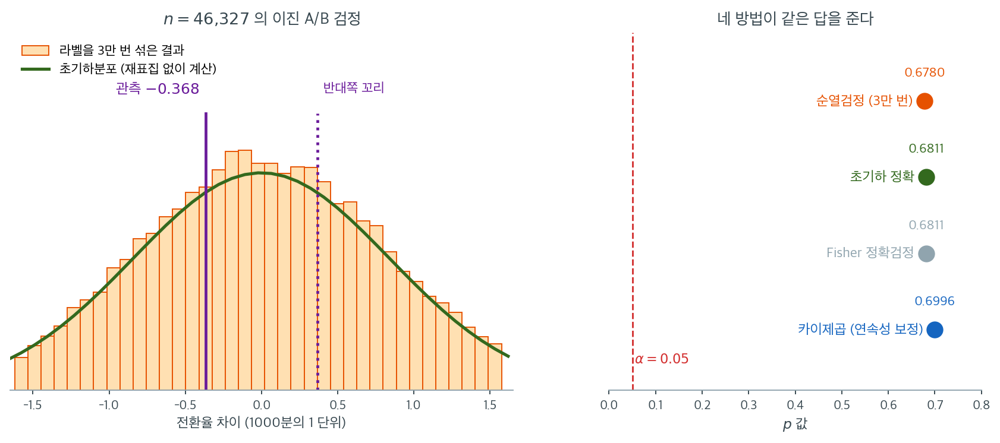

# A/B 검정 순열검정 (코드)

## 개요

순열검정은 실험 설계에 내재된 무작위화를 직접 모형화하므로 A/B 검정에 자연스러운 틀을 제공한다. 이 페이지에서는 세 가지 완전한 A/B 검정 시나리오를 다룬다. 웹페이지 세션 시간(체류도), 이진 결과를 갖는 전환율 검정, 그리고 여러 헤드라인의 클릭률 비교이다. 각 보기에는 순열검정과 비교를 위한 모수적 대안이 함께 제시된다.

---

## 1. 웹페이지 체류도 검정

두 웹페이지 디자인의 세션 시간(초)을 $n_A = 10$, $n_B = 10$명의 사용자로 비교한다. 검정통계량은 표본평균의 차이이다.

$$
T_{\text{obs}} = \bar x_B - \bar x_A
$$

$H_0$(두 페이지가 같은 세션 시간 분포를 만든다) 아래에서 "페이지 A"와 "페이지 B" 라벨은 임의적이다. 라벨을 $B$번 섞어 계산한다.

$$
p = \frac{\#\bigl\{b : |T^{(\pi_b)}| \ge |T_{\text{obs}}|\bigr\} + 1}{B + 1}
$$

<div class="exbox" markdown>

**보기 1.** <span class="diff easy" title="쉬움"></span> 체류시간 순열검정. 각 $10$명의 체류시간에서 $\bar x_A - \bar x_B = -5.4$초를 얻었다. 이 설계는 $\binom{20}{10} = 184{,}756$가지를 모두 열거할 수 있으므로, $p$값뿐 아니라 **기각역 자체를 정확히 그릴 수 있다.**

**(1)** 양측 $\alpha = 0.05$에서 기각하려면 평균차가 얼마나 커야 하는가. 열거한 귀무분포 위에서 그 문턱을 구하고, 관측된 $5.4$초가 그 몇 배인지 구하시오. 문턱 바로 아래 칸의 $p$값도 함께 적어 **이산성**이 무엇을 뜻하는지 보이시오.

**(2)** 함수를 돌려 $p$값을 구하고 정확 열거값·Welch $t$ 검정과 견주시오.

</div>

??? success "풀이"

    **(1) 해석적으로.** [이표본 순열검정](two_sample.md) 보기 1에서 이 자료의 귀무분포가 평균 $0$, 표준편차

    $$
    \operatorname{SD}(d^{*}) = S\sqrt{\frac{1}{10}+\frac{1}{10}} = 5.227257
    $$

    이고 값들이 간격 $0.2$인 격자에 놓임을 보았다. 정규근사로 어림하면 문턱이

    $$
    1.96 \times 5.227257 = 10.245
    $$

    쯤이고, 격자가 $0.2$ 간격이므로 $10.2$나 $10.4$가 후보다. 어느 쪽인지는 열거한 분포에서 직접 세어 정해야 한다. 아래 코드가 $10.2$를 고른다.

    **$10.2$초는 관측된 $5.4$초의 거의 두 배다.** 이 자료의 흩어짐($S = 11.69$초)에 견주어 각 집단 $10$명은 그만큼 적은 수다.

    **(2) 수치적으로.** 함수는 이렇다.

    ```python
    import numpy as np

    # 앞 10개가 A 페이지, 뒤 10개가 B 페이지의 체류시간이다.
    times = np.array([185, 188, 142, 160, 161, 157, 182, 181, 159, 167,   # A 페이지
                      173, 181, 182, 170, 169, 177, 168, 183, 169, 164])  # B 페이지

    def perm_test_two_sample_means(data, nA, n_perms=9999, rng=None):
        """두 집단의 평균 차이에 대한 순열검정.

        귀무가설이 참이라면 어느 값이 A 에서 나왔고 어느 값이 B 에서 나왔는지가
        아무 뜻이 없다. 그래서 이름표를 마구 섞어 가며 차이를 다시 계산하면,
        "차이가 없을 때 이 정도 차이가 얼마나 흔한가"를 직접 셀 수 있다.
        """
        rng = rng or np.random.default_rng(0)
        obs_diff = data[:nA].mean() - data[nA:].mean()
        perm_diffs = np.empty(n_perms)
        for i in range(n_perms):
            p = rng.permutation(data)
            perm_diffs[i] = p[:nA].mean() - p[nA:].mean()
        p_value = ((np.abs(perm_diffs) >= abs(obs_diff)).sum() + 1) / (n_perms + 1)
        return p_value, perm_diffs, obs_diff
    ```

    돌려서 열거값과 견준다.

    ```python
    import itertools
    from scipy import stats

    p_value, perm_diffs, obs_diff = perm_test_two_sample_means(times, 10)
    print(f"관측 차이 = {obs_diff:.2f},  순열 p (B=9999) = {p_value:.4f}")
    print(f"Welch t 검정 p = "
          f"{stats.ttest_ind(times[:10], times[10:], equal_var=False).pvalue:.4f}")

    # C(20,10) = 184,756 가지를 모두 열거한다.
    z = times.astype(float)
    T = z.sum()
    d = np.array([(2 * z[list(c)].sum() - T) / 10
                  for c in itertools.combinations(range(20), 10)])
    ad = np.abs(d)
    print(f"\n정확 p = {(ad >= abs(obs_diff) - 1e-9).mean():.6f}"
          f"   (SD(d*) = {d.std():.6f},  1.96 x SD = {1.96 * d.std():.4f})")

    # alpha = 0.05 기각 문턱을 격자 위에서 찾는다.
    for v in np.unique(np.round(ad, 6)):
        if (ad >= v - 1e-9).mean() <= 0.05:
            break
    print(f"문턱 |d| = {v:.1f} 의 정확 p   = {(ad >= v - 1e-9).mean():.6f}")
    print(f"한 칸 아래 {v - 0.2:.1f} 의 정확 p = {(ad >= v - 0.2 - 1e-9).mean():.6f}")
    print(f"관측 |d| / 문턱 = {abs(obs_diff) / v:.4f}")
    ```

    출력:

    ```
    관측 차이 = -5.40,  순열 p (B=9999) = 0.3306
    Welch t 검정 p = 0.3204

    정확 p = 0.325586   (SD(d*) = 5.227257,  1.96 x SD = 10.2454)
    문턱 |d| = 10.2 의 정확 p   = 0.049352
    한 칸 아래 10.0 의 정확 p = 0.054580
    관측 |d| / 문턱 = 0.5294
    ```

    **문턱은 $10.2$초다.** 정규근사가 가리킨 $10.245$ 바로 아래 칸이다. 그 자리의 정확 $p$값은 $0.049352$이고, **한 칸 아래인 $10.0$초로 내려가면 $0.054580$으로 올라가 더는 기각하지 못한다.**

    이 두 수가 이산성의 뜻을 그대로 보여 준다. $\alpha = 0.05$로 검정한다고 말하지만 **실제 크기는 $0.049352$다.** 명목값에 꼭 맞출 수 없고 늘 그보다 조금 작은 쪽으로 떨어진다. 가능한 $p$값이 $1/184756$의 배수뿐이기 때문이며, 표본이 작을수록 이 틈이 커진다.

    **관측값은 문턱의 $0.5294$배에 지나지 않는다.** 그러니 $p$값이 얼마로 나오든 결론은 미리 정해져 있었다. 세 수 — 순열 $0.3306$, 정확 $0.325586$, Welch $0.3204$ — 가 모두 $0.32$ 언저리다.

    순열 $p$값이 난수에 따라 흔들린다는 점도 적어 둘 것. $B = 9{,}999$에서 $\hat p$의 표준편차가 $\sqrt{0.3256 \times 0.6744/9999} = 0.0047$이므로 **씨앗을 바꾸면 $0.32$에서 $0.34$ 사이를 오간다.** 본문이 적은 $0.327$과 위의 $0.3306$은 같은 분포에서 뽑은 두 값이며, 둘 다 정확값 $0.325586$에서 한 표준편차 안에 있다. 자릿수를 더 믿고 싶으면 $B$를 키우는 것이 아니라 **열거하는 것**이 답이다.

결과를 Welch $t$ 검정과 비교한다.

$$
t = \frac{\bar x_A - \bar x_B}{\sqrt{s_A^2/n_A + s_B^2/n_B}}
$$

Welch $t$ 검정은 $p = 0.320$으로 사실상 같은 답을 준다. 두 검정 모두 기각하지 못한다. 표본이 작고($n = 10$) 자료가 정규가 아닐 수 있으므로 순열검정 쪽이 더 믿을 만하다.

---

## 2. 전환율 A/B 검정

이진 결과에서는 처치가 전환율을 바꾸는지 검정한다.

- 대조군: $n_0 = 23{,}739$명 중 $c_0 = 200$명 전환
- 처치군: $n_1 = 22{,}588$명 중 $c_1 = 182$명 전환

관측된 전환율 차이는

$$
T_{\text{obs}} = \frac{c_1}{n_1} - \frac{c_0}{n_0} = 0.008058 - 0.008425 = -0.000368
$$

즉 $-0.0368$%p이다.

순열 접근은 길이 $n_0 + n_1$의 이진 벡터에 $c_0 + c_1$개의 $1$을 넣고 섞는다.

<div class="exbox" markdown>

**보기 2.** <span class="diff easy" title="쉬움"></span> 전환율 순열검정. 대조군 $23{,}739$명 중 $200$명, 처치군 $22{,}588$명 중 $182$명이 전환했다. 처치군의 전환 수를 $X$라 하면 순열 귀무분포가 $X \sim \text{HG}(22588,\ 46327,\ 382)$이므로 **기각역을 전환 건수로 정확히 적을 수 있다.**

**(1)** 전환 한 건이 비율차를 얼마나 움직이는지 구하시오. 그다음 $\alpha = 0.05$ 양측에서 기각되는 $X$의 값을 정확히 구하고, 관측된 $182$건이 그 경계에서 **몇 건** 떨어져 있는지 말하시오.

**(2)** 함수를 돌려 $p$값을 구하고 Fisher 정확검정과 견주시오. 정규근사가 고르는 경계와 정확한 경계가 어긋나는지도 보시오.

</div>

??? success "풀이"

    **(1) 해석적으로.** 전체 전환 수 $K = 382$가 고정되므로 $\hat p_T - \hat p_C$는 $X$의 일차식이다.

    $$
    T^{(\pi)} = \frac{X}{n_T} - \frac{K - X}{n_C}
    = X\left(\frac{1}{n_T} + \frac{1}{n_C}\right) - \frac{K}{n_C}
    $$

    따라서 **전환 한 건이 움직이는 비율차**가

    $$
    \frac{1}{22588} + \frac{1}{23739} = 8.640\times10^{-5} = 0.00864\%\text{p}
    $$

    다. 관측된 $-0.0368\%$p는 이 눈금의 $4.26$칸, 곧 **전환 네 건 남짓**에 해당한다.

    $X$가 초기하분포를 따르므로 기각역은 $\lvert T\rvert$가 큰 쪽, 곧 $X$가 $E[X] = 186.25$에서 멀리 떨어진 쪽이다. 꼬리확률을 더해 $p \le 0.05$가 되는 경계를 찾으면 되고, 아래 코드가 $X \le 166$ 또는 $X \ge 206$을 준다.

    어림은 정규근사로도 된다. 귀무분포의 표준편차가 $0.00084056$이므로 문턱이 $1.96 \times 0.00084056 = 0.0016475$이고, 이것을 눈금 $8.640\times10^{-5}$로 나누면 $19.07$건이다. 곧 $X$가 $186.25$에서 $19$건 넘게 벗어나야 한다.

    **(2) 수치적으로.** 함수는 이렇다.

    ```python
    def perm_test_proportion(n_control, conv_control, n_treatment, conv_treatment,
                             n_perms=9999, rng=None):
        """전환율 차이에 대한 순열검정.

        이진 자료도 다를 것이 없다. 전체 전환 수만큼 1 을 채운 배열을 만들고
        그것을 섞으면, "전환이 두 집단에 무작위로 흩어진" 상태가 된다.
        """
        rng = rng or np.random.default_rng(0)
        binary = np.zeros(n_control + n_treatment)
        binary[:conv_control + conv_treatment] = 1
        obs_diff = conv_treatment / n_treatment - conv_control / n_control

        perm_diffs = np.empty(n_perms)
        for i in range(n_perms):
            p = rng.permutation(binary)
            perm_diffs[i] = p[n_control:].mean() - p[:n_control].mean()

        p_value = ((np.abs(perm_diffs) >= abs(obs_diff)).sum() + 1) / (n_perms + 1)
        return p_value, perm_diffs, obs_diff
    ```

    $B$는 $2{,}000$이면 충분하다. 어차피 정확값을 따로 계산할 참이고, 길이 $46{,}327$짜리 배열을 섞는 일은 비싸다.

    ```python
    from scipy import stats

    p_value, perm_diffs, obs_diff = perm_test_proportion(23739, 200, 22588, 182,
                                                         n_perms=2000)
    print(f"관측 차이 = {obs_diff:.6f},  순열 p (B=2000) = {p_value:.4f}")
    print(f"Fisher 정확검정 = "
          f"{stats.fisher_exact([[200, 23739 - 200], [182, 22588 - 182]])[1]:.6f}")

    n_c, c_c, n_t, c_t = 23739, 200, 22588, 182
    N, K = n_c + n_t, c_c + c_t
    step = 1 / n_t + 1 / n_c
    x = np.arange(K + 1)
    d = x * step - K / n_c
    pmf = stats.hypergeom.pmf(x, N, K, n_t)

    def p_exact(x_obs):
        d_obs = x_obs * step - K / n_c
        return pmf[np.abs(d) >= abs(d_obs) - 1e-18].sum()

    EX = K * n_t / N
    sd_null = np.sqrt(N / (N - 1) * (K / N) * (1 - K / N) * step)
    print(f"\n전환 한 건이 움직이는 비율차 = {step:.3e},  E[X] = {EX:.2f}")
    lo = max(v for v in range(0, 187) if p_exact(v) <= 0.05)
    hi = min(v for v in range(187, K + 1) if p_exact(v) <= 0.05)
    print(f"기각역: X <= {lo} (p = {p_exact(lo):.4f})  또는  X >= {hi} (p = {p_exact(hi):.4f})")
    print(f"  경계 바로 안쪽: X = {lo + 1} 이면 p = {p_exact(lo + 1):.4f},"
          f"  X = {hi - 1} 이면 p = {p_exact(hi - 1):.4f}")
    print(f"정규근사 문턱 = {1.96 * sd_null / step:.2f} 건"
          f"  ->  X <= {EX - 1.96 * sd_null / step:.2f} 또는 X >= {EX + 1.96 * sd_null / step:.2f}")
    print(f"관측 X = {c_t}: 아래 경계까지 {c_t - lo} 건,  위 경계까지 {hi - c_t} 건")
    print(f"정확 p (X = {c_t}) = {p_exact(c_t):.6f}")
    ```

    출력:

    ```
    관측 차이 = -0.000368,  순열 p (B=2000) = 0.6667
    Fisher 정확검정 = 0.681128

    전환 한 건이 움직이는 비율차 = 8.640e-05,  E[X] = 186.25
    기각역: X <= 166 (p = 0.0397)  또는  X >= 206 (p = 0.0450)
      경계 바로 안쪽: X = 167 이면 p = 0.0508,  X = 205 이면 p = 0.0572
    정규근사 문턱 = 19.07 건  ->  X <= 167.19 또는 X >= 205.32
    관측 X = 182: 아래 경계까지 16 건,  위 경계까지 24 건
    정확 p (X = 182) = 0.681128
    ```

    **기각역이 전환 건수로 또렷하게 적힌다.** 이 실험은 처치군의 전환이 **$166$건 이하이거나 $206$건 이상**이어야 유의하다. 관측된 $182$건은 아래 경계에서 $16$건, 위 경계에서 $24$건 떨어져 있다. 사만 육천 명을 모았지만 **전환 스무 건 수준의 차이는 잡아내지 못하는 설계**였다는 뜻이다.

    **정규근사와 정확한 경계가 한 칸씩 어긋난다.** 정규근사는 $X \le 167.19$ 또는 $X \ge 205.32$라 하여 정수로는 $X \le 167$, $X \ge 205$를 고르는데, 정확한 경계는 $X \le 166$, $X \ge 206$이다. 실제로 $X = 167$의 정확 $p$는 $0.0508$, $X = 205$는 $0.0572$로 **둘 다 $0.05$를 넘는다.** 근사를 그대로 썼다면 두 경우에 잘못 기각했을 것이다. 분포가 $E[X] = 186.25$에 대해 꼭 대칭이 아니라서 아래쪽과 위쪽의 틈도 다르다.

    **$p$값 쪽은 느슨해도 된다.** $B = 2{,}000$이 준 $0.6667$은 정확값 $0.681128$에서 $-0.0145$ 떨어져 있는데 몬테카를로 표준편차 $\sqrt{0.6811 \times 0.3189/2000} = 0.0104$의 $1.4$배다. 어차피 Fisher 정확검정이 $0.681128$을 바로 주므로 **여기서 재표집을 돌릴 이유는 없다.** 기각역을 건수로 옮겨 읽는 위 계산도 재표집 없이 끝났다.

비교 대상은 $2 \times 2$ 분할표에 대한 독립성 카이제곱 검정이다.

$$
\chi^2 = \sum_{i,j}\frac{(O_{ij} - E_{ij})^2}{E_{ij}}
$$

카이제곱 검정은 $p = 0.6996$, Fisher 정확검정은 $p = 0.6811$을 준다. 순열검정도 같은 범위의 값을 준다.

!!! tip "이 경우 재표집은 낭비이다"
    이진 자료의 이표본 순열분포는 초기하분포로 정확히 알려져 있으므로, 순열검정은 Fisher 정확검정과 **같은 것**이다. `stats.fisher_exact`가 근사 없이 답을 준다. 자세한 계산은 [기초](./foundations.md) 연습문제 4에 있다.

이 주장은 그림으로 확인하는 편이 빠르다.



왼쪽에서 주황 막대는 $46{,}327$개의 $0$/$1$을 실제로 $3$만 번 섞어 얻은 전환율 차이의 분포이고, 초록 곡선은 **재표집을 한 번도 하지 않고** 초기하분포 공식으로 계산한 확률이다. 두 곡선이 구별되지 않는다. 이유는 단순하다. 라벨을 섞는다는 것은 전체 $382$건의 전환을 두 집단에 무작위로 나눠 주는 것이고, 그때 처치군이 받는 전환 수는 정의상 $\text{Hypergeometric}(46327,\ 382,\ 22588)$을 따른다. **순열검정이 모의실험으로 재발견하고 있는 것이 바로 이 분포이다.**

막대가 연속처럼 보이지만 실제로는 이산이다. 전환 수가 하나 바뀔 때마다 차이가 $1/22588 + 1/23739 = 0.0000864$씩 움직이므로, 가로축의 눈금 하나가 전환 한 건에 해당한다. 관측된 $-0.000368$은 전환 약 네 건어치의 차이이며, 분포의 한가운데에 놓인다.

오른쪽이 결론이다. 순열검정 $0.6780$, 초기하 정확 $0.6811$, Fisher 정확검정 $0.6811$, 연속성 보정 카이제곱 $0.6996$으로 네 값이 모두 같은 답을 가리킨다. Fisher와 초기하가 **소수점 넷째 자리까지 같은 것은 우연이 아니라 정의가 같기 때문**이며, 순열검정과의 $0.003$ 차이는 순전히 $3$만 번이라는 유한한 반복에서 온다. 그러니 이진 자료에서는 재표집을 돌릴 이유가 없다.

---

## 3. 다중 헤드라인 클릭률 검정

각 $1{,}000$회 노출로 세 헤드라인을 시험했다.

| 헤드라인 | 클릭 | 비클릭 |
|---|---|---|
| A | 14 | 986 |
| B | 8 | 992 |
| C | 12 | 988 |

집단이 셋 이상이면 독립성에 대한 카이제곱 검정이 표준적인 모수적 접근이다. 이 자료에서 $\chi^2 = 1.666$, $df = 2$, $p = 0.435$로 유의한 차이가 없다. 기대 셀 도수는 모두 $11.33$과 $988.67$이므로 카이제곱 근사가 타당하다.

순열 대응물은 집단 비율들의 분산을 검정통계량으로 쓴다(다집단 순열검정과 같다).

---

## 4. 검정력 분석

A/B 검정의 검정력은 효과크기 $d$, 표본크기 $n$, 유의수준 $\alpha$에 의존한다. 집단 크기가 같은 이표본 검정에서

$$
\text{Power} \approx 1 - \Phi\!\left(z_{1-\alpha/2} - d\sqrt{\frac{n}{2}}\right)
$$

이다. 여기서 $d = (\mu_1 - \mu_2)/\sigma$는 Cohen의 $d$이다. 주요 기준점은 다음과 같다.

- $d = 0.2$(작은 효과): $80$% 검정력에 집단당 $n \approx 400$ 필요
- $d = 0.5$(중간 효과): 집단당 $n \approx 65$ 필요
- $d = 0.8$(큰 효과): 집단당 $n \approx 25$ 필요

이 값들은 $n = 2(z_{1-\alpha/2} + z_{0.8})^2/d^2 = 15.7/d^2$에서 나온다.

---

## 5. 해석

세 보기는 순열 기반 A/B 검정의 서로 다른 측면을 보여준다.

1. **세션 시간**: 연속자료와 작은 표본에서 순열검정이 $t$ 검정과 거의 일치하지만 정규성을 가정하지 않는다($p = 0.327$ 대 $0.320$).
2. **전환율**: 이진자료와 큰 표본에서 순열 $p$값이 카이제곱 검정과 일치한다. 관측된 비율 차이가 극히 작으므로 둘 다 $H_0$을 기각하지 못한다.
3. **다중 헤드라인**: 셋 이상을 비교할 때는 카이제곱이 표준이지만, 집단 클릭률의 분산에 대한 순열검정이 분포무관 대안을 제공한다.

실무에서 순열 틀이 A/B 검정에 특히 매력적인 이유는 다음과 같다.

- 사용자를 집단에 배정하는 데 쓴 무작위화를 직접 모형화한다.
- 분포 가정이 필요 없다.
- $p$값의 해석이 투명하다. 관측된 것만큼 극단적인 결과를 만드는 무작위 재라벨링의 비율이다.

---

## 연습문제

<div class="drillbox" markdown>

**연습문제 1.** <span class="diff med" title="중간"></span> 세션 시간 보기는 집단당 $n = 10$을 쓴다. 페이지 B의 평균 세션 시간이 실제로 $15$초 더 길다고 하자. $n = 10$과 $n = 50$에서 순열검정을 $1000$번 실행하여 $\alpha = 0.05$에서의 검정력을 추정하라.

</div>

??? success "풀이"

    ```python
    import numpy as np
    rng = np.random.default_rng(42)

    def power_estimate(n, true_diff=15, sigma=20, M=1000, B=999):
        reject = 0
        for _ in range(M):
            a = rng.normal(170, sigma, n)
            b = rng.normal(170 + true_diff, sigma, n)
            obs = a.mean() - b.mean()
            z = np.concatenate([a, b])
            P = np.array([rng.permutation(z) for _ in range(B)])
            d = P[:, :n].mean(1) - P[:, n:].mean(1)
            reject += ((np.abs(d) >= abs(obs)).sum() + 1)/(B+1) < 0.05
        return reject / M
    ```

    | $n$ (집단당) | 순열검정 검정력 | 이론값 |
    |---:|---:|---:|
    | 10 | **0.374** | 0.389 |
    | 50 | **0.955** | 0.963 |

    이론값은 $1 - \Phi(1.96 - d\sqrt{n/2})$이며 $d = 15/20 = 0.75$이다.

    **$n = 10$은 심각하게 검정력이 부족하다.** $0.374$는 참 효과가 존재해도 세 번 중 두 번은 놓친다는 뜻이다. $d = 0.75$가 "큰 효과"에 가까운데도 그렇다.

    **$n = 50$에서 $0.955$로 충분해진다.** 표본을 다섯 배 늘리자 검정력이 $2.6$배가 되었다.

    **순열검정의 검정력이 이론값보다 $1$--$2$%p 낮다.** 두 가지가 겹친다. 첫째, $+1$ 보정이 검정을 약간 보수적으로 만든다. 둘째, $B = 999$의 몬테카를로 오차가 문턱 근처의 결정을 일부 뒤집는다([수렴](../comparison/convergence.md) 연습문제 3 참조).

    !!! warning "실무 A/B 검정에서 흔한 실수"
        $n = 10$으로 실험하고 $p = 0.30$을 얻은 뒤 "차이가 없다"고 결론짓는 것은 잘못이다. 검정력이 $0.374$인 검정에서 기각하지 못한 것은 **증거가 없다**는 뜻이지 **효과가 없다**는 뜻이 아니다.

        올바른 대응은 실험 **전에** 검정력 분석을 하는 것이다. 탐지하고 싶은 최소 효과크기를 정하고, $80$% 검정력에 필요한 $n$을 계산한 뒤 실험을 시작한다.

<div class="drillbox" markdown>

**연습문제 2.** <span class="diff med" title="중간"></span> 전환율 보기에서 관측된 비율 차이는 약 $-0.0368$%p이다. 주어진 표본크기($n_0 = 23{,}739$, $n_1 = 22{,}588$)에서 $80$% 검정력, $\alpha = 0.05$의 최소 탐지 효과(MDE)를 계산하라.

</div>

??? success "풀이"

    $H_0$ 아래의 합쳐진 비율은

    $$
    \hat p = \frac{200 + 182}{23739 + 22588} = \frac{382}{46327} = 0.008246
    $$

    이다. $H_0$ 아래 차이의 표준오차는

    $$
    \text{SE} = \sqrt{\hat p(1 - \hat p)\left(\frac{1}{n_0} + \frac{1}{n_1}\right)}
    = \sqrt{0.008246 \times 0.991754 \times 8.6397\times10^{-5}}
    $$

    $$
    \text{SE} = \sqrt{7.0657\times10^{-7}} = 8.406\times10^{-4}
    $$

    이다. $80$% 검정력, 양측 $\alpha = 0.05$의 MDE는

    $$
    \text{MDE} = (z_{0.975} + z_{0.80})\times\text{SE} = (1.960 + 0.842)\times 8.406\times10^{-4} = 2.355\times10^{-3}
    $$

    이다. 즉 최소 탐지 가능한 절대 차이가 약 **$0.236$%p**이다.

    관측된 차이 $-0.0368$%p는 이 문턱의 $16$%에 불과하다. $H_0$을 기각하지 못한 이유가 이것이다. $\square$

    **상대적으로 보면 더 극적이다.** 기저 전환율이 $0.825$%이므로 MDE $0.236$%p는 **상대적 $28.6$% 변화**에 해당한다. $46{,}000$명을 모아 놓고도 $28$% 미만의 개선은 탐지할 수 없다는 뜻이다.

    **필요한 표본크기.** 상대적 $10$% 개선($0.0825$%p)을 $80$% 검정력으로 탐지하려면

    $$
    n \approx \frac{2\hat p(1-\hat p)(z_{0.975}+z_{0.80})^2}{\delta^2}
    = \frac{2 \times 0.008178 \times 7.849}{(8.25\times10^{-4})^2} = 189{,}000
    $$

    으로 집단당 $19$만 명이 필요하다.

    !!! tip "희귀사건 A/B 검정의 어려움"
        전환율이 낮으면 필요한 표본이 급격히 커진다. $\text{SE} \propto \sqrt{\hat p}$이지만 상대적 효과를 탐지하려면 $\delta \propto \hat p$이므로, 필요한 $n$이 $1/\hat p$에 비례한다.

        | 기저 전환율 | 상대 $10$% 개선 탐지에 필요한 집단당 $n$ |
        |---:|---:|
        | 20% | 6{,}300 |
        | 5% | 29{,}800 |
        | 1% | 155{,}400 |
        | 0.8% | 189{,}000 |

        실무적 대응은 대리지표(proxy metric)를 쓰는 것이다. 최종 전환 대신 장바구니 담기, 페이지 체류 시간처럼 더 흔한 사건을 측정하면 훨씬 작은 표본으로 신호를 잡을 수 있다. 대신 대리지표가 최종 지표와 연결된다는 근거가 필요하다.

<div class="drillbox" markdown>

**연습문제 3.** <span class="diff med" title="중간"></span> 헤드라인 자료의 카이제곱 검정은 자유도가 $2$이다. 이유를 설명하고, 카이제곱 검정이 다항모형에 대한 가능도비 검정과 동등함을 보여라. 순열 접근이 유리한 조건은 무엇인가?

</div>

??? success "풀이"

    분할표는 행이 $2$개(클릭/비클릭), 열이 $3$개(헤드라인 A, B, C)이다. 독립성 카이제곱 검정의 자유도는

    $$
    df = (r - 1)(c - 1) = (2 - 1)(3 - 1) = 2
    $$

    이다.

    $H_0$ 아래에서 셀 $(i, j)$의 기대 도수는 $E_{ij} = R_i C_j / N$이다. $R_i$와 $C_j$는 행합과 열합, $N$은 총합이다. 이 자료에서는 모든 헤드라인의 노출이 $1{,}000$으로 같으므로 기대 클릭 수가 세 헤드라인 모두 $34/3 = 11.33$이다.

    가능도비 검정통계량은

    $$
    G^2 = 2\sum_{i,j} O_{ij}\ln\frac{O_{ij}}{E_{ij}}
    $$

    이다. Taylor 전개에 의해 큰 표본에서 $G^2 \approx \chi^2$이므로 두 검정은 점근적으로 동등하다.

    **이 자료의 결과:** $\chi^2 = 1.666$, $df = 2$, $p = 0.435$. 세 헤드라인의 클릭률 $1.4$%, $0.8$%, $1.2$%의 차이는 우연으로 충분히 설명된다.

    순열 접근이 유리한 조건은 다음과 같다.

    - 기대 셀 도수가 작을 때(카이제곱 근사는 $E_{ij} \approx 5$ 아래에서 무너진다)
    - 범주 수가 표본크기에 비해 많을 때
    - 점근 근사에 기대지 않은 정확 $p$값이 필요할 때

    **이 자료는 순열검정이 필요 없다.** 기대 도수가 최소 $11.33$으로 충분히 크다. 노출이 각 $100$회였다면 기대 클릭 수가 $1.13$이 되어 카이제곱 근사를 쓸 수 없고, 순열검정이나 Fisher-Freeman-Halton 정확검정이 필요했을 것이다.

    !!! note "다중비교 문제가 숨어 있다"
        전체 검정이 유의하지 않으므로 여기서는 문제가 되지 않지만, 만약 유의했다면 "어느 헤드라인이 다른가"를 묻게 된다. 세 쌍의 비교를 각각 $\alpha = 0.05$로 하면 전체 제1종 오류율이 $0.14$로 오른다.

        순열 틀에서는 최댓값 통계량 $\max_{j<k}|\hat p_j - \hat p_k|$를 쓰면 다중성이 자동으로 보정된다. 이는 Bonferroni보다 덜 보수적이다.

<div class="drillbox" markdown>

**연습문제 4.** <span class="diff med" title="중간"></span> 세션 시간의 **중앙값** 차이(평균 대신)에 대한 순열 A/B 검정을 구현하라. 평균 기반 검정의 $p$값과 비교하라. 중앙값 기반 검정은 언제 선호되는가?

</div>

??? success "풀이"

    ```python
    import numpy as np
    from scipy import stats
    rng = np.random.default_rng(42)

    times = np.array([185, 188, 142, 160, 161, 157, 182, 181, 159, 167,
                      173, 181, 182, 170, 169, 177, 168, 183, 169, 164])

    obs_mean = times[:10].mean() - times[10:].mean()
    obs_med = np.median(times[:10]) - np.median(times[10:])
    print(obs_mean, obs_med)          # -5.4  -7.5

    B = 99999
    P = np.array([rng.permutation(times) for _ in range(B)])
    pm  = P[:, :10].mean(1) - P[:, 10:].mean(1)
    pmd = np.median(P[:, :10], axis=1) - np.median(P[:, 10:], axis=1)

    p_mean = ((np.abs(pm)  >= abs(obs_mean) - 1e-12).sum() + 1) / (B + 1)
    p_med  = ((np.abs(pmd) >= abs(obs_med)  - 1e-12).sum() + 1) / (B + 1)
    ```

    출력:

    ```
    -5.400000000000006 -7.5
    ```

    | 검정 | 관측 차이 | $p$값 |
    |:---|---:|---:|
    | 순열검정(평균) | $-5.4$ | 0.327 |
    | 순열검정(중앙값) | $-7.5$ | 0.313 |
    | Welch $t$ 검정 | $-5.4$ | 0.320 |
    | Mann-Whitney $U$ | — | 0.344 |

    **네 검정이 모두 $0.31$--$0.35$로 일치하며 어느 것도 기각하지 않는다.** 이 자료에는 극단적인 이상값이 없고 두 집단의 분포가 비슷한 모양이므로 통계량 선택이 결론에 영향을 주지 않는다.

    **중앙값 차이가 평균 차이보다 크지만($-7.5$ 대 $-5.4$) $p$값은 거의 같다.** 관측 통계량의 크기를 검정들 사이에서 비교하는 것이 무의미하다는 점을 다시 보여준다. 각 통계량은 자기 귀무분포에 대해서만 해석된다.

    중앙값 기반 검정은 다음 상황에서 선호된다.

    - 평균을 부풀릴 수 있는 이상값이 자료에 있다.
    - 분포가 심하게 치우쳐 있다(예: 아주 긴 세션이 몇 개 있는 세션 시간).
    - 연구 질문이 "평균"이 아니라 "전형적인" 사용자 경험에 관한 것이다.

    일반적으로 대칭분포에서는 중앙값 기반 검정의 검정력이 평균 기반보다 낮다(정규자료에서 중앙값의 평균 대비 점근상대효율은 $2/\pi \approx 63.7$%이다). 대신 오염에 로버스트하다.

    **세션 시간 자료는 사실 중앙값이 적절한 대표적 사례이다.** 실제 웹 로그의 세션 시간은 극단적으로 오른쪽으로 치우쳐 있다(사용자 몇 명이 탭을 열어둔 채 몇 시간을 보낸다). 여기 쓴 자료는 그 특성을 담지 않은 인공 자료이므로 두 검정의 차이가 드러나지 않았다. [이표본 순열검정](./two_sample.md) 연습문제 3에서 오염된 자료의 검정력 차이를 정량화했다.

<div class="drillbox" markdown>

**연습문제 5.** <span class="diff hard" title="어려움"></span> 두 집단의 분포가 같으면($H_0$이 참이면) 순열 $p$값이 임의의 타당한 순열검정에서 $P(p \le \alpha) \le \alpha$를 만족함을 보여라.

</div>

??? success "풀이"

    $T_0 = |T_{\text{obs}}|$라 하고 $T_1, \ldots, T_B$를 순열된 검정통계량의 절댓값이라 하자. $H_0$ 아래에서 $B+1$개 값 $T_0, T_1, \ldots, T_B$는 교환 가능하며, 동점이 없다고 가정하면 거의 확실히 서로 다르다.

    **$p$값을 $+1$ 보정을 포함해 정의해야 한다.**

    $$
    p = \frac{\#\{b : T_b \ge T_0\} + 1}{B + 1} = \frac{R}{B+1}
    $$

    여기서 $R$은 $\{T_0, T_1, \ldots, T_B\}$ 중 $T_0$의 내림차순 순위이다($T_0$가 가장 크면 $R = 1$). 교환가능성에 의해 $R$은 $\{1, \ldots, B+1\}$ 위에서 균등분포이다.

    따라서

    $$
    P(p \le \alpha) = P\!\left(R \le \alpha(B+1)\right)
    = \frac{\lfloor \alpha(B+1) \rfloor}{B + 1} \le \alpha
    $$

    이다. $\square$

    **$(B+1)\alpha$가 정수이면 등호가 성립한다.** $\alpha = 0.05$에 $B = 199, 999, 9999$ 등을 고르면 검정이 $\alpha$ 수준을 **정확히** 달성한다. 그렇지 않으면 약간 보수적이다.

    !!! danger "$+1$을 빼면 부등호가 뒤집힌다"
        $p = \#\{b : T_b \ge T_0\}/B$로 정의하면 $R = 1$일 때 $p = 0$이 된다. 그러면

        $$
        P(p \le \alpha) \ge P(R = 1) = \frac{1}{B+1}
        $$

        이므로 $\alpha < 1/(B+1)$인 모든 $\alpha$에서 통제가 깨진다. 검정이 **보수적이 아니라 반보수적**이 된다.

        [대응 순열검정](./paired.md) 연습문제 3에서 $B = 199$, $\alpha = 0.05$일 때 보정 없는 정의의 제1종 오류율이 $0.0512$, 보정한 정의가 $0.0458$임을 수치로 확인했다.

        비용이 $0$이므로 항상 $+1$을 넣는다.

---

## 정리하며

순열검정은 **A/B 검정의 논리와 정확히 맞는다.**

- **실험의 무작위 배정을 그대로 재현한다.** 실제로 한 번 일어난 배정 대신 가능한 다른 배정들을 만들어 비교하는 것이며, **모형 가정이 아니라 설계에서 타당성이 나온다.**
- **세 가지 결과 유형을 다뤘다.** 연속(체류 시간), 이진(전환), 다집단(여러 헤드라인의 클릭률).
- **체류 시간은 심하게 치우친다.** $t$ 검정의 근사가 나쁜 영역이며, 순열검정이 안전하다.
- **모수적 대안과 나란히 보는 것이 유익하다.** 결론이 일치하면 안심하고, 갈리면 분포를 들여다볼 신호다.
- **다중검정을 잊지 말 것.** 여러 헤드라인을 비교하면 9장의 보정이 필요하다.

다음 절 **재표집 (신발 판매)** 로 넘어간다.
