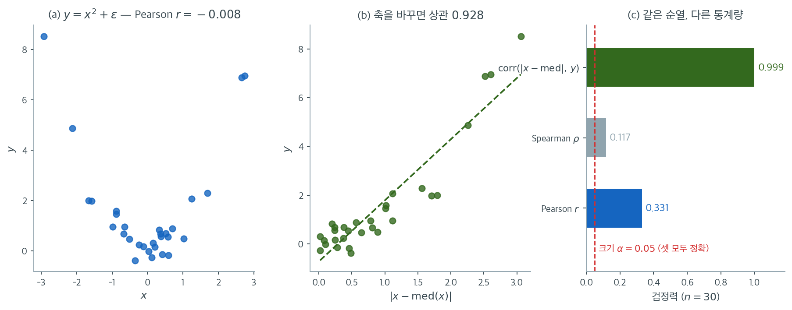

# 상관에 대한 순열검정

## 1. 동기

Pearson 상관에 대한 고전적 검정은 통계량 $t = r\sqrt{(n-2)/(1-r^2)}$를 쓰며, 자료가 이변량 정규이면 $H_0: \rho = 0$ 아래에서 이 값이 $t_{n-2}$를 따른다. 정규성 가정이 깨지면 이 $p$값이 부정확할 수 있다.

상관에 대한 순열검정은 두 변수의 독립성에 대한 정확하고 분포무관한 검정을 제공한다. 한 변수를 고정한 채 다른 변수를 무작위로 섞으면 모든 연관이 파괴되고, 검정통계량의 귀무분포가 자료로부터 직접 생성된다.

---

## 2. 가설

검정하는 가설은 다음과 같다.

$$
H_0: X \text{와 } Y \text{가 독립이다} \quad \text{대} \quad H_1: X \text{와 } Y \text{가 연관되어 있다}
$$

$H_0$ 아래에서 $x$값과 $y$값을 짝짓는 모든 방식이 동등하게 가능하다. 검정통계량은 Pearson 상관계수이다(같은 틀에서 Spearman $\rho$나 Kendall $\tau$도 쓸 수 있다).

$$
r = \frac{\sum_{i=1}^n (x_i - \bar{x})(y_i - \bar{y})}{\sqrt{\sum_{i=1}^n (x_i - \bar{x})^2 \sum_{i=1}^n (y_i - \bar{y})^2}}
$$

!!! note "독립성과 무상관은 다르다"
    순열검정이 실제로 검정하는 것은 **독립성**이며, 이는 $\rho = 0$보다 강한 조건이다. 두 변수가 $\rho = 0$이면서도 종속일 수 있다(예: $X$가 $0$에 대해 대칭일 때 $Y = X^2$). 그럼에도 Pearson $r$을 쓰는 실무에서는 순열검정을 $H_0: \rho = 0$의 검정으로 쓰고 해석하는 것이 보통이다. 이 구별이 실제로 문제가 되는 경우를 연습문제 3에서 다룬다.

---

## 3. 알고리즘

대응 관측 $(x_1, y_1), (x_2, y_2), \ldots, (x_n, y_n)$이 주어졌을 때

1. 원래의 짝지어진 자료에서 관측 상관 $r_{\text{obs}}$를 계산한다.
2. $b = 1, 2, \ldots, B$에 대해:
    - $\{1, 2, \ldots, n\}$의 무작위 순열 $\pi$를 생성한다.
    - 순열된 쌍 $(x_1, y_{\pi(1)}), (x_2, y_{\pi(2)}), \ldots, (x_n, y_{\pi(n)})$을 만든다.
    - 순열된 쌍에서 $r^{*(b)}$를 계산한다.
3. 양측 $p$값은 다음과 같다.

$$
p = \frac{\#\{b : |r^{*(b)}| \ge |r_{\text{obs}}|\} + 1}{B + 1}
$$

분자와 분모의 "$+1$"은 관측된 자료를 순열의 하나로 포함시키는 것으로, $p$값이 정확히 $0$이 되지 않게 하고 검정을 정확하게 만든다.

단측 대립가설에 대해서는

- $H_1: \rho > 0$: $\displaystyle p = \frac{\#\{b : r^{*(b)} \ge r_{\text{obs}}\} + 1}{B + 1}$
- $H_1: \rho < 0$: $\displaystyle p = \frac{\#\{b : r^{*(b)} \le r_{\text{obs}}\} + 1}{B + 1}$

---

## 4. 정확 순열분포

$n$개 관측의 순열은 $n!$가지이다. $n$이 작으면 모든 순열을 열거하여 정확 $p$값을 계산할 수 있다.

| $n$ | 순열 수 ($n!$) | 가능성 |
|---|---|---|
| 5 | 120 | 정확 열거가 자명 |
| 8 | 40,320 | 정확 열거가 쉬움 |
| 10 | 3,628,800 | 정확 열거가 가능 |
| 12 | 479,001,600 | 경계 |
| 15 | $> 10^{12}$ | 무작위 표집 필요 |

$n \ge 12$이면 $B$개의 순열을 무작위로 뽑는 것이 표준이다. $B = 10{,}000$이면 $p$값의 몬테카를로 오차가 대략 $\sqrt{p(1-p)/B}$이다.

---

## 5. 성질

**정확성.** $H_0$ 아래에서 순열검정의 제1종 오류율은 정확히 $\alpha$이다(관측된 자료값에 조건부로). 이는 $X$와 $Y$의 주변분포와 무관하게 성립한다.

**분포무관.** 결합분포나 주변분포의 모양에 대한 가정이 필요 없다. 연속형, 이산형, 혼합형 자료 모두에 타당하다.

**일치성.** 순열검정은 일치추정에 대응하는 성질을 갖는다. $n \to \infty$일 때 $\rho \neq 0$인 임의의 고정된 대립가설에 대한 검정력이 $1$로 간다.

**유한표본 타당성.** 점근검정과 달리 어떤 표본크기 $n$에서도 제1종 오류를 정확히 통제한다.

!!! tip "검정통계량의 선택"
    순열 틀은 검정통계량의 선택에 무관하다. Pearson $r$을 쓰면 선형 연관을, Spearman $\rho$나 Kendall $\tau$를 쓰면 단조 연관을, 거리상관을 쓰면 임의의 형태의 종속성을 검정한다. 순열 방식($y$값을 섞는 것)은 어느 경우에도 동일하다.

이 중립성은 축복이자 부담이다. $y = x^2 + \varepsilon$처럼 $\rho = 0$이면서 완전히 종속인 자료에서 그 크기를 재어 보자.



(a)가 $n = 30$인 한 표본이다. $y$가 $x$로 완전히 결정되는데도 Pearson 상관은 $-0.008$이다. $E[X^3] = 0$이므로 모집단 상관이 정확히 $0$이고, U자 모양에서는 왼쪽의 음의 기울기와 오른쪽의 양의 기울기가 상쇄되기 때문이다. **눈으로는 명백한 관계를 선형 측도가 통째로 놓치고 있다.**

(b)는 가로축을 $|x - \text{med}(x)|$로 바꾼 것이다. 같은 $30$쌍인데 상관이 $0.928$로 뛴다. $y \approx x^2$이므로 "$x$가 가운데에서 얼마나 멀리 있는가"와 $y$ 사이에는 곧은 직선 관계가 있다. **이차 종속성을 선형 문제로 번역한 셈이다.**

(c)가 세 통계량의 검정력이다. Spearman이 $0.117$로 가장 낮은데, 단조 연관을 재는 측도에 단조가 아닌 관계를 물었으니 당연하다. Pearson은 $0.331$로 뜻밖에 낮지 않다. 점추정값이 $0$ 근처여도 **관측된 $r$의 변동이 순열분포의 변동보다 크기 때문**에 이따금 꼬리로 밀려난다. 그리고 문제에 맞춘 $\text{corr}(|x - \text{med}(x)|,\ y)$는 $0.999$에 이른다.

결정적인 것은 **세 검정의 제1종 오류율이 모두 정확히 $0.05$라는 점**이다. 순열 방식이 같으므로 크기는 언제나 보장되고, 통계량의 선택은 오직 검정력만 바꾼다. 그래서 순열검정에서 통계적 판단의 무게는 전부 "무엇을 재는 통계량을 고를 것인가"로 옮겨간다. 찾는 형태를 모르겠다면 임의의 종속성에 대해 검정력이 $1$로 가는 거리상관이 안전한 기본값이다.

$n = 20$개 도시의 평균기온($x$, ℃)과 아이스크림 판매량($y$, 만원)을 기록했다.

<div class="exbox" markdown>

**보기 1.** <span class="diff easy" title="쉬움"></span> 상관에 대한 순열검정. $n = 20$개 도시의 기온과 판매량에서 $r_{\text{obs}} = 0.8268$을 얻었다. $y$를 $B = 9{,}999$번 섞어 검정한다.

**(1)** 순열 귀무분포에서 $E[r^{*}]$와 $\operatorname{Var}(r^{*})$를 구하시오. **자료가 무엇이든 답이 $n$만으로 정해진다.**

**(2)** 실행하면 초과가 **$0$회**로 나온다. 이때 보고할 수 있는 두 수 — 점추정 $(c+1)/(B+1)$과 $95\%$ 신뢰상한 — 를 구하고, $t$ 검정이 주는 $7 \times 10^{-6}$과 견주시오. 두 값이 자릿수로 다른데도 둘 다 맞는 까닭은 무엇인가.

</div>

??? success "풀이"

    **(1) 해석적으로.** $a_i = x_i - \bar x$, $b_i = y_i - \bar y$, $V_x = \sum_i a_i^2$, $V_y = \sum_i b_i^2$라 두면, $y$를 순열 $\pi$로 섞은 뒤의 상관은

    $$
    r^{*} = \frac{1}{\sqrt{V_x V_y}}\sum_{i=1}^n a_i\, b_{\pi(i)}
    $$

    이다($x$를 고정하므로 분모의 두 제곱합이 모두 상수다). $\sum_i b_i = 0$이므로 $E[b_{\pi(i)}] = 0$이고 따라서

    $$
    E[r^{*}] = \frac{1}{\sqrt{V_xV_y}}\sum_i a_i\, E[b_{\pi(i)}] = 0
    $$

    이다. 분산은 $E[b_{\pi(i)}^2] = V_y/n$과, $i \ne j$에서

    $$
    E[b_{\pi(i)}b_{\pi(j)}] = \frac{\left(\sum_k b_k\right)^2 - \sum_k b_k^2}{n(n-1)} = \frac{-V_y}{n(n-1)}
    $$

    를 쓰면

    $$
    E\!\left[\Big(\textstyle\sum_i a_i b_{\pi(i)}\Big)^2\right]
    = V_x\cdot\frac{V_y}{n} + (0 - V_x)\cdot\frac{-V_y}{n(n-1)}
    = \frac{V_xV_y}{n-1}
    $$

    이므로

    $$
    \operatorname{Var}(r^{*}) = \frac{1}{n-1} = \frac{1}{19},
    \qquad
    \operatorname{SD}(r^{*}) = \frac{1}{\sqrt{19}} = 0.2294157
    $$

    다. **$V_x$와 $V_y$가 통째로 약분되므로 자료의 모양이 들어올 자리가 없다.** 관측값은 이 폭의 $0.8268 \times \sqrt{19} = 3.604$배다. 정규근사로는 양측 $p \approx 3.1\times10^{-4}$이지만, $r^{*}$가 $[-1, 1]$에 갇혀 있으므로 이 근사를 꼬리에서 믿을 수는 없다.

    **(2) 해석적으로.** 초과가 $0$회이면 보고할 수 있는 수가 둘이고, 뜻이 다르다. [잔차 진단과 위반의 처방](../../ch11/diagnostics/handling_violations.md) 보기 8이 같은 상황을 다루었다.

    - **점추정**은 $\hat p = \dfrac{0+1}{B+1} = 1.000\times10^{-4}$이다. 교환가능성에서 이 값이 수준을 지킨다.
    - **$95\%$ 신뢰상한**은 참 순열 $p$값이 $p$일 때 $B$번 모두 실패할 확률이 $(1-p)^B$이므로, $(1-p)^B \ge 0.05$인 $p$들을 받아들여

      $$
      p \le 1 - 0.05^{1/B} = 2.996\times10^{-4}
      $$

      이 된다.

    둘 다 $t$ 검정의 $6.976\times10^{-6}$보다 한두 자릿수 크다. **그럼에도 모순이 아니다.** 순열검정은 참 $p$값이 $3\times10^{-4}$보다 작다고만 말하고 있을 뿐, 그것이 $7\times10^{-6}$이라는 $t$ 검정의 주장과 어긋나지 않는다. $B = 9{,}999$로는 $10^{-4}$보다 작은 영역을 **해상할 수가 없다.** 참 $p$가 $7\times10^{-6}$이라면 $B$번 중 기대 초과 횟수가 $Bp = 0.07$회이니 $0$회가 나오는 것이 당연하다. 두 자리 유효숫자로 재려면 $\operatorname{SD}(\hat p)/p = 1/\sqrt{pB} \approx 0.05$, 곧 $B \approx 400/p = 5.7\times10^7$이 필요하다.

    **수치적으로.**

    ```python
    import numpy as np
    from scipy import stats

    temp = np.array([14.5, 15.6, 16.7, 17.1, 17.5, 17.5, 18.7, 18.7, 20.0, 21.3,
                     24.8, 25.9, 26.2, 27.5, 30.1, 30.1, 30.3, 31.4, 32.2, 32.5])
    sales = np.array([276, 233, 288, 309, 328, 246, 322, 310, 309, 323,
                      332, 344, 415, 390, 389, 319, 377, 401, 381, 382])

    r = np.corrcoef(temp, sales)[0, 1]
    print(f"r = {r:.4f}")                      # 0.8268

    rng = np.random.default_rng(0)
    B = 9999
    perm = np.array([np.corrcoef(temp, rng.permutation(sales))[0, 1]
                     for _ in range(B)])
    p = ((np.abs(perm) >= abs(r)).sum() + 1) / (B + 1)
    print(f"permutation p = {p:.5f}")          # 0.0001
    print(stats.pearsonr(temp, sales))         # p = 7.4e-06
    ```

    출력:

    ```
    r = 0.8268
    permutation p = 0.00010
    PearsonRResult(statistic=0.8267919627184452, pvalue=6.976166744153747e-06)
    ```

    (1)의 두 적률과 (2)의 두 수를 잰다. 덤으로 순열 귀무분포를 $t$ 눈금으로 바꾸어 $t_{18}$과 분위를 견준다. 위 블록의 변수를 그대로 이어 쓴다.

    ```python
    n = len(temp)
    print(f"초과 횟수 c = {int((np.abs(perm) >= abs(r)).sum())},  "
          f"최대 |r*| = {np.abs(perm).max():.4f}")
    print(f"SD(r*) 닫힌 꼴 = {1 / np.sqrt(n - 1):.7f},  모의 = {perm.std(ddof=1):.7f}"
          f"   (몬테카를로 오차 {1 / np.sqrt(n - 1) / np.sqrt(2 * B):.7f})")
    print(f"평균 r*  = {perm.mean():+.7f}   (평균의 오차 {perm.std(ddof=1) / np.sqrt(B):.7f})")

    print(f"\n점추정  (0+1)/(B+1)       = {1 / (B + 1):.3e}")
    print(f"95% 신뢰상한 1-0.05^(1/B) = {1 - 0.05 ** (1 / B):.3e}")
    print(f"t 검정의 p                = {stats.pearsonr(temp, sales).pvalue:.3e}")

    tstar = perm * np.sqrt((n - 2) / (1 - perm ** 2))
    print(f"\nt_obs = {r * np.sqrt((n - 2) / (1 - r ** 2)):.4f},  "
          f"순열 |t*| 의 최대 = {np.abs(tstar).max():.4f}")
    for q in (0.95, 0.99, 0.999):
        print(f"  분위 {q}: 순열 |t*| = {np.quantile(np.abs(tstar), q):.4f},"
              f"   t_18 = {stats.t(n - 2).ppf((1 + q) / 2):.4f}")
    ```

    출력:

    ```
    초과 횟수 c = 0,  최대 |r*| = 0.8118
    SD(r*) 닫힌 꼴 = 0.2294157,  모의 = 0.2286138   (몬테카를로 오차 0.0016223)
    평균 r*  = +0.0012602   (평균의 오차 0.0022863)

    점추정  (0+1)/(B+1)       = 1.000e-04
    95% 신뢰상한 1-0.05^(1/B) = 2.996e-04
    t 검정의 p                = 6.976e-06

    t_obs = 6.2360,  순열 |t*| 의 최대 = 5.8990
      분위 0.95: 순열 |t*| = 2.0931,   t_18 = 2.1009
      분위 0.99: 순열 |t*| = 2.9373,   t_18 = 2.8784
      분위 0.999: 순열 |t*| = 4.0474,   t_18 = 3.9216
    ```

    **(1)이 맞는다.** 닫힌 꼴 $\operatorname{SD}(r^{*}) = 1/\sqrt{19} = 0.2294157$에 대해 모의값이 $0.2286138$로, 차이 $-0.0008$이 몬테카를로 오차 $0.0016$의 절반이다. 평균도 $+0.00126$으로 그 오차 $0.00229$ 안이다.

    **(2)도 맞는다.** $9{,}999$번 중 초과가 $0$회이고 순열 상관의 최대값이 $0.8118$로 관측값 $0.8268$에 닿지 못했다. 점추정 $1.000\times10^{-4}$과 신뢰상한 $2.996\times10^{-4}$을 섞어 읽으면 안 된다. **앞의 것은 "이 값으로 적으면 수준이 지켜진다"는 뜻이고, 뒤의 것은 "참값이 이보다 클 리 없다"는 뜻이다.**

    **$t$ 검정의 $7\times10^{-6}$을 뒷받침하는 증거도 자료 안에 있다.** 순열분포를 $t$ 눈금으로 바꾸어 보면 $95\%$, $99\%$, $99.9\%$ 분위가 $2.0931$, $2.9373$, $4.0474$로 $t_{18}$의 $2.1009$, $2.8784$, $3.9216$과 잘 맞는다. 재어 볼 수 있는 데까지는 두 참조분포가 거의 같으니, $t_{18}$을 그 너머로 끌고 간 $7\times10^{-6}$도 그럴듯하다. 다만 **그것은 외삽이고 순열검정이 보증해 주는 수는 아니다.** 관측된 $t_{\text{obs}} = 6.2360$은 순열이 만들어 낸 최대값 $5.8990$보다도 크다.

    두 접근이 같은 결론에 이른다. 순열검정은 정규성을 가정하지 않는 대신 $B$가 허락하는 만큼만 말하고, $t$ 검정은 정규성을 빌려 그보다 멀리 말한다.

!!! warning "$p$값의 하한을 보고할 때"
    순열 중 하나도 관측값보다 극단적이지 않으면 $p = 1/(B+1)$을 그대로 보고하기보다 $p < 1/(B+1)$로 쓰는 것이 정직하다. $B = 99{,}999$로 늘려도 이 자료에서는 여전히 하나도 나오지 않으므로 실제 $p$값은 $10^{-5}$보다 작다.

    $10^{-6}$ 수준의 $p$값이 정말 필요하다면 순열검정은 비효율적인 도구이다. $B \approx 10^8$이 필요하다. 그런 경우에는 점근 근사가 낫다.

---

## 6. 시각화: 귀무분포

$\{r^{*(1)}, \ldots, r^{*(B)}\}$의 히스토그램은 독립성 아래에서 기대되는 상관값의 분포를 보여준다. 이 분포는 $0$에 대해 대칭이고(무작위 순열이 양의 상관과 음의 상관을 같은 확률로 만들기 때문이다) 중간 정도의 $n$에서 근사적으로 정규이다(순열분포에 적용된 중심극한정리에 의해).

관측된 $r_{\text{obs}}$를 히스토그램 위에 표시한다. 꼬리 깊숙이 떨어지면 $H_0$에 반하는 증거가 강하다.

---

## 7. 붓스트랩 검정과의 비교

| 측면 | 순열검정 | 붓스트랩 검정 |
|---|---|---|
| 재표집 | 비복원(섞기) | 복원(쌍을 재표집) |
| 검정 대상 | 독립성 ($H_0: X \perp Y$) | 임의의 $H_0: \rho = \rho_0$ (신뢰구간을 통해) |
| 정확성 | 정확한 조건부 $p$값 | 근사 |
| 신뢰구간 | 역변환으로만 | 직접 얻을 수 있다 |
| 적합한 상황 | 무상관 검정 | $\rho$의 신뢰구간, $\rho_0 \neq 0$ 검정 |

$H_0: \rho = 0$이라는 특정 가설에 대해서는 제1종 오류를 정확히 통제하는 순열검정이 선호된다. 신뢰구간이나 $\rho_0 \neq 0$인 $H_0: \rho = \rho_0$의 검정에는 붓스트랩이 자연스럽다.

---

## 연습문제

<div class="drillbox" markdown>

**연습문제 1.** <span class="diff easy" title="쉬움"></span>
$n = 6$인 다음 자료에서 $6! = 720$가지 순열을 모두 열거하여 정확 $p$값을 구하라.

$$
x = (1.2,\ 2.5,\ 3.1,\ 4.8,\ 5.3,\ 6.9), \qquad y = (2.1,\ 2.9,\ 4.4,\ 4.0,\ 6.8,\ 7.5)
$$

**(a)** Pearson $r$을 통계량으로 하는 정확 순열 $p$값을 구하고 $t$ 검정과 비교하라.

**(b)** Spearman $\rho$를 통계량으로 하는 정확 순열 $p$값을 구하고 SciPy의 점근 $p$값과 비교하라.

</div>

??? success "풀이"
    ```python
    import numpy as np, itertools
    from scipy import stats

    x = np.array([1.2, 2.5, 3.1, 4.8, 5.3, 6.9])
    y = np.array([2.1, 2.9, 4.4, 4.0, 6.8, 7.5])

    r = stats.pearsonr(x, y)
    print(round(r.statistic, 4), round(r.pvalue, 4))      # 0.9243  0.0084

    rs = np.array([np.corrcoef(x, y[list(p)])[0, 1]
                   for p in itertools.permutations(range(6))])
    print(len(rs), (np.abs(rs) >= abs(r.statistic) - 1e-12).mean())   # 720  0.00694

    sp = stats.spearmanr(x, y)
    print(round(sp.statistic, 4), round(sp.pvalue, 4))    # 0.9429  0.0048
    rss = np.array([stats.spearmanr(x, y[list(p)]).statistic
                    for p in itertools.permutations(range(6))])
    print((np.abs(rss) >= abs(sp.statistic) - 1e-12).mean())          # 0.01667
    ```

    출력:

    ```
    0.9243 0.0084
    720 0.006944444444444444
    0.9429 0.0048
    0.016666666666666666
    ```

    | 통계량 | 관측값 | 정확 순열 $p$ | 점근 $p$ | 비 |
    |:---|---:|---:|---:|---:|
    | Pearson $r$ | 0.9243 | **0.00694** | 0.0084 | 0.83 |
    | Spearman $\rho$ | 0.9429 | **0.01667** | 0.0048 | 3.47 |

    **(a) Pearson에서는 순열 $p$값이 점근값보다 작다**($0.0069 < 0.0084$). 앞선 보기들과 방향이 반대인데, 이는 $n = 6$에서 순열분포가 $t_4$보다 꼬리가 얇기 때문이다. 관측된 $r = 0.9243$은 $720$가지 중 $5$번째로 극단적인 값이다($5/720 = 0.00694$).

    **(b) Spearman에서는 순열 $p$값이 점근값의 $3.5$배이다**($0.0167$ 대 $0.0048$). 차이가 크다.

    이유는 **Spearman $\rho$의 순열분포가 극도로 이산적**이기 때문이다. 순위만 쓰므로 $720$가지 순열이 만들어내는 $\rho$ 값은 소수의 서로 다른 값에 몰린다. $\rho = 0.9429$ 이상인 순열이 $12$개 있어 $12/720 = 0.01667$이 된다. 가능한 다음 값은 $\rho = 1$(순열 $1$개)로 건너뛴다.

    SciPy의 `spearmanr`은 $t$ 근사를 쓰는데, $n = 6$에서 이 근사는 신뢰할 수 없다. **정확 순열 $p$값이 옳다.**

    **실무적 함의:** $n \le 10$에서 `spearmanr`이나 `kendalltau`의 기본 $p$값을 그대로 쓰면 안 된다. SciPy는 `method='exact'` 옵션을 제공하며(`stats.spearmanr`은 `alternative`와 함께 정확 순열을, `stats.kendalltau`는 `method='exact'`를 지원한다), 없다면 직접 열거해야 한다.

    !!! note "Pearson과 Spearman 중 무엇을 볼 것인가"
        이 자료에서 Spearman의 관측값($0.9429$)이 Pearson($0.9243$)보다 큰데도 정확 $p$값은 Spearman 쪽이 $2.4$배 크다.

        관측 통계량의 크기를 검정들 사이에서 비교하는 것은 의미가 없다. 각 통계량은 자기 귀무분포에 대해서만 해석된다. $\rho = 0.9429$는 순위 여섯 개로 만들 수 있는 값 중 두 번째로 큰 값일 뿐이다.

<div class="drillbox" markdown>

**연습문제 2.** <span class="diff med" title="중간"></span>
정규성이 깨질 때 순열검정과 고전적 $t$ 검정의 제1종 오류율을 비교하라. $n = 15$에서 $X$와 $Y$를 독립으로 생성하되 주변분포를 정규, $\text{LogNormal}(0, 2^2)$, 코시로 바꾸어 가며 확인하라.

</div>

??? success "풀이"
    ```python
    import numpy as np
    from scipy import stats
    rng = np.random.default_rng(5)

    def rows_corr(A, B):
        A = A - A.mean(1, keepdims=True); B = B - B.mean(1, keepdims=True)
        return (A*B).sum(1) / np.sqrt((A**2).sum(1) * (B**2).sum(1))

    def size(gen, n=15, M=4000, B=999):
        ct = cp = 0
        for _ in range(M):
            x = gen(n); y = gen(n)
            ct += stats.pearsonr(x, y).pvalue < 0.05
            Y = np.array([rng.permutation(y) for _ in range(B)])
            allr = rows_corr(np.vstack([x, np.tile(x, (B, 1))]),
                             np.vstack([y, Y]))
            r, rp = abs(allr[0]), np.abs(allr[1:])
            cp += ((rp >= r - 1e-9).sum() + 1) / (B + 1) < 0.05
        return round(ct/M, 4), round(cp/M, 4)
    ```

    | 주변분포 | 고전적 $t$ 검정 | 순열검정 |
    |:---|---:|---:|
    | 정규 | 0.047 | 0.049 |
    | $\text{LogNormal}(0, 2^2)$ | **0.066** | 0.048 |
    | Cauchy | **0.082** | 0.049 |

    **고전적 $t$ 검정이 무너진다.** 코시 주변분포에서 제1종 오류율이 $0.082$로 명목값의 $1.6$배이다. 로그정규에서도 $0.066$이다.

    이유는 $t = r\sqrt{(n-2)/(1-r^2)}$가 $t_{n-2}$를 따른다는 결과가 **이변량 정규성에 의존**하기 때문이다. 두꺼운 꼬리에서는 한두 개의 극단값이 $r$을 좌우해 $r$의 귀무분포가 훨씬 넓어진다.

    **순열검정은 세 경우 모두 $0.05$를 지킨다.** 이는 근사가 잘 맞는다는 뜻이 아니라 **정확하다**는 뜻이다. $X$와 $Y$가 독립이면 $y$의 어떤 재배열도 동등하게 가능하므로, 주변분포가 무엇이든 순열 $p$값의 분포는 균등하다.

    !!! warning "부동소수점 비교에 주의"
        위 코드에서 `rp >= r - 1e-9`처럼 작은 허용오차를 둔 것에는 이유가 있다.

        코시 자료에서는 한 관측값이 나머지를 압도해, 서로 다른 순열이 $10^{-14}$ 수준까지 같은 $|r^*|$를 만들 수 있다. 허용오차 없이 엄격히 비교하면 이런 순열들이 무작위로 계수에서 빠져 제1종 오류율이 $0.049$가 아니라 $0.053$으로 올라간다($M = 8{,}000$ 기준).

        차이가 작지만 이는 방법론의 문제가 아니라 **구현의 문제**이다. 관측 통계량과 순열 통계량을 반드시 같은 함수로 계산하고, 비교에 허용오차를 두는 것이 안전하다.

<div class="drillbox" markdown>

**연습문제 3.** <span class="diff med" title="중간"></span>
본문에서 순열검정이 검정하는 것은 $\rho = 0$이 아니라 독립성이라고 했다. $Y = X^2 + \varepsilon$처럼 $\rho = 0$이면서 강하게 종속인 경우에 이것이 무엇을 의미하는지 확인하라. $X \sim N(0,1)$, $\varepsilon \sim N(0, 0.5^2)$, $n = 30$에서 세 통계량 — Pearson $r$, Spearman $\rho$, 그리고 $|x_i - \text{med}(x)|$와 $y$의 상관 — 을 쓰는 순열검정의 검정력을 비교하라.

</div>

??? success "풀이"
    ```python
    import numpy as np
    from scipy import stats
    rng = np.random.default_rng(3)

    def power(n=30, M=1500, B=499):
        cp = cs = cq = 0
        for _ in range(M):
            x = rng.normal(0, 1, n)
            y = x**2 + rng.normal(0, 0.5, n)
            # (1) 피어슨 상관
            r = np.corrcoef(x, y)[0, 1]
            Y = np.array([rng.permutation(y) for _ in range(B)])
            cp += ((np.abs(rows_corr(np.tile(x, (B,1)), Y)) >= abs(r)).sum()+1)/(B+1) < 0.05
            # (2) 스피어만 상관
            rs = stats.spearmanr(x, y).statistic
            rr = np.array([stats.spearmanr(x, rng.permutation(y)).statistic
                           for _ in range(B)])
            cs += ((np.abs(rr) >= abs(rs)).sum() + 1)/(B+1) < 0.05
            # (3) |x - med(x)| 과 y 의 상관
            a = np.abs(x - np.median(x))
            q = np.corrcoef(a, y)[0, 1]
            cq += ((np.abs(rows_corr(np.tile(a, (B,1)), Y)) >= abs(q)).sum()+1)/(B+1) < 0.05
        return round(cp/M,3), round(cs/M,3), round(cq/M,3)
    ```

    | 검정통계량 | 검정력 ($n = 30$) |
    |:---|---:|
    | Pearson $r$ | 0.331 |
    | Spearman $\rho$ | 0.117 |
    | $\text{corr}(\lvert x - \text{med}(x)\rvert,\ y)$ | **0.999** |

    **세 검정 모두 같은 순열 방식을 쓰지만 결과가 완전히 다르다.**

    **Spearman이 가장 나쁘다**($0.117$). 이는 놀랍지 않다. Spearman은 **단조** 연관을 재는데 $Y = X^2$은 단조가 아니다. $X$가 음수 구간에서는 감소, 양수 구간에서는 증가하므로 순위 상관이 상쇄된다.

    **Pearson이 $0.331$로 나쁘지 않은 것이 오히려 흥미롭다.** 모집단에서 $\text{Cov}(X, X^2) = E[X^3] = 0$이므로 $\rho = 0$이다. 그런데도 검정력이 $0.05$를 크게 넘는다.

    이유는 순열검정이 $r$의 **점추정값이 아니라 그 분포 전체**를 비교하기 때문이다. 종속인 자료에서 관측된 $r$의 변동은 순열분포의 변동보다 크다. $y$가 $x$의 함수이므로 $y$의 분산이 $x$의 극단값에 몰려 있고, 이것이 관측 $r$을 더 자주 꼬리로 밀어낸다.

    **문제에 맞는 통계량을 고르면 검정력이 $0.999$가 된다.** $|x_i - \text{med}(x)|$는 $x$가 $0$에서 얼마나 떨어져 있는지를 재고, $Y = X^2$이면 이것과 $y$가 강한 **양의 선형 관계**를 갖는다. 이차 종속성을 선형 문제로 바꾼 것이다.

    !!! tip "이것이 순열검정의 핵심 교훈이다"
        순열 틀은 통계량의 선택에 대해 완전히 중립적이다. 세 통계량 모두 제1종 오류율이 정확히 $0.05$이다. 검정력만 $0.117$에서 $0.999$까지 갈린다.

        따라서 **모든 통계적 판단은 통계량의 선택으로 옮겨간다.** 무엇을 찾고 있는지 모른다면 다음 중 하나를 고려한다.

        | 통계량 | 탐지 대상 |
        |:---|:---|
        | Pearson $r$ | 선형 연관 |
        | Spearman $\rho$, Kendall $\tau$ | 단조 연관 |
        | 거리상관 (distance correlation) | 임의의 종속성 |
        | 상호정보량 | 임의의 종속성 |
        | $\text{corr}(g(x), h(y))$ | $g$, $h$로 지정한 특정 형태 |

        거리상관은 특히 값지다. $H_0$: 독립에 대해 검정력이 임의의 종속성에 대해 $1$로 수렴하는 것이 보장되며, 순열검정과 자연스럽게 결합된다.

        여러 통계량을 다 시도하고 가장 작은 $p$값을 고르는 것은 **다중검정 문제를 일으킨다**. 그렇게 하려면 최댓값 통계량 $\max_k |T_k|$를 하나의 통계량으로 삼아 순열검정을 하면 다중성이 자동으로 보정된다.

---

## 정리하며

상관에 대한 순열검정은 한 변수를 무작위로 섞고 각 순열된 자료에서 상관을 다시 계산함으로써 "$X$와 $Y$가 독립"이라는 $H_0$을 검정한다. 순열된 상관 중 관측값만큼 극단적인 것의 비율이 $p$값이다. 이 검정은 정확하고 분포무관하며 어떤 표본크기에서도 타당하다. Pearson $r$, Spearman $\rho$, Kendall $\tau$ 등 어떤 연관 측도와도 결합된다. $n$이 작으면 모든 순열을 열거할 수 있고, 크면 무작위 표집이 충분히 좋은 근사를 준다.
