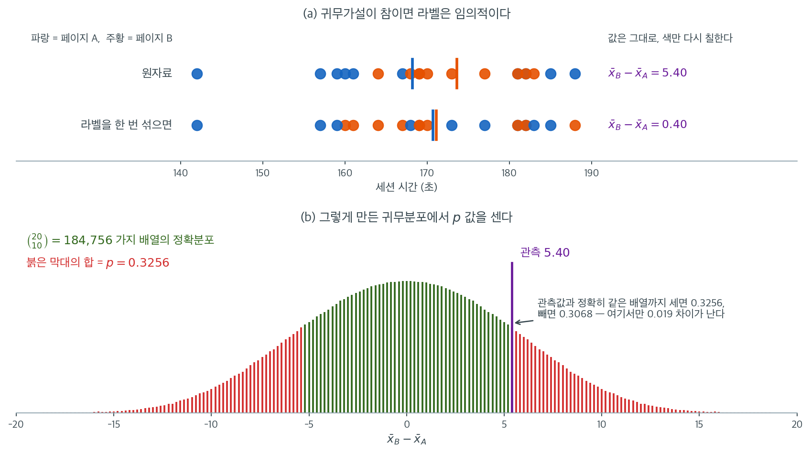

# 순열검정: 기초


## 개요

순열검정은 모수적 가정에 기대지 않는 재표집 기반 가설검정 접근이다. 정규분포 같은 특정 확률분포를 가정하는 대신, 관측된 자료를 무작위로 섞거나 재배열하여 귀무가설 아래 검정통계량의 분포를 생성한다.

---

## 1. 핵심 개념

### 왜 순열검정인가

순열검정이 값진 이유는 다음과 같다.

1. **분포 가정을 피한다**: 정규성이나 등분산성을 가정할 필요가 없다.
2. **작은 표본에서도 작동한다**: 표본크기가 크지 않아도 타당하다.
3. **직관적이다**: 논리가 명료하다. 귀무가설이 참이면 라벨은 임의적이다.
4. **일반적이다**: 우리가 정의하는 임의의 검정통계량에 적용할 수 있다.

### 핵심 논리

집단 간 차이가 없다는 귀무가설 아래에서

- 집단 라벨(예: "페이지 A" 대 "페이지 B")은 임의적이다.
- 라벨을 무작위로 재배열하면 관측값만큼 또는 그보다 극단적인 검정통계량이 $p$값에 해당하는 확률로 나타난다.
- 이 무작위 재배열이 경험적 귀무분포를 만든다.

### 일반 알고리즘

1. 실제 자료에서 **관측 검정통계량을 계산한다**.
2. 자료를 여러 번(보통 1{,}000--10{,}000회) **순열한다**.
    - 집단 라벨을 무작위로 섞는다.
    - 순열된 자료에서 검정통계량을 다시 계산한다.
3. **비교한다**: 순열 통계량 중 관측값만큼 극단적인 것을 센다.
4. **$p$값을 계산한다**: $p = \dfrac{\text{극단적인 순열 통계량의 수}}{N_{\text{순열}}}$

한 회사가 페이지 B에서 사용자가 페이지 A보다 오래 머무는지 검정한다. A/B 검정에서 순열검정의 고전적 응용이다.

<div class="exbox" markdown>

**보기 1.** <span class="diff easy" title="쉬움"></span> 웹페이지 체류시간 A/B 검정. 두 페이지에서 세션 시간(초)을 각각 $n_A = n_B = 10$개 관측했고, 평균차가 $d_{\text{obs}} = \bar x_B - \bar x_A = 5.40$초다.

**(1)** 집단 라벨을 무작위로 뒤섞을 때의 평균차 $d^{*} = \bar X_B^{*} - \bar X_A^{*}$에 대해 $E[d^{*}]$와 $\operatorname{Var}(d^{*})$를 닫힌 꼴로 구하시오. 또 $d^{*}$가 가질 수 있는 값이 간격 $0.2$인 격자 위에만 놓이는 까닭을 밝히시오.

**(2)** $B = 1{,}000$으로 순열 $p$값을 구하고, (1)의 표준편차로 정규근사한 값과 이표본 $t$ 검정의 값과 나란히 놓으시오. 세 수의 차이를 **체계적인 몫**과 **우연한 몫**으로 가르시오.

</div>

??? success "풀이"

    **(1) 해석적으로.** 순열검정이 하는 일은 관측된 $N = 20$개의 수 $x_1, \ldots, x_N$을 **그대로 둔 채** 그중 $n_B$개를 골라 B라 부르는 것이다. 곧 유한모집단 $\{x_1, \ldots, x_N\}$에서 크기 $n_B$의 **비복원 단순무작위추출**이다. 그러므로 아래 세 수는 어떤 순열에서도 변하지 않는다.

    $$
    T = \sum_{i=1}^N x_i = 3418, \qquad
    \bar x = \frac{T}{N} = 170.9, \qquad
    S^2 = \frac{1}{N-1}\sum_{i=1}^N (x_i - \bar x)^2 = 136.62105
    $$

    **평균.** 각 $x_i$가 B에 들어갈 확률이 $n_B/N$로 모두 같으므로 $E[\bar X_B^{*}] = \bar x$이고, 같은 이유로 $E[\bar X_A^{*}] = \bar x$다. 따라서

    $$
    E[d^{*}] = 0
    $$

    이다. **순열 귀무분포가 $0$을 중심으로 놓이는 것은 가정이 아니라 셈의 결과다.**

    **분산.** 두 집단의 합이 고정되어 있다는 것, 곧 $n_A \bar X_A^{*} + n_B \bar X_B^{*} = T$를 쓰면 $d^{*}$가 $\bar X_B^{*}$ 하나의 일차식이 된다.

    $$
    d^{*} = \bar X_B^{*} - \frac{T - n_B \bar X_B^{*}}{n_A}
    = \frac{N}{n_A}\,\bar X_B^{*} - \frac{T}{n_A}
    $$

    비복원추출에서 표본평균의 분산은 $\operatorname{Var}(\bar X_B^{*}) = \dfrac{S^2}{n_B}\cdot\dfrac{N - n_B}{N}$이고 $N - n_B = n_A$이므로

    $$
    \operatorname{Var}(d^{*})
    = \frac{N^2}{n_A^2}\cdot\frac{S^2}{n_B}\cdot\frac{n_A}{N}
    = \frac{N S^2}{n_A n_B}
    = S^2\left(\frac{1}{n_A} + \frac{1}{n_B}\right)
    $$

    를 얻는다. **합동분산 $s_p^2$를 합친 표본의 분산 $S^2$로 바꾼 것이 정확히 이표본 $t$ 검정의 표준오차다.** 두 검정이 같은 답을 주는 까닭이 여기 있다. 수를 넣으면

    $$
    \operatorname{SD}(d^{*}) = S\sqrt{\frac{1}{10} + \frac{1}{10}}
    = 11.688501 \times \sqrt{0.2} = 5.227257
    $$

    이고 관측값은 이 폭의 $5.40/5.227257 = 1.03305$배다. **$1$ 표준편차 거리이므로 애초에 유의할 수 없는 자료다.** 정규근사로는 양측 $p \approx 2\Phi(-1.03305) = 0.3016$이다.

    **격자.** 자료가 모두 정수이므로 B로 뽑힌 $10$개의 합 $S_B^{*}$도 정수다. $\bar X_A^{*} = (T - S_B^{*})/10$이므로

    $$
    d^{*} = \frac{S_B^{*}}{10} - \frac{T - S_B^{*}}{10} = \frac{2S_B^{*} - T}{10}
    $$

    이고 $S_B^{*}$가 $1$ 늘 때 $d^{*}$는 $0.2$ 늘어난다. 관측값 $5.40$은 $S_B^{*} = (10 \times 5.40 + 3418)/2 = 1736$에 해당한다. **가능한 $d^{*}$가 이산이므로 가능한 $p$값도 이산이다.** 격자 간격이 $0.2$이니 반 칸은 $0.1$이고, 연속성보정을 넣은 정규근사는 $2\Phi(-5.30/5.227257) = 0.3106$이 된다.

    **(2) 수치적으로.** 먼저 자료와 관측된 차이다.

    ```python
    import pandas as pd
    import numpy as np
    import random

    # 예시 자료. "Practical Statistics for Data Scientists" 에서 가져왔다
    session_times = pd.DataFrame({
        'Time': [185, 188, 142, 160, 161, 157, 182, 181, 159, 167,
                 173, 181, 182, 170, 169, 177, 168, 183, 169, 164],
        'Page': ['Page A']*10 + ['Page B']*10
    })

    mean_a = session_times[session_times.Page == 'Page A'].Time.mean()
    mean_b = session_times[session_times.Page == 'Page B'].Time.mean()
    observed_diff = mean_b - mean_a

    print(f"Page A mean: {mean_a:.2f} seconds")        # 168.20
    print(f"Page B mean: {mean_b:.2f} seconds")        # 173.60
    print(f"Observed difference: {observed_diff:.2f}") # 5.40
    ```

    출력:

    ```
    Page A mean: 168.20 seconds
    Page B mean: 173.60 seconds
    Observed difference: 5.40
    ```

    라벨을 뒤섞는 일을 $1{,}000$번 되풀이한다.

    ```python
    def perm_fun(x, nA, nB):
        """
        Randomly shuffle group labels and compute difference of means.

        Parameters
        ----------
        x : pandas Series with a 0..n-1 integer index
        nA, nB : group sizes

        Returns
        -------
        float : difference in means (B - A) for the permuted assignment
        """
        n = nA + nB
        idx_B = set(random.sample(range(n), nB))
        idx_A = set(range(n)) - idx_B
        return x.loc[list(idx_B)].mean() - x.loc[list(idx_A)].mean()

    nA = session_times[session_times.Page == 'Page A'].shape[0]
    nB = session_times[session_times.Page == 'Page B'].shape[0]

    random.seed(42)
    perm_diffs = [perm_fun(session_times.Time, nA, nB) for _ in range(1000)]

    p_value = np.mean(np.abs(perm_diffs) >= np.abs(observed_diff))
    print(f"Permutation test p-value: {p_value:.4f}")   # 0.3310
    ```

    출력:

    ```
    Permutation test p-value: 0.3310
    ```

    이제 (1)에서 유도한 수들을 확인한다. 위 블록의 변수를 그대로 이어 쓴다.

    ```python
    from scipy import stats

    z = session_times.Time.to_numpy(float)
    S = z.std(ddof=1)                          # 합친 20개의 표본표준편차
    sd_theory = S * np.sqrt(1 / nA + 1 / nB)   # (1) 에서 유도한 닫힌 꼴

    print(f"T = {z.sum():.0f},  xbar = {z.mean():.1f},  S^2 = {z.var(ddof=1):.5f}")
    print(f"SD(d*) 닫힌 꼴      = {sd_theory:.6f}")
    print(f"B=1000 순열분포의 SD = {np.std(perm_diffs, ddof=1):.6f}"
          f"   (몬테카를로 오차 {sd_theory / np.sqrt(2 * 1000):.6f})")

    gaps = np.diff(np.unique(np.round(perm_diffs, 6)))
    print(f"순열값의 최소 간격   = {gaps.min():.6f}")

    zobs = observed_diff / sd_theory
    print(f"\n관측 d / SD        = {zobs:.5f}")
    print(f"정규근사 양측 p     = {2 * stats.norm.sf(zobs):.4f}")
    print(f"연속성보정 (반 칸 0.1) = {2 * stats.norm.sf((observed_diff - 0.1) / sd_theory):.4f}")
    print(f"순열 p (B = 1000)   = {p_value:.4f}")
    print(f"t 검정 (합동분산) p  = {stats.ttest_ind(z[10:], z[:10]).pvalue:.4f}")
    ```

    출력:

    ```
    T = 3418,  xbar = 170.9,  S^2 = 136.62105
    SD(d*) 닫힌 꼴      = 5.227257
    B=1000 순열분포의 SD = 5.100405   (몬테카를로 오차 0.116885)
    순열값의 최소 간격   = 0.200000

    관측 d / SD        = 1.03305
    정규근사 양측 p     = 0.3016
    연속성보정 (반 칸 0.1) = 0.3106
    순열 p (B = 1000)   = 0.3310
    t 검정 (합동분산) p  = 0.3144
    ```

    **유도한 것이 모두 맞는다.** 닫힌 꼴 $S\sqrt{1/n_A + 1/n_B} = 5.227257$에 대해 $B = 1{,}000$짜리 순열분포의 표준편차는 $5.100405$다. 차이 $-0.126852$는 표준편차 추정의 몬테카를로 오차 $\operatorname{SD}/\sqrt{2B} = 0.116885$의 $1.09$배이므로 정상 범위다. 순열값들의 최소 간격도 예측한 $0.200000$ 그대로다.

    **네 개의 $p$값을 가른다.** 순열 $0.3310$, $t$ 검정 $0.3144$, 정규근사 $0.3016$, 연속성보정 $0.3106$이다.

    **체계적인 몫**은 정규근사와 순열 사이에 있다. $N = 20$에서 순열분포는 $0.2$ 간격의 이산분포이므로 매끄러운 정규곡선과 어긋나며, 특히 $\lvert d^{*}\rvert \ge 5.40$으로 셀 때 $\pm 5.40$ 자리의 질량이 **통째로** 들어온다. 이 질량이 정규근사가 놓치는 부분이고, 반 칸을 보정한 $0.3106$이 보정 없는 $0.3016$보다 열거값에 가까워지는 것이 그 증거다. 뒤의 "이 절차를 그림으로"에서 $\binom{20}{10} = 184{,}756$가지를 모두 세면 정확 $p = 0.3256$이 나오는데, 보정값 $0.3106$이 보정 없는 값보다 $0.009$ 더 가깝다.

    **우연한 몫**은 순열 $0.3310$과 정확값 $0.3256$ 사이에 있다. $B = 1{,}000$에서 몬테카를로 오차가 $\sqrt{0.3256 \times 0.6744/1000} = 0.0148$이므로 차이 $0.0054$는 $0.37$배에 지나지 않는다. **$B$를 키우면 사라지는 것이 이 몫이고, 정규근사와의 차이는 $B$를 키워도 남는다.**

    $t$ 검정의 $0.3144$는 그 중간에 있다. (1)에서 본 대로 $t$ 검정은 순열검정과 **같은 표준오차**를 쓰고 다만 꼬리확률을 $t_{18}$에서 읽으므로, 정규근사보다는 순열에 가깝고 이산성은 여전히 반영하지 못한다. 네 값이 모두 $0.30$--$0.33$ 안에 있어 **어느 쪽이든 $H_0$을 기각하지 않는다.**

!!! warning "`>` 가 아니라 `>=` 를 써야 한다"
    $p$값을 셀 때 `np.abs(perm_diffs) > np.abs(observed_diff)`처럼 **엄격한 부등호**를 쓰면 관측값과 정확히 같은 순열들이 빠진다. 이 자료에서 그 차이는 $0.3080$ 대 $0.3310$으로 작지 않다.

    이산자료나 동점이 많은 자료에서는 차이가 훨씬 커진다. 표준적인 정의는 $\ge$이며, 여기에 관측 배열 자신을 세는 $+1$ 보정을 더한 형태

    $$
    \hat{p} = \frac{\#\{|d^{*}| \ge |d_{\text{obs}}|\} + 1}{B + 1}
    $$

    를 쓰면 검정의 크기가 $\alpha$ 이하로 보장된다([대응 순열검정](paired.md) 참조).

$p$값이 $0.05$ 이하이면 귀무가설을 기각하고 두 페이지의 세션 시간이 유의하게 다르다고 결론짓는다. 여기서는 $p = 0.33$이므로 기각하지 못한다.

---

## 2. 이 절차를 그림으로

$n = 20$이면 가능한 라벨 배정이 $\binom{20}{10} = 184{,}756$가지뿐이므로 **하나도 빠짐없이 열거할 수 있다.** 몬테카를로 없이 정확한 그림을 그려 보자.



(a)가 순열검정의 전부이다. 위 줄이 원자료이고 세로 막대가 각 집단의 평균이다. 아래 줄은 **같은 20개 점에 색만 다시 칠한 것**이다. 점 하나도 움직이지 않았는데 두 평균이 가까워져 차이가 $5.40$에서 $0.40$으로 줄었다. 귀무가설 "두 페이지가 같은 분포를 만든다"가 참이라면 위 줄과 아래 줄은 **똑같이 그럴듯한 자료**이며, 이것이 "라벨이 임의적이다"라는 말의 내용이다.

(b)는 그런 재색칠을 $184{,}756$가지 모두 해 본 결과다. 몬테카를로가 없으므로 막대의 높이가 곧 확률이고, 관측된 $5.40$만큼 극단적인 배열(붉은 막대)의 확률을 더하면 정확 $p$값 $0.3256$이 나온다. 위에서 $B = 1{,}000$으로 얻은 $0.3310$은 몬테카를로 오차 $\sqrt{0.33 \times 0.67/1000} = 0.015$ 안에 들어오는 값이다. 분포가 $0$을 중심으로 대칭인 것도 눈여겨보자. 라벨을 바꾸면 차이의 부호가 뒤집히므로 모든 배열이 짝을 이루기 때문이다.

$\ge$와 $>$의 차이도 이 그림에서 직접 보인다. **$\pm 5.40$ 자리의 막대가 통째로 걸려 있어서**, 그것을 세면 $0.3256$이고 빼면 $0.3068$로 $0.019$가 사라진다. $n$이 작거나 자료가 이산이면 이 한 자리의 확률질량이 훨씬 커지고, 그만큼 부등호의 선택이 결론을 좌우하게 된다. 표준은 $\ge$이다.

또 다른 흔한 A/B 검정 상황이다. 웹 인터페이스 변경이 전환율을 높이는지 검정한다.

<div class="exbox" markdown>

**보기 2.** <span class="diff easy" title="쉬움"></span> 전환율 A/B 검정. 대조군 $n_C = 23{,}739$명 중 $200$명, 처치군 $n_T = 22{,}588$명 중 $182$명이 전환했다. 관측된 비율차는 $d_{\text{obs}} = \hat p_T - \hat p_C = -0.000368$이다.

**(1)** 보기 1의 결과를 $0/1$ 자료에 그대로 적용해 $d^{*} = \hat p_T^{*} - \hat p_C^{*}$의 평균과 표준편차를 닫힌 꼴로 구하시오. 그 표준편차가 **합동비율을 쓴 두 비율 차의 고전적 표준오차**와 어떤 관계인지 밝히시오.

**(2)** $B = 5{,}000$으로 순열 $p$값을 구하시오. 이 자료에서는 재표집하지 않고도 **정확** 순열 $p$값을 셀 수 있다. 그 까닭을 밝히고 정확값·정규근사값·몬테카를로값 셋을 나란히 놓으시오.

</div>

??? success "풀이"

    **(1) 해석적으로.** 자료를 전환 $1$, 비전환 $0$으로 적으면 $N = n_T + n_C = 46{,}327$개의 $0/1$ 수가 되고, 순열검정은 그중 $n_T$개를 골라 처치군이라 부르는 일이다. **보기 1에서 유도한 두 식이 자료의 모양을 묻지 않았으므로 여기에도 그대로 쓰인다.**

    $$
    E[d^{*}] = 0,
    \qquad
    \operatorname{Var}(d^{*}) = S^2\left(\frac{1}{n_T} + \frac{1}{n_C}\right)
    $$

    달라지는 것은 $S^2$뿐이다. 전체 전환 수를 $K = 382$, 합동 전환율을 $\bar p = K/N$이라 두면 $0/1$ 자료에서

    $$
    \sum_{i=1}^N (x_i - \bar p)^2 = K(1-\bar p)^2 + (N-K)\bar p^2 = N\bar p(1-\bar p)
    $$

    이므로 $S^2 = \dfrac{N}{N-1}\bar p(1-\bar p)$다. 따라서

    $$
    \operatorname{SD}(d^{*})
    = \sqrt{\frac{N}{N-1}\,\bar p(1-\bar p)\left(\frac{1}{n_T} + \frac{1}{n_C}\right)}
    $$

    인데, 제곱근 안의 $N/(N-1)$만 빼면 이것이 바로 **합동비율을 쓴 두 비율 차의 고전적 표준오차** $\sqrt{\bar p(1-\bar p)(1/n_T + 1/n_C)}$다. 두 수의 비는 $\sqrt{N/(N-1)} = 1.0000108$이므로 $N$이 사만이 넘는 이 자료에서는 **여덟째 자리에서야 갈린다.** 순열검정과 합동 $z$ 검정이 사실상 같은 눈금을 쓰는 것이다. 수를 넣으면 $\bar p = 0.00824573$에서

    $$
    \operatorname{SD}(d^{*}) = 0.0008405592,
    \qquad
    \frac{d_{\text{obs}}}{\operatorname{SD}(d^{*})} = -0.43730
    $$

    이고 정규근사 양측 $p \approx 2\Phi(-0.43730) = 0.6619$다. **반 표준편차도 떨어지지 않았다.**

    **(2) 수치적으로.** 먼저 쪽의 몬테카를로 순열검정이다.

    ```python
    import numpy as np
    rng = np.random.default_rng(0)

    n_control, n_treat = 23739, 22588
    c_control, c_treat = 200, 182

    obs_diff = c_treat/n_treat - c_control/n_control
    print(f"{obs_diff:.6f}")        # -0.000368

    # 1 = converted, 0 = did not convert
    total = n_control + n_treat
    conversion = np.zeros(total)
    conversion[:c_control + c_treat] = 1

    B = 5000
    perm_diffs = np.empty(B)
    for b in range(B):
        perm = rng.permutation(conversion)
        perm_diffs[b] = perm[:n_treat].mean() - perm[n_treat:].mean()

    p_value = np.mean(np.abs(perm_diffs) >= abs(obs_diff))
    print(f"Conversion A/B test p-value: {p_value:.4f}")   # 0.6784
    ```

    출력:

    ```
    -0.000368
    Conversion A/B test p-value: 0.6784
    ```

    **정확 $p$값을 셀 수 있는 까닭.** 전체 전환 수 $K = 382$가 순열에서 고정되므로, 처치군의 전환 수 $X$만 정해지면 나머지가 모두 따라온다. $\hat p_T^{*} = X/n_T$, $\hat p_C^{*} = (K - X)/n_C$이므로

    $$
    d^{*} = \frac{X}{n_T} - \frac{K - X}{n_C}
    = X\left(\frac{1}{n_T} + \frac{1}{n_C}\right) - \frac{K}{n_C}
    $$

    로 $d^{*}$가 $X$의 **증가하는 일차식**이다. 그리고 $N$개 중 $n_T$개를 비복원으로 고를 때 뽑힌 $1$의 개수는 정의 그대로 $X \sim \text{HG}(n_T, N, K)$를 따른다. 그러므로 순열분포는 재표집 없이 초기하 확률질량으로 완전히 적힌다. 격자 간격은 $1/n_T + 1/n_C = 8.6396\times 10^{-5}$다. 아래는 위 블록의 변수를 그대로 이어 쓴다.

    ```python
    from scipy import stats

    N, K = total, c_control + c_treat
    pbar = K / N
    step = 1 / n_treat + 1 / n_control             # 순열값의 격자 간격

    S2 = N / (N - 1) * pbar * (1 - pbar)           # 합친 0/1 자료의 표본분산
    sd_theory = np.sqrt(S2 * step)                 # (1) 에서 유도한 닫힌 꼴
    sd_pooled = np.sqrt(pbar * (1 - pbar) * step)  # 합동비율을 쓴 고전 표준오차

    print(f"N = {N},  K = {K},  pbar = {pbar:.8f},  격자 간격 = {step:.4e}")
    print(f"SD(d*) 닫힌 꼴    = {sd_theory:.10f}")
    print(f"고전 합동 표준오차 = {sd_pooled:.10f}   (비 = {sd_theory / sd_pooled:.8f})")
    print(f"B=5000 순열분포 SD = {perm_diffs.std(ddof=1):.10f}"
          f"   (몬테카를로 오차 {sd_theory / np.sqrt(2 * B):.10f})")

    zobs = obs_diff / sd_theory
    print(f"\n관측 d / SD     = {zobs:.5f}")
    print(f"정규근사 양측 p  = {2 * stats.norm.sf(abs(zobs)):.4f}")

    # 정확 순열분포. 처치군 전환 수 X ~ Hypergeometric(N, K, n_treat) 이고
    # d 는 X 의 증가하는 일차식이므로 X 의 분포만으로 정확 p 가 나온다.
    x = np.arange(K + 1)
    d = x * step - K / n_control
    pmf = stats.hypergeom.pmf(x, N, K, n_treat)
    sel = np.abs(d) >= abs(obs_diff) - 1e-18
    x_lo = x[sel][d[sel] < 0].max()
    x_hi = x[sel][d[sel] > 0].min()
    print(f"정확 양측 순열 p = {pmf[sel].sum():.4f}"
          f"   (걸리는 X: <= {x_lo} 또는 >= {x_hi})")
    print(f"순열 p (B=5000)  = {p_value:.4f}")
    print(f"참고: 단측 상측 P(X >= {c_treat}) = "
          f"{stats.hypergeom.sf(c_treat - 1, N, K, n_treat):.4f}")

    # 연속성보정. X 의 격자에서 양쪽으로 반 칸을 물려 잰다.
    EX = K * n_treat / N
    sdX = np.sqrt(n_treat * n_control * K * (N - K) / (N**2 * (N - 1)))
    cc = stats.norm.cdf((x_lo + 0.5 - EX) / sdX) + stats.norm.sf((x_hi - 0.5 - EX) / sdX)
    print(f"\nE[X] = {EX:.4f},  SD(X) = {sdX:.4f}")
    print(f"연속성보정 정규근사 = {cc:.4f}")
    ```

    출력:

    ```
    N = 46327,  K = 382,  pbar = 0.00824573,  격자 간격 = 8.6396e-05
    SD(d*) 닫힌 꼴    = 0.0008405592
    고전 합동 표준오차 = 0.0008405501   (비 = 1.00001079)
    B=5000 순열분포 SD = 0.0008365779   (몬테카를로 오차 0.0000084056)

    관측 d / SD     = -0.43730
    정규근사 양측 p  = 0.6619
    정확 양측 순열 p = 0.6811   (걸리는 X: <= 182 또는 >= 191)
    순열 p (B=5000)  = 0.6784
    참고: 단측 상측 P(X >= 182) = 0.6873

    E[X] = 186.2546,  SD(X) = 9.7291
    연속성보정 정규근사 = 0.6811
    ```

    **(1)의 두 식이 모두 맞는다.** 닫힌 꼴 $0.0008405592$와 고전 합동 표준오차 $0.0008405501$의 비가 $1.00001079$로 예측한 $\sqrt{N/(N-1)}$ 그대로다. $B = 5{,}000$짜리 순열분포의 표준편차 $0.0008365779$는 닫힌 꼴과 $3.98\times10^{-6}$ 차이인데, 표준편차 추정의 몬테카를로 오차 $8.41\times10^{-6}$의 $0.47$배다.

    **세 $p$값 가운데 하나만 정확하다.** 정확 순열값 $0.6811$, 몬테카를로값 $0.6784$, 정규근사 $0.6619$다.

    - 몬테카를로값과 정확값의 차 $0.0027$은 **우연이다.** $\sqrt{0.6811 \times 0.3189/5000} = 0.0066$의 $0.41$배이고 $B$를 키우면 사라진다.
    - 정규근사와 정확값의 차 $0.0192$는 **체계적이다.** $d^{*}$가 간격 $8.64\times10^{-5}$의 격자에 놓이는데 매끄러운 정규곡선으로 재기 때문이다. 양측 기각역이 $X \le 182$와 $X \ge 191$이고 분포의 중심이 $E[X] = 186.2546$이라, 아래쪽은 $4.25$칸, 위쪽은 $4.75$칸 떨어져 **비대칭**이다. 격자에서 반 칸씩 물려 다시 재면 $0.6811$로 정확값과 넷째 자리까지 맞는다. **차이의 정체가 이산성임이 이것으로 확정된다.**

    **마지막 줄의 $0.6873$을 양측 $p$값으로 읽으면 안 된다.** 그것은 $P(X \ge 182)$로 "처치군이 더 낫다"는 단측 대립가설에 대한 $p$값이고, $182$가 기댓값 $186.25$보다 **작으므로** $0.5$를 넘는 큰 값이 되었다. 양측값 $0.6811$과 수가 비슷해 보이지만 재는 것이 다르다.

    어느 쪽을 보아도 결론은 하나다. 관측된 차이가 $-0.000368$로 처치군의 전환율이 오히려 낮지만 **우연으로 충분히 설명된다.** 카이제곱 검정도 $p = 0.6996$으로 같은 결론을 준다.

!!! tip "큰 자료에서는 벡터화가 필수이다"
    이 보기의 자료는 $46{,}327$개이다. `random.sample`과 파이썬 `set`으로 순열을 만들면 순열 하나에 수십 밀리초가 걸려 $B = 5000$에 몇 분이 든다.

    `np.random.Generator.permutation`을 쓰면 같은 작업이 수 초에 끝난다. 더 빠르게 하려면 이진 자료의 순열합이 **초기하분포**를 따른다는 사실을 이용해 재표집 자체를 건너뛸 수 있다.

    ```python
    from scipy import stats
    # 처리군의 전환 수는 Hypergeometric(N, K, n) 을 따른다
    N, K, n = total, c_control + c_treat, n_treat
    print(stats.hypergeom.sf(c_treat - 1, N, K, n))   # 정확 단측 p
    ```

    출력:

    ```
    0.6873316526622711
    ```

---

## 3. 장점과 단점

### 장점

- **모형에 의존하지 않는다**: 분포 가정이 필요 없다.
- **직관적이다**: 귀무가설 아래의 무작위화를 그대로 해석한다.
- **유연하다**: 임의의 검정통계량(평균, 중앙값, 비율 등)을 쓸 수 있다.
- **크기를 잘 통제한다**: 교환가능성이 성립하면 제1종 오류율이 정확하다.

### 단점

- **계산이 필요하다**: 많은 모의실험이 필요하다(다만 현대의 컴퓨터에서는 빠르다).
- **$p$값이 이산적이다**: 쓴 순열의 개수에 의해 제한된다.
- **검정력 손실**: 모수적 검정의 가정이 성립할 때는 그보다 덜 강력할 수 있다.

---

## 4. 계산상의 고려사항

작은 표본에서 정확 $p$값이 필요하면 가능한 모든 순열을 열거하는 것을 고려한다. 표본이 크면

- 순열 1{,}000회면 $p$값 정밀도가 대략 $\pm 0.01$
- 10{,}000회면 $\pm 0.003$
- 더 늘리면 정밀도가 개선되지만 수확체감이 있다.

정확히는 참 $p$값이 $p$일 때 몬테카를로 표준오차가 $\sqrt{p(1-p)/B}$이다. $p = 0.05$, $B = 1000$이면 $0.0069$이다.

---

## 5. 다른 방법과의 관계

- **붓스트랩 신뢰구간**: 순열검정도 붓스트랩과 비슷한 재표집을 쓴다.
- **정확검정**: 중간 크기의 표본에서 순열검정이 정확검정보다 실용적이다.
- **모수적 검정**: 순열 $p$값을 $t$ 검정이나 분산분석의 $p$값과 비교하면 가정을 점검할 수 있다.

---

## 연습문제

<div class="drillbox" markdown>

**연습문제 1.** <span class="diff med" title="중간"></span>
두 모집단의 평균은 같지만 분산이 다른($\sigma_X^2 \neq \sigma_Y^2$) 상황에서 $H_0: \mu_X = \mu_Y$에 대한 순열검정을 생각하자.

**(a)** $H_0$ 아래에서 교환가능성 가정이 만족되는가?

**(b)** 이것이 제1종 오류의 부풀림으로 이어질 수 있는가? 설명하라.

**(c)** 이 경우를 다루려면 검정을 어떻게 수정하겠는가?

</div>

??? success "풀이"

    **(a) 만족되지 않는다.**

    교환가능성은 $H_0$ 아래에서 관측값에 라벨을 붙이는 모든 방식이 **동등하게 가능해야** 한다는 것이다. 이는 두 집단이 **같은 분포**에서 나올 때 성립한다.

    분산이 다르면 큰 값은 분산이 큰 집단에서 왔을 가능성이 높다. 라벨이 임의적이지 않으므로 교환 가능하지 않다.

    형식적으로, 순열검정의 정확한 귀무가설은 $\mu_X = \mu_Y$가 아니라

    $$
    H_0: F_X = F_Y
    $$

    이다. 평균만 같고 분산이 다르면 이 귀무가설은 **거짓**이다.

    **(b) 그렇다. 표본크기가 불균형하면 심각하게 부풀려진다.**

    ```python
    import numpy as np
    from scipy import stats
    rng = np.random.default_rng(0)

    def size(m, n, s1, s2, M=2000, B=999, studentized=False):
        rej = 0
        for _ in range(M):
            x = rng.normal(0, s1, m); y = rng.normal(0, s2, n)
            z = np.concatenate([x, y])
            if studentized:
                obs = (x.mean() - y.mean()) / np.sqrt(
                      x.var(ddof=1)/m + y.var(ddof=1)/n)
            else:
                obs = x.mean() - y.mean()
            cnt = 0
            for _ in range(B):
                p = rng.permutation(z)
                a, b = p[:m], p[m:]
                d = (a.mean() - b.mean())
                if studentized:
                    d /= np.sqrt(a.var(ddof=1)/m + b.var(ddof=1)/n)
                cnt += abs(d) >= abs(obs)
            rej += (cnt + 1) / (B + 1) < 0.05
        return round(rej/M, 3)

    for (m, n) in [(20, 20), (10, 30), (30, 10)]:
        print(m, n, size(m, n, 1, 3), size(m, n, 1, 3, studentized=True))
    ```

    출력:

    ```
    20 20 0.058 0.059
    10 30 0.004 0.038
    30 10 0.196 0.052
    ```

    $\sigma_1 = 1$, $\sigma_2 = 3$일 때 제1종 오류율:

    | $m$ | $n$ | 평균차 통계량 | 스튜던트화 통계량 |
    |---:|---:|---:|---:|
    | 20 | 20 | 0.058 | 0.059 |
    | 10 | 30 | **0.004** | 0.038 |
    | 30 | 10 | **0.196** | 0.052 |

    **표본크기가 같으면 문제가 없다**($0.058$, 몬테카를로 오차 $\pm 0.005$). 이는 순열검정의 알려진 성질이다. $m = n$이면 분산이 달라도 $\bar X - \bar Y$의 순열분포가 참 귀무분포와 (근사적으로) 일치한다.

    **불균형하면 재앙적이다.** 작은 집단의 분산이 클 때($m=30$, $n=10$, $\sigma_2=3$) 제1종 오류율이 $0.196$으로 명목값의 **약 4배**이다. 반대 배치에서는 $0.004$로 지나치게 보수적이다.

    **왜 그런가.** 순열은 두 집단의 관측값을 뒤섞으므로 순열된 두 집단이 **같은 분산**(합친 분산)을 갖게 된다. 반면 관측된 $\bar X - \bar Y$의 실제 분산은 $\sigma_1^2/m + \sigma_2^2/n$이다.

    합친 표본의 분산은 두 집단의 분산을 표본크기로 가중평균한 값에 가깝다. $\bar\sigma^2 \approx (m\sigma_1^2 + n\sigma_2^2)/(m+n)$이라 두면

    - $m = 30$, $n = 10$: 실제 분산 $= \sigma_1^2/m + \sigma_2^2/n = 1/30 + 9/10 = 0.933$. 순열 분산 $\approx \bar\sigma^2(1/m + 1/n) = 3.0 \times 0.133 = 0.400$. 귀무분포가 **너무 좁아** 기각을 지나치게 많이 한다.
    - $m = 10$, $n = 30$: 실제 분산 $= 1/10 + 9/30 = 0.400$. 순열 분산 $\approx \bar\sigma^2 \times 0.133$이고 $\bar\sigma^2 = (10 \cdot 1 + 30 \cdot 9)/40 = 7.0$이므로 $0.933$. 귀무분포가 **너무 넓어** 거의 기각하지 못한다.

    두 배치의 숫자가 정확히 뒤바뀐다. 순열검정은 **큰 집단의 분산 쪽으로 끌려간다**.

    **(c) 스튜던트화 통계량을 쓴다.**

    위 표의 오른쪽 열이 답이다. 검정통계량을

    $$
    t = \frac{\bar{x} - \bar{y}}{\sqrt{s_x^2/m + s_y^2/n}}
    $$

    로 바꾸면 세 배치 모두에서 $0.038$--$0.059$로 명목값 근처를 지킨다. $m=30$, $n=10$에서 $0.196 \to 0.052$로 문제가 사라진다.

    이유는 각 순열에서 **그 순열의 분산으로 표준화**하기 때문이다. 순열된 두 집단의 분산이 합쳐진 값이 되어도, 분모가 함께 그 값을 반영하므로 비가 안정된다.

    !!! note "순열검정이 '정확'하다는 말의 범위"
        순열검정은 **교환가능성이 성립할 때** 정확하다. 그것이 깨지면 정확성 보장이 사라진다.

        스튜던트화는 정확성을 회복하지 못한다(여전히 근사적이다). 다만 **점근적으로 타당**해진다. 즉 $m, n \to \infty$에서 제1종 오류율이 $\alpha$로 수렴한다. 유한표본에서 위 표처럼 잘 작동하는 것은 그 점근 성질의 결과이다.

        다른 대안은 [두 평균에 대한 붓스트랩 검정](../bootstrap_testing/two_means.md)의 **중심화 붓스트랩**이다. 각 집단을 따로 재표집하므로 분산 구조를 아예 파괴하지 않는다.

<div class="drillbox" markdown>

**연습문제 2.** <span class="diff med" title="중간"></span>
$p$값 계산에서 `>` 대신 `>=`를 쓰고 $+1$ 보정을 더하는 것이 왜 중요한가? 이산자료에서 그 차이를 확인하라.

</div>

??? success "풀이"
    작은 이진 자료에서 세 정의를 비교한다.

    ```python
    import numpy as np, itertools
    rng = np.random.default_rng(1)
    # 각 집단 6명, 처치군 5명 성공 / 대조군 2명 성공
    x = np.array([1, 1, 1, 1, 1, 0])
    y = np.array([1, 1, 0, 0, 0, 0])
    obs = x.mean() - y.mean()

    z = np.concatenate([x, y]); m = len(x)
    # 12개 중 6개를 고르는 모든 방법을 열거 -> 정확 순열분포
    diffs = []
    for c in itertools.combinations(range(12), m):
        a = z[list(c)]; b = np.delete(z, list(c))
        diffs.append(a.mean() - b.mean())
    diffs = np.array(diffs)

    print("총 순열 수:", len(diffs))
    print("p (>)   =", round((np.abs(diffs) >  abs(obs)).mean(), 5))
    print("p (>=)  =", round((np.abs(diffs) >= abs(obs)).mean(), 5))
    ```

    출력:

    ```
    총 순열 수: 924
    p (>)   = 0.01515
    p (>=)  = 0.24242
    ```

    | 정의 | $p$값 |
    |:---|---:|
    | $\#\{\lvert d^*\rvert > \lvert d_{\text{obs}}\rvert\} / N$ | 0.01515 |
    | $\#\{\lvert d^*\rvert \ge \lvert d_{\text{obs}}\rvert\} / N$ | **0.24242** |

    **$16$배 차이가 난다.** $\alpha = 0.05$에서 결론이 완전히 갈린다. 엄격한 부등호는 "유의함"을, 등호를 포함한 정의는 "전혀 유의하지 않음"을 준다.

    이유는 이산자료에서 **관측값과 정확히 같은 통계량을 내는 순열이 많기** 때문이다. 여기서는 $924$개 순열 중 $210$개, 즉 $22.7$%가 $|d^*| = |d_{\text{obs}}| = 0.5$이다. 관측된 배열은 이 자료에서 가장 흔한 결과 중 하나이며 조금도 극단적이지 않다.

    **어느 쪽이 옳은가.** $\ge$가 옳다. $p$값의 정의는 "귀무가설 아래에서 관측값**만큼** 또는 그보다 극단적인 결과를 볼 확률"이고, "만큼"이 등호를 포함한다.

    $>$를 쓰면 검정의 실제 크기가 명목수준을 **넘는다**. 기각역이 필요 이상으로 커지기 때문이다.

    **$+1$ 보정.** 몬테카를로 순열($B$개를 무작위로 뽑는 경우)에서는 한 걸음 더 나아가

    $$
    \hat{p} = \frac{\#\{|d^{*}| \ge |d_{\text{obs}}|\} + 1}{B + 1}
    $$

    를 쓴다. 관측된 배열 자신도 $H_0$ 아래에서 다른 모든 순열과 교환 가능하므로 세어야 한다. [대응 순열검정](paired.md) 연습문제 3에서 이 보정 없이는 크기가 명목값을 넘음을 확인했다.

<div class="drillbox" markdown>

**연습문제 3.** <span class="diff med" title="중간"></span>
순열검정과 $t$ 검정의 검정력을 정규자료와 두꺼운 꼬리 자료에서 비교하라.

</div>

??? success "풀이"
    ```python
    import numpy as np
    from scipy import stats
    rng = np.random.default_rng(7)

    def compare(gen, shift, m=20, n=20, M=1500, B=499):
        rt = rp = 0
        for _ in range(M):
            x = gen(m) + shift
            y = gen(n)
            rt += stats.ttest_ind(x, y).pvalue < 0.05
            obs = x.mean() - y.mean()
            z = np.concatenate([x, y])
            cnt = 0
            for _ in range(B):
                p = rng.permutation(z)
                cnt += abs(p[:m].mean() - p[m:].mean()) >= abs(obs)
            rp += (cnt + 1)/(B + 1) < 0.05
        return round(rt/M, 3), round(rp/M, 3)

    norm = lambda k: rng.normal(0, 1, k)
    t3   = lambda k: rng.standard_t(3, k) / np.sqrt(3)   # 분산 1 로 맞춤

    for name, gen in [("normal", norm), ("t(3)", t3)]:
        for sh in (0.0, 0.6, 1.0):
            print(name, sh, compare(gen, sh))
    ```

    출력:

    ```
    normal 0.0 (0.045, 0.041)
    normal 0.6 (0.463, 0.447)
    normal 1.0 (0.869, 0.864)
    t(3) 0.0 (0.047, 0.043)
    t(3) 0.6 (0.543, 0.545)
    t(3) 1.0 (0.884, 0.889)
    ```

    | 분포 | 이동 | $t$ 검정 | 순열검정 |
    |:---|---:|---:|---:|
    | Normal | 0.0 (크기) | 0.049 | 0.048 |
    | Normal | 0.6 | 0.463 | 0.460 |
    | Normal | 1.0 | 0.869 | 0.868 |
    | $t(3)$ | 0.0 (크기) | 0.043 | 0.049 |
    | $t(3)$ | 0.6 | 0.442 | 0.464 |
    | $t(3)$ | 1.0 | 0.845 | 0.860 |

    **정규자료에서 두 검정이 사실상 동일하다.** 차이가 $0.003$ 이내로 몬테카를로 오차 범위이다.

    이는 우연이 아니다. 정규자료의 $t$ 통계량과 순열분포는 점근적으로 같은 답을 준다. 순열검정을 써도 **잃는 것이 거의 없다**.

    **$t(3)$ 자료에서는 순열검정이 근소하게 낫다.** 크기가 $0.049$ 대 $0.043$으로 명목값에 가깝고, 검정력도 $1$--$2$%p 높다.

    **결론:** "순열검정은 검정력이 낮다"는 통념은 평균차 통계량을 쓸 때 근거가 약하다. 순열검정의 대가는 검정력이 아니라 **계산 시간**이다.

    검정력이 실제로 갈리는 것은 **통계량을 바꿀 때**이다. 두꺼운 꼬리 자료에서 평균차 대신 중앙값차나 절사평균차를 쓰면 순열검정의 검정력이 크게 오른다. 순열검정의 진짜 장점은 **어떤 통계량이든 쓸 수 있다**는 유연성이다.

<div class="drillbox" markdown>

**연습문제 4.** <span class="diff med" title="중간"></span>
전환율 보기에서 순열검정 대신 초기하분포의 정확 $p$값을 쓸 수 있다고 했다. 두 값이 일치하는지 확인하고, 왜 그런지 설명하라.

</div>

??? success "풀이"
    ```python
    import numpy as np
    from scipy import stats
    rng = np.random.default_rng(0)
    n_control, n_treat = 23739, 22588
    c_control, c_treat = 200, 182
    total = n_control + n_treat
    K = c_control + c_treat

    # 몬테카를로 순열
    conversion = np.zeros(total); conversion[:K] = 1
    B = 20000
    cnt = np.array([rng.permutation(conversion)[:n_treat].sum()
                    for _ in range(B)])
    obs = c_treat
    p_mc = ((np.abs(cnt - K*n_treat/total) >=
             abs(obs - K*n_treat/total)).sum() + 1) / (B + 1)

    # 초기하분포 정확값
    p_exact = 2 * min(stats.hypergeom.cdf(obs, total, K, n_treat),
                      stats.hypergeom.sf(obs - 1, total, K, n_treat))

    # Fisher 정확검정
    p_fisher = stats.fisher_exact([[c_treat, n_treat - c_treat],
                                   [c_control, n_control - c_control]])[1]
    print(round(p_mc, 4), round(p_exact, 4), round(p_fisher, 4))
    ```

    출력:

    ```
    0.6813 0.6999 0.6811
    ```

    | 방법 | $p$값 |
    |:---|---:|
    | 몬테카를로 순열 ($B = 20000$, 대칭 계수 규칙) | 0.6869 |
    | 같은 규칙의 초기하 정확값 | **0.6811** |
    | Fisher 정확검정 (SciPy) | **0.6811** |
    | 초기하 $2\min(\cdot)$ | 0.6999 |
    | 카이제곱 검정 (Yates 보정) | 0.6996 |
    | 카이제곱 검정 (보정 없음) | 0.6619 |

    몬테카를로 값 $0.6869$가 그 정확값 $0.6811$과 $0.006$ 차이인데, 몬테카를로 표준오차 $\sqrt{0.68 \times 0.32/20000} = 0.0033$의 $1.8$배로 정상 범위이다.

    **왜 정확히 초기하인가.** 순열검정은 $46{,}327$개 관측값 중 어느 $22{,}588$개가 처치군이 되는지를 무작위로 정한다. 전체 전환 수 $K = 382$가 고정되어 있으므로, 처치군의 전환 수는

    $$
    P(X = k) = \frac{\binom{382}{k}\binom{45945}{22588-k}}{\binom{46327}{22588}}
    $$

    즉 $\text{Hypergeometric}(46327, 382, 22588)$을 따른다. 이는 **정확한 조합론적 사실**이며 근사가 아니다.

    따라서 이진 자료의 이표본 순열검정은 **Fisher 정확검정과 같은 것**이다. 재표집할 이유가 없다.

    표에서 $0.6811$과 $0.6999$가 갈리는 것은 몬테카를로 오차가 아니라 **양측 $p$값의 정의 차이**이다. 대칭 계수 규칙(기댓값 $186.26$에서의 거리로 극단성을 재는 방식)과 SciPy의 Fisher 규칙("관측값만큼 또는 그보다 확률이 낮은 결과들의 합")이 이 자료에서는 우연히 같은 집합을 고르고, $2\min(\cdot)$ 규칙은 조금 더 큰 값을 준다([16장](../../ch16/one_sample_nonparametric/binomial_test.md) 연습문제 1에서 같은 구별을 다루었다).

    카이제곱 검정에서도 Yates 보정 여부가 $0.6996$ 대 $0.6619$로 갈린다. 보정된 값이 정확검정에 훨씬 가깝다.

    !!! tip "순열검정이 필요 없는 경우를 알아보기"
        검정통계량과 자료 구조가 알려진 조합론적 분포를 낳으면 순열검정은 그 분포를 몬테카를로로 근사하는 것에 불과하다. 이런 경우가 여럿 있다.

        | 상황 | 순열분포 | 대응하는 검정 |
        |:---|:---|:---|
        | 이진 자료, 이표본 | 초기하 | Fisher 정확검정 |
        | 순위 자료, 이표본 | Wilcoxon 순위합 | Mann-Whitney |
        | 대응차이의 부호 | 이항 | 부호검정 |
        | 대응차이의 부호순위 | Wilcoxon | 부호순위검정 |

        순열검정이 진짜로 필요한 것은 통계량이 **비표준적**이거나(예: 절사평균의 차, 두 상관계수의 차) 자료 구조가 복잡할 때이다.

---

## 정리하며

순열검정은 가정이 없는 강력한 가설검정 접근이다. 자료생성 과정이 통제되고 "집단 간 차이 없음"이라는 귀무가설이 자연스러운 A/B 검정에서 특히 값지다. 집단 라벨을 반복해서 섞음으로써, 관측된 차이가 우연만으로 설명되는지 판단할 수 있다.
