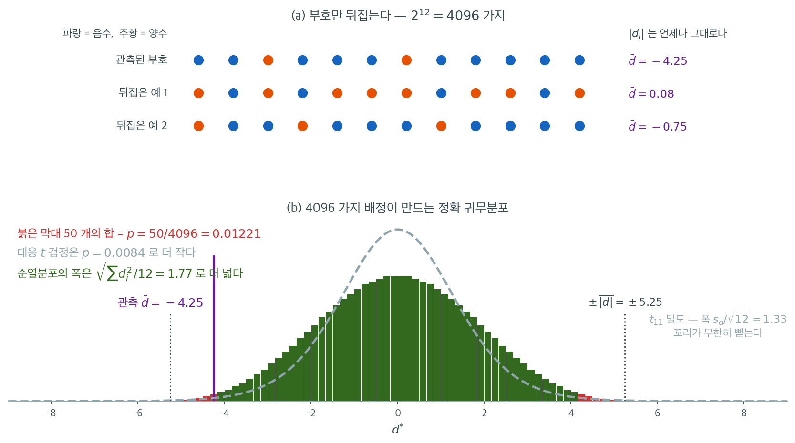

# 대응자료에 대한 순열검정

## 동기

대응 $t$ 검정은 같은 개체에서 얻은 두 측정(전후, 처치와 대조)을 차이 $d_i = x_i - y_i$로 요약하고 그 평균이 $0$인지 검정한다. 이 검정은 차이가 정규분포를 따른다고 가정하는데, 치우쳤거나 꼬리가 두꺼운 모집단에서 나온 작은 표본에서는 성립하지 않을 수 있다.

**대응자료에 대한 순열검정**은 정확하고 분포무관한 대안이다. 핵심 착상은 $H_0$ 아래에서 각 차이의 부호가 양수일 확률과 음수일 확률이 같다는 것이다. 관측된 차이들의 부호를 무작위로 뒤집어 이 대칭성을 활용한다.

## 가설

$n$개의 대응 관측 $(x_1, y_1), \ldots, (x_n, y_n)$에서 차이를 계산한다.

$$
d_i = x_i - y_i, \quad i = 1, \ldots, n
$$

검정하는 가설은 다음과 같다.

$$
H_0: d_i \text{의 분포가 } 0 \text{에 대해 대칭이다} \quad \text{대} \quad H_1: d_i \text{의 중심이 } 0 \text{이 아니다}
$$

$H_0$ 아래에서 각 $d_i$는 양수일 가능성과 음수일 가능성이 같다. 관측 검정통계량은 보통 차이의 평균이다.

$$
\bar{d} = \frac{1}{n}\sum_{i=1}^n d_i
$$

또는 합 $T = \sum_{i=1}^n d_i$를 쓴다(검정 목적으로는 동등하다).

!!! note "대칭성 가정"
    대응 순열검정은 $H_0$ 아래에서 각 $d_i$의 분포가 $0$에 대해 대칭이라고 가정한다. 이는 대응 $t$ 검정의 정규성 가정보다 약하지만 단순히 $E[d_i] = 0$을 가정하는 것보다는 강하다. $H_0$ 아래에서도 차이가 치우쳐 있으면(실무에서 흔하지는 않다) 부호 뒤집기 방식이 타당하지 않을 수 있다. 연습문제 4에서 이 경우를 정량적으로 확인한다.

## 알고리즘: 부호 뒤집기 순열

1. 관측된 차이 $d_1, \ldots, d_n$과 검정통계량 $\bar{d}_{\text{obs}} = \frac{1}{n}\sum_{i=1}^n d_i$를 계산한다.
2. $b = 1, 2, \ldots, B$에 대해:
    - 각 $i = 1, \ldots, n$에 대해 독립적으로 $s_i = +1$ 또는 $s_i = -1$을 같은 확률로 정한다.
    - $d_i^{*(b)} = s_i \cdot d_i$를 계산한다.
    - $\bar{d}^{*(b)} = \frac{1}{n}\sum_{i=1}^n d_i^{*(b)}$를 계산한다.
3. 양측 $p$값은 다음과 같다.

$$
p = \frac{\#\{b : |\bar{d}^{*(b)}| \ge |\bar{d}_{\text{obs}}|\} + 1}{B + 1}
$$

각 부호 배정은 $H_0$ 아래에서 동등하게 가능한 자료 배열 하나에 해당한다. 가능한 부호 배정은 모두 $2^n$가지이다.

## 정확분포

$n$이 작으면 $2^n$가지 부호 배정을 모두 열거할 수 있다.

| $n$ | 배정 수 ($2^n$) | 가능성 |
|---|---|---|
| 5 | 32 | 자명 |
| 10 | 1,024 | 쉬움 |
| 15 | 32,768 | 가능 |
| 20 | 1,048,576 | 빠른 계산으로 가능 |
| 25 | 33,554,432 | 경계 |
| 30 | $> 10^9$ | 무작위 표집 필요 |

$n \le 20$이면 정확 열거가 현실적이다. 더 크면 $B = 10{,}000$ 이상의 무작위 부호 배정으로 충분히 좋은 근사를 얻는다.

## 부호 뒤집기가 작동하는 이유

$H_0$ 아래에서 $d_i$의 분포는 $0$에 대해 대칭이다. 즉 $d_i$와 $-d_i$가 같은 분포를 갖는다. 따라서 $d_i$를 $-d_i$로 바꾸는 것("부호 뒤집기")은 $H_0$ 아래에서 동등하게 가능한 자료를 만든다.

$2^n$가지 부호 배정 전체는 절댓값 $|d_1|, \ldots, |d_n|$이 주어졌을 때 검정통계량의 **정확 조건부 분포**를 생성한다. 이 분포에서 얻은 $p$값은 정확하다. 어떤 표본크기에서도 제1종 오류율을 정확히 $\alpha$ 수준에서 통제한다.

## 다른 검정통계량

부호 뒤집기 틀에서는 차이로부터 계산되는 어떤 통계량도 쓸 수 있다. 흔한 선택은 다음과 같다.

**차이의 평균** ($\bar{d}$): 차이가 대칭이고 꼬리가 가벼우면 가장 강력하다.

**양의 순위합** (Wilcoxon 부호순위 통계량):

$$
W^+ = \sum_{i=1}^n \text{rank}(|d_i|) \cdot \mathbf{1}(d_i > 0)
$$

원자료 대신 순위를 쓰므로 이상값에 더 로버스트하다.

**차이의 절사평균**: 가장 극단적인 차이를 제외하고 평균을 낸다. 평균과 중앙값의 절충이다.

!!! tip "어떤 통계량을 쓸 것인가"
    차이가 대략 대칭이고 극단적인 이상값이 없으면 $\bar{d}$를 쓴다. 이상값이 우려되면 Wilcoxon 부호순위 통계량을 쓴다. 어떤 통계량을 고르든 순열 방식(부호 뒤집기)은 동일하다. 연습문제 2에서 네 통계량의 검정력을 비교한다.

새로운 명상 프로그램의 효과를 $n = 12$명에게서 측정했다. 관측된 차이(사후 $-$ 사전)는 다음과 같다.

$$
d = (-8, -3, 2, -12, -5, -1, 4, -7, -6, -2, -9, -4)
$$

관측된 평균차는 $\bar{d}_{\text{obs}} = -4.25$, 표준편차는 $s_d = 4.595$이다.

<div class="exbox" markdown>

**보기 1.** <span class="diff easy" title="쉬움"></span> 대응자료에 대한 순열검정. 위 $n = 12$개의 차이에 부호 뒤집기 검정을 적용한다. $2^{12} = 4{,}096$가지이므로 **모두 열거할 수 있다.**

**(1)** 귀무분포 $\bar d^{*}$의 평균과 표준편차를 닫힌 꼴로 구하고, 그 지지집합이 $[-\overline{\lvert d\rvert},\ \overline{\lvert d\rvert}]$임을 보이시오.

**(2)** $\lvert \bar d^{*}\rvert \ge 4.25$라는 조건이 **뒤집는 쪽 $\lvert d_i\rvert$들의 합**에 대한 조건으로 바뀜을 보이고, 그런 배정의 수를 **손으로 세어** 정확 $p$값을 구하시오. 열거해 확인하고 대응 $t$ 검정·Wilcoxon 부호순위검정과 견주시오.

</div>

??? success "풀이"

    **(1) 해석적으로.** 독립인 부호 $\varepsilon_i \in \{-1, +1\}$을 각각 확률 $1/2$로 붙이므로 $E[\varepsilon_i] = 0$, $\operatorname{Var}(\varepsilon_i) = 1$이고

    $$
    E[\bar d^{*}] = 0,
    \qquad
    \operatorname{Var}(\bar d^{*}) = \frac{1}{n^2}\sum_{i=1}^n d_i^2
    $$

    이다. $\sum_i d_i^2 = 449$이므로

    $$
    \operatorname{SD}(\bar d^{*}) = \frac{\sqrt{449}}{12} = 1.765802
    $$

    **지지집합.** 삼각부등식에서 $\lvert \bar d^{*}\rvert \le \frac1n\sum_i \lvert d_i\rvert = \overline{\lvert d\rvert}$이고, 등호는 $\varepsilon_i d_i$의 부호가 모두 같을 때 성립한다. $\sum_i \lvert d_i \rvert = 63$이므로 지지집합은 $[-5.25,\ 5.25]$이고 양 끝은 실제로 도달한다. **순열분포는 유계다.** $t$ 검정이 쓰는 $t_{11}$에는 그런 경계가 없다.

    **(2) 해석적으로.** $\varepsilon_i d_i = \pm\lvert d_i\rvert$이고 부호가 자유로우므로, 부호 배정을 "어느 $\lvert d_i\rvert$를 음수로 둘 것인가"로 바꾸어 적을 수 있다. 음수로 둔 자리의 집합을 $A$, 그 합을 $s = \sum_{i \in A}\lvert d_i\rvert$라 하면

    $$
    \sum_i \varepsilon_i d_i = 63 - 2s
    $$

    이다. 관측값이 $\bar d_{\text{obs}} = -4.25$, 곧 합으로는 $-51$이므로

    $$
    \lvert \bar d^{*}\rvert \ge 4.25
    \iff \lvert 63 - 2s\rvert \ge 51
    \iff s \le 6 \;\text{또는}\; s \ge 57
    $$

    이다. $s \ge 57$은 여집합의 합이 $6$ 이하라는 뜻이므로 $A \mapsto A^c$가 두 쪽을 일대일로 맞바꾼다. **한쪽만 세면 된다.**

    $\lvert d\rvert = (8, 3, 2, 12, 5, 1, 4, 7, 6, 2, 9, 4)$에서 합이 $6$ 이하인 부분집합을 센다. $6$을 넘는 $7, 8, 9, 12$는 아예 들어갈 수 없고, 값 $2$와 값 $4$는 **두 개씩** 있다는 데 주의한다.

    | 합 $s$ | 부분집합 | 개수 |
    |---:|:---|---:|
    | $0$ | $\varnothing$ | $1$ |
    | $1$ | $\{1\}$ | $1$ |
    | $2$ | $\{2\}$ (둘 중 하나) | $2$ |
    | $3$ | $\{3\}$, $\{1,2\}$ | $1 + 2 = 3$ |
    | $4$ | $\{4\}$, $\{1,3\}$, $\{2,2\}$ | $2 + 1 + 1 = 4$ |
    | $5$ | $\{5\}$, $\{1,4\}$, $\{2,3\}$, $\{1,2,2\}$ | $1 + 2 + 2 + 1 = 6$ |
    | $6$ | $\{6\}$, $\{1,5\}$, $\{2,4\}$, $\{1,2,3\}$ | $1 + 1 + 4 + 2 = 8$ |

    합이 $25$다. 양쪽을 더하면

    $$
    p_{\text{정확}} = \frac{2 \times 25}{4096} = \frac{50}{4096} = 0.012207
    $$

    **수치적으로.** $n = 12$이므로 $2^{12} = 4{,}096$가지 부호 배정을 모두 열거한다.

    ```python
    import numpy as np, itertools
    from scipy import stats

    d = np.array([-8, -3, 2, -12, -5, -1, 4, -7, -6, -2, -9, -4])
    print(d.mean(), round(d.std(ddof=1), 4))     # -4.25  4.595

    S = np.array(list(itertools.product([1, -1], repeat=12)))
    m = (S * d).mean(axis=1)
    count = (np.abs(m) >= abs(d.mean()) - 1e-12).sum()
    print(count, len(m), count / len(m))         # 50  4096  0.012207

    print(stats.ttest_1samp(d, 0))               # t = -3.204, p = 0.00839
    print(stats.wilcoxon(d))                     # W = 8.0,   p = 0.012207
    ```

    출력:

    ```
    -4.25 4.595
    50 4096 0.01220703125
    TtestResult(statistic=-3.2040407749287168, pvalue=0.008394085815475436, df=11)
    WilcoxonResult(statistic=8.0, pvalue=0.01220703125)
    ```

    (1)과 (2)의 수를 모두 확인한다. 위 블록의 변수를 그대로 이어 쓴다.

    ```python
    import collections

    n = len(d)
    print(f"sum|d| = {np.abs(d).sum():.0f},  mean|d| = {np.abs(d).mean():.2f},"
          f"  sum d^2 = {(d ** 2).sum():.0f}")
    print(f"귀무 SD 닫힌 꼴 = {np.sqrt((d ** 2).sum()) / n:.6f},  열거 = {m.std():.6f}")
    print(f"지지집합의 끝   = {np.abs(m).max():.2f}")
    print(f"t 검정의 척도   = {d.std(ddof=1) / np.sqrt(n):.6f}")

    # |합| >= 51 은 뒤집는 쪽 |d_i| 들의 합 s 가 6 이하이거나 57 이상인 것과 같다.
    cnt = collections.Counter()
    for k in range(n + 1):
        for c in itertools.combinations(range(n), k):
            s = int(sum(abs(d[i]) for i in c))
            if s <= 6:
                cnt[s] += 1
    print(f"합이 s 인 부분집합의 수: {sorted(cnt.items())}"
          f"  ->  s <= 6 은 {sum(cnt.values())} 가지")

    # 두 통계량이 고르는 배정이 같은 집합인가
    r = stats.rankdata(np.abs(d))
    Wp = ((S * d > 0) * r).sum(axis=1)
    W_obs = ((d > 0) * r).sum()
    sel_mean = np.abs(m) >= abs(d.mean()) - 1e-12
    sel_w = (Wp <= W_obs + 1e-12) | (Wp >= r.sum() - W_obs - 1e-12)
    print(f"W+ obs = {W_obs:.1f},  순위합 전체 = {r.sum():.0f},"
          f"  Wilcoxon 이 고른 배정 = {sel_w.sum()}")
    print(f"두 집합이 같은가: {np.array_equal(sel_mean, sel_w)}")
    ```

    출력:

    ```
    sum|d| = 63,  mean|d| = 5.25,  sum d^2 = 449
    귀무 SD 닫힌 꼴 = 1.765802,  열거 = 1.765802
    지지집합의 끝   = 5.25
    t 검정의 척도   = 1.326450
    합이 s 인 부분집합의 수: [(0, 1), (1, 1), (2, 2), (3, 3), (4, 4), (5, 6), (6, 8)]  ->  s <= 6 은 25 가지
    W+ obs = 8.0,  순위합 전체 = 78,  Wilcoxon 이 고른 배정 = 50
    두 집합이 같은가: True
    ```

    **손으로 센 것이 그대로 맞는다.** 합 $0$부터 $6$까지의 개수가 $1, 1, 2, 3, 4, 6, 8$로 표와 한 칸도 다르지 않고, 합이 $25$다. 따라서 $4{,}096$가지 중 $50$가지가 걸리고 $p_{\text{정확}} = 50/4096 = 0.012207$이다. 닫힌 꼴 표준편차 $1.765802$와 지지집합의 끝 $5.25$도 열거와 일치한다.

    **Wilcoxon 부호순위검정이 정확히 같은 답을 주는 까닭도 드러난다.** $W^+ \le 8$ 또는 $W^+ \ge 70$인 배정이 $50$개인데, 코드가 확인하듯 그것이 평균 통계량이 고른 $50$개와 **같은 집합**이다. 두 검정이 같은 $2^{12}$가지 위에서 정의되고 이 자료에서는 극단 배정의 순서까지 겹치기 때문이다. 통계량이 달라도 기각역이 일치할 수 있다.

    **대응 $t$ 검정만 다른 답을 준다.** $t = -4.25/1.326450 = -3.204$에서 $p = 0.0084$로 순열검정의 $0.0122$보다 작다. 이 자료의 왜도는 $0.197$로 거의 대칭이므로 원인은 치우침이 아니다. 두 가지가 겹친다.

    - **척도가 다르다.** 순열은 $\sqrt{\sum d_i^2}/n = 1.766$으로 재고 $t$ 검정은 $s_d/\sqrt n = 1.326$으로 잰다. [순열검정](permutation.md) 보기 3에서 본 대로 비가 $\sqrt{(n-1+t^2)/n} = \sqrt{(11 + 10.266)/12} = 1.331$이다.
    - **꼬리가 다르다.** 순열분포는 $\pm 5.25$에서 끊기는데 $t_{11}$은 끝없이 뻗는다.

    더 넓고 유계인 귀무분포에서 같은 관측값을 재니 $p$값이 커진다. **순열검정의 $0.0122$는 이 자료에서 정확한 값이고, $t$ 검정의 $0.0084$는 정규성을 빌려 온 근사다.**

## 부호 뒤집기를 그림으로

이 보기는 $2^{12} = 4096$가지를 모두 열거했으므로 귀무분포를 통째로 그릴 수 있다.



(a)에서 각 점은 한 사람의 차이 $d_i$이고 색은 부호다. 아래 두 줄은 부호를 무작위로 뒤집은 예인데, **$|d_i|$의 목록은 세 줄이 완전히 같다.** 바뀐 것은 부호뿐이며 그때마다 $\bar{d}$가 $-4.25$에서 $0.08$로, $-0.75$로 움직인다. 이것이 "$|d_i|$에 조건부인 정확분포"라는 말의 내용이다. 관측된 절댓값들을 그대로 둔 채 $H_0$가 참인 세계를 $4096$가지 만들어 낸 것이다.

(b)가 그 $4096$개 값의 분포다. 관측된 $-4.25$만큼 극단적인 배정은 붉게 칠한 $50$개뿐이고, $50/4096 = 0.01221$이 정확 $p$값이다. 분포가 $\pm\overline{|d|} = \pm 5.25$에서 뚝 끊기는 것도 눈에 띈다. **모든 부호를 같은 방향으로 맞추는 것이 가장 극단적인 배정**이므로 그보다 큰 값은 존재할 수 없다. 점선으로 그린 $t_{11}$ 밀도는 그 경계를 무시하고 양쪽으로 계속 뻗는다.

두 분포의 **폭**도 다르다. 부호 뒤집기 분포의 표준편차는 $\sqrt{\sum d_i^2}/12 = 1.77$인데 $t$ 검정이 쓰는 척도는 $s_d/\sqrt{12} = 1.33$이다. 순열분포는 $0$을 중심으로 짜이므로 제곱합을 $0$ 주위에서 재고, $s_d$는 관측된 평균 $-4.25$ 주위에서 잰다. 평균이 $0$에서 멀수록 이 차이가 커진다. 더 넓은 귀무분포에서 같은 관측값을 재니 $p$값도 커져서, 순열검정의 $0.0122$가 $t$ 검정의 $0.0084$보다 보수적인 답이 된다. **어느 쪽이 옳은가에 대한 답은 분명하다.** 순열분포는 이 자료에서 정확한 반면 $t_{11}$은 정규성을 빌려 온 근사이다.

## 관련 검정과의 비교

| 검정 | 가정 | 통계량 | 정확성 |
|---|---|---|---|
| 대응 $t$ 검정 | 차이가 정규 | $t = \bar{d}/(s_d/\sqrt{n})$ | 근사(정규면 정확) |
| 부호검정 | 연속, 대칭 | 양수 $d_i$의 개수 | 정확(이항) |
| Wilcoxon 부호순위 | 차이가 대칭 | 양수의 순위합 | 정확(순위의 순열) |
| 순열(부호 뒤집기) | 차이가 대칭 | $d_i$의 임의 통계량 | 정확($\lvert d_i\rvert$ 조건부) |

부호 뒤집기 순열검정은 Wilcoxon 부호순위검정을 일반화한다. 순열 틀 안에서 Wilcoxon 통계량을 쓰면 표준 Wilcoxon 검정과 같은 결과가 나오고, 순열 틀은 여기에 더해 $\bar{d}$나 다른 임의의 통계량도 쓸 수 있게 한다.

!!! warning "차이가 0인 경우"
    어떤 $d_i = 0$이면 그 관측에 대한 부호 뒤집기는 아무 효과가 없다($0$의 부호를 바꿔도 $0$이다). 흔한 처리는 검정 전에 $0$인 차이를 제외하거나($n$이 줄어든다), 같은 확률로 양수나 음수에 무작위 배정하는 것이다.

## 연습문제

<div class="drillbox" markdown>

**연습문제 1.** <span class="diff easy" title="쉬움"></span>
다음 전후 자료(혈압)에 대해 **대응 부호 뒤집기 순열검정**을 구현하라.

| 환자 | 사전 | 사후 |
|---|---|---|
| 1 | 148 | 140 |
| 2 | 142 | 138 |
| 3 | 136 | 132 |
| 4 | 155 | 147 |
| 5 | 129 | 131 |
| 6 | 161 | 152 |
| 7 | 138 | 135 |
| 8 | 144 | 139 |

**(a)** $2^8 = 256$가지 부호 배정을 모두 열거하여 정확 $p$값을 구하라.

**(b)** 대응 $t$ 검정 및 Wilcoxon 부호순위검정과 비교하라.

</div>

??? success "풀이"
    ```python
    import numpy as np, itertools
    from scipy import stats

    before = np.array([148, 142, 136, 155, 129, 161, 138, 144])
    after  = np.array([140, 138, 132, 147, 131, 152, 135, 139])
    d = after - before
    print(d)                      # [-8 -4 -4 -8  2 -9 -3 -5]
    print(d.mean(), round(d.std(ddof=1), 4))   # -4.875  3.5632

    S = np.array(list(itertools.product([1, -1], repeat=8)))
    m = (S * d).mean(axis=1)
    cnt = (np.abs(m) >= abs(d.mean()) - 1e-12).sum()
    print(cnt, len(m), cnt / len(m))           # 4  256  0.015625

    print(stats.ttest_rel(after, before))
    print(stats.wilcoxon(d, method='exact'))
    print(stats.binomtest((d > 0).sum(), 8, 0.5).pvalue)
    ```

    출력:

    ```
    [-8 -4 -4 -8  2 -9 -3 -5]
    -4.875 3.5632
    4 256 0.015625
    TtestResult(statistic=-3.8697136256193168, pvalue=0.006133954352036696, df=7)
    WilcoxonResult(statistic=1.0, pvalue=0.015625)
    0.0703125
    ```

    **(a)** 차이는 $(-8, -4, -4, -8, 2, -9, -3, -5)$이고 $\bar{d} = -4.875$이다. $256$가지 부호 배정 중 $|\bar{d}^*| \ge 4.875$를 만족하는 것은 **$4$가지**이므로

    $$
    p_{\text{exact}} = \frac{4}{256} = 0.015625
    $$

    **(b) 네 검정의 비교**

    | 검정 | 통계량 | $p$값 |
    |:---|---:|---:|
    | 부호 뒤집기 순열(평균) | $\bar{d} = -4.875$ | **0.015625** |
    | Wilcoxon 부호순위 (정확) | $W = 1$ | **0.015625** |
    | 대응 $t$ 검정 | $t = -3.870$, $\nu = 7$ | 0.00613 |
    | 부호검정 | 양수 $1$개 / $8$개 | 0.0703 |

    **순열검정과 Wilcoxon이 또 일치한다.** 본문 보기와 같은 현상이다. 두 통계량이 같은 $4$개의 배정을 극단으로 지목한다.

    **$t$ 검정이 $2.5$배 작은 $p$값을 준다**($0.0061$ 대 $0.0156$). 본문 보기와 방향이 같다. $n = 8$에서 $t_7$의 꼬리 근사가 순열분포보다 관대하다.

    **부호검정은 $p = 0.070$으로 기각하지 못한다.** 부호검정은 차이의 크기를 완전히 버리고 방향만 세기 때문이다. 여덟 명 중 일곱 명이 내려갔다는 사실만으로는 $\alpha = 0.05$에 못 미친다. 반면 순열검정과 Wilcoxon은 "내려간 사람들의 하락폭이 유일하게 올라간 사람의 상승폭($+2$)보다 훨씬 크다"는 정보를 쓴다.

    !!! note "$4/256$의 정체"
        어떤 $4$가지 배정인가? 관측된 배정, 전부 뒤집은 배정, 그리고 유일한 양수 $+2$의 부호만 뒤집은 두 배정이다.

        $+2$를 $-2$로 바꾸면 $\bar{d}^* = -5.375$로 더 극단이 된다. 이 자료에서 $|\bar{d}^*|$가 $4.875$ 이상인 배정은 이 넷뿐이다.

        최소 가능 $p$값이 $2/256 = 0.0078$이므로 $0.0156$은 그 다음으로 작은 값이다. **$n = 8$에서 얻을 수 있는 거의 최선의 증거이다.**

<div class="drillbox" markdown>

**연습문제 2.** <span class="diff med" title="중간"></span>
부호 뒤집기 틀에서 평균, Wilcoxon 통계량, 부호 통계량, $20$% 절사평균을 검정통계량으로 쓸 때의 검정력을 비교하라. 정규 차이와 오염된 차이($90$%는 $N(0,1)$, $10$%는 $N(0,6^2)$)에서 $n = 15$로 모의실험하라.

</div>

??? success "풀이"
    ```python
    import numpy as np
    from scipy import stats
    rng = np.random.default_rng(21)

    def signflip_p(d, stat, B=499):
        obs = abs(stat(d))
        S = rng.choice([-1, 1], size=(B, len(d)))
        v = np.abs(np.apply_along_axis(stat, 1, S * d))
        return ((v >= obs - 1e-12).sum() + 1) / (B + 1)

    def wil(a):
        r = stats.rankdata(np.abs(a))
        return (r * (a > 0)).sum() - (r * (a < 0)).sum()
    sign = lambda a: (a > 0).sum() - (a < 0).sum()
    trim = lambda a: stats.trim_mean(a, 0.2)
    ```

    **제1종 오류율 (이동 = 0)**

    | 차이의 분포 | 평균 | Wilcoxon | 부호 | 절사평균 | 대응 $t$ |
    |:---|---:|---:|---:|---:|---:|
    | 정규 | 0.039 | 0.041 | 0.032 | 0.047 | 0.040 |
    | 오염 | 0.050 | 0.049 | 0.032 | 0.053 | 0.038 |

    **네 순열검정 모두 크기를 지킨다.** 부호 통계량이 $0.032$로 보수적인데, 이는 부호검정의 귀무분포가 매우 이산적이기 때문이다($n = 15$에서 이항분포의 눈금).

    **검정력 (이동 = 0.8)**

    | 차이의 분포 | 평균 | Wilcoxon | 부호 | 절사평균 | 대응 $t$ |
    |:---|---:|---:|---:|---:|---:|
    | 정규 | 0.811 | 0.795 | 0.595 | 0.801 | **0.823** |
    | 오염 | 0.540 | 0.604 | 0.507 | **0.644** | 0.493 |

    **정규 차이에서는 평균이 최선이고 $t$ 검정과 사실상 같다**($0.811$ 대 $0.823$). Wilcoxon은 $0.795$로 $2$%p만 뒤진다. 이는 이론이 예측하는 바이다. 정규분포에서 Wilcoxon 부호순위검정의 $t$ 검정 대비 점근상대효율은 $3/\pi \approx 0.955$이다.

    **부호 통계량은 정규자료에서 $0.595$로 크게 뒤진다.** 크기 정보를 버리는 대가이다. 점근상대효율 $2/\pi \approx 0.637$과 부합한다.

    **오염 차이에서 순위가 뒤집힌다.** 절사평균이 $0.644$로 최선이고, Wilcoxon $0.604$, 평균 $0.540$, $t$ 검정 $0.493$ 순이다. 평균 기반 검정이 $0.811 \to 0.540$으로 $33$%의 검정력을 잃는 동안 Wilcoxon은 $0.795 \to 0.604$로 $24$%만 잃는다.

    주목할 점은 **부호 통계량이 오염자료에서 $0.507$로 거의 손실이 없다**는 것이다($0.595 \to 0.507$). 크기를 아예 보지 않으므로 이상값의 영향을 받지 않는다. 그럼에도 절사평균에 크게 뒤지는 것은 버리는 정보가 너무 많기 때문이다.

    **결론:** 자료의 꼬리를 모를 때는 절사평균이나 Wilcoxon이 합리적인 기본값이다. 두 상황 모두에서 최선에 가깝다.

<div class="drillbox" markdown>

**연습문제 3.** <span class="diff med" title="중간"></span>
$p$값 공식의 $+1$ 보정이 실제로 필요한지 확인하라. $n = 12$의 정규 차이에 대해 $B = 199$로 부호 뒤집기 검정을 하고, 보정을 넣은 경우와 넣지 않은 경우의 제1종 오류율을 비교하라.

</div>

??? success "풀이"
    ```python
    import numpy as np
    rng = np.random.default_rng(21)

    def signflip_p(d, B=199, plus1=True):
        obs = abs(d.mean())
        S = rng.choice([-1, 1], size=(B, len(d)))
        v = np.abs((S * d).mean(axis=1))
        if plus1:
            return ((v >= obs - 1e-12).sum() + 1) / (B + 1)
        return (v >= obs - 1e-12).mean()

    a = b = 0
    M = 4000
    for _ in range(M):
        d = rng.normal(0, 1, 12)
        a += signflip_p(d, plus1=True) < 0.05
        b += signflip_p(d, plus1=False) < 0.05
    print(a/M, b/M)
    ```

    출력:

    ```
    0.04575 0.05075
    ```

    | $p$값 정의 | 제1종 오류율 |
    |:---|---:|
    | $(\#\{\cdot\} + 1)/(B+1)$ | **0.0458** |
    | $\#\{\cdot\}/B$ | **0.0512** |

    **보정 없는 정의가 명목수준을 넘는다**($0.0512 > 0.05$). 보정을 넣으면 $0.0458$로 $\alpha$ 이하가 된다.

    차이가 $0.005$로 작아 보이지만 방향이 중요하다. **보정 없는 검정은 원리적으로 크기를 보장하지 못한다.** 보정된 검정은 어떤 $B$에서도 $P(\hat{p} \le \alpha) \le \alpha$를 만족한다.

    **왜 그런가.** $H_0$ 아래에서 관측된 배열은 $B$개의 무작위 배열과 **교환 가능**하다. 즉 관측 통계량의 순위는 $B+1$개 값 중에서 균등분포를 따른다. 따라서

    $$
    P\left(\frac{R + 1}{B+1} \le \alpha\right) \le \alpha
    $$

    가 정확히 성립한다. 여기서 $R$은 관측값 이상인 순열의 개수이다. 관측값을 세지 않으면 이 논증이 무너진다.

    **$B$가 클수록 차이가 줄어든다.** $B = 199$에서 $0.005$인 차이가 $B = 9999$에서는 $0.0001$ 수준이다. 그래도 보정을 넣는 데 드는 비용이 $0$이므로 항상 넣는 것이 맞다.

    !!! tip "$\alpha$와 $B$를 맞추기"
        $B$를 $(B+1)\alpha$가 정수가 되도록 고르면 검정이 $\alpha$ 수준을 **정확히** 달성한다. $\alpha = 0.05$이면 $B = 199, 999, 1999, 9999$ 등이다.

        모의실험에서 $B = 199$를 쓴 이유가 이것이다. $B = 200$을 쓰면 $(201)(0.05) = 10.05$가 정수가 아니어서 검정이 약간 보수적이 된다.

<div class="drillbox" markdown>

**연습문제 4.** <span class="diff med" title="중간"></span>
대칭성 가정이 깨지면 어떻게 되는가? $H_0: E[d_i] = 0$은 참이지만 차이가 오른쪽으로 치우친 경우 — $d_i \sim \text{Exp}(1) - 1$ 과 $d_i \sim \text{LogNormal}(0,1) - e^{0.5}$ — 에서 부호 뒤집기 검정과 대응 $t$ 검정의 제1종 오류율을 구하라.

</div>

??? success "풀이"
    ```python
    import numpy as np
    from scipy import stats
    rng = np.random.default_rng(21)
    # signflip_p 는 연습문제 2 의 것과 같고, 통계량으로 평균을 쓴다

    def size(gen, n, M=3000):
        a = b = 0
        for _ in range(M):
            d = gen(n)
            a += signflip_p(d, np.mean, B=499) < 0.05
            b += stats.ttest_1samp(d, 0).pvalue < 0.05
        return round(a/M, 3), round(b/M, 3)

    exp_c = lambda k: rng.exponential(1, k) - 1.0
    ln_c  = lambda k: rng.lognormal(0, 1, k) - np.exp(0.5)
    ```

    | 차이의 분포 | 왜도 | $n$ | 부호 뒤집기 | 대응 $t$ |
    |:---|---:|---:|---:|---:|
    | $\text{Exp}(1) - 1$ | 2.0 | 15 | 0.092 | 0.095 |
    | $\text{Exp}(1) - 1$ | 2.0 | 40 | 0.071 | 0.073 |
    | $\text{LogNormal}(0,1) - e^{0.5}$ | 6.2 | 15 | **0.146** | **0.150** |

    **부호 뒤집기 검정의 크기가 무너진다.** 지수 차이에서 $0.092$, 로그정규 차이에서 $0.146$으로 명목값의 $2$--$3$배이다.

    "정확검정"이 정확성을 잃은 것이 아니다. **다른 가설을 검정하고 있는 것**이다. 부호 뒤집기 검정의 실제 귀무가설은

    $$
    H_0: d_i \text{의 분포가 } 0 \text{에 대해 대칭}
    $$

    이며, $E[d_i] = 0$이지만 치우친 분포에서 이 가설은 **거짓**이다. 검정이 참인 대칭성 위반을 정확히 탐지하고 있으며, 우리가 그것을 "평균이 0이 아니다"로 잘못 읽는 것이다.

    **$t$ 검정도 똑같이 나쁘다.** $0.095$, $0.150$으로 사실상 구별되지 않는다. 이 상황에서 순열검정을 쓴다고 해서 더 나빠지지는 않는다.

    **$n$을 늘리면 개선된다.** 지수 차이에서 $n = 15$의 $0.092$가 $n = 40$에서 $0.071$로 줄어든다. 중심극한정리가 작동하기 때문이다. 다만 수렴이 느리다. 왜도가 $\gamma_1$일 때 $t$ 통계량의 왜도는 대략 $\gamma_1/\sqrt{n}$로 줄어들므로, $\text{Exp}(1)$의 $\gamma_1 = 2$를 $0.2$ 아래로 낮추려면 $n \ge 100$이 필요하다.

    **어떻게 해야 하는가.**

    | 접근 | 설명 |
    |:---|:---|
    | 변환 | 차이가 아니라 $\log$ 비를 분석한다. 비율 자료에서 흔히 대칭성을 회복시킨다. |
    | 중앙값을 대상으로 | $H_0: \text{median}(d) = 0$을 부호검정으로 검정한다. 대칭성이 필요 없다. |
    | 붓스트랩 | 중심화 붓스트랩이나 BCa 구간은 대칭성을 요구하지 않는다([단일 평균 붓스트랩 검정](../bootstrap_testing/single_mean.md) 참조). |
    | 스튜던트화 부호 뒤집기 | $\bar{d}/(s_d/\sqrt{n})$을 통계량으로 쓰면 점근적으로 타당해진다. |

    !!! warning "'정확검정'이라는 표현의 함정"
        순열검정을 "정확검정"이라고 부르는 것은 옳지만, **무엇에 대해** 정확한지를 놓치기 쉽다.

        - 이표본 순열검정은 $H_0: F_X = F_Y$에 대해 정확하다. $H_0: \mu_X = \mu_Y$에 대해서는 아니다([기초](foundations.md) 연습문제 1).
        - 부호 뒤집기 검정은 $H_0$: 차이가 $0$에 대해 대칭에 대해 정확하다. $H_0: E[d] = 0$에 대해서는 아니다.

        두 경우 모두 실제 귀무가설이 우리가 원하는 것보다 **강하다**. 자료가 그 추가 조건을 만족하지 않으면 정확성은 사라진다.

---

## 정리하며

대응자료 순열검정은 $H_0$ 아래 차이의 대칭성을 이용해 관측된 차이들의 부호를 무작위로 뒤집는다. 각 부호 배정은 귀무가설 아래에서 동등하게 가능하며, 이로부터 검정통계량의 정확 조건부 분포가 만들어진다. 분포무관하고($H_0$ 아래 차이의 대칭성만 요구한다), 어떤 검정통계량과도 결합되며, 어떤 표본크기에서도 정확 $p$값을 준다. 대응 $t$ 검정의 비모수 대응물이다.
