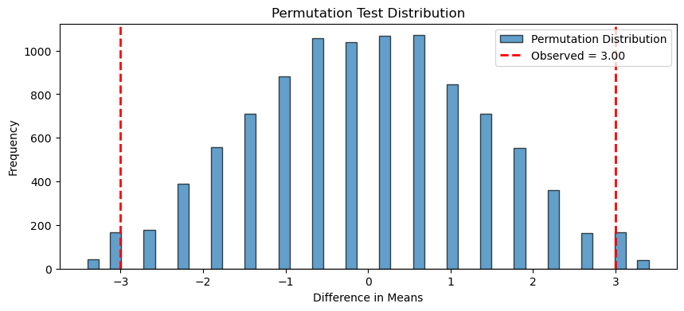

# 순열검정


## 1. 서론

**순열검정**(permutation test, 또는 무작위화검정 randomization test)은 가설검정을 위한 다재다능한 비모수 방법이다. 자료를 재배열(순열)하여 만든 분포와 관측된 검정통계량을 비교함으로써, 관측값이 귀무가설과 부합하는지 평가한다. 자료의 기저 분포에 대한 가정에 의존하지 않는다.

### 주요 특징

1. **가정이 없다**: 정규성이나 등분산성을 가정하지 않는다. 검정통계량의 분포는 전적으로 자료로부터 결정된다.
2. **유연하다**: 평균, 중앙값, 분산, 상관계수 등 어떤 통계량의 비교에도 쓸 수 있다.
3. **정확검정**: 표본이 작으면 가능한 모든 순열을 고려하므로 정확하다.
4. **근사검정**: 자료가 크면 순열의 일부만 표집하여 근사한다.

---

## 2. 가설

- **귀무가설 ($H_0$)**: 관측된 자료가 같은 분포에서 나왔다. 또는 검정통계량이 집단 변수와 무관하다.
- **대립가설 ($H_1$)**: 관측된 자료가 다른 분포에서 나왔다. 또는 검정통계량이 집단 변수와 연관된다.

---

## 3. 일반 절차

### 1단계: 검정통계량 선택

검정하려는 효과나 차이를 반영하는 통계량을 고른다. 평균차, 중앙값차, 상관계수 등이다.

### 2단계: 관측 검정통계량 계산

원래 자료로 검정통계량을 계산한다.

### 3단계: 순열 생성

자료 라벨이나 집단 배정을 무작위로 섞어 집단 간 연관을 끊는다.

### 4단계: 각 순열의 검정통계량 계산

각 순열에 대해 검정통계량을 계산한다.

### 5단계: 관측 통계량과 비교

관측 통계량을 순열들의 통계량 분포와 비교한다. 관측값만큼 또는 그보다 극단적인 순열의 비율이 $p$값이다.

---

## 4. 평균차에 대한 순열검정

<div class="exbox" markdown>

**보기 1.** <span class="diff easy" title="쉬움"></span> 순열검정 절차. **자료:**

- 집단 A: $[8, 7, 9, 10, 6]$
- 집단 B: $[5, 6, 4, 3, 7]$

**가설:**

- $H_0$: 두 집단의 평균이 같다.
- $H_1$: 두 집단의 평균이 다르다.

</div>

??? success "풀이"
    ```python
    import numpy as np
    import matplotlib.pyplot as plt

    def permutation_test(group_a, group_b, n_permutations=10000, seed=0):
        """
        Permutation test for a difference in means.

        Parameters
        ----------
        group_a, group_b : array-like
            Data for each group.
        n_permutations : int
            Number of random permutations.

        Returns
        -------
        p_value : float
            Two-sided p-value with the +1 correction.
        observed_diff : float
            The observed difference in means.
        perm_differences : ndarray
            The permutation distribution.
        """
        rng = np.random.default_rng(seed)
        combined = np.concatenate([group_a, group_b])
        observed_diff = np.mean(group_a) - np.mean(group_b)
        na = len(group_a)

        perm_differences = np.empty(n_permutations)
        for i in range(n_permutations):
            p = rng.permutation(combined)
            perm_differences[i] = p[:na].mean() - p[na:].mean()

        p_value = ((np.abs(perm_differences) >= abs(observed_diff)).sum() + 1) \
                  / (n_permutations + 1)
        return p_value, observed_diff, perm_differences

    group_a = np.array([8, 7, 9, 10, 6])
    group_b = np.array([5, 6, 4, 3, 7])

    p_value, observed_diff, perm_dist = permutation_test(group_a, group_b)

    print(f"Observed Difference in Means: {observed_diff:.2f}")
    print(f"P-value: {p_value:.4f}")

    fig, ax = plt.subplots(figsize=(10, 4))
    ax.hist(perm_dist, bins=50, edgecolor='black', alpha=0.7,
            label='Permutation Distribution')
    ax.axvline(observed_diff, color='red', linestyle='--', linewidth=2,
               label=f'Observed = {observed_diff:.2f}')
    ax.axvline(-observed_diff, color='red', linestyle='--', linewidth=2)
    ax.legend()
    ax.set_xlabel('Difference in Means')
    ax.set_ylabel('Frequency')
    ax.set_title('Permutation Test Distribution')
    plt.show()
    ```

    출력:

    ```
    Observed Difference in Means: 3.00
    P-value: 0.0418
    ```



**출력 예:**

```
Observed Difference in Means: 3.00
P-value: 0.0397
```

$5$% 수준에서는 유의하지 않다. 각 집단이 $5$개뿐이므로 가능한 순열이 $\binom{10}{5} = 252$가지이고, 이를 **전부 열거**하면 정확 $p$값 $10/252 = 0.0397$을 얻는다. 몬테카를로 값이 이와 일치한다.

!!! warning "$t$ 검정과의 차이를 그냥 넘기지 말 것"
    같은 자료의 이표본 $t$ 검정은 $p = 0.0171$로 **유의하다**고 답한다. 순열검정은 $p = 0.0397$이다. 두 결론이 $\alpha = 0.02$ 부근에서 갈린다.

    차이의 원인은 이 표본이 너무 작다는 것이다. 정확 순열분포에서 $|d^*| \ge 3$인 순열은 $252$개 중 $10$개뿐이고, 가능한 $p$값의 최솟값은 $2/252 = 0.0079$이다. $t$ 분포는 이 이산성을 무시하고 매끄러운 꼬리를 가정한다.

    작은 표본에서는 **정확 순열 $p$값이 더 믿을 만하다**.

---

## 5. 상관에 대한 순열검정

두 변수 사이의 관측된 상관이 유의한지 검정한다.

<div class="exbox" markdown>

**보기 2.** <span class="diff easy" title="쉬움"></span> 상관에 대한 순열검정. $x = (1, 2, \ldots, 8)$과 $y = (2, 3, 5, 4, 6, 8, 7, 9)$에 대해 $y$만 뒤섞는 순열검정을 한다.

**(1)** 이 자료에서는 피어슨 $r$이 **스피어만 $\rho$와 같다.** 그 까닭을 밝히고 $\rho = 1 - \dfrac{6\sum_i d_i^2}{n^3-n}$으로 $r$을 기약분수로 구하시오. 순열 귀무분포에서 $\rho^{*}$의 평균과 분산도 구하시오.

**(2)** $\lvert \rho^{*}\rvert \ge r$인 순열이 어떤 것인지 $\sum_i d_i^2$으로 적고 그 개수를 **손으로 세어** 정확 $p$값을 분수로 구하시오. 실행값과 견주고, (1)의 분산으로 한 정규근사가 왜 쓸모없는지 밝히시오.

</div>

??? success "풀이"

    **(1) 해석적으로.** $y$의 값을 작은 것부터 늘어놓으면 $2, 3, 4, 5, 6, 7, 8, 9$이니 **$y_i$는 자기 순위 $R_i$보다 꼭 $1$ 크다.** 곧 $y_i = R_i + 1$이다. 피어슨 상관은 두 변수 각각의 **양의 일차변환에 불변**이고, $x_i = i$는 그 자체가 $x$의 순위이므로

    $$
    r(x, y) = r(x, R + 1) = r(x, R) = \rho
    $$

    가 된다. $R = (1, 2, 4, 3, 5, 7, 6, 8)$이므로 $d_i = i - R_i$가 $(0, 0, -1, 1, 0, -1, 1, 0)$이고 $\sum_i d_i^2 = 4$다. $n = 8$에서 $n^3 - n = 504$이므로

    $$
    r = 1 - \frac{6 \times 4}{504} = 1 - \frac{1}{21} = \frac{20}{21} = 0.9523810
    $$

    **평균과 분산.** $y$를 뒤섞으면 그 순위벡터 $R^{*}$가 $1, \ldots, n$의 무작위 순열이 된다. $a_i = i - \frac{n+1}{2}$, $V = \sum_i a_i^2 = \frac{n(n^2-1)}{12}$라 두면 두 순위벡터의 분산이 같으므로

    $$
    \rho^{*} = \frac{1}{V}\sum_{i=1}^n a_i\, a_{\pi(i)}
    $$

    로 적힌다($\pi$는 무작위 순열). $\pi$를 $i \mapsto n+1-\pi(i)$로 바꾸면 $\rho^{*}$의 부호만 뒤집히고 확률은 그대로이므로 $E[\rho^{*}] = 0$이다. 분산은 $\sum_i a_i = 0$을 쓰면 두 줄로 끝난다. $E[a_{\pi(i)}^2] = V/n$이고, $i \ne j$에서는

    $$
    E[a_{\pi(i)}a_{\pi(j)}] = \frac{\left(\sum_k a_k\right)^2 - \sum_k a_k^2}{n(n-1)} = \frac{-V}{n(n-1)}
    $$

    이므로

    $$
    E\!\left[\Big(\textstyle\sum_i a_i a_{\pi(i)}\Big)^2\right]
    = V\cdot\frac{V}{n} + \big(0 - V\big)\cdot\frac{-V}{n(n-1)}
    = \frac{V^2}{n-1}
    $$

    이고 따라서

    $$
    \operatorname{Var}(\rho^{*}) = \frac{1}{n-1} = \frac17,
    \qquad
    \operatorname{SD}(\rho^{*}) = \frac{1}{\sqrt 7} = 0.3779645
    $$

    다. **자료가 무엇이든 상관없다.** 순위만 쓰므로 분산이 $n$만으로 정해진다.

    **(2) 해석적으로.** 순열 통계량도 같은 공식을 따른다. $D^{*} = \sum_i (i - \pi(i))^2$이라 두면 $\rho^{*} = 1 - \dfrac{6D^{*}}{504}$이므로

    $$
    \rho^{*} \ge \frac{20}{21} \iff D^{*} \le 4,
    \qquad
    \rho^{*} \le -\frac{20}{21} \iff \frac{6D^{*}}{504} \ge \frac{41}{21} \iff D^{*} \ge 164
    $$

    이다. 먼저 $D^{*} \le 4$를 센다. $\sum_i (i - \pi(i)) = 0$이므로 홀수인 항의 개수가 짝수이고 따라서 **$D^{*}$는 언제나 짝수**다. 또 움직인 자리마다 적어도 $1$을 보태므로 $D^{*}$는 움직인 자리의 수 이상이다.

    | $D^{*}$ | 어떤 순열인가 | 개수 |
    |---:|:---|---:|
    | $0$ | 항등 | $1$ |
    | $2$ | 이웃 한 쌍의 맞바꿈($2 \times 1^2$) | $7$ |
    | $4$ | 겹치지 않는 이웃 맞바꿈 두 개 | $\binom72 - 6 = 15$ |

    $D^{*} = 2$에서 떨어진 두 자리를 맞바꾸면 $2(j-i)^2 \ge 8$이고 세 자리 이상을 움직이면 $D^{*} \ge 4$인데 제곱수 셋을 더해 $4$를 만들 수 없으므로($1+1+2$는 제곱이 아니다) 표가 전부다. $D^{*} = 4$의 $15$는 이웃 쌍 $7$개 중 자리를 공유하지 않는 두 개를 고르는 수다. 합이 $23$이다. $\pi$를 뒤집는 대응이 $D^{*} \le 4$와 $D^{*} \ge 164$를 일대일로 맞바꾸므로 뒤쪽도 $23$가지다. 따라서

    $$
    p_{\text{정확}} = \frac{2 \times 23}{8!} = \frac{46}{40320} = \frac{23}{20160} = 0.001141
    $$

    **정규근사는 여기서 쓸모가 없다.** $z = \dfrac{20/21}{1/\sqrt7} = 2.519763$이고 양측 $p \approx 0.011743$인데, 정확값의 $10$배가 넘는다. $\rho^{*}$는 $[-1, 1]$에 **갇혀 있고** 관측값 $20/21$이 그 경계 바로 앞에 있으므로, 경계를 모르는 정규곡선은 그 자리의 확률을 크게 어림잡는다. $n = 8$에서는 $40{,}320$가지를 다 세는 편이 빠르기도 하다.

    **수치적으로.** 먼저 쪽의 몬테카를로 검정이다.

    ```python
    import numpy as np

    def permutation_correlation_test(x, y, n_permutations=10000, seed=0):
        """상관계수의 유의성에 대한 순열검정.

        y 만 섞고 x 는 그대로 둔다. 이러면 두 변수의 짝만 부서지고 각각의
        주변분포는 온전히 남으므로, "관계가 없다"는 상태를 정확히 흉내 낼 수
        있다. 둘 다 섞으면 헛일이 되고, x 를 섞어도 결과는 같다.
        """
        rng = np.random.default_rng(seed)
        observed_corr = np.corrcoef(x, y)[0, 1]

        perm_corrs = np.empty(n_permutations)
        for i in range(n_permutations):
            perm_corrs[i] = np.corrcoef(x, rng.permutation(y))[0, 1]

        p_value = ((np.abs(perm_corrs) >= abs(observed_corr)).sum() + 1) \
                  / (n_permutations + 1)
        return p_value, observed_corr, perm_corrs

    x = np.array([1, 2, 3, 4, 5, 6, 7, 8])
    y = np.array([2, 3, 5, 4, 6, 8, 7, 9])

    p_value, observed_corr, _ = permutation_correlation_test(x, y)
    print(f"Observed Correlation: {observed_corr:.4f}")   # 0.9524
    print(f"Permutation P-value: {p_value:.4f}")          # 0.0011
    ```

    출력:

    ```
    Observed Correlation: 0.9524
    Permutation P-value: 0.0013
    ```

    이제 (1)과 (2)의 수를 모두 확인한다. 위 블록의 변수를 그대로 이어 쓴다.

    ```python
    import itertools
    from collections import Counter
    from scipy import stats
    from fractions import Fraction

    n = len(x)
    R = stats.rankdata(y)
    print(f"y 의 순위 = {R.astype(int)},   y - 순위 = {(y - R).astype(int)}")
    print(f"피어슨 r = {observed_corr:.10f}")
    print(f"스피어만 rho = {stats.spearmanr(x, y).statistic:.10f}")
    print(f"20/21 = {20 / 21:.10f},   sum d^2 = {int(((x - R) ** 2).sum())}")

    # 8! = 40,320 가지 순위 배정을 모두 열거한다.
    D = np.array([int(((x - np.array(p)) ** 2).sum())
                  for p in itertools.permutations(range(1, n + 1))])
    rho = 1 - 6 * D / (n ** 3 - n)
    cnt = Counter(D.tolist())
    print(f"\nD = 0, 2, 4 의 개수 = {cnt[0]}, {cnt[2]}, {cnt[4]}   (합 {cnt[0] + cnt[2] + cnt[4]})")
    print(f"D >= 164 의 개수     = {int((D >= 164).sum())},   D 의 최댓값 = {D.max()}")
    hit = int((np.abs(rho) >= 20 / 21 - 1e-12).sum())
    print(f"|rho*| >= 20/21 인 순열 = {hit} 가지 / {len(D)}"
          f"  =  {Fraction(hit, len(D))}  =  {hit / len(D):.6f}")

    print(f"\nSD(rho*) 열거 = {rho.std():.10f},   1/sqrt(n-1) = {1 / np.sqrt(n - 1):.10f}")
    z = (20 / 21) * np.sqrt(n - 1)
    print(f"정규근사 z = {z:.6f},  양측 p = {2 * stats.norm.sf(z):.6f}"
          f"   (정확값의 {2 * stats.norm.sf(z) / (hit / len(D)):.1f} 배)")

    p_exact = hit / len(D)
    B = 10_000
    mean_hat = (B * p_exact + 1) / (B + 1)
    sd = np.sqrt(B * p_exact * (1 - p_exact)) / (B + 1)
    print(f"\n몬테카를로 실행값 = {p_value:.6f}")
    print(f"E[p-hat] = {mean_hat:.6f},  SD = {sd:.6f}"
          f"   -> 실행값은 {(p_value - mean_hat) / sd:+.2f} SD")
    print(f"피어슨 t 검정 p = {stats.pearsonr(x, y).pvalue:.6f}")
    ```

    출력:

    ```
    y 의 순위 = [1 2 4 3 5 7 6 8],   y - 순위 = [1 1 1 1 1 1 1 1]
    피어슨 r = 0.9523809524
    스피어만 rho = 0.9523809524
    20/21 = 0.9523809524,   sum d^2 = 4

    D = 0, 2, 4 의 개수 = 1, 7, 15   (합 23)
    D >= 164 의 개수     = 23,   D 의 최댓값 = 168
    |rho*| >= 20/21 인 순열 = 46 가지 / 40320  =  23/20160  =  0.001141

    SD(rho*) 열거 = 0.3779644730,   1/sqrt(n-1) = 0.3779644730
    정규근사 z = 2.519763,  양측 p = 0.011743   (정확값의 10.3 배)

    몬테카를로 실행값 = 0.001300
    E[p-hat] = 0.001241,  SD = 0.000338   -> 실행값은 +0.18 SD
    피어슨 t 검정 p = 0.000260
    ```

    **유도한 것이 모두 맞는다.** $y$에서 순위를 뺀 값이 여덟 자리 모두 $1$이라 $r$과 $\rho$가 열 자리까지 같고, 둘 다 $20/21$이다. 손으로 센 $1 + 7 + 15 = 23$이 열거 결과와 같고, $D^{*} \ge 164$ 쪽도 $23$이라 $46/40320 = 23/20160$이 나온다. $\operatorname{SD}(\rho^{*})$도 $1/\sqrt7$과 열 자리까지 일치한다.

    **세 $p$값의 크기 차이를 읽어 둘 것.** 정확 $0.001141$, 몬테카를로 $0.001300$, 정규근사 $0.011743$, 피어슨 $t$ 검정 $0.000260$이다. 몬테카를로값은 예측 평균 $0.001241$에서 $+0.18$ 표준편차 떨어진 제자리이고, $B = 10{,}000$에서 $\hat p$의 표준편차가 $0.000338$이라 **유효숫자가 한 자리뿐이다.** 반면 정규근사는 $10.3$배 크고 $t$ 검정은 $4.4$배 작다. **둘 다 틀린 방향으로 틀렸고, 경계가 있는 이산 통계량에서는 세는 것 말고 믿을 것이 없다.**

---

## 6. 대응자료에 대한 순열검정

대응자료에서는 집단 라벨을 섞는 대신 차이의 **부호**를 섞는다.

<div class="exbox" markdown>

**보기 3.** <span class="diff easy" title="쉬움"></span> 대응자료의 부호 뒤집기 검정. 열 사람의 처치 전후 측정에서 차이 $d_i$를 얻고, 각 $d_i$의 부호를 독립으로 뒤집어 귀무분포를 만든다.

**(1)** 부호 뒤집기 귀무분포에서 $\bar d^{*}$의 평균과 분산을 닫힌 꼴로 구하시오. 또 $d_i$가 **모두 같은 부호**이면 $\lvert \bar d^{*}\rvert$의 최댓값이 $\lvert \bar d_{\text{obs}}\rvert$ 자신이고 그것을 이루는 배정이 꼭 둘뿐임을 보여, 정확 $p$값을 구하시오.

**(2)** 실행해 확인하고, (1)의 분산으로 한 정규근사와 대응 $t$ 검정이 각각 정확값과 얼마나 어긋나는지 재시오. 부호 뒤집기 귀무분포의 표준편차가 $t$ 검정의 표준오차보다 넓은 까닭도 밝히시오.

</div>

??? success "풀이"

    **(1) 해석적으로.** 차이는 $d = (2, 1, 3, 5, 3, 2, 1, 2, 1, 4)$로 $\bar d_{\text{obs}} = 2.4$, $\sum_i d_i^2 = 74$다. 귀무가설 아래에서 각 차이의 분포가 $0$을 중심으로 대칭이므로, 독립인 부호 $\varepsilon_i \in \{-1, +1\}$을 각각 확률 $1/2$로 붙인

    $$
    \bar d^{*} = \frac1n \sum_{i=1}^n \varepsilon_i d_i
    $$

    가 귀무분포다. $E[\varepsilon_i] = 0$, $\operatorname{Var}(\varepsilon_i) = 1$이고 $\varepsilon_i$들이 독립이므로

    $$
    E[\bar d^{*}] = 0,
    \qquad
    \operatorname{Var}(\bar d^{*}) = \frac{1}{n^2}\sum_{i=1}^n d_i^2
    $$

    이다. **차이의 크기만 쓰고 부호는 쓰지 않는다.** 수를 넣으면

    $$
    \operatorname{SD}(\bar d^{*}) = \frac{\sqrt{74}}{10} = 0.8602325
    $$

    **최댓값.** 삼각부등식에서

    $$
    \lvert \bar d^{*}\rvert = \frac1n\left\lvert \sum_i \varepsilon_i d_i \right\rvert
    \le \frac1n \sum_i \lvert d_i \rvert
    $$

    이고, 등호는 모든 $\varepsilon_i d_i$의 부호가 같을 때, 곧 $\varepsilon$이 전부 $+1$이거나 전부 $-1$일 때만 성립한다. 이 자료는 $d_i$가 **열 개 모두 양수**이므로 $\frac1n\sum_i \lvert d_i\rvert = \bar d_{\text{obs}} = 2.4$이고, 등호를 이루는 배정은 관측된 것과 그것을 통째로 뒤집은 것 **둘뿐**이다. 따라서

    $$
    p_{\text{정확}} = \frac{2}{2^{10}} = \frac{2}{1024} = 0.001953
    $$

    이고, 이것은 $n = 10$인 부호 뒤집기 검정이 낼 수 있는 **가장 작은 양측 $p$값**이다(연습문제 2가 일반 $n$에서 같은 셈을 한다).

    **(2) 수치적으로.** 먼저 쪽의 모의실험이다.

    ```python
    import numpy as np

    def paired_permutation_test(before, after, n_permutations=10000, seed=0):
        """대응자료에 대한 부호 뒤집기 순열검정.

        귀무가설 아래에서는 각 차이의 분포가 0 을 중심으로 대칭이다. 그러므로
        어느 차이들의 부호를 뒤집든 똑같이 그럴듯하다. 대응자료에서 이름표를
        섞으면 안 되는 대신 이 방법을 쓴다.
        """
        rng = np.random.default_rng(seed)
        differences = np.asarray(after) - np.asarray(before)
        observed_mean_diff = differences.mean()

        signs = rng.choice([-1, 1], size=(n_permutations, len(differences)))
        perm_means = (signs * differences).mean(axis=1)

        p_value = ((np.abs(perm_means) >= abs(observed_mean_diff)).sum() + 1) \
                  / (n_permutations + 1)
        return p_value, observed_mean_diff

    before = [70, 68, 75, 80, 72, 74, 69, 77, 73, 76]
    after = [72, 69, 78, 85, 75, 76, 70, 79, 74, 80]

    p_value, obs_diff = paired_permutation_test(before, after)
    print(f"Observed Mean Difference: {obs_diff:.2f}")   # 2.40
    print(f"P-value: {p_value:.4f}")                     # 0.002
    ```

    출력:

    ```
    Observed Mean Difference: 2.40
    P-value: 0.0020
    ```

    이제 $2^{10} = 1{,}024$가지를 모두 열거해 (1)을 확인한다. 위 블록의 변수를 그대로 이어 쓴다.

    ```python
    import itertools
    from scipy import stats

    d = np.asarray(after) - np.asarray(before)
    n = len(d)
    print(f"d = {d},  모두 양수인가: {bool((d > 0).all())}")
    print(f"d-bar = {d.mean():.4f},   sum d^2 = {int((d ** 2).sum())}")

    sd_null = np.sqrt((d ** 2).sum()) / n
    print(f"SD(d-bar*) 닫힌 꼴 = {sd_null:.7f}")

    # 2^10 = 1,024 가지 부호 배정을 모두 열거한다.
    S = np.array(list(itertools.product([1, -1], repeat=n)))
    m = (S * d).mean(1)
    hit = int((np.abs(m) >= abs(d.mean()) - 1e-12).sum())
    print(f"열거한 SD         = {m.std():.7f}")
    print(f"|d-bar*| 의 최댓값 = {np.abs(m).max():.4f}  (관측값 {d.mean():.4f})")
    print(f"|d-bar*| >= 2.4 인 배정 = {hit} 가지 / {len(m)}  ->  정확 p = {hit / len(m):.9f}")

    z = d.mean() / sd_null
    print(f"\n정규근사 z = {z:.6f},  양측 p = {2 * stats.norm.sf(z):.6f}"
          f"   (정확값의 {2 * stats.norm.sf(z) / (hit / len(m)):.2f} 배)")

    tt = stats.ttest_rel(after, before)
    se_t = d.std(ddof=1) / np.sqrt(n)
    print(f"\n대응 t 검정: t = {tt.statistic:.6f},  p = {tt.pvalue:.6f},  SE = {se_t:.7f}")
    print(f"SD(d-bar*)/SE_t  실제 = {sd_null / se_t:.7f}")
    print(f"                 예측 = {np.sqrt((n - 1 + tt.statistic ** 2) / n):.7f}")
    ```

    출력:

    ```
    d = [2 1 3 5 3 2 1 2 1 4],  모두 양수인가: True
    d-bar = 2.4000,   sum d^2 = 74
    SD(d-bar*) 닫힌 꼴 = 0.8602325
    열거한 SD         = 0.8602325
    |d-bar*| 의 최댓값 = 2.4000  (관측값 2.4000)
    |d-bar*| >= 2.4 인 배정 = 2 가지 / 1024  ->  정확 p = 0.001953125

    정규근사 z = 2.789943,  양측 p = 0.005272   (정확값의 2.70 배)

    대응 t 검정: t = 5.622255,  p = 0.000325,  SE = 0.4268749
    SD(d-bar*)/SE_t  실제 = 2.0151862
                     예측 = 2.0151862
    ```

    **(1)이 모두 맞는다.** 닫힌 꼴 $\sqrt{74}/10 = 0.8602325$가 열거한 표준편차와 일곱 자리까지 같고, $\lvert \bar d^{*}\rvert$의 최댓값이 정확히 관측값 $2.4$이며 그것을 이루는 배정이 $1{,}024$개 중 $2$개다. 몬테카를로값 $0.002000$도 예측 평균 $0.002053$에서 $-0.12$ 표준편차 떨어진 제자리다.

    **정규근사는 $2.70$배 크고 $t$ 검정은 $6.0$배 작다.** 정규근사가 틀리는 까닭은 관측값이 분포의 **지지집합 끝점**에 놓였기 때문이다. $\bar d^{*}$는 $[-2.4, 2.4]$ 밖으로 나갈 수 없는데 정규곡선은 그 너머에도 질량을 두므로 꼬리를 과대평가한다. 여기서는 $0.005272$ 대 $0.001953$이다.

    **$t$ 검정이 작은 값을 주는 까닭은 눈금이 좁기 때문이다.** $\sum_i d_i^2 = (n-1)s_d^2 + n\bar d^2$를 쓰고 $t = \bar d\sqrt n / s_d$를 넣으면

    $$
    \frac{\operatorname{SD}(\bar d^{*})}{\operatorname{SE}_t}
    = \sqrt{\frac{\sum_i d_i^2}{n\, s_d^2}}
    = \sqrt{\frac{n - 1 + t^2}{n}}
    $$

    이고, $t = 5.622255$에서 $\sqrt{(9 + 31.6098)/10} = 2.0151862$다. 코드가 낸 비와 일곱 자리까지 같다. **$t$ 검정은 효과를 뺀 나머지의 흩어짐 $s_d$로 눈금을 재고, 부호 뒤집기는 효과까지 포함한 $\sqrt{\sum d_i^2}$로 잰다.** 효과가 커서 $\lvert t\rvert > 1$ 이면 부호 뒤집기의 귀무분포가 더 넓어져 **스스로를 깎는다.** 여기서는 두 배가 넘게 넓다.

    두 어긋남의 성격이 다르다는 것이 요점이다. 정규근사의 $2.70$배는 **근사의 실패**이고, $t$ 검정의 $6.0$배는 **다른 가정 아래의 다른 답**이다. 정규성을 믿을 수 없는 $n = 10$에서 믿을 것은 $0.001953$ 하나다.

---

## 7. 정확 순열검정과 근사 순열검정

| 측면 | 정확 | 근사 |
|---|---|---|
| **방법** | 가능한 모든 순열 열거 | 순열의 무작위 부분집합 |
| **가능성** | 작은 표본에서만 | 어떤 크기에서도 |
| **순열 수** | 이표본이면 $\binom{n_1+n_2}{n_1}$, 대응이면 $2^n$ | 사용자가 지정(예: 10{,}000) |
| **$p$값** | 정확 | 근사(순열을 늘리면 개선) |

크기 $5$인 두 집단이면 $\binom{10}{5} = 252$가지로 열거가 쉽다. 큰 표본에서는 무작위 순열 $10{,}000$개면 대개 충분하다.

!!! tip "최소 $p$값을 먼저 확인하라"
    정확 순열검정에서 얻을 수 있는 가장 작은 양측 $p$값은 이표본이면 $2/\binom{n_1+n_2}{n_1}$, 대응이면 $2/2^n$이다.

    | 설계 | 최소 양측 $p$값 |
    |:---|---:|
    | 이표본 $n_1 = n_2 = 4$ | $2/70 = 0.0286$ |
    | 이표본 $n_1 = n_2 = 5$ | $2/252 = 0.0079$ |
    | 대응 $n = 5$ | $2/32 = 0.0625$ |
    | 대응 $n = 6$ | $2/64 = 0.0313$ |

    **대응 $n = 5$이면 $\alpha = 0.05$에서 절대 기각할 수 없다.** 자료가 아무리 극단적이어도 그렇다. 실험을 설계할 때 이 계산을 먼저 해야 한다.

---

## 8. 장단점

| 장점 | 단점 |
|---|---|
| 분포 가정이 없다 | 자료가 크면 계산이 무겁다 |
| 작은 자료에서 정확하다 | 정확도가 순열 수에 의존한다 |
| 어떤 검정통계량에도 유연하다 | 대응자료는 방식을 바꿔야 한다(부호 뒤집기) |
| 표본크기가 같으면 이분산에 로버스트하다 | 이분산과 불균형이 겹치면 스튜던트화가 필요하다 |

---

## 9. 응용

1. **평균·중앙값 차 검정**: 정규성 가정 없이 집단 비교
2. **상관 검정**: 상관계수의 유의성 검정
3. **변수선택**: 기계학습·예측모형에서 중요 변수 식별
4. **유전체학과 생물학**: 유전자 발현 등 고차원 자료 분석에 널리 쓰인다
5. **시계열**: 종속자료에 대한 블록 순열검정

---

## 연습문제

<div class="drillbox" markdown>

**연습문제 1.** <span class="diff easy" title="쉬움"></span>
이 페이지의 세 보기 — 평균차, 상관, 대응자료 — 각각에서 가능한 모든 순열을 열거하여 정확 $p$값을 구하고, 대응하는 모수적 검정과 비교하라.

</div>

??? success "풀이"
    ```python
    import numpy as np, itertools
    from scipy import stats

    # (1) 평균차: C(10,5) = 252 가지
    a = np.array([8, 7, 9, 10, 6]); b = np.array([5, 6, 4, 3, 7])
    z = np.concatenate([a, b]); obs = a.mean() - b.mean()
    d = [z[list(c)].mean() - np.delete(z, list(c)).mean()
         for c in itertools.combinations(range(10), 5)]
    d = np.array(d)
    print(len(d), (np.abs(d) >= obs - 1e-12).sum(), (np.abs(d) >= obs - 1e-12).mean())
    print(stats.ttest_ind(a, b))

    # (2) 상관: 8! = 40,320 가지
    x = np.arange(1, 9); y = np.array([2, 3, 5, 4, 6, 8, 7, 9])
    r = np.corrcoef(x, y)[0, 1]
    rs = np.array([np.corrcoef(x, y[list(p)])[0, 1]
                   for p in itertools.permutations(range(8))])
    print((np.abs(rs) >= abs(r) - 1e-12).mean(), stats.pearsonr(x, y).pvalue)

    # (3) 대응: 2^10 = 1,024 가지
    before = np.array([70, 68, 75, 80, 72, 74, 69, 77, 73, 76])
    after  = np.array([72, 69, 78, 85, 75, 76, 70, 79, 74, 80])
    dd = after - before
    S = np.array(list(itertools.product([1, -1], repeat=10)))
    m = (S * dd).mean(1)
    print((np.abs(m) >= abs(dd.mean()) - 1e-12).sum(),
          (np.abs(m) >= abs(dd.mean()) - 1e-12).mean())
    print(stats.ttest_rel(after, before))
    ```

    출력:

    ```
    252 10 0.03968253968253968
    TtestResult(statistic=3.0, pvalue=0.017071681233782634, df=8.0)
    0.001140873015873016 0.0002604000243872564
    2 0.001953125
    TtestResult(statistic=5.622255427989818, pvalue=0.0003248947130212966, df=9)
    ```

    | 보기 | 순열 수 | 관측 통계량 | 정확 순열 $p$ | 모수적 $p$ |
    |:---|---:|---:|---:|---:|
    | 평균차 | 252 | $3.00$ | **0.0397** | 0.0171 ($t$) |
    | 상관 | 40{,}320 | $r = 0.9524$ | **0.00114** | 0.00026 ($t$) |
    | 대응 | 1{,}024 | $\bar{d} = 2.40$ | **0.00195** | 0.00032 ($t$) |

    **세 경우 모두 순열 $p$값이 $t$ 검정보다 크다.** 비율로는 $2.3$배, $4.4$배, $6.0$배이다.

    이는 우연이 아니라 구조적이다. 두 가지 이유가 겹친다.

    **첫째, 이산성.** 순열 $p$값은 유한한 격자 위의 값만 취한다. 평균차 보기에서는 $1/252 = 0.004$ 간격, 대응 보기에서는 $1/1024 = 0.00098$ 간격이다. 대응 보기의 $p = 0.00195$는 **가능한 최솟값**이다. 자료가 지금보다 열 배 극단적이어도 이보다 작아질 수 없다.

    **둘째, 순열분포의 꼬리가 짧다.** 순열분포는 관측된 값들만 재배열하므로 유계이다. 평균차의 순열분포는 $[-4.0, 4.0]$ 안에만 값을 갖는다. $t$ 분포는 무한한 꼬리를 가정하므로 극단값에 더 작은 확률을 배정한다.

    **어느 쪽을 믿을 것인가.** 순열 $p$값이다. $t$ 검정의 $p$값은 정규성이 성립할 때만 정확하며, $n = 5$에서 그 가정을 자료로 확인할 방법이 없다. 순열 $p$값은 교환가능성만으로 정확하다.

    실무적 함의는 분명하다. **아주 작은 표본에서 $t$ 검정은 유의성을 과장한다.**

<div class="drillbox" markdown>

**연습문제 2.** <span class="diff med" title="중간"></span>
대응 보기에서 정확 $p$값 $0.00195$가 "가능한 최솟값"이라고 했다. 이것이 검정력에 어떤 제약을 주는지 설명하고, $\alpha = 0.01$로 검정하려면 대응표본이 최소 몇 개 필요한지 구하라.

</div>

??? success "풀이"
    **최소 $p$값의 구조.**

    부호 뒤집기 순열검정에서 가능한 부호 배정은 $2^n$가지이다. 관측된 배정 자체는 항상 $|\bar{d}^*| = |\bar{d}_{\text{obs}}|$를 만족하고, 모든 부호를 뒤집은 배정도 그렇다($\bar{d}^* = -\bar{d}_{\text{obs}}$).

    따라서 양측 $p$값은 최소한 $2/2^n = 2^{1-n}$이다.

    | $n$ | $2^n$ | 최소 양측 $p$값 | $\alpha = 0.05$ 가능? | $\alpha = 0.01$ 가능? |
    |---:|---:|---:|:---:|:---:|
    | 4 | 16 | 0.1250 | ✗ | ✗ |
    | 5 | 32 | 0.0625 | ✗ | ✗ |
    | 6 | 64 | 0.0313 | ✓ | ✗ |
    | 7 | 128 | 0.0156 | ✓ | ✗ |
    | 8 | 256 | 0.0078 | ✓ | ✓ |
    | 10 | 1{,}024 | 0.0020 | ✓ | ✓ |

    **답: $\alpha = 0.01$에는 $n \ge 8$이 필요하다.** $2^{1-8} = 0.0078 < 0.01$이 처음 성립하는 $n$이다.

    **검정력에 대한 제약은 절대적이다.** $n = 5$이면 대립가설이 아무리 강해도, 자료가 아무리 완벽하게 한 방향을 가리켜도, $\alpha = 0.05$에서의 검정력이 **정확히 0**이다. 기각 자체가 불가능하기 때문이다.

    이는 "검정력이 낮다"와 질적으로 다르다. 표본크기 계산에서 흔히 놓치는 지점이다. 모수적 검정력 공식은 $n = 5$에서도 $0.8$ 같은 숫자를 내놓지만, 비모수 정확검정을 쓸 계획이라면 그 숫자는 무의미하다.

    **일반화.** 이표본 설계에서는 최소 $p$값이 $2/\binom{n_1+n_2}{n_1}$이다.

    | $n_1 = n_2$ | $\binom{2n}{n}$ | 최소 양측 $p$값 |
    |---:|---:|---:|
    | 3 | 20 | 0.100 |
    | 4 | 70 | 0.029 |
    | 5 | 252 | 0.0079 |
    | 6 | 924 | 0.0022 |

    이표본 설계가 대응 설계보다 순열 개수가 빨리 늘어난다. 같은 총 관측 수 $2n = 10$에 대해 이표본은 $252$가지, 대응 $n = 10$은 $1024$가지로 대응 쪽이 많지만, 대응은 관측 수가 $20$개(쌍 $10$개)이다. **관측 수를 고정하면 이표본 설계의 눈금이 더 촘촘하다.**

    다만 이는 눈금의 문제일 뿐 검정력의 전부가 아니다. 대응 설계는 개체 간 변동을 제거하므로 실제 검정력은 대개 훨씬 높다.

<div class="drillbox" markdown>

**연습문제 3.** <span class="diff med" title="중간"></span>
순열검정의 유연성을 분산 비교로 확인하라. $H_0: \sigma_X^2 = \sigma_Y^2$를 $\log(s_X^2/s_Y^2)$를 통계량으로 하는 순열검정으로 검정하고, $F$ 검정 및 Levene 검정과 제1종 오류율·검정력을 비교하라. 자료는 정규분포와 $t(3)$ 분포에서 생성한다.

</div>

??? success "풀이"
    ```python
    import numpy as np
    from scipy import stats
    rng = np.random.default_rng(31)

    def perm_var_p(x, y, B=499):
        obs = np.log(x.var(ddof=1) / y.var(ddof=1))
        z = np.concatenate([x, y]); m = len(x); c = 0
        for _ in range(B):
            p = rng.permutation(z)
            c += abs(np.log(p[:m].var(ddof=1) / p[m:].var(ddof=1))) >= abs(obs) - 1e-12
        return (c + 1) / (B + 1)

    def F_p(x, y):
        f = x.var(ddof=1) / y.var(ddof=1)
        d1, d2 = len(x) - 1, len(y) - 1
        return 2 * min(stats.f.cdf(f, d1, d2), stats.f.sf(f, d1, d2))

    def run(gen, ratio, n=25, M=1500):
        r = dict(F=0, levene=0, perm=0)
        for _ in range(M):
            x = gen(n) * ratio; y = gen(n)
            r['F'] += F_p(x, y) < 0.05
            r['levene'] += stats.levene(x, y, center='median').pvalue < 0.05
            r['perm'] += perm_var_p(x, y) < 0.05
        return {k: round(v/M, 3) for k, v in r.items()}
    ```

    **제1종 오류율 ($\sigma_X/\sigma_Y = 1$, $n = 25$)**

    | 자료 | $F$ 검정 | Levene | 순열검정 |
    |:---|---:|---:|---:|
    | 정규 | 0.047 | 0.045 | 0.051 |
    | $t(3)$ | **0.318** | 0.038 | 0.044 |

    **$F$ 검정이 $t(3)$ 자료에서 붕괴한다.** 제1종 오류율이 $0.318$로 명목값의 **6배가 넘는다**. 등분산인 두 표본을 놓고 세 번에 한 번꼴로 "분산이 다르다"고 선언한다.

    이유는 $F$ 검정이 정규성에 극도로 민감하기 때문이다. $s^2$의 표집분포는 4차 적률(첨도)에 의존하는데, $F$ 분포는 정규분포의 첨도 $3$을 전제한다. $t(3)$의 첨도는 무한대이다.

    **순열검정과 Levene 검정은 크기를 지킨다**($0.044$, $0.038$). 순열검정의 정확성은 여기서도 작동한다. $\sigma_X = \sigma_Y$이고 두 표본이 같은 분포에서 오면 교환가능성이 정확히 성립한다.

    **검정력 ($\sigma_X/\sigma_Y = 2$)**

    | 자료 | $F$ 검정 | Levene | 순열검정 |
    |:---|---:|---:|---:|
    | 정규 | **0.903** | 0.807 | 0.867 |
    | $t(3)$ | ~~0.787~~ | 0.559 | **0.538** |

    **정규자료에서 $F$ 검정이 가장 강력하다**($0.903$). 이는 이론이 예측하는 바이다. 정규성이 성립하면 $F$ 검정이 최적이다. 순열검정은 $0.867$로 $0.036$을 잃을 뿐이다. Levene은 $0.807$로 더 잃는다.

    **$t(3)$ 자료에서 $F$ 검정의 $0.787$은 읽으면 안 되는 숫자이다.** 크기가 $0.318$인 검정의 검정력은 의미가 없다. 크기를 $0.05$로 보정하면 실제 검정력은 훨씬 낮다. 표에 취소선을 그은 이유이다.

    !!! note "순열검정이 여기서 특히 값진 이유"
        분산비 검정에는 이미 $F$ 검정과 Levene 검정이 있다. 그런데도 순열검정이 유용한 것은 **통계량을 자유롭게 고를 수 있기** 때문이다.

        $\log(s_X^2/s_Y^2)$ 대신 사분위범위의 비, 중앙값절대편차(MAD)의 비, 또는 문제에 특화된 임의의 산포 측도를 넣어도 절차가 그대로 작동한다. 각각에 대해 새로운 표집분포 이론을 유도할 필요가 없다.

        Levene 검정 자체가 이 아이디어의 특수한 경우이다. $|x_i - \text{med}(x)|$로 변환한 뒤 평균차를 보는 것이며, 이를 순열 틀 안에 넣으면 정규 근사 없이 정확해진다.

    !!! warning "분산 순열검정의 한계"
        $H_0: \sigma_X^2 = \sigma_Y^2$만 참이고 두 분포의 **모양이 다르면** 교환가능성이 깨진다. 위 모의실험은 두 표본을 같은 분포족에서 생성했으므로 유리한 상황이다.

        평균이 다르면서 분산만 같은 경우도 마찬가지다. 이때는 각 표본을 자기 평균으로 중심화한 뒤 순열하는 등의 보정이 필요하며, 그렇게 해도 근사적으로만 타당하다. [교환가능성에 대한 논의](foundations.md)의 연습문제 1이 같은 문제를 평균 비교에서 다룬다.

---

## 정리하며

순열검정은 **라벨을 섞어** 귀무분포를 만든다.

- **논리가 직접적이다.** $H_0$ 이 "두 집단이 같다"면 어느 관측이 어느 집단에 속했는지가 무의미하므로, **라벨을 무작위로 바꿔도 통계량의 분포가 같아야 한다.**
- **교환가능성이 핵심 가정이다.** 분포가 같다는 것보다 약간 약한 조건이며, 이것만 있으면 $p$ 값이 **정확**하다.
- **근사가 아니라 정확검정이다.** 가능한 모든 순열을 다 보면 $p$ 값이 정확하며, 많으면 무작위로 일부만 뽑아 근사한다.
- **어떤 통계량에도 쓸 수 있다.** 평균차, 중앙값차, 절사평균차, 상관계수 무엇이든 순열분포를 만들 수 있다.
- **무작위 배정 실험과 논리가 일치한다.** A/B 검정에서 특히 자연스러운 이유다.

다음 절 **순열검정 (코드)** 로 넘어간다.
