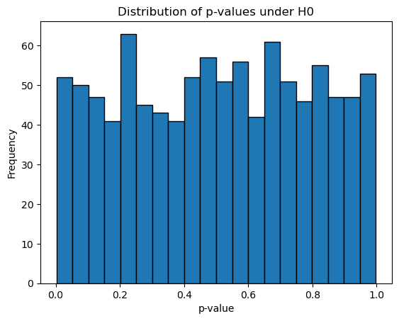
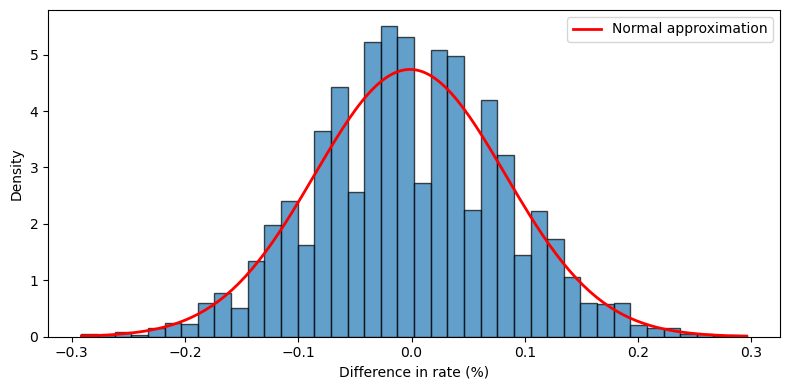

# 순열검정 시연 (코드)

## 개요

순열검정은 관측된 검정통계량을 자료를 무작위로 재라벨링했을 때의 분포와 비교하여 통계적 유의성을 평가한다. 모수적 검정과 달리 자료의 기저 분포에 대해 아무 가정도 하지 않는다. 이 페이지에서는 세 가지 순열검정을 시연한다. 평균차에 대한 이표본 검정, 일원분산분석에 대응하는 다집단 검정, 그리고 A/B 검정 맥락에서 두 비율을 비교하는 검정이다.

## 이표본 순열검정

두 표본 $x_1, \ldots, x_m$과 $y_1, \ldots, y_n$이 주어졌을 때

$$
H_0\colon F_X = F_Y \quad \text{대} \quad H_1\colon F_X \neq F_Y
$$

을 검정한다. 검정통계량은 평균차 $T_{\text{obs}} = \bar x - \bar y$이다. $H_0$ 아래에서 집단 라벨이 교환 가능하므로

1. $m + n$개 관측을 모두 **합친다**.
2. 합친 자료를 **섞어** 앞의 $m$개를 집단 $X$에, 나머지를 집단 $Y$에 배정한다.
3. 각 순열에 대해 $T^{(\pi)} = \bar x^{(\pi)} - \bar y^{(\pi)}$를 **계산한다**.
4. 양측 **$p$값**은

$$
p = \frac{\#\bigl\{b : |T^{(\pi_b)}| \ge |T_{\text{obs}}|\bigr\} + 1}{B + 1}
$$

```python
import numpy as np

def perm_test_two_sample(x, y, n_perm=9999, rng=None):
    """Two-sample permutation test for a difference of means."""
    rng = rng or np.random.default_rng(0)
    obs_diff = x.mean() - y.mean()
    pooled = np.concatenate([x, y])
    m = len(x)
    P = np.array([rng.permutation(pooled) for _ in range(n_perm)])
    perm_diffs = P[:, :m].mean(axis=1) - P[:, m:].mean(axis=1)
    p_value = ((np.abs(perm_diffs) >= abs(obs_diff)).sum() + 1) / (n_perm + 1)
    return obs_diff, p_value, perm_diffs
```

## 다집단 순열검정

크기 $n_1, \ldots, n_k$인 $k$개 집단에 대해, 분산분석에 대응하는 순열검정은 **집단평균들의 분산**을 검정통계량으로 쓴다.

$$
T = \text{Var}(\bar x_1, \bar x_2, \ldots, \bar x_k)
$$

$H_0$(모든 집단의 분포가 동일) 아래에서 집단 라벨을 섞어도 이 통계량이 체계적으로 변하지 않는다. $T$가 클수록 집단 간 차이가 크다는 뜻이므로 $p$값은 단측이다.

$$
p = \frac{\#\bigl\{b : T^{(\pi_b)} \ge T_{\text{obs}}\bigr\} + 1}{B + 1}
$$

```python
def perm_test_multi_group(groups, n_perm=9999, rng=None):
    """Multi-group permutation test using the variance of group means."""
    rng = rng or np.random.default_rng(0)
    pooled = np.concatenate(groups)
    sizes = [len(g) for g in groups]
    obs_var = np.var([g.mean() for g in groups])

    perm_vars = np.empty(n_perm)
    for i in range(n_perm):
        p = rng.permutation(pooled)
        idx, means = 0, []
        for s in sizes:
            means.append(p[idx:idx + s].mean())
            idx += s
        perm_vars[i] = np.var(means)

    p_value = ((perm_vars >= obs_var).sum() + 1) / (n_perm + 1)
    return obs_var, p_value, perm_vars
```

## 비율에 대한 순열검정

이진 결과(전환 여부)를 갖는 A/B 검정에서, 집단 A는 $n_A$명 중 $c_A$명이 전환하고 집단 B는 $n_B$명 중 $c_B$명이 전환했다. 관측된 전환율 차이는

$$
T_{\text{obs}} = \frac{c_A}{n_A} - \frac{c_B}{n_B}
$$

이다. 길이 $n_A + n_B$의 이진 벡터에 $c_A + c_B$개의 $1$(총 전환 수)을 넣고 섞은 뒤 나눈다.

```python
def perm_test_proportion(n_a, conv_a, n_b, conv_b, n_perm=9999, rng=None):
    """Permutation test for two proportions (A/B test)."""
    rng = rng or np.random.default_rng(0)
    obs_diff = conv_a / n_a - conv_b / n_b
    pooled = np.zeros(n_a + n_b)
    pooled[:conv_a + conv_b] = 1

    perm_diffs = np.empty(n_perm)
    for i in range(n_perm):
        p = rng.permutation(pooled)
        perm_diffs[i] = p[:n_a].mean() - p[n_a:].mean()

    p_value = ((np.abs(perm_diffs) >= abs(obs_diff)).sum() + 1) / (n_perm + 1)
    return obs_diff, p_value, perm_diffs
```

## 실행 예제

```python
rng_data = np.random.default_rng(11)
rng = np.random.default_rng(3)
```

### 이표본: 페이지 체류시간

두 웹페이지를 비교한다. 페이지 A는 $N(120, 30^2)$에서 $n = 36$개, 페이지 B는 $N(135, 30^2)$에서 $n = 40$개이다.

```python
page_a = rng_data.normal(120, 30, size=36)
page_b = rng_data.normal(135, 30, size=40)
diff, p, perms = perm_test_two_sample(page_a, page_b, rng=rng)
print(page_a.mean(), page_b.mean(), diff, p)
# 116.80  139.14  -22.34  0.0006
```

출력:

```
116.80039289004895 139.1365870469421 -22.336194156893157 0.0006
```

Welch $t$ 검정은 $p = 0.0003$을 준다. 두 방법 모두 $15$단위 이동을 확실히 탐지한다.

### 다집단: 네 개의 처치군

각 $30$개 관측을 갖는 네 집단을 평균 $160, 170, 155, 180$, 표준편차 $25$인 정규분포에서 생성한다.

```python
groups = [rng_data.normal(mu, 25, 30) for mu in [160, 170, 155, 180]]
var_obs, p_multi, perm_vars = perm_test_multi_group(groups, rng=rng)
print([round(g.mean(), 2) for g in groups], var_obs, p_multi)
# [159.29, 172.22, 160.02, 175.48]  51.759  0.0140
```

출력:

```
[159.29, 172.22, 160.02, 175.48] 51.75863218978212 0.014
```

일원분산분석은 $F = 3.715$, $p = 0.0135$를 준다. 순열검정의 $0.0140$과 사실상 같다.

### 비율: 전환율

대조군은 $23{,}739$명 중 $200$명 전환, 처치군은 $22{,}588$명 중 $182$명 전환이다.

```python
diff_ab, p_ab, perms_ab = perm_test_proportion(23739, 200, 22588, 182, rng=rng)
print(diff_ab)      # 0.000368
```

출력:

```
0.0003675791182059275
```

전환율 차이 $0.0368$%p는 유의하지 않다. Fisher 정확검정이 $p = 0.6811$, 카이제곱 검정이 $p = 0.6996$을 준다.

## 해석

- **이표본 검정**은 두 페이지 집단 사이의 $15$단위 이동을 탐지한다. $p$값이 작으며 이표본 $t$ 검정과 일관된다.
- **다집단 검정**은 네 집단 평균이 모두 같지는 않음을 식별한다. 평균들의 분산 통계량은 분산분석의 $F$ 통계량에 대응한다.
- **비율 검정**은 이 자료에서 큰 $p$값을 주어 전환율에 유의한 차이가 없음을 나타낸다. 독립성에 대한 카이제곱 검정과 일관된다.

순열검정은 교환가능성이라는 귀무가설이 성립하는 한 유한표본에서 제1종 오류율을 정확히 $\alpha$로 통제한다는 의미에서 정확하다. 연속자료에서는 동점이 무시할 수준이므로 순열분포가 이산이지만 연속 귀무분포를 근사할 만큼 조밀하다.

## 연습문제

<div class="drillbox" markdown>

**연습문제 1.** 같은 $N(0,1)$ 분포에서 크기 $50$인 표본 두 개를 생성하라. 이표본 순열검정을 수행하고 $p$값을 기록하라. 이를 $1000$번 반복하고 $p$값의 히스토그램을 그려라. 귀무가설 아래에서 $p$값은 어떤 분포를 따라야 하는가?

</div>

??? success "풀이"

    ```python
    import numpy as np
    import matplotlib.pyplot as plt
    rng = np.random.default_rng(0)

    pvals = []
    for _ in range(1000):
        x = rng.normal(0, 1, 50)
        y = rng.normal(0, 1, 50)
        _, p, _ = perm_test_two_sample(x, y, n_perm=999, rng=rng)
        pvals.append(p)

    plt.hist(pvals, bins=20, edgecolor='k')
    plt.xlabel('p-value'); plt.ylabel('Frequency')
    plt.title('Distribution of p-values under H0')
    plt.show()
    ```

    

    귀무가설 아래에서 $p$값은 $\text{Uniform}(0, 1)$ 분포를 따른다. 히스토그램은 $[0, 1]$ 구간에서 대략 평평해야 한다. $H_0$ 아래에서 관측된 검정통계량은 순열분포에서 뽑은 또 하나의 값에 불과하므로, 그것이 순열값들의 임의의 비율 $\alpha$를 넘을 확률이 정확히 $\alpha$이기 때문이다. $\square$

    **엄밀히 말하면 이산 균등분포이다.** $B = 999$이면 $p$값이 $\{1/1000, 2/1000, \ldots, 1\}$의 $1000$개 값만 취할 수 있다. 이 값들 위에서 균등하며, $B \to \infty$에서 연속 균등분포로 수렴한다.

    **이 성질이 왜 중요한가.** $p$값이 균등분포라는 것은 제1종 오류 통제와 **동치**이다.

    $$
    P(p \le \alpha) = \alpha \quad \Longleftrightarrow \quad \text{크기 } \alpha \text{인 검정}
    $$

    따라서 히스토그램 그리기는 검정이 올바르게 구현되었는지 확인하는 가장 좋은 진단법이다. 히스토그램이 왼쪽으로 쏠려 있으면 검정이 과도하게 기각하고 있고(제1종 오류 부풀림), 오른쪽으로 쏠려 있으면 지나치게 보수적이다.

    이 진단은 다른 상황으로 그대로 확장된다. [기초](./foundations.md) 연습문제 1에서 이분산·불균형 표본의 순열검정이 이 균등성을 잃는 것을 보았다.

<div class="drillbox" markdown>

**연습문제 2.** 양측 순열 $p$값이 $H_0$ 아래에서 모든 $\alpha \in (0,1)$에 대해 $P(p \le \alpha) \le \alpha$를 만족함을 증명하라. (이것이 순열검정이 제1종 오류율을 통제한다는 사실을 확립한다.)

</div>

??? success "풀이"

    $T_0 = T_{\text{obs}}$라 하고 $T_1, T_2, \ldots, T_B$를 순열된 검정통계량이라 하자. $H_0$ 아래에서 모든 순열이 동등하게 가능하므로 $T_0, T_1, \ldots, T_B$는 **교환 가능**하다.

    **$p$값의 정의에 $+1$ 보정이 반드시 들어가야 한다.**

    $$
    p = \frac{\#\{b : |T_b| \ge |T_0|\} + 1}{B + 1}
    $$

    확장된 집합 $\{|T_0|, |T_1|, \ldots, |T_B|\}$를 생각한다. 교환가능성에 의해 $|T_0|$는 이 $B+1$개 값 중 어떤 순위든 같은 확률로 차지한다. $R$을 내림차순 순위($|T_0|$가 가장 크면 $R = 1$)라 하면 $R$은 $\{1, \ldots, B+1\}$ 위에서 균등분포이다.

    동점이 없으면 $\#\{b : |T_b| \ge |T_0|\} = R - 1$이므로 $p = R/(B+1)$이고

    $$
    P(p \le \alpha) = P\!\left(R \le \alpha(B+1)\right) = \frac{\lfloor \alpha(B+1) \rfloor}{B+1} \le \alpha
    $$

    이다. 동점이 있으면 $\#\{b : |T_b| \ge |T_0|\} \ge R - 1$이므로 $p$가 더 커지고 부등식이 유지된다. $\square$

    !!! warning "$+1$을 빼면 증명이 무너진다"
        $p = \#\{b : |T_b| \ge |T_0|\}/B$로 정의하면 위 논증이 성립하지 않는다. 이 정의에서 $|T_0|$가 모든 순열값보다 크면 $p = 0$이 되는데, $P(p \le \alpha)$가 $\alpha$보다 커질 수 있다.

        구체적으로 $R = 1$일 확률이 $1/(B+1)$이고 그때 $p = 0 \le \alpha$이다. $\alpha$가 아주 작으면($\alpha < 1/(B+1)$) $P(p \le \alpha) \ge 1/(B+1) > \alpha$가 되어 통제가 깨진다.

        [대응 순열검정](./paired.md) 연습문제 3에서 $B = 199$, $\alpha = 0.05$일 때 보정 없는 정의의 제1종 오류율이 $0.0512$로 명목값을 넘고, 보정하면 $0.0458$로 내려가는 것을 수치로 확인했다.

        $(B+1)\alpha$가 정수가 되도록 $B$를 고르면($\alpha = 0.05$에서 $B = 199, 999, 9999$) 위 부등식이 등식이 되어 검정이 $\alpha$ 수준을 정확히 달성한다.

<div class="drillbox" markdown>

**연습문제 3.** 다집단 검정이 단측 $p$값을 쓰는($T^{(\pi)} \ge T_{\text{obs}}$만 세는) 반면 이표본 검정이 양측 $p$값을 쓰는 이유를 설명하라.

</div>

??? success "풀이"

    이표본 검정통계량은 평균의 *차이* $\bar x - \bar y$로, 양수일 수도 음수일 수도 있다. 대립가설 아래에서 차이는 어느 방향으로든 갈 수 있다(집단 $X$의 평균이 클 수도 작을 수도 있다). 따라서 $|T^{(\pi)}| \ge |T_{\text{obs}}|$인 순열을 세는 양측검정을 쓴다.

    다집단 검정통계량은 집단평균들의 *분산*으로, 항상 음이 아니다. $H_0$ 아래에서 모든 집단평균이 비슷하므로 $T$가 작다. 대립가설 아래에서(적어도 한 집단이 다르면) $T$가 커진다. 분산에는 "음의 방향"이라는 개념이 없다. 따라서 큰 $T$만이 $H_0$에 반하는 증거이며 $T^{(\pi)} \ge T_{\text{obs}}$를 세는 단측 $p$값을 쓴다. $\square$

    **더 일반적인 원리.** 검정통계량이 대립가설의 방향과 어떻게 대응하는지가 기준이다.

    | 통계량 | 귀무가설 아래 | 대립가설 아래 | $p$값 |
    |:---|:---|:---|:---|
    | $\bar x - \bar y$ | $0$ 근처 | 양이나 음 | 양측($|\cdot|$) |
    | $\text{Var}(\bar x_1, \ldots, \bar x_k)$ | 작다 | 크다 | 단측(위쪽) |
    | $F$ 통계량 | $1$ 근처 | 크다 | 단측(위쪽) |
    | $\chi^2$ 통계량 | 작다 | 크다 | 단측(위쪽) |
    | $\log(s_1^2/s_2^2)$ | $0$ 근처 | 양이나 음 | 양측($|\cdot|$) |

    분산분석의 $F$ 통계량과 여기서 쓴 평균들의 분산은 사실상 같은 정보를 담는다. 실행 예제에서 두 $p$값이 $0.0140$과 $0.0135$로 일치한 이유이다.

    **차이가 나는 지점.** 집단 크기가 다르면 두 통계량이 달라진다. $\text{Var}(\bar x_i)$는 각 집단평균을 똑같이 취급하지만 $F$ 통계량은 집단 크기로 가중한다. 불균형 설계에서는 가중된 버전

    $$
    T = \sum_{i=1}^k n_i(\bar x_i - \bar x)^2
    $$

    을 쓰는 것이 낫다. 이는 분산분석의 집단간 제곱합과 정확히 같다.

<div class="drillbox" markdown>

**연습문제 4.** 전환율 예제는 $23{,}739$명과 $22{,}588$명을 쓴다. 이렇게 표본이 크면 중심극한정리에 의해 순열분포가 정규분포에 가까울 것이다. 순열된 차이들의 히스토그램에 정규밀도를 겹쳐 그려 경험적으로 확인하라.

</div>

??? success "풀이"

    ```python
    import numpy as np
    import matplotlib.pyplot as plt
    from scipy import stats
    rng = np.random.default_rng(1)

    diff_ab, p_ab, perms_ab = perm_test_proportion(23739, 200, 22588, 182,
                                                   n_perm=5000, rng=rng)
    mu, sigma = perms_ab.mean(), perms_ab.std()

    fig, ax = plt.subplots(figsize=(8, 4))
    ax.hist(perms_ab * 100, bins=40, density=True, alpha=0.7, edgecolor='k')
    x = np.linspace(perms_ab.min() * 100, perms_ab.max() * 100, 200)
    ax.plot(x, stats.norm.pdf(x, mu * 100, sigma * 100), 'r-', lw=2,
            label='Normal approximation')
    ax.set_xlabel('Difference in rate (%)')
    ax.set_ylabel('Density')
    ax.legend()
    plt.tight_layout()
    plt.show()
    ```

    

    정규밀도가 히스토그램과 잘 맞아, 표본이 클 때 순열분포가 근사적으로 정규임을 확인한다. 표본비율의 차이에 적용된 중심극한정리의 결과이다. $\square$

    **정확한 이론값과 비교할 수 있다.** 순열분포는 초기하분포에서 정확히 유도된다([기초](./foundations.md) 연습문제 4). 처치군의 전환 수를 $X$라 하면 $X \sim \text{Hypergeometric}(46327, 382, 22588)$이고

    $$
    E[X] = \frac{382 \times 22588}{46327} = 186.26, \qquad
    \text{Var}(X) = n\frac{K}{N}\Bigl(1-\frac{K}{N}\Bigr)\frac{N-n}{N-1} = 94.66
    $$

    이다. 전환율 차이로 환산하면 표준편차가

    $$
    \text{sd}(T) = \text{sd}(X)\Bigl(\frac{1}{n_B} + \frac{1}{n_A}\Bigr) = 9.729 \times 8.640\times10^{-5} = 8.41\times10^{-4}
    $$

    이다. 모의실험에서 얻은 `perms_ab.std()`가 이 값과 일치해야 한다.

    **정규 근사가 좋은 이유와 한계.** 여기서는 $E[X] = 186$으로 충분히 크지만, 이진 자료의 정규 근사는 기대 셀 도수가 작으면 무너진다. 경험칙은 모든 기대 셀 도수가 $5$ 이상이어야 한다는 것이다.

    이 예제는 전환 수 $382$가 전체 $46{,}327$의 $0.8$%에 불과하므로 **희귀사건**에 가깝다. 그럼에도 절대 개수가 크므로 정규 근사가 작동한다. 전환이 $10$건 정도였다면 Poisson 근사나 정확검정을 써야 한다.

<div class="drillbox" markdown>

**연습문제 5.** 처치 전후로 측정된 $n$명의 대응 실험을 생각하자. 대응 구조를 존중하는 순열검정을 설계하라. (힌트: 각 피험자에 대해 차이 $d_i = x_i^{\text{after}} - x_i^{\text{before}}$의 부호를 무작위로 뒤집는다.) 검정을 구현하고 `before = [82, 78, 91, 85, 73]`, `after = [88, 82, 95, 89, 78]`에 적용하라.

</div>

??? success "풀이"

    $H_0$(처치 효과 없음) 아래에서 각 차이 $d_i$는 양수일 확률과 음수일 확률이 같다. 부호를 무작위로 뒤집는다.

    $n = 5$이므로 $2^5 = 32$가지 부호 배정을 **모두 열거**할 수 있다. 몬테카를로를 쓸 이유가 없다.

    ```python
    import numpy as np, itertools
    from scipy import stats

    def paired_perm_exact(before, after):
        d = np.asarray(after) - np.asarray(before)
        n = len(d)
        S = np.array(list(itertools.product([1, -1], repeat=n)))
        m = (S * d).mean(axis=1)
        count = (np.abs(m) >= abs(d.mean()) - 1e-12).sum()
        return d.mean(), count, len(m), count / len(m)

    before = [82, 78, 91, 85, 73]
    after  = [88, 82, 95, 89, 78]
    print(paired_perm_exact(before, after))
    # (4.6, 2, 32, 0.0625)
    print(stats.ttest_rel(after, before))       # t = 11.5,  p = 0.00033
    print(stats.wilcoxon(np.array(after) - np.array(before), method='exact'))
    # W = 0.0,  p = 0.0625
    ```

    출력:

    ```
    (4.6, 2, 32, 0.0625)
    TtestResult(statistic=11.5, pvalue=0.00032642125636699325, df=4)
    WilcoxonResult(statistic=0.0, pvalue=0.0625)
    ```

    차이는 $d = (6, 4, 4, 4, 5)$이고 평균은 $4.6$이다.

    | 검정 | 통계량 | $p$값 |
    |:---|---:|---:|
    | 부호 뒤집기 순열(정확) | $\bar{d} = 4.6$ | **0.0625** |
    | Wilcoxon 부호순위(정확) | $W = 0$ | **0.0625** |
    | 대응 $t$ 검정 | $t = 11.5$ | 0.00033 |

    **순열 $p$값이 $t$ 검정의 $190$배이다.** 그리고 $\alpha = 0.05$에서 **기각하지 못한다**.

    **왜 그런가.** 다섯 차이가 모두 양수이므로, $|\bar{d}^*| \ge 4.6$을 만족하는 부호 배정은 관측된 배정과 그것을 전부 뒤집은 배정, 단 두 개뿐이다. 따라서

    $$
    p = \frac{2}{32} = 0.0625
    $$

    이고 이것이 $n = 5$에서 **가능한 최소 $p$값**이다. 자료가 지금보다 백 배 극단적이어도 이보다 작아질 수 없다.

    **$t$ 검정의 $p = 0.00033$을 믿어서는 안 된다.** $t = 11.5$라는 극단적인 값은 차이의 표준편차가 $0.894$로 매우 작기 때문에 나온 것이며, $t_4$ 분포의 매끄러운 꼬리가 이를 그대로 확률로 환산한다. 그러나 자료가 실제로 담고 있는 증거의 최대치는 "다섯 명 모두 증가했다"이며, 그것이 우연일 확률이 $2/32$이다.

    !!! danger "설계 단계의 교훈"
        $n = 5$인 대응 실험은 **비모수 검정으로 $\alpha = 0.05$에서 기각할 수 없다**. 이는 표본이 작아 검정력이 낮다는 이야기가 아니라, 기각이 원리적으로 불가능하다는 이야기이다.

        | 대응 $n$ | 최소 양측 $p$값 |
        |---:|---:|
        | 5 | 0.0625 |
        | 6 | 0.0313 |
        | 8 | 0.0078 |

        실험을 설계하기 전에 이 표를 확인해야 한다. 비모수 분석을 계획하고 있다면 $n \ge 6$이 최소 요건이고, $\alpha = 0.01$을 쓴다면 $n \ge 8$이다.

        모수적 검정을 쓸 계획이라면 이 제약이 없지만, 그 대신 $n = 5$에서 정규성 가정을 자료로 검증할 방법이 없다는 문제를 안게 된다.
