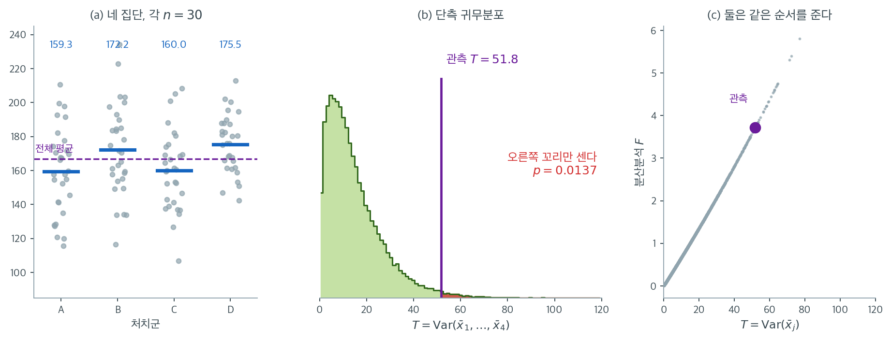
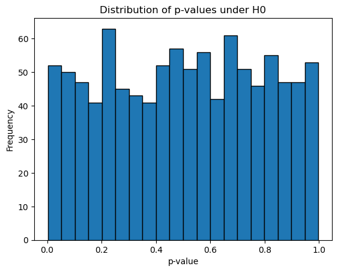
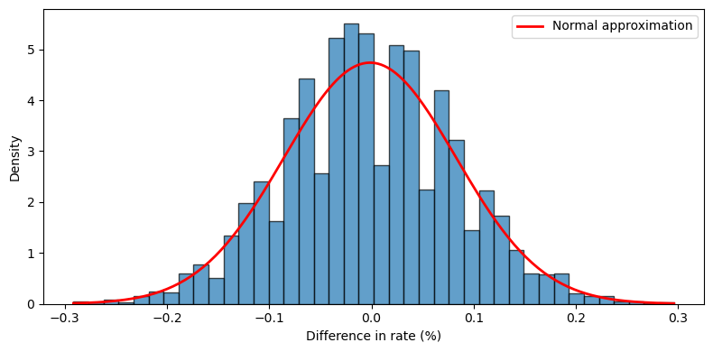

# 순열검정 시연 (코드)

## 개요

순열검정은 관측된 검정통계량을 자료를 무작위로 재라벨링했을 때의 분포와 비교하여 통계적 유의성을 평가한다. 모수적 검정과 달리 자료의 기저 분포에 대해 아무 가정도 하지 않는다. 이 페이지에서는 세 가지 순열검정을 시연한다. 평균차에 대한 이표본 검정, 일원분산분석에 대응하는 다집단 검정, 그리고 A/B 검정 맥락에서 두 비율을 비교하는 검정이다.

## 이표본 순열검정

두 표본 $x_1, \ldots, x_m$과 $y_1, \ldots, y_n$이 주어졌을 때

$$
H_0\colon F_X = F_Y \quad \text{대} \quad H_1\colon F_X \neq F_Y
$$

을 검정한다. 검정통계량은 평균차 $T_{\text{obs}} = \bar x - \bar y$이다. $H_0$ 아래에서 집단 라벨이 교환 가능하므로

1. $m + n$개 관측을 모두 **합친다**.
2. 합친 자료를 **섞어** 앞의 $m$개를 집단 $X$에, 나머지를 집단 $Y$에 배정한다.
3. 각 순열에 대해 $T^{(\pi)} = \bar x^{(\pi)} - \bar y^{(\pi)}$를 **계산한다**.
4. 양측 **$p$값**은

$$
p = \frac{\#\bigl\{b : |T^{(\pi_b)}| \ge |T_{\text{obs}}|\bigr\} + 1}{B + 1}
$$

<div class="exbox" markdown>

**보기 1.** <span class="diff easy" title="쉬움"></span> 이표본 순열검정의 구현. 위 절차를 그대로 옮긴 `perm_test_two_sample`을 쓰기 전에, **답을 손으로 아는 작은 자료**로 검산한다. $x = (1, 2, 3)$, $y = (4, 5, 6)$을 쓴다.

**(1)** $\binom63 = 20$가지 라벨 배정을 손으로 따져 $\lvert T^{(\pi)}\rvert \ge \lvert T_{\text{obs}}\rvert$인 배정의 수를 세고 정확 $p$값을 분수로 구하시오. 순열 귀무분포의 표준편차도 닫힌 꼴로 구하시오.

**(2)** 함수를 큰 $B$로 돌려 (1)의 두 수를 되찾아 오는지 확인하시오. $B$를 아무리 키워도 $p$값이 (1)의 분수에 **정확히** 닿지는 못하는 까닭도 적으시오.

</div>

??? success "풀이"

    **(1) 해석적으로.** 여섯 수가 $1, \ldots, 6$이고 $T = 21$이다. 집단 $X$로 간 세 수의 합을 $S$라 하면

    $$
    T^{(\pi)} = \frac{S}{3} - \frac{21 - S}{3} = \frac{2S - 21}{3}
    $$

    이므로 $\lvert T^{(\pi)}\rvert \ge 3$은 $\lvert 2S - 21\rvert \ge 9$, 곧 $S \le 6$ 또는 $S \ge 15$와 같다. $S$는 $1$부터 $6$ 중 셋을 더한 값이므로 $6$부터 $15$까지이고, $S = 6$은 $\{1,2,3\}$ 하나뿐, $S = 15$는 $\{4,5,6\}$ 하나뿐이다. 따라서

    $$
    p_{\text{정확}} = \frac{2}{20} = \frac{1}{10} = 0.1
    $$

    **관측된 배정이 가장 극단적이다.** 두 집단이 완전히 갈라져 있는데도 $p$가 $0.1$이니 $\alpha = 0.05$에서 기각할 수 없다. $n_1 = n_2 = 3$에서 가능한 최소 양측 $p$값이 $2/20$이기 때문이다.

    표준편차는 [이표본 순열검정](two_sample.md) 보기 1에서 유도한 식을 그대로 쓴다. $S^2$를 합친 여섯 수의 표본분산 $3.5$라 하면

    $$
    \operatorname{SD}(T^{(\pi)}) = S\sqrt{\frac{1}{3} + \frac{1}{3}} = \sqrt{3.5 \times \frac23} = \sqrt{\frac73} = 1.5275252
    $$

    **(2) 수치적으로.** 함수는 이렇다.

    ```python
    import numpy as np

    def perm_test_two_sample(x, y, n_perm=9999, rng=None):
        """평균 차이에 대한 이표본 순열검정.

        두 집단을 합친 뒤 이름표를 섞어 차이를 다시 계산하는 일을 되풀이한다.
        분포를 가정하지 않으므로 정규성도 등분산도 필요 없다.
        """
        rng = rng or np.random.default_rng(0)
        obs_diff = x.mean() - y.mean()
        pooled = np.concatenate([x, y])
        m = len(x)
        P = np.array([rng.permutation(pooled) for _ in range(n_perm)])
        perm_diffs = P[:, :m].mean(axis=1) - P[:, m:].mean(axis=1)
        p_value = ((np.abs(perm_diffs) >= abs(obs_diff)).sum() + 1) / (n_perm + 1)
        return obs_diff, p_value, perm_diffs
    ```

    작은 자료로 검산한다.

    ```python
    import itertools
    from fractions import Fraction

    x = np.array([1.0, 2.0, 3.0])
    y = np.array([4.0, 5.0, 6.0])
    z = np.concatenate([x, y])

    # 20 가지를 모두 열거한다.
    exact = np.array([z[list(c)].mean() - np.delete(z, list(c)).mean()
                      for c in itertools.combinations(range(6), 3)])
    hit = int((np.abs(exact) >= 3 - 1e-12).sum())
    print(f"순열 수 = {len(exact)},  극단 배정 = {hit},  "
          f"정확 p = {Fraction(hit, len(exact))} = {hit / len(exact):.4f}")
    print(f"SD 열거 = {exact.std():.7f},  닫힌 꼴 = "
          f"{z.std(ddof=1) * np.sqrt(1 / 3 + 1 / 3):.7f}")

    for B in (999, 9_999, 99_999):
        obs, p, perms = perm_test_two_sample(x, y, n_perm=B,
                                             rng=np.random.default_rng(0))
        print(f"B = {B:>6}:  obs = {obs:+.1f},  p = {p:.6f},  "
              f"SD = {perms.std(ddof=1):.7f},  p 의 눈금 = 1/{B + 1}")
    ```

    출력:

    ```
    순열 수 = 20,  극단 배정 = 2,  정확 p = 1/10 = 0.1000
    SD 열거 = 1.5275252,  닫힌 꼴 = 1.5275252
    B =    999:  obs = -3.0,  p = 0.103000,  SD = 1.5101673,  p 의 눈금 = 1/1000
    B =   9999:  obs = -3.0,  p = 0.102000,  SD = 1.5301857,  p 의 눈금 = 1/10000
    B =  99999:  obs = -3.0,  p = 0.100650,  SD = 1.5315233,  p 의 눈금 = 1/100000
    ```

    **(1)의 두 수가 맞는다.** 열거한 표준편차와 닫힌 꼴이 일곱 자리까지 같고, 극단 배정이 $20$개 중 $2$개라 정확 $p$가 $1/10$이다. 함수의 $p$값은 $B$가 커지면서 $0.1030 \to 0.1020 \to 0.10065$로 $0.1$에 모여든다. $B = 99{,}999$에서 몬테카를로 표준편차가 $\sqrt{0.1 \times 0.9/10^5} = 0.00095$이고 실제 차이가 $0.00065$이니 그 $0.68$배로 제자리다. 표준편차도 $1.5315233$으로 닫힌 꼴에서 $0.004$ 떨어져 있는데, 표준편차 추정의 몬테카를로 오차 $1.5275/\sqrt{2B} = 0.0034$의 $1.2$배다.

    **그럼에도 정확히 $1/10$이 되지는 않는다.** 함수의 $\hat p$는 $\dfrac{c+1}{B+1}$이라 분모가 $B+1$인 분수만 취할 수 있는데, $B = 999$면 $1/1000$ 눈금이라 $0.1$이 표현 가능하지만 $B = 9999$면 $1000.0/10000$이 되어야 하므로 $c = 999$를 정확히 맞출 확률은 작다. **몬테카를로는 열거를 흉내 낼 뿐 대신하지 못한다.** $\binom63 = 20$처럼 셀 수 있는 크기에서는 세는 것이 옳다.

## 다집단 순열검정

크기 $n_1, \ldots, n_k$인 $k$개 집단에 대해, 분산분석에 대응하는 순열검정은 **집단평균들의 분산**을 검정통계량으로 쓴다.

$$
T = \text{Var}(\bar x_1, \bar x_2, \ldots, \bar x_k)
$$

$H_0$(모든 집단의 분포가 동일) 아래에서 집단 라벨을 섞어도 이 통계량이 체계적으로 변하지 않는다. $T$가 클수록 집단 간 차이가 크다는 뜻이므로 $p$값은 단측이다.

$$
p = \frac{\#\bigl\{b : T^{(\pi_b)} \ge T_{\text{obs}}\bigr\} + 1}{B + 1}
$$

<div class="exbox" markdown>

**보기 2.** <span class="diff easy" title="쉬움"></span> 다집단 순열검정의 구현. `perm_test_multi_group`이 쓰는 통계량 $T = \operatorname{Var}(\bar x_1, \ldots, \bar x_k)$를 집단 크기가 모두 $n_g$인 경우에 따진다($N = k n_g$).

**(1)** $T = \dfrac{SSB}{N}$임을 보이고, 순열 귀무분포에서 $E[T]$를 합친 표본의 분산 $S^2$으로 적으시오.

**(2)** 집단이 $\{1,2\}$, $\{3,4\}$, $\{5,6\}$인 작은 자료에서 $6! = 720$가지를 모두 열거해 (1)과 정확 $p$값을 확인하고, 함수의 $p$값과 견주시오.

</div>

??? success "풀이"

    **(1) 해석적으로.** 집단 크기가 모두 같으면 집단평균들의 평균이 전체평균 $\bar x$와 같다. 따라서 $T$는 그냥

    $$
    T = \frac1k \sum_{i=1}^k (\bar x_i - \bar x)^2
    $$

    이고, 분산분석의 집단간제곱합이 $SSB = n_g \sum_i (\bar x_i - \bar x)^2$이므로

    $$
    T = \frac{SSB}{k\, n_g} = \frac{SSB}{N}
    $$

    이다. **$T$는 $SSB$를 상수로 나눈 것일 뿐이다.** 순열이 $\bar x$도 $SST$도 바꾸지 않으므로 $F = \dfrac{SSB/(k-1)}{(SST - SSB)/(N-k)}$ 역시 $SSB$의 순증가함수이고, 그래서 $T$로 매긴 순위와 $F$로 매긴 순위가 같다(뒤의 그림 (c)가 그것이다).

    **$E[T]$.** 순열 아래에서 한 집단은 $N$개 중 $n_g$개를 비복원으로 고른 것이므로 $E[\bar x_i^{*}] = \bar x$이고

    $$
    \operatorname{Var}(\bar x_i^{*}) = \frac{S^2}{n_g}\cdot\frac{N - n_g}{N}
    = \frac{S^2}{n_g}\cdot\frac{k-1}{k}
    $$

    이다($S^2$은 합친 $N$개의 표본분산). $\bar x$가 고정이므로 기댓값을 항별로 취해

    $$
    E[T] = \frac1k\sum_{i=1}^k E\big[(\bar x_i^{*} - \bar x)^2\big]
    = \operatorname{Var}(\bar x_1^{*})
    = \frac{(k-1)\,S^2}{k\,n_g}
    = \frac{(k-1)\,S^2}{N}
    $$

    를 얻는다. 양변에 $N$을 곱하면 $E[SSB] = (k-1)S^2$으로, **분산분석이 $\sigma^2$에 대해 말하는 것과 같은 식**이다. 모집단 분산 자리에 합친 표본의 분산이 들어간 것만 다르다.

    **(2) 수치적으로.** 함수는 이렇다.

    ```python
    def perm_test_multi_group(groups, n_perm=9999, rng=None):
        """집단평균의 분산을 통계량으로 쓰는 다집단 순열검정.

        분산분석의 F 대신 집단평균들의 분산을 쓴다. 순열검정에서는 통계량이
        어떤 분포를 따라야 할 까닭이 없으므로, 뜻만 통하면 무엇이든 쓸 수 있다.
        집단 차이가 클수록 이 값이 커지므로 오른쪽 꼬리만 본다.
        """
        rng = rng or np.random.default_rng(0)
        pooled = np.concatenate(groups)
        sizes = [len(g) for g in groups]
        obs_var = np.var([g.mean() for g in groups])

        perm_vars = np.empty(n_perm)
        for i in range(n_perm):
            p = rng.permutation(pooled)
            idx, means = 0, []
            for s in sizes:
                means.append(p[idx:idx + s].mean())
                idx += s
            perm_vars[i] = np.var(means)

        p_value = ((perm_vars >= obs_var).sum() + 1) / (n_perm + 1)
        return obs_var, p_value, perm_vars
    ```

    세 집단 $\{1,2\}$, $\{3,4\}$, $\{5,6\}$으로 검산한다.

    ```python
    import itertools
    from fractions import Fraction

    groups = [np.array([1.0, 2.0]), np.array([3.0, 4.0]), np.array([5.0, 6.0])]
    pooled = np.concatenate(groups)
    k, n_g, N = len(groups), 2, len(pooled)

    T_obs = np.var([g.mean() for g in groups])
    SSB = n_g * sum((g.mean() - pooled.mean()) ** 2 for g in groups)
    print(f"T_obs = {T_obs:.7f},   SSB/N = {SSB / N:.7f}")
    print(f"E[T] 닫힌 꼴 (k-1)S^2/N = {(k - 1) * pooled.var(ddof=1) / N:.7f}")

    # 6! = 720 가지 자리 배정을 모두 열거한다.
    Ts = np.array([np.var([a[0:2].mean(), a[2:4].mean(), a[4:6].mean()])
                   for a in (pooled[list(p)] for p in itertools.permutations(range(N)))])
    hit = int((Ts >= T_obs - 1e-12).sum())
    print(f"열거 수 = {len(Ts)},  열거 E[T] = {Ts.mean():.7f},  최댓값 = {Ts.max():.7f}")
    print(f"T* >= T_obs 인 배정 = {hit} -> 정확 p = {Fraction(hit, len(Ts))} = {hit / len(Ts):.6f}")

    for B in (999, 9999):
        tv, p, pv = perm_test_multi_group(groups, n_perm=B, rng=np.random.default_rng(0))
        print(f"B = {B:>5}: p = {p:.6f},  평균 T* = {pv.mean():.7f}")
    ```

    출력:

    ```
    T_obs = 2.6666667,   SSB/N = 2.6666667
    E[T] 닫힌 꼴 (k-1)S^2/N = 1.1666667
    열거 수 = 720,  열거 E[T] = 1.1666667,  최댓값 = 2.6666667
    T* >= T_obs 인 배정 = 48 -> 정확 p = 1/15 = 0.066667
    B =   999: p = 0.066000,  평균 T* = 1.1281281
    B =  9999: p = 0.070300,  평균 T* = 1.1686835
    ```

    **(1)의 두 식이 모두 맞는다.** $T_{\text{obs}}$와 $SSB/N$이 일곱 자리까지 같고, 닫힌 꼴 $E[T] = (k-1)S^2/N = 2 \times 3.5/6 = 7/6$이 $720$가지의 평균과 정확히 일치한다.

    **관측값이 최댓값이다.** $T^{*}$의 최댓값이 $8/3$으로 $T_{\text{obs}}$와 같다. 세 집단이 완전히 갈라진 배정이 가장 극단적이기 때문이다. 그런 배정은 집단의 **순서만 다른** $3! = 6$가지와 각 집단 안의 자리바꿈 $2^3 = 8$가지를 곱해 $48$가지이므로 정확 $p = 48/720 = 1/15 = 0.0667$이다. **$\alpha = 0.05$에서는 이 설계로 기각할 수 없다.**

    함수의 $p$값은 $0.0660$과 $0.0703$으로 $1/15 = 0.0667$ 둘레에 있다. $B = 9{,}999$에서 몬테카를로 표준편차가 $\sqrt{0.0667 \times 0.9333/9999} = 0.0025$이니 $0.0703$은 $+1.4$ 표준편차다. 평균 $T^{*}$도 $1.1687$로 닫힌 꼴 $1.1667$에 붙는다.

## 비율에 대한 순열검정

이진 결과(전환 여부)를 갖는 A/B 검정에서, 집단 A는 $n_A$명 중 $c_A$명이 전환하고 집단 B는 $n_B$명 중 $c_B$명이 전환했다. 관측된 전환율 차이는

$$
T_{\text{obs}} = \frac{c_A}{n_A} - \frac{c_B}{n_B}
$$

이다. 길이 $n_A + n_B$의 이진 벡터에 $c_A + c_B$개의 $1$(총 전환 수)을 넣고 섞은 뒤 나눈다.

<div class="exbox" markdown>

**보기 3.** <span class="diff easy" title="쉬움"></span> 비율에 대한 순열검정의 구현. `perm_test_proportion`은 $0/1$ 배열을 섞는다. $n_A = n_B = 5$, $c_A = 4$, $c_B = 1$인 작은 표로 검산한다.

**(1)** 집단 A의 전환 수 $X$만 정해지면 $T^{(\pi)}$가 정해짐을 보이고, $X$가 어떤 분포를 따르는지 적으시오. 그것으로 $\lvert T^{(\pi)}\rvert \ge 0.6$인 $X$의 값을 모두 찾아 정확 $p$값을 기약분수로 구하시오.

**(2)** 함수를 돌려 (1)을 확인하고, 같은 값을 주는 고전적 검정의 이름을 대시오.

</div>

??? success "풀이"

    **(1) 해석적으로.** 순열은 $N = n_A + n_B = 10$개의 $0/1$ 값 가운데 $n_A = 5$개를 골라 A라 부르는 일이고, 전체 전환 수 $K = c_A + c_B = 5$는 고정된다. A로 간 $1$의 개수를 $X$라 하면

    $$
    T^{(\pi)} = \frac{X}{n_A} - \frac{K - X}{n_B}
    = X\left(\frac{1}{n_A} + \frac{1}{n_B}\right) - \frac{K}{n_B}
    = 0.4X - 1
    $$

    로 **$X$의 순증가 일차식**이다. 그리고 $N$개 중 $n_A$개를 비복원으로 고를 때 뽑힌 $1$의 개수는 정의 그대로

    $$
    X \sim \text{HG}(n_A, N, K) = \text{HG}(5, 10, 5)
    $$

    를 따른다. 관측값은 $T_{\text{obs}} = 4/5 - 1/5 = 0.6$이므로

    $$
    \lvert 0.4X - 1 \rvert \ge 0.6
    \iff X \le 1 \;\text{또는}\; X \ge 4
    $$

    이다. $\binom{10}{5} = 252$가지 배정 가운데 해당하는 것을 센다.

    $$
    \#\{X = 0\} = \binom50\binom55 = 1, \quad
    \#\{X = 1\} = \binom51\binom54 = 25
    $$

    이고 대칭으로 $X = 5$가 $1$가지, $X = 4$가 $25$가지다. 따라서

    $$
    p_{\text{정확}} = \frac{1 + 25 + 25 + 1}{252} = \frac{52}{252} = \frac{13}{63} = 0.206349
    $$

    **$5$명 중 $4$명 대 $5$명 중 $1$명이라는 꽤 큰 차이인데도 유의하지 않다.** 표가 너무 작아 가능한 $p$값의 눈금이 거칠기 때문이다.

    **(2) 수치적으로.** 함수는 이렇다.

    ```python
    def perm_test_proportion(n_a, conv_a, n_b, conv_b, n_perm=9999, rng=None):
        """두 비율에 대한 순열검정. A/B 검정에 그대로 쓴다.

        전체 전환 수만큼 1 로 채운 배열을 섞으면, 전환이 두 집단에 무작위로
        흩어진 상태가 된다. 표본이 크거나 전환율이 아주 낮아 정규근사가
        미덥지 않을 때 쓸모가 있다.
        """
        rng = rng or np.random.default_rng(0)
        obs_diff = conv_a / n_a - conv_b / n_b
        pooled = np.zeros(n_a + n_b)
        pooled[:conv_a + conv_b] = 1

        perm_diffs = np.empty(n_perm)
        for i in range(n_perm):
            p = rng.permutation(pooled)
            perm_diffs[i] = p[:n_a].mean() - p[n_a:].mean()

        p_value = ((np.abs(perm_diffs) >= abs(obs_diff)).sum() + 1) / (n_perm + 1)
        return obs_diff, p_value, perm_diffs
    ```

    작은 표로 검산한다.

    ```python
    from scipy import stats
    from fractions import Fraction
    from math import comb

    n_a, c_a, n_b, c_b = 5, 4, 5, 1
    N, K = n_a + n_b, c_a + c_b
    step = 1 / n_a + 1 / n_b
    obs = c_a / n_a - c_b / n_b

    x = np.arange(K + 1)
    d = x * step - K / n_b
    pmf = stats.hypergeom.pmf(x, N, K, n_a)
    sel = np.abs(d) >= abs(obs) - 1e-12
    p_frac = sum(Fraction(comb(K, int(v)) * comb(N - K, n_a - int(v)), comb(N, n_a))
                 for v in x[sel])
    print(f"obs = {obs:.4f},  격자 간격 = {step:.4f},  전체 배정 = C(10,5) = {comb(N, n_a)}")
    print(f"걸리는 X = {x[sel]}")
    print(f"정확 양측 p = {p_frac} = {float(p_frac):.6f}")
    print(f"Fisher 정확검정 = {stats.fisher_exact([[c_a, n_a - c_a], [c_b, n_b - c_b]])[1]:.6f}")
    print(f"SD 닫힌 꼴 = {np.sqrt(N / (N - 1) * (K / N) * (1 - K / N) * step):.7f}")
    for B in (999, 9999):
        _, p, pv = perm_test_proportion(n_a, c_a, n_b, c_b, n_perm=B,
                                        rng=np.random.default_rng(0))
        print(f"B = {B:>5}: p = {p:.6f},  SD = {pv.std(ddof=1):.7f}")
    ```

    출력:

    ```
    obs = 0.6000,  격자 간격 = 0.4000,  전체 배정 = C(10,5) = 252
    걸리는 X = [0 1 4 5]
    정확 양측 p = 13/63 = 0.206349
    Fisher 정확검정 = 0.206349
    SD 닫힌 꼴 = 0.3333333
    B =   999: p = 0.208000,  SD = 0.3358819
    B =  9999: p = 0.203000,  SD = 0.3312704
    ```

    **손으로 센 것이 맞는다.** 걸리는 $X$가 $\{0, 1, 4, 5\}$이고 정확 $p$가 $13/63 = 0.206349$다. 함수의 $p$값 $0.2080$과 $0.2030$이 그 둘레에 있다($B = 9{,}999$에서 몬테카를로 표준편차 $0.0040$의 $0.8$배 안).

    **같은 값을 주는 고전적 검정은 Fisher 정확검정이다.** 자리를 바꾸어 말하면, 이진 자료의 이표본 순열검정은 **Fisher 정확검정을 몬테카를로로 근사하는 것**이다([기초](./foundations.md) 연습문제 4가 큰 자료에서 같은 것을 확인한다). 그러므로 이 함수를 쓸 이유는 하나뿐이다. 통계량을 비율차가 아닌 다른 것으로 바꾸고 싶을 때다.

## 실행 보기

<div class="exbox" markdown>

**보기 4.** <span class="diff easy" title="쉬움"></span> 난수 준비. 아래 실행 보기들은 자료를 만드는 난수 `rng_data`와 순열에 쓰는 난수 `rng`를 **따로** 둔다.

**(1)** 난수를 하나만 쓰면 무엇이 깨지는지 적으시오. 구체적으로, 자료를 만든 뒤 순열검정을 돌리고 **그다음** 자료를 더 만드는 흐름에서 $B$를 바꾸면 어느 자료가 바뀌고 어느 자료가 바뀌지 않는가.

**(2)** $B = 999$와 $B = 9{,}999$로 그 흐름을 두 번 돌려 (1)을 수로 보이시오.

</div>

??? success "풀이"

    **(1) 무엇이 깨지는가.** 유도할 식이 있는 문제가 아니다. **난수 발생기는 상태를 가진 하나의 수열**이고, 뽑을 때마다 그 수열의 읽는 자리가 앞으로 밀린다는 사실이 전부다.

    난수를 하나만 쓰면 이 쪽의 흐름이 이렇게 된다.

    $$
    \underbrace{\text{page\_a, page\_b}}_{76\text{개}}
    \;\to\;
    \underbrace{\text{순열 } B \text{번}}_{B \times 76\text{개}}
    \;\to\;
    \underbrace{\text{groups 네 개}}_{120\text{개}}
    \;\to\; \cdots
    $$

    순열이 소비하는 난수의 양이 $B$에 비례하므로, **$B$를 바꾸면 그 뒤에 만들어지는 자료가 통째로 달라진다.** 앞서 만든 `page_a`, `page_b`는 순열보다 먼저 뽑혔으므로 그대로다. 곧

    - **바뀌지 않는 것:** 순열검정보다 **앞서** 뽑은 자료
    - **바뀌는 것:** 순열검정보다 **뒤에** 뽑는 자료 전부

    이다. 이러면 "자료는 그대로 두고 $B$만 바꾸어 몬테카를로 오차를 본다"는 실험을 할 수 없다. $B$를 바꾼 효과와 자료가 바뀐 효과가 뒤섞이기 때문이다. **두 수열을 나누어 두면 자료 쪽 수열이 순열 횟수와 무관해진다.**

    **(2) 수치적으로.**

    ```python
    # 자료를 만드는 난수와 순열에 쓰는 난수를 따로 둔다. 이래야 자료를 그대로
    # 두고 순열 횟수만 바꿔 보는 식의 실험이 가능하다.
    rng_data = np.random.default_rng(11)
    rng = np.random.default_rng(3)
    ```

    나누었을 때와 하나로 썼을 때를 견준다. 아래는 위의 `rng_data`, `rng`를 건드리지 않도록 함수 안에서 따로 만든다.

    ```python
    def experiment(n_perm, split):
        """자료와 순열에 난수를 나누어 쓸 때와 하나로 쓸 때를 견준다."""
        if split:
            gd, gp = np.random.default_rng(11), np.random.default_rng(3)
        else:
            gd = gp = np.random.default_rng(11)
        a = gd.normal(120, 30, 36)
        b = gd.normal(135, 30, 40)
        perm_test_two_sample(a, b, n_perm=n_perm, rng=gp)     # 순열 난수를 소비한다
        groups = [gd.normal(mu, 25, 30) for mu in [160, 170, 155, 180]]
        return a.mean(), groups[0].mean()

    for split, name in [(False, "난수 하나"), (True, "난수 둘  ")]:
        a1, g1 = experiment(999, split)
        a2, g2 = experiment(9999, split)
        print(f"{name}  page_a.mean()    : {a1:.6f} / {a2:.6f}   같은가 {a1 == a2}")
        print(f"{name}  groups[0].mean() : {g1:.6f} / {g2:.6f}   같은가 {g1 == g2}")
    ```

    출력:

    ```
    난수 하나  page_a.mean()    : 116.800393 / 116.800393   같은가 True
    난수 하나  groups[0].mean() : 160.057513 / 158.822504   같은가 False
    난수 둘    page_a.mean()    : 116.800393 / 116.800393   같은가 True
    난수 둘    groups[0].mean() : 159.293090 / 159.293090   같은가 True
    ```

    **예측한 대로다.** 난수를 하나만 쓰면 `page_a`는 $116.800393$으로 그대로지만 `groups[0]`의 평균이 $160.057513$에서 $158.822504$로 바뀐다. 차이가 $1.235$인데, $30$개 평균의 표준오차가 $25/\sqrt{30} = 4.56$이니 **다른 표본을 뽑은 것과 다름없다.** 난수를 둘로 나누면 $159.293090$으로 양쪽이 같다.

    여기에 이 쪽의 뒤 보기들이 의존한다. 보기 6의 집단평균 $159.29, 172.22, 160.02, 175.48$은 보기 5의 순열 횟수가 몇이든 같은 값이어야 한다. **재현 가능한 실험을 만들려면 난수 수열을 용도별로 갈라 두는 것이 가장 싼 방법이다.**

### 이표본: 페이지 체류시간

두 웹페이지를 비교한다. 페이지 A는 $N(120, 30^2)$에서 $n = 36$개, 페이지 B는 $N(135, 30^2)$에서 $n = 40$개이다.

<div class="exbox" markdown>

**보기 5.** <span class="diff easy" title="쉬움"></span> 체류시간 비교. 페이지 A는 $N(120, 30^2)$에서 $36$개, 페이지 B는 $N(135, 30^2)$에서 $40$개를 뽑는다. **참 차이가 $-15$라는 것을 우리가 안다.**

**(1)** $\bar X_A - \bar X_B$의 참 표준오차를 구하시오. 또 순열 귀무분포의 표준편차를 합친 표본의 표준편차 $S$로 적으시오. 둘은 왜 서로 다른 양인가.

**(2)** 실행해 관측된 차이가 참값 $-15$에서 몇 표준오차 떨어졌는지 재고, 순열 $p$값·정규근사·Welch $t$ 검정을 나란히 놓으시오. $B = 9{,}999$에서 이 세 수를 얼마나 세밀하게 구별할 수 있는가.

</div>

??? success "풀이"

    **(1) 해석적으로.** 두 표본이 독립이고 분산이 $\sigma^2 = 900$으로 같으므로

    $$
    \operatorname{SE}(\bar X_A - \bar X_B)
    = \sigma\sqrt{\frac{1}{36} + \frac{1}{40}}
    = 30\sqrt{0.0527778} = 6.892024
    $$

    다. **이것은 표본을 다시 뽑았을 때 관측된 차이가 흔들리는 폭**이고, 참 차이 $-15$를 중심으로 한다.

    순열 귀무분포의 표준편차는 [이표본 순열검정](two_sample.md) 보기 1의 식 그대로

    $$
    \operatorname{SD}(T^{(\pi)}) = S\sqrt{\frac{1}{36} + \frac{1}{40}}
    $$

    인데, $S$는 **관측된 $76$개를 합친** 표본표준편차다. 둘이 다른 양인 까닭은 재는 대상이 다르기 때문이다. 앞의 것은 **모집단에서 다시 뽑는** 변동이고 뒤의 것은 **자료를 고정한 채 라벨만 다시 붙이는** 변동이다. 앞의 것은 $\sigma$를 알아야 쓸 수 있고 뒤의 것은 자료만으로 계산된다.

    두 수가 가까워야 할 까닭도 없다. $S$는 $\sigma$의 추정값일 뿐 아니라 **두 집단의 차이까지 끌어안은** 값이라 평균적으로는 $\sigma$보다 크다. 이 설계에서

    $$
    E[S^2] \approx \sigma^2 + \frac{n_A n_B}{N(N-1)}\delta^2
    = 900 + \frac{36 \times 40}{76 \times 75}\times 225 = 956.84
    $$

    이므로 $E[S] \approx 30.93$이다. 다만 $S$ 자체의 표준오차가 $\sigma/\sqrt{2(N-1)} = 2.45$나 되므로, 한 표본에서 이보다 작게 나오는 일은 흔하다.

    **(2) 수치적으로.**

    ```python
    # 두 페이지의 체류시간. 참 평균이 15 만큼 다르다.
    page_a = rng_data.normal(120, 30, size=36)
    page_b = rng_data.normal(135, 30, size=40)
    diff, p, perms = perm_test_two_sample(page_a, page_b, rng=rng)
    print(page_a.mean(), page_b.mean(), diff, p)
    # 116.80  139.14  -22.34  0.0006
    ```

    출력:

    ```
    116.80039289004895 139.1365870469421 -22.336194156893157 0.0006
    ```

    (1)의 두 수와 세 가지 $p$값을 함께 잰다. 위 블록의 변수를 그대로 이어 쓴다.

    ```python
    from scipy import stats

    z = np.concatenate([page_a, page_b])
    m, n = len(page_a), len(page_b)
    se_true = 30 * np.sqrt(1 / m + 1 / n)
    sd_perm = z.std(ddof=1) * np.sqrt(1 / m + 1 / n)
    print(f"참 SE = {se_true:.6f}   (관측 차이 {diff:.6f} 는 참값 -15 에서 "
          f"{(diff + 15) / se_true:+.3f} SE)")
    print(f"순열 귀무 SD 닫힌 꼴 = {sd_perm:.6f}   (합친 S = {z.std(ddof=1):.4f})")
    print(f"순열 귀무 SD 모의    = {perms.std(ddof=1):.6f}"
          f"   (몬테카를로 오차 {sd_perm / np.sqrt(2 * 9999):.6f})")
    print(f"z = {diff / sd_perm:.6f},  정규근사 양측 p = "
          f"{2 * stats.norm.sf(abs(diff / sd_perm)):.6f}")
    print(f"순열 p = {p:.6f}  ->  초과 횟수 c = {round(p * 10000) - 1}")
    print(f"Welch t 검정 p = {stats.ttest_ind(page_a, page_b, equal_var=False).pvalue:.6f}")
    print(f"B = 9999 에서 가능한 최소 p = {1 / 10000}")
    ```

    출력:

    ```
    참 SE = 6.892024   (관측 차이 -22.336194 는 참값 -15 에서 -1.064 SE)
    순열 귀무 SD 닫힌 꼴 = 6.441618   (합친 S = 28.0394)
    순열 귀무 SD 모의    = 6.419883   (몬테카를로 오차 0.045551)
    z = -3.467482,  정규근사 양측 p = 0.000525
    순열 p = 0.000600  ->  초과 횟수 c = 5
    Welch t 검정 p = 0.000345
    B = 9999 에서 가능한 최소 p = 0.0001
    ```

    **관측된 차이는 제자리에 있다.** $-22.34$는 참값 $-15$에서 $-1.064$ 표준오차 떨어져 있다. 이만큼 벗어나는 것은 흔한 일이며, **"탐지했다"는 것이 "참값을 맞혔다"는 뜻이 아니라는 점**을 보여 준다. 점추정은 참 효과의 $1.5$배로 나왔다.

    **순열 귀무분포의 표준편차도 맞는다.** 닫힌 꼴 $6.441618$과 모의값 $6.419883$의 차이가 $0.022$로 몬테카를로 오차 $0.046$의 절반이다. 합친 $S = 28.04$는 기대값 $30.93$보다 작은데, $S$의 표준오차 $2.45$로 재면 $-1.18$배라 흔한 흔들림이다.

    **세 $p$값은 $0.0003$--$0.0006$에 모여 있다.** 순열 $0.000600$, 정규근사 $0.000525$, Welch $0.000345$다. 어느 쪽이든 $15$단위 이동을 확실히 탐지한다.

    그러나 **이 세 수를 서로 구별할 수는 없다.** 순열 $p$값의 초과 횟수가 $c = 5$뿐이라 $c$가 $\text{Poisson}(5)$ 수준으로 흔들리고, $\hat p$의 표준편차가 $\sqrt{0.0005 \times 0.9995/9999} = 0.00022$로 $p$값 자체의 $37\%$다. **$B = 9{,}999$는 "유의하다"를 말하기에 충분하지만 "$p = 0.0006$이다"를 말하기에는 모자란다.** 가능한 최소값이 $0.0001$이므로 눈금 자체가 다섯 칸밖에 안 되는 자리에 있다. 네 자리 유효숫자가 필요하면 $B$를 백만으로 올려야 한다.

### 다집단: 네 개의 처치군

각 $30$개 관측을 갖는 네 집단을 평균 $160, 170, 155, 180$, 표준편차 $25$인 정규분포에서 생성한다.

<div class="exbox" markdown>

**보기 6.** <span class="diff easy" title="쉬움"></span> 네 처치군 비교. 평균 $160, 170, 155, 180$, 표준편차 $25$인 정규분포에서 각 $30$개씩 뽑는다. 보기 2에서 유도한 $T = SSB/N$과 $E[T] = (k-1)S^2/N$을 실제 자료에서 확인한다.

**(1)** 이 설계에서 $E[T]$를 합친 $120$개의 표본분산 $S^2$으로 적고, 관측된 $T_{\text{obs}}$가 그 몇 배여야 "유의하다"고 할 만한지 어림하시오.

**(2)** 실행해 $T_{\text{obs}} = SSB/N$과 $E[T]$를 확인하고, 순열 $p$값이 일원분산분석의 $p$값과 왜 거의 같은지 밝히시오.

</div>

??? success "풀이"

    **(1) 해석적으로.** $k = 4$, $n_g = 30$, $N = 120$이므로 보기 2의 식에서

    $$
    E[T] = \frac{(k-1)S^2}{N} = \frac{3 S^2}{120} = \frac{S^2}{40}
    $$

    이다. 관측된 $T_{\text{obs}}$가 이보다 **몇 배 큰가**가 증거의 크기다. 보기 2에서 $T = SSB/N$이고 $F = \dfrac{SSB/(k-1)}{(SST-SSB)/(N-k)}$이므로, $SSB$가 $SST$에 견주어 작을 때는

    $$
    F \approx \frac{N T/(k-1)}{SST/(N-k)}
    = \frac{T}{E[T]}\cdot\frac{(N-1)}{(N-k)}\cdot\frac{(k-1)}{(k-1)}
    \approx \frac{T}{E[T]}
    $$

    로 **$T/E[T]$가 대략 $F$ 값이다.** $F(3, 116)$의 $95\%$ 분위가 $2.68$이므로 $T_{\text{obs}}$가 $E[T]$의 세 배쯤 되면 유의해진다고 어림할 수 있다.

    **(2) 수치적으로.**

    ```python
    # 네 처치군. 참 평균이 모두 다르다.
    groups = [rng_data.normal(mu, 25, 30) for mu in [160, 170, 155, 180]]
    var_obs, p_multi, perm_vars = perm_test_multi_group(groups, rng=rng)
    print([round(g.mean(), 2) for g in groups], var_obs, p_multi)
    # [159.29, 172.22, 160.02, 175.48]  51.759  0.0140
    ```

    출력:

    ```
    [159.29, 172.22, 160.02, 175.48] 51.75863218978212 0.014
    ```

    (1)의 두 식을 잰다. 위 블록의 변수를 그대로 이어 쓴다.

    ```python
    pooled = np.concatenate(groups)
    k, n_g, N = len(groups), 30, len(pooled)
    print(f"T_obs = {var_obs:.6f},  SSB/N = "
          f"{n_g * sum((g.mean() - pooled.mean()) ** 2 for g in groups) / N:.6f}")
    print(f"E[T] 닫힌 꼴 = {(k - 1) * pooled.var(ddof=1) / N:.6f}")
    print(f"모의 평균 T* = {perm_vars.mean():.6f}"
          f"   (평균의 몬테카를로 오차 {perm_vars.std(ddof=1) / np.sqrt(9999):.6f})")
    print(f"순열 p = {p_multi:.6f}  ->  초과 횟수 c = {round(p_multi * 10000) - 1}")
    f, pa = stats.f_oneway(*groups)
    print(f"일원분산분석 F = {f:.6f},  p = {pa:.6f}")
    ```

    출력:

    ```
    T_obs = 51.758632,  SSB/N = 51.758632
    E[T] 닫힌 꼴 = 14.884560
    모의 평균 T* = 14.808953   (평균의 몬테카를로 오차 0.118600)
    순열 p = 0.014000  ->  초과 횟수 c = 139
    일원분산분석 F = 3.715378,  p = 0.013538
    ```

    **보기 2의 두 식이 실제 자료에서도 맞는다.** $T_{\text{obs}}$와 $SSB/N$이 여섯 자리까지 같고, 닫힌 꼴 $E[T] = 14.884560$에 대해 $9{,}999$번 순열한 평균이 $14.808953$이다. 차이 $-0.0756$은 평균의 몬테카를로 오차 $0.1186$의 $0.64$배다.

    **어림도 맞았다.** $T_{\text{obs}}/E[T] = 51.758632/14.884560 = 3.477$이고 분산분석의 $F$가 $3.715$다. 두 수가 정확히 같지는 않다 — (1)에서 쓴 근사가 $SSB$를 $SST$에 견주어 작다고 보았는데 여기서는 $SSB$가 $SST$의 $8.8\%$라 그만큼 어긋난다. 그래도 자릿수와 결론은 같다.

    **두 $p$값이 거의 같은 까닭은 통계량이 사실상 하나이기 때문이다.** 보기 2에서 보았듯 순열은 $SST$를 바꾸지 않으므로 $T$와 $F$가 $SSB$를 통해 서로의 순증가함수가 된다. 따라서 **어느 쪽으로 세어도 극단으로 지목되는 배정이 같다.** 남는 차이는 참조분포뿐이다. 분산분석은 $F(3, 116)$이라는 매끄러운 곡선을 쓰고($p = 0.013538$), 순열검정은 자료가 만든 경험분포에서 $139$번을 세었다($p = 0.014000$). $\hat p$의 몬테카를로 표준편차가 $\sqrt{0.0135 \times 0.9865/9999} = 0.00115$이므로 둘의 차이 $0.00046$은 그 절반도 안 된다. **정규성이 참인 모의자료이므로 두 방법이 일치하는 것이 당연하고, 정규성이 깨질 때 갈라지는 쪽은 분산분석이다.**

이 일치는 우연이 아니다. 세 칸으로 나누어 보면 이유가 드러난다.



(a)가 자료다. 네 집단의 평균이 $159.3$, $172.2$, $160.0$, $175.5$로 흩어져 있고, 이 네 값의 분산 $T = 51.8$이 검정통계량이다. **집단 차이가 클수록 $T$가 커지므로 한쪽 방향으로만 극단적이다.** 평균차 검정에서 $|\bar{x} - \bar{y}|$를 썼던 것과 달리 여기서는 절댓값을 씌울 필요가 없다.

(b)가 라벨을 $4$만 번 섞어 만든 $T$의 귀무분포다. 오른쪽으로 길게 늘어진 것은 $T$가 제곱합이기 때문이며, 정규이론이라면 $\chi^2$를 떠올릴 자리다. 관측값 $51.8$보다 큰 배열이 $1.37\%$뿐이라 $p = 0.0137$이다. **오른쪽 꼬리만 세는 것이 이 검정의 단측성이다.**

(c)가 분산분석과의 관계다. 같은 $4$만 개 순열에 대해 $T$와 $F$를 함께 계산해 찍었더니 단조증가하는 곡선 하나가 나왔다. 이유는 순열이 총제곱합 $SST$를 바꾸지 않기 때문이다. $T$는 집단간제곱합 $SSB$에 비례하고 $F = \dfrac{SSB/(k-1)}{(SST - SSB)/(N-k)}$는 $SSB$의 증가함수이므로, **$T$로 순위를 매기든 $F$로 매기든 같은 배열들이 극단으로 지목된다.** 실제로 같은 순열을 $F$로 다시 세어도 $p = 0.0137$로 똑같고, 고전 분산분석의 $0.0135$와도 거의 같다. 순열 틀에서는 통계량이 알려진 분포를 따를 필요가 없으므로, $F$ 대신 계산이 간단한 $T$를 쓰는 데 아무 손해가 없다.

### 비율: 전환율

대조군은 $23{,}739$명 중 $200$명 전환, 처치군은 $22{,}588$명 중 $182$명 전환이다.

<div class="exbox" markdown>

**보기 7.** <span class="diff easy" title="쉬움"></span> 전환율 비교. 대조군 $23{,}739$명 중 $200$명, 처치군 $22{,}588$명 중 $182$명이 전환했다. `perm_test_proportion`을 기본값 $B = 9{,}999$로 돌린다.

**(1)** 이 호출이 섞는 원소가 모두 몇 개인지 세시오. 보기 3에서 보았듯 이 자료의 정확 순열 $p$값은 초기하분포로 **재표집 없이** 계산된다. 그 값을 구하고, $B = 9{,}999$짜리 $\hat p$의 평균과 표준편차를 예측하시오.

**(2)** 실행해 (1)을 확인하시오. 이 자료에서 순열검정을 돌리는 것이 왜 낭비인지 적으시오.

</div>

??? success "풀이"

    **(1) 해석적으로.** 함수는 길이 $N = 46{,}327$인 배열을 $B = 9{,}999$번 섞으므로 다루는 원소가

    $$
    9{,}999 \times 46{,}327 = 463{,}223{,}673
    $$

    개다. **$p$값 하나를 얻으려고 사억 번 넘게 자리를 옮긴다.**

    보기 3에서 보았듯 집단 A의 전환 수 $X$가 $T^{(\pi)}$를 결정하고 $X \sim \text{HG}(23739,\ 46327,\ 382)$이므로, 정확 순열 $p$값은 초기하 확률질량을 더하면 끝이다. 그 값이 $0.681128$이고 Fisher 정확검정이 주는 값과 같다. 귀무분포의 표준편차도 닫힌 꼴로

    $$
    \operatorname{SD}(T^{(\pi)}) = \sqrt{\frac{N}{N-1}\bar p(1-\bar p)\left(\frac{1}{n_A}+\frac{1}{n_B}\right)} = 0.00084056
    $$

    이다. 보기 1 (1)의 식에 $p = 0.681128$, $B = 9{,}999$를 넣으면

    $$
    E[\hat p] = p + \frac{1-p}{B+1} = 0.681160,
    \qquad
    \operatorname{SD}(\hat p) = \frac{\sqrt{Bp(1-p)}}{B+1} = 0.004660
    $$

    이다. **곧 몬테카를로는 셋째 자리까지만 말해 준다.**

    **(2) 수치적으로.**

    ```python
    # 전환율 A/B 검정. 표본이 2만 이상인데 전환은 200 안팎이라 전환율이
    # 1% 아래다. 이런 자료에서 순열검정이 쓸모 있다.
    diff_ab, p_ab, perms_ab = perm_test_proportion(23739, 200, 22588, 182, rng=rng)
    print(diff_ab)      # 0.000368
    ```

    출력:

    ```
    0.0003675791182059275
    ```

    예측한 수들을 잰다. 위 블록의 변수를 그대로 이어 쓴다.

    ```python
    N, K = 23739 + 22588, 200 + 182
    step = 1 / 23739 + 1 / 22588
    x = np.arange(K + 1)
    d = x * step - K / 22588
    pmf = stats.hypergeom.pmf(x, N, K, 23739)
    p_exact = pmf[np.abs(d) >= abs(diff_ab) - 1e-18].sum()
    sd_closed = np.sqrt(N / (N - 1) * (K / N) * (1 - K / N) * step)

    print(f"순열 p (B=9999) = {p_ab:.6f}")
    print(f"정확 순열 p     = {p_exact:.6f}   (E[p-hat] = {(9999 * p_exact + 1) / 10000:.6f},"
          f"  SD = {np.sqrt(9999 * p_exact * (1 - p_exact)) / 10000:.6f})")
    print(f"Fisher 정확검정 = "
          f"{stats.fisher_exact([[200, 23739 - 200], [182, 22588 - 182]])[1]:.6f}")
    print(f"귀무 SD 닫힌 꼴 = {sd_closed:.8f},  모의 = {perms_ab.std(ddof=1):.8f}")
    print(f"섞은 원소의 수 = {9999 * N:,}")
    ```

    출력:

    ```
    순열 p (B=9999) = 0.681900
    정확 순열 p     = 0.681128   (E[p-hat] = 0.681160,  SD = 0.004660)
    Fisher 정확검정 = 0.681128
    귀무 SD 닫힌 꼴 = 0.00084056,  모의 = 0.00084891
    섞은 원소의 수 = 463,223,673
    ```

    **예측이 모두 맞는다.** 정확 순열 $p$값 $0.681128$이 Fisher 정확검정과 여섯 자리까지 같고, 모의값 $0.681900$은 예측 평균 $0.681160$에서 $+0.16$ 표준편차 떨어져 있다. 귀무분포의 표준편차도 닫힌 꼴 $0.00084056$에 대해 모의값이 $0.00084891$로, 차이 $8.4\times10^{-6}$이 몬테카를로 오차 $0.00084056/\sqrt{2B} = 5.9\times10^{-6}$의 $1.4$배다.

    **그러므로 이 자료에서 순열검정은 낭비다.** 사억 번 넘게 자리를 옮겨 얻은 것은 $0.6819$인데, 초기하 확률질량 $383$개를 더하면 $0.681128$이 **정확히** 나온다. 그것도 즉시 나온다. 모의실험이 더해 준 것은 $\pm 0.0047$짜리 불확실성뿐이다.

    전환율 차이 $0.0368$%p는 유의하지 않다. Fisher 정확검정이 $p = 0.6811$, 카이제곱 검정이 $p = 0.6996$을 준다.

    **그렇다면 이 함수는 언제 쓰는가.** 통계량이 비율차가 아닐 때다. 두 집단의 전환율 **비**, 로그 오즈비, 혹은 광고비로 나눈 전환 효율처럼 조합론적 분포가 알려지지 않은 양으로 바꾸는 순간 정확 계산이 막히고 재표집만 남는다. 재표집의 값은 $p$값을 얻는 데 있지 않고 **통계량을 바꿀 자유**에 있다.

## 해석

- **이표본 검정**은 두 페이지 집단 사이의 $15$단위 이동을 탐지한다. $p$값이 작으며 이표본 $t$ 검정과 일관된다.
- **다집단 검정**은 네 집단 평균이 모두 같지는 않음을 식별한다. 평균들의 분산 통계량은 분산분석의 $F$ 통계량에 대응한다.
- **비율 검정**은 이 자료에서 큰 $p$값을 주어 전환율에 유의한 차이가 없음을 나타낸다. 독립성에 대한 카이제곱 검정과 일관된다.

순열검정은 교환가능성이라는 귀무가설이 성립하는 한 유한표본에서 제1종 오류율을 정확히 $\alpha$로 통제한다는 의미에서 정확하다. 연속자료에서는 동점이 무시할 수준이므로 순열분포가 이산이지만 연속 귀무분포를 근사할 만큼 조밀하다.

## 연습문제

<div class="drillbox" markdown>

**연습문제 1.** <span class="diff easy" title="쉬움"></span> 같은 $N(0,1)$ 분포에서 크기 $50$인 표본 두 개를 생성하라. 이표본 순열검정을 수행하고 $p$값을 기록하라. 이를 $1000$번 반복하고 $p$값의 히스토그램을 그려라. 귀무가설 아래에서 $p$값은 어떤 분포를 따라야 하는가?

</div>

??? success "풀이"

    ```python
    import numpy as np
    import matplotlib.pyplot as plt
    rng = np.random.default_rng(0)

    pvals = []
    for _ in range(1000):
        x = rng.normal(0, 1, 50)
        y = rng.normal(0, 1, 50)
        _, p, _ = perm_test_two_sample(x, y, n_perm=999, rng=rng)
        pvals.append(p)

    plt.hist(pvals, bins=20, edgecolor='k')
    plt.xlabel('p-value'); plt.ylabel('Frequency')
    plt.title('Distribution of p-values under H0')
    plt.show()
    ```

    

    귀무가설 아래에서 $p$값은 $\text{Uniform}(0, 1)$ 분포를 따른다. 히스토그램은 $[0, 1]$ 구간에서 대략 평평해야 한다. $H_0$ 아래에서 관측된 검정통계량은 순열분포에서 뽑은 또 하나의 값에 불과하므로, 그것이 순열값들의 임의의 비율 $\alpha$를 넘을 확률이 정확히 $\alpha$이기 때문이다. $\square$

    **엄밀히 말하면 이산 균등분포이다.** $B = 999$이면 $p$값이 $\{1/1000, 2/1000, \ldots, 1\}$의 $1000$개 값만 취할 수 있다. 이 값들 위에서 균등하며, $B \to \infty$에서 연속 균등분포로 수렴한다.

    **이 성질이 왜 중요한가.** $p$값이 균등분포라는 것은 제1종 오류 통제와 **동치**이다.

    $$
    P(p \le \alpha) = \alpha \quad \Longleftrightarrow \quad \text{크기 } \alpha \text{인 검정}
    $$

    따라서 히스토그램 그리기는 검정이 올바르게 구현되었는지 확인하는 가장 좋은 진단법이다. 히스토그램이 왼쪽으로 쏠려 있으면 검정이 과도하게 기각하고 있고(제1종 오류 부풀림), 오른쪽으로 쏠려 있으면 지나치게 보수적이다.

    이 진단은 다른 상황으로 그대로 확장된다. [기초](./foundations.md) 연습문제 1에서 이분산·불균형 표본의 순열검정이 이 균등성을 잃는 것을 보았다.

<div class="drillbox" markdown>

**연습문제 2.** <span class="diff hard" title="어려움"></span> 양측 순열 $p$값이 $H_0$ 아래에서 모든 $\alpha \in (0,1)$에 대해 $P(p \le \alpha) \le \alpha$를 만족함을 증명하라. (이것이 순열검정이 제1종 오류율을 통제한다는 사실을 확립한다.)

</div>

??? success "풀이"

    $T_0 = T_{\text{obs}}$라 하고 $T_1, T_2, \ldots, T_B$를 순열된 검정통계량이라 하자. $H_0$ 아래에서 모든 순열이 동등하게 가능하므로 $T_0, T_1, \ldots, T_B$는 **교환 가능**하다.

    **$p$값의 정의에 $+1$ 보정이 반드시 들어가야 한다.**

    $$
    p = \frac{\#\{b : |T_b| \ge |T_0|\} + 1}{B + 1}
    $$

    확장된 집합 $\{|T_0|, |T_1|, \ldots, |T_B|\}$를 생각한다. 교환가능성에 의해 $|T_0|$는 이 $B+1$개 값 중 어떤 순위든 같은 확률로 차지한다. $R$을 내림차순 순위($|T_0|$가 가장 크면 $R = 1$)라 하면 $R$은 $\{1, \ldots, B+1\}$ 위에서 균등분포이다.

    동점이 없으면 $\#\{b : |T_b| \ge |T_0|\} = R - 1$이므로 $p = R/(B+1)$이고

    $$
    P(p \le \alpha) = P\!\left(R \le \alpha(B+1)\right) = \frac{\lfloor \alpha(B+1) \rfloor}{B+1} \le \alpha
    $$

    이다. 동점이 있으면 $\#\{b : |T_b| \ge |T_0|\} \ge R - 1$이므로 $p$가 더 커지고 부등식이 유지된다. $\square$

    !!! warning "$+1$을 빼면 증명이 무너진다"
        $p = \#\{b : |T_b| \ge |T_0|\}/B$로 정의하면 위 논증이 성립하지 않는다. 이 정의에서 $|T_0|$가 모든 순열값보다 크면 $p = 0$이 되는데, $P(p \le \alpha)$가 $\alpha$보다 커질 수 있다.

        구체적으로 $R = 1$일 확률이 $1/(B+1)$이고 그때 $p = 0 \le \alpha$이다. $\alpha$가 아주 작으면($\alpha < 1/(B+1)$) $P(p \le \alpha) \ge 1/(B+1) > \alpha$가 되어 통제가 깨진다.

        [대응 순열검정](./paired.md) 연습문제 3에서 $B = 199$, $\alpha = 0.05$일 때 보정 없는 정의의 제1종 오류율이 $0.0512$로 명목값을 넘고, 보정하면 $0.0458$로 내려가는 것을 수치로 확인했다.

        $(B+1)\alpha$가 정수가 되도록 $B$를 고르면($\alpha = 0.05$에서 $B = 199, 999, 9999$) 위 부등식이 등식이 되어 검정이 $\alpha$ 수준을 정확히 달성한다.

<div class="drillbox" markdown>

**연습문제 3.** <span class="diff med" title="중간"></span> 다집단 검정이 단측 $p$값을 쓰는($T^{(\pi)} \ge T_{\text{obs}}$만 세는) 반면 이표본 검정이 양측 $p$값을 쓰는 이유를 설명하라.

</div>

??? success "풀이"

    이표본 검정통계량은 평균의 *차이* $\bar x - \bar y$로, 양수일 수도 음수일 수도 있다. 대립가설 아래에서 차이는 어느 방향으로든 갈 수 있다(집단 $X$의 평균이 클 수도 작을 수도 있다). 따라서 $|T^{(\pi)}| \ge |T_{\text{obs}}|$인 순열을 세는 양측검정을 쓴다.

    다집단 검정통계량은 집단평균들의 *분산*으로, 항상 음이 아니다. $H_0$ 아래에서 모든 집단평균이 비슷하므로 $T$가 작다. 대립가설 아래에서(적어도 한 집단이 다르면) $T$가 커진다. 분산에는 "음의 방향"이라는 개념이 없다. 따라서 큰 $T$만이 $H_0$에 반하는 증거이며 $T^{(\pi)} \ge T_{\text{obs}}$를 세는 단측 $p$값을 쓴다. $\square$

    **더 일반적인 원리.** 검정통계량이 대립가설의 방향과 어떻게 대응하는지가 기준이다.

    | 통계량 | 귀무가설 아래 | 대립가설 아래 | $p$값 |
    |:---|:---|:---|:---|
    | $\bar x - \bar y$ | $0$ 근처 | 양이나 음 | 양측($\lvert \cdot\rvert$) |
    | $\text{Var}(\bar x_1, \ldots, \bar x_k)$ | 작다 | 크다 | 단측(위쪽) |
    | $F$ 통계량 | $1$ 근처 | 크다 | 단측(위쪽) |
    | $\chi^2$ 통계량 | 작다 | 크다 | 단측(위쪽) |
    | $\log(s_1^2/s_2^2)$ | $0$ 근처 | 양이나 음 | 양측($\lvert \cdot\rvert$) |

    분산분석의 $F$ 통계량과 여기서 쓴 평균들의 분산은 사실상 같은 정보를 담는다. 실행 보기에서 두 $p$값이 $0.0140$과 $0.0135$로 일치한 이유이다.

    **차이가 나는 지점.** 집단 크기가 다르면 두 통계량이 달라진다. $\text{Var}(\bar x_i)$는 각 집단평균을 똑같이 취급하지만 $F$ 통계량은 집단 크기로 가중한다. 불균형 설계에서는 가중된 버전

    $$
    T = \sum_{i=1}^k n_i(\bar x_i - \bar x)^2
    $$

    을 쓰는 것이 낫다. 이는 분산분석의 집단간 제곱합과 정확히 같다.

<div class="drillbox" markdown>

**연습문제 4.** <span class="diff med" title="중간"></span> 전환율 보기는 $23{,}739$명과 $22{,}588$명을 쓴다. 이렇게 표본이 크면 중심극한정리에 의해 순열분포가 정규분포에 가까울 것이다. 순열된 차이들의 히스토그램에 정규밀도를 겹쳐 그려 경험적으로 확인하라.

</div>

??? success "풀이"

    ```python
    import numpy as np
    import matplotlib.pyplot as plt
    from scipy import stats
    rng = np.random.default_rng(1)

    diff_ab, p_ab, perms_ab = perm_test_proportion(23739, 200, 22588, 182,
                                                   n_perm=5000, rng=rng)
    mu, sigma = perms_ab.mean(), perms_ab.std()

    fig, ax = plt.subplots(figsize=(8, 4))
    ax.hist(perms_ab * 100, bins=40, density=True, alpha=0.7, edgecolor='k')
    x = np.linspace(perms_ab.min() * 100, perms_ab.max() * 100, 200)
    ax.plot(x, stats.norm.pdf(x, mu * 100, sigma * 100), 'r-', lw=2,
            label='Normal approximation')
    ax.set_xlabel('Difference in rate (%)')
    ax.set_ylabel('Density')
    ax.legend()
    plt.tight_layout()
    plt.show()
    ```

    

    정규밀도가 히스토그램과 잘 맞아, 표본이 클 때 순열분포가 근사적으로 정규임을 확인한다. 표본비율의 차이에 적용된 중심극한정리의 결과이다. $\square$

    **정확한 이론값과 비교할 수 있다.** 순열분포는 초기하분포에서 정확히 유도된다([기초](./foundations.md) 연습문제 4). 처치군의 전환 수를 $X$라 하면 $X \sim \text{Hypergeometric}(46327, 382, 22588)$이고

    $$
    E[X] = \frac{382 \times 22588}{46327} = 186.26, \qquad
    \text{Var}(X) = n\frac{K}{N}\Bigl(1-\frac{K}{N}\Bigr)\frac{N-n}{N-1} = 94.66
    $$

    이다. 전환율 차이로 환산하면 표준편차가

    $$
    \text{sd}(T) = \text{sd}(X)\Bigl(\frac{1}{n_B} + \frac{1}{n_A}\Bigr) = 9.729 \times 8.640\times10^{-5} = 8.41\times10^{-4}
    $$

    이다. 모의실험에서 얻은 `perms_ab.std()`가 이 값과 일치해야 한다.

    **정규 근사가 좋은 이유와 한계.** 여기서는 $E[X] = 186$으로 충분히 크지만, 이진 자료의 정규 근사는 기대 셀 도수가 작으면 무너진다. 경험칙은 모든 기대 셀 도수가 $5$ 이상이어야 한다는 것이다.

    이 보기는 전환 수 $382$가 전체 $46{,}327$의 $0.8$%에 불과하므로 **희귀사건**에 가깝다. 그럼에도 절대 개수가 크므로 정규 근사가 작동한다. 전환이 $10$건 정도였다면 포아송 근사나 정확검정을 써야 한다.

<div class="drillbox" markdown>

**연습문제 5.** <span class="diff med" title="중간"></span> 처치 전후로 측정된 $n$명의 대응 실험을 생각하자. 대응 구조를 존중하는 순열검정을 설계하라. (힌트: 각 피험자에 대해 차이 $d_i = x_i^{\text{after}} - x_i^{\text{before}}$의 부호를 무작위로 뒤집는다.) 검정을 구현하고 `before = [82, 78, 91, 85, 73]`, `after = [88, 82, 95, 89, 78]`에 적용하라.

</div>

??? success "풀이"

    $H_0$(처치 효과 없음) 아래에서 각 차이 $d_i$는 양수일 확률과 음수일 확률이 같다. 부호를 무작위로 뒤집는다.

    $n = 5$이므로 $2^5 = 32$가지 부호 배정을 **모두 열거**할 수 있다. 몬테카를로를 쓸 이유가 없다.

    ```python
    import numpy as np, itertools
    from scipy import stats

    def paired_perm_exact(before, after):
        d = np.asarray(after) - np.asarray(before)
        n = len(d)
        S = np.array(list(itertools.product([1, -1], repeat=n)))
        m = (S * d).mean(axis=1)
        count = (np.abs(m) >= abs(d.mean()) - 1e-12).sum()
        return d.mean(), count, len(m), count / len(m)

    before = [82, 78, 91, 85, 73]
    after  = [88, 82, 95, 89, 78]
    print(paired_perm_exact(before, after))
    # (4.6, 2, 32, 0.0625)
    print(stats.ttest_rel(after, before))       # t = 11.5,  p = 0.00033
    print(stats.wilcoxon(np.array(after) - np.array(before), method='exact'))
    # W = 0.0,  p = 0.0625
    ```

    출력:

    ```
    (4.6, 2, 32, 0.0625)
    TtestResult(statistic=11.5, pvalue=0.00032642125636699325, df=4)
    WilcoxonResult(statistic=0.0, pvalue=0.0625)
    ```

    차이는 $d = (6, 4, 4, 4, 5)$이고 평균은 $4.6$이다.

    | 검정 | 통계량 | $p$값 |
    |:---|---:|---:|
    | 부호 뒤집기 순열(정확) | $\bar{d} = 4.6$ | **0.0625** |
    | Wilcoxon 부호순위(정확) | $W = 0$ | **0.0625** |
    | 대응 $t$ 검정 | $t = 11.5$ | 0.00033 |

    **순열 $p$값이 $t$ 검정의 $190$배이다.** 그리고 $\alpha = 0.05$에서 **기각하지 못한다**.

    **왜 그런가.** 다섯 차이가 모두 양수이므로, $|\bar{d}^*| \ge 4.6$을 만족하는 부호 배정은 관측된 배정과 그것을 전부 뒤집은 배정, 단 두 개뿐이다. 따라서

    $$
    p = \frac{2}{32} = 0.0625
    $$

    이고 이것이 $n = 5$에서 **가능한 최소 $p$값**이다. 자료가 지금보다 백 배 극단적이어도 이보다 작아질 수 없다.

    **$t$ 검정의 $p = 0.00033$을 믿어서는 안 된다.** $t = 11.5$라는 극단적인 값은 차이의 표준편차가 $0.894$로 매우 작기 때문에 나온 것이며, $t_4$ 분포의 매끄러운 꼬리가 이를 그대로 확률로 환산한다. 그러나 자료가 실제로 담고 있는 증거의 최대치는 "다섯 명 모두 증가했다"이며, 그것이 우연일 확률이 $2/32$이다.

    !!! danger "설계 단계의 교훈"
        $n = 5$인 대응 실험은 **비모수 검정으로 $\alpha = 0.05$에서 기각할 수 없다**. 이는 표본이 작아 검정력이 낮다는 이야기가 아니라, 기각이 원리적으로 불가능하다는 이야기이다.

        | 대응 $n$ | 최소 양측 $p$값 |
        |---:|---:|
        | 5 | 0.0625 |
        | 6 | 0.0313 |
        | 8 | 0.0078 |

        실험을 설계하기 전에 이 표를 확인해야 한다. 비모수 분석을 계획하고 있다면 $n \ge 6$이 최소 요건이고, $\alpha = 0.01$을 쓴다면 $n \ge 8$이다.

        모수적 검정을 쓸 계획이라면 이 제약이 없지만, 그 대신 $n = 5$에서 정규성 가정을 자료로 검증할 방법이 없다는 문제를 안게 된다.

---

## 정리하며

순열검정 **세 가지 상황**을 구현했다.

- **이표본 평균차**가 기본형이다. 라벨을 섞고 평균차를 계산하기를 반복한다.
- **다집단 검정**은 $F$ 통계량을 그대로 쓰되 귀무분포를 순열로 만든다. **분산분석의 정규성 가정을 걷어낸 판본**이다.
- **두 비율 비교**도 같은 방식이며, A/B 검정의 표준 도구가 된다.
- **통계량을 자유롭게 고를 수 있다는 것이 최대 강점이다.** 이론적 분포를 알 필요가 없으므로, 중앙값차나 절사평균차처럼 강건한 통계량도 쓸 수 있다.
- **계산량이 유일한 제약이다.** $B$ 를 크게 잡으면 시간이 들며, 작은 $p$ 값을 정밀하게 재려면 더 그렇다.

다음 절 **A/B 검정에서의 순열검정**으로 넘어간다.
