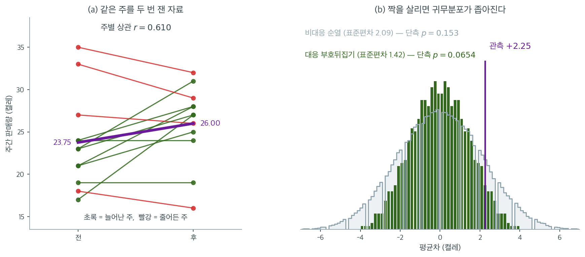

# 재표집 (신발 판매 A/B 검정) (코드)

## 개요

이 페이지는 실무적인 A/B 검정 상황에 세 가지 재표집 기법을 적용한다. 한 전자상거래 회사가 신발 가격을 최적화했고 주간 판매가 개선되었는지 알고자 한다. 순열검정으로 통계적 유의성을 평가하고, 실질적 중요성을 위해 효과크기를 계산하며, 평균차에 대한 붓스트랩 신뢰구간을 구성한다. 이 비모수 방법들은 분포 가정을 요구하지 않아 작은 표본 비교에 적합하다.

---

## 1. 자료

가격 최적화 전후 $12$주간의 주간 신발 판매량(켤레)이다.

$$
\text{전}: \quad 23, 21, 19, 24, 35, 17, 18, 24, 33, 27, 21, 23
$$

$$
\text{후}: \quad 31, 28, 19, 24, 32, 27, 16, 28, 29, 26, 25, 27
$$

관측된 평균차는

$$
\bar{x}_{\text{후}} - \bar{x}_{\text{전}} = 26.00 - 23.75 = 2.25 \text{ 켤레}
$$

이다.

<div class="exbox" markdown>

**보기 1.** <span class="diff easy" title="쉬움"></span> 판매량 자료. 같은 $12$주를 전후로 측정했으므로 이 자료는 **대응자료**다. 그 구조를 쓰는 것과 쓰지 않는 것의 값을 미리 재어 둔다.

**(1)** 주별 차이 $d_i$의 표본분산이 $s_d^2 = s_1^2 + s_2^2 - 2 r s_1 s_2$임을 보이시오($r$은 전후 상관). 이것으로 대응 표준오차와 비대응 표준오차의 비를 $r$, $s_1$, $s_2$로 적으시오.

**(2)** 두 수를 계산해 비를 구하시오. 상관이 $0$이면 비가 얼마가 되는가.

</div>

??? success "풀이"

    **(1) 해석적으로.** $d_i = x_{2i} - x_{1i}$이므로 분산의 성질에서 바로 나온다. 표본분산으로 적으면

    $$
    s_d^2 = \frac{1}{n-1}\sum_i \big((x_{2i} - \bar x_2) - (x_{1i} - \bar x_1)\big)^2
    = s_1^2 + s_2^2 - 2 s_{12}
    $$

    이고 $s_{12} = r s_1 s_2$이므로

    $$
    s_d^2 = s_1^2 + s_2^2 - 2 r s_1 s_2
    $$

    다. 대응 $t$ 검정이 쓰는 표준오차는 $s_d/\sqrt n$이고, 짝을 무시한 이표본 쪽은 $\sqrt{(s_1^2+s_2^2)/n}$이다. 따라서 비가

    $$
    \frac{\operatorname{SE}_{\text{대응}}}{\operatorname{SE}_{\text{비대응}}}
    = \sqrt{\frac{s_1^2 + s_2^2 - 2rs_1s_2}{s_1^2 + s_2^2}}
    = \sqrt{1 - \frac{2 r s_1 s_2}{s_1^2 + s_2^2}}
    $$

    이다. **$r > 0$이면 언제나 $1$보다 작다.** 짝지은 두 측정이 같은 방향으로 움직이는 몫 $2rs_1s_2$가 차이를 취할 때 상쇄되기 때문이다. $r = 0$이면 비가 $1$이 되어 짝을 지어도 얻는 것이 없고, $r \to 1$이고 $s_1 = s_2$이면 비가 $0$으로 간다.

    **(2) 수치적으로.**

    ```python
    import numpy as np

    # 판촉 전후 12주치 신발 판매량. 평균이 2.25 올랐는데, 이것이 판촉의
    # 효과인지 그저 주마다의 들쭉날쭉인지를 아래에서 가린다.
    BEFORE = np.array([23, 21, 19, 24, 35, 17, 18, 24, 33, 27, 21, 23])
    AFTER  = np.array([31, 28, 19, 24, 32, 27, 16, 28, 29, 26, 25, 27])

    print(f"Before mean: {BEFORE.mean():.2f}")   # 23.75
    print(f"After  mean: {AFTER.mean():.2f}")    # 26.00
    print(f"Difference:  {AFTER.mean() - BEFORE.mean():.2f}")   # 2.25
    ```

    출력:

    ```
    Before mean: 23.75
    After  mean: 26.00
    Difference:  2.25
    ```

    (1)의 두 식을 잰다. 위 블록의 변수를 그대로 이어 쓴다.

    ```python
    n = len(BEFORE)
    s1, s2 = BEFORE.std(ddof=1), AFTER.std(ddof=1)
    r = np.corrcoef(BEFORE, AFTER)[0, 1]
    d = AFTER - BEFORE
    print(f"s_전 = {s1:.6f},  s_후 = {s2:.6f},  r = {r:.6f}")
    print(f"s_d^2 직접 = {d.var(ddof=1):.6f},  공식 = {s1 ** 2 + s2 ** 2 - 2 * r * s1 * s2:.6f}")

    se_paired = d.std(ddof=1) / np.sqrt(n)
    se_unpaired = np.sqrt((s1 ** 2 + s2 ** 2) / n)
    print(f"대응 SE = {se_paired:.6f},  비대응 SE = {se_unpaired:.6f}")
    print(f"비 = {se_paired / se_unpaired:.6f},"
          f"  공식 = {np.sqrt(1 - 2 * r * s1 * s2 / (s1 ** 2 + s2 ** 2)):.6f}")

    # 재표집 귀무분포의 표준편차로 견주어도 같은 이야기다.
    z = np.concatenate([BEFORE, AFTER])
    print(f"섞기 귀무 SD       = {z.std(ddof=1) * np.sqrt(2 / n):.6f}")
    print(f"부호뒤집기 귀무 SD = {np.sqrt((d ** 2).sum()) / n:.6f}")
    ```

    출력:

    ```
    s_전 = 5.561638,  s_후 = 4.612237,  r = 0.609567
    s_d^2 직접 = 20.931818,  공식 = 20.931818
    대응 SE = 1.320726,  비대응 SE = 2.085756
    비 = 0.633212,  공식 = 0.633212
    섞기 귀무 SD       = 2.093165
    부호뒤집기 귀무 SD = 1.421560
    ```

    **공식이 맞는다.** $s_d^2$을 차이에서 직접 구한 $20.931818$과 $s_1^2 + s_2^2 - 2rs_1s_2$가 여섯 자리까지 같고, 표준오차의 비도 $0.633212$로 일치한다. 전후 상관이 $r = 0.610$이라 **짝을 지으면 표준오차가 $37\%$ 줄어든다.** $r = 0$이었다면 비가 $1$이어서 아무것도 얻지 못했을 것이다.

    재표집 쪽 눈금도 같은 방향을 가리킨다. $24$개를 통째로 섞은 귀무분포의 표준편차가 $2.093165$인데 주별 차이의 부호만 뒤집은 쪽은 $1.421560$으로 $32\%$ 좁다. 두 축소율이 꼭 같지는 않다. 앞의 것은 $t$ 검정의 눈금이고 뒤의 것은 순열검정의 눈금이라 $n-1$과 $n$, 그리고 관측된 효과를 품는 방식이 조금씩 다르기 때문이다. **그러나 결론은 하나다. 이 자료에서 짝을 버리면 눈금을 삼분의 일쯤 손해 본다.**

    아래 분석은 그 손해를 감수한 비대응 판본이며, 둘을 견주려는 뜻이다.

!!! warning "이 자료는 사실 대응자료이다"
    같은 $12$주를 전후로 측정했으므로 주별로 짝지어져 있다. 아래의 비대응 순열검정은 이 구조를 무시한다.

    실제로 전후 판매량의 상관은 $r = 0.610$으로 상당히 높다. 대응 구조를 이용하면 검정력이 크게 오른다(연습문제 2). 비대응 분석을 먼저 제시하는 것은 두 접근의 차이를 보이기 위해서이다.

---

## 2. 순열검정

순열검정은 관측된 차이가 우연으로 생길 수 있었는지 평가한다. 귀무가설 $H_0\colon F_{\text{전}} = F_{\text{후}}$ 아래에서 "전/후" 라벨은 교환 가능하다.

**절차:**

1. $n_1 + n_2 = 24$개 관측을 모두 합친다.
2. 무작위로 $12$개를 "전"에, $12$개를 "후"에 배정한다.
3. 순열된 평균차를 계산한다.
4. $B$번 반복하고 $p$값을 계산한다.

$$
p = \frac{\#\bigl\{b : \Delta^{(\pi_b)} \ge \Delta_{\text{obs}}\bigr\} + 1}{B + 1}
$$

최적화가 판매를 늘릴 것으로(줄이는 것이 아니라) 기대하므로 단측검정이다.

<div class="exbox" markdown>

**보기 2.** <span class="diff easy" title="쉬움"></span> 순열검정. 위 함수는 $B = 199{,}999$번 섞어 단측 $p$값을 구한다. 그런데 이 설계는 $\binom{24}{12} = 2{,}704{,}156$가지뿐이라 **몬테카를로 없이 다 셀 수 있다.**

**(1)** 순열된 평균차 $\Delta^{(\pi)}$가 "후"로 간 $12$개의 **합** $S_a$ 하나로 정해짐을 보이고, $\Delta^{(\pi)} \ge 2.25$가 $S_a$에 대한 어떤 조건인지 적으시오. 관측된 $S_a$는 얼마인가.

**(2)** 합이 그 값 이상인 $12$-부분집합의 수를 동적계획으로 세어 정확 단측 $p$값을 구하고, 함수의 몬테카를로값·Welch $t$ 검정과 견주시오.

</div>

??? success "풀이"

    **(1) 해석적으로.** $24$개 값의 총합 $T = 597$은 순열이 바뀌어도 그대로다. "후"로 간 $12$개의 합을 $S_a$라 하면 "전"의 합이 $T - S_a$이므로

    $$
    \Delta^{(\pi)} = \frac{S_a}{12} - \frac{T - S_a}{12} = \frac{2S_a - T}{12}
    $$

    이다. **합 하나가 모든 것을 정한다.** 관측된 "후"의 합은 $S_a = 312$이고 실제로 $(2 \times 312 - 597)/12 = 27/12 = 2.25$다. 따라서

    $$
    \Delta^{(\pi)} \ge 2.25 \iff 2S_a - T \ge 27 \iff S_a \ge 312
    $$

    이다. 남은 일은 $24$개에서 $12$개를 골라 합이 $312$ 이상인 경우의 수를 세는 것뿐이다. $\binom{24}{12} = 2{,}704{,}156$가지를 하나하나 만들지 않고도, **합마다 몇 가지인지를 세는 표**를 값 하나씩 갱신해 가며 만들면 된다($k$개를 골랐을 때 합이 $s$인 가짓수 $N_k(s)$에 대해 $N_{k}(s) \leftarrow N_k(s) + N_{k-1}(s - v)$).

    **(2) 수치적으로.** 함수는 이렇다.

    ```python
    def permutation_test(before, after, n_perm=199_999, rng=None):
        """평균이 올랐는지에 대한 단측 순열검정.

        "올랐는가"만 묻는 것이므로 오른쪽 꼬리만 본다. 양측으로 하면 p-값이
        두 배가 되는데, 어느 쪽으로 할지는 자료를 보기 전에 정해야 한다.
        """
        rng = rng or np.random.default_rng(42)
        observed_diff = after.mean() - before.mean()
        combined = np.concatenate([before, after])
        n_before = len(before)

        P = np.array([rng.permutation(combined) for _ in range(n_perm)])
        perm_diffs = P[:, n_before:].mean(axis=1) - P[:, :n_before].mean(axis=1)
        p_value = ((perm_diffs >= observed_diff - 1e-12).sum() + 1) / (n_perm + 1)
        return observed_diff, perm_diffs, p_value
    ```

    돌린 뒤 정확값을 따로 센다.

    ```python
    from collections import defaultdict
    from scipy import stats

    obs_diff, perm_diffs, p_value = permutation_test(BEFORE, AFTER)
    print(f"관측 차이 = {obs_diff:.2f},  순열 단측 p (B=199999) = {p_value:.5f}")
    print(f"순열 귀무 SD 모의 = {perm_diffs.std(ddof=1):.6f}")

    zi = np.concatenate([BEFORE, AFTER]).astype(int)
    total = int(zi.sum())
    # k 개를 골랐을 때 합이 s 인 가짓수를 값 하나씩 갱신해 가며 센다.
    dp = [defaultdict(int) for _ in range(n + 1)]
    dp[0][0] = 1
    for v in zi:
        for k in range(n - 1, -1, -1):
            for s, c in list(dp[k].items()):
                dp[k + 1][s + v] += c
    counts = dp[n]
    n_subsets = sum(counts.values())
    hit = sum(c for s, c in counts.items() if s >= AFTER.sum())
    lo_ = sum(c for s, c in counts.items() if s <= total - AFTER.sum())

    print(f"24개 중 12개를 고르는 방법 = {n_subsets:,}")
    print(f"관측된 '후'의 합 = {AFTER.sum()},  전체 합 = {total}")
    print(f"합이 {AFTER.sum()} 이상인 배정 = {hit:,}  ->  정확 단측 p = {hit / n_subsets:.6f}")
    print(f"정확 양측 p = {(hit + lo_) / n_subsets:.6f}")
    print(f"Welch t 검정 (양측) = {stats.ttest_ind(AFTER, BEFORE, equal_var=False).pvalue:.6f}")
    ```

    출력:

    ```
    관측 차이 = 2.25,  순열 단측 p (B=199999) = 0.15329
    순열 귀무 SD 모의 = 2.094198
    24개 중 12개를 고르는 방법 = 2,704,156
    관측된 '후'의 합 = 312,  전체 합 = 597
    합이 312 이상인 배정 = 417,216  ->  정확 단측 p = 0.154287
    정확 양측 p = 0.308574
    Welch t 검정 (양측) = 0.292782
    ```

    **셈이 맞는다.** $12$-부분집합의 총수가 $\binom{24}{12} = 2{,}704{,}156$으로 나오고, 그중 합이 $312$ 이상인 것이 $417{,}216$가지라 정확 단측 $p = 0.154287$이다. 몬테카를로값 $0.15329$는 거기서 $-0.001$ 떨어져 있는데, $B = 199{,}999$에서 $\hat p$의 표준편차가 $\sqrt{0.1543 \times 0.8457/199999} = 0.00081$이므로 $-1.2$배다. **$20$만 번을 돌려 얻은 것이 세 자리짜리 근사이고, 표를 한 번 만들어 얻은 것이 정확한 값이다.**

    | 검정 | $p$값 |
    |:---|---:|
    | 순열검정(단측, 정확) | **0.154287** |
    | 순열검정(단측, $B = 199{,}999$) | 0.153290 |
    | 순열검정(양측, 정확) | 0.308574 |
    | Welch $t$ 검정(양측) | 0.292782 |

    **어느 쪽이든 기각하지 못한다.** $2.25$켤레의 증가는 우연으로 충분히 설명된다. 이 자료의 주간 변동이 크기 때문이다(표준편차 $5.56$과 $4.61$). 정확 양측값이 정확 단측값의 꼭 두 배인 것은 귀무분포가 $0$에 대해 대칭이기 때문이며, 섞기에서 "전"과 "후"를 맞바꾸면 $\Delta$의 부호가 뒤집혀 모든 배정이 짝을 이룬다.

위 경고에서 말한 대로 이 자료는 대응자료이다. 짝을 무시한 대가가 얼마인지 그림으로 확인해 보자.



(a)가 자료의 실제 구조다. 선 하나가 한 주이며, 열두 주 중 여덟 주에서 판매가 늘고 네 주에서 줄었다. 눈에 띄는 것은 선들이 **대체로 평행하다**는 점이다. 원래 잘 팔리던 주는 후에도 잘 팔리고 부진하던 주는 계속 부진하다. 전후 상관이 $r = 0.610$인 것이 이 공통 요인의 크기이며, 계절성이나 판촉처럼 그 주 전체에 걸친 영향이 여기에 들어 있다.

(b)가 그 구조를 쓰느냐 마느냐의 차이다. 회색은 $24$개 값을 통째로 섞은 비대응 귀무분포로 표준편차가 $2.09$이고, 초록은 주별 차이의 부호만 뒤집은 대응 귀무분포로 표준편차가 $1.42$이다. **$32\%$ 좁아졌다.** 섞기는 주 사이의 공통 변동까지 귀무분포에 집어넣지만, 차이를 취하면 그 공통 변동이 상쇄되어 남지 않기 때문이다.

결과적으로 같은 관측값 $+2.25$가 더 좁은 분포의 더 바깥에 놓이고, 단측 $p$값이 $0.153$에서 $0.0654$로 절반 이하가 된다. 게다가 $n = 12$이므로 $2^{12} = 4096$가지 부호 배정을 모두 열거할 수 있어 이 $0.0654$에는 몬테카를로 오차조차 없다. **자료를 한 줄도 더 모으지 않고 얻은 개선**이며, 같은 효과를 표본으로 사려면 주 수를 대략 $2.4$배로 늘려야 한다. 물론 그래도 $\alpha = 0.05$는 넘지 못한다. 분석을 고쳐서 얻을 수 있는 것과 없는 것의 경계가 여기에 있다.

---

## 3. 효과크기

통계적 유의성만으로는 효과가 실질적으로 의미 있는지 알 수 없다. 절대 차이와 백분율 변화가 맥락을 제공한다.

$$
\text{절대 차이} = \bar{x}_{\text{후}} - \bar{x}_{\text{전}} = 2.25
$$

$$
\text{백분율 변화} = \frac{\bar{x}_{\text{후}} - \bar{x}_{\text{전}}}{\bar{x}_{\text{전}}} \times 100\% = 9.47\%
$$

$23.75$를 기준으로 한 $2.25$켤레 증가는 약 $9.5$%의 상승이며, 이익률과 최적화 비용에 따라 경제적으로 의미가 있을 수도 없을 수도 있다.

!!! note "유의하지 않다고 효과가 없는 것은 아니다"
    $p = 0.153$이지만 점추정값 $+9.5$%는 사업적으로 결코 무시할 크기가 아니다. 이 실험의 결론은 "효과가 없다"가 아니라 **"$12$주로는 이 크기의 효과를 판별할 수 없다"**이다.

    검정력 계산이 이를 확인해 준다. $\sigma = 5$, 참 차이 $2$일 때 $n = 12$의 검정력은 $0.232$에 불과하다(연습문제 4).

---

## 4. 붓스트랩 신뢰구간

붓스트랩은 정규성을 가정하지 않고 참 평균차의 신뢰구간을 제공한다. 각 집단에서 독립적으로 복원추출한다.

1. "전"에서 $n_1$개를 복원추출한다.
2. "후"에서 $n_2$개를 복원추출한다.
3. $\Delta^{(b)} = \bar{x}_{\text{후}}^{(b)} - \bar{x}_{\text{전}}^{(b)}$를 계산한다.
4. $B$번 반복하고 백분위수를 취한다.

$$
\text{CI}_{1-\alpha} = \left[q_{\alpha/2},\;\; q_{1-\alpha/2}\right]
$$

<div class="exbox" markdown>

**보기 3.** <span class="diff easy" title="쉬움"></span> 붓스트랩 신뢰구간. 두 집단에서 따로 복원추출해 평균차의 백분위수 구간을 구한다.

**(1)** 붓스트랩 표준오차가 $B \to \infty$에서 무엇으로 수렴하는지 적고, 고전적 $\sqrt{(s_1^2+s_2^2)/n}$과의 비를 구하시오. ([붓스트랩 표준오차](../../ch05/applications/bootstrap_standard_error.md) 보기 1이 일표본에서 유도한 것을 그대로 쓴다.)

**(2)** 실행해 (1)을 확인하시오. 그리고 **표준오차는 안정한데 신뢰구간의 끝점은 그렇지 않다.** 씨앗을 바꾸어 가며 그 차이를 수로 보이고 까닭을 밝히시오.

</div>

??? success "풀이"

    **(1) 해석적으로.** 붓스트랩 표본은 각 집단의 경험분포에서 **독립으로** 뽑힌다. 한 집단의 경험분포는 관측값마다 질량 $1/n$을 주므로 그 분산이

    $$
    \hat\sigma^2 = \frac1n\sum_{i=1}^n (x_i - \bar x)^2
    $$

    이고($n-1$이 아니라 $n$으로 나눈다), 독립인 $n$개의 평균이므로 $\operatorname{Var}_*(\bar X^*) = \hat\sigma^2/n$이다. 여기까지가 [붓스트랩 표준오차](../../ch05/applications/bootstrap_standard_error.md) 보기 1의 결과다. 두 집단을 따로 재표집하면 두 평균이 독립이므로 분산이 더해져

    $$
    \widehat{\operatorname{SE}}_{\text{boot}}
    \xrightarrow[B \to \infty]{}
    \sqrt{\frac{\hat\sigma_1^2 + \hat\sigma_2^2}{n}}
    $$

    이다. $\hat\sigma^2 = \frac{n-1}{n}s^2$이므로 고전적 값과의 비가

    $$
    \frac{\sqrt{(\hat\sigma_1^2+\hat\sigma_2^2)/n}}{\sqrt{(s_1^2+s_2^2)/n}}
    = \sqrt{\frac{n-1}{n}} = \sqrt{\frac{11}{12}} = 0.957427
    $$

    로 **붓스트랩 쪽이 체계적으로 $4.3\%$ 작다.** $B$를 아무리 키워도 남는 차이다.

    **(2) 수치적으로.** 함수는 이렇다.

    ```python
    def bootstrap_ci(before, after, n_boot=100_000, ci=95, rng=None):
        """평균 차이에 대한 백분위수 붓스트랩 신뢰구간.

        검정은 "효과가 있다/없다"까지만 말한다. 판촉에 돈을 쓸지 정하려면
        효과가 얼마나 되는지를 알아야 하고, 그것은 구간이 말해 준다.
        """
        rng = rng or np.random.default_rng(42)
        b = before[rng.integers(0, len(before), (n_boot, len(before)))].mean(axis=1)
        a = after[rng.integers(0, len(after), (n_boot, len(after)))].mean(axis=1)
        diffs = a - b
        lo = (100 - ci) / 2
        return diffs, np.percentile(diffs, [lo, 100 - lo])
    ```

    극한값을 확인하고, 씨앗을 $10$개 바꾸어 표준오차와 끝점의 흔들림을 나란히 잰다.

    ```python
    sig1, sig2 = BEFORE.std(ddof=0), AFTER.std(ddof=0)
    print(f"붓스트랩 SE 의 극한 = {np.sqrt((sig1 ** 2 + sig2 ** 2) / n):.6f}")
    print(f"고전 SE             = {se_unpaired:.6f}")
    print(f"비 = sqrt((n-1)/n) = {np.sqrt((n - 1) / n):.6f}")

    ups, los, ses = [], [], []
    for s in range(10):
        diffs_s, ci_s = bootstrap_ci(BEFORE, AFTER, rng=np.random.default_rng(s))
        los.append(ci_s[0]); ups.append(ci_s[1]); ses.append(diffs_s.std(ddof=1))
    print(f"\n씨앗 10 개에서")
    print(f"  붓스트랩 SE : {min(ses):.4f} ~ {max(ses):.4f}")
    print(f"  95% 하한    : {sorted(set(round(v, 4) for v in los))}")
    print(f"  95% 상한    : {sorted(set(round(v, 4) for v in ups))}   (격자 간격 {1 / n:.4f})")

    diffs, ci95 = bootstrap_ci(BEFORE, AFTER)
    _, ci90 = bootstrap_ci(BEFORE, AFTER, ci=90)
    print(f"\n기본 씨앗: 90% = [{ci90[0]:.4f}, {ci90[1]:.4f}],"
          f"  95% = [{ci95[0]:.4f}, {ci95[1]:.4f}],  SE = {diffs.std(ddof=1):.6f}")
    ```

    출력:

    ```
    붓스트랩 SE 의 극한 = 1.996959
    고전 SE             = 2.085756
    비 = sqrt((n-1)/n) = 0.957427

    씨앗 10 개에서
      붓스트랩 SE : 1.9943 ~ 2.0050
      95% 하한    : [-1.8333]
      95% 상한    : [5.9167, 6.0]   (격자 간격 0.0833)

    기본 씨앗: 90% = [-1.1667, 5.4167],  95% = [-1.8333, 6.0000],  SE = 1.997389
    ```

    **(1)이 맞는다.** 극한 $\sqrt{(\hat\sigma_1^2+\hat\sigma_2^2)/12} = 1.996959$에 대해 $B = 100{,}000$에서 나온 $1.997389$가 소수 셋째 자리까지 같고, 씨앗을 열 번 바꾸어도 $1.9943$–$2.0050$ 안에 머문다. **폭이 $0.5\%$다.** 고전적 $2.085756$과의 $4.3\%$ 차이는 $B$를 키워도 사라지지 않는 체계적인 몫이고, 씨앗에 따른 $0.5\%$는 몬테카를로 요동이다.

    **끝점은 사정이 다르다.** 같은 열 번의 실행에서 $95\%$ 상한이 $5.9167$과 $6.0000$ 두 값 사이를 오간다. 하한은 $-1.8333$으로 붙박이다. 까닭은 **붓스트랩 평균차가 이산**이기 때문이다. 자료가 정수이고 $n = 12$이므로 재표본평균의 차는 $1/12 = 0.0833$ 간격의 격자에만 놓인다. $97.5$번째 백분위수가 두 격자점 $5.9167$과 $6.0000$의 **경계 바로 위**에 있어, 복제값 몇 개가 움직이면 어느 쪽으로든 넘어간다.

    그래서 이 쪽의 표가 $95\%$ 상한을 $5.92$로 적는 것도, 위 실행이 $6.00$을 내는 것도 모두 같은 분포에서 나온 결과다. **$B$를 키워 없어지는 것은 표준오차의 요동이고, 격자의 거침은 $B$가 아니라 $n$이 정한다.** 백분위수 구간을 소수 둘째 자리까지 보고하려면 $n$이 더 커야 한다.

    | 신뢰수준 | 구간 | 폭 |
    |:---|:---|---:|
    | 90% | $[-1.17,\ 5.42]$ | 6.59 |
    | 95% | $[-1.83,\ 5.92]$ 또는 $[-1.83,\ 6.00]$ | 7.75--7.83 |

    **두 구간 모두 $0$을 포함한다.** 순열검정이 기각하지 못한 것과 일관된다.

---

## 5. 해석

- **순열검정** $p$값은 관측된 $2.25$켤레 증가가 무작위 재라벨링 아래에서 얼마나 드문지를 알려준다. 여기서는 $p = 0.153$으로 드물지 않다.
- **효과크기** 약 $9.5$%는 변화의 실질적 크기를 정량화한다. 유의하지 않다고 해서 이 값이 사라지는 것은 아니다.
- **붓스트랩 신뢰구간** $[-1.83, 5.92]$는 참 평균차의 그럴듯한 범위를 알려준다. $0$을 포함하므로 순열검정과 일관되지만, 상한 $5.92$는 상당한 개선의 가능성도 배제하지 않음을 보여준다.
- 세 분석이 함께 완전한 그림을 준다. 유의성, 크기, 불확실성이다. 재표집 접근은 정규성을 가정하지 않으므로 집단당 $n = 12$인 상황에서 중요하다.

---

## 연습문제

<div class="drillbox" markdown>

**연습문제 1.** <span class="diff med" title="중간"></span> 위의 단측 순열검정을 양측검정으로 바꾸어라. 신발 판매 자료에서 다시 실행하고 단측 버전과 $p$값을 비교하라.

</div>

??? success "풀이"

    ```python
    def permutation_test_two_sided(before, after, n_perm=199_999, rng=None):
        rng = rng or np.random.default_rng(42)
        obs = after.mean() - before.mean()
        combined = np.concatenate([before, after])
        n_b = len(before)
        P = np.array([rng.permutation(combined) for _ in range(n_perm)])
        d = P[:, n_b:].mean(axis=1) - P[:, :n_b].mean(axis=1)
        return obs, ((np.abs(d) >= abs(obs) - 1e-12).sum() + 1) / (n_perm + 1)
    ```

    | 검정 | $p$값 |
    |:---|---:|
    | 단측 | 0.153 |
    | 양측 | **0.308** |
    | 비 | 2.01 |

    **양측 $p$값이 단측의 정확히 두 배이다.** 순열분포가 $0$에 대해 거의 완벽히 대칭이기 때문이다. 두 집단의 크기가 같으므로($n_1 = n_2 = 12$) 모든 순열에 대해 라벨을 뒤집은 순열이 존재하며, 그 차이는 부호만 반대이다.

    **집단 크기가 다르면 이 관계가 깨진다.** 그때 순열분포는 대칭이 아니며 양측 $p$값이 단측의 두 배가 아니다.

    !!! danger "단측검정은 자료를 보기 전에 정해야 한다"
        여기서 단측검정을 정당화한 것은 "최적화가 판매를 늘릴 것으로 기대한다"는 사전 가설이다. 이 결정은 자료를 보기 **전에** 내려져야 한다.

        자료를 본 뒤 "차이가 양수네, 단측으로 하자"고 정하면 실제 제1종 오류율이 $0.05$가 아니라 $0.10$이 된다. 이는 $p$-해킹의 한 형태이다.

        보수적인 실무 관행은 사전 방향 가설이 등록된 경우가 아니면 **항상 양측을 보고**하는 것이다.

<div class="drillbox" markdown>

**연습문제 2.** <span class="diff med" title="중간"></span> 자료는 대응자료이다(같은 주의 전후). 주별 차이 $d_i = x_i^{\text{후}} - x_i^{\text{전}}$의 부호를 무작위로 뒤집는 대응 순열검정을 구현하라. 비대응 검정과 $p$값을 비교하라.

</div>

??? success "풀이"

    $n = 12$이므로 $2^{12} = 4096$가지 부호 배정을 **전부 열거**할 수 있다.

    ```python
    import numpy as np, itertools
    from scipy import stats

    d = AFTER - BEFORE
    print(d)          # [ 8  7  0  0 -3 10 -2  4 -4 -1  4  4]
    print(d.mean(), d.std(ddof=1))     # 2.25  4.575

    S = np.array(list(itertools.product([1, -1], repeat=12)))
    m = (S * d).mean(axis=1)
    p_one = (m >= d.mean() - 1e-12).sum() / 4096
    p_two = (np.abs(m) >= abs(d.mean()) - 1e-12).sum() / 4096
    print(p_one, p_two)                # 0.06543  0.13086
    ```

    출력:

    ```
    [ 8  7  0  0 -3 10 -2  4 -4 -1  4  4]
    2.25 4.575130400526108
    0.0654296875 0.130859375
    ```

    | 검정 | 단측 $p$ | 양측 $p$ |
    |:---|---:|---:|
    | 비대응 순열 | 0.153 | 0.308 |
    | **대응 순열(정확)** | **0.0654** | **0.1309** |
    | 대응 $t$ 검정 | 0.0583 | 0.1165 |
    | Wilcoxon 부호순위(정확) | 0.0503 | 0.1007 |

    **대응 분석이 $p$값을 절반 이상 줄인다**($0.153 \to 0.065$). 그럼에도 $\alpha = 0.05$를 넘지 못한다.

    **왜 개선되는가.** 전후 판매량의 상관이 $r = 0.610$이다. 주간 판매량에는 계절성·프로모션 같은 공통 요인이 있어 전후가 함께 움직인다. 차이를 취하면 이 공통 변동이 상쇄된다.

    | 접근 | 관련 표준편차 | 평균차의 표준오차 |
    |:---|---:|---:|
    | 비대응 | $s_{\text{전}} = 5.562$, $s_{\text{후}} = 4.612$ | 2.084 |
    | 대응 | $s_d = 4.575$ | **1.321** |

    표준오차가 $37$% 줄어든다. 이론적으로 $\text{sd}(d) = \sigma\sqrt{2(1-\rho)}$이므로 $\rho = 0.61$이면 $\sqrt{2 \times 0.39} = 0.883$배가 되고, 여기에 대응 설계가 $n$을 $24$에서 $12$로 줄이는 효과를 상쇄하고도 남는다.

    **붓스트랩으로도 확인된다.** 대응 붓스트랩 $95$% 신뢰구간은 $[-0.17, 4.75]$로 비대응의 $[-1.83, 5.92]$보다 훨씬 좁다. 하한이 $0$에 아슬아슬하게 못 미친다.

    !!! tip "설계가 분석보다 중요하다"
        비대응 분석에서 대응 분석으로 바꾸는 것만으로 $p$값이 $0.153$에서 $0.065$로 떨어졌다. 자료를 하나도 더 모으지 않고 얻은 개선이다.

        같은 개선을 표본을 늘려 얻으려면 $n$을 대략 $2.4$배로 해야 한다. **올바른 분석 방법을 고르는 것이 자료를 더 모으는 것보다 값싸다.**

        반대로, 대응 구조가 있는데 비대응 검정을 쓰면 검정력을 그냥 버리는 것이다. 이는 흔한 실수이며, 자료가 "before/after" 두 열로 주어졌을 때 특히 놓치기 쉽다.

<div class="drillbox" markdown>

**연습문제 3.** <span class="diff med" title="중간"></span> 위의 붓스트랩 신뢰구간은 백분위수법을 쓴다. **기본 붓스트랩 신뢰구간**(추축법)을 구현하고 백분위수 구간과 비교하라.

$$
\text{CI} = \bigl(2\hat\theta - q_{1-\alpha/2},\;\; 2\hat\theta - q_{\alpha/2}\bigr)
$$

</div>

??? success "풀이"

    ```python
    theta_hat = AFTER.mean() - BEFORE.mean()      # 2.25
    boot_diffs, _ = bootstrap_ci(BEFORE, AFTER, n_boot=100_000)
    q_lo, q_hi = np.percentile(boot_diffs, [2.5, 97.5])

    print(f"Percentile: [{q_lo:.2f}, {q_hi:.2f}]")
    print(f"Basic:      [{2*theta_hat - q_hi:.2f}, {2*theta_hat - q_lo:.2f}]")
    ```

    출력:

    ```
    Percentile: [-1.83, 6.00]
    Basic:      [-1.50, 6.33]
    ```

    | 방법 | $95$% 구간 | 폭 | 중심 |
    |:---|:---|---:|---:|
    | 백분위수 | $[-1.83,\ 5.92]$ | 7.75 | 2.05 |
    | 기본 | $[-1.42,\ 6.33]$ | 7.75 | 2.46 |

    **폭이 정확히 같다**($7.75$). 이는 항상 성립한다. 기본법은 구간을 $\hat\theta$에 대해 반사할 뿐 폭을 바꾸지 않는다.

    **중심이 $0.41$만큼 다르다.** 붓스트랩 분포의 중심 $2.05$가 $\hat\theta = 2.25$보다 작기 때문이다(즉 붓스트랩 편향이 $-0.20$). 기본법은 이를 반대 방향으로 보정하여 구간을 오른쪽으로 옮긴다.

    붓스트랩 분포의 왜도는 $-0.191$로 약간 왼쪽으로 치우쳐 있다. 표본에 $35$와 $33$이라는 큰 값이 "전" 집단에 있어, 재표집에서 이들이 빠질 때 차이가 커지는 비대칭이 생긴다.

    **어느 쪽을 쓸 것인가.** 이 자료에서는 결론이 같으므로($0$을 포함) 중요하지 않다. 일반적으로는

    - 붓스트랩 분포가 대칭이면 둘이 거의 같다.
    - 치우쳐 있으면 **백분위수법이 대개 낫다**. 변환 불변성 때문이다([백분위수법](../bootstrap_ci/percentile.md) 연습문제 4 참조).
    - 편향이 크면 BCa가 둘 다보다 낫다.

<div class="drillbox" markdown>

**연습문제 4.** <span class="diff med" title="중간"></span> 회사가 주당 최소 $2$켤레의 상승을 $80$% 검정력으로 탐지하고자 한다. 모의실험으로 순열검정에 필요한 표본크기(집단당 주 수)를 $\alpha = 0.05$에서 추정하라.

</div>

??? success "풀이"

    ```python
    import numpy as np
    rng = np.random.default_rng(42)

    def power_estimate(n, true_diff=2.0, sd=5.0, M=800, B=999):
        r = 0
        for _ in range(M):
            b = rng.normal(24, sd, n); a = rng.normal(24 + true_diff, sd, n)
            obs = a.mean() - b.mean()
            z = np.concatenate([b, a])
            P = np.array([rng.permutation(z) for _ in range(B)])
            d = P[:, n:].mean(1) - P[:, :n].mean(1)
            r += ((d >= obs - 1e-12).sum() + 1)/(B+1) < 0.05
        return r / M
    ```

    **비대응 설계 (단측 $\alpha = 0.05$, $\sigma = 5$, 참 차이 $= 2$)**

    | 집단당 $n$ | 순열검정 검정력 | 이론값 |
    |---:|---:|---:|
    | 12 | 0.232 | 0.253 |
    | 30 | 0.456 | 0.462 |
    | 50 | 0.656 | 0.639 |
    | **80** | **0.806** | 0.812 |
    | 100 | 0.879 | 0.882 |

    **답: 집단당 약 $80$주가 필요하다.** 이론값도 같은 답을 준다.

    $$
    n = \frac{2\sigma^2(z_{0.95} + z_{0.80})^2}{\delta^2}
      = \frac{2 \times 25 \times (1.645 + 0.842)^2}{4} = 77.3
    $$

    **$80$주는 $1.5$년이다.** 실무적으로 받아들이기 어렵다. 가격 최적화의 효과를 그렇게 오래 기다릴 수 없고, 그 사이에 계절성·경쟁사·경기 변화가 개입한다.

    **대응 설계가 이 문제를 크게 완화한다.** 전후 상관이 $\rho = 0.6$이면 차이의 표준편차가 $\sigma\sqrt{2(1-\rho)} = 5\sqrt{0.8} = 4.47$이다.

    | 대응 $n$ | 검정력 |
    |---:|---:|
    | 12 | 0.434 |
    | 20 | 0.596 |
    | **30** | **0.780** |
    | 40 | 0.844 |

    **대응 설계에서는 $30$--$35$주면 충분하다.** 비대응의 $80$주에서 절반 이하로 줄어든다.

    !!! tip "검정력을 올리는 세 가지 방법"
        표본을 늘리는 것만이 답은 아니다. 필요한 $n$은 $\sigma^2/\delta^2$에 비례하므로

        1. **$\sigma$를 줄인다.** 대응 설계, 공변량 보정(회귀), 층화가 모두 여기 해당한다. 위에서 본 것처럼 효과가 가장 크다.
        2. **$\delta$를 키운다.** 더 과감한 개입을 시험한다. $10$%가 아니라 $20$% 가격 변화를 시험하면 필요한 $n$이 $1/4$이 된다.
        3. **$n$을 늘린다.** 가장 비싸고 느린 방법이다. 여러 매장이나 여러 상품군에서 동시에 실험하면 시간이 아니라 단위 수로 $n$을 늘릴 수 있다.

<div class="drillbox" markdown>

**연습문제 5.** <span class="diff hard" title="어려움"></span> 교환가능성이라는 귀무가설이 성립할 때 순열검정이 제1종 오류를 통제함을 증명하라. 즉 모든 $\alpha \in (0,1)$에 대해 $P(p \le \alpha \mid H_0) \le \alpha$임을 보여라.

</div>

??? success "풀이"

    $H_0$ 아래에서 "전"과 "후" 라벨은 교환 가능하다. $\binom{n_1+n_2}{n_1}$가지 라벨 배정이 모두 동등하게 가능하다. $T_0$을 관측된 검정통계량, $T_1, \ldots, T_B$를 $B$개의 무작위 순열에서 얻은 통계량이라 하자.

    교환가능성에 의해 확장된 집합 $\{T_0, T_1, \ldots, T_B\}$는 $B+1$개의 교환 가능한 확률변수로 이루어진다.

    **$p$값을 $+1$ 보정을 포함해 정의해야 한다.**

    $$
    p = \frac{\#\{b : T_b \ge T_0\} + 1}{B + 1}
    $$

    $R$을 $\{T_0, T_1, \ldots, T_B\}$ 중 $T_0$의 내림차순 순위라 하자($T_0$이 최대이면 $R = 1$). 교환가능성에 의해 $R$은 $\{1, \ldots, B+1\}$ 위에서 균등분포이다.

    동점이 없으면 $\#\{b : T_b \ge T_0\} = R - 1$이므로 $p = R/(B+1)$이고

    $$
    P(p \le \alpha) = P\!\left(R \le \alpha(B+1)\right)
    = \frac{\lfloor \alpha(B+1) \rfloor}{B+1} \le \alpha
    $$

    이다. 동점이 있으면 $p$가 커지므로 부등식이 유지된다. $\square$

    **$(B+1)\alpha$가 정수이면 등호가 성립한다.** 이 페이지에서 $B = 199{,}999$를 쓴 이유이며, $(B+1) \times 0.05 = 10{,}000$이 정수이다.

    !!! danger "$+1$ 없이는 증명이 성립하지 않는다"
        $p = \#\{b : T_b \ge T_0\}/B$로 정의하면 $R = 1$일 때 $p = 0$이 되어, $\alpha < 1/(B+1)$인 모든 $\alpha$에서

        $$
        P(p \le \alpha) \ge P(R = 1) = \frac{1}{B+1} > \alpha
        $$

        가 되어 통제가 깨진다. 검정이 보수적이 아니라 **반보수적**이 된다.

        [대응 순열검정](./paired.md) 연습문제 3에서 $B = 199$, $\alpha = 0.05$일 때 보정 없는 정의의 제1종 오류율이 $0.0512$, 보정한 정의가 $0.0458$임을 수치로 확인했다.

    **모든 순열을 열거하는 정확 순열검정에서는** $B+1$이 가능한 배열의 총수가 되고 $R$이 정확히 균등하므로 위 부등식이 그대로 성립한다. 이것이 연습문제 2에서 $2^{12} = 4096$가지를 전부 열거한 대응검정의 $p$값이 몬테카를로 오차 없이 정확한 이유이다.

---

## 정리하며

실제 A/B 상황에 **세 도구를 함께** 적용했다.

- **순열검정으로 유의성을, 효과크기로 실질적 중요성을, 부트스트랩 구간으로 불확실성을 본다.** 셋이 서로 다른 물음에 답한다.
- **$p$ 값만으로는 부족하다.** "차이가 있는가"에만 답하고 "얼마나"에는 답하지 않으므로, **효과크기와 구간이 함께 있어야 의사결정이 가능하다.**
- **작은 표본에서 특히 재표집이 유용하다.** 주간 판매처럼 관측이 몇 개뿐이면 분포 가정을 할 근거가 없다.
- **가격 변경 외의 요인을 배제할 수 있는지 확인해야 한다.** 계절성이나 추세가 있으면 전후 비교가 교란되며, 1장의 문제가 그대로 나타난다.
- **결론을 쓸 때 세 결과를 함께 적는다.** 유의성·크기·범위가 한 문장에 들어가야 한다.

다음 절 **비교**로 넘어간다.
