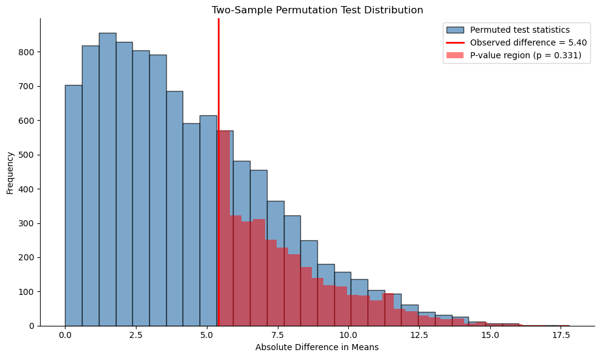

# 이표본 순열검정


## 개요

이표본 순열검정은 두 독립표본이 위치(보통 평균)에서 차이가 나는지 검정하는 비모수 방법이다. $t$ 검정과 달리 정규성이나 등분산성을 가정하지 않는다. A/B 검정과 인과추론에서 특히 유용하다.

## 귀무가설

집단 간 차이가 없다는 귀무가설 아래에서

- 관측된 평균차(또는 다른 통계량)는 무작위 변동에 의한 것이다.
- 집단 라벨은 임의적이다. 라벨을 섞으면 관측값만큼 극단적인 통계량이 $p$값에 해당하는 확률로 나타난다.

## 검정 절차

### 알고리즘

1. 실제 자료에서 **관측 검정통계량을 계산한다**.

    $$T_{obs} = |\bar{X}_1 - \bar{X}_2|$$

2. 모든 관측값을 크기 $n_1 + n_2$의 하나의 자료로 **합친다**.

3. **$B$번 순열한다**(보통 $B = 1{,}000$--$10{,}000$).
    - 집단 라벨을 무작위로 섞는다.
    - $n_1$개를 집단 1에, $n_2$개를 집단 2에 무작위로 배정한다.
    - 이 순열에 대해 검정통계량을 계산한다.

4. **$p$값을 계산한다**.

    $$p = \frac{\#\{T_b \ge T_{obs}\} + 1}{B + 1}$$

    분자·분모의 $+1$은 관측된 배열 자신을 세는 것이다. 이것이 검정의 크기를 $\alpha$ 이하로 보장한다([기초](foundations.md) 연습문제 2 참조).

<div class="codebox" markdown>

### 예제 1. 웹페이지 A/B 검정 { .eg }

#### 자료

두 웹페이지의 사용자 참여도(세션 시간, 초)를 비교한다.

```python
import numpy as np
import matplotlib.pyplot as plt

# A 페이지와 B 페이지의 체류시간
page_a = np.array([185, 188, 142, 160, 161, 157, 182, 181, 159, 167])
page_b = np.array([173, 181, 182, 170, 169, 177, 168, 183, 169, 164])

obs_diff = np.abs(page_a.mean() - page_b.mean())
print(f"Page A: mean = {page_a.mean():.2f}")    # 168.20
print(f"Page B: mean = {page_b.mean():.2f}")    # 173.60
print(f"Observed |difference|: {obs_diff:.2f}") # 5.40
```

출력:

```
Page A: mean = 168.20
Page B: mean = 173.60
Observed |difference|: 5.40
```

#### 순열검정

```python
def two_sample_permutation_test(x, y, n_perms=1000, seed=0):
    """
    Two-sample permutation test for a difference in means.

    Parameters
    ----------
    x, y : array-like
        The two samples.
    n_perms : int
        Number of random permutations.

    Returns
    -------
    p_value : float
        Two-sided p-value, with the +1 correction.
    perm_diffs : ndarray
        The permutation distribution of |mean difference|.
    """
    rng = np.random.default_rng(seed)
    obs_diff = np.abs(x.mean() - y.mean())
    pooled = np.concatenate([x, y])
    nx = len(x)

    perm_diffs = np.empty(n_perms)
    for i in range(n_perms):
        p = rng.permutation(pooled)
        perm_diffs[i] = np.abs(p[:nx].mean() - p[nx:].mean())

    p_value = ((perm_diffs >= obs_diff).sum() + 1) / (n_perms + 1)
    return p_value, perm_diffs

p_val, perm_stats = two_sample_permutation_test(page_a, page_b, n_perms=10000)

print(f"Permutation test p-value: {p_val:.4f}")
print(f"Conclusion: {'Reject H0' if p_val < 0.05 else 'Fail to reject H0'}")
```

출력:

```
Permutation test p-value: 0.3307
Conclusion: Fail to reject H0
```

!!! warning "합친 배열을 제자리에서 섞지 말 것"
    `np.random.shuffle(pooled)`처럼 **제자리 섞기**를 쓰면 `pooled`가 매 반복마다 바뀐다. 이 코드처럼 순열 결과를 새 배열로 받으면(`rng.permutation`) 원본이 보존되어 디버깅이 쉽다.

    관측 통계량을 순열 루프 **이전에** 계산하는 것도 중요하다. 루프 안에서 원본이 이미 섞여버린 뒤에 계산하면 조용히 틀린 답이 나온다.

#### 시각화

```python
fig, ax = plt.subplots(figsize=(10, 6))

ax.hist(perm_stats, bins=30, alpha=0.7, color='steelblue', edgecolor='black',
        label='Permuted test statistics')

obs_stat = np.abs(page_a.mean() - page_b.mean())
ax.axvline(obs_stat, color='red', linewidth=2,
           label=f'Observed difference = {obs_stat:.2f}')

rejection_region = perm_stats[perm_stats >= obs_stat]
ax.hist(rejection_region, bins=30, alpha=0.5, color='red',
        label=f'P-value region (p = {p_val:.3f})')

ax.set_xlabel('Absolute Difference in Means')
ax.set_ylabel('Frequency')
ax.set_title('Two-Sample Permutation Test Distribution')
ax.legend()
ax.spines['top'].set_visible(False)
ax.spines['right'].set_visible(False)

plt.tight_layout()
plt.show()
```



</div>

<div class="codebox" markdown>

### 예제 2. A/B 전환율 검정 { .eg }

이진 결과(전환 = 1, 비전환 = 0)에서도 순열검정은 똑같이 작동한다.

```python
import numpy as np
rng = np.random.default_rng(0)

# 대조군: 23,739명 중 200명 전환
# 실험군: 22,588명 중 182명 전환
n_control, conv_control = 23739, 200
n_treatment, conv_treat = 22588, 182

rate_control = conv_control / n_control
rate_treatment = conv_treat / n_treatment
obs_diff_rates = rate_treatment - rate_control

print(f"Control conversion rate:   {rate_control:.4f}")     # 0.0084
print(f"Treatment conversion rate: {rate_treatment:.4f}")   # 0.0081
print(f"Observed difference: {obs_diff_rates:.6f}")         # -0.000368

# 이진 반응벡터. 앞의 (대조군 전환 + 실험군 전환) 개가 1 이다
binary_response = np.zeros(n_control + n_treatment)
binary_response[:conv_control + conv_treat] = 1

B = 5000
perm_diffs = np.empty(B)
for b in range(B):
    p = rng.permutation(binary_response)
    perm_diffs[b] = p[:n_treatment].mean() - p[n_treatment:].mean()

p_value_ab = ((np.abs(perm_diffs) >= abs(obs_diff_rates)).sum() + 1) / (B + 1)
print(f"A/B test p-value: {p_value_ab:.4f}")   # 0.68
```

출력:

```
Control conversion rate:   0.0084
Treatment conversion rate: 0.0081
Observed difference: -0.000368
A/B test p-value: 0.6785
```

!!! tip "이진 자료에서는 재표집이 필요 없다"
    이 상황의 순열분포는 **초기하분포**로 정확히 알려져 있다. 즉 이 순열검정은 Fisher 정확검정과 같은 것이며, `stats.fisher_exact`가 근사 없이 $p = 0.6811$을 곧바로 준다. 자세한 계산은 [기초](foundations.md) 연습문제 4에 있다.

</div>

## 모수적 검정과의 비교

### 이표본 순열검정 대 t 검정

두 검정은 같은 가설을 다루지만 접근이 다르다.

| 측면 | 순열검정 | $t$ 검정 |
|---|---|---|
| **가정** | 교환가능성 | 정규성 또는 큰 $n$ |
| **이분산** | 표본크기가 같으면 자동 처리, 다르면 스튜던트화 필요 | Welch 보정 필요 |
| **직관** | 무작위화에 근거 | 확률이론에 근거 |
| **$p$값 정밀도** | 순열 수에 제한됨 | 연속적(정확) |
| **검정력** | 가정이 성립하면 사실상 동일 | 사실상 동일 |
| **계산비용** | 높음 | 무시할 수준 |

!!! note "'순열검정은 검정력이 낮다'는 오해"
    평균차 통계량을 쓰는 한 순열검정과 $t$ 검정의 검정력 차이는 몬테카를로 오차 수준이다([기초](foundations.md) 연습문제 3). 순열검정의 대가는 검정력이 아니라 계산 시간이다.

    반대로 이분산과 불균형 표본이 겹치면 **순열검정이 $t$ 검정보다 나쁠 수 있다**. 이때는 스튜던트화 통계량을 써야 한다.

### 결과 비교

<div class="codebox" markdown>

**예제 3.** 순열검정과 t 검정 견주기

```python
from scipy import stats

# 앞의 순열검정 결과를 Welch t 검정과 견준다. 자료가 정규에 가깝고
# 표본이 넉넉하면 두 p-값이 거의 같게 나온다. 순열검정이 t 검정을
# 대신하는 것이 아니라, 가정이 미덥지 않을 때 기댈 곳이 된다는 뜻이다.
t_stat, p_ttest = stats.ttest_ind(page_a, page_b, equal_var=False)
print(f"Welch's t-test p-value: {p_ttest:.4f}")
print(f"Permutation test p-value: {p_val:.4f}")
```

출력:

```
Welch's t-test p-value: 0.3204
Permutation test p-value: 0.3307
```

</div>

## 장점

1. **분포 가정이 없다**: 어떤 자료에도 쓸 수 있다.
2. **직관적이다**: 무작위화 아래의 해석이 직접적이다.
3. **로버스트하다**: 이상값과 비정규성을 자연스럽게 다룬다.
4. **유연하다**: 임의의 검정통계량에 적용된다.

## 단점

1. **계산량**: 모수적 검정보다 무겁다.
2. **이산적인 $p$값**: $p$값이 $1/(B+1)$의 배수이다.
3. **작은 표본**: 표본이 아주 작으면 $p$값의 눈금이 거칠다. 예를 들어 각 집단 4개면 가능한 순열이 $\binom{8}{4} = 70$가지뿐이므로 최소 $p$값이 $2/70 = 0.029$이다.

## 언제 쓰는가

- **항상 타당하다**: 작은 표본, 비정규 자료, 알 수 없는 분포
- **A/B 검정**: 업계의 표준적 접근
- **로버스트성 점검**: 모수적 결과와 비교
- **비표준 통계량**: 중앙값, 절사평균 등 특이한 통계량이 필요할 때

## 단측검정과 양측검정

### 양측검정 (기본)

$$
p = \frac{\#\{|T_b| \ge |T_{obs}|\} + 1}{B + 1}
$$

$H_a: \mu_1 \neq \mu_2$를 검정한다.

### 단측검정

$H_a: \mu_1 > \mu_2$에 대해

$$
p = \frac{\#\{T_b \ge T_{obs}\} + 1}{B + 1}
$$

여기서 $T_b = \bar{X}_{1,b} - \bar{X}_{2,b}$로 절댓값을 취하지 않는다.

## 연습문제

<div class="drillbox" markdown>

**연습문제 1.** <span class="diff easy" title="쉬움"></span>
두 표본이 다음과 같다.

- 집단 A: 14.2, 16.8, 13.5, 15.9, 17.3, 12.8, 16.1, 14.7
- 집단 B: 11.3, 13.6, 10.9, 12.4, 14.1, 11.8, 13.2, 12.7

**(a)** 평균차에 대한 이표본 순열검정을 수행하라.

**(b)** **중앙값** 차를 검정통계량으로 하는 순열검정을 수행하라.

**(c)** 두 $p$값을 Welch $t$ 검정과 비교하라.

</div>

??? success "풀이"
    표본이 각 8개뿐이므로 $\binom{16}{8} = 12{,}870$가지 순열을 **전부 열거**할 수 있다. 몬테카를로 근사 없이 정확 $p$값을 얻는다.

    ```python
    import numpy as np, itertools
    from scipy import stats

    A = np.array([14.2, 16.8, 13.5, 15.9, 17.3, 12.8, 16.1, 14.7])
    B = np.array([11.3, 13.6, 10.9, 12.4, 14.1, 11.8, 13.2, 12.7])
    z = np.concatenate([A, B]); n = 8

    obs_mean = A.mean() - B.mean()
    obs_med = np.median(A) - np.median(B)
    print(round(obs_mean, 4), round(obs_med, 4))   # 2.6625  2.75

    dm, dmd = [], []
    for c in itertools.combinations(range(16), n):
        a = z[list(c)]; b = np.delete(z, list(c))
        dm.append(a.mean() - b.mean())
        dmd.append(np.median(a) - np.median(b))
    dm, dmd = np.array(dm), np.array(dmd)

    print("perms:", len(dm))                                    # 12870
    print("mean  :", (np.abs(dm)  >= abs(obs_mean) - 1e-12).mean())
    print("median:", (np.abs(dmd) >= abs(obs_med)  - 1e-12).mean())
    print(stats.ttest_ind(A, B, equal_var=False))
    ```

    출력:

    ```
    2.6625 2.75
    perms: 12870
    mean  : 0.002641802641802642
    median: 0.003108003108003108
    TtestResult(statistic=3.837370691851344, pvalue=0.0022024857203016353, df=12.494270083405828)
    ```

    **(a)–(c) 결과**

    | 검정 | 통계량 | $p$값 |
    |:---|---:|---:|
    | 순열검정(평균차) | $2.6625$ | **0.00264** |
    | 순열검정(중앙값차) | $2.75$ | **0.00311** |
    | Welch $t$ 검정 | $t = 3.837$, $\nu = 12.49$ | **0.00220** |
    | Student $t$ 검정 | $t = 3.837$, $\nu = 14$ | 0.00181 |

    세 $p$값이 모두 $0.003$ 부근으로 일치하며 $\alpha = 0.01$에서도 강하게 기각한다.

    **관찰 1: 평균과 중앙값이 거의 같은 답을 준다.** 이 자료는 이상값이 없고 대칭에 가까우므로 두 통계량이 같은 정보를 담는다. 중앙값 쪽이 근소하게 $p$값이 크다($0.00311$ 대 $0.00264$). 이는 정규에 가까운 자료에서 중앙값이 평균보다 효율이 낮다는 사실의 반영이다(점근상대효율 $2/\pi \approx 0.64$).

    **관찰 2: 정확 순열 $p$값이 Welch $t$와 매우 가깝다.** $0.00264$ 대 $0.00220$. 순열검정이 조금 더 보수적인데, 여기에는 이산성이 작용한다. 가능한 $p$값이 $1/12870 = 0.0000777$의 배수뿐이다.

    **관찰 3: 열거가 가능하면 열거하라.** $12{,}870$가지는 현대의 컴퓨터에서 순식간이다. 몬테카를로를 쓰면 $B = 10{,}000$에서도 $p$값의 표준오차가 $\sqrt{0.0026 \times 0.9974/10000} = 0.0005$로, $p$값 자체의 $20$%에 달한다. **작은 표본일수록 정확 열거의 이점이 크다.**

    열거 가능 여부의 기준은 $\binom{n_1+n_2}{n_1}$이다.

    | $n_1 = n_2$ | 순열 수 |
    |---:|---:|
    | 5 | 252 |
    | 8 | 12{,}870 |
    | 10 | 184{,}756 |
    | 12 | 2{,}704{,}156 |
    | 15 | 155{,}117{,}520 |

    각 집단 12개 정도까지는 열거가 현실적이고, 그 이상은 몬테카를로가 낫다.

<div class="drillbox" markdown>

**연습문제 2.** <span class="diff med" title="중간"></span>
순열 개수 $B$가 $p$값에 어떤 영향을 주는지 조사하라. 연습문제 1의 자료에서 $B = 200, 1000, 10000$으로 몬테카를로 순열검정을 각각 $300$번 반복하고, $p$값의 분포를 정확값 $0.00264$와 비교하라.

</div>

??? success "풀이"
    ```python
    import numpy as np
    rng = np.random.default_rng(11)
    A = np.array([14.2, 16.8, 13.5, 15.9, 17.3, 12.8, 16.1, 14.7])
    B = np.array([11.3, 13.6, 10.9, 12.4, 14.1, 11.8, 13.2, 12.7])
    z = np.concatenate([A, B]); n = 8
    obs = abs(A.mean() - B.mean())

    for Bp in (200, 1000, 10000):
        ps = []
        for _ in range(300):
            P = np.array([rng.permutation(z) for _ in range(Bp)])
            d = P[:, :n].mean(1) - P[:, n:].mean(1)
            ps.append(((np.abs(d) >= obs - 1e-12).sum() + 1) / (Bp + 1))
        ps = np.array(ps)
        print(Bp, round(ps.mean(), 5), round(ps.std(), 5),
              round((ps < 0.05).mean(), 3))
    ```

    출력:

    ```
    200 0.00789 0.00401 1.0
    1000 0.00363 0.00155 1.0
    10000 0.00274 0.00051 1.0
    ```

    | $B$ | $\hat{p}$ 평균 | $\hat{p}$ 표준편차 | 최소 가능 $p$값 | $\hat{p} < 0.05$ 비율 |
    |---:|---:|---:|---:|---:|
    | 200 | 0.00789 | 0.00401 | 0.00498 | 1.000 |
    | 1{,}000 | 0.00363 | 0.00155 | 0.00100 | 1.000 |
    | 10{,}000 | 0.00274 | 0.00051 | 0.00010 | 1.000 |
    | 정확값 | **0.00264** | 0 | — | 1.000 |

    **$B$가 작으면 $\hat{p}$가 위쪽으로 편향된다.** $B = 200$에서 평균 $0.00789$로 정확값의 세 배이다.

    이는 오류가 아니라 $+1$ 보정의 구조적 결과이다. $B = 200$일 때 가능한 최소 $p$값이 $1/201 = 0.00498$이므로, 참값 $0.00264$를 **원리적으로 표현할 수 없다**. 편향은 $B$가 커지면서 사라진다($0.00789 \to 0.00363 \to 0.00274$).

    **결론이 바뀌지는 않았다.** $\alpha = 0.05$ 기준으로는 $B = 200$에서도 $300$번 모두 기각한다. $B$가 문제되는 것은 **$p$값 자체를 보고할 때**이다.

    !!! tip "$B$를 얼마로 잡을 것인가"
        판단 기준은 목표하는 유의수준이다.

        - $\alpha = 0.05$ 근처의 결정만 필요하면 $B = 1{,}000$이면 충분하다. $p = 0.05$에서 표준오차가 $\sqrt{0.05 \times 0.95/1000} = 0.0069$이다.
        - **작은 $p$값을 보고**하려면 훨씬 커야 한다. $p \approx 0.001$을 두 자리 유효숫자로 보고하려면 $B \ge 100{,}000$이 필요하다.
        - 다중비교를 하면 요구가 급증한다. Bonferroni 보정으로 $\alpha = 0.05/50 = 0.001$을 쓴다면, $B = 1{,}000$으로는 그 문턱을 넘는 $p$값을 만들 수조차 없다.

        **경험칙:** 보고하려는 가장 작은 $p$값의 역수의 $100$배 정도를 $B$로 잡는다.

<div class="drillbox" markdown>

**연습문제 3.** <span class="diff med" title="중간"></span>
순열검정의 진짜 장점은 어떤 통계량이든 쓸 수 있다는 것이다. 평균차, 중앙값차, $20$% 절사평균차를 통계량으로 하는 순열검정과 Welch $t$ 검정의 검정력을, 정규자료와 오염된 정규자료에서 비교하라.

</div>

??? success "풀이"
    오염 모형은 $90$%가 $N(0,1)$, $10$%가 $N(0,5^2)$이다. 평균은 $0$으로 같지만 꼬리가 훨씬 두껍다.

    ```python
    import numpy as np
    from scipy import stats
    rng = np.random.default_rng(11)

    def perm_p(x, y, stat, Bp=499):
        obs = abs(stat(x) - stat(y))
        z = np.concatenate([x, y]); m = len(x)
        c = 0
        for _ in range(Bp):
            p = rng.permutation(z)
            c += abs(stat(p[:m]) - stat(p[m:])) >= obs - 1e-12
        return (c + 1) / (Bp + 1)

    trim = lambda a: stats.trim_mean(a, 0.2)

    def power(gen, shift, M=800, m=20, n=20):
        r = dict(mean=0, median=0, trim=0, welch=0)
        for _ in range(M):
            x = gen(m) + shift; y = gen(n)
            r['mean']   += perm_p(x, y, np.mean)   < 0.05
            r['median'] += perm_p(x, y, np.median) < 0.05
            r['trim']   += perm_p(x, y, trim)      < 0.05
            r['welch']  += stats.ttest_ind(x, y, equal_var=False).pvalue < 0.05
        return {k: round(v/M, 3) for k, v in r.items()}

    norm = lambda k: rng.normal(0, 1, k)
    def contam(k):
        a = rng.normal(0, 1, k)
        mask = rng.random(k) < 0.1
        a[mask] = rng.normal(0, 5, mask.sum())
        return a

    for name, gen in [("normal", norm), ("contaminated", contam)]:
        for sh in (0.0, 1.0):
            print(name, sh, power(gen, sh))
    ```

    출력:

    ```
    normal 0.0 {'mean': 0.041, 'median': 0.055, 'trim': 0.045, 'welch': 0.039}
    normal 1.0 {'mean': 0.866, 'median': 0.789, 'trim': 0.838, 'welch': 0.87}
    contaminated 0.0 {'mean': 0.056, 'median': 0.056, 'trim': 0.048, 'welch': 0.042}
    contaminated 1.0 {'mean': 0.47, 'median': 0.664, 'trim': 0.712, 'welch': 0.464}
    ```

    **제1종 오류율 (이동 = 0)**

    | 자료 | 평균 | 중앙값 | 절사평균 | Welch $t$ |
    |:---|---:|---:|---:|---:|
    | 정규 | 0.040 | 0.044 | 0.044 | 0.041 |
    | 오염 | 0.048 | 0.048 | 0.045 | 0.041 |

    **네 검정 모두 크기를 지킨다.** 순열검정은 통계량을 무엇으로 바꾸든 제1종 오류율이 보장된다. 이것이 순열검정의 결정적 장점이다. 새로운 통계량의 귀무분포를 이론적으로 유도할 필요가 없다.

    **검정력 (이동 = 1)**

    | 자료 | 평균 | 중앙값 | 절사평균 | Welch $t$ |
    |:---|---:|---:|---:|---:|
    | 정규 | **0.868** | 0.781 | 0.829 | **0.872** |
    | 오염 | 0.480 | 0.679 | **0.718** | 0.475 |

    **정규자료:** 평균이 최선이다($0.868$). 순열검정과 $t$ 검정이 사실상 동일하다($0.868$ 대 $0.872$). 중앙값을 쓰면 $0.087$을 잃는다.

    **오염자료:** 순위가 완전히 뒤집힌다. 평균은 $0.868 \to 0.480$으로 **검정력의 절반 가까이를 잃는다**. 이상값 하나가 평균을 흔들어 신호를 잡음에 묻어버린다.

    절사평균이 $0.718$로 최선이고, 중앙값 $0.679$가 그 다음이다. 평균 대비 **$50$% 개선**이다.

    **절사평균이 두 상황 모두에서 좋은 절충이다.** 정규자료에서 평균 대비 $0.039$만 잃고($0.829$ 대 $0.868$), 오염자료에서 $0.238$을 얻는다($0.718$ 대 $0.480$). 자료의 꼬리를 모를 때의 합리적 기본값이다.

    !!! note "Welch $t$ 검정은 통계량을 바꿀 수 없다"
        표의 마지막 열은 오염자료에서 $0.475$에 갇혀 있다. $t$ 검정은 정의상 평균에 묶여 있기 때문이다.

        "$t$ 검정에서 절사평균을 쓰자"고 하면 곧바로 문제가 생긴다. 절사평균차의 표집분포가 무엇인가? Yuen의 절사 $t$ 검정 같은 특수 이론이 필요하고, 그 자체로 근사이다.

        순열검정에서는 이 문제가 **존재하지 않는다**. 통계량 함수를 바꿔 넣기만 하면 귀무분포가 자동으로 따라온다. 두 상관계수의 차, 두 지니계수의 차, 두 집단의 $90$번째 백분위수의 차 — 무엇이든 같은 방식이다.

---

## 정리하며

이표본 순열검정은 $t$ 검정을 대신하는 강력한 무가정 방법이다. 무작위화 설계가 "처치군 간 차이 없음"이라는 귀무가설을 자연스럽게 만드는 A/B 검정 맥락에서 특히 값지다. 순열분포는 귀무가설 아래에서 집단을 무작위로 섞었을 때 무엇을 기대할지를 직접 보여준다.
