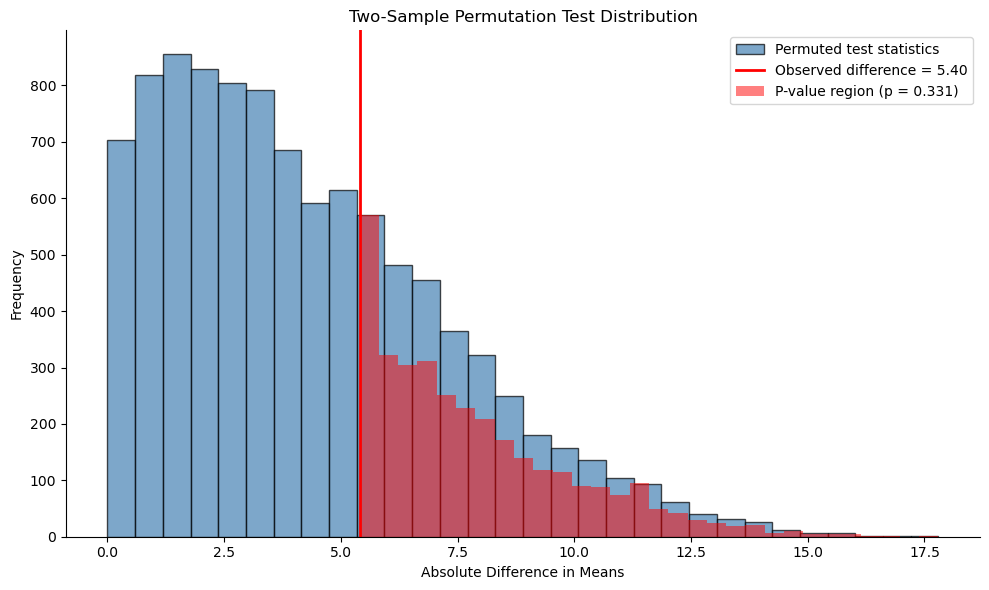

# 이표본 순열검정


## 개요

이표본 순열검정은 두 독립표본이 위치(보통 평균)에서 차이가 나는지 검정하는 비모수 방법이다. $t$ 검정과 달리 정규성이나 등분산성을 가정하지 않는다. A/B 검정과 인과추론에서 특히 유용하다.

## 귀무가설

집단 간 차이가 없다는 귀무가설 아래에서

- 관측된 평균차(또는 다른 통계량)는 무작위 변동에 의한 것이다.
- 집단 라벨은 임의적이다. 라벨을 섞으면 관측값만큼 극단적인 통계량이 $p$값에 해당하는 확률로 나타난다.

## 검정 절차

### 알고리즘

1. 실제 자료에서 **관측 검정통계량을 계산한다**.

    $$T_{obs} = |\bar{X}_1 - \bar{X}_2|$$

2. 모든 관측값을 크기 $n_1 + n_2$의 하나의 자료로 **합친다**.

3. **$B$번 순열한다**(보통 $B = 1{,}000$--$10{,}000$).
    - 집단 라벨을 무작위로 섞는다.
    - $n_1$개를 집단 1에, $n_2$개를 집단 2에 무작위로 배정한다.
    - 이 순열에 대해 검정통계량을 계산한다.

4. **$p$값을 계산한다**.

    $$p = \frac{\#\{T_b \ge T_{obs}\} + 1}{B + 1}$$

    분자·분모의 $+1$은 관측된 배열 자신을 세는 것이다. 이것이 검정의 크기를 $\alpha$ 이하로 보장한다([기초](foundations.md) 연습문제 2 참조).

두 웹페이지의 사용자 참여도(세션 시간, 초)를 비교한다.

<div class="exbox" markdown>

**보기 1.** <span class="diff easy" title="쉬움"></span> 웹페이지 A/B 검정. 두 페이지의 체류시간을 각각 $n_1 = n_2 = 10$개 관측해 $T_{\text{obs}} = \lvert \bar x_1 - \bar x_2\rvert = 5.40$을 얻었다. 위 절차대로 $B = 10{,}000$번 순열하고 $p$값을 $\hat p = (c+1)/(B+1)$로 보고한다.

**(1)** 참된 순열 $p$값을 $p$라 할 때 $\hat p$의 기댓값과 표준편차를 $p$와 $B$로 적으시오. $+1$ 보정이 가져오는 **치우침의 방향과 크기**는 얼마이며, 몬테카를로 요동에 견주어 언제 무시할 수 있는가.

**(2)** $\binom{20}{10} = 184{,}756$가지를 모두 열거해 $p$를 정확히 구하고, (1)의 예측과 실행 결과를 견주시오. 귀무분포 히스토그램의 중심 $E[T]$도 미리 예측하고 확인하시오.

</div>

??? success "풀이"

    **(1) 해석적으로.** $B$번의 순열을 서로 독립으로 뽑으므로 극단적인 횟수 $c$는 이항분포를 따른다. 곧 $c \sim \text{Binomial}(B, p)$이고

    $$
    E[\hat p] = \frac{Bp + 1}{B + 1} = p + \frac{1-p}{B+1},
    \qquad
    \operatorname{SD}(\hat p) = \frac{\sqrt{B p(1-p)}}{B+1} \approx \sqrt{\frac{p(1-p)}{B}}
    $$

    이다. **치우침은 늘 위쪽이고 크기가 $\dfrac{1-p}{B+1}$다.** 보수적인 쪽으로만 틀리므로 검정의 크기를 지키는 데 해롭지 않다. 치우침은 $B$에 **반비례**해 줄고 요동은 $\sqrt B$에 반비례해 주므로, 둘의 비가

    $$
    \frac{\text{치우침}}{\operatorname{SD}(\hat p)}
    \approx \frac{(1-p)/B}{\sqrt{p(1-p)/B}}
    = \sqrt{\frac{1-p}{pB}}
    $$

    이다. **$pB$가 크면 치우침은 요동에 묻히고, 작으면 묻히지 않는다.** 뒤에 볼 $p \approx 0.326$과 $B = 10{,}000$에서는 $\sqrt{0.674/3256} = 0.0144$로 요동의 $1.4\%$에 지나지 않는다. 그러나 $p = 0.001$, $B = 10{,}000$이면 $pB = 10$이어서 비가 $\sqrt{0.999/10} = 0.32$로 $32\%$가 되고, 연습문제 2에서 보듯 $B = 200$까지 내려가면 치우침이 $p$ 자체를 세 배로 부풀린다.

    **$E[T]$의 예측.** $T = \lvert d^{*}\rvert$이고 $d^{*} = \bar X_1^{*} - \bar X_2^{*}$는 [기초](foundations.md) 보기 1에서 본 대로 평균 $0$, 표준편차

    $$
    \operatorname{SD}(d^{*}) = S\sqrt{\frac{1}{n_1} + \frac{1}{n_2}} = 5.227257
    $$

    를 갖는다($S$는 합친 $20$개의 표본표준편차). $d^{*}$가 정규라면 반정규분포의 평균이 되어

    $$
    E[T] = \operatorname{SD}(d^{*})\sqrt{\frac{2}{\pi}} = 5.227257 \times 0.797885 = 4.170747
    $$

    이다. **이것은 근사다.** $N = 20$짜리 열거분포는 정확히 정규가 아니므로 뒤에서 어긋남의 크기를 재어 본다.

    **(2) 수치적으로.** 먼저 자료와 관측된 차이다.

    ```python
    import numpy as np
    import matplotlib.pyplot as plt

    # A 페이지와 B 페이지의 체류시간
    page_a = np.array([185, 188, 142, 160, 161, 157, 182, 181, 159, 167])
    page_b = np.array([173, 181, 182, 170, 169, 177, 168, 183, 169, 164])

    obs_diff = np.abs(page_a.mean() - page_b.mean())
    print(f"Page A: mean = {page_a.mean():.2f}")    # 168.20
    print(f"Page B: mean = {page_b.mean():.2f}")    # 173.60
    print(f"Observed |difference|: {obs_diff:.2f}") # 5.40
    ```

    출력:

    ```
    Page A: mean = 168.20
    Page B: mean = 173.60
    Observed |difference|: 5.40
    ```

    순열검정 자체다.

    ```python
    def two_sample_permutation_test(x, y, n_perms=1000, seed=0):
        """
        Two-sample permutation test for a difference in means.

        Parameters
        ----------
        x, y : array-like
            The two samples.
        n_perms : int
            Number of random permutations.

        Returns
        -------
        p_value : float
            Two-sided p-value, with the +1 correction.
        perm_diffs : ndarray
            The permutation distribution of |mean difference|.
        """
        rng = np.random.default_rng(seed)
        obs_diff = np.abs(x.mean() - y.mean())
        pooled = np.concatenate([x, y])
        nx = len(x)

        perm_diffs = np.empty(n_perms)
        for i in range(n_perms):
            p = rng.permutation(pooled)
            perm_diffs[i] = np.abs(p[:nx].mean() - p[nx:].mean())

        p_value = ((perm_diffs >= obs_diff).sum() + 1) / (n_perms + 1)
        return p_value, perm_diffs

    p_val, perm_stats = two_sample_permutation_test(page_a, page_b, n_perms=10000)

    print(f"Permutation test p-value: {p_val:.4f}")
    print(f"Conclusion: {'Reject H0' if p_val < 0.05 else 'Fail to reject H0'}")
    ```

    출력:

    ```
    Permutation test p-value: 0.3307
    Conclusion: Fail to reject H0
    ```

    이제 열거로 정확값을 얻고 (1)의 예측과 맞춰 본다. 위 블록의 변수를 그대로 이어 쓴다.

    ```python
    import itertools
    from scipy import stats

    z = np.concatenate([page_a, page_b]).astype(float)
    n1, N, total = len(page_a), len(z), float(np.sum(page_a) + np.sum(page_b))

    # 가능한 라벨 배정 184,756 가지를 모두 열거한다. d* 는 부호까지 담는다.
    signed = np.array([(2 * z[list(c)].sum() - total) / n1
                       for c in itertools.combinations(range(N), n1)])
    exact = np.abs(signed)
    p_exact = (exact >= obs_diff - 1e-9).mean()
    print(f"순열 수 = {len(signed)},  정확 p = {p_exact:.6f}")

    B = 10_000
    mean_hat = (B * p_exact + 1) / (B + 1)
    bias = (1 - p_exact) / (B + 1)
    sd = np.sqrt(B * p_exact * (1 - p_exact)) / (B + 1)
    print(f"E[p-hat] = {mean_hat:.6f}   (치우침 +{bias:.3e},  SD {sd:.6f},"
          f"  치우침/SD = {bias / sd:.4f})")
    print(f"실행값   = {p_val:.6f}   -> 예측에서 {(p_val - mean_hat) / sd:+.2f} SD")

    sd_null = z.std(ddof=1) * np.sqrt(1 / n1 + 1 / (N - n1))
    print(f"\nSD(d*) 닫힌 꼴      = {sd_null:.6f}")
    print(f"열거한 d* 의 SD     = {signed.std(ddof=0):.6f}"
          f"   (왜도 {stats.skew(signed):.1e}, 초과첨도 {stats.kurtosis(signed):+.4f})")
    print(f"E[T] 반정규 예측    = {sd_null * np.sqrt(2 / np.pi):.6f}")
    print(f"E[T] 정확 열거      = {exact.mean():.6f}   (SD 의 {exact.mean() / sd_null:.6f} 배)")
    print(f"E[T] 모의 (B=10000) = {perm_stats.mean():.6f}"
          f"   (평균의 몬테카를로 오차 {perm_stats.std(ddof=1) / np.sqrt(B):.6f})")
    ```

    출력:

    ```
    순열 수 = 184756,  정확 p = 0.325586
    E[p-hat] = 0.325654   (치우침 +6.743e-05,  SD 0.004685,  치우침/SD = 0.0144)
    실행값   = 0.330667   -> 예측에서 +1.07 SD

    SD(d*) 닫힌 꼴      = 5.227257
    열거한 d* 의 SD     = 5.227257   (왜도 -8.2e-17, 초과첨도 -0.3076)
    E[T] 반정규 예측    = 4.170747
    E[T] 정확 열거      = 4.234476   (SD 의 0.810076 배)
    E[T] 모의 (B=10000) = 4.262900   (평균의 몬테카를로 오차 0.030767)
    ```

    **$p$값에 대한 예측이 맞는다.** 정확값은 $p = 0.325586$이고, $(1)$이 예측한 $\hat p$의 평균은 $0.325654$, 표준편차는 $0.004685$다. 실행값 $0.330667$은 그 평균에서 $+1.07$ 표준편차 떨어져 있다. 치우침 $6.743\times10^{-5}$은 요동의 $1.44\%$로, 예측한 $\sqrt{(1-p)/(pB)} = 0.0144$ 그대로다. **$B = 10{,}000$에서 $+1$ 보정의 대가는 사실상 없다.**

    **$E[T]$의 예측은 반쯤 맞는다.** 닫힌 꼴 $5.227257$은 열거분포의 표준편차와 **열다섯 자리까지** 같다. 왜도도 $-8\times10^{-17}$로 $0$인데, 라벨을 뒤집으면 $d^{*}$의 부호가 바뀌어 모든 배정이 짝을 이루기 때문이다. 그러나 반정규 예측 $4.170747$은 정확값 $4.234476$보다 $1.5\%$ 작다. 까닭은 열거분포의 **초과첨도가 $-0.3076$**이어서 정규보다 꼬리가 가볍고 어깨가 두껍기 때문이다. 대칭분포에서 $E\lvert X\rvert/\operatorname{SD}(X)$는 꼬리가 가벼워질수록 커지며, 여기서는 정규의 $0.797885$ 대신 $0.810076$이 나온다. **표준편차는 분포의 모양과 무관하게 정확히 맞고, 절댓값의 평균은 모양에 기대므로 정규근사만큼만 맞는다.**

    모의값 $4.262900$은 정확값에서 $+0.028$ 떨어져 있고 평균의 몬테카를로 오차 $0.030767$의 $0.92$배다. 셋이 모두 제자리에 있다.

    아래는 그 귀무분포다.

    ```python
    fig, ax = plt.subplots(figsize=(10, 6))

    ax.hist(perm_stats, bins=30, alpha=0.7, color='steelblue', edgecolor='black',
            label='Permuted test statistics')

    obs_stat = np.abs(page_a.mean() - page_b.mean())
    ax.axvline(obs_stat, color='red', linewidth=2,
               label=f'Observed difference = {obs_stat:.2f}')

    rejection_region = perm_stats[perm_stats >= obs_stat]
    ax.hist(rejection_region, bins=30, alpha=0.5, color='red',
            label=f'P-value region (p = {p_val:.3f})')

    ax.set_xlabel('Absolute Difference in Means')
    ax.set_ylabel('Frequency')
    ax.set_title('Two-Sample Permutation Test Distribution')
    ax.legend()
    ax.spines['top'].set_visible(False)
    ax.spines['right'].set_visible(False)

    plt.tight_layout()
    plt.show()
    ```

    

    붉은 세로선 $5.40$이 분포의 중심 $4.23$ 바로 오른쪽에 서 있고 붉게 칠한 꼬리가 전체의 삼분의 일이다. **눈으로 보아도 기각할 자료가 아니다.**

!!! warning "합친 배열을 제자리에서 섞지 말 것"
    `np.random.shuffle(pooled)`처럼 **제자리 섞기**를 쓰면 `pooled`가 매 반복마다 바뀐다. 이 코드처럼 순열 결과를 새 배열로 받으면(`rng.permutation`) 원본이 보존되어 디버깅이 쉽다.

    관측 통계량을 순열 루프 **이전에** 계산하는 것도 중요하다. 루프 안에서 원본이 이미 섞여버린 뒤에 계산하면 조용히 틀린 답이 나온다.

이진 결과(전환 = 1, 비전환 = 0)에서도 순열검정은 똑같이 작동한다.

<div class="exbox" markdown>

**보기 2.** <span class="diff easy" title="쉬움"></span> A/B 전환율 검정. 대조군 $23{,}739$명 중 $200$명, 실험군 $22{,}588$명 중 $182$명이 전환해 비율차 $-0.000368$을 얻었다. 순열 귀무분포의 표준편차가 $\operatorname{SD}(d^{*}) = 0.00084056$임은 [기초](foundations.md) 보기 2에서 유도했다.

**(1)** 이 실험이 $\alpha = 0.05$ 양측에서 **유의하다고 부를 수 있는 가장 작은 비율차**를 구하고, 그것이 기저 전환율 $\bar p = 0.00825$의 몇 %인지 말하시오. 관측된 차이는 그 문턱의 몇 배인가.

**(2)** $B = 5{,}000$으로 $\hat p = (c+1)/(B+1)$을 구하시오. 정확 순열 $p$값은 초기하분포로 $0.681128$이다. 실행값과의 차이를 보기 1 (1)의 **치우침**과 **요동**으로 가르시오.

</div>

??? success "풀이"

    **(1) 해석적으로.** 귀무분포가 평균 $0$, 표준편차 $\sigma_0 = 0.00084056$인 거의 정규인 분포이므로, 양측 $\alpha = 0.05$에서 기각되는 것은

    $$
    \lvert d_{\text{obs}}\rvert \ge z_{0.975}\,\sigma_0 = 1.959964 \times 0.00084056 = 0.00164747
    $$

    일 때다. 이 문턱을 기저 전환율로 나누면

    $$
    \frac{0.00164747}{0.00824573} = 0.1998
    $$

    이다. **곧 이 실험은 전환율이 상대적으로 $20\%$ 움직여야 겨우 유의해진다.** 관측된 $0.000368$은 문턱의 $0.223$배에 지나지 않으므로, 어떤 $p$값이 나오든 기각과는 거리가 멀다.

    이것은 "유의해지는 최소 효과"이지 "검정력 있게 잡아내는 최소 효과"가 아니다. 참 효과가 정확히 문턱만 하면 기각할 확률이 $50\%$뿐이다. 검정력 $80\%$를 요구하면 $z_{0.975} + z_{0.80} = 2.801585$를 곱해야 하므로 문턱이 $1.43$배인 $0.0023549$, 상대적으로 $28.6\%$가 된다.

    $\sigma_0 \propto \sqrt{1/n_T + 1/n_C}$이므로 **문턱은 표본크기의 제곱근에 반비례한다.** 상대 $10\%$ 변화를 잡으려면 지금의 네 배, 곧 집단마다 $9$만 명이 필요하다. $4.6$만 명이라는 큰 자료가 $0.8\%$짜리 희귀사건 앞에서는 결코 크지 않다는 뜻이다.

    **(2) 해석적으로.** 보기 1 (1)에서

    $$
    E[\hat p] = p + \frac{1-p}{B+1},
    \qquad
    \operatorname{SD}(\hat p) = \frac{\sqrt{Bp(1-p)}}{B+1}
    $$

    이었다. $p = 0.681128$, $B = 5{,}000$을 넣으면 치우침이 $+6.376\times10^{-5}$, 표준편차가 $0.006589$다. **치우침이 요동의 $1\%$도 되지 않으므로 차이는 거의 전부 요동일 것이다.**

    **수치적으로.**

    ```python
    import numpy as np
    rng = np.random.default_rng(0)

    # 대조군: 23,739명 중 200명 전환
    # 실험군: 22,588명 중 182명 전환
    n_control, conv_control = 23739, 200
    n_treatment, conv_treat = 22588, 182

    rate_control = conv_control / n_control
    rate_treatment = conv_treat / n_treatment
    obs_diff_rates = rate_treatment - rate_control

    print(f"Control conversion rate:   {rate_control:.4f}")     # 0.0084
    print(f"Treatment conversion rate: {rate_treatment:.4f}")   # 0.0081
    print(f"Observed difference: {obs_diff_rates:.6f}")         # -0.000368

    # 이진 반응벡터. 앞의 (대조군 전환 + 실험군 전환) 개가 1 이다
    binary_response = np.zeros(n_control + n_treatment)
    binary_response[:conv_control + conv_treat] = 1

    B = 5000
    perm_diffs = np.empty(B)
    for b in range(B):
        p = rng.permutation(binary_response)
        perm_diffs[b] = p[:n_treatment].mean() - p[n_treatment:].mean()

    p_value_ab = ((np.abs(perm_diffs) >= abs(obs_diff_rates)).sum() + 1) / (B + 1)
    print(f"A/B test p-value: {p_value_ab:.4f}")   # 0.68
    ```

    출력:

    ```
    Control conversion rate:   0.0084
    Treatment conversion rate: 0.0081
    Observed difference: -0.000368
    A/B test p-value: 0.6785
    ```

    두 물음의 수를 모두 확인한다. 위 블록의 변수를 그대로 이어 쓴다.

    ```python
    from scipy import stats

    N = n_control + n_treatment
    K = conv_control + conv_treat
    pbar = K / N
    step = 1 / n_treatment + 1 / n_control
    sd_null = np.sqrt(N / (N - 1) * pbar * (1 - pbar) * step)

    mde = stats.norm.ppf(0.975) * sd_null
    print(f"SD(d*)        = {sd_null:.8f}")
    print(f"탐지 가능한 최소 |차| = {mde:.8f}"
          f"   (기저 전환율의 {100 * mde / pbar:.2f}%)")
    print(f"관측 |차| / 문턱      = {abs(obs_diff_rates) / mde:.4f}")

    # 정확 순열 p. 실험군 전환 수가 Hypergeometric(N, K, n_treatment) 을 따른다.
    x = np.arange(K + 1)
    d = x * step - K / n_control
    pmf = stats.hypergeom.pmf(x, N, K, n_treatment)
    p_exact = pmf[np.abs(d) >= abs(obs_diff_rates) - 1e-18].sum()

    mean_hat = (B * p_exact + 1) / (B + 1)
    bias = (1 - p_exact) / (B + 1)
    sd = np.sqrt(B * p_exact * (1 - p_exact)) / (B + 1)
    print(f"\n정확 순열 p   = {p_exact:.6f}")
    print(f"E[p-hat]      = {mean_hat:.6f}   (치우침 +{bias:.3e},  SD {sd:.6f},"
          f"  치우침/SD = {bias / sd:.4f})")
    print(f"실행값        = {p_value_ab:.6f}   -> 예측에서 {(p_value_ab - mean_hat) / sd:+.2f} SD")
    ```

    출력:

    ```
    SD(d*)        = 0.00084056
    탐지 가능한 최소 |차| = 0.00164747   (기저 전환율의 19.98%)
    관측 |차| / 문턱      = 0.2231

    정확 순열 p   = 0.681128
    E[p-hat]      = 0.681192   (치우침 +6.376e-05,  SD 0.006589,  치우침/SD = 0.0097)
    실행값        = 0.678464   -> 예측에서 -0.41 SD
    ```

    **(1)의 두 수가 맞는다.** 문턱이 $0.00164747$로 기저 전환율의 $19.98\%$이고, 관측된 차이는 그 $0.2231$배다.

    **(2)의 분해도 맞는다.** 실행값 $0.678464$는 정확값 $0.681128$보다 $0.002664$ 작다. 치우침은 $+6.376\times10^{-5}$로 **방향이 반대이고 크기도 요동의 $0.97\%$**이므로, 차이는 전부 몬테카를로 요동이다. 실제로 예측 평균에서 $-0.41$ 표준편차 떨어져 있다. **$B$를 키우면 $0.6811$로 모여든다.**

    여기서 한 가지가 분명해진다. 이 자료에서 순열 $p$값의 불확실성 $\pm 0.0066$은 **결론과 아무 상관이 없다.** $0.678$이든 $0.681$이든 기각하지 않는다. $B$를 키워 얻는 것은 $p$값의 소수점 자리일 뿐이고, 정작 부족한 것은 (1)이 보인 대로 **표본크기**다.

!!! tip "이진 자료에서는 재표집이 필요 없다"
    이 상황의 순열분포는 **초기하분포**로 정확히 알려져 있다. 즉 이 순열검정은 Fisher 정확검정과 같은 것이며, `stats.fisher_exact`가 근사 없이 $p = 0.6811$을 곧바로 준다. 자세한 계산은 [기초](foundations.md) 연습문제 4에 있다.

## 모수적 검정과의 비교

### 이표본 순열검정 대 t 검정

두 검정은 같은 가설을 다루지만 접근이 다르다.

| 측면 | 순열검정 | $t$ 검정 |
|---|---|---|
| **가정** | 교환가능성 | 정규성 또는 큰 $n$ |
| **이분산** | 표본크기가 같으면 자동 처리, 다르면 스튜던트화 필요 | Welch 보정 필요 |
| **직관** | 무작위화에 근거 | 확률이론에 근거 |
| **$p$값 정밀도** | 순열 수에 제한됨 | 연속적(정확) |
| **검정력** | 가정이 성립하면 사실상 동일 | 사실상 동일 |
| **계산비용** | 높음 | 무시할 수준 |

!!! note "'순열검정은 검정력이 낮다'는 오해"
    평균차 통계량을 쓰는 한 순열검정과 $t$ 검정의 검정력 차이는 몬테카를로 오차 수준이다([기초](foundations.md) 연습문제 3). 순열검정의 대가는 검정력이 아니라 계산 시간이다.

    반대로 이분산과 불균형 표본이 겹치면 **순열검정이 $t$ 검정보다 나쁠 수 있다**. 이때는 스튜던트화 통계량을 써야 한다.

### 결과 비교

<div class="exbox" markdown>

**보기 3.** <span class="diff easy" title="쉬움"></span> 순열검정과 $t$ 검정 견주기. 보기 1의 체류시간 자료를 그대로 쓴다. 합친 표본의 분산 $S^2$은 라벨을 어떻게 바꾸어도 변하지 않는다는 데서 출발한다.

**(1)** 어떤 라벨 배정에서든 $(N-1)S^2 = (N - 2 + t^{*2})\,s_p^{*2}$임을 보이시오($s_p^{*2}$는 그 배정의 합동분산, $t^{*}$는 합동 $t$ 통계량). 이것으로 $\lvert d^{*}\rvert$로 매긴 순위와 $\lvert t^{*}\rvert$로 매긴 순위가 **완전히 같음**을 보이고, 두 통계량의 순열 $p$값이 어떻게 되는지 말하시오. 또 순열 귀무분포의 표준편차와 $t$ 검정 표준오차의 비를 $N$과 $t_{\text{obs}}$로 적으시오.

**(2)** 실행해 (1)을 확인하시오. 그럼에도 순열 $p$값과 Welch $t$ 검정의 $p$값이 다른 **진짜 까닭**은 무엇인가.

</div>

??? success "풀이"

    **(1) 해석적으로.** 어떤 라벨 배정을 잡아도 $N = n_1 + n_2$개의 수 전체는 그대로이므로 **총제곱합**

    $$
    \text{SST} = \sum_{i=1}^N (x_i - \bar x)^2 = (N-1)S^2
    $$

    이 상수다. 한편 두 집단으로 가르면 총제곱합이 집단내와 집단간으로 쪼개진다.

    $$
    \text{SST} = \underbrace{(N-2)\,s_p^{*2}}_{\text{집단내}} \;+\; \underbrace{\frac{n_1 n_2}{N}\,d^{*2}}_{\text{집단간}}
    $$

    집단간 항을 $t^{*}$로 고쳐 쓴다. $t^{*} = d^{*}\big/\sqrt{s_p^{*2}(1/n_1 + 1/n_2)}$이고 $\dfrac{1}{1/n_1 + 1/n_2} = \dfrac{n_1 n_2}{N}$이므로 $\dfrac{n_1 n_2}{N}d^{*2} = t^{*2} s_p^{*2}$다. 따라서

    $$
    (N-1)S^2 = (N - 2 + t^{*2})\,s_p^{*2}
    $$

    **왼쪽이 상수라는 것이 전부다.** 이 식을 $s_p^{*2}$에 대해 풀어 $d^{*2} = t^{*2}s_p^{*2}(1/n_1+1/n_2)$에 넣으면

    $$
    d^{*2} = (N-1)S^2\left(\frac{1}{n_1}+\frac{1}{n_2}\right)\cdot\frac{t^{*2}}{N-2+t^{*2}}
    $$

    인데, $u \mapsto \dfrac{u}{N-2+u}$가 $u > 0$에서 **순증가**하므로 $\lvert d^{*}\rvert$와 $\lvert t^{*}\rvert$는 서로의 순증가함수다. 그러므로 $\lvert d^{*}\rvert \ge \lvert d_{\text{obs}}\rvert$인 배정과 $\lvert t^{*}\rvert \ge \lvert t_{\text{obs}}\rvert$인 배정이 **같은 집합**이고,

    $$
    p_{\text{perm}}(\lvert d\rvert) = p_{\text{perm}}(\lvert t\rvert)
    $$

    이다. **평균차로 순열검정을 하든 합동 $t$ 통계량으로 하든 $p$값이 한 글자도 다르지 않다.** 표준화할지 말지를 고민할 필요가 없다는 뜻이다. (등분산이 깨지면 이야기가 달라진다. 그때 쓰는 것은 합동분산이 아니라 **Welch 식 스튜던트화**이고, 그것은 $\lvert d^{*}\rvert$의 순증가함수가 아니다. [기초](foundations.md) 연습문제 1이 그 경우다.)

    관측된 배정에 같은 항등식을 쓰면 두 척도의 비도 나온다. $\operatorname{SD}(d^{*}) = S\sqrt{1/n_1+1/n_2}$이고 $t$ 검정의 표준오차는 $s_p\sqrt{1/n_1+1/n_2}$이므로

    $$
    \frac{\operatorname{SD}(d^{*})}{\operatorname{SE}_t} = \frac{S}{s_p}
    = \sqrt{\frac{N-2+t_{\text{obs}}^2}{N-1}}
    $$

    이다. **$\lvert t_{\text{obs}}\rvert > 1$이면 순열 쪽 눈금이 더 넓고, $\lvert t_{\text{obs}}\rvert < 1$이면 더 좁다.** 관측된 효과가 자기 자신의 귀무분포를 넓히기 때문이다. 이 자료는 $t_{\text{obs}} = -1.034980$이라 비가 $\sqrt{(18 + 1.07118)/19} = 1.001872$로 $0.19\%$ 넓다.

    **(2) 수치적으로.** 먼저 쪽의 비교다. 보기 1의 변수를 그대로 이어 쓴다.

    ```python
    from scipy import stats

    # 앞의 순열검정 결과를 Welch t 검정과 견준다. 자료가 정규에 가깝고
    # 표본이 넉넉하면 두 p-값이 거의 같게 나온다. 순열검정이 t 검정을
    # 대신하는 것이 아니라, 가정이 미덥지 않을 때 기댈 곳이 된다는 뜻이다.
    t_stat, p_ttest = stats.ttest_ind(page_a, page_b, equal_var=False)
    print(f"Welch's t-test p-value: {p_ttest:.4f}")
    print(f"Permutation test p-value: {p_val:.4f}")
    ```

    출력:

    ```
    Welch's t-test p-value: 0.3204
    Permutation test p-value: 0.3307
    ```

    이제 (1)의 세 주장을 모두 확인한다.

    ```python
    import itertools
    import numpy as np

    z = np.concatenate([page_a, page_b]).astype(float)
    n1, n2 = len(page_a), len(page_b)
    N, T, Q = n1 + n2, z.sum(), (z ** 2).sum()

    t_obs = stats.ttest_ind(page_a, page_b).statistic
    sp2 = ((n1 - 1) * page_a.var(ddof=1) + (n2 - 1) * page_b.var(ddof=1)) / (N - 2)
    S2 = z.var(ddof=1)
    print(f"s_p^2 = {sp2:.6f},   S^2 = {S2:.6f},   t_obs = {t_obs:.6f}")
    print(f"항등식  (N-1)S^2      = {(N - 1) * S2:.6f}")
    print(f"        (N-2+t^2)s_p^2 = {(N - 2 + t_obs ** 2) * sp2:.6f}")
    print(f"SD(d*)/SE_t  예측 = {np.sqrt((N - 2 + t_obs ** 2) / (N - 1)):.8f}")
    print(f"SD(d*)/SE_t  실제 = {np.sqrt(S2 / sp2):.8f}")

    # 모든 배정에서 |d*| 와 |t*| 를 함께 구한다.
    # 둘 다 A 집단의 합 SA 하나로 정해진다.
    SA = np.array([z[list(c)].sum() for c in itertools.combinations(range(N), n1)])
    d = SA / n1 - (T - SA) / n2
    sp2s = (Q - SA ** 2 / n1 - (T - SA) ** 2 / n2) / (N - 2)
    t = d / np.sqrt(sp2s * (1 / n1 + 1 / n2))

    obs_d = abs(page_a.mean() - page_b.mean())
    print(f"\n정확 순열 p (|d*| 기준) = {(np.abs(d) >= obs_d - 1e-9).mean():.6f}")
    print(f"정확 순열 p (|t*| 기준) = {(np.abs(t) >= abs(t_obs) - 1e-9).mean():.6f}")
    order = np.argsort(np.abs(d))
    print(f"|t*| 가 |d*| 의 증가함수인가: "
          f"{bool(np.all(np.diff(np.abs(t)[order]) >= -1e-9))}")
    print(f"두 기준이 고르는 배정 집합이 같은가: "
          f"{np.array_equal(np.abs(d) >= obs_d - 1e-9, np.abs(t) >= abs(t_obs) - 1e-9)}")

    w = stats.ttest_ind(page_a, page_b, equal_var=False)
    print(f"\nWelch  t 검정 p = {w.pvalue:.6f}   (df = {w.df:.4f},  SE = "
          f"{np.sqrt(page_a.var(ddof=1) / n1 + page_b.var(ddof=1) / n2):.6f})")
    print(f"합동   t 검정 p = {stats.ttest_ind(page_a, page_b).pvalue:.6f}"
          f"   (df = {N - 2},  SE = {np.sqrt(sp2 * (1 / n1 + 1 / n2)):.6f})")
    print(f"순열   (B=10000) = {p_val:.6f}   (귀무분포 SD = {np.sqrt(S2 * (1 / n1 + 1 / n2)):.6f})")
    ```

    출력:

    ```
    s_p^2 = 136.111111,   S^2 = 136.621053,   t_obs = -1.034980
    항등식  (N-1)S^2      = 2595.800000
            (N-2+t^2)s_p^2 = 2595.800000
    SD(d*)/SE_t  예측 = 1.00187150
    SD(d*)/SE_t  실제 = 1.00187150

    정확 순열 p (|d*| 기준) = 0.325586
    정확 순열 p (|t*| 기준) = 0.325586
    |t*| 가 |d*| 의 증가함수인가: True
    두 기준이 고르는 배정 집합이 같은가: True

    Welch  t 검정 p = 0.320403   (df = 12.4246,  SE = 5.217492)
    합동   t 검정 p = 0.314384   (df = 18,  SE = 5.217492)
    순열   (B=10000) = 0.330667   (귀무분포 SD = 5.227257)
    ```

    **셋 모두 맞는다.** 항등식의 두 변이 $2595.800000$으로 같고, 척도의 비가 예측 $1.00187150$과 여덟 자리까지 일치한다. $184{,}756$가지 배정에서 $\lvert t^{*}\rvert$가 $\lvert d^{*}\rvert$의 증가함수이며 두 기준이 고르는 극단 배정의 집합이 **완전히 같아서** 정확 $p$값이 둘 다 $0.325586$이다.

    **그렇다면 $0.3307$과 $0.3204$의 차이는 어디서 오는가.** 통계량의 차이가 아니다. 이 자료는 $n_1 = n_2$라서 Welch의 표준오차 $5.217492$가 합동 표준오차와 소수점 이하까지 같다. **차이는 전부 참조분포에서 온다.**

    | 검정 | 참조분포 | 표준오차 | $p$값 |
    |:---|:---|---:|---:|
    | 순열 (정확 열거) | $184{,}756$가지의 경험분포 | $5.227257$ | $0.325586$ |
    | 순열 ($B = 10{,}000$) | 그 분포에서 뽑은 $10{,}000$개 | $5.227257$ | $0.330667$ |
    | Welch $t$ | $t_{12.4246}$ | $5.217492$ | $0.320403$ |
    | 합동 $t$ | $t_{18}$ | $5.217492$ | $0.314384$ |

    정확 순열값 $0.325586$에 가장 가까운 모수적 값은 자유도를 깎은 Welch의 $0.320403$이고, 자유도를 다 쓴 합동 $t$의 $0.314384$가 가장 멀다. 두 집단의 분산이 $227.29$ 대 $44.93$으로 다섯 배 갈리는 자료이므로 Welch가 자유도를 $18$에서 $12.42$로 깎은 것이 옳은 쪽이었다. 순열 모의값 $0.330667$이 정확값보다 큰 것은 보기 1에서 본 대로 몬테카를로 요동($+1.07$ 표준편차)이다.

    네 값이 $0.314$--$0.331$ 안에 모두 들어 있다. **어느 쪽을 보고하든 결론이 같고, 그 일치가 바로 가정을 점검한 결과다.** 순열검정이 $t$ 검정을 대신하는 것이 아니라, 가정이 미덥지 않을 때 기댈 곳이 된다는 뜻이다.

## 장점

1. **분포 가정이 없다**: 어떤 자료에도 쓸 수 있다.
2. **직관적이다**: 무작위화 아래의 해석이 직접적이다.
3. **로버스트하다**: 이상값과 비정규성을 자연스럽게 다룬다.
4. **유연하다**: 임의의 검정통계량에 적용된다.

## 단점

1. **계산량**: 모수적 검정보다 무겁다.
2. **이산적인 $p$값**: $p$값이 $1/(B+1)$의 배수이다.
3. **작은 표본**: 표본이 아주 작으면 $p$값의 눈금이 거칠다. 예를 들어 각 집단 4개면 가능한 순열이 $\binom{8}{4} = 70$가지뿐이므로 최소 $p$값이 $2/70 = 0.029$이다.

## 언제 쓰는가

- **항상 타당하다**: 작은 표본, 비정규 자료, 알 수 없는 분포
- **A/B 검정**: 업계의 표준적 접근
- **로버스트성 점검**: 모수적 결과와 비교
- **비표준 통계량**: 중앙값, 절사평균 등 특이한 통계량이 필요할 때

## 단측검정과 양측검정

### 양측검정 (기본)

$$
p = \frac{\#\{|T_b| \ge |T_{obs}|\} + 1}{B + 1}
$$

$H_a: \mu_1 \neq \mu_2$를 검정한다.

### 단측검정

$H_a: \mu_1 > \mu_2$에 대해

$$
p = \frac{\#\{T_b \ge T_{obs}\} + 1}{B + 1}
$$

여기서 $T_b = \bar{X}_{1,b} - \bar{X}_{2,b}$로 절댓값을 취하지 않는다.

## 연습문제

<div class="drillbox" markdown>

**연습문제 1.** <span class="diff easy" title="쉬움"></span>
두 표본이 다음과 같다.

- 집단 A: 14.2, 16.8, 13.5, 15.9, 17.3, 12.8, 16.1, 14.7
- 집단 B: 11.3, 13.6, 10.9, 12.4, 14.1, 11.8, 13.2, 12.7

**(a)** 평균차에 대한 이표본 순열검정을 수행하라.

**(b)** **중앙값** 차를 검정통계량으로 하는 순열검정을 수행하라.

**(c)** 두 $p$값을 Welch $t$ 검정과 비교하라.

</div>

??? success "풀이"
    표본이 각 8개뿐이므로 $\binom{16}{8} = 12{,}870$가지 순열을 **전부 열거**할 수 있다. 몬테카를로 근사 없이 정확 $p$값을 얻는다.

    ```python
    import numpy as np, itertools
    from scipy import stats

    A = np.array([14.2, 16.8, 13.5, 15.9, 17.3, 12.8, 16.1, 14.7])
    B = np.array([11.3, 13.6, 10.9, 12.4, 14.1, 11.8, 13.2, 12.7])
    z = np.concatenate([A, B]); n = 8

    obs_mean = A.mean() - B.mean()
    obs_med = np.median(A) - np.median(B)
    print(round(obs_mean, 4), round(obs_med, 4))   # 2.6625  2.75

    dm, dmd = [], []
    for c in itertools.combinations(range(16), n):
        a = z[list(c)]; b = np.delete(z, list(c))
        dm.append(a.mean() - b.mean())
        dmd.append(np.median(a) - np.median(b))
    dm, dmd = np.array(dm), np.array(dmd)

    print("perms:", len(dm))                                    # 12870
    print("mean  :", (np.abs(dm)  >= abs(obs_mean) - 1e-12).mean())
    print("median:", (np.abs(dmd) >= abs(obs_med)  - 1e-12).mean())
    print(stats.ttest_ind(A, B, equal_var=False))
    ```

    출력:

    ```
    2.6625 2.75
    perms: 12870
    mean  : 0.002641802641802642
    median: 0.003108003108003108
    TtestResult(statistic=3.837370691851344, pvalue=0.0022024857203016353, df=12.494270083405828)
    ```

    **(a)–(c) 결과**

    | 검정 | 통계량 | $p$값 |
    |:---|---:|---:|
    | 순열검정(평균차) | $2.6625$ | **0.00264** |
    | 순열검정(중앙값차) | $2.75$ | **0.00311** |
    | Welch $t$ 검정 | $t = 3.837$, $\nu = 12.49$ | **0.00220** |
    | 스튜던트 $t$ 검정 | $t = 3.837$, $\nu = 14$ | 0.00181 |

    세 $p$값이 모두 $0.003$ 부근으로 일치하며 $\alpha = 0.01$에서도 강하게 기각한다.

    **관찰 1: 평균과 중앙값이 거의 같은 답을 준다.** 이 자료는 이상값이 없고 대칭에 가까우므로 두 통계량이 같은 정보를 담는다. 중앙값 쪽이 근소하게 $p$값이 크다($0.00311$ 대 $0.00264$). 이는 정규에 가까운 자료에서 중앙값이 평균보다 효율이 낮다는 사실의 반영이다(점근상대효율 $2/\pi \approx 0.64$).

    **관찰 2: 정확 순열 $p$값이 Welch $t$와 매우 가깝다.** $0.00264$ 대 $0.00220$. 순열검정이 조금 더 보수적인데, 여기에는 이산성이 작용한다. 가능한 $p$값이 $1/12870 = 0.0000777$의 배수뿐이다.

    **관찰 3: 열거가 가능하면 열거하라.** $12{,}870$가지는 현대의 컴퓨터에서 순식간이다. 몬테카를로를 쓰면 $B = 10{,}000$에서도 $p$값의 표준오차가 $\sqrt{0.0026 \times 0.9974/10000} = 0.0005$로, $p$값 자체의 $20$%에 달한다. **작은 표본일수록 정확 열거의 이점이 크다.**

    열거 가능 여부의 기준은 $\binom{n_1+n_2}{n_1}$이다.

    | $n_1 = n_2$ | 순열 수 |
    |---:|---:|
    | 5 | 252 |
    | 8 | 12{,}870 |
    | 10 | 184{,}756 |
    | 12 | 2{,}704{,}156 |
    | 15 | 155{,}117{,}520 |

    각 집단 12개 정도까지는 열거가 현실적이고, 그 이상은 몬테카를로가 낫다.

<div class="drillbox" markdown>

**연습문제 2.** <span class="diff med" title="중간"></span>
순열 개수 $B$가 $p$값에 어떤 영향을 주는지 조사하라. 연습문제 1의 자료에서 $B = 200, 1000, 10000$으로 몬테카를로 순열검정을 각각 $300$번 반복하고, $p$값의 분포를 정확값 $0.00264$와 비교하라.

</div>

??? success "풀이"
    ```python
    import numpy as np
    rng = np.random.default_rng(11)
    A = np.array([14.2, 16.8, 13.5, 15.9, 17.3, 12.8, 16.1, 14.7])
    B = np.array([11.3, 13.6, 10.9, 12.4, 14.1, 11.8, 13.2, 12.7])
    z = np.concatenate([A, B]); n = 8
    obs = abs(A.mean() - B.mean())

    for Bp in (200, 1000, 10000):
        ps = []
        for _ in range(300):
            P = np.array([rng.permutation(z) for _ in range(Bp)])
            d = P[:, :n].mean(1) - P[:, n:].mean(1)
            ps.append(((np.abs(d) >= obs - 1e-12).sum() + 1) / (Bp + 1))
        ps = np.array(ps)
        print(Bp, round(ps.mean(), 5), round(ps.std(), 5),
              round((ps < 0.05).mean(), 3))
    ```

    출력:

    ```
    200 0.00789 0.00401 1.0
    1000 0.00363 0.00155 1.0
    10000 0.00274 0.00051 1.0
    ```

    | $B$ | $\hat{p}$ 평균 | $\hat{p}$ 표준편차 | 최소 가능 $p$값 | $\hat{p} < 0.05$ 비율 |
    |---:|---:|---:|---:|---:|
    | 200 | 0.00789 | 0.00401 | 0.00498 | 1.000 |
    | 1{,}000 | 0.00363 | 0.00155 | 0.00100 | 1.000 |
    | 10{,}000 | 0.00274 | 0.00051 | 0.00010 | 1.000 |
    | 정확값 | **0.00264** | 0 | — | 1.000 |

    **$B$가 작으면 $\hat{p}$가 위쪽으로 편향된다.** $B = 200$에서 평균 $0.00789$로 정확값의 세 배이다.

    이는 오류가 아니라 $+1$ 보정의 구조적 결과이다. $B = 200$일 때 가능한 최소 $p$값이 $1/201 = 0.00498$이므로, 참값 $0.00264$를 **원리적으로 표현할 수 없다**. 편향은 $B$가 커지면서 사라진다($0.00789 \to 0.00363 \to 0.00274$).

    **결론이 바뀌지는 않았다.** $\alpha = 0.05$ 기준으로는 $B = 200$에서도 $300$번 모두 기각한다. $B$가 문제되는 것은 **$p$값 자체를 보고할 때**이다.

    !!! tip "$B$를 얼마로 잡을 것인가"
        판단 기준은 목표하는 유의수준이다.

        - $\alpha = 0.05$ 근처의 결정만 필요하면 $B = 1{,}000$이면 충분하다. $p = 0.05$에서 표준오차가 $\sqrt{0.05 \times 0.95/1000} = 0.0069$이다.
        - **작은 $p$값을 보고**하려면 훨씬 커야 한다. $p \approx 0.001$을 두 자리 유효숫자로 보고하려면 $B \ge 100{,}000$이 필요하다.
        - 다중비교를 하면 요구가 급증한다. Bonferroni 보정으로 $\alpha = 0.05/50 = 0.001$을 쓴다면, $B = 1{,}000$으로는 그 문턱을 넘는 $p$값을 만들 수조차 없다.

        **경험칙:** 보고하려는 가장 작은 $p$값의 역수의 $100$배 정도를 $B$로 잡는다.

<div class="drillbox" markdown>

**연습문제 3.** <span class="diff med" title="중간"></span>
순열검정의 진짜 장점은 어떤 통계량이든 쓸 수 있다는 것이다. 평균차, 중앙값차, $20$% 절사평균차를 통계량으로 하는 순열검정과 Welch $t$ 검정의 검정력을, 정규자료와 오염된 정규자료에서 비교하라.

</div>

??? success "풀이"
    오염 모형은 $90$%가 $N(0,1)$, $10$%가 $N(0,5^2)$이다. 평균은 $0$으로 같지만 꼬리가 훨씬 두껍다.

    ```python
    import numpy as np
    from scipy import stats
    rng = np.random.default_rng(11)

    def perm_p(x, y, stat, Bp=499):
        obs = abs(stat(x) - stat(y))
        z = np.concatenate([x, y]); m = len(x)
        c = 0
        for _ in range(Bp):
            p = rng.permutation(z)
            c += abs(stat(p[:m]) - stat(p[m:])) >= obs - 1e-12
        return (c + 1) / (Bp + 1)

    trim = lambda a: stats.trim_mean(a, 0.2)

    def power(gen, shift, M=800, m=20, n=20):
        r = dict(mean=0, median=0, trim=0, welch=0)
        for _ in range(M):
            x = gen(m) + shift; y = gen(n)
            r['mean']   += perm_p(x, y, np.mean)   < 0.05
            r['median'] += perm_p(x, y, np.median) < 0.05
            r['trim']   += perm_p(x, y, trim)      < 0.05
            r['welch']  += stats.ttest_ind(x, y, equal_var=False).pvalue < 0.05
        return {k: round(v/M, 3) for k, v in r.items()}

    norm = lambda k: rng.normal(0, 1, k)
    def contam(k):
        a = rng.normal(0, 1, k)
        mask = rng.random(k) < 0.1
        a[mask] = rng.normal(0, 5, mask.sum())
        return a

    for name, gen in [("normal", norm), ("contaminated", contam)]:
        for sh in (0.0, 1.0):
            print(name, sh, power(gen, sh))
    ```

    출력:

    ```
    normal 0.0 {'mean': 0.041, 'median': 0.055, 'trim': 0.045, 'welch': 0.039}
    normal 1.0 {'mean': 0.866, 'median': 0.789, 'trim': 0.838, 'welch': 0.87}
    contaminated 0.0 {'mean': 0.056, 'median': 0.056, 'trim': 0.048, 'welch': 0.042}
    contaminated 1.0 {'mean': 0.47, 'median': 0.664, 'trim': 0.712, 'welch': 0.464}
    ```

    **제1종 오류율 (이동 = 0)**

    | 자료 | 평균 | 중앙값 | 절사평균 | Welch $t$ |
    |:---|---:|---:|---:|---:|
    | 정규 | 0.040 | 0.044 | 0.044 | 0.041 |
    | 오염 | 0.048 | 0.048 | 0.045 | 0.041 |

    **네 검정 모두 크기를 지킨다.** 순열검정은 통계량을 무엇으로 바꾸든 제1종 오류율이 보장된다. 이것이 순열검정의 결정적 장점이다. 새로운 통계량의 귀무분포를 이론적으로 유도할 필요가 없다.

    **검정력 (이동 = 1)**

    | 자료 | 평균 | 중앙값 | 절사평균 | Welch $t$ |
    |:---|---:|---:|---:|---:|
    | 정규 | **0.868** | 0.781 | 0.829 | **0.872** |
    | 오염 | 0.480 | 0.679 | **0.718** | 0.475 |

    **정규자료:** 평균이 최선이다($0.868$). 순열검정과 $t$ 검정이 사실상 동일하다($0.868$ 대 $0.872$). 중앙값을 쓰면 $0.087$을 잃는다.

    **오염자료:** 순위가 완전히 뒤집힌다. 평균은 $0.868 \to 0.480$으로 **검정력의 절반 가까이를 잃는다**. 이상값 하나가 평균을 흔들어 신호를 잡음에 묻어버린다.

    절사평균이 $0.718$로 최선이고, 중앙값 $0.679$가 그 다음이다. 평균 대비 **$50$% 개선**이다.

    **절사평균이 두 상황 모두에서 좋은 절충이다.** 정규자료에서 평균 대비 $0.039$만 잃고($0.829$ 대 $0.868$), 오염자료에서 $0.238$을 얻는다($0.718$ 대 $0.480$). 자료의 꼬리를 모를 때의 합리적 기본값이다.

    !!! note "Welch $t$ 검정은 통계량을 바꿀 수 없다"
        표의 마지막 열은 오염자료에서 $0.475$에 갇혀 있다. $t$ 검정은 정의상 평균에 묶여 있기 때문이다.

        "$t$ 검정에서 절사평균을 쓰자"고 하면 곧바로 문제가 생긴다. 절사평균차의 표집분포가 무엇인가? Yuen의 절사 $t$ 검정 같은 특수 이론이 필요하고, 그 자체로 근사이다.

        순열검정에서는 이 문제가 **존재하지 않는다**. 통계량 함수를 바꿔 넣기만 하면 귀무분포가 자동으로 따라온다. 두 상관계수의 차, 두 지니계수의 차, 두 집단의 $90$번째 백분위수의 차 — 무엇이든 같은 방식이다.

---

## 정리하며

이표본 순열검정은 $t$ 검정을 대신하는 강력한 무가정 방법이다. 무작위화 설계가 "처치군 간 차이 없음"이라는 귀무가설을 자연스럽게 만드는 A/B 검정 맥락에서 특히 값지다. 순열분포는 귀무가설 아래에서 집단을 무작위로 섞었을 때 무엇을 기대할지를 직접 보여준다.
